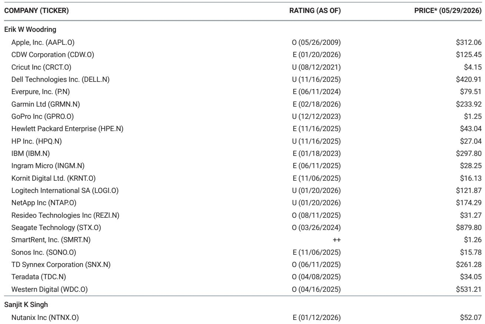
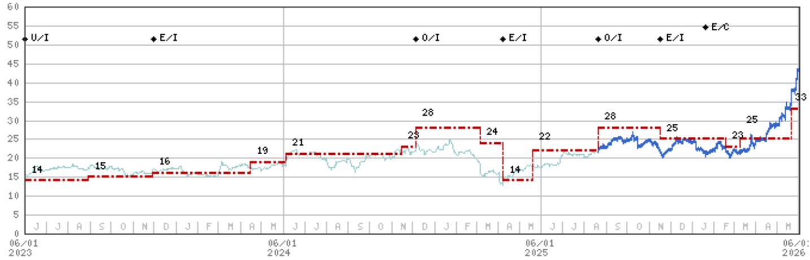

# Hardware Demand is Fracturing: Servers Soar, PCs Stumble, and Memory Becomes the Decisive Competitive Weapon

The most important signal from our recent Taiwan supply chain meetings is not simply that server demand is strong or that PC demand is weakening. It is that the hardware industry is now experiencing a structural divergence in demand trajectories that will separate winners from losers more sharply than at any point in the last decade. Memory inflation is no longer a uniform headwind—it is a competitive moat for those who can manage it and a margin trap for those who cannot. The report's findings challenge the notion that a rising tide lifts all hardware boats. Instead, we are witnessing a market where scale, supplier relationships, and end-market exposure are creating a tiered outcome that demands a far more selective investment approach.

The timing matters because the market is still pricing hardware companies as if they are all subject to the same cyclical forces. They are not. The data from Taiwan reveals a market where enterprise server demand, led disproportionately by Dell, is experiencing a pull-forward of orders so significant that it is distorting normal seasonal patterns. Meanwhile, PC demand is deteriorating in real time, with consumer and SMB weakness accelerating and enterprise pricing power eroding. The memory supply chain, which was previously seen as a universal risk, is now allocating preferentially to the largest and most strategically important OEMs, creating a self-reinforcing advantage for Dell and a compounding disadvantage for HP Inc.

The strategic implication is clear: investors must abandon a sector-level view of hardware and adopt a company-specific framework that weighs memory procurement capability, end-market mix, and exposure to the pull-forward cycle. The report's Taiwan trip provides the granular evidence needed to make that shift.

## The HDD Supply Crisis is Accelerating, and Pricing Power is Entering Uncharted Territory

The most dramatic finding from the trip is that the hard disk drive supply shortage has intensified far beyond what was projected just weeks ago. Three weeks prior to the meetings, the industry expected a 200 exabyte shortfall in 2026 and a 250 exabyte shortfall in 2027. Those estimates have now been revised upward to 300 exabytes in 2026 and 400 exabytes in both 2027 and 2028. This is not a linear extrapolation. It is a step-change in demand driven by AI inference workloads that are generating unprecedented demand for general-purpose server storage.

The pricing implications are staggering. Blended mass-capacity HDD pricing currently sits at approximately $15 per terabyte, or 1.5 cents per gigabyte. The report indicates that HDD vendors are now targeting $25 per terabyte in 2027 and $30 per terabyte in 2028. That represents nearly 100 percent pricing growth point-to-point. Critically, hyperscaler customers are not pushing back. They are simply asking for more supply. Spot market pricing has already reached $30 to $35 per terabyte, and channel pricing for tier-2 CSPs is even higher.

The structural logic here is compelling. HDD supply growth is constrained by the absence of greenfield capacity additions and the pace of HAMR technology adoption. Demand, by contrast, is growing at 40 to 50 percent annually. The report's contacts suggest that HDD vendors could surpass 60 percent gross margins in 2027 and potentially exceed 70 percent in 2028. For a hardware industry accustomed to single-digit margins, this represents a paradigm shift. The key open question is whether Seagate's contract re-pricing in the June to September quarter will fully capture this inflection, and whether Western Digital can execute a similar transition.

## Memory Allocation is Becoming a Strategic Weapon, Not Just a Supply Chain Issue

The report's most counterintuitive insight is that memory supply is actually less of a risk to hardware OEMs than previously feared—but only for some of them. Memory vendors are prioritizing OEMs because they can charge higher prices and achieve better margins than they can with hyperscaler long-term agreements. This means OEMs are getting supply, but at a cost that varies dramatically by company.

Dell is the clear winner. Its long-standing relationships with Samsung, the strength of its senior leadership, and its sheer scale mean it is effectively monetizing its memory relationships. One contact described Dell as being in a position where it can pay higher prices when necessary but still secure the best supply. Lenovo holds the most NAND inventory among the OEMs, which gives it a buffer. HPE is doing okay with procurement from Kioxia and Samsung. HP Inc. is the most challenged, reportedly paying above-market prices and facing the greatest risk of operating margin compression in PCs.

The ranking of lowest to highest cost per bit for NAND is Dell, Lenovo, HPE, and then HP Inc. This ordering is not static. It is a function of relationships, scale, and procurement strategy that will compound over time. The report also notes that memory allocations for hardware OEMs could be smaller in 2027 and 2028 relative to 2026, which creates a perverse incentive for OEMs to maintain or even inflate their 2026 forecasts to secure future allocations. This dynamic introduces a layer of earnings risk that is not captured in consensus estimates.

## Server Demand is Real, but It is Concentrated and Pulled Forward

The server market is the strongest segment in hardware, but the report's findings demand careful interpretation. The large majority of growth is coming from hyperscalers, and the primary beneficiaries are Taiwanese ODMs. The exception is Dell, which is gaining share in enterprise and tier-2 CSP markets. Dell is targeting close to 12,000 AI server racks in its fiscal 2027 and is expected to be an early qualifier for the Vera Rubin platform.

Yet the report also reveals that visibility beyond the next 12 months is limited. The move toward greater L10 standardization in AI server assembly, driven by NVIDIA's Vera Rubin architecture, is a double-edged sword. It could reduce manufacturing time by 50 percent and allow NVIDIA to qualify more suppliers, but it also threatens to commoditize the assembly process and compress margins for both ODMs and OEMs. The timing of this disintermediation risk is uncertain, but the direction is clear.

The pull-forward dynamic is most pronounced in servers. Nearly every OEM has reduced its repricing window from 60-90 days to 0-15 days. Dell is repricing overnight without losing customers. HPE is seeing 20-25 percent quarter-over-quarter server price increases. But the sustainability of this demand is an open question. The report notes that none of the meetings pointed to Agentic AI as a clear near-term tailwind for OEM server demand. Enterprise AI spending is still a future story, concentrated in a few vendors.

## PC Demand is Deteriorating in Real Time, and the Margin Risk is Underappreciated

The contrast between servers and PCs could not be starker. PC demand is softening in real time, with consumer and SMB sales declining double-digit year-over-year in the last four weeks, led by EMEA markets. One PC OEM expressed concerns about up to 20 percent year-over-year volume declines in the second half of 2026. The build pattern is already shifting, with the first half of 2026 now expected to account for 60 percent of full-year notebook builds, compared to the normal 45 percent.

The margin implications are serious. Channel inventory is building, and the risk of discounting in the second half is rising. Higher-end PC sales are relatively strong only because low-end sales have collapsed—margins on low-end PCs have turned negative as memory prices have risen. Enterprises are pushing back on pricing, and even the current level of repricing is not enough to restore former enterprise margins.

The report's contacts see the most significant pull-forward in servers, followed by commercial PCs and then storage. This ordering matters because it suggests that the PC weakness is not just a demand issue—it is a structural margin problem that will persist as long as memory inflation continues. The report's ranking of memory cost competitiveness places HP Inc. at the bottom, which is particularly concerning given its heavy PC exposure.

## What the Report Does Not Fully Answer: The Sustainability of the Pull-Forward and the Agentic AI Timeline

The report provides exceptional granularity on current conditions, but it leaves several critical questions unresolved. The most important is the sustainability of the server pull-forward. Everyone in the supply chain acknowledges that orders are being pulled forward from 2027 and 2028 into 2026, but no one can determine when this dynamic ceases. If the pull-forward is larger than currently estimated, 2027 server demand could face a sharp deceleration that would catch both OEMs and investors off guard.

The second unresolved question is the timeline for Agentic AI to become a material tailwind for enterprise server demand. The report's contacts consistently described it as a future story, with one saying "maybe next year" and another saying "it's not a material tailwind now." The market is currently pricing in a smooth adoption curve for enterprise AI. If that curve proves slower or more lumpy than expected, the valuation premium on server-exposed hardware names could compress.

The third question is the trajectory of memory pricing. The report suggests that memory vendors will continue to prioritize OEMs because of favorable margins, but this dynamic depends on hyperscaler demand remaining strong. If hyperscaler bit demand moderates, memory vendors could shift allocation away from OEMs, exacerbating the supply constraints that OEMs are already facing. The report's contacts are already signaling that 2027 and 2028 allocations could be smaller.

## A Decision Framework for Investors

The report's findings translate into a clear decision framework with three dimensions. First, assess memory procurement capability. The report's ranking of Dell, Lenovo, HPE, and HP Inc. in terms of cost per bit is a starting point, but investors should also evaluate each company's ability to secure supply without locking into unfavorable long-term agreements. Dell's ability to monetize its memory relationships is a structural advantage that is not yet fully reflected in its valuation.

Second, evaluate end-market exposure and pull-forward risk. Companies with heavy enterprise server exposure, particularly Dell, are benefiting from a pull-forward that is boosting near-term results but creating a potential air pocket in 2027. Companies with heavy PC and consumer exposure, particularly HP Inc., face a deteriorating demand environment and margin compression that could persist for several quarters. The report's finding that Dell is also gaining share in general-purpose servers from neoclouds adds a growth vector that is less dependent on the AI cycle.

Third, consider the HDD thematic separately. The HDD supply crisis is creating a pricing environment that is unprecedented in the hardware industry. The report's contacts believe gross margins could exceed 60 percent in 2027 and 70 percent in 2028. This is not a cyclical upswing. It is a structural shortage that will persist until new supply comes online, which is unlikely before the end of the decade. Seagate and Western Digital are the primary beneficiaries, but the report's data suggests that the pricing inflection has further to run.

## The Full Report Contains the Charts and Data That Support This Analysis

The findings summarized here represent only a portion of the insights from the Taiwan trip. The full report includes detailed breakdowns of memory allocation by OEM, pricing trajectory charts for HDDs, and a comprehensive comparison of server build plans across the major vendors. It also contains the proprietary survey data that underpins the pull-forward estimates and the margin projections.

Join the community to read the full report and review the original charts.

*This article is for learning and discussion only and does not constitute investment advice.*

Personal reading notes and learning share only. Not investment advice.

