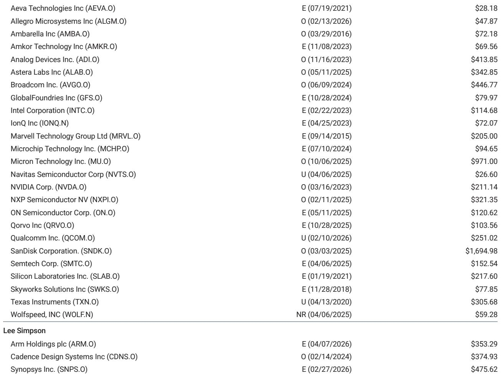
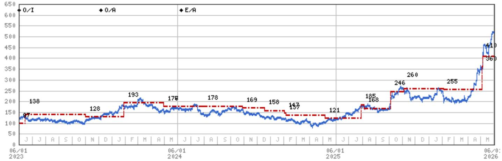
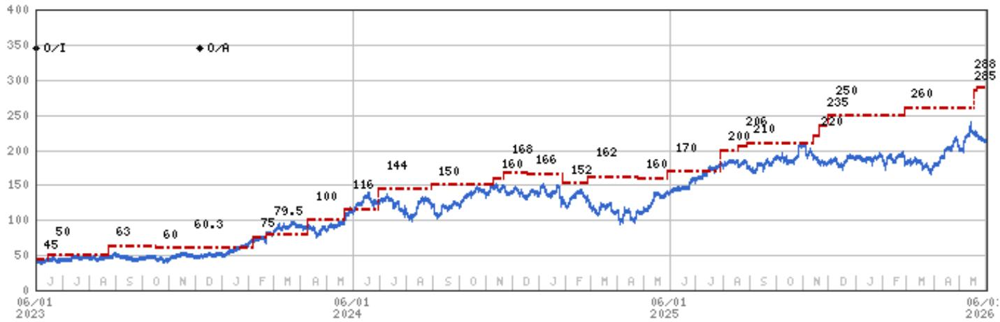

# NVIDIA's Product Cycle Dominance Masks a Deeper Structural Shift in the Semiconductor Landscape

The semiconductor industry is entering a period where the conventional wisdom about market leadership, product cycles, and competitive dynamics is being upended. Based on extensive supply chain meetings in Taiwan, a clear picture emerges: NVIDIA's product roadmap is executing flawlessly, memory shortages are becoming structural rather than cyclical, and the competitive dynamics between CPU vendors are shifting in ways that most investors have not fully priced in. The most important insight from these meetings is not simply that NVIDIA remains dominant—it is that the industry is transitioning from a GPU-centric bottleneck to a multi-layered constraint system where CPU availability, memory supply, and custom ASIC development are all becoming binding constraints simultaneously.

The market has been fixated on whether NVIDIA's Blackwell and Rubin cycles will deliver. The evidence from the supply chain is unequivocal: they will, and on schedule. But the more strategic question is what happens when the primary bottleneck shifts from GPUs to other components, and how the competitive landscape reorganizes around that reality. This report argues that the next twelve months will reveal a semiconductor industry where the winners are not simply those with the best AI accelerators, but those who can navigate a world of persistent shortages across multiple product categories while managing the transition from x86 dominance to a more fragmented CPU architecture landscape.

## NVIDIA's Rubin Ramp Is Proceeding on Schedule, and the Market's Skepticism About Its CPU Revenue Target Is Misplaced

The persistent rumors of a Rubin respin or a slower-than-expected ramp have been thoroughly debunked by supply chain checks across multiple points in the ecosystem. The implementation delay of a few weeks that was previously flagged has had no material impact on silicon ramp, and the product cycle is tracking in line with original schedules. This is not a controversial statement—management has said as much—but the market continues to trade on narrative rather than evidence. The performance of the initial Rubin silicon looks strong, and while first iterations can always be optimized, there are zero indications of the types of rack-level challenges that plagued the Grace Blackwell ramp.

What is more strategically significant is the market's dismissal of NVIDIA's $20 billion CPU revenue target. When management made this claim on the earnings call, skepticism was immediate and widespread, with many assuming the figure included memory or other products. The supply chain data tells a different story. Approximately $10-12 billion of that CPU revenue comes from the head node, which admittedly has an arbitrary price point given that most head node CPUs are sold as part of a bundled card solution. But that still implies $7-10 billion of standalone Grace or Vera revenue this year—a number that was corroborated by multiple contacts who indicated that NVIDIA could generate billions in standalone CPUs from each of its six announced customers.

The strategic implication is profound. NVIDIA is not just an AI accelerator company; it is becoming a merchant CPU supplier at a scale that rivals established players. The limited supply of merchant ARM servers outside of NVIDIA, combined with the proven performance of Grace and Vera, makes NVIDIA an attractive option for customers who need available supply in a constrained market. This is not a temporary phenomenon. It represents a structural shift in the CPU market that will force Intel and AMD to reconsider their competitive positioning.

## Memory Shortages Are Becoming Structural, and the Pricing Power Dynamic Has Fundamentally Changed

The memory bottleneck has been a recurring theme in AI buildouts, but the evidence from Taiwan suggests that this is no longer a cyclical shortage that will resolve with normal capacity additions. Memory remains the key bottleneck to AI infrastructure deployment, and there is absolutely no sense that this points to any sort of equalization. Suppliers feel no urgency to negotiate prices given the very clear upward bias, and most supply chain contacts expect prices to be up 20% or more in the third quarter.

The critical insight here is that long-term agreements are becoming more important as signalling mechanisms than as actual supply guarantees. A multi-year agreement does not provide multi-year assurance in the current environment. The real question is whether customers can secure enough supply to meet their deployment timelines, and the answer increasingly appears to be that they cannot. There are multiple instances of servers being deployed with less than the desired amount of DRAM, which suggests that the memory shortage is more severe than the CPU shortage.

This has second-order implications for the entire AI ecosystem. If memory remains the binding constraint, then the value of GPU compute is partially impaired by the inability to fully utilize it. This creates an opportunity for companies that can offer integrated solutions with better memory management or alternative memory architectures. It also suggests that memory vendors have unprecedented pricing power that may persist longer than the market currently expects.

The differential between DRAM and NAND is worth noting. While both commodities are seeing record shortages, DRAM is a more specific bottleneck, while customers have been able to get ahead of NAND in some cases. NAND also has a much better supply side dynamic given limited capex. This suggests that DRAM-focused memory companies may have more sustained pricing power than their NAND-focused counterparts.

## Intel's Foundry Progress Is Real but Insufficient, and the Server Roadmap Remains the Only Story That Matters

Intel's Panther Lake on 18A represents a genuine proof point for the company's foundry ambitions. Yields are continuing to improve, and while they remain below economic targets, they are at levels considered reliable for notebook chips. This is progress, and it should not be dismissed. However, the longer-term competitive dynamic of Intel's foundry business remains murky at best.

The critical issue is that some of the most important parts of Intel's roadmap are still likely to move to TSMC. Desktop parts are already expected to be fabbed externally, and longer term, the Rapids versions of server parts may also migrate. Coral Rapids for next year is on 18AP, but beyond that, there may still be better performance available from TSMC. This creates a fundamental strategic dilemma: Intel's foundry business cannot succeed if its own products are the ones that need the most advanced nodes, and those products are increasingly looking to external suppliers.

The EMIB opportunities are compelling, but there is still uncertainty from EMIB-T users who are considering TSMC as a plan B given various challenges. This is not a vote of confidence in Intel's foundry execution.

For investors, the most important element of the Intel story remains the server roadmap, not the foundry optionality. The company likely has enough progress to keep the foundry alive, and it has a clear ability to beat-and-raise near term given server CPU shortages. But the longer-term competitive dynamic is concerning. If Intel cannot retain its own server business on its most advanced nodes, the foundry narrative becomes significantly harder to sustain.

## AMD Is Positioned for Share Gains in x86, but the GPU Question Remains Unanswered

AMD's position in the CPU market is strengthening in ways that the market may not fully appreciate. Customers report that AMD has seen like-for-like price increases in server CPUs, but by less than Intel and ARM alternatives. This pricing discipline, combined with strong product performance, positions AMD as a share gainer within the x86 ecosystem.

The Venice product on 2nm will start to ramp in the second half, and while customers say it is expensive, it offers very strong performance. Critically, the 5nm and 7nm products remain very competitive, which means AMD has a multi-node advantage that Intel cannot match in the near term. Most of 2026 supply is already allocated, and visibility is building for next year.

The unanswered question is AMD's data center GPU position. Supply chain confidence in the MI455 is high, but there are no direct reports from customers who have just started to evaluate racks. The launch event in July is expected to bring new customers, but until then, the GPU narrative remains speculative. This is the key variable that will determine whether AMD can close the gap with NVIDIA or remain a CPU-focused company with a marginal GPU business.

## The AVGO-Mediatek Debate Cannot Be Resolved Until Silicon Is in the Field, but the Data Points Favor AVGO Maintaining Dominance

The debate over whether Mediatek can take significant share from AVGO in custom ASICs has become a central point of contention, even within research teams. AVGO has stated its intention to maintain a significant majority share of its ASIC customers over time, and the supply chain data supports this view.

The key insight is that Mediatek's articulated strategy of achieving 15-20% share long term is actually consistent with AVGO maintaining 80%+ share. While Mediatek is making progress, there are potential startup issues that could delay its ramp. More importantly, some of the desired cost savings that Mediatek's approach promises—particularly in commodity purchasing of high bandwidth memory without paying AVGO a pass-through revenue—could be challenging to realize. Open market HBM prices are much higher than AVGO's previously agreed upon contracts, which means the cost advantage may not materialize as expected.

From the current state of readiness, the 80/20 split over the next couple of years feels consistent with the data. But this is a debate that cannot be resolved for certain until the silicon is out and customers have made their purchasing decisions. The competing view from Mediatek's research team, which looks for majority share by 2028, highlights the uncertainty. This is precisely the kind of analytical tension that makes the sector so interesting for investors who are willing to take a view based on supply chain evidence rather than narrative.

## What the Report Does Not Fully Answer: The Second-Order Implications of CPU Shortages on x86 Architecture

The report provides extensive data on CPU shortages and their impact on pricing and allocation, but it does not fully explore the second-order implications for the x86 architecture itself. If CPU vendors raise prices too aggressively, they risk pushing more business outside the x86 ecosystem. This is not a theoretical concern. The report explicitly notes that CPU vendors should be careful about raising prices too much, which implies that the risk of x86 defection is real and potentially significant.

The question that remains unanswered is how much pricing power CPU vendors actually have before customers begin to seriously consider ARM alternatives at scale. NVIDIA's Grace and Vera are already proving that ARM-based server CPUs can compete on performance. If x86 vendors use the current shortage environment to extract maximum pricing, they may accelerate the very architectural transition that threatens their long-term dominance.

This is a strategic question that has no clear answer in the current data. The report provides the evidence of shortages and pricing dynamics, but the reader is left to determine whether the current environment represents a temporary opportunity for x86 vendors or the beginning of a structural decline in their market position.

## A Decision Framework for Investors: Three Questions That Determine the Winners and Losers

For investors trying to navigate this complex landscape, three questions can serve as a decision framework:

First, how sustainable is NVIDIA's CPU revenue? The $20 billion target is being dismissed by the market, but the supply chain data supports it. If NVIDIA can sustain this CPU business beyond the current shortage environment, it becomes a much more diversified semiconductor company than the market currently prices. If the CPU revenue is purely a function of temporary shortages, then NVIDIA's valuation should be adjusted downward once supply normalizes.

Second, will the memory shortage resolve within the next two years? The report suggests that it will not, but the market continues to price memory stocks as if this is a cyclical phenomenon. If memory shortages persist, then memory vendors have structural pricing power that is not fully reflected in current valuations. If the shortage resolves faster than expected, the downside risk is significant.

Third, can AMD translate its CPU share gains into a meaningful GPU business? The MI455 launch in July is the critical catalyst. If AMD can demonstrate that it has a competitive GPU product, the investment thesis for AMD shifts from a CPU share gain story to a dual-threat AI story. If the GPU launch disappoints, AMD remains a CPU company with limited upside in the AI era.

## The Full Report Contains the Charts and Data That Support These Conclusions

The supply chain data that underpins these conclusions is detailed and specific, but it cannot be fully conveyed in a summary format. The original report contains charts on product cycle timelines, memory pricing dynamics, and competitive positioning that are essential for investors who want to make informed decisions.

Join the community to read the full report and review the original charts.

*This article is for learning and discussion only and does not constitute investment advice.*

Personal reading notes and learning share only. Not investment advice.

