# Energy Services & Equipment | North America

# The Offshore Drilling Digest

We see a constructive multi-year setup for offshore, with demand growth amid disciplined supply tightening the market. We expect utilization to rise to mid/high-80% by 2028, pushing dayrates toward 2023 peak levels. Top plays: SLB & HAL. RIG (EW) offers a relatively attractive risk-reward vs peers.

# Key Takeaways

We see offshore rig demand +12% by 2030 (DW: +17% / SW: +10%) with supply \~flat, pushing utilization to \~85%+ and leading-edge dayrates +15-20%.   
We see outsized offshore spending upside in Africa, LatAm ex-Brazil & APAC. In these markets, capex grows +15% YoY in MS '27E & at a +5-10% CAGR in '26-'30.   
Signs of offshore fundamentals tightening: 75Y of YTD DW awards is the highest in \~15Y, contract lead times & duration remain elevated, T-6M DW activity is +7%.   
We assume no incremental supply 2027-30, keeping marketed capacity tight. Cold-stacked high-spec floaters are concentrated among a few disciplined drillers.   
SLB & HAL remain our preferred ways to play the global OFSE upcycle, including offshore strength. RIG (EW) offers a relatively attractive risk-reward vs peers.

# The Extel (formerly II) survey is now open. We would greatly appreciate your support for the MS Energy team:

• Joe Laetsch & Dan Kutz: Oil Services & Equipment   
• Devin McDermott: (1) Integrated Oil, (2) Oil & Gas Exploration & Production   
• Robert Kad: Midstream & Natural Gas

How to vote: Request a ballot (here)

2026 EXTEL

ALL-AMERICA
RESEARCH POLL

26 May – 12 June 2026

We appreciate your support

VOTE HERE

An offshore drilling upcycle? As highlighted previously (see here), we see a constructive multi-year offshore setup, driven by steady demand growth amid disciplined supply. Through 2030, we see rising activity—led by deepwater—with momentum supported by robust tendering, longer contract durations, and early signs of activity inflecting higher. With no meaningful new supply and limited reactivations, we assume marketed capacity remains tight, pushing utilization toward the mid/high-80% range by 2028—levels historically associated with strong pricing. Against this backdrop, we expect a sustained recovery in dayrates, with high-spec rates trending back toward recent 2023 peak levels.

MS & CO. LLC

Joe Laetsch, CFA

Equity Analyst

Joe.Laetsch@morganstanley.com +1 212 761-8804

Daniel Kutz

Equity Analyst

Dan.Kutz@morganstanley.com

Devin McDermott

Equity Analyst and Commodities Strategist

Devin.McDermott@morganstanley.com +1 212 761-1125

Zackary C Warden

Research Associate

Zackary.Warden@morganstanley.com +1 212 761-4164

2026 EXTEL

ALL-AMERICA RESEARCH POLL

May 26 – June, 12 2026

VIEW OUR ANALYSTS >

# ENERGY SERVICES & EQUIPMENT

North America

Industry View

In-Line

# Inside This Report

• Executive Summary   
• Offshore Supply-Demand Forecasts   
- Offshore Macro Drivers   
• Stock Implications – How to Play It   
• MS Fleet & Asset Value Estimates   
- Floater Macro Trends   
- Jackup Macro Trends

MS does and seeks to do business with companies covered in MS. As a result, investors should be aware that the firm may have a conflict of interest that could affect the objectivity of MS. Investors should consider MS as only a single factor in making their investment decision.

For analyst certification and other important disclosures, refer to the Disclosure Section, located at the end of this report.

- Growing demand. Looking out through 2030, we see offshore rig counts rising \~12% (deepwater +17%, shelf +10%) and capex increasing \~11% (deepwater +22%, shelf flat), driven by strong momentum in Africa, LatAm ex-Brazil, and APAC. Our bullish outlook—particularly for deepwater—is supported by the highest YTD floater tendering in \~15 years (\~75 rig years awarded), longer contract duration and lead times signaling tightening markets, and early signs of floater activity inflecting higher.   
- Disciplined supply. We assume no incremental supply in 2027-30—no cold-stacked reactivations or newbuild deliveries—while retirements remain limited following a wave of recent scrapping (particularly floaters), driving tighter marketed capacity. With cold-stacked high-spec floaters concentrated among a few disciplined public drillers, we view the risk of a supply-driven reset as low, reinforcing a constructive, sustainable backdrop for contractors.   
- Higher utilization supports pricing. We expect rising demand combined with disciplined supply to result in very tight offshore drilling market conditions, with high utilization supporting pricing. In our view, marketed rig utilization reaches the mid- to high-80% range by 2028—levels last seen in the early 2010s and historically supportive of robust pricing power. Against this backdrop, we see leading-edge dayrates for high-spec assets recovering toward 2023 peaks within 1–2 years and moving higher thereafter, with 6G+ drillships and semis rising \~20% to \~\$525k and \~\$475k, respectively, by 2028, and high-spec jackups increasing 10–15% to \~\$175k by 2030.

How to Play It: We continue to highlight globally diversified services majors as our preferred way to play the broader OFSE upcycle, including strength in offshore. This includes OW-rated SLB as it has relatively higher offshore O&G capex exposure (\~25% of revs) and Top Pick HAL (\~15% revs). Meanwhile, we note that offshore driller pure-play RIG (EW) does offer a relatively attractive risk-reward outlook vs. our broader coverage (PT upside – RIG: +13% / Covg: +7%); bull:bear skew – RIG: 1.7x / Covg: 1.2x) and a less demanding valuation on EV/asset value vs. history vs. peers (see Exhibit 20 & Exhibit 23), though our roughly in-line estimates vs. consensus keeps us EW for now. Finally, among globally diversified offshore-levered stocks in our coverage, we note that NOV has the most offshore capex exposure (\~40%+ of revs), and while we do see offshore activity upside as a tailwind for NOV earnings, we do not assume any cold stacked rig reactivations or newbuild deliveries in our '27-'30E, which we think keeps NOV stock performance more in line vs. peers.

Exhibit 1: Utilization reaches \~85%+ by '28 in our forecasts, a level that supports strong driller pricing power...   

line

| Year | DW Demand | DW Utilization (RHS) | Shelf Utilization (RHS) | Shelf Utilization (RHS) |
|------|-----------|----------------------|-------------------------|-------------------------|
| '09  | 160       | 200                  | 80                      | 75                      |
| '10  | 170       | 190                  | 80                      | 75                      |
| '11  | 180       | 180                  | 80                      | 75                      |
| '12  | 190       | 170                  | 80                      | 75                      |
| '13  | 200       | 160                  | 80                      | 75                      |
| '14  | 210       | 150                  | 80                      | 75                      |
| '15  | 200       | 140                  | 80                      | 75                      |
| '16  | 190       | 130                  | 80                      | 75                      |
| '17  | 180       | 120                  | 80                      | 75                      |
| '18  | 170       | 110                  | 80                      | 75                      |
| '19  | 160       | 100                  | 80                      | 75                      |
| '20  | 150       | 90                   | 80                      | 75                      |
| '21  | 140       | 80                   | 80                      | 75                      |
| '22  | 130       | 70                   | 80                      | 75                      |
| '23  | 120       | 60                   | 80                      | 75                      |
| '24  | 110       | 50                   | 80                      | 75                      |
| '25  | 100       | 40                   | 80                      | 75                      |
| '26* | 90        | 30                   | 80                      | 75                      |
| '27* | 80        | 20                   | 80                      | 75                      |
| '28* | 70        | 10                   | 80                      | 75                      |
| '29* | 60        | 5                    | 80                      | 75                      |
| '30* | 50        | 3                    | 80                      | 75                      |

Source: Rystad Energy, MS estimates

Exhibit 2: ...Pushing leading-edge dayrates for higher-spec rigs back to recent \~'23 peak levels by \~'27-'28.   
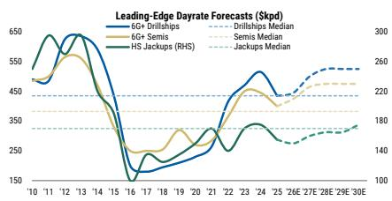

line

| Year | 60+ Drillships | 60+ Semis | 60+ Jackups (RHS) | Drillups Median | 60+ Semis Median | 60+ Jackups Median |
|------|----------------|-----------|-------------------|-----------------|------------------|--------------------|
| '10  | 450            | 450       | 450               | 450             | 450              | 450                |
| '11  | 500            | 500       | 500               | 500             | 500              | 500                |
| '12  | 550            | 550       | 550               | 550             | 550              | 550                |
| '13  | 600            | 600       | 600               | 600             | 600              | 600                |
| '14  | 550            | 550       | 550               | 550             | 550              | 550                |
| '15  | 450            | 450       | 450               | 450             | 450              | 450                |
| '16  | 350            | 350       | 350               | 350             | 350              | 350                |
| '17  | 250            | 250       | 250               | 250             | 250              | 250                |
| '18  | 250            | 250       | 250               | 250             | 250              | 250                |
| '19  | 300            | 300       | 300               | 300             | 300              | 300                |
| '20  | 350            | 350       | 350               | 350             | 350              | 350                |
| '21  | 400            | 400       | 400               | 400             | 400              | 400                |
| '22  | 450            | 450       | 450               | 450             | 450              | 450                |
| '23* | 475            | 475       | 475               | 475             | 475              | 475                |
| '24* | 475            | 475       | 475               | 475             | 475              | 475                |
| '25* | 475            | 475       | 475               | 475             | 475              | 475                |
| '26E*| $260           | $260      | $260              | $260            | $260             | $260               |
| '27E*| $260           | $260      | $260              | $260            | $260             | $260               |
| '28E*| $260           | $260      | $260              | $260            | $260             | $260               |
| '29E*| $260           | $260      | $260              | $260            | $260             | $260               |
| '30E*| $260           | $260      | $260              | $260            | $260             | $260               |

Source: Rystad Energy, MS estimates

# An Offshore Upcycle?

An offshore drilling upcycle? As we previously highlighted (see here), we see a constructive multi-year setup for offshore, driven by steady demand growth amid disciplined supply. Through 2030, we forecast rising rig activity and capex—led by deepwater—with momentum supported by robust tendering, longer contract durations, and early signs of activity inflecting higher. With no meaningful new supply and limited reactivations, marketed capacity remains tight, pushing utilization toward the mid- to high-80% range by 2028—levels historically associated with strong pricing. Against this backdrop, we expect a sustained recovery in dayrates, with high-spec assets trending back toward recent 2023 peak levels.

# Demand

Offshore Drilling Demand & Capex: Offshore deepwater development has been widely viewed as a key upstream growth driver over the next several years—a perspective we previously shared, albeit with the caveat that ongoing efficiency gains could ultimately temper the activity and capex required to sustain required production growth. While we continue to expect drilling efficiencies to improve (e.g., higher feet drilled per rig per day), we now believe this dynamic is increasingly outweighed by a tightening oil macro backdrop. Specifically, stronger demand growth and a heightened strategic focus on supply diversification and reserve building are likely to support more robust offshore activity and capital deployment.

Overall, we see activity growth led by int'l land and offshore deepwater, with offshore rig counts growing +12% by 2030 (deepwater: +17%/shelf: +10%). Similarly, we see capex growth led by the same supply segments (int'l land, offshore deepwater), with overall capex growth through 2030 for offshore +11% (deepwater: +22%/shelf: +0%).

Regionally, we see the most growth in Africa, LatAm ex-Brazil (e.g., Guyana, Suriname), and APAC. Factors supporting our bullish offshore deepwater drilling demand outlook include:

° (1) YTD floater tendering activity (\~75 rig years awarded) is the highest in \~15 years (see Exhibit 9).   
° (2) Average contract lead time & duration are above normal levels (slightly for floaters – Exhibit 40, more meaningfully for jackups – Exhibit 58), which is a sign of tight (or tightening) fundamentals.   
° (3) Floater activity is already showing signs of an inflection higher, with active rigs +7% / +8 rigs vs. late-2025 lows (see Exhibit 37).   
° (4) We do not view our rig demand growth forecasts as particularly aggressive – we note that in the \~3-4 year period following the 4Q20 pandemic trough, deepwater activity grew \~25% (vs. current MSe '26-'30E: +17%), while shelf activity grew \~35% (vs. current MSe '26-'30E: +10%). Additionally, our peak jackup demand forecast (370 by 2030) is below post-pandemic peak levels (of \~375 in early '24).

Exhibit 3: We see rig counts increasing across global supply segments to support O&G demand growth, supply diversification, and to build strategic reserves. We see the most growth offshore ('30E vs '25 %Δ – OS DW: +17% / OS Shelf: +10% / Global: +13%).

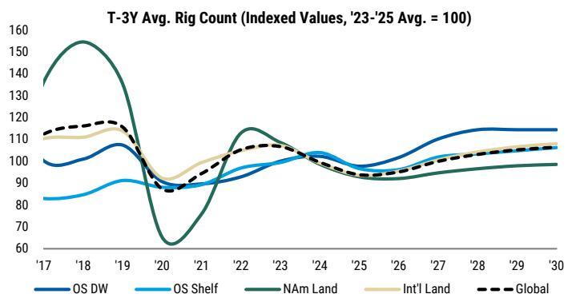

line

| Year | OS DW | OS Shelf | NAm Land | Int'l Land | Global |
|------|-------|----------|----------|------------|--------|
| '17  | 100   | 85       | 135      | 110        | 115    |
| '18  | 105   | 90       | 155      | 115        | 120    |
| '19  | 108   | 95       | 140      | 118        | 118    |
| '20  | 90    | 90       | 60       | 95         | 90     |
| '21  | 95    | 95       | 75       | 100        | 95     |
| '22  | 100   | 100      | 115      | 105        | 105    |
| '23  | 102   | 102      | 105      | 108        | 108    |
| '24  | 105   | 105      | 100      | 105        | 105    |
| '25  | 108   | 108      | 95       | 102        | 102    |
| '26  | 110   | 110      | 98       | 105        | 105    |
| '27  | 112   | 112      | 98       | 108        | 108    |
| '28  | 115   | 115      | 98       | 110        | 110    |
| '29  | 115   | 115      | 98       | 112        | 112    |
| '30  | 115   | 115      | 98       | 112        | 112    |

Source: Rystad Energy, MS estimates. "OS DW" = Offshore Deepwater.

Exhibit 5: We see the most growth in capex per rig (a rough OFSE pricing proxy) in the int'l land space followed by offshore deepwater, though activity and pricing upside is partially offset by drilling efficiency improvements ('30E vs '25 %Δ – OS DW: +4% / OS Shelf: -9% / Global: +5%).

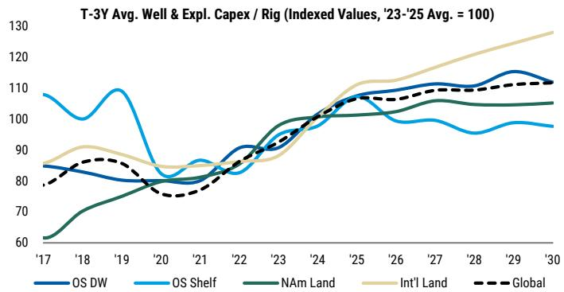

line

| Year | OS DW | OS Shelf | NAm Land | Int'l Land | Global |
|------|-------|----------|----------|------------|--------|
| '17  | 85    | 108      | 60       | 85         | 80     |
| '18  | 82    | 100      | 70       | 90         | 85     |
| '19  | 80    | 110      | 75       | 88         | 82     |
| '20  | 78    | 85       | 80       | 85         | 75     |
| '21  | 80    | 85       | 85       | 88         | 78     |
| '22  | 90    | 85       | 90       | 90         | 85     |
| '23  | 95    | 90       | 95       | 95         | 90     |
| '24  | 100   | 95       | 100      | 100        | 95     |
| '25  | 105   | 100      | 105      | 110        | 100    |
| '26  | 110   | 100      | 105      | 115        | 105    |
| '27  | 115   | 100      | 105      | 120        | 110    |
| '28  | 118   | 95       | 105      | 125        | 112    |
| '29  | 120   | 98       | 105      | 130        | 115    |
| '30  | 122   | 98       | 105      | 135        | 118    |

Source: Rystad Energy, MS estimates. "OS DW" = Offshore Deepwater.

Exhibit 4: Our rig count outlook (led by offshore deepwater) paired with increased drilling efficiencies results in well count growth outpacing rigs ('30E vs '25 %Δ – OS DW: +29% / OS Shelf: +12% / Global: +16%).

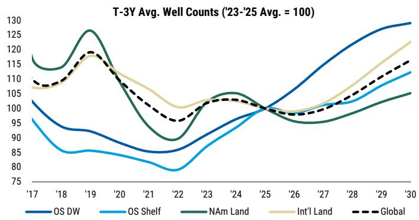

line

| Year | OS DW | OS Shelf | NAm Land | Int'l Land | Global |
|------|-------|----------|----------|------------|--------|
| '17  | 105   | 95       | 115      | 108        | 110    |
| '18  | 95    | 85       | 125      | 110        | 115    |
| '19  | 90    | 85       | 120      | 115        | 120    |
| '20  | 85    | 80       | 100      | 110        | 115    |
| '21  | 85    | 80       | 90       | 105        | 110    |
| '22  | 85    | 75       | 90       | 100        | 105    |
| '23  | 90    | 80       | 105      | 105        | 105    |
| '24  | 95    | 85       | 105      | 105        | 105    |
| '25  | 100   | 90       | 100      | 100        | 100    |
| '26  | 105   | 95       | 95       | 95         | 95     |
| '27  | 110   | 100      | 95       | 100        | 100    |
| '28  | 115   | 105      | 100      | 105        | 105    |
| '29  | 120   | 110      | 105      | 110        | 110    |
| '30  | 125   | 115      | 105      | 120        | 115    |

Source: Rystad Energy, MS estimates. "OS DW" = Offshore Deepwater.

Exhibit 6: Overall, these trends and assumptions translate to near/medium-term well & exploration capex growth (a better proxy for drilling demand relative to total capex, in our view) led by offshore deepwater and int'l land ('30E vs '25 %Δ – OS DW: +22% / OS Shelf: +0% / Global: +19%).

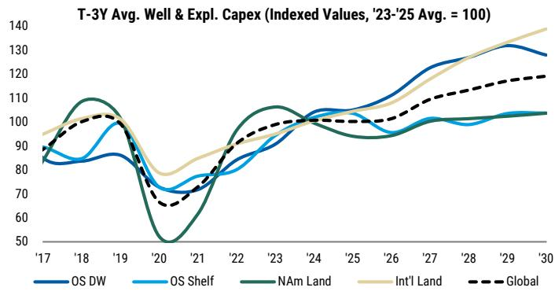

line

| Year | OS DW | OS Shelf | NAm Land | Int'l Land | Global |
|------|-------|----------|----------|------------|--------|
| '17  | 85    | 90       | 95       | 95         | 90     |
| '18  | 88    | 95       | 110      | 100        | 100    |
| '19  | 85    | 90       | 105      | 105        | 100    |
| '20  | 75    | 70       | 50       | 75         | 65     |
| '21  | 80    | 75       | 70       | 80         | 70     |
| '22  | 85    | 80       | 90       | 85         | 80     |
| '23  | 90    | 85       | 105      | 90         | 85     |
| '24  | 100   | 90       | 100      | 95         | 90     |
| '25  | 105   | 95       | 95       | 100        | 95     |
| '26  | 110   | 100      | 95       | 105        | 100    |
| '27  | 120   | 105      | 100      | 110        | 105    |
| '28  | 125   | 110      | 105      | 120        | 110    |
| '29  | 130   | 115      | 110      | 130        | 115    |
| '30  | 135   | 120      | 115      | 135        | 120    |

Source: Rystad Energy, MS estimates. "OS DW" = Offshore Deepwater.

Exhibit 7: Drilling efficiencies are a headwind to service activity and drilling demand, and we see further efficiency improvements ahead across O&G supply sources ('30E vs '25 %Δ – OS DW: +22% / OS Shelf: +26% / Global: +21%).   
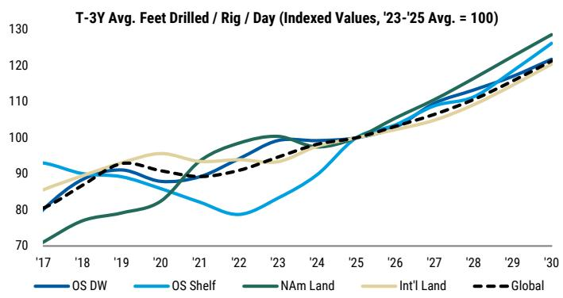

line

| Year | OS DW | OS Shelf | NAm Land | Int'l Land | Global |
|------|-------|----------|----------|------------|--------|
| '17  | 80    | 90       | 70       | 85         | 80     |
| '18  | 85    | 85       | 75       | 90         | 85     |
| '19  | 90    | 80       | 80       | 95         | 90     |
| '20  | 95    | 75       | 85       | 100        | 95     |
| '21  | 100   | 70       | 90       | 105        | 100    |
| '22  | 105   | 65       | 95       | 110        | 105    |
| '23  | 110   | 60       | 100      | 115        | 110    |
| '24  | 115   | 55       | 105      | 120        | 115    |
| '25  | 120   | 50       | 110      | 125        | 120    |
| '26  | 125   | 45       | 115      | 130        | 125    |
| '27  | 130   | 40       | 120      | 135        | 130    |
| '28  | 135   | 35       | 125      | 140        | 135    |
| '29  | 140   | 30       | 130      | 145        | 140    |
| '30  | 145   | 25       | 135      | 150        | 145    |

Source: Rystad Energy, MS estimates. "OS DW" = Offshore Deepwater.

Exhibit 9: Offshore rig tendering activity in the deepwater space has been robust YTD. The \~75 rig years awarded as of late-May is \~70% / \~30 rig years ahead of historical trend and represents the most cumulative rig years awarded in nearly 15 years (since '12) – a strong signal supporting deepwater activity upside for at least the next several years...   
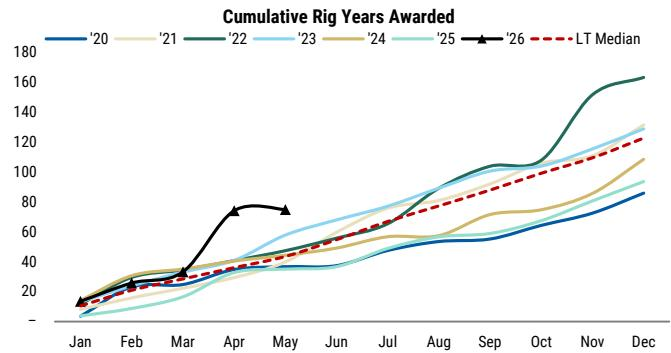

line

| Month | '20  | '21  | '22  | '23  | '24  | '25  | '26  | LT Median |
|-------|------|------|------|------|------|------|------|-----------|
| Jan   | 10   | 15   | 15   | 10   | 10   | 10   | 10   | 10        |
| Feb   | 20   | 25   | 25   | 20   | 20   | 20   | 20   | 20        |
| Mar   | 30   | 35   | 35   | 30   | 30   | 30   | 30   | 30        |
| Apr   | 40   | 45   | 45   | 40   | 40   | 40   | 75   | 45        |
| May   | 50   | 55   | 55   | 50   | 50   | 50   | 75   | 55        |
| Jun   | 60   | 65   | 65   | 60   | 60   | 60   | —    | 65        |
| Jul   | 70   | 75   | 75   | 70   | 70   | 70   | —    | 75        |
| Aug   | 80   | 85   | 85   | 80   | 80   | 80   | —    | 85        |
| Sep   | 90   | 95   | 95   | 90   | 90   | 90   | —    | 95        |
| Oct   | 100  | 105  | 105  | 100  | 100  | 100  | —    | 105       |
| Nov   | 110  | 115  | 115  | 110  | 110  | 110  | —    | 115       |
| Dec   | 120  | 125  | 125  | 120  | 120  | 120  | —    | 125       |

Source: Rystad Energy, MS. Note: Includes new unique contracts, contract extensions and exercised options.

Exhibit 8: However, we expect increasing O&G resource development complexity to keep productivity improvements (e.g., prod'n per rig) \~flat overall in the coming cycle.   
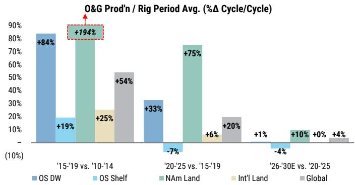

bar

| Period | OS DW | OS Shelf | NAm Land | Int'l Land | Global |
|--------|-------|----------|----------|------------|--------|
| '15-'19 vs. '10-'14 | 84% | 19% | 194% | 25% | 54% |
| '20-'25 vs. '15-'19 | 33% | -7% | 75% | 6% | 20% |
| '26-'30E vs. '20-'25 | 1% | -4% | 10% | 0% | 4% |

Source: Rystad Energy, MS estimates. "OS DW" = Offshore Deepwater.

Exhibit 10: ...Shallow water tendering activity has been lackluster – YTD contract awards lag historical median levels by \~70% / \~95 rig years. We attribute this dynamic to Iran conflict-related headwinds weighing on the largest global shelf drilling market (the Middle East), while Mexico (another key shelf market) has yet to see a meaningful rebound in activity or rig fixture awards thus far.   
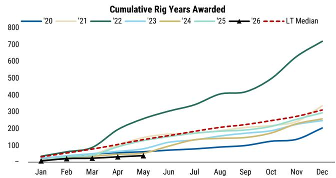

line

| Month | '20  | '21  | '22  | '23  | '24  | '25  | '26  | LT Median |
|-------|------|------|------|------|------|------|------|-----------|
| Jan   | -    | -    | -    | -    | -    | -    | -    | -         |
| Feb   | -    | -    | -    | -    | -    | -    | -    | -         |
| Mar   | -    | -    | -    | -    | -    | -    | -    | -         |
| Apr   | -    | -    | 100  | 50   | 50   | 50   | 50   | 100       |
| May   | -    | 100  | 200  | 100  | 100  | 100  | 100  | 150       |
| Jun   | -    | 150  | 300  | 150  | 150  | 150  | 150  | 200       |
| Jul   | -    | 200  | 400  | 200  | 200  | 200  | 200  | 250       |
| Aug   | -    | 250  | 500  | 250  | 250  | 250  | 250  | 300       |
| Sep   | -    | 300  | 600  | 300  | 300  | 300  | 300  | 350       |
| Oct   | -    | 350  | 700  | 350  | 350  | 350  | 350  | 400       |
| Nov   | -    | 400  | 800  | 400  | 400  | 400  | 400  | 450       |
| Dec   | -    | 450  | 900  | 450  | 450  | 450  | 450  | 500       |

Source: Rystad Energy, MS. Note: Includes new unique contracts, contract extensions and exercised options.

Exhibit 11: Across key offshore regions, we see near/medium term well & exploration capex growth led by Africa, LatAm ex-Brazil (e.g., Guyana, Suriname), and APAC. Overall, we see offshore well capex growing \~13% to a '29 peak (\~3.2% CAGR vs. '25).   
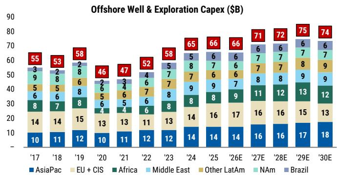

bar_stacked

| Year | AsiaPac | EU + CIS | Africa | Middle East | Other LatAm | NAm | Brazil |
|------|---------|----------|--------|-------------|-------------|-----|--------|
| '17  | 10      | 14       | 8      | 6           | 5           | 9   | 3      |
| '18  | 11      | 14       | 7      | 6           | 5           | 2   | 2      |
| '19  | 12      | 15       | 8      | 6           | 5           | 8   | 2      |
| '20  | 10      | 13       | 4      | 6           | 5           | 2   | 4      |
| '21  | 11      | 13       | 4      | 6           | 4           | 3   | 3      |
| '22  | 12      | 11       | 6      | 6           | 7           | 4   | 4      |
| '23  | 12      | 13       | 8      | 7           | 7           | 5   | 5      |
| '24  | 14      | 14       | 8      | 9           | 7           | 8   | 5      |
| '25  | 14      | 16       | 8      | 9           | 6           | 7   | 6      |
| '26E | 14      | 17       | 9      | 7           | 6           | 6   | 6      |
| '27E | 16      | 16       | 11     | 8           | 7           | 7   | 6      |
| '28E | 16      | 16       | 12     | 8           | 7           | 7   | 6      |
| '29E | 17      | 15       | 13     | 9           | 8           | 6   | 6      |
| '30E | 18      | 13       | 12     | 9           | 9           | 7   | 6      |

Source: Rystad Energy, MS estimates

Exhibit 12: What if we're wrong? Based on the current offshore project pipeline, our capex forecasts imply \~80% of projects move forward within \~5yrs – upside to our forecasts would imply more greenfield project FIDs and exploration activity, while downside would imply activity is isolated to lower risk projects (e.g., producing fields, brownfield / infill drilling).   
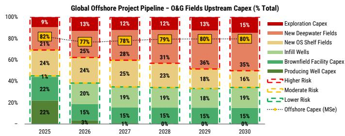

bar_stacked

| Year | Exploration Capex | New Deepwater Fields | New OS Shelf Fields | Infill Wells | Brownfield Facility Capex | Producing Well Capex | Higher Risk | Moderate Risk | Lower Risk | Offshore Capex (MSe) |
|------|-------------------|----------------------|---------------------|--------------|---------------------------|-----------------------|-------------|---------------|----------|----------------------|
| 2025 | 9%                | 82%                  | 24%                 | 21%          | 1%                        | 22%                   |             |               |          |                      |
| 2026 | 13%               | 77%                  | 25%                 | 20%          | 15%                       | 3%                    |             |               |          |                      |
| 2027 | 12%               | 78%                  | 28%                 | 19%          | 15%                       | 1%                    |             |               |          |                      |
| 2028 | 12%               | 31%                  | 31%                 | 23%          | 19%                       | 0%                    |             |               |          |                      |
| 2029 | 13%               | 80%                  | 36%                 | 18%          | 15%                       | 0%                    |             |               |          |                      |
| 2030 | 15%               | 35%                  | 35%                 | 16%          | 19%                       | 0%                    |             |               |          |                      |

Source: Rystad Energy, MS estimates

# Supply

Offshore Drilling Supply: While our offshore rig demand forecasts now call for solid growth, our supply estimates continue to assume generally stable gross capacity, and more importantly, stable marketed capacity (i.e., gross supply net of cold stacked rigs) – several key factors supporting this outlook include:

° (1) Our '27-'30E do not assume any cold stacked reactivations or newbuild deliveries across both floater and jackup rig markets (see Exhibit 13 and Exhibit 22).   
(2) That said, we also do not assume any floater rig retirements and minimal jackups retired over that period. This is due in part to recent rig retirements outpacing our estimates, with 2024-26 YTD retirements for floaters \~21 rigs / \~11% of gross supply (see Floater Supply Trends) and for jackups \~10 rigs / \~2% of gross supply (see Jackup Supply Trends).   
(3) Cold stacked floater capacity is fairly concentrated among public drillers that have remained disciplined for several cycles now (including the \~2022-23 upcycle). Of the \~14 cold stacked 6G+ floaters in the supply stack, 10 of those rigs (or >70%) belong to three drillers (VAL, RIG, SDRL), while for the high-spec 6G+ benign drillship category (the top tier of stacked rigs), there are six cold stacked rigs that belong to just two drillers (RIG, VAL) – see Floater Cold Stacked Supply Detail. Given this backdrop, we think it is less likely that a supply correction will be what breaks the tightening fundamental backdrop we forecast, and therefore remain optimistic on the sustainability of current conditions for offshore drillers.

Exhibit 13: Of the 173 total floaters in the total supply stack, \~154 are marketed and \~19 are cold stacked. Our supply estimates continue to assume generally stable gross capacity, and more importantly, stable marketed capacity. 

<table><tr><td rowspan="2">Rig Class</td><td rowspan="2">Working</td><td rowspan="2">Warm</td><td rowspan="2"># of Rigs Newb.</td><td rowspan="2">Cold</td><td rowspan="2">Total</td><td colspan="3">Utilization Measures</td></tr><tr><td>W+W</td><td>W+W+N</td><td>Total</td></tr><tr><td colspan="9">Harsh (All):</td></tr><tr><td>Pre-6G</td><td>5</td><td>4</td><td>-</td><td>-</td><td>9</td><td>56%</td><td>56%</td><td>56%</td></tr><tr><td>6G+</td><td>23</td><td>3</td><td>-</td><td>2</td><td>28</td><td>88%</td><td>88%</td><td>82%</td></tr><tr><td>Total Harsh</td><td>28</td><td>7</td><td>-</td><td>2</td><td>37</td><td>80%</td><td>80%</td><td>76%</td></tr><tr><td colspan="9">Benign Semis:</td></tr><tr><td>Pre-6G</td><td>13</td><td>5</td><td>-</td><td>2</td><td>20</td><td>72%</td><td>72%</td><td>65%</td></tr><tr><td>6G+</td><td>14</td><td>6</td><td>-</td><td>5</td><td>25</td><td>70%</td><td>70%</td><td>56%</td></tr><tr><td>Total Semis</td><td>27</td><td>11</td><td>-</td><td>7</td><td>45</td><td>71%</td><td>71%</td><td>60%</td></tr><tr><td colspan="9">Benign Drillships:</td></tr><tr><td>Pre-6G</td><td>3</td><td>-</td><td>-</td><td>3</td><td>6</td><td>100%</td><td>100%</td><td>50%</td></tr><tr><td>Low-Mid 6G+</td><td>25</td><td>2</td><td>-</td><td>1</td><td>28</td><td>93%</td><td>93%</td><td>89%</td></tr><tr><td>High-Spec 6G+</td><td>45</td><td>6</td><td>-</td><td>6</td><td>57</td><td>88%</td><td>88%</td><td>79%</td></tr><tr><td>Total Drillships</td><td>73</td><td>8</td><td>-</td><td>10</td><td>91</td><td>90%</td><td>90%</td><td>80%</td></tr><tr><td>Total Floaters</td><td>128</td><td>26</td><td>-</td><td>19</td><td>173</td><td>83%</td><td>83%</td><td>74%</td></tr></table>

Source: Rystad Energy, MS. "Working" rigs include rigs in the yard or moving to location. "Working" defined as rigs in the yard preparing for work, mobilizing to/from location or on location. "Newb." = "Newbuilds. Excludes newbuilds currently held by shipyard without an affiliated rig contractor." "W+W" utilization includes Working and Warm-Stacked rigs. "W+W+N" includes Working, Warm-Stacked, and Newbuild Rigs.

Exhibit 14: Floater retirements accelerated in 2025...   
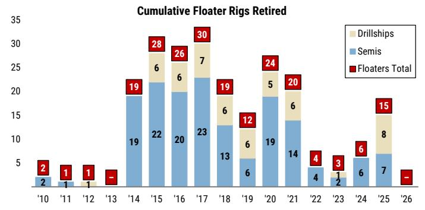

bar_stacked

| Year | Drillships | Semis | Floaters Total |
| ---- | ---------- | ----- | -------------- |
| '10  | 2          | 2     | 2              |
| '11  | 1          | 1     | 1              |
| '12  | 1          | 1     | 1              |
| '13  | -          | -     | -              |
| '14  | -          | 19    | 19             |
| '15  | 6          | 22    | 28             |
| '16  | 6          | 20    | 26             |
| '17  | 7          | 23    | 30             |
| '18  | 6          | 13    | 19             |
| '19  | 6          | 6     | 12             |
| '20  | 5          | 19    | 24             |
| '21  | 6          | 14    | 20             |
| '22  | -          | 4     | 4              |
| '23  | 1          | 2     | 3              |
| '24  | -          | 6     | 6              |
| '25  | 8          | 7     | 15             |
| '26  | -          | -     | -              |

Source: Rystad Energy, MS estimates

Exhibit 15: ...Tightening offshore supply   
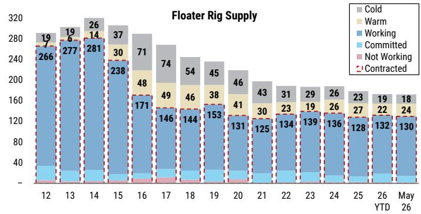

bar_stacked

| Month | Contracted | Not Working | Committed | Working | Warm | Cold |
|-------|------------|-------------|-----------|---------|------|------|
| 12    | 7          | 19          | 266       | 277     | 6    | 19   |
| 13    | 6          | 14          | 281       | 281     | 6    | 19   |
| 14    | 14         | 37          | 238       | 238     | 30   | 26   |
| 15    | 14         | 48          | 171       | 171     | 48   | 37   |
| 16    | 14         | 49          | 146       | 146     | 49   | 71   |
| 17    | 14         | 46          | 144       | 144     | 46   | 74   |
| 18    | 14         | 38          | 153       | 153     | 38   | 54   |
| 19    | 14         | 41          | 131       | 131     | 41   | 45   |
| 20    | 14         | 30          | 125       | 125     | 30   | 46   |
| 21    | 14         | 23          | 134       | 134     | 23   | 43   |
| 22    | 14         | 19          | 139       | 139     | 19   | 31   |
| 23    | 14         | 26          | 136       | 136     | 26   | 29   |
| 24    | 14         | 27          | 128       | 128     | 27   | 26   |
| 25    | 14         | 22          | 132       | 132     | 22   | 23   |
| 26 YTD| 14         | 24          | 130       | 130     | 24   | 19   |
| May 26| 14         | 24          | -         | -       | -    | -    |

Source: Rystad Energy, MS estimates

# Utilization & Pricing

Offshore Drilling Utilization & Pricing: We expect rising demand combined with disciplined supply to result in very tight offshore market conditions, with high utilization supporting pricing. Specifically, we expect:

- (1) Offshore rig marketed utilization approaches the \~mid/high-80% range by \~2028 in our forecasts, which would be the highest levels seen since the early 2010s (\~2012-14) – see Exhibit 16. Those utilization levels have historically supported strong pricing power for drillers – which is our view for the coming cycle...   
• (2) ...Against that backdrop, we think leading-edge dayrates for higher-spec rigs trend back towards recent \~2023 peak levels within \~1-2yrs, with further upside thereafter. Relative to 2025, we now see leading-edge rates for 6G+ drillships +20% / +\$90kpd (to \~\$525kpd) by 2028, 6G+ semis climbing +20% / +\$75kpd (to \~\$475kpd) by 2028, and high-spec jackups +10-15% / +\$20kpd (to \~\$175kpd) by 2030 (Exhibit 17).

Exhibit 16: Utilization reaches \~85%+ by '28 in our forecasts, a level that supports strong driller pricing power...   
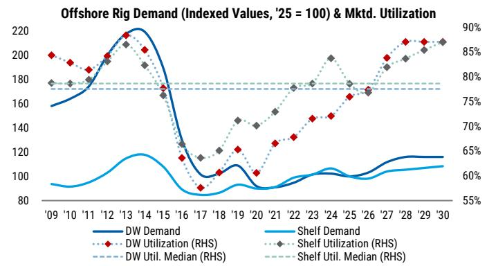

line

| Year | DW Demand | Shelf Demand | DW Utilization (RHS) | Shelf Utilization (RHS) | DW Util. Median (RHS) |
|------|-----------|--------------|----------------------|-------------------------|------------------------|
| '09  | 160       | 90           | 200                  | 80                      | 180                    |
| '10  | 170       | 95           | 190                  | 80                      | 180                    |
| '11  | 180       | 100          | 185                  | 80                      | 180                    |
| '12  | 190       | 105          | 195                  | 80                      | 180                    |
| '13  | 220       | 110          | 210                  | 80                      | 180                    |
| '14  | 210       | 115          | 205                  | 80                      | 180                    |
| '15  | 170       | 120          | 175                  | 80                      | 180                    |
| '16  | 130       | 125          | 120                  | 80                      | 180                    |
| '17  | 90        | 130          | 95                   | 80                      | 180                    |
| '18  | 100       | 135          | 105                  | 80                      | 180                    |
| '19  | 120       | 140          | 125                  | 80                      | 180                    |
| '20  | 140       | 145          | 145                  | 80                      | 180                    |
| '21  | 160       | 150          | 165                  | 80                      | 180                    |
| '22  | 170       | 155          | 175                  | 80                      | 180                    |
| '23  | 180       | 160          | 185                  | 80                      | 180                    |
| '24  | 190       | 165          | 195                  | 80                      | 180                    |
| '25  | 200       | 170          | 205                  | 80                      | 180                    |
| '26  | 210       | 175          | 215                  | 80                      | 180                    |
| '27  | 220       | 180          | 225                  | 80                      | 180                    |
| '28  | 230       | 185          | 235                  | 80                      | 180                    |
| '29  | 240       | 190          | 245                  | 80                      | 180                    |
| '30  | 250       | 195          | 255                  | 80                      | 180                    |

Source: Rystad Energy, MS estimates

Exhibit 17: ...Pushing leading-edge dayrates for higher-spec rigs back to recent \~'23 peak levels by \~'27-'28.   
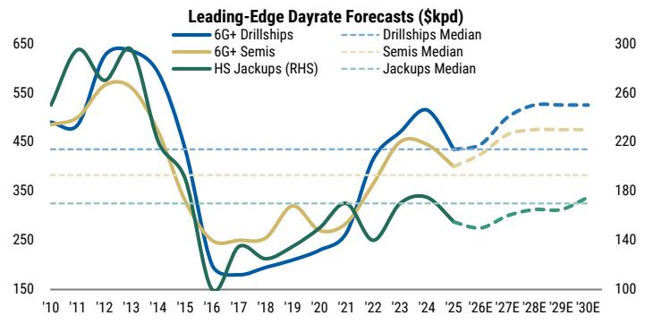

line

| Year | 6G+ Drillships | 6G+ Semis | HS Jackups (RHS) | Drillships Median | Semis Median | Jackups Median |
|------|----------------|-----------|------------------|--------------------|--------------|----------------|
| '10  | ~450           | ~450      | ~450             | ~450               | ~450         | ~450           |
| '11  | ~500           | ~500      | ~500             | ~450               | ~450         | ~450           |
| '12  | ~550           | ~550      | ~550             | ~450               | ~450         | ~450           |
| '13  | ~600           | ~600      | ~600             | ~450               | ~450         | ~450           |
| '14  | ~550           | ~550      | ~550             | ~450               | ~450         | ~450           |
| '15  | ~400           | ~400      | ~400             | ~450               | ~450         | ~450           |
| '16  | ~150           | ~150      | ~150             | ~450               | ~450         | ~450           |
| '17  | ~200           | ~200      | ~200             | ~450               | ~450         | ~450           |
| '18  | ~250           | ~250      | ~250             | ~450               | ~450         | ~450           |
| '19  | ~300           | ~300      | ~300             | ~450               | ~450         | ~450           |
| '20  | ~350           | ~350      | ~350             | ~450               | ~450         | ~450           |
| '21  | ~400           | ~400      | ~400             | ~450               | ~450         | ~450           |
| '22  | ~450           | ~450      | ~450             | ~450               | ~450         | ~450           |
| '23  | ~500           | ~500      | ~500             | ~450               | ~450         | ~450           |
| '24  | ~550           | ~550      | ~550             | ~450               | ~450         | ~450           |
| '25  | ~600           | ~600      | ~600             | ~450               | ~450         | ~450           |
| '26E'| ~650           | ~650      | ~650             | ~450               | ~450         | ~450           |
| '27E'| ~700           | ~700      | ~700             | ~450               | ~450         | ~450           |
| '28E'| ~750           | ~750      | ~750             | ~450               | ~450         | ~450           |
| '29E'| ~800           | ~800      | ~800             | ~450               | ~450         | ~450           |
| '30E'| ~850           | ~850      | ~850             | ~450               | ~450         | ~450           |

Source: Rystad Energy, MS estimates

# How to Play It

A new cycle for energy spending? While resilient offshore drilling market fundamentals are most explicitly constructive for RIG in our coverage, the current offshore drilling upcycle continues to be a significant tailwind for companies supplying other (non-contract drilling) services and equipment used in the offshore resource development process. We now argue that we're only in the early-innings of a multi-year offshore drilling upcycle, and see room for earnings growth in this space for the next several years. What's more, we think the earnings and FCF potential for offshore-exposed OFSE companies will be sticky across a wide range of commodity price scenarios.

That said, OFSE stocks have outperformed other energy subsectors (T-1Y change – OFSE index: +79% / Energy: +39%) and valuations already reflect fairly robust growth (NTM EV/EBITDA vs. historical median – OFSE: +25% / Energy: +8%) – see Exhibit 26 and Exhibit 27. Therefore, we maintain our preference for stocks with solid offshore exposure but that also have globally diversified upstream portfolios with growth prospects buoyed by idiosyncratic non-core businesses (e.g., digital, power, new energy). Within our NAm coverage, we continue to highlight globally diversified services majors as our preferred way to play the broader OFSE upcycle, including strength in offshore. This includes OW-rated SLB and HAL (Top Pick) which have \~15% / \~25% offshore upstream O&G capex exposure, respectively, we estimate – see Exhibit 21.

# Other offshore exposed stocks (EW-rated):

- RIG: A more direct way to play the offshore upcycle we forecast would be drilling pure-play RIG, and we note that RIG does offer a relatively attractive risk-reward outlook vs. our broader coverage – we see PT upside for RIG of +13% (vs. covg. +7%) with a bull:bear skew of \~1.7x (vs. covg. \~1.2x) – see Exhibit 20. However, RIG's stock outperformance vs. most of our coverage (T-1Y stock change – RIG: +149% / OFSE coverage: +104%), and \~in line estimates vs. consensus through 2028 (MSe vs. cons. '26-'28 EBITDA – RIG: -1% / OFSE coverage: +6%) keeps us EW for now – see Exhibit 24 & Exhibit 25.   
- NOV: Among globally diversified offshore-levered stocks in our coverage, we note that NOV has the most offshore capex exposure (\~40%+ of revs) and we do see offshore activity upside as a tailwind for NOV earnings. As the leading global

offshore capital equipment supplier, we would expect NOV to outperform in a scenario where offshore OEM investments pick up. That said, our current supply estimates assume minimal cold stacked rig reactivations or newbuilds in the coming cycle – see Exhibit 22.

Exhibit 18: Over the last year, offshore drillers have been the top performing service segment (+125%), outpacing the broader OFSE subsector (+89%), and meaningfully outpacing commodity prices (Brent & WTI Crude Oil: +45% / Nat Gas: +15%)...   
\~1Y OFSE Vertical & Commodity Performance (%Δ)   
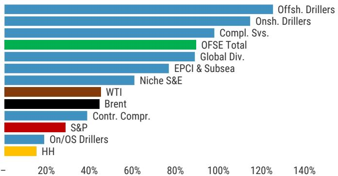

bar

| Entity | Value (%) |
| :--- | :--- |
| Offsh. Drillers | 125 |
| Onsh. Drillers | 115 |
| Compl. Svs. | 98 |
| OFSE Total | 90 |
| Global Div. | 85 |
| EPCI & Subsea | 78 |
| Niche S&E | 62 |
| WTI | 45 |
| Brent | 40 |
| Contr. Compr. | 38 |
| S&P | 28 |
| On/OS Drillers | 22 |
| HH | 18 |

Source: FactSet, Bloomberg, MS. Note - OFSE Verticals: "OFSE" = Oilfield Services & Equipment, "Onsh. Drillers" = Onshore Drillers, "Compl. Svs." = Completion Services, "Global Div." = Global Diversified OFSE, "Offsh. Drillers" = Offshore Drillers, "Contr. Compr." = Contract Compression, "EPCI" & Subsea" = EPCI & Subsea Infrastructure, "On/OS Drillers" = Onshore & Offshore Drillers.

Exhibit 19: ...Yet, in the \~3mo post Iran conflict, offshore drillers are the only service segment group that is (-4%), lagging total OFSE (+3%) and crude oil (up \~30%). Leaders have generally been NAm land-focused (e.g., land drillers +16%, completion services +12%), though EPCI & Subsea cos (+9%) and ME-levered on/offsh. drillers (+8%) and have also outperformed.   
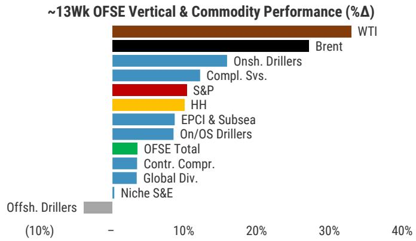

bar

~13Wk OFSE Vertical & Commodity Performance (%Δ)
| Company | Performance (%) |
| :--- | :--- |
| WTI | 32 |
| Brent | 27 |
| Onsh. Drillers | 16 |
| Compl. Svs. | 12 |
| S&P | 10 |
| HH | 9 |
| EPCI & Subsea | 8 |
| On/OS Drillers | 7 |
| OFSE Total | -4 |
| Contr. Compr. | -5 |
| Global Div. | -5 |
| Niche S&E | -1 |
| Offsh. Drillers | -12 |

Source: FactSet, Bloomberg, MS. See additional disclosures & definitions in Exhibit 18.

# Exhibit 20:

Offshore Exposed OFSE Coverage PT Upside & Risk-Reward Outlook

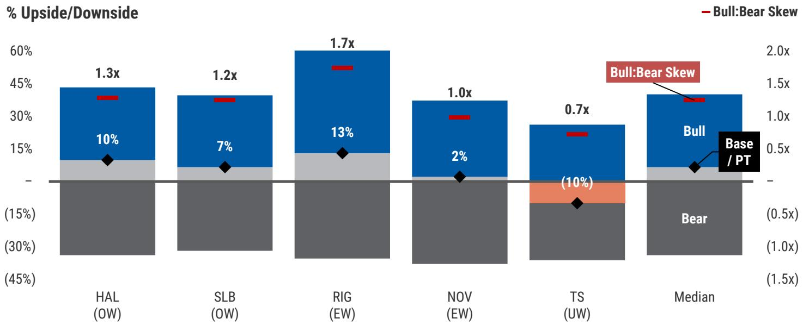

bar

| Category | Base / PT | Bull | Bull:Bear Skew |
| -------- | --------- | ---- | -------------- |
| HAL (OW) |           | 10%  | 1.3x           |
| SLB (OW) |           | 7%   | 1.2x           |
| RIG (EW) |           | 13%  | 1.7x           |
| NOV (EW) |           | 2%   | 1.0x           |
| TS (UW)  |           | (10%)| 0.7x           |
| Median   |           |    |                |

Source: FactSet, Bloomberg, Company data, MS estimates. Ratings: O = Overweight, E = Equal-weight, U = Underweight. ‡ Stock Rating, Price Target, or Estimates for this company have been removed from consideration in this report because, under applicable law and/or MS policy, MS may be precluded from issuing such information with respect to this company at this time

Exhibit 21: Offshore accounts for 20-25% of revenue for our large-cap OFSE coverage, and we assume offshore earnings (which are generally accretive) represent closer to \~30%+ of earnings for the group.   
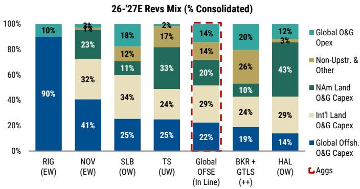

bar_stacked

| Company | Global Offsh. O&G Capex (%) | Int'l Land O&G Capex (%) | NAm Land O&G Capex (%) | Non-Upstr. & Other (%) | Global O&G Opex (%) |
|---------|-----------------------------|---------------------------|--------------------------|--------------------------|---------------------|
| RIG (EW) | 90%                         | -                         | -                        | -                        | 10%                 |
| NOV (EW) | 41%                         | 32%                       | 23%                      | 1%                       | 3%                  |
| SLB (OW) | 25%                         | 34%                       | 11%                      | 12%                      | 18%                 |
| TS (UW) | 25%                         | 24%                       | 33%                      | 17%                      | 2%                  |
| Global OFSE (In Line) | 22%                          | 29%                       | 20%                      | 14%                      | 14%                 |
| BKR + GTLS (++) | 19%                         | 24%                       | 10%                      | 26%                      | 20%                 |
| HAL (OW) | 14%                         | 29%                       | 43%                      | 3%                       | 12%                 |

Source: Company data, Rystad Energy, MS estimates

Exhibit 22: While we do see solid offshore activity upside – we model offshore demand +37 rigs by '28 vs. current levels (+16 floaters / +21 jackups), we view current marketed supply as largely sufficient to absorb this demand uptick, and therefore our '27-'30E do not assume any cold stacked rig reactivations or newbuild deliveries (but also see limited rig retirements). 

<table><tr><td rowspan="2"></td><td colspan="6">Offshore Rig S-D Forecasts &amp; Marketed Capacity Chg.</td><td rowspan="2">&#x27;28 Δ vs. Current</td></tr><tr><td>Current</td><td>2026</td><td>2027</td><td>2028</td><td>2029</td><td>2030</td></tr><tr><td>Demand</td><td>458</td><td>455</td><td>485</td><td>495</td><td>500</td><td>505</td><td>37</td></tr><tr><td>Floaters</td><td>119</td><td>120</td><td>130</td><td>135</td><td>135</td><td>135</td><td>16</td></tr><tr><td>Jackups</td><td>339</td><td>335</td><td>355</td><td>360</td><td>365</td><td>370</td><td>21</td></tr><tr><td>Floater Supply</td><td>154</td><td>155</td><td>155</td><td>155</td><td>155</td><td>155</td><td>1</td></tr><tr><td>Newbuild Deliveries</td><td></td><td>-</td><td>-</td><td>-</td><td>-</td><td>-</td><td>-</td></tr><tr><td>CS Reactivations</td><td></td><td>1</td><td>-</td><td>-</td><td>-</td><td>-</td><td>1</td></tr><tr><td>Retirments</td><td></td><td>-</td><td>-</td><td>-</td><td>-</td><td>-</td><td>-</td></tr><tr><td>Jackup Supply</td><td>435</td><td>436</td><td>433</td><td>430</td><td>427</td><td>425</td><td>(5)</td></tr><tr><td>Newbuild Deliveries</td><td></td><td>4</td><td>-</td><td>-</td><td>-</td><td>-</td><td>4</td></tr><tr><td>CS Reactivations</td><td></td><td>-</td><td>-</td><td>-</td><td>-</td><td>-</td><td>-</td></tr><tr><td>Retirments</td><td></td><td>(3)</td><td>(3)</td><td>(3)</td><td>(3)</td><td>(2)</td><td>(9)</td></tr><tr><td>Current Supply</td><td>Total</td><td>Mktd.</td><td>Cold</td><td>Newb.</td><td>Warm</td><td>Working</td><td>Contr.</td></tr><tr><td>Floaters</td><td>173</td><td>154</td><td>19</td><td>-</td><td>26</td><td>128</td><td>119</td></tr><tr><td>Jackups</td><td>481</td><td>435</td><td>46</td><td>2</td><td>83</td><td>350</td><td>339</td></tr><tr><td>Current Utilization</td><td>Total</td><td>Mktd.</td><td>W+W</td><td></td><td></td><td></td><td></td></tr><tr><td>Floaters</td><td>69%</td><td>77%</td><td>77%</td><td></td><td></td><td></td><td></td></tr><tr><td>Jackups</td><td>70%</td><td>78%</td><td>78%</td><td></td><td></td><td></td><td></td></tr></table>

Source: Rystad Energy, MS estimates. "Working" includes rigs in the yard preparing for work, mobilizing to/from location, or on location. "Newb." = "Newbuilds ex-newbuilds currently held by shipyard without an affiliated rig contractor. "W+W" = working + warm-stacked rigs, "W+W+N" also includes newbuilds.

# Exhibit 23:

Below we summarize one of our preferred metrics for select offshore driller pure-plays – EV / Asset Value (EV/AV). Our asset based valuation analysis indicates that all companies are trading above historical median levels currently, with the group aggregate EV/AV of \~1.08x, \~32% above T-7Y median levels of \~0.82x. Meanwhile, we highlight RIG's current EV/AV (of \~1.24x) which is +16% above its historical median (of \~1.07x), but note that its spread vs. history is lower relative to most other drillers in this analysis – NE is the only peer with a lower spread vs. history (+7%). For more details, see MS Fleet & Asset Value Estimates.

<table><tr><td>Rig Class</td><td>BORR</td><td>NE</td><td>ODL</td><td>SDRL</td><td>RIG</td><td>VAL</td><td>RIG+VAL</td><td>Total</td></tr><tr><td colspan="9">Asset Value ($B)</td></tr><tr><td>Floater Value</td><td>-</td><td>6.6</td><td>2.3</td><td>4.0</td><td>9.7</td><td>4.3</td><td>14.0</td><td>26.9</td></tr><tr><td>Jackup Value</td><td>3.3</td><td>1.3</td><td>-</td><td>0.3</td><td>-</td><td>3.4</td><td>3.4</td><td>8.4</td></tr><tr><td>Total Value</td><td>3.3</td><td>7.9</td><td>2.3</td><td>4.3</td><td>9.7</td><td>7.7</td><td>17.4</td><td>35.2</td></tr><tr><td>Ent. Value</td><td>3.6</td><td>8.8</td><td>3.2</td><td>3.2</td><td>12.1</td><td>7.3</td><td>19.4</td><td>38.2</td></tr><tr><td>Current EV / AV</td><td>1.08x</td><td>1.10x</td><td>1.43x</td><td>0.75x</td><td>1.24x</td><td>0.95x</td><td>1.11x</td><td>1.08x</td></tr><tr><td>T-7Y Median</td><td>0.77x</td><td>1.03x</td><td>0.88x</td><td>0.58x</td><td>1.07x</td><td>0.64x</td><td>0.85x</td><td>0.82x</td></tr><tr><td>Current (Δ%)</td><td>41%</td><td>7%</td><td>63%</td><td>30%</td><td>16%</td><td>48%</td><td>31%</td><td>32%</td></tr><tr><td>Current (ΔAbs)</td><td>0.31x</td><td>0.08x</td><td>0.55x</td><td>0.17x</td><td>0.17x</td><td>0.31x</td><td>0.27x</td><td>0.26x</td></tr><tr><td colspan="9"># of Rigs</td></tr><tr><td>Floaters</td><td>-</td><td>25</td><td>5</td><td>14</td><td>27</td><td>14</td><td>41</td><td>85</td></tr><tr><td>Jackups</td><td>29</td><td>5</td><td>-</td><td>1</td><td>-</td><td>31</td><td>31</td><td>66</td></tr><tr><td>Total Rigs</td><td>29</td><td>30</td><td>5</td><td>15</td><td>27</td><td>45</td><td>72</td><td>151</td></tr><tr><td colspan="9">Asset Value / Rig ($MM)</td></tr><tr><td>Floaters</td><td>NM</td><td>265</td><td>450</td><td>287</td><td>359</td><td>307</td><td>341</td><td>316</td></tr><tr><td>Jackups</td><td>115</td><td>265</td><td>NM</td><td>254</td><td>NM</td><td>111</td><td>111</td><td>127</td></tr><tr><td>Total Rigs</td><td>115</td><td>265</td><td>450</td><td>285</td><td>359</td><td>172</td><td>242</td><td>233</td></tr><tr><td>EV / Rig</td><td>124</td><td>292</td><td>644</td><td>215</td><td>447</td><td>163</td><td>269</td><td>253</td></tr></table>

Source: Company Data, FactSet, Rystad Energy, MS estimates. See MS Fleet & Asset Value Estimates for additional notes and disclosures.

Exhibit 24: RIG Estimate Snapshot – Through 2028, our estimates for RIG activity, realized pricing, revenues, EBITDA, and FCF are \~in line vs. consensus, but we see more upside in out-years ('29-'30) relative to expectations. 

<table><tr><td rowspan="2">Transocean (RIG)*$MM, unless noted</td><td colspan="5">MS Estimates</td><td colspan="5">Consensus Estimates</td><td colspan="5">Mse vs. Consensus</td></tr><tr><td>2026E</td><td>2027E</td><td>2028E</td><td>2029E</td><td>2030E</td><td>2026E</td><td>2027E</td><td>2028E</td><td>2029E</td><td>2030E</td><td>2026E</td><td>2027E</td><td>2028E</td><td>2029E</td><td>2030E</td></tr><tr><td>Drilling Revenues ($MM):</td><td></td><td></td><td></td><td></td><td></td><td></td><td></td><td></td><td></td><td></td><td></td><td></td><td></td><td></td><td></td></tr><tr><td>UDW Floaters</td><td>2,468</td><td>2,705</td><td>2,694</td><td>2,654</td><td>2,615</td><td>2,531</td><td>2,682</td><td>2,722</td><td>2,483</td><td>2,425</td><td>(3%)</td><td>1%</td><td>(1%)</td><td>7%</td><td>8%</td></tr><tr><td>Harsh Floaters</td><td>1,158</td><td>1,061</td><td>1,038</td><td>1,021</td><td>965</td><td>1,214</td><td>1,042</td><td>993</td><td>945</td><td>874</td><td>(5%)</td><td>2%</td><td>5%</td><td>8%</td><td>10%</td></tr><tr><td>Total Drilling Revenues</td><td>3,626</td><td>3,766</td><td>3,732</td><td>3,675</td><td>3,580</td><td>3,745</td><td>3,724</td><td>3,715</td><td>3,428</td><td>3,299</td><td>(3%)</td><td>1%</td><td>0%</td><td>7%</td><td>9%</td></tr><tr><td>Avg. Revenue ($kpd):</td><td></td><td></td><td></td><td></td><td></td><td></td><td></td><td></td><td></td><td></td><td></td><td></td><td></td><td></td><td></td></tr><tr><td>UDW Floaters</td><td>464</td><td>447</td><td>449</td><td>448</td><td>444</td><td>473</td><td>446</td><td>455</td><td>409</td><td>391</td><td>(2%)</td><td>0%</td><td>(1%)</td><td>10%</td><td>14%</td></tr><tr><td>Harsh Floaters</td><td>462</td><td>454</td><td>439</td><td>439</td><td>437</td><td>527</td><td>464</td><td>433</td><td>432</td><td>403</td><td>(12%)</td><td>(2%)</td><td>1%</td><td>2%</td><td>8%</td></tr><tr><td>Total Avg. Revenue</td><td>463</td><td>449</td><td>447</td><td>446</td><td>442</td><td>462</td><td>448</td><td>445</td><td>414</td><td>392</td><td>0%</td><td>0%</td><td>0%</td><td>8%</td><td>13%</td></tr><tr><td>Avg. Active Rigs:</td><td></td><td></td><td></td><td></td><td></td><td></td><td></td><td></td><td></td><td></td><td></td><td></td><td></td><td></td><td></td></tr><tr><td>UDW Floaters</td><td>15</td><td>17</td><td>16</td><td>16</td><td>16</td><td>15</td><td>16</td><td>16</td><td>17</td><td>17</td><td>(1%)</td><td>0%</td><td>0%</td><td>(3%)</td><td>(5%)</td></tr><tr><td>Harsh Floaters</td><td>7</td><td>6</td><td>6</td><td>6</td><td>6</td><td>6</td><td>6</td><td>6</td><td>6</td><td>6</td><td>9%</td><td>4%</td><td>3%</td><td>6%</td><td>2%</td></tr><tr><td>Total Avg. Active Rigs</td><td>21</td><td>23</td><td>23</td><td>23</td><td>22</td><td>21</td><td>23</td><td>23</td><td>23</td><td>23</td><td>2%</td><td>1%</td><td>1%</td><td>(0%)</td><td>(3%)</td></tr><tr><td>Utilization:</td><td></td><td></td><td></td><td></td><td></td><td></td><td></td><td></td><td></td><td></td><td></td><td></td><td></td><td></td><td></td></tr><tr><td>UDW Floaters</td><td>73%</td><td>83%</td><td>82%</td><td>81%</td><td>81%</td><td>73%</td><td>82%</td><td>82%</td><td>83%</td><td>85%</td><td>(42)</td><td>39</td><td>9</td><td>(211)</td><td>(435)</td></tr><tr><td>Harsh Floaters</td><td>98%</td><td>91%</td><td>92%</td><td>91%</td><td>86%</td><td>90%</td><td>88%</td><td>89%</td><td>86%</td><td>85%</td><td>802</td><td>360</td><td>280</td><td>536</td><td>154</td></tr><tr><td>Total Utilization</td><td>79%</td><td>85%</td><td>85%</td><td>84%</td><td>82%</td><td>78%</td><td>84%</td><td>84%</td><td>84%</td><td>85%</td><td>177</td><td>123</td><td>79</td><td>(17)</td><td>(282)</td></tr><tr><td>EBITDA</td><td>1,362</td><td>1,381</td><td>1,325</td><td>1,258</td><td>1,160</td><td>1,345</td><td>1,382</td><td>1,378</td><td>1,151</td><td>984</td><td>1%</td><td>(0%)</td><td>(4%)</td><td>9%</td><td>18%</td></tr><tr><td>Free Cash Flow</td><td>602</td><td>829</td><td>794</td><td>812</td><td>792</td><td>695</td><td>767</td><td>800</td><td>658</td><td>533</td><td>(13%)</td><td>8%</td><td>(1%)</td><td>23%</td><td>48%</td></tr></table>

Source: Visible Alpha, Company Data, MS estimates

Exhibit 25: MS EBITDA Estimates vs. Consensus 

<table><tr><td></td><td colspan="16">EBITDA ($MM)</td></tr><tr><td rowspan="2">Segment</td><td rowspan="2">Ticker</td><td colspan="3">2Q26</td><td colspan="3">3Q26</td><td colspan="3">2026FY</td><td colspan="3">2027FY</td><td colspan="3">2028FY</td></tr><tr><td>MS</td><td>Cons.</td><td>vs Cons</td><td>MS</td><td>Cons.</td><td>vs Cons</td><td>MS</td><td>Cons.</td><td>vs Cons</td><td>MS</td><td>Cons.</td><td>vs Cons</td><td>MS</td><td>Cons.</td><td>vs Cons</td></tr><tr><td rowspan="6">Global Services &amp; Equipment</td><td>BKR</td><td>1,130</td><td>1,135</td><td>(0%)</td><td>1,178</td><td>1,192</td><td>(1%)</td><td>4,775</td><td>4,757</td><td>0%</td><td>5,531</td><td>5,414</td><td>2%</td><td>6,019</td><td>5,853</td><td>3%</td></tr><tr><td>HAL</td><td>984</td><td>984</td><td>0%</td><td>1,094</td><td>1,046</td><td>5%</td><td>4,183</td><td>4,085</td><td>2%</td><td>5,071</td><td>4,658</td><td>9%</td><td>5,351</td><td>5,029</td><td>6%</td></tr><tr><td>NOV</td><td>200</td><td>200</td><td>(0%)</td><td>263</td><td>249</td><td>5%</td><td>949</td><td>911</td><td>4%</td><td>1,177</td><td>1,117</td><td>5%</td><td>1,233</td><td>1,237</td><td>(0%)</td></tr><tr><td>SLB</td><td>1,790</td><td>1,781</td><td>0%</td><td>2,256</td><td>2,115</td><td>7%</td><td>8,353</td><td>8,092</td><td>3%</td><td>10,429</td><td>9,499</td><td>10%</td><td>11,114</td><td>10,303</td><td>8%</td></tr><tr><td>TS</td><td>628</td><td>632</td><td>(1%)</td><td>687</td><td>702</td><td>(2%)</td><td>2,797</td><td>2,849</td><td>(2%)</td><td>3,621</td><td>3,150</td><td>15%</td><td>3,583</td><td>3,271</td><td>10%</td></tr><tr><td>Global Median</td><td></td><td></td><td>(0%)</td><td></td><td></td><td>5%</td><td></td><td></td><td>2%</td><td></td><td></td><td>9%</td><td></td><td></td><td>6%</td></tr><tr><td rowspan="9">SMID Cap Services &amp; Equipment</td><td>ACDC*</td><td>63</td><td>64</td><td>(1%)</td><td>80</td><td>76</td><td>6%</td><td>276</td><td>263</td><td>5%</td><td>449</td><td>370</td><td>22%</td><td>482</td><td>478</td><td>1%</td></tr><tr><td>GTLS*</td><td>238</td><td>187</td><td>27%</td><td>238</td><td>194</td><td>22%</td><td>884</td><td>666</td><td>33%</td><td>1,028</td><td>729</td><td>41%</td><td>1,111</td><td>787</td><td>41%</td></tr><tr><td>HP</td><td>209</td><td>213</td><td>(2%)</td><td>237</td><td>235</td><td>1%</td><td>843</td><td>891</td><td>(5%)</td><td>1,039</td><td>1,017</td><td>2%</td><td>1,072</td><td>1,065</td><td>1%</td></tr><tr><td>LBRT*</td><td>154</td><td>146</td><td>5%</td><td>147</td><td>157</td><td>(6%)</td><td>533</td><td>570</td><td>(7%)</td><td>820</td><td>786</td><td>4%</td><td>1,336</td><td>1,202</td><td>11%</td></tr><tr><td>NBR</td><td>215</td><td>213</td><td>1%</td><td>249</td><td>235</td><td>6%</td><td>931</td><td>902</td><td>3%</td><td>1,109</td><td>1,044</td><td>6%</td><td>1,224</td><td>1,132</td><td>8%</td></tr><tr><td>PRM*</td><td>98</td><td>108</td><td>(9%)</td><td>236</td><td>216</td><td>9%</td><td>434</td><td>427</td><td>2%</td><td>479</td><td>478</td><td>0%</td><td>530</td><td>536</td><td>(1%)</td></tr><tr><td>PTEN</td><td>205</td><td>213</td><td>(4%)</td><td>233</td><td>234</td><td>(0%)</td><td>850</td><td>880</td><td>(3%)</td><td>1,007</td><td>1,005</td><td>0%</td><td>1,024</td><td>1,178</td><td>(13%)</td></tr><tr><td>RIG</td><td>263</td><td>274</td><td>(4%)</td><td>325</td><td>296</td><td>10%</td><td>1,362</td><td>1,345</td><td>1%</td><td>1,381</td><td>1,382</td><td>(0%)</td><td>1,325</td><td>1,378</td><td>(4%)</td></tr><tr><td>SMID Median</td><td></td><td></td><td>(1%)</td><td></td><td></td><td>6%</td><td></td><td></td><td>2%</td><td></td><td></td><td>3%</td><td></td><td></td><td>1%</td></tr><tr><td colspan="2">OFSE Covg. Median</td><td></td><td></td><td>(0%)</td><td></td><td></td><td>5%</td><td></td><td></td><td>2%</td><td></td><td></td><td>5%</td><td></td><td></td><td>3%</td></tr></table>

Source: Company Data, FactSet, Visible Alpha, Bloomberg, MS estimates. \*Note: Estimates reflect company-reported adjusted EBITDA for comparability vs. consensus; however, we use normalized EBITDA for our valuations and target prices.

Exhibit 26: T-1Y Stock Performance   
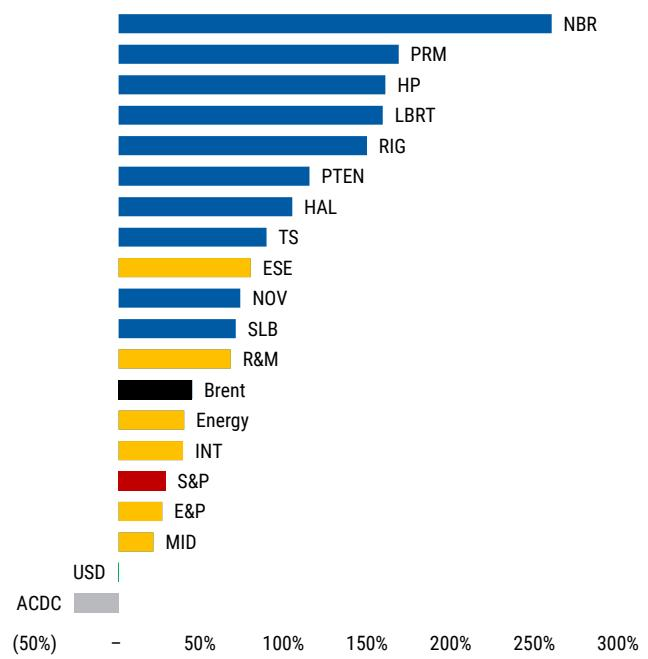

bar

| Entity | Value (%) |
| :--- | :--- |
| NBR | 260 |
| PRM | 170 |
| HP | 160 |
| LBRT | 155 |
| RIG | 145 |
| PTEN | 110 |
| HAL | 100 |
| TS | 90 |
| ESE | 80 |
| NOV | 75 |
| SLB | 70 |
| R&M | 65 |
| Brent | 45 |
| Energy | 40 |
| INT | 35 |
| S&P | 30 |
| E&P | 25 |
| MID | 20 |
| USD | -1 |
| ACDC | -5 |

Source: FactSet, MS Research. See additional disclosures & definitions in Exhibit 27

Exhibit 27: Energy Sub-sector NTM EV/EBITDA vs. Historical Median ( $\Delta\%$ )   
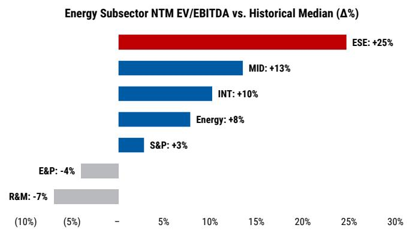

bar

Energy Subsector NTM EV/EBITDA vs. Historical Median (Δ%)
| Category | NTM EV/EBITDA (%) |
| :--- | :--- |
| ESE | 25 |
| MID | 13 |
| INT | 10 |
| Energy | 8 |
| S&P | 3 |
| E&P | -4 |
| R&M | -7 |

Source: FactSet, Bloomberg, MS. Note: Reflects S&P Composite 1500 industry or sub-industry indices, including: "Energy" = US Energy, "INT" = Integrated O&G, "E&P" = O&G Exploration & Production, "MID" = O&G Storage & Transportation, "R&M" = O&G Refining & Marketing, "ESE" = Energy Equipment & Services. "S&P" = S&P 500.

Exhibit 28: Global Valuation and Rating Summary 

<table><tr><td rowspan="2">Ticker</td><td rowspan="2">MS Rating</td><td rowspan="2">Recent Price</td><td rowspan="2">Price Target</td><td rowspan="2">Div. Yield</td><td rowspan="2">MC ($MM)</td><td rowspan="2">EV ($MM)</td><td colspan="4">EV/EBITDA</td><td colspan="4">P/E</td><td colspan="4">Unlevered FCF/EV*</td><td colspan="4">Net Debt/EBITDA</td></tr><tr><td>NTM</td><td>2026E</td><td>2027E</td><td>2028E</td><td>NTM</td><td>2026E</td><td>2027E</td><td>2028E</td><td>NTM</td><td>2026E</td><td>2027E</td><td>2028E</td><td>NTM</td><td>2026E</td><td>2027E</td><td>2028E</td></tr><tr><td colspan="23">Global OFSE</td></tr><tr><td>SLB</td><td>OW</td><td>$54.55</td><td>$57.00</td><td>2.2%</td><td>81,555</td><td>90,952</td><td>10.3x</td><td>10.9x</td><td>8.4x</td><td>7.6x</td><td>18.5x</td><td>20.4x</td><td>14.5x</td><td>13.1x</td><td>4.5%</td><td>4.7%</td><td>6.4%</td><td>7.9%</td><td>1.0x</td><td>0.9x</td><td>0.6x</td><td>0.4x</td></tr><tr><td>BKR</td><td>++</td><td>$63.88</td><td>++</td><td>1.4%</td><td>63,373</td><td>64,773</td><td>13.0x</td><td>13.3x</td><td>11.3x</td><td>10.2x</td><td>29.6x</td><td>30.1x</td><td>23.6x</td><td>20.7x</td><td>3.8%</td><td>3.4%</td><td>4.3%</td><td>5.0%</td><td>NM</td><td>NM</td><td>NM</td><td>NM</td></tr><tr><td>TS</td><td>UW</td><td>$60.93</td><td>$53.00</td><td>3.1%</td><td>32,638</td><td>29,805</td><td>9.5x</td><td>10.0x</td><td>7.5x</td><td>7.3x</td><td>15.3x</td><td>15.8x</td><td>11.7x</td><td>11.3x</td><td>5.8%</td><td>5.9%</td><td>7.6%</td><td>8.6%</td><td>NM</td><td>NM</td><td>NM</td><td>NM</td></tr><tr><td>HAL</td><td>OW</td><td>$38.85</td><td>$42.00</td><td>1.8%</td><td>32,455</td><td>37,657</td><td>8.5x</td><td>8.8x</td><td>7.0x</td><td>6.4x</td><td>15.0x</td><td>16.1x</td><td>11.7x</td><td>10.5x</td><td>5.5%</td><td>5.3%</td><td>6.7%</td><td>7.5%</td><td>1.1x</td><td>1.1x</td><td>0.7x</td><td>0.6x</td></tr><tr><td>NOV</td><td>EW</td><td>$19.96</td><td>$20.00</td><td>2.0%</td><td>7,163</td><td>7,851</td><td>7.6x</td><td>8.0x</td><td>6.3x</td><td>5.7x</td><td>19.0x</td><td>21.2x</td><td>14.2x</td><td>12.4x</td><td>5.6%</td><td>5.4%</td><td>7.1%</td><td>8.4%</td><td>0.5x</td><td>0.3x</td><td>0.2x</td><td>0.0x</td></tr><tr><td colspan="7">Global Median</td><td>9.5x</td><td>10.0x</td><td>7.5x</td><td>7.3x</td><td>18.5x</td><td>20.4x</td><td>14.2x</td><td>12.4x</td><td>5.5%</td><td>5.3%</td><td>6.7%</td><td>7.9%</td><td>1.0x</td><td>0.9x</td><td>0.6x</td><td>0.4x</td></tr><tr><td colspan="23">SMID OFSE</td></tr><tr><td>GTLS</td><td>++</td><td>$207.82</td><td>++</td><td>-</td><td>9,948</td><td>13,644</td><td>14.6x</td><td>15.8x</td><td>13.1x</td><td>11.6x</td><td>22.3x</td><td>27.4x</td><td>19.3x</td><td>17.1x</td><td>2.3%</td><td>1.0%</td><td>5.4%</td><td>6.3%</td><td>3.7x</td><td>3.9x</td><td>2.8x</td><td>2.0x</td></tr><tr><td>RIG</td><td>EW</td><td>$6.19</td><td>$7.00</td><td>-</td><td>6,912</td><td>12,060</td><td>9.3x</td><td>8.8x</td><td>8.1x</td><td>7.8x</td><td>32.9x</td><td>27.5x</td><td>21.5x</td><td>21.5x</td><td>8.2%</td><td>8.9%</td><td>10.1%</td><td>10.1%</td><td>3.5x</td><td>3.4x</td><td>2.7x</td><td>2.2x</td></tr><tr><td>PRM</td><td>OW</td><td>$32.28</td><td>$40.00</td><td>-</td><td>5,266</td><td>7,134</td><td>17.6x</td><td>17.9x</td><td>16.2x</td><td>14.2x</td><td>26.5x</td><td>26.7x</td><td>24.4x</td><td>22.1x</td><td>2.9%</td><td>3.3%</td><td>3.5%</td><td>4.4%</td><td>2.9x</td><td>2.6x</td><td>2.2x</td><td>1.6x</td></tr><tr><td>LBRT</td><td>OW</td><td>$29.26</td><td>$36.00</td><td>1.2%</td><td>4,775</td><td>5,640</td><td>12.5x</td><td>12.3x</td><td>10.7x</td><td>7.1x</td><td>NM</td><td>NM</td><td>NM</td><td>71.1x</td><td>NM</td><td>NM</td><td>NM</td><td>NM</td><td>3.6x</td><td>2.6x</td><td>4.6x</td><td>3.4x</td></tr><tr><td>PTEN</td><td>EW</td><td>$11.21</td><td>$10.00</td><td>3.6%</td><td>4,256</td><td>5,146</td><td>5.6x</td><td>5.9x</td><td>4.8x</td><td>4.4x</td><td>NM</td><td>NM</td><td>31.7x</td><td>20.3x</td><td>8.5%</td><td>6.4%</td><td>8.0%</td><td>9.1%</td><td>0.8x</td><td>0.9x</td><td>0.6x</td><td>0.5x</td></tr><tr><td>HP</td><td>UW</td><td>$38.15</td><td>$39.00</td><td>2.7%</td><td>3,812</td><td>5,631</td><td>5.6x</td><td>6.4x</td><td>4.9x</td><td>4.4x</td><td>36.0x</td><td>NM</td><td>20.8x</td><td>14.3x</td><td>6.4%</td><td>5.7%</td><td>9.0%</td><td>10.1%</td><td>1.4x</td><td>1.7x</td><td>1.0x</td><td>0.8x</td></tr><tr><td>NBR</td><td>OW</td><td>$92.63</td><td>$115.00</td><td>-</td><td>1,371</td><td>3,861</td><td>3.9x</td><td>4.2x</td><td>3.5x</td><td>3.1x</td><td>40.4x</td><td>NM</td><td>12.7x</td><td>7.9x</td><td>4.5%</td><td>2.6%</td><td>6.9%</td><td>8.4%</td><td>2.1x</td><td>2.2x</td><td>1.8x</td><td>1.4x</td></tr><tr><td>ACDC</td><td>UW</td><td>$6.11</td><td>$6.00</td><td>-</td><td>1,105</td><td>2,304</td><td>7.1x</td><td>8.5x</td><td>4.8x</td><td>4.1x</td><td>NM</td><td>NM</td><td>NM</td><td>17.2x</td><td>5.6%</td><td>3.8%</td><td>11.8%</td><td>12.0%</td><td>3.3x</td><td>4.0x</td><td>2.0x</td><td>1.4x</td></tr><tr><td colspan="7">SMID Median</td><td>8.2x</td><td>8.6x</td><td>6.5x</td><td>5.8x</td><td>32.9x</td><td>27.4x</td><td>21.1x</td><td>18.8x</td><td>5.6%</td><td>3.8%</td><td>8.0%</td><td>9.1%</td><td>3.1x</td><td>2.6x</td><td>2.1x</td><td>1.5x</td></tr></table>

Source: FactSet, Bloomberg, Company data, MS estimates. Ratings: O = Overweight, E = Equal-weight, U = Underweight. ‡ Stock Rating, Price Target, or Estimates for this company have been removed from consideration in this report because, under applicable law and/or MS policy, MS may be precluded from issuing such information with respect to this company at this time.

# Offshore Supply-Demand Forecasts

Our offshore macro forecasts are intact as we recently updated our estimates (post-Iran conflict) here – 1Q26 Earnings Preview - Looking Beyond the Middle East Disruption (15 Apr 2026). Overall, offshore driller commentary through 1Q26 earnings season generally supported our outlook.

Exhibit 29: Floater Supply-Demand Model 

<table><tr><td rowspan="2">Region</td><td colspan="12">MS Floater Supply-Demand Forecast</td></tr><tr><td>2019</td><td>2020</td><td>2021</td><td>2022</td><td>2023</td><td>2024</td><td>2025</td><td>2026</td><td>2027</td><td>2028</td><td>2029</td><td>2030</td></tr><tr><td>Africa</td><td>17</td><td>7</td><td>9</td><td>13</td><td>17</td><td>17</td><td>13</td><td>15</td><td>19</td><td>21</td><td>23</td><td>22</td></tr><tr><td>Asia Pac</td><td>30</td><td>25</td><td>22</td><td>21</td><td>20</td><td>22</td><td>20</td><td>23</td><td>28</td><td>30</td><td>30</td><td>32</td></tr><tr><td>Brazil</td><td>14</td><td>17</td><td>20</td><td>20</td><td>24</td><td>30</td><td>33</td><td>32</td><td>32</td><td>31</td><td>30</td><td>33</td></tr><tr><td>US GoM</td><td>21</td><td>18</td><td>16</td><td>20</td><td>21</td><td>21</td><td>20</td><td>16</td><td>16</td><td>16</td><td>16</td><td>15</td></tr><tr><td>W. Europe</td><td>26</td><td>22</td><td>19</td><td>17</td><td>19</td><td>17</td><td>17</td><td>19</td><td>18</td><td>19</td><td>17</td><td>13</td></tr><tr><td>Other</td><td>18</td><td>18</td><td>19</td><td>19</td><td>16</td><td>13</td><td>14</td><td>15</td><td>17</td><td>18</td><td>19</td><td>20</td></tr><tr><td>Total Demand</td><td>127</td><td>107</td><td>106</td><td>110</td><td>118</td><td>119</td><td>116</td><td>120</td><td>130</td><td>135</td><td>135</td><td>135</td></tr><tr><td>Marketed Supply</td><td>194</td><td>176</td><td>159</td><td>162</td><td>165</td><td>165</td><td>153</td><td>155</td><td>155</td><td>155</td><td>155</td><td>155</td></tr><tr><td>Utilization</td><td>65%</td><td>61%</td><td>67%</td><td>68%</td><td>72%</td><td>72%</td><td>76%</td><td>77%</td><td>84%</td><td>87%</td><td>87%</td><td>87%</td></tr><tr><td>YoY Change</td><td>2019</td><td>2020</td><td>2021</td><td>2022</td><td>2023</td><td>2024</td><td>2025</td><td>2026</td><td>2027</td><td>2028</td><td>2029</td><td>2030</td></tr><tr><td>Africa</td><td>11%</td><td>(58%)</td><td>25%</td><td>45%</td><td>30%</td><td>(4%)</td><td>(25%)</td><td>19%</td><td>27%</td><td>11%</td><td>10%</td><td>(4%)</td></tr><tr><td>Asia Pac</td><td>25%</td><td>(16%)</td><td>(11%)</td><td>(7%)</td><td>(3%)</td><td>10%</td><td>(11%)</td><td>17%</td><td>22%</td><td>7%</td><td>-</td><td>7%</td></tr><tr><td>Brazil</td><td>(25%)</td><td>22%</td><td>17%</td><td>(0%)</td><td>19%</td><td>23%</td><td>12%</td><td>(3%)</td><td>-</td><td>(3%)</td><td>(3%)</td><td>10%</td></tr><tr><td>US GoM</td><td>0%</td><td>(17%)</td><td>(11%)</td><td>27%</td><td>6%</td><td>(1%)</td><td>(5%)</td><td>(19%)</td><td>-</td><td>-</td><td>-</td><td>(6%)</td></tr><tr><td>W. Europe</td><td>13%</td><td>(18%)</td><td>(11%)</td><td>(11%)</td><td>12%</td><td>(11%)</td><td>0%</td><td>11%</td><td>(5%)</td><td>6%</td><td>(11%)</td><td>(24%)</td></tr><tr><td>Other</td><td>11%</td><td>2%</td><td>5%</td><td>(1%)</td><td>(14%)</td><td>(24%)</td><td>12%</td><td>7%</td><td>13%</td><td>6%</td><td>6%</td><td>5%</td></tr><tr><td>Total Demand</td><td>6%</td><td>(16%)</td><td>(1%)</td><td>4%</td><td>7%</td><td>1%</td><td>(2%)</td><td>3%</td><td>8%</td><td>4%</td><td>-</td><td>-</td></tr><tr><td>Marketed Supply</td><td>(1%)</td><td>(9%)</td><td>(10%)</td><td>2%</td><td>2%</td><td>-</td><td>(7%)</td><td>1%</td><td>-</td><td>-</td><td>-</td><td>-</td></tr><tr><td>Utilization (Δ in b.p.)</td><td>463</td><td>(473)</td><td>598</td><td>126</td><td>375</td><td>53</td><td>392</td><td>140</td><td>645</td><td>323</td><td>-</td><td>-</td></tr></table>

Source: Rystad Energy, MS estimates

Exhibit 30: Jackup Supply-Demand Model 

<table><tr><td rowspan="2">Region</td><td colspan="12">MS Jackup Supply-Demand Forecast</td></tr><tr><td>2019</td><td>2020</td><td>2021</td><td>2022</td><td>2023</td><td>2024</td><td>2025</td><td>2026</td><td>2027</td><td>2028</td><td>2029</td><td>2030</td></tr><tr><td>Africa</td><td>29</td><td>20</td><td>18</td><td>24</td><td>23</td><td>23</td><td>26</td><td>30</td><td>25</td><td>25</td><td>25</td><td>25</td></tr><tr><td>Asia Pac</td><td>102</td><td>116</td><td>112</td><td>123</td><td>119</td><td>124</td><td>129</td><td>130</td><td>138</td><td>141</td><td>142</td><td>144</td></tr><tr><td>GoM (US + Mex)</td><td>34</td><td>33</td><td>36</td><td>37</td><td>38</td><td>35</td><td>22</td><td>20</td><td>23</td><td>24</td><td>25</td><td>25</td></tr><tr><td>Middle East</td><td>106</td><td>104</td><td>105</td><td>113</td><td>137</td><td>148</td><td>128</td><td>115</td><td>130</td><td>135</td><td>140</td><td>145</td></tr><tr><td>W. Europe</td><td>30</td><td>23</td><td>30</td><td>28</td><td>23</td><td>24</td><td>23</td><td>23</td><td>24</td><td>21</td><td>20</td><td>17</td></tr><tr><td>Other</td><td>17</td><td>12</td><td>10</td><td>12</td><td>8</td><td>10</td><td>13</td><td>17</td><td>15</td><td>14</td><td>13</td><td>14</td></tr><tr><td>Total Demand</td><td>318</td><td>307</td><td>311</td><td>338</td><td>346</td><td>364</td><td>341</td><td>335</td><td>355</td><td>360</td><td>365</td><td>370</td></tr><tr><td>Marketed Supply</td><td>446</td><td>437</td><td>426</td><td>434</td><td>440</td><td>434</td><td>434</td><td>436</td><td>433</td><td>430</td><td>427</td><td>425</td></tr><tr><td>Utilization</td><td>71%</td><td>70%</td><td>73%</td><td>78%</td><td>79%</td><td>84%</td><td>79%</td><td>77%</td><td>82%</td><td>84%</td><td>85%</td><td>87%</td></tr><tr><td>YoY Change</td><td>2019</td><td>2020</td><td>2021</td><td>2022</td><td>2023</td><td>2024</td><td>2025</td><td>2026</td><td>2027</td><td>2028</td><td>2029</td><td>2030</td></tr><tr><td>Africa</td><td>28%</td><td>(30%)</td><td>(10%)</td><td>35%</td><td>(7%)</td><td>(0%)</td><td>15%</td><td>16%</td><td>(17%)</td><td>-</td><td>-</td><td>-</td></tr><tr><td>Asia Pac</td><td>6%</td><td>13%</td><td>(3%)</td><td>10%</td><td>(4%)</td><td>4%</td><td>4%</td><td>1%</td><td>6%</td><td>2%</td><td>1%</td><td>1%</td></tr><tr><td>GoM (US + Mex)</td><td>12%</td><td>(4%)</td><td>10%</td><td>3%</td><td>2%</td><td>(7%)</td><td>(36%)</td><td>(11%)</td><td>15%</td><td>4%</td><td>4%</td><td>-</td></tr><tr><td>Middle East</td><td>5%</td><td>(2%)</td><td>1%</td><td>8%</td><td>21%</td><td>8%</td><td>(13%)</td><td>(10%)</td><td>13%</td><td>4%</td><td>4%</td><td>4%</td></tr><tr><td>W. Europe</td><td>12%</td><td>(23%)</td><td>29%</td><td>(7%)</td><td>(18%)</td><td>5%</td><td>(3%)</td><td>(1%)</td><td>4%</td><td>(13%)</td><td>(5%)</td><td>(15%)</td></tr><tr><td>Other</td><td>(9%)</td><td>(31%)</td><td>(13%)</td><td>17%</td><td>(37%)</td><td>35%</td><td>25%</td><td>32%</td><td>(12%)</td><td>(7%)</td><td>(7%)</td><td>8%</td></tr><tr><td>Total Demand</td><td>8%</td><td>(3%)</td><td>1%</td><td>9%</td><td>3%</td><td>5%</td><td>(6%)</td><td>(2%)</td><td>6%</td><td>1%</td><td>1%</td><td>1%</td></tr><tr><td>Marketed Supply</td><td>(1%)</td><td>(2%)</td><td>(3%)</td><td>2%</td><td>1%</td><td>(1%)</td><td>-</td><td>0%</td><td>(1%)</td><td>(1%)</td><td>(1%)</td><td>(0%)</td></tr><tr><td>Utilization (Δ in b.p.)</td><td>605</td><td>(102)</td><td>282</td><td>480</td><td>90</td><td>511</td><td>(517)</td><td>(179)</td><td>515</td><td>173</td><td>176</td><td>158</td></tr></table>

Source: Rystad Energy, MS estimates

Exhibit 31: Leading-Edge Dayrate Forecasts   
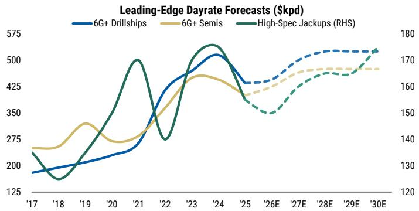

line

| Year | 6G+ Drillships | 6G+ Semis | High-Spec Jackups (RHS) |
|------|----------------|-----------|--------------------------|
| '17  | 190            | 270       | 220                      |
| '18  | 200            | 280       | 180                      |
| '19  | 210            | 300       | 250                      |
| '20  | 220            | 270       | 350                      |
| '21  | 230            | 260       | 500                      |
| '22  | 350            | 300       | 270                      |
| '23  | 450            | 400       | 550                      |
| '24  | 500            | 450       | 600                      |
| '25  | 450            | 400       | 450                      |
| '26E | 475            | 425       | 475                      |
| '27E | 500            | 450       | 500                      |
| '28E | 525            | 475       | 525                      |
| '29E | 550            | 500       | 550                      |
| '30E | 575            | 525       | 575                      |

Source: Rystad Energy, MS estimates

Exhibit 32: Leading Edge Dayrate Forecast Table 

<table><tr><td colspan="7">Leading-Edge Dayrates ($kpd) – Current Estimate</td></tr><tr><td>Rig Class-Type</td><td>2025</td><td>2026</td><td>2027</td><td>2028</td><td>2029</td><td>2030</td></tr><tr><td>6G+ Drillships</td><td>435</td><td>445</td><td>500</td><td>525</td><td>525</td><td>525</td></tr><tr><td>6G+ Semis</td><td>400</td><td>425</td><td>465</td><td>475</td><td>475</td><td>475</td></tr><tr><td>High-Spec Jackups</td><td>155</td><td>150</td><td>160</td><td>165</td><td>165</td><td>175</td></tr></table>

<table><tr><td colspan="7">Current Estimate YoY Change ($kpd)</td></tr><tr><td>Rig Class-Type</td><td>2025</td><td>2026</td><td>2027</td><td>2028</td><td>2029</td><td>2030</td></tr><tr><td>6G+ Drillships</td><td>(80)</td><td>10</td><td>55</td><td>25</td><td>-</td><td>-</td></tr><tr><td>6G+ Semis</td><td>(45)</td><td>25</td><td>40</td><td>10</td><td>-</td><td>-</td></tr><tr><td>High-Spec Jackups</td><td>(20)</td><td>(5)</td><td>10</td><td>5</td><td>-</td><td>10</td></tr></table>

<table><tr><td colspan="7">Current Estimate YoY Change (%)</td></tr><tr><td>Rig Class-Type</td><td>2025</td><td>2026</td><td>2027</td><td>2028</td><td>2029</td><td>2030</td></tr><tr><td>6G+ Drillships</td><td>(16%)</td><td>2%</td><td>12%</td><td>5%</td><td>-</td><td>-</td></tr><tr><td>6G+ Semis</td><td>(10%)</td><td>6%</td><td>9%</td><td>2%</td><td>-</td><td>-</td></tr><tr><td>High-Spec Jackups</td><td>(11%)</td><td>(3%)</td><td>7%</td><td>3%</td><td>-</td><td>6%</td></tr></table>

Source: Rystad Energy, MS estimates

# Exhibit 33:

Offshore Rig Utilization & Dayrate Macro Deck

<table><tr><td colspan="9">Utilization – Current Estimates</td></tr><tr><td>Rig Type</td><td>Environ.</td><td>Rig Class</td><td>2025</td><td>2026</td><td>2027</td><td>2028</td><td>2029</td><td>2030</td></tr><tr><td rowspan="4">Floaters</td><td rowspan="2">Benign</td><td>Pre-6G</td><td>65%</td><td>65%</td><td>65%</td><td>65%</td><td>65%</td><td>65%</td></tr><tr><td>6G+</td><td>80%</td><td>80%</td><td>90%</td><td>95%</td><td>95%</td><td>95%</td></tr><tr><td rowspan="2">Harsh</td><td>Pre-6G</td><td>45%</td><td>55%</td><td>45%</td><td>55%</td><td>45%</td><td>35%</td></tr><tr><td>6G+</td><td>80%</td><td>85%</td><td>90%</td><td>90%</td><td>90%</td><td>85%</td></tr><tr><td rowspan="3" colspan="2">Jackups</td><td>Standard</td><td>75%</td><td>70%</td><td>70%</td><td>75%</td><td>75%</td><td>75%</td></tr><tr><td>Premium</td><td>85%</td><td>80%</td><td>80%</td><td>80%</td><td>80%</td><td>80%</td></tr><tr><td>High-Spec</td><td>80%</td><td>80%</td><td>90%</td><td>90%</td><td>90%</td><td>95%</td></tr></table>

<table><tr><td colspan="9">Benchmark Dayrate ($kpd) – Current Estimates</td></tr><tr><td>Rig Type</td><td>Environ.</td><td>Rig Class</td><td>2025</td><td>2026</td><td>2027</td><td>2028</td><td>2029</td><td>2030</td></tr><tr><td rowspan="4">Floaters</td><td rowspan="2">Benign</td><td>Pre-6G</td><td>225</td><td>225</td><td>225</td><td>225</td><td>225</td><td>225</td></tr><tr><td>6G+</td><td>350</td><td>375</td><td>425</td><td>450</td><td>450</td><td>450</td></tr><tr><td rowspan="2">Harsh</td><td>Pre-6G</td><td>200</td><td>200</td><td>200</td><td>200</td><td>200</td><td>200</td></tr><tr><td>6G+</td><td>350</td><td>400</td><td>425</td><td>450</td><td>450</td><td>450</td></tr><tr><td rowspan="3" colspan="2">Jackups</td><td>Standard</td><td>70</td><td>70</td><td>70</td><td>70</td><td>70</td><td>70</td></tr><tr><td>Premium</td><td>90</td><td>90</td><td>90</td><td>90</td><td>90</td><td>90</td></tr><tr><td>High-Spec</td><td>120</td><td>120</td><td>130</td><td>135</td><td>140</td><td>150</td></tr></table>

Source: Rystad Energy, MS estimates

# MS Fleet & Asset Value Estimates

Exhibit 34: Offshore Drilling Fleet Overview\* 

<table><tr><td rowspan="2">Type</td><td rowspan="2">Envir.</td><td rowspan="2">Rig Class</td><td colspan="7"># of Rigs</td><td rowspan="2">Total</td></tr><tr><td>BORR</td><td>NE</td><td>ODL</td><td>SDRL</td><td>RIG</td><td>VAL</td><td>RIG+VAL</td></tr><tr><td rowspan="6">Floaters</td><td rowspan="4">Benign</td><td>Pre-6G</td><td>-</td><td>-</td><td>-</td><td>-</td><td>-</td><td>-</td><td>-</td><td>-</td></tr><tr><td>Low-Grade 6G+</td><td>-</td><td>2</td><td>-</td><td>-</td><td>-</td><td>1</td><td>1</td><td>3</td></tr><tr><td>Mid-Grade 6G+</td><td>-</td><td>5</td><td>-</td><td>5</td><td>6</td><td>2</td><td>8</td><td>18</td></tr><tr><td>High-Spec 6G+</td><td>-</td><td>14</td><td>-</td><td>7</td><td>14</td><td>11</td><td>25</td><td>46</td></tr><tr><td rowspan="2">Harsh</td><td>Pre-6G</td><td>-</td><td>3</td><td>-</td><td>-</td><td>-</td><td>-</td><td>-</td><td>3</td></tr><tr><td>6G+</td><td>-</td><td>1</td><td>5</td><td>2</td><td>7</td><td>-</td><td>7</td><td>15</td></tr><tr><td rowspan="7">Jackups</td><td rowspan="3">Benign</td><td>Standard</td><td>-</td><td>-</td><td>-</td><td>-</td><td>-</td><td>-</td><td>-</td><td>-</td></tr><tr><td>Premium</td><td>3</td><td>-</td><td>-</td><td>-</td><td>-</td><td>11</td><td>11</td><td>14</td></tr><tr><td>High-Spec</td><td>17</td><td>-</td><td>-</td><td>-</td><td>-</td><td>8</td><td>8</td><td>25</td></tr><tr><td rowspan="4">Harsh</td><td>Standard</td><td>-</td><td>-</td><td>-</td><td>-</td><td>-</td><td>2</td><td>2</td><td>2</td></tr><tr><td>Premium</td><td>2</td><td>-</td><td>-</td><td>-</td><td>-</td><td>-</td><td>-</td><td>2</td></tr><tr><td>High-Spec</td><td>7</td><td>-</td><td>-</td><td>-</td><td>-</td><td>8</td><td>8</td><td>15</td></tr><tr><td>Super-Spec</td><td>-</td><td>5</td><td>-</td><td>1</td><td>-</td><td>2</td><td>2</td><td>8</td></tr><tr><td colspan="3">Total Floaters</td><td>-</td><td>25</td><td>5</td><td>14</td><td>27</td><td>14</td><td>41</td><td>85</td></tr><tr><td colspan="3">Total Jackups</td><td>29</td><td>5</td><td>-</td><td>1</td><td>-</td><td>31</td><td>31</td><td>66</td></tr><tr><td colspan="3">Total Rigs</td><td>29</td><td>30</td><td>5</td><td>15</td><td>27</td><td>45</td><td>72</td><td>151</td></tr></table>

Source: Rystad Energy, MS

Exhibit 35: Offshore Drilling Asset Value Estimates\*\* 

<table><tr><td rowspan="2">Type</td><td rowspan="2">Envir.</td><td rowspan="2">Rig Class</td><td colspan="7">Asset Value ($MM)</td><td rowspan="2">$MM/Rig</td></tr><tr><td>BORR</td><td>NE</td><td>ODL</td><td>SDRL</td><td>RIG</td><td>VAL</td><td>RIG+VAL</td></tr><tr><td rowspan="6">Floaters</td><td rowspan="4">Benign</td><td>Pre-6G</td><td>-</td><td>-</td><td>-</td><td>-</td><td>-</td><td>-</td><td>-</td><td>25</td></tr><tr><td>Low-Grade 6G+</td><td>-</td><td>300</td><td>-</td><td>-</td><td>-</td><td>150</td><td>150</td><td>150</td></tr><tr><td>Mid-Grade 6G+</td><td>-</td><td>1,000</td><td>-</td><td>1,000</td><td>1,200</td><td>400</td><td>1,600</td><td>200</td></tr><tr><td>High-Spec 6G+</td><td>-</td><td>4,900</td><td>-</td><td>2,450</td><td>4,900</td><td>3,850</td><td>8,750</td><td>350</td></tr><tr><td rowspan="2">Harsh</td><td>Pre-6G</td><td>-</td><td>225</td><td>-</td><td>-</td><td>-</td><td>-</td><td>-</td><td>75</td></tr><tr><td>6G+</td><td>-</td><td>450</td><td>2,250</td><td>900</td><td>3,150</td><td>-</td><td>3,150</td><td>450</td></tr><tr><td rowspan="7">Jackups</td><td rowspan="3">Benign</td><td>Standard</td><td>-</td><td>-</td><td>-</td><td>-</td><td>-</td><td>-</td><td>-</td><td>10</td></tr><tr><td>Premium</td><td>240</td><td>-</td><td>-</td><td>-</td><td>-</td><td>880</td><td>880</td><td>80</td></tr><tr><td>High-Spec</td><td>1,870</td><td>-</td><td>-</td><td>-</td><td>-</td><td>880</td><td>880</td><td>110</td></tr><tr><td rowspan="4">Harsh</td><td>Standard</td><td>-</td><td>-</td><td>-</td><td>-</td><td>-</td><td>20</td><td>20</td><td>10</td></tr><tr><td>Premium</td><td>200</td><td>-</td><td>-</td><td>-</td><td>-</td><td>-</td><td>-</td><td>100</td></tr><tr><td>High-Spec</td><td>1,050</td><td>-</td><td>-</td><td>-</td><td>-</td><td>1,200</td><td>1,200</td><td>150</td></tr><tr><td>Super-Spec</td><td>-</td><td>1,375</td><td>-</td><td>275</td><td>-</td><td>550</td><td>550</td><td>275</td></tr><tr><td colspan="3">Capex, React. Cost &amp; Other**</td><td>(20)</td><td>(310)</td><td>-</td><td>(350)</td><td>450</td><td>(195)</td><td>255</td><td>(425)</td></tr><tr><td colspan="3">Floater Asset Value</td><td>-</td><td>6,875</td><td>2,250</td><td>4,350</td><td>9,250</td><td>4,400</td><td>13,650</td><td>27,125</td></tr><tr><td colspan="3">Jackup Asset Value</td><td>3,360</td><td>1,375</td><td>-</td><td>275</td><td>-</td><td>3,530</td><td>3,530</td><td>8,540</td></tr><tr><td colspan="3">Total Asset Value</td><td>3,340</td><td>7,940</td><td>2,250</td><td>4,275</td><td>9,700</td><td>7,735</td><td>17,435</td><td>35,240</td></tr><tr><td colspan="3">Enterprise Value</td><td>3,601</td><td>8,761</td><td>3,218</td><td>3,227</td><td>12,060</td><td>7,332</td><td>19,391</td><td>38,197</td></tr><tr><td colspan="3">EV / Asset Value</td><td>1.08x</td><td>1.10x</td><td>1.43x</td><td>0.75x</td><td>1.24x</td><td>0.95x</td><td>1.11x</td><td>1.08x</td></tr><tr><td colspan="3">T-7Y Median EV / Asset Value*</td><td>0.77x</td><td>1.03x</td><td>0.88x</td><td>0.58x</td><td>1.07x</td><td>0.64x</td><td>0.85x</td><td>0.82x</td></tr><tr><td colspan="3">Current vs. T-7Y Median (Δ%)</td><td>41%</td><td>7%</td><td>63%</td><td>30%</td><td>16%</td><td>48%</td><td>31%</td><td>32%</td></tr><tr><td colspan="3">Current vs. T-7Y Median (ΔAbsolute)</td><td>0.31x</td><td>0.08x</td><td>0.55x</td><td>0.17x</td><td>0.17x</td><td>0.31x</td><td>0.27x</td><td>0.26x</td></tr></table>

Source: Rystad Energy, FactSet, Bloomberg, Company Filings, MS estimates. \*Note: T-7Y Median EV / Asset Value reflects company EV and asset value estimates from past Offshore Drilling Digest editions published on: 6/1/26, 10/3/24, 3/12/24, 7/6/23, 1/4/23, 7/13/22, 4/13/21, 10/14/20, 7/7/20, 4/6/20, 1/13/20, 10/7/19, 7/15/19, 4/16/19.

\*\*Note on Asset Value Assumptions / Calculations: Given the frequently complex capital structures of offshore drillers and valuing companies in this market, we would encourage investors to view this analysis as a tool that could be a starting point for assessing the relative fair value of offshore drillers vs. the value that the market is assigning. We detail the 'Capex, Reactivation Cost & Other' adjustments that we make in our total asset value calculations so that investors can potentially make further adjustments or changes to our assumptions to improve the comparability of these calculations. The adjustments made in the above total asset value calculations include:

- RIG: We add a total of \$750MM to RIG's asset value to account for its 8G Deepwater Atlas and Titan drillships which we believe the market capitalizes above the value assigned to other high-spec 6G+ drillships. We exclude the Ocean Rig Olympia, which contributes to Global Sea Mineral Resources' offshore precious minerals mining venture. Finally, we burden our asset value assumption with \~\$300MM of unstacking costs, which better reflects the fair value of these rigs with currently contracted rigs, in our view.   
- BORR: We burden our asset value assumption with \~\$20MM of unstacking costs. Our assumptions do not include any adjustment related to M&A that has been announced but not yet consummated.   
- NE: We burden our asset value assumption with \~\$310MM of unstacking costs. Noble (NE) is pro forma for Diamond Offshore (DO) and Maersk Drilling (DRLCO-DK) in periods prior to each acquisition closing.   
- SDRL: We burden our asset value assumption with \~\$350MM of unstacking costs. Note: We began tracking SDRL EV / Asset Value first in 2024, so SDRL's historical median EV / Asset Value reflects the average spread for periods where we published SDRL estimates (6/1/26, 10/3/24, 3/12/24) relative to its closest comps (NE, RIG), and applies that same spread (in %-terms) to NE & RIG long-term median to for what we view as a more comparable analysis of current EV/AV vs. historical median levels.   
- VAL: We burden our asset value assumption with \~\$675MM of unstacking costs, and also add \$480MM for the book value of VAL's investment in ARO and its ARO notes receivable.

Please note BORR, NE, ODL, SDRL and VAL are not covered by MS Equity Research.

# Floater Macro Trends

# Floater Utilization & Dayrate Snapshot

Exhibit 36: Global Floater Utilization & Dayrate Snapshot   
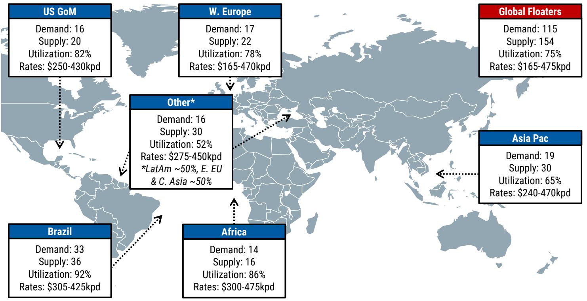

geo

| Region       | Demand | Supply | Utilization | Rates Range             |
| ------------ | ------ | ------ | ----------- | ------------------------ |
| US GoM       | 16     | 20     | 82%         | $250-430kpd              |
| W. Europe    | 17     | 22     | 78%         | $165-470kpd              |
| Global Floaters | 115   | 154    | 75%         | $165-475kpd              |
| Other*       | 16     | 30     | 52%         | $275-450kpd (LatAm ~50%, E. EU & C. Asia ~50%) |
| Asia Pac     | 19     | 30     | 65%         | $240-470kpd              |
| Brazil       | 33     | 36     | 92%         | $305-425kpd              |
| Africa       | 14     | 16     | 86%         | $300-475kpd              |

Source: Rystad Energy, MS estimates. Note: "Demand" = current contracted & working rigs, "Supply" = marketed supply, i.e., excluding cold stacked rigs, "Utilization" = current marked utilization, "Rates" = dayrate range (min/max) in region over prior \~1-2yrs.

# Floater Contracting Trends

Exhibit 37: Floater Demand   
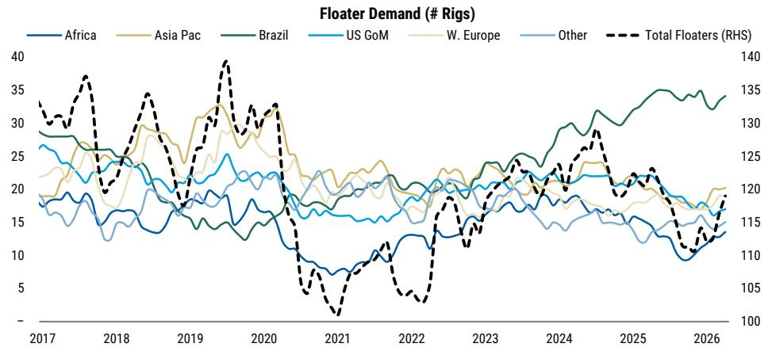

line

| Year | Africa | Asia Pac | Brazil | US GoM | W. Europe | Other | Total Floaters (RHS) |
|------|--------|----------|--------|--------|-----------|-------|----------------------|
| 2017 | ~18    | ~28      | ~26    | ~24    | ~22       | ~18   | ~32                  |
| 2018 | ~16    | ~26      | ~24    | ~22    | ~20       | ~16   | ~34                  |
| 2019 | ~14    | ~24      | ~22    | ~20    | ~18       | ~14   | ~36                  |
| 2020 | ~12    | ~22      | ~20    | ~18    | ~16       | ~12   | ~38                  |
| 2021 | ~8     | ~18      | ~16    | ~14    | ~14       | ~8    | ~10                  |
| 2022 | ~10    | ~16      | ~14    | ~12    | ~12       | ~10   | ~10                  |
| 2023 | ~12    | ~18      | ~16    | ~14    | ~14       | ~12   | ~12                  |
| 2024 | ~14    | ~20      | ~18    | ~16    | ~16       | ~14   | ~14                  |
| 2025 | ~16    | ~22      | ~20    | ~18    | ~18       | ~16   | ~16                  |
| 2026 | ~18    | ~24      | ~22    | ~20    | ~20       | ~18   | ~18                  |

Source: Rystad Energy, MS estimates

Exhibit 38: Rig Years Contracted (Quarterly)   
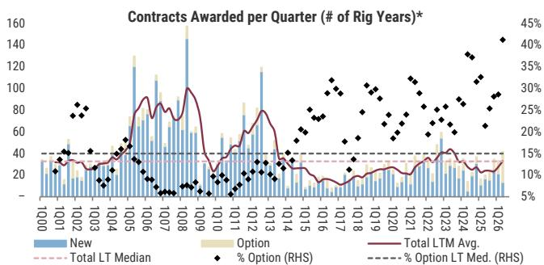  
\*“New” = New Unique Contract, "Option" = Exercised Option + Contract Extension   
Source: Rystad Energy, MS. Note: Includes new unique contracts, contract extensions and exercised options.

Exhibit 40: Contract Lead Time & Duration   
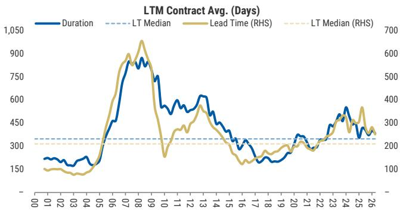

line

| Year | Duration | LT Median | Lead Time (RHS) |
|------|----------|-----------|-----------------|
| 00   | 150      | 300       | 100             |
| 01   | 150      | 300       | 100             |
| 02   | 150      | 300       | 100             |
| 03   | 150      | 300       | 100             |
| 04   | 150      | 300       | 100             |
| 05   | 150      | 300       | 100             |
| 06   | 450      | 300       | 450             |
| 07   | 900      | 300       | 900             |
| 08   | 1,050    | 300       | 1,050           |
| 09   | 750      | 300       | 750             |
| 10   | 600      | 300       | 600             |
| 11   | 550      | 300       | 550             |
| 12   | 600      | 300       | 600             |
| 13   | 650      | 300       | 650             |
| 14   | 600      | 300       | 600             |
| 15   | 550      | 300       | 550             |
| 16   | 500      | 300       | 500             |
| 17   | 450      | 300       | 450             |
| 18   | 450      | 300       | 450             |
| 19   | 450      | 300       | 450             |
| 20   | 450      | 300       | 450             |
| 21   | 450      | 300       | 450             |
| 22   | 450      | 300       | 450             |
| 23   | 550      | 300       | 550             |
| 24   | 650      | 300       | 650             |
| 25   | 650      | 300       | 650             |
| 26   | 650      | 300       | 650             |

Source: Rystad Energy, MS

Exhibit 42: Floater Fixtures by Environment   
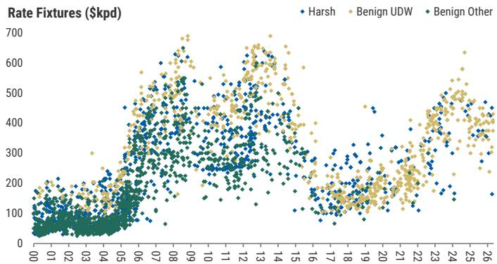

scatter

| Year | Harsh ($kpd) | Benign UDW ($kpd) | Benign Other ($kpd) |
|------|--------------|-------------------|---------------------|
| 2000 | ~100         | ~100              | ~100                |
| 2001 | ~150         | ~150              | ~150                |
| 2002 | ~200         | ~200              | ~200                |
| 2003 | ~250         | ~250              | ~250                |
| 2004 | ~300         | ~300              | ~300                |
| 2005 | ~350         | ~350              | ~350                |
| 2006 | ~400         | ~400              | ~400                |
| 2007 | ~450         | ~450              | ~450                |
| 2008 | ~500         | ~500              | ~500                |
| 2009 | ~550         | ~550              | ~550                |
| 2010 | ~600         | ~600              | ~600                |
| 2011 | ~650         | ~650              | ~650                |
| 2012 | ~700         | ~700              | ~700                |
| 2013 | ~650         | ~650              | ~650                |
| 2014 | ~600         | ~600              | ~600                |
| 2015 | ~550         | ~550              | ~550                |
| 2016 | ~500         | ~500              | ~500                |
| 2017 | ~450         | ~450              | ~450                |
| 2018 | ~400         | ~400              | ~400                |
| 2019 | ~350         | ~350              | ~350                |
| 2020 | ~300         | ~300              | ~300                |
| 2021 | ~250         | ~250              | ~250                |
| 2022 | ~200         | ~200              | ~200                |
| 2023 | ~150         | ~150              | ~150                |
| 2024 | ~100         | ~100              | ~100                |
| 2025 | ~50          | ~50               | ~50                 |
| 2026 | ~15          | ~15               | ~15                 |

Source: Rystad Energy, MS

Exhibit 39: Cumulative Contracting Activity per Year   
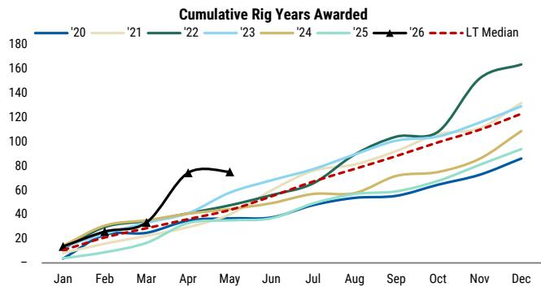

line

| Month | '20  | '21  | '22  | '23  | '24  | '25  | '26  | LT Median |
|-------|------|------|------|------|------|------|------|-----------|
| Jan   | 10   | 10   | 10   | 10   | 10   | 10   | 10   | 10        |
| Feb   | 20   | 20   | 20   | 20   | 20   | 20   | 20   | 20        |
| Mar   | 30   | 30   | 30   | 30   | 30   | 30   | 30   | 30        |
| Apr   | 40   | 40   | 40   | 40   | 40   | 40   | 70   | 40        |
| May   | 50   | 50   | 50   | 50   | 50   | 50   | 70   | 50        |
| Jun   | 60   | 60   | 60   | 60   | 60   | 60   | 70   | 60        |
| Jul   | 70   | 70   | 70   | 70   | 70   | 70   | 80   | 70        |
| Aug   | 80   | 80   | 80   | 80   | 80   | 80   | 90   | 80        |
| Sep   | 90   | 90   | 90   | 90   | 90   | 90   | 100  | 90        |
| Oct   | 100  | 100  | 110  | 110  | 110  | 110  | 120  | 110       |
| Nov   | 110  | 110  | 130  | 130  | 130  | 130  | 140  | 120       |
| Dec   | 120  | 120  | 160  | 135  | 125  | 125  | 165  | 135       |

Source: Rystad Energy, MS. Note: Includes new unique contracts, contract extensions and exercised options.

Exhibit 41: Rig Years Contracted by Operator   
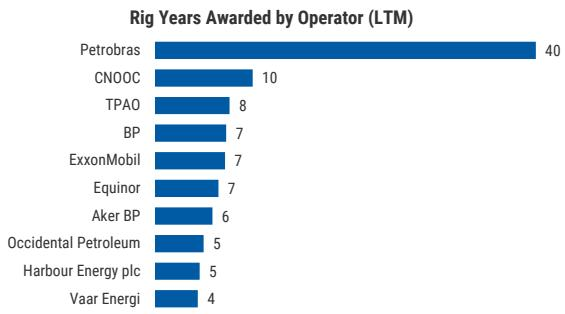

bar

Rig Years Awarded by Operator (LTM)
| Operator | Rig Years Awarded |
| :--- | :--- |
| Petrobras | 40 |
| CNOOC | 10 |
| TPAO | 8 |
| BP | 7 |
| ExxonMobil | 7 |
| Equinor | 7 |
| Aker BP | 6 |
| Occidental Petroleum | 5 |
| Harbour Energy plc | 5 |
| Vaar Energi | 4 |

Source: Rystad Energy, MS. Note: Includes new unique contracts, contract extensions and exercised options.

Exhibit 43: T-12mo. Avg. Floater Fixtures by Environment   
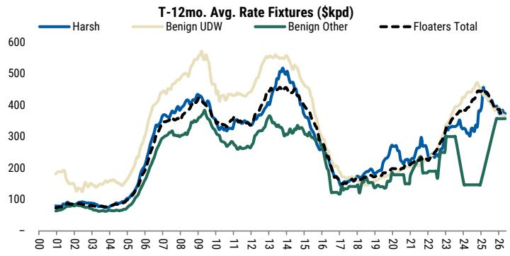

line

| Year | Harsh | Benign UDW | Benign Other | Floaters Total |
|------|-------|------------|--------------|----------------|
| 00   | 80    | 180        | 80           | 80             |
| 01   | 85    | 170        | 85           | 85             |
| 02   | 90    | 160        | 90           | 90             |
| 03   | 95    | 150        | 95           | 95             |
| 04   | 100   | 140        | 100          | 100            |
| 05   | 120   | 130        | 120          | 120            |
| 06   | 200   | 250        | 180          | 200            |
| 07   | 300   | 350        | 250          | 300            |
| 08   | 350   | 400        | 300          | 350            |
| 09   | 400   | 450        | 350          | 400            |
| 10   | 450   | 500        | 400          | 450            |
| 11   | 400   | 450        | 350          | 400            |
| 12   | 350   | 400        | 300          | 350            |
| 13   | 300   | 350        | 250          | 300            |
| 14   | 250   | 300        | 200          | 250            |
| 15   | 200   | 250        | 150          | 200            |
| 16   | 150   | 200        | 120          | 150            |
| 17   | 120   | 150        | 100          | 120            |
| 18   | 150   | 180        | 120          | 150            |
| 19   | 200   | 250        | 180          | 200            |
| 20   | 250   | 300        | 220          | 250            |
| 21   | 300   | 350        | 280          | 300            |
| 22   | 350   | 400        | 320          | 350            |
| 23   | 400   | 450        | 380          | 400            |
| 24   | 450   | 500        | 420          | 450            |
| 25   | 500   | 550        | 480          | 500            |
| 26   | 550   | 600        | 520          | 550            |

Source: Rystad Energy, MS

Exhibit 44: Floater Fixtures by Environment & Rig Type   
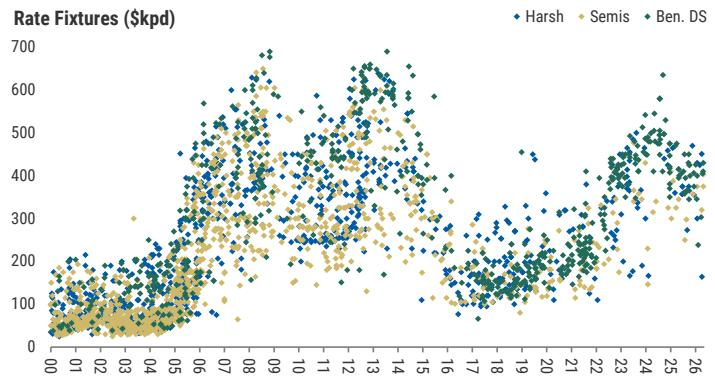

scatter

| Year | Harsh ($kpd) | Semis ($kpd) | Ben. DS ($kpd) |
|------|--------------|--------------|----------------|
| 00   | ~50          | ~50          | ~50            |
| 01   | ~70          | ~70          | ~70            |
| 02   | ~90          | ~90          | ~90            |
| 03   | ~120         | ~120         | ~120           |
| 04   | ~150         | ~150         | ~150           |
| 05   | ~180         | ~180         | ~180           |
| 06   | ~220         | ~220         | ~220           |
| 07   | ~280         | ~280         | ~280           |
| 08   | ~350         | ~350         | ~350           |
| 09   | ~450         | ~450         | ~450           |
| 10   | ~550         | ~550         | ~550           |
| 11   | ~600         | ~600         | ~600           |
| 12   | ~650         | ~650         | ~650           |
| 13   | ~680         | ~680         | ~680           |
| 14   | ~650         | ~650         | ~650           |
| 15   | ~600         | ~600         | ~600           |
| 16   | ~550         | ~550         | ~550           |
| 17   | ~500         | ~500         | ~500           |
| 18   | ~450         | ~450         | ~450           |
| 19   | ~400         | ~400         | ~400           |
| 20   | ~350         | ~350         | ~350           |
| 21   | ~300         | ~300         | ~300           |
| 22   | ~250         | ~250         | ~250           |
| 23   | ~280         | ~280         | ~280           |
| 24   | ~320         | ~320         | ~320           |
| 25   | ~380         | ~380         | ~380           |
| 26   | ~420         | ~420         | ~420           |

Source: Rystad Energy, MS

Exhibit 45: T-12mo. Avg. Floater Fixtures by Environment & Rig Type   
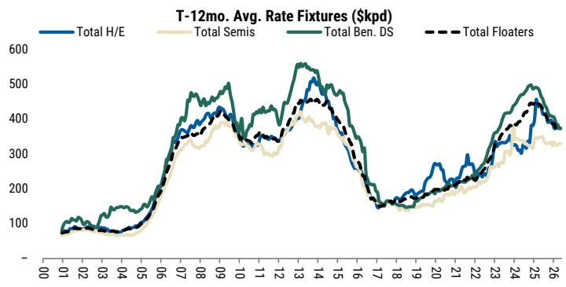

line

| Year | Total H/E | Total Semis | Total Ben. DS | Total Floaters |
|------|-----------|-------------|---------------|----------------|
| 00   | ~90       | ~80         | ~90           | ~80            |
| 01   | ~100      | ~90         | ~100          | ~90            |
| 02   | ~110      | ~100        | ~110          | ~100           |
| 03   | ~120      | ~110        | ~120          | ~110           |
| 04   | ~130      | ~120        | ~130          | ~120           |
| 05   | ~140      | ~130        | ~140          | ~130           |
| 06   | ~150      | ~140        | ~150          | ~140           |
| 07   | ~160      | ~150        | ~160          | ~150           |
| 08   | ~170      | ~160        | ~170          | ~160           |
| 09   | ~180      | ~170        | ~180          | ~170           |
| 10   | ~190      | ~180        | ~190          | ~180           |
| 11   | ~200      | ~190        | ~200          | ~190           |
| 12   | ~210      | ~200        | ~210          | ~200           |
| 13   | ~220      | ~210        | ~220          | ~210           |
| 14   | ~230      | ~220        | ~230          | ~220           |
| 15   | ~240      | ~230        | ~240          | ~230           |
| 16   | ~250      | ~240        | ~250          | ~240           |
| 17   | ~260      | ~250        | ~260          | ~250           |
| 18   | ~270      | ~260        | ~270          | ~260           |
| 19   | ~280      | ~270        | ~280          | ~270           |
| 20   | ~290      | ~280        | ~290          | ~280           |
| 21   | ~300      | ~290        | ~300          | ~290           |
| 22   | ~310      | ~300        | ~310          | ~300           |
| 23   | ~320      | ~310        | ~320          | ~310           |
| 24   | ~330      | ~320        | ~330          | ~320           |
| 25   | ~340      | ~330        | ~340          | ~330           |
| 26   | ~350      | ~340        | ~350          | ~340           |

Source: Rystad Energy, MS

Exhibit 46: Top Tier Floater Fixtures   
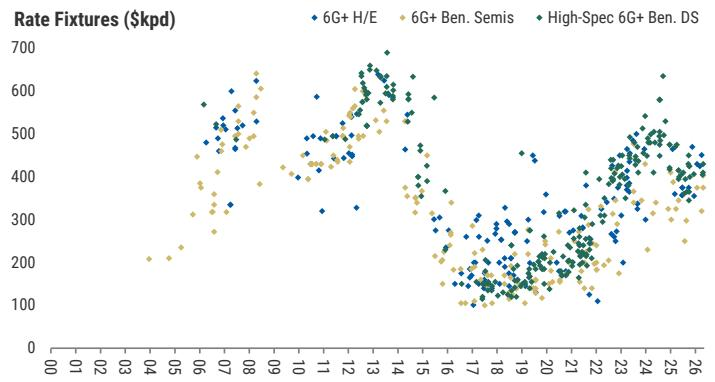

scatter

| Year | 6G+ H/E | 6G+ Ben. Semis | High-Spec 6G+ Ben. DS |
|------|---------|----------------|------------------------|
| 00   |         |                |                        |
| 01   |         |                |                        |
| 02   |         |                |                        |
| 03   |         |                |                        |
| 04   |         |                |                        |
| 05   |         |                |                        |
| 06   |         |                |                        |
| 07   |         |                |                        |
| 08   |         |                |                        |
| 09   |         |                |                        |
| 10   |         |                |                        |
| 11   |         |                |                        |
| 12   |         |                |                        |
| 13   |         |                |                        |
| 14   |         |                |                        |
| 15   |         |                |                        |
| 16   |         |                |                        |
| 17   |         |                |                        |
| 18   |         |                |                        |
| 19   |         |                |                        |
| 20   |         |                |                        |
| 21   |         |                |                        |
| 22   |         |                |                        |
| 23   |         |                |                        |
| 24   |         |                |                        |
| 25   |         |                |                        |
| 26   |         |                |                        |

Source: Rystad Energy, MS

Exhibit 47: T-12mo. Avg. Top Tier Floater Fixtures   
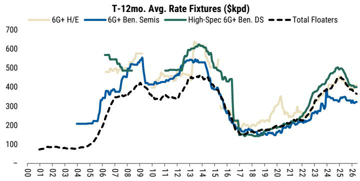

line

| Year | 6G+ H/E | 6G+ Ben. Semis | High-Spec 6G+ Ben. DS | Total Floaters |
|------|---------|----------------|------------------------|----------------|
| 00   |         |                |                        |                |
| 01   |         |                |                        |                |
| 02   |         |                |                        |                |
| 03   |         |                |                        |                |
| 04   |         |                |                        |                |
| 05   |         |                |                        |                |
| 06   |         |                |                        |                |
| 07   |         |                |                        |                |
| 08   |         |                |                        |                |
| 09   |         |                |                        |                |
| 10   |         |                |                        |                |
| 11   |         |                |                        |                |
| 12   |         |                |                        |                |
| 13   |         |                |                        |                |
| 14   |         |                |                        |                |
| 15   |         |                |                        |                |
| 16   |         |                |                        |                |
| 17   |         |                |                        |                |
| 18   |         |                |                        |                |
| 19   |         |                |                        |                |
| 20   |         |                |                        |                |
| 21   |         |                |                        |                |
| 22   |         |                |                        |                |
| 23   |         |                |                        |                |
| 24   |         |                |                        |                |
| 25   |         |                |                        |                |
| 26   |         |                |                        |                |

Source: Rystad Energy, MS

Exhibit 48:   
Latest Floater Contract Fixtures\* 

<table><tr><td>Fixture Date</td><td>Operator</td><td>Country</td><td>Rig Owner</td><td>Rig Name</td><td>Rig Type</td><td>Days</td><td>Rate ($kpd)</td></tr><tr><td>4/26/2026</td><td>ExxonMobil</td><td>Guyana</td><td>Noble Drilling</td><td>Noble Developer</td><td>Semisubmersible</td><td>50</td><td>375</td></tr><tr><td>4/26/2026</td><td>Woodside</td><td>Australia</td><td>Noble Drilling</td><td>Noble Deliverer</td><td>Semisubmersible</td><td>300</td><td>403</td></tr><tr><td>4/26/2026</td><td>Planet One</td><td>Ghana</td><td>Noble Drilling</td><td>Noble Venturer</td><td>Drillship</td><td>45</td><td>430</td></tr><tr><td>4/22/2026</td><td>Harbour Energy plc</td><td>United States</td><td>Seadrill Limited</td><td>West Vela</td><td>Drillship</td><td>273</td><td>410</td></tr><tr><td>4/16/2026</td><td>Chevron</td><td>Israel</td><td>Transocean</td><td>Deepwater Asgard</td><td>Drillship</td><td>390</td><td>405</td></tr><tr><td>4/7/2026</td><td>Harbour Energy plc</td><td>United Kingdom</td><td>Dolphin Drilling AS</td><td>Paul B Loyd Jr</td><td>Semisubmersible</td><td>913</td><td>164</td></tr><tr><td>4/2/2026</td><td>Petrobras</td><td>Brazil</td><td>Ventura Offshore</td><td>SSV Victoria</td><td>Semisubmersible</td><td>1,455</td><td>320</td></tr><tr><td>4/2/2026</td><td>Vaar Energi</td><td>Norway</td><td>Transocean</td><td>Transocean Barents</td><td>Semisubmersible</td><td>1,095</td><td>451</td></tr><tr><td>3/24/2026</td><td>Petrobras</td><td>Brazil</td><td>Foresea</td><td>ODN I</td><td>Drillship</td><td>1,443</td><td>303</td></tr><tr><td>3/6/2026</td><td>Suncor Energy</td><td>Canada</td><td>SFL Deepwater Ltd</td><td>Hercules</td><td>Semisubmersible</td><td>400</td><td>425</td></tr><tr><td>2/10/2026</td><td>ONGC (India)</td><td>India</td><td>Vantage Drilling</td><td>Platinum Explorer</td><td>Drillship</td><td>1,095</td><td>238</td></tr><tr><td>1/26/2026</td><td>Aker BP</td><td>Norway</td><td>Noble Drilling</td><td>Noble GreatWhite</td><td>Semisubmersible</td><td>1,095</td><td>430</td></tr><tr><td>1/26/2026</td><td>BP</td><td>Trinidad and Tobago</td><td>Noble Drilling</td><td>Noble Developer</td><td>Semisubmersible</td><td>240</td><td>375</td></tr><tr><td>1/26/2026</td><td>ExxonMobil</td><td>Nigeria</td><td>Noble Drilling</td><td>Noble Gerry de Souza</td><td>Drillship</td><td>730</td><td>400</td></tr><tr><td>1/26/2026</td><td>Navitas Petroleum</td><td>Falkland Islands</td><td>Noble Drilling</td><td>Noble Endeavor</td><td>Semisubmersible</td><td>516</td><td>300</td></tr><tr><td>1/21/2026</td><td>PTTEP</td><td>Malaysia</td><td>Seadrill Limited</td><td>West Capella</td><td>Drillship</td><td>440</td><td>345</td></tr><tr><td>1/5/2026</td><td>BP</td><td>Brazil</td><td>Transocean</td><td>Deepwater Mykonos</td><td>Drillship</td><td>302</td><td>426</td></tr><tr><td>12/11/2025</td><td>Shell</td><td>Brazil</td><td>Valaris plc</td><td>Valaris DS-8</td><td>Drillship</td><td>800</td><td>375</td></tr><tr><td>12/11/2025</td><td>Shell</td><td>Namibia</td><td>Northern Ocean Ltd</td><td>Deepsea Mira</td><td>Semisubmersible</td><td>43</td><td>356</td></tr><tr><td>12/8/2025</td><td>Chevron</td><td>Australia</td><td>Transocean</td><td>Deepwater Skyros</td><td>Drillship</td><td>320</td><td>406</td></tr><tr><td>11/26/2025</td><td>Karoon Energy</td><td>Brazil</td><td>Constellation</td><td>Atlantic Star</td><td>Semisubmersible</td><td>70</td><td>357</td></tr><tr><td>11/16/2025</td><td>Equinor</td><td>Norway</td><td>Odfjell Drilling</td><td>Deepsea Aberdeen</td><td>Semisubmersible</td><td>927</td><td>470</td></tr><tr><td>10/13/2025</td><td>BP</td><td>Egypt</td><td>Valaris plc</td><td>Valaris DS-12</td><td>Drillship</td><td>350</td><td>400</td></tr><tr><td>10/3/2025</td><td>BP</td><td>United States</td><td>Noble Drilling</td><td>Noble BlackHornet</td><td>Drillship</td><td>730</td><td>425</td></tr><tr><td>10/3/2025</td><td>BP</td><td>United States</td><td>Noble Drilling</td><td>Noble BlackLion</td><td>Drillship</td><td>730</td><td>425</td></tr><tr><td>10/1/2025</td><td>TotalEnergies</td><td>Angola</td><td>Sonangol</td><td>Quenguela</td><td>Drillship</td><td>210</td><td>365</td></tr><tr><td>9/26/2025</td><td>Eni</td><td>Indonesia</td><td>Deep Value Driller</td><td>Deep Value Driller</td><td>Drillship</td><td>134</td><td>345</td></tr><tr><td>9/25/2025</td><td>DNO International</td><td>Norway</td><td>Beacon Holdings Group Ltd.</td><td>Deepsea Yantai</td><td>Semisubmersible</td><td>69</td><td>375</td></tr><tr><td>9/25/2025</td><td>AMNI</td><td>Ghana</td><td>Noble Drilling</td><td>Noble Venturer</td><td>Drillship</td><td>28</td><td>450</td></tr><tr><td>9/18/2025</td><td>Walter</td><td>United States</td><td>Seadrill Limited</td><td>West Vela</td><td>Drillship</td><td>78</td><td>430</td></tr><tr><td>9/2/2025</td><td>Repsol</td><td>Spain</td><td>Dolphin Drilling AS</td><td>Borgland Dolphin</td><td>Semisubmersible</td><td>220</td><td>273</td></tr><tr><td>8/25/2025</td><td>Azule Energy</td><td>Angola</td><td>Sonangol</td><td>Libongos</td><td>Drillship</td><td>518</td><td>365</td></tr><tr><td>8/25/2025</td><td>Sonangol</td><td>Angola</td><td>Seadrill Limited</td><td>West Gemini</td><td>Drillship</td><td>277</td><td>365</td></tr><tr><td>8/19/2025</td><td>Eni</td><td>Libya</td><td>Saipem</td><td>Scarabeo 9</td><td>Semisubmersible</td><td>202</td><td>298</td></tr><tr><td>8/6/2025</td><td>Talos Energy Offshore</td><td>United States</td><td>Seadrill Limited</td><td>West Vela</td><td>Drillship</td><td>81</td><td>395</td></tr><tr><td>7/28/2025</td><td>Murphy Oil</td><td>United States</td><td>Seadrill Limited</td><td>Sevan Louisiana</td><td>Semisubmersible</td><td>107</td><td>250</td></tr><tr><td>7/24/2025</td><td>Petrobel (NOC)</td><td>Italy</td><td>Saipem</td><td>Saipem 10000</td><td>Drillship</td><td>219</td><td>358</td></tr><tr><td>7/22/2025</td><td>OMV</td><td>Bulgaria</td><td>Noble Drilling</td><td>Noble Globetrotter I</td><td>Drillship</td><td>111</td><td>450</td></tr><tr><td>7/16/2025</td><td>Murphy Oil</td><td>Cote d&#x27;lvoire</td><td>Transocean</td><td>Deepwater Skyros</td><td>Drillship</td><td>175</td><td>361</td></tr><tr><td>7/6/2025</td><td>Occidental Petroleum</td><td>United States</td><td>Valaris plc</td><td>Valaris DS-18</td><td>Drillship</td><td>914</td><td>410</td></tr><tr><td>6/23/2025</td><td>DNO International</td><td>Norway</td><td>Beacon Holdings Group Ltd.</td><td>Deepsea Yantai</td><td>Semisubmersible</td><td>31</td><td>375</td></tr><tr><td>6/23/2025</td><td>Wellesley Petroleum</td><td>Norway</td><td>Beacon Holdings Group Ltd.</td><td>Deepsea Yantai</td><td>Semisubmersible</td><td>56</td><td>375</td></tr><tr><td>6/19/2025</td><td>Rhino Resources</td><td>Namibia</td><td>Northern Ocean Ltd</td><td>Deepsea Mira</td><td>Semisubmersible</td><td>63</td><td>357</td></tr><tr><td>6/19/2025</td><td>BW Energy</td><td>Namibia</td><td>Northern Ocean Ltd</td><td>Deepsea Mira</td><td>Semisubmersible</td><td>72</td><td>357</td></tr><tr><td>6/4/2025</td><td>TotalEnergies</td><td>Papua New Guinea</td><td>Noble Drilling</td><td>Noble Viking</td><td>Drillship</td><td>47</td><td>405</td></tr><tr><td>5/5/2025</td><td>CNRL</td><td>Cote d&#x27;lvoire</td><td>Valaris plc</td><td>Valaris DS-15</td><td>Drillship</td><td>249</td><td>400</td></tr><tr><td>4/28/2025</td><td>Shell</td><td>United States</td><td>Noble Drilling</td><td>Noble Venturer</td><td>Drillship</td><td>1,460</td><td>415</td></tr><tr><td>4/28/2025</td><td>Shell</td><td>United States</td><td>Noble Drilling</td><td>Noble Voyager</td><td>Drillship</td><td>1,461</td><td>415</td></tr><tr><td>4/28/2025</td><td>TotalEnergies</td><td>Suriname</td><td>Noble Drilling</td><td>Noble Discoverer</td><td>Semisubmersible</td><td>1,060</td><td>345</td></tr><tr><td>4/28/2025</td><td>TotalEnergies</td><td>Suriname</td><td>Noble Drilling</td><td>Noble Valiant</td><td>Drillship</td><td>1,060</td><td>395</td></tr><tr><td>3/31/2025</td><td>Shell</td><td>Nigeria</td><td>Valaris plc</td><td>Valaris DS-10</td><td>Drillship</td><td>732</td><td>475</td></tr><tr><td>3/20/2025</td><td>POSCO International</td><td>Myanmar</td><td>CIMC Raffles</td><td>Bluewhale I</td><td>Semisubmersible</td><td>245</td><td>325</td></tr><tr><td>3/10/2025</td><td>Shell</td><td>Brunei</td><td>Noble Drilling</td><td>Noble Viking</td><td>Drillship</td><td>46</td><td>470</td></tr><tr><td>3/3/2025</td><td>OKEA</td><td>Norway</td><td>Beacon Holdings Group Ltd.</td><td>Deepsea Yantai</td><td>Semisubmersible</td><td>182</td><td>360</td></tr><tr><td>2/6/2025</td><td>Shell</td><td>Trinidad and Tobago</td><td>Noble Drilling</td><td>Noble Developer</td><td>Semisubmersible</td><td>116</td><td>388</td></tr><tr><td>1/29/2025</td><td>Equinor</td><td>Norway</td><td>Odfjell Drilling</td><td>Deepsea Atlantic</td><td>Semisubmersible</td><td>359</td><td>465</td></tr><tr><td>1/10/2025</td><td>Walter</td><td>United States</td><td>Seadrill Limited</td><td>Sevan Louisiana</td><td>Semisubmersible</td><td>141</td><td>300</td></tr></table>

Source: Rystad Energy, MS. Contracts over 1 year are in bold. \*Note: Excludes contracts where rate information is not available.

# Floater Supply Trends

Exhibit 49: Floater Utilization Snapshot 

<table><tr><td rowspan="2">Rig Class</td><td rowspan="2">Working</td><td rowspan="2">Warm</td><td rowspan="2"># of Rigs Newb.</td><td rowspan="2">Cold</td><td rowspan="2">Total</td><td colspan="3">Utilization Measures</td></tr><tr><td>W+W</td><td>W+W+N</td><td>Total</td></tr><tr><td colspan="9">Harsh (All):</td></tr><tr><td>Pre-6G</td><td>5</td><td>4</td><td>-</td><td>-</td><td>9</td><td>56%</td><td>56%</td><td>56%</td></tr><tr><td>6G+</td><td>23</td><td>3</td><td>-</td><td>2</td><td>28</td><td>88%</td><td>88%</td><td>82%</td></tr><tr><td>Total Harsh</td><td>28</td><td>7</td><td>-</td><td>2</td><td>37</td><td>80%</td><td>80%</td><td>76%</td></tr><tr><td colspan="9">Benign Semis:</td></tr><tr><td>Pre-6G</td><td>13</td><td>5</td><td>-</td><td>2</td><td>20</td><td>72%</td><td>72%</td><td>65%</td></tr><tr><td>6G+</td><td>14</td><td>6</td><td>-</td><td>5</td><td>25</td><td>70%</td><td>70%</td><td>56%</td></tr><tr><td>Total Semis</td><td>27</td><td>11</td><td>-</td><td>7</td><td>45</td><td>71%</td><td>71%</td><td>60%</td></tr><tr><td colspan="9">Benign Drillships:</td></tr><tr><td>Pre-6G</td><td>3</td><td>-</td><td>-</td><td>3</td><td>6</td><td>100%</td><td>100%</td><td>50%</td></tr><tr><td>Low-Mid 6G+</td><td>25</td><td>2</td><td>-</td><td>1</td><td>28</td><td>93%</td><td>93%</td><td>89%</td></tr><tr><td>High-Spec 6G+</td><td>45</td><td>6</td><td>-</td><td>6</td><td>57</td><td>88%</td><td>88%</td><td>79%</td></tr><tr><td>Total Drillships</td><td>73</td><td>8</td><td>-</td><td>10</td><td>91</td><td>90%</td><td>90%</td><td>80%</td></tr><tr><td>Total Floaters</td><td>128</td><td>26</td><td>-</td><td>19</td><td>173</td><td>83%</td><td>83%</td><td>74%</td></tr></table>

Source: Rystad Energy, MS. "Working" rigs include rigs in the yard or moving to location. "Working" defined as rigs in the yard preparing for work, mobilizing to/from location or on location. "Newb." = "Newbuilds. Excludes newbuilds currently held by shipyard without an affiliated rig contractor." "W+W" utilization includes Working and Warm-Stacked rigs. "W+W+N" includes Working, Warm-Stacked, and Newbuild Rigs.

Exhibit 50: Floater Supply by Contract Status   
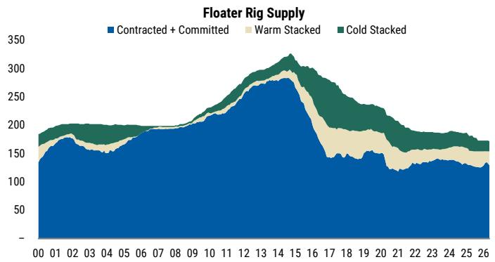

area

| Year | Contracted + Committed | Warm Stacked | Cold Stacked |
|------|------------------------|--------------|--------------|
| 00   | 140                    | 10           | 20           |
| 01   | 150                    | 15           | 25           |
| 02   | 160                    | 15           | 25           |
| 03   | 170                    | 15           | 25           |
| 04   | 180                    | 15           | 25           |
| 05   | 190                    | 15           | 25           |
| 06   | 200                    | 15           | 25           |
| 07   | 210                    | 15           | 25           |
| 08   | 220                    | 15           | 25           |
| 09   | 230                    | 15           | 25           |
| 10   | 240                    | 15           | 25           |
| 11   | 250                    | 15           | 25           |
| 12   | 260                    | 15           | 25           |
| 13   | 270                    | 15           | 25           |
| 14   | 280                    | 15           | 25           |
| 15   | 290                    | 15           | 25           |
| 16   | 280                    | 15           | 25           |
| 17   | 270                    | 15           | 25           |
| 18   | 260                    | 15           | 25           |
| 19   | 250                    | 15           | 25           |
| 20   | 240                    | 15           | 25           |
| 21   | 230                    | 15           | 25           |
| 22   | 220                    | 15           | 25           |
| 23   | 210                    | 15           | 25           |
| 24   | 200                    | 15           | 25           |
| 25   | 190                    | 15           | 25           |
| 26   | 180                    | 15           | 25           |

Source: Rystad Energy, MS estimates. Note: "Contracted + Committed" = Contracted & Working + Contracted & Not Working + Committed.

Exhibit 51: Floater Supply by Status & Contract Status   
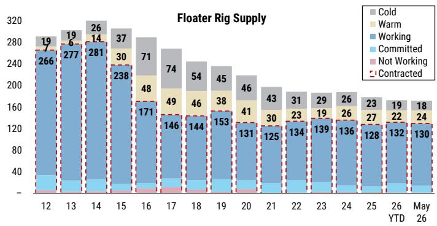

bar_stacked

| Month | Contracted | Not Working | Committed | Working | Warm | Cold |
|-------|------------|-------------|-----------|---------|------|------|
| 12    | 7          | 19          | 266       | 277     | 19   | 6    |
| 13    | 14         | 26          | 14        | 281     | 14   | 6    |
| 14    | 30         | 37          | 30        | 238     | 48   | 14   |
| 15    | 171        | 71          | 48        | 146     | 49   | 74   |
| 16    | 144        | 54          | 38        | 153     | 46   | 54   |
| 17    | 131        | 45          | 41        | 125     | 30   | 46   |
| 18    | 125        | 43          | 30        | 125     | 30   | 46   |
| 19    | 139        | 31          | 23        | 125     | 23   | 46   |
| 20    | 136        | 29          | 19        | 125     | 26   | 46   |
| 21    | 128        | 26          | 27        | 125     | 26   | 46   |
| 22    | 132        | 23          | 27        | 125     | 26   | 46   |
| 23    | 130        | 19          | 22        | 125     | 26   | 46   |
| 24    | -          | -           | -         | -       | -    | -    |
| 25    | -          | -           | -         | -       | -    | -    |
| 26 YTD| -          | -           | -         | -       | -    | -    |
| May 26| -          | -           | -         | -       | -    | -    |
The chart displays the total supply for Floater Rig Supply over time from December to May. The values for each category are labeled on the bars. The data is presented in a table format with columns for 'Year' and 'Month'.

Source: Rystad Energy, MS estimates. Note: "Not Working" = Contracted & Not Working, "Working" = Contracted & Working, "Warm" = Warm Stacked, "Cold" = Cold Stacked.

Exhibit 52: Floater Retirements   
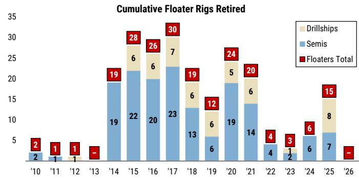

bar_stacked

| Year | Drillships | Semis | Floaters Total |
| ---- | ---------- | ----- | -------------- |
| '10  | 2          | 2     | 2              |
| '11  | 1          | 1     | 1              |
| '12  | 1          | 1     | 1              |
| '13  | -          | -     | -              |
| '14  | 19         | 19    | 19             |
| '15  | 6          | 22    | 28             |
| '16  | 6          | 20    | 26             |
| '17  | 7          | 23    | 30             |
| '18  | 6          | 13    | 19             |
| '19  | 6          | 6     | 12             |
| '20  | 5          | 19    | 24             |
| '21  | 6          | 14    | 20             |
| '22  | -          | 4     | 4              |
| '23  | -          | 1     | 3              |
| '24  | -          | 6     | 6              |
| '25  | -          | 7     | 15             |
| '26  | -          | -     | -              |

Source: Rystad Energy, MS estimates

Exhibit 53: Floater Retirements by Year (Cumulative)   
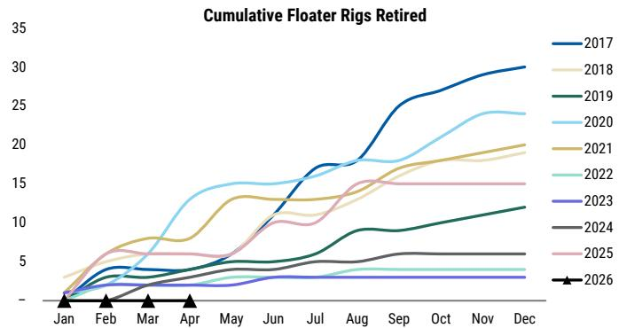  
Source: Rystad Energy, MS estimates

# Jackup Macro Trends

# Jackup Utilization & Dayrate Snapshot

Exhibit 54: Global Jackup Utilization & Pricing   
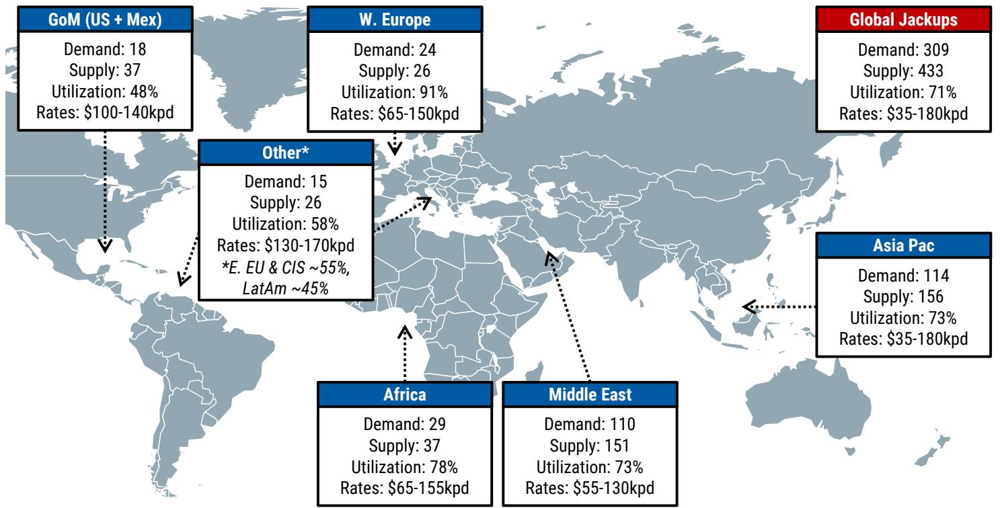

geo

| Region           | Demand | Supply | Utilization | Rates Range             |
| ---------------- | ------ | ------ | ----------- | ------------------------ |
| GoM (US + Mex)   | 18     | 37     | 48%         | $100-140kpd              |
| W. Europe        | 24     | 26     | 91%         | $65-150kpd               |
| Global Jackups    | 309    | 433    | 71%         | $35-180kpd               |
| Asia Pac         | 114    | 156    | 73%         | $35-180kpd               |
| Africa           | 29     | 37     | 78%         | $65-155kpd               |
| Middle East      | 110    | 151    | 73%         | $55-130kpd               |
| Other*           | 15     | 26     | 58%         | $130-170kpd              |

Source: Rystad Energy, MS estimates. Note: "Demand" = current contracted & working rigs, "Supply" = marketed supply, i.e., excluding cold stacked rigs, "Utilization" = current marked utilization, "Rates" = dayrate range (min/max) in region over prior \~1-2yrs.

# Jackup Contracting Trends

Exhibit 55: Jackup Demand   
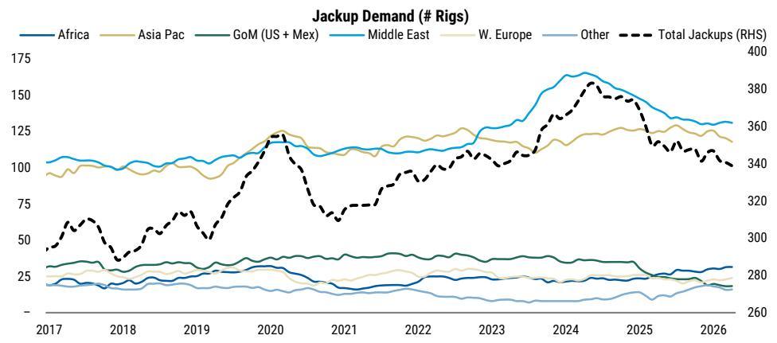

line

| Year | Africa | Asia Pac | GoM (US + Mex) | Middle East | W. Europe | Other | Total Jackups (RHS) |
|------|--------|----------|----------------|-------------|-----------|-------|---------------------|
| 2017 | ~20    | ~95      | ~30            | ~105        | ~280      | ~20   | ~300                |
| 2018 | ~25    | ~100     | ~35            | ~105        | ~280      | ~20   | ~350                |
| 2019 | ~25    | ~100     | ~35            | ~105        | ~280      | ~20   | ~350                |
| 2020 | ~30    | ~125     | ~35            | ~115        | ~280      | ~20   | ~360                |
| 2021 | ~25    | ~115     | ~35            | ~115        | ~280      | ~20   | ~360                |
| 2022 | ~25    | ~125     | ~35            | ~115        | ~280      | ~20   | ~360                |
| 2023 | ~25    | ~125     | ~35            | ~125        | ~280      | ~20   | ~360                |
| 2024 | ~25    | ~125     | ~35            | ~165        | ~280      | ~20   | ~380                |
| 2025 | ~25    | ~125     | ~35            | ~145        | ~280      | ~20   | ~360                |
| 2026 | ~25    | ~115     | ~35            | ~135        | ~280      | ~20   | ~340                |

Source: Rystad Energy, MS

Exhibit 56: Rig Years Contracted (Quarterly)   
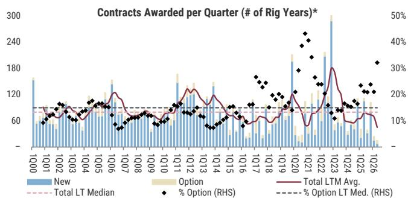  
\* "New" = New Unique Contract, "Option" = Exercised Option + Contract Extension   
Source: Rystad Energy, MS. Note: Includes new unique contracts, contract extensions and exercised options.

Exhibit 58: Contract Lead Time & Duration   
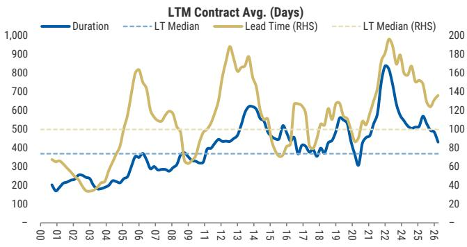

line

| Year | Duration | Lead Time (RHS) |
|------|----------|-----------------|
| 00   | 150      | 30              |
| 01   | 200      | 35              |
| 02   | 250      | 40              |
| 03   | 200      | 30              |
| 04   | 180      | 45              |
| 05   | 220      | 60              |
| 06   | 350      | 80              |
| 07   | 300      | 65              |
| 08   | 320      | 55              |
| 09   | 350      | 45              |
| 10   | 380      | 50              |
| 11   | 400      | 60              |
| 12   | 450      | 75              |
| 13   | 500      | 90              |
| 14   | 600      | 85              |
| 15   | 550      | 70              |
| 16   | 500      | 65              |
| 17   | 450      | 60              |
| 18   | 400      | 55              |
| 19   | 450      | 65              |
| 20   | 300      | 50              |
| 21   | 400      | 65              |
| 22   | 850      | 175             |
| 23   | 750      | 165             |
| 24   | 650      | 155             |
| 25   | 550      | 145             |
| 26   | 450      | 135             |

Source: Rystad Energy, MS

Exhibit 60: Jackup Fixtures – Rystad Rig Class   
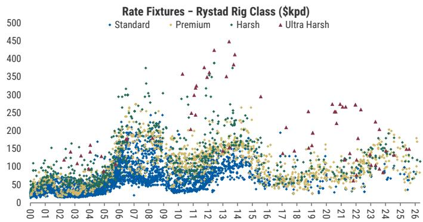

scatter

| Date | Standard | Premium | Harsh | Ultra Harsh |
|------|----------|---------|-------|-------------|
| 00   | 0        | 0       | 0     | 0           |
| 01   | 0        | 0       | 0     | 0           |
| 02   | 0        | 0       | 0     | 0           |
| 03   | 0        | 0       | 0     | 0           |
| 04   | 0        | 0       | 0     | 0           |
| 05   | 0        | 0       | 0     | 0           |
| 06   | 0        | 0       | 0     | 0           |
| 07   | 0        | 0       | 0     | 0           |
| 08   | 0        | 0       | 0     | 0           |
| 09   | 0        | 0       | 0     | 0           |
| 10   | 0        | 0       | 0     | 0           |
| 11   | 0        | 0       | 0     | 0           |
| 12   | 0        | 0       | 0     | 0           |
| 13   | 0        | 0       | 0     | 0           |
| 14   | 0        | 0       | 0     | 0           |
| 15   | 0        | 0       | 0     | 0           |
| 16   | 0        | 0       | 0     | 0           |
| 17   | 0        | 0       | 0     | 0           |
| 18   | 0        | 0       | 0     | 0           |
| 19   | 0        | 0       | 0     | 0           |
| 20   | 0        | 0       | 0     | 0           |
| 21   | 0        | 0       | 0     | 0           |
| 22   | 0        | 0       | 0     | 0           |
| 23   | 0        | 0       | 0     | 0           |
| 24   | 0        | 0       | 0     | 0           |
| 25   | 0        | 0       | 0     | 0           |
| 26   | 0        | 0       | 0     | 0           |

Source: Rystad Energy, MS

Exhibit 57: Cumulative Contracting Activity per Year   
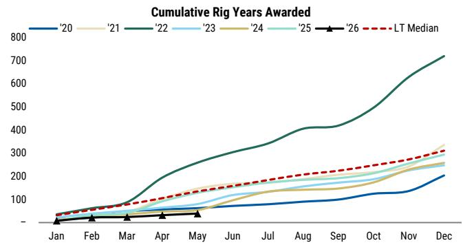

line

| Month | '20  | '21  | '22  | '23  | '24  | '25  | '26  | LT Median |
|-------|------|------|------|------|------|------|------|-----------|
| Jan   | -    | -    | -    | -    | -    | -    | -    | -         |
| Feb   | -    | -    | -    | -    | -    | -    | -    | -         |
| Mar   | -    | -    | -    | -    | -    | -    | -    | -         |
| Apr   | -    | -    | 100  | -    | -    | -    | -    | 100       |
| May   | -    | -    | 200  | -    | -    | -    | -    | 150       |
| Jun   | -    | -    | 300  | -    | -    | -    | -    | 175       |
| Jul   | -    | -    | 350  | -    | -    | -    | -    | 200       |
| Aug   | -    | -    | 400  | -    | -    | -    | -    | 225       |
| Sep   | -    | -    | 450  | -    | -    | -    | -    | 250       |
| Oct   | -    | -    | 500  | -    | -    | -    | -    | 275       |
| Nov   | -    | -    | 600  | -    | -    | -    | -    | 300       |
| Dec   | 200  | 300  | 700  | 250  | 250  | 250  | 250  | 325       |

Source: Rystad Energy, MS. Note: Includes new unique contracts, contract extensions and exercised options.

Exhibit 59: Rig Years Contracted by Operator   
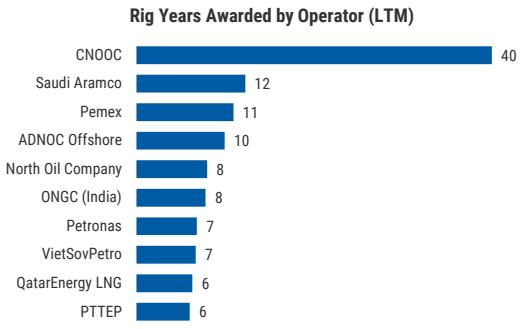

bar

Rig Years Awarded by Operator (LTM)
| Operator | Rig Years Awarded |
| :--- | :--- |
| CNOOC | 40 |
| Saudi Aramco | 12 |
| Pemex | 11 |
| ADNOC Offshore | 10 |
| North Oil Company | 8 |
| ONGC (India) | 8 |
| Petronas | 7 |
| VietSovPetro | 7 |
| QatarEnergy LNG | 6 |
| PTTEP | 6 |

Source: Rystad Energy, MS. Note: Includes new unique contracts, contract extensions and exercised options.

Exhibit 61: T-12mo. Avg. Jackup Fixtures – Rystad Rig Class\*   
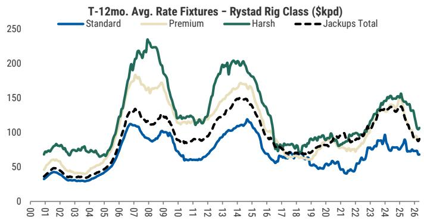

line

| Year | Standard | Premium | Harsh | Jackups Total |
|------|----------|---------|-------|---------------|
| 00   | 30       | 40      | 60    | 50            |
| 01   | 35       | 45      | 65    | 55            |
| 02   | 40       | 50      | 70    | 60            |
| 03   | 45       | 55      | 75    | 65            |
| 04   | 50       | 60      | 80    | 70            |
| 05   | 55       | 65      | 85    | 75            |
| 06   | 60       | 70      | 90    | 80            |
| 07   | 70       | 80      | 100   | 90            |
| 08   | 80       | 90      | 110   | 100           |
| 09   | 90       | 100     | 120   | 110           |
| 10   | 100      | 110     | 130   | 120           |
| 11   | 110      | 120     | 140   | 130           |
| 12   | 120      | 130     | 150   | 140           |
| 13   | 130      | 140     | 160   | 150           |
| 14   | 140      | 150     | 170   | 160           |
| 15   | 150      | 160     | 180   | 170           |
| 16   | 160      | 170     | 190   | 180           |
| 17   | 170      | 180     | 200   | 190           |
| 18   | 180      | 190     | 210   | 200           |
| 19   | 190      | 200     | 220   | 210           |
| 20   | 200      | 210     | 230   | 220           |
| 21   | 210      | 220     | 240   | 230           |
| 22   | 220      | 230     | 250   | 240           |
| 23   | 230      | 240     | 260   | 250           |
| 24   | 240      | 250     | 270   | 260           |
| 25   | 250      | 260     | 280   | 270           |
| 26   | 260      | 270     | 290   | 280           |

Source: Rystad Energy, MS. \*Note: Excludes Ultra Harsh standalone data series due to sporadic data points

Exhibit 62: Jackup Fixtures – MS Rig Class   
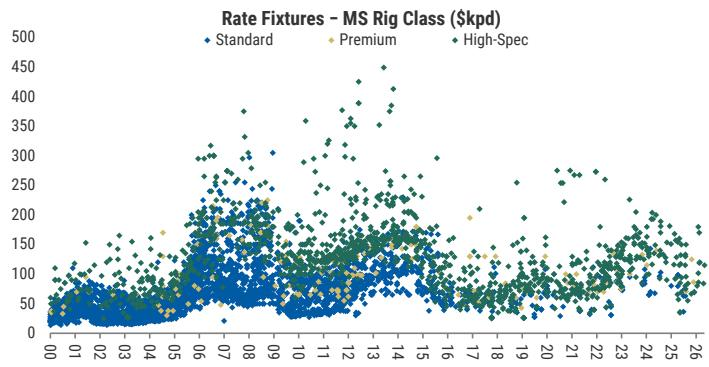

scatter

| Date | Standard | Premium | High-Spec |
|------|----------|---------|-----------|
| 00   | ~20      | ~30     | ~40       |
| 01   | ~30      | ~40     | ~50       |
| 02   | ~40      | ~50     | ~60       |
| 03   | ~50      | ~60     | ~70       |
| 04   | ~60      | ~70     | ~80       |
| 05   | ~70      | ~80     | ~90       |
| 06   | ~80      | ~90     | ~100      |
| 07   | ~90      | ~100    | ~110      |
| 08   | ~100     | ~110    | ~120      |
| 09   | ~110     | ~120    | ~130      |
| 10   | ~120     | ~130    | ~140      |
| 11   | ~130     | ~140    | ~150      |
| 12   | ~140     | ~150    | ~160      |
| 13   | ~150     | ~160    | ~170      |
| 14   | ~160     | ~170    | ~180      |
| 15   | ~170     | ~180    | ~190      |
| 16   | ~180     | ~190    | ~200      |
| 17   | ~190     | ~200    | ~210      |
| 18   | ~200     | ~210    | ~220      |
| 19   | ~210     | ~220    | ~230      |
| 20   | ~220     | ~230    | ~240      |
| 21   | ~230     | ~240    | ~250      |
| 22   | ~240     | ~250    | ~260      |
| 23   | ~250     | ~260    | ~270      |
| 24   | ~260     | ~270    | ~280      |
| 25   | ~270     | ~280    | ~290      |
| 26   | ~280     | ~290    | ~300      |

Source: Rystad Energy, MS

Exhibit 63: T-12mo. Avg. Jackup Fixtures – MS Rig Class   
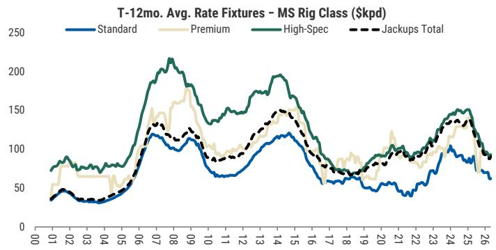

line

| Month | Standard | Premium | High-Spec | Jackups Total |
|-------|----------|---------|-----------|---------------|
| 00    | 30       | 40      | 70        | 35            |
| 01    | 35       | 45      | 75        | 40            |
| 02    | 40       | 50      | 80        | 45            |
| 03    | 45       | 55      | 85        | 50            |
| 04    | 50       | 60      | 90        | 55            |
| 05    | 55       | 65      | 95        | 60            |
| 06    | 60       | 70      | 100       | 65            |
| 07    | 70       | 80      | 110       | 75            |
| 08    | 80       | 90      | 120       | 85            |
| 09    | 90       | 100     | 130       | 95            |
| 10    | 100      | 110     | 140       | 105           |
| 11    | 110      | 120     | 150       | 115           |
| 12    | 120      | 130     | 160       | 125           |
| 13    | 130      | 140     | 170       | 135           |
| 14    | 140      | 150     | 180       | 145           |
| 15    | 150      | 160     | 190       | 155           |
| 16    | 160      | 170     | 200       | 165           |
| 17    | 170      | 180     | 210       | 175           |
| 18    | 180      | 190     | 220       | 185           |
| 19    | 190      | 200     | 230       | 195           |
| 20    | 200      | 210     | 240       | 205           |
| 21    | 210      | 220     | 250       | 215           |
| 22    | 220      | 230     | 260       | 225           |
| 23    | 230      | 240     | 270       | 235           |
| 24    | 240      | 250     | 280       | 245           |
| 25    | 250      | 260     | 290       | 255           |
| 26    | 260      | 270     | 300       | 265           |

Source: Rystad Energy, MS

# Exhibit 64:

Latest Jackup Contract Fixtures\* 

<table><tr><td>Fixture Date</td><td>Operator</td><td>Country</td><td>Rig Owner</td><td>Rig Name</td><td>Days</td><td>Rate ($kpd)</td></tr><tr><td>5/4/2026</td><td>Ineos Group</td><td>United Kingdom</td><td>Valaris plc</td><td>Valaris 122</td><td>162</td><td>115</td></tr><tr><td>2/24/2026</td><td>MedcoEnergi</td><td>Indonesia</td><td>Valaris plc</td><td>Valaris 106</td><td>45</td><td>120</td></tr><tr><td>2/17/2026</td><td>PTTEP</td><td>Thailand</td><td>Borr Drilling</td><td>Idun</td><td>63</td><td>170</td></tr><tr><td>2/17/2026</td><td>Spirit Energy</td><td>United Kingdom</td><td>Valaris plc</td><td>Valaris 248</td><td>294</td><td>119</td></tr><tr><td>1/16/2026</td><td>TAQA</td><td>Netherlands</td><td>Valaris plc</td><td>Valaris 123</td><td>104</td><td>80</td></tr><tr><td>10/27/2025</td><td>Eni</td><td>Netherlands</td><td>Borr Drilling</td><td>Bestla</td><td>364</td><td>125</td></tr><tr><td>8/5/2025</td><td>BP</td><td>United Kingdom</td><td>Noble Drilling</td><td>Noble Intrepid</td><td>171</td><td>150</td></tr><tr><td>8/1/2025</td><td>Cairn Energy</td><td>India</td><td>Greatship Global</td><td>Greatdrill Chetna</td><td>216</td><td>75</td></tr><tr><td>7/29/2025</td><td>SNOC</td><td>UAE</td><td>Arabian Drilling Co.</td><td>Arabdrill 70</td><td>143</td><td>130</td></tr><tr><td>7/28/2025</td><td>GEMPETCO</td><td>Egypt</td><td>ADES</td><td>Rig 141</td><td>364</td><td>63</td></tr><tr><td>7/28/2025</td><td>Hibiscus Petroleum</td><td>United Kingdom</td><td>ADES</td><td>Shelf Drilling Fortress</td><td>76</td><td>133</td></tr><tr><td>7/24/2025</td><td>Eni</td><td>United Kingdom</td><td>Valaris plc</td><td>Valaris 120</td><td>273</td><td>115</td></tr><tr><td>4/30/2025</td><td>EOG Resources</td><td>Trinidad and Tobago</td><td>Valaris plc</td><td>Valaris 117</td><td>545</td><td>160</td></tr><tr><td>4/17/2025</td><td>Oil India</td><td>India</td><td>Greatship Global</td><td>Greatdrill Chaaya</td><td>180</td><td>57</td></tr><tr><td>4/8/2025</td><td>Foxtrot International</td><td>Cote d&#x27;lvoire</td><td>Borr Drilling</td><td>Gerd</td><td>364</td><td>155</td></tr><tr><td>4/8/2025</td><td>VietSovPetro</td><td>Vietnam</td><td>Borr Drilling</td><td>Thor</td><td>108</td><td>155</td></tr><tr><td>10/15/2024</td><td>Eni</td><td>Mexico</td><td>Valaris plc</td><td>Valaris 117</td><td>315</td><td>120</td></tr><tr><td>10/10/2024</td><td>First E&amp;P</td><td>Nigeria</td><td>ADES</td><td>Shelf Drilling Achiever</td><td>1,095</td><td>128</td></tr><tr><td>7/29/2024</td><td>Shell</td><td>Trinidad and Tobago</td><td>Valaris plc</td><td>Valaris 249</td><td>366</td><td>181</td></tr><tr><td>7/22/2024</td><td>Central European Petroleum</td><td>Poland</td><td>Noble Drilling</td><td>Noble Resolve</td><td>90</td><td>140</td></tr><tr><td>5/28/2024</td><td>Harbour Energy plc</td><td>United Kingdom</td><td>Borr Drilling</td><td>Joro</td><td>69</td><td>140</td></tr><tr><td>5/23/2024</td><td>Mellitah Oil &amp; Gas B.V</td><td>Libya</td><td>Borr Drilling</td><td>Vali</td><td>461</td><td>200</td></tr><tr><td>5/10/2024</td><td>Enagas</td><td>Spain</td><td>Noble Drilling</td><td>Noble Resolve</td><td>498</td><td>149</td></tr><tr><td>4/22/2024</td><td>TotalEnergies</td><td>United Kingdom</td><td>ADES</td><td>Shelf Drilling Fortress</td><td>260</td><td>135</td></tr><tr><td>4/8/2024</td><td>PTTEP</td><td>Malaysia</td><td>Borr Drilling</td><td>Gunnlod</td><td>89</td><td>193</td></tr><tr><td>3/15/2024</td><td>ONE-Dyas</td><td>United Kingdom</td><td>Borr Drilling</td><td>Prospector 1</td><td>254</td><td>193</td></tr><tr><td>2/8/2024</td><td>EGPC (Egypt)</td><td>Egypt</td><td>ADES</td><td>Admarine V</td><td>121</td><td>65</td></tr><tr><td>2/8/2024</td><td>EGPC (Egypt)</td><td>Egypt</td><td>ADES</td><td>Admarine VI</td><td>729</td><td>65</td></tr><tr><td>2/6/2024</td><td>Petronas</td><td>Malaysia</td><td>Velesto Energy</td><td>Naga 2</td><td>271</td><td>100</td></tr><tr><td>2/6/2024</td><td>Petronas</td><td>Malaysia</td><td>Velesto Energy</td><td>Naga 4</td><td>741</td><td>130</td></tr><tr><td>2/5/2024</td><td>Shell</td><td>United Kingdom</td><td>Valaris plc</td><td>Valaris 123</td><td>214</td><td>136</td></tr><tr><td>1/9/2024</td><td>Eni</td><td>Australia</td><td>Valaris plc</td><td>Valaris 247</td><td>101</td><td>180</td></tr><tr><td>1/9/2024</td><td>Ithaca Energy (Delek Group)</td><td>United Kingdom</td><td>Valaris plc</td><td>Valaris 123</td><td>84</td><td>140</td></tr><tr><td>1/9/2024</td><td>Wintershall</td><td>Denmark</td><td>Borr Drilling</td><td>Joro</td><td>56</td><td>115</td></tr></table>

Source: Rystad Energy, MS. Contracts over 1 year are in bold. \*Note: Excludes contracts where rate information is not available

# Jackup Supply Trends

Exhibit 65: Jackup Utilization Snapshot 

<table><tr><td rowspan="2">Rig Class</td><td colspan="5"># of Rigs</td><td colspan="3">Utilization Measures</td></tr><tr><td>Working</td><td>Warm</td><td>Newb.</td><td>Cold</td><td>Total</td><td>W+W</td><td>W+W+N</td><td>Total</td></tr><tr><td>Harsh:</td><td></td><td></td><td></td><td></td><td></td><td></td><td></td><td></td></tr><tr><td>Standard</td><td>2</td><td>1</td><td>-</td><td>-</td><td>3</td><td>67%</td><td>67%</td><td>67%</td></tr><tr><td>Premium</td><td>6</td><td>1</td><td>-</td><td>1</td><td>8</td><td>86%</td><td>86%</td><td>75%</td></tr><tr><td>High-Spec</td><td>35</td><td>8</td><td>-</td><td>1</td><td>44</td><td>81%</td><td>81%</td><td>80%</td></tr><tr><td>Total Harsh</td><td>43</td><td>10</td><td>-</td><td>2</td><td>55</td><td>81%</td><td>81%</td><td>78%</td></tr><tr><td>Benign:</td><td></td><td></td><td></td><td></td><td></td><td></td><td></td><td></td></tr><tr><td>Standard</td><td>68</td><td>25</td><td>-</td><td>33</td><td>126</td><td>73%</td><td>73%</td><td>54%</td></tr><tr><td>Premium</td><td>104</td><td>21</td><td>-</td><td>8</td><td>133</td><td>83%</td><td>83%</td><td>78%</td></tr><tr><td>High-Spec</td><td>135</td><td>27</td><td>2</td><td>3</td><td>167</td><td>83%</td><td>82%</td><td>81%</td></tr><tr><td>Total Benign</td><td>307</td><td>73</td><td>2</td><td>44</td><td>426</td><td>81%</td><td>80%</td><td>72%</td></tr><tr><td>Total Jackups</td><td>350</td><td>83</td><td>2</td><td>46</td><td>481</td><td>81%</td><td>80%</td><td>73%</td></tr></table>

Source: "Working" defined as rigs in the yard preparing for work, mobilizing to/from location or on location. "Newb." = "Newbuilds." "Ret." = "Retirement Candidates." "W+W" utilization includes Working and Warm-Stacked rigs. "W+W+N" includes Working, Warm-Stacked, and Newbuild Rigs. Rystad Energy, MS. "Working" rigs include rigs in the yard or moving to location.

Exhibit 66: Jackup Supply by Contract Status   
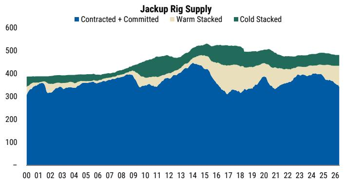

area_stacked

| Year | Contracted + Committed | Warm Stacked | Cold Stacked |
|------|------------------------|---------------|---------------|
| 00   | 300                    | 50            | 50            |
| 01   | 320                    | 40            | 50            |
| 02   | 330                    | 40            | 50            |
| 03   | 340                    | 40            | 50            |
| 04   | 350                    | 40            | 50            |
| 05   | 360                    | 40            | 50            |
| 06   | 370                    | 40            | 50            |
| 07   | 380                    | 40            | 50            |
| 08   | 390                    | 40            | 50            |
| 09   | 400                    | 40            | 50            |
| 10   | 410                    | 40            | 50            |
| 11   | 420                    | 40            | 50            |
| 12   | 430                    | 40            | 50            |
| 13   | 440                    | 40            | 50            |
| 14   | 450                    | 40            | 50            |
| 15   | 460                    | 40            | 50            |
| 16   | 470                    | 40            | 50            |
| 17   | 480                    | 40            | 50            |
| 18   | 490                    | 40            | 50            |
| 19   | 500                    | 40            | 50            |
| 20   | 510                    | 40            | 50            |
| 21   | 520                    | 40            | 50            |
| 22   | 530                    | 40            | 50            |
| 23   | 540                    | 40            | 50            |
| 24   | 550                    | 40            | 50            |
| 25   | 560                    | 40            | 50            |
| 26   | 570                    | 40            | 50            |

Source: Rystad Energy, MS estimates. Note: "Contracted + Committed" = Contracted & Working + Contracted & Not Working + Committed.

Exhibit 67: Jackup Supply by Status & Contract Status   
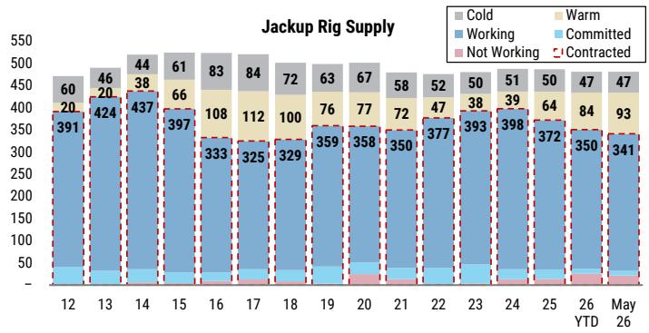

bar_stacked

| Month | Cold | Working | Warm | Committed | Not Working | Contracted |
|-------|------|---------|------|-----------|-------------|------------|
| 12    | 60   | 391     | 20   | 0         | 0           | 0          |
| 13    | 46   | 424     | 20   | 0         | 0           | 0          |
| 14    | 44   | 437     | 38   | 0         | 0           | 0          |
| 15    | 61   | 397     | 66   | 0         | 0           | 0          |
| 16    | 83   | 333     | 108  | 0         | 0           | 0          |
| 17    | 84   | 325     | 112  | 0         | 0           | 0          |
| 18    | 72   | 329     | 100  | 0         | 0           | 0          |
| 19    | 63   | 359     | 76   | 0         | 0           | 0          |
| 20    | 67   | 358     | 77   | 0         | 0           | 0          |
| 21    | 58   | 350     | 72   | 0         | 0           | 0          |
| 22    | 52   | 377     | 47   | 0         | 0           | 0          |
| 23    | 50   | 393     | 38   | 0         | 0           | 0          |
| 24    | 51   | 398     | 39   | 0         | 0           | 0          |
| 25    | 50   | 372     | 64   | 0         | 0           | 0          |
| 26 YTD| 47   | 350     | 84   | 0         | 0           | 0          |
| May 26| 47   | 341     | 93   | 0         | 0           | 0          |

Source: Rystad Energy, MS estimates. Note: "Not Working" = Contracted & Not Working, "Working" = Contracted & Working, "Warm" = Warm Stacked, "Cold" = Cold Stacked.

Exhibit 68: Jackup Retirements   
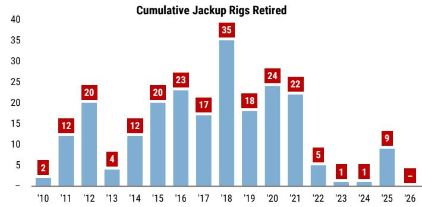

bar

| Year | Cumulative Jackup Rigs Retired |
| ---- | ------------------------------ |
| '10  | 2                              |
| '11  | 12                             |
| '12  | 20                             |
| '13  | 4                              |
| '14  | 12                             |
| '15  | 20                             |
| '16  | 23                             |
| '17  | 17                             |
| '18  | 35                             |
| '19  | 18                             |
| '20  | 24                             |
| '21  | 22                             |
| '22  | 5                              |
| '23  | 1                              |
| '24  | 1                              |
| '25  | 9                              |
| '26  | -                              |

Source: Rystad Energy, MS estimates

Exhibit 69: Jackup Retirements by Year (Cumulative)   
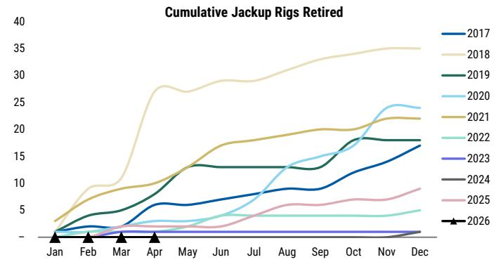

line

| Month | 2017 | 2018 | 2019 | 2020 | 2021 | 2022 | 2023 | 2024 | 2025 | 2026 |
|-------|------|------|------|------|------|------|------|------|------|------|
| Jan   | -    | -    | -    | -    | -    | -    | -    | -    | -    | -    |
| Feb   | -    | -    | -    | -    | -    | -    | -    | -    | -    | -    |
| Mar   | -    | -    | -    | -    | -    | -    | -    | -    | -    | -    |
| Apr   | 6    | 28   | 13   | 3    | 10   | 3    | 1    | 1    | 1    | 1    |
| May   | 6    | 29   | 13   | 4    | 15   | 3    | 1    | 1    | 1    | 1    |
| Jun   | 7    | 29   | 13   | 5    | 17   | 3    | 1    | 1    | 1    | 1    |
| Jul   | 8    | 30   | 13   | 8    | 18   | 3    | 1    | 1    | 1    | 1    |
| Aug   | 9    | 31   | 13   | 12   | 19   | 3    | 1    | 1    | 1    | 1    |
| Sep   | 9    | 32   | 13   | 15   | 20   | 3    | 1    | 1    | 1    | 1    |
| Oct   | 12   | 33   | 18   | 20   | 20   | 3    | 1    | 1    | 1    | 1    |
| Nov   | 15   | 34   | 18   | 24   | 21   | 3    | 1    | 1    | 1    | 1    |
| Dec   | 17   | 35   | 18   | 24   | 22   | 3    | 1    | 1    | 1    | 1    |

Source: Rystad Energy, MS estimates

# Offshore Macro Drivers

# Capex & Activity Drivers by O&G Supply Segment

Exhibit 70: T-3Y Avg. Well & Exploration Capex by Supply Segment   
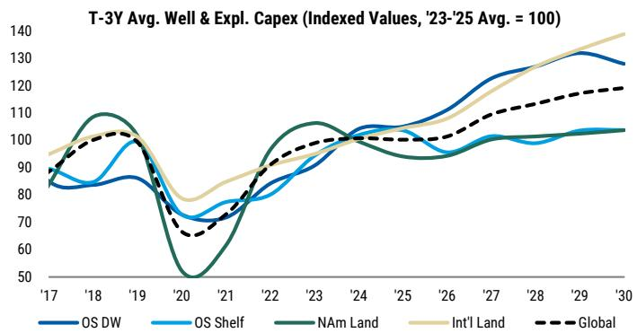

line

| Year | OS DW | OS Shelf | NAm Land | Int'l Land | Global |
|------|-------|----------|----------|------------|--------|
| '17  | 90    | 90       | 90       | 90         | 90     |
| '18  | 85    | 85       | 110      | 100        | 100    |
| '19  | 80    | 80       | 105      | 105        | 105    |
| '20  | 75    | 75       | 50       | 75         | 65     |
| '21  | 80    | 80       | 75       | 80         | 75     |
| '22  | 90    | 90       | 105      | 90         | 90     |
| '23  | 100   | 100      | 105      | 100        | 100    |
| '24  | 105   | 105      | 100      | 105        | 105    |
| '25  | 110   | 110      | 95       | 110        | 110    |
| '26  | 120   | 120      | 95       | 120        | 115    |
| '27  | 130   | 130      | 100      | 130        | 120    |
| '28  | 135   | 135      | 105      | 135        | 125    |
| '29  | 130   | 130      | 105      | 140        | 130    |
| '30  | 125   | 125      | 105      | 145        | 135    |

Source: Rystad Energy, MS estimates. "OS DW" = Offshore Deepwater.

Exhibit 72: T-3Y Avg. Feet Drilled per Rig per Day by Supply Segment   
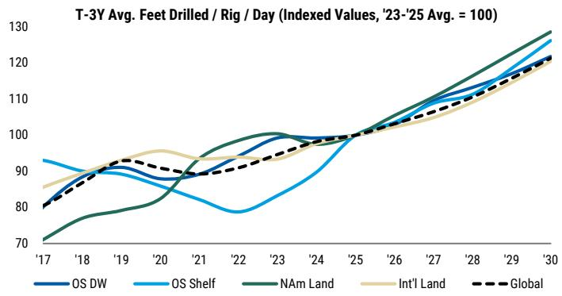

line

| Year | OS DW | OS Shelf | NAm Land | Int'l Land | Global |
|------|-------|----------|----------|------------|--------|
| '17  | 80    | 90       | 70       | 85         | 80     |
| '18  | 85    | 85       | 75       | 90         | 85     |
| '19  | 90    | 80       | 80       | 95         | 90     |
| '20  | 95    | 75       | 85       | 100        | 95     |
| '21  | 100   | 70       | 90       | 100        | 100    |
| '22  | 100   | 75       | 95       | 100        | 100    |
| '23  | 100   | 80       | 100      | 100        | 100    |
| '24  | 100   | 85       | 100      | 100        | 100    |
| '25  | 100   | 90       | 100      | 100        | 100    |
| '26  | 105   | 95       | 105      | 105        | 105    |
| '27  | 110   | 100      | 110      | 110        | 110    |
| '28  | 115   | 105      | 115      | 115        | 115    |
| '29  | 120   | 110      | 120      | 120        | 120    |
| '30  | 125   | 115      | 125      | 125        | 125    |

Source: Rystad Energy, MS estimates. "OS DW" = Offshore Deepwater.

Exhibit 74: T-3Y Avg. Rig Count by Supply Segment   
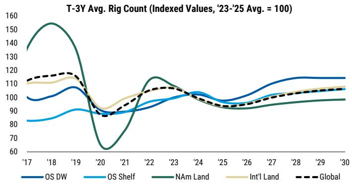

line

| Year | OS DW | OS Shelf | NAm Land | Int'l Land | Global |
|------|-------|----------|----------|------------|--------|
| '17  | 100   | 85       | 135      | 110        | 110    |
| '18  | 105   | 90       | 155      | 110        | 115    |
| '19  | 105   | 90       | 140      | 110        | 115    |
| '20  | 90    | 85       | 60       | 90         | 85     |
| '21  | 95    | 90       | 90       | 100        | 95     |
| '22  | 100   | 95       | 115      | 105        | 105    |
| '23  | 105   | 100      | 105      | 105        | 105    |
| '24  | 105   | 100      | 100      | 105        | 105    |
| '25  | 105   | 100      | 95       | 105        | 105    |
| '26  | 105   | 100      | 95       | 105        | 105    |
| '27  | 110   | 100      | 95       | 105        | 105    |
| '28  | 115   | 100      | 95       | 105        | 105    |
| '29  | 115   | 100      | 95       | 105        | 105    |
| '30  | 115   | 100      | 95       | 105        | 105    |

Source: Rystad Energy, MS estimates. "OS DW" = Offshore Deepwater.

Exhibit 71: Cycle-over-Cycle Well & Exploration Capex by Supply Segment   
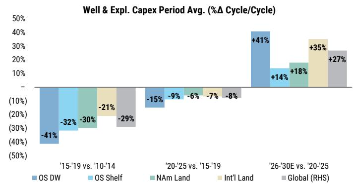

bar

Well & Expl. Capex Period Avg. (%Δ Cycle/Cycle)
| Period | OS DW (%) | OS Shelf (%) | NAm Land (%) | Int'l Land (%) | Global (RHS) (%) |
|---|---|---|---|---|---|
| '15-'19 vs. '10-'14 | -41 | -32 | -30 | -21 | -29 |
| '20-'25 vs. '15-'19 | -15 | -9 | -6 | -7 | -8 |
| '26-'30E vs. '20-'25 | +41 | +14 | +18 | +35 | +27 |

Source: Rystad Energy, MS estimates. "OS DW" = Offshore Deepwater.

Exhibit 73: Cycle-over-Cycle Feet Drilled per Rig per Day by Supply Segment   
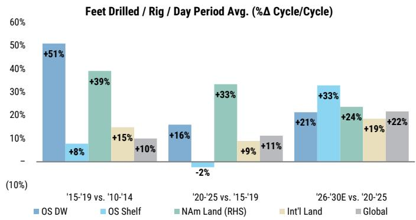

bar

| Comparison | OS DW | OS Shelf | NAm Land (RHS) | Int'l Land | Global |
| ---------- | ----- | -------- | -------------- | ---------- | ------ |
| '15-'19 vs. '10-'14 | 51% | +8% | 39% | 15% | 10% |
| '20-'25 vs. '15-'19 | 16% | -2% | 33% | 9% | 11% |
| '26-'30E vs. '20-'25 | 21% | 33% | 24% | 19% | 22% |

Source: Rystad Energy, MS estimates. "OS DW" = Offshore Deepwater.

Exhibit 75: Cycle-over-Cycle Rig Count by Supply Segment   
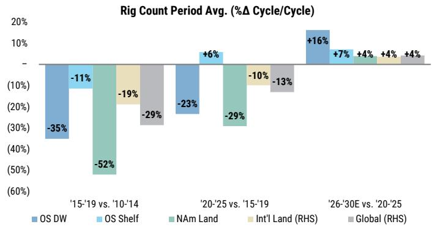

bar

Rig Count Period Avg. (%Δ Cycle/Cycle)
| Period | OS DW (%) | OS Shelf (%) | NAm Land (%) | Int'l Land (RHS) (%) | Global (RHS) (%) |
| :--- | :--- | :--- | :--- | :--- | :--- |
| '15-'19 vs. '10-'14 | -35 | -11 | -52 | -19 | -29 |
| '20-'25 vs. '15-'19 | -23 | +6 | -29 | -10 | -13 |
| '26-'30E vs. '20-'25 | +16 | +7 | +4 | +4 | +4 |

Source: Rystad Energy, MS estimates. "OS DW" = Offshore Deepwater.

Exhibit 76: T-3Y Avg. Well Count by Supply Segment   
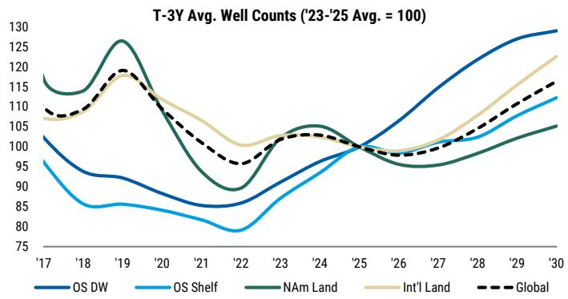

line

| Year | OS DW | OS Shelf | NAm Land | Int'l Land | Global |
|------|-------|----------|----------|------------|--------|
| '17  | 105   | 95       | 115      | 108        | 110    |
| '18  | 95    | 85       | 125      | 110        | 115    |
| '19  | 90    | 85       | 120      | 115        | 120    |
| '20  | 85    | 80       | 100      | 110        | 115    |
| '21  | 85    | 80       | 90       | 105        | 110    |
| '22  | 85    | 75       | 90       | 100        | 105    |
| '23  | 90    | 80       | 105      | 105        | 105    |
| '24  | 95    | 85       | 105      | 105        | 105    |
| '25  | 100   | 90       | 100      | 100        | 100    |
| '26  | 105   | 95       | 95       | 95         | 95     |
| '27  | 110   | 100      | 95       | 100        | 100    |
| '28  | 115   | 105      | 100      | 105        | 105    |
| '29  | 120   | 110      | 105      | 110        | 110    |
| '30  | 125   | 115      | 105      | 120        | 115    |

Source: Rystad Energy, MS estimates. "OS DW" = Offshore Deepwater.

Exhibit 78: T-3Y Avg. Well & Exploration Capex per Rig by Supply Segment   

line

| Year | OS DW | OS Shelf | NAm Land | Int'l Land | Global |
|------|-------|----------|----------|------------|--------|
| '17  | 85    | 108      | 60       | 85         | 80     |
| '18  | 84    | 100      | 70       | 90         | 85     |
| '19  | 83    | 110      | 75       | 88         | 82     |
| '20  | 82    | 85       | 80       | 85         | 75     |
| '21  | 83    | 85       | 85       | 85         | 80     |
| '22  | 90    | 85       | 90       | 90         | 85     |
| '23  | 95    | 90       | 95       | 95         | 90     |
| '24  | 100   | 95       | 100      | 100        | 95     |
| '25  | 105   | 100      | 105      | 110        | 100    |
| '26  | 110   | 105      | 105      | 115        | 105    |
| '27  | 112   | 105      | 105      | 120        | 110    |
| '28  | 115   | 105      | 105      | 125        | 112    |
| '29  | 118   | 105      | 105      | 130        | 115    |
| '30  | 120   | 105      | 105      | 135        | 118    |

Source: Rystad Energy, MS estimates. "OS DW" = Offshore Deepwater.

Exhibit 80: T-3Y Avg. Capex per boe of O&G Production by Supply Segment   
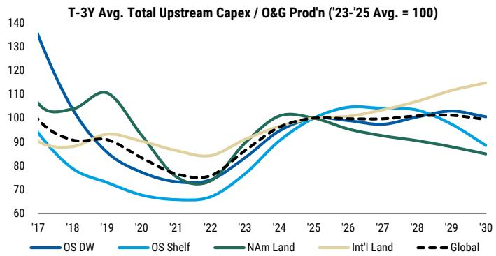

line

| Year | OS DW | OS Shelf | NAm Land | Int'l Land | Global |
|------|-------|----------|----------|------------|--------|
| '17  | 135   | 95       | 105      | 90         | 95     |
| '18  | 110   | 80       | 108      | 85         | 90     |
| '19  | 95    | 75       | 110      | 90         | 85     |
| '20  | 85    | 70       | 105      | 85         | 80     |
| '21  | 75    | 65       | 95       | 80         | 75     |
| '22  | 70    | 65       | 85       | 75         | 70     |
| '23  | 75    | 70       | 90       | 80         | 75     |
| '24  | 85    | 80       | 100      | 90         | 85     |
| '25  | 95    | 90       | 100      | 95         | 95     |
| '26  | 100   | 100      | 100      | 100        | 100    |
| '27  | 100   | 100      | 100      | 105        | 100    |
| '28  | 100   | 100      | 100      | 110        | 100    |
| '29  | 100   | 95       | 95       | 115        | 100    |
| '30  | 100   | 90       | 85       | 120        | 100    |

Source: Rystad Energy, MS estimates. "OS DW" = Offshore Deepwater.

Exhibit 77: Cycle-over-Cycle Well Count by Supply Segment   
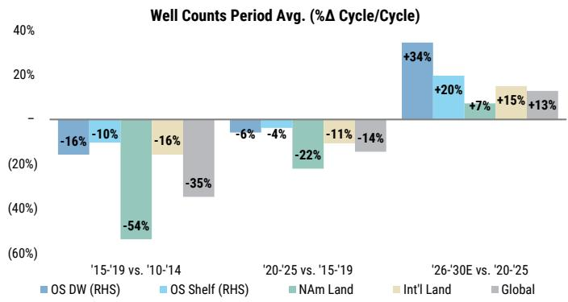

bar

Well Counts Period Avg. (%Δ Cycle/Cycle)
| Period | OS DW (RHS) (%) | OS Shelf (RHS) (%) | NAm Land (%) | Int'l Land (%) | Global (%) |
|---|---|---|---|---|---|
| '15-'19 vs. '10-'14 | -16 | -10 | -54 | -16 | -35 |
| '20-'25 vs. '15-'19 | -6 | -4 | -22 | -11 | -14 |
| '26-'30E vs. '20-'25 | 34 | 20 | 7 | 15 | 13 |

Source: Rystad Energy, MS estimates. "OS DW" = Offshore Deepwater.

Exhibit 79: Cycle-over-Cycle Well & Exploration Capex per Rig by Supply Segment   
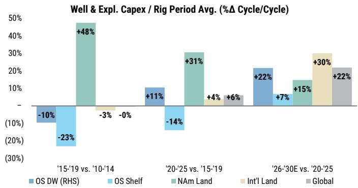

bar

Well & Expl. Capex / Rig Period Avg. (%Δ Cycle/Cycle)
| Period | OS DW (RHS) (%) | OS Shelf (%) | NAm Land (%) | Int'l Land (%) | Global (%) |
| :--- | :--- | :--- | :--- | :--- | :--- |
| '15-'19 vs. '10-'14 | -10 | -23 | 48 | -3 | -0 |
| '20-'25 vs. '15-'19 | 11 | -14 | 31 | 4 | 6 |
| '26-'30E vs. '20-'25 | 22 | 7 | 15 | 30 | 22 |

Source: Rystad Energy, MS estimates. "OS DW" = Offshore Deepwater.

Exhibit 81: Cycle-over-Cycle Capex per boe of O&G Production by Supply Segment   
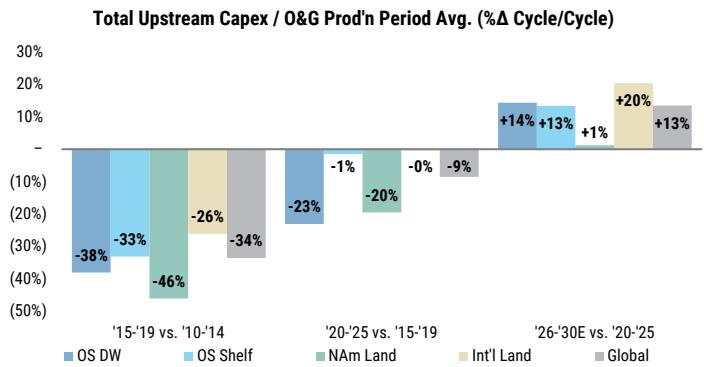

bar

Total Upstream Capex / O&G Prod'n Period Avg. (%Δ Cycle/Cycle)
| Period | OS DW (%) | OS Shelf (%) | NAm Land (%) | Int'l Land (%) | Global (%) |
| :--- | :--- | :--- | :--- | :--- | :--- |
| '15-'19 vs. '10-'14 | -38 | -33 | -46 | -26 | -34 |
| '20-'25 vs. '15-'19 | -23 | -1 | -20 | -0 | -9 |
| '26-'30E vs. '20-'25 | +14 | +13 | +1 | +20 | +13 |

Source: Rystad Energy, MS estimates. "OS DW" = Offshore Deepwater.

Exhibit 82: T-3Y Avg. boe of O&G Production per Rig by Supply Segment   
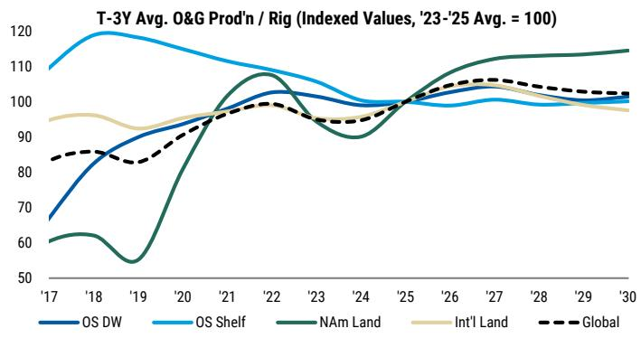

line

| Year | OS DW | OS Shelf | NAm Land | Int'l Land | Global |
|------|-------|----------|----------|------------|--------|
| '17  | 68    | 110      | 60       | 95         | 85     |
| '18  | 85    | 120      | 62       | 94         | 86     |
| '19  | 90    | 118      | 55       | 93         | 84     |
| '20  | 95    | 115      | 90       | 92         | 90     |
| '21  | 100   | 112      | 105      | 91         | 95     |
| '22  | 102   | 110      | 108      | 90         | 98     |
| '23  | 101   | 108      | 95       | 89         | 97     |
| '24  | 100   | 105      | 90       | 88         | 96     |
| '25  | 100   | 103      | 105      | 87         | 95     |
| '26  | 100   | 102      | 110      | 86         | 94     |
| '27  | 100   | 101      | 112      | 85         | 93     |
| '28  | 100   | 100      | 113      | 84         | 92     |
| '29  | 100   | 99       | 114      | 83         | 91     |
| '30  | 100   | 98       | 115      | 82         | 90     |

Source: Rystad Energy, MS estimates. "OS DW" = Offshore Deepwater.

Exhibit 84: T-3Y Avg. boe of O&G Production by Supply Segment   
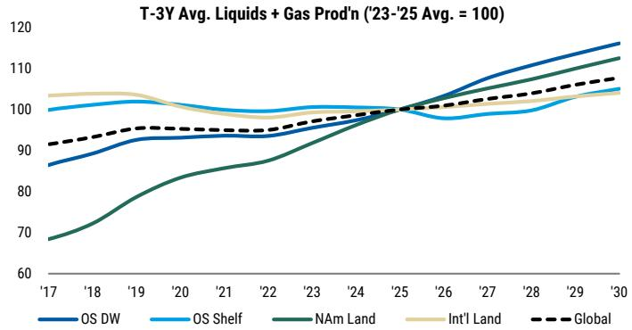

line

| Year | OS DW | OS Shelf | NAM Land | Int'l Land | Global |
|------|-------|----------|----------|------------|--------|
| '17  | 87    | 100      | 68       | 104        | 92     |
| '18  | 90    | 101      | 72       | 104        | 93     |
| '19  | 92    | 101      | 78       | 104        | 94     |
| '20  | 93    | 101      | 83       | 103        | 95     |
| '21  | 94    | 100      | 86       | 102        | 95     |
| '22  | 95    | 100      | 88       | 101        | 96     |
| '23  | 96    | 99       | 90       | 100        | 97     |
| '24  | 97    | 98       | 92       | 99         | 98     |
| '25  | 100   | 97       | 95       | 98         | 99     |
| '26  | 105   | 98       | 98       | 97         | 100    |
| '27  | 108   | 100      | 100      | 96         | 101    |
| '28  | 110   | 101      | 102      | 95         | 102    |
| '29  | 112   | 102      | 104      | 94         | 103    |
| '30  | 115   | 103      | 106      | 93         | 104    |

Source: Rystad Energy, MS estimates. "OS DW" = Offshore Deepwater.

Exhibit 83: Cycle-over-Cycle boe of O&G Production per Rig by Supply Segment   

bar

| Period | OS DW | OS Shelf | NAm Land | Int'l Land | Global |
|--------|-------|----------|----------|------------|--------|
| '15-'19 vs. '10-'14 | 84% | 19% | 194% | 25% | 54% |
| '20-'25 vs. '15-'19 | 33% | -7% | 75% | 6% | 20% |
| '26-'30E vs. '20-'25 | 1% | -4% | 10% | 0% | 4% |

Source: Rystad Energy, MS estimates. "OS DW" = Offshore Deepwater.

Exhibit 85: Cycle-over-Cycle boe of O&G Production by Supply Segment   
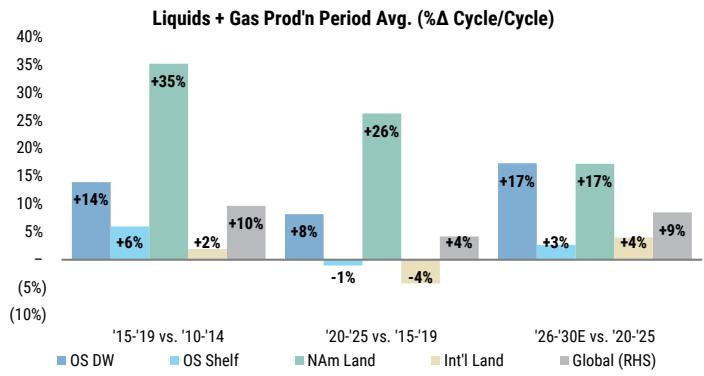

bar

| Comparison | OS DW | OS Shelf | NAm Land | Int'l Land | Global (RHS) |
| ---------- | ----- | -------- | -------- | ---------- | ------------ |
| '15-'19 vs. '10-'14 | 14% | 6% | 35% | - | 10% |
| '20-'25 vs. '15-'19 | 8% | -1% | 26% | -4% | 4% |
| '26-'30E vs. '20-'25 | 17% | 3% | 17% | 4% | 9% |

Source: Rystad Energy, MS estimates. "OS DW" = Offshore Deepwater.

# Offshore Project Pipeline Capex and Rig Count by Work Type

Exhibit 86: Offshore Capex by Region   
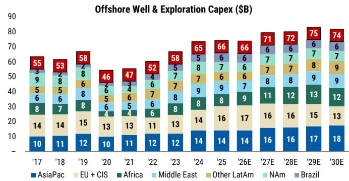

bar_stacked

| Year   | AsiaPac | EU + CIS | Africa | Middle East | Other LatAm | NAm | Brazil |
|--------|---------|----------|--------|-------------|-------------|-----|--------|
| '17    | 10      | 14       | 8      | 6           | 5           | 9   | 55     |
| '18    | 11      | 14       | 7      | 6           | 5           | 8   | 53     |
| '19    | 12      | 15       | 8      | 8           | 6           | 8   | 58     |
| '20    | 10      | 13       | 4      | 5           | 6           | 2   | 46     |
| '21    | 11      | 13       | 4      | 5           | 4           | 3   | 47     |
| '22    | 12      | 11       | 6      | 6           | 7           | 4   | 52     |
| '23    | 12      | 13       | 8      | 7           | 7           | 5   | 58     |
| '24    | 14      | 14       | 8      | 9           | 7           | 8   | 65     |
| '25    | 14      | 16       | 8      | 9           | 6           | 7   | 66     |
| '26E   | 14      | 17       | 9      | 7           | 6           | 6   | 66     |
| '27E   | 16      | 16       | 11     | 8           | 7           | 7   | 71     |
| '28E   | 16      | 16       | 12     | 8           | 7           | 7   | 72     |
| '29E   | 17      | 15       | 13     | 9           | 8           | 7   | 75     |
| '30E   | 18      | 13       | 12     | 9           | 9           | 7   | 74     |

Source: Rystad Energy, MS estimates

Exhibit 87: Active Offshore Rigs by Work Type   
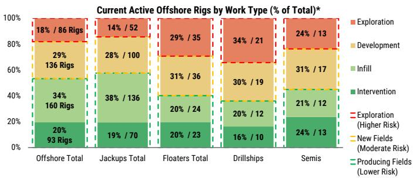

bar_stacked

Current Active Offshore Rigs by Work Type (% of Total)*
| Work Type | Exploration (%) | Development (%) | Infill (%) | Intervention (%) | New Fields (Moderate Risk) (%) | Producing Fields (Lower Risk) (%) |
| :--- | :--- | :--- | :--- | :--- | :--- | :--- |
| Offshore Total | 18 / 86 Rigs | 29 / 136 Rigs | 34 / 160 Rigs | 20 / 93 Rigs | | |
| Jackups Total | 14 / 52 | 28 / 100 | 38 / 136 | 19 / 70 | | |
| Floaters Total | 29 / 35 | 31 / 36 | 20 / 24 | 20 / 23 | | |
| Drillships | 34 / 21 | 30 / 19 | 20 / 12 | 16 / 10 | | |
| Semis | 24 / 13 | 31 / 17 | 21 / 12 | 24 / 13 | | |

Source: Rystad Energy, MS estimates

Exhibit 88: Offshore Project Pipeline & Capex by Project Lifecycle Stage   
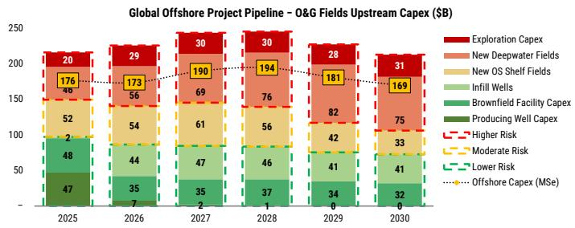

bar_stacked

| Year | Exploration Capex | New Deepwater Fields | New US Shelf Fields | Infill Wells | Brownfield Facility Capex | Producing Well Capex | Higher Risk | Moderate Risk | Lower Risk | Offshore Capex (MSe) |
|------|-------------------|----------------------|---------------------|--------------|---------------------------|------------------------|-------------|---------------|----------|----------------------|
| 2025 | 20                | 176                  | 52                  | 2            | 48                        | 47                     | 176         | 56            | 7        | 176                  |
| 2026 | 29                | 173                  | 54                  | 44           | 35                        | 7                      | 173         | 56            | 7        | 173                  |
| 2027 | 30                | 190                  | 61                  | 47           | 35                        | 1                      | 190         | 69            | 2        | 190                  |
| 2028 | 30                | 194                  | 56                  | 46           | 37                        | 1                      | 194         | 76            | 1        | 194                  |
| 2029 | 28                | 181                  | 42                  | 41           | 34                        | 0                      | 181         | 82            | 0        | 181                  |
| 2030 | 31                | 169                  | 33                  | 41           | 32                        | 0                      | 169         | 75            | 0        | 169                  |

Source: Rystad Energy, MS estimates

Exhibit 89: Offshore Project Pipeline & Capex by Project Lifecycle Stage (% of Total)   
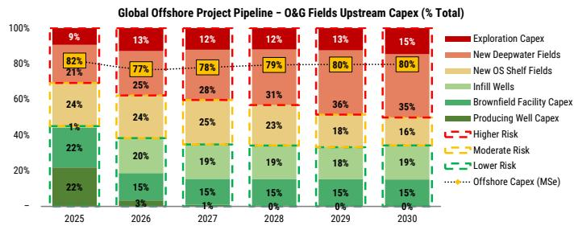

bar_stacked

| Year | Exploration Capex | New Deepwater Fields | New OS Shelf Fields | Infill Wells | Brownfield Facility Capex | Producing Well Capex | Higher Risk | Moderate Risk | Lower Risk | Offshore Capex (MSe) |
|------|-------------------|----------------------|----------------------|--------------|---------------------------|-----------------------|-------------|---------------|----------|----------------------|
| 2025 | 9%                | 82%                  | 24%                  | 1%           | 22%                       | 22%                   | 21%         | 0%            | 0%       | 0%                   |
| 2026 | 13%               | 77%                  | 24%                  | 20%          | 15%                       | 3%                    | 0%          | 0%            | 0%       | 0%                   |
| 2027 | 12%               | 78%                  | 25%                  | 19%          | 15%                       | 1%                    | 0%          | 0%            | 0%       | 0%                   |
| 2028 | 12%               | 31%                  | 23%                  | 19%          | 15%                       | 0%                    | 0%          | 0%            | 0%       | 0%                   |
| 2029 | 13%               | 80%                  | 36%                  | 18%          | 15%                       | 0%                    | 0%          | 0%            | 0%       | 0%                   |
| 2030 | 15%               | 80%                  | 35%                  | 19%          | 15%                       | 0%                    | 0%          | 0%            | 0%       | 0%                   |

Source: Rystad Energy, MS estimates

# Floater Cold Stacked Supply Detail

Exhibit 90: Cold Stacked Floater Fleet by Driller & Rig Class 

<table><tr><td rowspan="2">Floater Cold Stacked Capacity by Driller</td><td colspan="3">Harsh</td><td colspan="3">Benign Semis</td><td colspan="4">Benign Drillships</td><td rowspan="2">Floaters Total</td></tr><tr><td>Pre-6G</td><td>6G+</td><td>Total</td><td>Pre-6G</td><td>6G+</td><td>Total</td><td>Pre-6G</td><td>Lo/Mid 6G+</td><td>HS 6G+</td><td>Drillships</td></tr><tr><td>Valaris</td><td>-</td><td>-</td><td>-</td><td>-</td><td>1</td><td>1</td><td>-</td><td>-</td><td>3</td><td>3</td><td>4</td></tr><tr><td>Seadrill</td><td>-</td><td>2</td><td>2</td><td>-</td><td>1</td><td>1</td><td>-</td><td>-</td><td>-</td><td>-</td><td>3</td></tr><tr><td>Transocean</td><td>-</td><td>-</td><td>-</td><td>-</td><td>-</td><td>-</td><td>-</td><td>-</td><td>3</td><td>3</td><td>3</td></tr><tr><td>SinoOcean Offshore</td><td>-</td><td>-</td><td>-</td><td>-</td><td>-</td><td>-</td><td>2</td><td>-</td><td>-</td><td>2</td><td>2</td></tr><tr><td>Caspian Drilling</td><td>-</td><td>-</td><td>-</td><td>1</td><td>-</td><td>1</td><td>-</td><td>-</td><td>-</td><td>-</td><td>1</td></tr><tr><td>Essar Oilfields Services</td><td>-</td><td>-</td><td>-</td><td>1</td><td>-</td><td>1</td><td>-</td><td>-</td><td>-</td><td>-</td><td>1</td></tr><tr><td>IPC SA de CV</td><td>-</td><td>-</td><td>-</td><td>-</td><td>1</td><td>1</td><td>-</td><td>-</td><td>-</td><td>-</td><td>1</td></tr><tr><td>Noble Drilling</td><td>-</td><td>-</td><td>-</td><td>-</td><td>-</td><td>-</td><td>-</td><td>1</td><td>-</td><td>1</td><td>1</td></tr><tr><td>ONGC</td><td>-</td><td>-</td><td>-</td><td>-</td><td>-</td><td>-</td><td>1</td><td>-</td><td>-</td><td>1</td><td>1</td></tr><tr><td>Operadora CICSA</td><td>-</td><td>-</td><td>-</td><td>-</td><td>1</td><td>1</td><td>-</td><td>-</td><td>-</td><td>-</td><td>1</td></tr><tr><td>Unifin Financiera</td><td>-</td><td>-</td><td>-</td><td>-</td><td>1</td><td>1</td><td>-</td><td>-</td><td>-</td><td>-</td><td>1</td></tr><tr><td>Category Total</td><td>-</td><td>2</td><td>2</td><td>2</td><td>5</td><td>7</td><td>3</td><td>1</td><td>6</td><td>10</td><td>19</td></tr></table>

Source: Rystad Energy, MS estimates

Exhibit 91: Cold Stacked 6G+ Floater Rig Detail by Driller, Rig Status, & Rig Specs 

<table><tr><td colspan="2">Cold Stacked 6G+ Floaters</td><td colspan="5">Rig Status Data</td><td colspan="3">Rig Specs</td><td colspan="6">MS Rig Classification</td></tr><tr><td>Rig Owner</td><td>Rig Name</td><td>Delivery Year</td><td>Current Country</td><td>Stacked Date</td><td>SS Year</td><td>Yrs Stacked</td><td>Gen</td><td>Environ.</td><td>DS/Semi i</td><td>Dual Activity</td><td>&gt;=10k Ft</td><td>~2.5MM Hookload</td><td>Dual BOP</td><td>Total</td><td>MS Rig Category</td></tr><tr><td>Valaris plc</td><td>Valaris DS-13</td><td>2023</td><td>Spain</td><td>Mar-25</td><td>2025</td><td>1.2</td><td>7G</td><td>Benign</td><td>Drillship</td><td>1</td><td>1</td><td>1</td><td>1</td><td>4</td><td>High-Spec 6G+</td></tr><tr><td>Valaris plc</td><td>Valaris DS-14</td><td>2023</td><td>Spain</td><td>Mar-25</td><td>2025</td><td>1.2</td><td>7G</td><td>Benign</td><td>Drillship</td><td>1</td><td>1</td><td>1</td><td>1</td><td>4</td><td>High-Spec 6G+</td></tr><tr><td>Valaris plc</td><td>Valaris DS-11</td><td>2013</td><td>Spain</td><td>Jun-22</td><td>2018</td><td>4.0</td><td>7G</td><td>Benign</td><td>Drillship</td><td>1</td><td>1</td><td>1</td><td>1</td><td>4</td><td>High-Spec 6G+</td></tr><tr><td>Valaris plc</td><td>Valaris DPS-1</td><td>2012</td><td>Malaysia</td><td>Feb-26</td><td>2027</td><td>0.3</td><td>6G</td><td>Benign</td><td>Semi</td><td>-</td><td>1</td><td>-</td><td>1</td><td>2</td><td>Mid-Grade 6G+</td></tr><tr><td>Transocean</td><td>Ocean Rig Apollo</td><td>2015</td><td>Greece</td><td>Sep-16</td><td>2020</td><td>9.7</td><td>7G</td><td>Benign</td><td>Drillship</td><td>1</td><td>1</td><td>1</td><td>1</td><td>4</td><td>High-Spec 6G+</td></tr><tr><td>Transocean</td><td>Ocean Rig Mylos</td><td>2013</td><td>Greece</td><td>Sep-16</td><td>2018</td><td>9.7</td><td>7G</td><td>Benign</td><td>Drillship</td><td>1</td><td>1</td><td>1</td><td>1</td><td>4</td><td>High-Spec 6G+</td></tr><tr><td>Transocean</td><td>Ocean Rig Athena</td><td>2014</td><td>Greece</td><td>Mar-17</td><td>2019</td><td>9.2</td><td>7G</td><td>Benign</td><td>Drillship</td><td>1</td><td>1</td><td>1</td><td>1</td><td>4</td><td>High-Spec 6G+</td></tr><tr><td>Noble Drilling</td><td>Noble Globetrotter II</td><td>2013</td><td>United States</td><td>Feb-25</td><td>2028</td><td>1.3</td><td>6G</td><td>Benign</td><td>Drillship</td><td>-</td><td>1</td><td>-</td><td>-</td><td>1</td><td>Low-Grade 6G+</td></tr><tr><td>Seadrill Limited</td><td>West Phoenix</td><td>2008</td><td>Norway</td><td>Nov-24</td><td>2028</td><td>1.5</td><td>6G</td><td>Harsh</td><td>Semi</td><td>1</td><td>1</td><td>-</td><td>-</td><td>2</td><td>6G+ H/E</td></tr><tr><td>Seadrill Limited</td><td>West Eclipse</td><td>2011</td><td>Namibia</td><td>Jul-19</td><td>2021</td><td>6.9</td><td>6G</td><td>Benign</td><td>Semi</td><td>-</td><td>1</td><td>1</td><td>-</td><td>2</td><td>Mid-Grade 6G+</td></tr><tr><td>Seadrill Limited</td><td>West Aquarius</td><td>2009</td><td>Norway</td><td>May-23</td><td>2024</td><td>3.0</td><td>6G</td><td>Harsh</td><td>Semi</td><td>-</td><td>1</td><td>-</td><td>-</td><td>1</td><td>6G+ H/E</td></tr><tr><td>Operadora CICSA</td><td>Centenario</td><td>2010</td><td>Mexico</td><td>Sep-18</td><td>2020</td><td>7.7</td><td>6G</td><td>Benign</td><td>Semi</td><td>-</td><td>1</td><td>1</td><td>-</td><td>2</td><td>Mid-Grade 6G+</td></tr><tr><td>IPC SA de CV</td><td>Bicentenario</td><td>2011</td><td>Mexico</td><td>Jul-19</td><td>2020</td><td>6.9</td><td>6G</td><td>Benign</td><td>Semi</td><td>-</td><td>1</td><td>-</td><td>-</td><td>1</td><td>Low-Grade 6G+</td></tr><tr><td>Unifin Financiera</td><td>Frida I</td><td>2011</td><td>Mexico</td><td>Feb-25</td><td>2026</td><td>1.3</td><td>6G</td><td>Benign</td><td>Semi</td><td>-</td><td>-</td><td>-</td><td>-</td><td>-</td><td>Low-Grade 6G+</td></tr></table>

Source: Rystad Energy, MS estimates

# Valuation Methodology and Risks

# Halliburton Co (HAL.N)

Base case of \$42/share which is a 50/50 blend of 1) a target multiple of 8.0x 2027e EV/EBITDA (\$45/share) and 2) our discounted cash flow value of \$39/share (with a WACC of 7.7% and implied terminal EV/EBITDA multiple of 7.3x).

# Risks to Upside

■ Major activity acceleration, particularly in NAm   
■ Significant market share gain internationally   
■ Contracting progress above base case for MENA-focused Power JV with VoltaGrid   
■ Further cost-cutting efforts

# Risks to Downside

■ Activity surprises to the downside, particularly in NAm   
■ International market share losses   
■ Contracting progress below base case for MENA-focused Power JV with VoltaGrid   
■ Commodity price/cyclical risk

# National Oilwell Varco Inc. (NOV.N)

Base case of \$20/share which is a 50/50 blend of 1) a target multiple of 6.5x 2027e EV/EBITDA (\$21/share) and 2) our discounted cash flow value of \$20/share (with a WACC of 7.7% and implied terminal EV/EBITDA multiple of 6.9x).

# Risks to Upside

■ High order intake   
Accretive M&A   
■ Evolution of energy transition strategy   
■ Better than expected FCF generation

# Risks to Downside

■ Slowing oilfield activity   
■ Indications of market share loss   
■ Disappointing working capital improvements   
■ Pricing pressure in excess of our base case

# Transocean Ltd. (RIG.N)

Valuation based on \~9.5x EV/EBITDA on our 2027E Base Case EBITDA, which is slightly above historical median (T-5Y \~9.0x) to account for modest earnings upside beyond next year. Key risks include market share loss, inability to market older assets, financial leverage, customer contract cancellations, aggressive bidding behavior by competitors, and cyclical/commodity price risk.

# Risks to Upside

■ Additional contract wins/utilization above consensus

■ Indications of a pricing inflection   
■ Favorable debt refinancing outcomes   
■ Deferral of newbuild capex

# Risks to Downside

■ Failure to secure work for rigs rolling off contract   
■ Disappointing contracting activity   
■ Significant pricing declines for new work   
■ Unfavorable debt refinancing outcomes

# Schlumberger NV (SLB.N)

Base case of \$57/share which is a 50/50 blend of 1) a target multiple of 9.0x 2027e EV/EBITDA (\$58/share) and 2) our discounted cash flow value of \$55/share (with a WACC of 7.7% and implied terminal EV/EBITDA multiple of 9.1x).

# Risks to Upside

■ Continued upstream activity growth   
■ Greater Int'l pricing power   
■ Capital return upside   
■ Positive M&A updates, e.g., smooth integration, synergy upside

# Risks to Downside

■ Limited capital return   
■ Oil price / commodity risks   
■ Slower offshore/int'l cycle vs. our expectations   
■ Negative M&A updates, e.g., integration and/or synergy realization missteps

# Tenaris SA (TS.N)

Base case of \$50/share which is a 50/50 blend of 1) a target multiple of 6.5x 2027e EV/EBITDA (\$54/share) and 2) our discounted cash flow value of \$53/share (with a WACC of 7.8% and implied terminal EV/EBITDA multiple of 8.1x).

# Risks to Upside

■ Global drilling activity accelerations   
■ Further dividend increases and/or buybacks   
■ Market share gains   
■ Cost savings

# Risks to Downside

■ Weakening drilling activity   
■ Increased pricing pressure   
■ Limited FCF generation potential   
■ Commodity/cyclical risk

# Disclosure Section

The information and opinions in MS were prepared by MS & Co. LLC, and/or MS C.T.V.M. S.A., and/or MS Mexico, Casa de Bolsa, S.A. de C.V., and/or MS Canada Limited. As used in this disclosure section, "MS" includes MS & Co. LLC, MS C.T.V.M. S.A., MS Mexico, Casa de Bolsa, S.A. de C.V., MS Canada Limited and their affiliates as necessary.

For important disclosures, stock price charts and equity rating histories regarding companies that are the subject of this report, please see the MS Disclosure Website at www.morganstanley.com/eqr/disclosures/webapp/generalresearch, or contact your investment representative or MS at 1585 Broadway, (Attention: Research Management), New York, NY, 10036 USA.

For valuation methodology and risks associated with any recommendation, rating or price target referenced in this research report, please contact the Client Support Team as follows: US/Canada +1 800 303-2495; Hong Kong +852 2848-5999; Latin America +1 718 754-5444 (U.S.); London +44 (0)20-7425-8169; Singapore +65 6834-6860; Sydney +61 (0)2-9770-1505; Tokyo +81 (0)3-6836-9000. Alternatively you may contact your investment representative or MS at 1585 Broadway, (Attention: Research Management), New York, NY 10036 USA.

# Analyst Certification

The following analysts hereby certify that their views about the companies and their securities discussed in this report are accurately expressed and that they have not received and will not receive direct or indirect compensation in exchange for expressing specific recommendations or views in this report: Daniel Kutz; Joe Laetsch, CFA; Devin McDermott.

# Global Research Conflict Management Policy

MS has been published in accordance with our conflict management policy, which is available at www.morganstanley.com/institutional/research/conflictpolicies. A Portuguese version of the policy can be found at www.morganstanley.com.br

# Important Regulatory Disclosures on Subject Companies

As of April 30, 2026, MS beneficially owned 1% or more of a class of common equity securities of the following companies covered in MS: Aldrees Petroleum & Transport Svcs. Co., Baker Hughes Co, Chart Industries, Halliburton Co, Helmerich & Payne Inc, Liberty Energy, Luberef, Nabors Industries Inc., NOV Inc., Patterson-UTI Energy, Perimeter Solutions, Schlumberger NV, Subsea 7, Transocean Ltd., Vallourec.

Within the last 12 months, MS managed or co-managed a public offering (or 144A offering) of securities of Baker Hughes Co, HELLENiQ ENERGY Holdings SA, Nabors Industries Inc., Perimeter Solutions, Technip Energies NV, Transocean Ltd..

Within the last 12 months, MS has received compensation for investment banking services from Adnoc Drilling Company PJSC, Halliburton Co, HELLENiQ ENERGY Holdings SA, Liberty Energy, Nabors Industries Inc., Perimeter Solutions, Schlumberger NV, Transocean Ltd..

In the next 3 months, MS expects to receive or intends to seek compensation for investment banking services from Abu Dhabi National Oil Co Distribution, ADES Holding, Adnoc Drilling Company PJSC, ADNOC Gas Plc, ADNOC Logistics & Services PLC, Aldrees Petroleum & Transport Svcs. Co., Baker Hughes Co, Chart Industries, GTT, Halliburton Co, HELLENiQ ENERGY Holdings SA, Helmerich & Payne Inc, Liberty Energy, Luberef, MOL Magyar Olajes Gazipari Nyrt, Motor Oil Hellas Corinth Refineries SA, Nabors Industries Inc., NOV Inc., Orlen SA, Perimeter Solutions, ProFrac Holding Corp, Saipem, SBM Offshore NV, Schlumberger NV, Subsea 7, Technip Energies NV, Transocean Ltd., Turkiye Petrol Rafinerileri AS, Vallourec.

Within the last 12 months, MS has received compensation for products and services other than investment banking services from Baker Hughes Co, Chart Industries, Halliburton Co, HELLENiQ ENERGY Holdings SA, MOL Magyar Olajes Gazipari Nyrt, Nabors Industries Inc., Orlen SA, Perimeter Solutions, Qatar Gas Transport Nakilat Co Ltd, Saipem, Schlumberger NV, Tenaris SA, Transocean Ltd., Turkiye Petrol Rafinerileri AS, Vallourec.

Within the last 12 months, MS has provided or is providing investment banking services to, or has an investment banking client relationship with, the following company: Abu Dhabi National Oil Co Distribution, ADES Holding, Adnoc Drilling Company PJSC, ADNOC Gas Plc, ADNOC Logistics & Services PLC, Aldrees Petroleum & Transport Svcs. Co., Baker Hughes Co, Chart Industries, GTT, Halliburton Co, HELLENiQ ENERGY Holdings SA, Helmerich & Payne Inc, Liberty Energy, Luberef, MOL Magyar Olajes Gazipari Nyrt, Motor Oil Hellas Corinth Refineries SA, Nabors Industries Inc., NOV Inc., Orlen SA, Perimeter Solutions, ProFrac Holding Corp, Saipem, SBM Offshore NV, Schlumberger NV, Subsea 7, Technip Energies NV, Transocean Ltd., Turkiye Petrol Rafinerileri AS, Vallourec.

Within the last 12 months, MS has either provided or is providing non-investment banking, securities-related services to and/or in the past has entered into an agreement to provide services or has a client relationship with the following company: Baker Hughes Co, Chart Industries, Halliburton Co, HELLENiQ ENERGY Holdings SA, MOL Magyar Olajes Gazipari Nyrt, Nabors Industries Inc., Orlen SA, Perimeter Solutions, ProFrac Holding Corp, Qatar Gas Transport Nakilat Co Ltd, Saipem, Schlumberger NV, Tenaris SA, Transocean Ltd., Turkiye Petrol Rafinerileri AS, Vallourec.

MS & Co. LLC makes a market in the securities of Helmerich & Payne Inc, Nabors Industries Inc., Patterson-UTI Energy, Perimeter Solutions.

The equity research analysts or strategists principally responsible for the preparation of MS have received compensation based upon various factors, including quality of research, investor client feedback, stock picking, competitive factors, firm revenues and overall investment banking revenues. Equity Research analysts' or strategists' compensation is not linked to investment banking or capital markets transactions performed by MS or the profitability or revenues of particular trading desks.

MS and its affiliates do business that relates to companies/instruments covered in MS, including market making, providing liquidity, fund management, commercial banking, extension of credit, investment services and investment banking. MS sells to and buys from customers the securities/instruments of companies covered in MS on a principal basis. MS may have a position in the debt of the Company or instruments discussed in this report. MS trades or may trade as principal in the debt securities (or in related derivatives) that are the subject of the debt research report.

Certain disclosures listed above are also for compliance with applicable regulations in non-US jurisdictions.

# STOCK RATINGS

MS uses a relative rating system using terms such as Overweight, Equal-weight, Not-Rated or Underweight (see definitions below). MS does not assign ratings of Buy, Hold or Sell to the stocks we cover. Overweight, Equal-weight, Not-Rated and Underweight are not the equivalent of buy, hold and sell. Investors should carefully read the definitions of all ratings used in MS. In addition, since MS contains more complete information concerning the analyst's views, investors should carefully read MS, in its entirety, and not infer the contents from the rating alone. In any case, ratings (or research) should not be used or relied upon as investment advice. An investor's decision to buy or sell a stock should depend on individual circumstances (such as the investor's existing holdings) and other considerations.

# Global Stock Ratings Distribution

(as of May 31, 2026)

The Stock Ratings described below apply to MS's Fundamental Equity Research and do not apply to Debt Research produced by the Firm.

For disclosure purposes only (in accordance with FINRA requirements), we include the category headings of Buy, Hold, and Sell alongside our ratings of Overweight, Equal-weight, Not-Rated and Underweight. MS does not assign ratings of Buy, Hold or Sell to the stocks we cover. Overweight, Equal-weight, Not-Rated and Underweight are not the equivalent of buy, hold, and sell but represent recommended relative weightings (see definitions below). To satisfy regulatory requirements, we correspond Overweight, our most positive stock rating, with a buy recommendation; we correspond Equal-weight and Not-Rated to hold and Underweight to sell recommendations, respectively.

<table><tr><td></td><td colspan="2">Coverage Universe</td><td colspan="3">Investment Banking Clients (IBC)</td><td colspan="2">Other Material Investment ServicesClients (MISC)</td></tr><tr><td>Stock RatingCategory</td><td>Count</td><td>% of Total</td><td>Count</td><td>% of Total IBC</td><td>% of RatingCategory</td><td>Count</td><td>% of Total OtherMISC</td></tr><tr><td>Overweight/Buy</td><td>1542</td><td>42%</td><td>465</td><td>51%</td><td>30%</td><td>707</td><td>43%</td></tr><tr><td>Equal-weight/Hold</td><td>1571</td><td>43%</td><td>369</td><td>40%</td><td>23%</td><td>723</td><td>44%</td></tr><tr><td>Not-Rated/Hold</td><td>3</td><td>0%</td><td>0</td><td>0%</td><td>0%</td><td>1</td><td>0%</td></tr><tr><td>Underweight/Sell</td><td>551</td><td>15%</td><td>86</td><td>9%</td><td>16%</td><td>201</td><td>12%</td></tr><tr><td>Total</td><td>3,667</td><td></td><td>920</td><td></td><td></td><td>1632</td><td></td></tr></table>

Data include common stock and ADRs currently assigned ratings. Investment Banking Clients are companies from whom MS received investment banking compensation in the last 12 months. Due to rounding off of decimals, the percentages provided in the "% of total" column may not add up to exactly 100 percent.

# Analyst Stock Ratings

Overweight (O). The stock's total return is expected to exceed the average total return of the analyst's industry (or industry team's) coverage universe, on a risk-adjusted basis, over the next 12-18 months.

Equal-weight (E). The stock's total return is expected to be in line with the average total return of the analyst's industry (or industry team's) coverage universe, on a risk-adjusted basis, over the next 12-18 months.

Not-Rated (NR). Currently the analyst does not have adequate conviction about the stock's total return relative to the average total return of the analyst's industry (or industry team's) coverage universe, on a risk-adjusted basis, over the next 12-18 months.

Underweight (U). The stock's total return is expected to be below the average total return of the analyst's industry (or industry team's) coverage universe, on a risk-adjusted basis, over the next 12-18 months.

Unless otherwise specified, the time frame for price targets included in MS is 12 to 18 months.

# Analyst Industry Views

Attractive (A): The analyst expects the performance of his or her industry coverage universe over the next 12-18 months to be attractive vs. the relevant broad market benchmark, as indicated below.

In-Line (I): The analyst expects the performance of his or her industry coverage universe over the next 12-18 months to be in line with the relevant broad market benchmark, as indicated below. Cautious (C): The analyst views the performance of his or her industry coverage universe over the next 12-18 months with caution vs. the relevant broad market benchmark, as indicated below. Benchmarks for each region are as follows: North America - S&P 500; Latin America - relevant MSCI country index or MSCI Latin America Index; Europe - MSCI Europe; Japan - TOPIX; Asia - relevant MSCI country index or MSCI sub-regional index or MSCI AC Asia Pacific ex Japan Index.

# Stock Price, Price Target and Rating History (See Rating Definitions)

Halliburton Co (HAL.N) - As of 06/01/26 GMT in USD
Industry : Energy Services & Equipment   
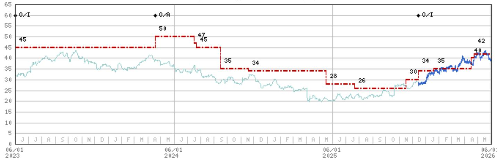

line

| Date       | Value |
| ---------- | ----- |
| 06/01 2023 | 45    |
| 06/01 2024 | 50    |
| 06/01 2025 | 47    |
| 06/01 2026 | 42    |

Stock Rating History: 6/1/21 : E/I; 1/4/22 : 0/I; 4/18/24 : 0/A; 12/15/25 : 0/I   
Price Target History: 4/21/21 : 23; 7/9/21 : 28; 1/4/22 : 30; 1/24/22 : 32; 4/11/22 : 45; 7/13/22 : 40; 10/13/22 : 42; 10/25/22 : 43;   
1/4/23 : 45; 4/18/24 : 50; 7/17/24 : 47; 7/22/24 : 45; 9/16/24 : 35; 11/18/24 : 34; 5/16/25 : 28; 7/22/25 : 26; 11/17/25 : 30;   
12/15/25 : 34; 1/20/26 : 35; 4/15/26 : 40; 4/22/26 : 42   
Source: MS Date Format : MM/DD/YY Price Target = No Price Target Assigned (NA)   
Stock Price (Not Covered by Current Analyst) — Stock Price (Covered by Current Analyst)   
Stock and Industry Ratings (abbreviations below) appear as ♦ Stock Rating/Industry View   
Stock Ratings: Overweight (O) Equal-weight (E) Underweight (U) Not-Rated (NR) No Rating Available (NA)   
Industry View: Attractive (A) In-line (I) Cautious (C) No Rating (NR)   
Effective January 13, 2014, the stocks covered by MS Asia Pacific will be rated relative to the analyst's industry (or industry team's) coverage.   
Effective January 13, 2014, the industry view benchmarks for MS Asia Pacific are as follows: relevant MSCI country index or MSCI sub-regional index or MSCI AC Asia Pacific ex Japan Index.

NOV Inc. (NOV.N) - As of 06/01/26 GMT in USD
Industry : Energy Services & Equipment   
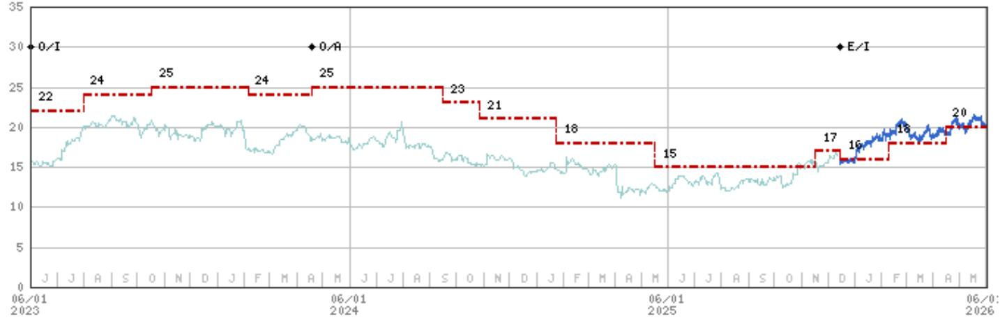

line

| Date       | Value |
| ---------- | ----- |
| 06/01 2023 | 22    |
| 06/01 2024 | 24    |
| 06/01 2024 | 25    |
| 06/01 2024 | 24    |
| 06/01 2024 | 25    |
| 06/01 2024 | 23    |
| 06/01 2024 | 21    |
| 06/01 2024 | 18    |
| 06/01 2024 | 15    |
| 06/01 2024 | 17    |
| 06/01 2024 | 16    |
| 06/01 2024 | 18    |
| 06/01 2024 | 20    |
| 06/01 2024 | E/I   |
| 06/01 2024 | 20    |

Stock Rating History: 6/1/21 : U/I; 7/9/21 : E/I; 1/4/23 : 0/I; 4/18/24 : 0/A; 12/15/25 : E/I   
Price Target History: 4/28/21 : 13; 7/9/21 : 18; 10/11/21 : 17; 4/11/22 : 20; 7/13/22 : 18; 7/28/22 : 19; 10/13/22 : 20;   
10/31/22 : 21; 1/4/23 : 24; 4/18/23 : 22; 7/31/23 : 24; 10/17/23 : 25; 2/5/24 : 24; 4/18/24 : 25; 9/16/24 : 23; 10/28/24 : 21;   
1/24/25 : 18; 5/16/25 : 15; 11/17/25 : 17; 12/15/25 : 16; 2/9/26 : 18; 4/15/26 : 20   
Source: MS Date Format : MM/DD/YY Price Target = No Price Target Assigned (NA)   
Stock Price (Not Covered by Current Analyst) — Stock Price (Covered by Current Analyst)   
Stock and Industry Ratings (abbreviations below) appear as ♦ Stock Rating/Industry View   
Stock Ratings: Overweight (O) Equal-weight (E) Underweight (U) Not-Rated (NR) No Rating Available (NA)   
Industry View: Attractive (A) In-line (I) Cautious (C) No Rating (NR)   
Effective January 13, 2014, the stocks covered by MS Asia Pacific will be rated relative to the analyst's industry (or industry team's) coverage.   
Effective January 13, 2014, the industry view benchmarks for MS Asia Pacific are as follows: relevant MSCI country index or MSCI sub-regional index or MSCI AC Asia Pacific ex Japan Index.

Schlumberger NV (SLB.N) - As of 06/01/26 GMT in USD   
Industry : Energy Services & Equipment   
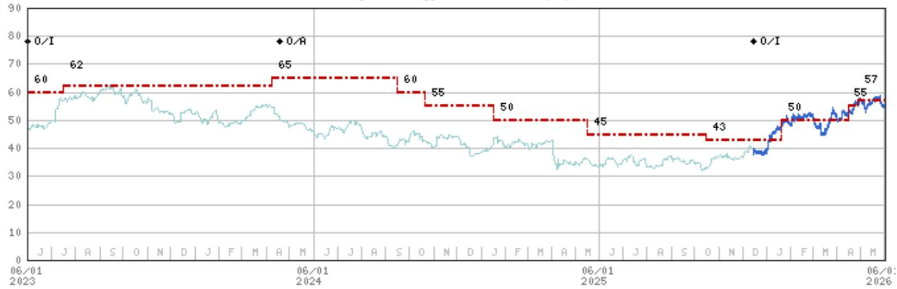

line

| Date       | Value |
| ---------- | ----- |
| 06/01 2023 | 60    |
| 06/01 2024 | 62    |
| 06/01 2024 | 65    |
| 06/01 2024 | 60    |
| 06/01 2024 | 55    |
| 06/01 2024 | 50    |
| 06/01 2024 | 45    |
| 06/01 2024 | 43    |
| 06/01 2024 | 50    |
| 06/01 2024 | 55    |
| 06/01 2024 | 57    |

Stock Rating History: 6/1/21 : 0/I; 4/18/24 : 0/A; 12/15/25 : 0/I   
Price Target History: 4/26/21 : 32; 7/9/21 : 40; 1/23/22 : 43; 4/11/22 : 50; 7/13/22 : 45; 10/13/22 : 48; 10/24/22 : 52;   
11/7/22 : 55; 4/18/23 : 60; 7/17/23 : 62; 4/8/24 : 65; 9/16/24 : 60; 10/21/24 : 55; 1/17/25 : 50; 5/16/25 : 45; 10/16/25 : 43;   
1/20/26 : 50; 4/15/26 : 55; 4/27/26 : 57   
Source: MS Date Format : MM/DD/YY Price Target = No Price Target Assigned (NA)   
Stock Price (Not Covered by Current Analyst) — Stock Price (Covered by Current Analyst)   
Stock and Industry Ratings (abbreviations below) appear as ♦ Stock Rating/Industry View   
Stock Ratings: Overweight (O) Equal-weight (E) Underweight (U) Not-Rated (NR) No Rating Available (NA)   
Industry View: Attractive (A) In-line (I) Cautious (C) No Rating (NR)   
Effective January 13, 2014, the stocks covered by MS Asia Pacific will be rated relative to the analyst's industry (or industry team's) coverage.   
Effective January 13, 2014, the industry view benchmarks for MS Asia Pacific are as follows: relevant MSCI country index or MSCI sub-regional index or MSCI AC Asia Pacific ex Japan Index.

Tenaris SA (TS.N) - As of 06/01/26 GMT in USD   
Industry : Energy Services & Equipment   
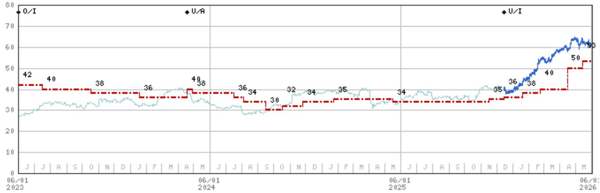

line

| Date       | Value |
| ---------- | ----- |
| 06/01 2023 | 42    |
|            | 40    |
|            | 38    |
|            | 36    |
|            | 40    |
|            | 38    |
|            | 36    |
|            | 34    |
|            | 30    |
|            | 32    |
|            | 34    |
|            | 35    |
|            | 34    |
|            | 35    |
|            | 36    |
|            | 38    |
|            | 40    |
|            | 50    |
|            | 53    |

Stock Rating History: 6/1/21 : 0/I; 4/18/24 : U/A; 12/15/25 : U/I   
Price Target History: 4/29/21 : 25; 7/9/21 : 28; 11/4/21 : 30; 2/17/22 : 32; 4/11/22 : 38; 4/28/22 : 40; 7/13/22 : 35; 1/4/23 : 42;   
2/21/23 : 44; 4/18/23 : 40; 5/1/23 : 42; 7/17/23 : 40; 10/17/23 : 38; 1/18/24 : 36; 4/18/24 : 40; 4/29/24 : 38; 7/17/24 : 36;   
8/5/24 : 34; 9/16/24 : 30; 10/17/24 : 32; 11/25/24 : 34; 1/24/25 : 35; 5/16/25 : 34; 11/17/25 : 35; 12/15/25 : 36; 1/20/26 : 38;   
2/23/26 : 40; 4/15/26 : 50; 5/14/26 : 53   
Source: MS Date Format : MM/DD/YY Price Target = No Price Target Assigned (NA)   
Stock Price (Not Covered by Current Analyst) — Stock Price (Covered by Current Analyst)   
Stock and Industry Ratings (abbreviations below) appear as ♦ Stock Rating/Industry View   
Stock Ratings: Overweight (O) Equal-weight (E) Underweight (U) Not-Rated (NR) No Rating Available (NA)   
Industry View: Attractive (A) In-line (I) Cautious (C) No Rating (NR)   
Effective January 13, 2014, the stocks covered by MS Asia Pacific will be rated relative to the analyst's industry (or industry team's) coverage.   
Effective January 13, 2014, the industry view benchmarks for MS Asia Pacific are as follows: relevant MSCI country index or MSCI sub-regional index or MSCI AC Asia Pacific ex Japan Index.

Transocean Ltd. (RIG.N) - As of 06/01/26 GMT in USD
Industry : Energy Services & Equipment   
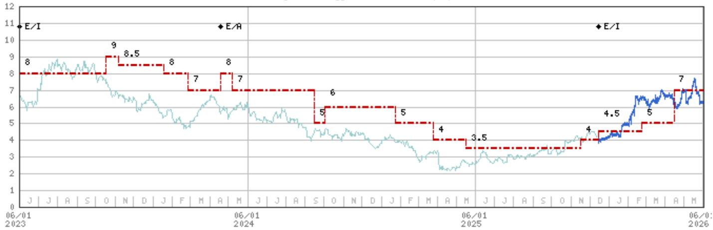

line

| Date       | Value |
| ---------- | ----- |
| 06/01 2023 | 8     |
|            | 9     |
|            | 8.5   |
|            | 8     |
|            | 7     |
|            | 8     |
|            | 7     |
|            | 6     |
|            | 5     |
|            | 4     |
|            | 3.5   |
|            | 4     |
|            | 4.5   |
|            | 5     |
|            | 7     |

Stock Rating History: 6/1/21 : E/I; 4/18/24 : E/A; 12/15/25 : E/I   
Price Target History: 4/13/21 : 3.5; 7/9/21 : 4; 4/18/23 : 8; 10/17/23 : 9; 11/6/23 : 8.5; 1/18/24 : 8; 2/26/24 : 7; 4/18/24 : 8; 5/7/24 : 7; 9/16/24 : 5; 10/3/24 : 6; 1/24/25 : 5; 3/26/25 : 4; 5/16/25 : 3.5; 11/17/25 : 4; 12/15/25 : 4.5; 2/23/26 : 5; 4/15/26 : 7   
Source: MS Date Format : MM/DD/YY Price Target = No Price Target Assigned (NA)   
Stock Price (Not Covered by Current Analyst) — Stock Price (Covered by Current Analyst)   
Stock and Industry Ratings (abbreviations below) appear as ♦ Stock Rating/Industry View   
Stock Ratings: Overweight (O) Equal-weight (E) Underweight (U) Not-Rated (NR) No Rating Available (NA)   
Industry View: Attractive (A) In-line (I) Cautious (C) No Rating (NR)   
Effective January 13, 2014, the stocks covered by MS Asia Pacific will be rated relative to the analyst's industry (or industry team's) coverage.   
Effective January 13, 2014, the industry view benchmarks for MS Asia Pacific are as follows: relevant MSCI country index or MSCI sub-regional index or MSCI AC Asia Pacific ex Japan Index.

# Important Disclosures for MS Smith Barney LLC Customers

Important disclosures regarding any material conflict of interest that can reasonably be expected to have influenced MS Smith Barney LLC's choice of a third-party research provider or the subject company of a third-party research report, are available on the MS Wealth Management disclosure website at www.morganstanley.com/online/researchdisclosures. For MS specific disclosures, you may refer to https://www.morganstanley.com/eqr/disclosures/webapp/generalresearch.

Each MS report is reviewed and approved on behalf of MS Smith Barney LLC. This review and approval is conducted by the same person who reviews the research report on behalf of MS. This could create a conflict of interest.

# Other Important Disclosures

MS policy is to update research reports as and when the Research Analyst and Research Management deem appropriate, based on developments with the issuer, the sector, or the market that may have a material impact on the research views or opinions stated therein. In addition, certain Research publications are intended to be updated on a regular periodic basis (weekly/monthly/quarterly/annual) and will ordinarily be updated with that frequency, unless the Research Analyst and Research Management determine that a different publication schedule is appropriate based on current conditions.

MS is not acting as a municipal advisor and the opinions or views contained herein are not intended to be, and do not constitute, advice within the meaning of Section 975 of the Dodd-Frank Wall Street Reform and Consumer Protection Act.

MS produces an equity research product called a "Tactical Idea." Views contained in a "Tactical Idea" on a particular stock may be contrary to the recommendations or views expressed in research on the same stock. This may be the result of differing time horizons, methodologies, market events, or other factors. For all research available on a particular stock, please contact your sales representative or go to Matrix at http://www.morganstanley.com/matrix.

MS is provided to our clients through our proprietary research portal on Matrix and also distributed electronically by MS to clients. Certain, but not all, MS products are also made available to clients through third-party vendors or redistributed to clients through alternate electronic means as a convenience. For access to all available MS, please contact your sales representative or go to Matrix at http://www.morganstanley.com/matrix.

Any access and/or use of MS is subject to MS's Terms of Use (http://www.morganstanley.com/terms.html). By accessing and/or using MS, you are indicating that you have read and agree to be bound by our Terms of Use (http://www.morganstanley.com/terms.html). In addition you consent to MS processing your personal data and using cookies in accordance with our Privacy Policy and our Global Cookies Policy (http://www.morganstanley.com/privacy\_pledge.html), including for the purposes of setting your preferences and to collect readership data so that we can deliver better and more personalized service and products to you. To find out more information about how MS processes personal data, how we use cookies and how to reject cookies see our Privacy Policy and our Global Cookies Policy (http://www.morganstanley.com/privacy\_pledge.html). Please use the provided link to review the Terms and Conditions and Most Important Terms and Conditions for MS India Company Private Limited (https://www.morganstanley.com/assets/pdfs/about-us-global-offices/india/Terms\_and\_conditions.pdf) and the following link to review the audit report (https://ny.matrix.ms.com/eqr/research/webapp/researchdocs/MSICPL\_Morgan\_Stanley\_Research\_Audit\_Report.pdf).

If you do not agree to our Terms of Use and/or if you do not wish to provide your consent to MS processing your personal data or using cookies please do not access our research. MS does not provide individually tailored investment advice. MS has been prepared without regard to the circumstances and objectives of those who receive it. MS recommends that investors independently evaluate particular investments and strategies, and encourages investors to seek the advice of a financial adviser. The appropriateness of an investment or strategy will depend on an investor's circumstances and objectives. The securities, instruments, or strategies discussed in MS may not be suitable for all investors, and certain investors may not be eligible to purchase or participate in some or all of them. MS is not an offer to buy or sell or the solicitation of an offer to buy or sell any security/instrument or to participate in any particular trading strategy. The value of and income from your investments may vary because of changes in interest rates, foreign exchange rates, default rates, prepayment rates, securities/instruments prices, market indexes, operational or financial conditions of companies or other factors. There may be time limitations on the exercise of options or other rights in securities/instruments transactions. Past performance is not necessarily a guide to future performance. Estimates of future performance are based on assumptions that may not be realized. If provided, and unless otherwise stated, the closing price on the cover page is that of the primary exchange for the subject company's securities/instruments.

The fixed income research analysts, strategists or economists principally responsible for the preparation of MS have received compensation based upon various factors, including quality, accuracy and value of research, firm profitability or revenues (which include fixed income trading and capital markets profitability or revenues), client feedback and competitive factors. Fixed Income Research analysts', strategists' or economists' compensation is not linked to investment banking or capital markets transactions performed by MS or the profitability or revenues of particular trading desks.

The "Important Regulatory Disclosures on Subject Companies" section in MS lists all companies mentioned where MS owns 1% or more of a class of common equity securities of the companies. For all other companies mentioned in MS, MS may have an investment of less than 1% in securities/instruments or derivatives of securities/instruments of companies and may trade them in ways different from those discussed in MS. Employees of MS not involved in the preparation of MS may have investments in securities/instruments or derivatives of securities/instruments of companies mentioned and may trade them in ways different from those discussed in MS. Derivatives may be issued by MS or associated persons.

With the exception of information regarding MS, MS is based on public information. MS makes every effort to use reliable, comprehensive information, but we make no representation that it is accurate or complete. We have no obligation to tell you when opinions or information in MS change apart from when we intend to discontinue equity research coverage of a subject company. Facts and views presented in MS have not been reviewed by, and may not reflect information known to, professionals in other MS business areas, including investment banking personnel.

MS personnel may participate in company events such as site visits and are generally prohibited from accepting payment by the company of associated expenses unless pre-approved by authorized members of Research management.

MS may make investment decisions that are inconsistent with the recommendations or views in this report.

To our readers based in Taiwan or trading in Taiwan securities/instruments: Information on securities/instruments that trade in Taiwan is distributed by MS Taiwan Limited ("MSTL"). Such information is for your reference only. The reader should independently evaluate the investment risks and is solely responsible for their investment decisions. MS may not be distributed to the public media or quoted or used by the public media without the express written consent of MS. Any non-customer reader within the scope of Article 7-1 of the Taiwan Stock Exchange Recommendation Regulations accessing and/or receiving MS is not permitted to provide MS to any third party (including but not limited to related parties, affiliated companies and any other third parties) or engage in any activities regarding MS which may create or give the appearance of creating a conflict of interest. Information on securities/instruments that do not trade in Taiwan is for informational purposes only and is not to be construed as a recommendation or a solicitation to trade in such securities/instruments. MSTL may not execute transactions for clients in these securities/instruments.

MS is not incorporated under PRC law and the research in relation to this report is conducted outside the PRC. MS does not constitute an offer to sell or the solicitation of an offer to buy any securities in the PRC. PRC investors shall have the relevant qualifications to invest in such securities and shall be responsible for obtaining all relevant approvals, licenses, verifications and/or registrations from the relevant governmental authorities themselves. Neither this report nor any part of it is intended as, or shall constitute, provision of any consultancy or advisory service of securities investment as defined under PRC law. Such information is provided for your reference only.

MS is disseminated in Brazil by MS C.T.V.M. S.A. located at Av. Brigadeiro Faria Lima, 3600, 6th floor, São Paulo - SP, Brazil; and is regulated by the Comissão de Valores Mobiliários; in Mexico by MS México, Casa de Bolsa, S.A. de C.V which is regulated by Comision Nacional Bancaria y de Valores. Paseo de los Tamarindos 90, Torre 1, Col. Bosques de las Lomas Floor 29, 05120 Mexico City; in Japan by MS MUFG Securities Co., Ltd. and, for Commodities related research reports only, MS Capital Group Japan Co., Ltd; in Hong Kong by MS Asia Limited (which accepts responsibility for its contents) and by MS Bank Asia Limited; in Singapore by MS Asia (Singapore) Pte. (Registration number 199206298Z) and/or MS Asia (Singapore) Securities Pte Ltd (Registration number 200008434H), regulated by the Monetary Authority of Singapore (which accepts legal responsibility for its contents and should be contacted with respect to any matters arising from, or in connection with, MS) and by MS Bank Asia Limited, Singapore Branch (Registration number T14FC0118); in Australia to "wholesale clients" within the meaning of the Australian Corporations Act by MS Australia Limited A.B.N. 67 003 734 576, holder of Australian financial services license No. 233742, which accepts responsibility for its contents; in Australia to "wholesale clients" and "retail clients" within the meaning of the Australian Corporations Act by MS Wealth Management Australia Pty Ltd (A.B.N. 19 009 14-5 555, holder of Australian financial services license No. 240813, which accepts responsibility for its contents; in Korea by MS & Co International plc, Seoul Branch; in India by MS India Company Private Limited having Corporate Identification No (CIN) U22990MH1998PTC115305, regulated by the Securities and Exchange Board of India ("SEBI") and holder of licenses as a Research Analyst (SEBI Registration No. INH000001105); Stock Broker (SEBI Stock Broker Registration No. INZ000244438), Merchant Banker (SEBI Registration No. INM000011203), and depository participant with National Securities Depository Limited (SEBI Registration No. IN-DP-NSDL-567-2021) having registered office at Altimus, Level 39 & 40, Pandurang Budhkar Marg, Worli, Mumbai 400018, India; Telephone no. +91-22-61181000; Compliance Officer Details: Mr. Tejarshi Hardas, Tel. No.: +91-22-61181000 or Email: tejarshi.hardas@morganstanley.com; Grievance officer details: Mr. Tejarshi Hardas, Tel. No.: +91-22-61181000 or Email: msic-compliance@morganstanley.com. MS India Company Private Limited (MSICPL) may use AI tools in providing research services. All recommendations contained herein are made by the duly qualified research analysts; in Canada by MS Canada Limited; in Germany and the European Economic Area where required by MS Europe S.E., authorised and regulated by Bundesanstalt fuer Finanzdienstleistungsaufsicht (BaFin) under the reference number 149169; in the US by MS & Co. LLC, which accepts responsibility for its contents. MS & Co. International plc, authorized by the Prudential Regulation Authority and regulated by the Financial Conduct Authority and the Prudential Regulation Authority, disseminates in the UK research that it has prepared, and research which has been prepared by any of its affiliates, only to persons who (i) are investment professionals falling within Article 19(5) of the Financial Services and Markets Act 2000 (Financial Promotion) Order 2005 (as amended, the "Order"); (ii) are persons who are high net worth entities falling within Article 49(2)(a) to (d) of the Order; or (iii) are persons to whom an invitation or inducement to engage in investment activity (within the meaning of section 21 of the Financial Services and Markets Act 2000, as amended) may otherwise lawfully be communicated or caused to be communicated. RMB MS Proprietary Limited is a member of the JSE Limited and A2X (Pty) Ltd. RMB MS Proprietary Limited is a joint venture owned equally by MS International Holdings Inc. and RMB Investment Advisory (Proprietary) Limited, which is wholly owned by FirstRand Limited. The information in MS is being disseminated by MS Saudi Arabia, regulated by the Capital Market Authority in the Kingdom of Saudi Arabia, and is directed at Sophisticated investors only.

The information in MS is being communicated by MS & Co. International plc (DIFC Branch), regulated by the Dubai Financial Services Authority (the DFSA)

or by MS & Co. International plc (ADGM Branch), regulated by the Financial Services Regulatory Authority Abu Dhabi (the FSRA), and is directed at Professional Clients only, as defined by the DFSA or the FSRA, respectively. The financial products or financial services to which this research relates will only be made available to a customer who we are satisfied meets the regulatory criteria of a Professional Client. A distribution of the different MS Research ratings or recommendations, in percentage terms for Investments in each sector covered, is available upon request from your sales representative.

The information in MS is being communicated by MS & Co. International plc (QFC Branch), regulated by the Qatar Financial Centre Regulatory Authority (the QFCRA), and is directed at business customers and market counterparties only and is not intended for Retail Customers as defined by the QFCRA.

As required by the Capital Markets Board of Turkey, investment information, comments and recommendations stated here, are not within the scope of investment advisory activity. Investment advisory service is provided exclusively to persons based on their risk and income preferences by the authorized firms. Comments and recommendations stated here are general in nature. These opinions may not fit to your financial status, risk and return preferences. For this reason, to make an investment decision by relying solely to this information stated here may not bring about outcomes that fit your expectations.

The following companies do business in countries which are generally subject to comprehensive sanctions programs administered or enforced by the U.S. Department of the Treasury's Office of Foreign Assets Control ("OFAC") and by other countries and multi-national bodies: ADES Holding, Arabian Drilling Co, HELLENiQ ENERGY Holdings SA, MOL Magyar Olajes Gazipari Nyrt. The trademarks and service marks contained in MS are the property of their respective owners. Third-party data providers make no warranties or representations relating to the accuracy, completeness, or timeliness of the data they provide and shall not have liability for any damages relating to such data. The Global Industry Classification Standard (GICS) was developed by and is the exclusive property of MSCI and S&P.

MS, or any portion thereof may not be reprinted, sold or redistributed without the written consent of MS.

Indicators and trackers referenced in MS may not be used as, or treated as, a benchmark under Regulation EU 2016/1011, or any other similar framework.

The issuers and/or fixed income products recommended or discussed in certain fixed income research reports may not be continuously followed. Accordingly, investors should regard those fixed income research reports as providing stand-alone analysis and should not expect continuing analysis or additional reports relating to such issuers and/or individual fixed income products. MS may hold, from time to time, material financial and commercial interests regarding the company subject to the Research report.

Registration granted by SEBI and certification from the National Institute of Securities Markets (NISM) in no way guarantee performance of the intermediary or provide any assurance of returns to investors. Investment in securities market are subject to market risks. Read all the related documents carefully before investing.

INDUSTRY COVERAGE: Energy Services & Equipment 

<table><tr><td>COMPANY (TICKER)</td><td>RATING (AS OF)</td><td>PRICE* (05/29/2026)</td></tr><tr><td colspan="3">Joe Laetsch, CFA</td></tr><tr><td>Baker Hughes Co (BKR.O)</td><td>++</td><td>$63.88</td></tr><tr><td>Chart Industries (GTLS.N)</td><td>++</td><td>$207.82</td></tr><tr><td>Halliburton Co (HAL.N)</td><td>O (01/04/2022)</td><td>$38.85</td></tr><tr><td>Helmerich &amp; Payne Inc (HP.N)</td><td>U (03/26/2025)</td><td>$38.15</td></tr><tr><td>Liberty Energy (LBRT.N)</td><td>O (03/26/2025)</td><td>$29.26</td></tr><tr><td>Nabors Industries Inc. (NBR.N)</td><td>O (10/17/2023)</td><td>$92.63</td></tr><tr><td>NOV Inc. (NOV.N)</td><td>E (12/15/2025)</td><td>$19.96</td></tr><tr><td>Patterson-UTI Energy (PTEN.O)</td><td>E (10/17/2023)</td><td>$11.21</td></tr><tr><td>Perimeter Solutions (PRM.N)</td><td>O (06/09/2022)</td><td>$32.28</td></tr><tr><td>ProFrac Holding Corp (ACDC.O)</td><td>U (10/17/2024)</td><td>$6.11</td></tr><tr><td>Schlumberger NV (SLB.N)</td><td>O (09/10/2019)</td><td>$54.55</td></tr><tr><td>Tenaris SA (TS.N)</td><td>U (04/18/2024)</td><td>$60.93</td></tr><tr><td>Transocean Ltd. (RIG.N)</td><td>E (07/07/2020)</td><td>$6.19</td></tr></table>

Stock Ratings are subject to change. Please see latest research for each company.   
\* Historical prices are not split adjusted.

Stock Ratings are subject to change. Please see latest research for each company.   
\* Historical prices are not split adjusted.   
INDUSTRY COVERAGE: EEMEA - Oil & Gas 

<table><tr><td>COMPANY (TICKER)</td><td>RATING (AS OF)</td><td>PRICE* (05/25/2026)</td></tr><tr><td colspan="3">Ricardo Rezende, CFA</td></tr><tr><td>Abu Dhabi National Oil Co Distribution (ADNOCDIST.AD)</td><td>O (03/11/2025)</td><td>AED 3.93</td></tr><tr><td>ADES Holding (2382.SE)</td><td>O (11/19/2025)</td><td>SAR 19.19</td></tr><tr><td>Adnoc Drilling Company PJSC (ADNOCDRILL.AD)</td><td>O (05/09/2023)</td><td>AED 5.96</td></tr><tr><td>ADNOC Gas Plc (ADNOCGAS.AD)</td><td>O (04/29/2026)</td><td>AED 3.43</td></tr><tr><td>ADNOC Logistics &amp; Services PLC (ADNOCLS.AD)</td><td>O (04/10/2025)</td><td>AED 5.99</td></tr><tr><td>Aldrees Petroleum &amp; Transport Svcs. Co. (4200.SE)</td><td>E (10/30/2025)</td><td>SAR 116.00</td></tr><tr><td>Arabian Drilling Co (2381.SE)</td><td>O (07/06/2025)</td><td>SAR 88.80</td></tr><tr><td>HELLENiQ ENERGY Holdings SA (HEPr.AT)</td><td>E (07/23/2024)</td><td>€10.30</td></tr><tr><td>Luberef (2223.SE)</td><td>O (12/08/2024)</td><td>SAR 126.50</td></tr><tr><td>MOL Magyar Olajes Gazipari Nyrt (MOLB.BU)</td><td>E (07/23/2024)</td><td>HUF 3,854.00</td></tr><tr><td>Motor Oil Hellas Corinth Refineries SA (MORr.AT)</td><td>++</td><td>€36.98</td></tr><tr><td>Orlen SA (PKN.WA)</td><td>U (07/25/2025)</td><td>PLN 141.76</td></tr><tr><td>Qatar Gas Transport Nakilat Co Ltd (QGTS.QA)</td><td>E (04/10/2025)</td><td>QAR4.33</td></tr><tr><td>Turkiye Petrol Rafinerileri AS (TUPRS.IS)</td><td>E (02/05/2026)</td><td>TL 236.20</td></tr></table>

INDUSTRY COVERAGE: Energy Services 

<table><tr><td>COMPANY (TICKER)</td><td>RATING (AS OF)</td><td>PRICE* (05/29/2026)</td></tr><tr><td colspan="3">Guilherme Levy</td></tr><tr><td>GTT (GTT.PA)</td><td>U (06/08/2025)</td><td>€197.90</td></tr><tr><td>Saipem (SPMI.MI)</td><td>O (03/16/2023)</td><td>€4.12</td></tr><tr><td>SBM Offshore NV (SBMO.AS)</td><td>O (06/08/2025)</td><td>€32.64</td></tr><tr><td>Subsea 7 (SUBC.OL)</td><td>O (11/10/2024)</td><td>NKr 305.00</td></tr><tr><td>Technip Energies NV (TE.PA)</td><td>E (01/13/2025)</td><td>€35.46</td></tr><tr><td>Vallourec (VLLP.PA)</td><td>E (06/08/2025)</td><td>€23.92</td></tr></table>

Stock Ratings are subject to change. Please see latest research for each company.   
\* Historical prices are not split adjusted.

© 2026 MS