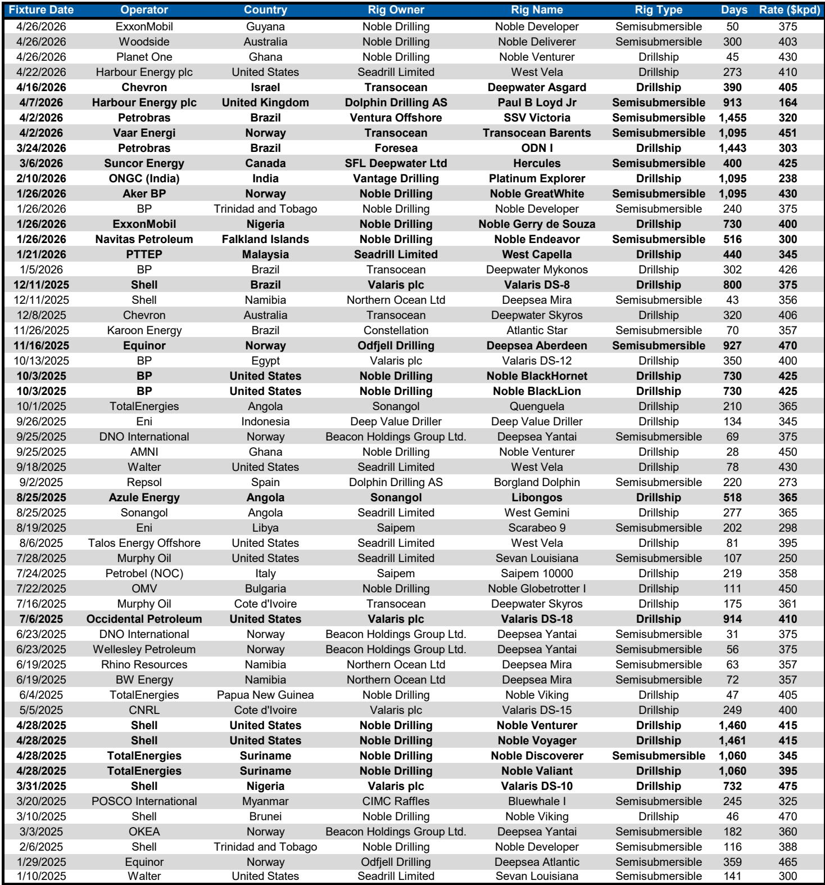
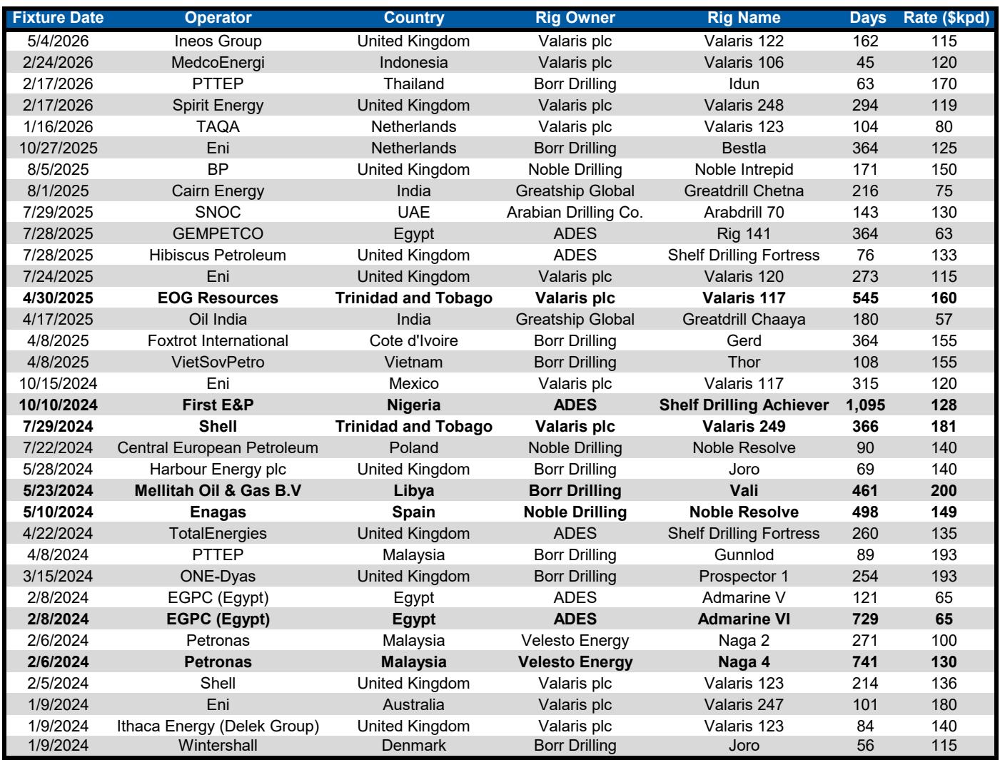
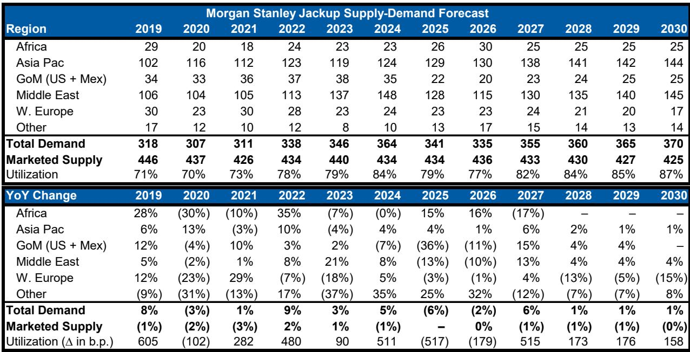

# The Offshore Drilling Market Is Tightening Faster Than Most Investors Expect, and the Pricing Power Shift Is Already Underway

The offshore drilling industry has been here before. In the early 2010s, a wave of newbuilds flooded the market, utilization collapsed, and dayrates followed. Investors who lived through that cycle have been conditioned to view any recovery with skepticism. But the current setup is structurally different. Supply is not just constrained; it is effectively frozen. No meaningful newbuild deliveries are scheduled through 2030. Cold-stacked rigs, especially high-spec floaters, are concentrated in the hands of a few publicly traded drillers who have shown no appetite for reactivation. Meanwhile, demand is accelerating. Deepwater rig counts are projected to rise 17% by 2030, and the tendering pipeline for floaters is the busiest it has been in 15 years. The combination is producing a tightening dynamic that is historically associated with strong pricing power.

This is not a cyclical bounce. It is a multi-year structural shift. The question is not whether dayrates will rise; it is how far they can go before the market tests the limits of operator willingness to pay. A global investment bank report on North American energy services and equipment lays out the case in detail, projecting marketed rig utilization reaching the mid- to high-80% range by 2028 and leading-edge dayrates for high-spec assets recovering toward 2023 peaks within one to two years. For investors, the implications are significant. But the path to capturing that value is not straightforward. The report identifies preferred ways to play the upcycle, yet leaves several open questions about which segments, geographies, and business models will benefit most.

The argument is clear: the offshore drilling market is entering a period of sustained tightening, and the pricing recovery is already visible in the data. The report provides a framework for understanding why this time is different, where the risks remain, and how to position portfolios accordingly. But it also acknowledges that some of the most important variables, such as the pace of efficiency gains and the potential for operator substitution, are not fully resolved. Those uncertainties are precisely what make the current moment both compelling and complex for serious investors.

## Demand Is Accelerating Across Deepwater Markets, but the Growth Is Concentrated in a Few Regions That Will Determine the Pace of the Cycle

The report projects offshore rig demand growing 12% by 2030, with deepwater leading at 17% and shelf activity rising 10%. These are not aggressive numbers by historical standards. In the three to four years following the pandemic trough of late 2020, deepwater activity grew roughly 25%, and shelf activity expanded by about 35%. The current forecast is more measured, which suggests the report is not assuming a speculative boom. Instead, the growth is driven by structural factors: rising global oil demand, a strategic push for supply diversification, and the need to build strategic reserves in key consuming nations.

What makes this demand cycle different is its geographic concentration. The report identifies Africa, Latin America ex-Brazil, and Asia-Pacific as the primary growth engines. In these markets, offshore capital expenditure is expected to grow 15% year-over-year in 2027 and at a 5-10% compound annual growth rate from 2026 through 2030. That is not uniform global growth; it is a regional story. Operators in these basins are making long-term commitments, signing contracts with longer lead times and durations than normal. The report notes that year-to-date floater tendering activity, measured in rig-years awarded, is the highest it has been in approximately 15 years. That is a signal of conviction, not speculation.

The implication for investors is that exposure to offshore drilling is not equally valuable across all geographies. Companies with concentrated operations in the high-growth basins will see disproportionate benefits. Those with exposure to mature, low-growth regions may see only marginal improvement. The report highlights that Schlumberger and Halliburton, with roughly 25% and 15% of revenues tied to offshore oil and gas capital expenditure respectively, are positioned to capture this growth. But the regional concentration also introduces risk. If political instability, regulatory delays, or project cancellations emerge in Africa or Latin America, the demand outlook could soften. The report does not fully explore these tail risks, but they are worth monitoring.

## Supply Discipline Is the Structural Backbone of This Cycle, but the Assumption of No New Supply Through 2030 Deserves Scrutiny

The report makes a bold assumption: no incremental supply from 2027 through 2030. That means no reactivations of cold-stacked rigs and no newbuild deliveries. Given the wave of scrapping in recent years, particularly among floaters, the marketed fleet is effectively fixed. The cold-stacked high-spec floater fleet is concentrated among a few disciplined public drillers, and the report argues that the risk of a supply-driven reset is low.

This assumption is the foundation of the entire pricing thesis. If utilization is to reach the mid- to high-80% range by 2028, demand must rise into a fixed supply base. That is what creates pricing power. But the assumption is also the most vulnerable point in the argument. History shows that when dayrates rise high enough, the economics of reactivation become compelling. Cold-stacked rigs are not permanently retired; they are mothballed. If leading-edge dayrates for high-spec drillships reach $525,000 per day by 2028, as the report projects, the incentive to reactivate will be substantial. The report acknowledges this implicitly by noting that the cold-stacked fleet is concentrated among disciplined drillers, but discipline has a price. At some level of dayrate, shareholder pressure to unlock value could override strategic restraint.

The report does not model a scenario in which supply responds to higher prices. That is a meaningful gap. For investors, the key question is not whether the report's base case is plausible; it is what happens if supply breaks discipline. A modest wave of reactivations could cap dayrate growth and compress the upside for drillers. Conversely, if discipline holds, the cycle could extend well beyond 2028. The report's framework is useful, but it requires investors to form their own view on the elasticity of supply.

## The Pricing Recovery Is Already Visible, but the Path to Peak Dayrates Is Not Linear and Depends on Operator Behavior

The report projects that leading-edge dayrates for high-spec drillships and semisubmersibles will rise roughly 20% to $525,000 and $475,000 respectively by 2028, with high-spec jackups increasing 10-15% to approximately $175,000 by 2030. These are meaningful moves, but they represent a recovery to 2023 peak levels, not a breakout into new territory. The report is careful not to claim that the cycle will surpass previous highs. Instead, the argument is that the recovery is sustainable and that dayrates will hold at elevated levels rather than spike and retreat.

The sustainability argument rests on operator behavior. In previous cycles, operators responded to rising dayrates by accelerating drilling programs, which tightened the market further and pushed rates even higher, only to overbuild and trigger a collapse. The current cycle is different because operators are more disciplined. The report notes that contract lead times and durations remain elevated, which suggests operators are locking in capacity early rather than chasing spot rates. That behavior dampens volatility and extends the cycle.

But operator discipline is not guaranteed. If oil prices rise sharply, the incentive to accelerate drilling could overwhelm restraint. Conversely, if oil prices weaken, operators could defer projects and soften demand. The report does not model oil price scenarios, but the sensitivity is obvious. For investors, the key insight is that the pricing recovery is happening at a measured pace, which reduces the risk of a boom-bust outcome. The trade-off is that the upside may be more gradual than some expect. The report's preferred plays, Schlumberger and Halliburton, benefit from the trend without requiring a spike in dayrates. That is a conservative positioning that reflects the uncertainty.

## The Report Leaves Open Key Questions About Efficiency Gains and Operator Substitution That Could Reshape the Demand Outlook

One of the most interesting tensions in the report is the treatment of drilling efficiency. The report acknowledges that ongoing efficiency gains could temper the activity and capital expenditure required to sustain production growth. In earlier analyses, this was a caveat that tempered the bullish outlook. Now, the report argues that efficiency gains are increasingly outweighed by a tightening oil macro backdrop. That is a judgment call, not a settled fact.

The data on efficiency is mixed. The report shows that well count growth outpaces rig count growth, which implies that each rig is drilling more wells per year. That is a classic efficiency gain. If that trend continues, the demand for rigs could grow more slowly than the demand for wells. The report's demand forecast already incorporates some efficiency improvement, but the magnitude is uncertain. If efficiency accelerates, the utilization and dayrate projections could prove optimistic.

There is also the question of operator substitution. If deepwater dayrates rise sharply, operators may shift activity to shelf or onshore basins where costs are lower. The report projects shelf activity growing only 10% through 2030, which suggests limited substitution. But that assumption depends on the availability of suitable reservoirs and the cost differential between deepwater and alternatives. If deepwater becomes too expensive, the demand growth could shift. The report does not explore this substitution risk in depth, leaving it as an open question for investors to assess.

## A Decision Framework for Investors: Three Questions to Determine Positioning

For investors evaluating exposure to the offshore drilling upcycle, the report provides the raw material for a decision framework. Three questions are central.

First, what is your view on supply discipline? If you believe cold-stacked rigs will remain idle and no newbuilds will materialize, the utilization and dayrate projections are credible. If you believe discipline will break at higher prices, the upside is capped. The report leans toward discipline but does not prove it.

Second, which part of the value chain do you want to own? The report distinguishes between diversified services majors, which benefit from broad offshore exposure, and pure-play drillers, which are more leveraged to dayrate movements. Schlumberger and Halliburton offer lower risk and more diversified revenue. Transocean offers higher potential upside but with greater volatility and an equal-weight rating from the report. The choice depends on risk tolerance and conviction in the dayrate trajectory.

Third, how do you weigh the regional concentration risk? The growth is concentrated in Africa, Latin America ex-Brazil, and Asia-Pacific. Exposure to those regions is a positive. Exposure to mature basins is a neutral or negative. Investors should verify that their chosen companies have meaningful operations in the high-growth regions.

These questions do not have easy answers, but the report provides enough data to frame the debate. The key is to recognize that the offshore drilling market is tightening, but the magnitude and duration of the cycle depend on variables that are inherently uncertain.

## Join the Community to Read the Full Report and Review the Original Charts

The analysis above draws on a detailed report from a global investment bank that covers offshore drilling demand, supply, pricing, and stock implications. The full report includes charts on utilization trends, dayrate trajectories, regional capex growth, and company-specific exposure that are essential for forming a complete view. The report also discusses the Extel survey and provides analyst contact information for follow-up. For investors who want to dig deeper into the data and test the assumptions, the original material is available in full. Join the community to read the full report and review the original charts.

*This article is for learning and discussion only and does not constitute investment advice.*

Personal reading notes and learning share only. Not investment advice.

