June 1, 2026 04:00 AM GMT

# Thematic Alpha | North America

# US Consumer Pulse Survey: Summer Spending Kickoff - World Cup Buzz Meets Healthy Travel Demand

# AlphaWise α

While elevated gasoline prices continue to pressure consumer sentiment and bifurcation among cohorts persists, our Economics team has turned more neutral on the US consumer and expects positive consumer activity overall this year. Our survey work reveals a positive set up into summer as consumers plan to spend on the World Cup and travel.

- Inflation Concerns Continue to Rise. Concern about inflation trended up to 59% this wave from the low of 53% in January and 57% last month. The U.S. political environment continues to rank as the second most cited concern, mentioned by 39% of consumers vs. 42% last wave. Concern about geopolitical conflicts further declined to 24% from 29% last month and 33% two months ago. Consumers also remain concerned about the ability to repay debts (23%) and pay for rent/mortgage (22%); both metrics in-line with the last wave of the survey.   
- World Cup Engagement Presents Spending Opportunity. With the 2026 FIFA World Cup coming to the U.S., 44% of consumers plan to engage with matches or related events, primarily through TV/streaming (30%) and social media (23%). Engagement skews higher among males, younger consumers, and upper-income households. Notably, 70% of engaged consumers expect to increase spending across at least some categories, including food and non-alcoholic beverages (32%), food takeout/delivery (28%), and streaming services (28%).   
- Most Consumers Plan to Travel this Summer. Overall, 62% of consumers plan to travel this summer, modestly above last year's levels (60%), led by road trips (42%), domestic air travel (20%), and camping (16%). Travel demand continues to skew toward upper-income households. Spending expectations also remain healthy, with 45% of travelers planning to spend more this summer versus 13% planning to spend less, resulting in a net spending outlook of +32% (in-line with the prior two years).

This report provides a full breakdown of data from our 76th survey of \~2,000 consumers in the U.S., which ran May 21st to May 25th, to gauge consumer behavior, attitudes and outlook.

MS & CO. LLC

# Michelle M. Weaver, CFA

Equity Strategist

Michelle.M.Weaver@morganstanley.com +1 212 296-5254

# Katie Solovieva

Data Analyst

Katie.Solovieva@morganstanley.com +1 212 761-6753

# Anna Feldman

Equity Strategist

Anna.Feldman@morganstanley.com +1 212 761-3784

# Stephen C Byrd

Equity Analyst

Stephen.Byrd@morganstanley.com +1 212 761-3865

MS does and seeks to do business with companies covered in MS. As a result, investors should be aware that the firm may have a conflict of interest that could affect the objectivity of MS. Investors should consider MS as only a single factor in making their investment decision.

For analyst certification and other important disclosures, refer to the Disclosure Section, located at the end of this report.

# Key Takeaways

# How are Consumer Planning to Engage with the World Cup?

The 2026 FIFA World Cup will take place from June 11 to July 19, 2026, jointly hosted by 16 cities across the United States, Mexico, and Canada. According to our survey, 44% of consumers plan to engage with World Cup events or matches in some capacity. Engagement levels skew higher among males, younger consumers, and upper-income households.

Exhibit 1: World Cup Engagement by Demographic Categories   
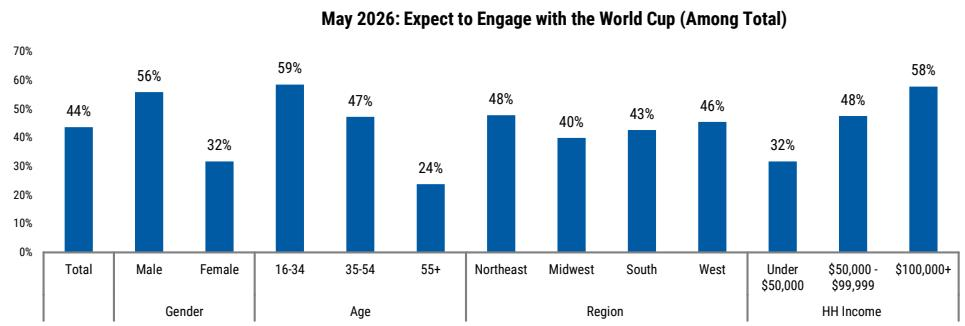

bar

May 2026: Expect to Engage with the World Cup (Among Total)
| Category | Total (%) | Male (%) | Female (%) |
| :--- | :--- | :--- | :--- |
| Gender | 44 | 56 | 32 |
| Age | 59 | 47 | 24 |
| Region | 48 | 40 | 43 |
| HH Income | 46 | 32 | 48 |
| Total | 58 | | |
Under $50,000; $50,000 - $99,999

Source: AlphaWise, MS

Top engagement activities include watching matches on TV or via streaming services (30%) and following World Cup-related content on social media (23%). Smaller shares of consumers plan to participate in sports betting (10%), attend watch parties (8%), or host their own gatherings (6%).

Consistent with broader World Cup engagement trends, participation across all activities skews higher among males, younger consumers, and upper-income households.

Exhibit 2: World Cup Engagement by Activity   
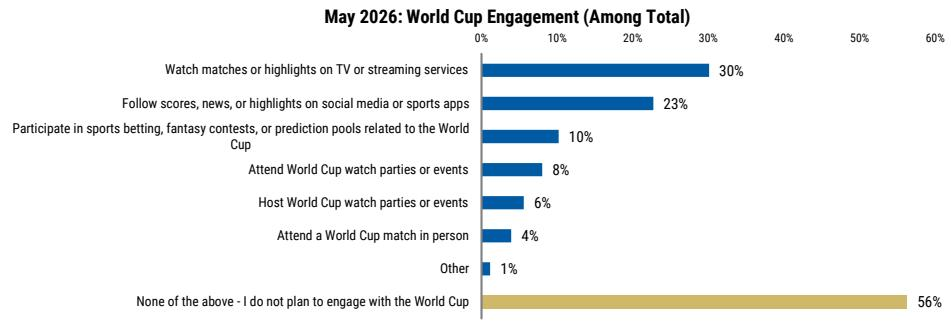

bar

May 2026: World Cup Engagement (Among Total)
| Activity | Percentage (%) |
| :--- | :--- |
| Watch matches or highlights on TV or streaming services | 30 |
| Follow scores, news, or highlights on social media or sports apps | 23 |
| Participate in sports betting, fantasy contests, or prediction pools related to the World Cup | 10 |
| Attend World Cup watch parties or events | 8 |
| Host World Cup watch parties or events | 6 |
| Attend a World Cup match in person | 4 |
| Other | 1 |
| None of the above - I do not plan to engage with the World Cup | 56 |

Source: AlphaWise, MS

The majority (70%) of consumers planning to engage with the World Cup expect to increase spending across at least some categories. Nearly one-third anticipate higher spending on food and non-alcoholic beverages, while 28% expect to spend more on food takeout/delivery and another 28% may subscribe to streaming services to watch matches.

Exhibit 3: World Cup Spending By Activity   
May 2026: Expect to Spend More than Usual Because of World Cup (Among Consumers Who Expect to Engage)   
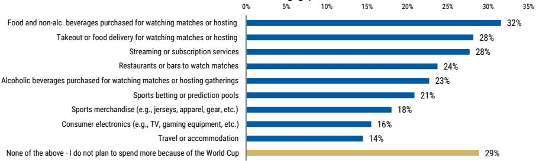

bar

| Category | Percentage (%) |
| :--- | :--- |
| Food and non-alc. beverages purchased for watching matches or hosting | 32 |
| Takeout or food delivery for watching matches or hosting | 28 |
| Streaming or subscription services | 28 |
| Restaurants or bars to watch matches | 24 |
| Alcoholic beverages purchased for watching matches or hosting gatherings | 23 |
| Sports betting or prediction pools | 21 |
| Sports merchandise (e.g., jerseys, apparel, gear, etc.) | 18 |
| Consumer electronics (e.g., TV, gaming equipment, etc.) | 16 |
| Travel or accommodation | 14 |
| None of the above - I do not plan to spend more because of the World Cup | 29 |

Source: AlphaWise, MS

# What are Consumers Planning for Summer Travel?

Overall, 62% of consumers are planning to travel this summer, modestly up from 60% last year. Road trips remain the most popular option, cited by 42% of consumers (vs. 39% last year), followed by domestic air travel at 20% (vs. 18%) and camping at 16% (vs. 9%). Fewer consumers plan to take a cruise this summer (8% vs. 15%), though trip incidence remains above 2024 levels (6%).

Summer travel intentions continue to skew higher among upper-income consumers.

Exhibit 4: Leisure Travel Plans by Type   
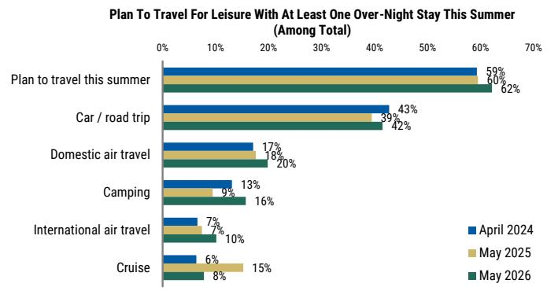

bar

| Activity | April 2024 | May 2025 | May 2026 |
| -------- | ---------- | -------- | -------- |
| Plan to travel this summer | 59% | 60% | 62% |
| Car / road trip | 43% | 39% | 42% |
| Domestic air travel | 17% | 18% | 20% |
| Camping | 13% | 9% | 16% |
| International air travel | 7% | 7% | 10% |
| Cruise | 6% | 15% | 8% |

Source: AlphaWise, MS

Exhibit 5: Leisure Travel Plans by Income Cohort   
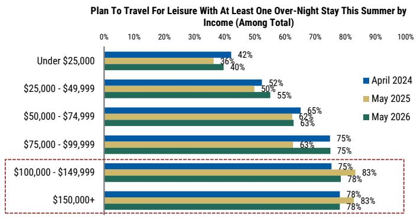

bar

Plan To Travel For Leisure With At Least One Over-Night Stay This Summer by Income (Among Total)
| Income Group | April 2024 (%) | May 2025 (%) | May 2026 (%) |
|---|---|---|---|
| Under $25,000 | 42 | 36 | 40 |
| $25,000 - $49,999 | 52 | 50 | 55 |
| $50,000 - $74,999 | 65 | 62 | 63 |
| $75,000 - $99,999 | 75 | 63 | 75 |
| $100,000 - $149,999 | 75 | 83 | 78 |
| $150,000+ | 78 | 83 | 78 |

Source: AlphaWise, MS

Consumers are willing to spend more on summer travel. Overall, 45% of travelers intend to spend more this summer, while 13% plan to spend less, resulting in a net spending outlook of +32% (% planning to spend more minus less). Another 38% expect spending to remain roughly unchanged. Upper-income consumers are more likely to report plans to spend “a lot” or “a little” more on summer travel compared to low- and mid-income cohorts.

Upper-income consumers are more likely to report plans to spend “a lot” or “a little” more on summer travel compared to low- and mid-income cohorts.

Exhibit 6: Travel Plans Compared to Last Year   
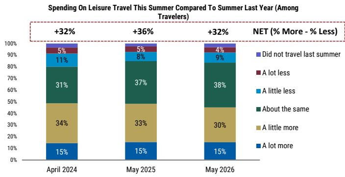  
Source: AlphaWise, MS

Exhibit 7: Travel Plans Compared to Last Year by Income Cohort   
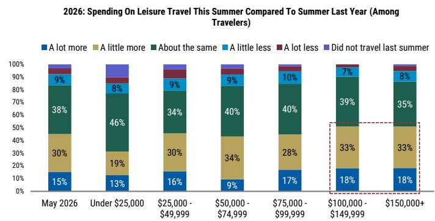

bar_stacked

2026: Spending On Leisure Travel This Summer Compared To Summer Last Year (Among Travelers)
| Time Period | A lot more (%) | A little more (%) | About the same (%) | A little less (%) | A lot less (%) | Did not travel last summer (%) |
|---|---|---|---|---|---|---|
| May 2026 | 15 | 30 | 38 | 9 | 4 | 3 |
| Under $25,000 | 13 | 19 | 46 | 8 | 5 | 5 |
| $25,000 - $49,999 | 16 | 30 | 34 | 9 | 7 | 3 |
| $50,000 - $74,999 | 9 | 34 | 40 | 9 | 4 | 3 |
| $75,000 - $99,999 | 17 | 28 | 40 | 10 | 4 | 2 |
| $100,000 - $149,999 | 18 | 33 | 39 | 7 | 2 | 1 |
| $150,000+ | 18 | 33 | 35 | 8 | 3 | 1 |

Source: AlphaWise, MS

Long-term travel intentions ticked down this month, with 58% of consumers planning to travel over the next six months (vs. 64% last wave and 59% at the same time last year). The decline is primarily driven by lower-income consumers. The outlook for 2026 leisure travel remains optimistic. Mid- and upper-income households display significantly higher intentions to travel compared to lower income households. Visiting friends/family remains the most common reason for travel among 58% of travelers.

Exhibit 8: 6 Month Travel Intentions   
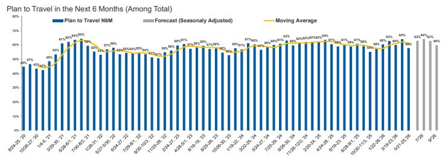

bar_line

Plan to Travel in the Next 6 Months (Among Total)
| Date | Plan to Travel N&M (%) | Forecast (Seasonally Adjusted) (%) | Moving Average (%) |
|---|---|---|---|
| 05/24-20 | 47 | 47 | 47 |
| 10/28-27 | 49 | 49 | 49 |
| 14/4-21 | 53 | 53 | 53 |
| 20/28-31 | 61 | 61 | 61 |
| 25/31-31 | 64 | 64 | 64 |
| 01/04-30 | 66 | 66 | 66 |
| 05/25-31 | 67 | 67 | 67 |
| 10/28-31 | 65 | 65 | 65 |
| 15/31-32 | 63 | 63 | 63 |
| 20/28-32 | 61 | 61 | 61 |
| 25/31-32 | 59 | 59 | 59 |
| 01/04-31 | 57 | 57 | 57 |
| 05/25-32 | 55 | 55 | 55 |
| 10/28-32 | 53 | 53 | 53 |
| 15/31-32 | 51 | 51 | 51 |
| 20/28-32 | 49 | 49 | 49 |
| 25/31-32 | 47 | 47 | 47 |
| 01/04-31 | 45 | 45 | 45 |
| 05/25-32 | 43 | 43 | 43 |
| 10/28-32 | 41 | 41 | 41 |
| 15/31-32 | 39 | 39 | 39 |
| 20/28-32 | 37 | 37 | 37 |
| 25/31-32 | 35 | 35 | 35 |
| 01/04-31 | 33 | 33 | 33 |
| 05/25-32 | 31 | 31 | 31 |
| 10/28-32 | 29 | 29 | 29 |
| 15/31-32 | 27 | 27 | 27 |
| 20/28-32 | 25 | 25 | 25 |
| 25/31-32 | 23 | 23 | 23 |
| 01/04-31 | 21 | 21 | 21 |
| 05/25-32 | 19 | 19 | 19 |
| 10/28-32 | 17 | 17 | 17 |
| 15/31-32 | 15 | 15 | 15 |
| 20/28-32 | 13 | 13 | 13 |
| 25/31-32 | 11 | 11 | 11 |
| 01/04-31 | 9 | 9 | 9 |
| 05/25-32 | 7 | 7 | 7 |
| 10/28-32 | 5 | 5 | 5 |
| 15/31-32 | 3 | 3 | 3 |
| 20/28-32 | 1 | 1 | 1 |
| 25/31-32 | -1 | -1 | -1 |
| 01/04-31 | -3 | -3 | -3 |
| 05/25-32 | -5 | -5 | -5 |
| 10/28-32 | -7 | -7 | -7 |
| 15/31-32 | -9 | -9 | -9 |
| 20/28-32 | -11 | -11 | -11 |
| 25/31-32 | -13 | -13 | -13 |
| 01/04-31 | -15 | -15 | -15 |
| 05/25-32 | -17 | -17 | -17 |
| 10/28-32 | -19 | -19 | -19 |
| 15/31-32 | -21 | -21 | -21 |
| 20/28-32 | -23 | -23 | -23 |
| 25/31-32 | -25 | -25 | -25 |
| 01/04-31 | -27 | -27 | -27 |
| 05/25-32 | -29 | -29 | -29 |
| 10/28-32 | -31 | -31 | -31 |
| 15/31-32 | -33 | -33 | -33 |
| 20/28-32 | -35 | -35 | -35 |
| 25/31-32 | -37 | -37 | -37 |
| 01/04-31 | -39 | -39 | -39 |
| 05/25-32 | -41 | -41 | -41 |
| 10/28-32 | -43 | -43 | -43 |
| 15/31-32 | -45 | -45 | -45 |
| 20/28-32 | -47 | -47 | -47 |
| 25/31-32 | -49 | -49 | -49 |
| 01/04-31 | -51 | -51 | -51 |
| 05/25-32 | -53 | -53 | -53 |
| 10/28-32 | -55 | -55 | -55 |
| 15/31-32 | -57 | -57 | -57 |
| 20/28-32 | -59 | -59 | -59 |
| 25/31-32 | -61 | -61 | -61 |
| 01/04-31 | -63 | -63 | -63 |
| 05/25-32 | -65 | -65 | -65 |
| 10/28-32 | -67 | -67 | -67 |
| 15/31-32 | -69 | -69 | -69 |
| 20/28-32 | -71 | -71 | -71 |
| 25/31-32 | -73 | -73 | -73 |
| 01/04-31 + Seasonally Adjusted: The Moving Average is also included for comparison. The Moving Average is calculated as the seasonally adjusted value multiplied by the moving average of the moving average of the moving average of the moving average of the moving average of the moving average of the moving average of the moving average of the moving average of the moving average of the moving average of the moving average of the moving average of the moving average of the moving average of the moving average of the moving average of the moving average of the moving average of the moving average of the moving average of the moving average of the moving average of the moving average of the moving average of the moving average (for each month) is calculated using the seasonally adjusted model. The Moving Average is calculated using the seasonally adjusted model. The Moving Average is calculated using the seasonally adjusted model. The Moving Average is calculated using the seasonally adjusted model. The Moving Average is calculated using the seasonally adjusted model. The Moving Average is calculated using the seasonally adjusted model. The Moving Average is calculated using the seasonally adjusted model. The Moving Average is calculated using the seasonally adjusted model. The Moving Average is calculated using the seasonally adjusted model. The Moving Average is calculated using a seasonal adjusted model. The Moving Average is calculated using a seasonal adjusted model. The Moving Average is calculated using a seasonal adjusted model. The Moving Average is calculated using a seasonal adjusted model. The Moving Average is calculated using a seasonal adjusted model. The Moving Average is calculated using a seasonal adjusted model. The Moving Average is calculated using a seasonal adjusted model. The Moving Average is calculated using a seasonal adjusted model. The Moving Average is calculated using a seasonal adjusted model. The Moving Average is calculated using a seasonal-adjusted model. The Moving Average is calculated using a seasonal adjusted model. The Moving Average is calculated using a seasonal adjusted model. The Moving Average is calculated using a seasonal adjusted model. The Moving Average is calculated using a seasonal adjusted model. The Moving Average is calculated using a seasonal adjusted model. The Moving Average is calculated using a seasonal adjusted model. The Moving Average is calculated using a seasonal adjusted model. The Moving Average is calculated using a seasonal adjusted model. The Moving Average is calculated using a seasonal adjustedmodel. The Moving Average is calculated using a seasonal adjustedmodel. The Moving Average is calculated using a seasonal adjustedmodel. The Moving Average is calculated using a seasonal adjustedmodel. The Moving Average is calculated using a seasonal adjustedmodel. The Moving Average is calculated using a seasonal adjustedmodel. The Moving Average is calculated using a seasonal adjustedmodel. The Moving Average is calculated using a seasonal adjustedmodel. The Moving Average is calculated using a seasonal adjustedmodel. The Moving Average is calculated using a seasonal adjustedmodel from a seasonal adjusted model. The Moving Average is calculated using a seasonal adjustedmodel from a seasonal adjusted model from a seasonal adjusted model from a seasonal adjusted model from a seasonal adjusted model from a seasonal adjusted model from a seasonal adjusted model from a seasonal adjusted model from a seasonal adjusted model from a seasonal adjusted model from a seasonal adjusted model from a seasonal adjusted model from a seasonal adjusted model from a seasonal adjusted model from a seasonal adjusted model from a seasonal adjusted model from a seasonal adjusted model from a seasonal adjusted model from a seasonal adjusted model from a seasonal adjusted model from a seasonal adjusted model from a seasonal adjustedmodel from a seasonal adjusted model from a seasonal adjustedmodel from a seasonal adjustedmodel from a seasonal adjustedmodel from a seasonal adjustedmodel from a seasonal adjustedmodel from a seasonal adjustedmodel from a seasonal adjustedmodel from a seasonal adjustedmodel from a seasonal adjustedmodel from a seasonal adjustedmodel from a seasonal adjustedmodel from a seasonal adjustedmodel from a seasonal adjustedmodel from a seasonal adjustedmodel from a seasonal adjustedmodel from a seasonal adjustedmodel from a seasonal adjustedmodel from a seasonal adjustedmodel from a seasonal adjustedmodel from a seasonal adjustedmodel from a seasonal adjustedModel from a seasonal adjustedmodel from a seasonal adjustedmodel from a seasonal adjustedmodel from a seasonal adjustedmodel from a seasonal adjustedmodel from a seasonal adjustedmodel from a seasonal adjustedmodel from a seasonal adjustedmodel from a seasonal adjustedmodel from a seasonal adjustedmodel from a seasonal adjustedmodel from a seasonal adjustedmodel from a seasonal adjustedmodel from a seasonal adjustedmodel from a seasonal adjustedmodel from a seasonal adjustedmodel from a seasonal adjustedmodel from a seasonal adjustedmodel from a seasonal adjustedmodel from a seasonal adjusted Model from a seasonal adjustedmodel from a seasonal adjustedmodel from a seasonal adjustedmodel from a seasonal adjustedmodel from a seasonal adjustedmodel from a seasonal adjustedmodel from a seasonal adjustedmodel from a seasonal adjustedmodel from a seasonal adjustedmodel from a seasonal adjustedmodel from a seasonal adjustedmodel from a seasonal adjustedmodel from a seasonal adjustedmodel from a seasonal adjustedmodel from a seasonal adjustedmodel from a seasonal adjustedmodel from a seasonal adjustedmodel from a seasonal adjustedmodel from a seasonal adjustedmodel from a seasonal adjusted model from a seasonally adjustedmodel from a seasonally adjustedmodel from a seasonally adjustedmodel from a seasonally adjustedmodel from a seasonally adjustedmodel from a seasonally adjustedmodel from a seasonally adjustedmodel from a seasonally adjustedmodel from a seasonally adjustedmodel from a seasonally adjustedmodel from a seasonally adjustedmodel from a seasonally adjustedmodel from a seasonally adjustedmodel from a seasonally adjustedmodel from a seasonally adjustedmodel from a seasonally adjustedmodel from a seasonally adjustedmodel from a seasonially adjustedmodel from a seasonally adjustedmodel from a seasonally adjustedmodel from a seasonally adjustedmodel from a seasonally adjustedmodel from a seasonally adjustedmodel from a seasonally adjustedmodel from a seasonally adjustedmodel from a seasonally adjustedmodel from a seasonally adjustedmodel from a seasonally adjustedmodel from a seasonally adjustedmodel from a seasonally adjustedmodel from a seasonally adjustedmodel from a seasonally adjustedmodel from a seasonally adjustedmodel from a seasonally adjustedmodel from an seasonally adjustedmodel, but not an additional value, it's not included in this case.

Source: AlphaWise, MS

# Full Survey Results

The exhibit below is an interactive where you can view results for various questions by selecting demographic filters.

U.S. Consumer Pulse 

<table><tr><td>FILTER DATA:</td><td>HH INCOME:</td><td>All</td><td>✓</td><td>AGE:</td><td>All</td><td>✓</td><td>GENDER:</td><td>All</td><td>✓</td></tr><tr><td></td><td>REGION:</td><td>All</td><td>✓</td><td>POLITICS:</td><td>All</td><td>✓</td><td></td><td colspan="2">Clear Filters</td></tr><tr><td>QUESTIONS:</td><td colspan="4">Financial Outlook</td><td>✓</td><td>&lt; Previous</td><td colspan="2">9 / 11</td><td>Next &gt;</td></tr></table>

Financial Outlook   
Full Question: How do you think the financial situation of your household will evolve in the next 6 months?

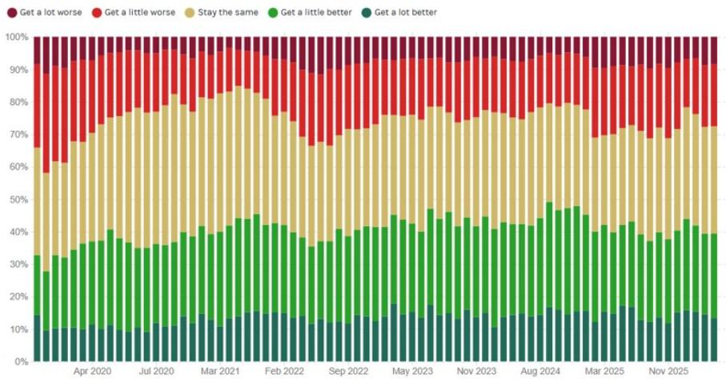

bar_stacked

| Month | Get a lot worse (%) | Get a little worse (%) | Stay the same (%) | Get a little better (%) | Get a lot better (%) |
|---|---|---|---|---|---|
| Apr 2020 | 10.0 | 38.0 | 46.0 | 19.0 | 10.0 |
| Jul 2020 | 10.0 | 37.0 | 48.0 | 19.0 | 10.0 |
| Mar 2021 | 10.0 | 35.0 | 50.0 | 20.0 | 10.0 |
| Feb 2022 | 10.0 | 34.0 | 51.0 | 21.0 | 10.0 |
| Sep 2022 | 10.0 | 36.0 | 49.0 | 19.0 | 10.0 |
| May 2023 | 10.0 | 37.0 | 48.0 | 19.0 | 15.0 |
| Nov 2023 | 10.0 | 38.0 | 47.0 | 19.0 | 15.0 |
| Aug 2024 | 10.0 | 39.0 | 46.0 | 21.0 | 15.0 |
| Mar 2025 | 10.0 | 40.0 | 45.0 | 19.0 | 15.0 |
| Nov 2025 | 10.0 | 41.0 | 44.0 | 19.0 | 15.0 |
The chart displays the percentage distribution of responses across five categories (Get a lot worse, Get a little worse, Stay the same, Get a little better, Get a lot better) for each month from April 2020 to March 2025. The data is presented in a horizontal stacked format with each row representing a month and each column representing a month's total percentage. The values for each category are labeled on top of each stack.

Source: AlphaWise, MS

Charts for all of the survey questions can be found in the slide deck below - please reach out if you are interested in any of the backup data.

# MS

# Thematic Alpha

alphawise

α

# AlphaWise U.S. Consumer Pulse Survey: Wave 76

June 1 $^{st}$ , 2026

MS does and seeks to do business with companies covered in MS. As a result, investors should be aware that the firm may have a conflict of interest that could affect the objectivity of MS. Investors should consider MS as only a single factor in making their investment decision.

For analyst certification and other important disclosures, refer to the Disclosure Section, located at the end of this report.

# MS

alphawise

α

# Survey Highlights

<table><tr><td>Sentiment</td><td>·Inflation Concerns On the Rise. Concern about inflation trended up to 59% this wave from the low of 53% in January and 57% last month. The U.S. political environment continues to rank as the second most cited concern, mentioned by 39% of consumers vs. 42% last wave. Concern about geopolitical conflicts further declined to 24% from 29% last month and 33% two months ago. Consumers also remain concerned about the ability to repay debts (23%) and pay for rent/mortgage (22%); both metrics in-line with the last wave of the survey.</td></tr><tr><td>Macro Outlook</td><td>·Consumer Confidence in the U.S. Economy &amp; Household Finances Improves Marginally. Consumer confidence in the U.S. economic outlook ticked up relative to the last month; 33% of consumers expect the economy to get better in the next six months, while 47% expect the economy to get worse and 20% believe it will remain the same. This results in a net outlook score (percentage expecting the economy to improve minus those expecting it to worsen) of -14% vs. -18% last month and -6% in May 2025. Similar upward trend is posted for household finances, with the NET score up to +19% from +12% last month and vs. +14% same time last year.</td></tr><tr><td>Spending Intentions</td><td>·Resilient Spending Outlook. Consumers&#x27; short-term spending outlook points to an increase in spending driven by upper and mid-income cohorts. In this wave, 36% of consumers expect to spend more next month, while 13% expect to spend less, resulting in a net spending outlook of +23% (vs. +17% last month and +16% at the same time last year). Longer-term spending sentiment also remains constructive, holding broadly stable month over month across the categories tested.</td></tr><tr><td>World Cup</td><td>·World Cup Engagement Presents Spending Opportunity. With the 2026 FIFA World Cup coming to the U.S., 44% of consumers plan to engage with matches or related events, primarily through TV/streaming (30%) and social media (23%). Engagement skews higher among males, younger consumers, and upper-income households. Notably, 70% of engaged consumers expect to increase spending across at least some categories, including food and non-alcoholic beverages (32%), food takeout/delivery (28%), and streaming services (28%).</td></tr><tr><td>Summer Travel</td><td>·Consumers Prioritize Summer Travel. Overall, 62% of consumers plan to travel this summer, modestly above last year&#x27;s levels (60%), led by road trips (42%), domestic air travel (20%), and camping (16%). Travel demand continues to skew toward upper-income households. Spending expectations also remain healthy, with 45% of travelers planning to spend more this summer versus 13% planning to spend less, resulting in a net spending outlook of +32% (in-line with the prior two years).</td></tr></table>

# MS

alphawise

# Outline

Pg. 3 Consumer Sentiment

Pg. 7 Outlook, Savings & Credit

Pg. 13 Spending Plans & Planned Activities

Pg. 26 Artificial Intelligence (AI)

# MS

alphawise α

# Sentiment

Concern about inflation is on the rise to 59% this wave from the low of 53% in January and 57% last month. The U.S. political environment continues to rank as the second most cited concern, mentioned by 39% of consumers vs. 42% last wave. Concern about geopolitical conflicts further declined to 24% from 29% last month and 33% two months ago.

Consumers also remain concerned about the ability to repay debts (23%) and pay for rent/mortgage (22%); both metrics in-line with the last wave of the survey.

  
Source: AlphaWise, MS

Note: In Wave 18 question wording was changed to identify top concerns for “2021” from “2020”. In Wave 18 “Presidential election” was changed to “Political environment (e.g., the efficiency of the government, government policies, attitude towards the economy, etc.)”. In Wave 27 question wording was changed to identify top concerns for “2022” from “2021”. In Wave 29 a new attribute was added to the list “Geopolitical (international) conflict”. In Wave 36 question wording was changed to identify top concerns for “the rest of 2022 and into 2023” from “2022”. In Wave 39 question wording was changed to identify top concerns for “2023” from “2022” and attribute “Covid-19 spread” to “Virus spread (COVID-19, flu, RSV)”. In Wave 49 question wording was changed to identify top concerns for “2024” from “2023”. In Wave 60 question wording was changed to identify top concerns for “2025” from “2024”. In Wave 71 question wording was changed to identify top concerns for “2026” from “2025”.

# MS

alphawise α

# Sentiment: Top Concerns by Income

Inflation is now the top concern across all income segments.

Lower-income consumers are more focused on their ability to cover rent or mortgage payments and manage debt, while higher-income consumers over-index on concerns related to their investments. Concerns about the U.S. political environment and geopolitical conflicts are also more prevalent among upper-income consumers.

May 2026: Top Concerns by Income   
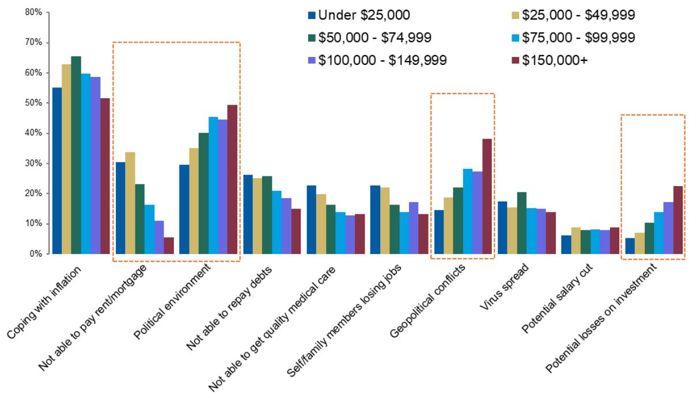

bar

| Category | Under $25,000 (%) | $25,000 - $49,999 (%) | $50,000 - $74,999 (%) | $75,000 - $99,999 (%) | $100,000 - $149,999 (%) | $150,000+ (%) |
| :--- | :---: | :---: | :---: | :---: | :---: | :---: |
| Coping with inflation | 55 | 63 | 65 | 60 | 58 | 51 |
| Not able to pay rent/mortgage | 30 | 33 | 23 | 16 | 11 | 5 |
| Political environment | 29 | 34 | 40 | 45 | 44 | 49 |
| Not able to repay debts | 26 | 25 | 26 | 21 | 18 | 14 |
| Not able to get quality medical care | 23 | 19 | 16 | 13 | 12 | 12 |
| Self-family members losing jobs | 23 | 22 | 16 | 13 | 17 | 13 |
| Geopolitical conflicts | 14 | 18 | 22 | 28 | 27 | 38 |
| Virus spread | 17 | 15 | 20 | 15 | 14 | 13 |
| Potential salary cut | 6 | 8 | 8 | 8 | 8 | 9 |
| Potential losses on investment | 5 | 6 | 10 | 13 | 17 | 22 |

Source: AlphaWise, MS

# MS

alphawise α

# Sentiment: Top Concerns by Income

A similar trend is also observed in the time series data; income cohorts are directionally aligned, but the magnitude varies. Concern over the inability to pay for rent/mortgages is significantly more of a worry among low-income consumers, while concern over the losses on investments has been more of a worry among the upper-income segment.

Top Concerns: Coping with Inflation by Income   
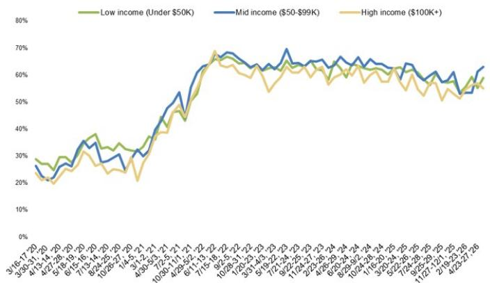

line

| Date       | Low income (Under $50K) | Mid income ($50-$99K) | High income ($100K+) |
|------------|--------------------------|------------------------|----------------------|
| 3/16-17-20 | 25%                      | 20%                    | 15%                  |
| 4/30-31-20 | 28%                      | 22%                    | 18%                  |
| 4/12-28-20 | 30%                      | 25%                    | 20%                  |
| 5/18-26-20 | 32%                      | 28%                    | 22%                  |
| 6/15-19-20 | 35%                      | 30%                    | 25%                  |
| 7/13-14-20 | 38%                      | 32%                    | 28%                  |
| 8/24-25-20 | 40%                      | 35%                    | 30%                  |
| 10/28-27-20 | 42%                     | 38%                    | 32%                  |
| 1/4-5-21   | 45%                      | 40%                    | 35%                  |
| 4/30-31-21 | 48%                      | 42%                    | 38%                  |
| 7/2-5-21   | 50%                      | 45%                    | 40%                  |
| 10/30-11-21 | 52%                     | 48%                    | 42%                  |
| 1/29-12-21 | 55%                      | 50%                    | 45%                  |
| 4/29-13-21 | 58%                      | 52%                    | 48%                  |
| 6/11-13-22 | 60%                      | 55%                    | 50%                  |
| 7/15-18-22 | 62%                      | 58%                    | 52%                  |
| 9/2-5-22   | 65%                      | 60%                    | 55%                  |
| 10/28-31-22 | 63%                     | 58%                    | 53%                  |
| 1/20-31-23 | 60%                      | 55%                    | 50%                  |
| 3/31-43-23 | 62%                      | 58%                    | 52%                  |
| 5/19-32-23 | 65%                      | 60%                    | 55%                  |
| 7/21-34-23 | 63%                      | 58%                    | 53%                  |
| 9/22-35-23 | 60%                      | 55%                    | 50%                  |
| 11/24-27-23 | 62%                     | 58%                    | 52%                  |
| 1/27-28-23 | 60%                      | 55%                    | 50%                  |
| 4/29-30-24 | 62%                      | 58%                    | 52%                  |
| 6/30-34-24 | 60%                      | 55%                    | 50%                  |
| 8/29-34-24 | 62%                      | 58%                    | 52%                  |
| 10/24-28-24 | 60%                     | 55%                    | 50%                  |
| 1/18-30-24 | 62%                      | 58%                    | 52%                  |
| 3/30-34-25 | 60%                      | 55%                    | 50%                  |
| 5/22-36-25 | 62%                      | 58%                    | 52%                  |
| 7/24-38-25 | 60%                      | 55%                    | 50%                  |
| 9/27-39-25 | 62%                      | 58%                    | 52%                  |
| 11/27-41-25 | 60%                     | 55%                    | 50%                  |
| 1/19-43-41 | 62%                      | 58%                    | 52%                  |
| 3/31-47-41 | 60%                      | 55%                    | 50%                  |
| 4/29-49-41 | 62%                      | 58%                    | 52%                  |
| 6/23-51-41 | 60%                      | 55%                    | 50%                  |
| 9/27-61-41 | 62%                      | 58%                    | 52%                  |
| 11/27-71-41 | 60%                     | 55%                    | 50%                  |
| 1/19-73-71 | 62%                      | 58%                    | 52%                  |
| 3/31-76-71 | 60%                      | 55%                    | 50%                  |
| 4/30-79-71 | 62%                      | 58%                    | 52%                  |
| Note: The data is already in CSV format as it is not available for the years here. The values are estimated based on the provided code. There is no further breakdown of the original data points. I have left blank text for reference. Please note that the original data point is empty. You would need to run the code if you want to run the data points. Please note that the original data point is empty. You would need to run the code if you want to run the data points. Please note that the original data point is empty. You would need to run the code if you want to run the data points. Please note that the original data point is empty. You would need to run the code if you want to run the data points. Please note that the original data point is empty. You would need to run the code if you want for the original data point. Please note that the original data point is empty. You would need to run the code if you want for the original data point. Please note that the original data point is empty. You would need to run the code if you want for the original data point. Please note that the original data point is empty. You would need to run the code if you want for the original data point. Please note that the original data point is empty. You would need to run the code if you want to run the original data point. Please note that the original data point is empty. You would need to run the code if you want to run the original data point. Please note that the original data point is empty. You would need to run the code if you want to run the original data point. Please note that the original data point is empty. You would need to run the code if you want to run the original data point. Please note that the original data point is empty. You would need not run the original data points. Please note that this is not available for any year here. Please note that this is not available for any year here. Please note that this is not available for any year here. Please note that this is not available for any year here. Please note that this is not available for any year here. Please note that this is not available for any year here. Please note that this is not available for any year here. Please note that this is not available for any year here. Please note that this is not available for any year here. Please note it is not available for any year here. Please note it is not available for any year here. Please note it is not available for any year here. Please note it is not available for any year here. Please note it is not available for any year here. Please note it is not available for any year here. Please note it is not available for any year here. Please note it is not available for any year here. Please note it is not available for any year here. Please note it only has been available for any year here. Please note it only has been available for any year here. Please note it only has been available for any year here. Please note it only has been available for any year here. Please note it only has been available for any year here. Please note it only has been available for any year here. Please note it only has been available for any year here. Please note it only has been available for any year here. Please note it only has been available for any years here. Please note it only has been available for any years here. Please note it only has been available for any years here. Please note it only has been available for any years here. Please note it only has been available for any years here. Please note it only has been available for any years here. Please note it only has been available for any years here. Please note it only has been available for any years here. Please note it only has been available for any years here. Please not be available for any year here. Please note it only has been available for any years here. Please note it only has been available for any years here. Please note it only has been available for any years here. Please note it only has been available for any years here. Please note it only has been available for any years here. Please note it only has been available for any years here. Please note it only has been available for any years here. Please note it only has been available for any year here. Please note it only has been available for any years here. Please note it only has been available for any years here. Please note it only has been available for any years here. Please note it only has been available for any years here. Please note it only has been available for any years here. Please note it only has been available for any years here. Please note it only has been available for any years here. Please not be available for any year here. Please note it only have been available for any year here. Please note it only has been available for any year here. Please note it only has been available for any year here. Please note it only has been available for any year here. Please note it only has been available for any year here. Please note it only has been available for any year here. Please note it only has been available for any year here. Please note it only has been available for any year here. Please note it only has been available for every year here.
Please note that this is not available for any year here.
Please note that this is not available for any year here.
Please note that this is not available for any year here.
Please note that this is not available for any year here.
Please note that this is not available for any year here.
Please note that this is not available for any year here.
Please note that this is not available for any year here.
Please note that this is not available for any year here.
Please note that this is not available for any year here.
When you need to run the code, please call your code to get your code from above or below the code.

Top Concerns: Not Able to Repay Debts by Income

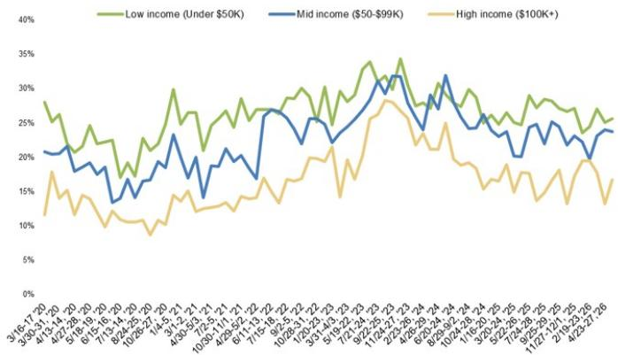

Top Concerns: Not Able to Pay Rent/Mortgage by Income   
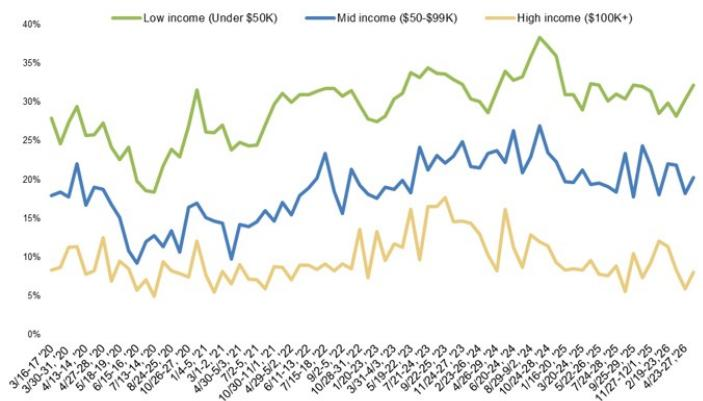  
Top Concerns: Potential Losses on Investment by Income

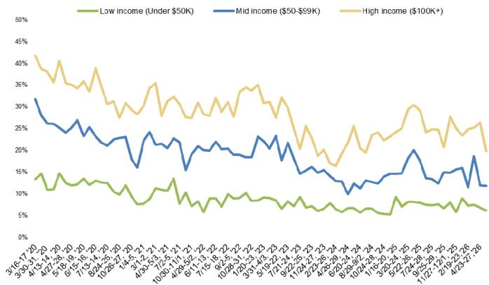  
Source: AlphaWise, MS

# MS

alphawise

# Outline

Pg. 3 Consumer Sentiment

Pg. 7 Outlook, Savings & Credit

Pg. 13 Spending Plans & Planned Activities

Pg. 26 Artificial Intelligence (AI)

# MS

alphawise α

# U.S. Economic Outlook

Consumer confidence in the U.S. economic outlook ticked up relative to the last month; 33% of consumers expect the economy to get better in the next six months, while 47% expect the economy to get worse and 20% believe it will remain the same. This results in a net outlook score (percentage expecting the economy to improve minus those expecting it to worsen) of -14% vs. -18% last month and -6% in May 2025.

U.S. Economy Next 6 Months (Among Total)   
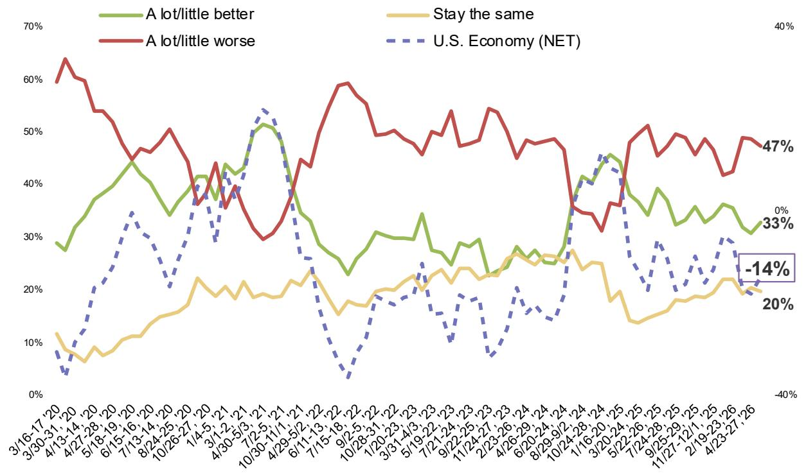

line

| Date       | A lot/little better | A lot/little worse | Stay the same | U.S. Economy (NET) |
|------------|---------------------|--------------------|---------------|-------------------|
| 4/23-27,26 | 33%                 | 47%                | 20%           | -14%              |

Source: AlphaWise, MS   
NET: Percentage of consumers who said “Get a lot/little better” – “Get a lot/little worse”

# MS

alphawise α

# Household Financial Outlook

Similar upward trend is posted for household finances, with 43% expecting finances to get better, while 24% of consumers expect household finances to get worse over the next six months. The proportion of consumers who expect no change is 33%. The NET score went up to +19% from +12% last month and vs. +14% same time last year.

Household Financial Situation Next 6 Months (Among Total)   
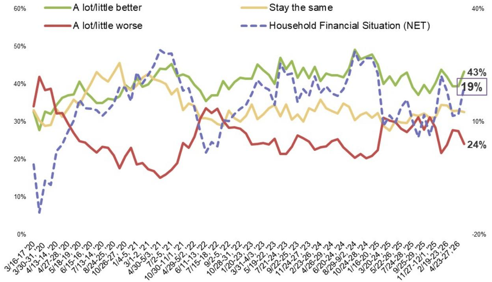

line

| Date       | A lot/little better | A lot/little worse | Stay the same | Household Financial Situation (NET) |
|------------|---------------------|--------------------|---------------|------------------------------------|
| 4/23-27,26 | 43%                 | 24%                | 10%           | 19%                                |

Source: AlphaWise, MS   
NET: Percentage of consumers who said “Get a lot/little better” – “Get a lot/little worse”

# MS

alphawise α

# Outlook Trends Analysis

Additional analysis based on the net outlook data from our survey shows a moderate correlation to The University of Michigan Index of Consumer Sentiment and The Conference Board Consumer Confidence Index.

Our survey indicates a subtle rise in consumer sentiment, while the recent industry data still points to a downward trend, for now. The University of Michigan's Consumer Sentiment Index sentiment fell for the third straight month to 44.8 from 49.8 last month. While The Conference Board's March Consumer Confidence Index dipped 0.7 points to 93.1 in May, down from an upwardly revised 93.8 in April.

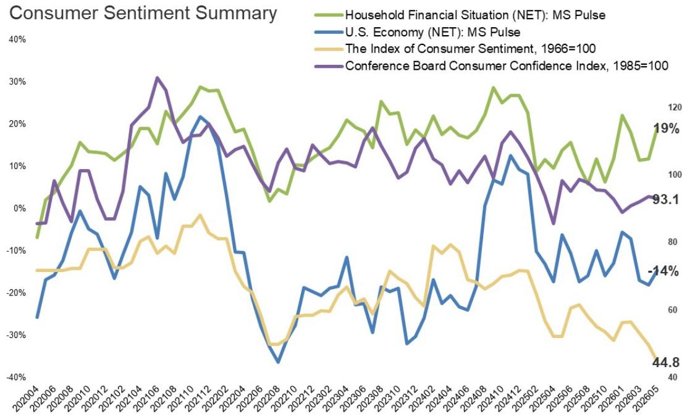

line

| Year     | Household Financial Situation (NET): MS Pulse | U.S. Economy (NET): MS Pulse | The Index of Consumer Sentiment, 1966=100 | Conference Board Consumer Confidence Index, 1985=100 |
|----------|-----------------------------------------------|-----------------------------|-------------------------------------------|--------------------------------------------------|
| 2026/05  | 19%                                           | -14%                        | -44.8                                     | 93.1                                             |

Source: AlphaWise, MS
NET: Percentage of consumers who said "Get a lot/little better" – "Get a lot/little worse"

# MS

alphawise α

# Sentiment by Political Affiliation

Significant differences in sentiment continue to be observed by political party affiliation. Net sentiment on the U.S. Economy trends significantly lower among those who identify as liberal (-45% vs. -55% last month). Expectations among conservatives remain elevated and relatively stable compared to last month (+26%). Sentiment among those who identify as “in the middle” is at -25% (in-line with last month).

Next 6 Months U.S. Economy Outlook NET (% Get Better - Get Worse): by Political Affiliation   
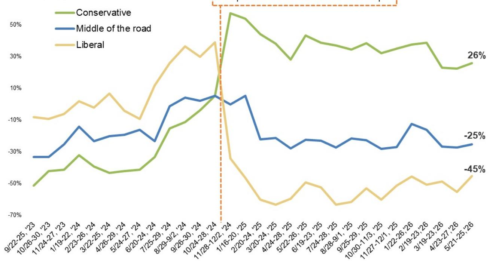

line

| Date | Conservative (%) | Middle of the road (%) | Liberal (%) |
|---|---|---|---|
| 9/22-25, '23 | -51 | -31 | -9 |
| 10/26-30, '23 | -45 | -31 | -9 |
| 11/24-27, '23 | -43 | -28 | -8 |
| 1/19-22, '24 | -31 | -13 | -6 |
| 2/23-26, '24 | -35 | -18 | -5 |
| 3/22-25, '24 | -40 | -25 | -7 |
| 4/26-29, '24 | -45 | -24 | -8 |
| 5/24-27, '24 | -43 | -23 | -9 |
| 6/20-24, '24 | -38 | -26 | -10 |
| 7/25-29, '24 | -30 | -15 | 10 |
| 8/29-9/2, '24 | -15 | -7 | 30 |
| 9/26-30, '24 | -10 | -6 | 33 |
| 10/24-28, '24 | -5 | -7 | 35 |
| 11/28-12/2, '24 | 15 | -6 | 35 |
| 1/16-20, '25 | 55 | -7 | -30 |
| 2/20-24, '25 | 50 | -8 | -45 |
| 3/20-24, '25 | 45 | -25 | -65 |
| 4/24-28, '25 | 35 | -26 | -65 |
| 5/22-26, '25 | 30 | -30 | -50 |
| 6/19-23, '25 | 40 | -27 | -50 |
| 7/24-28, '25 | 35 | -28 | -60 |
| 8/28-9/1, '25 | 33 | -26 | -60 |
| 9/25-29, '25 | 35 | -27 | -50 |
| 10/30-11/3, '25 | 30 | -30 | -60 |
| 11/27-12/11, '25 | 30 | -30 | -50 |
| 1/22-26, '26 | 33 | -11 | -45 |
| 2/19-23, '26 | 34 | -13 | -48 |
| 3/19-23, '26 | 34 | -18 | -48 |
| 4/23-27, '26 | 26 | -30 | -45 |
| 5/21-25, '26 | 28 | -30 | -45 |
The chart includes a vertical dashed line at the intersection of the lines between two vertical bars. The data is presented as a table with three columns: "Date" and "Percentage". The legend indicates three categories: Conservative (green), Middle of the road (blue), and Liberal (yellow). The values for each category are explicitly labeled on the chart.

Source: AlphaWise, MS
NET: Percentage of consumers who said “Get a lot/little better” – “Get a lot/little worse”

# MS

alphawise α

# Outlook Trends by Income

Income cohorts are closely aligned in their sentiment outlook for the economy and household finances.

US Economy Outlook for N6M: A Lot / Little Worse ... by Income   
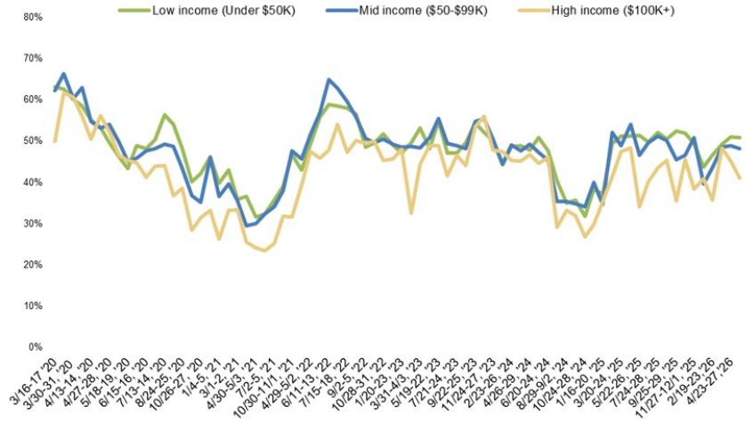

HH Finances Outlook for N6M: A Lot / Little Worse ... by Income   
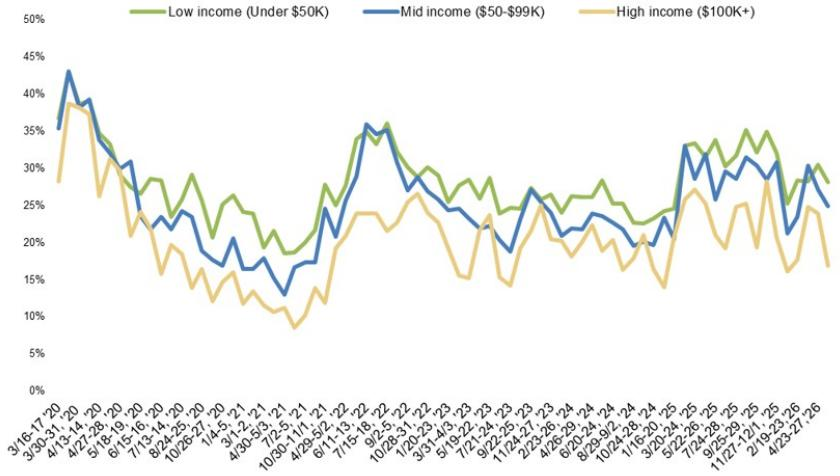

line

| Date | Low income (Under $50K) (%) | Mid income ($50-$99K) (%) | High income ($100K+) (%) |
|---|---|---|---|
| 3/16-17-20 | 36 | 43 | 28 |
| 3/30-31-20 | 38 | 40 | 38 |
| 4/13-14-20 | 35 | 38 | 34 |
| 4/27-28-20 | 32 | 34 | 30 |
| 5/18-19-20 | 29 | 30 | 27 |
| 6/15-16-20 | 28 | 26 | 24 |
| 7/14-14-20 | 27 | 24 | 22 |
| 8/24-25-20 | 26 | 23 | 20 |
| 10/26-27-20 | 25 | 21 | 18 |
| 1/4-5-21 | 24 | 19 | 16 |
| 4/30-5-21 | 23 | 17 | 14 |
| 7/2-5-21 | 22 | 15 | 12 |
| 10/30-11/21 | 21 | 13 | 10 |
| 4/29-5-22 | 20 | 16 | 12 |
| 6/11-13-22 | 25 | 28 | 18 |
| 7/15-18-22 | 35 | 36 | 24 |
| 9/2-5-22 | 34 | 35 | 23 |
| 10/28-31-22 | 33 | 34 | 24 |
| 1/20-23-23 | 31 | 30 | 23 |
| 3/31-4/23 | 30 | 28 | 22 |
| 5/19-23-23 | 29 | 26 | 20 |
| 7/21-24-23 | 28 | 24 | 18 |
| 9/22-35-23 | 27 | 23 | 16 |
| 11/24-27-23 | 26 | 25 | 17 |
| 2/23-26-24 | 25 | 24 | 18 |
| 4/26-29-24 | 24 | 23 | 19 |
| 6/20-24-24 | 23 | 22 | 18 |
| 8/39-9-24 | 24 | 23 | 19 |
| 10/24-28-24 | 23 | 21 | 17 |
| 1/16-20-25 | 24 | 20 | 16 |
| 3/30-24-25 | 33 | 34 | 27 |
| 5/27-28-25 | 34 | 35 | 28 |
| 7/24-28-25 | 35 | 36 | 30 |
| 9/25-29-25 | 36 | 37 | 31 |
| 11/27-10-25 | 35 | 36 | 30 |
| 1/19-23-26 | 34 | 35 | 29 |
| 4/23-27-26 | 30 | 30 | 17 |
The chart displays a line graph with three distinct lines representing different income groups. The x-axis is labeled with date ranges and corresponding values, while the y-axis represents percentage values. The legend indicates three income categories: Low income (Under $50K), Mid income ($50-$99K), and High income ($100K+). The data points are annotated on the graph.

Source: AlphaWise, MS   
NET: Percentage of consumers who said “Get a lot/little better” – “Get a lot/little worse”

# MS

alphawise

# Outline

Pg. 3 Consumer Sentiment

Pg. 7 Outlook, Savings & Credit

Pg. 13 Spending Plans & Planned Activities

Pg. 26 Artificial Intelligence (AI)

# MS

alphawise α

# Overall Spend Next Month vs. Last Month

Consumers' short-term spending outlook points to an increase in spending driven by upper and mid-income cohorts. In this wave, $36\%$ of consumers expect to spend more next month, while $13\%$ expect to spend less, resulting in a net spending outlook of $+23\%$ (vs. $+17\%$ last month and $+16\%$ at the same time last year). Additionally, $51\%$ of consumers do not plan to change their spending habits. Spending outlook remains more optimistic among upper-income consumers (note: absolute dollar amounts may vary).

Since we began this survey in 2020, average net spending expectations are +16%; this month's reading is higher vs. the PTD & YTD average.

NET (More - Less) Overall Household Dollar Spending Over Next Month (Among Total)   
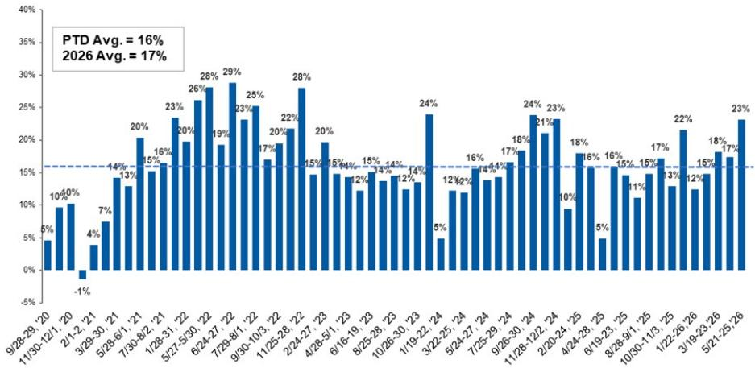

bar

| Date | Value (%) |
|---|---|
| 9/28-29, '20 | 5 |
| 11/30-12/11, '20 | 10 |
| 2/1-2, '21 | 40 |
| 3/29-30, '21 | -7 |
| 5/28-6/1, '21 | 4 |
| 7/30-8/2, '21 | 7 |
| 1/28-31, '22 | 13 |
| 5/27-5/30, '22 | 15 |
| 6/24-27, '22 | 16 |
| 7/29-8/1, '22 | 23 |
| 9/30-10/3, '22 | 20 |
| 11/25-28, '22 | 26 |
| 2/24-27, '23 | 28 |
| 4/28-5/1, '23 | 19 |
| 6/16-19, '23 | 29 |
| 8/25-28, '23 | 23 |
| 10/26-30, '23 | 25 |
| 11/19-22, '24 | 17 |
| 3/22-25, '24 | 20 |
| 5/24-27, '24 | 22 |
| 7/25-29, '24 | 15 |
| 9/26-30, '24 | 15 |
| 11/28-12/2, '24 | 14 |
| 2/20-24, '25 | 14 |
| 4/24-28, '25 | 14 |
| 6/19-23, '25 | 5 |
| 8/28-9/1, '25 | 12 |
| 10/30-11/3, '25 | 9 |
| 1/22-26, '26 | 16 |
| 3/19-23, '26 | 17 |
| 5/21-25, '26 | 16 |
| PTD Avg. = 16%, 2026 Avg. = 17%<lcel><lcel><lcel><nl>

NET (More - Less) Overall Household Dollar Spending Over Next Month by Income   
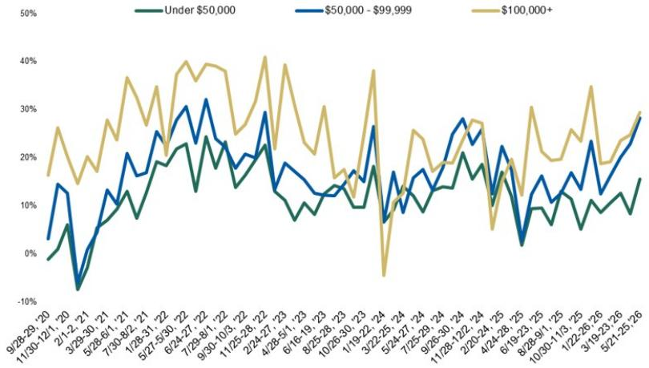

line

| Date       | Under $50,000 | $50,000 - $99,999 | $100,000+ |
|------------|----------------|-------------------|-----------|
| 9/28/29    | 0%             | 15%               | 25%       |
| 11/30-12  | 5%             | 10%               | 20%       |
| 2/1-2      | -5%            | 5%                | 15%       |
| 3/29-30    | 10%            | 15%               | 25%       |
| 5/28-61    | 15%            | 20%               | 30%       |
| 7/30-82    | 20%            | 25%               | 35%       |
| 1/28-31    | 25%            | 30%               | 40%       |
| 5/27-53    | 30%            | 35%               | 45%       |
| 6/24-27    | 35%            | 40%               | 50%       |
| 7/29-81    | 40%            | 45%               | 55%       |
| 9/30-10   | 45%            | 50%               | 60%       |
| 11/25-22   | 50%            | 55%               | 65%       |
| 2/24-27    | 55%            | 60%               | 70%       |
| 4/28-51    | 60%            | 65%               | 75%       |
| 6/16-19    | 65%            | 70%               | 80%       |
| 8/25-28    | 70%            | 75%               | 85%       |
| 10/26-30   | 75%            | 80%               | 90%       |
| 1/19-22    | 80%            | 85%               | 95%       |
| 3/22-25    | 85%            | 90%               | 100%      |
| 5/24-27    | 90%            | 95%               | 105%      |
| 7/25-29    | 95%            | 100%              | 110%      |
| 9/26-30    | 100%           | 105%              | 115%      |
| 11/28-12   | 105%           | 110%              | 120%      |
| 2/20-24    | 110%           | 115%              | 125%      |
| 4/24-28    | 115%           | 120%              | 130%      |
| 6/19-23    | 120%           | 125%              | 135%      |
| 8/28-31    | 125%           | 130%              | 140%      |
| 10/30-11   | 130%           | 135%              | 145%      |
| 1/22-26    | 135%           | 140%              | 150%      |
| 3/19-23    | 140%           | 145%              | 155%      |
| 5/21-25    | 145%           | 150%              | 160%      |
| (Last)     | ~15%           | ~30%              | ~40%      |

Source: AlphaWise, MS
NET: Percentage of consumers who said "More" – "Less"

# MS

alphawise α

# Bill / Loan Payments

Overall, 31% of consumers reported a missed or late payment on any bill/loan tested in the past three months (trending slightly lower MoM and on par with last year). Low-income (38%) and mid-income (30%) consumers are more likely to have missed or made late payments vs. high-income (21%) consumers.

A clear priority for consumers continues to be their cell phone bill. Among the \~90% of consumers who have the payment obligation, only 13% reported a missed or late payment. Another priority for consumers is their mortgage: \~40% have a mortgage and, among those, 90% are on time with payments. Household utility, car and internet bills are also important and tend to be mostly paid on-time.

Student (25%), BNPL (23%) and personal loans (26%) are more likely to be missed/paid late, but fewer consumers have these types of loans.

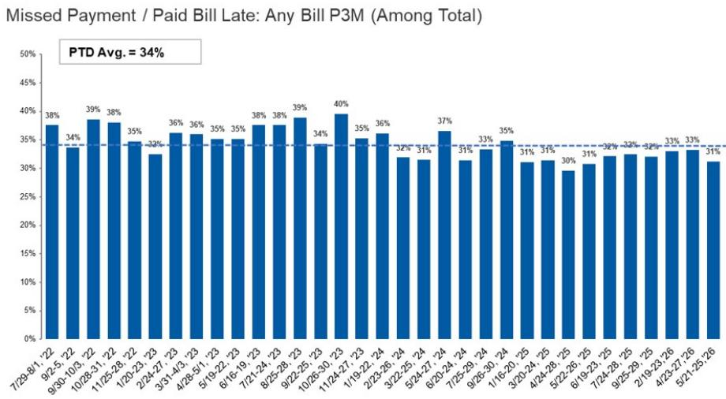

bar

Missed Payment / Paid Bill Late: Any Bill P3M (Among Total)
| Date | Missed Payment / Paid Bill Late (%) |
|---|---|
| 7/28-8/11, '22 | 38 |
| 9/2-5, '22 | 34 |
| 9/30-10/3, '22 | 39 |
| 10/28-31, '22 | 38 |
| 11/25-28, '22 | 35 |
| 1/20-23, '23 | 33 |
| 2/24-27, '23 | 36 |
| 3/31-43, '23 | 36 |
| 4/28-51, '23 | 35 |
| 5/19-22, '23 | 35 |
| 6/16-19, '23 | 38 |
| 7/21-24, '23 | 38 |
| 8/25-28, '23 | 39 |
| 9/22-25, '23 | 34 |
| 10/26-30, '23 | 40 |
| 11/24-27, '23 | 35 |
| 1/19-22, '24 | 36 |
| 2/23-26, '24 | 32 |
| 3/22-25, '24 | 31 |
| 5/24-27, '24 | 37 |
| 6/20-24, '24 | 31 |
| 7/25-29, '24 | 33 |
| 9/26-30, '24 | 35 |
| 1/16-20, '25 | 31 |
| 3/20-24, '25 | 31 |
| 4/24-28, '25 | 30 |
| 5/22-26, '25 | 31 |
| 6/19-23, '25 | 32 |
| 7/24-28, '25 | 32 |
| 9/25-29, '25 | 32 |
| 2/19-23, '26 | 33 |
| 4/23-27, '26 | 33 |
| 5/21-25, '26 | 31 |
PTD Avg. = 34%

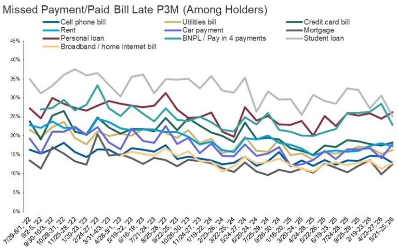  
Source: AlphaWise, MS

# MS

alphawise α

# Monthly Category Spend

In the near term, category spending holds steady MoM for most categories tested.

Essential categories—such as groceries, gas, and household items—continue to show net positive spending intentions, while discretionary categories like consumer electronics, computers, and alcohol exhibit comparatively weaker spending outlooks.

Amid rising gas prices, consumers continue to report higher spending in the category. In contrast, computers and electronics show the weakest spending outlook among the categories tested, though largely in line with the same time last year. Apparel spending remains modestly positive, with outlook holding at NET +1%.

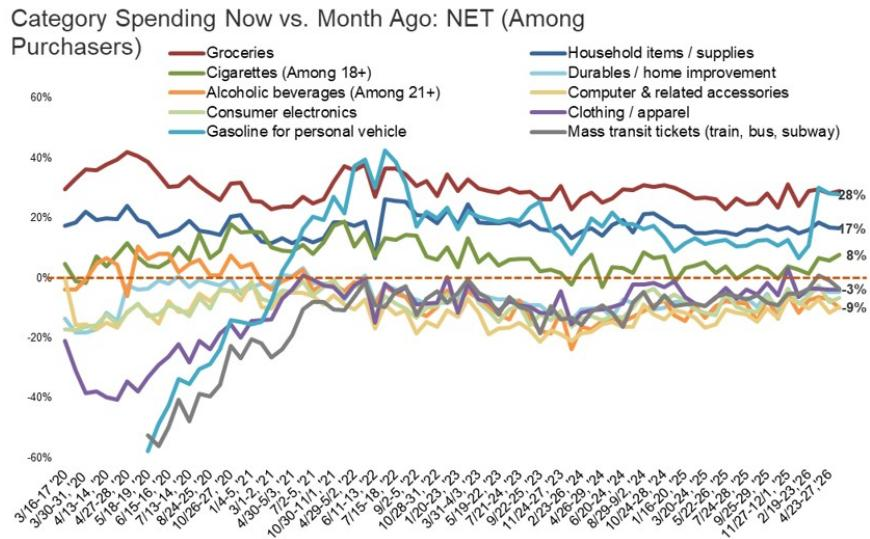

line

| Date       | Groceries | Cigarettes (Among 18+) | Alcoholic beverages (Among 21+) | Consumer electronics | Gasoline for personal vehicle | Household items / supplies | Durables / home improvement | Computer & related accessories | Clothing / apparel | Mass transit tickets (train, bus, subway) |
|------------|-----------|------------------------|----------------------------------|----------------------|------------------------------|----------------------------|-----------------------------|----------------------------------|--------------------|------------------------------------------|
| 3/16-17-20 | 30%       | 5%                     | 0%                               | 0%                   | 0%                           | 20%                        | -10%                        | -10%                             | -20%               | -60%                                     |
| 3/30-31-20 | 35%       | 10%                    | 5%                               | 5%                   | 5%                           | 25%                        | -5%                         | -5%                              | -30%               | -50%                                     |
| 4/13-31-20 | 40%       | 15%                    | 10%                              | 10%                  | 10%                          | 30%                        | 0%                          | 0%                               | -25%               | -40%                                     |
| 4/27-28-20 | 45%       | 20%                    | 15%                              | 15%                  | 15%                          | 35%                        | 5%                          | 5%                               | -20%               | -30%                                     |
| 5/18-19-20 | 40%       | 25%                    | 20%                              | 20%                  | 20%                          | 40%                        | 10%                         | 10%                              | -15%               | -25%                                     |
| 6/15-16-20 | 35%       | 30%                    | 25%                              | 25%                  | 25%                          | 45%                        | 15%                         | 15%                              | -10%               | -20%                                     |
| 7/13-14-20 | 30%       | 35%                    | 30%                              | 30%                  | 30%                          | 50%                        | 20%                         | 20%                              | -5%                | -15%                                     |
| 8/24-25-20 | 25%       | 40%                    | 35%                              | 35%                  | 35%                          | 55%                        | 25%                         | 25%                              | 0%                 | -10%                                     |
| 10/26-27-20| 20%       | 45%                    | 40%                              | 40%                  | 40%                          | 60%                        | 30%                         | 30%                              | 5%                 | -5%                                      |
| 1/4-21-21  | 15%       | 50%                    | 45%                              | 45%                  | 45%                          | 65%                        | 35%                         | 35%                              | 10%                | 0%                                       |
| 3/3-21-21  | 10%       | 55%                    | 50%                              | 50%                  | 50%                          | 70%                        | 40%                         | 40%                              | 15%                | -5%                                      |
| 4/30-23-21 | 5%        | 60%                    | 55%                              | 55%                  | 55%                          | 75%                        | 45%                         | 45%                              | 20%                | -10%                                     |
| 7/2-21-21  | 0%        | 65%                    | 60%                              | 60%                  | 60%                          | 80%                        | 50%                         | 50%                              | 25%                | -15%                                     |
| 10/30-21-21| -5%       | 70%                    | 65%                              | 65%                  | 65%                          | 85%                        | 55%                         | 55%                              | 30%                | -20%                                     |
| 1/29-23-21 | -10%      | 75%                    | 70%                              | 70%                  | 70%                          | 90%                        | 60%                         | 60%                              | 35%                | -25%                                     |
| 6/19-22-21 | -15%      | 80%                    | 75%                              | 75%                  | 75%                          | 95%                        | 65%                         | 65%                              | 40%                | -30%                                     |
| 7/15-18-22 | -20%      | 85%                    | 80%                              | 80%                  | 80%                          | 100%                       | 70%                         | 70%                              | 45%                | -35%                                     |
| 9/2-23-22   | -25%      | 90%                    | 85%                              | 85%                  | 85%                          | 105%                       | 75%                         | 75%                              | 50%                | -40%                                     |
| 1/28-31-22 | -30%      | 95%                    | 90%                              | 90%                  | 90%                          | 110%                       | 80%                         | 80%                              | 55%                | -45%                                     |
| 3/31-23-23 | -35%      | 100%                   | 95%                              | 95%                  | 95%                          | 115%                       | 85%                         | 85%                              | 60%                | -50%                                     |
| 5/19-22-23 | -40%      | 105%                   | 100%                             | 100%                 | 100%                         | 120%                       | 90%                         | 90%                              | 65%                | -55%                                     |
| 7/21-24-23 | -45%      | 110%                   | 105%                             | 105%                 | 105%                         | 125%                       | 95%                         | 95%                              | 70%                | -60%                                     |
| 9/22-26-23 | -50%      | 115%                   | 110%                             | 110%                 | 110%                         | 130%                       | 100%                        | 100%                             | -75%               | -65%                                     |
| 11/24-27-23| -48%      | 120%                   | 115%                             | 115%                 | 115%                         | 135%                       | -93\%(−9)%                   | -93\%(−9)%                      | -78\%(−9)%         | -68\%(−9)%               |
| 2/23-28-24*| -46*      | nan                    | nan                              | nan                  | nan                           | nan                        | nan                         | nan                              | nan                | nan                                      |
| F/A        = (end)    F/A     = (end)    F/A     = (end)    F/A     = (end)    F/A     = (end)    F/A     = (end)    F/A     = (end)    F/A     = (end)    F/A     = (end)    F/A     = (end)    F/A     = (end)    F/A     = (end)    F/A     = (end)    F/A     = (end)

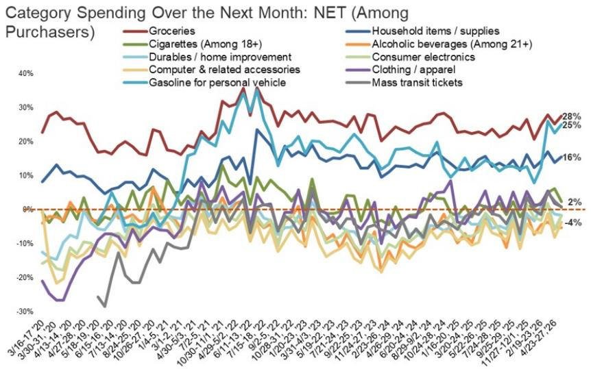  
Source: AlphaWise, MS
NET: Percentage of consumers who said "More" – "Less"

# MS

alphawise α

# Spending Outlook: Next 6 Months

Consumers' longer-term remains optimistic. Spending priorities remain focused on essentials such as groceries (in-store and online) and household supplies, with expectations in these categories holding steady.

Travel outlook remains positive, with domestic travel holding at NET +3% (vs. +5% last month and +3% year over year), while international travel posted at NET +5% (vs. +3% last month and +2% year over year).

Categories with the most strongly negative net spending intentions are consumer electronics, small/major home appliances, durables and toys.

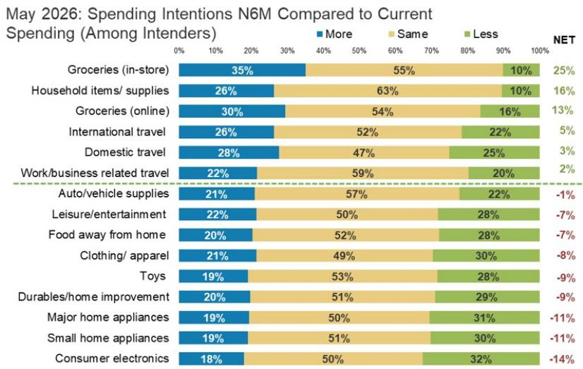

bar_stacked

May 2026: Spending Intentions N6M Compared to Current Spending (Among Intenders)
| Category | More (%) | Same (%) | Less (%) |
|---|---|---|---|
| Groceries (in-store) | 35 | 55 | 10 |
| Household items/ supplies | 26 | 63 | 10 |
| Groceries (online) | 30 | 54 | 16 |
| International travel | 26 | 52 | 22 |
| Domestic travel | 28 | 47 | 25 |
| Work/business related travel | 22 | 59 | 20 |
| Auto/vehicle supplies | 21 | 57 | 22 |
| Leisure/entertainment | 22 | 50 | 28 |
| Food away from home | 20 | 52 | 28 |
| Clothing/ apparel | 21 | 49 | 30 |
| Toys | 19 | 53 | 28 |
| Durables/home improvement | 20 | 51 | 29 |
| Major home appliances | 19 | 50 | 31 |
| Small home appliances | 19 | 51 | 30 |
| Consumer electronics | 18 | 50 | 32 |
NET
25%

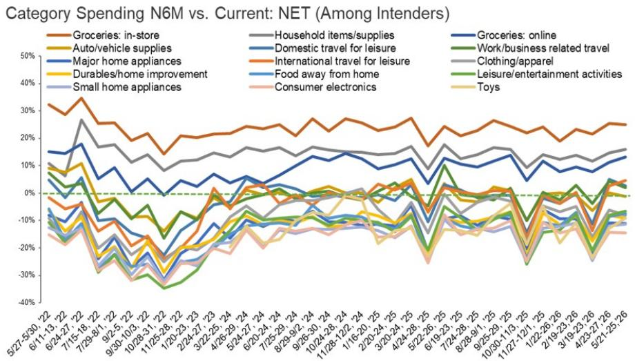  
Source: AlphaWise, MS
NET: Percentage of consumers who said "More" – "Less"

# Engagement in Activities: Out of Home

Participation in most out of home activities ticked down compared to last month. The proportion of consumers who report eating out at restaurants is 68% (marginally down from 71% last wave); the net engagement outlook (% who expect to engage in activity more minus less) continues to trend net negative at NET -8% (vs. -6% last wave and -2% same time last year).

Domestic travel incidence is broadly in-line with last year for both without flights (28%) and with flights (11%).

Visits to the mall (36% vs. 42% last wave) and leisure outing (42% vs. 46%) incidence ticked down. Visits to gyms and indoor fitness clubs are similar to last wave (26%), but the net engagement outlook ticked down to +25% from +31% last month.

Outdoor Activities Done / Participated in Past Month: (Among   
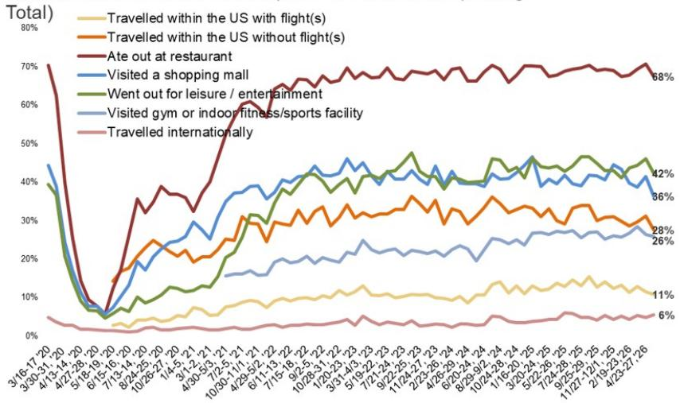

line

| Date       | Travelled within the US with flight(s) | Travelled within the US without flight(s) | Ate out at restaurant | Visited a shopping mall | Went out for leisure / entertainment | Visited gym or indoor fitness/sports facility | Travelled internationally |
| ---------- | --------------------------------------- | ----------------------------------------- | ---------------------- | ----------------------- | ------------------------------------- | ------------------------------------------- | ------------------------- |
| 3/16/17/20 | 11%                                     | 28%                                       | 68%                    | 36%                     | 42%                                   | 26%                                         | 6%                        |
| 4/23/27/26 | 11%                                     | 28%                                       | 68%                    | 36%                     | 42%                                   | 26%                                         | 6%                        |

Engagement Outdoor Activities Now vs. Next Month: NET (Among Participants)   
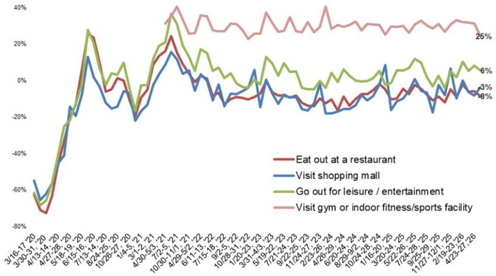

line

| Date       | Eat out at a restaurant | Visit shopping mall | Go out for leisure / entertainment | Visit gym or indoor fitness/sports facility |
|------------|--------------------------|----------------------|-------------------------------------|---------------------------------------------|
| 4/23-21-26 | -3%                      | -38%                 | 6%                                  | 26%                                         |

Source: AlphaWise, MS   
NET: Percentage of consumers who said "More" – "Less"

# MS

alphawise α

# Engagement in Activities: At Home

The majority of consumers continue to shop online, however at a lower rate with 61% (down from 66% last month) of consumers who bought non-grocery items online and the net engagement outlook is trending on par with MoM/YoY at NET 0%. The incidence of online grocery remains elevated at 51% reporting they purchased grocery items online. The online grocery shopping net engagement outlook also remains net positive (+17% vs. +18% same time last year).

The net engagement outlook for food away from home continues to trend net negative, with take-out trending at NET -10% (vs. -8% last wave) and delivery at -3% (vs. -9%).

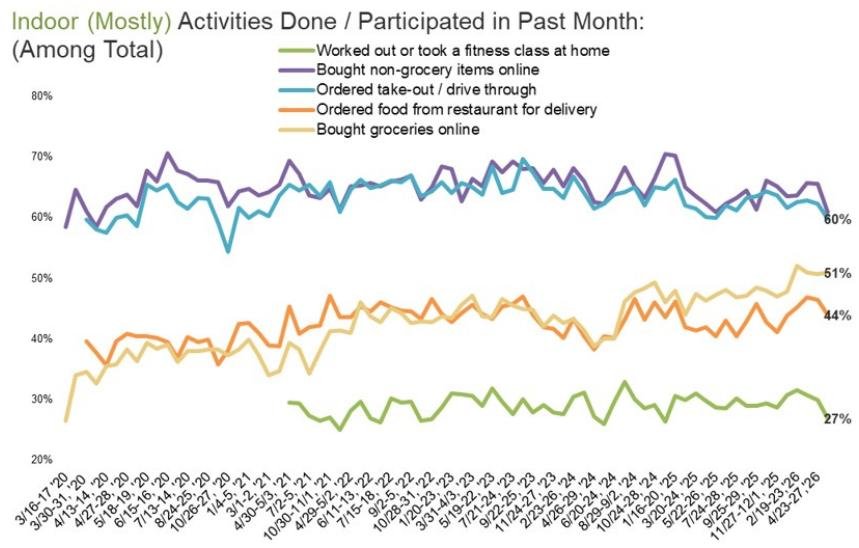

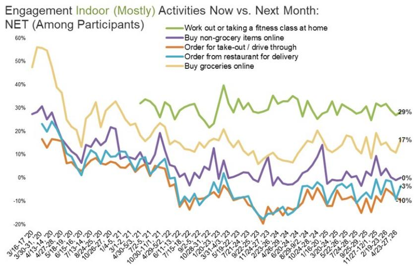  
Source: AlphaWise, MS
NET: Percentage of consumers who said "More" – "Less"

# MS

alphawise α

# World Cup: Overall Engagement

The 2026 FIFA World Cup will take place from June 11 to July 19, 2026, jointly hosted by 16 cities across the United States, Mexico, and Canada. According to our survey, 44% of consumers plan to engage with World Cup events or matches in some capacity.

Engagement levels skew higher among males, younger consumers, and upper-income households.

May 2026: Expect to Engage with the World Cup (Among Total)   
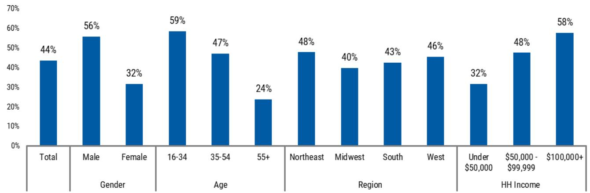

bar

| Category | Value (%) |
| :--- | :--- |
| Total | 44 |
| Male | 56 |
| Female | 32 |
| 16-34 | 59 |
| 35-54 | 47 |
| 55+ | 24 |
| Northeast | 48 |
| Midwest | 40 |
| South | 43 |
| West | 46 |
| Under $50,000 | 32 |
| $50,000 - $99,999 | 48 |
| $100,000+ | 58 |

# MS

alphawise α

# World Cup: Activities

Top engagement activities include watching matches on TV or via streaming services (30%) and following World Cup-related content on social media (23%). Smaller shares of consumers plan to participate in sports betting (10%), attend watch parties (8%), or host their own gatherings (6%).

Consistent with broader World Cup engagement trends, participation across all activities skews higher among males, younger consumers, and upper-income households.

May 2026: World Cup Engagement (Among Total)   
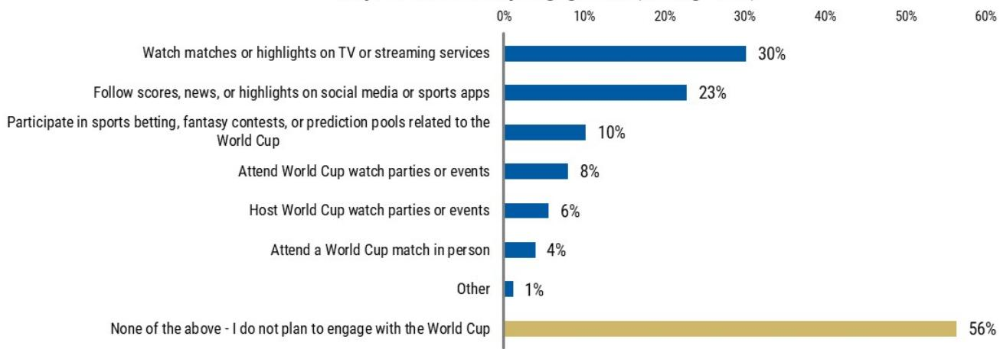

bar

| Category | Percentage (%) |
| :--- | :--- |
| Watch matches or highlights on TV or streaming services | 30 |
| Follow scores, news, or highlights on social media or sports apps | 23 |
| Participate in sports betting, fantasy contests, or prediction pools related to the World Cup | 10 |
| Attend World Cup watch parties or events | 8 |
| Host World Cup watch parties or events | 6 |
| Attend a World Cup match in person | 4 |
| Other | 1 |
None of the above - I do not plan to engage with the World Cup | 56 |

# MS

alphawise α

# World Cup: Spending

The majority (70%) of consumers planning to engage with the World Cup expect to increase spending across at least some categories. Nearly one-third anticipate higher spending on food and non-alcoholic beverages, while 28% expect to spend more on food takeout/delivery and another 28% may subscribe to streaming services to watch matches.

May 2026: Expect to Spend More than Usual Because of World Cup (Among Consumers Who Expect to Engage)   
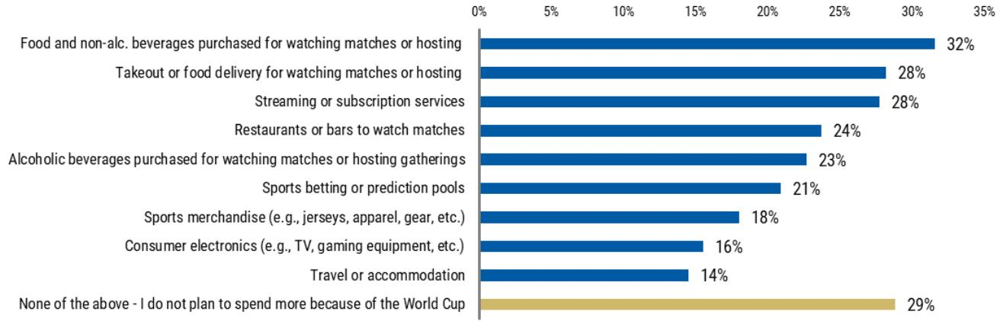

bar

| Category | Percentage (%) |
| :--- | :--- |
| Food and non-alc. beverages purchased for watching matches or hosting | 32 |
| Takeout or food delivery for watching matches or hosting | 28 |
| Streaming or subscription services | 28 |
| Restaurants or bars to watch matches | 24 |
| Alcoholic beverages purchased for watching matches or hosting gatherings | 23 |
| Sports betting or prediction pools | 21 |
| Sports merchandise (e.g., jerseys, apparel, gear, etc.) | 18 |
| Consumer electronics (e.g., TV, gaming equipment, etc.) | 16 |
| Travel or accommodation | 14 |
| None of the above - I do not plan to spend more because of the World Cup | 29 |

# MS

alphawise α

# Travel Intentions: Summer Travel

Overall, 62% of consumers are planning to travel this summer, modestly up from 60% last year. Road trips remain the most popular option, cited by 42% of consumers (vs. 39% last year), followed by domestic air travel at 20% (vs. 18%) and camping at 16% (vs. 9%). Fewer consumers plan to take a cruise this summer (8% vs. 15%), though incidence remains above 2024 levels (6%).

Summer travel intentions continue to skew higher among upper-income consumers.

Plan To Travel For Leisure With At Least One Over-Night Stay This Summer (Among Total)   
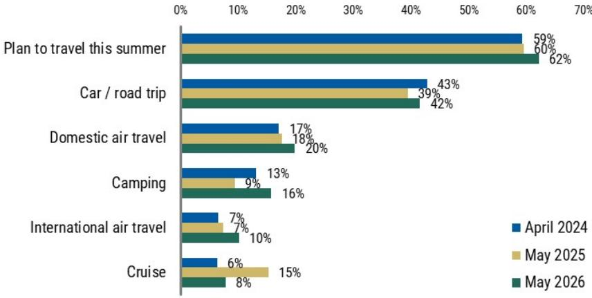

bar

| Travel Type | April 2024 (%) | May 2025 (%) | May 2026 (%) |
|---|---|---|---|
| Plan to travel this summer | 59 | 60 | 62 |
| Car / road trip | 43 | 39 | 42 |
| Domestic air travel | 17 | 18 | 20 |
| Camping | 13 | 9 | 16 |
| International air travel | 7 | 7 | 10 |
| Cruise | 6 | 15 | 8 |

Plan To Travel For Leisure With At Least One Over-Night Stay This Summer by Income (Among Total)   
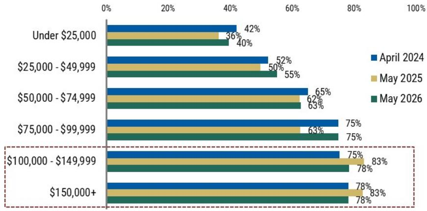

bar

| Income Range | April 2024 (%) | May 2025 (%) | May 2026 (%) |
|---|---|---|---|
| Under $25,000 | 42 | 36 | 40 |
| $25,000 - $49,999 | 52 | 50 | 55 |
| $50,000 - $74,999 | 65 | 62 | 63 |
| $75,000 - $99,999 | 75 | 63 | 75 |
| $100,000 - $149,999 | 75 | 83 | 78 |
| $150,000+ | 78 | 83 | 78 |

# MS

alphawise α

# Travel Intentions: Summer Travel Spending

Consumers are willing to spend on summer travel at levels comparable to 2025 and 2024. Overall, 45% of travelers intend to spend more this summer, while 13% plan to spend less, resulting in a net spending outlook of +32% (% planning to spend more minus less). Another 38% expect spending to remain roughly unchanged.

Upper-income consumers are more likely to report plans to spend “a lot” or “a little” more on summer travel compared to low- and mid-income cohorts.

Spending On Leisure Travel This Summer Compared To Summer Last Year (Among Travelers)   
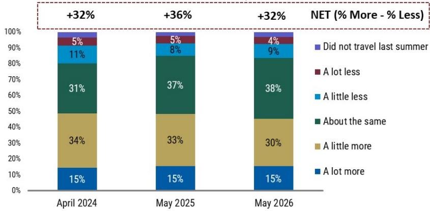

bar_stacked

| Month | A lot more (%) | A little less (%) | About the same (%) | A little more (%) | A lot less (%) | Did not travel last summer (%) |
|---|---|---|---|---|---|---|
| April 2024 | 15 | 11 | 31 | 34 | 5 | +32 |
| May 2025 | 15 | 8 | 37 | 33 | 5 | +36 |
| May 2026 | 15 | 9 | 38 | 30 | 4 | +32 |
NET (% More - % Less)

2026: Spending On Leisure Travel This Summer Compared To Summer Last Year (Among Travelers)   
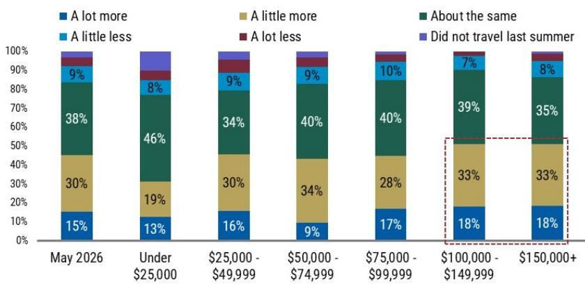

bar_stacked

| Category | A lot more (%) | A little more (%) | A little less (%) | About the same (%) | A lot less (%) | Did not travel last summer (%) |
|---|---|---|---|---|---|---|
| May 2026 | 15 | 30 | 9 | 38 | 9 | 1 |
| Under $25,000 | 13 | 19 | 8 | 46 | 8 | 1 |
| $25,000 - $49,999 | 16 | 30 | 9 | 34 | 9 | 3 |
| $50,000 - $74,999 | 9 | 34 | 9 | 40 | 9 | 3 |
| $75,000 - $99,999 | 17 | 28 | 10 | 40 | 10 | 3 |
| $100,000 - $149,999 | 18 | 33 | 7 | 39 | 7 | 1 |
| $150,000+ | 18 | 33 | 8 | 35 | 8 | 1 |
May 2026: A lot more; A little more; A little less; About the same; A lot less; Did not travel last summer.

Source: AlphaWise, MS
NET: Percentage of consumers who said "More" – "Less"

# MS

alphawise α

# Travel Intentions: Next 6 Months

Long-term travel intentions ticked down this month, with 58% of consumers planning to travel over the next six months (vs. 64% last wave and 59% at the same time last year). The decline is primarily driven by the lower-income consumers. The outlook for 2026 leisure travel remains optimistic. Mid- and upper-income households display significantly higher intentions to travel compared to lower income households.

Visiting friends/family remains the most common reason for travel among 58% of travelers.

Plan to Travel in the Next 6 Months (Among Total)   

bar_line

| Date | Plan to Travel N6M (%) | Forecast (Seasonally Adjusted) (%) | Moving Average (%) |
|---|---|---|---|
| 8/24-25, '20 | 45 | | |
| 10/26-27, '20 | 47 | | |
| 1/4-5, '21 | 43 | | |
| 1/14-5, '21 | 42 | | |
| 3/29-30, '21 | 49 | | |
| 5/28-6/1, '21 | 53 | | |
| 7/30-8/2, '21 | 61 | | |
| 1/28-31, '22 | 62 | | |
| 5/27-5/30, '22 | 64 | | |
| 6/24-27, '22 | 64 | | |
| 7/29-8/1, '22 | 59 | | |
| 9/30-10/3, '22 | 55 | | |
| 11/25-28, '22 | 53 | | |
| 2/24-27, '23 | 57 | | |
| 4/28-5/1, '23 | 58 | | |
| 6/16-19, '23 | 58 | | |
| 8/25-28, '23 | 59 | | |
| 10/26-30, '23 | 57 | | |
| 1/19-22, '24 | 58 | | |
| 3/22-25, '24 | 57 | | |
| 5/24-27, '24 | 60 | | |
| 7/25-29, '24 | 61 | | |
| 9/26-30, '24 | 63 | | |
| 11/28-12/2, '24 | 60 | | |
| 2/20-24, '25 | 62 | | |
| 4/24-28, '25 | 62 | | |
| 6/19-23, '25 | 64 | | |
| 8/28-9/1, '25 | 61 | | |
| 10/30-11/3, '25 | 59 | | |
| 1/22-26, '26 | 61 | | |
| 3/19-23, '26 | 59 | | |
| 5/21-25, '26 | 60 | | |
| 7/'26 | 63 | | |
| 9/'26 | 64 | | |
| 9/'26 (Forecast Seasonally Adjusted) + Moving Average (Moving Average) = (9/'26) + (7/'26) (Forecast Seasonally Adjusted) + Moving Average (Moving Average) = (9/'26) (Forecast Seasonally Adjusted) + Moving Average (Moving Average) = (9/'26) (Forecast Seasonally Adjusted).<lcel><lcel><lcel><nl>

Source: AlphaWise, MS Regression is recalibrated 1 $^{st}$ wave of every year.

# MS

alphawise α

# Outline

Pg. 3 Consumer Sentiment

Pg. 7 Outlook, Savings & Credit

Pg. 13 Spending Plans & Planned Activities

Pg. 26 Artificial Intelligence (AI)

# MS

alphawise

# AI: Frequency of Use

The frequency of AI usage remains stable month over month across both personal and professional contexts (note: work-related frequency is based on employed adults), with the share of consumers who have never used the technology holding at approximately 25%. About half of consumers report using AI at least once a week in both settings.

Younger consumers continue to be more frequent AI users overall, particularly compared with the 55+ cohort.

As expected, AI usage for work-related tasks is significantly higher among white-collar employees, with 65% reporting weekly use, compared to 43% among blue-collar workers.

Frequency of Using AI Tools: Personal (Among Total)   
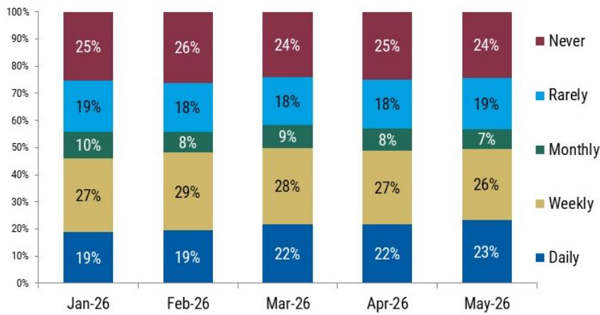

bar_stacked

| Month | Never (%) | Rarely (%) | Monthly (%) | Weekly (%) | Daily (%) |
|---|---|---|---|---|---|
| Jan-26 | 25 | 19 | 10 | 27 | 19 |
| Feb-26 | 26 | 18 | 8 | 29 | 19 |
| Mar-26 | 24 | 18 | 9 | 28 | 22 |
| Apr-26 | 25 | 18 | 8 | 27 | 22 |
| May-26 | 24 | 19 | 7 | 26 | 23 |

Frequency of Using AI Tools: Work-Related (Among   
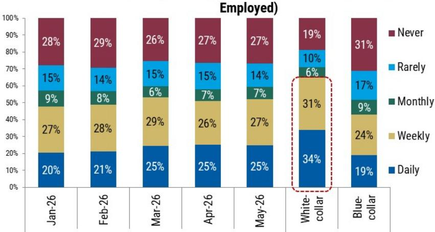

bar_stacked

| Month    | Never | Rarely | Monthly | Weekly | Daily |
| -------- | ----- | ------ | ------- | ------ | ----- |
| Jan-26   | 28%   | 15%    | 9%      | 27%    | 20%   |
| Feb-26   | 29%   | 14%    | 8%      | 28%    | 21%   |
| Mar-26   | 26%   | 15%    | 6%      | 29%    | 25%   |
| Apr-26   | 27%   | 15%    | 7%      | 26%    | 25%   |
| May-26   | 27%   | 14%    | 7%      | 27%    | 25%   |
| White-collar | 19%  | 10%    | 6%      | 31%    | 34%   |
| Blue-collar | 31%  | 17%    | 9%      | 24%    | 19%   |

# MS

alphawise α

# AI: Activities Used AI Tools Past Month

The number of consumers who report using AI tools to learn about or research new topics holds at 41% this month (similar to last month and up from 38% in January), with usage skewing higher among 25–34-year-olds (48%). Searching for recipes is another common use case, cited by 27% of consumers.

Among employed respondents, 27% report using AI for work-related tasks, marginally down from 29% last month and 31% two months ago; with higher adoption among white-collar workers (39%) compared to blue-collar workers (20%).

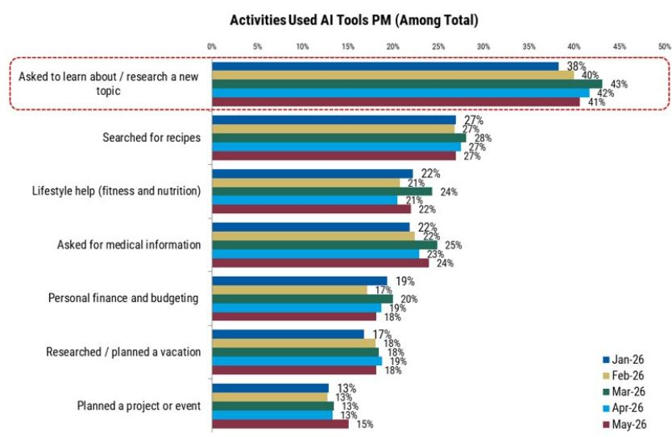

bar

Activities Used AI Tools PM (Among Total)
| Activity | Jan-26 (%) | Feb-26 (%) | Mar-26 (%) | Apr-26 (%) | May-26 (%) |
|---|---|---|---|---|---|
| Asked to learn about / research a new topic | 38 | 40 | 43 | 42 | 41 |
| Searched for recipes | 27 | 27 | 28 | 27 | 27 |
| Lifestyle help (fitness and nutrition) | 22 | 21 | 24 | 21 | 22 |
| Asked for medical information | 22 | 22 | 25 | 23 | 24 |
| Personal finance and budgeting | 19 | 17 | 20 | 19 | 18 |
| Researched / planned a vacation | 17 | 18 | 18 | 19 | 18 |
| Planned a project or event | 13 | 13 | 13 | 13 | 15 |

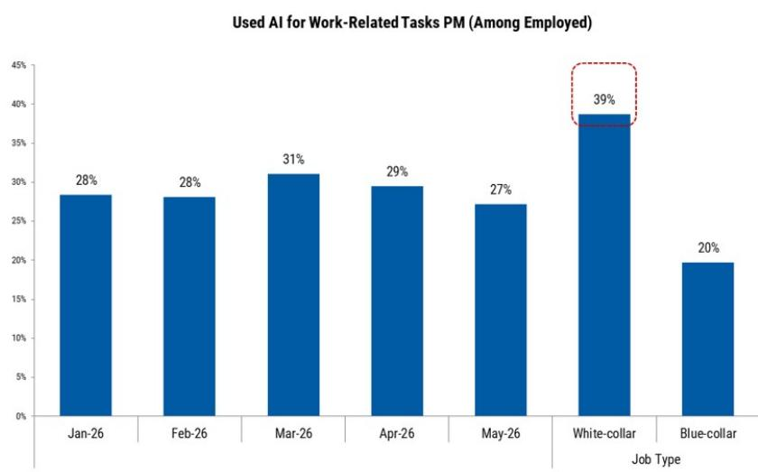

bar

Used AI for Work-Related Tasks PM (Among Employed)
| Job Type | Used AI (%) |
| :--- | :--- |
| Jan-26 | 28 |
| Feb-26 | 28 |
| Mar-26 | 31 |
| Apr-26 | 29 |
| May-26 | 27 |
| White-collar | 39 |
| Blue-collar | 20 |

Source: AlphaWise, MS   
Note: Activities are aggregated across AI platforms (ChatGPT, Gemini, Meta AI, Grok, Perplexity AI and Copilot

# MS

alphawise α

# AI: Work-Related Activities Used AI Tools Past Month

Among the 27% of consumers who use AI for work-related activities, the most common use cases are text and writing tasks (67%, highest ranking to date) and information gathering (64%, down from 68% last month).

Research and information gathering are used broadly across job functions, while white-collar workers are more likely to leverage AI for writing/editing and data analysis tasks.

Work-Related Activities Used AI Tools (Among AI Users at Work)   
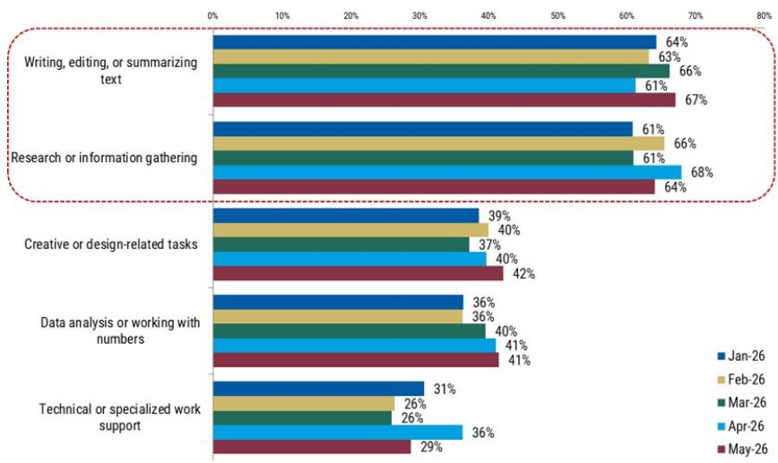

bar

| Activity | Jan-26 (%) | Feb-26 (%) | Mar-26 (%) | Apr-26 (%) | May-26 (%) |
|---|---|---|---|---|---|
| Writing, editing, or summarizing text | 64 | 63 | 66 | 61 | 67 |
| Research or information gathering | 61 | 66 | 61 | 68 | 64 |
| Creative or design-related tasks | 39 | 40 | 37 | 40 | 42 |
| Data analysis or working with numbers | 36 | 36 | 40 | 41 | 41 |
| Technical or specialized work support | 31 | 26 | 26 | 36 | 29 |

Work-Related Activities Used AI Tools (Among AI Users at Work)   
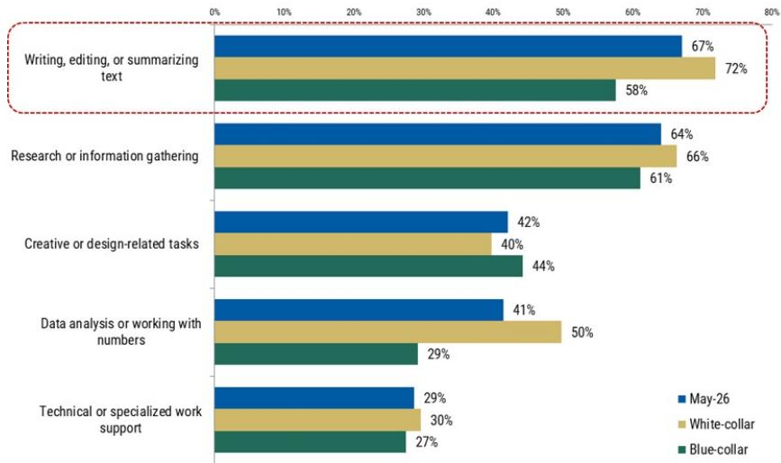

bar

| Activity | May-26 (%) | White-collar (%) | Blue-collar (%) |
|---|---|---|---|
| Writing, editing, or summarizing text | 67 | 72 | 58 |
| Research or information gathering | 64 | 66 | 61 |
| Creative or design-related tasks | 42 | 40 | 44 |
| Data analysis or working with numbers | 41 | 50 | 29 |
| Technical or specialized work support | 29 | 30 | 27 |

Source: AlphaWise, MS

# MS

alphawise α

# AI: Overall Perception

Overall, consumer sentiment toward AI skews positive and stable MoM, with 44% expressing a favorable view, compared to 28% negative and 25% neutral, resulting in a NET score of +16% (in-line with last month). Demographic groups with higher AI usage—such as males, middle-aged individuals, and higher-income consumers—tend to hold more positive perceptions.

Notably, frequent users are significantly more positive on AI.

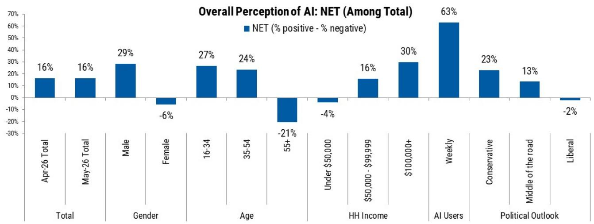

bar

Overall Perception of AI: NET (Among Total)
| Category | NET (% positive - % negative) (%) |
|---|---|
| Apr-26 Total | 16 |
| May-26 Total | 16 |
| Male | 29 |
| Female | -6 |
| 16-34 | 27 |
| 35-54 | 24 |
| 55+ | -21 |
| Under $50,000 | -4 |
| $50,000 - $99,999 | 16 |
| $100,000+ | 30 |
| Weekly | 63 |
| Conservative | 23 |
| Middle of the road | 13 |
| Liberal | -2 |

# MS

alphawise α

# AI: Drivers of Overall Perception

Time savings and improved access to information are the primary drivers of positive sentiment toward AI, each cited by roughly half of the respondents.

Among those with negative views, concerns are centered on fraud (47%), misinformation (49%), lack of safeguards (47%), and data privacy (46%). Notably, negative personal experiences with AI are cited far less frequently, at just 7%.

Reasons for Positive View of AI (Among Consumers Who Have a Positive View of AI)   
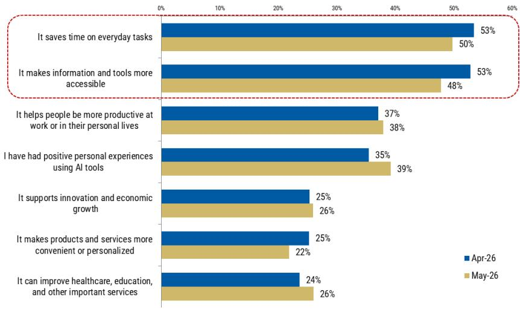

bar

| Category | Apr-26 (%) | May-26 (%) |
|---|---|---|
| It saves time on everyday tasks | 53 | 50 |
| It makes information and tools more accessible | 53 | 48 |
| It helps people be more productive at work or in their personal lives | 37 | 38 |
| I have had positive personal experiences using AI tools | 35 | 39 |
| It supports innovation and economic growth | 25 | 26 |
| It makes products and services more convenient or personalized | 25 | 22 |
| It can improve healthcare, education, and other important services | 24 | 26 |

Reasons for Negative View of AI (Among Consumers Who Have a Negative View of AI)   
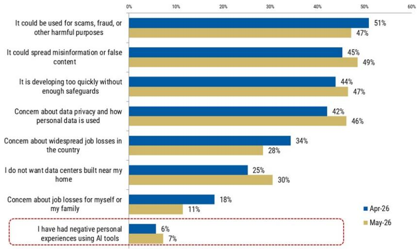

bar

| Concern | Apr-26 (%) | May-26 (%) |
|---|---|---|
| It could be used for scams, fraud, or other harmful purposes | 51 | 47 |
| It could spread misinformation or false content | 45 | 49 |
| It is developing too quickly without enough safeguards | 44 | 47 |
| Concern about data privacy and how personal data is used | 42 | 46 |
| Concern about widespread job losses in the country | 34 | 28 |
| I do not want data centers built near my home | 25 | 30 |
| Concern about job losses for myself or my family | 18 | 11 |
| I have had negative personal experiences using AI tools | 6 | 7 |

Source: AlphaWise, MS

# MS

alphawise

α

# US Survey Methodology

Online survey of $\sim 2,000$ consumers each wave aged 16-75 year old in the U.S. Total sample is representative of the U.S. general population in terms of age, gender and region. The margin of error on the total sample is $\pm 1.8\%$ at $90\%$ confidence level; higher for subgroups. Note: cadence of the survey varies, refer to field dates below:

• Wave 1 survey was conducted March 16 $^{th}$ – 17 $^{th}$ , 2020.   
• Wave 2 survey was conducted March 23 $^{rd}$ - 24 $^{th}$ , 2020.   
• Wave 3 survey was conducted March 30 $^{th}$ – 31 $^{st}$ , 2020.   
• Wave 4 survey was conducted April 6 $^{th}$ – 7 $^{th}$ , 2020.   
• Wave 5 survey was conducted April 13 $^{th}$ – 14 $^{th}$ , 2020.   
• Wave 6 survey was conducted April 20 $^{th}$ – 21 $^{st}$ , 2020.   
• Wave 7 survey was conducted April 27 $^{th}$ – 28 $^{th}$ , 2020.   
• Wave 8 survey was conducted May 4 $^{th}$ – 5 $^{th}$ , 2020.   
• Wave 9 survey was conducted May 18 $^{th}$ – 19 $^{th}$ , 2020   
• Wave 10 survey was conducted June 1 $^{st}$ – 2 $^{nd}$ , 2020.   
• Wave 11 survey was conducted June 15 $^{th}$ – 16 $^{th}$ , 2020.   
• Wave 12 survey was conducted June 29 $^{th}$ – 30 $^{th}$ , 2020.   
• Wave 13 survey was conducted July 13 $^{th}$ – 14 $^{th}$ , 2020.   
• Wave 14 survey was conducted July 27 $^{th}$ – 28 $^{th}$ , 2020.   
• Wave 15 survey was conducted August 24 $^{th}$ – 25 $^{th}$ , 2020   
• Wave 16 survey was conducted September 28 $^{th}$ – 29 $^{th}$ , 2020.   
• Wave 17 survey was conducted October 26 $^{th}$ – 27 $^{th}$ , 2020.   
• Wave 18 survey was conducted November 30 $^{th}$ – December 1 $^{st}$ , 2020.   
• Wave 19 survey was conducted January 4 $^{th}$ – 5 $^{th}$ , 2021.   
• Wave 20 survey was conducted February 1 $^{st}$ – 2 $^{nd}$ , 2021.   
• Wave 21 survey was conducted March 1 $^{st}$ – 2 $^{nd}$ , 2021.   
• Wave 22 survey was conducted March 29 $^{th}$ – 30 $^{th}$ , 2021.   
• Wave 23 survey was conducted April 30 $^{th}$ – May 3 $^{rd}$ , 2021.   
• Wave 24 survey was conducted May 28 $^{th}$ – June 1 $^{st}$ , 2021.   
• Wave 25 survey was conducted July 2 $^{nd}$ – 5 $^{th}$ , 2021.   
• Wave 26 survey was conducted July 30 $^{th}$ – August 2 $^{nd}$ , 2021.   
• Wave 27 survey was conducted October 30 $^{th}$ – November 1 $^{st}$ , 2021   
• Wave 28 survey was conducted January 28 $^{th}$ – 31 $^{st}$ , 2022.   
• Wave 29 survey was conducted April 29 $^{th}$ – May 2 $^{nd}$ , 2022.   
• Wave 30 survey was conducted May 27 $^{th}$ – 30 $^{th}$ , 2022.   
• Wave 31 survey was conducted June 11 $^{th}$ – 13 $^{th}$ , 2022.   
• Wave 32 survey was conducted June 24 $^{th}$ – 27 $^{th}$ , 2022.   
• Wave 33 survey was conducted July 15 $^{th}$ – 18 $^{th}$ , 2022.   
• Wave 34 survey was conducted July 29 $^{th}$ – August 1 $^{st}$ , 2022.   
• Wave 35 survey was conducted September 2 $^{nd}$ – 5 $^{th}$ , 2022.   
• Wave 36 survey was conducted September 30 $^{th}$ – October 3 $^{rd}$ , 2022.   
• Wave 37 survey was conducted October 28 $^{th}$ – 31 $^{st}$ , 2022.   
• Wave 38 survey was conducted November 25 $^{th}$ – 28 $^{th}$ , 2022.

• Wave 39 survey was conducted January 20 $^{th}$ – 23 $^{rd}$ , 2023.   
• Wave 40 survey was conducted February 24 $^{th}$ – 27 $^{th}$ , 2023.   
• Wave 41 survey was conducted March 31 $^{st}$ – April 3 $^{rd}$ , 2023.   
• Wave 42 survey was conducted April 28 $^{th}$ – May 1 $^{st}$ , 2023.   
• Wave 43 survey was conducted May 19 $^{th}$ – May 22 $^{nd}$ , 2023.   
• Wave 44 survey was conducted June 16 $^{th}$ – June 19 $^{th}$ , 2023.   
• Wave 45 survey was conducted July 21 $^{st}$ – July 24 $^{th}$ , 2023.   
• Wave 46 survey was conducted August 25 $^{th}$ – August 28 $^{th}$ , 2023.   
• Wave 47 survey was conducted September 22 $^{nd}$ – September 25 $^{th}$ , 2023.   
• Wave 48 survey was conducted October 26 $^{th}$ – October 30 $^{th}$ , 2023.   
• Wave 49 survey was conducted November 24 $^{th}$ – November 27 $^{th}$ , 2023.   
• Wave 50 survey was conducted January 19 $^{th}$ – January 22 $^{nd}$ , 2024.   
• Wave 51 survey was conducted February 23 $^{rd}$ – February 26 $^{th}$ , 2024.   
• Wave 52 survey was conducted March 22 $^{nd}$ – March 25 $^{th}$ , 2024.   
• Wave 53 survey was conducted April 26 $^{th}$ – April 29 $^{th}$ , 2024.   
• Wave 54 survey was conducted May 24 $^{th}$ – May 27 $^{th}$ , 2024.   
• Wave 55 survey was conducted June 20 $^{th}$ – June 24 $^{th}$ , 2024.   
• Wave 56 survey was conducted July 25 $^{th}$ – July 29 $^{th}$ , 2024.   
• Wave 57 survey was conducted August 29 $^{th}$ – September 2 $^{nd}$ , 2024.   
• Wave 58 survey was conducted September 26 $^{th}$ – September 30 $^{th}$ , 2024.   
• Wave 59 survey was conducted October 24 $^{th}$ – October 28 $^{th}$ , 2024.   
• Wave 60 survey was conducted November 28 $^{th}$ – December 2 $^{nd}$ , 2024.   
• Wave 61 survey was conducted January 16 $^{th}$ – January 20 $^{th}$ , 2025.   
• Wave 62 survey was conducted February 20 $^{th}$ – February 24 $^{th}$ , 2025.   
• Wave 63 survey was conducted March 20 $^{th}$ – March 24 $^{th}$ , 2025.   
• Wave 64 survey was conducted April 24 $^{th}$ – April 28 $^{th}$ , 2025.   
• Wave 65 survey was conducted May 22 $^{nd}$ – May 26 $^{th}$ , 2025.   
• Wave 66 survey was conducted June 19 $^{th}$ – June 23 $^{rd}$ , 2025.   
• Wave 67 survey was conducted July 24 $^{th}$ – June 28 $^{th}$ , 2025.   
• Wave 68 survey was conducted August 28 $^{th}$ – September 1 $^{st}$ , 2025.   
• Wave 69 survey was conducted September 25 $^{th}$ – September 29 $^{th}$ , 2025.   
• Wave 70 survey was conducted October 30 $^{th}$ – November 3 $^{rd}$ , 2025.   
• Wave 71 survey was conducted November 27 $^{th}$ – December 1 $^{st}$ , 2025.   
• Wave 72 survey was conducted January 22 $^{nd}$ – January 26 $^{th}$ , 2026.   
• Wave 73 survey was conducted February 19 $^{th}$ – February 23 $^{rd}$ , 2026.   
• Wave 74 survey was conducted March 19 $^{th}$ – March 23 $^{rd}$ , 2026.   
• Wave 75 survey was conducted April 23 $^{rd}$ – April 27 $^{th}$ , 2026.   
• Wave 76 survey was conducted May 21 $^{st}$ – May 25 $^{th}$ , 2026.

# Disclosure Section

The information and opinions in MS were prepared by MS & Co. LLC, and/or MS C.T.V.M. S.A., and/or MS Mexico, Casa de Bolsa, S.A. de C.V., and/or MS Canada Limited. As used in this disclosure section, "MS" includes MS & Co. LLC, MS C.T.V.M. S.A., MS Mexico, Casa de Bolsa, S.A. de C.V., MS Canada Limited and their affiliates as necessary.

For important disclosures, stock price charts and equity rating histories regarding companies that are the subject of this report, please see the MS Disclosure Website at www.morganstanley.com/eqr/disclosures/webapp/generalresearch, or contact your investment representative or MS at 1585 Broadway, (Attention: Research Management), New York, NY, 10036 USA.

For valuation methodology and risks associated with any recommendation, rating or price target referenced in this research report, please contact the Client Support Team as follows: US/Canada +1 800 303-2495; Hong Kong +852 2848-5999; Latin America +1 718 754-5444 (U.S.); London +44 (0)20-7425-8169; Singapore +65 6834-6860; Sydney +61 (0)2-9770-1505; Tokyo +81 (0)3-6836-9000. Alternatively you may contact your investment representative or MS at 1585 Broadway, (Attention: Research Management), New York, NY 10036 USA.

# Analyst Certification

The following analysts hereby certify that their views about the companies and their securities discussed in this report are accurately expressed and that they have not received and will not receive direct or indirect compensation in exchange for expressing specific recommendations or views in this report: Stephen C Byrd; Michelle M. Weaver, CFA.

# Global Research Conflict Management Policy

MS has been published in accordance with our conflict management policy, which is available at www.morganstanley.com/institutional/research/conflictpolicies. A Portuguese version of the policy can be found at www.morganstanley.com.br

# Important Regulatory Disclosures on Subject Companies

The equity research analysts or strategists principally responsible for the preparation of MS have received compensation based upon various factors, including quality of research, investor client feedback, stock picking, competitive factors, firm revenues and overall investment banking revenues. Equity Research analysts' or strategists' compensation is not linked to investment banking or capital markets transactions performed by MS or the profitability or revenues of particular trading desks.

MS and its affiliates do business that relates to companies/instruments covered in MS, including market making, providing liquidity, fund management, commercial banking, extension of credit, investment services and investment banking. MS sells to and buys from customers the securities/instruments of companies covered in MS on a principal basis. MS may have a position in the debt of the Company or instruments discussed in this report. MS trades or may trade as principal in the debt securities (or in related derivatives) that are the subject of the debt research report.

Certain disclosures listed above are also for compliance with applicable regulations in non-US jurisdictions.

# STOCK RATINGS

MS uses a relative rating system using terms such as Overweight, Equal-weight, Not-Rated or Underweight (see definitions below). MS does not assign ratings of Buy, Hold or Sell to the stocks we cover. Overweight, Equal-weight, Not-Rated and Underweight are not the equivalent of buy, hold and sell. Investors should carefully read the definitions of all ratings used in MS. In addition, since MS contains more complete information concerning the analyst's views, investors should carefully read MS, in its entirety, and not infer the contents from the rating alone. In any case, ratings (or research) should not be used or relied upon as investment advice. An investor's decision to buy or sell a stock should depend on individual circumstances (such as the investor's existing holdings) and other considerations.

# Global Stock Ratings Distribution

(as of April 30, 2026)

The Stock Ratings described below apply to MS's Fundamental Equity Research and do not apply to Debt Research produced by the Firm.

For disclosure purposes only (in accordance with FINRA requirements), we include the category headings of Buy, Hold, and Sell alongside our ratings of Overweight, Equal-weight, Not-Rated and Underweight. MS does not assign ratings of Buy, Hold or Sell to the stocks we cover. Overweight, Equal-weight, Not-Rated and Underweight are not the equivalent of buy, hold, and sell but represent recommended relative weightings (see definitions below). To satisfy regulatory requirements, we correspond Overweight, our most positive stock rating, with a buy recommendation; we correspond Equal-weight and Not-Rated to hold and Underweight to sell recommendations, respectively.

<table><tr><td></td><td colspan="2">Coverage Universe</td><td colspan="3">Investment Banking Clients (IBC)</td><td colspan="2">Other Material Investment ServicesClients (MISC)</td></tr><tr><td>Stock RatingCategory</td><td>Count</td><td>% of Total</td><td>Count</td><td>% of Total IBC</td><td>% of RatingCategory</td><td>Count</td><td>% of Total OtherMISC</td></tr><tr><td>Overweight/Buy</td><td>1546</td><td>42%</td><td>467</td><td>51%</td><td>30%</td><td>709</td><td>44%</td></tr><tr><td>Equal-weight/Hold</td><td>1568</td><td>43%</td><td>358</td><td>39%</td><td>23%</td><td>715</td><td>44%</td></tr><tr><td>Not-Rated/Hold</td><td>4</td><td>0%</td><td>0</td><td>0%</td><td>0%</td><td>1</td><td>0%</td></tr><tr><td>Underweight/Sell</td><td>555</td><td>15%</td><td>84</td><td>9%</td><td>15%</td><td>202</td><td>12%</td></tr><tr><td>Total</td><td>3,673</td><td></td><td>909</td><td></td><td></td><td>1627</td><td></td></tr></table>

Data include common stock and ADRs currently assigned ratings. Investment Banking Clients are companies from whom MS received investment banking compensation in the last 12 months. Due to rounding off of decimals, the percentages provided in the "% of total" column may not add up to exactly 100 percent.

# Analyst Stock Ratings

Overweight (O). The stock's total return is expected to exceed the average total return of the analyst's industry (or industry team's) coverage universe, on a risk-adjusted basis, over the next 12-18 months.

Equal-weight (E). The stock's total return is expected to be in line with the average total return of the analyst's industry (or industry team's) coverage universe, on a risk-adjusted basis, over

the next 12-18 months.

Not-Rated (NR). Currently the analyst does not have adequate conviction about the stock's total return relative to the average total return of the analyst's industry (or industry team's) coverage universe, on a risk-adjusted basis, over the next 12-18 months.

Underweight (U). The stock's total return is expected to be below the average total return of the analyst's industry (or industry team's) coverage universe, on a risk-adjusted basis, over the next 12-18 months.

Unless otherwise specified, the time frame for price targets included in MS is 12 to 18 months.

# Analyst Industry Views

Attractive (A): The analyst expects the performance of his or her industry coverage universe over the next 12-18 months to be attractive vs. the relevant broad market benchmark, as indicated below.

In-Line (I): The analyst expects the performance of his or her industry coverage universe over the next 12-18 months to be in line with the relevant broad market benchmark, as indicated below. Cautious (C): The analyst views the performance of his or her industry coverage universe over the next 12-18 months with caution vs. the relevant broad market benchmark, as indicated below. Benchmarks for each region are as follows: North America - S&P 500; Latin America - relevant MSCI country index or MSCI Latin America Index; Europe - MSCI Europe; Japan - TOPIX; Asia - relevant MSCI country index or MSCI sub-regional index or MSCI AC Asia Pacific ex Japan Index.

# Important Disclosures for MS Smith Barney LLC Customers

Important disclosures regarding any material conflict of interest that can reasonably be expected to have influenced MS Smith Barney LLC's choice of a third-party research provider or the subject company of a third-party research report, are available on the MS Wealth Management disclosure website at www.morganstanley.com/online/researchdisclosures. For MS specific disclosures, you may refer to https://www.morganstanley.com/eqr/disclosures/webapp/generalresearch.

Each MS report is reviewed and approved on behalf of MS Smith Barney LLC. This review and approval is conducted by the same person who reviews the research report on behalf of MS. This could create a conflict of interest.

# Other Important Disclosures

MS policy is to update research reports as and when the Research Analyst and Research Management deem appropriate, based on developments with the issuer, the sector, or the market that may have a material impact on the research views or opinions stated therein. In addition, certain Research publications are intended to be updated on a regular periodic basis (weekly/monthly/quarterly/annual) and will ordinarily be updated with that frequency, unless the Research Analyst and Research Management determine that a different publication schedule is appropriate based on current conditions.

MS is not acting as a municipal advisor and the opinions or views contained herein are not intended to be, and do not constitute, advice within the meaning of Section 975 of the Dodd-Frank Wall Street Reform and Consumer Protection Act.

MS produces an equity research product called a "Tactical Idea." Views contained in a "Tactical Idea" on a particular stock may be contrary to the recommendations or views expressed in research on the same stock. This may be the result of differing time horizons, methodologies, market events, or other factors. For all research available on a particular stock, please contact your sales representative or go to Matrix at http://www.morganstanley.com/matrix.

MS is provided to our clients through our proprietary research portal on Matrix and also distributed electronically by MS to clients. Certain, but not all, MS products are also made available to clients through third-party vendors or redistributed to clients through alternate electronic means as a convenience. For access to all available MS, please contact your sales representative or go to Matrix at http://www.morganstanley.com/matrix.

Any access and/or use of MS is subject to MS's Terms of Use (http://www.morganstanley.com/terms.html). By accessing and/or using MS, you are indicating that you have read and agree to be bound by our Terms of Use (http://www.morganstanley.com/terms.html). In addition you consent to MS processing your personal data and using cookies in accordance with our Privacy Policy and our Global Cookies Policy (http://www.morganstanley.com/privacy\_pledge.html), including for the purposes of setting your preferences and to collect readership data so that we can deliver better and more personalized service and products to you. To find out more information about how MS processes personal data, how we use cookies and how to reject cookies see our Privacy Policy and our Global Cookies Policy (http://www.morganstanley.com/privacy\_pledge.html). Please use the provided link to review the Terms and Conditions and Most Important Terms and Conditions for MS India Company Private Limited (https://www.morganstanley.com/assets/pdfs/about-us-global-offices/india/Terms\_and\_conditions.pdf) and the following link to review the audit report (https://ny.matrix.ms.com/eqr/research/webapp/researchdocs/MSICPL\_Morgan\_Stanley\_Research\_Audit\_Report.pdf).

If you do not agree to our Terms of Use and/or if you do not wish to provide your consent to MS processing your personal data or using cookies please do not access our research. MS does not provide individually tailored investment advice. MS has been prepared without regard to the circumstances and objectives of those who receive it. MS recommends that investors independently evaluate particular investments and strategies, and encourages investors to seek the advice of a financial adviser. The appropriateness of an investment or strategy will depend on an investor's circumstances and objectives. The securities, instruments, or strategies discussed in MS may not be suitable for all investors, and certain investors may not be eligible to purchase or participate in some or all of them. MS is not an offer to buy or sell or the solicitation of an offer to buy or sell any security/instrument or to participate in any particular trading strategy. The value of and income from your investments may vary because of changes in interest rates, foreign exchange rates, default rates, prepayment rates, securities/instruments prices, market indexes, operational or financial conditions of companies or other factors. There may be time limitations on the exercise of options or other rights in securities/instruments transactions. Past performance is not necessarily a guide to future performance. Estimates of future performance are based on assumptions that may not be realized. If provided, and unless otherwise stated, the closing price on the cover page is that of the primary exchange for the subject company's securities/instruments.

The fixed income research analysts, strategists or economists principally responsible for the preparation of MS have received compensation based upon various factors, including quality, accuracy and value of research, firm profitability or revenues (which include fixed income trading and capital markets profitability or revenues), client feedback and competitive factors. Fixed Income Research analysts', strategists' or economists' compensation is not linked to investment banking or capital markets transactions performed by MS or the profitability or revenues of particular trading desks.

The "Important Regulatory Disclosures on Subject Companies" section in MS lists all companies mentioned where MS owns 1% or more of a class of common equity securities of the companies. For all other companies mentioned in MS, MS may have an investment of less than 1% in securities/instruments or derivatives of securities/instruments of companies and may trade them in ways different from those discussed in MS. Employees of MS not involved in the preparation of MS may have investments in securities/instruments or derivatives of securities/instruments of companies mentioned and may trade them in ways different from those discussed in MS. Derivatives may be issued by MS or associated persons.

With the exception of information regarding MS, MS is based on public information. MS makes every effort to use reliable, comprehensive information, but we make no representation that it is accurate or complete. We have no obligation to tell you when opinions or information in MS change apart from when we intend to discontinue equity research coverage of a subject company. Facts and views presented in MS have not been reviewed by, and may not reflect information known to, professionals in other MS business areas, including investment banking personnel.

MS personnel may participate in company events such as site visits and are generally prohibited from accepting payment by the company of associated expenses unless pre-approved by authorized members of Research management.

MS may make investment decisions that are inconsistent with the recommendations or views in this report.

To our readers based in Taiwan or trading in Taiwan securities/instruments: Information on securities/instruments that trade in Taiwan is distributed by MS Taiwan Limited ("MSTL"). Such information is for your reference only. The reader should independently evaluate the investment risks and is solely responsible for their investment decisions. MS may not be distributed to the public media or quoted or used by the public media without the express written consent of MS. Any non-customer reader within the scope of Article 7-1 of the Taiwan Stock Exchange Recommendation Regulations accessing and/or receiving MS is not permitted to provide MS to any third party (including but not limited to related parties, affiliated companies and any other third parties) or engage in any activities regarding MS which may create or give the appearance of creating a conflict of interest. Information on securities/instruments that do not trade in Taiwan is for informational purposes only and is not to be construed as a recommendation or a solicitation to trade in such securities/instruments. MSTL may not execute transactions for clients in these securities/instruments.

MS is not incorporated under PRC law and the research in relation to this report is conducted outside the PRC. MS does not constitute an offer to sell or the solicitation of an offer to buy any securities in the PRC. PRC investors shall have the relevant qualifications to invest in such securities and shall be responsible for obtaining all relevant approvals, licenses, verifications and/or registrations from the relevant governmental authorities themselves. Neither this report nor any part of it is intended as, or shall constitute, provision of any consultancy or advisory service of securities investment as defined under PRC law. Such information is provided for your reference only.

MS is disseminated in Brazil by MS C.T.V.M. S.A. located at Av. Brigadeiro Faria Lima, 3600, 6th floor, São Paulo - SP, Brazil; and is regulated by the Comissão de Valores Mobiliários; in Mexico by MS México, Casa de Bolsa, S.A. de C.V which is regulated by Comision Nacional Bancaria y de Valores. Paseo de los Tamarindos 90, Torre 1, Col. Bosques de las Lomas Floor 29, 05120 Mexico City; in Japan by MS MUFG Securities Co., Ltd. and, for Commodities related research reports only, MS Capital Group Japan Co., Ltd; in Hong Kong by MS Asia Limited (which accepts responsibility for its contents) and by MS Bank Asia Limited; in Singapore by MS Asia (Singapore) Pte. (Registration number 199206298Z) and/or MS Asia (Singapore) Securities Pte Ltd (Registration number 200008434H), regulated by the Monetary Authority of Singapore (which accepts legal responsibility for its contents and should be contacted with respect to any matters arising from, or in connection with, MS) and by MS Bank Asia Limited, Singapore Branch (Registration number T14FC0118); in Australia to "wholesale clients" within the meaning of the Australian Corporations Act by MS Australia Limited A.B.N. 67 003 734 576, holder of Australian financial services license No. 233742, which accepts responsibility for its contents; in Australia to "wholesale clients" and "retail clients" within the meaning of the Australian Corporations Act by MS Wealth Management Australia Pty Ltd (A.B.N. 19 009 145 555, holder of Australian financial services license No. 240813, which accepts responsibility for its contents; in Korea by MS & Co International plc, Seoul Branch; in India by MS India Company Private Limited having Corporate Identification No (CIN) U22990MH1998PTC115305, regulated by the Securities and Exchange Board of India ("SEBI") and holder of licenses as a Research Analyst (SEBI Registration No. INH000001105); Stock Broker (SEBI Stock Broker Registration No. INZ000244438), Merchant Banker (SEBI Registration No. INM000011203), and depository participant with National Securities Depository Limited (SEBI Registration No. IN-DP-NSDL-567-2021) having registered office at Altimus, Level 39 & 40, Pandurang Budhkar Marg, Worli, Mumbai 400018, India; Telephone no. +91-22-61181000; Compliance Officer Details: Mr. Tejarshi Hardas, Tel. No.: +91-22-61181000 or Email: tejarshi.hardas@morganstanley.com; Grievance officer details: Mr. Tejarshi Hardas, Tel. No.: +91-22-61181000 or Email: msic-compliance@morganstanley.com. MS India Company Private Limited (MSICPL) may use AI tools in providing research services. All recommendations contained herein are made by the duly qualified research analysts; in Canada by MS Canada Limited; in Germany and the European Economic Area where required by MS Europe S.E., authorised and regulated by Bundesanstalt fuer Finanzdienstleistungsaufsicht (BaFin) under the reference number 149169; in the US by MS & Co. LLC, which accepts responsibility for its contents. MS & Co. International plc, authorized by the Prudential Regulation Authority and regulated by the Financial Conduct Authority and the Prudential Regulation Authority, disseminates in the UK research that it has prepared, and research which has been prepared by any of its affiliates, only to persons who (i) are investment professionals falling within Article 19(5) of the Financial Services and Markets Act 2000 (Financial Promotion) Order 2005 (as amended, the "Order"); (ii) are persons who are high net worth entities falling within Article 49(2)(a) to (d) of the Order; or (iii) are persons to whom an invitation or inducement to engage in investment activity (within the meaning of section 21 of the Financial Services and Markets Act 2000, as amended) may otherwise lawfully be communicated or caused to be communicated. RMB MS Proprietary Limited is a member of the JSE Limited and A2X (Pty) Ltd. RMB MS Proprietary Limited is a joint venture owned equally by MS International Holdings Inc. and RMB Investment Advisory (Proprietary) Limited, which is wholly owned by FirstRand Limited. The information in MS is being disseminated by MS Saudi Arabia, regulated by the Capital Market Authority in the Kingdom of Saudi Arabia, and is directed at Sophisticated investors only.

The information in MS is being communicated by MS & Co. International plc (DIFC Branch), regulated by the Dubai Financial Services Authority (the DFSA) or by MS & Co. International plc (ADGM Branch), regulated by the Financial Services Regulatory Authority Abu Dhabi (the FSRA), and is directed at Professional Clients only, as defined by the DFSA or the FSRA, respectively. The financial products or financial services to which this research relates will only be made available to a customer who we are satisfied meets the regulatory criteria of a Professional Client. A distribution of the different MS Research ratings or recommendations, in percentage terms for Investments in each sector covered, is available upon request from your sales representative.

The information in MS is being communicated by MS & Co. International plc (QFC Branch), regulated by the Qatar Financial Centre Regulatory Authority (the QFCRA), and is directed at business customers and market counterparties only and is not intended for Retail Customers as defined by the QFCRA.

As required by the Capital Markets Board of Turkey, investment information, comments and recommendations stated here, are not within the scope of investment advisory activity. Investment advisory service is provided exclusively to persons based on their risk and income preferences by the authorized firms. Comments and recommendations stated here are general in nature. These opinions may not fit to your financial status, risk and return preferences. For this reason, to make an investment decision by relying solely to this information stated here may not bring about outcomes that fit your expectations.

The trademarks and service marks contained in MS are the property of their respective owners. Third-party data providers make no warranties or representations relating to the accuracy, completeness, or timeliness of the data they provide and shall not have liability for any damages relating to such data. The Global Industry Classification Standard (GICS) was developed by and is the exclusive property of MSCI and S&P.

MS, or any portion thereof may not be reprinted, sold or redistributed without the written consent of MS.

Indicators and trackers referenced in MS may not be used as, or treated as, a benchmark under Regulation EU 2016/1011, or any other similar framework.

The issuers and/or fixed income products recommended or discussed in certain fixed income research reports may not be continuously followed. Accordingly, investors should regard those fixed income research reports as providing stand-alone analysis and should not expect continuing analysis or additional reports relating to such issuers and/or individual fixed income products.

MS may hold, from time to time, material financial and commercial interests regarding the company subject to the Research report.

Registration granted by SEBI and certification from the National Institute of Securities Markets (NISM) in no way guarantee performance of the intermediary or provide any assurance of returns to investors. Investment in securities market are subject to market risks. Read all the related documents carefully before investing.

The following authors are neither Equity Research Analysts/Strategists nor Fixed Income Research Analysts/Strategists and are not opining on or expressing recommendations on equity or fixed income securities: Katie Solovieva.

© 2026 MS