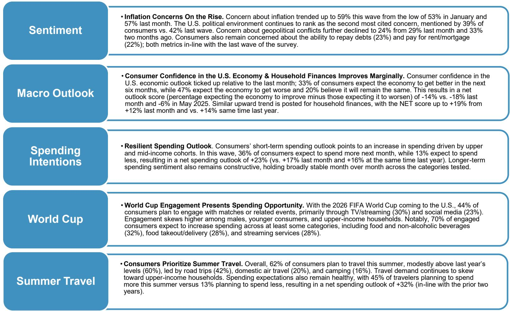
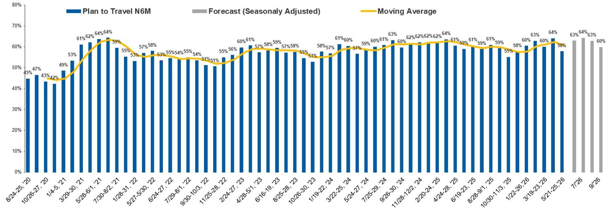
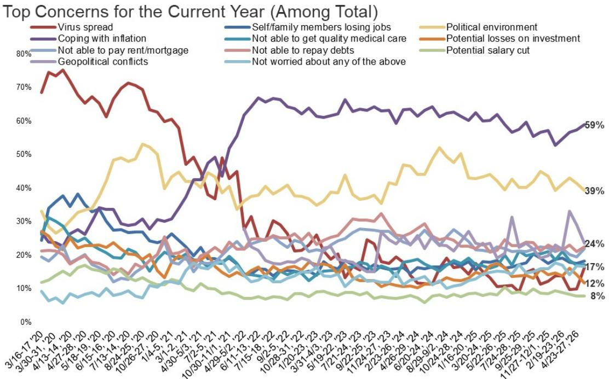

# 世界杯与夏季旅行正成为消费分化的新分水岭，而非总量信号

美国消费者正站在一个看似矛盾的路口。一方面，通胀担忧在最新一轮调查中回升至59%，较1月低点明显反弹；另一方面，62%的消费者计划在夏季出行，净支出意愿高达+32%，与过去两年持平。如果只看总量数字，很容易得出“消费韧性仍在”的结论。但某外资投行最新发布的AlphaWise消费者调查揭示了更深层的结构性信号：真正重要的不是消费总量是否增长，而是增长从何而来、由谁驱动、以及哪些品类正在被重新定价。

这份覆盖约2000名美国消费者的第76轮调查，捕捉到了两个值得产业决策者高度关注的变化。第一，2026年世界杯正在创造一个新的消费场景，44%的消费者计划参与相关活动，其中70%预计会增加支出。第二，夏季出行计划的结构正在发生微妙但重要的迁移——露营意愿从9%跃升至16%，而邮轮从15%回落至8%。这些变化叠加在一起，指向一个核心判断：美国消费市场正在从“总量驱动”转向“事件驱动”和“体验分层”，而企业能否识别并捕获这些结构性拐点，将决定未来12个月的竞争位势。

## 1. 世界杯消费不是一次性脉冲，而是测试品牌能否激活“轻参与”场景的试金石

调查显示，44%的消费者计划以某种形式参与世界杯，但参与方式高度集中在“轻参与”场景：30%通过电视或流媒体观看，23%通过社交媒体追踪。真正重度参与——如现场观赛（4%）、参加观赛派对（8%）或举办聚会（6%）——的比例远低于预期。

这意味着什么？世界杯对消费的拉动不会以传统“超级碗式”的集中爆发呈现，而是分散在多个轻量级触点中。32%的参与者预计会增加食品和非酒精饮料支出，28%会增加外卖或配送支出，另有28%可能订阅新的流媒体服务。这些品类恰恰是过去两年通胀环境下消费者压缩最明显的领域。世界杯提供了一个“合理化额外支出”的理由，让消费者在已经紧绷的预算中为体验性消费腾出空间。

对于消费品和零售企业而言，关键不在于押注大型营销活动，而在于能否在“轻参与”场景中嵌入购买闭环。例如，流媒体平台能否通过赛事内容提高订阅转化率，外卖平台能否通过观赛套餐提升客单价，食品品牌能否通过世界杯主题产品创造溢价空间。调查数据中一个值得注意的细节是，21%的参与者表示会增加体育博彩支出——这可能是调查尚未充分展开的、对数字支付和金融科技公司的潜在利好。

## 2. 夏季出行意愿的结构性迁移，暴露了消费者在预算约束下的优先级重排

62%的消费者计划夏季出行，这一比例略高于去年的60%，但结构变化远比总量有意义。公路旅行占比从39%升至42%，露营从9%跃升至16%，而邮轮从15%降至8%。这组数据不只是一个出行方式偏好的波动，它反映了消费者在通胀压力下对“性价比体验”的重新定义。

露营的爆发式增长尤其值得注意。这一类别在2024年仅占13%，2025年跌至9%，2026年却翻倍至16%。结合汽油价格持续高企的背景，消费者并非在减少出行，而是在选择成本更低、可控性更高的出行方式。公路旅行和露营本质上是对“固定成本出行”的替代——消费者仍然渴望旅行体验，但通过降低住宿和交通的边际成本来维持预算平衡。

这对旅游和休闲行业的启示是分层的。高端酒店和航空公司可能继续受益于高收入群体的刚性需求——调查显示，年收入15万美元以上家庭的出行意愿达78%，显著高于低收入群体。但中端市场正在被露营、公路旅行等替代方案侵蚀。对于邮轮行业，8%的意愿虽然低于2025年的15%，但仍高于2024年的6%，说明邮轮需求并未消失，只是波动性加大。关键在于，邮轮公司能否通过定价策略和航线设计，重新捕获那些转向露营的“性价比敏感型”消费者。

## 3. 净支出意愿+32%看似稳健，但真正的风险隐藏在“谁在驱动”这个维度

45%的旅行者计划增加支出，13%计划减少，净支出意愿+32%——这一数字与过去两年持平。但如果只看这个数字，会错过一个关键分化：高收入家庭是净支出增加的主要驱动力，而低收入家庭的支出意愿正在走弱。

调查显示，年收入5万美元以下的家庭中，仅32%计划增加出行支出，而年收入15万美元以上的家庭中，这一比例为51%。更值得警惕的是，6个月出行意愿从上一轮的64%降至58%，降幅主要由低收入群体贡献。这组数据与通胀担忧回升至59%形成呼应——低收入家庭正在被通胀和债务偿还压力双重挤压，不得不压缩未来的出行计划。

对于投资者而言，这意味着以“消费者支出韧性”为主题的投资逻辑需要进一步细分。依赖中低收入消费者高频消费的零售和休闲品牌，可能面临比总量数据更严峻的挑战。而定位高收入群体的奢侈品、高端体验和差异化服务，则可能继续受益于“K型消费”的深化。

## 4. 报告尚未完全回答的关键问题：世界杯消费的真实增量到底有多大？

调查显示70%的参与者预计会增加支出，但这里的“增加”是相对于什么基准？是相对于日常消费，还是相对于原本就计划进行的消费？如果是前者，世界杯确实创造了增量；如果是后者，更多是消费的重新分配。报告没有区分“净新增消费”和“消费转移”，这是理解世界杯经济效应的核心盲点。

另一个未解的问题是，世界杯的消费刺激能否持续到赛事结束后。调查集中在5月下旬，此时距世界杯开幕（6月11日）仅数周，消费者的预期可能包含一定的“赛事前兴奋”成分。如果实际体验低于预期，或赛事期间出现意外事件（如天气、地缘政治等），消费落地可能低于调查数据。这些不确定性意味着，世界杯对相关股票的催化作用可能更多体现在短期情绪层面，而非长期基本面改善。

## 5. 对决策者的观察框架：从“消费者想什么”到“企业能捕获什么”

这份报告的价值不仅在于告诉读者消费者在计划什么，更在于提供了一个评估企业捕获能力的框架。基于调查数据，可以提炼出三个观察维度：

第一，企业能否在“轻参与”场景中创造购买理由。世界杯参与者中，30%通过流媒体观看，但只有28%计划新增订阅——这意味着流媒体平台需要思考如何将“观看行为”转化为“订阅行为”，而不仅仅是依赖赛事内容的自然流量。

第二，企业能否在“性价比体验”趋势中找到定价权。露营需求翻倍，但露营装备、营地服务等领域的定价能力取决于供给弹性。如果供给快速扩张，价格竞争可能侵蚀利润率；如果供给受限，头部企业有望获得超额收益。

第三，企业能否在“K型消费”中精准定位目标客群。高收入群体仍是消费增长的压舱石，但中低收入群体的收缩正在加速。那些能够同时服务两端、或专注于高收入群体的企业，比试图覆盖全市场的企业更具防御性。

这些框架的验证需要更细颗粒度的数据——例如，世界杯相关消费中，有多少是原本不会发生的净新增支出？露营的增长是否可持续，还是仅仅因为去年基数偏低？报告没有给出这些问题的答案，但提供了一个清晰的追问方向。

---

世界杯的哨声即将吹响，夏季旅行的高峰正在临近。但比这些事件本身更重要的，是它们揭示的美国消费新常态：总量增长放缓，结构分化加剧，事件驱动的消费脉冲正在替代持续性的支出增长。对于产业决策者而言，真正的问题不是“消费者会不会花钱”，而是“你的企业有没有进入消费者重新排列的优先级清单”。

这些未解的问题——世界杯消费的净增量、露营增长的可持续性、K型消费的深化路径——正是完整报告中数据细节和交叉分析能够回答的。欢迎来星球微信群里继续讨论，我们可以一起拆解调查的原始数据表格，探讨哪些行业最有可能从这些结构性变化中受益，以及哪些风险点需要提前布局。

Personal reading notes and learning share only. Not investment advice.

