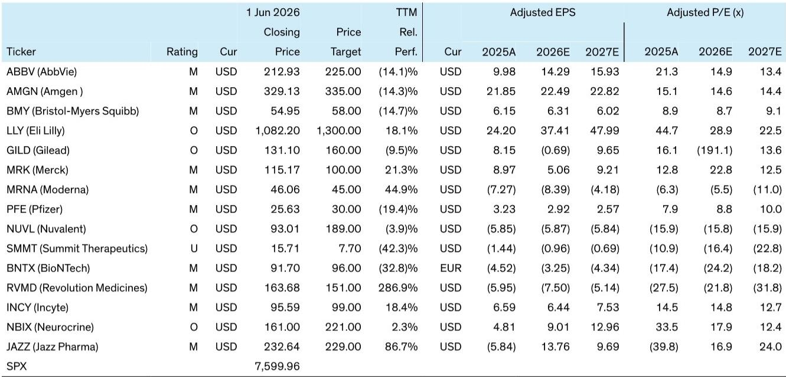
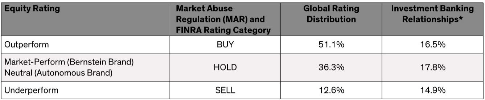

# The ASCO 2026 Takeaway: Lung Cancer Is Becoming a Chronic Disease, But the Investment Landscape Is Shifting Toward Early-Stage Detection and Next-Generation Resistance

The most important signal from ASCO 2026 is not a single drug's hazard ratio. It is the accelerating transformation of lung cancer from a rapidly fatal disease into a chronic condition for several molecular subtypes. Patients with ALK-positive disease, for instance, now face a median progression-free survival that has not been reached at seven years of follow-up. A practicing physician with decades of experience framed the shift bluntly: when he began his career, these patients survived six to seven months. The implications for investors are profound, but they require a more nuanced lens than simply tracking which drug won the weekend.

This transformation creates a new set of strategic questions that the market has not fully priced. If patients live seven to ten years with their diagnosis, the revenue streams for effective therapies extend far beyond the traditional treatment horizon. Yet the same longevity creates new vulnerabilities. The drugs that dominate today may face obsolescence as resistance mechanisms emerge, and the companies that solve for resistance, not just initial response, will capture disproportionate value. The physician's perspective from the conference floor reveals that the clinical community is already thinking in these terms, even if the consensus investment narrative has not caught up.

The report from a leading research firm, grounded in a breakfast discussion with a prominent lung cancer clinician, surfaces several critical tensions. The data are compelling, but the path to commercial adoption is never linear. The physician's own philosophy, shaped partly by his experience as a cancer survivor, is a reminder that treatment decisions are driven by patient-level factors, not hazard ratios alone. For investors, the question is not whether these drugs work, but how they will be adopted, by whom, and at what pace.

## The Adjuvant Revolution Is Real, But Its Commercial Impact Depends on Solving the Detection Problem

The most striking efficacy signal from the conference was the LIBRETTO-432 trial for selpercatinib in RET-positive adjuvant non-small cell lung cancer. A hazard ratio of 0.17 in a randomized adjuvant setting is among the strongest signals seen in early-stage targeted therapy. The event-free survival curves separated early and dramatically. This follows the pattern set by osimertinib in EGFR-mutant disease and alectinib in ALK-positive disease: targeted therapy in the adjuvant setting is becoming the standard of care for patients with actionable mutations.

The investment implication is straightforward for the companies that own these assets. Adjuvant therapy extends the treatment duration from months to years, and it captures patients at an earlier, potentially more treatable stage of disease. The revenue opportunity is larger and more durable than in the metastatic setting. But the physician's commentary reveals a critical bottleneck that the market may be underestimating. Approximately 70 percent of RET-positive patients are never-smokers who fall outside standard lung cancer screening criteria. These patients are not being detected at an early stage. The physician estimated that only about 30 percent of RET-positive patients are diagnosed at Stage 1B through 3A, and he noted that this figure may be inflated by the demographics of his own practice in New York City.

The commercial value of selpercatinib in the adjuvant setting is therefore contingent on improving detection rates, not just on the drug's efficacy. Molecular characterization remains incomplete in routine practice. Tissue requirements are still a barrier even in well-resourced settings, and liquid biopsy in early-stage disease is less reliable than in advanced disease because early-stage patients shed less circulating tumor DNA. The investment thesis for adjuvant targeted therapy must therefore include a bet on diagnostic innovation. Companies that can solve the detection problem, through better screening algorithms, more sensitive liquid biopsies, or changes to guideline recommendations, will unlock the full value of these drugs. Without that solution, the addressable patient population may be far smaller than the efficacy data suggest.

## The China Data Question Creates a Binary Outcome for Ivonescimab, But the Risk-Reward Is Misunderstood

The HARMONi-6 trial for ivonescimab in squamous NSCLC delivered an overall survival hazard ratio of 0.66 with manageable toxicity, including no significant excess of the bleeding risk that has historically limited VEGF inhibition in squamous tumors. The data are encouraging, but the physician was clear that he would not anchor a prescribing decision to a single hazard ratio from a China-only study. He identified two conditions that must be met before ivonescimab earns a place in his clinic: FDA approval based on a positive global trial, and a consistent readout from the HARMONi-3 study.

This framing is more nuanced than the binary narrative that has emerged in the market. The China-only data are not irrelevant, but they are not sufficient. The physician noted that patient selection in HARMONi-6 was described only descriptively, age was capped at 75, and the Chinese population may not map cleanly to Western practice. The bleeding risk question, while manageable in the trial, requires individual assessment for older patients with central tumors or comorbidities. More than half of his squamous NSCLC patients are over 65, and their risk-benefit calculus around VEGF inhibition is different from that of the trial population.

The critical catalyst is the HARMONi-3 global Phase 3 trial, which did not achieve statistically significant progression-free survival at its recent interim analysis. The final PFS analysis and an OS interim are expected in the second half of 2026. The physician's framework creates a clear decision tree for investors. If HARMONi-3 delivers a positive and consistent readout, ivonescimab has a credible path to becoming a standard of care in squamous NSCLC, and the market will need to reassess the competitive landscape. If HARMONi-3 fails to replicate the China data, the drug's commercial opportunity in the United States is effectively zero, regardless of the strength of the HARMONi-6 results. The risk-reward is binary, but the market may be pricing in too much optimism about the probability of a positive global readout, given the well-known challenges of cross-population replication.

## The ALK Franchise Is Maturing, But Nuvalent Has a Credible Niche That the Market May Be Underappreciating

The CROWN study update for lorlatinib set a bar that will be difficult for any competitor to match. Median PFS has still not been reached at seven years of follow-up. This is a remarkable achievement and solidifies lorlatinib's position as the standard of care for first-line ALK-positive NSCLC. For investors, the question is not whether lorlatinib will be displaced, but what opportunities remain in the ALK space.

Nuvalent's fourth-generation ALK inhibitor has demonstrated a roughly 26 percent response rate in patients who have relapsed on lorlatinib. This is a meaningful signal, but the commercial opportunity is a function of the addressable patient population, which is smaller than many investors assume. The physician noted that he sees only five to six ALK-positive patients per year in his practice. The number of patients who are both ALK-positive and lorlatinib-resistant is a fraction of that already small group.

However, the physician identified a second, potentially larger niche: patients who are not candidates for lorlatinib due to neurological toxicity or comorbidities. He noted that cultural inertia around alectinib, a second-generation ALK inhibitor, took years to overcome despite lorlatinib's superior data. This suggests that a meaningful number of patients remain on older therapies, and Nuvalent's drug could capture a portion of that population if it offers a better tolerability profile. The physician believes that continued data accumulation will ultimately drive uptake in lorlatinib-ineligible patients, but he acknowledged that adoption will be slow.

The investment case for Nuvalent therefore rests on two assumptions: that the lorlatinib-resistant population is large enough to support a commercial product, and that the lorlatinib-ineligible population will eventually shift to a new therapy. Both assumptions are plausible, but neither is certain. The market may be overestimating the speed of adoption, given the physician's observation that clinical inertia in the ALK space has historically been significant. The valuation of Nuvalent should reflect a longer timeline to peak sales than the current consensus may assume.

## KRAS Is the Next Major Battleground, and the Pace of Innovation May Outpace the Market's Expectations

The physician described the divarasib data in KRAS G12C first-line as potentially practice-changing. He also noted that the broader RAS space, including G12D and pan-RAS(ON) inhibitors from Revolution Medicines, is moving faster than many anticipated. This is a critical observation because KRAS mutations are far more prevalent than ALK, RET, or ROS1 alterations. The addressable patient population is large, and the competitive dynamics are still being defined.

The key question is whether first-line KRAS G12C inhibition will become a standard of care, or whether it will be limited to specific patient subsets. The physician's enthusiasm suggests that the data are compelling, but the absence of a biomarker-driven development strategy for some of the emerging combinations is a concern. He flagged this as a significant omission for a potential PD-1xVEGF plus integrin beta-6 combination, and the same critique could apply to other novel mechanisms entering the KRAS space.

For investors, the KRAS opportunity is real, but the competitive landscape is crowded and the differentiation between agents is not yet clear. The physician's comments suggest that Revolution Medicines' pan-RAS approach may offer a broader therapeutic window than G12C-specific inhibitors, but full data are needed before any conclusions can be drawn. The market should expect volatility as trial readouts emerge, and the winners will be those that can demonstrate not just efficacy, but also a clear positioning relative to the standard of care.

## What the Report Does Not Fully Answer: The Unresolved Tension Between All-Comers and Biomarker Strategies

The report surfaces a philosophical tension that has significant investment implications but remains unresolved. The physician expressed conflict around the all-comers approach of sacituzumab tirumotecan, a TROP2-directed ADC, given his background as a biomarker researcher. He found the data compelling but was uncomfortable with the absence of a companion biomarker strategy. This tension is not unique to TROP2 agents. It reflects a broader debate in oncology about whether the field should prioritize broad, all-comer indications or biomarker-defined patient subsets.

The investment implications are not trivial. An all-comer strategy can generate a larger addressable market and a faster path to approval, but it may also lead to lower response rates in unselected populations and greater toxicity burden. A biomarker strategy may produce more impressive efficacy signals in a smaller population, but it requires diagnostic infrastructure and may limit the commercial opportunity. The physician's discomfort suggests that the market may be underestimating the long-term risk of an all-comer approach, particularly if real-world data reveal that the drug is being used in patients who derive minimal benefit.

The report does not provide a clear answer to this tension, and investors should be cautious about assuming that compelling Phase 3 data in an all-comer population will translate to broad clinical adoption. The physician's perspective is a reminder that the clinical community values precision, even when the data support a broader label. The companies that can articulate a clear biomarker strategy, even for drugs that initially launch in an all-comer setting, may ultimately capture more durable market share.

## A Decision Framework for Investors: How to Evaluate ASCO Data Through a Clinical Lens

The physician's comments provide a practical framework for evaluating ASCO data that goes beyond hazard ratios and statistical significance. Investors should apply four filters to every trial readout.

First, assess the detection problem. For early-stage therapies, the commercial opportunity is a function of how many patients are diagnosed at the appropriate stage. If the detection rate is low, even the most impressive efficacy data will have limited commercial impact. The LIBRETTO-432 data are a case in point: the drug works, but the patient population is smaller than the efficacy signal suggests.

Second, evaluate the global replication risk. China-only data are informative but not sufficient for US prescribing decisions. The physician's framework for ivonescimab is instructive: he requires both FDA approval and a consistent global readout before he will change his practice. Investors should apply a similar discount to China-only data until global trials confirm the results.

Third, consider the clinical inertia factor. The physician noted that it took years for lorlatinib to displace alectinib despite superior data. Nuvalent will face the same challenge. Adoption curves in oncology are slower than many investors assume, particularly when the incumbent therapy has a long track record and a comfortable safety profile.

Fourth, assess the biomarker strategy. The physician's discomfort with all-comer approaches is a signal that the clinical community values precision. Companies that can pair their drugs with a diagnostic strategy will have a competitive advantage, even if the initial approval is in an unselected population.

## The Chronic Disease Paradigm Creates New Investment Themes That the Market Has Not Yet Fully Priced

The physician's observation that certain lung cancer subtypes are approaching a chronic disease paradigm, with patients living seven to ten years, has implications that extend beyond individual drug valuations. It creates demand for survivorship programs, long-term toxicity management, and monitoring strategies that do not currently exist. The lung cancer community has not yet prioritized these areas, and the physician identified this as an urgent gap.

For investors, this suggests that the next wave of value creation in lung cancer may come not from new drugs, but from the infrastructure that supports long-term patient management. Companies that develop tools for ctDNA monitoring, treatment duration optimization, and survivorship care may capture value that is not reflected in current valuations. The physician's own experience as a cancer survivor, and his observation that patients are reluctant to stop therapy if tolerability is acceptable, underscores the need for better tools to guide treatment decisions over a multi-year horizon.

The market is focused on the next trial readout, but the physician's perspective suggests that the most durable investment opportunities may be in the systems that support the chronic disease paradigm, not just the drugs that enable it.

Join the community to read the full report and review the original charts.

*This article is for learning and discussion only and does not constitute investment advice.*

Personal reading notes and learning share only. Not investment advice.

