May 31, 2026 11:48 PM GMT

# Semiconductors | North America

# Weekly: Earnings Week 7 AVGO Preview

WHAT'S CHANGED 

<table><tr><td>Broadcom Inc. (AVGO.O)</td><td>From</td><td>To</td></tr><tr><td>Price Target</td><td>$470.00</td><td>$485.00</td></tr></table>

We see the company meeting high expectations amid a strong ramp for both networking and ASIC; we expect the company to retain a strong majority of the TPU business.

AVGO (OW, reporting after market closes on Wednesday, June 3rd): Expectations are high into the quarter given exceptionally strong AI networking checks and continued TPU demand. Our sense is that frontier-model developers remain compute constrained and are increasingly taking capacity wherever they can get it, which is broadly positive for the GPU alternative ecosystem. We model AI revenue of \$10.8bn in AprQ and \$16.9bn in JulQ. While we are not convinced this is a major beat-and-raise quarter, we believe the stock can work as long as management reinforces the long-term demand outlook. The bigger story remains 2027.

2027 continues to set up well for XPU share gains. Longer term, we continue to see significant upside potential. Broadcom's AI market share remains only \~10% today and we expect that to increase. The company now sees just under 10GW of customer compute capacity by FY27. Using a rough \~\$20bn per GW framework points to a very large revenue opportunity, though content per GW clearly varies by customer. We view that math as closer to a bull case, but it highlights the scale of the opportunity. We currently model \~\$120bn of AI revenue in FY27 and continue to see room for upward revisions as ASIC programs ramp and AI networking exceeds expectations.

Updates on 2H outlook. Our view on 2H26 has evolved following recent rack-related developments. We now believe what were rack deployments has shifted into 2027 timeframe, which in our view likely includes most of the previously expected discussed \$21bn opportunity. Importantly, we do not view this as lost demand. Rather, we believe capacity is being reallocated to other TPU customers. As a result, we now expect a less pronounced 2H26 hockey stick inflection. Growth remains strong, but the upside we previously anticipated is likely pushed out rather than eliminated.

# We view CoT concerns as overblown, though it remains an area to watch. On

CoT, we continue to view MediaTek as a risk, but not a thesis breaker. We estimate perhaps 10-15% of TPU content is realistically at risk and continue to believe Broadcom will retain the majority of TPU share. Displacing an incumbent supplier at this scale is difficult, and we believe Broadcom's TPU position is more durable than many investors appreciate.

Outside of AI, we continue to expect stable but largely unexciting results. We are

MS & CO. LLC

# Joseph Moore

Equity Analyst

Joseph.Moore@morganstanley.com +1 212 761-7516

# Ella Tulchinsky

Research Associate

Ella.Tulchinsky@morganstanley.com +1 212 761-2222

# Nicole Kozhukhov

Research Associate

Nicole.Kozhukhov@morganstanley.com +1 212 761-1636

# Mason Wayne

Research Associate

Mason.Wayne@morganstanley.com +1 212 761-6012

# Shane Brett

Equity Analyst

Shane.Brett@morganstanley.com +1 212 761-1022

2026 EXTEL

ALL-AMERICA RESEARCH POLL

May 26 – June, 12 2026

VIEW OUR ANALYSTS >

# SEMICONDUCTORS

North America

Industry View

Attractive

MS does and seeks to do business with companies covered in MS. As a result, investors should be aware that the firm may have a conflict of interest that could affect the objectivity of MS. Investors should consider MS as only a single factor in making their investment decision.

For analyst certification and other important disclosures, refer to the Disclosure Section, located at the end of this report.

not yet seeing evidence of a meaningful cyclical recovery across the broader semiconductor portfolio, though trends appear to have stabilized. Infrastructure software continues to deliver consistent execution and should remain a source of steady growth and cash flow.

Changes to our estimates: We are moderating our 2H CY26 AI growth assumptions relative to our prior forecast, reflecting the rack related dynamics discussed above. Our expectation for AprilQ AI revenue remains unchanged at \$10.8 billion. However, for the July quarter, we now forecast AI revenue of \$16.9 billion, representing 56% q/q growth, versus our previous estimate of \$19.5 billion and 80% q/q growth. We currently project total revenue of \$22.1 billion in the April quarter and \$28.8 billion in the July quarter. Despite the lower JulyQ outlook, our full-year estimates remain largely unchanged, as we view the roughly \$3 billion reduction in AI revenue as primarily a timing shift related to rack availability rather than a change in underlying demand, with most of the impact expected to be recaptured in subsequent quarters. We now forecast CY26 AI revenue of \$74 and CY27 AI revenue of \$133 billion.

With respect to our price target, we are increasing our CY27 EPS multiple (including SBC) from 27x to 28x, resulting in a higher price target of \$485. We remain highly constructive on Broadcom's growth outlook and see meaningful tailwinds across both custom silicon and networking. Broadcom remains our preferred ASIC exposure and is positioned at the center of some of the most important trends in AI infrastructure. Additionally, we believe 2026 and 2027 are shaping up to be strong years for XPU market share gains, with continued evidence that the TPU platform is gaining traction and driving incremental custom silicon demand.

Preview to earnings 

<table><tr><td>Focus KPI</td><td>Focus KPI Surprise</td><td>Likely impact to consensus EPS*</td></tr></table>

Broadcom Inc. AVGO.O 

<table><tr><td>AI revenue</td><td>↑ Likely upside surprise</td><td>↑ Modest revision higher</td></tr></table>

- We believe the company is well positioned to meet high expectations as networking and ASIC demand accelerates   
\*Likely impact to consensus EPS is for the next 12 months  
Source: Company data, MS

# Broadcom Earnings Preview

The company is scheduled to report after the market close on Wednesday, June 3rd.

Expectations are high into the quarter given exceptionally strong AI networking checks and continued TPU demand. Our sense is that frontier-model developers remain compute constrained and are increasingly taking capacity wherever they can get it, which is broadly positive for the GPU alternative ecosystem. We model AI revenue of \$10.8bn in AprQ and \$16.9bn in JulQ. While we are not convinced this is a major beat-and-raise quarter, we believe the stock can work as long as management reinforces the long-term demand outlook. The bigger story remains 2027.

2027 continues to set up well for XPU share gains. Longer term, we continue to see significant upside potential. Broadcom's AI market share remains only \~10% today and we expect that to increase. The company now sees just under 10GW of customer compute capacity by FY27. Using a rough \~\$20bn per GW framework points to a very large revenue opportunity, though content per GW clearly varies by customer. We view that math as closer to a bull case, but it highlights the scale of the opportunity. We currently model \~\$120bn of AI revenue in FY27 and continue to see room for upward revisions as ASIC programs ramp and AI networking exceeds expectations.

Updates on 2H outlook. Our view on 2H26 has evolved following recent rack-related developments. We now believe what were rack deployments has shifted into 2027 timeframe, which in our view likely includes most of the previously expected discussed \$21bn opportunity. Importantly, we do not view this as lost demand. Rather, we believe capacity is being reallocated to other TPU customers. As a result, we now expect a less pronounced 2H26 hockey stick inflection. Growth remains strong, but the upside we previously anticipated is likely pushed out rather than eliminated.

We view CoT concerns as overblown, though it remains an area to watch. On CoT, we continue to view MediaTek as a risk, but not a thesis breaker. We estimate perhaps 10-15% of TPU content is realistically at risk and continue to believe Broadcom will retain the majority of TPU share. Displacing an incumbent supplier at this scale is difficult, and we believe Broadcom's TPU position is more durable than many investors appreciate.

Outside of AI, we continue to expect stable but largely unexciting results. We are not yet seeing evidence of a meaningful cyclical recovery across the broader semiconductor portfolio, though trends appear to have stabilized. Infrastructure software continues to deliver consistent execution and should remain a source of steady growth and cash flow.

Changes to our estimates: We are moderating our 2H CY26 AI growth assumptions relative to our prior forecast, reflecting the rack related dynamics discussed above. Our expectation for AprilQ AI revenue remains unchanged at \$10.8 billion. However, for the July quarter, we now forecast AI revenue of \$16.9 billion, representing 56% q/q growth, versus our previous estimate of \$19.5 billion and 80% q/q growth. We currently project total revenue of \$22.1 billion in the April quarter and \$28.8 billion in the July quarter. Despite the lower JulyQ outlook, our full-year estimates remain largely unchanged, as we view the roughly \$3 billion reduction in AI revenue as primarily a timing shift related to rack availability rather than a change in underlying demand, with most of the impact expected to be recaptured in subsequent quarters. We now forecast CY26 AI revenue of \$74 billion and CY27 AI revenue of \$133 billion.

With respect to our price target, we are increasing our CY27 EPS multiple (including SBC) from 27x to 28x, resulting in a higher price target of \$485. We remain highly constructive on Broadcom's growth outlook and see meaningful tailwinds across both custom silicon and networking. Broadcom remains our preferred ASIC exposure and is positioned at the center of some of the most important trends in AI infrastructure. Additionally, we believe 2026 and 2027 are shaping up to be strong years for XPU market share gains, with continued evidence that the TPU platform is gaining traction and driving incremental custom silicon demand.

Details on the April quarter: We model revenue of \$22.1 bn (up 14.6% q/q and up 27.5% y/y), in-line with the Street at \$22.0bn. By segment, we model Semiconductor Solutions revenue of \$14.9bn (19.3% q/q and 77.6% y/y) and Infrastructure Software revenue of \$7.2bn (up 5.8% q/q and up 9.1% y/y). Our gross margin estimate of 76.9% is above the Street at 76.1% and our EPS estimate of \$2.40 is slightly ahead of the Street at \$2.39.

Outlook on July quarter: We model of \$28.8bn (up 30.2% q/q and 81% y/y), slightly above the Street at \$28.1bn. By segment, we model Semiconductor Solutions revenue of \$16.9bn (up 56% q/q and 255% y/y) and Infrastructure Software revenue of \$7.7bn (up 7.1% q/q and 13.6% y/y). Our gross margin estimate of 74.1% is below the Street at 76.0% and our EPS estimate of \$3.19 is slightly ahead of the Street at \$3.16.

Exhibit 1: AVGO: MS vs. Cons   
MS vs. Consensus 

<table><tr><td colspan="9">Figures in $ MMs</td></tr><tr><td rowspan="2"></td><td colspan="2">F2Q26E</td><td colspan="2">F3Q26E</td><td colspan="2">2026E</td><td colspan="2">2027E</td></tr><tr><td>MS</td><td>Cons.</td><td>MS</td><td>Cons.</td><td>MS</td><td>Cons.</td><td>MS</td><td>Cons.</td></tr><tr><td>Revenues</td><td>22,128</td><td>22,047</td><td>28,822</td><td>28,164</td><td>104,698</td><td>103,164</td><td>168,222</td><td>162,787</td></tr><tr><td>Q/Q Change</td><td>14.6%</td><td>14.2%</td><td>30.2%</td><td>27.7%</td><td></td><td></td><td></td><td></td></tr><tr><td>GMs</td><td>76.9%</td><td>76.1%</td><td>74.1%</td><td>76.0%</td><td>74.9%</td><td>75.5%</td><td>71.0%</td><td>72.9%</td></tr><tr><td>EPS</td><td>$2.40</td><td>$2.39</td><td>$3.19</td><td>$3.16</td><td>$11.42</td><td>$11.25</td><td>$17.97</td><td>$18.17</td></tr></table>

Source: FactSet, MS estimates

# Risk Reward – Broadcom Inc. (AVGO.O)

Overweight on growth in AI, recovery in core semis, and potential VMW upside.

# PRICE TARGET \$485.00

We value AVGO at 28X CY2027e ModelWare EPS of \$17.33. This is roughly 25x non-GAAP EPS of \$19.34, and reflects a slight premium over AI peers that accounts for their outsized AI growth potential and long-term prospects in ASICs.

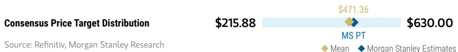

bar_line

| Category | Value    |
| -------- | -------- |
| MS PT    | $471.36  |
| MS PT    | $630.00  |
| Mean     | $215.88  |
| MS Estimates | $630.00  |

RISK REWARD CHART AND OPTIONS IMPLIED PROBABILITIES (12M)   
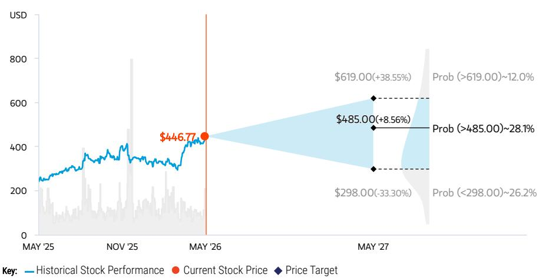

line

| Date     | Historical Stock Performance | Current Stock Price | Price Target |
| -------- | ----------------------------- | ------------------- | ------------ |
| MAY '25  | ~$250                         | -                   | -            |
| NOV '25  | ~$350                         | -                   | -            |
| MAY '26  | $446.77                       | $446.77             | -            |
| MAY '27  | -                             | $619.00 (+38.55%)   | $485.00 (+8.56%) |
| MAY '27  | -                             | $298.00 (-33.30%)   | $485.00 (~28.1%) |

Source: Refinitiv, MS, MS Institutional Equities Division. The probabilities of our Bull, Base, and Bear case scenarios playing out were estimated with implied volatility data from the options market as of 29 May 2026. All figures are approximate risk-neutral probabilities of the stock reaching beyond the scenario price in either three-months' or one-years' time. View explanation of Options Probabilities methodology here

# OVERWEIGHT THESIS

■ AVGO has the second largest AI exposure (in absolute dollars) in our coverage and is poised to grow as hyperscale capex increases. We see the company maintaining their premium multiple as networking and ASIC businesses continue to grow.   
We expect non-AI semis to have a cyclical rebound late next year after a period of high excess inventory in the networking and storage markets.   
■ We expect VMware to successfully integrate into the portfolio and focus operations, cut costs, and drive stable cash flows.

Consensus Rating Distribution   
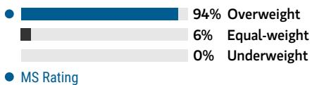

bar

| Category      | Value |
| ------------- | ----- |
| Overweight    | 94%   |
| Equal-weight  | 6%    |
| Underweight   | 0%    |

Source: Refinitiv, MS

# Risk Reward Themes

New Data Era: Positive

Pricing Power: Positive

View descriptions of Risk Rewards Themes here

# BULL CASE

# \$619.00

# BASE CASE

# \$485.00

# BEAR CASE

# \$298.00

# 31X 2027e ModelWare Bull EPS of \$19.96

Revenue growth surprises to the upside and AI revenues grow from ramp of new xPU customers, continued networking strength, and VMware synergies. The stock's valuation multiple expands as investors gain confidence in its AI and M&A strategy.

# 28X 2027e ModelWare Base EPS of \$17.33

Posts strong revenue growth in CY26 CY27 driven by strong AI revenues from xPU and Networking, and software growth.

# 20X 2027e ModelWare Bear EPS of \$15.02

Revenue growth disappoints and synergies underwhelm. New customer engagements fail to reach production The stock's valuation multiple falls to 31X

# Risk Reward – Broadcom Inc. (AVGO.O)

KEY EARNINGS INPUTS 

<table><tr><td>Drivers</td><td>2025</td><td>2026e</td><td>2027e</td><td>2028e</td></tr><tr><td>GAAP Revenue ($, mm)</td><td>63,887</td><td>104,698</td><td>168,222</td><td>215,704</td></tr><tr><td>MW Gross Margin (%)</td><td>77.3</td><td>74.0</td><td>70.4</td><td>69.7</td></tr><tr><td>MW EPS ($)</td><td>5.39</td><td>9.63</td><td>15.98</td><td>20.95</td></tr><tr><td>Inventory ($, mm)</td><td>2,270</td><td>6,000</td><td>10,818</td><td>12,601</td></tr><tr><td>DOI</td><td>57.2</td><td>80.4</td><td>79.4</td><td>70.3</td></tr></table>

# INVESTMENT DRIVERS

- Dominant position in the data center with merchant silicon and ASICs   
- Increasing adoption of carrier aggregation, antenna filtering in RF and 5G adoption   
- Potential for better than expected accretion from the Symantec deal

# GLOBAL REVENUE EXPOSURE

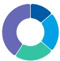

10-20% Europe ex UK   
20-30% Mainland China   
20-30% North America   
40-50% APAC, ex Japan, Mainland China and India

Source: MS Estimate View explanation of regional hierarchies here

MS ALPHA MODELS 

<table><tr><td>4/5BEST</td><td>24 MonthHorizon</td><td>4/5MOST</td><td>3 MonthHorizon</td></tr></table>

Source: Refinitiv, FactSet, MS; 1 is the highest favored Quintile and 5 is the least favored Quintile

# RISKS TO PT/RATING

# RISKS TO UPSIDE

• Stronger AI revenues   
- Faster recovery in core semis businesses   
• Realized VMware synergies

# RISKS TO DOWNSIDE

- Lose networking share to Nvidia (Mellanox)   
- ASIC chips are uncompetitive; lose customers to competitors   
• Execution on VMware acquisition

OWNERSHIP POSITIONING 

<table><tr><td>Inst. Owners, % Active</td><td>53.2%</td><td></td><td></td><td></td></tr><tr><td>HF Sector Long/Short Ratio</td><td>2x</td><td></td><td></td><td></td></tr><tr><td>HF Sector Net Exposure</td><td>25.3%</td><td></td><td></td><td></td></tr></table>

Refinitiv; MSPB Content. Includes certain hedge fund exposures held with MSPB. Information may be inconsistent with or may not reflect broader market trends. Long/Short Ratio = Long Exposure / Short exposure. Sector % of Total Net Exposure = (For a particular sector: Long Exposure - Short Exposure) / (Across all sectors: Long Exposure – Short Exposure).

MS ESTIMATES VS. CONSENSUS 

<table><tr><td colspan="3">FY Oct 2026e</td></tr><tr><td rowspan="2">Sales / Revenue($, mm)</td><td rowspan="2">95,742</td><td>104,698</td></tr><tr><td>104,663</td></tr><tr><td rowspan="2">EBITDA($, mm)</td><td rowspan="2">51,917</td><td>70,816</td></tr><tr><td>68,483</td></tr><tr><td rowspan="2">Net income($, mm)</td><td rowspan="2">34,490</td><td>56,531</td></tr><tr><td>54,964</td></tr><tr><td rowspan="2">EPS($)</td><td rowspan="2">9.20</td><td>11.42</td></tr><tr><td>11.26</td></tr></table>

Source: Refinitiv, MS

# Semiconductor Coverage – Valuation / Stock Performance

Exhibit 2: Weekly stock performance   
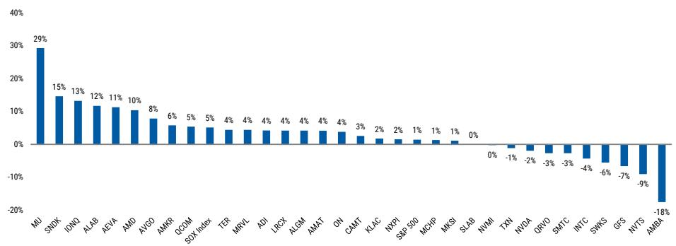

bar

| Ticker | Value (%) |
| :--- | :--- |
| MU | 29 |
| SNDK | 15 |
| IDNO | 13 |
| ALAB | 12 |
| AETA | 11 |
| AMD | 10 |
| AVGO | 8 |
| AMKR | 6 |
| QCOM | 5 |
| SDX Index | 5 |
| TER | 4 |
| MRVL | 4 |
| ADI | 4 |
| LRCX | 4 |
| ALGM | 4 |
| AMAT | 4 |
| ON | 4 |
| CAMT | 3 |
| KLAC | 2 |
| NRPI | 2 |
| S&P 500 | 1 |
| MCHP | 1 |
| MKSI | 1 |
| SLAB | 0 |
| NVMI | 0 |
| TXN | -1 |
| NVIDIA | -2 |
| QINDO | -3 |
| SMTC | -3 |
| INTC | -4 |
| SWKS | -6 |
| OFS | -7 |
| NVTS | -9 |
| AMBA | -18 |

Source: FactSet, MS

Exhibit 3: Monthly stock performance   
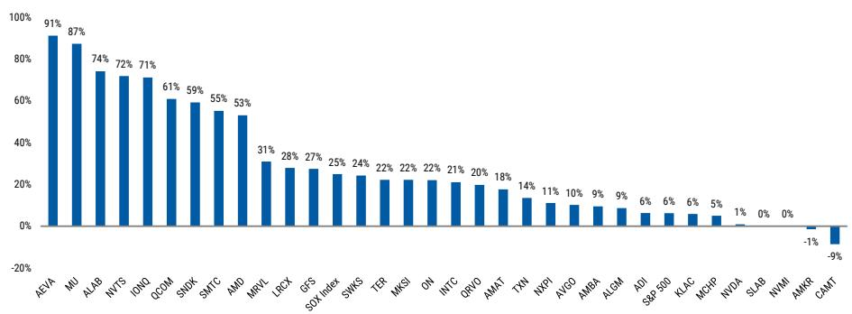

bar

| Ticker | Value (%) |
|---|---|
| AVA | 91 |
| MU | 87 |
| ALLAB | 74 |
| NVTS | 72 |
| IDNO | 71 |
| QCOM | 61 |
| SNDK | 59 |
| SMTC | 55 |
| AMD | 53 |
| MRVL | 31 |
| LRCK | 28 |
| GFS | 27 |
| SOX index | 25 |
| SWKS | 24 |
| TER | 22 |
| MKSI | 22 |
| ON | 22 |
| INTC | 21 |
| ORVO | 20 |
| AMAT | 18 |
| TXN | 14 |
| NPPI | 11 |
| AVGO | 10 |
| AMBA | 9 |
| ALGM | 9 |
| ADI | 6 |
| S&P 500 | 6 |
| KLAC | 6 |
| MCHP | 5 |
| NVIDIA | 1 |
| SLAB | 0 |
| NVMI | 0 |
| AMKR | -1 |
| CAMT | -9 |

Source: FactSet, MS

Exhibit 4: YTD stock performance   
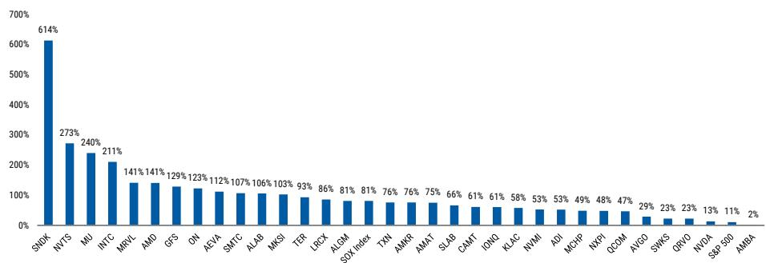

bar

| Ticker | Value (%) |
| :--- | :--- |
| SNDK | 614 |
| NVTS | 273 |
| MU | 240 |
| INTC | 211 |
| MRVL | 141 |
| AMD | 141 |
| GFS | 129 |
| ON | 123 |
| AEVA | 112 |
| SMTC | 107 |
| ALAB | 106 |
| MKSI | 103 |
| TER | 93 |
| LRX | 86 |
| ALGM | 81 |
| SOX Index | 81 |
| TXN | 76 |
| AMKR | 76 |
| AMAT | 75 |
| SLAB | 66 |
| CAMT | 61 |
| IDNO | 61 |
| KLAC | 58 |
| NVMI | 53 |
| ADI | 53 |
| MCHP | 49 |
| NKPI | 48 |
| QCOM | 47 |
| AVGO | 29 |
| SWKS | 23 |
| QRVO | 23 |
| NVIDIA | 13 |
| S&P 500 | 11 |
| AMBA | 2 |

Source: FactSet, MS

# Semis Week Ahead

Exhibit 5: June 1st - June 5th, 2026

Monday, June 1st

COMPUTEX

NVDA Financial Analyst Q&A Lunch - 11:30pm - 12:30am ET

QCOM - 2:00am ET

MRVL - 10:30pm ET

CRDO Earnings

5:00pm ET

Tuesday, June 2nd

COMPUTEX

Financial Analyst Q&A with Jensen Huang - 12:30am - 1:30am ET

INTC - 1:30am ET

NXPI - 10:30pm ET

BofA Conference

AMAT - 11:40am ET

LRCX - 12:20pm ET

ADI - 1:00pm ET

AMD - 2:20pm ET

TER - 4:20pm ET

INTC - 6:20pm ET

Evercore Conference

MRVL - 6:50pm ET

Wednesday, June 3rd

BofA Conference

KLAC - 12:20pm ET

ON - 4:20pm ET

MRVL - 5:40pm ET

NVMI - 6:20pm ET

Evercore Conference

ALAB - 1:50pm ET

NVTS - 5:10pm ET

AVGO Earnings

5:00pm ET

Thursday, June 4th

BofA Conference

NVDA - 11:40am ET

Friday, June 5th

LOOKING AHEAD

June 9th-11th

PCIM Europe - https://pcim.mesago.com/nuernberg/en/expo.html

Wednesday, June 24th

QCOM Investor Day

Thursday, June 25th

Renesas Capital Markets Day

Thursday, July 23rd

AMD Advancing AI

https://www.youtube.com/@AMD/streams

Wednesday, September 16th

ON Financial Analyst Day

2:00pm ET

Source: Bloomberg, Refinitiv, MS

# Semiconductor Coverage

Exhibit 6: Semiconductors - Risk Reward 

<table><tr><td rowspan="2">Ticker</td><td rowspan="2">Rating</td><td rowspan="2">Price</td><td colspan="3">Risk-Reward</td><td rowspan="2">% Upside / Downside Base</td></tr><tr><td>Bear</td><td>Base</td><td>Bull</td></tr><tr><td colspan="7">Computing</td></tr><tr><td>AMD</td><td>EW</td><td>$516.1</td><td>$210</td><td>$410</td><td>$570</td><td>-21%</td></tr><tr><td>INTC</td><td>EW</td><td>$114.7</td><td>$43</td><td>$73</td><td>$110</td><td>-36%</td></tr><tr><td>NVDA</td><td>OW</td><td>$211.1</td><td>$160</td><td>$288</td><td>$330</td><td>36%</td></tr><tr><td colspan="7">Memory</td></tr><tr><td>MU</td><td>OW</td><td>$971.0</td><td>$240</td><td>$520</td><td>$700</td><td>-46%</td></tr><tr><td>SNDK</td><td>OW</td><td>$1,695.0</td><td>$600</td><td>$1,100</td><td>$1,500</td><td>-35%</td></tr><tr><td colspan="7">Capital Equipment</td></tr><tr><td>AMAT</td><td>EW</td><td>$450.1</td><td>$330</td><td>$502</td><td>$693</td><td>12%</td></tr><tr><td>CAMT</td><td>EW</td><td>$171.7</td><td>$118</td><td>$163</td><td>$214</td><td>-5%</td></tr><tr><td>KLAC</td><td>OW</td><td>$1,921.7</td><td>$1,367</td><td>$1,900</td><td>$2,334</td><td>-1%</td></tr><tr><td>LRCX</td><td>OW</td><td>$318.2</td><td>$219</td><td>$331</td><td>$436</td><td>4%</td></tr><tr><td>MKSI</td><td>OW</td><td>$324.3</td><td>$234</td><td>$374</td><td>$506</td><td>15%</td></tr><tr><td>NVMI</td><td>EW</td><td>$502.3</td><td>$366</td><td>$494</td><td>$643</td><td>-2%</td></tr><tr><td>TER</td><td>EW</td><td>$374.3</td><td>$267</td><td>$387</td><td>$512</td><td>3%</td></tr><tr><td colspan="7">Comm-IC / Multi-Market</td></tr><tr><td>ALAB</td><td>OW</td><td>$342.9</td><td>$121</td><td>$240</td><td>$332</td><td>-30%</td></tr><tr><td>AMBA</td><td>OW</td><td>$72.2</td><td>$34</td><td>$96</td><td>$136</td><td>33%</td></tr><tr><td>AVGO</td><td>OW</td><td>$446.8</td><td>$298</td><td>$485</td><td>$619</td><td>9%</td></tr><tr><td>MRVL</td><td>EW</td><td>$205.0</td><td>$130</td><td>$195</td><td>$286</td><td>-5%</td></tr><tr><td>QCOM</td><td>UW</td><td>$251.0</td><td>$94</td><td>$146</td><td>$199</td><td>-42%</td></tr><tr><td>QRVO</td><td>EW</td><td>$103.6</td><td>$40</td><td>$84</td><td>$110</td><td>-19%</td></tr><tr><td>SMTC</td><td>EW</td><td>$152.5</td><td>$95</td><td>$175</td><td>$230</td><td>15%</td></tr><tr><td>SWKS</td><td>EW</td><td>$77.9</td><td>$43</td><td>$76</td><td>$105</td><td>-2%</td></tr><tr><td colspan="7">Analog / MCUs</td></tr><tr><td>ADI</td><td>OW</td><td>$413.9</td><td>$342</td><td>$428</td><td>$517</td><td>3%</td></tr><tr><td>ALGM</td><td>OW</td><td>$47.9</td><td>$43</td><td>$51</td><td>$70</td><td>7%</td></tr><tr><td>MCHP</td><td>EW</td><td>$94.7</td><td>$69</td><td>$94</td><td>$118</td><td>-1%</td></tr><tr><td>NVTS</td><td>UW</td><td>$26.6</td><td>$4.9</td><td>$13.7</td><td>$22.7</td><td>-48%</td></tr><tr><td>NXPI</td><td>OW</td><td>$321.4</td><td>$268</td><td>$335</td><td>$400</td><td>4%</td></tr><tr><td>ON</td><td>EW</td><td>$120.6</td><td>$62</td><td>$87</td><td>$115</td><td>-28%</td></tr><tr><td>SLAB</td><td>EW</td><td>$217.6</td><td>$83</td><td>$231</td><td>$265</td><td>6%</td></tr><tr><td>TXN</td><td>UW</td><td>$305.7</td><td>$184</td><td>$221</td><td>$263</td><td>-28%</td></tr><tr><td colspan="7">Components</td></tr><tr><td>AEVA</td><td>EW</td><td>$28.2</td><td>$4.5</td><td>$18.5</td><td>$52.0</td><td>-34%</td></tr><tr><td colspan="7">Foundry</td></tr><tr><td>GFS</td><td>EW</td><td>$80.0</td><td>$34</td><td>$58</td><td>$96</td><td>-27%</td></tr><tr><td>AMKR</td><td>EW</td><td>$69.6</td><td>$49</td><td>$69</td><td>$88</td><td>-1%</td></tr><tr><td colspan="7">Quantum Computing</td></tr><tr><td>IONQ</td><td>EW</td><td>$72.1</td><td>$6</td><td>$48.5</td><td>$110</td><td>-33%</td></tr></table>

Source: FactSet, MS estimates

Exhibit 7: MS vs. Street 

<table><tr><td rowspan="2" colspan="2"></td><td colspan="3">CY2026e EPS</td><td rowspan="2"></td><td colspan="3">CY2026e Revenue</td></tr><tr><td>MS</td><td>Consensus</td><td>% Diff</td><td>MS</td><td>Consensus</td><td>% Diff</td></tr><tr><td rowspan="12">OW</td><td>ADI</td><td>$13.21</td><td>$12.69</td><td>(4%)</td><td>ADI</td><td>$15,499</td><td>$15,023</td><td>(3%)</td></tr><tr><td>ALAB</td><td>$2.88</td><td>$2.97</td><td>(8%)</td><td>ALAB</td><td>$1,532</td><td>$1,547</td><td>(1%)</td></tr><tr><td>ALGM</td><td>$0.93</td><td>$0.88</td><td>10%</td><td>ALGM</td><td>$1,048</td><td>$1,017</td><td>2%</td></tr><tr><td>AMBA</td><td>$0.74</td><td>$0.77</td><td>3%</td><td>AMBA</td><td>$443</td><td>$439</td><td>0%</td></tr><tr><td>AVGO</td><td>$13.53</td><td>$12.44</td><td>(3%)</td><td>AVGO</td><td>$124,402</td><td>$113,347</td><td>0%</td></tr><tr><td>KLAC</td><td>$43.86</td><td>$43.70</td><td>(1%)</td><td>KLAC</td><td>$15,335</td><td>$15,318</td><td>(0%)</td></tr><tr><td>LRCX</td><td>$7.00</td><td>$6.83</td><td>(0%)</td><td>LRCX</td><td>$27,067</td><td>$26,926</td><td>(0%)</td></tr><tr><td>MKSI</td><td>$11.70</td><td>$11.70</td><td>4%</td><td>MKSI</td><td>$4,793</td><td>$4,805</td><td>1%</td></tr><tr><td>MU</td><td>$78.17</td><td>$73.24</td><td>45%</td><td>MU</td><td>$139,276</td><td>$132,145</td><td>18%</td></tr><tr><td>NVDA</td><td>$4.77</td><td>$8.52</td><td>6%</td><td>NVDA</td><td>$215,938</td><td>$374,616</td><td>5%</td></tr><tr><td>NXPI</td><td>$14.96</td><td>$14.68</td><td>4%</td><td>NXPI</td><td>$14,138</td><td>$14,028</td><td>1%</td></tr><tr><td>SNDK</td><td>$143.41</td><td>$123.55</td><td>43%</td><td>SNDK</td><td>$34,733</td><td>$31,864</td><td>7%</td></tr><tr><td rowspan="17">EW</td><td>AEVA</td><td>-$1.80</td><td>-$1.68</td><td>2%</td><td>AEVA</td><td>$33</td><td>$33</td><td>(19%)</td></tr><tr><td>AMAT</td><td>$13.75</td><td>$12.86</td><td>2%</td><td>AMAT</td><td>$36,416</td><td>$34,749</td><td>3%</td></tr><tr><td>AMD</td><td>$7.22</td><td>$7.44</td><td>1%</td><td>AMD</td><td>$48,807</td><td>$49,866</td><td>(5%)</td></tr><tr><td>AMKR</td><td>$2.07</td><td>$2.08</td><td>(8%)</td><td>AMKR</td><td>$7,570</td><td>$7,610</td><td>(4%)</td></tr><tr><td>CAMT</td><td>$3.56</td><td>$3.50</td><td>10%</td><td>CAMT</td><td>$577</td><td>$571</td><td>5%</td></tr><tr><td>GFS</td><td>$1.94</td><td>$1.89</td><td>(4%)</td><td>GFS</td><td>$7,250</td><td>$7,238</td><td>(1%)</td></tr><tr><td>INTC</td><td>$1.12</td><td>$1.08</td><td>21%</td><td>INTC</td><td>$58,131</td><td>$58,442</td><td>0%</td></tr><tr><td>IONQ</td><td>-$0.54</td><td>-$0.35</td><td>(109%)</td><td>IONQ</td><td>$266</td><td>$263</td><td>3%</td></tr><tr><td>MCHP</td><td>$2.71</td><td>$2.78</td><td>(1%)</td><td>MCHP</td><td>$5,769</td><td>$5,811</td><td>2%</td></tr><tr><td>MRVL</td><td>$3.98</td><td>$3.92</td><td>3%</td><td>MRVL</td><td>$11,498</td><td>$11,139</td><td>2%</td></tr><tr><td>NVMI</td><td>$10.12</td><td>$10.47</td><td>1%</td><td>NVMI</td><td>$1,057</td><td>$1,064</td><td>4%</td></tr><tr><td>ON</td><td>$3.12</td><td>$3.09</td><td>8%</td><td>ON</td><td>$6,472</td><td>$6,466</td><td>(0%)</td></tr><tr><td>QRVO</td><td>$6.31</td><td>$6.91</td><td>(3%)</td><td>QRVO</td><td>$3,346</td><td>$3,514</td><td>(7%)</td></tr><tr><td>SLAB</td><td>$3.00</td><td>$2.77</td><td>9%</td><td>SLAB</td><td>$934</td><td>$922</td><td>1%</td></tr><tr><td>SMTC</td><td>$2.72</td><td>$2.58</td><td>(2%)</td><td>SMTC</td><td>$1,375</td><td>$1,331</td><td>0%</td></tr><tr><td>SWKS</td><td>$4.68</td><td>$5.04</td><td>(4%)</td><td>SWKS</td><td>$3,750</td><td>$3,947</td><td>(3%)</td></tr><tr><td>TER</td><td>$8.03</td><td>$7.31</td><td>0%</td><td>TER</td><td>$4,748</td><td>$4,501</td><td>2%</td></tr><tr><td rowspan="3">UW</td><td>NVTS</td><td>-$0.17</td><td>-$0.17</td><td>13%</td><td>NVTS</td><td>$43</td><td>$42</td><td>15%</td></tr><tr><td>QCOM</td><td>$9.39</td><td>$10.69</td><td>(100%)</td><td>QCOM</td><td>$40,152</td><td>$42,525</td><td>(100%)</td></tr><tr><td>TXN</td><td>$7.82</td><td>$7.60</td><td>(1%)</td><td>TXN</td><td>$21,035</td><td>$20,927</td><td>(1%)</td></tr></table>

Source: FactSet, MS estimates

# Revenue and EPS Growth

Exhibit 8: 2025-27e Revenue CAGR   
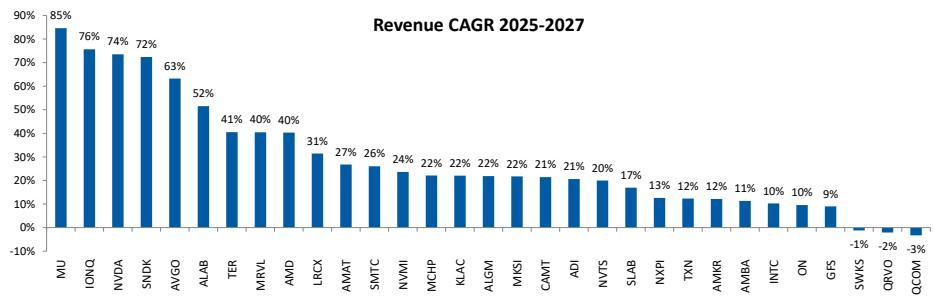

bar

Revenue CAGR 2025-2027
| Company | Revenue CAGR (%) |
| :--- | :--- |
| MU | 85 |
| IONQ | 76 |
| NVDA | 74 |
| SNDK | 72 |
| AVGO | 63 |
| ALAB | 52 |
| TER | 41 |
| MRVL | 40 |
| AMD | 40 |
| LRCX | 31 |
| AMAT | 27 |
| SMTC | 26 |
| NVMI | 24 |
| MCHP | 22 |
| KLAC | 22 |
| ALGM | 22 |
| MKSI | 22 |
| CAMT | 21 |
| ADI | 21 |
| NVTS | 20 |
| SLAB | 17 |
| NXPI | 13 |
| TXN | 12 |
| AMKR | 12 |
| AMBA | 11 |
| INTC | 10 |
| ON | 10 |
| GFS | 9 |
| SWKS | -1 |
| QRVO | -2 |
| QCOM | -3 |

Source: FactSet, MS estimates

Exhibit 9: 2025-27e EPS CAGR   
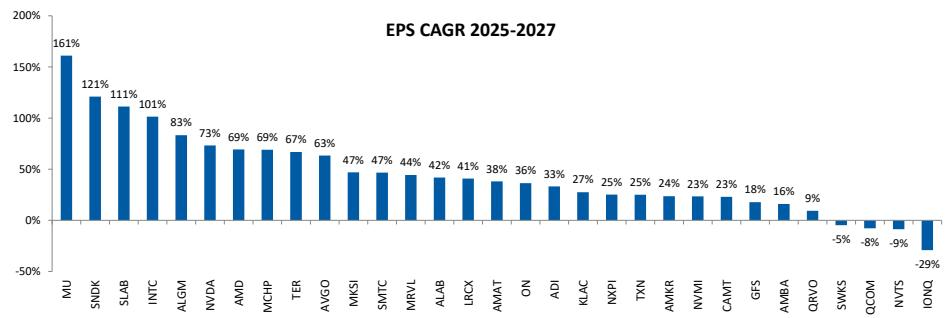

bar

EPS CAGR 2025-2027
| Company | EPS CAGR (%) |
|---|---|
| MU | 161 |
| SNDK | 121 |
| SLAB | 111 |
| INTC | 101 |
| ALGM | 83 |
| NVDA | 73 |
| AMD | 69 |
| MCHP | 69 |
| TER | 67 |
| AVGO | 63 |
| MKSI | 47 |
| SMTC | 47 |
| MRVL | 44 |
| ALAB | 42 |
| LRCX | 41 |
| AMAT | 38 |
| ON | 36 |
| ADI | 33 |
| KLAC | 27 |
| NXPI | 25 |
| TXN | 25 |
| AMKR | 24 |
| NVMI | 23 |
| CAMT | 23 |
| GFS | 18 |
| AMBA | 16 |
| QRVO | 9 |
| SWKS | -5 |
| QCOM | -8 |
| NVTS | -9 |
| IONQ | -29 |

Source: FactSet, MS estimates

# Inventory

Exhibit 10: Semiconductor Company inventory is at 111 days, up 3 days q/q which is 4 days behind of the seasonal decrease of 1 days. DOI is 22 days above the historical median and trailing 4-quarters slightly increased..

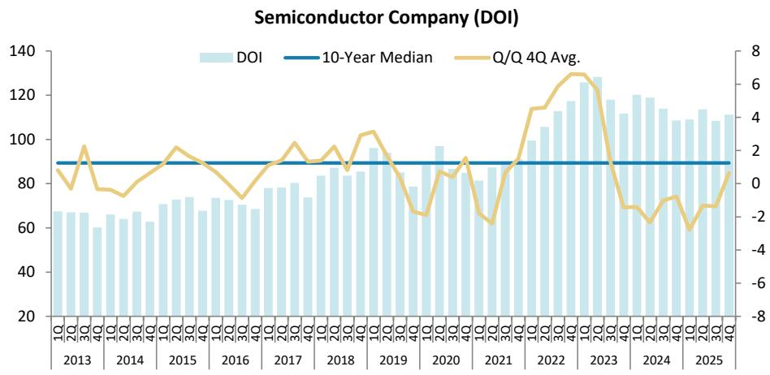

bar_line

Semiconductor Company (DOI)
| Quarter | DOI | 10-Year Median | Q/Q 4Q Avg. |
|---|---|---|---|
| 2013 | 67 | 90 | -1 |
| 2014 | 66 | 90 | -1 |
| 2015 | 73 | 90 | 2 |
| 2016 | 72 | 90 | -1 |
| 2017 | 78 | 90 | 2 |
| 2018 | 85 | 90 | -1 |
| 2019 | 96 | 90 | 2 |
| 2020 | 87 | 90 | -1 |
| 2021 | 88 | 90 | -3 |
| 2022 | 115 | 90 | 6 |
| 2023 | 128 | 90 | -1 |
| 2024E | 118 | 90 | -3 |
| 2025E | 112 | 90 | -1 |

Source: FactSet, MS

Exhibit 11: Semi Customer DOI decreased 6 days sequentially to 52 days, below the seasonal decrease of 3 days. DOI is below the historical median and trailing 4 quarters increased from last quarter.

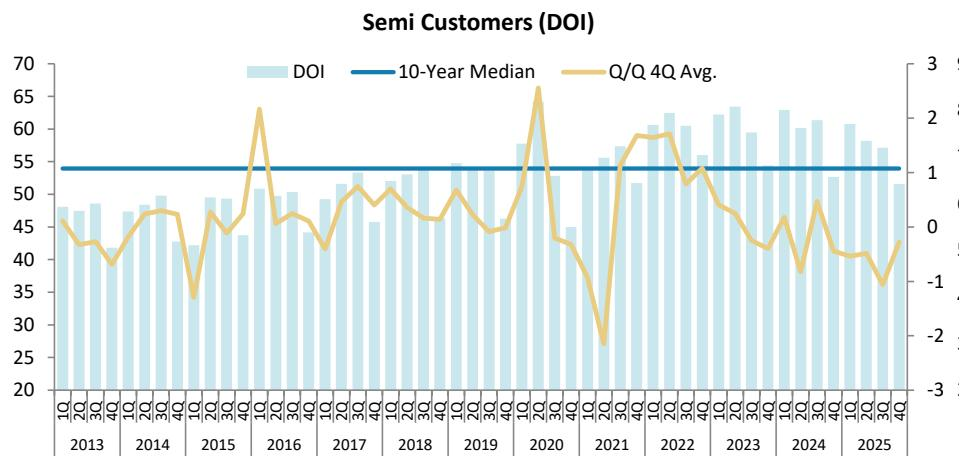

line

| Year | DOI | 10-Year Median | Q/Q 4Q Avg. |
|------|-----|----------------|-------------|
| 2013 | 48  | 54             | 0           |
| 2014 | 49  | 54             | 0           |
| 2015 | 47  | 54             | 0           |
| 2016 | 50  | 54             | 0           |
| 2017 | 53  | 54             | 0           |
| 2018 | 54  | 54             | 0           |
| 2019 | 55  | 54             | 0           |
| 2020 | 58  | 54             | 0           |
| 2021 | 56  | 54             | -2          |
| 2022 | 60  | 54             | 0           |
| 2023 | 63  | 54             | -1          |
| 2024 | 61  | 54             | -1          |
| 2025 | 58  | 54             | -1          |

Source: FactSet, MS

Exhibit 12: Distributor inventory is at 63 days, down 2 days q/q, below the seasonal decline of 0 days. DOI is 9 days above the historical median while trailing 4-quarters decreased sequentially.   
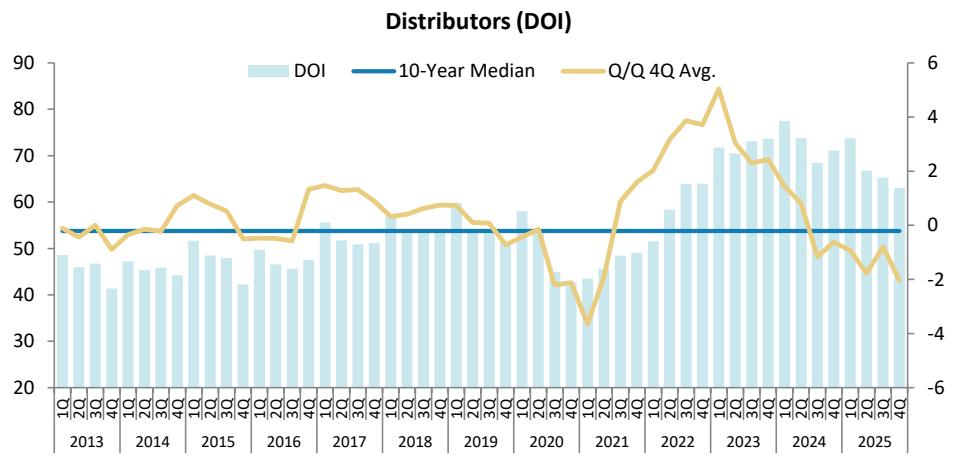

bar_line

Distributors (DOI)
| Year | DOI | 10-Year Median | Q/Q 4Q Avg. |
|---|---|---|---|
| 2013 | 48 | 0.0 | 0.0 |
| 2014 | 46 | 0.0 | 0.0 |
| 2015 | 51 | 0.0 | 0.0 |
| 2016 | 50 | 0.0 | 0.0 |
| 2017 | 55 | 0.0 | 0.0 |
| 2018 | 54 | 0.0 | 0.0 |
| 2019 | 52 | 0.0 | 0.0 |
| 2020 | 58 | 0.0 | -1.0 |
| 2021 | 43 | 0.0 | -3.0 |
| 2022 | 64 | 0.0 | 4.0 |
| 2023 | 72 | 0.0 | 5.5 |
| 2024 | 78 | 0.0 | -1.5 |
| 2025 | 66 | 0.0 | -2.5 |

Source: FactSet, MS

# Short Interest

Exhibit 13: Short Interest as % of Float 

<table><tr><td></td><td>29/May/25</td><td>27/Feb/26</td><td>29/Mar/26</td><td>29/Apr/26</td><td>29/May/26</td></tr><tr><td>ADI</td><td>1.6%</td><td>1.8%</td><td>1.7%</td><td>2.0%</td><td>1.9%</td></tr><tr><td>AEVA</td><td>5.0%</td><td>16.2%</td><td>15.0%</td><td>13.3%</td><td>12.5%</td></tr><tr><td>ALAB</td><td>6.3%</td><td>6.2%</td><td>6.3%</td><td>9.0%</td><td>7.2%</td></tr><tr><td>ALGM</td><td>8.9%</td><td>6.6%</td><td>5.5%</td><td>6.4%</td><td>5.6%</td></tr><tr><td>AMAT</td><td>2.1%</td><td>1.7%</td><td>1.7%</td><td>1.6%</td><td>2.3%</td></tr><tr><td>AMBA</td><td>3.1%</td><td>5.2%</td><td>4.5%</td><td>4.8%</td><td>5.5%</td></tr><tr><td>AMD</td><td>2.5%</td><td>2.1%</td><td>2.1%</td><td>2.2%</td><td>2.7%</td></tr><tr><td>AMKR</td><td>2.8%</td><td>3.4%</td><td>3.4%</td><td>3.5%</td><td>3.0%</td></tr><tr><td>AVGO</td><td>1.0%</td><td>1.1%</td><td>1.0%</td><td>1.1%</td><td>1.1%</td></tr><tr><td>CAMT</td><td>7.9%</td><td>7.4%</td><td>6.8%</td><td>7.6%</td><td>6.4%</td></tr><tr><td>GFS</td><td>1.6%</td><td>2.1%</td><td>1.9%</td><td>3.1%</td><td>1.7%</td></tr><tr><td>INTC</td><td>2.4%</td><td>2.2%</td><td>2.4%</td><td>2.4%</td><td>2.8%</td></tr><tr><td>IONQ</td><td>11.8%</td><td>21.2%</td><td>23.0%</td><td>21.7%</td><td>19.6%</td></tr><tr><td>KLAC</td><td>1.9%</td><td>2.0%</td><td>2.3%</td><td>2.4%</td><td>2.6%</td></tr><tr><td>LRCX</td><td>1.9%</td><td>2.4%</td><td>2.1%</td><td>2.2%</td><td>2.6%</td></tr><tr><td>MCHP</td><td>6.1%</td><td>4.8%</td><td>4.0%</td><td>5.1%</td><td>5.4%</td></tr><tr><td>MKSI</td><td>6.1%</td><td>4.4%</td><td>5.7%</td><td>5.5%</td><td>6.4%</td></tr><tr><td>MRVL</td><td>3.2%</td><td>3.9%</td><td>3.7%</td><td>3.2%</td><td>3.7%</td></tr><tr><td>MU</td><td>2.6%</td><td>2.7%</td><td>2.6%</td><td>2.8%</td><td>3.1%</td></tr><tr><td>NVDA</td><td>1.0%</td><td>1.1%</td><td>1.0%</td><td>1.2%</td><td>1.2%</td></tr><tr><td>NVMI</td><td>5.1%</td><td>4.0%</td><td>4.2%</td><td>5.2%</td><td>5.4%</td></tr><tr><td>NVTS</td><td>10.5%</td><td>17.3%</td><td>18.8%</td><td>18.6%</td><td>16.5%</td></tr><tr><td>NXPI</td><td>2.3%</td><td>3.3%</td><td>3.6%</td><td>3.2%</td><td>3.1%</td></tr><tr><td>ON</td><td>6.9%</td><td>8.7%</td><td>8.2%</td><td>7.8%</td><td>9.0%</td></tr><tr><td>QCOM</td><td>1.7%</td><td>3.2%</td><td>3.6%</td><td>4.1%</td><td>4.8%</td></tr><tr><td>QRVO</td><td>7.0%</td><td>5.1%</td><td>7.6%</td><td>7.1%</td><td>7.1%</td></tr><tr><td>SLAB</td><td>5.4%</td><td>5.8%</td><td>5.1%</td><td>4.6%</td><td>7.2%</td></tr><tr><td>SMTC</td><td>7.1%</td><td>5.6%</td><td>5.0%</td><td>5.8%</td><td>5.8%</td></tr><tr><td>SNDK</td><td>4.6%</td><td>5.0%</td><td>5.8%</td><td>5.4%</td><td>6.2%</td></tr><tr><td>SWKS</td><td>12.0%</td><td>12.3%</td><td>14.3%</td><td>13.3%</td><td>16.3%</td></tr><tr><td>TER</td><td>4.6%</td><td>2.9%</td><td>2.9%</td><td>3.1%</td><td>3.9%</td></tr><tr><td>TXN</td><td>2.2%</td><td>2.5%</td><td>2.1%</td><td>2.0%</td><td>2.0%</td></tr><tr><td>AVERAGE</td><td>4.8%</td><td>5.5%</td><td>5.6%</td><td>5.7%</td><td>5.8%</td></tr><tr><td>MEDIAN</td><td>4.6%</td><td>4.0%</td><td>4.0%</td><td>4.6%</td><td>5.4%</td></tr></table>

Source: FactSet, MS

# Risk Reward Reference links

1. View explanation of Options Probabilities methodology - Options\_Probabilities\_Exhibit\_Link.pdf   
2. View descriptions of Risk Rewards Themes - RR\_Themes\_Exhibit\_Link.pdf   
3. View explanation of regional hierarchies - GEG\_Exhibit\_Link.pdf   
4. View explanation of Theme/Exposure methodology - ESG\_Sustainable\_Solutions\_External\_Link.pdf   
5. View explanation of HERS methodology - ESG\_HERS\_External\_Link.pdf

# Disclosure Section

The information and opinions in MS were prepared by MS & Co. LLC, and/or MS C.T.V.M. S.A., and/or MS Mexico, Casa de Bolsa, S.A. de C.V., and/or MS Canada Limited. As used in this disclosure section, "MS" includes MS & Co. LLC, MS C.T.V.M. S.A., MS Mexico, Casa de Bolsa, S.A. de C.V., MS Canada Limited and their affiliates as necessary.

For important disclosures, stock price charts and equity rating histories regarding companies that are the subject of this report, please see the MS Disclosure Website at www.morganstanley.com/eqr/disclosures/webapp/generalresearch, or contact your investment representative or MS at 1585 Broadway, (Attention: Research Management), New York, NY, 10036 USA.

For valuation methodology and risks associated with any recommendation, rating or price target referenced in this research report, please contact the Client Support Team as follows: US/Canada +1 800 303-2495; Hong Kong +852 2848-5999; Latin America +1 718 754-5444 (U.S.); London +44 (0)20-7425-8169; Singapore +65 6834-6860; Sydney +61 (0)2-9770-1505; Tokyo +81 (0)3-6836-9000. Alternatively you may contact your investment representative or MS at 1585 Broadway, (Attention: Research Management), New York, NY 10036 USA.

# Analyst Certification

The following analysts hereby certify that their views about the companies and their securities discussed in this report are accurately expressed and that they have not received and will not receive direct or indirect compensation in exchange for expressing specific recommendations or views in this report: Shane Brett; Nicole Kozhukhov; Joseph Moore; Ella Tulchinsky; Mason Wayne.

# Global Research Conflict Management Policy

MS has been published in accordance with our conflict management policy, which is available at www.morganstanley.com/institutional/research/conflictpolicies. A Portuguese version of the policy can be found at www.morganstanley.com.br

# Important Regulatory Disclosures on Subject Companies

As of April 30, 2026, MS beneficially owned 1% or more of a class of common equity securities of the following companies covered in MS: Advanced Micro Devices, Aeva Technologies Inc, Allegro Microsystems Inc, Ambarella Inc, Analog Devices Inc., Arm Holdings plc, Astera Labs Inc, Broadcom Inc., Cadence Design Systems Inc, Intel Corporation, IonQ Inc, Marvell Technology Group Ltd, Microchip Technology Inc., Micron Technology Inc., NVIDIA Corp., NXP Semiconductor NV, ON Semiconductor Corp., Qualcomm Inc., SanDisk Corporation., Semtech Corp., Silicon Laboratories Inc., Skyworks Solutions Inc, Synopsys Inc., Texas Instruments, Wolfspeed, INC.

Within the last 12 months, MS managed or co-managed a public offering (or 144A offering) of securities of Analog Devices Inc., Broadcom Inc., GlobalFoundries Inc, Intel Corporation, NXP Semiconductor NV, ON Semiconductor Corp., Semtech Corp..

Within the last 12 months, MS has received compensation for investment banking services from Advanced Micro Devices, Aeva Technologies Inc, Allegro Microsystems Inc, Amkor Technology Inc, Analog Devices Inc., Broadcom Inc., Intel Corporation, IonQ Inc, Micron Technology Inc., NXP Semiconductor NV, ON Semiconductor Corp., Semtech Corp., Texas Instruments. In the next 3 months, MS expects to receive or intends to seek compensation for investment banking services from Advanced Micro Devices, Aeva Technologies Inc, Allegro Microsystems Inc, Ambarella Inc, Amkor Technology Inc, Analog Devices Inc., Arm Holdings plc, Astera Labs Inc, Broadcom Inc., Cadence Design Systems Inc, GlobalFoundries Inc, Intel Corporation, IonQ Inc, Marvell Technology Group Ltd, Microchip Technology Inc., Micron Technology Inc., Navitas Semiconductor Corp, NVIDIA Corp., NXP Semiconductor NV, ON Semiconductor Corp., Qualcomm Inc., SanDisk Corporation., Semtech Corp., Silicon Laboratories Inc., Skyworks Solutions Inc, Synopsys Inc., Texas Instruments, Wolfspeed, INC.

Within the last 12 months, MS has received compensation for products and services other than investment banking services from Advanced Micro Devices, Ambarella Inc, Amkor Technology Inc, Analog Devices Inc., Broadcom Inc., Cadence Design Systems Inc, GlobalFoundries Inc, Intel Corporation, Marvell Technology Group Ltd, Microchip Technology Inc., Micron Technology Inc., NVIDIA Corp., NXP Semiconductor NV, ON Semiconductor Corp., Qualcomm Inc., Silicon Laboratories Inc., Synopsys Inc., Texas Instruments.

Within the last 12 months, MS has provided or is providing investment banking services to, or has an investment banking client relationship with, the following company: Advanced Micro Devices, Aeva Technologies Inc, Allegro Microsystems Inc, Ambarella Inc, Amkor Technology Inc, Analog Devices Inc., Arm Holdings plc, Astera Labs Inc, Broadcom Inc., Cadence Design Systems Inc, GlobalFoundries Inc, Intel Corporation, IonQ Inc, Marvell Technology Group Ltd, Microchip Technology Inc., Micron Technology Inc., Navitas Semiconductor Corp, NVIDIA Corp., NXP Semiconductor NV, ON Semiconductor Corp., Qualcomm Inc., SanDisk Corporation., Semtech Corp., Silicon Laboratories Inc., Skyworks Solutions Inc, Synopsys Inc., Texas Instruments, Wolfspeed, INC.

Within the last 12 months, MS has either provided or is providing non-investment banking, securities-related services to and/or in the past has entered into an agreement to provide services or has a client relationship with the following company: Advanced Micro Devices, Ambarella Inc, Amkor Technology Inc, Analog Devices Inc., Broadcom Inc., Cadence Design Systems Inc, GlobalFoundries Inc, Intel Corporation, IonQ Inc, Marvell Technology Group Ltd, Microchip Technology Inc., Micron Technology Inc., NVIDIA Corp., NXP Semiconductor NV, ON Semiconductor Corp., Qualcomm Inc., Semtech Corp., Silicon Laboratories Inc., Synopsys Inc., Texas Instruments, Wolfspeed, INC.

MS & Co. LLC makes a market in the securities of Aeva Technologies Inc, Ambarella Inc, Silicon Laboratories Inc..

The equity research analysts or strategists principally responsible for the preparation of MS have received compensation based upon various factors, including quality of research, investor client feedback, stock picking, competitive factors, firm revenues and overall investment banking revenues. Equity Research analysts' or strategists' compensation is not linked to investment banking or capital markets transactions performed by MS or the profitability or revenues of particular trading desks.

MS and its affiliates do business that relates to companies/instruments covered in MS, including market making, providing liquidity, fund management, commercial banking, extension of credit, investment services and investment banking. MS sells to and buys from customers the securities/instruments of companies covered in MS on a principal basis. MS may have a position in the debt of the Company or instruments discussed in this report. MS trades or may trade as principal in the debt securities (or in related derivatives) that are the subject of the debt research report.

Certain disclosures listed above are also for compliance with applicable regulations in non-US jurisdictions.

# STOCK RATINGS

MS uses a relative rating system using terms such as Overweight, Equal-weight, Not-Rated or Underweight (see definitions below). MS does not assign ratings of Buy, Hold or Sell to the stocks we cover. Overweight, Equal-weight, Not-Rated and Underweight are not the equivalent of buy, hold and sell. Investors should carefully read the definitions of all ratings used in MS. In addition, since MS contains more complete information concerning the analyst's views, investors should carefully read MS, in its entirety, and not infer the contents from the rating alone. In any case, ratings (or research) should not be used or relied upon as investment advice. An investor's decision to buy or sell a stock should depend on individual circumstances (such as the investor's existing holdings) and other considerations.

# Global Stock Ratings Distribution

(as of April 30, 2026)

The Stock Ratings described below apply to MS's Fundamental Equity Research and do not apply to Debt Research produced by the Firm.

For disclosure purposes only (in accordance with FINRA requirements), we include the category headings of Buy, Hold, and Sell alongside our ratings of Overweight, Equal-weight, Not-Rated and Underweight. MS does not assign ratings of Buy, Hold or Sell to the stocks we cover. Overweight, Equal-weight, Not-Rated and Underweight are not the equivalent of buy, hold, and sell but represent recommended relative weightings (see definitions below). To satisfy regulatory requirements, we correspond Overweight, our most positive stock rating, with a buy recommendation; we correspond Equal-weight and Not-Rated to hold and Underweight to sell recommendations, respectively.

<table><tr><td></td><td colspan="2">Coverage Universe</td><td colspan="3">Investment Banking Clients (IBC)</td><td colspan="2">Other Material Investment ServicesClients (MISC)</td></tr><tr><td>Stock RatingCategory</td><td>Count</td><td>% of Total</td><td>Count</td><td>% of Total IBC</td><td>% of RatingCategory</td><td>Count</td><td>% of Total OtherMISC</td></tr><tr><td>Overweight/Buy</td><td>1546</td><td>42%</td><td>467</td><td>51%</td><td>30%</td><td>709</td><td>44%</td></tr><tr><td>Equal-weight/Hold</td><td>1568</td><td>43%</td><td>358</td><td>39%</td><td>23%</td><td>715</td><td>44%</td></tr><tr><td>Not-Rated/Hold</td><td>4</td><td>0%</td><td>0</td><td>0%</td><td>0%</td><td>1</td><td>0%</td></tr><tr><td>Underweight/Sell</td><td>555</td><td>15%</td><td>84</td><td>9%</td><td>15%</td><td>202</td><td>12%</td></tr><tr><td>Total</td><td>3,673</td><td></td><td>909</td><td></td><td></td><td>1627</td><td></td></tr></table>

Data include common stock and ADRs currently assigned ratings. Investment Banking Clients are companies from whom MS received investment banking compensation in the last 12 months. Due to rounding off of decimals, the percentages provided in the "% of total" column may not add up to exactly 100 percent.

# Analyst Stock Ratings

Overweight (O). The stock's total return is expected to exceed the average total return of the analyst's industry (or industry team's) coverage universe, on a risk-adjusted basis, over the next 12-18 months.

Equal-weight (E). The stock's total return is expected to be in line with the average total return of the analyst's industry (or industry team's) coverage universe, on a risk-adjusted basis, over the next 12-18 months.

Not-Rated (NR). Currently the analyst does not have adequate conviction about the stock's total return relative to the average total return of the analyst's industry (or industry team's) coverage universe, on a risk-adjusted basis, over the next 12-18 months.

Underweight (U). The stock's total return is expected to be below the average total return of the analyst's industry (or industry team's) coverage universe, on a risk-adjusted basis, over the next 12-18 months.

Unless otherwise specified, the time frame for price targets included in MS is 12 to 18 months.

# Analyst Industry Views

Attractive (A): The analyst expects the performance of his or her industry coverage universe over the next 12-18 months to be attractive vs. the relevant broad market benchmark, as indicated below.

In-Line (I): The analyst expects the performance of his or her industry coverage universe over the next 12-18 months to be in line with the relevant broad market benchmark, as indicated below. Cautious (C): The analyst views the performance of his or her industry coverage universe over the next 12-18 months with caution vs. the relevant broad market benchmark, as indicated below. Benchmarks for each region are as follows: North America - S&P 500; Latin America - relevant MSCI country index or MSCI Latin America Index; Europe - MSCI Europe; Japan - TOPIX; Asia - relevant MSCI country index or MSCI sub-regional index or MSCI AC Asia Pacific ex Japan Index.

Stock Price, Price Target and Rating History (See Rating Definitions)

Broadcom Inc. (AVGO.0) - As of 05/31/26 GMT in USD
Industry : Semiconductors   
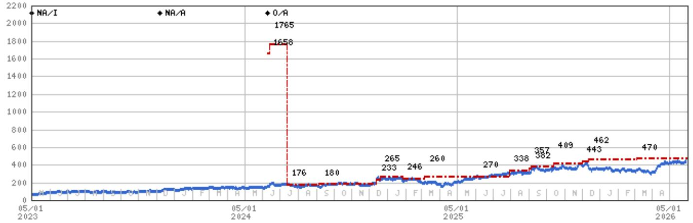

line

| Date       | Value |
| ---------- | ----- |
| 05/01 2023 | NA/I  |
| 05/01 2024 | 1765  |
| 05/01 2024 | 1658  |
| 05/01 2024 | 176   |
| 05/01 2024 | 180   |
| 05/01 2024 | 233   |
| 05/01 2024 | 265   |
| 05/01 2024 | 246   |
| 05/01 2024 | 260   |
| 05/01 2024 | 270   |
| 05/01 2024 | 338   |
| 05/01 2024 | 357   |
| 05/01 2024 | 382   |
| 05/01 2024 | 409   |
| 05/01 2024 | 443   |
| 05/01 2024 | 462   |
| 05/01 2024 | 470   |

Stock Rating History: 6/1/21 : 0/I; 5/26/22 : NA/I; 10/10/22 : NA/I; 11/7/22 : NA/I; 12/7/23 : NA/A; 6/9/24 : 0/A   
Price Target History: 3/5/21 : 538; 6/4/21 : 555; 9/2/21 : 572; 12/10/21 : 723; 3/3/22 : 703; 5/26/22 : NA; 10/10/22 : NA;   
11/7/22 : NA; 6/9/24 : 1658; 6/12/24 : 1765; 7/12/24 : 176; 9/5/24 : 180; 12/13/24 : 233; 12/19/24 : 265; 1/27/25 : 246;   
3/6/25 : 260; 6/6/25 : 270; 7/29/25 : 338; 9/1/25 : 357; 9/4/25 : 382; 10/13/25 : 409; 12/1/25 : 443; 12/12/25 : 462; 3/5/26 : 470   
Source: MS Date Format : MM/DD/YY Price Target = No Price Target Assigned (NA)   
Stock Price (Not Covered by Current Analyst) — Stock Price (Covered by Current Analyst)   
Stock and Industry Ratings (abbreviations below) appear as ♦ Stock Rating/Industry View   
Stock Ratings: Overweight (O) Equal-weight (E) Underweight (U) Not-Rated (NR) No Rating Available (NA)   
Industry View: Attractive (A) In-line (I) Cautious (C) No Rating (NR)   
Effective January 13, 2014, the stocks covered by MS Asia Pacific will be rated relative to the analyst's industry (or industry team's) coverage.   
Effective January 13, 2014, the industry view benchmarks for MS Asia Pacific are as follows: relevant MSCI country index or MSCI sub-regional index or MSCI AC Asia Pacific ex Japan Index.

# Important Disclosures for MS Smith Barney LLC Customers

Important disclosures regarding any material conflict of interest that can reasonably be expected to have influenced MS Smith Barney LLC's choice of a third-party research provider or the subject company of a third-party research report, are available on the MS Wealth Management disclosure website at www.morganstanley.com/online/researchdisclosures. For MS specific disclosures, you may refer to https://www.morganstanley.com/eqr/disclosures/webapp/generalresearch.

Each MS report is reviewed and approved on behalf of MS Smith Barney LLC. This review and approval is conducted by the same person who reviews the research report on behalf of MS. This could create a conflict of interest.

# Other Important Disclosures

A member of Research who had or could have had access to the research prior to completion owns securities (or related derivatives) in the Micron Technology Inc., NVIDIA Corp.. This person is not a research analyst or a member of research analyst's household.

MS policy is to update research reports as and when the Research Analyst and Research Management deem appropriate, based on developments with the issuer, the sector, or the market that may have a material impact on the research views or opinions stated therein. In addition, certain Research publications are intended to be updated on a regular periodic basis (weekly/monthly/quarterly/annual) and will ordinarily be updated with that frequency, unless the Research Analyst and Research Management determine that a different publication schedule is appropriate based on current conditions.

MS is not acting as a municipal advisor and the opinions or views contained herein are not intended to be, and do not constitute, advice within the meaning of Section 975 of the Dodd-Frank Wall Street Reform and Consumer Protection Act.

MS produces an equity research product called a "Tactical Idea." Views contained in a "Tactical Idea" on a particular stock may be contrary to the recommendations or views expressed in research on the same stock. This may be the result of differing time horizons, methodologies, market events, or other factors. For all research available on a particular stock, please contact your sales representative or go to Matrix at http://www.morganstanley.com/matrix.

MS is provided to our clients through our proprietary research portal on Matrix and also distributed electronically by MS to clients. Certain, but not all, MS products are also made available to clients through third-party vendors or redistributed to clients through alternate electronic means as a convenience. For access to all available MS, please contact your sales representative or go to Matrix at http://www.morganstanley.com/matrix.

Any access and/or use of MS is subject to MS's Terms of Use (http://www.morganstanley.com/terms.html). By accessing and/or using MS, you are indicating that you have read and agree to be bound by our Terms of Use (http://www.morganstanley.com/terms.html). In addition you consent to MS processing your personal data and using cookies in accordance with our Privacy Policy and our Global Cookies Policy (http://www.morganstanley.com/privacy\_pledge.html), including for the purposes of setting your preferences and to collect readership data so that we can deliver better and more personalized service and products to you. To find out more information about how MS processes personal data, how we use cookies and how to reject cookies see our Privacy Policy and our Global Cookies Policy (http://www.morganstanley.com/privacy\_pledge.html). Please use the provided link to review the Terms and Conditions and Most Important Terms and Conditions for MS India Company Private Limited (https://www.morganstanley.com/assets/pdfs/about-us-global-offices/india/Terms\_and\_conditions.pdf) and the following link to review the audit report (https://ny.matrix.ms.com/eqr/research/webapp/researchdocs/MSICPL\_Morgan\_Stanley\_Research\_Audit\_Report.pdf).

If you do not agree to our Terms of Use and/or if you do not wish to provide your consent to MS processing your personal data or using cookies please do not access our research. MS does not provide individually tailored investment advice. MS has been prepared without regard to the circumstances and objectives of those who receive it. MS recommends that investors independently evaluate particular investments and strategies, and encourages investors to seek the advice of a financial adviser. The appropriateness of an investment or strategy will depend on an investor's circumstances and objectives. The securities, instruments, or strategies discussed in MS may not be suitable for all investors, and certain investors may not be eligible to purchase or participate in some or all of them. MS is not an offer to buy or sell or the solicitation of an offer to buy or sell any security/instrument or to participate in any particular trading strategy. The value of and income from your investments may vary because of changes in interest rates, foreign exchange rates, default rates, prepayment rates, securities/instruments prices, market indexes, operational or financial conditions of companies or other factors. There may be time limitations on the exercise of options or other rights in securities/instruments transactions. Past performance is not necessarily a guide to future performance. Estimates of future performance are based on assumptions that may not be realized. If provided, and unless otherwise stated, the closing price on the cover page is that of the primary exchange for the subject company's securities/instruments.

The fixed income research analysts, strategists or economists principally responsible for the preparation of MS have received compensation based upon various factors, including quality, accuracy and value of research, firm profitability or revenues (which include fixed income trading and capital markets profitability or revenues), client feedback and competitive factors. Fixed Income Research analysts', strategists' or economists' compensation is not linked to investment banking or capital markets transactions performed by MS or the profitability or revenues of particular trading desks.

The "Important Regulatory Disclosures on Subject Companies" section in MS lists all companies mentioned where MS owns 1% or more of a class of common equity securities of the companies. For all other companies mentioned in MS, MS may have an investment of less than 1% in securities/instruments or derivatives of securities/instruments of companies and may trade them in ways different from those discussed in MS. Employees of MS not involved in the preparation of MS may have investments in securities/instruments or derivatives of securities/instruments of companies mentioned and may trade them in ways different from those discussed in MS. Derivatives may be issued by MS or associated persons.

With the exception of information regarding MS, MS is based on public information. MS makes every effort to use reliable, comprehensive information, but we make no representation that it is accurate or complete. We have no obligation to tell you when opinions or information in MS change apart from when we intend to discontinue equity research coverage of a subject company. Facts and views presented in MS have not been reviewed by, and may not reflect information known to, professionals in other MS business areas, including investment banking personnel.

MS personnel may participate in company events such as site visits and are generally prohibited from accepting payment by the company of associated expenses unless pre-approved by authorized members of Research management.

MS may make investment decisions that are inconsistent with the recommendations or views in this report.

To our readers based in Taiwan or trading in Taiwan securities/instruments: Information on securities/instruments that trade in Taiwan is distributed by MS Taiwan Limited ("MSTL"). Such information is for your reference only. The reader should independently evaluate the investment risks and is solely responsible for their investment decisions. MS may not be distributed to the public media or quoted or used by the public media without the express written consent of MS. Any non-customer reader within the scope of Article 7-1 of the Taiwan Stock Exchange Recommendation Regulations accessing and/or receiving MS is not permitted to provide MS to any third party (including but not limited to related parties, affiliated companies and any other third parties) or engage in any activities regarding MS which may create or give the appearance of creating a conflict of interest. Information on securities/instruments that do not trade in Taiwan is for informational purposes only and is not to be construed as a recommendation or a solicitation to trade in such securities/instruments. MSTL may not execute transactions for clients in these securities/instruments.

MS is not incorporated under PRC law and the research in relation to this report is conducted outside the PRC. MS does not constitute an offer to sell or the solicitation of an offer to buy any securities in the PRC. PRC investors shall have the relevant qualifications to invest in such securities and shall be responsible for obtaining all relevant approvals, licenses, verifications and/or registrations from the relevant governmental authorities themselves. Neither this report nor any part of it is intended as, or shall constitute, provision of any consultancy or advisory service of securities investment as defined under PRC law. Such information is provided for your reference only.

MS is disseminated in Brazil by MS C.T.V.M. S.A. located at Av. Brigadeiro Faria Lima, 3600, 6th floor, São Paulo - SP, Brazil; and is regulated by the Comissão de Valores Mobiliários; in Mexico by MS México, Casa de Bolsa, S.A. de C.V which is regulated by Comision Nacional Bancaria y de Valores. Paseo de los Tamarindos 90, Torre 1, Col. Bosques de las Lomas Floor 29, 05120 Mexico City; in Japan by MS MUFG Securities Co., Ltd. and, for Commodities related research reports only, MS Capital Group Japan Co., Ltd; in Hong Kong by MS Asia Limited (which accepts responsibility for its contents) and by MS Bank Asia Limited; in Singapore by MS Asia (Singapore) Pte. (Registration number 199206298Z) and/or MS Asia (Singapore) Securities Pte Ltd (Registration number 200008434H), regulated by the Monetary Authority of Singapore (which accepts legal responsibility for its contents and should be contacted with respect to any matters arising from, or in connection with, MS) and by MS Bank Asia Limited, Singapore Branch (Registration number T14FC0118J); in Australia to "wholesale clients" within the meaning of the Australian Corporations Act by MS Australia Limited A.B.N. 67 003 734 576, holder of Australian financial services license No. 233742, which accepts responsibility for its contents; in Australia to "wholesale clients" and "retail clients" within the meaning of the Australian Corporations Act by MS Wealth Management Australia Pty Ltd (A.B.N. 19 009 145 555, holder of Australian financial services license No. 240813, which accepts responsibility for its contents; in Korea by MS & Co International plc, Seoul Branch; in India by MS India Company Private Limited having Corporate Identification No (CIN) U22990MH1998PTC115305, regulated by the Securities and Exchange Board of India ("SEBI") and holder of licenses as a Research Analyst (SEBI Registration No. INH000001105); Stock Broker (SEBI Stock Broker Registration No. INZ000244438), Merchant Banker (SEBI Registration No. INM000011203), and depository participant with National Securities Depository Limited (SEBI Registration No. IN-DP-NSDL-567-2021) having registered office at Altimus, Level 39 & 40, Pandurang Budhkar Marg, Worli, Mumbai 400018, India; Telephone no. +91-22-61181000; Compliance Officer Details: Mr. Tejarshi Hardas, Tel. No.: +91-22-61181000 or Email: tejarshi.hardas@morganstanley.com; Grievance officer details: Mr. Tejarshi Hardas, Tel. No.: +91-22-61181000 or Email: msic-compliance@morganstanley.com. MS India Company Private Limited (MSICPL) may use AI tools in providing research services. All recommendations contained herein are made by the duly qualified research analysts; in Canada by MS Canada Limited; in Germany and the European Economic Area where required by MS Europe S.E., authorised and regulated by Bundesanstalt fuer Finanzdienstleistungsaufsicht (BaFin) under the reference number 149169; in the US by MS & Co. LLC, which accepts responsibility for its contents. MS & Co. International plc, authorized by the Prudential Regulation Authority and regulated by the Financial Conduct Authority and the Prudential Regulation Authority, disseminates in the UK research that it has prepared, and research which has been prepared by any of its affiliates, only to persons who (i) are investment professionals falling within Article 19(5) of the Financial Services and Markets Act 2000 (Financial Promotion) Order 2005 (as amended, the "Order"); (ii) are persons who are high net worth entities falling within Article 49(2)(a) to (d) of the Order; or (iii) are persons to whom an invitation or inducement to engage in investment activity (within the meaning of section 21 of the Financial Services and Markets Act 2000, as amended) may otherwise lawfully be communicated or caused to be communicated. RMB MS Proprietary Limited is a member of the JSE Limited and A2X (Pty) Ltd. RMB MS Proprietary Limited is a joint venture owned equally by MS International Holdings Inc. and RMB Investment Advisory (Proprietary) Limited, which is wholly owned by FirstRand Limited. The information in MS is being disseminated by MS Saudi Arabia, regulated by the Capital

Market Authority in the Kingdom of Saudi Arabia, and is directed at Sophisticated investors only.

The information in MS is being communicated by MS & Co. International plc (DIFC Branch), regulated by the Dubai Financial Services Authority (the DFSA) or by MS & Co. International plc (ADGM Branch), regulated by the Financial Services Regulatory Authority Abu Dhabi (the FSRA), and is directed at Professional Clients only, as defined by the DFSA or the FSRA, respectively. The financial products or financial services to which this research relates will only be made available to a customer who we are satisfied meets the regulatory criteria of a Professional Client. A distribution of the different MS Research ratings or recommendations, in percentage terms for Investments in each sector covered, is available upon request from your sales representative.

The information in MS is being communicated by MS & Co. International plc (QFC Branch), regulated by the Qatar Financial Centre Regulatory Authority (the QFCRA), and is directed at business customers and market counterparties only and is not intended for Retail Customers as defined by the QFCRA.

As required by the Capital Markets Board of Turkey, investment information, comments and recommendations stated here, are not within the scope of investment advisory activity. Investment advisory service is provided exclusively to persons based on their risk and income preferences by the authorized firms. Comments and recommendations stated here are general in nature. These opinions may not fit to your financial status, risk and return preferences. For this reason, to make an investment decision by relying solely to this information stated here may not bring about outcomes that fit your expectations.

The trademarks and service marks contained in MS are the property of their respective owners. Third-party data providers make no warranties or representations relating to the accuracy, completeness, or timeliness of the data they provide and shall not have liability for any damages relating to such data. The Global Industry Classification Standard (GICS) was developed by and is the exclusive property of MSCI and S&P.

MS, or any portion thereof may not be reprinted, sold or redistributed without the written consent of MS.

Indicators and trackers referenced in MS may not be used as, or treated as, a benchmark under Regulation EU 2016/1011, or any other similar framework.

The issuers and/or fixed income products recommended or discussed in certain fixed income research reports may not be continuously followed. Accordingly, investors should regard those fixed income research reports as providing stand-alone analysis and should not expect continuing analysis or additional reports relating to such issuers and/or individual fixed income products. MS may hold, from time to time, material financial and commercial interests regarding the company subject to the Research report.

Registration granted by SEBI and certification from the National Institute of Securities Markets (NISM) in no way guarantee performance of the intermediary or provide any assurance of returns to investors. Investment in securities market are subject to market risks. Read all the related documents carefully before investing.

Stock Ratings are subject to change. Please see latest research for each company.   
\* Historical prices are not split adjusted.   
INDUSTRY COVERAGE: Semiconductors 

<table><tr><td>COMPANY (TICKER)</td><td>RATING (AS OF)</td><td>PRICE* (05/29/2026)</td></tr><tr><td colspan="3">Joseph Moore</td></tr><tr><td>Advanced Micro Devices (AMD.O)</td><td>E (06/09/2024)</td><td>$516.10</td></tr><tr><td>Aeva Technologies Inc (AEVA.O)</td><td>E (07/19/2021)</td><td>$28.18</td></tr><tr><td>Allegro Microsystems Inc (ALGM.O)</td><td>O (02/13/2026)</td><td>$47.87</td></tr><tr><td>Ambarella Inc (AMBA.O)</td><td>O (03/29/2016)</td><td>$72.18</td></tr><tr><td>Amkor Technology Inc (AMKR.O)</td><td>E (11/08/2023)</td><td>$69.56</td></tr><tr><td>Analog Devices Inc. (ADI.O)</td><td>O (11/16/2023)</td><td>$413.85</td></tr><tr><td>Astera Labs Inc (ALAB.O)</td><td>O (05/11/2025)</td><td>$342.85</td></tr><tr><td>Broadcom Inc. (AVGO.O)</td><td>O (06/09/2024)</td><td>$446.77</td></tr><tr><td>GlobalFoundries Inc (GFS.O)</td><td>E (10/28/2024)</td><td>$79.97</td></tr><tr><td>Intel Corporation (INTC.O)</td><td>E (02/22/2023)</td><td>$114.68</td></tr><tr><td>IonQ Inc (IONQ.N)</td><td>E (04/25/2023)</td><td>$72.07</td></tr><tr><td>Marvell Technology Group Ltd (MRVL.O)</td><td>E (09/14/2015)</td><td>$205.00</td></tr><tr><td>Microchip Technology Inc. (MCHP.O)</td><td>E (07/10/2024)</td><td>$94.65</td></tr><tr><td>Micron Technology Inc. (MU.O)</td><td>O (10/06/2025)</td><td>$971.00</td></tr><tr><td>Navitas Semiconductor Corp (NVTS.O)</td><td>U (04/06/2025)</td><td>$26.60</td></tr><tr><td>NVIDIA Corp. (NVDA.O)</td><td>O (03/16/2023)</td><td>$211.14</td></tr><tr><td>NXP Semiconductor NV (NXPI.O)</td><td>O (02/11/2025)</td><td>$321.35</td></tr><tr><td>ON Semiconductor Corp. (ON.O)</td><td>E (05/11/2025)</td><td>$120.62</td></tr><tr><td>Qorvo Inc (QRVO.O)</td><td>E (10/28/2025)</td><td>$103.56</td></tr><tr><td>Qualcomm Inc. (QCOM.O)</td><td>U (02/10/2026)</td><td>$251.02</td></tr><tr><td>SanDisk Corporation. (SNDK.O)</td><td>O (03/03/2025)</td><td>$1,694.98</td></tr><tr><td>Semtech Corp. (SMTC.O)</td><td>E (04/06/2025)</td><td>$152.54</td></tr><tr><td>Silicon Laboratories Inc. (SLAB.O)</td><td>E (01/19/2021)</td><td>$217.60</td></tr><tr><td>Skyworks Solutions Inc (SWKS.O)</td><td>E (11/28/2018)</td><td>$77.85</td></tr><tr><td>Texas Instruments (TXN.O)</td><td>U (04/13/2020)</td><td>$305.68</td></tr><tr><td>Wolfspeed, INC (WOLF.N)</td><td>NR (04/06/2025)</td><td>$59.28</td></tr><tr><td colspan="3">Lee Simpson</td></tr><tr><td>Arm Holdings plc (ARM.O)</td><td>E (04/07/2026)</td><td>$353.29</td></tr><tr><td>Cadence Design Systems Inc (CDNS.O)</td><td>O (02/14/2024)</td><td>$374.93</td></tr><tr><td>Synopsys Inc. (SNPS.O)</td><td>E (02/27/2026)</td><td>$475.62</td></tr></table>

© 2026 MS