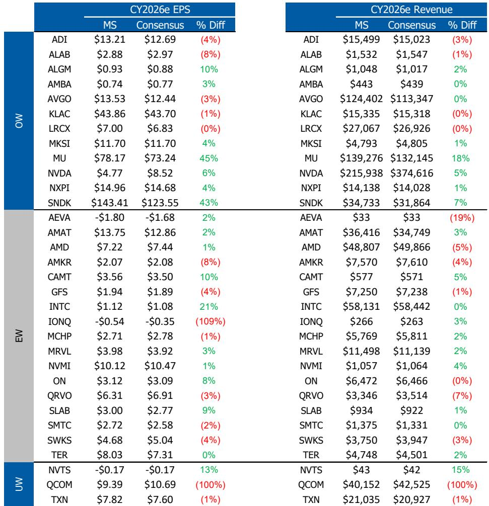
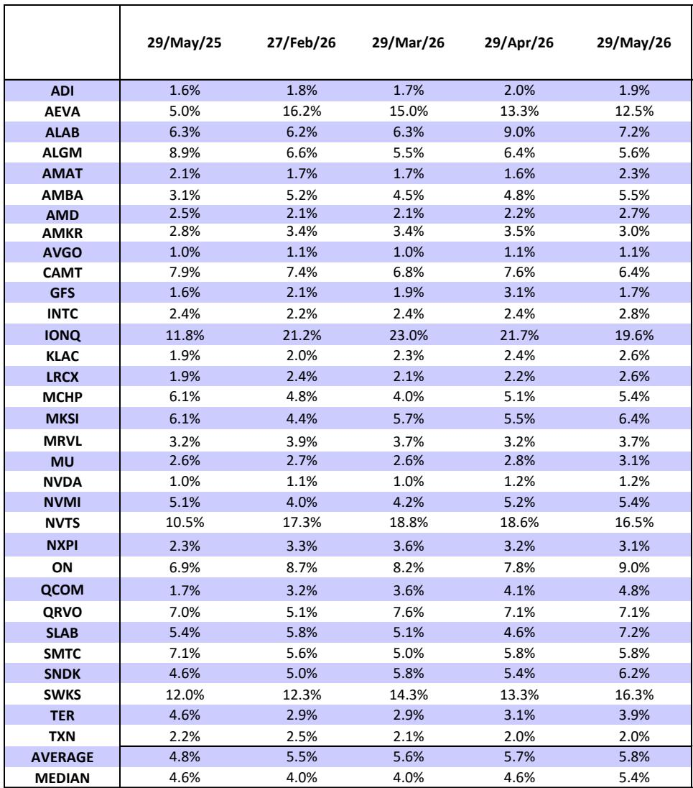
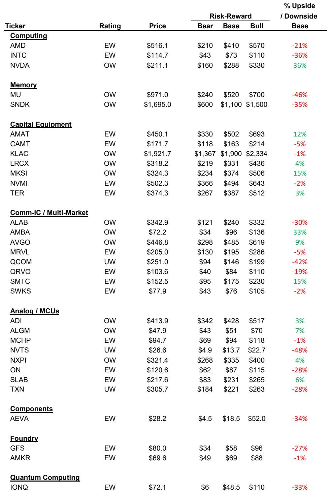

# Broadcom's AI Revenue Story Is Shifting, Not Slowing: Why 2027 Matters More Than This Quarter

The most important insight from the upcoming Broadcom earnings report is not whether the company beats estimates by a few cents. It is that the shape of AI revenue growth is changing, and investors who focus only on the immediate quarter risk missing the larger structural opportunity. Broadcom's custom silicon and networking businesses are entering a phase where demand timing matters more than demand magnitude, and where the real compounding story begins in 2027, not 2026.

A global investment bank report published ahead of Broadcom's June 3rd earnings provides the analytical framework for understanding this shift. The report raises the price target to $485, maintains an Overweight rating, and offers a nuanced view of what is happening beneath the surface of Broadcom's AI business. The central argument is that near-term AI revenue growth will be less hockey-stick shaped than previously expected, but that the underlying demand trajectory remains intact and is actually strengthening for the medium term.

This matters because Broadcom has become one of the most important infrastructure providers for the largest AI hyperscalers. The company sits at the intersection of custom ASIC design and high-speed networking, two areas that are becoming increasingly critical as frontier model developers push against compute constraints. Understanding the timing dynamics of these businesses is essential for anyone building a thesis around AI infrastructure exposure.

The report makes clear that the next few quarters will test investor patience, but that the payoff for those who maintain conviction could be substantial. The key is to distinguish between a demand problem and a timing problem, and to recognize that Broadcom's competitive position in custom silicon is more durable than many market participants currently believe.

## The Second Half Hockey Stick Is Being Reshaped, Not Broken

The most significant revision in the report concerns the trajectory of AI revenue in the second half of calendar 2026. The analyst now expects a less pronounced inflection than previously modeled, with July quarter AI revenue forecast at $16.9 billion versus a prior estimate of $19.5 billion. That represents a reduction of roughly $2.6 billion, or about 13% of the prior forecast for that quarter.

The cause is not a deterioration in demand. It is a shift in rack availability that has pushed what were expected to be second half deployments into the 2027 timeframe. The report explicitly states that this is not lost demand, but rather capacity being reallocated to other TPU customers. The $21 billion opportunity previously discussed for the second half is largely intact, just delayed.

This distinction is critical for investors. A demand destruction scenario would warrant a fundamental reassessment of the thesis. A timing shift, by contrast, creates a near-term optical disappointment that actually sets up a stronger base for the following year. The report's full-year estimates remain largely unchanged precisely because the revenue is expected to be recaptured in subsequent quarters.

The implication is that investors should be wary of overinterpreting any single quarter's AI revenue print. The pattern of hyperscale infrastructure buildout has always been lumpy, driven by data center construction timelines, supply chain logistics, and the availability of specialized equipment like racks. What looks like a deceleration in one quarter often turns out to be a prelude to acceleration in the next.

## Broadcom's TPU Position Is More Durable Than the Market Assumes

One of the persistent debates around Broadcom's custom silicon business concerns the risk of competition, particularly from MediaTek, in the TPU (Tensor Processing Unit) ecosystem. The report addresses this directly, estimating that only 10-15% of TPU content is realistically at risk and arguing that displacing an incumbent supplier at this scale is difficult.

This assessment deserves careful consideration. The barriers to entry in custom silicon for hyperscale AI workloads are substantial. They include not just the chip design itself, but the system-level integration, the networking fabric, the software stack, and the years of trust built through successful deployment at massive scale. Broadcom has been delivering TPU designs for multiple generations, and that track record creates switching costs that are often underestimated by outside observers.

The report's framing of the competitive risk is instructive: it is a risk to watch, but not a thesis breaker. This suggests that the market may be overpricing the probability of a significant share loss, creating an opportunity for investors who have a more nuanced understanding of the customer-supplier dynamics in custom silicon.

The broader point is that the ASIC market for AI is still in its early stages. Broadcom's current AI market share is only about 10%, according to the report, and the expectation is for that share to increase. The 10 gigawatt compute capacity target by fiscal 2027, combined with a rough $20 billion per gigawatt framework, points to a revenue opportunity that is not fully priced into current estimates. Even if the per-gigawatt content varies significantly by customer, the scale of the total addressable market is enormous.

## The Non-AI Business Is Stable but Not a Catalyst

The report is clear that outside of AI, Broadcom's semiconductor portfolio is not showing signs of a meaningful cyclical recovery. Trends have stabilized, but that is a far cry from a rebound. This is an honest assessment that investors should take seriously.

For a company that is increasingly defined by its AI exposure, the non-AI business serves as a ballast rather than a growth driver. Infrastructure software, particularly following the VMware acquisition, continues to deliver consistent execution and cash flow. But the semiconductor business outside of custom silicon and networking remains in a holding pattern.

This has implications for how investors should think about Broadcom's overall risk profile. The concentration of growth in AI means that any negative surprise in that segment would have an outsized impact on the stock. But it also means that the non-AI business provides a floor of stability that supports the valuation multiple. The report's decision to increase the CY27 EPS multiple from 27x to 28x reflects confidence that the AI growth story justifies a premium, but that premium is only sustainable if the rest of the business does not deteriorate.

## What the Report Does Not Fully Answer: The Shape of 2027 Demand

For all its analytical depth, the report leaves several important questions open. The most significant concerns the precise shape of 2027 demand. The report models $133 billion in CY27 AI revenue, up from $74 billion in CY26, but acknowledges that the per-gigawatt content varies by customer and that the $20 billion per GW framework is closer to a bull case.

The question that remains unanswered is how much of that 2027 revenue is already locked in through existing customer commitments, and how much depends on new program ramps that have not yet been announced. The report describes the 2027 setup as favorable for XPU share gains, but does not provide granular visibility into the pipeline of new customer engagements.

Another unresolved question concerns the competitive dynamics in networking. Broadcom's networking business has been a significant beneficiary of AI infrastructure buildout, but the report does not fully address the risk of share loss to NVIDIA's Mellanox or other competitors. The bear case scenario in the report's risk-reward framework includes losing networking share, but the probability of that outcome is not quantified.

These open questions are not weaknesses in the analysis. They are honest acknowledgments of the uncertainty inherent in forecasting a rapidly evolving industry. For investors, they highlight the importance of monitoring leading indicators like hyperscale capex guidance, data center construction starts, and customer-specific ASIC program announcements.

## A Decision Framework for Investors Navigating the Timing Shift

The report provides the raw material for a structured decision framework. Investors evaluating Broadcom should consider three distinct time horizons and the key question for each.

For the next two quarters, the question is whether management can effectively communicate the timing shift narrative on the earnings call. The stock can work even without a major beat-and-raise, according to the report, as long as the long-term demand outlook is reinforced. The risk is that investors focused on the July quarter revenue reduction will sell first and ask questions later. The opportunity is that patient investors can buy the dip if the selloff is driven by a misunderstanding of the timing dynamics.

For calendar 2027, the question is whether the delayed rack deployments materialize as expected and whether new ASIC programs ramp on schedule. The report's $133 billion AI revenue forecast implies roughly 80% year-over-year growth, which is aggressive but not implausible given the scale of hyperscale infrastructure investment. The key risk is execution: can Broadcom deliver the silicon, the networking, and the system-level integration at the required scale and quality?

For the longer term, beyond 2027, the question is whether Broadcom can expand its 10% AI market share meaningfully. The bull case depends on winning new custom silicon customers and maintaining or increasing content per customer. The bear case depends on competitive displacement or a slowdown in hyperscale capex growth. The report's base case assumes continued share gains, but the magnitude of those gains remains uncertain.

The most useful insight from the report is that the timing shift in 2026 actually strengthens the case for 2027. Revenue that was expected to hit in the second half of 2026 is now expected to hit in 2027, which means the base for 2027 growth is higher than it would have been otherwise. This is the kind of second-order implication that separates a thoughtful analysis from a simple summary of the numbers.

## Join the community to read the full report and review the original charts

The analysis above draws on the key arguments and data points from the report, but the full document contains additional detail on estimate changes, segment-level projections, and risk-reward scenarios that are essential for a complete understanding of the thesis. The original charts, including the revenue comparison table and the risk-reward framework, provide visual context that cannot be fully captured in text. Joining the community gives you access to the complete report and the ability to track how these estimates evolve as new data becomes available.

*This article is for learning and discussion only and does not constitute investment advice.*

Personal reading notes and learning share only. Not investment advice.

