# Australia Macro+ Week Ahead | Asia Pacific

# Feedback on the Outlook

In our recent Mid-Year Outlook, we emphasised that the investment case for Australia had changed – with broad implications for equities. Investor debate (ex-Budget) has centred on RBA reaction function, capex resilience, market earnings risk, labour market, and potential energy supply resolution.

What's Topical? Key Investor Debates: Our recent Mid-Year Outlook highlighted the meaningful shifts seen across the Australian investment landscape, even relative to what was being experienced just a few months ago (see Australia Macro+ Mid-Year Outlook: A Whole New Set of Arrangements,18 May 2026). Our discussions since that publication have centred on five key areas of investor debate: 1) RBA reaction function to slowing growth but elevated inflation; 2) how resilient the capex pipeline will prove to be; 3) how much risk there is to consensus earnings estimates and what that means for the index; 4) what are the second order impacts of a weaker labour market; 5) what sectors would benefit most from a resolution to Middle East energy disruption (more below).

# Macro Catalysts – GDP (1Q), Building Approvals (April), Trade Balance (April):

We expect GDP to have grown 0.4%Q in 1Q, a sharp slowing from the prior quarter, but enough to keep annual growth at a strong 2.6%Y. For April Building Approvals, we expect a further fall of 5.0%M, continuing weakness seen in March. We expect the trade balance will rise to an A\$2.5bn surplus, a reversal of the narrowing seen in the prior month – largely an unwind of the material import lift.

# Last Week – CPI (April), Private Capex (1Q), Household Spending (April):

Headline CPI fell more than we or consensus expected in April, from 4.6% to 4.2%. Temporary fuel and public transport subsidies were the main driver. Trimmed mean CPI was more resilient, ticking up from 3.3%Y to 3.4%Y with a 0.31% monthly increase - still above the RBA's target. There was a sharp fall in household spending in April, -1.1%M, 4.9%Y, materially weaker than we and consensus expected, following a 1.6%M rise in March. Separately, capex momentum remains strong – 1Q spending rose 6.5%Q, 14.6%Y, driven by non-mining investment and a notable surge in IT-related spending (+96%Q).

Keeping Score – ASX closed up last week (0.9% WoW); Consumer Discretionary led, while Energy lagged: The ASX 200 12-month forward P/E multiple is now at 16.7x – above the long-term average of 14.9x. Aggregate consensus EPS growth estimates for FY26 and FY27 are 11.9% and 12.3%, respectively.

Also: Earnings and Valuations and Australia Macro+ Focus List

MS AUSTRALIA LIMITED+

# Chris Nicol

Equity Strategist

Chris.Nicol@morganstanley.com +61 3 9256-8909

# Chris Read

Equity Strategist and Australia Economist

Chris.Read@morganstanley.com +61 2 9770-1513

# Antony Conte

Equity Strategist

Antony.Conte@morganstanley.com +61 2 9770-1544

# Isabel Black

Equity Strategist

Isabel.Black@morganstanley.com +61 2 9775-2519

Exhibit 1: Macro catalysts for the week ahead 

<table><tr><td></td><td>Release</td><td>Period</td><td>MSe</td><td>Consensus</td><td>Prev.</td></tr><tr><td colspan="6">Monday 1 June</td></tr><tr><td>CN</td><td>Caixin Manufacturing PMI</td><td>May</td><td>--</td><td>51.3</td><td>52.2</td></tr><tr><td colspan="6">Tuesday 2 June</td></tr><tr><td>AU</td><td>Current Account Balance</td><td>1Q</td><td>-A$23bn</td><td>A$-23bn</td><td>A$-21bn</td></tr><tr><td>AU</td><td>Net Exports Contr. To GDP</td><td>1Q</td><td>-0.5ppts</td><td>-0.5ppts</td><td>-0.1ppts</td></tr><tr><td>AU</td><td>Inventories</td><td>1Q</td><td>0.2%Q</td><td>-0.1%Q</td><td>-0.1%Q</td></tr><tr><td>AU</td><td>Building Approvals</td><td>Apr</td><td>-5.0%M, 9.8%Y</td><td>0.2%M</td><td>-10.5%M, 9%Y</td></tr><tr><td>US</td><td>ISM Index</td><td>May</td><td>--</td><td>53.2</td><td>52.7</td></tr><tr><td colspan="6">Wednesday 3 June</td></tr><tr><td>AU</td><td>GDP Data Release</td><td>1Q</td><td>0.4%Q, 2.6%Y</td><td>0.5%Q, 2.6%Y</td><td>0.8%Q, 2.6%Y</td></tr><tr><td colspan="6">Thursday 4 June</td></tr><tr><td colspan="6">Friday 5 June</td></tr><tr><td>US</td><td>Non Farm Payrolls</td><td>May</td><td>--</td><td>93k</td><td>115k</td></tr><tr><td>US</td><td>Average Hourly Earnings</td><td>May</td><td>--</td><td>0.3%M</td><td>0.2%M, 3.6%Y</td></tr><tr><td>US</td><td>Unemployment Rate</td><td>May</td><td>--</td><td>4.3%</td><td>4.3%</td></tr></table>

Source: Bloomberg, MS estimates. International releases are dated based on Australian time zone.

MS does and seeks to do business with companies covered in MS. As a result, investors should be aware that the firm may have a conflict of interest that could affect the objectivity of MS. Investors should consider MS as only a single factor in making their investment decision.

# For analyst certification and other important disclosures, refer to the Disclosure Section, located at the end of this report.

+= Analysts employed by non-U.S. affiliates are not registered with FINRA, may not be associated persons of the member and may not be subject to FINRA restrictions on communications with a subject company, public appearances and trading securities held by a research analyst account.

# Australia Macro+ Research

# Recent Reports:

Australia Macro Matters: Capex Pipeline Is Still Intact (27 May 2026)

Australia Macro+: April CPI: Slightly Softer But Still Strong (27 May 2026)

Australia Macro+ Index Analytic: June Preview - Final Cut (25 May 2026)

Australia Macro+: April Labour Force: Outsized Weakness (21 May 2026)

Australia Macro+: Q1 Wages: Steady Trend (13 May 2026)

Australia Macro+: FY27 Budget: Changing Of The Guard (12 May 2026)

# Podcasts:

Podcast: Australia Macro+ That's A Wrap Ep. 36: Fiscal Evolution - Assessing Impact Of The Budget For Macro, Markets, Banks, and Housing (18 May 2026)

Podcast: Australia Macro+ That's A Wrap Ep. 35: What's In The Bank And The Outlook for Credit Growth (20 Apr 2026)

Podcast: Australia Macro+ That's A Wrap Ep. 34: Wrapping Up A Long Quarter (1 Apr 2026)

# Periodical Reports:

Australia Macro+: The Game Has Changed For Housing - More Charts, Fewer Words (25 May 2026)

Investor Presentation: Australia Macro+: A Whole New Set Of Arrangements (21 May 2026)

Australia Macro+: "The Monthly" – The Long Fade (3 May 2026)

Australia Macro+: The House View: Headwinds Building (1 Apr 2026)

# Key Reports:

Australia Macro+: AlphaWise Survey: Cracks Emerging (28 May 2026)

Australia Macro+: The Game Has Changed for Housing (20 May 2026)

Australia Macro+ Mid-Year Outlook: A Whole New Set of Arrangements (18 May 2026)

Australia Macro+: Australia's Capex Pipeline: Structural Support in a Softer Cycle (25 Mar 2026)

Global Economics & FX Strategy: Australia's Interest Rate Divergence - A Case to Watch (26 Feb 2026)

2026 Australia Macro+ Outlook: The Training Wheels Are Off (16 Nov 2025)

Australia Macro Matters: Migration – Still A Growth Driver (23 Oct 2025)

# What's Topical: Key Investor Debates

Our 2026 Mid-Year Outlook highlighted our view that the investment case for Australia has changed, and requires investors to take a meaningfully different view on the outlook versus what they have been used to in the past. See Australia Macro+ Mid-Year Outlook: A Whole New Set of Arrangements (18 May 2026). Below we highlight the five key areas of debate we have had with investors over the past few weeks following this Outlook.

# #1: RBA Reaction Function to Slowing Growth and High Inflation

Data over the past few weeks have notably softened, and investors' expectations of the domestic cyclical outlook have deteriorated following the RBA's rate hikes and tax increases announced in the FY27 Budget. A key source of debate is what that means for the RBA – particularly in the context of an inflation pulse that is likely to move further away from the RBA's target over coming months.

Our view is that the weaker domestic outlook is likely to give the RBA more "space" to stay on hold and not hike rates further, particularly given that weakness from here is likely to come via the housing market – which the RBA views as its most important domestic channel of monetary policy. However, we expect communication will still be relatively hawkish on the potential need for further rate hikes if demand does not soften sufficiently, and we expect that a shift towards more dovish commentary is likely to require not just softer growth but also softer inflation trends – something we do not envisage occurring until next year.

Exhibit 2: The outlook for domestic demand conditions has deteriorated meaningfully   
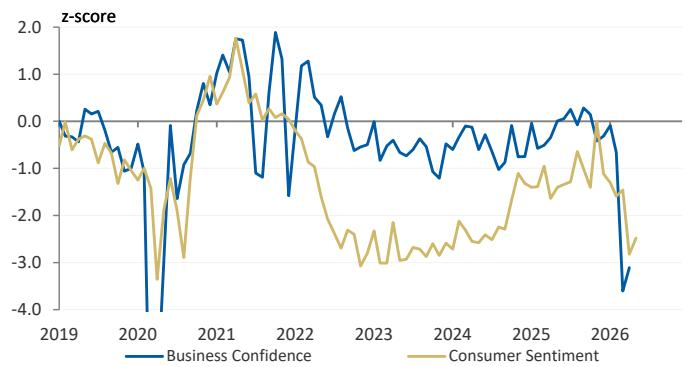

line

| Year | Business Confidence | Consumer Sentiment |
|------|---------------------|--------------------|
| 2019 | 0.0                 | 0.0                |
| 2020 | -4.0                | -3.0               |
| 2021 | 1.5                 | 1.0                |
| 2022 | 2.0                 | 0.5                |
| 2023 | -1.0                | -2.5               |
| 2024 | -0.5                | -2.0               |
| 2025 | 0.5                 | -1.5               |
| 2026 | -3.5                | -2.5               |

Source: WBC-MI, NAB, MS

Exhibit 3: But elevated inflation is likely to limit how dovish the RBA is able to turn   
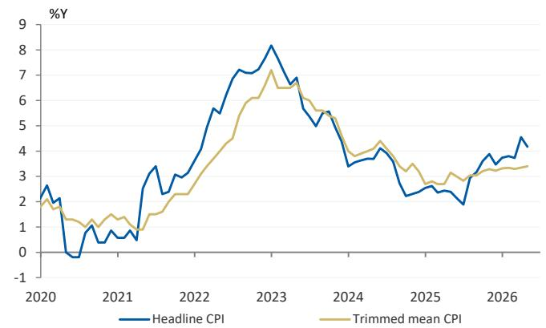

line

| Year | Headline CPI | Trimmed mean CPI |
|------|--------------|------------------|
| 2020 | 2.5          | 2.0              |
| 2021 | -0.5         | 1.0              |
| 2022 | 4.0          | 3.0              |
| 2023 | 8.0          | 7.0              |
| 2024 | 3.5          | 4.0              |
| 2025 | 2.5          | 3.0              |
| 2026 | 4.5          | 3.5              |

Source: ABS, MS

# #2: How Resilient Is the Capex Pipeline?

One area of our outlook where we are relatively more positive is the capex outlook, where we see a policy-linked pipeline that is relatively resilient to higher rates or softer economic conditions. While investors do generally view this as a relatively good performer for the domestic economy, there is some pushback on how resilient some of this spending can be, given the broad economic headwinds likely to emerge through the rest of the year. In our view, there are areas of capex that are clearly more vulnerable in the near term – housing being a good example; we expect near-term cyclical headwinds to outweigh medium-term structural tailwinds.

For most other categories, though (defence, energy, resources, data centres), we think the combination of policy support and global tailwinds is likely to dominate, so we still see this area as an important buffer for the domestic economy.

Exhibit 4: We forecast that capex in six key categories will rise from A\$225bn in FY25 to A\$326bn in FY30   
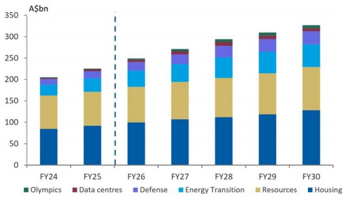

bar_stacked

| Year | Olympics (A$bn) | Data centres (A$bn) | Defense (A$bn) | Energy Transition (A$bn) | Resources (A$bn) | Housing (A$bn) |
|---|---|---|---|---|---|---|
| FY24 | 0 | 0 | 10 | 25 | 75 | 85 |
| FY25 | 0 | 5 | 15 | 30 | 70 | 90 |
| FY26 | 0 | 5 | 10 | 35 | 75 | 100 |
| FY27 | 0 | 10 | 15 | 40 | 85 | 105 |
| FY28 | 5 | 10 | 20 | 45 | 90 | 110 |
| FY29 | 10 | 10 | 25 | 50 | 95 | 115 |
| FY30 | 10 | 10 | 25 | 50 | 100 | 125 |

Source: MS

Exhibit 5: Recent developments have highlighted the policy support and global tailwinds to the capex pulse 

<table><tr><td>Capex Category</td><td>Update</td></tr><tr><td>Defense</td><td>A$53bn additional funding announced in Federal Budget</td></tr><tr><td>Energy Transition &amp;Security</td><td>A$15bn energy security package in Federal Budget</td></tr><tr><td>Housing</td><td>Announced tax changes to negative gearing and capital gains (negative) likely to outweigh further supply measures (housing infrastructure fund) near-term</td></tr><tr><td>Resources</td><td>A$1bn funding for Critical Minerals Strategic Reserve. Commodity prices provide additional support for capex</td></tr><tr><td>Data Centres</td><td>Unprecedented rise in computer equipment imports for March signals data centre capex uplift underway</td></tr></table>

Source: MS

# #3: What Is the Index Downside If Earnings Correct Meaningfully?

There is a lot of focus from investors on the market earnings outlook. Current consensus expectations are for robust growth with $>10\%$ EPSg for both FY26 and FY27. Investors generally agree with our view that FY27 expectations are likely to come down sharply (we expect $\sim6\%$ growth), but some question whether this can go further, and if there is a risk of a material de-rating that brings further downside for index levels as a result. We think this is possible, but have some comfort from the Resources sector, which is currently providing a meaningful portion of market earnings growth and where we expect earnings will remain relatively well supported. Earnings downside looks much more likely ex-Resources, in our view, and this rotation impact should limit the extent of index-level weakness.

Exhibit 6: Consensus earnings expectations are for robust market earnings growth over coming years   
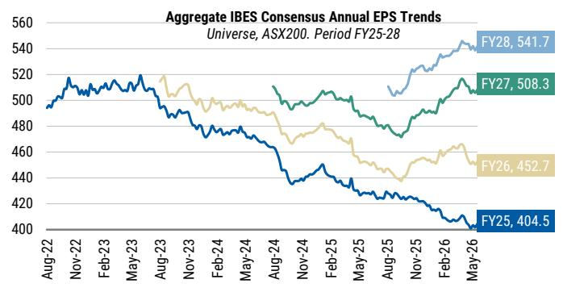

line

| Period | Value  |
|--------|--------|
| FY25   | 404.5  |
| FY26   | 452.7  |
| FY27   | 508.3  |
| FY28   | 541.7  |

Source: RIMES, IBES, MS. Data as of May 22, 2026

Exhibit 7: Our top-down earnings models point to a much more cautious earnings outlook   
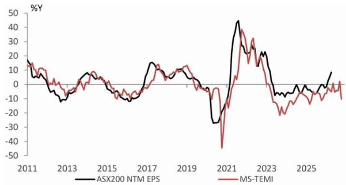

line

| Year | ASX200 NTM EPS | MS-TEMI |
|------|----------------|---------|
| 2011 | ~15            | ~15     |
| 2013 | ~-10           | ~-5     |
| 2015 | ~-5            | ~-10    |
| 2017 | ~15            | ~10     |
| 2019 | ~-5            | ~-10    |
| 2021 | ~-30           | ~-45    |
| 2023 | ~20            | ~-20    |
| 2025 | ~-5            | ~-10    |

Source: RIMES, IBES, MS

# #4: What Are the Labour Market Implications of a Slowdown?

We have had many questions around the labour market impact of an economic slowdown from investors – given how strong employment has been over recent years and the extent to which this has been a broad support for the economy. We expect the unemployment rate will rise this year, to 4.7% by year end, and then continue to increase into 2027. While government spending remains a support to labour conditions, growth is unlikely to accelerate, while at the same time we expect a meaningful slowdown in private sector employment. Alongside these cyclical headwinds is the prospect of AI-driven labour market impacts, with a weaker revenue environment a potential catalyst to accelerate some of these changes. A softer labour market would be a material change for the aggregate economy, driving more consumer caution and weaker sentiment trends versus what has been experienced over the past few years.

Exhibit 8: Unemployment remains relatively low, but we expect this will rise through the year   
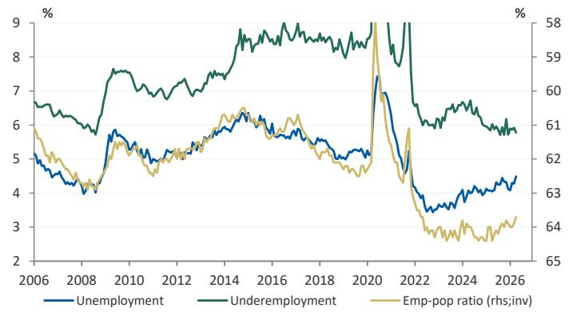

line

| Year | Unemployment | Underemployment | Emp-pop ratio (rhs;inv) |
|------|--------------|-----------------|--------------------------|
| 2006 | 5.0          | 6.5             | 61.0                     |
| 2008 | 4.5          | 6.0             | 60.5                     |
| 2010 | 5.5          | 7.5             | 61.5                     |
| 2012 | 5.0          | 7.0             | 61.0                     |
| 2014 | 5.5          | 8.0             | 62.0                     |
| 2016 | 6.0          | 8.5             | 63.0                     |
| 2018 | 5.5          | 8.0             | 62.5                     |
| 2020 | 7.0          | 9.0             | 61.5                     |
| 2022 | 4.0          | 6.0             | 63.5                     |
| 2024 | 4.5          | 6.5             | 64.0                     |
| 2026 | 4.5          | 6.0             | 63.5                     |

Source: ABS, MS

Exhibit 9: Forward indicators are now starting to turn more negative   
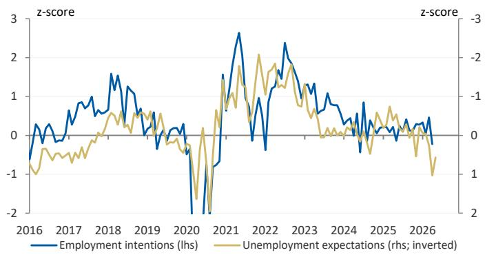

line

| Year | Employment intentions (lhs) | Unemployment expectations (rhs; inverted) |
|------|-----------------------------|------------------------------------------|
| 2016 | -0.5                        | -0.8                                     |
| 2017 | 0.2                         | -0.3                                     |
| 2018 | 1.5                         | 0.5                                      |
| 2019 | 0.8                         | 0.2                                      |
| 2020 | -2.0                        | -0.5                                     |
| 2021 | 2.5                         | 1.5                                      |
| 2022 | 1.0                         | 0.8                                      |
| 2023 | 2.0                         | 1.0                                      |
| 2024 | 0.5                         | -0.2                                     |
| 2025 | 0.3                         | -0.1                                     |
| 2026 | -0.2                        | -1.0                                     |

Source: NAB, WBC-MI, MS

# #5: What Would Rally in Response to Middle East Improvement?

Investors have started to get more positive on energy developments over the last week or so – and have been interested in what sectors could benefit in Australia from a resolution of Middle East disruption. Since the start of the oil price shock, the sectors that have had the strongest negative correlation with the oil price have been Discretionary, Industrials, REITs, and Healthcare. We would be cautious about assuming discretionary outperformance given the domestic headwinds the sector faces, but the other sectors could benefit if a resolution resulted in lower oil prices and yields.

Exhibit 10: Energy uncertainty is having broad market   
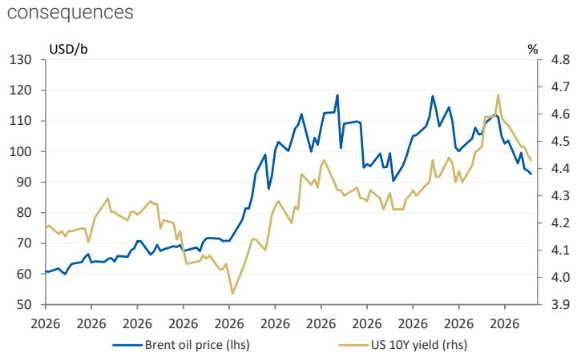

line

| Year | Brent oil price (lhs) | US 10Y yield (rhs) |
|------|------------------------|---------------------|
| 2026 | ~60                    | ~4.2                |
| 2027 | ~95                    | ~4.5                |

Source: Bloomberg, MS

Exhibit 11: ASX200 sector correlations with oil prices   
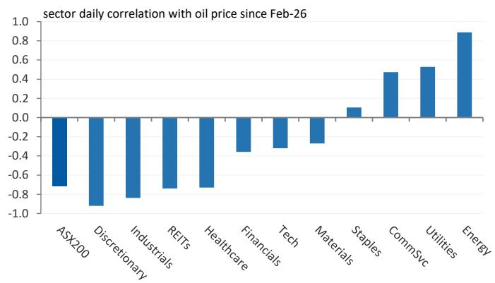

bar

| Sector        | Daily Correlation |
| ------------- | ----------------- |
| ASX200        | -0.7              |
| Discretionary | -0.9              |
| Industrials   | -0.8              |
| REITs         | -0.7              |
| Healthcare    | -0.7              |
| Financials    | -0.4              |
| Tech          | -0.3              |
| Materials     | -0.2              |
| Staples       | 0.1               |
| CommSvc       | 0.5               |
| Utilities     | 0.5               |
| Energy        | 0.9               |

Source: Bloomberg, MS

# The Week Ahead

Exhibit 12: The Week Ahead 

<table><tr><td></td><td>Release</td><td>Period</td><td>MSe</td><td>Consensus</td><td>Prev.</td></tr><tr><td colspan="6">Monday 1 June</td></tr><tr><td>CN</td><td>Caixin Manufacturing PMI</td><td>May</td><td>--</td><td>51.3</td><td>52.2</td></tr><tr><td colspan="6">Tuesday 2 June</td></tr><tr><td>AU</td><td>Current Account Balance</td><td>1Q</td><td>-A$23bn</td><td>A$-23bn</td><td>A$-21bn</td></tr><tr><td>AU</td><td>Net Exports Contr. To GDP</td><td>1Q</td><td>-0.5ppts</td><td>-0.5ppts</td><td>-0.1ppts</td></tr><tr><td>AU</td><td>Inventories</td><td>1Q</td><td>0.2%Q</td><td>-0.1%Q</td><td>-0.1%Q</td></tr><tr><td>AU</td><td>Building Approvals</td><td>Apr</td><td>-5.0%M, 9.8%Y</td><td>0.2%M</td><td>-10.5%M, 9%Y</td></tr><tr><td>US</td><td>ISM Index</td><td>May</td><td>--</td><td>53.2</td><td>52.7</td></tr><tr><td colspan="6">Wednesday 3 June</td></tr><tr><td>AU</td><td>GDP Data Release</td><td>1Q</td><td>0.4%Q, 2.6%Y</td><td>0.5%Q, 2.6%Y</td><td>0.8%Q, 2.6%Y</td></tr><tr><td colspan="6">Thursday 4 June</td></tr><tr><td colspan="6">Friday 5 June</td></tr><tr><td>US</td><td>Non Farm Payrolls</td><td>May</td><td>--</td><td>93k</td><td>115k</td></tr><tr><td>US</td><td>Average Hourly Earnings</td><td>May</td><td>--</td><td>0.3%M</td><td>0.2%M, 3.6%Y</td></tr><tr><td>US</td><td>Unemployment Rate</td><td>May</td><td>--</td><td>4.3%</td><td>4.3%</td></tr></table>

ABS, MS estimates. International releases are dated based on the Australian time zone.

# Macro Releases

Housing Prices for May (1 June): We expect house price growth to have slowed in May, with momentum expected to weaken from here, particularly following tax changes announced in the FY27 Budget. We expect a two-speed pace across states, with Sydney and Melbourne likely weaker than Perth and Brisbane.

Building Approvals for April (2 June): We expect building approvals will have fallen 5.0%M in April, continuing weakness seen in March. Nevertheless, annual growth remains robust at 9.8%Y. We are cautious on the outlook from here – while approvals should stay structurally supported by the policy design of tax changes, we think cyclical challenges will dominate the near-term outlook – mainly higher rates, higher construction costs, and lower housing prices.

GDP for 1Q (4 June): We expect GDP to have grown 0.4%Q in Q1, a sharp slowing from the prior quarter, but enough to keep annual growth at a strong 2.6%Y. We expect private investment spending and government spending to be key drivers of growth in the quarter, offset by a large detraction from net exports (reflecting the partially imported nature of the capex) as well as a further slowing in consumer activity. We expect economic growth to slow further through 2026 and expect the slowdown will remain driven by housing and the consumer, with capex relatively resilient.

Trade Balance for April (4 June): We expect the trade balance will rise to an A\$2.5bn surplus in April, a reversal of the narrowing seen in March. We expect this will be largely an unwind of the material import lift in ADP equipment and fuel – these categories are volatile and likely overstated the deterioration in underlying trade position.

# Performance Last Week

Exhibit 13: ASX 200 sector performance\* – week ended May 29, 2026 

<table><tr><td rowspan="2">Sector</td><td rowspan="2">Last Close</td><td rowspan="2">% from 52W High</td><td colspan="4">Weekly Price Returns Ending....</td><td rowspan="2">MTD</td><td rowspan="2">CYTD</td><td rowspan="2">FYTD</td><td rowspan="2"> $LTM^A$ </td></tr><tr><td>May-29</td><td>May-22</td><td>May-15</td><td>May-08</td></tr><tr><td>Consumer Discretionary</td><td>3561.8</td><td>-22.9%</td><td>4.4%</td><td>1.3%</td><td>0.8%</td><td>-2.6%</td><td>4.6%</td><td>-10.5%</td><td>-14.0%</td><td>-13.0%</td></tr><tr><td>Materials</td><td>25076.2</td><td>-2.9%</td><td>3.3%</td><td>-1.3%</td><td>1.8%</td><td>4.3%</td><td>10.5%</td><td>18.1%</td><td>58.1%</td><td>53.1%</td></tr><tr><td>Real Estate</td><td>1685.7</td><td>-13.6%</td><td>2.6%</td><td>-1.3%</td><td>1.6%</td><td>-0.9%</td><td>3.0%</td><td>-7.3%</td><td>-5.9%</td><td>-5.7%</td></tr><tr><td>Information Technology</td><td>1773.1</td><td>-41.8%</td><td>2.3%</td><td>-0.9%</td><td>-2.3%</td><td>0.8%</td><td>0.6%</td><td>-18.1%</td><td>-38.9%</td><td>-38.3%</td></tr><tr><td>Industrials</td><td>8158.4</td><td>-7.1%</td><td>1.9%</td><td>-2.2%</td><td>0.1%</td><td>1.0%</td><td>2.0%</td><td>-3.2%</td><td>-1.9%</td><td>-1.3%</td></tr><tr><td>Consumer Staples</td><td>11807.8</td><td>-8.7%</td><td>0.3%</td><td>2.9%</td><td>-2.5%</td><td>-3.6%</td><td>-1.9%</td><td>1.8%</td><td>-2.6%</td><td>-4.2%</td></tr><tr><td>Health Care</td><td>22995.3</td><td>-49.4%</td><td>0.2%</td><td>1.3%</td><td>-8.1%</td><td>-2.9%</td><td>-9.2%</td><td>-31.8%</td><td>-44.7%</td><td>-45.3%</td></tr><tr><td>Financials</td><td>9187.1</td><td>-8.9%</td><td>-1.2%</td><td>2.1%</td><td>-4.3%</td><td>-0.2%</td><td>-3.9%</td><td>-1.2%</td><td>-3.6%</td><td>1.8%</td></tr><tr><td>Utilities</td><td>9643.1</td><td>-9.7%</td><td>-1.6%</td><td>-3.7%</td><td>1.4%</td><td>-4.5%</td><td>-7.6%</td><td>-0.2%</td><td>5.5%</td><td>5.5%</td></tr><tr><td>Communication Services</td><td>1650.6</td><td>-16.6%</td><td>-2.5%</td><td>-2.4%</td><td>-0.2%</td><td>0.1%</td><td>-4.2%</td><td>-5.2%</td><td>-10.9%</td><td>-9.3%</td></tr><tr><td>Energy</td><td>10413.3</td><td>-9.8%</td><td>-3.3%</td><td>2.6%</td><td>2.7%</td><td>-7.6%</td><td>-5.9%</td><td>23.5%</td><td>20.0%</td><td>30.8%</td></tr><tr><td>ASX 200</td><td>8731.7</td><td>-5.1%</td><td>0.9%</td><td>0.3%</td><td>-1.3%</td><td>0.2%</td><td>0.8%</td><td>0.2%</td><td>2.2%</td><td>4.0%</td></tr></table>

Source: FactSet, MS. Note: Results shown do not include transaction costs. Past performance is no guarantee of future results. Performance as of May 29, 2026. ^For the period May 29, 2025 to May 29, 2026. \*price returns (ex-dividends).

Exhibit 14: Top/bottom stock performers\* within sector across large and small caps for the week ended May 29, 2026   
Large Caps - ASX 100 

<table><tr><td rowspan="2">Sector</td><td colspan="3">Top stock performer within sector</td><td colspan="3">Bottom stock performer within sector</td></tr><tr><td>Ticker</td><td>Name</td><td>TR (%)</td><td>Ticker</td><td>Name</td><td>TR (%)</td></tr><tr><td>Energy</td><td>WHC</td><td>Whitehaven Coal Limited</td><td>7.2%</td><td>ALD</td><td>Ampol Limited</td><td>-5.3%</td></tr><tr><td>Materials</td><td>JHX</td><td>James Hardie Industries PLC Chess Units of Foreign Securitie</td><td>12.2%</td><td>RRL</td><td>Regis Resources Limited</td><td>-3.6%</td></tr><tr><td>Industrials</td><td>QAN</td><td>Qantas Airways Limited</td><td>8.8%</td><td>BXB</td><td>Brambles Limited</td><td>-3.2%</td></tr><tr><td>Consumer Discretionary</td><td>WES</td><td>Wesfarmers Limited</td><td>6.8%</td><td>APE</td><td>Eagers Automotive Limited</td><td>-2.6%</td></tr><tr><td>Consumer Staples</td><td>WOW</td><td>Woolworths Group Ltd</td><td>1.6%</td><td>EDV</td><td>Endeavour Group Ltd</td><td>-6.5%</td></tr><tr><td>Health Care</td><td>FPH</td><td>Fisher &amp; Paykel Healthcare Corporation Limited</td><td>12.7%</td><td>CSL</td><td>CSL Limited</td><td>-3.2%</td></tr><tr><td>Financials</td><td>XYZ</td><td>Block, Inc. Shs Chess Depository Interests Repr 1 Sh</td><td>6.7%</td><td>ASX</td><td>ASX Limited</td><td>-22.3%</td></tr><tr><td>Information Technology</td><td>360</td><td>Life360, Inc. Shs Chess Depository Interests Repr 3 Sh</td><td>5.6%</td><td>WTC</td><td>Wisetech Global Ltd.</td><td>-2.9%</td></tr><tr><td>Communication Services</td><td>CAR</td><td>CAR Group Limited</td><td>0.1%</td><td>TLS</td><td>Telstra Group Limited</td><td>-3.2%</td></tr><tr><td>Utilities</td><td>ORG</td><td>Origin Energy Limited</td><td>-0.3%</td><td>AGL</td><td>AGL Energy Limited</td><td>-4.6%</td></tr><tr><td>Real Estate</td><td>CHC</td><td>Charter Hall Group</td><td>5.4%</td><td>DXS</td><td>Dexus</td><td>-7.7%</td></tr></table>

Small Caps - Small Ordinaries 

<table><tr><td rowspan="2">Sector</td><td colspan="3">Top stock performer within sector</td><td colspan="3">Bottom stock performer within sector</td></tr><tr><td>Ticker</td><td>Name</td><td>TR (%)</td><td>Ticker</td><td>Name</td><td>TR (%)</td></tr><tr><td>Energy</td><td>NXG</td><td>NexGen Energy Ltd. Shs Chess Depository Interests repr 1 sh</td><td>6.3%</td><td>VEA</td><td>Viva Energy Group Ltd.</td><td>-8.2%</td></tr><tr><td>Materials</td><td>NUF</td><td>Nufarm Limited</td><td>24.0%</td><td>ARU</td><td>Arafura Rare Earths Limited</td><td>-14.5%</td></tr><tr><td>Industrials</td><td>EOS</td><td>Electro Optic Systems Holdings Limited</td><td>25.3%</td><td>SIQ</td><td>Smartgroup Corporation Ltd</td><td>-2.1%</td></tr><tr><td>Consumer Discretionary</td><td>BAP</td><td>Bapcor Ltd</td><td>18.1%</td><td>IEL</td><td>IDP Education Ltd.</td><td>-16.5%</td></tr><tr><td>Consumer Staples</td><td>ING</td><td>Inghams Group Ltd.</td><td>6.6%</td><td>ELD</td><td>Elders Limited</td><td>-5.4%</td></tr><tr><td>Health Care</td><td>4DX</td><td>4DMedical Ltd.</td><td>9.7%</td><td>IMM</td><td>Immutep Ltd</td><td>-11.7%</td></tr><tr><td>Financials</td><td>JDO</td><td>Judo Capital Holdings Limited</td><td>13.0%</td><td>GQG</td><td>GQG Partners, Inc. Shs Chess Depository Interests Repr 1 Sh</td><td>-6.2%</td></tr><tr><td>Information Technology</td><td>ELS</td><td>Elsight Ltd.</td><td>31.7%</td><td>CAT</td><td>Catapult Sports Ltd.</td><td>-5.6%</td></tr><tr><td>Communication Services</td><td>EVT</td><td>EVT Limited</td><td>5.0%</td><td>TUA</td><td>Tuas Ltd.</td><td>-10.4%</td></tr><tr><td>Utilities</td><td>.</td><td>.</td><td>.</td><td>.</td><td>.</td><td>.</td></tr><tr><td>Real Estate</td><td>CNI</td><td>Centuria Capital Group</td><td>17.1%</td><td>PXA</td><td>PEXA Group Limited</td><td>-8.9%</td></tr></table>

Source: FactSet, MS. Note: Past performance is no guarantee of future results. Results shown do not include transaction costs. \*price returns (ex-dividends).

Exhibit 15: Top/bottom 10 weekly performers\* within the ASX 100 Index   
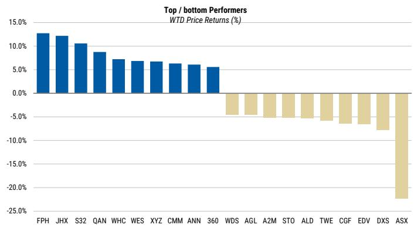

bar

| Ticker | WTD Price Returns (%) |
| ------ | ---------------------- |
| FPH    | 12.0%                  |
| JHX    | 11.5%                  |
| S32    | 10.5%                  |
| QAN    | 8.5%                   |
| WHC    | 7.0%                   |
| WES    | 6.5%                   |
| XYZ    | 6.0%                   |
| CMM    | 5.5%                   |
| ANN    | 5.0%                   |
| 360    | 4.5%                   |
| WDS    | -3.0%                  |
| AGL    | -4.0%                  |
| A2M    | -4.5%                  |
| STO    | -4.0%                  |
| ALD    | -4.5%                  |
| TWE    | -5.0%                  |
| CGF    | -6.0%                  |
| EDV    | -6.5%                  |
| DXS    | -8.0%                  |
| ASX    | -22.0%                 |

Source: FactSet, MS. As at May 29, 2026. Past performance is no guarantee of future results. Results shown do not include transaction costs. \*price returns (ex-dividends).

Exhibit 16: Top/bottom 10 weekly performers\* within the Small Ordinaries Index   
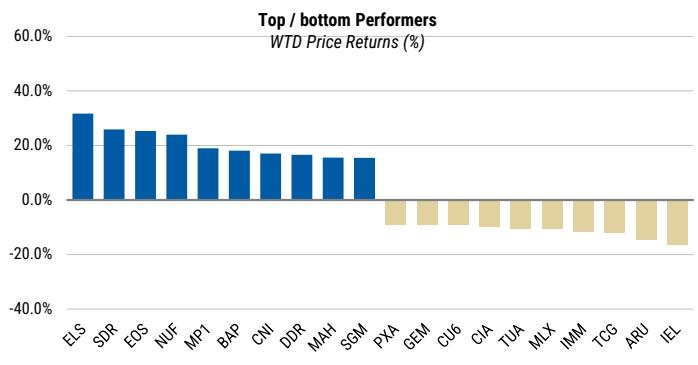

bar

| Ticker | WTD Price Returns (%) |
| ------ | --------------------- |
| ELS    | 30.0%                 |
| SDR    | 25.0%                 |
| EOS    | 24.0%                 |
| NUF    | 22.0%                 |
| MP1    | 18.0%                 |
| BAP    | 17.0%                 |
| CNI    | 16.0%                 |
| DDR    | 15.0%                 |
| MAH    | 14.0%                 |
| SGM    | 13.0%                 |
| PXA    | -5.0%                 |
| GEM    | -6.0%                 |
| CU6    | -7.0%                 |
| CIA    | -8.0%                 |
| TUA    | -9.0%                 |
| MLX    | -10.0%                |
| IMM    | -11.0%                |
| TCG    | -12.0%                |
| ARU    | -13.0%                |
| IEL    | -14.0%                |

Source: FactSet, MS. As at May 29, 2026. Past performance is no guarantee of future results. Results shown do not include transaction costs. \*price returns (ex-dividends).

Exhibit 17: Performance\* across S&P/ASX size biased indices\*\*   
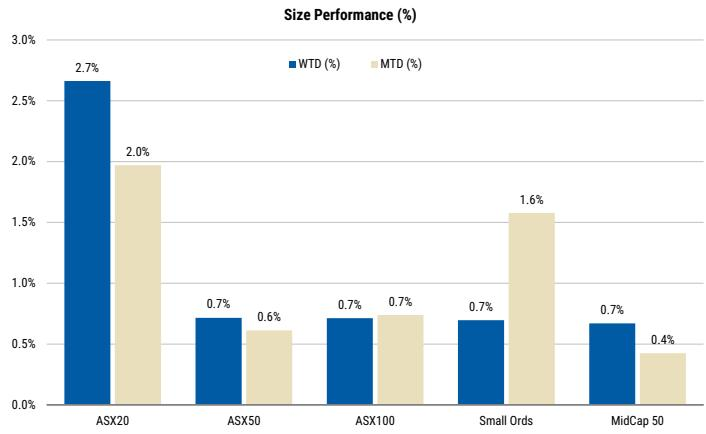

bar

Size Performance (%)
| Category | WTD (%) | MTD (%) |
| :--- | :--- | :--- |
| ASX20 | 2.7 | 2.0 |
| ASX50 | 0.7 | 0.6 |
| ASX100 | 0.7 | 0.7 |
| Small Ords | 0.7 | 1.6 |
| MidCap 50 | 0.7 | 0.4 |

Source: FactSet, MS. \*Sort by weekly return (highest-to-lowest). As at May 29, 2026. \*\*price returns (ex-dividends).

Exhibit 18: Performance\* distribution of weekly returns   
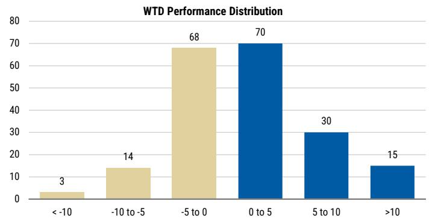

bar

WTD Performance Distribution
| Performance Range | Count |
| :--- | :--- |
| <-10 | 3 |
| -10 to -5 | 14 |
| -5 to 0 | 68 |
| 0 to 5 | 70 |
| 5 to 10 | 30 |
| >10 | 15 |

Source: FactSet, MS. As at May 29, 2026. \*price returns (ex-dividends).

# Earnings and Valuations

Exhibit 19: Aggregate consensus EPS growth   
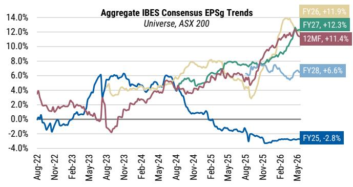

line

| Period | EPS Growth |
|--------|------------|
| FY25   | -2.8%      |
| FY26   | +11.9%     |
| FY27   | +12.3%     |
| 12MF   | +11.4%     |
| FY28   | +6.6%      |

Source: RIMES, IBES, MS. Data as of May 22, 2026

Exhibit 21: IndxFin 12MF P/E is at 20x vs. 17.7x for Financials; 13.8x for Resources   
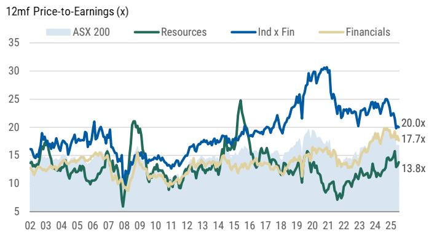

line

| Year | ASX 200 | Resources | Ind x Fin | Financials |
|------|---------|-----------|-----------|------------|
| 2025 | 20.0x   | 13.8x     | 17.7x     | 17.7x      |

Source: FactSet, IBES, MS. Data as of May 27, 2026

Exhibit 23: Earnings Estimate Revision Breadth (ERR\*)   
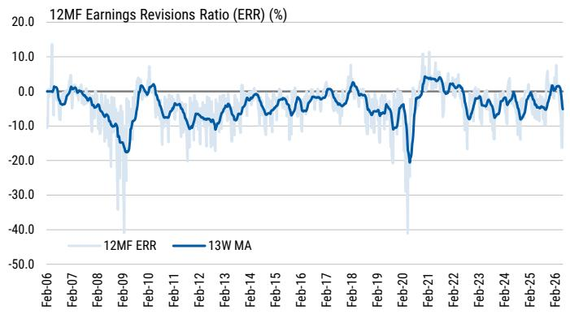

line

| Date    | 12MF ERR | 13W MA |
|---------|----------|--------|
| Feb-06  | ~15.0    | ~0.0   |
| Feb-07  | ~0.0     | ~0.0   |
| Feb-08  | ~-5.0    | ~-5.0  |
| Feb-09  | ~-40.0   | ~-20.0 |
| Feb-10  | ~5.0     | ~0.0   |
| Feb-11  | ~-5.0    | ~-5.0  |
| Feb-12  | ~-10.0   | ~-10.0 |
| Feb-13  | ~-5.0    | ~-5.0  |
| Feb-14  | ~0.0     | ~0.0   |
| Feb-15  | ~-5.0    | ~-5.0  |
| Feb-16  | ~-5.0    | ~-5.0  |
| Feb-17  | ~0.0     | ~0.0   |
| Feb-18  | ~5.0     | ~5.0   |
| Feb-19  | ~-5.0    | ~-5.0  |
| Feb-20  | ~-40.0   | ~-20.0 |
| Feb-21  | ~15.0    | ~5.0   |
| Feb-22  | ~5.0     | ~5.0   |
| Feb-23  | ~-5.0    | ~-5.0  |
| Feb-24  | ~-5.0    | ~-5.0  |
| Feb-25  | ~5.0     | ~5.0   |
| Feb-26  | ~-5.0    | ~-5.0  |

Source: RIMES, IBES, MS   
\* Earnings Revision Ratio (ERR) is measured as the number of estimates revised up less down divided by the total number of estimates. Data as of May 22, 2026

Exhibit 20: Aggregate consensus EPS trends   
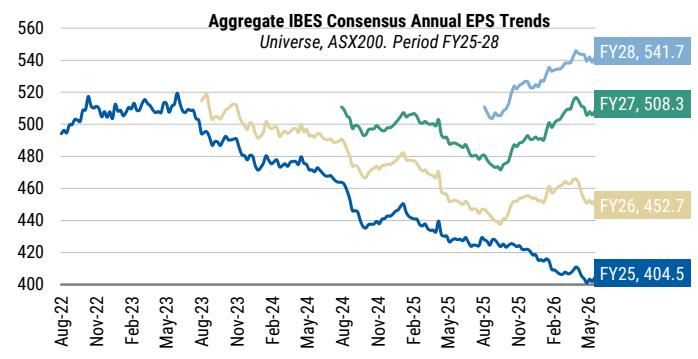

line

| Period | Value  |
|--------|--------|
| FY25   | 404.5  |
| FY26   | 452.7  |
| FY27   | 508.3  |
| FY28   | 541.7  |

Source: RIMES, IBES, MS. Data as of May 22, 2026

Exhibit 22: ASX200 12MF P/E now at 16.7x, above the long-term average of 14.9x   
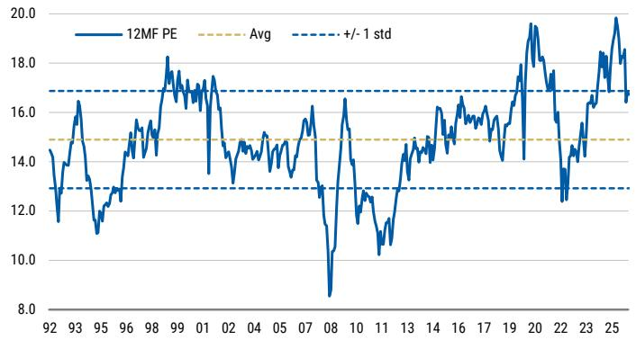

line

| Year | 12MF PE | Avg | +/- 1 std |
|------|---------|-----|-----------|
| 92   | ~14.5   | 14.5| 17.0      |
| 93   | ~16.5   | 14.5| 17.0      |
| 95   | ~11.5   | 14.5| 17.0      |
| 96   | ~13.0   | 14.5| 17.0      |
| 98   | ~15.5   | 14.5| 17.0      |
| 99   | ~18.0   | 14.5| 17.0      |
| 01   | ~17.0   | 14.5| 17.0      |
| 02   | ~14.5   | 14.5| 17.0      |
| 04   | ~14.5   | 14.5| 17.0      |
| 05   | ~15.0   | 14.5| 17.0      |
| 07   | ~16.0   | 14.5| 17.0      |
| 08   | ~8.5    | 14.5| 17.0      |
| 10   | ~16.5   | 14.5| 17.0      |
| 11   | ~12.5   | 14.5| 17.0      |
| 13   | ~14.5   | 14.5| 17.0      |
| 14   | ~15.0   | 14.5| 17.0      |
| 16   | ~16.0   | 14.5| 17.0      |
| 17   | ~16.5   | 14.5| 17.0      |
| 19   | ~18.0   | 14.5| 17.0      |
| 20   | ~19.5   | 14.5| 17.0      |
| 22   | ~13.0   | 14.5| 17.0      |
| 23   | ~16.0   | 14.5| 17.0      |
| 25   | ~20.0   | 14.5| 17.0      |

Source: FactSet, IBES, MS. Data as of May 27, 2026

Exhibit 24: ASX 200 12MF dividend yield is now at 3.5%   
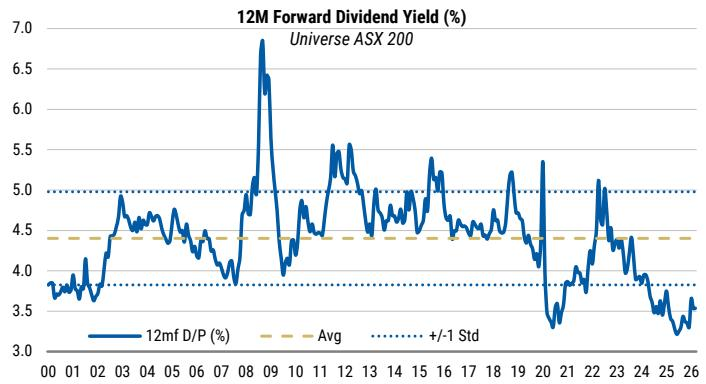

line

| Year | 12mf D/P (%) |
|------|--------------|
| 00   | 3.8          |
| 01   | 3.9          |
| 02   | 4.0          |
| 03   | 4.5          |
| 04   | 4.6          |
| 05   | 4.5          |
| 06   | 4.4          |
| 07   | 4.3          |
| 08   | 5.0          |
| 09   | 6.8          |
| 10   | 4.0          |
| 11   | 4.8          |
| 12   | 5.5          |
| 13   | 5.0          |
| 14   | 4.8          |
| 15   | 5.2          |
| 16   | 5.0          |
| 17   | 4.5          |
| 18   | 4.8          |
| 19   | 5.2          |
| 20   | 3.5          |
| 21   | 4.0          |
| 22   | 5.0          |
| 23   | 4.5          |
| 24   | 4.0          |
| 25   | 3.5          |
| 26   | 3.3          |

Source: RIMES, MS. Data as of May 27, 2026

# Last Week in Review

AlphaWise Survey: Cracks Emerging (28 May 2026): Our ninth annual AlphaWise survey of Australian Households shows a generally resilient backdrop, but evidence of caution emerging and an overly optimistic outlook for income and wealth. As the economy slows, the distributional data suggests most risk across leveraged and low income households.

\- Link: Australia Macro+: AlphaWise Survey: Cracks Emerging (28 May 2026)

Sharp Fall in Household Spending for April, Strong Rise in Capex (28 May 2026): Sharp fall in household spending in April, -1.1%M, 4.9%Y, materially weaker than we and consensus expected, following a 1.6%M rise in March. Across categories, transport is the key drag (-4.7%M), largely reflecting the impact of the oil price shock; with air travel the main contributor to the decline. Ex-transport, spending was still soft – Apparel fell 2.2%M, while Food fell 1.3%M, with the ABS noting a shift toward cheaper supermarket products. Separately, capex momentum remains strong - with 1Q spending up 6.5%Q, 14.6%Y, driven by non-mining investment; and a notable surge in IT-related spending (+96%Q). Overall, the divergence is becoming clearer – softer consumption alongside a resilient capex profile – reinforcing our capex over consumption call.

\- Link: Australia Macro+ Data Pulse: Sharp Fall In Household Spending For April, Strong Rise In Capex (28 May 2026)

Capex Pipeline Is Still Intact (27 May 2026): The domestic economic outlook has worsened, but we still see policy-linked capex as a continuing domestic buffer. The FY27 Budget highlighted areas of spending lift (defence, energy) that are also reinforced by global trends, while recent data are supportive for data centre and resources capex.

\- Link: Australia Macro Matters: Capex Pipeline Is Still Intact (27 May 2026)

Slightly Softer but Still Strong (27 May 2026): Headline CPI fell more than we or consensus expected in April, from 4.6% to 4.2%. Temporary fuel and public transport subsidies were the main driver. Trimmed mean CPI was more resilient, ticking up from 3.3%Y to 3.4%Y with a 0.31% monthly increase – still above the RBA's target. Housing inflation was strong and picked up in the month, contributing \~10bps to the monthly core increase. Construction and rents both contributed. Elsewhere, administered prices rose because of the higher health insurance increases, while market goods and services have both slowed over the past three months. There is still relatively limited evidence of broadening impact of oil price shock. This is likely to become more evident in coming months.

\- Link: Australia Macro+: April CPI: Slightly Softer But Still Strong (27 May 2026)

June Preview – Final Cut (25 May 2026): Rebalance positioning remains well anchored despite volatility, with leadership stability supporting promotion candidates while ongoing underperformance sharpens exclusion risk. We formalise targeted changes across the 50, 100 and 200, with select shifts at the margin.

\- Link: Australia Macro+ Index Analytic: June Preview - Final Cut (25 May 2026)

# Australia – Macro Data Heatmap

Exhibit 25: Macro Data Heatmap 

<table><tr><td rowspan="2">Category</td><td rowspan="2">Indicator</td><td rowspan="2">Unit</td><td colspan="13">Monthly</td><td colspan="3">Calendar Year End</td><td colspan="2">Averages</td></tr><tr><td>Apr-26</td><td>Mar-26</td><td>Feb-26</td><td>Jan-26</td><td>Dec-25</td><td>Nov-25</td><td>Oct-25</td><td>Sep-25</td><td>Aug-25</td><td>Jul-25</td><td>Jun-25</td><td>May-25</td><td>Apr-25</td><td>Dec-25</td><td>Dec-24</td><td>Dec-23</td><td>5Y</td><td>10Y</td></tr><tr><td rowspan="3">Surveys</td><td>NAB Business Conditions</td><td>Index</td><td>2.6</td><td>5.5</td><td>6.3</td><td>7.1</td><td>10.0</td><td>7.9</td><td>10.9</td><td>8.8</td><td>8.5</td><td>6.5</td><td>8.7</td><td>2.1</td><td>3.0</td><td>10.0</td><td>5.1</td><td>7.7</td><td>11.7</td><td>10.1</td></tr><tr><td>NAB Business Confidence</td><td>Index</td><td>-24.4</td><td>-29.0</td><td>-1.5</td><td>3.8</td><td>1.7</td><td>0.8</td><td>6.0</td><td>7.3</td><td>4.0</td><td>7.0</td><td>5.2</td><td>4.7</td><td>1.4</td><td>1.7</td><td>-2.3</td><td>0.2</td><td>1.8</td><td>2.5</td></tr><tr><td>WBC Consumer Confidence</td><td>Index</td><td>80</td><td>92</td><td>91</td><td>93</td><td>95</td><td>104</td><td>92</td><td>95</td><td>99</td><td>93</td><td>93</td><td>92</td><td>90</td><td>95</td><td>93</td><td>82</td><td>90</td><td>95</td></tr><tr><td rowspan="3">Housing</td><td>House Prices</td><td>%M</td><td>0.3</td><td>0.5</td><td>0.6</td><td>0.8</td><td>0.9</td><td>1.1</td><td>1.2</td><td>1.1</td><td>1.0</td><td>0.8</td><td>0.7</td><td>0.6</td><td>0.4</td><td>0.9</td><td>0.1</td><td>0.6</td><td>0.5</td><td>0.5</td></tr><tr><td>Housing Sales</td><td>%Y</td><td>-7.8</td><td>2.3</td><td>3.1</td><td>1.2</td><td>16.6</td><td>6.8</td><td>9.6</td><td>12.9</td><td>-1.2</td><td>6.5</td><td>7.2</td><td>2.8</td><td>-2.0</td><td>16.6</td><td>2.9</td><td>6.4</td><td>2.9</td><td>2.9</td></tr><tr><td>Building Approvals</td><td>%Y</td><td>--</td><td>9.0</td><td>16.1</td><td>-14.9</td><td>1.7</td><td>20.3</td><td>-1.0</td><td>15.3</td><td>5.0</td><td>6.0</td><td>29.8</td><td>8.0</td><td>10.2</td><td>1.7</td><td>12.3</td><td>-18.0</td><td>0.9</td><td>-0.5</td></tr><tr><td rowspan="5">Inflation</td><td rowspan="2">Headline CPI</td><td>%M</td><td>0.4</td><td>1.1</td><td>0.0</td><td>0.4</td><td>1.0</td><td>0.0</td><td>0.0</td><td>0.5</td><td>-0.1</td><td>1.3</td><td>0.1</td><td>-0.5</td><td>0.7</td><td>1.0</td><td>0.7</td><td>--</td><td>0.3</td><td>0.3</td></tr><tr><td>%Y</td><td>4.2</td><td>4.6</td><td>3.7</td><td>3.8</td><td>3.8</td><td>3.4</td><td>3.8</td><td>3.6</td><td>3.2</td><td>3.0</td><td>1.9</td><td>2.1</td><td>2.4</td><td>3.8</td><td>--</td><td>--</td><td>3.3</td><td>3.3</td></tr><tr><td rowspan="2">Ex volatiles &amp; travel</td><td>%M</td><td>0.3</td><td>0.2</td><td>0.6</td><td>1.1</td><td>0.0</td><td>0.1</td><td>0.1</td><td>0.3</td><td>0.2</td><td>1.2</td><td>-0.2</td><td>0.1</td><td>0.5</td><td>0.0</td><td>-0.1</td><td>--</td><td>0.3</td><td>0.3</td></tr><tr><td>%Y</td><td>3.9</td><td>4.1</td><td>4.1</td><td>4.1</td><td>3.8</td><td>3.6</td><td>4.0</td><td>3.8</td><td>3.6</td><td>3.3</td><td>2.6</td><td>2.7</td><td>2.7</td><td>3.8</td><td>--</td><td>--</td><td>3.6</td><td>3.6</td></tr><tr><td>Trimmed mean</td><td>%Y</td><td>3.4</td><td>3.3</td><td>3.3</td><td>3.3</td><td>3.3</td><td>3.2</td><td>3.3</td><td>3.2</td><td>3.0</td><td>3.0</td><td>2.8</td><td>3.0</td><td>3.2</td><td>3.3</td><td>--</td><td>--</td><td>3.2</td><td>3.2</td></tr><tr><td rowspan="3">Credit</td><td>Housing Credit</td><td>%M</td><td>--</td><td>0.6</td><td>0.6</td><td>0.6</td><td>0.7</td><td>0.6</td><td>0.6</td><td>0.6</td><td>0.6</td><td>0.5</td><td>0.5</td><td>0.5</td><td>0.5</td><td>0.7</td><td>0.5</td><td>0.4</td><td>0.5</td><td>0.4</td></tr><tr><td>Business Credit</td><td>%M</td><td>--</td><td>0.8</td><td>0.8</td><td>0.5</td><td>1.0</td><td>0.8</td><td>0.8</td><td>0.5</td><td>0.6</td><td>1.3</td><td>0.5</td><td>0.7</td><td>1.0</td><td>1.0</td><td>0.7</td><td>0.5</td><td>0.8</td><td>0.5</td></tr><tr><td>Personal Credit</td><td>%M</td><td>--</td><td>0.6</td><td>0.4</td><td>0.3</td><td>0.5</td><td>(0.6)</td><td>0.2</td><td>0.6</td><td>0.5</td><td>0.3</td><td>0.8</td><td>0.5</td><td>0.3</td><td>0.5</td><td>0.5</td><td>(0.2)</td><td>0.1</td><td>(0.1)</td></tr><tr><td rowspan="5">Spending</td><td rowspan="2">Household Spending Indicator</td><td>%M</td><td>-1.1</td><td>1.6</td><td>0.3</td><td>0.2</td><td>-0.5</td><td>0.9</td><td>1.4</td><td>0.3</td><td>0.0</td><td>0.4</td><td>0.3</td><td>1.0</td><td>0.2</td><td>-0.5</td><td>0.4</td><td>-0.5</td><td>0.6</td><td>0.4</td></tr><tr><td>%Y</td><td>4.9</td><td>6.2</td><td>4.6</td><td>4.5</td><td>4.9</td><td>5.9</td><td>5.5</td><td>5.0</td><td>4.7</td><td>5.0</td><td>4.8</td><td>4.5</td><td>3.8</td><td>4.9</td><td>4.0</td><td>3.9</td><td>8.2</td><td>5.0</td></tr><tr><td rowspan="2">CBA Household Spending Index</td><td>%M</td><td>-1.2</td><td>2.5</td><td>-0.4</td><td>0.5</td><td>0.5</td><td>0.5</td><td>0.5</td><td>0.6</td><td>0.3</td><td>0.7</td><td>0.6</td><td>0.5</td><td>0.6</td><td>0.5</td><td>1.1</td><td>-0.2</td><td>0.6</td><td>0.7</td></tr><tr><td>%Y</td><td>5.5</td><td>8.5</td><td>5.0</td><td>5.6</td><td>6.3</td><td>5.7</td><td>6.5</td><td>6.7</td><td>4.1</td><td>5.5</td><td>6.7</td><td>4.4</td><td>4.1</td><td>6.3</td><td>5.6</td><td>3.6</td><td>8.2</td><td>8.6</td></tr><tr><td>Vehicle sales</td><td>%Y</td><td>2.2</td><td>-3.3</td><td>-4.5</td><td>0.3</td><td>3.0</td><td>-2.1</td><td>1.2</td><td>5.1</td><td>2.2</td><td>3.6</td><td>2.4</td><td>-5.2</td><td>-6.8</td><td>3.0</td><td>-2.7</td><td>12.1</td><td>4.9</td><td>1.6</td></tr><tr><td rowspan="3">Interest rates</td><td>RBA cash rate</td><td>%</td><td>4.10</td><td>4.10</td><td>3.85</td><td>3.60</td><td>3.60</td><td>3.60</td><td>3.60</td><td>3.60</td><td>3.60</td><td>3.85</td><td>3.85</td><td>3.85</td><td>4.10</td><td>3.60</td><td>4.35</td><td>4.35</td><td>2.95</td><td>2.03</td></tr><tr><td>New mortgage rate</td><td>%</td><td>--</td><td>5.91</td><td>5.72</td><td>5.50</td><td>5.49</td><td>5.48</td><td>5.49</td><td>5.50</td><td>5.51</td><td>5.75</td><td>5.75</td><td>5.84</td><td>5.99</td><td>5.49</td><td>6.22</td><td>6.24</td><td>4.95</td><td>4.39</td></tr><tr><td>Outstanding mortgage rate</td><td>%</td><td>--</td><td>5.92</td><td>5.73</td><td>5.50</td><td>5.51</td><td>5.51</td><td>5.51</td><td>5.51</td><td>5.52</td><td>5.76</td><td>5.76</td><td>5.84</td><td>5.98</td><td>5.51</td><td>6.13</td><td>5.85</td><td>4.83</td><td>4.42</td></tr><tr><td rowspan="4">Labour market</td><td>Employment</td><td>000s</td><td>-18.6</td><td>23.3</td><td>28.9</td><td>39.6</td><td>57.8</td><td>-38.9</td><td>33.9</td><td>9.2</td><td>-12.9</td><td>33.9</td><td>-6.0</td><td>-21.2</td><td>110.3</td><td>57.8</td><td>47.8</td><td>-52.9</td><td>29.8</td><td>23.2</td></tr><tr><td>Unemployment rate</td><td>%</td><td>4.5</td><td>4.3</td><td>4.3</td><td>4.1</td><td>4.1</td><td>4.3</td><td>4.3</td><td>4.4</td><td>4.3</td><td>4.3</td><td>4.3</td><td>4.1</td><td>4.1</td><td>4.1</td><td>4.0</td><td>4.0</td><td>4.0</td><td>4.9</td></tr><tr><td>Underemployment rate</td><td>%</td><td>5.8</td><td>5.9</td><td>5.9</td><td>5.9</td><td>5.7</td><td>6.2</td><td>5.7</td><td>5.9</td><td>5.7</td><td>5.9</td><td>6.0</td><td>5.9</td><td>6.0</td><td>5.7</td><td>6.0</td><td>6.6</td><td>6.5</td><td>7.7</td></tr><tr><td>Participation rate</td><td>%</td><td>66.7</td><td>66.8</td><td>66.8</td><td>66.7</td><td>66.7</td><td>66.6</td><td>66.9</td><td>66.9</td><td>66.8</td><td>67.0</td><td>67.0</td><td>66.9</td><td>67.1</td><td>66.7</td><td>67.1</td><td>66.7</td><td>66.5</td><td>65.8</td></tr><tr><td rowspan="3">Trade</td><td>Exports</td><td>%M</td><td>--</td><td>-2.7</td><td>4.2</td><td>-1.6</td><td>0.0</td><td>-4.2</td><td>4.5</td><td>6.6</td><td>-8.9</td><td>2.2</td><td>6.1</td><td>-2.9</td><td>-4.2</td><td>0.0</td><td>-0.4</td><td>-2.3</td><td>0.4</td><td>0.8</td></tr><tr><td>Imports</td><td>%M</td><td>--</td><td>14.1</td><td>-2.7</td><td>1.1</td><td>-2.5</td><td>1.0</td><td>2.2</td><td>0.4</td><td>3.6</td><td>-1.6</td><td>-1.0</td><td>4.3</td><td>0.8</td><td>-2.5</td><td>5.6</td><td>3.3</td><td>1.0</td><td>0.7</td></tr><tr><td>Trade Balance</td><td>A$bn</td><td>--</td><td>-1.8</td><td>5.0</td><td>2.1</td><td>3.2</td><td>2.2</td><td>4.5</td><td>3.4</td><td>0.9</td><td>6.3</td><td>4.7</td><td>1.7</td><td>4.6</td><td>3.2</td><td>3.6</td><td>8.9</td><td>8.3</td><td>5.8</td></tr><tr><td rowspan="4">FX/Rates</td><td>AUD</td><td>$</td><td>0.71</td><td>0.70</td><td>0.71</td><td>0.68</td><td>0.66</td><td>0.65</td><td>0.65</td><td>0.66</td><td>0.65</td><td>0.65</td><td>0.65</td><td>0.64</td><td>0.63</td><td>0.66</td><td>0.63</td><td>0.67</td><td>0.68</td><td>0.70</td></tr><tr><td>ATWI</td><td>index</td><td>65.9</td><td>65.4</td><td>65</td><td>63</td><td>61.9</td><td>61</td><td>61</td><td>61</td><td>60.2</td><td>60.4</td><td>60</td><td>59.9</td><td>59.1</td><td>61.9</td><td>60.5</td><td>61.8</td><td>61.7</td><td>62.0</td></tr><tr><td>2Y</td><td>%</td><td>4.77</td><td>4.66</td><td>4.18</td><td>4.19</td><td>4.06</td><td>3.81</td><td>3.55</td><td>3.49</td><td>3.33</td><td>3.34</td><td>3.21</td><td>3.28</td><td>3.27</td><td>4.06</td><td>3.84</td><td>3.69</td><td>3.05</td><td>2.15</td></tr><tr><td>10Y</td><td>%</td><td>5.07</td><td>4.97</td><td>4.65</td><td>4.8</td><td>4.74</td><td>4.51</td><td>4.29</td><td>4.31</td><td>4.28</td><td>4.26</td><td>4.16</td><td>4.25</td><td>4.15</td><td>4.74</td><td>4.37</td><td>3.96</td><td>3.68</td><td>2.80</td></tr></table>

Source: Haver, MS

# Economic and Corporate Events Calendar

Exhibit 26: Calendar   
MS Australia Economic & Corporate Events Calendar: Week beginning 1-June-2026 

<table><tr><td>MONDAY</td><td>TUESDAY</td><td>WEDNESDAY</td><td>THURSDAY</td><td>FRIDAY</td></tr><tr><td>1-Jun</td><td>2-Jun</td><td>3-Jun</td><td>4-Jun</td><td>5-Jun</td></tr><tr><td></td><td>FY26 Earnings Release: WGXAU: Comp. Op. Profit QoQ, Mar Q, last 5.8%AU: Inventories SA QoQ, Mar Q, last -0.1%AU: Building Approvals MoM, Apr, last -10.5%US: ISM Index, May, last 52.7, Cf/c 53.2EC: CPI YoY, May, last 3.0%, Cf/c 3.2%EC: CPI MoM, May, last 1.0%, Cf/c 0.1%EC: CPI Core YoY, May, last 2.2%</td><td>AGM: GMDEx Dividend: ALDAU: GDP QoQ, Mar Q, last 0.8%AU: GDP YoY, Mar Q, last 2.6%US: JOLTs, Apr, last 6866k, Cf/c 6866kUS: ADP Employ Change, May, last 109k, Cf/c 110kEC: PPI MoM, Apr, last 3.4%EC: PPI YoY, Apr, last 2.1%</td><td>AU: Trade Balance, Apr, last -A$1841mUS: Challenger Job Cuts YoY, May, last -20.9%US: Nonfarm Productivity, Mar Q, last 0.8%US: Unit Labor Costs, Mar Q, last 2.3%US: Jobless Claims, 26 May</td><td>US: Nonfarm Payrolls, May, last 115k, Cf/c 95kUS: Avg Hourly Earnings MoM, May, last 0.2%, Cf/c 0.3%US: Avg Weekly Hours, May, last 34.3, Cf/c 34.3US: Unemployment Rate, May, last 4.3%, Cf/c 4.3%EC: GDP QoQ, Mar Q, last 0.1%, Cf/c 0.1%EC: GDP SA YoY, Mar Q, last 0.8%, Cf/c 0.8%</td></tr><tr><td>8-Jun</td><td>9-Jun</td><td>10-Jun</td><td>11-Jun</td><td>12-Jun</td></tr><tr><td></td><td>AU: Westpac Consumer Confidence, Jun, last 83AU: NAB Business Confidence, May, last -24AU: NAB Business Conditions, May, last 3</td><td>US: CPI MoM, May, last 0.6%US: CPI YoY, May, last 3.8%CN: PPI YoY, May, last 2.8%CN: CPI YoY, May, last 1.2%CN: CPI Core YoY, May, last 1.2%</td><td>AGM: LNWO USUS: Jobless Claims, 26 JunUS: PPI x Food &amp; Energy MoM, May, last 1.0%</td><td></td></tr><tr><td>15-Jun</td><td>16-Jun</td><td>17-Jun</td><td>18-Jun</td><td>19-Jun</td></tr><tr><td>Quarterly Operational Update: AIA</td><td>AU: RBA Cash Target, 26 Jun, last 4.35%US: Import Price Index MoM, May, last 1.9%</td><td>AGM: XYZEC: CPI YoY, MayEC: CPI MoM, MayEC: CPI Core YoY, May</td><td>AU: Participation Rate, May, last 66.7%US: FOMC Rate (Upper), 26 Jun, last 3.8%, Cf/c 3.8%US: FOMC Rate (Lower), 26 Jun, last 3.5%, Cf/c 3.5%US: Jobless Claims, 26 Jun</td><td></td></tr><tr><td>22-Jun</td><td>23-Jun</td><td>24-Jun</td><td>25-Jun</td><td>26-Jun</td></tr><tr><td>FY26 Earnings Release: MTS</td><td></td><td>AU: CPI MoM, May, last 0.4%AU: CPI YoY, May, last 4.2%AU: CPI Trimmed YoY, May, last 3.4%</td><td>AU: Employment Change, May, last -18.6kAU: Unemployment Rate, May, last 4.5%AU: Household Spending YoY, May, last 4.9%AU: Household Spending MoM, May, last -1.1%US: Jobless Claims, 26 JunUS: GDP QoQ, Mar QUS: Personal Consumption, Mar Q</td><td></td></tr></table>

Source: Company data, Bloomberg, IRESS, ABS, MS. AGM: Annual General Meeting; SM: Shareholders Meeting; IB: Investor Briefing; EX: ex Dividend; AU: Australia; CN: China, EC: Euro, Cf/c: Consensus Forecast – Bloomberg, MSf/c: MS Forecast, last: Last Reading

# MS Price Target, Estimate, and Rating Changes Last Week

Exhibit 27: MS analysts' price target, estimate, and rating changes last week   
Weekly Estimate & Recommendation Changes 

<table><tr><td rowspan="2">Stock</td><td rowspan="2">Company</td><td colspan="5">Target Price A$</td><td colspan="2">Stock Rating</td><td colspan="4">Previous EPS, Modelware</td><td colspan="4">Current EPS, Modelware</td><td colspan="4">EPS Revisions</td><td></td></tr><tr><td>Analyst</td><td>Curr</td><td>Previous</td><td>Current</td><td>Chg</td><td>Previous</td><td>Current</td><td>2025</td><td>2026</td><td>2027</td><td>2028</td><td>2025</td><td>2026</td><td>2027</td><td>2028</td><td>2025</td><td>2026</td><td>2027</td><td>2028</td><td>Report</td></tr><tr><td>BGA</td><td>Bega Cheese Ltd</td><td>de Sterke, Julia</td><td>AUD</td><td>-</td><td>6.70</td><td>.</td><td>-</td><td>Overweight</td><td>-</td><td>-</td><td>-</td><td>-</td><td>16.5</td><td>23.1</td><td>25.5</td><td>30.0</td><td></td><td></td><td></td><td></td><td>Bega Cheese Ltd: Building muscle (21 May 2026)</td></tr><tr><td>GYG</td><td>Guzman y Gomez Ltd</td><td>Baxter, Melinda</td><td>AUD</td><td>26.30</td><td>27.20</td><td>▲</td><td>Overweight</td><td>Overweight</td><td>14.0</td><td>21.3</td><td>40.1</td><td>60.3</td><td>14.0</td><td>20.7</td><td>51.2</td><td>70.8</td><td></td><td>-3.1%</td><td>27.9%</td><td>17.2%</td><td>Guzman y Gomez Ltd: US exit removes key investor overhang (22 May 2026)</td></tr><tr><td>TUA</td><td>Tuas Ltd.</td><td>Bales, James</td><td>SGD</td><td>10.00</td><td>5.00</td><td>▼</td><td>Overweight</td><td>Overweight</td><td>1.4</td><td>3.2</td><td>6.5</td><td>9.3</td><td>1.4</td><td>3.2</td><td>6.5</td><td>9.3</td><td></td><td></td><td></td><td></td><td>Tuas Ltd.: Moving back to base case (22 May 2026)</td></tr><tr><td>CHC</td><td>Charter Hall Group</td><td>Chan, Simon</td><td>AUD</td><td>26.89</td><td>26.91</td><td>▲</td><td>Overweight</td><td>Overweight</td><td>81.4</td><td>101.4</td><td>110.6</td><td>120.8</td><td>81.4</td><td>103.3</td><td>112.4</td><td>123.2</td><td></td><td>1.9%</td><td>1.6%</td><td>2.0%</td><td>Charter Hall Group: Risk Reward Update (25 May 2026)</td></tr><tr><td>FPH</td><td>Fisher &amp; Paykel Healthcare Corp. Ltd.</td><td>Bailey, David</td><td>NZD</td><td>40.00</td><td>41.20</td><td>▲</td><td>Overweight</td><td>Overweight</td><td>63.9</td><td>78.5</td><td>91.8</td><td>108.2</td><td>63.9</td><td>79.3</td><td>92.1</td><td>107.6</td><td></td><td>0.9%</td><td>0.3%</td><td>-0.5%</td><td>Fisher &amp; Paykel Healthcare Corp. Ltd: Solid 2H26 trends (26 May 2026)</td></tr><tr><td>FPH</td><td>Fisher &amp; Paykel Healthcare Corp. Ltd.</td><td>Bailey, David</td><td>NZD</td><td>32.80</td><td>33.70</td><td>▲</td><td>Overweight</td><td>Overweight</td><td>63.9</td><td>78.5</td><td>91.8</td><td>108.2</td><td>63.9</td><td>79.3</td><td>92.1</td><td>107.6</td><td></td><td>0.9%</td><td>0.3%</td><td>-0.5%</td><td>Fisher &amp; Paykel Healthcare Corp. Ltd: Solid 2H26 trends (26 May 2026)</td></tr><tr><td>EDV</td><td>Endeavour Group Ltd</td><td>Baxter, Melinda</td><td>AUD</td><td>3.70</td><td>3.20</td><td>▼</td><td>Equal-Weight</td><td>Equal-Weight</td><td>23.7</td><td>20.9</td><td>22.4</td><td>25.1</td><td>23.7</td><td>20.2</td><td>19.6</td><td>22.6</td><td></td><td>-3.6%</td><td>-12.8%</td><td>-9.7%</td><td>Endeavour Group Ltd: Strategic reset hinges on execution (27 May 2026)</td></tr><tr><td>QAN</td><td>Qantas Airways Ltd</td><td>Michael, Joseph</td><td>AUD</td><td>11.00</td><td>10.60</td><td>▼</td><td>Overweight</td><td>Overweight</td><td>108.7</td><td>91.9</td><td>109.6</td><td>132.6</td><td>108.7</td><td>91.3</td><td>96.2</td><td>128.8</td><td></td><td>-0.7%</td><td>-12.2%</td><td>-2.9%</td><td>Qantas Airways Ltd: Risk Reward Update (27 May 2026)</td></tr><tr><td>DDR</td><td>Dicker Data Ltd</td><td>Wang, Chenny</td><td>AUD</td><td>10.30</td><td>11.00</td><td>▲</td><td>Equal-Weight</td><td>Overweight</td><td>50.4</td><td>53.9</td><td>58.1</td><td>61.9</td><td>50.4</td><td>59.3</td><td>59.9</td><td>63.6</td><td></td><td>10.1%</td><td>3.2%</td><td>2.7%</td><td>Dicker Data Ltd: Clearly better – move OW (28 May 2026)</td></tr><tr><td>WEB</td><td>WEB Travel Group Ltd</td><td>Bales, James</td><td>AUD</td><td>3.75</td><td>2.60</td><td>▼</td><td>Equal-Weight</td><td>Equal-Weight</td><td>20.5</td><td>23.5</td><td>34.3</td><td>39.0</td><td>20.3</td><td>16.6</td><td>23.9</td><td>30.5</td><td>-0.9%</td><td>-29.5%</td><td>-30.1%</td><td>-21.9%</td><td>WEB Travel Group Ltd: FY26 result: puts and takes (28 May 2026)</td></tr></table>

Source: ModelWare, MS estimates. Note: Changes are for the period May 25-May 29, 2026.

# Australia Macro+ Model Portfolio

Exhibit 28: MS Australia Macro+ Model Portfolio 

<table><tr><td colspan="9">MS Australia Macro+ Model Portfolio (MP2)</td></tr><tr><td>Sector</td><td>Company Name</td><td>Ticker</td><td>MS Stock Rating</td><td>MS Price Target (A$)</td><td>Last Close Price (A$) May 29, 2026</td><td>ASX 200 Weight (%)</td><td>MS Weight (%)</td><td>Active Weight (%)</td></tr><tr><td colspan="6">Financials</td><td>39.72</td><td>32.66</td><td>-7.06</td></tr><tr><td colspan="6">Banks</td><td>23.97</td><td>18.95</td><td>-5.02</td></tr><tr><td></td><td>ANZ Bank</td><td>ANZ</td><td>Overweight</td><td>36.20</td><td>35.20</td><td>4.09</td><td>4.12</td><td>0.03</td></tr><tr><td></td><td>Commonwealth Bank of Australia</td><td>CBA</td><td>Underweight</td><td>130.00</td><td>165.02</td><td>10.40</td><td>7.27</td><td>-3.13</td></tr><tr><td></td><td>National Australia Bank</td><td>NAB</td><td>Underweight</td><td>37.20</td><td>37.33</td><td>4.31</td><td>3.84</td><td>-0.47</td></tr><tr><td></td><td>Westpac Banking Corporation</td><td>WBC</td><td>Underweight</td><td>34.00</td><td>36.00</td><td>4.72</td><td>3.73</td><td>-0.99</td></tr><tr><td colspan="6">Diversified Financials</td><td>5.91</td><td>4.29</td><td>-1.63</td></tr><tr><td></td><td>MQ Group</td><td>MQG</td><td>Overweight</td><td>263.00</td><td>238.55</td><td>3.24</td><td>4.29</td><td>1.04</td></tr><tr><td colspan="6">Insurance</td><td>3.99</td><td>4.28</td><td>0.29</td></tr><tr><td></td><td>AMP Limited</td><td>AMP</td><td>Not Covered</td><td>Not Covered</td><td>1.60</td><td>0.15</td><td>1.19</td><td>1.04</td></tr><tr><td></td><td>Generation Development Group Limited</td><td>GDG</td><td>Overweight</td><td>6.40</td><td>4.08</td><td>0.05</td><td>1.02</td><td>0.97</td></tr><tr><td></td><td>Suncorp Group</td><td>SUN</td><td>Not Covered</td><td>Not Covered</td><td>17.38</td><td>0.73</td><td>2.07</td><td>1.34</td></tr><tr><td colspan="6">Real Estate</td><td>5.84</td><td>5.14</td><td>-0.70</td></tr><tr><td></td><td>GemLife Communities Group</td><td>GLF</td><td>Overweight</td><td>5.40</td><td>4.76</td><td></td><td>1.02</td><td>1.02</td></tr><tr><td></td><td>Goodman Group</td><td>GMG</td><td>Overweight</td><td>36.15</td><td>31.67</td><td>2.38</td><td>3.38</td><td>1.00</td></tr><tr><td></td><td>Scentre Group</td><td>SCG</td><td>Overweight</td><td>4.44</td><td>3.83</td><td>0.72</td><td>0.73</td><td>0.01</td></tr><tr><td colspan="6">Cyclical Industrials</td><td>15.67</td><td>11.17</td><td>-4.51</td></tr><tr><td colspan="6">Consumer Non-Staples</td><td>9.13</td><td>7.10</td><td>-2.03</td></tr><tr><td></td><td>Aristocrat Leisure</td><td>ALL</td><td>Overweight</td><td>63.90</td><td>50.10</td><td>1.22</td><td>1.98</td><td>0.77</td></tr><tr><td></td><td>Domino&#x27;s Pizza</td><td>DMP</td><td>Underweight</td><td>15.20</td><td>17.99</td><td>0.04</td><td>0.56</td><td>0.52</td></tr><tr><td></td><td>The Lottery Corporation</td><td>TLC</td><td>Equal-Weight</td><td>5.70</td><td>5.42</td><td>0.45</td><td>1.47</td><td>1.02</td></tr><tr><td></td><td>Wesfarmers</td><td>WES</td><td>Equal-Weight</td><td>79.30</td><td>79.79</td><td>3.13</td><td>1.58</td><td>-1.55</td></tr><tr><td></td><td>Xero Ltd</td><td>XRO</td><td>Overweight</td><td>130.00</td><td>75.17</td><td>0.51</td><td>1.50</td><td>0.99</td></tr><tr><td colspan="6">Housing Linked</td><td>0.99</td><td>1.32</td><td>0.32</td></tr><tr><td></td><td>James Hardie</td><td>JHX</td><td>Overweight</td><td>38.00</td><td>31.92</td><td>0.36</td><td>1.32</td><td>0.96</td></tr><tr><td colspan="6">Industrials &amp; Transport</td><td>5.55</td><td>2.75</td><td>-2.80</td></tr><tr><td></td><td>Orica Ltd</td><td>ORI</td><td>Overweight</td><td>28.00</td><td>22.89</td><td>0.41</td><td>1.95</td><td>1.55</td></tr><tr><td></td><td>SGH LTD</td><td>SGH</td><td>Overweight</td><td>50.00</td><td>41.20</td><td>0.30</td><td>0.80</td><td>0.50</td></tr><tr><td colspan="6">Defensive Industrials</td><td>14.56</td><td>18.72</td><td>4.16</td></tr><tr><td colspan="6">Consumer Staples</td><td>3.96</td><td>5.00</td><td>1.04</td></tr><tr><td></td><td>Coles Group Limited</td><td>COL</td><td>Overweight</td><td>23.90</td><td>21.72</td><td>1.08</td><td>3.11</td><td>2.02</td></tr><tr><td></td><td>Sigma Healthcare Limited</td><td>SIG</td><td>Overweight</td><td>3.30</td><td>2.94</td><td>0.63</td><td>1.89</td><td>1.26</td></tr><tr><td colspan="6">Health Care</td><td>4.27</td><td>4.97</td><td>0.70</td></tr><tr><td></td><td>CSL</td><td>CSL</td><td>Overweight</td><td>166.00</td><td>96.61</td><td>1.81</td><td>2.81</td><td>1.01</td></tr><tr><td></td><td>*Resmed</td><td>RMD</td><td>Overweight</td><td>286.00</td><td>203.42</td><td>0.62</td><td>2.16</td><td>1.54</td></tr><tr><td colspan="6">Telcos &amp; Infra &amp; Utilities</td><td>6.33</td><td>8.75</td><td>2.42</td></tr><tr><td></td><td>INFRATIL LTD</td><td>IFT</td><td>Overweight</td><td>16.60</td><td>15.76</td><td>0.07</td><td>0.84</td><td>0.77</td></tr><tr><td></td><td>Transurban Group</td><td>TCL</td><td>Equal-Weight</td><td>14.18</td><td>14.98</td><td>1.74</td><td>3.29</td><td>1.55</td></tr><tr><td></td><td>Telstra</td><td>TLS</td><td>Overweight</td><td>5.40</td><td>5.21</td><td>2.35</td><td>4.20</td><td>1.84</td></tr><tr><td></td><td>Tuas Limited</td><td>TUA</td><td>Overweight</td><td>5.00</td><td>2.07</td><td>0.03</td><td>0.43</td><td>0.40</td></tr><tr><td colspan="6">Resources</td><td>30.05</td><td>35.24</td><td>5.20</td></tr><tr><td colspan="6">Metals &amp; Mining</td><td>25.09</td><td>28.74</td><td>3.65</td></tr><tr><td></td><td>BHP Limited</td><td>BHP</td><td>Overweight</td><td>67.50</td><td>62.31</td><td>11.54</td><td>14.31</td><td>2.77</td></tr><tr><td></td><td>BlueScope Steel Ltd</td><td>BSL</td><td>Equal-Weight</td><td>29.00</td><td>31.72</td><td>0.50</td><td>2.01</td><td>1.51</td></tr><tr><td></td><td>Iluka Resources</td><td>ILU</td><td>Overweight</td><td>7.95</td><td>7.90</td><td>0.13</td><td>1.52</td><td>1.39</td></tr><tr><td></td><td>Newmont CDI</td><td>NEM</td><td>Not Covered</td><td>Not Covered</td><td>151.27</td><td>0.50</td><td>2.82</td><td>2.32</td></tr><tr><td></td><td>PLS Group Ltd</td><td>PLS</td><td>Equal-Weight</td><td>5.60</td><td>6.46</td><td>0.71</td><td>2.14</td><td>1.43</td></tr><tr><td></td><td>Rio Tinto</td><td>RIO</td><td>Equal-Weight</td><td>171.50</td><td>185.63</td><td>2.57</td><td>4.77</td><td>2.20</td></tr><tr><td></td><td>South32</td><td>S32</td><td>Overweight</td><td>4.85</td><td>4.81</td><td>0.70</td><td>1.16</td><td>0.46</td></tr><tr><td colspan="6">Energy</td><td>4.96</td><td>6.50</td><td>1.55</td></tr><tr><td></td><td>AMPOL LTD</td><td>ALD</td><td>Overweight</td><td>35.00</td><td>33.56</td><td>0.33</td><td>1.40</td><td>1.07</td></tr><tr><td></td><td>PALADIN ENERGY LTD</td><td>PDN</td><td>Overweight</td><td>13.65</td><td>11.32</td><td>0.18</td><td>0.89</td><td>0.71</td></tr><tr><td></td><td>Santos</td><td>STO</td><td>Equal-Weight</td><td>7.50</td><td>7.81</td><td>1.02</td><td>1.83</td><td>0.81</td></tr><tr><td></td><td>Woodside Energy Group Ltd</td><td>WDS</td><td>Underweight</td><td>28.00</td><td>30.66</td><td>2.36</td><td>2.38</td><td>0.02</td></tr><tr><td colspan="2">Cash</td><td>AUD</td><td></td><td></td><td></td><td></td><td>2.21</td><td>2.21</td></tr><tr><td colspan="6">Total</td><td>100.00</td><td>100.00</td><td></td></tr></table>

Source: Bloomberg, FactSet, MS. Note: Past performance does not guarantee future results. Transaction costs not included. Market and Portfolio Holdings as of May 18, 2026. Modelware Data as of May 29, 2026. \*Please note that the share price for Resmed is for RMD.N and is in USD.

# Australia Macro+ Focus List

Exhibit 29: MS Australia Macro+ Focus List 

<table><tr><td rowspan="2">Company Name</td><td rowspan="2">Ticker</td><td rowspan="2">Sector</td><td rowspan="2">Market Cap (A$mn)</td><td rowspan="2">Price (A$)</td><td rowspan="2">MS Price Target</td><td colspan="2">% Up/downside to...</td><td rowspan="2">MS Stock Rating</td><td rowspan="2">Primary Analyst</td><td rowspan="2">Date Added</td><td colspan="2">Total Return Since Inclusion (%)</td></tr><tr><td>PT</td><td>Bull Case</td><td>Absolute</td><td>Relative*</td></tr><tr><td>Aristocrat Leisure Limited</td><td>ALL</td><td>Consumer Discretionary</td><td>30,698</td><td>50.10</td><td>63.90</td><td>28%</td><td>50%</td><td>Overweight</td><td>Baxter, Melinda</td><td>09-Nov-2022</td><td>43.8%</td><td>1.8%</td></tr><tr><td>AMP Ltd</td><td>AMP</td><td>Financials</td><td>4,038</td><td>1.60</td><td>Not Covered</td><td colspan="2">Not Covered</td><td>Not Covered</td><td>Not Covered</td><td>12-Sep-2025</td><td>(4.4%)</td><td>(5.0%)</td></tr><tr><td>ANZ Group Holdings Limited</td><td>ANZ</td><td>Financials</td><td>106,100</td><td>35.20</td><td>36.20</td><td>3%</td><td>41%</td><td>Overweight</td><td>Wiles, Richard</td><td>14-Apr-2025</td><td>37.5%</td><td>20.6%</td></tr><tr><td>BlueScope Steel Ltd</td><td>BSL</td><td>Materials</td><td>13,896</td><td>31.72</td><td>29.00</td><td>(9%)</td><td>26%</td><td>Equal-Weight</td><td>Michael, Joseph</td><td>12-Sep-2025</td><td>49.7%</td><td>49.2%</td></tr><tr><td>GemLife Communities Group</td><td>GLF</td><td>Real Estate</td><td>1,746</td><td>4.76</td><td>5.40</td><td>13%</td><td>64%</td><td>Overweight</td><td>Berry, Lauren</td><td>12-Sep-2025</td><td>5.1%</td><td>4.5%</td></tr><tr><td>Goodman Group</td><td>GMG</td><td>Real Estate</td><td>64,759</td><td>31.67</td><td>36.15</td><td>14%</td><td>56%</td><td>Overweight</td><td>Chan, Simon</td><td>14-Apr-2025</td><td>13.7%</td><td>(3.1%)</td></tr><tr><td>Infratil Ltd.</td><td>IFT</td><td>Financials</td><td>1,914</td><td>15.87</td><td>16.60</td><td>5%</td><td>40%</td><td>Overweight</td><td>McLeod, Andrew</td><td>13-May-2026</td><td>6.0%</td><td>4.7%</td></tr><tr><td>Iluka Resources Ltd</td><td>ILU</td><td>Materials</td><td>3,395</td><td>7.90</td><td>7.95</td><td>1%</td><td>69%</td><td>Overweight</td><td>Anand, Rahul</td><td>12-Sep-2025</td><td>39.4%</td><td>38.8%</td></tr><tr><td>Sigma Healthcare Ltd</td><td>SIG</td><td>Health Care</td><td>33,938</td><td>2.94</td><td>3.30</td><td>12%</td><td>29%</td><td>Overweight</td><td>Baxter, Melinda</td><td>13-May-2026</td><td>2.8%</td><td>1.5%</td></tr><tr><td>Santos</td><td>STO</td><td>Energy</td><td>25,365</td><td>7.81</td><td>7.50 AUD</td><td>(4%)</td><td>26%</td><td>Equal-Weight</td><td>Koh, Rob</td><td>13-May-2026</td><td>1.7%</td><td>0.4%</td></tr><tr><td colspan="13">Current List Performance</td></tr><tr><td>Average (Eq. Wgt.)</td><td></td><td></td><td>28,585</td><td></td><td></td><td>7.1%</td><td></td><td></td><td></td><td></td><td>19.5%</td><td>11.4%</td></tr><tr><td>Median</td><td></td><td></td><td>19,630</td><td></td><td></td><td>5.3%</td><td></td><td></td><td></td><td></td><td>9.8%</td><td>3.2%</td></tr><tr><td>% Positive Returns (Abs./Rel.)</td><td></td><td></td><td></td><td></td><td></td><td></td><td></td><td></td><td></td><td></td><td>90.0%</td><td>80.0%</td></tr><tr><td>% Negative Returns (Abs./Rel.)</td><td></td><td></td><td></td><td></td><td></td><td></td><td></td><td></td><td></td><td></td><td>10.0%</td><td>20.0%</td></tr><tr><td>Avg. Hold Period (Months)</td><td></td><td></td><td></td><td></td><td></td><td></td><td></td><td></td><td></td><td></td><td>10.7</td><td>-</td></tr><tr><td colspan="13">Since Inception Performance</td></tr><tr><td>Average (Eq. Wgt.)</td><td></td><td></td><td>23,283</td><td></td><td></td><td></td><td></td><td></td><td></td><td></td><td>7.0%</td><td>(1.5%)</td></tr><tr><td>Median</td><td></td><td></td><td>13,156</td><td></td><td></td><td></td><td></td><td></td><td></td><td></td><td>5.5%</td><td>(0.4%)</td></tr><tr><td>% Positive Returns (Abs./Rel.)</td><td></td><td></td><td></td><td></td><td></td><td></td><td></td><td></td><td></td><td></td><td>63.6%</td><td>48.5%</td></tr><tr><td>% Negative Returns (Abs./Rel.)</td><td></td><td></td><td></td><td></td><td></td><td></td><td></td><td></td><td></td><td></td><td>36.4%</td><td>51.5%</td></tr><tr><td>Avg. Hold Period (Months)</td><td></td><td></td><td></td><td></td><td></td><td></td><td></td><td></td><td></td><td></td><td>7.4</td><td>-</td></tr></table>

Source: Source: FactSet, MS. Note: Market data as of May 29, 2026. ModelWare Data as of May 29, 2026.

# Disclosure Section

The information and opinions in MS were prepared or are disseminated by MS Asia Limited (which accepts the responsibility for its contents) and/or MS Asia (Singapore) Pte. (Registration number 199206298Z) and/or MS Asia (Singapore) Securities Pte Ltd (Registration number 200008434H), regulated by the Monetary Authority of Singapore (which accepts legal responsibility for its contents and should be contacted with respect to any matters arising from, or in connection with, MS), and/or MS Taiwan Limited and/or MS & Co International plc, Seoul Branch, and/or MS Australia Limited (A.B.N. 67 003 734 576, holder of Australian financial services license No. 233742, which accepts responsibility for its contents), and/or MS Wealth Management Australia Pty Ltd (A.B.N. 19 009 145 555, holder of Australian financial services license No. 240813, which accepts responsibility for its contents), and/or MS India Company Private Limited having Corporate Identification No (CIN) U22990MH1998PTC115305, regulated by the Securities and Exchange Board of India ("SEBI") and holder of licenses as a Research Analyst (SEBI Registration No. INH000001105); Stock Broker (SEBI Stock Broker Registration No. INZ000244438), Merchant Banker (SEBI Registration No. INM000011203), and depository participant with National Securities Depository Limited (SEBI Registration No. IN-DP-NSDL-567-2021) having registered office at Altimus, Level 39 & 40, Pandurang Budhkar Marg, Worli, Mumbai 400018, India; Telephone no. +91-22-61181000; Compliance Officer Details: Mr. Tejarshi Hardas, Tel. No.: +91-22-61181000 or Email: tejarshi.hardas@morganstanley.com; Grievance officer details: Mr. Tejarshi Hardas, Tel. No.: +91-22-61181000 or Email: msic-compliance@morganstanley.com which accepts the responsibility for its contents and should be contacted with respect to any matters arising from, or in connection with, MS, and their affiliates (collectively, "MS"). MS India Company Private Limited (MSICPL) may use AI tools in providing research services. All recommendations contained herein are made by the duly qualified research analysts.

For important disclosures, stock price charts and equity rating histories regarding companies that are the subject of this report, please see the MS Disclosure Website at www.morganstanley.com/eqr/disclosures/webapp/generalresearch, or contact your investment representative or MS at 1585 Broadway, (Attention: Research Management), New York, NY, 10036 USA.

For valuation methodology and risks associated with any recommendation, rating or price target referenced in this research report, please contact the Client Support Team as follows: US/Canada +1 800 303-2495; Hong Kong +852 2848-5999; Latin America +1 718 754-5444 (U.S.); London +44 (0)20-7425-8169; Singapore +65 6834-6860; Sydney +61 (0)2-9770-1505; Tokyo +81 (0)3-6836-9000. Alternatively you may contact your investment representative or MS at 1585 Broadway, (Attention: Research Management), New York, NY 10036 USA.

# Analyst Certification

The following analysts hereby certify that their views about the companies and their securities discussed in this report are accurately expressed and that they have not received and will not receive direct or indirect compensation in exchange for expressing specific recommendations or views in this report: Isabel Black; Antony Conte; Chris Nicol; Chris Read.

# Global Research Conflict Management Policy

MS has been published in accordance with our conflict management policy, which is available at www.morganstanley.com/institutional/research/conflictpolicies. A Portuguese version of the policy can be found at www.morganstanley.com.br

# Important Regulatory Disclosures on Subject Companies

The analyst or strategist (or a household member) identified below owns the following securities (or related derivatives): Antony Conte - Nat Aust Bank(common or preferred stock), Nine Entertainment(common or preferred stock), Telstra Corporation(common or preferred stock), Westpac Banking(common or preferred stock).

As of April 30, 2026, MS beneficially owned 1% or more of a class of common equity securities of the following companies covered in MS: Appen Ltd, Aristocrat Leisure Limited, BHP Group Ltd, Boss Energy Ltd, Centuria Industrial REIT, Fortescue Metals Group Ltd., IDP Education Ltd, Iluka Resources Ltd, JB Hi-Fi Ltd, Life360, Lynas Rare Earths, Metcash Ltd, Mirvac Group, Newmont Mining Corp., News Corporation, NEXTDC Ltd, Nuix Ltd, Orica Ltd, Paladin Energy Ltd, PLS Group Ltd, Qube Holdings, Resmed Inc, Rio Tinto Limited, Sandfire Resources Ltd, Santos, SEEK Limited, South32 Ltd, Temple & Webster Group Ltd, Treasury Wine Estates LTD, WEB Travel Group Ltd, WiseTech Global Limited, Woodside Energy Group Ltd. Within the last 12 months, MS managed or co-managed a public offering (or 144A offering) of securities of ANZ Group Holdings Limited, BWP Trust, Commonwealth Bk Aust, GemLife Communities Group, Goodman Group, MQ Group Limited, Nat Aust Bank, News Corporation, Nickel Industries, Tuas Ltd., Westpac Banking, Whitehaven Coal Ltd.

Within the last 12 months, MS has received compensation for investment banking services from ANZ Group Holdings Limited, BWP Trust, Centuria Industrial REIT, Commonwealth Bk Aust, GemLife Communities Group, Goodman Group, GPT Group, MQ Group Limited, Nat Aust Bank, News Corporation, Nickel Industries, Qantas Airways Ltd, Tuas Ltd., Westpac Banking, Whitehaven Coal Ltd, Woodside Energy Group Ltd.

In the next 3 months, MS expects to receive or intends to seek compensation for investment banking services from AGL Energy Ltd, AMP Ltd, Ampol Ltd, ANZ Group Holdings Limited, APA Group, ARB Corporation, Arena REIT, Aristocrat Leisure Limited, Baby Bunting, Bapcor Limited, Bega Cheese Ltd, BHP Group Ltd, Breville Group Ltd., BWP Trust, CAR Group Limited, Centuria Industrial REIT, Centuria Office REIT, Charter Hall Group, Charter Hall Long Wale REIT, Cleanaway Waste Management Limited, Coles Group Limited, Commonwealth Bk Aust, CSL Ltd, Domino's Pizza Enterprises LTD, Endeavour Group Ltd, Fleetpartners Group Ltd, Flight Centre Travel Group Ltd, Fortescue Metals Group Ltd., GemLife Communities Group, Goodman Group, GPT Group, Guzman y Gomez Ltd, Hansen Technologies Ltd., HMC Capital Limited, IDP Education Ltd, IGO Ltd, Iluka Resources Ltd, Jumbo Interactive Ltd, Lendlease Group, Life360, Lynas Rare Earths, MQ Group Limited, McMillan Shakespeare Limited, Megaport Ltd, Metcash Ltd, Mineral Resources Limited, Mirvac Group, Nat Aust Bank, Netwealth Group Ltd, Newmont Mining Corp., News Corporation, NEXTDC Ltd, Nickel Industries, Orica Ltd, Origin Energy Ltd., Paladin Energy Ltd, PLS Group Ltd, Premier Investments, Pro Medicus Ltd, Qantas Airways Ltd, Qube Holdings, Redox Ltd, Region Group, Rio Tinto Limited, Sandfire Resources Ltd, Santos, Scentre Group, SEEK Limited, SGH Limited, Sigma Healthcare Ltd, Siteminder Ltd, South32 Ltd, Stockland, Suncorp Group Ltd, Superloop Ltd, Technology One Ltd., Telstra Corporation, Temple & Webster Group Ltd, The Lottery Corporation, Transurban Group, Tyro Payments Limited, Vicinity Centres, Waypoint REIT Ltd, Wesfarmers Ltd, Westpac Banking, Whitehaven Coal Ltd, WiseTech Global Limited, Woodside Energy Group Ltd, Woolworths Group Ltd, Xero Ltd.

Within the last 12 months, MS has received compensation for products and services other than investment banking services from AGL Energy Ltd, AMP Ltd, ANZ Group Holdings Limited, APA Group, Aristocrat Leisure Limited, BWP Trust, CAR Group Limited, Centuria Capital Group, Charter Hall Group, Commonwealth Bk Aust, CSL Ltd, Goodman Group, Lendlease Group, Life360, MQ Group Limited, Mirvac Group, Nat Aust Bank, Newmont Mining Corp., News Corporation, Nickel Industries, Nine Entertainment, Qantas Airways Ltd, Rio Tinto Limited, Santos, Scentre Group, South32 Ltd, Telstra Corporation, Transurban Group, Wesfarmers Ltd, Westpac Banking, Woodside Energy Group Ltd.

Within the last 12 months, MS has provided or is providing investment banking services to, or has an investment banking client relationship with, the following company: AGL Energy Ltd, AMP Ltd, Ampol Ltd, ANZ Group Holdings Limited, APA Group, ARB Corporation, Arena REIT, Aristocrat Leisure Limited, Baby Bunting, Bapcor Limited, Bega Cheese Ltd, BHP Group Ltd, Breville Group Ltd., BWP Trust, CAR Group Limited, Centuria Industrial REIT, Centuria Office REIT, Charter Hall Group, Charter Hall Long Wale REIT, Cleanaway Waste Management Limited, Coles Group Limited, Commonwealth Bk Aust, CSL Ltd, Domino's Pizza Enterprises LTD, Endeavour Group Ltd, Fleetpartners Group Ltd, Flight Centre Travel Group Ltd, Fortescue Metals Group Ltd., GemLife Communities Group, Goodman Group, GPT Group, Guzman y Gomez Ltd, Hansen Technologies Ltd., HMC Capital Limited, IDP Education Ltd, IGO Ltd, Iluka Resources Ltd, Jumbo

Interactive Ltd, Lendlease Group, Life360, Lynas Rare Earths, MQ Group Limited, McMillan Shakespeare Limited, Megaport Ltd, Metcash Ltd, Mineral Resources Limited, Mirvac Group, Nat Aust Bank, Netwealth Group Ltd, Newmont Mining Corp., News Corporation, NEXTDC Ltd, Nickel Industries, Orica Ltd, Origin Energy Ltd., Paladin Energy Ltd, PLS Group Ltd, Premier Investments, Pro Medicus Ltd, Qantas Airways Ltd, Qube Holdings, Redox Ltd, Region Group, Rio Tinto Limited, Sandfire Resources Ltd, Santos, Scentre Group, SEEK Limited, SGH Limited, Sigma Healthcare Ltd, Siteminder Ltd, South32 Ltd, Stockland, Suncorp Group Ltd, Superloop Ltd, Technology One Ltd., Telstra Corporation, Temple & Webster Group Ltd, The Lottery Corporation, Transurban Group, Tuas Ltd., Tyro Payments Limited, Vicinity Centres, Waypoint REIT Ltd, Wesfarmers Ltd, Westpac Banking, Whitehaven Coal Ltd, WiseTech Global Limited, Woodside Energy Group Ltd, Woolworths Group Ltd, Xero Ltd.

Within the last 12 months, MS has either provided or is providing non-investment banking, securities-related services to and/or in the past has entered into an agreement to provide services or has a client relationship with the following company: AGL Energy Ltd, AMP Ltd, ANZ Group Holdings Limited, APA Group, Aristocrat Leisure Limited, BWP Trust, CAR Group Limited, Centuria Capital Group, Charter Hall Group, Commonwealth Bk Aust, CSL Ltd, Fleetpartners Group Ltd, Generation Development Group Ltd, Goodman Group, Guzman y Gomez Ltd, Lendlease Group, Life360, MQ Group Limited, Mirvac Group, Nat Aust Bank, Newmont Mining Corp., News Corporation, NEXTDC Ltd, Nickel Industries, Nine Entertainment, Qantas Airways Ltd, Rio Tinto Limited, Santos, Scentre Group, South32 Ltd, Suncorp Group Ltd, Telstra Corporation, Temple & Webster Group Ltd, Transurban Group, Wesfarmers Ltd, Westpac Banking, Woodside Energy Group Ltd, Xero Ltd.

MS & Co. LLC makes a market in the securities of Life360, News Corporation, Resmed Inc.

The equity research analysts or strategists principally responsible for the preparation of MS have received compensation based upon various factors, including quality of research, investor client feedback, stock picking, competitive factors, firm revenues and overall investment banking revenues. Equity Research analysts' or strategists' compensation is not linked to investment banking or capital markets transactions performed by MS or the profitability or revenues of particular trading desks.

MS and its affiliates do business that relates to companies/instruments covered in MS, including market making, providing liquidity, fund management, commercial banking, extension of credit, investment services and investment banking. MS sells to and buys from customers the securities/instruments of companies covered in MS on a principal basis. MS may have a position in the debt of the Company or instruments discussed in this report. MS trades or may trade as principal in the debt securities (or in related derivatives) that are the subject of the debt research report.

Certain disclosures listed above are also for compliance with applicable regulations in non-US jurisdictions.

# STOCK RATINGS

MS uses a relative rating system using terms such as Overweight, Equal-weight, Not-Rated or Underweight (see definitions below). MS does not assign ratings of Buy, Hold or Sell to the stocks we cover. Overweight, Equal-weight, Not-Rated and Underweight are not the equivalent of buy, hold and sell. Investors should carefully read the definitions of all ratings used in MS. In addition, since MS contains more complete information concerning the analyst's views, investors should carefully read MS, in its entirety, and not infer the contents from the rating alone. In any case, ratings (or research) should not be used or relied upon as investment advice. An investor's decision to buy or sell a stock should depend on individual circumstances (such as the investor's existing holdings) and other considerations.

# Global Stock Ratings Distribution

(as of April 30, 2026)

The Stock Ratings described below apply to MS's Fundamental Equity Research and do not apply to Debt Research produced by the Firm.

For disclosure purposes only (in accordance with FINRA requirements), we include the category headings of Buy, Hold, and Sell alongside our ratings of Overweight, Equal-weight, Not-Rated and Underweight. MS does not assign ratings of Buy, Hold or Sell to the stocks we cover. Overweight, Equal-weight, Not-Rated and Underweight are not the equivalent of buy, hold, and sell but represent recommended relative weightings (see definitions below). To satisfy regulatory requirements, we correspond Overweight, our most positive stock rating, with a buy recommendation; we correspond Equal-weight and Not-Rated to hold and Underweight to sell recommendations, respectively.

<table><tr><td></td><td colspan="2">Coverage Universe</td><td colspan="3">Investment Banking Clients (IBC)</td><td colspan="2">Other Material Investment ServicesClients (MISC)</td></tr><tr><td>Stock RatingCategory</td><td>Count</td><td>% of Total</td><td>Count</td><td>% of Total IBC</td><td>% of RatingCategory</td><td>Count</td><td>% of Total OtherMISC</td></tr><tr><td>Overweight/Buy</td><td>1546</td><td>42%</td><td>467</td><td>51%</td><td>30%</td><td>709</td><td>44%</td></tr><tr><td>Equal-weight/Hold</td><td>1568</td><td>43%</td><td>358</td><td>39%</td><td>23%</td><td>715</td><td>44%</td></tr><tr><td>Not-Rated/Hold</td><td>4</td><td>0%</td><td>0</td><td>0%</td><td>0%</td><td>1</td><td>0%</td></tr><tr><td>Underweight/Sell</td><td>555</td><td>15%</td><td>84</td><td>9%</td><td>15%</td><td>202</td><td>12%</td></tr><tr><td>Total</td><td>3,673</td><td></td><td>909</td><td></td><td></td><td>1627</td><td></td></tr></table>

Data include common stock and ADRs currently assigned ratings. Investment Banking Clients are companies from whom MS received investment banking compensation in the last 12 months. Due to rounding off of decimals, the percentages provided in the "% of total" column may not add up to exactly 100 percent.

# Analyst Stock Ratings

Overweight (O). The stock's total return is expected to exceed the average total return of the analyst's industry (or industry team's) coverage universe, on a risk-adjusted basis, over the next 12-18 months.

Equal-weight (E). The stock's total return is expected to be in line with the average total return of the analyst's industry (or industry team's) coverage universe, on a risk-adjusted basis, over the next 12-18 months.

Not-Rated (NR). Currently the analyst does not have adequate conviction about the stock's total return relative to the average total return of the analyst's industry (or industry team's) coverage universe, on a risk-adjusted basis, over the next 12-18 months.

Underweight (U). The stock's total return is expected to be below the average total return of the analyst's industry (or industry team's) coverage universe, on a risk-adjusted basis, over the next 12-18 months.

Unless otherwise specified, the time frame for price targets included in MS is 12 to 18 months.

# Analyst Industry Views

Attractive (A): The analyst expects the performance of his or her industry coverage universe over the next 12-18 months to be attractive vs. the relevant broad market benchmark, as indicated below.

In-Line (I): The analyst expects the performance of his or her industry coverage universe over the next 12-18 months to be in line with the relevant broad market benchmark, as indicated below. Cautious (C): The analyst views the performance of his or her industry coverage universe over the next 12-18 months with caution vs. the relevant broad market benchmark, as indicated below. Benchmarks for each region are as follows: North America - S&P 500; Latin America - relevant MSCI country index or MSCI Latin America Index; Europe - MSCI Europe; Japan - TOPIX; Asia - relevant MSCI country index or MSCI sub-regional index or MSCI AC Asia Pacific ex Japan Index.

# Important Disclosures for MS Smith Barney LLC Customers

Important disclosures regarding any material conflict of interest that can reasonably be expected to have influenced MS Smith Barney LLC's choice of a third-party research provider or the subject company of a third-party research report, are available on the MS Wealth Management disclosure website at www.morganstanley.com/online/researchdisclosures. For MS specific disclosures, you may refer to https://www.morganstanley.com/eqr/disclosures/webapp/generalresearch.

Each MS report is reviewed and approved on behalf of MS Smith Barney LLC. This review and approval is conducted by the same person who reviews the research report on behalf of MS. This could create a conflict of interest.

# Other Important Disclosures

As of May 27, 2026, MS beneficially owned a net short position exceeding 0.5% of the total issued share capital of the following companies covered in MS: BWP Trust.

MS policy is to update research reports as and when the Research Analyst and Research Management deem appropriate, based on developments with the issuer, the sector, or the market that may have a material impact on the research views or opinions stated therein. In addition, certain Research publications are intended to be updated on a regular periodic basis (weekly/monthly/quarterly/annual) and will ordinarily be updated with that frequency, unless the Research Analyst and Research Management determine that a different publication schedule is appropriate based on current conditions.

MS is not acting as a municipal advisor and the opinions or views contained herein are not intended to be, and do not constitute, advice within the meaning of Section 975 of the Dodd-Frank Wall Street Reform and Consumer Protection Act.

MS produces an equity research product called a "Tactical Idea." Views contained in a "Tactical Idea" on a particular stock may be contrary to the recommendations or views expressed in research on the same stock. This may be the result of differing time horizons, methodologies, market events, or other factors. For all research available on a particular stock, please contact your sales representative or go to Matrix at http://www.morganstanley.com/matrix.

MS is provided to our clients through our proprietary research portal on Matrix and also distributed electronically by MS to clients. Certain, but not all, MS products are also made available to clients through third-party vendors or redistributed to clients through alternate electronic means as a convenience. For access to all available MS, please contact your sales representative or go to Matrix at http://www.morganstanley.com/matrix.

Any access and/or use of MS is subject to MS's Terms of Use (http://www.morganstanley.com/terms.html). By accessing and/or using MS, you are indicating that you have read and agree to be bound by our Terms of Use (http://www.morganstanley.com/terms.html). In addition you consent to MS processing your personal data and using cookies in accordance with our Privacy Policy and our Global Cookies Policy (http://www.morganstanley.com/privacy\_pledge.html), including for the purposes of setting your preferences and to collect readership data so that we can deliver better and more personalized service and products to you. To find out more information about how MS processes personal data, how we use cookies and how to reject cookies see our Privacy Policy and our Global Cookies Policy (http://www.morganstanley.com/privacy\_pledge.html). Please use the provided link to review the Terms and Conditions and Most Important Terms and Conditions for MS India Company Private Limited (https://www.morganstanley.com/assets/pdfs/about-us-global-offices/india/Terms\_and\_conditions.pdf) and the following link to review the audit report (https://ny.matrix.ms.com/eqr/research/webapp/researchdocs/MSICPL\_Morgan\_Stanley\_Research\_Audit\_Report.pdf).

If you do not agree to our Terms of Use and/or if you do not wish to provide your consent to MS processing your personal data or using cookies please do not access our research. MS does not provide individually tailored investment advice. MS has been prepared without regard to the circumstances and objectives of those who receive it. MS recommends that investors independently evaluate particular investments and strategies, and encourages investors to seek the advice of a financial adviser. The appropriateness of an investment or strategy will depend on an investor's circumstances and objectives. The securities, instruments, or strategies discussed in MS may not be suitable for all investors, and certain investors may not be eligible to purchase or participate in some or all of them. MS is not an offer to buy or sell or the solicitation of an offer to buy or sell any security/instrument or to participate in any particular trading strategy. The value of and income from your investments may vary because of changes in interest rates, foreign exchange rates, default rates, prepayment rates, securities/instruments prices, market indexes, operational or financial conditions of companies or other factors. There may be time limitations on the exercise of options or other rights in securities/instruments transactions. Past performance is not necessarily a guide to future performance. Estimates of future performance are based on assumptions that may not be realized. If provided, and unless otherwise stated, the closing price on the cover page is that of the primary exchange for the subject company's securities/instruments.

The fixed income research analysts, strategists or economists principally responsible for the preparation of MS have received compensation based upon various factors, including quality, accuracy and value of research, firm profitability or revenues (which include fixed income trading and capital markets profitability or revenues), client feedback and competitive factors. Fixed Income Research analysts', strategists' or economists' compensation is not linked to investment banking or capital markets transactions performed by MS or the profitability or revenues of particular trading desks.

The "Important Regulatory Disclosures on Subject Companies" section in MS lists all companies mentioned where MS owns 1% or more of a class of common equity securities of the companies. For all other companies mentioned in MS, MS may have an investment of less than 1% in securities/instruments or derivatives of securities/instruments of companies and may trade them in ways different from those discussed in MS. Employees of MS not involved in the preparation of MS may have investments in securities/instruments or derivatives of securities/instruments of companies mentioned and may trade them in ways different from those discussed in MS. Derivatives may be issued by MS or associated persons.

With the exception of information regarding MS, MS is based on public information. MS makes every effort to use reliable, comprehensive information, but we make no representation that it is accurate or complete. We have no obligation to tell you when opinions or information in MS change apart from when we intend to discontinue equity research coverage of a subject company. Facts and views presented in MS have not been reviewed by, and may not reflect information known to, professionals in other MS business areas, including investment banking personnel.

MS personnel may participate in company events such as site visits and are generally prohibited from accepting payment by the company of associated expenses unless pre-approved by authorized members of Research management.

MS may make investment decisions that are inconsistent with the recommendations or views in this report.

To our readers based in Taiwan or trading in Taiwan securities/instruments: Information on securities/instruments that trade in Taiwan is distributed by MS Taiwan Limited ("MSTL"). Such information is for your reference only. The reader should independently evaluate the investment risks and is solely responsible for their investment decisions. MS may not be distributed to the public media or quoted or used by the public media without the express written consent of MS. Any non-customer reader within the scope of Article 7-1 of the Taiwan Stock Exchange Recommendation Regulations accessing and/or receiving MS is not permitted to provide MS to any third party (including but not limited to related parties, affiliated companies and any other third parties) or engage in any activities regarding MS which may create or give the appearance of creating a conflict of interest. Information on securities/instruments that do not trade in Taiwan is for informational purposes only and is not to be construed as a recommendation or a solicitation to trade in such securities/instruments. MSTL may not execute transactions for clients in these securities/instruments.

Certain information in MS was sourced by employees of the Shanghai Representative Office of MS Asia Limited for the use of MS Asia Limited. MS is not incorporated under PRC law and the research in relation to this report is conducted outside the PRC. MS does not constitute an offer to sell or the solicitation of an offer to buy any securities in the PRC. PRC investors shall have the relevant qualifications to invest in such securities and shall be responsible for obtaining all relevant approvals, licenses, verifications and/or registrations from the relevant governmental authorities themselves. Neither this report nor any part of it is intended as, or shall constitute, provision of any consultancy or advisory service of securities investment as defined under PRC law. Such information is provided for your reference only.

MS is disseminated in Brazil by MS C.T.V.M. S.A. located at Av. Brigadeiro Faria Lima, 3600, 6th floor, São Paulo - SP, Brazil; and is regulated by the Comissão de Valores Mobiliários; in Mexico by MS México, Casa de Bolsa, S.A. de C.V which is regulated by Comision Nacional Bancaria y de Valores. Paseo de los Tamarindos 90, Torre 1, Col. Bosques de las Lomas Floor 29, 05120 Mexico City; in Japan by MS MUFG Securities Co., Ltd. and, for Commodities related research reports only, MS Capital Group Japan Co., Ltd; in Hong Kong by MS Asia Limited (which accepts responsibility for its contents) and by MS Bank Asia Limited; in Singapore by MS Asia (Singapore) Pte. (Registration number 199206298Z) and/or MS Asia (Singapore) Securities Pte Ltd (Registration number 200008434H), regulated by the Monetary Authority of Singapore (which accepts legal responsibility for its contents and should be contacted with respect to any matters arising from, or in connection with, MS) and by MS Bank Asia Limited, Singapore Branch (Registration number T14FC0118); in Australia to "wholesale clients" within the meaning of the Australian Corporations Act by MS Australia Limited A.B.N. 67 003 734 576, holder of Australian financial services license No. 233742, which accepts responsibility for its contents; in Australia to "wholesale clients" and "retail clients" within the meaning of the Australian Corporations Act by MS Wealth Management Australia Pty Ltd (A.B.N. 19 009 145 555, holder of Australian financial services license No. 240813, which accepts responsibility for its contents; in Korea by MS & Co International plc, Seoul Branch; in India by MS India Company Private Limited having Corporate Identification No (CIN) U22990MH1998PTC115305, regulated by the Securities and Exchange Board of India ("SEBI") and holder of licenses as a Research Analyst (SEBI Registration No. INH000001105); Stock Broker (SEBI Stock Broker Registration No. INZ000244438), Merchant Banker (SEBI Registration No. INM000011203), and depository participant with National Securities Depository Limited (SEBI Registration No. IN-DP-NSDL-567-2021) having registered office at Altimus, Level 39 & 40, Pandurang Budhkar Marg, Worli, Mumbai 400018, India; Telephone no. +91-22-61181000; Compliance Officer Details: Mr. Tejarshi Hardas, Tel. No.: +91-22-61181000 or Email: tejarshi.hardas@morganstanley.com; Grievance officer details: Mr. Tejarshi Hardas, Tel. No.: +91-22-61181000 or Email: msic-compliance@morganstanley.com. MS India Company Private Limited (MSICPL) may use AI tools in providing research services. All recommendations contained herein are made by the duly qualified research analysts; in Canada by MS Canada Limited; in Germany and the European Economic Area where required by MS Europe S.E., authorised and regulated by Bundesanstalt fuer Finanzdienstleistungsaufsicht (BaFin) under the reference number 149169; in the US by MS & Co. LLC, which accepts responsibility for its contents. MS & Co. International plc, authorized by the Prudential Regulation Authority and regulated by the Financial Conduct Authority and the Prudential Regulation Authority, disseminates in the UK research that it has prepared, and research which has been prepared by any of its affiliates, only to persons who (i) are investment professionals falling within Article 19(5) of the Financial Services and Markets Act 2000 (Financial Promotion) Order 2005 (as amended, the "Order"); (ii) are persons who are high net worth entities falling within Article 49(2)(a) to (d) of the Order; or (iii) are persons to whom an invitation or inducement to engage in investment activity (within the meaning of section 21 of the Financial Services and Markets Act 2000, as amended) may otherwise lawfully be communicated or caused to be communicated. RMB MS Proprietary Limited is a member of the JSE Limited and A2X (Pty) Ltd. RMB MS Proprietary Limited is a joint venture owned equally by MS International Holdings Inc. and RMB Investment Advisory (Proprietary) Limited, which is wholly owned by FirstRand Limited. The information in MS is being disseminated by MS Saudi Arabia, regulated by the Capital Market Authority in the Kingdom of Saudi Arabia, and is directed at Sophisticated investors only.

The information in MS is being communicated by MS & Co. International plc (DIFC Branch), regulated by the Dubai Financial Services Authority (the DFSA) or by MS & Co. International plc (ADGM Branch), regulated by the Financial Services Regulatory Authority Abu Dhabi (the FSRA), and is directed at Professional Clients only, as defined by the DFSA or the FSRA, respectively. The financial products or financial services to which this research relates will only be made available to a customer who we are satisfied meets the regulatory criteria of a Professional Client. A distribution of the different MS Research ratings or recommendations, in percentage terms for Investments in each sector covered, is available upon request from your sales representative.

The information in MS is being communicated by MS & Co. International plc (QFC Branch), regulated by the Qatar Financial Centre Regulatory Authority (the QFCRA), and is directed at business customers and market counterparties only and is not intended for Retail Customers as defined by the QFCRA.

As required by the Capital Markets Board of Turkey, investment information, comments and recommendations stated here, are not within the scope of investment advisory activity. Investment advisory service is provided exclusively to persons based on their risk and income preferences by the authorized firms. Comments and recommendations stated here are general in nature. These opinions may not fit to your financial status, risk and return preferences. For this reason, to make an investment decision by relying solely to this information stated here may not bring about outcomes that fit your expectations.

The trademarks and service marks contained in MS are the property of their respective owners. Third-party data providers make no warranties or representations relating to the accuracy, completeness, or timeliness of the data they provide and shall not have liability for any damages relating to such data. The Global Industry Classification Standard (GICS) was developed by and is the exclusive property of MSCI and S&P.

MS, or any portion thereof may not be reprinted, sold or redistributed without the written consent of MS.

Indicators and trackers referenced in MS may not be used as, or treated as, a benchmark under Regulation EU 2016/1011, or any other similar framework.

The issuers and/or fixed income products recommended or discussed in certain fixed income research reports may not be continuously followed. Accordingly, investors should regard those fixed income research reports as providing stand-alone analysis and should not expect continuing analysis or additional reports relating to such issuers and/or individual fixed income products. MS may hold, from time to time, material financial and commercial interests regarding the company subject to the Research report.

Registration granted by SEBI and certification from the National Institute of Securities Markets (NISM) in no way guarantee performance of the intermediary or provide any assurance of returns to investors. Investment in securities market are subject to market risks. Read all the related documents carefully before investing.

INDUSTRY COVERAGE: Australia Financials 

<table><tr><td>COMPANY (TICKER)</td><td>RATING (AS OF)</td><td>PRICE* (//)</td></tr></table>

Stock Ratings are subject to change. Please see latest research for each company.   
\* Historical prices are not split adjusted.

INDUSTRY COVERAGE: Australia Materials 

<table><tr><td>COMPANY (TICKER)</td><td>RATING (AS OF)</td><td>PRICE* (05/28/2026)</td></tr><tr><td colspan="3">Rahul Anand, CFA</td></tr><tr><td>BHP Group Ltd (BHPB.L)</td><td>O (09/19/2024)</td><td>3,274p</td></tr><tr><td>BHP Group Ltd (BHGJ.J)</td><td>O (09/19/2024)</td><td>ZAc 71,313</td></tr><tr><td>BHP Group Ltd (BHP.AX)</td><td>O (09/19/2024)</td><td>A$62.31</td></tr><tr><td>Boss Energy Ltd (BOE.AX)</td><td>O (01/16/2026)</td><td>A$1.28</td></tr><tr><td>Deterra Royalties Ltd (DRR.AX)</td><td>O (01/16/2026)</td><td>A$4.50</td></tr><tr><td>Fortescue Metals Group Ltd. (FMG.AX)</td><td>U (01/16/2026)</td><td>A$22.31</td></tr><tr><td>IGO Ltd (IGO.AX)</td><td>U (07/15/2025)</td><td>A$9.58</td></tr><tr><td>Iluka Resources Ltd (ILU.AX)</td><td>O (05/22/2025)</td><td>A$7.90</td></tr><tr><td>Lynas Rare Earths (LYC.AX)</td><td>E (04/14/2026)</td><td>A$19.19</td></tr><tr><td>Mineral Resources Limited (MIN.AX)</td><td>++</td><td>A$73.47</td></tr><tr><td>Paladin Energy Ltd (PDN.AX)</td><td>O (10/08/2025)</td><td>A$11.32</td></tr><tr><td>PLS Group Ltd (PLS.AX)</td><td>E (04/14/2026)</td><td>A$6.46</td></tr><tr><td>Rio Tinto Limited (RIO.AX)</td><td>E (04/09/2025)</td><td>A$185.63</td></tr><tr><td>Sandfire Resources Ltd (SFR.AX)</td><td>U (12/16/2024)</td><td>A$19.63</td></tr><tr><td>South32 Ltd (S32.AX)</td><td>O (12/16/2024)</td><td>A$4.81</td></tr><tr><td>South32 Ltd (S32J.J)</td><td>O (12/16/2024)</td><td>ZAc 5,499</td></tr><tr><td>Whitehaven Coal Ltd (WHC.AX)</td><td>O (04/14/2026)</td><td>A$8.75</td></tr><tr><td colspan="3">Shannon J Sinha</td></tr><tr><td>Nickel Industries (NIC.AX)</td><td>E (04/09/2025)</td><td>A$1.06</td></tr></table>

Stock Ratings are subject to change. Please see latest research for each company.   
\* Historical prices are not split adjusted.

Stock Ratings are subject to change. Please see latest research for each company.   
\* Historical prices are not split adjusted.   
INDUSTRY COVERAGE: Australia Consumer 

<table><tr><td>COMPANY (TICKER)</td><td>RATING (AS OF)</td><td>PRICE* (05/29/2026)</td></tr><tr><td colspan="3">Julia M de Sterke</td></tr><tr><td>A2 Milk Company Ltd (ATM.NZ)</td><td>O (10/28/2025)</td><td>NZ$6.55</td></tr><tr><td>A2 Milk Company Ltd (A2M.AX)</td><td>O (10/28/2025)</td><td>A$5.37</td></tr><tr><td>Bega Cheese Ltd (BGA.AX)</td><td>O (05/22/2026)</td><td>A$5.52</td></tr><tr><td>Myer Holdings Ltd (MYR.AX)</td><td>O (03/05/2025)</td><td>A$0.24</td></tr><tr><td>Premier Investments (PMV.AX)</td><td>O (01/24/2023)</td><td>A$12.53</td></tr><tr><td colspan="3">Mac Ross, CFA</td></tr><tr><td>Accent Group Ltd (AX1.AX)</td><td>U (11/24/2025)</td><td>A$0.58</td></tr><tr><td>Collins Foods (CKF.AX)</td><td>O (01/08/2024)</td><td>A$8.82</td></tr><tr><td>Metcash Ltd (MTS.AX)</td><td>E (04/03/2024)</td><td>A$3.07</td></tr><tr><td>Super Retail Group Ltd (SUL.AX)</td><td>U (01/30/2024)</td><td>A$11.73</td></tr><tr><td colspan="3">Melinda K Baxter</td></tr><tr><td>Coles Group Limited (COL.AX)</td><td>O (03/12/2025)</td><td>A$21.72</td></tr><tr><td>Domino's Pizza Enterprises LTD (DMP.AX)</td><td>U (10/28/2025)</td><td>A$17.99</td></tr><tr><td>Endeavour Group Ltd (EDV.AX)</td><td>E (07/18/2025)</td><td>A$2.88</td></tr><tr><td>Guzman y Gomez Ltd (GYG.AX)</td><td>O (08/08/2024)</td><td>A$19.66</td></tr><tr><td>Harvey Norman Holdings Ltd (HVN.AX)</td><td>E (09/15/2025)</td><td>A$4.61</td></tr><tr><td>IDP Education Ltd (IEL.AX)</td><td>E (06/03/2025)</td><td>A$2.23</td></tr><tr><td>JB Hi-Fi Ltd (JBH.AX)</td><td>U (06/29/2023)</td><td>A$74.49</td></tr><tr><td>Sigma Healthcare Ltd (SIG.AX)</td><td>O (05/02/2025)</td><td>A$2.94</td></tr><tr><td>Treasury Wine Estates LTD (TWE.AX)</td><td>E (08/13/2025)</td><td>A$4.24</td></tr><tr><td>Wesfarmers Ltd (WES.AX)</td><td>E (09/15/2025)</td><td>A$79.79</td></tr><tr><td>Woolworths Group Ltd (WOW.AX)</td><td>E (08/28/2025)</td><td>A$35.23</td></tr></table>

INDUSTRY COVERAGE: Australia Property 

<table><tr><td>COMPANY (TICKER)</td><td>RATING (AS OF)</td><td>PRICE* (05/29/2026)</td></tr><tr><td colspan="3">Lauren A Berry</td></tr><tr><td>BWP Trust (BWP.AX)</td><td>E (09/16/2024)</td><td>A$3.78</td></tr><tr><td>Centuria Industrial REIT (CIP.AX)</td><td>E (06/29/2022)</td><td>A$2.98</td></tr><tr><td>Centuria Office REIT (COF.AX)</td><td>U (10/18/2022)</td><td>A$0.92</td></tr><tr><td>GemLife Communities Group (GLF.AX)</td><td>O (08/18/2025)</td><td>A$4.76</td></tr><tr><td>HealthCo REIT (HCW.AX)</td><td>U (09/16/2024)</td><td>A$0.75</td></tr><tr><td>HomeCo Daily Needs REIT (HDN.AX)</td><td>E (10/18/2022)</td><td>A$1.24</td></tr><tr><td>Mirvac Group (MGR.AX)</td><td>E (12/14/2023)</td><td>A$1.69</td></tr><tr><td>Stockland (SGP.AX)</td><td>E (03/16/2026)</td><td>A$4.10</td></tr><tr><td colspan="3">Simon Chan</td></tr><tr><td>Arena REIT (ARF.AX)</td><td>E (07/13/2021)</td><td>A$3.20</td></tr><tr><td>Centuria Capital Group (CNI.AX)</td><td>O (08/02/2021)</td><td>A$1.96</td></tr><tr><td>Charter Hall Group (CHC.AX)</td><td>O (01/16/2024)</td><td>A$20.38</td></tr><tr><td>Charter Hall Long Wale REIT (CLW.AX)</td><td>E (06/29/2022)</td><td>A$3.46</td></tr><tr><td>Charter Hall Retail REIT (CQR.AX)</td><td>E (10/18/2022)</td><td>A$3.77</td></tr><tr><td>Dexus (DXS.AX)</td><td>U (01/16/2023)</td><td>A$5.61</td></tr><tr><td>Goodman Group (GMG.AX)</td><td>O (10/29/2019)</td><td>A$31.67</td></tr><tr><td>GPT Group (GPT.AX)</td><td>O (09/05/2024)</td><td>A$4.85</td></tr><tr><td>HMC Capital Limited (HMC.AX)</td><td>E (07/22/2022)</td><td>A$3.06</td></tr><tr><td>Lendlease Group (LLC.AX)</td><td>E (02/22/2022)</td><td>A$2.72</td></tr><tr><td>Region Group (RGN.AX)</td><td>U (09/16/2024)</td><td>A$2.27</td></tr><tr><td>Scentre Group (SCG.AX)</td><td>O (01/19/2023)</td><td>A$3.83</td></tr><tr><td>Vicinity Centres (VCX.AX)</td><td>U (01/15/2024)</td><td>A$2.53</td></tr><tr><td>Waypoint REIT Ltd (WPR.AX)</td><td>U (10/29/2019)</td><td>A$2.38</td></tr></table>

Stock Ratings are subject to change. Please see latest research for each company.   
\* Historical prices are not split adjusted.

Stock Ratings are subject to change. Please see latest research for each company.   
\* Historical prices are not split adjusted.   
INDUSTRY COVERAGE: Australia Emerging Companies 

<table><tr><td>COMPANY (TICKER)</td><td>RATING (AS OF)</td><td>PRICE* (05/29/2026)</td></tr><tr><td colspan="3">Chenny Wang, CFA</td></tr><tr><td>ARB Corporation (ARB.AX)</td><td>O (09/11/2024)</td><td>A$19.26</td></tr><tr><td>Audinate Group Ltd (AD8.AX)</td><td>E (09/18/2025)</td><td>A$2.16</td></tr><tr><td>Breville Group Ltd. (BRG.AX)</td><td>O (07/13/2020)</td><td>A$28.94</td></tr><tr><td>Data#3 Limited (DTL.AX)</td><td>O (05/29/2024)</td><td>A$9.02</td></tr><tr><td>Dicker Data Ltd (DDR.AX)</td><td>O (05/28/2026)</td><td>A$10.36</td></tr><tr><td>Eagers Automotive Ltd (APE.AX)</td><td>O (08/07/2019)</td><td>A$20.89</td></tr><tr><td>Fleetpartners Group Ltd (FPR.AX)</td><td>O (11/13/2023)</td><td>A$2.84</td></tr><tr><td>Lovisa Holdings (LOV.AX)</td><td>O (12/19/2025)</td><td>A$23.22</td></tr><tr><td>McMillan Shakespeare Limited (MMS.AX)</td><td>O (06/22/2020)</td><td>A$18.26</td></tr><tr><td>Peter Warren Automotive Holdings Ltd (PWR.AX)</td><td>O (08/22/2025)</td><td>A$1.01</td></tr><tr><td>Redox Ltd (RDX.AX)</td><td>O (12/17/2024)</td><td>A$3.25</td></tr><tr><td>Smartgroup Corporation LTD (SIQ.AX)</td><td>E (02/01/2019)</td><td>A$11.39</td></tr><tr><td colspan="3">James Bales</td></tr><tr><td>Baby Bunting (BBN.AX)</td><td>O (03/19/2024)</td><td>A$1.60</td></tr><tr><td>Bapcor Limited (BAP.AX)</td><td>U (02/27/2026)</td><td>A$0.43</td></tr><tr><td>Corporate Travel Management Limited (CTD.AX)</td><td>NR (12/19/2025)</td><td>A$4.00</td></tr><tr><td>Flight Centre Travel Group Ltd (FLT.AX)</td><td>O (01/13/2025)</td><td>A$10.93</td></tr><tr><td>Generation Development Group Ltd (GDG.AX)</td><td>O (12/10/2024)</td><td>A$4.08</td></tr><tr><td>Gentrack (GTK.AX)</td><td>E (11/14/2025)</td><td>A$3.01</td></tr><tr><td>Hub24 Ltd (HUB.AX)</td><td>O (07/17/2025)</td><td>A$83.10</td></tr><tr><td>Jumbo Interactive Ltd (JIN.AX)</td><td>O (04/02/2019)</td><td>A$7.68</td></tr><tr><td>Life360 (360.AX)</td><td>O (06/28/2021)</td><td>A$19.33</td></tr><tr><td>Netwealth Group Ltd (NWL.AX)</td><td>O (07/25/2025)</td><td>A$21.37</td></tr><tr><td>Objective Corporation Ltd (OCL.AX)</td><td>O (10/31/2025)</td><td>A$10.47</td></tr><tr><td>Propel Funeral Partners Ltd (PFP.AX)</td><td>O (01/16/2023)</td><td>A$3.62</td></tr><tr><td>Siteminder Ltd (SDR.AX)</td><td>O (11/01/2023)</td><td>A$3.50</td></tr><tr><td>Superloop Ltd (SLC.AX)</td><td>O (07/21/2025)</td><td>A$3.47</td></tr><tr><td>Temple &amp; Webster Group Ltd (TPW.AX)</td><td>O (03/15/2021)</td><td>A$5.41</td></tr><tr><td>Tuas Ltd. (TUA.AX)</td><td>O (01/31/2022)</td><td>A$2.07</td></tr><tr><td>WEB Travel Group Ltd (WEB.AX)</td><td>E (11/25/2025)</td><td>A$2.61</td></tr></table>

INDUSTRY COVERAGE: Australia Utilities & Infrastructure 

<table><tr><td>COMPANY (TICKER)</td><td>RATING (AS OF)</td><td>PRICE* (05/29/2026)</td></tr><tr><td colspan="3">Rob Koh</td></tr><tr><td>AGL Energy Ltd (AGL.AX)</td><td>U (02/20/2026)</td><td>A$8.56</td></tr><tr><td>APA Group (APA.AX)</td><td>E (05/21/2026)</td><td>A$10.08</td></tr><tr><td>Atlas Arteria (ALX.AX)</td><td>E (07/20/2022)</td><td>A$4.93</td></tr><tr><td>Auckland International Airport Ltd (AIA.NZ)</td><td>E (02/23/2023)</td><td>NZ$8.27</td></tr><tr><td>Aurizon Holdings (AZJ.AX)</td><td>U (03/17/2025)</td><td>A$4.19</td></tr><tr><td>Origin Energy Ltd. (ORG.AX)</td><td>U (08/15/2024)</td><td>A$10.87</td></tr><tr><td>Transurban Group (TCL.AX)</td><td>E (10/18/2021)</td><td>A$14.98</td></tr><tr><td colspan="3">Samantha R Edie</td></tr><tr><td>Cleanaway Waste Management Limited (CWY.AX)</td><td>O (01/14/2022)</td><td>A$2.29</td></tr><tr><td>Qube Holdings (QUB.AX)</td><td>E (11/24/2025)</td><td>A$5.01</td></tr></table>

Stock Ratings are subject to change. Please see latest research for each company.   
\* Historical prices are not split adjusted.

Stock Ratings are subject to change. Please see latest research for each company.   
\* Historical prices are not split adjusted.   
INDUSTRY COVERAGE: Australia Media, Internet and Technology 

<table><tr><td>COMPANY (TICKER)</td><td>RATING (AS OF)</td><td>PRICE* (05/29/2026)</td></tr><tr><td colspan="3">Andrew McLeod</td></tr><tr><td>Airtasker Ltd (ART.AX)</td><td>U (10/27/2022)</td><td>A$0.21</td></tr><tr><td>ARN Media Limited (A1N.AX)</td><td>U (12/07/2018)</td><td>A$0.25</td></tr><tr><td>CAR Group Limited (CAR.AX)</td><td>O (02/28/2022)</td><td>A$24.84</td></tr><tr><td>Hansen Technologies Ltd. (HSN.AX)</td><td>O (10/27/2022)</td><td>A$4.64</td></tr><tr><td>Hipages Group Holdings Ltd (HPG.AX)</td><td>E (10/27/2022)</td><td>A$0.76</td></tr><tr><td>Infratil Ltd. (IFT.NZ)</td><td>O (12/17/2024)</td><td>NZ$15.76</td></tr><tr><td>MQ Technology Group Limited (MAQ.AX)</td><td>O (04/18/2024)</td><td>A$74.70</td></tr><tr><td>News Corporation (NWSA.O)</td><td>O (08/16/2023)</td><td>US$26.52</td></tr><tr><td>NEXTDC Ltd (NXT.AX)</td><td>O (11/29/2017)</td><td>A$15.24</td></tr><tr><td>Nine Entertainment (NEC.AX)</td><td>O (12/07/2018)</td><td>A$0.96</td></tr><tr><td>Nuix Ltd (NXL.AX)</td><td>O (02/20/2024)</td><td>A$1.39</td></tr><tr><td>oOh!media Ltd (OML.AX)</td><td>O (08/19/2025)</td><td>A$1.35</td></tr><tr><td>PEXA Group Ltd (PXA.AX)</td><td>O (10/27/2022)</td><td>A$10.71</td></tr><tr><td>REA Group Limited (REA.AX)</td><td>O (10/14/2024)</td><td>A$149.00</td></tr><tr><td>SEEK Limited (SEK.AX)</td><td>O (02/21/2013)</td><td>A$12.41</td></tr><tr><td>Sky Network Television Limited (SKT.NZ)</td><td>U (07/21/2017)</td><td>NZ$3.25</td></tr><tr><td>Southern Cross Media Group Limited (SXL.AX)</td><td>U (07/15/2011)</td><td>A$0.62</td></tr><tr><td>Tyro Payments Limited (TYR.AX)</td><td>U (08/27/2025)</td><td>A$0.89</td></tr><tr><td>WiseTech Global Limited (WTC.AX)</td><td>O (05/18/2016)</td><td>A$36.01</td></tr><tr><td>Xero Ltd (XRO.AX)</td><td>O (11/12/2020)</td><td>A$75.17</td></tr><tr><td colspan="3">Angela Sutcliffe</td></tr><tr><td>Catapult Sports Ltd (CAT.AX)</td><td>O (12/17/2024)</td><td>A$3.37</td></tr><tr><td>EVT Ltd (EVT.AX)</td><td>O (12/17/2024)</td><td>A$12.57</td></tr><tr><td colspan="3">Chris Boulus</td></tr><tr><td>Appen Ltd (APX.AX)</td><td>U (10/27/2022)</td><td>A$1.16</td></tr><tr><td>Megaport Ltd (MP1.AX)</td><td>E (06/26/2023)</td><td>A$15.52</td></tr><tr><td>Pro Medicus Ltd (PME.AX)</td><td>O (12/17/2024)</td><td>A$132.26</td></tr><tr><td>Technology One Ltd. (TNE.AX)</td><td>O (11/18/2025)</td><td>A$29.84</td></tr></table>

© 2026 MS