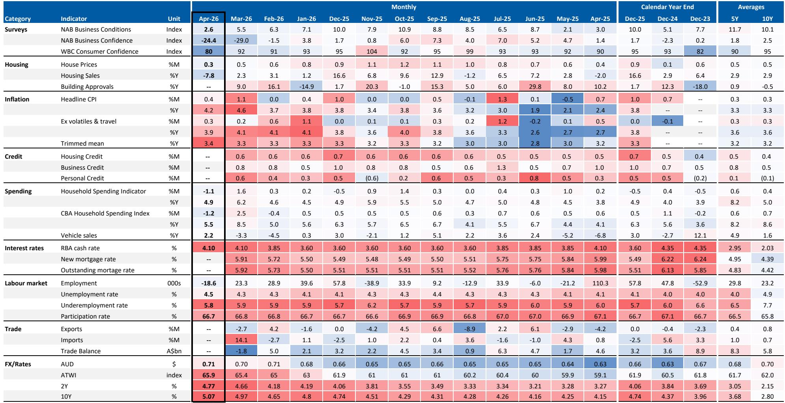
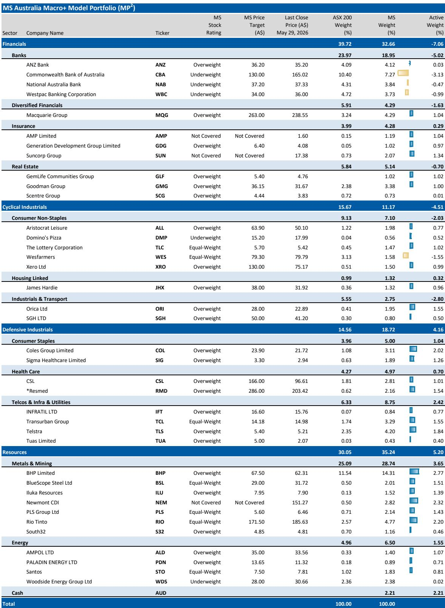
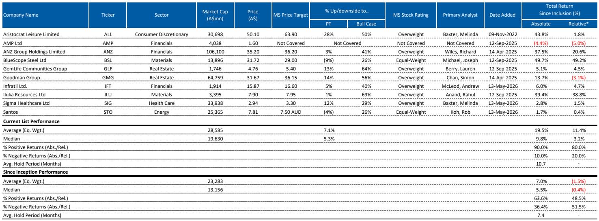

# Australia's Investment Case Has Fundamentally Changed: The Old Playbook No Longer Works

The Australian investment landscape has shifted more in the past three months than it did in the prior two years. A global investment bank's Mid-Year Outlook has made this clear: the structural assumptions that underpinned portfolio construction for Australian equities are no longer reliable. Investors who continue to rely on the same frameworks risk being caught offside by a regime that rewards selectivity over beta, patience over momentum, and sector-specific conviction over index-level exposure.

The central argument is straightforward but uncomfortable. The Australian economy is entering a phase where growth is slowing, inflation remains stubbornly above target, and the policy response from both the RBA and the federal government is creating a new set of constraints. This is not a cyclical pause. It is a structural recalibration. The implications for equity markets are profound, and they demand a rethinking of how investors allocate capital domestically.

What makes this moment particularly challenging is the confluence of forces that rarely align simultaneously. The RBA is trapped between slowing demand and elevated inflation, unable to cut rates but reluctant to hike further. The capex pipeline, while resilient in certain categories, is uneven and vulnerable in others. Consensus earnings expectations are pricing in double-digit growth that looks increasingly optimistic. And the labour market, the bedrock of consumer resilience for years, is showing clear signs of softening. Each of these factors alone would warrant attention. Together, they constitute a regime shift.

This article unpacks the five critical debates that define the current market environment, examines what the data is actually saying versus what consensus believes, and provides a decision framework for navigating the months ahead. The goal is not to offer a single forecast, but to equip serious investors with the analytical structure needed to make their own judgments.

## The RBA Is Boxed In: Slowing Growth Prevents Hikes, But Sticky Inflation Prevents Cuts

The most important constraint facing Australian markets today is the RBA's policy dilemma. Recent data shows a clear softening in domestic demand conditions. Business confidence has deteriorated, consumer sentiment remains depressed, and the housing market is beginning to buckle under the weight of higher rates and the tax increases announced in the FY27 Budget. In a normal cycle, this would be enough to signal the end of the tightening phase and the beginning of an easing bias.

But this is not a normal cycle. Inflation, particularly the trimmed mean measure that the RBA watches most closely, remains stubbornly above the target band. The April CPI print showed headline inflation falling from 4.6% to 4.2%, but that decline was driven by temporary fuel and public transport subsidies. The underlying picture is less encouraging. Trimmed mean CPI ticked up from 3.3% to 3.4% year-on-year, with a monthly increase of 0.31% that is still inconsistent with the RBA's target.

The implication is that the RBA has very little room to move in either direction. Weaker growth gives the central bank space to hold steady, but it does not justify a pivot to dovishness. The RBA's communication will likely remain hawkish, emphasizing that further rate hikes remain possible if demand does not soften enough. A genuine shift in tone will require not just softer growth, but softer inflation trends—something that is unlikely to materialize until next year at the earliest.

For equity investors, this means the tailwind of lower rates is not coming anytime soon. The valuation support that markets often rely on during slowdowns will be absent. The ASX 200 is already trading at a 12-month forward P/E multiple of 16.7x, above its long-term average of 14.9x. Without rate relief, multiple expansion becomes unlikely, and the burden of generating returns falls entirely on earnings delivery.

## The Capex Pipeline Is Resilient, But Only In Specific Categories, Not Across The Board

One area where the outlook is more constructive is capital expenditure. The report identifies a policy-linked capex pipeline that is relatively insulated from higher rates and softer economic conditions. This is not a blanket endorsement of all capex categories, but a targeted assessment of where structural tailwinds are strongest.

The six key categories identified—defence, energy transition, resources, data centres, housing, and Olympics-related spending—are projected to rise from approximately A$225 billion in FY25 to A$326 billion by FY30. That is a meaningful increase, and it provides an important buffer for the domestic economy. But the composition matters enormously.

Defence spending is being driven by the A$53 billion additional funding announced in the Federal Budget, which is policy-driven and largely non-discretionary. Energy transition and security spending benefits from a A$15 billion energy security package. Data centre investment is surging, with computer equipment imports reaching unprecedented levels in March, signalling that the global demand for digital infrastructure is manifesting in Australia. Resources capex is supported by commodity prices and a A$1 billion funding commitment for the Critical Minerals Strategic Reserve.

Housing is the outlier. While there are medium-term structural tailwinds from population growth and supply constraints, the near-term cyclical headwinds from higher rates and the announced tax changes to negative gearing and capital gains are likely to dominate. The report is clear: near-term cyclical headwinds will outweigh medium-term structural tailwinds for housing. This is a critical distinction for investors who might be tempted to treat all capex as equally resilient.

The so-what for portfolio construction is that exposure to capex needs to be granular. Broad-based infrastructure or industrial exposure may not capture the true opportunity set. Investors need to differentiate between categories that have policy support and global tailwinds, and those that are more sensitive to domestic cyclical conditions.

## Consensus Earnings Expectations Are Too High, And The Risk Of A Correction Is Real

The divergence between consensus earnings expectations and the report's top-down models is one of the most striking features of the current market. Consensus is forecasting EPS growth of 11.9% for FY26 and 12.3% for FY27. The report's own models point to a much more cautious outlook, with FY27 growth estimated at roughly 6%.

This gap is not small. It represents a material downside risk to index-level returns, particularly given that the market is already trading above its long-term average valuation. If earnings fail to meet consensus expectations, the combination of lower earnings and a potential de-rating could produce significant weakness in the broader market.

However, the report offers an important nuance. The Resources sector is currently providing a meaningful portion of market earnings growth, and earnings in that sector are expected to remain relatively well supported. The downside risk is much more pronounced ex-Resources. This creates a rotation dynamic where the index may not fall as sharply as some fear, but the composition of returns will shift dramatically.

For investors, this means that passive exposure to the ASX 200 is not a safe bet. The index may hold up better than expected due to the weight of Resources, but the underlying earnings deterioration in other sectors will eventually become visible. Active sector selection and stock picking will be essential to navigate this environment.

## The Labour Market Is Turning, And The Second-Order Effects Will Be Broad

For years, the strength of the Australian labour market has been a key support for consumer spending and the broader economy. Employment has been robust, unemployment has remained low, and wage growth has been steady. That narrative is now under threat.

The report expects the unemployment rate to rise to 4.7% by year-end and continue increasing into 2027. Forward indicators are turning negative. Employment intentions are softening, and unemployment expectations are rising. While government spending provides some support, private sector employment is expected to slow meaningfully.

The second-order implications are significant. A softer labour market will drive more consumer caution, weaker sentiment, and potentially lower spending. This creates a feedback loop: weaker consumer spending leads to weaker corporate earnings, which leads to further labour market weakness. The report also flags the prospect of AI-driven labour market impacts, with a weaker revenue environment potentially accelerating structural changes in employment.

For equity investors, this means that sectors exposed to domestic consumer spending face headwinds that are only beginning to be priced in. The consumer discretionary sector, which has historically been sensitive to oil price declines and could benefit from a resolution to Middle East energy disruption, may not be the safe haven it appears to be. The domestic headwinds facing the sector are simply too strong to ignore.

## What The Report Leaves Unanswered: Three Critical Open Questions

While the report provides a comprehensive framework, it also leaves several important questions unresolved. These are not gaps in analysis, but rather areas where the outcome depends on factors that are inherently uncertain.

First, how quickly will the labour market deteriorate, and will the RBA be forced to respond? The report expects unemployment to rise gradually, but the path is highly uncertain. A sharper deterioration could change the RBA's calculus more quickly than anticipated, particularly if it begins to weigh on inflation through weaker demand. Conversely, if the labour market holds up better than expected, the RBA may feel more comfortable maintaining a hawkish stance.

Second, how much of the capex pipeline is contingent on policy implementation? The defence and energy transition spending is policy-driven, but policy implementation is never guaranteed. Delays, budget overruns, or political changes could alter the trajectory. Investors need to monitor not just the headline spending numbers, but the actual pace of project approvals and construction starts.

Third, what is the true earnings downside if the global economy weakens? The report focuses on domestic factors, but Australia is not immune to global developments. A sharper slowdown in China, a recession in the United States, or a prolonged period of elevated global interest rates could all have significant spillover effects on Australian earnings, particularly in the Resources sector.

## A Decision Framework For Navigating The New Regime

For investors looking to translate this analysis into actionable decisions, the following framework may be useful. It is not a set of recommendations, but a structure for thinking through the key trade-offs.

Start with the macro regime. The current environment is characterized by slowing growth, sticky inflation, and a central bank that is unable to provide support. This is not a backdrop that favors beta. Index-level returns are likely to be constrained, and the burden of outperformance will fall on stock selection.

Next, assess sector exposure through the lens of the capex pipeline. Favor sectors that benefit from policy-driven and globally supported capex, such as defence, energy transition, data centres, and resources. Be cautious on sectors that are more dependent on domestic cyclical conditions, particularly housing and consumer discretionary.

Third, scrutinize earnings expectations. Consensus is pricing in robust growth that may not materialize. Look for companies where earnings are supported by structural tailwinds rather than cyclical optimism. Be prepared for earnings downgrades in sectors that are exposed to domestic consumer spending and labour market weakness.

Fourth, monitor the labour market closely. It is the most important leading indicator for consumer spending and corporate earnings. If unemployment rises faster than expected, the implications for consumer-exposed sectors will be severe. If it holds steady, the downside may be more limited.

Finally, maintain flexibility. The regime shift described in this report is still unfolding. The data will continue to evolve, and the market will reprice accordingly. The investors who succeed in this environment will be those who are willing to challenge consensus, question assumptions, and adapt their portfolios as new information emerges.

Join the community to read the full report and review the original charts.

*This article is for learning and discussion only and does not constitute investment advice.*

Personal reading notes and learning share only. Not investment advice.

