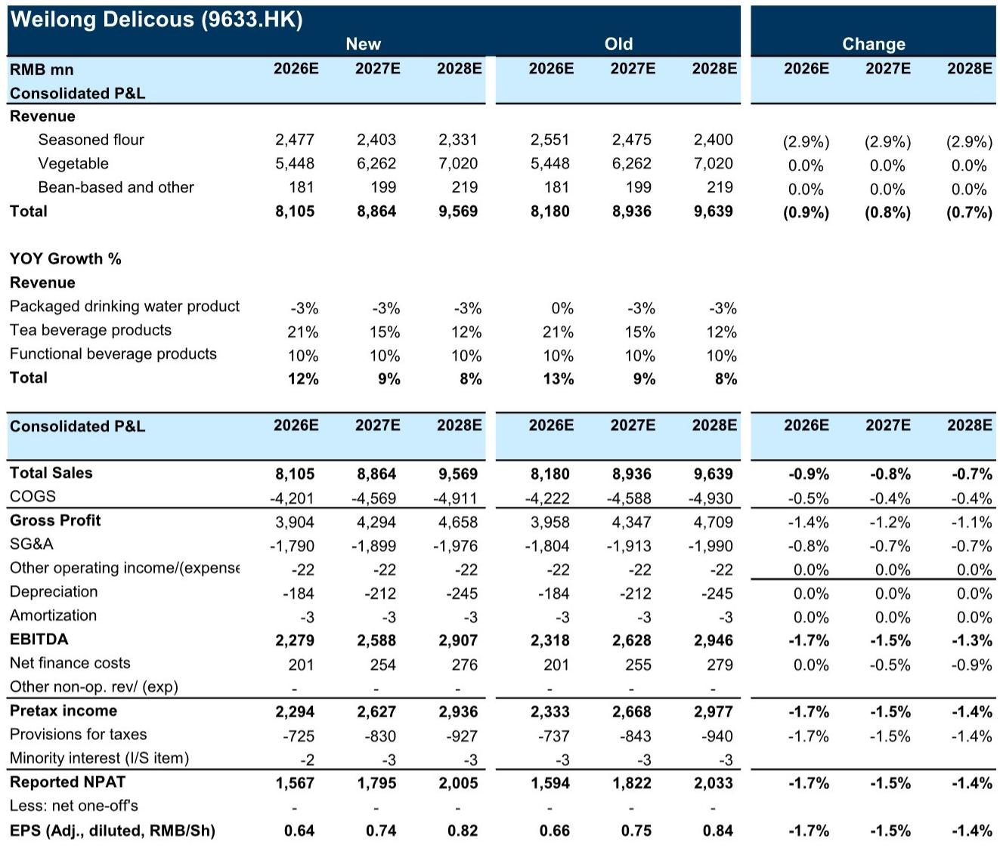
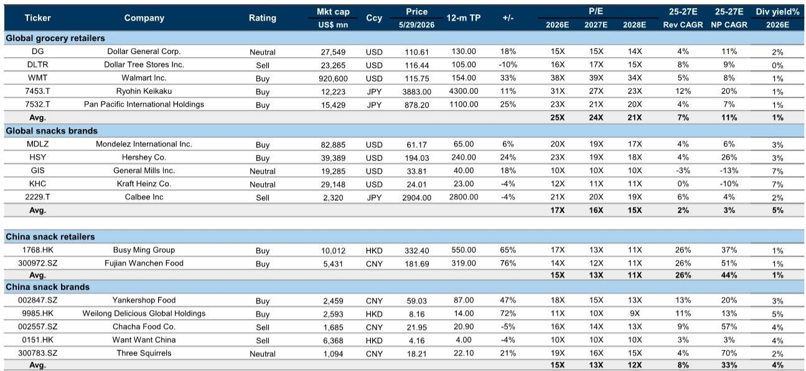
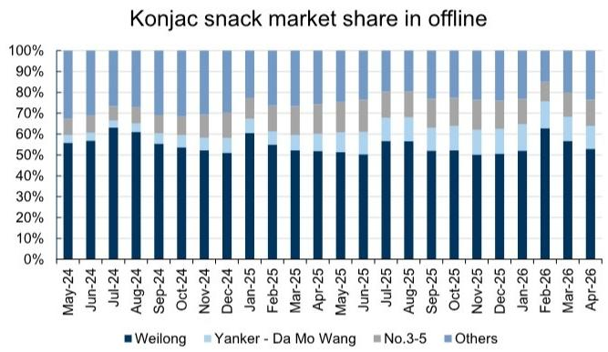

# China Snack Leaders Are Not a Cyclical Bet: They Are a Structural Play on Distribution Disruption and Input Cost Asymmetry

The conventional narrative surrounding China's snack sector is that it is a seasonal, commoditized business, prone to swings in consumer sentiment and raw material prices. A second-quarter slowdown, as we are currently seeing, would therefore seem to confirm this bearish view. This interpretation is incomplete and, for the leading players, actively misleading. The market is currently pricing in a cyclical risk that is actually structural in nature, and it is doing so at precisely the moment when the two dominant snack companies, Yankershop Food and Weilong Delicious Global Holdings, are positioned to deliver a second-half earnings surge that most models are underestimating.

The sell-off that has erased up to 9% of market value from these names quarter-to-date is not a rational response to a temporary demand dip. It is a misreading of the three forces that are reshaping the Chinese snack industry: the relentless expansion of value retail channels, the idiosyncratic deflation of a key raw material, and the widening market share gap in the fastest-growing product category. The data from the first half of the 2026 fiscal year (1H26) tells a story of resilience, not fragility. The real risk for investors is not that these companies will disappoint, but that they will miss the entry point before the second-half recovery becomes obvious.

This article argues that the current weakness is a buying opportunity. The core thesis rests on a simple but powerful insight: the combination of channel tailwinds, cost tailwinds, and product mix improvement creates a period of asymmetric upside for the leaders, while the risks that worry the market are either temporary or already priced in. We will walk through the evidence, identify what the research does not yet fully clarify, and provide a decision framework for investors navigating this inflection point.

## The Value Retail Channel Is Not a Fad; It Is a Structural Reshaping of the Snack Distribution Map

The most important single fact for understanding the current state of Chinese snacks is not a demand number, but a store count. Year-to-date, the leading value retail chains have each opened approximately 2,500 new gross stores. This pace is tracking ahead of the full-year target of 4,000 to 5,000 new stores per system, implying year-on-year store count growth of 34% to 41%. These are not marginal expansions. They represent a fundamental re-routing of how snacks reach Chinese consumers.

For Yankershop and Weilong, this channel shift is existential in the most positive sense. Yankershop maintains roughly 35% to 39% sales exposure to value retailers, while Weilong sits at approximately 33% to 36%. These are not small allocations; they are the primary growth engine. The second quarter is traditionally an off-peak season for the snack industry, following the Chinese New Year sell-in. But the value retail channel does not follow the same seasonal rhythm. Its expansion is driven by store openings, which are scheduled and executed on a corporate timeline, not a consumer calendar. The 2Q slowdown that has spooked the market is a legacy phenomenon of the traditional channel, not a reflection of the emerging channel's momentum.

The implication is clear. The summer peak, which is the next major consumption event, will be the first real test of how these new stores perform during a high-traffic period. Given that the store base is significantly larger than it was a year ago, the absolute volume opportunity for Yankershop and Weilong is substantially higher. The second-half recovery that the research projects is not a hope; it is a mathematical consequence of a larger distribution network entering its peak season. Investors who wait for confirmation in the third-quarter data will be buying after the re-rating has already begun.

## Konjac Is the Margin Story That the Market Is Underpricing

The product-level data reinforces the channel story, but it adds a layer of specificity that is even more compelling. Konjac, the jelly-like snack that has become the fastest-growing subcategory in Chinese snacks, continues its strong trajectory. Yankershop is on track to deliver konjac growth of over 30% year-on-year in the second quarter and first half of 2026. Weilong is expected to deliver approximately 20% growth in the same period. These are not small numbers in a category that is already large and growing.

What makes this product-level performance so strategically important is the market share dynamic. As of April 2026, Weilong's offline market share in the konjac snack category stood at 52.9%, up from 51.9% a year earlier. Yankershop's share, through its Da Mo Wang brand, reached 11.0%, up from 8.3%. The combined share of the top two players has increased from roughly 60% to nearly 64% over the past twelve months. This is happening despite the fact that the category is attracting new entrants and private-label competition. The leaders are not just growing; they are consolidating their position.

The conventional worry about rising competition is valid for the category as a whole, but the data shows that it is not yet translating into market share loss for the leaders. On the contrary, the leaders are gaining share. The question is why. The answer lies in brand equity, distribution scale, and, increasingly, cost advantage. The raw material cost for konjac has declined approximately 25% from its peak, and the trajectory points further downward into the second half. Both Yankershop and Weilong are beneficiaries of this trend, but the impact is not symmetrical. Yankershop has locked in the majority of its key raw materials for the full year, giving it a cost visibility that smaller competitors lack. This creates a margin buffer that can be used either to protect profitability or to invest in price-led market share gains.

The so-what for investors is direct. The earnings revision in the research is minimal, with cuts of only 0% to 2% for Yankershop and Weilong, respectively. These cuts are driven by short-term softness in legacy product lines, not by any deterioration in the core konjac business or the value retail channel. The margin story for the second half is actually improving, not deteriorating. The market is looking at the headline earnings revision and missing the direction of the underlying margin trajectory.

## The Legacy Product Weakness Is a Distraction, Not a Threat

No investment thesis is without its counterpoints, and the current research does identify genuine softness in certain product lines. Weilong's seasoned flour products and Yankershop's unpackaged products, both of which are linked to traditional distribution channels, are experiencing year-on-year declines. Weilong is also navigating a short-term organizational restructuring that has weighed on its e-commerce performance, while Yankershop's e-commerce channel is undergoing a 30% year-on-year decline in the second quarter.

These are real issues, but they must be contextualized. The legacy product lines are in secular decline, not cyclical decline. The traditional channels they serve are being structurally displaced by value retail and e-commerce. The organizational restructuring at Weilong is a deliberate move to reposition the company for the new channel reality, not a sign of operational distress. And the e-commerce declines at both companies are largely a function of comparison base effects and channel mix shifts, not a loss of consumer appeal. The research expects Yankershop's e-commerce to return to year-on-year growth in the second half, and Weilong's e-commerce to accelerate in the first half versus the second half of 2025.

The critical analytical mistake would be to overweight these legacy weaknesses relative to the structural strengths. The legacy products contribute a shrinking share of revenue and an even smaller share of profit growth. The konjac and value retail businesses contribute the vast majority of the incremental earnings power. Investors who focus on the declining parts of the portfolio will systematically underestimate the earnings power of the growing parts. This is a classic case of looking at the average rather than the marginal. The marginal dollar of revenue is coming from high-growth, high-margin konjac sold through expanding value retail stores. That is the metric that matters.

## What the Research Does Not Yet Fully Answer: The Sustainability of the Raw Material Tailwind

The research is clear on the direction of raw material costs, but it leaves an important question open: how sustainable is the konjac raw material deflation? The data shows a 25% decline from the peak, with ongoing trajectory into the second half. But konjac is an agricultural product, subject to planting decisions, weather patterns, and supply chain dynamics that are inherently unpredictable. The research's base case assumes a 15% year-on-year decline in raw material costs for 2026, but this is an estimate, not a certainty.

The risk is not that costs will spike back to 2024 levels, but that the pace of decline slows or stabilizes sooner than expected. If that happens, the margin expansion that is built into the second-half earnings expectations would be partially offset. The research does not model a scenario where raw material costs flatten, nor does it provide a sensitivity analysis for how earnings would change under different cost assumptions. This is a meaningful gap for investors who want to stress-test the thesis.

A related question is whether the raw material cost decline is being driven by supply-side factors that could reverse, or by structural changes in the konjac farming industry that are more durable. If the decline is simply a correction from an unsustainable spike in 2024, then the tailwind has a natural expiration date. If it reflects a structural increase in planting area or processing efficiency, then the benefit could persist for multiple years. The research leans toward the latter interpretation, but the evidence is not yet conclusive. Investors should watch the next planting season and the commentary from raw material suppliers for clues.

## A Decision Framework for the Second-Half Inflection

For investors considering a position in China snack leaders, the decision framework should be based on three sequential questions.

First, do you believe the value retail channel expansion will continue at or above current targets? This is the most important question because it determines the volume growth trajectory. The year-to-date store opening data is encouraging, but it is a short time series. The risk is that store opening fatigue sets in, or that the value retailers themselves face margin pressure and slow their expansion. The research assumes continued strong growth, and the valuation of both Yankershop and Weilong depends on this assumption.

Second, do you believe the konjac category will maintain its growth momentum and that the leaders will continue to gain share? The market share data through April is positive, but the competitive landscape is dynamic. Private labels are becoming more sophisticated, and new entrants are targeting the category. The leaders' advantage in distribution and brand equity is real, but it is not unassailable. The question is whether the cost advantage from raw material deflation will be used to defend market share or to expand margins. The research implies both, but the trade-off is real.

Third, do you believe the earnings growth implied by the current valuation is achievable? Yankershop is trading at 18x 2026 estimated earnings, while Weilong is at 11x with a 5% dividend yield. These multiples are not demanding for companies that are expected to deliver 27% and 12% net income growth, respectively, in the second half. But the multiples are also not pricing in a significant upside surprise. The market is cautious, and the consensus is skeptical. The opportunity lies in the gap between the cautious valuation and the structural improvement in the business fundamentals.

Investors who answer yes to all three questions should view the current weakness as an entry point. Those who are uncertain on any of the three should wait for more data, but they should also recognize that the second-half recovery will likely be priced in before it is fully visible in the reported numbers.

## The Full Picture Requires the Charts

The argument presented here is based on a reading of the research data, but the full picture requires seeing the original charts. The market share trajectory in Exhibit 1 shows the steady consolidation of Weilong and Yankershop in the konjac category over the past 24 months, a pattern that is not obvious from the text alone. The raw material cost chart in Exhibit 2 illustrates the magnitude of the decline from the 2024 spike and the ongoing trajectory into 2026, which is central to the margin thesis. The global snack brand comp sheet in Exhibit 4 provides the valuation context that anchors the buy recommendation.

These charts contain nuance that cannot be fully captured in a written summary. The market share data shows not just the level but the volatility, revealing how seasonal factors and promotional activity affect the competitive balance. The raw material cost data shows the multi-year pattern, revealing that the current decline is part of a longer cycle. The valuation comps show how China snack brands are trading at a discount to global peers despite higher growth rates.

Join the community to read the full report and review the original charts. The data tells a story that is more compelling than the market currently believes. The second-half inflection is coming, and the best time to understand it is before it arrives.

*This article is for learning and discussion only and does not constitute investment advice.*

Personal reading notes and learning share only. Not investment advice.

