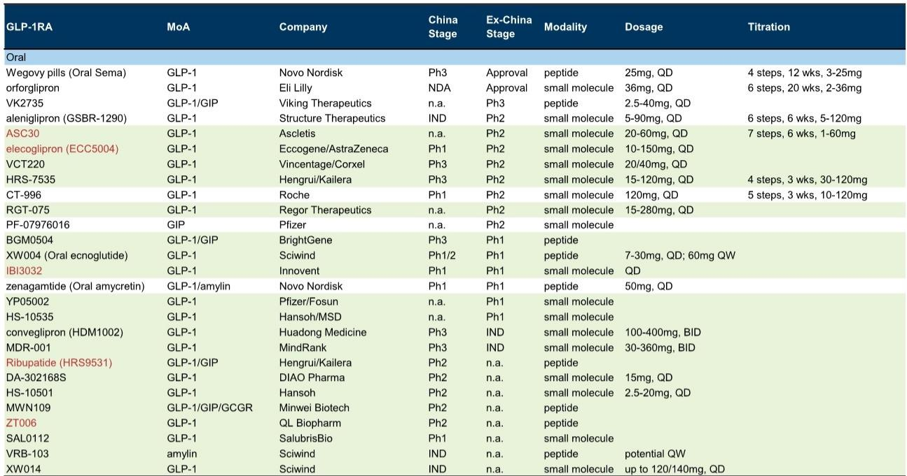
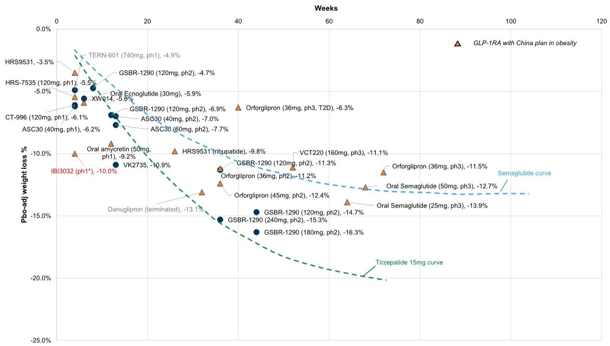
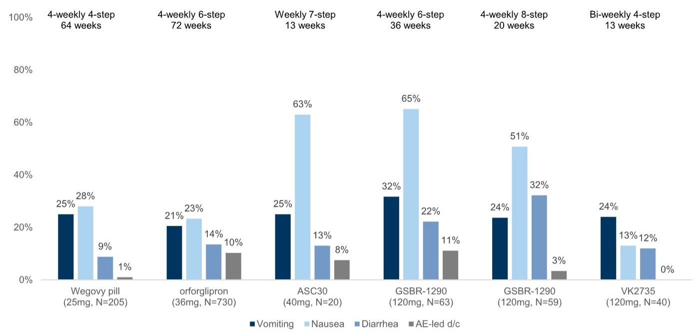

# The Oral GLP-1 Race Is Entering Its Decisive Phase, and China-Based Assets Are Becoming the Center of Gravity

The global obesity market is on the cusp of a structural shift that will redefine competitive dynamics for the next decade. Injectable semaglutide, long the standard-bearer, is approaching patent expiry, and generic entrants are preparing to compress margins in the injectable segment. The real prize, however, is the oral obesity pill market, projected to reach over USD 35 billion by 2030 and capture roughly 35% of the total addressable market. The approval of Wegovy pills and Eli Lilly's Foundayo (orforglipron) has already established a high bar for efficacy and tolerability. But the next wave of competition is not coming from the usual Western pharma giants alone. A growing pipeline of oral GLP-1 candidates originating from China is advancing through late-stage trials, and the upcoming American Diabetes Association (ADA) conference in June 2026 will serve as a critical inflection point for investors to assess which assets have genuine differentiation.

This is not a story about incremental improvement. It is about whether Chinese biotech and pharma companies can translate early-stage promise into global commercial relevance. The ADA readouts for Innovent's IBI3032 and Hengrui's broad GLP-1 franchise will provide the first substantive data points to test that thesis. Investors should approach these updates with a clear framework for what constitutes a winning profile in an increasingly crowded field, and they must recognize that the tolerance for ambiguity in early-stage data is shrinking.

## The Competitive Bar Has Been Raised: 15% Weight Loss and Sub-20% Vomiting Rates Are Now the Baseline Expectations

It is no longer sufficient for a new oral GLP-1 candidate to show efficacy. The market has moved past that. With Wegovy pills delivering 13.9% placebo-adjusted weight loss and orforglipron achieving 11.5%, the threshold for what is considered competitive has been reset. More importantly, the focus has shifted decisively to tolerability, specifically the rate of vomiting, which is the most severe and patient-deterring adverse event. The bar here is clear: any new entrant must demonstrate a vomiting rate below 20% to be considered viable in a primary care setting, where ease of administration and patient adherence are paramount.

The early-stage data from several candidates, including Structure Therapeutics' aleniglipron (GSBR-1290), showed higher weight loss at higher doses but also elevated gastrointestinal side effects. This creates a strategic tension. The "lower and slower" dose titration strategy, which involves gradual dose escalation over many weeks, has emerged as a key mechanism to improve tolerability. However, this approach also extends the time to reach therapeutic efficacy and complicates trial design. Investors must now evaluate not just the raw efficacy numbers but the entire dosing regimen and the tolerability profile at each step. A candidate that achieves 15% weight loss but requires a 20-week titration with significant nausea will struggle to compete against a drug that offers 12% weight loss with a simpler, better-tolerated regimen.

The implication is clear: the next generation of oral GLP-1 drugs will be judged on their therapeutic index, not just peak efficacy. The data from the ADA conference will be the first major test of whether any China-originated asset can meet this dual standard.

## Innovent's IBI3032 Readout Is a High-Stakes Signal of Global Potential, but the Timeline Gap Is a Major Headwind

Innovent's IBI3032, a small-molecule oral GLP-1 agonist, has generated significant interest based on management commentary that it achieved 10% weight loss in just four weeks. This is an impressive early signal, but it comes with substantial caveats. The Phase 1 single-ascending-dose (SAD) and multiple-ascending-dose (MAD) data to be presented at ADA will need to answer three critical questions.

First, sample size matters. Management has indicated that over 100 patients have been dosed, but the data presented may only cover a subset of 20 to 30 patients. While this is comparable to early-stage readouts from peers, it leaves room for random variation. A small sample can amplify apparent efficacy or mask tolerability issues. Second, dose dependency is crucial. The 10% weight loss figure was achieved at an undisclosed dose level. Investors need to understand the dose-response curve to gauge the therapeutic window. If the efficacy is only achieved at doses that cause significant GI toxicity, the asset loses its differentiation. Third, the tolerability delta between SAD and MAD will provide early clues about the feasibility of a "lower and slower" titration strategy. An improvement in tolerability from single to multiple dosing would be a positive sign.

The most significant strategic concern, however, is timing. IBI3032 is approximately 2.5 years behind aleniglipron and 1.5 years behind Ascletis' ASC30, both of which are targeting global Phase 3 initiation in the second half of 2026. In a market where first-mover advantage in establishing prescription habits and payer relationships is substantial, being two years late is a serious disadvantage. Innovent's path to value creation hinges not just on data quality but on its ability to execute global clinical trials efficiently and potentially partner with a large Western pharmaceutical company for commercialization. The ADA readout will either validate the asset's differentiation or confirm that it is a fast follower in a race where the leaders are already pulling away.

## Hengrui Is Building a Full-Spectrum GLP-1 Portfolio, and the Strategy Is About Synergy, Not a Single Blockbuster

While Innovent is placing a concentrated bet on IBI3032, Hengrui is pursuing a fundamentally different strategy: constructing a comprehensive GLP-1 franchise that spans oral small molecules, oral peptides, injectable combinations, and multi-target agonists. At the ADA conference, Hengrui will present multiple datasets that collectively illustrate this breadth.

The oral GLP-1/GIP peptide HRS9531 will disclose detailed Phase 2 obesity data, building on a previously reported 9.8% weight loss at week 26. The key question here is not whether it works, but whether the dosing regimen and safety profile are competitive. Beyond obesity, Hengrui is also studying HRS9531 in polycystic ovary syndrome, signaling an intent to expand into adjacent metabolic indications where GLP-1 therapies could have significant impact. This indication expansion is a strategic move to differentiate the asset in a crowded field by targeting patient populations with high unmet need and potentially less competitive intensity.

The company's oral small-molecule GLP-1, HRS7535, has already met primary endpoints in a Phase 3 diabetes trial, with an NDA filing planned for 2026. This candidate is on a clear path to market in China, providing a near-term revenue catalyst. Meanwhile, the next-generation triple agonist HRS-4729 (GLP-1/GIP/GCG) showed a 16% weight loss at week 12, though with a placebo-adjusted efficacy of 10.6%, which appears slightly lower than a competitor's data. The breadth of the pipeline means that Hengrui is not dependent on any single asset. The strategic question for investors is whether this portfolio approach creates synergies in manufacturing, commercialization, and physician education, or whether it dilutes focus and R&D resources.

The real value of Hengrui's strategy may lie in combination therapy. The fixed-dose combination of GLP-1 and insulin (HR17031) represents a push into the diabetes market where patients have already failed on monotherapy. If Hengrui can demonstrate that its oral GLP-1 assets can be effectively combined with other modalities, it could carve out a unique position in the treatment algorithm.

## The Report Leaves Unanswered Questions About Commercial Viability and the Impact of Generic Erosion

Despite the wealth of data expected at ADA, several critical questions remain unresolved. The most important is commercial viability. Efficacy and tolerability data from clinical trials do not directly translate into real-world prescription patterns. The initial prescription trends for Wegovy pills and orforglipron are being closely watched, but it is too early to draw definitive conclusions about patient adherence, payer coverage, and the speed of adoption in primary care. For Chinese assets aiming to compete globally, the ability to navigate the U.S. payer landscape and secure favorable formulary positioning is a separate and equally challenging hurdle.

Another open question is the impact of generic injectable semaglutide. As patents expire, a wave of lower-cost injectable GLP-1s will enter the market, potentially compressing the premium that oral drugs can command. The report acknowledges this dynamic but does not fully model the second-order effects. If generic injectables achieve significant market share at lower prices, the addressable market for oral GLP-1s could be smaller than current projections, or the pricing power of novel oral agents could be constrained. Investors need to stress-test their assumptions about market size and pricing in a scenario where generic competition is more aggressive than anticipated.

Finally, the question of global clinical execution for Chinese companies remains a significant unknown. Innovent and Hengrui have strong domestic capabilities, but conducting large, multi-national Phase 3 trials requires infrastructure, regulatory expertise, and relationships with clinical sites that are still being built. The risk of delays, data quality issues, or regulatory setbacks is non-trivial. The ADA readouts will provide data, but they will not answer whether these companies can execute on a global scale.

## A Decision Framework for Evaluating Oral GLP-1 Assets: Four Filters for Investors

Given the volume of data expected and the complexity of the competitive landscape, investors need a systematic approach to filter signal from noise. The following four-question framework can be applied to any oral GLP-1 readout, whether from Innovent, Hengrui, or their peers.

First, does the asset demonstrate a clear tolerability advantage over the approved standard of care? The bar is a vomiting rate below 20% in a well-designed titration regimen. If a candidate cannot meet this threshold, its commercial potential is severely limited, regardless of efficacy.

Second, is the efficacy profile achieved at a dose that allows for a practical titration schedule? A drug that requires 20 weeks of gradual dose escalation to reach therapeutic levels will face significant adherence challenges. Simpler, faster titration schemes are a competitive advantage.

Third, does the asset offer a differentiated mechanism or indication that expands the addressable market? Pure GLP-1 agonists are becoming commoditized. Assets that target multiple receptors (GIP, GCG, amylin) or that address specific patient populations (PCOS, NASH, or combination with insulin) have a clearer path to differentiation.

Fourth, what is the timeline to market, and does the company have a credible global commercialization strategy? Being two years behind the leaders is a major disadvantage. Investors should assess whether the company has the resources, partnerships, and regulatory experience to close that gap.

Applying this framework to the upcoming ADA readouts will allow investors to move beyond headline numbers and make informed judgments about which assets have the potential to become commercially meaningful.

## The ADA Conference Will Separate Signal from Noise, but the Full Picture Requires Deeper Analysis

The upcoming ADA conference represents a pivotal moment for the oral GLP-1 landscape, particularly for China-originated assets. The data from Innovent's IBI3032 and Hengrui's multi-asset franchise will provide the first substantive evidence of whether these companies can compete at a global level. The stakes are high, and the market's reaction will likely be sharp. But a single conference readout, no matter how detailed, cannot answer all the questions that matter for long-term investment decisions.

The unresolved issues around commercial execution, generic competition, and global clinical capabilities require ongoing analysis. The original report from which this article is derived contains detailed charts, data tables, and financial models that provide the necessary context to make informed judgments. For serious investors who want to move beyond the headlines and build a robust thesis on the oral GLP-1 opportunity, the full report is an essential resource.

Join the community to read the full report and review the original charts.

*This article is for learning and discussion only and does not constitute investment advice.*

Personal reading notes and learning share only. Not investment advice.

