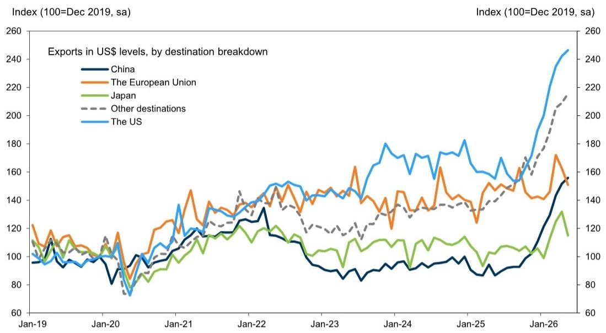
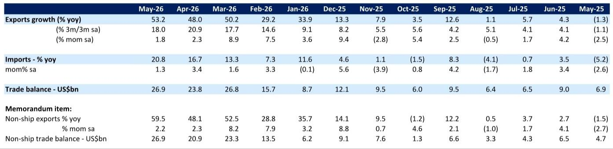
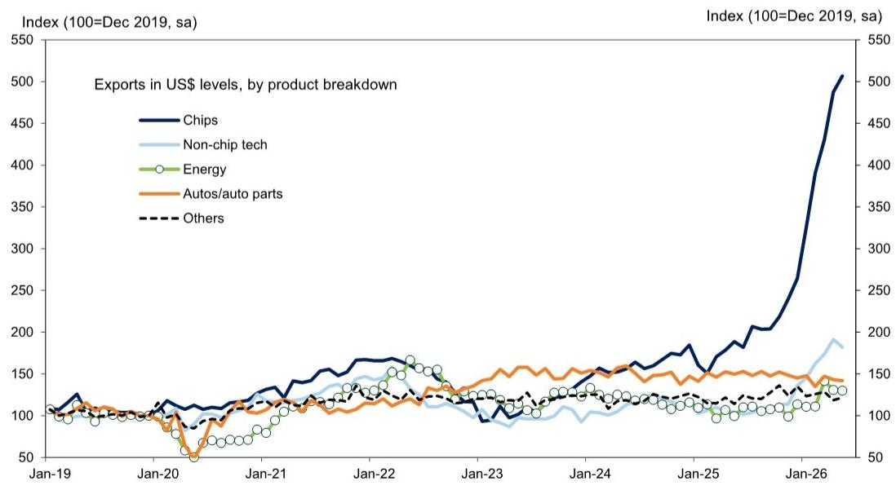

# South Korea's Export Surge Is a Semiconductor Story, Not a Broad Recovery — and That Changes the Risk Calculus

South Korea's headline export numbers for May were undeniably strong. At 53.2% year-on-year growth, the figure beat an already-aggressive consensus estimate and extended a six-month streak of sequential increases. On the surface, this looks like a textbook case of an export-driven economy firing on all cylinders. But a closer look at the composition reveals a far more nuanced picture — one that carries significant implications for investors, supply chain strategists, and macro forecasters.

The headline masks a critical divergence. Semiconductor exports powered ahead with 3.9% month-on-month seasonally adjusted growth, sustaining a multi-month momentum. Yet virtually every other major category — autos, auto parts, machinery, ships, and energy-related products — declined. Non-tech exports collectively fell 2.8% month-on-month, accelerating their downward trajectory from the prior month. Even within the tech sector, non-chip categories such as computers, handsets, and household appliances posted their first decline since mid-2025.

This is not a broad-based recovery. It is a semiconductor-driven phenomenon with the rest of the export basket acting as a drag. For anyone making decisions based on Korea's trade data — whether allocating capital to Asian equities, assessing global demand signals, or positioning for currency moves — the distinction between the headline and the underlying composition is not an academic detail. It is the central analytical challenge.

The data also reveals a geographic bifurcation that reinforces the sectoral story. Exports to ASEAN, China, Japan, and the United States all rose, with ASEAN leading at 17.4% month-on-month growth. But exports to the European Union dropped 4.2%. The pattern suggests that the semiconductor boom is concentrated in markets with heavy tech manufacturing and data center buildout, while traditional industrial demand in Europe remains weak. The question that follows is whether this divergence is cyclical, structural, or some combination of both.

## The Semiconductor Engine Is Running Hot, but It Is Running Alone

The most striking feature of the May data is how dependent the entire export machine has become on a single product category. Semiconductor exports have now risen for nine consecutive months on a seasonally adjusted basis. The 3.9% month-on-month gain in May, while slightly below the blistering pace of prior months, still represents a level of sustained momentum that is historically unusual.

To understand the magnitude, consider that the sequential growth in semiconductor exports has been running at double-digit rates in several recent months. Even a moderation to 3.9% is strong by any standard. The year-on-year comparisons are even more dramatic, driven partly by base effects from the prior year's trough, but also by genuine volume and pricing power in the global chip market.

The strategic implication is straightforward: Korea has become a leveraged play on global semiconductor demand. When chip demand is strong, the headline numbers look spectacular. When chip demand falters, the rest of the export basket is not strong enough to compensate. This asymmetry creates a risk profile that is far more binary than the aggregate data suggests.

For investors, this means that forecasting Korea's trade trajectory requires a view on semiconductor cycles — not a general view on global trade. The traditional indicators of export health, such as shipping volumes, industrial production indices, or purchasing managers' surveys for manufacturing, may be misleading if they do not adequately capture the semiconductor weighting.

The report's data also shows that non-chip tech exports fell 4.7% month-on-month, the first decline in nearly a year. This includes categories like computers and handsets, which are typically associated with consumer electronics demand. The weakness here suggests that the consumer side of the tech cycle may be softening, even as the infrastructure and data center side — which drives semiconductor demand — remains robust. This divergence within the tech sector itself is worth monitoring closely.

## Non-Tech Exports Are in a Quiet Recession, and That Matters

While the semiconductor story dominates the headlines, the non-tech export picture is deteriorating. The 2.8% month-on-month decline in May follows a 1.9% decline in April. The pace of contraction is accelerating, and the weakness is broad-based.

Autos and auto parts, traditionally a pillar of Korean exports, are declining. Machinery exports are falling. Ships, which can be lumpy but are generally a sign of industrial competitiveness, are weak. Energy-related products are also down. This is not a single sector in trouble; it is a broad swath of the industrial economy losing momentum.

The so-what here is twofold. First, the weakness in non-tech exports raises questions about the health of the global industrial cycle outside of technology. If Korea's non-tech exports are declining, it suggests that demand for capital goods, vehicles, and industrial equipment is soft in key markets. That is a signal for global growth expectations.

Second, the divergence between tech and non-tech creates a policy dilemma for Korean authorities. If the central bank or government tries to stimulate the economy broadly, they risk overheating the already-hot semiconductor sector while doing little to revive the struggling non-tech industries. The transmission mechanisms are different, and the policy tools are blunt.

For businesses with exposure to Korean supply chains, this means that the risk profile varies enormously by sector. Companies sourcing semiconductors from Korea face tight supply and rising prices. Companies sourcing auto parts, machinery, or industrial equipment face a different dynamic — one of weakening demand and potential price discounting.

## The Geographic Pattern Reveals a Two-Speed Global Economy

The destination breakdown of Korea's exports adds another layer of analytical richness. Exports to ASEAN surged 17.4% month-on-month, accounting for the entire headline increase. Exports to China rose 5.3%, and exports to Japan rose 6.8%. Exports to the United States continued their eight-month streak of gains at a solid 3.0% pace.

But exports to the European Union fell 4.2% month-on-month. This is not a small blip; it is a meaningful decline in a major market.

The pattern suggests that the global economy is operating at two speeds. One speed, driven by technology investment, data center construction, and AI-related infrastructure, is concentrated in Asia and the United States. The other speed, characterized by slower industrial demand and weaker consumer confidence, is more pronounced in Europe.

For investors, this geographic divergence has portfolio implications. Exposure to Asian tech supply chains and US tech demand looks relatively attractive. Exposure to European industrial cyclicals looks more challenged. The data from Korea's export destinations provides a real-time read on which regions are accelerating and which are decelerating.

The ASEAN story is particularly interesting. The 17.4% surge in exports to ASEAN suggests that the semiconductor supply chain is deepening its integration within Asia. Chips manufactured in Korea may be going to assembly and testing facilities in Southeast Asia before being shipped to final markets. This is a structural shift, not a cyclical one, and it has implications for how we think about trade flows and supply chain resilience.

## What the Report Does Not Fully Answer: The Sustainability of Semiconductor Demand

For all the detail in the May data, there is one question the report does not fully resolve: how sustainable is the current pace of semiconductor export growth?

The sequential growth rate has moderated from 10.5% in April to 3.9% in May. That could be a normalization after an unsustainably rapid pace, or it could be the early signal of a peak. The report notes that non-chip tech exports have already turned negative, which could be a leading indicator for the broader tech cycle.

The base effects that have flattered year-on-year comparisons will also begin to fade. As we move further into 2026, the comparison periods will include months that were already recovering, making it harder to sustain 50%+ year-on-year growth rates.

There is also the question of demand composition. The current semiconductor boom is heavily driven by AI-related chips, including high-bandwidth memory and logic chips for data centers. If AI investment spending decelerates — whether due to capacity constraints, regulatory changes, or shifts in corporate capital allocation — the semiconductor export machine could slow sharply.

The report does not take a firm view on these questions, and that is appropriate. The data alone cannot resolve them. But for readers trying to make decisions, these are the critical uncertainties that need to be monitored. The next few months of data will be telling. If semiconductor exports continue to moderate while non-tech exports remain weak, the narrative could shift from "Korea is booming" to "Korea is dependent on a single cyclical driver."

## A Decision Framework for Readers: How to Interpret Korea's Trade Data Going Forward

Given the complexity of the data and the divergence within it, readers need a structured way to assess what matters and what does not. Here is a framework for interpreting future releases.

First, ignore the headline year-on-year growth rate for exports. It is too heavily influenced by base effects and the semiconductor weighting. Instead, focus on the month-on-month seasonally adjusted change for semiconductors specifically. That is the single most informative number in the entire release.

Second, track the breadth of non-tech exports. If the decline in non-tech exports stabilizes or reverses, that would be a genuine positive signal for the broader economy. If it continues to accelerate, it confirms that the recovery is narrow and fragile.

Third, watch the European Union destination data. Europe is the weak link in the geographic picture. A recovery in EU-bound exports would signal that industrial demand is improving globally. Further weakness would reinforce the two-speed narrative.

Fourth, monitor the trade balance. The report notes that the trade surplus widened to a new historic high of $26.9 billion. That is a positive for Korea's external finances and currency. But if the surplus is driven entirely by semiconductor exports while everything else weakens, it is less indicative of broad-based economic health than a surplus driven by diversified export growth.

Fifth, pay attention to import data. The report shows that energy imports rose 11.3% month-on-month, while machinery imports fell 5.0%. Rising energy imports with weak machinery imports suggest that the economy is consuming more energy but not investing in productive capacity. That is a pattern worth questioning.

Using this framework, readers can move beyond the headline shock and develop a more nuanced view of what Korea's trade data is actually saying about the global economy.

## Why This Story Deserves Your Continued Attention

The May data from Korea is not just a data point about one country. Korea is a bellwether for global trade, particularly in technology. Its export data provides one of the earliest and most reliable reads on global demand conditions, because Korean companies are deeply embedded in supply chains that span the world.

The fact that the headline looks strong while the internals look fragile is itself an important insight. It suggests that the global economy is experiencing a technology-driven boom that is coexisting with weakness in traditional industrial sectors. That is a configuration that creates both opportunities and risks.

For readers who want to track this story in real time, the full report contains original charts and detailed data tables that are essential for independent analysis. The charts on semiconductor versus non-tech export trends and the geographic breakdown of export growth are particularly valuable. They allow readers to see the patterns rather than just read about them.

Join the community to read the full report and review the original charts. The data behind this analysis is complex, and seeing it visually makes the divergences and trends far clearer than any summary can convey.

*This article is for learning and discussion only and does not constitute investment advice.*

Personal reading notes and learning share only. Not investment advice.

