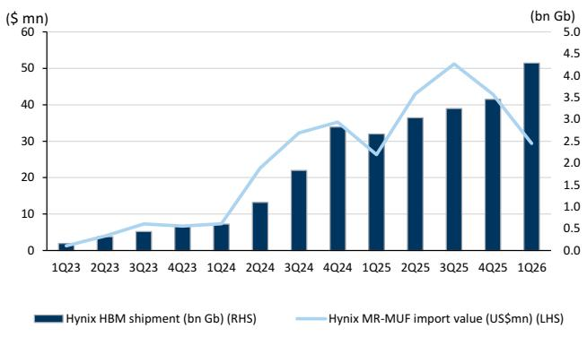
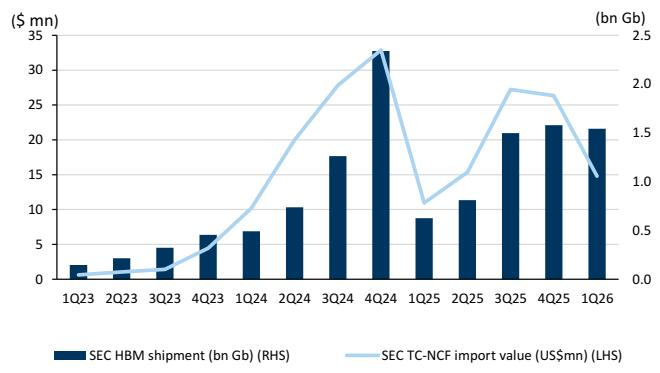
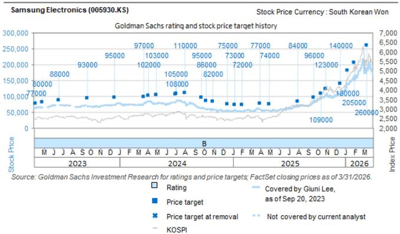
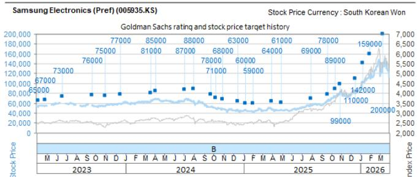
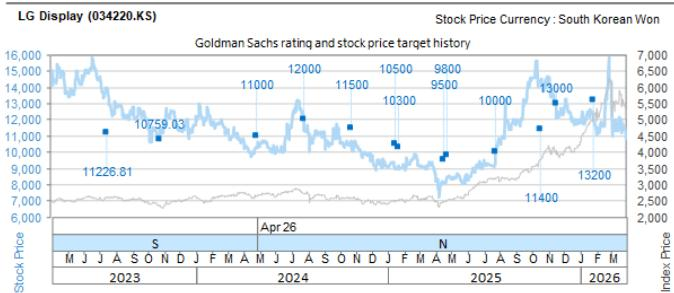
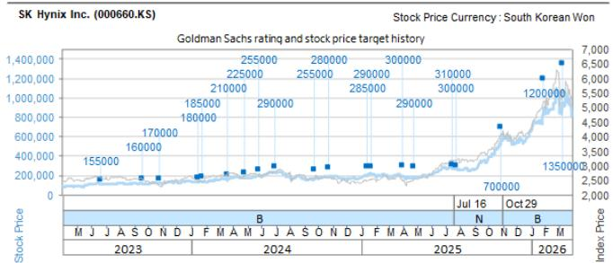
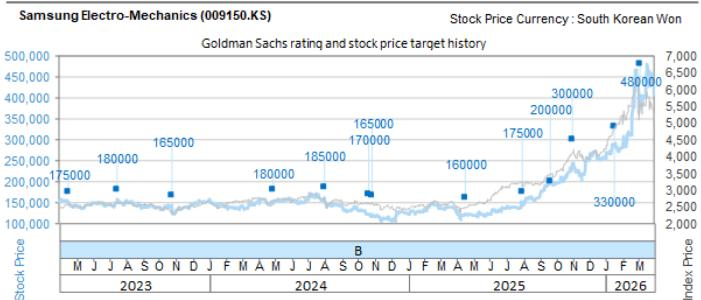

# South Korea Tech: May 2026 export tracker: Record-high DRAM exports with 370% yoy growth

According to the MOTIE (Ministry of Trade, Industry and Energy) and the TRASS (Trade Statistics Service), exports for the major tech products we track (memory, OLED, Li-ion batteries, and MLCC) showed an overall positive trend. Export value for OLED (+3% yoy), Li-ion batteries (+53% yoy), MLCC (+14% yoy), and WFE equipment (+66% yoy) all achieved positive growth rates for May, with memory exports delivering significant growth of 255% yoy, marking 4 consecutive months of 200%+ yoy growth. WFE equipment import also showed strong growth of +99% yoy. There was 1 less working day compared to May 2025 (20.5 days in May 2026 vs 21.5 days in May 2025). Key points are: 1) memory exports continued their solid growth trend (+255% yoy) in May, 2) Hynix HBM epoxide resin imports and SEC plastic film imports for HBM increased 57% yoy and 96% yoy respectively, and 3) WFE equipment import increased 99% yoy.

Memory: 4 consecutive months of 200%+ yoy growth; DRAM exports 370% yoy; NAND chip exports continue strong trend with 7 consecutive months of triple-digit growth (+207% yoy)

Memory exports showed strong yoy growth of +255% yoy in May, extending 200%+ yoy growth trend to 4 consecutive periods. DRAM exports also showed robust growth of +370% yoy, the highest figure since tracking began in January 2008. Both NAND and SSD export showed strong results (NAND chip exports: +207% yoy, SSD exports: +338% yoy). MOTIE attributed the overall solid results to robust demand from Big Tech firms in major export markets (U.S. and China). For Korean companies, we expect Hynix's 2Q26 revenue to increase by 271% yoy and SEC's memory revenue to increase by 452% yoy, with SEC's stronger growth coming from its higher exposure to conventional memory products and a low base in HBM revenue.

HBM: April Hynix epoxide resin imports +57% yoy; SEC plastic film imports +96% yoy

We track 1) import data for epoxide resins from Japan to Icheon/Cheongju (where Hynix's HBM production bases are located) as we believe Hynix mainly sources its MR-MUF materials from the Japanese company Namics, and 2) import data for plastic film from Japan to Hwaseong/Pyeongtaek (where SEC's HBM production bases are located), as we believe SEC mainly sources its TC-NCF materials from Japanese company Resonac. Import trends for epoxide resins/plastic film have been showing a strong correlation with Hynix/SEC's HBM shipment (Hynix: Exhibit 1 / SEC: Exhibit 2), respectively; hence we believe these could be good proxies to gauge the

Giuni Lee

+82(2)3788-1177 | giuni.lee@gs.com

GS (Asia) L.L.C., Seoul

Branch

Daiki Takayama

+81(3)4587-9870

daiki.takayama@gs.com

GS Japan Co., Ltd.

Taeyong Lee

+82(2)3788-0981 | taeyong.lee@gs.com

GS (Asia) L.L.C., Seoul

Branch

HBM shipment scale of Hynix/SEC.

In April, the import value of epoxide resins from Japan to Icheon/Cheongju increased by 57% yoy and the import value of plastic film from Japan to Hwaseong/Pyeongtaek increased by 96% yoy.

# Display: High single-digit% yoy rebound

Display exports increased by 9% yoy in May, with OLED (+3% yoy) and LCD (+30% yoy) both showing positive growth. MOTIE noted that launch of new OLED mobile products contributed to this increase despite contraction of end-market demand due to higher semiconductor costs. For Korean display names, we expect 2Q26 LG Display revenue to decline by 5% yoy due to LCD business downsizing but Samsung Display revenue to increase by 15% yoy.

# MLCC: Export value growth turns positive in May after slight dip in April

MLCC exports returned to positive territory (+14% yoy) in May, after short decline (-4% yoy) in April ended its 12-month consecutive positive growth trend. For Samsung Electro-Mechanics (SEMCO), we expect MLCC revenue to grow by 22% yoy in 2Q26 mainly led by continued strength in AI server/auto MLCCs.

# Li-ion batteries: strong rebound again spotted

Li-ion battery export increased by 53% yoy in May after negative growth in April (-10% yoy). MOTIE commented that increase of EV and ESS battery export towards key markets (U.S. and China) along with ASP hike resulting from elevated price of key minerals contributed to the positive result.

# WFE: Strong yoy growth for exports and imports in May

Semi WFE exports and import showed yoy growth of +66% yoy and +99% yoy in May respectively, which we believe the strong import growth comes from the increasing capex of the memory suppliers in an effort to alleviate the supply tightness, and the solid export growth from the strong global spending in building semis capacity.

Exhibit 1: Import trends of epoxide resins have been showing a strong correlation with Hynix's HBM shipments
Imports trend for epoxide resins from Japan to Hynix   

bar_line

| Quarter | Hynix HBM shipment (bn Gb) (RHS) ($ mn) | Hynix MR-MUF import value (US$mn) (LHS) ($ mn) |
| :--- | :--- | :--- |
| 1Q23 | 1.5 | 0.1 |
| 2Q23 | 3.5 | 0.4 |
| 3Q23 | 5.0 | 0.7 |
| 4Q23 | 6.5 | 0.6 |
| 1Q24 | 7.0 | 0.7 |
| 2Q24 | 13.0 | 2.0 |
| 3Q24 | 21.5 | 2.8 |
| 4Q24 | 33.5 | 3.1 |
| 1Q25 | 32.0 | 2.3 |
| 2Q25 | 36.0 | 3.6 |
| 3Q25 | 38.5 | 4.2 |
| 4Q25 | 41.0 | 3.9 |
| 1Q26 | 51.5 | 2.7 |

Epoxide resins import (JP to Hynix) = Import value of epoxide resins from Japan to Icheon/Cheongju where Hynix's HBM production bases are located.

Exhibit 2: Imports trend for plastic film has been showing a strong correlation with SEC's HBM shipment
Import trend of plastic film from Japan to SEC   

bar_line

| Quarter | SEC HBM shipment (bn Gb) (RHS) ($ mn) | SEC TC-NCF import value (US$mn) (LHS) ($ mn) |
|---|---|---|
| 1Q23 | 2 | 0.05 |
| 2Q23 | 3 | 0.08 |
| 3Q23 | 4.5 | 0.15 |
| 4Q23 | 6.5 | 0.4 |
| 1Q24 | 7 | 0.9 |
| 2Q24 | 10.5 | 1.5 |
| 3Q24 | 17.5 | 2.0 |
| 4Q24 | 32.5 | 2.4 |
| 1Q25 | 8.5 | 0.8 |
| 2Q25 | 11.5 | 1.1 |
| 3Q25 | 21 | 1.9 |
| 4Q25 | 22 | 1.8 |
| 1Q26 | 21.5 | 1.1 |

Plastic film import (JP to SEC) = Import value of plastic film from Japan to Hwaseong/Pyeongtaek where SEC's HBM production bases are located.   
Source: MOTIE, TRASS, GS Global Investment Research   
Source: MOTIE, TRASS, GS Global Investment Research

Exhibit 3: Monthly exports/imports trends of South Korea Tech companies' major products 

<table><tr><td>Export Value (US$ mn)</td><td>May-25</td><td>Jun-25</td><td>Jul-25</td><td>Aug-25</td><td>Sep-25</td><td>Oct-25</td><td>Nov-25</td><td>Dec-25</td><td>Jan-26</td><td>Feb-26</td><td>Mar-26</td><td>Apr-26</td><td>May-26</td></tr><tr><td>Total semiconductor</td><td>13,794</td><td>14,972</td><td>14,714</td><td>15,098</td><td>16,611</td><td>15,733</td><td>17,258</td><td>20,768</td><td>20,541</td><td>25,143</td><td>32,829</td><td>31,895</td><td>37,157</td></tr><tr><td>Total memory</td><td>9,054</td><td>10,442</td><td>9,473</td><td>10,492</td><td>11,785</td><td>10,919</td><td>12,780</td><td>16,126</td><td>15,720</td><td>21,021</td><td>28,170</td><td>26,973</td><td>32,137</td></tr><tr><td>DRAM</td><td>3,962</td><td>4,504</td><td>4,292</td><td>4,603</td><td>5,099</td><td>4,857</td><td>6,222</td><td>7,646</td><td>8,667</td><td>11,697</td><td>15,423</td><td>15,392</td><td>18,614</td></tr><tr><td>Flash memory</td><td>561</td><td>621</td><td>469</td><td>645</td><td>709</td><td>673</td><td>1,101</td><td>1,276</td><td>1,435</td><td>1,406</td><td>2,545</td><td>1,674</td><td>1,722</td></tr><tr><td>MCP</td><td>4,007</td><td>4,688</td><td>4,195</td><td>4,604</td><td>5,225</td><td>4,749</td><td>4,674</td><td>6,161</td><td>4,883</td><td>6,749</td><td>8,578</td><td>8,157</td><td>9,620</td></tr><tr><td>SSD*</td><td>908</td><td>1,135</td><td>752</td><td>1,032</td><td>1,073</td><td>824</td><td>1,205</td><td>1,796</td><td>1,366</td><td>2,418</td><td>3,190</td><td>3,836</td><td>3,972</td></tr><tr><td>Total display</td><td>1,341</td><td>1,125</td><td>1,573</td><td>1,649</td><td>1,747</td><td>1,477</td><td>1,442</td><td>1,489</td><td>1,379</td><td>1,215</td><td>1,439</td><td>1,285</td><td>1,466</td></tr><tr><td>OLED</td><td>1,021</td><td>818</td><td>1,183</td><td>1,359</td><td>1,457</td><td>1,211</td><td>1,172</td><td>1,183</td><td>1,032</td><td>929</td><td>1,023</td><td>931</td><td>1,050</td></tr><tr><td>LCD</td><td>320</td><td>307</td><td>390</td><td>290</td><td>290</td><td>266</td><td>270</td><td>306</td><td>347</td><td>286</td><td>416</td><td>354</td><td>416</td></tr><tr><td>Total battery</td><td>524</td><td>594</td><td>583</td><td>485</td><td>635</td><td>535</td><td>673</td><td>716</td><td>543</td><td>593</td><td>867</td><td>653</td><td>688</td></tr><tr><td>Li-ion battery</td><td>284</td><td>353</td><td>338</td><td>290</td><td>369</td><td>332</td><td>435</td><td>453</td><td>297</td><td>366</td><td>591</td><td>364</td><td>434</td></tr><tr><td>MLCC</td><td>113</td><td>115</td><td>125</td><td>126</td><td>133</td><td>123</td><td>121</td><td>118</td><td>119</td><td>107</td><td>122</td><td>105</td><td>129</td></tr><tr><td>WFE Equipment</td><td>158</td><td>238</td><td>215</td><td>153</td><td>182</td><td>132</td><td>108</td><td>163</td><td>111</td><td>148</td><td>304</td><td>275</td><td>263</td></tr><tr><td>Import Value (US$ mn)</td><td>May-25</td><td>Jun-25</td><td>Jul-25</td><td>Aug-25</td><td>Sep-25</td><td>Oct-25</td><td>Nov-25</td><td>Dec-25</td><td>Jan-26</td><td>Feb-26</td><td>Mar-26</td><td>Apr-26</td><td>May-26</td></tr><tr><td>HBM production related datapoints</td><td>17.2</td><td>25.1</td><td>27.6</td><td>25.1</td><td>25.7</td><td>23.3</td><td>21.0</td><td>24.9</td><td>15.2</td><td>15.9</td><td>13.1</td><td>27.6</td><td></td></tr><tr><td>Epoxide resins import (JP to Hynix)</td><td>13.3</td><td>19.8</td><td>19.4</td><td>17.3</td><td>14.5</td><td>14.5</td><td>12.4</td><td>16.0</td><td>11.8</td><td>11.7</td><td>5.8</td><td>15.5</td><td></td></tr><tr><td>Plastic film import (JP to SEC)</td><td>3.9</td><td>5.3</td><td>8.2</td><td>7.9</td><td>11.1</td><td>8.8</td><td>8.6</td><td>9.0</td><td>3.4</td><td>4.2</td><td>7.3</td><td>12.0</td><td></td></tr><tr><td>WFE Equipment</td><td>937</td><td>1,291</td><td>921</td><td>715</td><td>1,716</td><td>1,037</td><td>1,241</td><td>1,573</td><td>1,714</td><td>1,977</td><td>2,137</td><td>1,798</td><td>1,861</td></tr><tr><td colspan="14">MoM, YoY change (%)</td></tr><tr><td>Export (MoM, %)</td><td>May-25</td><td>Jun-25</td><td>Jul-25</td><td>Aug-25</td><td>Sep-25</td><td>Oct-25</td><td>Nov-25</td><td>Dec-25</td><td>Jan-26</td><td>Feb-26</td><td>Mar-26</td><td>Apr-26</td><td>May-26</td></tr><tr><td>Total semiconductor</td><td>18%</td><td>9%</td><td>-2%</td><td>3%</td><td>10%</td><td>-5%</td><td>10%</td><td>20%</td><td>-1%</td><td>22%</td><td>31%</td><td>-3%</td><td>16%</td></tr><tr><td>Total memory</td><td>27%</td><td>15%</td><td>-9%</td><td>11%</td><td>12%</td><td>-7%</td><td>17%</td><td>26%</td><td>-3%</td><td>34%</td><td>34%</td><td>-4%</td><td>19%</td></tr><tr><td>DRAM</td><td>14%</td><td>14%</td><td>-5%</td><td>7%</td><td>11%</td><td>-5%</td><td>28%</td><td>23%</td><td>13%</td><td>35%</td><td>32%</td><td>0%</td><td>21%</td></tr><tr><td>Flash memory</td><td>30%</td><td>11%</td><td>-24%</td><td>38%</td><td>10%</td><td>-5%</td><td>64%</td><td>16%</td><td>12%</td><td>-2%</td><td>81%</td><td>-34%</td><td>3%</td></tr><tr><td>MCP</td><td>41%</td><td>17%</td><td>-11%</td><td>10%</td><td>14%</td><td>-9%</td><td>-2%</td><td>32%</td><td>-21%</td><td>38%</td><td>27%</td><td>-5%</td><td>18%</td></tr><tr><td>SSD*</td><td>93%</td><td>25%</td><td>-34%</td><td>37%</td><td>4%</td><td>-23%</td><td>46%</td><td>49%</td><td>-24%</td><td>77%</td><td>32%</td><td>20%</td><td>4%</td></tr><tr><td>Total display</td><td>2%</td><td>-16%</td><td>40%</td><td>5%</td><td>6%</td><td>-15%</td><td>-2%</td><td>3%</td><td>-7%</td><td>-12%</td><td>18%</td><td>-11%</td><td>14%</td></tr><tr><td>OLED</td><td>5%</td><td>-20%</td><td>45%</td><td>15%</td><td>7%</td><td>-17%</td><td>-3%</td><td>1%</td><td>-13%</td><td>-10%</td><td>10%</td><td>-9%</td><td>13%</td></tr><tr><td>LCD</td><td>-8%</td><td>-4%</td><td>27%</td><td>-26%</td><td>0%</td><td>-8%</td><td>2%</td><td>13%</td><td>13%</td><td>-18%</td><td>45%</td><td>-15%</td><td>18%</td></tr><tr><td>Total battery</td><td>-25%</td><td>13%</td><td>-2%</td><td>-17%</td><td>31%</td><td>-16%</td><td>26%</td><td>6%</td><td>-24%</td><td>9%</td><td>46%</td><td>-25%</td><td>5%</td></tr><tr><td>Li-ion battery</td><td>-29%</td><td>24%</td><td>-4%</td><td>-14%</td><td>27%</td><td>-10%</td><td>31%</td><td>4%</td><td>-34%</td><td>23%</td><td>62%</td><td>-38%</td><td>19%</td></tr><tr><td>MLCC</td><td>3%</td><td>2%</td><td>9%</td><td>1%</td><td>6%</td><td>-8%</td><td>-2%</td><td>-3%</td><td>1%</td><td>-10%</td><td>15%</td><td>-14%</td><td>23%</td></tr><tr><td>WFE Equipment</td><td>-10%</td><td>51%</td><td>-10%</td><td>-29%</td><td>19%</td><td>-27%</td><td>-19%</td><td>52%</td><td>-32%</td><td>33%</td><td>106%</td><td>-9%</td><td>-5%</td></tr><tr><td>Import (MoM, %)</td><td>May-25</td><td>Jun-25</td><td>Jul-25</td><td>Aug-25</td><td>Sep-25</td><td>Oct-25</td><td>Nov-25</td><td>Dec-25</td><td>Jan-26</td><td>Feb-26</td><td>Mar-26</td><td>Apr-26</td><td>May-26</td></tr><tr><td>HBM production related datapoints</td><td>7%</td><td>46%</td><td>10%</td><td>-9%</td><td>2%</td><td>-9%</td><td>-10%</td><td>19%</td><td>-39%</td><td>5%</td><td>-17%</td><td>110%</td><td></td></tr><tr><td>Epoxide resins import (JP to Hynix)</td><td>34%</td><td>49%</td><td>-2%</td><td>-11%</td><td>-16%</td><td>-1%</td><td>-14%</td><td>28%</td><td>-26%</td><td>-1%</td><td>-50%</td><td>167%</td><td></td></tr><tr><td>Plastic film import (JP to SEC)</td><td>-36%</td><td>34%</td><td>56%</td><td>-5%</td><td>42%</td><td>-21%</td><td>-3%</td><td>5%</td><td>-63%</td><td>24%</td><td>76%</td><td>65%</td><td></td></tr><tr><td>WFE Equipment</td><td>-10%</td><td>38%</td><td>-29%</td><td>-22%</td><td>140%</td><td>-40%</td><td>20%</td><td>27%</td><td>9%</td><td>15%</td><td>8%</td><td>-16%</td><td>3%</td></tr><tr><td>Export (YoY, %)</td><td>May-25</td><td>Jun-25</td><td>Jul-25</td><td>Aug-25</td><td>Sep-25</td><td>Oct-25</td><td>Nov-25</td><td>Dec-25</td><td>Jan-26</td><td>Feb-26</td><td>Mar-26</td><td>Apr-26</td><td>May-26</td></tr><tr><td>Total semiconductor</td><td>21%</td><td>12%</td><td>32%</td><td>27%</td><td>22%</td><td>25%</td><td>39%</td><td>43%</td><td>103%</td><td>161%</td><td>151%</td><td>173%</td><td>169%</td></tr><tr><td>Total memory</td><td>32%</td><td>18%</td><td>39%</td><td>44%</td><td>35%</td><td>48%</td><td>60%</td><td>64%</td><td>154%</td><td>262%</td><td>220%</td><td>278%</td><td>255%</td></tr><tr><td>DRAM</td><td>36%</td><td>23%</td><td>44%</td><td>49%</td><td>38%</td><td>57%</td><td>86%</td><td>72%</td><td>167%</td><td>322%</td><td>265%</td><td>343%</td><td>370%</td></tr><tr><td>Flash memory</td><td>-18%</td><td>-8%</td><td>-13%</td><td>66%</td><td>13%</td><td>53%</td><td>130%</td><td>108%</td><td>366%</td><td>378%</td><td>383%</td><td>289%</td><td>207%</td></tr><tr><td>MCP</td><td>48%</td><td>25%</td><td>41%</td><td>38%</td><td>37%</td><td>36%</td><td>30%</td><td>42%</td><td>118%</td><td>195%</td><td>134%</td><td>187%</td><td>140%</td></tr><tr><td>SSD*</td><td>7%</td><td>18%</td><td>-22%</td><td>-17%</td><td>-14%</td><td>16%</td><td>5%</td><td>43%</td><td>114%</td><td>289%</td><td>219%</td><td>715%</td><td>338%</td></tr><tr><td>Total display</td><td>-18%</td><td>-36%</td><td>-9%</td><td>-9%</td><td>1%</td><td>-9%</td><td>-3%</td><td>1%</td><td>26%</td><td>-4%</td><td>-2%</td><td>-3%</td><td>9%</td></tr><tr><td>OLED</td><td>-14%</td><td>-39%</td><td>-10%</td><td>-5%</td><td>4%</td><td>-2%</td><td>6%</td><td>2%</td><td>33%</td><td>0%</td><td>-10%</td><td>-5%</td><td>3%</td></tr><tr><td>LCD</td><td>-27%</td><td>-25%</td><td>-7%</td><td>-24%</td><td>-12%</td><td>-31%</td><td>-28%</td><td>-3%</td><td>10%</td><td>-14%</td><td>29%</td><td>2%</td><td>30%</td></tr><tr><td>Total battery</td><td>-17%</td><td>-18%</td><td>-20%</td><td>-31%</td><td>-8%</td><td>-13%</td><td>4%</td><td>-12%</td><td>5%</td><td>-6%</td><td>36%</td><td>-7%</td><td>31%</td></tr><tr><td>Li-ion battery</td><td>-32%</td><td>-33%</td><td>-31%</td><td>-41%</td><td>-22%</td><td>-17%</td><td>6%</td><td>-21%</td><td>-2%</td><td>0%</td><td>60%</td><td>-10%</td><td>53%</td></tr><tr><td>MLCC</td><td>5%</td><td>11%</td><td>12%</td><td>17%</td><td>25%</td><td>15%</td><td>10%</td><td>11%</td><td>16%</td><td>0%</td><td>14%</td><td>-4%</td><td>14%</td></tr><tr><td>WFE Equipment</td><td>-27%</td><td>-9%</td><td>14%</td><td>10%</td><td>-20%</td><td>-17%</td><td>-48%</td><td>-27%</td><td>-17%</td><td>-9%</td><td>26%</td><td>57%</td><td>66%</td></tr><tr><td>Import (YoY, %)</td><td>May-25</td><td>Jun-25</td><td>Jul-25</td><td>Aug-25</td><td>Sep-25</td><td>Oct-25</td><td>Nov-25</td><td>Dec-25</td><td>Jan-26</td><td>Feb-26</td><td>Mar-26</td><td>Apr-26</td><td>May-26</td></tr><tr><td>HBM production related datapoints</td><td>35%</td><td>42%</td><td>35%</td><td>51%</td><td>12%</td><td>-5%</td><td>-2%</td><td>13%</td><td>81%</td><td>95%</td><td>-37%</td><td>72%</td><td></td></tr><tr><td>Epoxide resins import (JP to Hynix)</td><td>84%</td><td>101%</td><td>54%</td><td>75%</td><td>49%</td><td>41%</td><td>13%</td><td>14%</td><td>80%</td><td>424%</td><td>-67%</td><td>57%</td><td></td></tr><tr><td>Plastic film import (JP to SEC)</td><td>-29%</td><td>-33%</td><td>4%</td><td>15%</td><td>-15%</td><td>-38%</td><td>-18%</td><td>11%</td><td>87%</td><td>-30%</td><td>123%</td><td>96%</td><td></td></tr><tr><td>WFE Equipment</td><td>32%</td><td>35%</td><td>41%</td><td>25%</td><td>21%</td><td>4%</td><td>-14%</td><td>-10%</td><td>81%</td><td>62%</td><td>-4%</td><td>73%</td><td>99%</td></tr></table>

SSD is included in computer (not memory) based on MTI standard.   
Source: MOTIE, TRASS, Compiled by GS Global Investment Research.

# Price Target Risks and Methodology - Samsung Electronics

Valuation methodology: Our 12m 2026-2027E EV/EBITDA-based SOTP target price for the common share is W480,000. Our 12-month target price for the preference share is W360,000, which is based on our target pref to common shares discount of 25%, derived from averaging: 1) the pref discount of the 2-factor model and 2) the average preference share discount to common shares during the past 1 month. We are Buy rated on both the common and preference shares.

Key downside risks: 1) major deterioration in memory supply/demand, 2) sharp contraction in smartphone margins, and 3) mobile OLED market share loss.

# Price Target Risks and Methodology - SK Hynix Inc.

Valuation methodology: Our 2026E/27E avg. P/E-based 12m TP is W3,500,000, applying a target P/E multiple of 9.0X.

Key risks: Key risks include 1) major deterioration in memory supply/demand and delay in technology migration, 2) weaker demand for smartphones/PCs/servers which would impact overall conventional memory demand, 3) Samsung's positive HBM business progress which would impact HBM revenue and profit, 4) lower AI-related capex which would impact overall HBM demand, and thus HBM revenue/profit for the company.

# Price Target Risks and Methodology - Samsung Electro-Mechanics

Valuation: We are Buy rated on Samsung Electro-Mechanics with a SOTP-based (2027E EV/EBITDA driven) 12-month TP of W1,000,000.

Key downside risks: A stronger-than-expected industry MLCC supply increase and weaker-than-expected demand for AI server/auto/smartphones.

# Price Target Risks and Methodology - LG Display

Valuation: We are Neutral rated on LG Display with a 12m fwd P/B-based TP of W13,500 (target multiple of 0.9x).

Key risks: Higher/lower IT LCD panel pricing and higher/lower TV OLED shipment

# Disclosure Appendix

# Reg AC

We, Giuni Lee, Daiki Takayama and Taeyong Lee, hereby certify that all of the views expressed in this report accurately reflect our personal views about the subject company or companies and its or their securities. We also certify that no part of our compensation was, is or will be, directly or indirectly, related to the specific recommendations or views expressed in this report.

Unless otherwise stated, the individuals listed on the cover page of this report are analysts in GS' Global Investment Research division.

Contributing Authors: Giuni Lee GS (Asia) L.L.C., Seoul Branch, Daiki Takayama GS Japan Co., Ltd., Taeyong Lee GS (Asia) L.L.C., Seoul Branch.

Unless otherwise stated, the individuals listed in the Contributing Authors disclosure of this report are analysts in GS' Global Investment Research division.

# GS Factor Profile

The GS Factor Profile provides investment context for a stock by comparing key attributes to the market (i.e. our universe of rated stocks) and its sector peers. The four key attributes depicted are: Growth, Financial Returns, Multiple (e.g. valuation) and Integrated (a composite of Growth, Financial Returns and Multiple). Growth, Financial Returns and Multiple are calculated by using normalized ranks for specific metrics for each stock. The normalized ranks for the metrics are then averaged and converted into percentiles for the relevant attribute. The precise calculation of each metric may vary depending on the fiscal year, industry and region, but the standard approach is as follows:

Growth is based on a stock's forward-looking sales growth, EBITDA growth and EPS growth (for financial stocks, only EPS and sales growth), with a higher percentile indicating a higher growth company. Financial Returns is based on a stock's forward-looking ROE, ROCE and CROCI (for financial stocks, only ROE), with a higher percentile indicating a company with higher financial returns. Multiple is based on a stock's forward-looking P/E, P/B, price/dividend (P/D), EV/EBITDA, EV/FCF and EV/Debt Adjusted Cash Flow (DACF) (for financial stocks, only P/E, P/B and P/D), with a higher percentile indicating a stock trading at a higher multiple. The Integrated percentile is calculated as the average of the Growth percentile, Financial Returns percentile and (100% - Multiple percentile).

Financial Returns and Multiple use the GS analyst forecasts at the fiscal year-end at least three quarters in the future. Growth uses inputs for the fiscal year at least seven quarters in the future compared with the year at least three quarters in the future (on a per-share basis for all metrics).

For a more detailed description of how we calculate the GS Factor Profile, please contact your GS representative.

# M&A Rank

Across our global coverage, we examine stocks using an M&A framework, considering both qualitative factors and quantitative factors (which may vary across sectors and regions) to incorporate the potential that certain companies could be acquired. We then assign a M&A rank as a means of scoring companies under our rated coverage from 1 to 3, with 1 representing high (30%-50%) probability of the company becoming an acquisition target, 2 representing medium (15%-30%) probability and 3 representing low (0%-15%) probability. For companies ranked 1 or 2, in line with our standard departmental guidelines we incorporate an M&A component into our target price. M&A rank of 3 is considered immaterial and therefore does not factor into our price target, and may or may not be discussed in research.

# Quantum

Quantum is GS' proprietary database providing access to detailed financial statement histories, forecasts and ratios. It can be used for in-depth analysis of a single company, or to make comparisons between companies in different sectors and markets.

# Disclosures

The rating(s) for LG Display, SK Hynix Inc., Samsung Electro-Mechanics, Samsung Electronics and Samsung Electronics (Pref) is/are relative to the other companies in its/their coverage universe: Hansol Chemical, LG Display, LG Electronics, LG Innotek Co., SK Hynix Inc., SKC, Samsung Electro-Mechanics, Samsung Electronics, Samsung Electronics (Pref)

# Company-specific regulatory disclosures

The following disclosures relate to relationships between The GS Group, Inc. (with its affiliates, “GS”) and companies covered by GS Global Investment Research and referred to in this research.

GS has received compensation for investment banking services in the past 12 months: Samsung Electro-Mechanics (W2,127,000), Samsung Electronics (W317,000) and Samsung Electronics (Pref) (W202,500)

GS expects to receive or intends to seek compensation for investment banking services in the next 3 months: LG Display (W16,090), LG Display (ADR) (\$5.55), Samsung Electro-Mechanics (W2,127,000), Samsung Electronics (W317,000), Samsung Electronics (Pref) (W202,500) and SK Hynix Inc. (W2,333,000)

GS had an investment banking services client relationship during the past 12 months with: LG Display (W16,090), LG Display (ADR) (\$5.55), Samsung Electro-Mechanics (W2,127,000), Samsung Electronics (W317,000), Samsung Electronics (Pref) (W202,500) and SK Hynix Inc. (W2,333,000)

GS had a non-investment banking securities-related services client relationship during the past 12 months with: Samsung Electronics (W317,000) and Samsung Electronics (Pref) (W202,500)

GS had a non-securities services client relationship during the past 12 months with: LG Display (W16,090), LG Display (ADR) (\$5.55), Samsung Electronics (W317,000), Samsung Electronics (Pref) (W202,500) and SK Hynix Inc. (W2,333,000)

GS makes a market in the securities or derivatives thereof: LG Display (W16,090) and LG Display (ADR) (\$5.55)

# Distribution of ratings/investment banking relationships

GS Investment Research global Equity coverage universe

<table><tr><td rowspan="2"></td><td colspan="3">Rating Distribution</td></tr><tr><td>Buy</td><td>Hold</td><td>Sell</td></tr><tr><td>Global</td><td>50%</td><td>34%</td><td>16%</td></tr></table>

<table><tr><td colspan="3">Investment Banking Relationships</td></tr><tr><td>Buy</td><td>Hold</td><td>Sell</td></tr><tr><td>65%</td><td>60%</td><td>45%</td></tr></table>

As of April 1, 2026, GS Global Investment Research had investment ratings on 3,074 equity securities. GS assigns stocks as Buys and Sells on various regional Investment Lists; stocks not so assigned are deemed Neutral. Such assignments equate to Buy, Hold and Sell for the purposes of the above disclosure required by the FINRA Rules. See ‘Ratings, Coverage universe and related definitions’ below. The Investment Banking Relationships chart reflects the percentage of subject companies within each rating category for whom GS has provided investment banking services within the previous twelve months.

Price target and rating history chart(s)   
  
Source: GS Investment Research for ratings and price targets; FactSet closing prices as of 3/31/2026.   
Rating   
Covered by Giuni Lee.   
Price target   
as of Sep 20, 2023   
Price target at removal   
- Not covered by current analyst   
- KOSPI   
The price targets shown should be considered in the context of all prior published GS, which may or may not have included price targets, as well as developments relating to the company, its industry and financial markets.

  
Source: GS Investment Research for ratings and price targets; FactSet closing prices as of 3/31/2026.   
Rating   
Covered by Giuni Lee.   
Price target   
as of Sep 20, 2023   
Price target at removal   
- Not covered by current analyst   
KOSPI   
The price targets shown should be considered in the context of all prior published GS, which may or may not have included price targets, as well as developments relating to the company, its industry and financial markets.

line

| Date       | Stock Price | S     | N     |
|------------|-------------|-------|-------|
| Apr 26     | 11226.81    |       |       |
|            | 10759.03    |       |       |
|            | 11000       |       |       |
|            | 11500       |       |       |
|            | 10500       |       |       |
|            | 9800        |       |       |
|            | 9500        |       |       |
|            | 10300       |       |       |
|            | 10000       |       |       |
|            | 11400       |       |       |
|            | 13000       |       |       |
|            | 13200       |       |       |

Source: GS Investment Research for ratings and price targets; FactSet closing prices as of 3/31/2026.   
Rating   
Covered by Giuni Lee   
Price target   
Price target at removal   
Not covered by current analyst   
- KOSPI   
The price targets shown should be considered in the context of all prior published GS, which may or may not have included price targets, as well as developments relating to the company, its industry and financial markets.

line

| Date       | Stock Price | Stock Price Target |
|------------|-------------|--------------------|
| Jul 16     | 700000      | -                  |
| Oct 29     | 1350000     | -                  |
| Feb 2024   | 185000      | -                  |
| May 2024   | 210000      | -                  |
| Aug 2024   | 255000      | -                  |
| Nov 2024   | 280000      | -                  |
| Feb 2025   | 290000      | -                  |
| May 2025   | 310000      | -                  |
| Aug 2025   | 300000      | -                  |
| Nov 2025   | 1200000     | -                  |
| Feb 2026   | 1350000     | -                  |

Source: GS Investment Research for ratings and price targets; FactSet closing prices as of 3/31/2026.   
Rating   
Covered by Giuni Lee   
Price target   
Price target at removal   
Not covered by current analyst   
- KOSPI   
The price targets shown should be considered in the context of all prior published GS, which may or may not have included price targets, as well as developments relating to the company, its industry and financial markets.

  
Source: GS Investment Research for ratings and price targets; FactSet closing prices as of 3/31/2026.   
Rating   
Covered by Giuni Lee   
Price target   
Price target at removal   
Not covered by current analyst   
- KOSPI   
The price targets shown should be considered in the context of all prior published GS, which may or may not have included price targets, as well as developments relating to the company, its industry and financial markets.

Target price history table(s)   
Samsung Electro-Mechanics (009150.KS) 

<table><tr><td>Date of report</td><td>Target price (W)</td><td>Closing price (W)</td></tr><tr><td>30-Apr-26</td><td>1,000,000</td><td>832,000</td></tr><tr><td>06-Mar-26</td><td>480,000</td><td>404,500</td></tr><tr><td>16-Jan-26</td><td>330,000</td><td>289,500</td></tr><tr><td>31-Oct-25</td><td>300,000</td><td>245,000</td></tr><tr><td>21-Sep-25</td><td>200,000</td><td>197,700</td></tr><tr><td>31-Jul-25</td><td>175,000</td><td>148,700</td></tr><tr><td>18-Apr-25</td><td>160,000</td><td>121,000</td></tr><tr><td>29-Oct-24</td><td>165,000</td><td>120,200</td></tr><tr><td>21-Oct-24</td><td>170,000</td><td>123,000</td></tr><tr><td>31-Jul-24</td><td>185,000</td><td>159,600</td></tr><tr><td>29-Apr-24</td><td>180,000</td><td>151,300</td></tr><tr><td>26-Oct-23</td><td>165,000</td><td>124,100</td></tr><tr><td>16-Jul-23</td><td>180,000</td><td>150,300</td></tr></table>

LG Display (034220.KS) 

<table><tr><td>Date of report</td><td>Target price (W)</td><td>Closing price (W)</td></tr><tr><td>23-Apr-26</td><td>13,500</td><td>13,250</td></tr><tr><td>28-Jan-26</td><td>13,200</td><td>12,130</td></tr><tr><td>17-Nov-25</td><td>13,000</td><td>12,910</td></tr><tr><td>19-Oct-25</td><td>11,400</td><td>14,370</td></tr><tr><td>24-Jul-25</td><td>10,000</td><td>9,220</td></tr><tr><td>24-Apr-25</td><td>9,800</td><td>8,410</td></tr><tr><td>17-Apr-25</td><td>9,500</td><td>8,060</td></tr><tr><td>22-Jan-25</td><td>10,300</td><td>9,160</td></tr><tr><td>15-Jan-25</td><td>10,500</td><td>9,050</td></tr><tr><td>23-Oct-24</td><td>11,500</td><td>10,700</td></tr><tr><td>25-Jul-24</td><td>12,000</td><td>11,970</td></tr><tr><td>26-Apr-24</td><td>11,000</td><td>10,320</td></tr><tr><td>25-Oct-23</td><td>11,500</td><td>11,553</td></tr><tr><td>17-Jul-23</td><td>12,000</td><td>13,959</td></tr></table>

Samsung Electronics (Pref) (005935.KS) 

<table><tr><td>Date of report</td><td>Target price (W)</td><td>Closing price (W)</td></tr><tr><td>31-May-26</td><td>360,000</td><td>202,500</td></tr><tr><td>30-Apr-26</td><td>245,000</td><td>158,300</td></tr><tr><td>07-Apr-26</td><td>220,000</td><td>130,900</td></tr><tr><td>11-Mar-26</td><td>200,000</td><td>138,900</td></tr><tr><td>29-Jan-26</td><td>159,000</td><td>115,600</td></tr><tr><td>08-Jan-26</td><td>142,000</td><td>101,900</td></tr><tr><td>16-Dec-25</td><td>110,000</td><td>79,800</td></tr><tr><td>30-Oct-25</td><td>99,000</td><td>82,500</td></tr><tr><td>14-Oct-25</td><td>89,000</td><td>72,300</td></tr><tr><td>22-Sep-25</td><td>78,000</td><td>66,700</td></tr><tr><td>31-Jul-25</td><td>69,000</td><td>57,600</td></tr><tr><td>01-May-25</td><td>61,000</td><td>46,850</td></tr><tr><td>01-Apr-25</td><td>64,000</td><td>47,700</td></tr><tr><td>02-Feb-25</td><td>59,000</td><td>43,000</td></tr><tr><td>08-Jan-25</td><td>60,000</td><td>46,800</td></tr><tr><td>16-Dec-24</td><td>63,000</td><td>46,550</td></tr><tr><td>31-Oct-24</td><td>68,000</td><td>47,950</td></tr><tr><td>08-Oct-24</td><td>71,000</td><td>49,900</td></tr><tr><td>23-Sep-24</td><td>78,000</td><td>52,400</td></tr><tr><td>31-Jul-24</td><td>88,000</td><td>64,900</td></tr><tr><td>05-Jul-24</td><td>87,000</td><td>68,000</td></tr><tr><td>05-Apr-24</td><td>85,000</td><td>69,000</td></tr><tr><td>21-Mar-24</td><td>81,000</td><td>65,800</td></tr><tr><td>17-Dec-23</td><td>77,000</td><td>59,300</td></tr><tr><td>31-Oct-23</td><td>75,000</td><td>53,600</td></tr><tr><td>20-Sep-23</td><td>76,000</td><td>56,100</td></tr><tr><td>21-Jun-23</td><td>73,000</td><td>59,300</td></tr></table>

Samsung Electronics (005930.KS) 

<table><tr><td>Date of report</td><td>Target price (W)</td><td>Closing price (W)</td></tr><tr><td>31-May-26</td><td>480,000</td><td>317,000</td></tr><tr><td>30-Apr-26</td><td>320,000</td><td>220,500</td></tr><tr><td>07-Apr-26</td><td>285,000</td><td>196,500</td></tr><tr><td>11-Mar-26</td><td>260,000</td><td>190,000</td></tr><tr><td>29-Jan-26</td><td>205,000</td><td>160,700</td></tr><tr><td>08-Jan-26</td><td>180,000</td><td>138,800</td></tr><tr><td>16-Dec-25</td><td>140,000</td><td>102,800</td></tr><tr><td>30-Oct-25</td><td>123,000</td><td>104,100</td></tr><tr><td>14-Oct-25</td><td>109,000</td><td>91,600</td></tr><tr><td>22-Sep-25</td><td>96,000</td><td>83,500</td></tr><tr><td>31-Jul-25</td><td>84,000</td><td>71,400</td></tr><tr><td>01-May-25</td><td>74,000</td><td>55,500</td></tr><tr><td>01-Apr-25</td><td>77,000</td><td>58,800</td></tr><tr><td>02-Feb-25</td><td>72,000</td><td>52,400</td></tr><tr><td>08-Jan-25</td><td>73,000</td><td>57,300</td></tr><tr><td>16-Dec-24</td><td>75,000</td><td>55,600</td></tr><tr><td>31-Oct-24</td><td>82,000</td><td>59,200</td></tr><tr><td>08-Oct-24</td><td>86,000</td><td>60,300</td></tr><tr><td>23-Sep-24</td><td>95,000</td><td>62,600</td></tr><tr><td>31-Jul-24</td><td>110,000</td><td>83,900</td></tr><tr><td>05-Jul-24</td><td>108,000</td><td>87,100</td></tr><tr><td>01-Jul-24</td><td>105,000</td><td>81,800</td></tr><tr><td>30-Apr-24</td><td>103,000</td><td>77,500</td></tr><tr><td>05-Apr-24</td><td>102,000</td><td>84,500</td></tr><tr><td>21-Mar-24</td><td>97,000</td><td>79,300</td></tr><tr><td>17-Dec-23</td><td>95,000</td><td>73,300</td></tr><tr><td>20-Sep-23</td><td>93,000</td><td>69,600</td></tr><tr><td>21-Jun-23</td><td>88,000</td><td>70,500</td></tr></table>

SK Hynix Inc. (000660.KS) 

<table><tr><td>Date of report</td><td>Target price (W)</td><td>Closing price (W)</td></tr><tr><td>31-May-26</td><td>3,500,000</td><td>2,333,000</td></tr><tr><td>23-Apr-26</td><td>1,800,000</td><td>1,225,000</td></tr><tr><td>11-Mar-26</td><td>1,350,000</td><td>955,000</td></tr><tr><td>28-Jan-26</td><td>1,200,000</td><td>841,000</td></tr><tr><td>29-Oct-25</td><td>700,000</td><td>558,000</td></tr><tr><td>24-Jul-25</td><td>300,000</td><td>269,500</td></tr><tr><td>16-Jul-25</td><td>310,000</td><td>296,000</td></tr><tr><td>24-Apr-25</td><td>290,000</td><td>178,300</td></tr><tr><td>01-Apr-25</td><td>300,000</td><td>197,000</td></tr><tr><td>23-Jan-25</td><td>290,000</td><td>219,500</td></tr><tr><td>15-Jan-25</td><td>285,000</td><td>198,200</td></tr><tr><td>24-Oct-24</td><td>280,000</td><td>198,200</td></tr><tr><td>23-Sep-24</td><td>255,000</td><td>162,000</td></tr><tr><td>01-Jul-24</td><td>290,000</td><td>235,500</td></tr><tr><td>27-May-24</td><td>255,000</td><td>201,500</td></tr><tr><td>25-Apr-24</td><td>225,000</td><td>170,600</td></tr><tr><td>21-Mar-24</td><td>210,000</td><td>170,000</td></tr><tr><td>25-Jan-24</td><td>185,000</td><td>137,400</td></tr><tr><td>17-Jan-24</td><td>180,000</td><td>131,000</td></tr><tr><td>26-Oct-23</td><td>170,000</td><td>120,000</td></tr><tr><td>20-Sep-23</td><td>160,000</td><td>118,000</td></tr><tr><td>21-Jun-23</td><td>155,000</td><td>115,100</td></tr></table>

Price targets shown in table(s) are unadjusted for corporate actions.

# Regulatory disclosures

# Disclosures required by United States laws and regulations

See company-specific regulatory disclosures above for any of the following disclosures required as to companies referred to in this report: manager or co-manager in a pending transaction; 1% or other ownership; compensation for certain services; types of client relationships; managed/co-managed public offerings in prior periods; directorships; for equity securities, market making and/or specialist role. GS trades or may trade as a principal in debt securities (or in related derivatives) of issuers discussed in this report.

The following are additional required disclosures: Ownership and material conflicts of interest: GS policy prohibits its analysts, professionals reporting to analysts and members of their households from owning securities of any company in the analyst's area of coverage. Analyst compensation: Analysts are paid in part based on the profitability of GS, which includes investment banking revenues. Analyst as officer or director: GS policy generally prohibits its analysts, persons reporting to analysts or members of their households from serving as an officer, director or advisor of any company in the analyst's area of coverage. Non-U.S. Analysts: Non-U.S. analysts may not be associated persons of GS & Co. LLC and therefore may not be subject to FINRA Rule 2241 or FINRA Rule 2242 restrictions on communications with a subject company, public appearances and trading in securities covered by the analysts.

Distribution of ratings: See the distribution of ratings disclosure above. Price chart: See the price chart, with changes of ratings and price targets in prior periods, above, or, if electronic format or if with respect to multiple companies which are the subject of this report, on the GS website at https://www.gs.com/research/hedge.html.

# Additional disclosures required under the laws and regulations of jurisdictions other than the United States

The following disclosures are those required by the jurisdiction indicated, except to the extent already made above pursuant to United States laws and regulations. Australia: GS Australia Pty Ltd and its affiliates are not authorised deposit-taking institutions (as that term is defined in the Banking Act 1959 (Cth)) in Australia and do not provide banking services, nor carry on a banking business, in Australia. This research, and any access to it, is intended only for “wholesale clients” within the meaning of the Australian Corporations Act, unless otherwise agreed by GS. In producing research reports, members of Global Investment Research of GS Australia may attend site visits and other meetings hosted by the companies and other entities which are the subject of its research reports. In some instances the costs of such site visits or meetings may be met in part or in whole by the issuers concerned if GS Australia considers it is appropriate and reasonable in the specific circumstances relating to the site visit or meeting. To the extent that the contents of this document contains any financial product advice, it is general advice only and has been prepared by GS without taking into account a client’s objectives, financial situation or needs. A client should, before acting on any such advice, consider the appropriateness of the advice having regard to the client’s own objectives, financial situation and needs. A copy of certain GS Australia and New Zealand disclosure of interests and a copy of GS’ Australian Sell-Side Research Independence Policy Statement are available at: https://www.goldmansachs.com/disclosures/australia-new-zealand/index.html. Brazil: Disclosure information in relation to CVM Resolution n. 20 is available at https://www.gs.com/worldwide/brazil/area/gir/index.html. Where applicable, the Brazil-registered analyst primarily responsible for the content of this research report, as defined in Article 20 of CVM Resolution n. 20, is the first author named at the beginning of this report, unless indicated otherwise at the end of the text. Canada: This information is being provided to you for information purposes only and is not, and under no circumstances should be construed as, an advertisement, offering or solicitation by GS & Co. LLC for purchasers of securities in Canada to trade in any Canadian security. GS & Co. LLC is not registered as a dealer in any jurisdiction in Canada under applicable Canadian securities laws and generally is not permitted to trade in Canadian securities and may be prohibited from selling certain securities and products in certain jurisdictions in Canada. If you wish to trade in any Canadian securities or other products in Canada please contact GS Canada Inc., an affiliate of The GS Group Inc., or another registered Canadian dealer. Hong Kong: Further information on the securities of covered companies referred to in this research may be obtained on request from GS (Asia) L.L.C. India: Further information on the subject company or companies referred to in this research may be obtained from GS (India) Securities Private Limited, Research Analyst - SEBI Registration Number INH000001493, 10th Floor, Ascent-Worli, Sudam Kalu Ahire Marg, Worli, Mumbai-400 025, India, Corporate Identity Number U74140MH2006FTC160634, Phone +91 22 6616 9000, Fax +91 22 6616 9001. GS may beneficially own 1% or more of the securities (as such term is defined in clause 2 (h) the Indian Securities Contracts (Regulation) Act, 1956) of the subject company or companies referred to in this research report. Investment in securities market are subject to market risks. Read all the related documents carefully before investing. Registration granted by SEBI and certification from NISM in no way guarantee performance of the intermediary or provide any assurance of returns to investors. GS (India) Securities Private Limited compliance officer and investor grievance contact details can be found at: https://www.goldmansachs.com/worldwide/india/documents/Grievance-Redressal-and-Escalation-Matrix.pdf, and a copy of the annual audit compliance report can be found at this link: https://publishing.gs.com/content/site/india-annual-compliance-report.html. Japan: See below. Korea: This research, and any access to it, is intended only for “professional investors” within the meaning of the Financial Services and Capital Markets Act, unless otherwise agreed by GS. Further information on the subject company or companies referred to in this research may be obtained from GS (Asia) L.L.C., Seoul Branch. New Zealand: GS New Zealand Limited and its affiliates are neither “registered banks” nor “deposit takers” (as defined in the Reserve Bank of New Zealand Act 1989) in New Zealand. This research, and any access to it, is intended for “wholesale clients” (as defined in the Financial Advisers Act 2008) unless otherwise agreed by GS. A copy of certain GS Australia and New Zealand disclosure of interests is available at: https://www.goldmansachs.com/disclosures/australia-new-zealand/index.html. Russia: Research reports distributed in the Russian Federation are not advertising as defined in the Russian legislation, but are information and analysis not having product promotion as their main purpose and do not provide appraisal within the meaning of the Russian legislation on appraisal activity. Research reports do not constitute a personalized investment recommendation as defined in Russian laws and regulations, are not addressed to a specific client, and are prepared without analyzing the financial circumstances, investment profiles or risk profiles of clients. GS assumes no responsibility for any investment decisions that may be taken by a client or any other person based on this research report. Singapore: GS (Singapore) Pte. (Company Number: 198602165W), which is regulated by the Monetary Authority of Singapore, accepts legal responsibility for this research, and should be contacted with respect to any matters arising from, or in connection with, this research. Taiwan: This material is for reference only and must not be reprinted without permission. Investors should carefully consider their own investment risk. Investment results are the responsibility of the individual investor. United Kingdom: Persons who would be categorized as retail clients in the United Kingdom, as such term is defined in the rules of the Financial Conduct Authority, should read this research in conjunction with prior GS on the covered companies referred to herein and should refer to the risk warnings that have been sent to them by GS International. A copy of these risks warnings, and a glossary of certain financial terms used in this report, are available from GS International on request.

European Union and United Kingdom: Disclosure information in relation to Article 6 (2) of the European Commission Delegated Regulation (EU) (2016/958) supplementing Regulation (EU) No 596/2014 of the European Parliament and of the Council (including as that Delegated Regulation is implemented into United Kingdom domestic law and regulation following the United Kingdom's departure from the European Union and the European Economic Area) with regard to regulatory technical standards for the technical arrangements for objective presentation of investment recommendations or other information recommending or suggesting an investment strategy and for disclosure of particular interests or indications of conflicts of interest is available at https://www.gs.com/disclosures/europeanpolicy.html which states the European Policy for Managing Conflicts of Interest in Connection with Investment Research.

Japan: GS Japan Co., Ltd. is a Financial Instrument Dealer registered with the Kanto Financial Bureau under registration number Kinsho 69, and a member of Japan Securities Dealers Association, Financial Futures Association of Japan Type II Financial Instruments Firms Association, and Investment Management Association of Japan. Sales and purchase of equities are subject to commission pre-determined with clients plus consumption tax. See company-specific disclosures as to any applicable disclosures required by Japanese stock exchanges, the Japanese Securities Dealers Association or the Japanese Securities Finance Company.

# Ratings, coverage universe and related definitions

Buy (B), Neutral (N), Sell (S) Analysts recommend stocks as Buys or Sells for inclusion on various regional Investment Lists. Being assigned a Buy or Sell on an Investment List is determined by a stock's total return potential relative to its coverage universe. Any stock not assigned as a Buy or a Sell on an Investment List with an active rating (i.e., a stock that is not Rating Suspended, Not Rated, Early-Stage Biotech, Coverage Suspended or Not Covered), is deemed Neutral. Each region manages Regional Conviction Lists, which are selected from Buy rated stocks on the respective region's Investment Lists and represent investment recommendations focused on the size of the total return potential and/or the likelihood of the realization of the return across their respective areas of coverage. The addition or removal of stocks from such Conviction Lists are managed by the Investment Review Committee or other designated committee in each respective region and do not represent a change in the analysts' investment rating for such stocks.

Total return potential represents the upside or downside differential between the current share price and the price target, including all paid or anticipated dividends, expected during the time horizon associated with the price target. Price targets are required for all covered stocks. The total return potential, price target and associated time horizon are stated in each report adding or reiterating an Investment List membership.

Coverage Universe: A list of all stocks in each coverage universe is available by primary analyst, stock and coverage universe at https://www.gs.com/research/hedge.html.

Not Rated (NR). The investment rating, target price and earnings estimates (where relevant) are removed pursuant to GS policy when GS is acting in an advisory capacity in a merger or in a strategic transaction involving this company, when there are legal, regulatory or policy constraints due to GS' involvement in a transaction, and in certain other circumstances. Early-Stage Biotech (ES). An investment rating and a target price are not assigned pursuant to GS policy when this company has neither a drug, treatment or medical device that has passed a Phase II clinical trial nor a license to distribute a post-Phase II drug, treatment or medical device. Rating Suspended (RS). GS has suspended the investment rating and price target for this stock, because there is not a sufficient fundamental basis for determining an investment rating or target price. The previous investment rating and target price, if any, are no longer in effect for this stock and should not be relied upon. Coverage Suspended (CS). GS has suspended coverage of this company. Not Covered (NC). GS does not cover this company.

# Global product; distributing entities

GS Global Investment Research produces and distributes research products for clients of GS on a global basis. Analysts based in GS offices around the world produce research on industries and companies, and research on macroeconomics, currencies, commodities and portfolio strategy. This research is disseminated in Australia by GS Australia Pty Ltd (ABN 21 006 797 897); in Brazil by GS do Brasil Corretora de Títulos e Valores Mobiliários S.A.; Public Communication Channel GS Brazil: 0800 727 5764 and / or contatogoldmanbrasil@gs.com. Available Weekdays (except holidays), from 9am to 6pm. Canal de Comunicação com o Público GS Brasil: 0800 727 5764 e/ou contatogoldmanbrasil@gs.com. Horário de funcionamento: segunda-feira à sexta-feira (exceto feriados), das 9h às 18h; in Canada by GS & Co. LLC; in Hong Kong by GS (Asia) L.L.C.; in India by GS (India) Securities Private Ltd.; in Japan by GS Japan Co., Ltd.; in the Republic of Korea by GS (Asia) L.L.C., Seoul Branch; in New Zealand by GS New Zealand Limited; in Russia by OOO GS; in Singapore by GS (Singapore) Pte. (Company Number: 198602165W); and in the United States of America by GS & Co. LLC. GS International has approved this research in connection with its distribution in the United Kingdom.

GS International (“GSI”), authorised by the Prudential Regulation Authority (“PRA”) and regulated by the Financial Conduct Authority (“FCA”) and the PRA, has approved this research in connection with its distribution in the United Kingdom.

European Economic Area: GS Bank Europe SE (“GSBE”) is a credit institution incorporated in Germany and, within the Single Supervisory Mechanism, subject to direct prudential supervision by the European Central Bank and in other respects supervised by German Federal Financial Supervisory Authority (Bundesanstalt für Finanzdienstleistungsaufsicht, BaFin) and Deutsche Bundesbank and disseminates research within the European Economic Area.

# General disclosures

This research is for our clients only. Other than disclosures relating to GS, this research is based on current public information that we consider reliable, but we do not represent it is accurate or complete, and it should not be relied on as such. The information, opinions, estimates and forecasts contained herein are as of the date hereof and are subject to change without prior notification. We seek to update our research as appropriate, but various regulations may prevent us from doing so. Other than certain industry reports published on a periodic basis, the large majority of reports are published at irregular intervals as appropriate in the analyst's judgment.

GS conducts a global full-service, integrated investment banking, investment management, and brokerage business. We have investment banking and other business relationships with a substantial percentage of the companies covered by Global Investment Research. GS & Co. LLC, the United States broker dealer, is a member of SIPC (https://www.sipc.org).

Our salespeople, traders, and other professionals may provide oral or written market commentary or trading strategies to our clients and principal trading desks that reflect opinions that are contrary to the opinions expressed in this research. Our asset management area, principal trading desks and investing businesses may make investment decisions that are inconsistent with the recommendations or views expressed in this research.

The analysts named in this report may have from time to time discussed with our clients, including GS salespersons and traders, or may discuss in this report, trading strategies that reference catalysts or events that may have a near-term impact on the market price of the equity securities discussed in this report, which impact may be directionally counter to the analyst's published price target expectations for such stocks. Any such trading strategies are distinct from and do not affect the analyst's fundamental equity rating for such stocks, which rating reflects a stock's return potential relative to its coverage universe as described herein.

We and our affiliates, officers, directors, and employees will from time to time have long or short positions in, act as principal in, and buy or sell, the securities or derivatives, if any, referred to in this research, unless otherwise prohibited by regulation or GS policy.

The views attributed to third party presenters at GS arranged conferences, including individuals from other parts of GS, do not necessarily reflect those of Global Investment Research and are not an official view of GS.

Any third party referenced herein, including any salespeople, traders and other professionals or members of their household, may have positions in the products mentioned that are inconsistent with the views expressed by analysts named in this report.

This research is not an offer to sell or the solicitation of an offer to buy any security in any jurisdiction where such an offer or solicitation would be illegal. It does not constitute a personal recommendation or take into account the particular investment objectives, financial situations, or needs of individual clients. Clients should consider whether any advice or recommendation in this research is suitable for their particular circumstances and, if appropriate, seek professional advice, including tax advice. The price and value of investments referred to in this research and the income from them may fluctuate. Past performance is not a guide to future performance, future returns are not guaranteed, and a loss of original capital may occur. Fluctuations in exchange rates could have adverse effects on the value or price of, or income derived from, certain investments.

Certain transactions, including those involving futures, options, and other derivatives, give rise to substantial risk and are not suitable for all investors. Investors should review current options and futures disclosure documents which are available from GS sales representatives or at https://www.theocc.com/about/publications/character-risks.jsp and https://www.goldmansachs.com/disclosures/cftc\_fcm\_disclosures. Transaction costs may be significant in option strategies calling for multiple purchase and sales of options such as spreads. Supporting documentation will be supplied upon request.

Differing Levels of Service provided by Global Investment Research: The level and types of services provided to you by GS Global Investment Research may vary as compared to that provided to internal and other external clients of GS, depending on various factors including your individual preferences as to the frequency and manner of receiving communication, your risk profile and investment focus and perspective (e.g., marketwide, sector specific, long term, short term), the size and scope of your overall client relationship with GS, and legal and regulatory constraints. As an example, certain clients may request to receive notifications when research on specific securities is published, and certain clients may request that specific data underlying analysts' fundamental analysis available on our internal client websites be delivered to them electronically through data feeds or otherwise. No change to an analyst's fundamental research views (e.g., ratings, price targets, or material changes to earnings estimates for equity securities), will be communicated to any client prior to inclusion of such information in a research report broadly disseminated through electronic publication to our internal client websites or through other means, as necessary, to all clients who are entitled to receive such reports.

All research reports are disseminated and available to all clients simultaneously through electronic publication to our internal client websites. Not all research content is redistributed to our clients or available to third-party aggregators, nor is GS responsible for the redistribution of our research by third party aggregators. For research, models or other data related to one or more securities, markets or asset classes (including related services) that may be available to you, please contact your GS representative or go to https://research.gs.com.

Disclosure information is also available at https://www.gs.com/research/hedge.html or from Research Compliance, 200 West Street, New York, NY 10282.

# © 2026 GS.

You are permitted to store, display, analyze, modify, reformat, and print the information made available to you via this service only for your own use. You may not resell or reverse engineer this information to calculate or develop any index for disclosure and/or marketing or create any other derivative works or commercial product(s), data or offering(s) without the express written consent of GS. You are not permitted to publish, transmit, or otherwise reproduce this information, in whole or in part, in any format to any third party without the express written consent of GS. This foregoing restriction includes, without limitation, using, extracting, downloading or retrieving this information, in whole or in part, to train or finetune a machine learning or artificial intelligence system, or to provide or reproduce this information, in whole or in part, as a prompt or input to any such system.