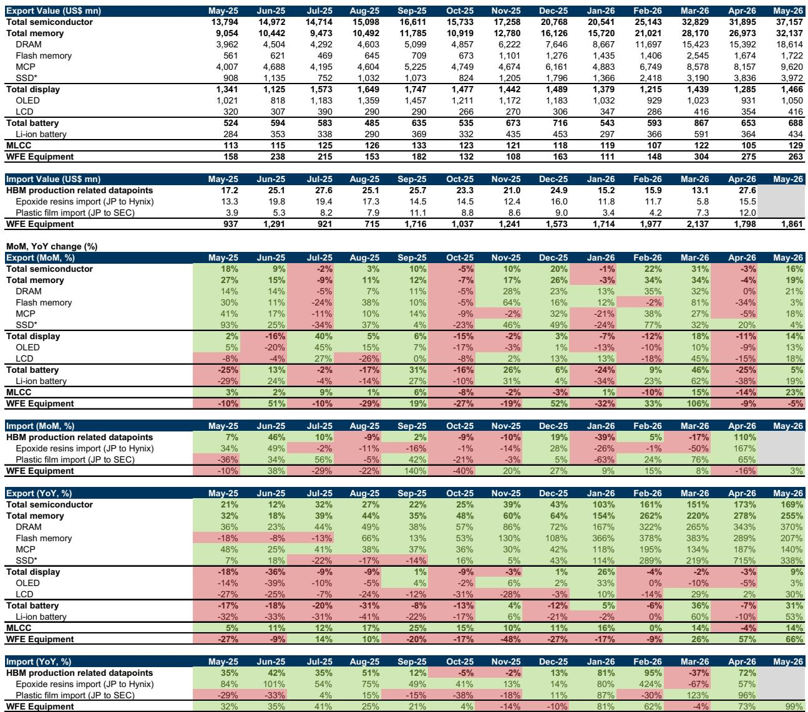
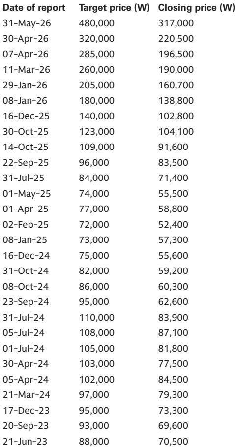
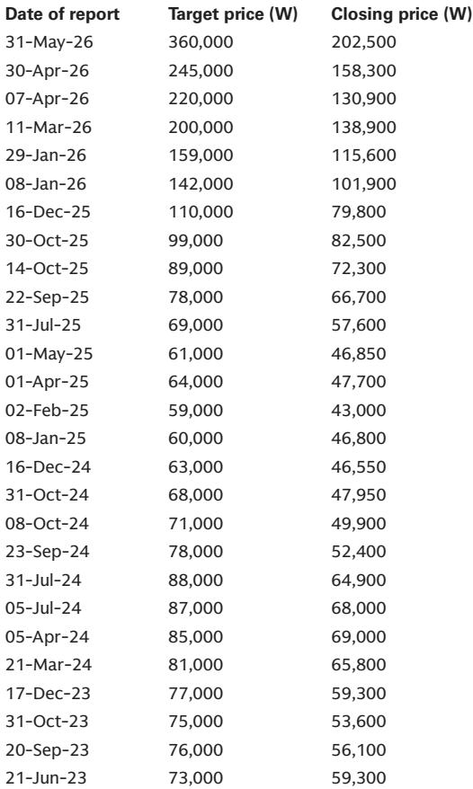

# 韩国半导体出口的真相：市场低估了供给约束的持久性

2026年5月，韩国半导体出口录得255%的同比增长，DRAM出口更是创下370%的同比增速，这是自2008年有追踪数据以来的最高记录。但真正值得关注的，不是这个数字本身，而是它背后的结构含义：这一轮高增长并非需求端的全面爆发，而是在供给端持续收紧、资本开支谨慎的背景下，由AI驱动的结构性需求与有限产能之间的错配所推动。市场如果把这份数据简单理解为“周期上行”，就可能低估了供给约束的持久性，以及它对定价权的重塑作用。

某外资投行最新发布的韩国科技出口追踪报告，通过海关数据、进口中间品追踪、设备进口趋势等角度，勾勒出一个比表面数字更复杂的图景。以下是我们从这份报告中提炼出的五个关键洞察，以及一个尚未被充分讨论的问题。

## 1. 连续四个月200%以上的同比增长，背后是两重力量的叠加而非单一驱动力

5月韩国内存出口同比增长255%，这是连续第四个月增速超过200%。DRAM出口增长370%，NAND芯片出口增长207%，SSD出口增长338%——几乎所有内存子品类都在高速运转。

但“为什么”比“多少”更重要。报告中的数据显示，这一轮高增长是两重力量叠加的结果：一是AI服务器对HBM和高端DRAM的持续消耗，二是传统内存产品在低基数上的补涨。三星电子的内存收入预计在2Q26同比增长452%，增速高于SK海力士的271%，原因正是三星对传统内存产品的暴露更高，且在HBM收入上有一个较低的基数。

这意味着，市场不能简单地用“AI需求强劲”来解释一切。传统内存的爆发式增长中，有一部分是补库存和价格反弹的贡献，而这部分增长的可持续性，取决于下游终端需求的真实恢复情况。报告提到，韩国产业通商资源部将整体强劲归因于美国和中国大型科技公司的强劲需求——但这里的“大型科技公司”究竟是在囤货还是真实消耗，报告并没有完全展开。

## 2. 日本进口的封装材料数据，暴露了HBM产能爬坡的节奏差异

这份报告最有价值的洞察之一，是它通过追踪日本向韩国特定地区出口的封装材料，来推断SK海力士和三星电子的HBM出货量。这是一个典型的“高频替代数据”思路：SK海力士的HBM主要使用MR-MUF工艺，其关键材料环氧树脂主要从日本Namics公司采购，进口至利川/清州；三星电子的HBM主要使用TC-NCF工艺，其关键材料塑料薄膜主要从日本Resonac采购，进口至华城/平泽。

报告显示，4月SK海力士的环氧树脂进口同比增长57%，三星电子的塑料薄膜进口同比增长96%。从历史数据看，这两项进口数据与两家公司的HBM出货量有很强的相关性。但更值得关注的是节奏差异：三星电子的进口增速远高于SK海力士，这与其在HBM市场的追赶策略一致。

然而，这里有一个尚未解答的问题：进口数据反映的是备货行为还是实际生产？报告本身也承认，这些数据是“良好代理变量”，但并非精确对应。从Exhibit 1和Exhibit 2的数据看，1Q26 SK海力士的环氧树脂进口环比下降，而同期其HBM出货量仍在增长——这说明库存消耗或工艺改进可能正在发生。对于试图通过高频数据提前判断HBM出货节奏的投资者来说，这个差异值得深入拆解。

## 3. 设备进口的激增，正在为下一阶段的供给格局埋下伏笔

5月韩国半导体设备进口同比增长99%，出口同比增长66%。报告认为，设备进口的强劲增长来自内存供应商为缓解供应紧张而增加的资本开支，而出口的强劲则来自全球半导体产能建设的旺盛需求。

这个数据点的重要性在于：它暗示了韩国内存厂商正在加速扩产。但扩产的方向是什么？是HBM专用产能，还是传统DRAM产能？报告没有给出明确的拆分。从逻辑上推断，如果扩产主要集中在HBM，那么传统DRAM的供给约束可能持续更久，价格支撑更强；如果扩产覆盖传统DRAM，那么当前的高增速可能提前见顶。

这个问题的答案，将直接影响对2027年内存定价的判断。报告中的设备进口数据提供了一条线索，但要得出可靠结论，还需要结合各家公司的资本开支指引和具体产能规划。

## 4. OLED和MLCC的温和反弹，说明非AI领域的复苏并不均衡

与内存的爆发式增长形成对比，OLED出口仅增长3%，MLCC增长14%，锂离子电池增长53%。这些数字虽然都为正，但增速远不及内存，且波动较大。MLCC在4月曾短暂下滑4%，结束了连续12个月的正增长；锂离子电池在4月也录得10%的同比下滑。

报告对这些领域的判断是：OLED的增长来自新手机产品的拉动，但终端市场需求因半导体成本上升而受到抑制；MLCC的增长主要由AI服务器和汽车用MLCC驱动；锂离子电池的增长则来自EV和ESS电池出口的增加以及关键矿产价格上涨带来的ASP提升。

这些领域的共同特征是：增长有支撑，但不够强劲，且高度依赖特定细分市场。对于非AI领域的科技公司来说，当前的环境更像是“结构性分化”而非“全面复苏”。那些能够切入AI供应链的公司（如三星电机在AI服务器MLCC上的布局）表现更好，而那些依赖消费电子和传统汽车的公司则面临更大的不确定性。

## 5. 报告尚未完全回答的关键问题：高增长的可持续性取决于两个变量的走向

这份报告提供了丰富的数据和清晰的逻辑框架，但有两个关键问题没有给出明确答案：

第一，内存出口的高增速还能持续多久？当前的增长中，价格因素和量的因素各占多少？报告给出了出口金额，但没有拆分ASP和出货量。如果当前的高增长主要来自ASP上涨，那么一旦价格拐点出现，增速可能迅速回落。

第二，设备进口的激增是否会改变供给格局？如果韩国厂商的扩产计划如期推进，2027年内存市场可能面临供给过剩的风险。但扩产的节奏、方向和实际产出效率都存在不确定性。

这两个问题，恰恰是判断当前估值是否合理、以及下一步投资策略的核心。对于关注韩国科技股的投资者来说，这些未解问题意味着：当前的乐观情绪有数据支撑，但需要持续跟踪高频指标来判断拐点。

## 6. 一个可操作的观察框架：如何用这份报告的数据做前瞻判断

基于这份报告，我们建议读者建立一个三层次的观察框架：

第一层，关注内存出口增速的变化趋势。如果增速开始放缓，需要判断是基数效应还是需求走弱。第二层，关注HBM相关材料的进口数据，尤其是SK海力士和三星电子的节奏差异。如果三星电子的进口增速持续领先，可能意味着HBM市场份额正在发生变化。第三层，关注设备进口的绝对值变化。如果设备进口持续高增长，意味着供给端正在加速扩张，这将对2027年的定价产生压力。

这三个层次的数据，可以在月度层面提供比公司财报更及时的信号。但需要注意的是，这些数据只是代理变量，不能替代对公司基本面的深入研究。

---

以上是我们基于这份报告的初步解读。关于内存出口的价格与量的拆分、HBM产能爬坡的精确节奏、以及设备进口对供给格局的潜在影响，这些话题在完整报告中有更详细的图表和讨论。如果你对这些未解问题感兴趣，欢迎来星球微信群里继续讨论，我们会定期分享更多深度分析。

Personal reading notes and learning share only. Not investment advice.

