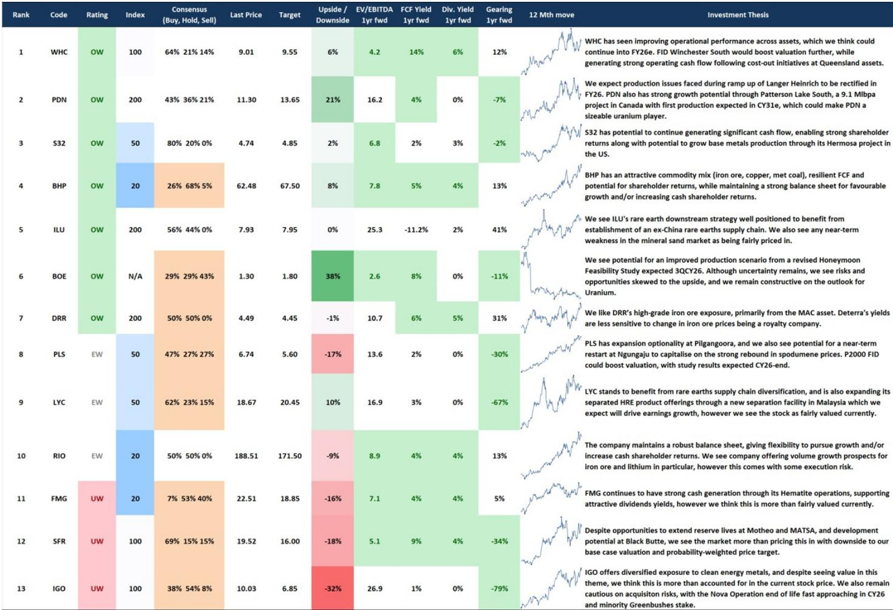
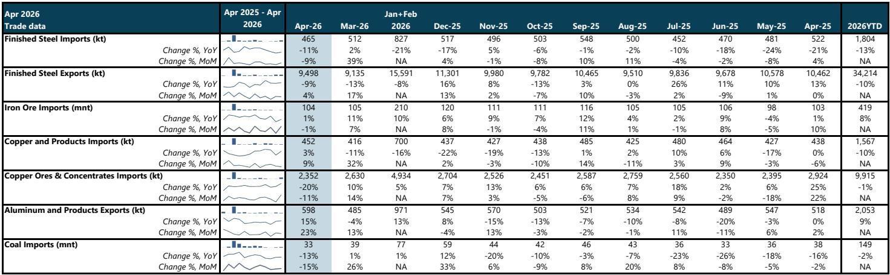
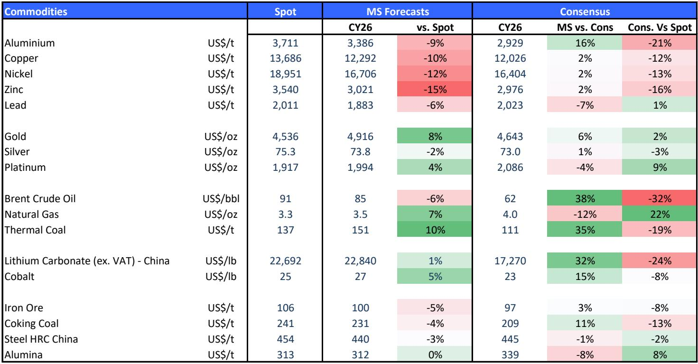

# Lithium's Supply Response Is Real, But It May Be Too Late to Prevent a 2026 Deficit and Too Early to Cap the Next Cycle

The lithium market has entered a critical inflection point. After a prolonged period of price weakness that forced widespread production curtailments and project deferrals, the recent recovery in spodumene prices has triggered a wave of restart announcements and brownfield expansion approvals across Australia. Over the past two weeks alone, multiple producers have unveiled plans to bring idled capacity back online and accelerate growth projects, signaling that the supply-side discipline that characterized the downturn is now giving way to a more opportunistic response. The question for investors is not whether this supply response will materialize—it is already happening—but whether it will arrive in time to close the projected deficit, or instead simply reset expectations for the medium-term surplus.

The controlling insight from the latest research is that near-term supply additions are real but insufficient. The combined volume of announced restarts and expansions through early 2026 amounts to roughly 97,000 tonnes of lithium carbonate equivalent across multiple projects, yet the modeled market deficit for 2026 stands at approximately 117,000 tonnes LCE. This arithmetic gap matters because it suggests that even if every announced project executes flawlessly, the market will still need additional supply or demand destruction to balance. The restarts are not a solution to the immediate shortage—they are a signal that producers are responding to price signals, which may limit how high prices can run but will not prevent a tightening market in the near term.

This dynamic creates a strategic tension that defines the current opportunity set. The market is pricing in a recovery, but the composition and timing of that recovery are deeply uncertain. Investors must distinguish between companies that benefit from a cyclical tailwind and those that possess structural advantages that persist beyond the cycle. The restarts favor low-capex, high-margin operations that can be brought online quickly, but they also risk reintroducing supply that could cap the upside for those same producers. The winners in this environment will be those with the lowest cost positions, the most flexible balance sheets, and the ability to execute expansion plans without diluting returns.

## The Australian Supply Response Is Concentrated in Low-Capex Restarts, Not Greenfield Projects, Which Limits Its Impact on Near-Term Pricing

The nature of the supply response matters as much as its magnitude. The announcements from Mineral Resources' Bald Hill restart, the Mt Marion float plant and underground expansion, the Mt Holland regulatory approval, and the Pioneer Dome direct shipping ore project share a common characteristic: they are all relatively low-capital-intensity initiatives that leverage existing infrastructure and permits. Bald Hill, for example, is expected to deliver first shipment as early as July 2026, with an annual capacity of 140,000 tonnes of spodumene concentrate, equivalent to roughly 18,000 tonnes LCE. This is a restart of a previously operational mine, not a new greenfield development. Similarly, the Mt Marion expansion adds 100,000 tonnes of capacity through a float plant and underground development, but the timeline extends to fiscal year 2028.

This pattern is instructive. The lithium industry learned painful lessons during the 2022-2024 downturn, when overinvestment in greenfield capacity led to massive capital destruction. The current wave of investment is therefore concentrated in the most capital-efficient opportunities. Brownfield expansions and restarts offer faster payback periods and lower execution risk, but they also represent smaller incremental volumes relative to the scale of the market deficit. The 97,000 tonnes LCE of announced capacity is meaningful, but it is still roughly 20% short of the 117,000 tonne deficit projected for 2026. More importantly, these additions come online gradually, with the bulk of new production arriving in late 2026 and 2027, meaning the deficit will likely persist through the first half of next year.

The implication for pricing is nuanced. The market is unlikely to see a sustained spike to the levels that triggered the original wave of investment in 2021-2022, because the supply response is already being priced in. However, the deficit is real enough to prevent a collapse back to the distressed levels of 2024. The most probable outcome is a trading range that incentivizes further restarts but does not reward speculators betting on a parabolic move. For investors, this means that stock selection based on cost position and balance sheet strength will outperform a simple long or short view on lithium prices.

## The 2026 Deficit Is Large Enough to Support Prices, But Demand Assumptions Are the Critical Variable That Could Flip the Balance

The deficit projection of 117,000 tonnes LCE is not a fixed number; it is a function of assumptions about demand growth, particularly from the Chinese electric vehicle market. The research base case assumes 9% year-on-year growth in Chinese wholesale battery electric vehicle sales for 2026, which is a reasonable but not conservative estimate. The year-to-date run rate is approximately 3%, which is materially below the forecast. If Chinese EV sales growth decelerates further—due to slower economic growth, trade tensions, or shifts in consumer preferences toward hybrids—the deficit could shrink or even disappear entirely.

This is not a hypothetical risk. The Chinese market has shown significant volatility in adoption rates, and government policy interventions have historically created boom-and-bust cycles in EV sales. The current 3% year-to-date run rate is already below the 9% assumption, and if this persists, the implied deficit for 2026 could be cut by a third or more. Furthermore, the report flags an additional risk from sodium-ion batteries, which could erode demand for lithium in energy storage systems, entry-level passenger vehicles, and light commercial vehicles. Sodium-ion technology is still in its early stages, but any meaningful adoption would directly reduce lithium demand growth in the segments where it is most price-sensitive.

The interplay between supply and demand assumptions creates a wide range of potential outcomes. At the optimistic end, strong EV adoption and limited sodium-ion penetration would sustain the deficit and support prices above $2,000 per tonne spodumene. At the pessimistic end, weaker demand combined with successful restarts could push the market into surplus earlier than expected, limiting price upside to the $1,500-1,800 range. The report's relative preference for Pilbara Minerals at equal-weight and underweight on IGO reflects this uncertainty: Pilbara has the Ngungaju restart and P2000 expansion as catalysts, but these are already reflected in consensus estimates, while IGO faces risks from the Greenbushes life-of-mine plan and the approaching end of the Nova operation.

This uncertainty is not resolved by the report. The deficit projection is a central estimate, not a forecast range. Investors who want to position for the lithium cycle must make their own judgment about demand growth and the pace of supply response. The report provides the framework, but the decision ultimately depends on whether one believes the Chinese EV market will accelerate or decelerate from its current trajectory.

## Medium-Term Surpluses Are Projected for 2027-2029, But These Are Modest and Could Be Erased by Structural Demand Growth or Further Supply Discipline

The report's market balance projections show a shift from a 117,000 tonne deficit in 2026 to a 50,000 tonne surplus in 2027, followed by surpluses of 96,000 tonnes in 2028 and 66,000 tonnes in 2029. These numbers are important because they suggest that the current supply response, combined with ongoing project development, will eventually overwhelm demand growth and push the market back into surplus. However, the magnitude of these surpluses is modest relative to total market size, and they are highly sensitive to small changes in demand or supply.

A 50,000 tonne surplus in 2027 represents roughly 2-3% of projected total lithium demand, which is within the range of normal inventory swings. This is not a structural oversupply in the style of 2023-2024, when massive overinvestment created a glut that crushed prices. Instead, it suggests a market that cycles between deficit and surplus on relatively narrow margins, which is typical of commodity markets in structural growth phases. The key question is whether the surplus will be large enough to force prices below the marginal cost of production for high-cost producers, or whether it will simply represent a normal inventory build that supports prices at the lower end of the incentive range.

The report's lithium-in-motion interactive model provides a useful framework for stress-testing these assumptions. By adjusting demand growth rates, restart timelines, and new project approvals, investors can generate their own probability-weighted scenarios. The base case surplus of 50,000 tonnes in 2027 could easily become a deficit if Chinese EV sales accelerate or if one or two of the announced restarts face delays. Conversely, if sodium-ion adoption accelerates or if additional brownfield expansions are announced, the surplus could widen to 100,000 tonnes or more. The range of outcomes is wide, and the market will likely oscillate between fear of shortage and fear of glut over the next 18 months.

For strategic investors, this implies that a static position in lithium equities is unlikely to capture the full cycle. Active management, based on real-time data on prices, inventory levels, and project execution, will be necessary to navigate the volatility. The report's preference for equal-weight on Pilbara and underweight on IGO reflects this view: both companies have exposure to the lithium cycle, but their risk-reward profiles differ significantly based on cost position, balance sheet strength, and project optionality.

## What the Report Does Not Fully Answer: The Timing of Demand Inflection and the Role of Non-Chinese Markets

The report provides a detailed analysis of supply response and Chinese demand, but it leaves several critical questions unresolved. The most important is the trajectory of lithium demand outside China. Europe and North America are both pursuing aggressive EV adoption targets, but their actual sales growth has been inconsistent, hampered by infrastructure bottlenecks, high vehicle prices, and policy uncertainty. The report's demand assumptions are heavily weighted toward China, which is reasonable given its dominant market share, but it does not provide a detailed breakdown of non-Chinese demand or sensitivity analysis for different regional scenarios.

A second unresolved question is the pace of sodium-ion battery adoption. The report notes that sodium-ion could erode LFP market share in energy storage, entry-level passenger vehicles, and light commercial vehicles, but it does not quantify the potential impact or provide a timeline for commercialization. Sodium-ion is still a nascent technology, but its cost advantages in certain applications could accelerate adoption faster than the market expects. If sodium-ion captures even 5-10% of the addressable market for energy storage and entry-level EVs, the impact on lithium demand would be significant, potentially eliminating the projected deficit entirely.

Finally, the report does not fully address the implications of the Australian supply response for the global cost curve. The restarts and brownfield expansions are concentrated in Australia, which is already the lowest-cost producing region for spodumene. If these projects succeed, they will reinforce Australia's dominance in the lithium supply chain and potentially crowd out higher-cost producers in Africa, South America, and North America. This has important implications for equity selection: Australian producers with low costs and strong balance sheets are likely to outperform peers in higher-cost regions, even if lithium prices moderate.

## A Decision Framework for Investors: Three Scenarios and Their Implications for Portfolio Positioning

Given the uncertainty around demand and supply, investors need a structured framework for evaluating lithium exposure. The following three scenarios capture the range of plausible outcomes and suggest different portfolio responses.

Scenario One: Strong Demand, Constrained Supply. In this scenario, Chinese EV sales accelerate to 12-15% growth, sodium-ion adoption remains limited, and the announced restarts face minor delays. The 2026 deficit widens to 150,000 tonnes or more, pushing spodumene prices above $3,000 per tonne. The medium-term surpluses for 2027-2029 are eliminated, and the market remains in deficit through 2028. In this environment, the highest leverage is to pure-play lithium producers with restart optionality and expansion capacity. Pilbara Minerals, with its Ngungaju restart and P2000 expansion, would be a primary beneficiary. Underweight positions on IGO would be maintained due to the Greenbushes risk, but the overall lithium exposure should be overweight.

Scenario Two: Moderate Demand, Timely Supply. This is the base case embedded in the report. Chinese EV sales grow at 9%, the announced restarts execute on schedule, and sodium-ion captures 2-3% of the addressable market. The 2026 deficit is 100-120,000 tonnes, supporting prices in the $2,000-2,500 range. The market shifts to a modest surplus in 2027, which caps price upside but prevents a collapse. In this scenario, the best risk-reward is in diversified miners with lithium exposure as part of a broader commodity portfolio, such as BHP or Rio Tinto, which offer free cash flow yields and dividend income as a buffer against lithium price volatility. Equal-weight on Pilbara and underweight on IGO remain appropriate.

Scenario Three: Weak Demand, Oversupply. Chinese EV sales growth decelerates to 3-5%, sodium-ion adoption accelerates to 5-7% of the addressable market, and the announced restarts are joined by additional brownfield expansions. The 2026 deficit shrinks to 50,000 tonnes or less, and the 2027 surplus widens to 150,000 tonnes. Spodumene prices fall back to the $1,200-1,500 range, testing the viability of high-cost producers. In this scenario, lithium equities would underperform, and investors should reduce exposure to pure-play lithium names in favor of miners with diversified commodity exposure, strong balance sheets, and high free cash flow yields. Underweight on IGO would be maintained, and even equal-weight on Pilbara might be too optimistic.

The report does not tell investors which scenario will materialize, but it provides the data and analysis needed to make that judgment. The critical variables to monitor are Chinese EV sales data, sodium-ion battery announcements, and the execution timelines of the Australian restarts. Investors who track these indicators can adjust their positioning dynamically as new information becomes available.

## Join the Community to Read the Full Report and Review the Original Charts

The analysis presented here is based on a global investment bank report that includes detailed supply and demand models, valuation tables for ASX-listed miners, and scenario analysis for lithium prices through 2030. The full report contains the lithium-in-motion interactive model, which allows readers to stress-test their own assumptions about demand growth, restart timelines, and new project approvals. It also includes relative preference tables for ASX miners across multiple commodities, providing a comprehensive framework for portfolio construction in the resources sector. Join the community to read the full report and review the original charts.

*This article is for learning and discussion only and does not constitute investment advice.*

Personal reading notes and learning share only. Not investment advice.

