# Steel: Old Playbook, New Framework

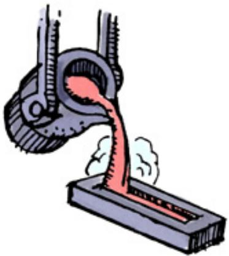

natural_image

Illustration of a red liquid being poured into a container using a tool (no text or symbols)

# MORGANSTANLEYRESEARCH

# Europe

MS & Co. International plc+

# European Equity Research

Alain Gabriel, CFA

# EQUITY ANALYST

Alain.Gabriel@morganstanley.com

+44 (0)20 7425 8959

Ioannis Masvoulas, CFA

# EQUITY ANALYST

Ioannis.Masvoulas@morganstanley.com

+44 (0)20 7425 0427

Adahna Ekoku

# EQUITY ANALYST

Adahna.Ekoku@morganstanley.com

+44 20 7677-0065

Ferdinand Huber

# RESEARCH ASSOCIATE

Ferdinand.Huber@morganstanley.com

+44 20 7677-2702

# Global Commodities Research

Amy Gower, CFA

# COMMODITY STRATEGIST

Amy.Sergeant@morganstanley.com

+44 (0)20 7677 6937

MS does and seeks to do business with companies covered in MS. As a result, investors should be aware that the firm may have a conflict of interest that could affect the objectivity of MS. Investors should consider MS as only a single factor in making their investment decision.

For analyst certification and other important disclosures, refer to the Disclosure Section.

+= Analysts employed by non-U.S. affiliates are not registered with FINRA, may not be associated persons of the member and may not be subject to FINRA restrictions on communications with a subject company, public appearances and trading securities held by a research analyst account.

# Risk-Reward: Repricing Europe's Steel Market

Opportunity persists: The new EU steel regime reduces import quotas by \~47% vs 2024 levels and raises the out-of-quota duty to 50%, with application expected from 1 July 2026. CBAM also moved into its definitive regime in 2026, increasing the carbon-related compliance burden on covered imports. Together, these measures should lift import parity, support prices and introduce upside to consensus earnings. The steel profit pool is migrating back toward domestic European mills, with higher import parity, a more robust policy framework and improving utilisation supporting an EBITDA/t re-base.

We continue to prefer integrated carbon steel names with local assets, shipment flexibility and high operating leverage to widening regional price differentials. ArcelorMittal remains our preferred Overweight on this theme, given its leverage to higher spreads, improving utilisation and market-share capture. We also like SSAB (Overweight), with the market is not fully reflecting the combination of US plate momentum, resilient Special Steels earnings and lower energy-cost exposure.

We maintain our constructive outlook on stainless equities. EU spreads have expanded YtD amid policy support, with a significant pull-back in imports due to CBAM and the expected safeguards. US spreads have also increased amid some demand recovery. Aperam (Overweight) remains our preferred play, offering significant operating leverage to a European recovery, and a diversified business model underpinning earnings resilience. We also continue to like Acerinox (Overweight), offering self-help recovery prospects and a catch-up opportunity.

Carbon Steel – Most preferred: ArcelorMittal and SSAB 

<table><tr><td>Company</td><td>Rating &amp; PT</td><td>Key points</td></tr><tr><td>ArcelorMittal</td><td>OW €54.30</td><td>ArcelorMittal offers strong operating leverage to a European earnings recovery with limited operating or balance-sheet risk.Full upside scenario implies EV/EBITDA compression to ~3.9x versus historical ~7.1x, a 45–50% discount.Upside to earnings would support accelerated buybacks alongside base dividends, reinforcing equity upside.Pragmatic approach to decarbonisation with disciplined, sequenced investments to limit execution and financial risk.</td></tr><tr><td></td><td>OW SEK94.00</td><td>We think the market is not fully reflecting the combination of US plate momentum, resilient Special Steels earnings and lower energy-cost exposure.Execution risks around Oxelösund and Luleå remain; but nearer term, earnings momentum is improving, the B/S remains strong, and the risk/reward now looks favourable.</td></tr><tr><td>SALZGITTERAGPeople, Steel and Technology</td><td>OW €70.80</td><td>The risk-reward has improved materially: 2026 guidance still appears conservative, earnings momentum is building into 2027 and peak SALCOS capex/leverage should ease balance-sheet concerns.Positive revision risk is rising, with MTM pointing to ~10% upside to 2027 consensus EBITDA before EU policy, safeguards or Aurubis support. HKM adds optionality via slab integration and restructuring.Valuation remains compelling, with the ex-Aurubis stub at 4.7x 2027e EV/EBITDA, 4.3x spot, versus a 7.0x through-cycle average, leaving scope for further re-rating as cash burn falls and execution risk moderates.</td></tr><tr><td>ONE STEP AHEAD.</td><td>EW €48.00</td><td>voestalpine offers local-for-local, superior margins and Railway Systems exposure – providing earnings resilience.The company has manageable decarbonisation investments/execution risks, minimising free cash flow burn as compared to peers.However, the shares have re-rated sharply and the risk-reward has become more balanced. This underpins our Equal-weight stance.</td></tr><tr><td></td><td>EW €10.70</td><td>thyssenkrupp shares have de-rated from recent peaks, as investors appear to discount a more challenging macro backdrop, renewed energy cost concerns and – more importantly – higher execution risk around the Steel Europe strategic options.Key milestones for the investment case remain: (1) execution of a value-accretive transaction and/or restructuring involving Steel Europe, (2) crystallising value from the Elevator stake, (3) concluding the Material Services spin-off as stated by management.thyssenkrupp shares are now trading broadly in line with their sum-of-the-parts, offering a more balanced risk-reward.</td></tr><tr><td></td><td>UW TL 23.00</td><td>Erdemir continues to trade at a premium to its historical average on normalised EV/EBITDA.The significant investment cycle ahead is likely to continue weighing on FCF, eroding equity value and increasing financial leverage absent a steep recovery in prices/margins.</td></tr></table>

Stainless Steel – Most preferred: Aperam and Acerinox 

<table><tr><td>Company</td><td>Rating &amp; PT</td><td>Key points</td></tr><tr><td></td><td>OW€15.50</td><td>Acerinox offers earnings resilience via its outsized US exposure and high-margin Alloys business.We see attractive growth prospects via US expansion and Alloys through the Haynes acquisition.Focus on deleveraging following the Haynes acquisition limits excess shareholder returns for the next couple of years.Valuation remains attractive vs the stock&#x27;s own history, and at a discount to alloy peers.We see longer-term re-rating prospects from the rising alloys share.</td></tr><tr><td></td><td>OW€48.00</td><td>Aperam boasts a diversified business model (Brazil, recycling, value add products).Aperam offers operating leverage to any European recovery, via its leading Stainless Europe business (currently 65% utilised), its integrated distribution business (Services &amp; Solutions) and recycling footprint (ELG).FCF looks compelling on the moderating capex profile, with peer leading FCFY in 2026/27.</td></tr><tr><td>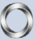</td><td>EW€5.60</td><td>Outokumpu offers the greatest operating leverage to any turn in the stainless cycle, given its #1 position in Europe, and majority exposure to stainless steel products (including its ferrochrome integration).While earnings recovery has begun, we argue a larger earnings inflection is required to catalyse the shares given market focus on the company&#x27;s operating leverage.We await progress updates/further details on the strategic initiatives outlined at the Capital Markets Day to assess the impact on group through-the-cycle profitability.</td></tr></table>

# Equity performance and valuation snapshot

LTM Performance (USD)   
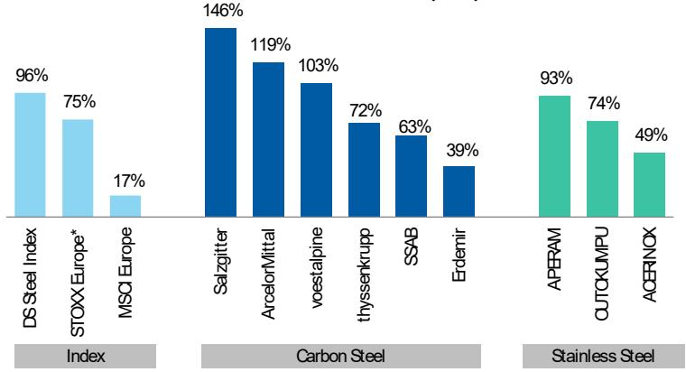

bar

| Category | Entity | Value (%) |
| :--- | :--- | :--- |
| Index | DS Steel Index | 96 |
| Index | STOXX Europe* | 75 |
| Index | MSCI Europe | 17 |
| Carbon Steel | Salzgitter | 146 |
| Carbon Steel | ArcelorMittal | 119 |
| Carbon Steel | voestalpine | 103 |
| Carbon Steel | thyssenkrupp | 72 |
| Carbon Steel | SSAB | 63 |
| Carbon Steel | Erdemir | 39 |
| Stainless Steel | APERAM | 93 |
| Stainless Steel | OUTCKUMPU | 74 |
| Stainless Steel | ACERNOX | 49 |

Source: Datastream. \* = STOXX Europe 600 BAS RES

Steel Index Relative Performance   
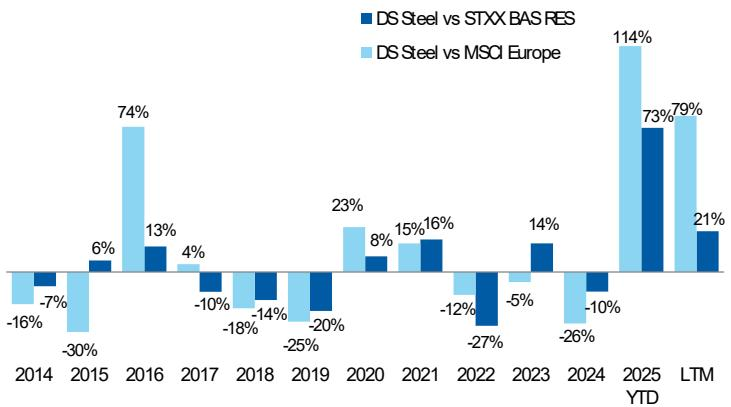

bar

| Year | DS Steel vs STXX BAS RES (%) | DS Steel vs MSCI Europe (%) |
| :--- | :--- | :--- |
| 2014 | -7 | -16 |
| 2015 | 6 | -30 |
| 2016 | 13 | 74 |
| 2017 | -10 | 4 |
| 2018 | -14 | -18 |
| 2019 | -20 | -25 |
| 2020 | 8 | 23 |
| 2021 | 16 | 15 |
| 2022 | -27 | -12 |
| 2023 | 14 | -5 |
| 2024 | -10 | -26 |
| 2025 YTD | 73 | 114 |
| LTM | 21 | 79 |

Source: Datastream

LTM EV Returns Breakdown in US\$ (NTM EBITDA)   
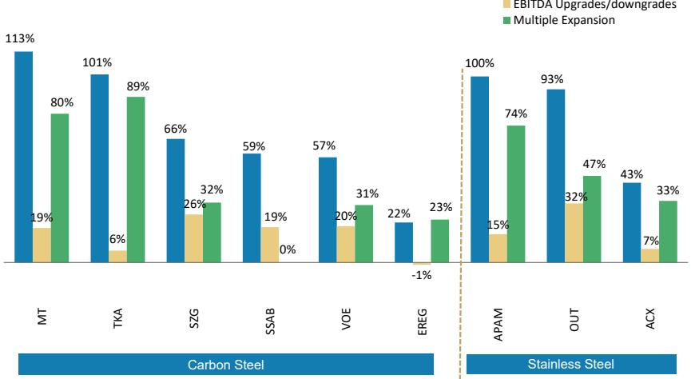

DS EU Steel vs EU Market (Relative P/B)   
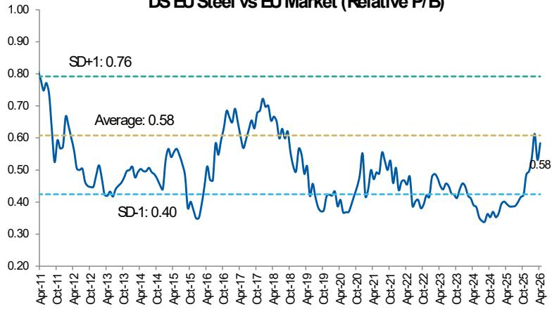

line

| Date   | Relative P/B |
|--------|--------------|
| Apr-11 | 0.80         |
| Oct-11 | 0.60         |
| Apr-12 | 0.50         |
| Oct-12 | 0.45         |
| Apr-13 | 0.50         |
| Oct-13 | 0.45         |
| Apr-14 | 0.55         |
| Oct-14 | 0.50         |
| Apr-15 | 0.40         |
| Oct-15 | 0.35         |
| Apr-16 | 0.55         |
| Oct-16 | 0.65         |
| Apr-17 | 0.70         |
| Oct-17 | 0.75         |
| Apr-18 | 0.65         |
| Oct-18 | 0.60         |
| Apr-19 | 0.50         |
| Oct-19 | 0.45         |
| Apr-20 | 0.40         |
| Oct-20 | 0.35         |
| Apr-21 | 0.55         |
| Oct-21 | 0.50         |
| Apr-22 | 0.45         |
| Oct-22 | 0.40         |
| Apr-23 | 0.45         |
| Oct-23 | 0.40         |
| Apr-24 | 0.35         |
| Oct-24 | 0.30         |
| Apr-25 | 0.40         |
| Oct-25 | 0.45         |
| Apr-26 | 0.58         |

# Global steel production: centre of gravity in Asia

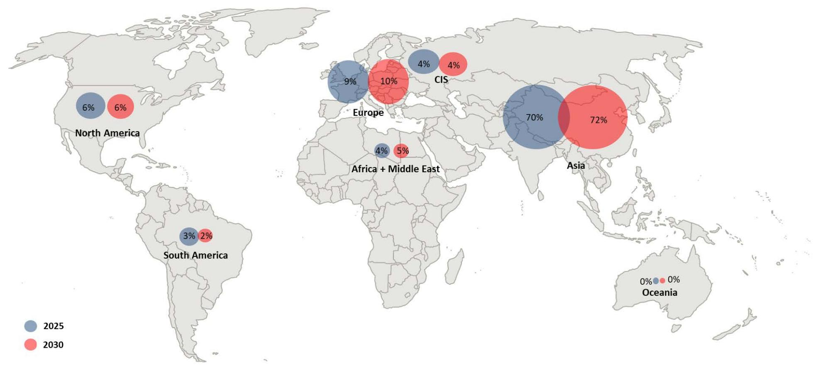

bubble

| Region | Percentage (%) | Year |
| :--- | :--- | :--- |
| North America | 6 | 2025 |
| Europe | 9 | 2025 |
| Africa + Middle East | 4 | 2025 |
| South America | 3 | 2025 |
| CIS | 4 | 2030 |
| Asia | 70 | 2025 |
| Asia | 72 | 2030 |
| Oceania | 0 | 2030 |
| Oceania | 0 | 2030 |

# Demand drivers: construction and automotive are key

Carbon Steel End Market Breakdown   
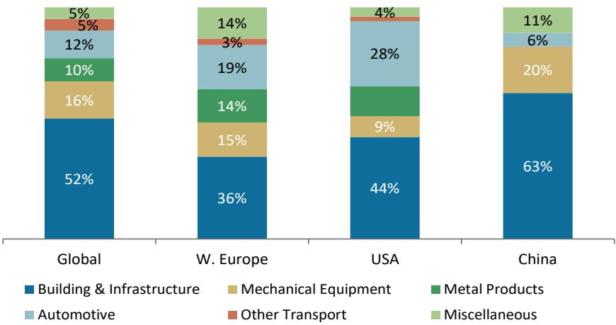

bar_stacked

| Region | Building & Infrastructure (%) | Mechanical Equipment (%) | Metal Products (%) | Automotive (%) | Other Transport (%) | Miscellaneous (%) |
| :--- | :--- | :--- | :--- | :--- | :--- | :--- |
| Global | 52 | 16 | 10 | 12 | 5 | 5 |
| W. Europe | 36 | 15 | 14 | 19 | 3 | 14 |
| USA | 44 | 9 | 13 | 28 | 4 | 4 |
| China | 63 | 20 | 0 | 6 | 0 | 11 |

Source: MS, World Steel Association, Eurofer, AISI

EU Capacity by Major Producer (2024)   
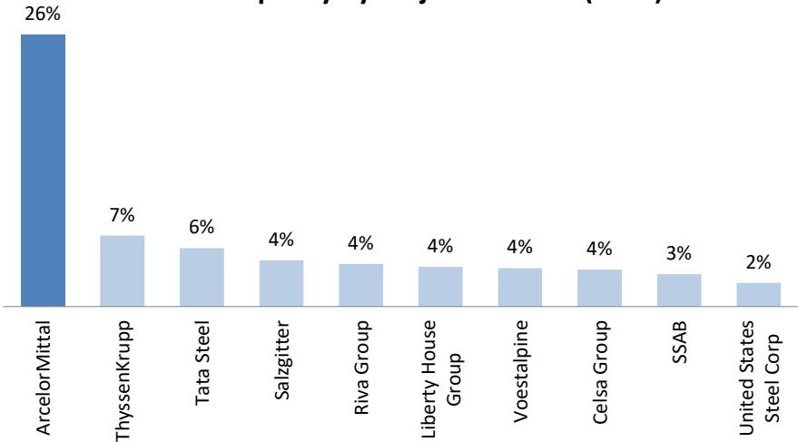

bar

| Company | Percentage (%) |
| :--- | :--- |
| ArcelorMittal | 26 |
| ThyssenKrupp | 7 |
| Tata Steel | 6 |
| Salzgitter | 4 |
| Riva Group | 4 |
| Liberty House Group | 4 |
| Voestalpine | 4 |
| Celsa Group | 4 |
| SSAB | 3 |
| United States Steel Corp | 2 |

Source: Company data, MS, CRU. Note: ArcelorMittal includes 100% of Ilva in 2024.

World Steel Production (1900-2024)   
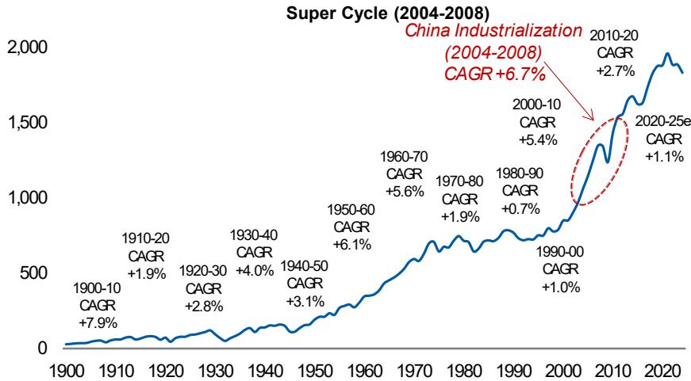

line

| Year Range       | CAGR   |
| ---------------- | ------ |
| 1900-10          | +7.9%  |
| 1910-20          | +1.9%  |
| 1920-30          | +2.8%  |
| 1930-40          | +4.0%  |
| 1940-50          | +3.1%  |
| 1950-60          | +6.1%  |
| 1960-70          | +5.6%  |
| 1970-80          | +1.9%  |
| 1980-90          | +0.7%  |
| 1990-00          | +1.0%  |
| 2000-10          | +5.4%  |
| 2010-20          | +2.7%  |
| 2020-25e         | +1.1%  |

Source: MS, World Steel Association

# European demand indicators

Germany Plant and Machinery Orders YoY   
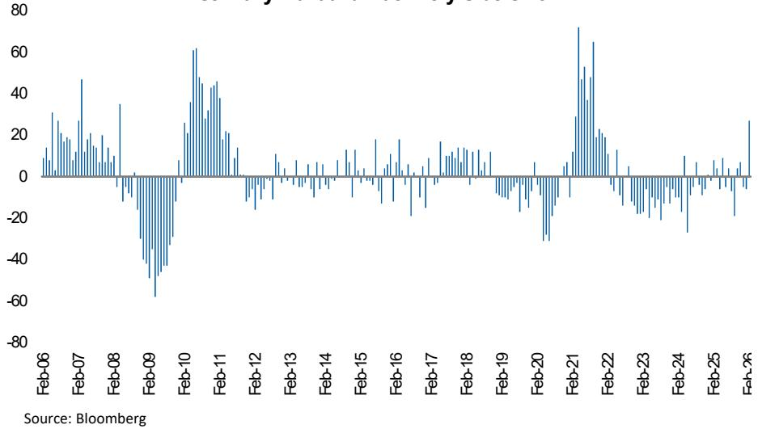

bar

| Date | Value |
|---|---|
| Feb-06 | 10 |
| Feb-07 | 30 |
| Feb-08 | 45 |
| Feb-09 | -60 |
| Feb-10 | 60 |
| Feb-11 | 45 |
| Feb-12 | -10 |
| Feb-13 | 10 |
| Feb-14 | -5 |
| Feb-15 | 10 |
| Feb-16 | 15 |
| Feb-17 | -15 |
| Feb-18 | 10 |
| Feb-19 | -5 |
| Feb-20 | -30 |
| Feb-21 | 70 |
| Feb-22 | 65 |
| Feb-23 | -10 |
| Feb-24 | -25 |
| Feb-25 | 5 |
| Feb-26 | 25 |
Source: Bloomberg

Germany Building Permits   
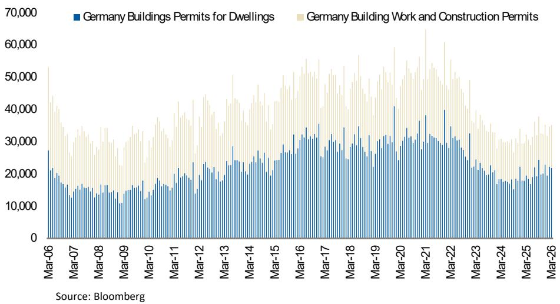

bar_stacked

| Date   | Germany Buildings Permits for Dwellings | Germany Building Work and Construction Permits |
|--------|------------------------------------------|------------------------------------------------|
| Mar-06 | 28,000                                   | 45,000                                         |
| Mar-07 | 18,000                                   | 35,000                                         |
| Mar-08 | 16,000                                   | 32,000                                         |
| Mar-09 | 15,000                                   | 30,000                                         |
| Mar-10 | 17,000                                   | 33,000                                         |
| Mar-11 | 19,000                                   | 36,000                                         |
| Mar-12 | 22,000                                   | 38,000                                         |
| Mar-13 | 24,000                                   | 40,000                                         |
| Mar-14 | 26,000                                   | 42,000                                         |
| Mar-15 | 28,000                                   | 44,000                                         |
| Mar-16 | 32,000                                   | 46,000                                         |
| Mar-17 | 34,000                                   | 48,000                                         |
| Mar-18 | 36,000                                   | 50,000                                         |
| Mar-19 | 38,000                                   | 52,000                                         |
| Mar-20 | 42,000                                   | 55,000                                         |
| Mar-21 | 45,000                                   | 58,000                                         |
| Mar-22 | 48,000                                   | 62,000                                         |
| Mar-23 | 46,000                                   | 59,000                                         |
| Mar-24 | 44,000                                   | 56,000                                         |
| Mar-25 | 42,000                                   | 54,000                                         |
| Mar-26 | 46,000                                   | 57,000                                         |

European Construction PMIs   
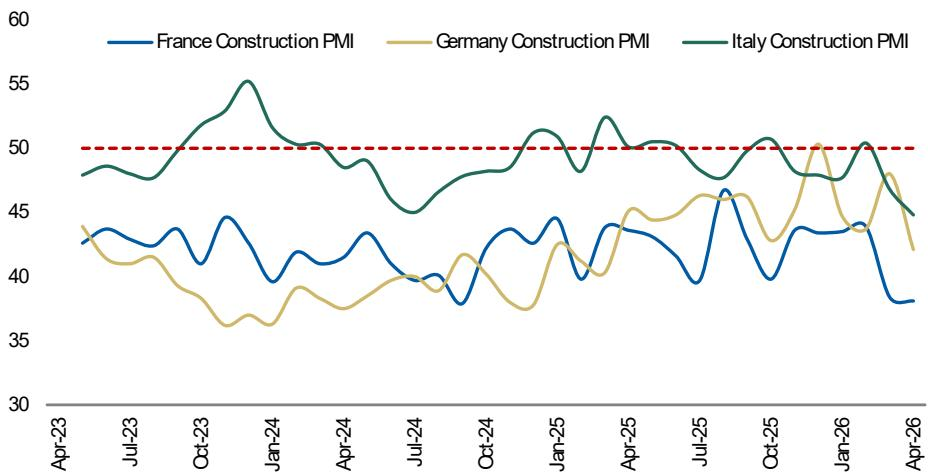

line

| Month   | France Construction PMI | Germany Construction PMI | Italy Construction PMI |
|---------|--------------------------|---------------------------|------------------------|
| Apr-23  | ~43                      | ~44                       | ~48                    |
| Jul-23  | ~42                      | ~41                       | ~47                    |
| Oct-23  | ~44                      | ~39                       | ~52                    |
| Jan-24  | ~40                      | ~37                       | ~55                    |
| Apr-24  | ~43                      | ~38                       | ~50                    |
| Jul-24  | ~40                      | ~39                       | ~45                    |
| Oct-24  | ~43                      | ~41                       | ~48                    |
| Jan-25  | ~44                      | ~43                       | ~51                    |
| Apr-25  | ~43                      | ~45                       | ~50                    |
| Jul-25  | ~40                      | ~46                       | ~50                    |
| Oct-25  | ~46                      | ~47                       | ~51                    |
| Jan-26  | ~43                      | ~50                       | ~50                    |
| Apr-26  | ~38                      | ~48                       | ~45                    |

European Construction Confidence Indicator   
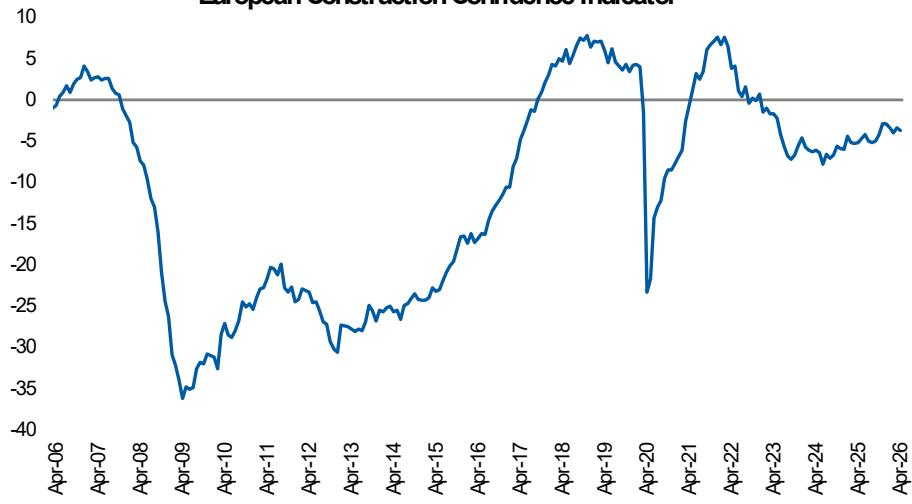

line

| Date   | European Construction Confidence Index |
|--------|---------------------------------------|
| Apr-06 | 0                                     |
| Apr-07 | 5                                     |
| Apr-08 | -10                                   |
| Apr-09 | -35                                   |
| Apr-10 | -25                                   |
| Apr-11 | -20                                   |
| Apr-12 | -25                                   |
| Apr-13 | -30                                   |
| Apr-14 | -25                                   |
| Apr-15 | -20                                   |
| Apr-16 | -15                                   |
| Apr-17 | -5                                    |
| Apr-18 | 5                                     |
| Apr-19 | 8                                     |
| Apr-20 | -25                                   |
| Apr-21 | 5                                     |
| Apr-22 | 8                                     |
| Apr-23 | 0                                     |
| Apr-24 | -5                                    |
| Apr-25 | -8                                    |
| Apr-26 | -5                                    |

Source: Bloomberg   
Source: Bloomberg

# China demand indicators

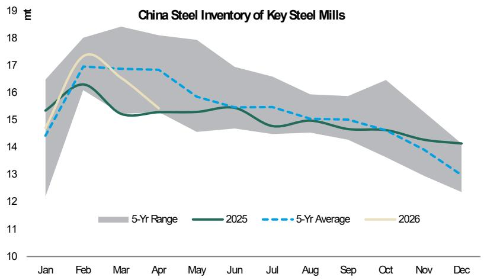

line

| Month | 2025 | 5-Yr Average | 2026 |
|-------|------|--------------|------|
| Jan   | 15.3 | 14.5         | 15.0 |
| Feb   | 16.2 | 17.0         | 17.5 |
| Mar   | 15.2 | 16.8         | 16.5 |
| Apr   | 15.3 | 16.9         | 15.5 |
| May   | 15.3 | 16.0         | 15.0 |
| Jun   | 15.4 | 15.5         | 14.8 |
| Jul   | 14.8 | 15.3         | 14.7 |
| Aug   | 14.9 | 15.0         | 14.6 |
| Sep   | 14.7 | 14.8         | 14.5 |
| Oct   | 14.6 | 14.6         | 14.4 |
| Nov   | 14.3 | 14.0         | 13.8 |
| Dec   | 14.2 | 13.0         | 13.5 |

Source: Bloomberg, MS

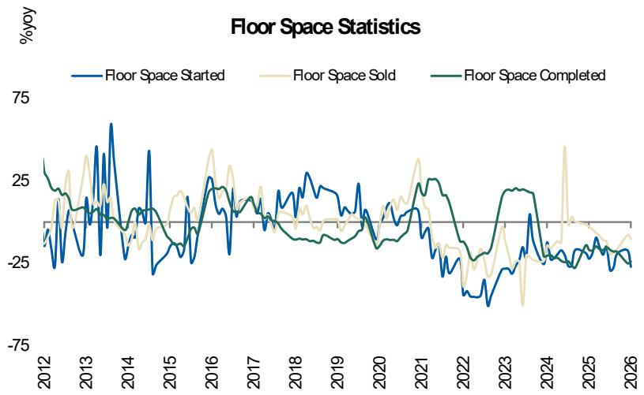

line

| Year | Floor Space Started | Floor Space Sold | Floor Space Completed |
|------|---------------------|------------------|-----------------------|
| 2012 | ~-20                | ~-15             | ~-10                  |
| 2013 | ~-15                | ~-10             | ~-5                   |
| 2014 | ~70                 | ~-5              | ~0                    |
| 2015 | ~-25                | ~-10             | ~-5                   |
| 2016 | ~-10                | ~-5              | ~0                    |
| 2017 | ~-5                 | ~0               | ~5                    |
| 2018 | ~-10                | ~5               | ~10                   |
| 2019 | ~-5                 | ~0               | ~5                    |
| 2020 | ~-10                | ~5               | ~10                   |
| 2021 | ~-5                 | ~0               | ~5                    |
| 2022 | ~-10                | ~5               | ~10                   |
| 2023 | ~-5                 | ~0               | ~5                    |
| 2024 | ~-10                | ~5               | ~10                   |
| 2025 | ~-5                 | ~0               | ~5                    |
| 2026 | ~-10                | ~5               | ~10                   |

Source: Bloomberg, MS

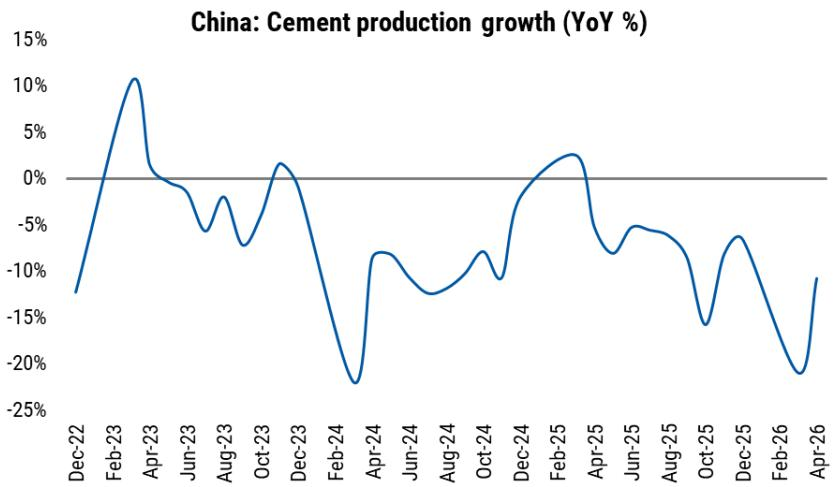

line

| Month    | Growth (%) |
| -------- | ---------- |
| Dec-22   | -12%       |
| Feb-23   | 10%        |
| Apr-23   | 0%         |
| Jun-23   | -5%        |
| Aug-23   | -8%        |
| Oct-23   | 2%         |
| Dec-23   | -10%       |
| Feb-24   | -20%       |
| Apr-24   | -8%        |
| Jun-24   | -10%       |
| Aug-24   | -12%       |
| Oct-24   | -8%        |
| Dec-24   | 0%         |
| Feb-25   | 3%         |
| Apr-25   | -8%        |
| Jun-25   | -5%        |
| Aug-25   | -7%        |
| Oct-25   | -15%       |
| Dec-25   | -5%        |
| Feb-26   | -20%       |
| Apr-26   | -10%       |

Source: Bloomberg, MS

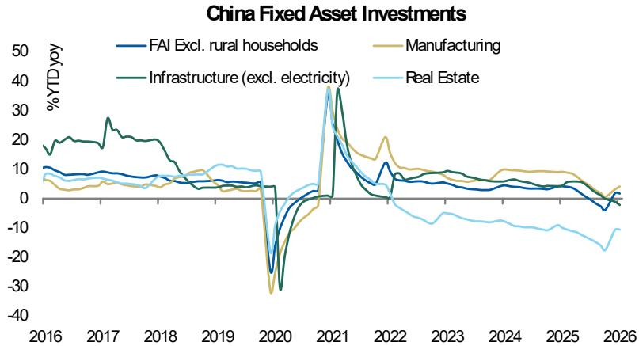

line

| Year | FAI Excl. rural households | Manufacturing | Infrastructure (excl. electricity) | Real Estate |
|------|-----------------------------|---------------|------------------------------------|-------------|
| 2016 | ~10                         | ~5            | ~15                                | ~5          |
| 2017 | ~8                          | ~4            | ~25                                | ~4          |
| 2018 | ~7                          | ~3            | ~15                                | ~3          |
| 2019 | ~6                          | ~5            | ~10                                | ~5          |
| 2020 | ~-25                        | ~-30          | ~-35                               | ~-20        |
| 2021 | ~20                         | ~35           | ~35                                | ~35         |
| 2022 | ~10                         | ~15           | ~5                                 | ~-5         |
| 2023 | ~5                          | ~10           | ~5                                 | ~-10        |
| 2024 | ~3                          | ~8            | ~3                                 | ~-15        |
| 2025 | ~2                          | ~5            | ~2                                 | ~-18        |
| 2026 | ~0                          | ~3            | ~0                                 | ~-20        |

Source: Bloomberg, MS

# US demand indicators

US: Crude Oil & Gas Rig count (%YoY)   
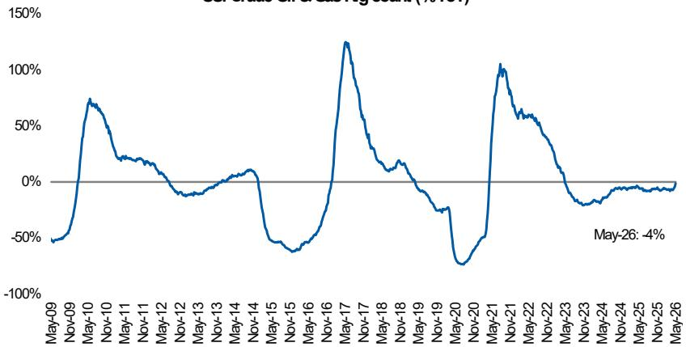

line

| Date     | Value  |
| -------- | ------ |
| May-26   | -4%    |

Source: Baker Hughes

United States New Heavy Truck Sales 2022-2026   
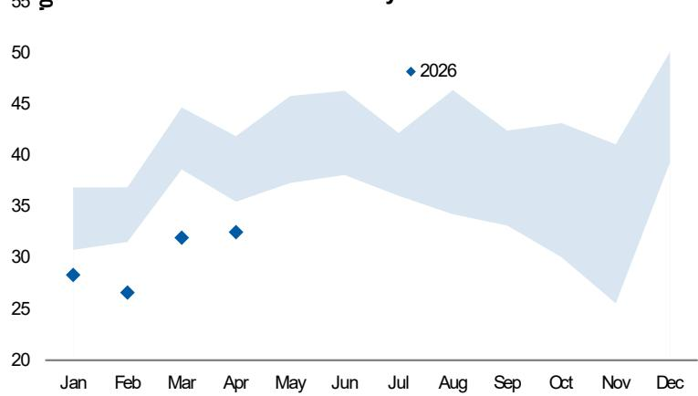

line

| Month | Value |
|-------|-------|
| Jan   | 28    |
| Feb   | 26    |
| Mar   | 32    |
| Apr   | 32    |
| Jul   | 48    |

Source: Bureau of Economic Analysis, U.S. Department of Commerce

Total US Construction Spending (YoY)   
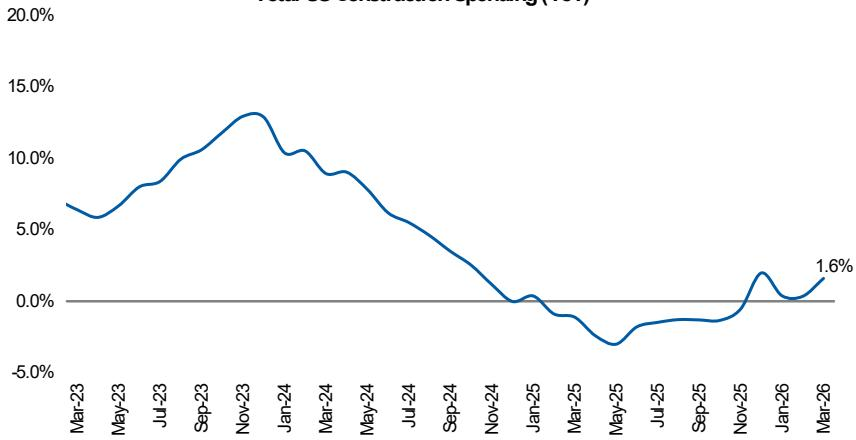

line

| Month    | Value  |
| -------- | ------ |
| Mar-26   | 1.6%   |

Source: US Census Bureau

US: Ag Equipment Monthly Sales   
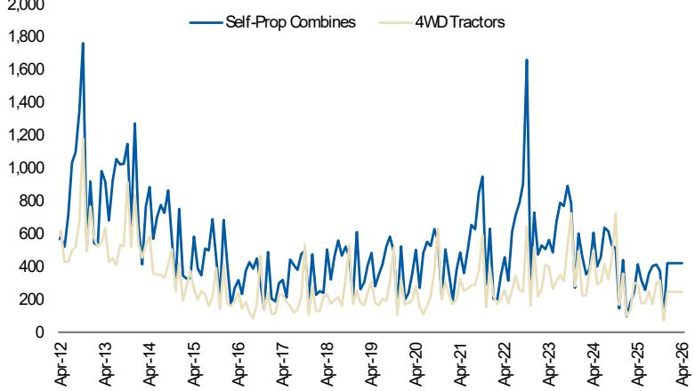

line

| Date   | Self-Prop Combines | 4WD Tractors |
|--------|--------------------|--------------|
| Apr-12 | ~500               | ~400         |
| Apr-13 | ~1800              | ~1000        |
| Apr-14 | ~1300              | ~600         |
| Apr-15 | ~700               | ~400         |
| Apr-16 | ~500               | ~300         |
| Apr-17 | ~400               | ~200         |
| Apr-18 | ~500               | ~300         |
| Apr-19 | ~600               | ~400         |
| Apr-20 | ~500               | ~300         |
| Apr-21 | ~600               | ~400         |
| Apr-22 | ~1700              | ~300         |
| Apr-23 | ~900               | ~500         |
| Apr-24 | ~600               | ~400         |
| Apr-25 | ~400               | ~200         |
| Apr-26 | ~400               | ~200         |

Source: Association of Equipment Manufacturers, Bloomberg

# Europe & Turkey automotive demand

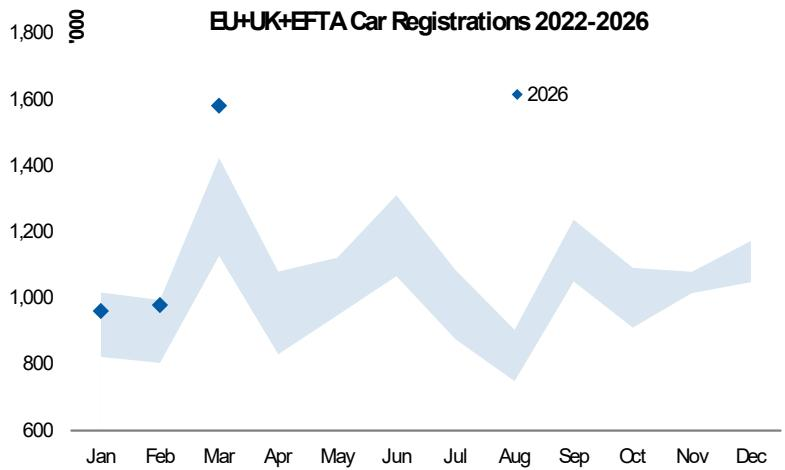

line

| Month | EU+UK+EFTA Car Registrations |
|-------|------------------------------|
| Jan   | 950                          |
| Feb   | 970                          |
| Mar   | 1580                         |
| Apr   | 1050                         |
| May   | 1100                         |
| Jun   | 1300                         |
| Jul   | 1000                         |
| Aug   | 750                          |
| Sep   | 1200                         |
| Oct   | 1050                         |
| Nov   | 1080                         |
| Dec   | 1150                         |

Source: ACEA

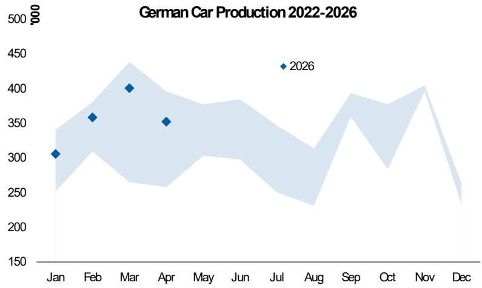

line

| Month | Production (k) |
|-------|----------------|
| Jan   | 305            |
| Feb   | 360            |
| Mar   | 400            |
| Apr   | 350            |
| Jul   | 430            |
| Dec   | 230            |

Source: VDA

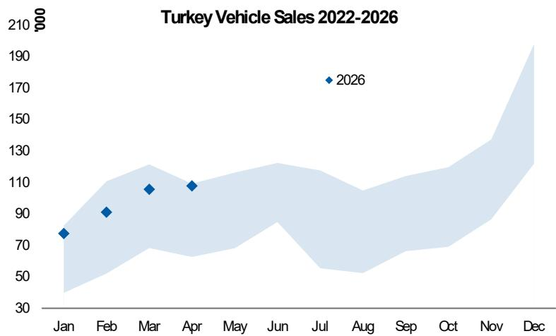

line

| Month | Value |
|-------|-------|
| Jan   | 75    |
| Feb   | 90    |
| Mar   | 108   |
| Apr   | 108   |
| Jul   | 173   |
| Dec   | 195   |

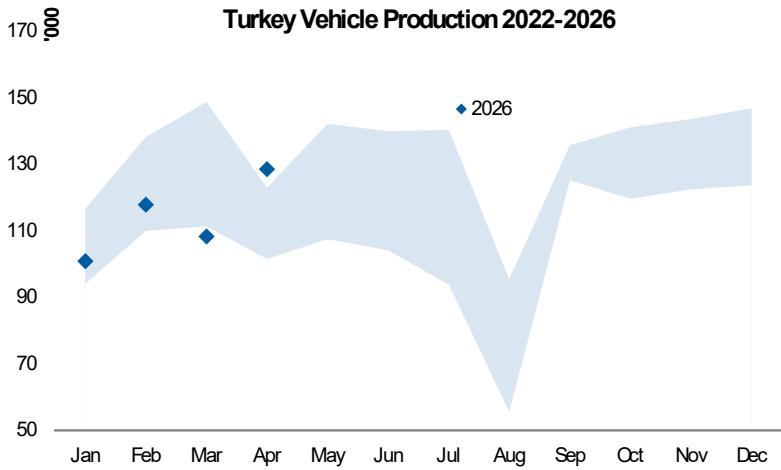

line

| Month | Value |
|-------|-------|
| Jan   | 95    |
| Feb   | 115   |
| Mar   | 110   |
| Apr   | 130   |
| May   | 140   |
| Jun   | 135   |
| Jul   | 145   |
| Aug   | 55    |
| Sep   | 130   |
| Oct   | 135   |
| Nov   | 140   |
| Dec   | 145   |

Source: Turkish Auto Distributors Association   
Source: Turkish Auto Distributors Association

# China & US automotive demand

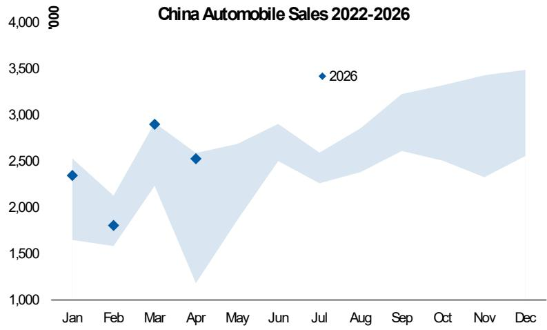

line

| Month | Value |
|-------|-------|
| Jan   | 2350  |
| Feb   | 1800  |
| Mar   | 2900  |
| Apr   | 2500  |
| Jul   | 3400  |

Source: CAAM

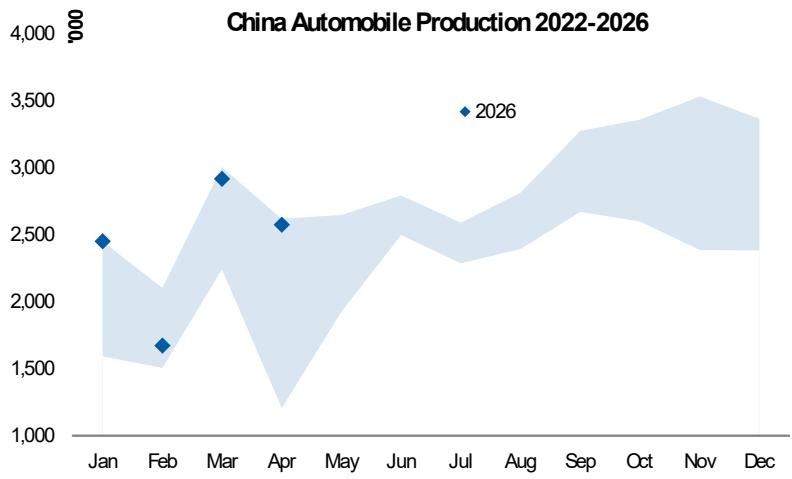

line

| Month | Production (k) |
|-------|----------------|
| Jan   | 2500           |
| Feb   | 1700           |
| Mar   | 3000           |
| Apr   | 2600           |
| May   | 2800           |
| Jun   | 2500           |
| Jul   | 2300           |
| Aug   | 2800           |
| Sep   | 3200           |
| Oct   | 3400           |
| Nov   | 3500           |
| Dec   | 3400           |

Source: CAAM

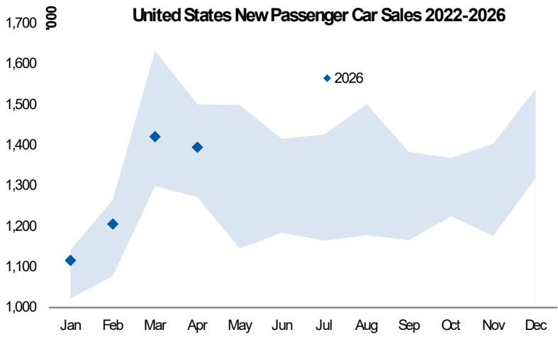

line

| Month | Sales (in thousands) |
|-------|----------------------|
| Jan   | 1100                 |
| Feb   | 1200                 |
| Mar   | 1450                 |
| Apr   | 1400                 |
| Jul   | 1550                 |
| Dec   | 1300                 |

Source: BEA

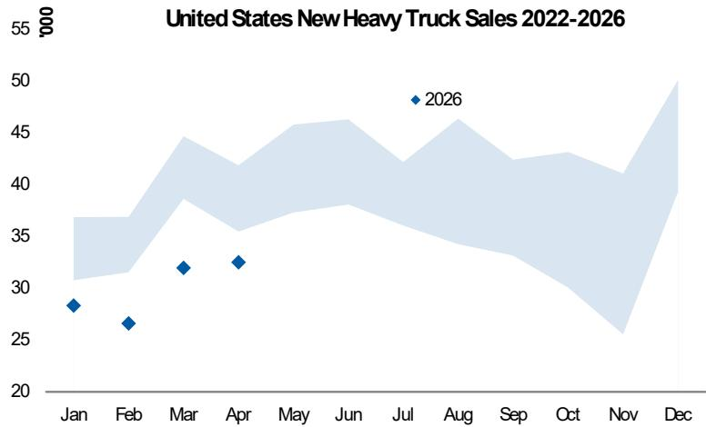

line

| Month | Value |
|-------|-------|
| Jan   | 28    |
| Feb   | 26    |
| Mar   | 32    |
| Apr   | 33    |
| May   | 45    |
| Jun   | 47    |
| Jul   | 48    |
| Aug   | 46    |
| Sep   | 43    |
| Oct   | 41    |
| Nov   | 26    |
| Dec   | 50    |

Source: BEA

# China consumption vs US consumption

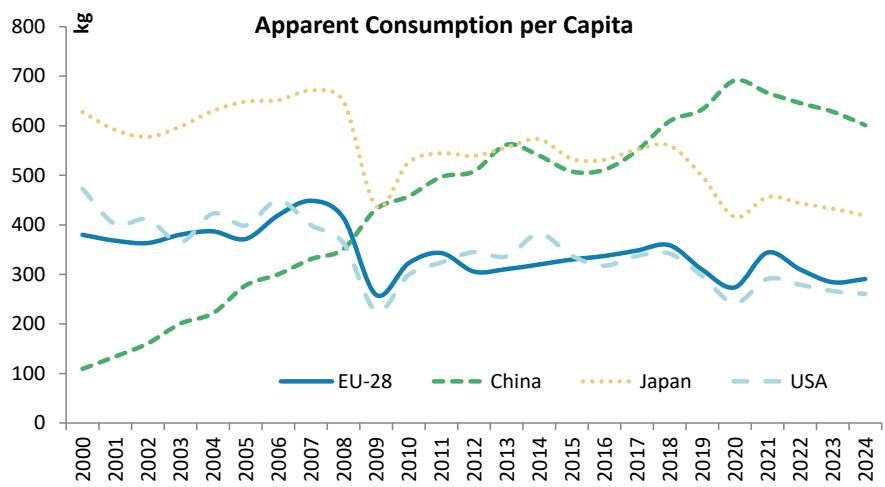

line

| Year | EU-28 | China | Japan | USA |
|------|-------|-------|-------|-----|
| 2000 | 380   | 110   | 630   | 480 |
| 2001 | 370   | 150   | 610   | 450 |
| 2002 | 360   | 180   | 590   | 430 |
| 2003 | 370   | 210   | 600   | 410 |
| 2004 | 380   | 240   | 620   | 420 |
| 2005 | 390   | 270   | 640   | 430 |
| 2006 | 400   | 300   | 650   | 440 |
| 2007 | 410   | 330   | 660   | 450 |
| 2008 | 420   | 360   | 670   | 460 |
| 2009 | 250   | 450   | 550   | 250 |
| 2010 | 320   | 480   | 560   | 320 |
| 2011 | 330   | 500   | 570   | 330 |
| 2012 | 310   | 520   | 580   | 340 |
| 2013 | 320   | 550   | 590   | 350 |
| 2014 | 330   | 570   | 600   | 360 |
| 2015 | 340   | 560   | 590   | 350 |
| 2016 | 350   | 550   | 580   | 340 |
| 2017 | 360   | 570   | 590   | 350 |
| 2018 | 370   | 600   | 610   | 360 |
| 2019 | 350   | 620   | 630   | 350 |
| 2020 | 280   | 700   | 650   | 250 |
| 2021 | 340   | 680   | 640   | 280 |
| 2022 | 320   | 660   | 630   | 270 |
| 2023 | 310   | 640   | 620   | 260 |
| 2024 | 300   | 620   | 610   | 250 |

Source: MS, World Bank, World Steel Association

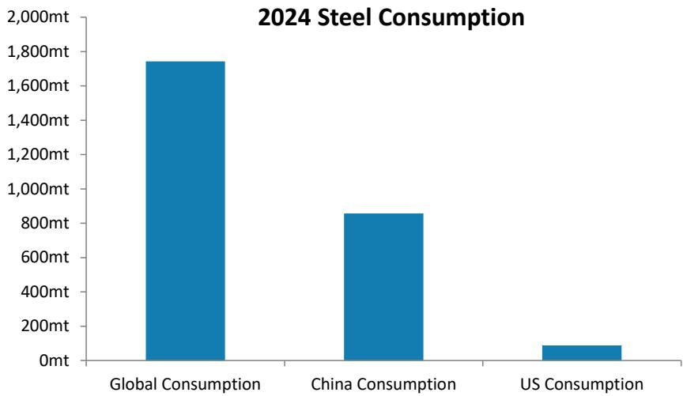

bar

2024 Steel Consumption
| Category | Consumption (mt) |
| :--- | :--- |
| Global Consumption | 1750 |
| China Consumption | 850 |
| US Consumption | 90 |

Source: World Steel Association, MS

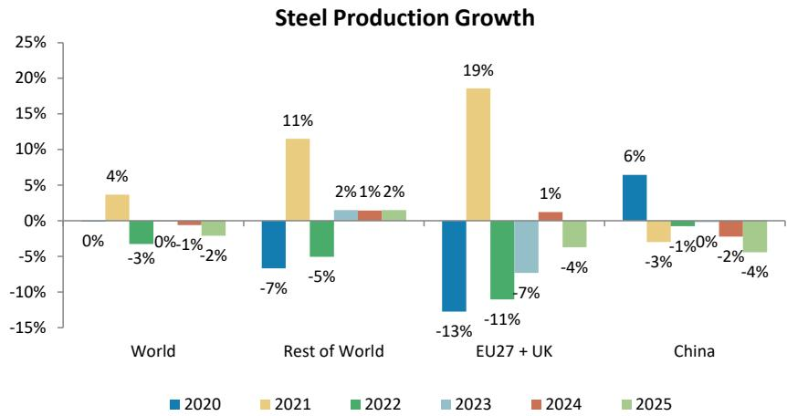

bar

Steel Production Growth
| Region | 2020 (%) | 2021 (%) | 2022 (%) | 2023 (%) | 2024 (%) | 2025 (%) |
| :--- | :--- | :--- | :--- | :--- | :--- | :--- |
| World | 0 | 4 | -3 | 0 | -1 | -2 |
| Rest of World | -7 | 11 | -5 | 2 | 1 | 2 |
| EU27 + UK | -13 | 19 | -11 | -7 | 1 | -4 |
| China | 6 | -3 | -1 | 0 | -2 | -4 |

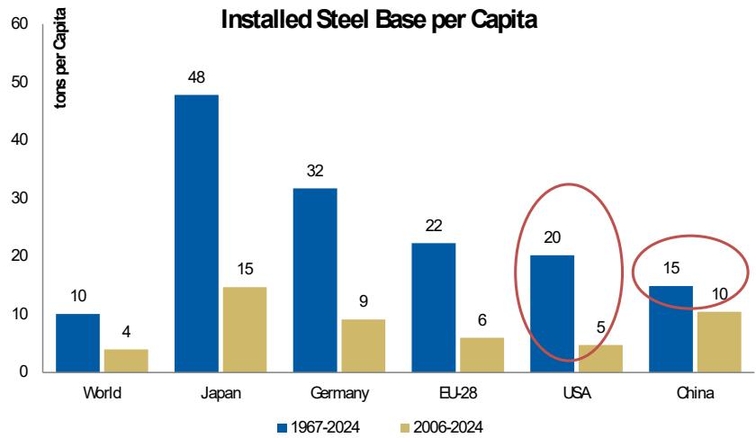

bar

Installed Steel Base per Capita
| Country/Region | 1967-2024 (tons per Capita) | 2006-2024 (tons per Capita) |
| :--- | :--- | :--- |
| World | 10 | 4 |
| Japan | 48 | 15 |
| Germany | 32 | 9 |
| EU-28 | 22 | 6 |
| USA | 20 | 5 |
| China | 15 | 10 |

Source: Datastream, World Steel Association, MS   
Source: Datastream, World Steel Association, MS

# Stainless steel demand

Stainless steel demand by end use markets   
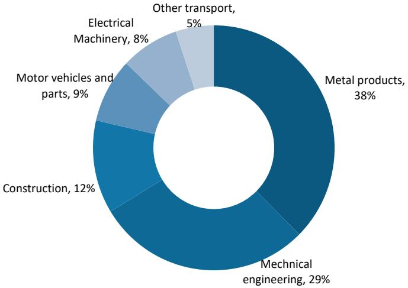

pie

| Category | Percentage (%) |
| :--- | :--- |
| Metal products | 38 |
| Mechanical engineering | 29 |
| Construction | 12 |
| Motor vehicles and parts | 9 |
| Electrical Machinery | 8 |
| Other transport | 5 |

Source: MS, ISSF

Stainless Steel intensity vs. GDP per capita (PPP adjusted) (2000-2023)   
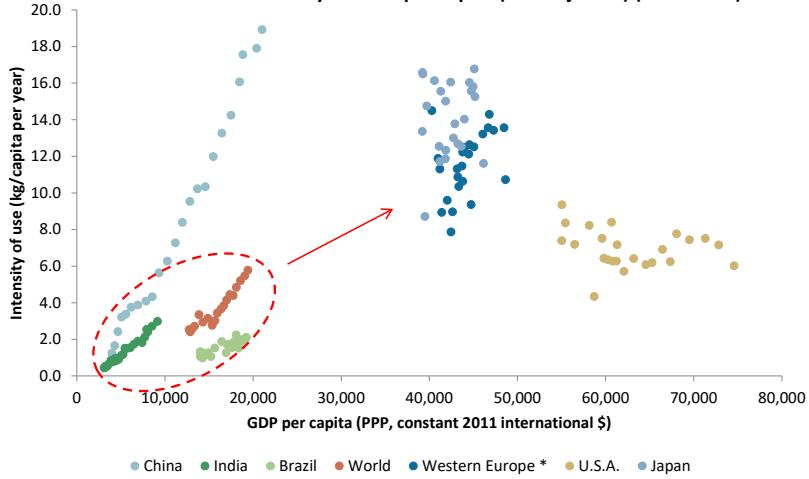  
Source: CRU, World Bank, MS

Steel demand growth vs. EZ GDP   
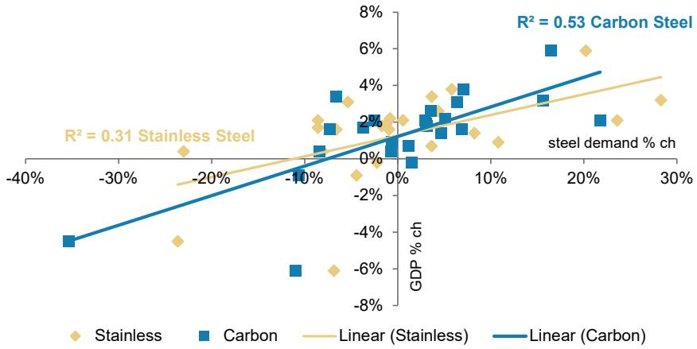

scatter

| Category         | GDP % ch | Steel Demand % ch |
| ---------------- | -------- | ----------------- |
| Stainless        | -6%      | 20%               |
| Stainless        | -4%      | 10%               |
| Stainless        | -2%      | 20%               |
| Stainless        | 0%       | 10%               |
| Stainless        | 2%       | 20%               |
| Stainless        | 4%       | 10%               |
| Stainless        | 6%       | 20%               |
| Stainless        | 8%       | 10%               |
| Stainless        | 10%      | 20%               |
| Stainless        | 12%      | 10%               |
| Stainless        | 14%      | 20%               |
| Stainless        | 16%      | 10%               |
| Stainless        | 18%      | 20%               |
| Stainless        | 20%      | 10%               |
| Stainless        | 22%      | 20%               |
| Stainless        | 24%      | 10%               |
| Stainless        | 26%      | 20%               |
| Stainless        | 28%      | 10%               |
| Carbon           | -6%      | -30%              |
| Carbon           | -4%      | -20%              |
| Carbon           | -2%      | -10%              |
| Carbon           | 0%       | 0%                |
| Carbon           | 2%       | 10%               |
| Carbon           | 4%       | 20%               |
| Carbon           | 6%       | 10%               |
| Carbon           | 8%       | 20%               |
| Carbon           | 10%      | 10%               |
| Carbon           | 12%      | 20%               |
| Carbon           | 14%      | 10%               |
| Carbon           | 16%      | 20%               |
| Carbon           | 18%      | 10%               |
| Carbon           | 20%      | 20%               |
| Carbon           | 22%      | 10%               |
| Carbon           | 24%      | 20%               |
| Carbon           | 26%      | 10%               |
| Carbon           | 28%      | 20%               |
| Carbon           | 30%      | 10%               |
| Linear (Stainless) | -6%      | -30%              |
| Linear (Stainless) | -4%      | -20%              |
| Linear (Stainless) | -2%      | -10%              |
| Linear (Stainless) | 0%       | 0%                |
| Linear (Stainless) | 2%       | 10%               |
| Linear (Stainless) | 4%       | 20%               |
| Linear (Stainless) | 6%       | 10%               |
| Linear (Stainless) | 8%       | 20%               |
| Linear (Stainless) | 10%      | 10%               |
| Linear (Stainless) | 12%      | 20%               |
| Linear (Stainless) | 14%      | 10%               |
| Linear (Stainless) | 16%      | 20%               |
| Linear (Stainless) | 18%      | 10%               |
| Linear (Stainless) | 20%      | 20%               |
| Linear (Stainless) | 22%      | 10%               |
| Linear (Stainless) | 24%      | 20%               |
| Linear (Stainless) | 26%      | 10%               |
| Linear (Stainless) | 28%      | 20%               |
| Linear (Carbon)   | -6%      | -30%              |
| Linear (Carbon)   | -4%      | -20%              |
| Linear (Carbon)   | -2%      | -10%              |
| Linear (Carbon)   | 0%       | 0%                |
| Linear (Carbon)   | 2%       | 10%               |
| Linear (Carbon)   | 4%       | 20%               |
| Linear (Carbon)   | 6%       | 10%               |
| Linear (Carbon)   | 8%       | 20%               |
| Linear (Carbon)   | 10%      | 10%               |
| Linear (Carbon)   | 12%      | 20%               |
| Linear (Carbon)   | 14%      | 10%               |
| Linear (Carbon)   | 16%      | 20%               |
| Linear (Carbon)   | 18%      | 10%               |
| Linear (Carbon)   | 20%      | 20%               |
| Linear (Carbon)   | 22%      | 10%               |
| Linear (Carbon)   | 24%      | 20%               |
| Linear (Carbon)   | 26%      | 10%               |
| Linear (Carbon)   | 28%      | 20%               |
| Linear (Carbon)   | 30%      | 10%               |
| Steel demand     | -6%      | -30%              |
| Steel demand     | -4%      | -20%              |
| Steel demand     | -2%      | -10%              |
| Steel demand     | 0%       | 0%                |
| Steel demand     | 2%       | 10%               |
| Steel demand     | 4%       | 20%               |
| Steel demand     | 6%       | 10%               |
| Steel demand     | 8%       | 20%               |
| Steel demand     | 10%      | 10%               |
| Steel demand     | 12%      | 20%               |
| Steel demand     | 14%      | 10%               |
| Steel demand     | 16%      | 20%               |
| Steel demand     | 18%      | 10%               |
| Steel demand     | 20%      | 20%               |
| Steel demand     | 22%      | 10%               |
| Steel demand     | 24%      | 20%               |
| Steel demand     | 26%      | 10%               |
| Steel demand     | 28%      | 20%               |
| Steel demand     | 30%      | 10%               |

Stainless apparent consumption (YoY) rebased   
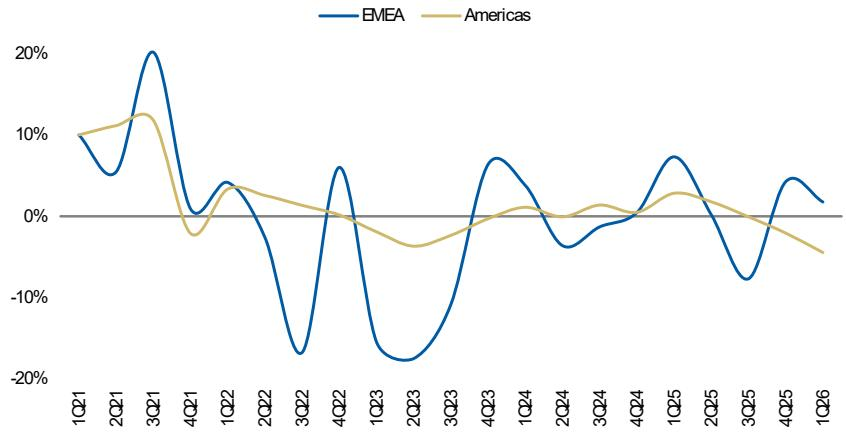

line

| Quarter | EMEA  | Americas |
|---------|-------|----------|
| 1Q21    | 10%   | 10%      |
| 2Q21    | 5%    | 12%      |
| 3Q21    | 20%   | 13%      |
| 4Q21    | 0%    | -5%      |
| 1Q22    | 5%    | 5%       |
| 2Q22    | -5%   | 0%       |
| 3Q22    | -20%  | 0%       |
| 4Q22    | 5%    | 0%       |
| 1Q23    | -20%  | -5%      |
| 2Q23    | -20%  | -10%     |
| 3Q23    | -10%  | -5%      |
| 4Q23    | 5%    | 0%       |
| 1Q24    | 0%    | 0%       |
| 2Q24    | -5%   | 0%       |
| 3Q24    | -5%   | 0%       |
| 4Q24    | 0%    | 0%       |
| 1Q25    | 5%    | 5%       |
| 2Q25    | -5%   | 0%       |
| 3Q25    | -10%  | -5%      |
| 4Q25    | 5%    | -10%     |
| 1Q26    | 0%    | -15%     |

Source: WSA, CRU, Bloomberg, MS   
Source: Outokumpu, CRU, MS

# Steel supply by key producers

'EU-27 + UK Annualised Steel Production   
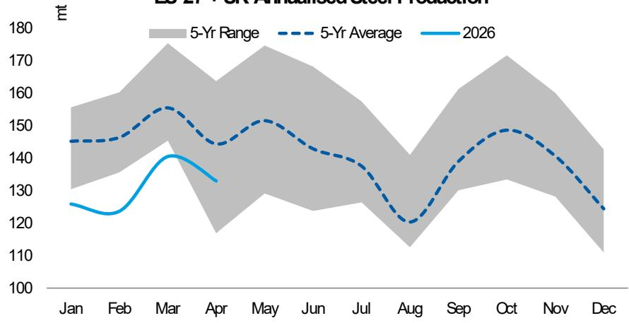

line

| Month | 5-Yr Average | 2026 |
|-------|--------------|------|
| Jan   | 145          | 125  |
| Feb   | 148          | 123  |
| Mar   | 155          | 140  |
| Apr   | 145          | 132  |
| May   | 152          | -    |
| Jun   | 148          | -    |
| Jul   | 140          | -    |
| Aug   | 120          | -    |
| Sep   | 148          | -    |
| Oct   | 148          | -    |
| Nov   | 140          | -    |
| Dec   | 125          | -    |

Source: World Steel Association

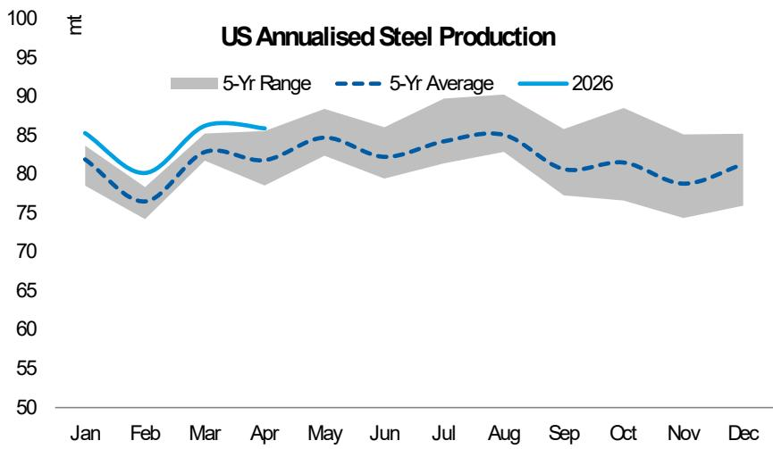

line

| Month | 5-Yr Average | 2026 |
|-------|--------------|------|
| Jan   | 82           | 85   |
| Feb   | 76           | 80   |
| Mar   | 83           | 86   |
| Apr   | 82           | 85   |
| May   | 84           | 86   |
| Jun   | 82           | 85   |
| Jul   | 84           | 86   |
| Aug   | 85           | 86   |
| Sep   | 81           | 85   |
| Oct   | 81           | 85   |
| Nov   | 79           | 84   |
| Dec   | 80           | 85   |

Source: World Steel Association

China Annualised Steel Production   
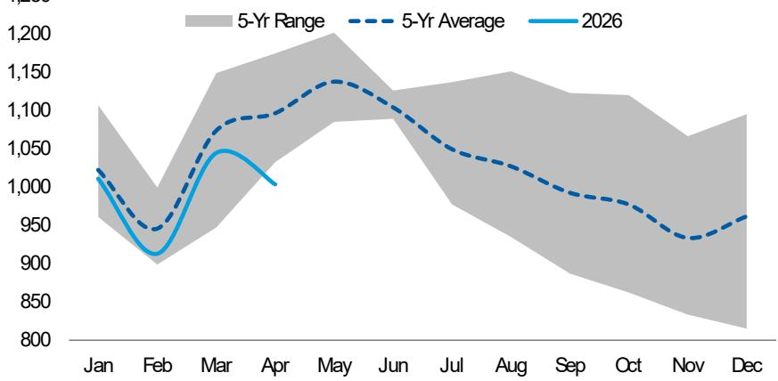

line

| Month | 5-Yr Average | 2026 |
|-------|--------------|------|
| Jan   | 1020         | 1010 |
| Feb   | 950          | 910  |
| Mar   | 1080         | 1050 |
| Apr   | 1100         | 1000 |
| May   | 1130         | -    |
| Jun   | 1100         | -    |
| Jul   | 1070         | -    |
| Aug   | 1050         | -    |
| Sep   | 1030         | -    |
| Oct   | 1010         | -    |
| Nov   | 940          | -    |
| Dec   | 960          | -    |

Brazil Annualised Steel Production   
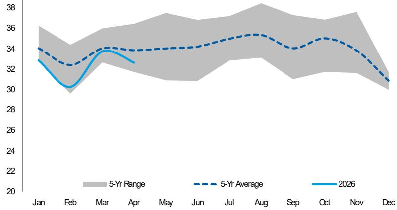

line

| Month | 5-Yr Average | 2026 |
|-------|--------------|------|
| Jan   | 34.0         | 33.0 |
| Feb   | 32.5         | 30.0 |
| Mar   | 34.0         | 34.0 |
| Apr   | 34.0         | 33.0 |
| May   | 34.0         | -    |
| Jun   | 34.5         | -    |
| Jul   | 35.0         | -    |
| Aug   | 35.5         | -    |
| Sep   | 34.5         | -    |
| Oct   | 35.0         | -    |
| Nov   | 34.0         | -    |
| Dec   | 31.0         | -    |

Source: World Steel Association   
Source: World Steel Association

# Inventories across the value chain

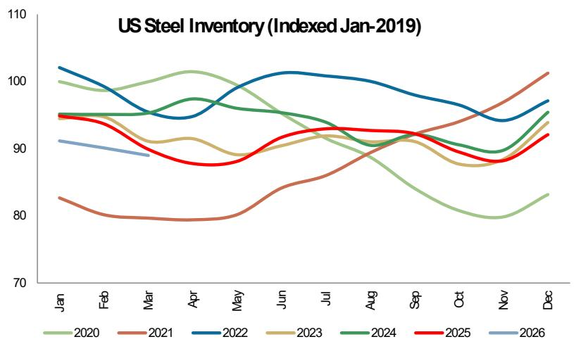

line

| Month | 2020 | 2021 | 2022 | 2023 | 2024 | 2025 | 2026 |
|-------|------|------|------|------|------|------|------|
| Jan   | 100  | 83   | 102  | 95   | 95   | 95   | 91   |
| Feb   | 98   | 80   | 100  | 94   | 95   | 94   | 90   |
| Mar   | 100  | 79   | 95   | 91   | 95   | 93   | 89   |
| Apr   | 101  | 79   | 94   | 91   | 96   | 88   | 88   |
| May   | 100  | 79   | 98   | 89   | 96   | 88   | 87   |
| Jun   | 98   | 83   | 101  | 90   | 95   | 91   | 86   |
| Jul   | 95   | 85   | 101  | 91   | 94   | 92   | 85   |
| Aug   | 90   | 87   | 100  | 91   | 93   | 92   | 84   |
| Sep   | 85   | 89   | 98   | 91   | 92   | 92   | 83   |
| Oct   | 80   | 91   | 96   | 88   | 91   | 91   | 82   |
| Nov   | 79   | 93   | 94   | 87   | 89   | 88   | 81   |
| Dec   | 83   | 101  | 97   | 94   | 95   | 92   | 82   |

Source: MSCI, MS   
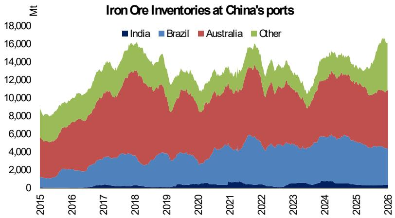

area_stacked

| Year | India | Brazil | Australia | Other |
|------|-------|--------|-----------|-------|
| 2015 | 0     | 1000   | 3000      | 2000  |
| 2016 | 0     | 1500   | 3500      | 2500  |
| 2017 | 0     | 2000   | 4000      | 3000  |
| 2018 | 0     | 2500   | 4500      | 3500  |
| 2019 | 0     | 2000   | 4000      | 3000  |
| 2020 | 500   | 2500   | 3500      | 2500  |
| 2021 | 500   | 3000   | 3500      | 2500  |
| 2022 | 500   | 3500   | 4000      | 3000  |
| 2023 | 500   | 3500   | 3500      | 2500  |
| 2024 | 500   | 3500   | 3500      | 2500  |
| 2025 | 500   | 3500   | 3500      | 2500  |
| 2026 | 500   | 3500   | 3500      | 3500  |

German Steel Inventories & Inventory/Sales Ratio   
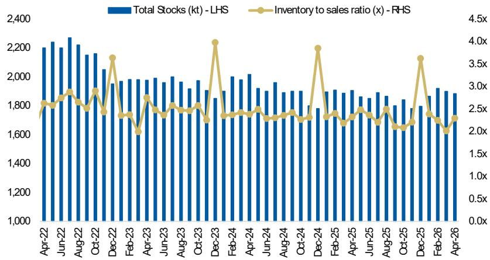

bar_line

| Month    | Total Stocks (kt) - LHS | Inventory to sales ratio (x) - RHS |
|----------|--------------------------|------------------------------------|
| Apr-22   | 2200                     | 2.5                                |
| Jun-22   | 2300                     | 2.7                                |
| Aug-22   | 2250                     | 2.6                                |
| Oct-22   | 2150                     | 2.8                                |
| Dec-22   | 1950                     | 3.5                                |
| Feb-23   | 1980                     | 2.0                                |
| Apr-23   | 1970                     | 2.5                                |
| Jun-23   | 1990                     | 2.4                                |
| Aug-23   | 1960                     | 2.6                                |
| Oct-23   | 1980                     | 2.7                                |
| Dec-23   | 1850                     | 4.0                                |
| Feb-24   | 1950                     | 2.5                                |
| Apr-24   | 1980                     | 2.6                                |
| Jun-24   | 1960                     | 2.5                                |
| Aug-24   | 1970                     | 2.6                                |
| Oct-24   | 1980                     | 2.7                                |
| Dec-24   | 1850                     | 3.8                                |
| Feb-25   | 1900                     | 2.4                                |
| Apr-25   | 1910                     | 2.5                                |
| Jun-25   | 1880                     | 2.6                                |
| Aug-25   | 1890                     | 2.7                                |
| Oct-25   | 1870                     | 2.5                                |
| Dec-25   | 1860                     | 3.6                                |
| Feb-26   | 1900                     | 2.3                                |
| Apr-26   | 1880                     | 2.4                                |

Source: SBB   
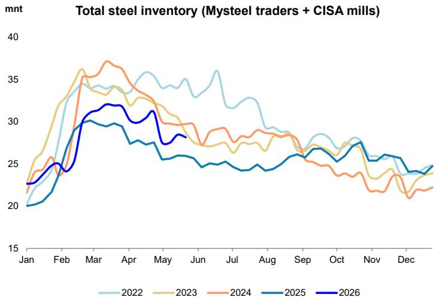

line

| Month | 2022 | 2023 | 2024 | 2025 | 2026 |
|-------|------|------|------|------|------|
| Jan   | 21   | 23   | 24   | 20   | 22   |
| Feb   | 30   | 35   | 36   | 28   | 25   |
| Mar   | 34   | 36   | 37   | 30   | 31   |
| Apr   | 35   | 34   | 35   | 29   | 30   |
| May   | 34   | 32   | 33   | 27   | 28   |
| Jun   | 36   | 30   | 31   | 26   | 27   |
| Jul   | 33   | 28   | 29   | 25   | 26   |
| Aug   | 31   | 27   | 28   | 24   | 25   |
| Sep   | 29   | 26   | 27   | 25   | 26   |
| Oct   | 28   | 25   | 26   | 26   | 27   |
| Nov   | 27   | 24   | 25   | 27   | 26   |
| Dec   | 25   | 23   | 24   | 25   | 24   |

Source: MySteel, MS   
Source: Mysteel, MS

# Net trade flows

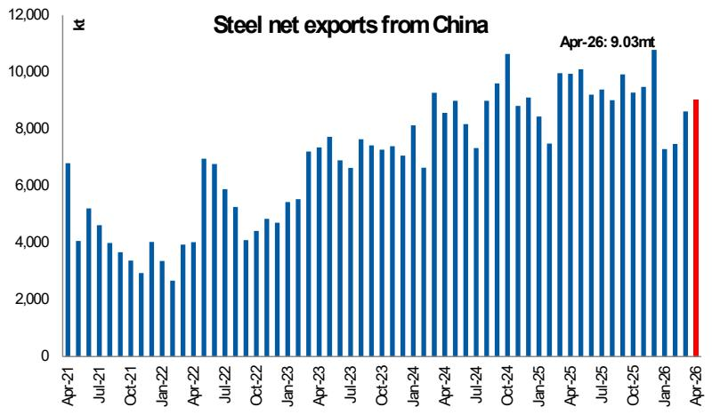

bar

| Date    | Value  |
|---------|--------|
| Apr-26  | 9.03mt |

EU total steel imports by geography (YTD Mar 2026)   
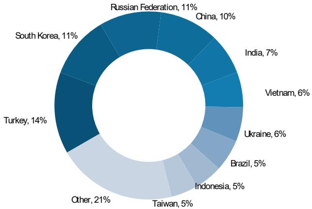

pie

| Country/Region | Percentage (%) |
| :--- | :--- |
| Russian Federation | 11 |
| China | 10 |
| India | 7 |
| Vietnam | 6 |
| Ukraine | 6 |
| Brazil | 5 |
| Indonesia | 5 |
| Taiwan | 5 |
| Other | 21 |
| Turkey | 14 |
| South Korea | 11 |

Source: CEIC   
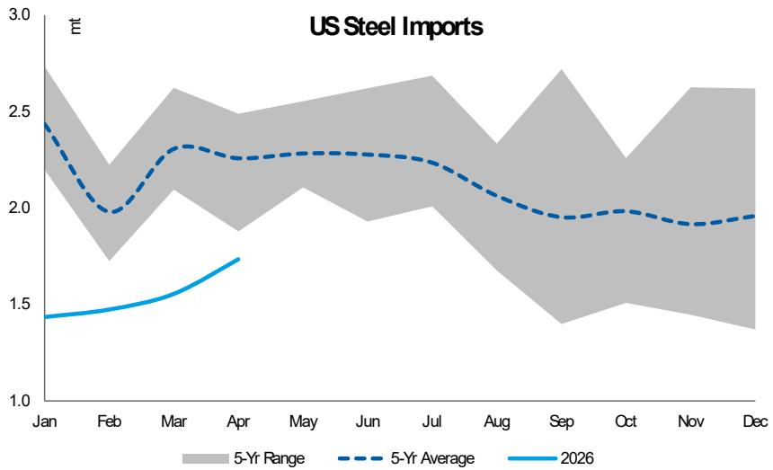

line

| Month | 5-Yr Average | 2026 |
|-------|--------------|------|
| Jan   | 2.4          | 1.4  |
| Feb   | 2.0          | 1.45 |
| Mar   | 2.3          | 1.55 |
| Apr   | 2.25         | 1.7  |
| May   | 2.25         | -    |
| Jun   | 2.25         | -    |
| Jul   | 2.25         | -    |
| Aug   | 2.1          | -    |
| Sep   | 1.95         | -    |
| Oct   | 1.95         | -    |
| Nov   | 1.9          | -    |
| Dec   | 1.95         | -    |

Source: Eurostat   
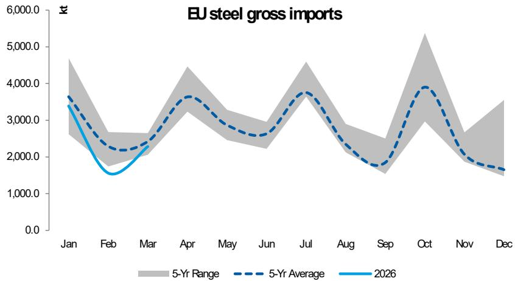

line

| Month | 5-Yr Average | 2026 |
|-------|--------------|------|
| Jan   | 3700.0       | 3400.0 |
| Feb   | 2200.0       | 1600.0 |
| Mar   | 2400.0       | 2000.0 |
| Apr   | 3600.0       | -    |
| May   | 2800.0       | -    |
| Jun   | 2600.0       | -    |
| Jul   | 3800.0       | -    |
| Aug   | 2400.0       | -    |
| Sep   | 1800.0       | -    |
| Oct   | 3900.0       | -    |
| Nov   | 1900.0       | -    |
| Dec   | 1700.0       | -    |

# Imports from China to Europe by product

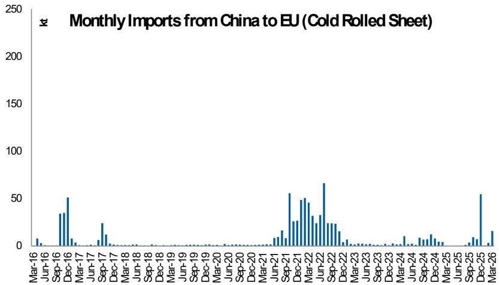

bar

| Month    | Monthly Imports from China to EU |
| -------- | -------------------------------- |
| Mar-16   | 5                                |
| Jun-16   | 30                               |
| Sep-16   | 50                               |
| Dec-16   | 10                               |
| Mar-17   | 5                                |
| Jun-17   | 20                               |
| Sep-17   | 10                               |
| Dec-17   | 5                                |
| Mar-18   | 5                                |
| Jun-18   | 5                                |
| Sep-18   | 5                                |
| Dec-18   | 5                                |
| Mar-19   | 5                                |
| Jun-19   | 5                                |
| Sep-19   | 5                                |
| Dec-19   | 5                                |
| Mar-20   | 5                                |
| Jun-20   | 5                                |
| Sep-20   | 5                                |
| Dec-20   | 5                                |
| Mar-21   | 5                                |
| Jun-21   | 10                               |
| Sep-21   | 50                               |
| Dec-21   | 25                               |
| Mar-22   | 50                               |
| Jun-22   | 65                               |
| Sep-22   | 20                               |
| Dec-22   | 5                                |
| Mar-23   | 5                                |
| Jun-23   | 5                                |
| Sep-23   | 5                                |
| Dec-23   | 5                                |
| Mar-24   | 5                                |
| Jun-24   | 10                               |
| Sep-24   | 10                               |
| Dec-24   | 10                               |
| Mar-25   | 5                                |
| Jun-25   | 5                                |
| Sep-25   | 10                               |
| Dec-25   | 50                               |
| Mar-26   | 15                               |

Source: Eurostat   
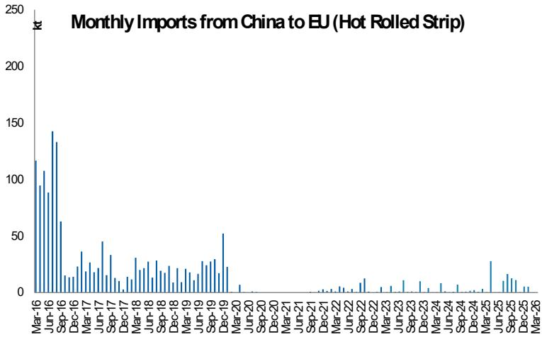

bar

| Month    | Value (kt) |
| -------- | ---------- |
| Mar-16   | 115        |
| Jun-16   | 95         |
| Sep-16   | 140        |
| Dec-16   | 60         |
| Mar-17   | 35         |
| Jun-17   | 45         |
| Sep-17   | 25         |
| Dec-17   | 15         |
| Mar-18   | 30         |
| Jun-18   | 25         |
| Sep-18   | 20         |
| Dec-18   | 15         |
| Mar-19   | 20         |
| Jun-19   | 25         |
| Sep-19   | 30         |
| Dec-19   | 50         |
| Mar-20   | 5          |
| Jun-20   | 0          |
| Sep-20   | 0          |
| Dec-20   | 0          |
| Mar-21   | 0          |
| Jun-21   | 0          |
| Sep-21   | 0          |
| Dec-21   | 0          |
| Mar-22   | 0          |
| Jun-22   | 0          |
| Sep-22   | 10         |
| Dec-22   | 0          |
| Mar-23   | 0          |
| Jun-23   | 5          |
| Sep-23   | 0          |
| Dec-23   | 0          |
| Mar-24   | 0          |
| Jun-24   | 5          |
| Sep-24   | 0          |
| Dec-24   | 0          |
| Mar-25   | 25         |
| Jun-25   | 15         |
| Sep-25   | 10         |
| Dec-25   | 5          |
| Mar-26   | 0          |

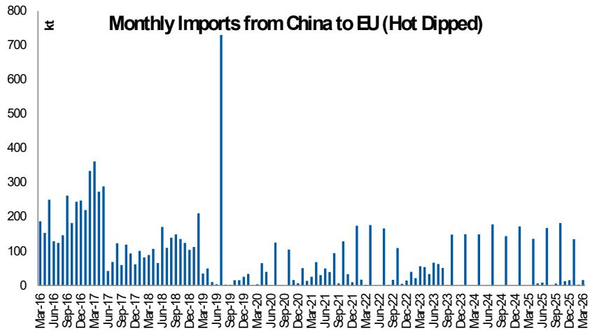

bar

| Month    | Monthly Imports from China to EU (Hot Dipped) |
| -------- | --------------------------------------------- |
| Mar-16   | 180                                           |
| Jun-16   | 250                                           |
| Sep-16   | 260                                           |
| Dec-16   | 350                                           |
| Mar-17   | 290                                           |
| Jun-17   | 120                                           |
| Sep-17   | 110                                           |
| Dec-17   | 90                                            |
| Mar-18   | 100                                           |
| Jun-18   | 170                                           |
| Sep-18   | 140                                           |
| Dec-18   | 130                                           |
| Mar-19   | 210                                           |
| Jun-19   | 730                                           |
| Sep-19   | 20                                            |
| Dec-19   | 30                                            |
| Mar-20   | 60                                            |
| Jun-20   | 120                                           |
| Sep-20   | 100                                           |
| Dec-20   | 50                                            |
| Mar-21   | 70                                            |
| Jun-21   | 40                                            |
| Sep-21   | 130                                           |
| Dec-21   | 170                                           |
| Mar-22   | 170                                           |
| Jun-22   | 160                                           |
| Sep-22   | 100                                           |
| Dec-22   | 30                                            |
| Mar-23   | 50                                            |
| Jun-23   | 60                                            |
| Sep-23   | 140                                           |
| Dec-23   | 150                                           |
| Mar-24   | 140                                           |
| Jun-24   | 180                                           |
| Sep-24   | 140                                           |
| Dec-24   | 170                                           |
| Mar-25   | 130                                           |
| Jun-25   | 170                                           |
| Sep-25   | 180                                           |
| Dec-25   | 130                                           |
| Mar-26   | 15                                            |

Source: Eurostat   
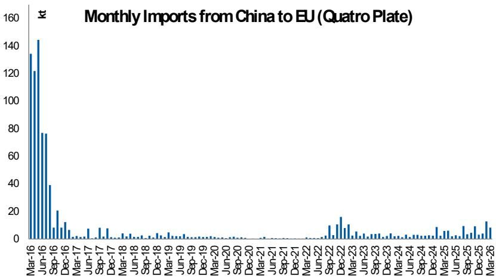

bar

| Month    | Monthly Imports (kt) |
| -------- | -------------------- |
| Mar-16   | 135                  |
| Jun-16   | 145                  |
| Sep-16   | 78                   |
| Dec-16   | 39                   |
| Mar-17   | 21                   |
| Jun-17   | 8                    |
| Sep-17   | 10                   |
| Dec-17   | 5                    |
| Mar-18   | 3                    |
| Jun-18   | 2                    |
| Sep-18   | 1                    |
| Dec-18   | 3                    |
| Mar-19   | 5                    |
| Jun-19   | 2                    |
| Sep-19   | 1                    |
| Dec-19   | 2                    |
| Mar-20   | 1                    |
| Jun-20   | 1                    |
| Sep-20   | 1                    |
| Dec-20   | 1                    |
| Mar-21   | 1                    |
| Jun-21   | 0                    |
| Sep-21   | 0                    |
| Dec-21   | 0                    |
| Mar-22   | 0                    |
| Jun-22   | 0                    |
| Sep-22   | 10                   |
| Dec-22   | 15                   |
| Mar-23   | 8                    |
| Jun-23   | 5                    |
| Sep-23   | 4                    |
| Dec-23   | 3                    |
| Mar-24   | 2                    |
| Jun-24   | 3                    |
| Sep-24   | 4                    |
| Dec-24   | 8                    |
| Mar-25   | 6                    |
| Jun-25   | 4                    |
| Sep-25   | 8                    |
| Dec-25   | 10                   |
| Mar-26   | 14                   |

EU steel and stainless steel weekly quotas – by product 

<table><tr><td rowspan="2">Product</td><td colspan="4">5/27/2026</td><td colspan="2">Previous Week 5/20/2026</td></tr><tr><td>Quota $^{A}$ kt</td><td>B/F $^{A}$ kt</td><td>Importskt</td><td>Utilised%</td><td>Importskt</td><td>Utilised%</td></tr><tr><td colspan="7">Carbon Steel</td></tr><tr><td colspan="7">Non Alloy and Other Alloy Hot Rolled Sheets and Strips</td></tr><tr><td>Turkey</td><td>398</td><td>0</td><td>398</td><td>100%</td><td>398</td><td>100%</td></tr><tr><td>India</td><td>225</td><td>0</td><td>225</td><td>100%</td><td>225</td><td>100%</td></tr><tr><td>South Korea</td><td>161</td><td>0</td><td>128</td><td>79%</td><td>92</td><td>57%</td></tr><tr><td>United Kingdom</td><td>139</td><td>0</td><td>11</td><td>8%</td><td>11</td><td>8%</td></tr><tr><td>Serbia</td><td>143</td><td>0</td><td>29</td><td>20%</td><td>28</td><td>20%</td></tr><tr><td>Others</td><td>858</td><td>0</td><td>381</td><td>44%</td><td>367</td><td>43%</td></tr><tr><td colspan="7">Non Alloy and Other Alloy Cold Rolled Sheets</td></tr><tr><td>India</td><td>163</td><td>0</td><td>3</td><td>2%</td><td>0</td><td>0%</td></tr><tr><td>Korea</td><td>95</td><td>0</td><td>62</td><td>65%</td><td>60</td><td>63%</td></tr><tr><td>United Kingdom</td><td>88</td><td>0</td><td>0</td><td>0%</td><td>0</td><td>0%</td></tr><tr><td>Serbia</td><td>41</td><td>0</td><td>13</td><td>31%</td><td>11</td><td>26%</td></tr><tr><td>Others</td><td>335</td><td>0</td><td>94</td><td>28%</td><td>93</td><td>28%</td></tr><tr><td colspan="7">Metallic Coated Sheets</td></tr><tr><td>Korea</td><td>38</td><td>179</td><td>194</td><td>90%</td><td>191</td><td>88%</td></tr><tr><td>India</td><td>54</td><td>134</td><td>24</td><td>13%</td><td>15</td><td>8%</td></tr><tr><td>United Kingdom</td><td>35</td><td>89</td><td>20</td><td>16%</td><td>17</td><td>14%</td></tr><tr><td>China</td><td>128</td><td>0</td><td>128</td><td>100%</td><td>128</td><td>100%</td></tr><tr><td>Others</td><td>473</td><td>108</td><td>385</td><td>66%</td><td>362</td><td>62%</td></tr><tr><td colspan="7">Non Alloy and Other Alloy Quarto Plates</td></tr><tr><td>Ukraine</td><td>254</td><td>0</td><td>0</td><td>0%</td><td>0</td><td>0%</td></tr><tr><td>United Kingdom</td><td>5</td><td>0</td><td>0</td><td>0%</td><td>0</td><td>0%</td></tr><tr><td>Others</td><td>551</td><td>0</td><td>278</td><td>50%</td><td>224</td><td>41%</td></tr><tr><td colspan="7">Stainless Steel</td></tr><tr><td colspan="7">Stainless Hot Rolled Sheets and Strips</td></tr><tr><td>Others</td><td>110</td><td>72</td><td>28</td><td>16%</td><td>18</td><td>10%</td></tr><tr><td colspan="7">Stainless Cold Rolled Sheets and Strips</td></tr><tr><td>Korea</td><td>50</td><td>40</td><td>27</td><td>30%</td><td>21</td><td>24%</td></tr><tr><td>Taiwan</td><td>46</td><td>27</td><td>10</td><td>14%</td><td>9</td><td>13%</td></tr><tr><td>India</td><td>31</td><td>60</td><td>6</td><td>6%</td><td>5</td><td>6%</td></tr><tr><td>USA</td><td>25</td><td>71</td><td>1</td><td>1%</td><td>1</td><td>1%</td></tr><tr><td>Turkey</td><td>21</td><td>7</td><td>13</td><td>46%</td><td>11</td><td>38%</td></tr><tr><td>Others</td><td>53</td><td>16</td><td>16</td><td>23%</td><td>12</td><td>18%</td></tr></table>

Source: European Commission (Data updated on 27 May 2026). ^^ B/F = quota brought forward

# Stainless steel trade flows

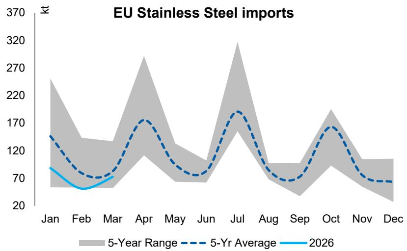

line

| Month | 5-Year Range | 5-Yr Average | 2026 |
|-------|--------------|--------------|------|
| Jan   | ~240         | ~140         | ~80  |
| Feb   | ~130         | ~90          | ~65  |
| Mar   | ~130         | ~100         | ~70  |
| Apr   | ~280         | ~170         | -    |
| May   | ~130         | ~100         | -    |
| Jun   | ~100         | ~90          | -    |
| Jul   | ~320         | ~180         | -    |
| Aug   | ~100         | ~90          | -    |
| Sep   | ~100         | ~90          | -    |
| Oct   | ~180         | ~170         | -    |
| Nov   | ~100         | ~90          | -    |
| Dec   | ~100         | ~90          | -    |

Source: Eurostat

EU total stainless steel imports by market (YTD Mar 2026)   
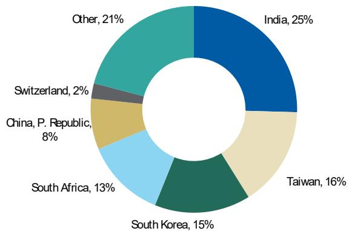

pie

| Country/Region | Percentage (%) |
| :--- | :--- |
| India | 25 |
| Taiwan | 16 |
| South Korea | 15 |
| South Africa | 13 |
| China, P. Republic | 8 |
| Switzerland | 2 |
| Other | 21 |

Source: Eurostat

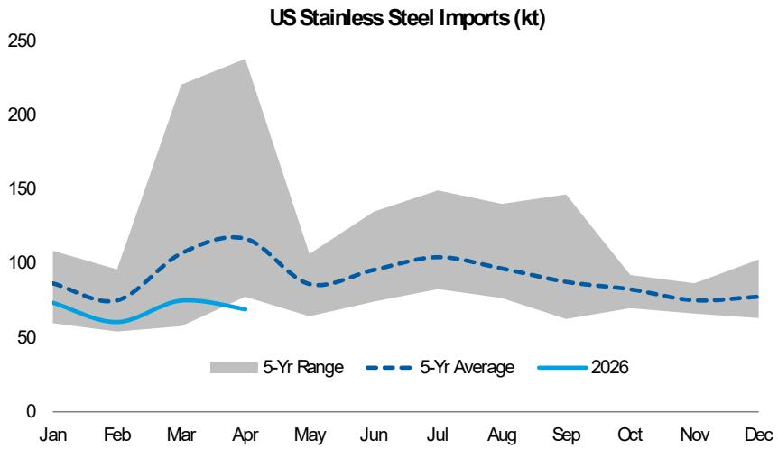

line

| Month | 5-Yr Average | 2026 |
|-------|--------------|------|
| Jan   | ~85          | ~70  |
| Feb   | ~75          | ~60  |
| Mar   | ~110         | ~75  |
| Apr   | ~115         | ~70  |
| May   | ~85          | —    |
| Jun   | ~95          | —    |
| Jul   | ~100         | —    |
| Aug   | ~95          | —    |
| Sep   | ~90          | —    |
| Oct   | ~85          | —    |
| Nov   | ~80          | —    |
| Dec   | ~75          | —    |

Source: US DOC

US Stainless Service Centre Inventories   
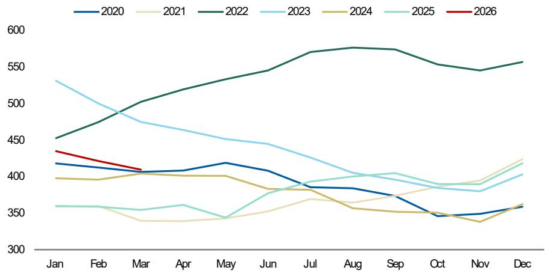

line

| Month | 2020 | 2021 | 2022 | 2023 | 2024 | 2025 | 2026 |
|-------|------|------|------|------|------|------|------|
| Jan   | 415  | 360  | 450  | 530  | 395  | 360  | 435  |
| Feb   | 410  | 355  | 470  | 500  | 395  | 360  | 415  |
| Mar   | 410  | 340  | 500  | 475  | 395  | 355  | 410  |
| Apr   | 410  | 340  | 515  | 465  | 395  | 360  | —    |
| May   | 415  | 340  | 530  | 455  | 395  | 345  | —    |
| Jun   | 410  | 350  | 545  | 445  | 385  | 375  | —    |
| Jul   | 390  | 365  | 570  | 425  | 385  | 390  | —    |
| Aug   | 385  | 360  | 575  | 405  | 355  | 400  | —    |
| Sep   | 380  | 370  | 575  | 395  | 350  | 405  | —    |
| Oct   | 345  | 380  | 560  | 385  | 345  | 390  | —    |
| Nov   | 350  | 390  | 545  | 375  | 335  | 395  | —    |
| Dec   | 360  | 420  | 560  | 410  | —    | —    | —    |

Source: MSCI

# Steel economics: Europe & China

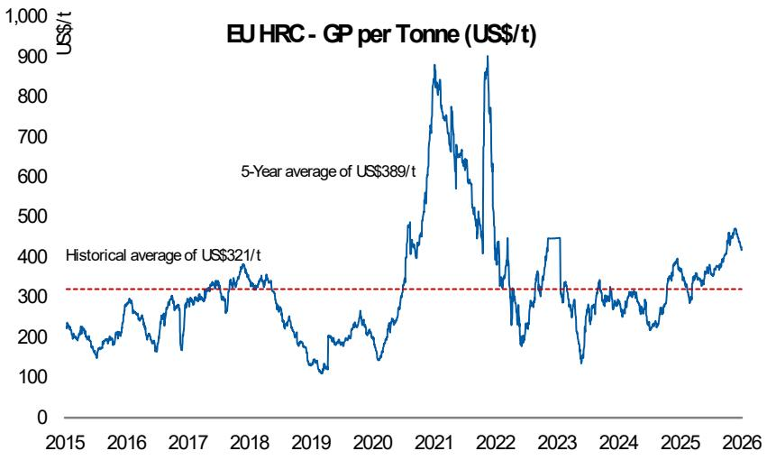

line

| Year | Value (US$/t) |
|------|---------------|
| 2015 | ~200          |
| 2016 | ~250          |
| 2017 | ~300          |
| 2018 | ~350          |
| 2019 | ~150          |
| 2020 | ~250          |
| 2021 | ~850          |
| 2022 | ~900          |
| 2023 | ~450          |
| 2024 | ~300          |
| 2025 | ~400          |
| 2026 | ~450          |

Source: MS, Bloomberg   
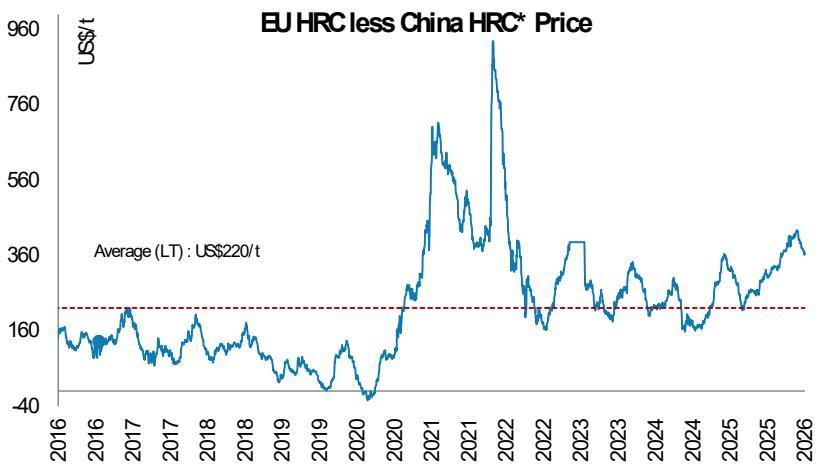

line

| Year | Value (US$/t) |
|------|---------------|
| Average | 160 |
| LT   | 220 |

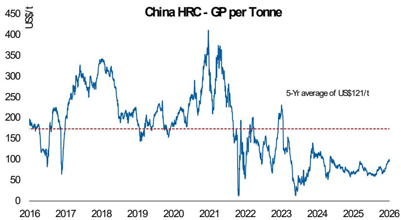

line

| Year | Value (US$/t) |
|------|---------------|
| 2016 | ~180          |
| 2017 | ~220          |
| 2018 | ~340          |
| 2019 | ~180          |
| 2020 | ~220          |
| 2021 | ~410          |
| 2022 | ~180          |
| 2023 | ~230          |
| 2024 | ~100          |
| 2025 | ~80           |
| 2026 | ~100          |

Source: MS, Bloomberg   
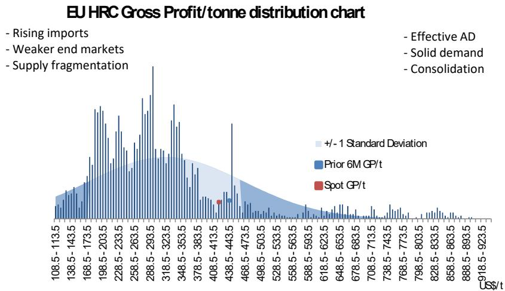

histogram

| US$/t Range       | Frequency |
| ----------------- | --------- |
| 108.5 - 113.5     | Low       |
| 138.5 - 143.5     | Medium    |
| 168.5 - 173.5     | High      |
| 198.5 - 203.5     | Medium    |
| 228.5 - 233.5     | High      |
| 258.5 - 263.5     | Medium    |
| 288.5 - 293.5     | Very High |
| 318.5 - 323.5     | Medium    |
| 348.5 - 353.5     | High      |
| 378.5 - 383.5     | Medium    |
| 408.5 - 413.5     | Low       |
| 438.5 - 443.5     | High      |
| 468.5 - 473.5     | Medium    |
| 498.5 - 503.5     | Low       |
| 528.5 - 533.5     | Very Low  |
| 558.5 - 563.5     | Very Low  |
| 588.5 - 593.5     | Low       |
| 618.5 - 623.5     | Low       |
| 648.5 - 653.5     | Low       |
| 678.5 - 683.5     | Low       |
| 708.5 - 713.5     | Very Low  |
| 738.5 - 743.5     | Very Low  |
| 768.5 - 773.5     | Very Low  |
| 798.5 - 803.5     | Very Low  |
| 828.5 - 833.5     | Very Low  |
| 858.5 - 863.5     | Very Low  |
| 888.5 - 893.5     | Very Low  |
| 918.5 - 923.5     | Very Low  |

Source: SBB, MS \* China domestic prices are based on the Shanghai benchmark for HRC excluding 17% VAT.   
Source: Bloomberg, MS

# Steel economics: Turkey & Russia

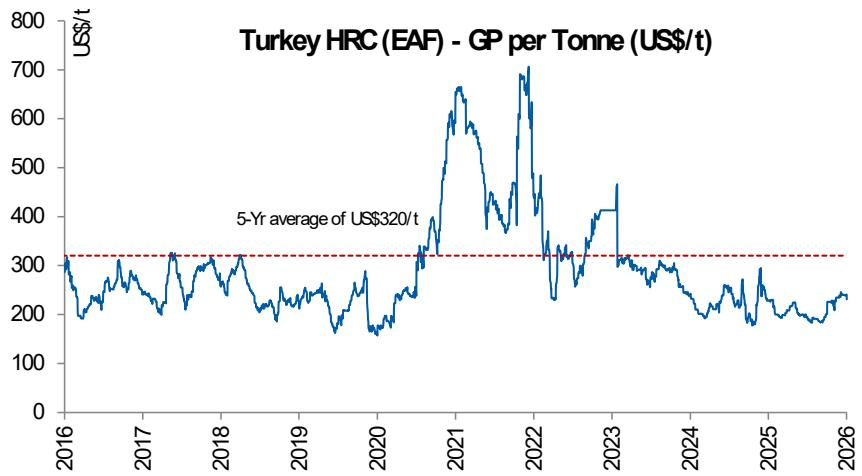

line

| Year | Value (US$/t) |
|------|---------------|
| 2016 | ~300          |
| 2017 | ~250          |
| 2018 | ~300          |
| 2019 | ~250          |
| 2020 | ~150          |
| 2021 | ~650          |
| 2022 | ~700          |
| 2023 | ~450          |
| 2024 | ~300          |
| 2025 | ~250          |
| 2026 | ~250          |

Source: SBB, MS   
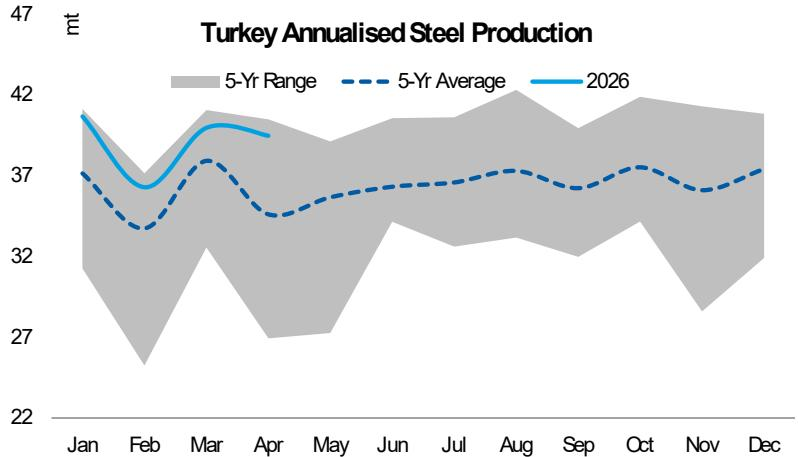

line

| Month | 2026 | 5-Yr Average | 5-Yr Range |
|-------|------|--------------|------------|
| Jan   | 41.5 | 37.0         | 31.5–42.0  |
| Feb   | 37.0 | 33.0         | 26.0–38.0  |
| Mar   | 41.0 | 37.5         | 31.0–42.0  |
| Apr   | 40.5 | 35.5         | 27.0–39.0  |
| May   | 40.0 | 36.0         | 27.0–39.0  |
| Jun   | 40.5 | 36.5         | 27.0–39.0  |
| Jul   | 41.0 | 36.5         | 27.0–39.0  |
| Aug   | 41.5 | 37.0         | 27.0–42.0  |
| Sep   | 41.0 | 36.5         | 27.0–42.0  |
| Oct   | 41.5 | 37.0         | 27.0–42.0  |
| Nov   | 41.0 | 36.5         | 27.0–42.0  |
| Dec   | 41.5 | 37.0         | 27.0–42.0  |

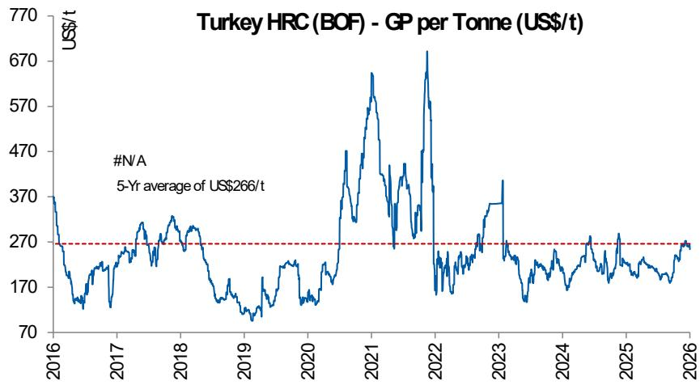

line

| Year | Value (US$/t) |
|------|---------------|
| 2016 | ~370          |
| 2017 | ~170          |
| 2018 | ~270          |
| 2019 | ~150          |
| 2020 | ~170          |
| 2021 | ~570          |
| 2022 | ~670          |
| 2023 | ~340          |
| 2024 | ~270          |
| 2025 | ~270          |
| 2026 | ~270          |

Source: SBB, MS   
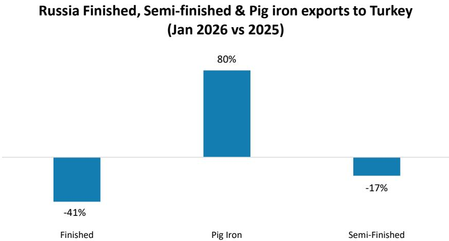

bar

Russia Finished, Semi-finished & Pig iron exports to Turkey (Jan 2026 vs 2025)
| Category | Value (%) |
| :--- | :--- |
| Finished | -41 |
| Pig Iron | 80 |
| Semi-Finished | -17 |

# Margin and spot spread

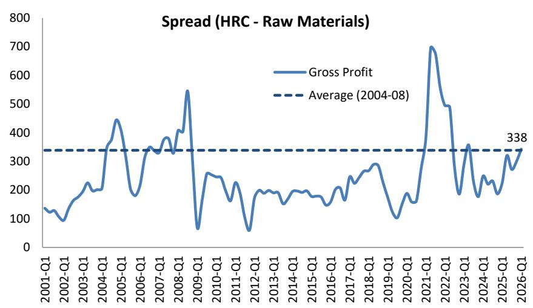

line

| Quarter   | Gross Profit | Average (2004-08) |
| --------- | ------------ | ----------------- |
| 2026-Q1   | 338          | 338               |

Source: MS. Note: Spread is calculated as the difference between EU HRC and a weighted average component ratio for iron ore, hard coking coal, and scrap.

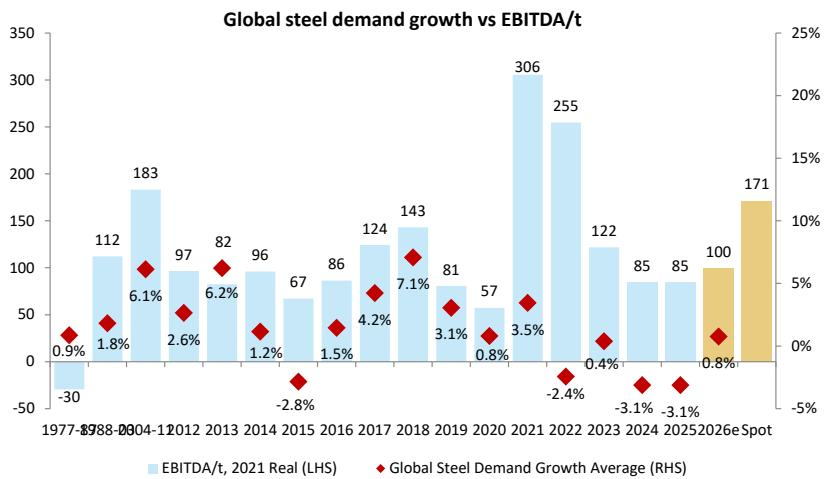

bar_line

Global steel demand growth vs EBITDA/t
| Year | EBITDA/t, 2021 Real (LHS) | Global Steel Demand Growth Average (RHS) (%) |
| :--- | :--- | :--- |
| 1977-89 | -30 | 0.9 |
| 1978-90 | 112 | 1.8 |
| 2004-11 | 183 | 6.1 |
| 2012 | 97 | 2.6 |
| 2013 | 96 | 6.2 |
| 2014 | 67 | 1.2 |
| 2015 | 86 | -2.8 |
| 2016 | 124 | 1.5 |
| 2017 | 143 | 4.2 |
| 2018 | 81 | 7.1 |
| 2019 | 57 | 3.1 |
| 2020 | 306 | 0.8 |
| 2021 | 255 | 3.5 |
| 2022 | 122 | -2.4 |
| 2023 | 85 | 0.4 |
| 2024 | 85 | -3.1 |
| 2025e | 100 | -3.1 |
| Spot | 171 | 0.8 |

Source: MS estimates (e), ArcelorMittal, thyssenkrupp, voestalpine, SSAB – Europe, Salzgitter, Tata Steel, Nucor, Cleveland Cliffs, US Steel data are till 2024, as the company has been acquired, Steel Dynamics, World Steel Association

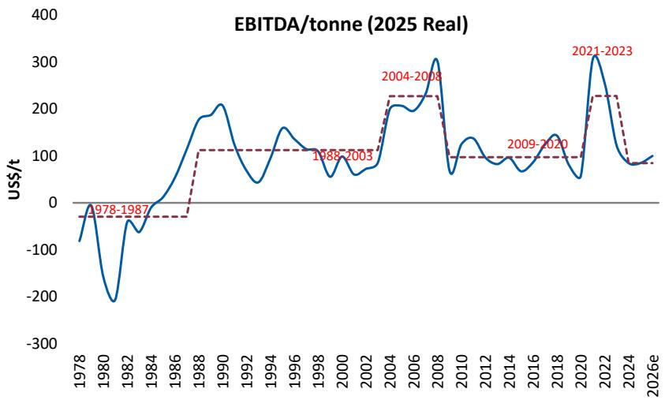

line

| Year       | EBITDA/tonne (US$/t) |
| ---------- | -------------------- |
| 1978-1987  | -978                 |
| 1988-2003  | 1988-2003            |
| 2004-2008  | 2004-2008            |
| 2009-2020  | 2009-2020            |
| 2021-2023  | 2021-2023            |

Source: MS estimates (e), ArcelorMittal, thyssenkrupp, voestalpine, SSAB – Europe, Salzgitter, Tata Steel, Nucor, Cleveland Cliffs, US Steel data are till 2024, as the company has been acquired, Steel Dynamics, World Steel Association. \* Historical EBITDA/t have been inflated on US PPI.

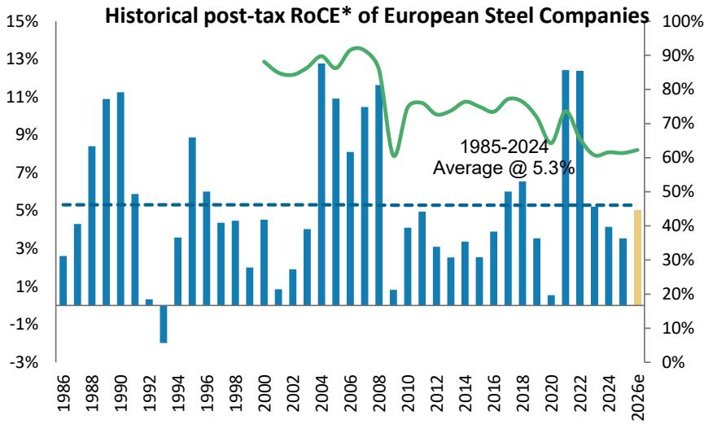  
Source: MS estimates (e), ArcelorMittal, thyssenkrupp, voestalpine, SSAB – Europe, Salzgitter – Europe

# Equities – ArcelorMittal (MT.AS, OW, PT €54.30)

ArcelorMittal Historical EV\*/EBITDA   
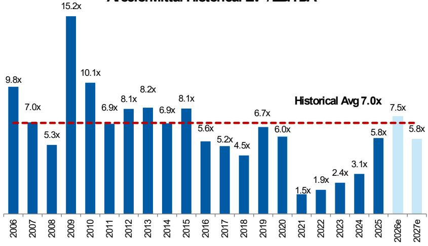

bar

Historical Historical EPS forecasts
| Year | Value (x) |
| :--- | :--- |
| 2006 | 9.8 |
| 2007 | 7.0 |
| 2008 | 5.3 |
| 2009 | 15.2 |
| 2010 | 10.1 |
| 2011 | 6.9 |
| 2012 | 8.1 |
| 2013 | 8.2 |
| 2014 | 6.9 |
| 2015 | 8.1 |
| 2016 | 5.6 |
| 2017 | 5.2 |
| 2018 | 4.5 |
| 2019 | 6.7 |
| 2020 | 6.0 |
| 2021 | 1.5 |
| 2022 | 1.9 |
| 2023 | 2.4 |
| 2024 | 3.1 |
| 2025 | 5.8 |
| 2026e | 7.5 |
| 2027e | 5.8 |
Historical Avg 7.0x

Source: Company data, MS estimates (e). \* Broad definition of EV including provisions and other non-operating assets and liabilities, Market Cap = Avg outstanding shares multiplied by avg share price. Historical average: 2006-2025.

ArcelorMittal^ Historical EBITDA/tonne shipped\* (US\$/t) 403   
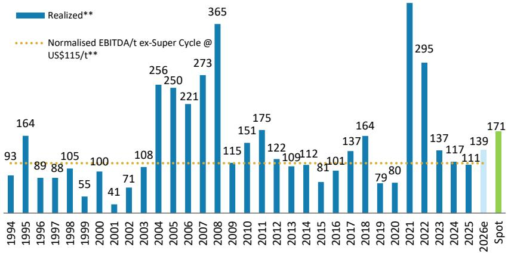

bar_line

| Year | Realized** |
| :--- | :--- |
| 1994 | 93 |
| 1995 | 164 |
| 1996 | 89 |
| 1997 | 88 |
| 1998 | 105 |
| 1999 | 55 |
| 2000 | 100 |
| 2001 | 41 |
| 2002 | 71 |
| 2003 | 108 |
| 2004 | 256 |
| 2005 | 250 |
| 2006 | 221 |
| 2007 | 273 |
| 2008 | 365 |
| 2009 | 115 |
| 2010 | 151 |
| 2011 | 175 |
| 2012 | 122 |
| 2013 | 109 |
| 2014 | 112 |
| 2015 | 81 |
| 2016 | 101 |
| 2017 | 137 |
| 2018 | 164 |
| 2019 | 79 |
| 2020 | 80 |
| 2021 | 365 |
| 2022 | 295 |
| 2023 | 137 |
| 2024 | 117 |
| 2025 | 111 |
| 2026e | 139 |
| Spot | 171 |
Normalised EBITDA/t ex-Super Cycle @ US$115/t**

Source: Company data, MS estimates (e). \* No data provided for tonnes shipped during 1994-2000. We assume that 92% of crude production was shipped. \*\* Data based on 2025 real numbers. Historical figures inflated at US PPI. Average EBITDA/t ex-Super-Cycle is US\$99/t and after adjusting for the MT USA and llva sale, we calculate new normalised EBITDA/t of US\$115/t.

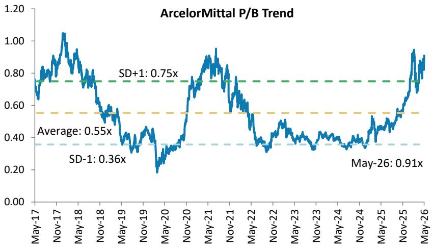

line

| Date    | P/B Ratio |
|---------|-----------|
| May-17  | 0.75x     |
| Nov-17  | 0.75x     |
| May-18  | 0.75x     |
| Nov-18  | 0.75x     |
| May-19  | 0.75x     |
| Nov-19  | 0.75x     |
| May-20  | 0.75x     |
| Nov-20  | 0.75x     |
| May-21  | 0.75x     |
| Nov-21  | 0.75x     |
| May-22  | 0.75x     |
| Nov-22  | 0.75x     |
| May-23  | 0.75x     |
| Nov-23  | 0.75x     |
| May-24  | 0.75x     |
| Nov-24  | 0.75x     |
| May-25  | 0.75x     |
| Nov-25  | 0.75x     |
| May-26  | 0.91x     |

Source: Datastream

Raw material backward integration (2025)   
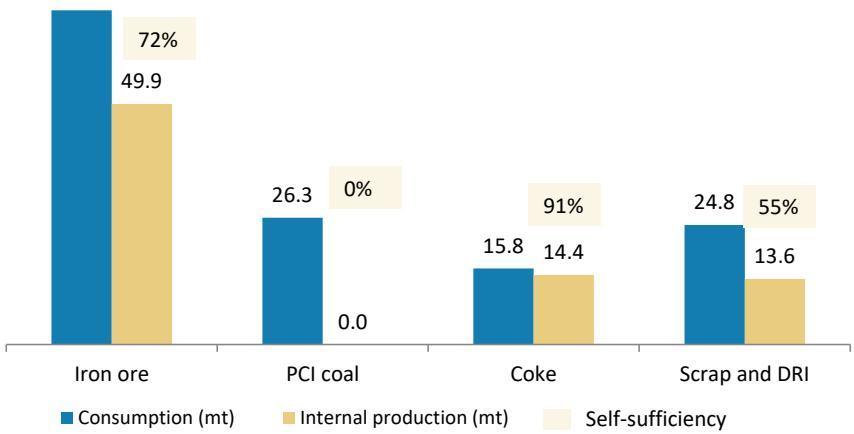

bar

| Category | Consumption (mt) | Internal production (mt) | Self-sufficiency (%) |
| :--- | :--- | :--- | :--- |
| Iron ore | 72.0 | 49.9 | 0.0 |
| PCI coal | 26.3 | 0.0 | 0.0 |
| Coke | 15.8 | 14.4 | 91.0 |
| Scrap and DRI | 24.8 | 13.6 | 55.0 |

Source: Company data, MS

# Equities – SSAB (SSABa.ST, OW, PT SEK 94.00)

SSAB Historical EV\*/EBITDA   
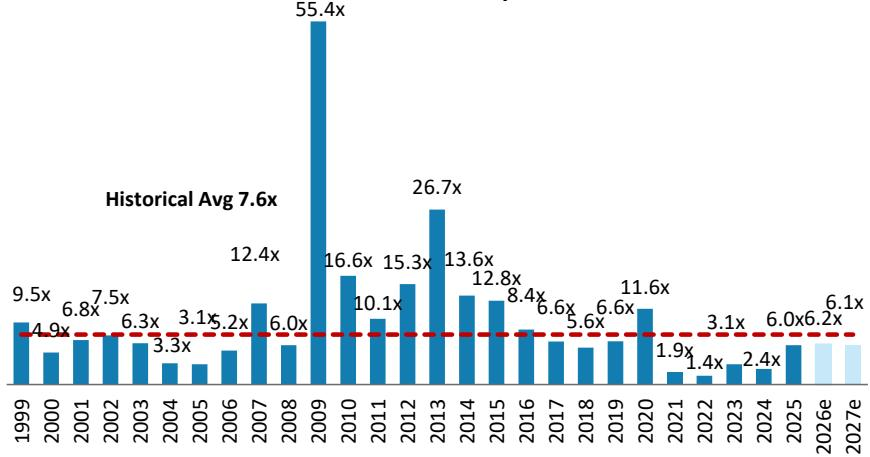

bar

| Year   | Value  |
| ------ | ------ |
| 1999   | 9.5x   |
| 2000   | 4.9x   |
| 2001   | 6.8x   |
| 2002   | 7.5x   |
| 2003   | 6.3x   |
| 2004   | 3.3x   |
| 2005   | 3.1x   |
| 2006   | 5.2x   |
| 2007   | 12.4x  |
| 2008   | 6.0x   |
| 2009   | 55.4x  |
| 2010   | 16.6x  |
| 2011   | 10.1x  |
| 2012   | 15.3x  |
| 2013   | 26.7x  |
| 2014   | 13.6x  |
| 2015   | 12.8x  |
| 2016   | 8.4x   |
| 2017   | 6.6x   |
| 2018   | 5.6x   |
| 2019   | 6.6x   |
| 2020   | 11.6x  |
| 2021   | 1.9x   |
| 2022   | 1.4x   |
| 2023   | 3.1x   |
| 2024   | 2.4x   |
| 2025   | 6.0x   |
| 2026e  | 6.2x   |
| 2027e  | 6.1x   |

Source: Company data, MS estimates (e). \* Broad definition of EV including provisions and other non-operating assets and liabilities, Market Cap = Avg outstanding shares multiplied by Avg share price. \*\* Historical average for 1999-2021, excludes 2004-05, 2009 and 2013.

SSAB Steel Americas EBITDA/tonne   
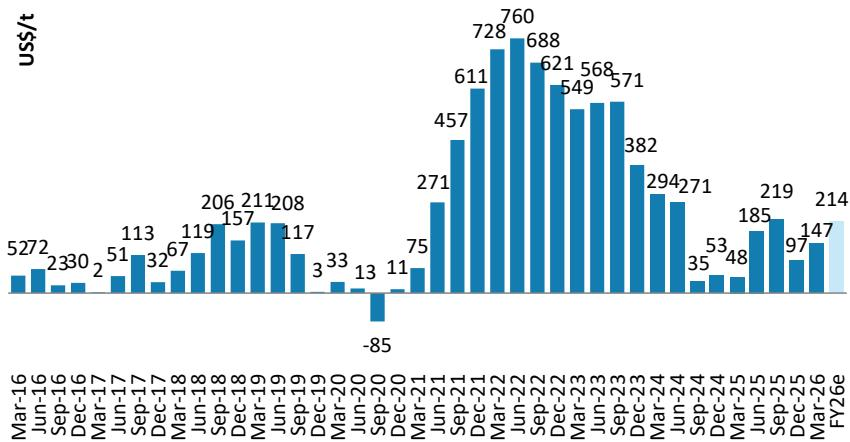

bar

| Date | Value (US$/t) |
|---|---|
| Mar-16 | 527 |
| Jun-16 | 72 |
| Sep-16 | 23 |
| Dec-16 | 30 |
| Mar-17 | 2 |
| Jun-17 | 51 |
| Sep-17 | 113 |
| Dec-17 | 32 |
| Mar-18 | 67 |
| Jun-18 | 119 |
| Sep-18 | 206 |
| Dec-18 | 157 |
| Mar-19 | 211 |
| Jun-19 | 208 |
| Sep-19 | 117 |
| Dec-19 | 3 |
| Mar-20 | 33 |
| Jun-20 | -85 |
| Sep-20 | -85 |
| Dec-20 | 11 |
| Mar-21 | 75 |
| Jun-21 | 271 |
| Sep-21 | 457 |
| Dec-21 | 611 |
| Mar-22 | 728 |
| Jun-22 | 760 |
| Sep-22 | 688 |
| Dec-22 | 621 |
| Mar-23 | 549 |
| Jun-23 | 568 |
| Sep-23 | 571 |
| Dec-23 | 382 |
| Mar-24 | 294 |
| Jun-24 | 271 |
| Sep-24 | 35 |
| Dec-24 | 53 |
| Mar-25 | 48 |
| Jun-25 | 185 |
| Sep-25 | 219 |
| Dec-25 | 97 |
| Mar-26e | 147 |
| FY26e | 214 |

Source: Company data, MS estimates (e)

US Plate - GP per Tonne (US\$/t)   
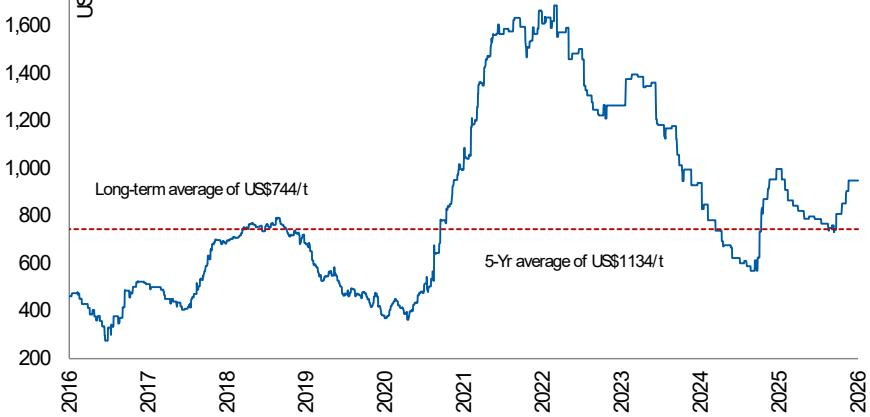

line

| Year | Value (US) |
|------|------------|
| Long-term average of US$744/t | 744/t |
| 5-Yr average of US$1134/t | 1134/t |

SSAB : 2026e EBITDA breakdown by division   
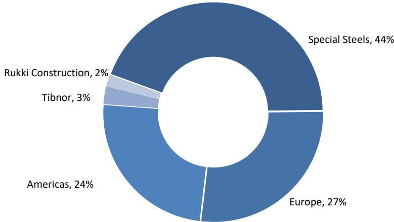

pie

| Category | Percentage (%) |
| :--- | :--- |
| Special Steels | 44 |
| Europe | 27 |
| Americas | 24 |
| Tibnor | 3 |
| Rukki Construction | 2 |

Source: Steel Business Briefing. Note: Spreads calculated as US plates less raw material costs, notably scrap steel.   
Source: Company data, MS estimates (e)

# Equities – Salzgitter (SZGG.DE, OW, PT €70.80)

Salzgitter Historical EV\*/EBITDA   
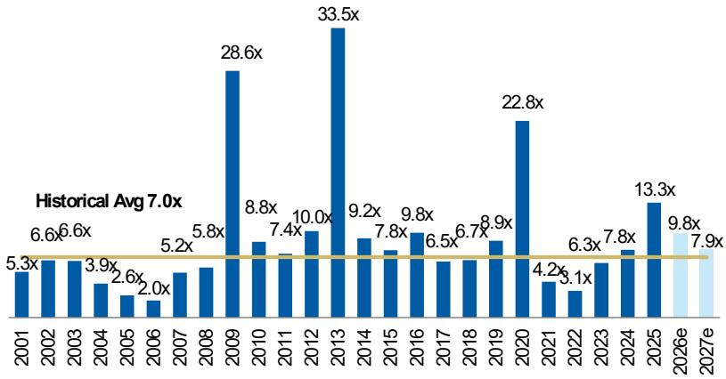

bar

| Year | Value (x) |
| :--- | :--- |
| 2001 | 5.3 |
| 2002 | 6.6 |
| 2003 | 6.6 |
| 2004 | 3.9 |
| 2005 | 2.6 |
| 2006 | 2.0 |
| 2007 | 5.2 |
| 2008 | 5.8 |
| 2009 | 28.6 |
| 2010 | 8.8 |
| 2011 | 7.4 |
| 2012 | 10.0 |
| 2013 | 33.5 |
| 2014 | 9.2 |
| 2015 | 7.8 |
| 2016 | 9.8 |
| 2017 | 6.5 |
| 2018 | 6.7 |
| 2019 | 8.9 |
| 2020 | 22.8 |
| 2021 | 4.2 |
| 2022 | 3.1 |
| 2023 | 6.3 |
| 2024 | 7.8 |
| 2025 | 13.3 |
| 2026e | 9.8 |
| 2027e | 7.9 |
Historical Avg 7.0x

Source: Company data, MS estimates (e). \* Broad definition of EV including provisions and other non-operating assets and liabilities, Market Cap = Avg outstanding shares multiplied by avg share price, Historical average (2001-2024) excludes EV/EBITDA greater than 15x and less than 4x.

Market Value of Aurubis Stub vs. Salzgitter Value   
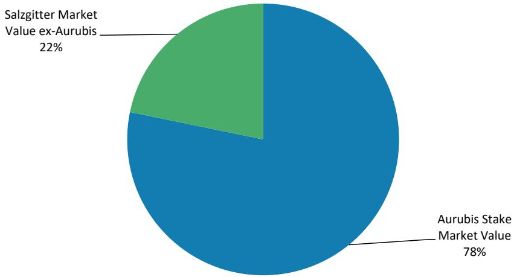

pie

| Category | Value |
| -------- | ----- |
| Salzgitter Market Value ex-Aurubis | 22% |
| Aurubis Stake Market Value | 78% |

Source: Company data, MS

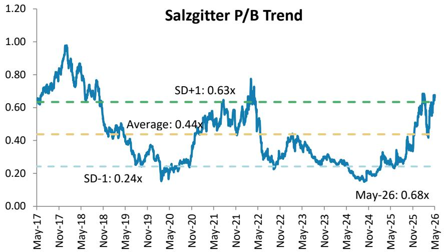

line

| Date    | P/B Ratio |
|---------|-----------|
| May-17  | 0.63x     |
| Nov-17  | 0.63x     |
| May-18  | 0.44x     |
| Nov-18  | 0.24x     |
| May-19  | 0.68x     |
| Nov-19  | 0.68x     |
| May-20  | 0.68x     |
| Nov-20  | 0.68x     |
| May-21  | 0.68x     |
| Nov-21  | 0.68x     |
| May-22  | 0.68x     |
| Nov-22  | 0.68x     |
| May-23  | 0.68x     |
| Nov-23  | 0.68x     |
| May-24  | 0.68x     |
| Nov-24  | 0.68x     |
| May-25  | 0.68x     |
| Nov-25  | 0.68x     |
| May-26  | 0.68x     |

Source: Datastream

Salzgitter implied EV/EBITDA vs. peers 2026   
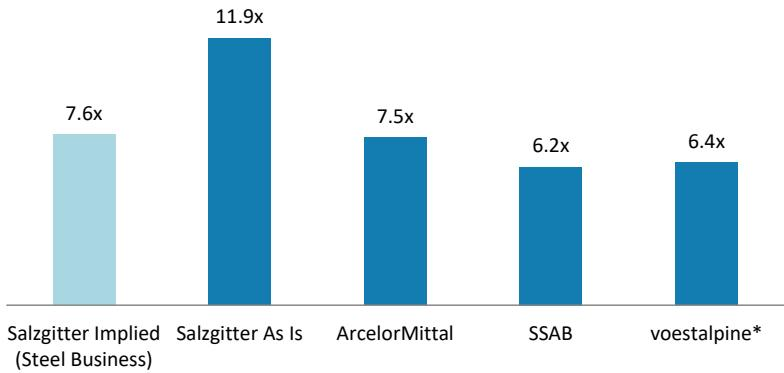

bar

| Company | Multiplier |
| :--- | :--- |
| Salzgitter Implied (Steel Business) | 7.6x |
| Salzgitter As Is | 11.9x |
| ArcelorMittal | 7.5x |
| SSAB | 6.2x |
| voestalpine* | 6.4x |

Source: Company data, MS. \* Voestalpine has a March year-end, hence we take FY2026.

# Equities – voestalpine (VOES.VI, EW, PT €48.00)

voestalpine EV\*/EBITDA   
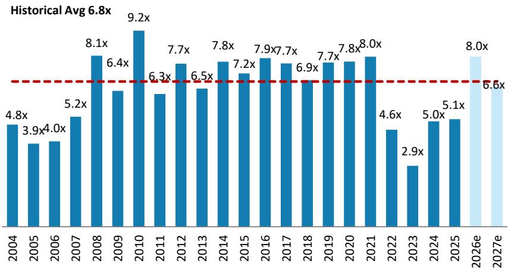

bar

Historical Avg 6.8x
| Year | Value (x) |
| :--- | :--- |
| 2004 | 4.8 |
| 2005 | 3.9 |
| 2006 | 4.0 |
| 2007 | 5.2 |
| 2008 | 8.1 |
| 2009 | 6.4 |
| 2010 | 9.2 |
| 2011 | 6.3 |
| 2012 | 7.7 |
| 2013 | 6.5 |
| 2014 | 7.8 |
| 2015 | 7.2 |
| 2016 | 7.9 |
| 2017 | 7.7 |
| 2018 | 6.9 |
| 2019 | 7.7 |
| 2020 | 7.8 |
| 2021 | 8.0 |
| 2022 | 4.6 |
| 2023 | 2.9 |
| 2024 | 5.0 |
| 2025 | 5.1 |
| 2026e | 8.0 |
| 2027e | 6.6 |

Source: Company data, MS estimates (e). \* Broad definition of EV including provisions and other non-operating assets and liabilities, Market Cap = Avg outstanding shares multiplied by Avg share price. Historical average: 2004-2022.

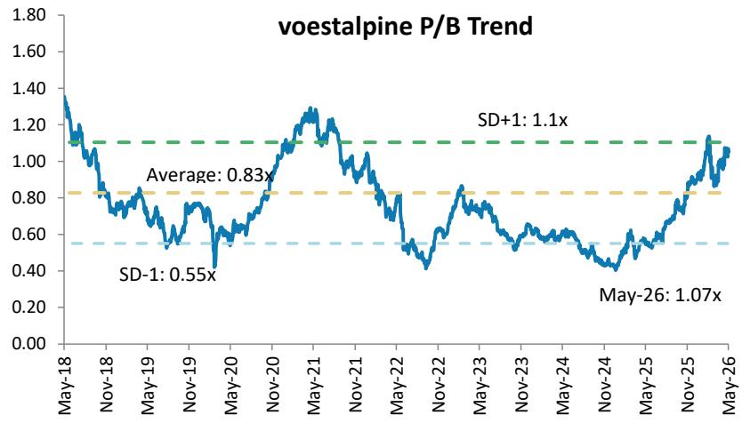

line

| Date    | P/B Ratio |
|---------|-----------|
| May-18  | 1.40      |
| Nov-18  | 0.80      |
| May-19  | 0.70      |
| Nov-19  | 0.55      |
| May-20  | 0.60      |
| Nov-20  | 0.80      |
| May-21  | 1.30      |
| Nov-21  | 1.20      |
| May-22  | 0.50      |
| Nov-22  | 0.40      |
| May-23  | 0.85      |
| Nov-23  | 0.60      |
| May-24  | 0.55      |
| Nov-24  | 0.45      |
| May-25  | 0.60      |
| Nov-25  | 0.80      |
| May-26  | 1.10      |
| May-26  | 1.07      |

Source: Datastream

Investment to Depreciation Ratio   
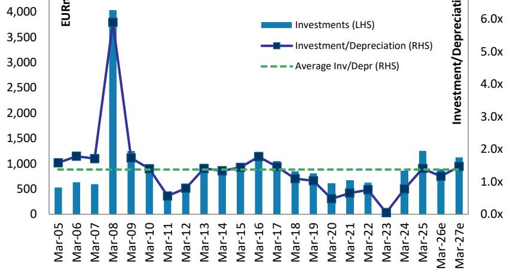

bar_line

| Date | Investments (LHS) (EURm) | Investment/Depreciation (RHS) | Average Inv/Depr (RHS) |
|---|---|---|---|
| Mar-05 | 500 | 1.0x | 1.0x |
| Mar-06 | 600 | 1.2x | 1.0x |
| Mar-07 | 550 | 1.1x | 1.0x |
| Mar-08 | 4000 | 3.8x | 1.0x |
| Mar-09 | 1200 | 1.2x | 1.0x |
| Mar-10 | 900 | 1.0x | 1.0x |
| Mar-11 | 350 | 0.5x | 1.0x |
| Mar-12 | 550 | 0.7x | 1.0x |
| Mar-13 | 1000 | 1.0x | 1.0x |
| Mar-14 | 950 | 0.9x | 1.0x |
| Mar-15 | 1000 | 1.0x | 1.0x |
| Mar-16 | 1200 | 1.2x | 1.0x |
| Mar-17 | 1050 | 1.0x | 1.0x |
| Mar-18 | 850 | 0.8x | 1.0x |
| Mar-19 | 750 | 0.7x | 1.0x |
| Mar-20 | 600 | 0.4x | 1.0x |
| Mar-21 | 700 | 0.5x | 1.0x |
| Mar-22 | 650 | 0.6x | 1.0x |
| Mar-23 | 150 | 0.2x | 1.0x |
| Mar-24 | 900 | 0.6x | 1.0x |
| Mar-25 | 1250 | 1.0x | 1.0x |
| Mar-26e | 850 | 0.8x | 1.0x |
| Mar-27e | 1150 | 1.1x | 1.0x |

Source: Company data, MS estimates (e)

RoCE (post-tax) vs. Peers  
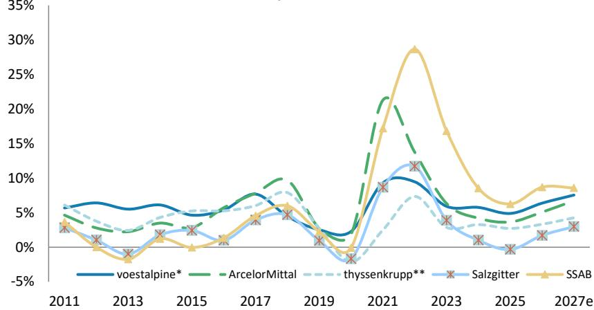

line

| Year   | voestalpine* | ArcelorMittal | thyssenkrupp** | Salzgitter | SSAB  |
|--------|--------------|---------------|----------------|----------|-------|
| 2011   | 6%           | 4%            | 6%             | 3%       | 4%    |
| 2013   | 6%           | 3%            | 4%             | -1%      | -2%   |
| 2015   | 5%           | 4%            | 5%             | 2%       | 0%    |
| 2017   | 8%           | 9%            | 8%             | 5%       | 6%    |
| 2019   | 3%           | 2%            | 3%             | 1%       | 1%    |
| 2021   | 10%          | 22%           | 9%             | 12%      | 29%   |
| 2023   | 6%           | 5%            | 4%             | 4%       | 16%   |
| 2025   | 5%           | 4%            | 3%             | 0%       | 6%    |
| 2027e  | 7%           | 8%            | 4%             | 3%       | 9%    |

Source: Company data, MS estimates (e). \* March year-end. \*\* September year-end

# Equities – thyssenkrupp (TKAG.DE, EW, PT €10.70)

ThyssenKrupp Historical EV\*/EBITDA   
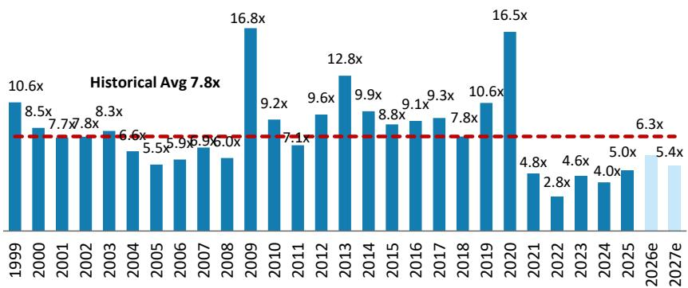

bar

Historical Avg 7.8x
| Year | Value (x) |
| :--- | :--- |
| 1999 | 10.6 |
| 2000 | 8.5 |
| 2001 | 7.7 |
| 2002 | 7.8 |
| 2003 | 8.3 |
| 2004 | 6.6 |
| 2005 | 5.5 |
| 2006 | 5.9 |
| 2007 | 6.9 |
| 2008 | 6.0 |
| 2009 | 16.8 |
| 2010 | 9.2 |
| 2011 | 7.1 |
| 2012 | 9.6 |
| 2013 | 12.8 |
| 2014 | 9.9 |
| 2015 | 8.8 |
| 2016 | 9.1 |
| 2017 | 9.3 |
| 2018 | 7.8 |
| 2019 | 10.6 |
| 2020 | 16.5 |
| 2021 | 4.8 |
| 2022 | 2.8 |
| 2023 | 4.6 |
| 2024 | 4.0 |
| 2025 | 5.0 |
| 2026e | 6.3 |
| 2027e | 5.4 |

Source: Company data, MS estimates (e). \* Broad definition of EV including provisions and other non-operating assets and liabilities, Market Cap = Avg outstanding shares multiplied by Avg share price. Historical average: 1999-2025.

<table><tr><td>Divisions</td><td>Adj. EBITDA2026e(EUR mn)*</td><td>Adj. EBITDA2027e(EUR mn)*</td><td>Capex2026e(EUR mn)</td><td>Capex2027e(EUR mn)</td></tr><tr><td>Materials Services</td><td>333</td><td>358</td><td>-115</td><td>-115</td></tr><tr><td>Automotive Technology</td><td>464</td><td>511</td><td>-300</td><td>-300</td></tr><tr><td>Steel Europe</td><td>591</td><td>746</td><td>-650</td><td>-725</td></tr><tr><td>Marine Systems</td><td>218</td><td>247</td><td>-100</td><td>-100</td></tr><tr><td>Decarbon Technologies</td><td>124</td><td>196</td><td>-150</td><td>-179</td></tr></table>

Source: Company data, MS estimates (e). \* Adjusted EBITDA including equity income.

Consensus NTM EV\*/EBITDA   
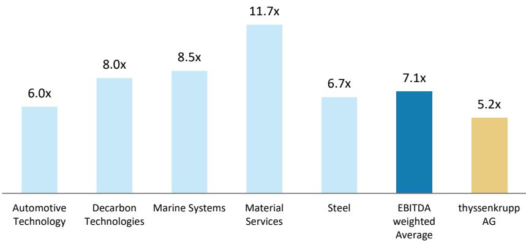

bar

| Category | Value (x) |
| :--- | :--- |
| Automotive Technology | 6.0 |
| Decarbon Technologies | 8.0 |
| Marine Systems | 8.5 |
| Material Services | 11.7 |
| Steel | 6.7 |
| EBITDA weighted Average | 7.1 |
| thyssenkrupp AG | 5.2 |

Source: Refinitiv Eikon consensus \* Group ex. Elevator EV/EBITDA is calculated as Current market cap + Net Debt + Pensions & Provisions + Net deferred taxes + Market value of Minority interest – Proceeds from elevator sale divided by Group EBITDA ex. Elevator. Synthetic sum-of-the parts EV/EBITDA is calculated by taking weighted average of individual business.

EBITDA/tonne (US\$)   
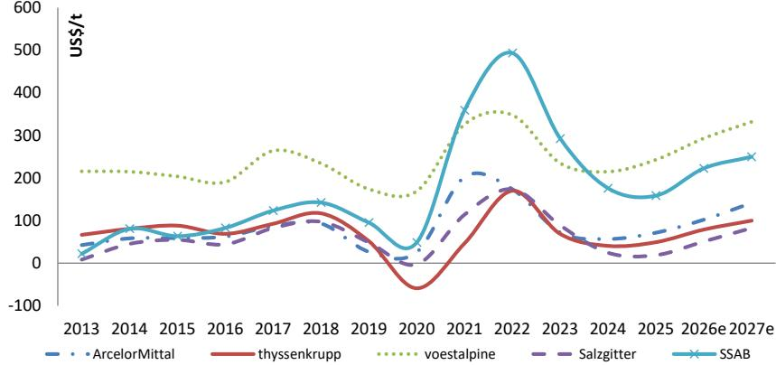

line

| Year | ArcelorMittal | thyssenkrupp | voestalpine | Salzgitter | SSAB |
|------|---------------|--------------|------------|----------|------|
| 2013 | ~40           | ~60          | ~220       | ~20      | ~40  |
| 2014 | ~50           | ~80          | ~210       | ~40      | ~80  |
| 2015 | ~60           | ~90          | ~200       | ~50      | ~60  |
| 2016 | ~70           | ~100         | ~190       | ~60      | ~80  |
| 2017 | ~80           | ~110         | ~270       | ~70      | ~120 |
| 2018 | ~90           | ~120         | ~250       | ~80      | ~140 |
| 2019 | ~100          | ~130         | ~230       | ~90      | ~160 |
| 2020 | ~150          | ~-50         | ~150       | ~10      | ~40  |
| 2021 | ~200          | ~50          | ~350       | ~150     | ~350 |
| 2022 | ~210          | ~170         | ~360       | ~170     | ~500 |
| 2023 | ~180          | ~150         | ~330       | ~140     | ~350 |
| 2024 | ~160          | ~130         | ~280       | ~120     | ~250 |
| 2025e| ~180          | ~140         | ~300       | ~130     | ~280 |
| 2027e| ~250          | ~160         | ~330       | ~150     | ~250 |

Source: Company data, MS estimates (e)

# Equities – Erdemir (EREGL.IS, UW, PT TL 23.00)

Erdemir Historical EV\*/EBITDA   
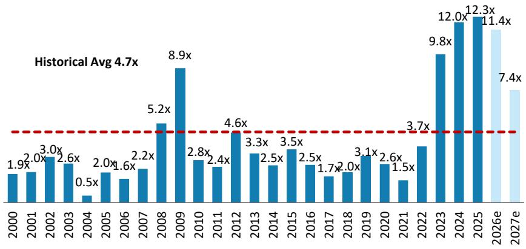

bar

| Year   | Value |
| ------ | ----- |
| 2000   | 1.9x  |
| 2001   | 2.0x  |
| 2002   | 3.0x  |
| 2003   | 2.6x  |
| 2004   | 0.5x  |
| 2005   | 2.0x  |
| 2006   | 1.6x  |
| 2007   | 2.2x  |
| 2008   | 5.2x  |
| 2009   | 8.9x  |
| 2010   | 2.8x  |
| 2011   | 2.4x  |
| 2012   | 4.6x  |
| 2013   | 3.3x  |
| 2014   | 2.5x  |
| 2015   | 3.5x  |
| 2016   | 2.5x  |
| 2017   | 1.7x  |
| 2018   | 2.0x  |
| 2019   | 3.1x  |
| 2020   | 2.6x  |
| 2021   | 1.5x  |
| 2022   | 3.7x  |
| 2023   | 9.8x  |
| 2024   | 12.0x |
| 2025e  | 12.3x |
| 2026e* | 11.4x |
| Historical Avg 4.7x |

Source: Company data, MS estimates (e). \* Broad definition of EV including provisions and other non-operating assets and liabilities, Market Cap = Avg outstanding shares multiplied by Avg share price. Historical average: 2008-2025.

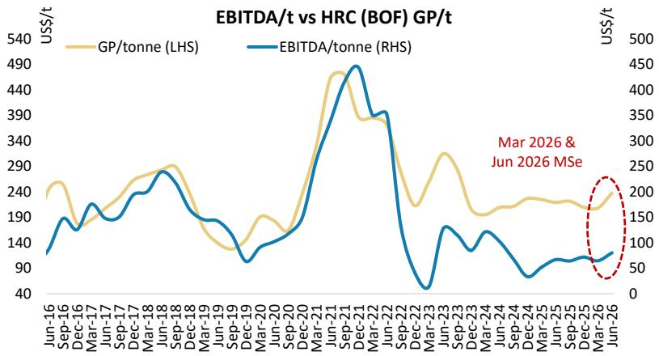

line

| Date     | GP/tonne (LHS) | EBITDA/tonne (RHS) |
|----------|----------------|--------------------|
| Mar 2026 MSe | ~200         | ~100               |

Erdemir Historical EBITDA/tonne shipped (US\$/t)   
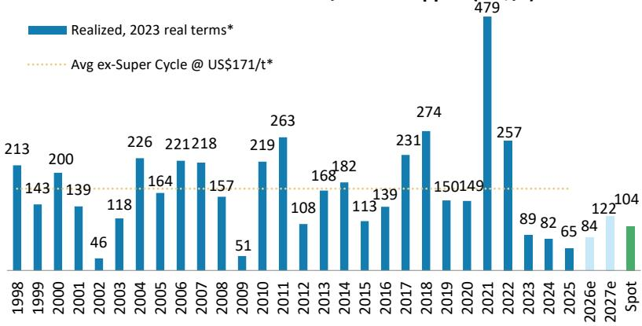

bar

| Year   | Realized, 2023 real terms* |
| ------ | -------------------------- |
| 1998   | 213                        |
| 1999   | 143                        |
| 2000   | 200                        |
| 2001   | 139                        |
| 2002   | 46                         |
| 2003   | 118                        |
| 2004   | 226                        |
| 2005   | 164                        |
| 2006   | 221                        |
| 2007   | 218                        |
| 2008   | 157                        |
| 2009   | 51                         |
| 2010   | 219                        |
| 2011   | 263                        |
| 2012   | 108                        |
| 2013   | 168                        |
| 2014   | 182                        |
| 2015   | 113                        |
| 2016   | 139                        |
| 2017   | 231                        |
| 2018   | 274                        |
| 2019   | 150                        |
| 2020   | 149                        |
| 2021   | 479                        |
| 2022   | 257                        |
| 2023   | 89                         |
| 2024   | 82                         |
| 2025   | 65                         |
| 2026e  | 84                         |
| 2027e  | 122                        |
| Spot   | 104                        |

Source: Company data, MS estimates (e) \* Data based on 2023 real numbers. Historical figures inflated at US PPI. \* Average EBITDA/t ex-Super Cycle is US\$168/t.

Cash needs of business vs Historical EBITDA (US\$mn)   
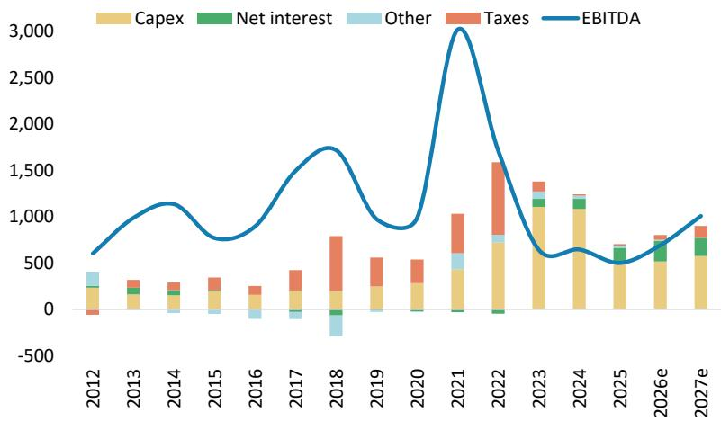

bar_line

| Year   | Capex | Net interest | Other | Taxes | EBITDA |
|--------|-------|--------------|-------|-------|--------|
| 2012   | 200   | 50           | 100   | -50   | 600    |
| 2013   | 150   | 50           | 50    | 50    | 900    |
| 2014   | 150   | 50           | 50    | 50    | 1100   |
| 2015   | 150   | 50           | 50    | 100   | 800    |
| 2016   | 150   | 50           | 50    | 100   | 900    |
| 2017   | 200   | 50           | 50    | 200   | 1300   |
| 2018   | 200   | 50           | -100  | 600   | 1700   |
| 2019   | 250   | 50           | 50    | 300   | 1100   |
| 2020   | 300   | 50           | 50    | 300   | 900    |
| 2021   | 400   | 50           | 100   | 400   | 3000   |
| 2022   | 750   | 50           | 150   | 800   | 1600   |
| 2023   | 1100  | 50           | 150   | 350   | 600    |
| 2024   | 1150  | 50           | 150   | 350   | 650    |
| 2025   | 650   | 50           | 50    | 50    | 550    |
| 2026e  | 650   | 50           | 50    | 75    | 650    |
| 2027e  | 750   | 50           | 50    | 85    | 950    |

# Equities – Acerinox (ACX.MC, OW, PT €15.50)

Acerinox EV/EBITDA (NTM Consensus)   
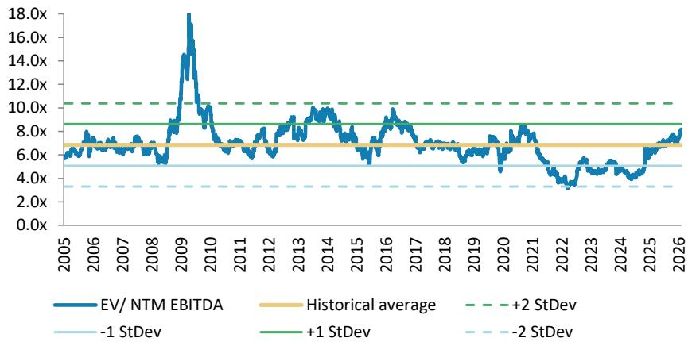

line

| Year | EV/ NTM EBITDA | Historical average | +2 StDev | -1 StDev | +1 StDev | -2 StDev |
|------|----------------|--------------------|----------|----------|----------|----------|
| 2005 | ~6.0x          | ~6.0x              | ~10.0x   | ~6.0x    | ~8.0x    | ~3.0x    |
| 2006 | ~7.0x          | ~6.0x              | ~10.0x   | ~6.0x    | ~8.0x    | ~3.0x    |
| 2007 | ~6.5x          | ~6.0x              | ~10.0x   | ~6.0x    | ~8.0x    | ~3.0x    |
| 2008 | ~5.5x          | ~6.0x              | ~10.0x   | ~6.0x    | ~8.0x    | ~3.0x    |
| 2009 | ~18.0x         | ~6.0x              | ~10.0x   | ~6.0x    | ~8.0x    | ~3.0x    |
| 2010 | ~10.0x         | ~6.0x              | ~10.0x   | ~6.0x    | ~8.0x    | ~3.0x    |
| 2011 | ~7.5x          | ~6.0x              | ~10.0x   | ~6.0x    | ~8.0x    | ~3.0x    |
| 2012 | ~8.5x          | ~6.0x              | ~10.0x   | ~6.0x    | ~8.0x    | ~3.0x    |
| 2013 | ~9.5x          | ~6.0x              | ~10.0x   | ~6.0x    | ~8.0x    | ~3.0x    |
| 2014 | ~9.5x          | ~6.0x              | ~10.0x   | ~6.0x    | ~8.0x    | ~3.0x    |
| 2015 | ~7.5x          | ~6.0x              | ~10.0x   | ~6.0x    | ~8.0x    | ~3.0x    |
| 2016 | ~9.5x          | ~6.0x              | ~10.0x   | ~6.0x    | ~8.0x    | ~3.0x    |
| 2017 | ~8.5x          | ~6.0x              | ~10.0x   | ~6.0x    | ~8.0x    | ~3.0x    |
| 2018 | ~7.5x          | ~6.0x              | ~10.0x   | ~6.0x    | ~8.0x    | ~3.0x    |
| 2019 | ~7.5x          | ~6.0x              | ~10.0x   | ~6.0x    | ~8.0x    | ~3.0x    |
| 2020 | ~8.5x          | ~6.0x              | ~10.0x   | ~6.0x    | ~8.0x    | ~3.0x    |
| 2021 | ~8.5x          | ~6.0x              | ~10.0x   | ~6.0x    | ~8.0x    | ~3.0x    |
| 2022 | ~4.5x          | ~6.0x              | ~10.0x   | ~6.0x    | ~8.0x    | ~3.0x    |
| 2023 | ~5.5x          | ~6.0x              | ~10.0x   | ~6.0x    | ~8.0x    | ~3.0x    |
| 2024 | ~4.5x          | ~6.0x              | ~10.0x   | ~6.0x    | ~8.0x    | ~3.0x    |
| 2025 | ~7.5x          | ~6.0x              | ~10.0x   | ~6.0x    | ~8.0x    | ~3.0x    |
| 2026 | ~8.5x          | ~6.0x              | ~10.0x   | ~6.0x    | ~8.0x    | ~3.0x    |

Source: Datastream

Geographical volume exposure\*   
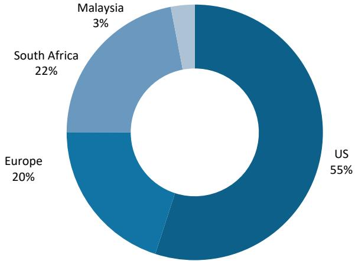

pie

| Region | Percentage (%) |
| :--- | :--- |
| US | 55 |
| Europe | 20 |
| South Africa | 22 |
| Malaysia | 3 |

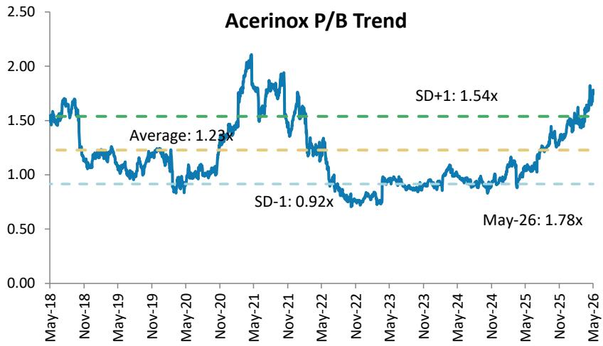

line

| Date    | P/B Ratio |
|---------|-----------|
| May-18  | 1.50x     |
| Nov-18  | 1.70x     |
| May-19  | 1.20x     |
| Nov-19  | 1.30x     |
| May-20  | 0.90x     |
| Nov-20  | 1.40x     |
| May-21  | 2.10x     |
| Nov-21  | 1.90x     |
| May-22  | 1.30x     |
| Nov-22  | 0.80x     |
| May-23  | 0.90x     |
| Nov-23  | 1.00x     |
| May-24  | 0.90x     |
| Nov-24  | 1.10x     |
| May-25  | 1.30x     |
| Nov-25  | 1.50x     |
| May-26  | 1.80x     |

Source: Datastream

EBITDA/t vs Base Price/t (EUR)   
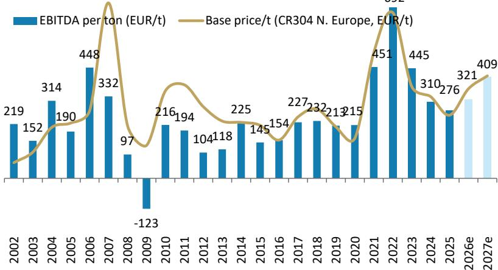

bar_line

| Year | EBITDA per ton (EUR/t) | Base price/t (EUR/t) |
| :--- | :--- | :--- |
| 2002 | 219 | |
| 2003 | 152 | |
| 2004 | 314 | |
| 2005 | 190 | |
| 2006 | 448 | |
| 2007 | 332 | |
| 2008 | 97 | |
| 2009 | -123 | |
| 2010 | 216 | |
| 2011 | 194 | |
| 2012 | 104 | |
| 2013 | 118 | |
| 2014 | 225 | |
| 2015 | 145 | |
| 2016 | 154 | |
| 2017 | 227 | |
| 2018 | 232 | |
| 2019 | 213 | |
| 2020 | 215 | |
| 2021 | 451 | |
| 2022 | 582 | |
| 2023 | 445 | |
| 2024 | 310 | |
| 2025e | 276 | |
| 2026e | 321 | |
| 2027e | 409 | |

Source: Company data, MS. \* Based on cold-rolled production.   
Source: Company data, MS estimates (e)

# Equities – Aperam (APAM.AS, OW, PT €48.00)

Aperam EV/EBITDA (NTM Consensus)   
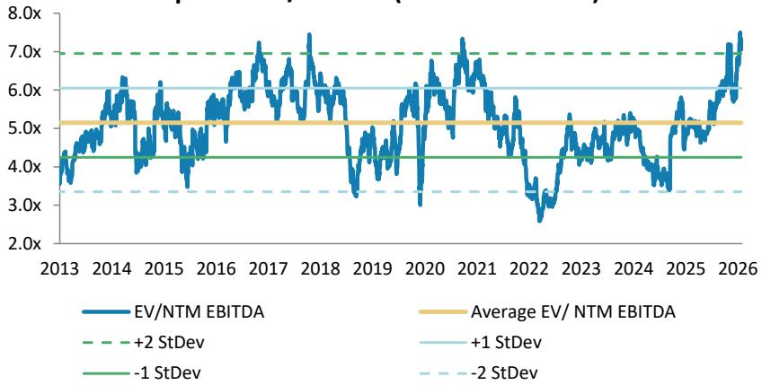

line

| Year | EV/NTM EBITDA | Average EV/ NTM EBITDA |
|------|---------------|------------------------|
| 2013 | ~4.0x         | 5.0x                   |
| 2014 | ~5.5x         | 5.0x                   |
| 2015 | ~4.5x         | 5.0x                   |
| 2016 | ~5.5x         | 5.0x                   |
| 2017 | ~6.5x         | 5.0x                   |
| 2018 | ~7.5x         | 5.0x                   |
| 2019 | ~4.5x         | 5.0x                   |
| 2020 | ~3.0x         | 5.0x                   |
| 2021 | ~7.0x         | 5.0x                   |
| 2022 | ~3.0x         | 5.0x                   |
| 2023 | ~4.5x         | 5.0x                   |
| 2024 | ~5.0x         | 5.0x                   |
| 2025 | ~5.5x         | 5.0x                   |
| 2026 | ~7.5x         | 5.0x                   |

Source: Datastream

Aperam P/B Trend   
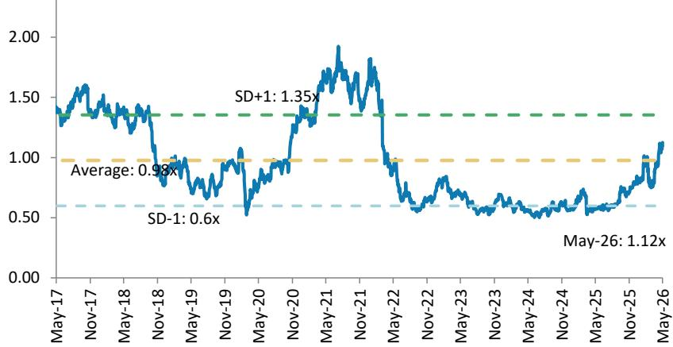

line

| Date    | Value |
|---------|-------|
| May-26  | 1.12x |
| Average | 0.98x |
| SD-1    | 0.6x  |
| SD+1    | 1.35x |

Source: Datastream

Stainless Geographical volume exposure   
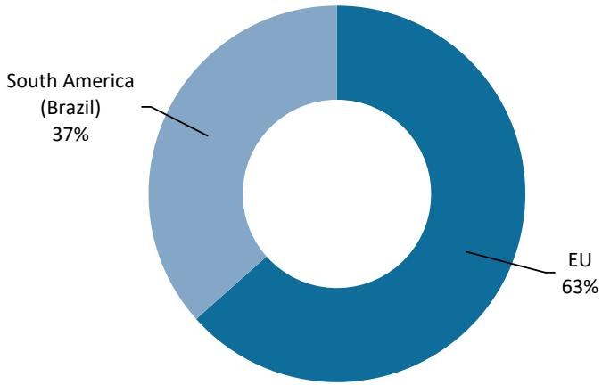

pie

| Region | Percentage (%) |
| :--- | :--- |
| South America (Brazil) | 37 |
| EU | 63 |

EBITDA/t vs Base price/t (EUR)   
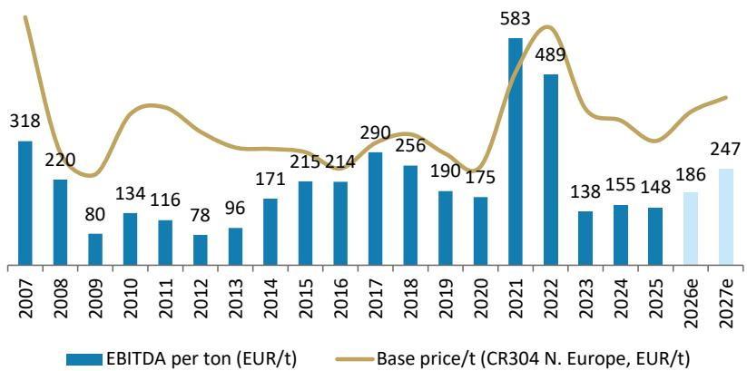

bar_line

| Year | EBITDA per ton (EUR/t) | Base price/t (EUR/t) |
| :--- | :--- | :--- |
| 2007 | 318 | 569 |
| 2008 | 220 | 214 |
| 2009 | 80 | 181 |
| 2010 | 134 | 315 |
| 2011 | 116 | 295 |
| 2012 | 78 | 269 |
| 2013 | 96 | 258 |
| 2014 | 171 | 253 |
| 2015 | 215 | 243 |
| 2016 | 214 | 238 |
| 2017 | 290 | 304 |
| 2018 | 256 | 304 |
| 2019 | 190 | 269 |
| 2020 | 175 | 253 |
| 2021 | 583 | 434 |
| 2022 | 489 | 489 |
| 2023 | 138 | 304 |
| 2024 | 155 | 269 |
| 2025 | 148 | 253 |
| 2026e | 186 | 304 |
| 2027e | 247 | 334 |

Source: Company data, MS   
Source: Company data, MS estimates (e)

# Equities – Outokumpu (OUT1V.HE, EW, PT €5.60)

Outokumpu EV/EBITDA (NTM Consensus)   
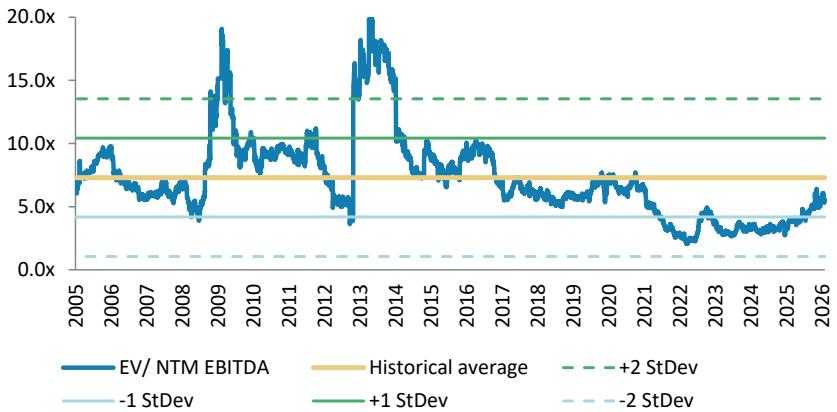

line

| Year | EV/ NTM EBITDA | Historical average | +2 StDev | -1 StDev | +1 StDev | -2 StDev |
|------|----------------|--------------------|----------|----------|----------|----------|
| 2005 | ~7.5x          | ~7.5x              | ~13.5x   | ~4.5x    | ~10.5x   | ~1.0x    |
| 2006 | ~9.0x          | ~7.5x              | ~13.5x   | ~4.5x    | ~10.5x   | ~1.0x    |
| 2007 | ~6.5x          | ~7.5x              | ~13.5x   | ~4.5x    | ~10.5x   | ~1.0x    |
| 2008 | ~4.0x          | ~7.5x              | ~13.5x   | ~4.5x    | ~10.5x   | ~1.0x    |
| 2009 | ~19.0x         | ~7.5x              | ~13.5x   | ~4.5x    | ~10.5x   | ~1.0x    |
| 2010 | ~9.5x          | ~7.5x              | ~13.5x   | ~4.5x    | ~10.5x   | ~1.0x    |
| 2011 | ~10.5x         | ~7.5x              | ~13.5x   | ~4.5x    | ~10.5x   | ~1.0x    |
| 2012 | ~6.0x          | ~7.5x              | ~13.5x   | ~4.5x    | ~10.5x   | ~1.0x    |
| 2013 | ~3.5x          | ~7.5x              | ~13.5x   | ~4.5x    | ~10.5x   | ~1.0x    |
| 2014 | ~18.0x         | ~7.5x              | ~13.5x   | ~4.5x    | ~10.5x   | ~1.0x    |
| 2015 | ~8.0x          | ~7.5x              | ~13.5x   | ~4.5x    | ~10.5x   | ~1.0x    |
| 2016 | ~9.5x          | ~7.5x              | ~13.5x   | ~4.5x    | ~10.5x   | ~1.0x    |
| 2017 | ~7.5x          | ~7.5x              | ~13.5x   | ~4.5x    | ~10.5x   | ~1.0x    |
| 2018 | ~6.5x          | ~7.5x              | ~13.5x   | ~4.5x    | ~10.5x   | ~1.0x    |
| 2019 | ~7.0x          | ~7.5x              | ~13.5x   | ~4.5x    | ~10.5x   | ~1.0x    |
| 2020 | ~7.5x          | ~7.5x              | ~13.5x   | ~4.5x    | ~10.5x   | ~1.0x    |
| 2021 | ~6.0x          | ~7.5x              | ~13.5x   | ~4.5x    | ~10.5x   | ~1.0x    |
| 2022 | ~3.0x          | ~7.5x              | ~13.5x   | ~4.5x    | ~10.5x   | ~1.0x    |
| 2023 | ~4.5x          | ~7.5x              | ~13.5x   | ~4.5x    | ~10.5x   | ~1.0x    |
| 2024 | ~3.5x          | ~7.5x              | ~13.5x   | ~4.5x    | ~10.5x   | ~1.0x    |
| 2025 | ~4.0x          | ~7.5x              | ~13.5x   | ~4.5x    | ~10.5x   | ~1.0x    |
| 2026 | ~6.0x          | ~7.5x              | ~13.5x   | ~4.5x    | ~10.5x   | ~1.0x    |

Source: Datastream

Geographical volume exposure   
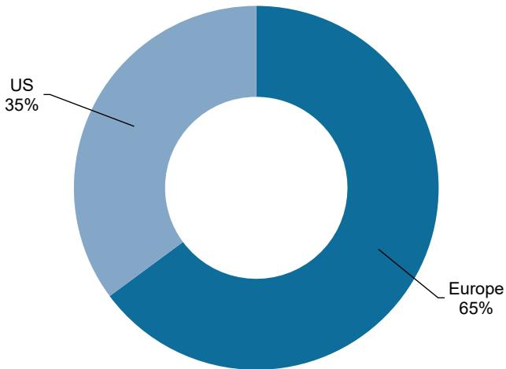

pie

| Region | Percentage |
| ------ | ---------- |
| US     | 35%        |
| Europe | 65%        |

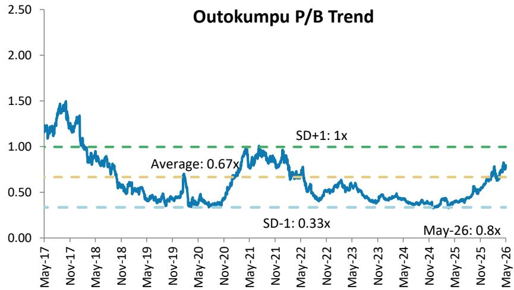

line

| Date     | P/B Ratio |
| -------- | --------- |
| May-17   | 1.2       |
| Nov-17   | 1.5       |
| May-18   | 1.0       |
| Nov-18   | 0.6       |
| May-19   | 0.4       |
| Nov-19   | 0.7       |
| May-20   | 0.3       |
| Nov-20   | 0.5       |
| May-21   | 1.0       |
| Nov-21   | 0.8       |
| May-22   | 0.6       |
| Nov-22   | 0.5       |
| May-23   | 0.4       |
| Nov-23   | 0.3       |
| May-24   | 0.4       |
| Nov-24   | 0.3       |
| May-25   | 0.5       |
| Nov-25   | 0.7       |
| May-26   | 0.8       |

Source: Datastream

EBITDA/t vs Base price/t (EUR)   
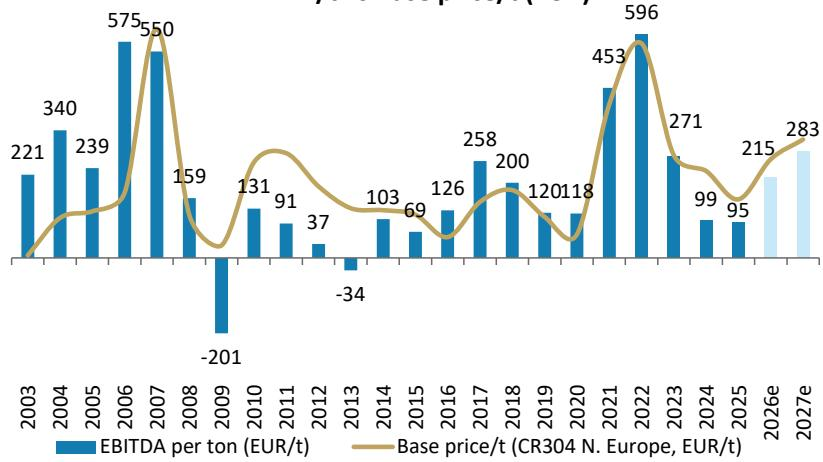

bar_line

| Year | EBITDA per ton (EUR/t) | Base price/t (EUR/t) |
| :--- | :--- | :--- |
| 2003 | 221 | |
| 2004 | 340 | |
| 2005 | 239 | |
| 2006 | 575 | |
| 2007 | 550 | |
| 2008 | 159 | |
| 2009 | -201 | |
| 2010 | 131 | |
| 2011 | 91 | |
| 2012 | 37 | |
| 2013 | -34 | |
| 2014 | 103 | |
| 2015 | 69 | |
| 2016 | 126 | |
| 2017 | 258 | |
| 2018 | 200 | |
| 2019 | 120 | |
| 2020 | 118 | |
| 2021 | 453 | |
| 2022 | 596 | |
| 2023 | 271 | |
| 2024e | 99 | |
| 2025e | 95 | |
| 2026e | 215 | |
| 2027e | 283 | |

Source: Company data, MS   
Source: Company data, MS estimates (e)

Equities: Global steel comps 

<table><tr><td rowspan="2">Companies</td><td rowspan="2">Rating</td><td rowspan="2">FX</td><td rowspan="2">Price Target</td><td rowspan="2">Share Price</td><td rowspan="2">Market cap (US$mn)</td><td rowspan="2">EV** (USD) 2026CY</td><td colspan="3">P/E</td><td colspan="3">EVEBITDA</td><td colspan="3">FCF Yield</td><td colspan="3">Dividend Yield</td><td colspan="3">P/B</td><td colspan="3">ROE</td><td colspan="3">ND/(ND+E+M)</td><td colspan="3">Net Debt/EBITDA</td></tr><tr><td>2026CY</td><td>2027CY</td><td>2028CY</td><td>2026CY</td><td>2027CY</td><td>2028CY</td><td>2026CY</td><td>2027CY</td><td>2028CY</td><td>2026CY</td><td>2027CY</td><td>2028CY</td><td>2026CY</td><td>2027CY</td><td>2028CY</td><td>2026e</td><td>2027e</td><td>2028e</td><td>2026e</td><td>2027e</td><td>2028e</td><td>2026e</td><td>2027e</td><td>2028e</td></tr><tr><td colspan="31">AUSTRALIA</td></tr><tr><td>BlueScope Steel^</td><td>EW</td><td>AUD</td><td>29.00</td><td>31.5</td><td>9,923</td><td>10,399</td><td>16.2x</td><td>14.1x</td><td>12.6x</td><td>7.1x</td><td>6.5x</td><td>5.9x</td><td>-2.6%</td><td>0.0%</td><td>1.9%</td><td>4.3%</td><td>4.6%</td><td>4.9%</td><td>1.3x</td><td>1.3x</td><td>1.2x</td><td>8.1%</td><td>9.2%</td><td>10.0%</td><td>0.0x</td><td>Cash</td><td>Cash</td><td>NA</td><td>NA</td><td>NA</td></tr><tr><td>Sims Metal Management*</td><td>EW</td><td>AUD</td><td>24.00</td><td>27.4</td><td>3,833</td><td>3,397</td><td>20.5x</td><td>18.4x</td><td>19.9x</td><td>7.0x</td><td>6.4x</td><td>6.4x</td><td>4.7%</td><td>5.5%</td><td>5.3%</td><td>1.8%</td><td>1.9%</td><td>1.6%</td><td>1.9x</td><td>1.8x</td><td>1.7x</td><td>9.8%</td><td>10.5%</td><td>9.1%</td><td>0.0x</td><td>Cash</td><td>Cash</td><td>NA</td><td>NA</td><td>NA</td></tr><tr><td>Weighted Average</td><td></td><td></td><td></td><td></td><td>13,756</td><td>13,796</td><td>17.4x</td><td>15.3x</td><td>14.7x</td><td>7.1x</td><td>6.5x</td><td>6.0x</td><td>-0.6%</td><td>1.5%</td><td>2.9%</td><td>3.6%</td><td>3.8%</td><td>4.0%</td><td>1.5x</td><td>1.4x</td><td>1.4x</td><td>8.6%</td><td>9.6%</td><td>9.8%</td><td>0.0x</td><td>NA</td><td>NA</td><td>NA</td><td>NA</td><td>NA</td></tr><tr><td colspan="31">China (A-Shares)</td></tr><tr><td>Angang Steel Company Limited*</td><td>NC</td><td>CNY</td><td>NA</td><td>2.04</td><td>2,621</td><td>4,525</td><td>NM</td><td>NM</td><td>NM</td><td>15.8x</td><td>9.4x</td><td>6.6x</td><td>-21.8%</td><td>-13.6%</td><td>-1.8%</td><td>0.0%</td><td>0.0%</td><td>0.4%</td><td>0.5x</td><td>0.5x</td><td>0.5x</td><td>NM</td><td>NM</td><td>0.1%</td><td>NA</td><td>NA</td><td>NA</td><td>7.7x</td><td>5.1x</td><td>NA</td></tr><tr><td>Baoshan Iron &amp; Steel</td><td>OW</td><td>CNY</td><td>8.00</td><td>6.03</td><td>19,164</td><td>17,435</td><td>10.4x</td><td>8.4x</td><td>7.3x</td><td>3.6x</td><td>2.9x</td><td>2.3x</td><td>12.5%</td><td>16.3%</td><td>19.4%</td><td>5.9%</td><td>7.3%</td><td>8.4%</td><td>0.6x</td><td>0.6x</td><td>0.6x</td><td>6.1%</td><td>7.3%</td><td>8.2%</td><td>0.1x</td><td>0.0x</td><td>Cash</td><td>0.4x</td><td>0.0x</td><td>Cash</td></tr><tr><td>China Steel Corp.</td><td>UW</td><td>TWD</td><td>16.20</td><td>19.1</td><td>9,274</td><td>14,519</td><td>NM</td><td>NM</td><td>17.5x</td><td>13.7x</td><td>10.0x</td><td>7.2x</td><td>-4.0%</td><td>2.9%</td><td>7.8%</td><td>0.0%</td><td>0.7%</td><td>2.9%</td><td>1.0x</td><td>1.0x</td><td>0.9x</td><td>NM</td><td>2.3%</td><td>5.6%</td><td>0.4x</td><td>0.4x</td><td>0.4x</td><td>6.0x</td><td>4.2x</td><td>2.8x</td></tr><tr><td>Hebei Iron and Steel Co Ltd*</td><td>NC</td><td>CNY</td><td>NA</td><td>2.23</td><td>3,400</td><td>21,105</td><td>14.2x</td><td>11.3x</td><td>NA</td><td>8.6x</td><td>8.0x</td><td>NA</td><td>2.9%</td><td>1.9%</td><td>NA</td><td>3.1%</td><td>3.6%</td><td>NA</td><td>0.4x</td><td>0.4x</td><td>NM</td><td>2.7%</td><td>3.3%</td><td>NA</td><td>NA</td><td>NA</td><td>NA</td><td>NA</td><td>NA</td><td>NA</td></tr><tr><td>Maanshan Iron &amp; Steel*</td><td>NC</td><td>CNY</td><td>NA</td><td>2.95</td><td>3,024</td><td>5,219</td><td>24.4x</td><td>11.9x</td><td>9.1x</td><td>6.7x</td><td>5.1x</td><td>4.4x</td><td>21.1%</td><td>-3.2%</td><td>26.3%</td><td>0.7%</td><td>2.2%</td><td>1.7%</td><td>0.9x</td><td>0.9x</td><td>0.8x</td><td>3.4%</td><td>7.4%</td><td>8.8%</td><td>NA</td><td>NA</td><td>NA</td><td>1.0x</td><td>0.3x</td><td>NA</td></tr><tr><td>Weighted Average</td><td></td><td></td><td></td><td></td><td>37,484</td><td>62,804</td><td>12.6x</td><td>9.2x</td><td>10.5x</td><td>8.7x</td><td>7.0x</td><td>4.9x</td><td>5.9%</td><td>8.0%</td><td>15.2%</td><td>4.9%</td><td>4.7%</td><td>5.7%</td><td>0.7x</td><td>0.7x</td><td>0.7x</td><td>5.3%</td><td>5.6%</td><td>6.9%</td><td>0.2x</td><td>0.2x</td><td>0.4x</td><td>3.2x</td><td>2.1x</td><td>2.8x</td></tr><tr><td colspan="31">China (H-Shares)</td></tr><tr><td>Angang Steel Company Limited*</td><td>NC</td><td>HKD</td><td>NA</td><td>1.26</td><td>2,621</td><td>4,525</td><td>NM</td><td>NM</td><td>NM</td><td>17.4x</td><td>8.4x</td><td>6.6x</td><td>-21.8%</td><td>-13.6%</td><td>-1.8%</td><td>0.0%</td><td>0.0%</td><td>0.9%</td><td>0.3x</td><td>0.3x</td><td>0.3x</td><td>NM</td><td>NM</td><td>0.1%</td><td>NA</td><td>NA</td><td>NA</td><td>8.4x</td><td>4.6x</td><td>NA</td></tr><tr><td>Maanshan Iron &amp; Steel*</td><td>NC</td><td>HKD</td><td>NA</td><td>1.93</td><td>3,024</td><td>7,872</td><td>16.8x</td><td>7.4x</td><td>5.6x</td><td>10.1x</td><td>8.7x</td><td>6.8x</td><td>21.2%</td><td>-3.1%</td><td>26.4%</td><td>1.3%</td><td>3.8%</td><td>4.0%</td><td>0.5x</td><td>0.5x</td><td>0.4x</td><td>3.4%</td><td>7.4%</td><td>8.8%</td><td>NA</td><td>NA</td><td>NA</td><td>1.0x</td><td>0.3x</td><td>NA</td></tr><tr><td>Weighted Average</td><td></td><td></td><td></td><td></td><td>5,645</td><td>12,398</td><td>16.8x</td><td>7.4x</td><td>5.6x</td><td>12.7x</td><td>8.6x</td><td>6.7x</td><td>1.2%</td><td>-8.0%</td><td>13.3%</td><td>1.3%</td><td>3.8%</td><td>2.9%</td><td>0.4x</td><td>0.4x</td><td>0.4x</td><td>3.4%</td><td>7.4%</td><td>4.8%</td><td>NA</td><td>NA</td><td>NA</td><td>3.7x</td><td>1.9x</td><td>NA</td></tr><tr><td colspan="31">India</td></tr><tr><td>Jindal Steel &amp; Power**</td><td>OW</td><td>INR</td><td>1,250</td><td>1,207</td><td>12,962</td><td>14,355</td><td>19.9x</td><td>12.6x</td><td>NA</td><td>10.5x</td><td>7.4x</td><td>NA</td><td>0.1%</td><td>4.4%</td><td>NA</td><td>0.2%</td><td>0.3%</td><td>NA</td><td>2.2x</td><td>1.9x</td><td>NA</td><td>12.2%</td><td>17.3%</td><td>NA</td><td>0.2x</td><td>0.2x</td><td>NA</td><td>1.4x</td><td>0.7x</td><td>NA</td></tr><tr><td>JSW Steel Ltd.*^</td><td>OW</td><td>INR</td><td>1,330</td><td>1,278</td><td>32,518</td><td>36,331</td><td>24.7x</td><td>16.7x</td><td>NA</td><td>9.4x</td><td>7.8x</td><td>NA</td><td>0.4%</td><td>2.6%</td><td>NA</td><td>0.4%</td><td>0.6%</td><td>NA</td><td>3.0x</td><td>2.7x</td><td>NA</td><td>14.2%</td><td>18.7%</td><td>NA</td><td>0.4x</td><td>0.3x</td><td>NA</td><td>1.6x</td><td>1.2x</td><td>NA</td></tr><tr><td>Steel Authority Of India**</td><td>UW</td><td>INR</td><td>140</td><td>204</td><td>8,886</td><td>12,402</td><td>20.5x</td><td>15.2x</td><td>NA</td><td>9.3x</td><td>8.4x</td><td>NA</td><td>-5.8%</td><td>-4.9%</td><td>NA</td><td>1.5%</td><td>1.8%</td><td>NA</td><td>1.3x</td><td>1.3x</td><td>NA</td><td>7.1%</td><td>9.1%</td><td>NA</td><td>0.4x</td><td>0.4x</td><td>NA</td><td>3.3x</td><td>3.0x</td><td>NA</td></tr><tr><td>Tata Steel**</td><td>OW</td><td>INR</td><td>215</td><td>208</td><td>27,340</td><td>34,162</td><td>13.3x</td><td>11.0x</td><td>NA</td><td>7.4x</td><td>6.3x</td><td>NA</td><td>7.9%</td><td>8.6%</td><td>NA</td><td>1.7%</td><td>1.7%</td><td>NA</td><td>2.3x</td><td>2.0x</td><td>NA</td><td>19.7%</td><td>21.0%</td><td>NA</td><td>0.4x</td><td>0.3x</td><td>NA</td><td>1.4x</td><td>0.9x</td><td>NA</td></tr><tr><td>Weighted Average</td><td></td><td></td><td></td><td></td><td>81,705</td><td>97,250</td><td>19.7x</td><td>14.0x</td><td>NA</td><td>8.9x</td><td>7.3x</td><td>NA</td><td>2.2%</td><td>4.1%</td><td>NA</td><td>1.0%</td><td>1.1%</td><td>NA</td><td>2.4x</td><td>2.2x</td><td>NA</td><td>15.0%</td><td>16.2%</td><td>NA</td><td>0.3x</td><td>0.3x</td><td>NA</td><td>1.7x</td><td>1.3x</td><td>NA</td></tr><tr><td colspan="31">Japan</td></tr><tr><td>JFE Holdings**</td><td>EW</td><td>JPY</td><td>1,700</td><td>1,631</td><td>6,514</td><td>11,022</td><td>9.6x</td><td>NA</td><td>NA</td><td>4.0x</td><td>NA</td><td>NA</td><td>5.2%</td><td>NA</td><td>NA</td><td>4.9%</td><td>NA</td><td>NA</td><td>0.4x</td><td>NA</td><td>NA</td><td>4.1%</td><td>NA</td><td>NA</td><td>0.4x</td><td>NA</td><td>NA</td><td>4.0x</td><td>NA</td><td>NA</td></tr><tr><td>Kobe Steel**</td><td>UW</td><td>JPY</td><td>1,700</td><td>1,960</td><td>4,860</td><td>5,437</td><td>8.9x</td><td>NA</td><td>NA</td><td>3.2x</td><td>NA</td><td>NA</td><td>10.8%</td><td>NA</td><td>NA</td><td>3.6%</td><td>NA</td><td>NA</td><td>0.6x</td><td>NA</td><td>NA</td><td>6.7%</td><td>NA</td><td>NA</td><td>0.2x</td><td>NA</td><td>NA</td><td>1.2x</td><td>NA</td><td>NA</td></tr><tr><td>Nippon Steel &amp; Sumitomo Metal*</td><td>OW</td><td>JPY</td><td>700</td><td>550</td><td>18,803</td><td>27,943</td><td>7.9x</td><td>NA</td><td>NA</td><td>4.0x</td><td>NA</td><td>NA</td><td>13.4%</td><td>NA</td><td>NA</td><td>4.4%</td><td>NA</td><td>NA</td><td>0.5x</td><td>NA</td><td>NA</td><td>6.8%</td><td>NA</td><td>NA</td><td>0.5x</td><td>NA</td><td>NA</td><td>5.6x</td><td>NA</td><td>NA</td></tr><tr><td>Tokyo Steel**</td><td>UW</td><td>JPY</td><td>1,300</td><td>1,705</td><td>1,181</td><td>436</td><td>21.5x</td><td>NA</td><td>NA</td><td>3.5x</td><td>NA</td><td>NA</td><td>0.4%</td><td>NA</td><td>NA</td><td>2.9%</td><td>NA</td><td>NA</td><td>0.8x</td><td>NA</td><td>NA</td><td>3.7%</td><td>NA</td><td>NA</td><td>Cash</td><td>NA</td><td>NA</td><td>NA</td><td>NA</td><td>NA</td></tr><tr><td>Yamato Kogyo Co Ltd*</td><td>NC</td><td>JPY</td><td>NA</td><td>11,785</td><td>4,589</td><td>3,684</td><td>13.1x</td><td>12.6x</td><td>12.4x</td><td>NM</td><td>NM</td><td>NM</td><td>6.5%</td><td>6.6%</td><td>NA</td><td>3.4%</td><td>3.4%</td><td>3.4%</td><td>1.3x</td><td>1.2x</td><td>1.1x</td><td>9.0%</td><td>9.8%</td><td>9.9%</td><td>NA</td><td>NA</td><td>NA</td><td>Cash</td><td>Cash</td><td>Cash</td></tr><tr><td>Weighted Average</td><td></td><td></td><td></td><td></td><td>35,947</td><td>48,521</td><td>9.4x</td><td>12.6x</td><td>12.4x</td><td>3.9x</td><td>NA</td><td>NA</td><td>10.3%</td><td>6.6%</td><td>NA</td><td>4.2%</td><td>3.4%</td><td>3.4%</td><td>0.6x</td><td>1.2x</td><td>1.1x</td><td>6.5%</td><td>9.8%</td><td>9.9%</td><td>0.5x</td><td>NA</td><td>NA</td><td>4.6x</td><td>NA</td><td>NA</td></tr><tr><td colspan="31">Korea</td></tr><tr><td>Hyundai Steel*</td><td>NC</td><td>KRW</td><td>NA</td><td>40,150</td><td>3,555</td><td>9,741</td><td>22.2x</td><td>11.7x</td><td>12.1x</td><td>6.4x</td><td>5.6x</td><td>5.4x</td><td>-5.6%</td><td>7.0%</td><td>1.7%</td><td>1.7%</td><td>1.8%</td><td>1.9%</td><td>0.3x</td><td>0.3x</td><td>0.3x</td><td>1.3%</td><td>2.3%</td><td>2.2%</td><td>NA</td><td>NA</td><td>NA</td><td>3.5x</td><td>3.1x</td><td>3.3x</td></tr><tr><td>POSCO</td><td>EW</td><td>KRW</td><td>450,000</td><td>413,000</td><td>20,723</td><td>31,395</td><td>14.7x</td><td>13.3x</td><td>12.2x</td><td>6.3x</td><td>5.7x</td><td>5.4x</td><td>-16.8%</td><td>1.1%</td><td>2.1%</td><td>2.4%</td><td>2.9%</td><td>3.0%</td><td>0.5x</td><td>0.5x</td><td>0.5x</td><td>3.8%</td><td>4.1%</td><td>4.4%</td><td>0.2x</td><td>0.2x</td><td>0.2x</td><td>2.4x</td><td>2.2x</td><td>2.1x</td></tr><tr><td>Weighted Average</td><td></td><td></td><td></td><td></td><td>24,278</td><td>41,136</td><td>15.8x</td><td>13.0x</td><td>12.1x</td><td>6.3x</td><td>5.6x</td><td>5.4x</td><td>-15.2%</td><td>2.0%</td><td>2.0%</td><td>2.3%</td><td>2.7%</td><td>2.9%</td><td>0.5x</td><td>0.5x</td><td>0.5x</td><td>3.4%</td><td>3.9%</td><td>4.1%</td><td>0.2x</td><td>0.2x</td><td>0.2x</td><td>2.7x</td><td>2.4x</td><td>2.4x</td></tr><tr><td colspan="31">Latin America</td></tr><tr><td>CSN</td><td>++</td><td>BRL</td><td>++</td><td>6.7</td><td>1,767</td><td>11,517</td><td>NM</td><td>NM</td><td>7.6x</td><td>6.0x</td><td>6.1x</td><td>4.6x</td><td>-38.3%</td><td>-71.0%</td><td>-38.8%</td><td>0.0%</td><td>0.0%</td><td>0.4%</td><td>1.9x</td><td>2.9x</td><td>2.5x</td><td>NM</td><td>NM</td><td>38.9%</td><td>0.8x</td><td>0.9x</td><td>0.9x</td><td>3.7x</td><td>4.2x</td><td>3.4x</td></tr><tr><td>Gerdau S.A.</td><td>EW</td><td>BRL</td><td>24.00</td><td>22.8</td><td>8,383</td><td>8,988</td><td>8.9x</td><td>10.9x</td><td>10.2x</td><td>3.9x</td><td>4.4x</td><td>4.1x</td><td>7.4%</td><td>3.4%</td><td>8.4%</td><td>3.1%</td><td>2.9%</td><td>2.9%</td><td>0.8x</td><td>0.8x</td><td>0.7x</td><td>9.5%</td><td>7.5%</td><td>7.6%</td><td>0.1x</td><td>0.1x</td><td>0.1x</td><td>0.6x</td><td>0.7x</td><td>0.5x</td></tr><tr><td>Ternium S.A.</td><td>EW</td><td>USD</td><td>47.00</td><td>48.3</td><td>9,472</td><td>13,982</td><td>10.3x</td><td>7.2x</td><td>7.8x</td><td>6.8x</td><td>4.9x</td><td>4.8x</td><td>-8.6%</td><td>11.8%</td><td>15.2%</td><td>6.1%</td><td>6.8%</td><td>6.8%</td><td>0.8x</td><td>0.7x</td><td>0.7x</td><td>7.7%</td><td>10.7%</td><td>9.4%</td><td>0.1x</td><td>0.0x</td><td>Cash</td><td>0.4x</td><td>0.1x</td><td>Cash</td></tr><tr><td>Usiminas</td><td>EW</td><td>BRL</td><td>7.80</td><td>10.95</td><td>2,554</td><td>2,539</td><td>9.4x</td><td>10.8x</td><td>9.9x</td><td>6.1x</td><td>4.7x</td><td>4.3x</td><td>3.0%</td><td>0.9%</td><td>2.8%</td><td>2.6%</td><td>2.4%</td><td>2.5%</td><td>0.6x</td><td>0.6x</td><td>0.6x</td><td>6.9%</td><td>6.0%</td><td>6.2%</td><td>Cash</td><td>Cash</td><td>Cash</td><td>Cash</td><td>Cash</td><td></td></tr><tr><td>Weighted Average</td><td></td><td></td><td></td><td></td><td>22,176</td><td>37,026</td><td>9.6x</td><td>9.2x</td><td>8.9x</td><td>5.8x</td><td>5.1x</td><td>4.5x</td><td>-3.6%</td><td>0.7%</td><td>6.9%</td><td>4.4%</td><td>4.6%</td><td>4.3%</td><td>0.9x</td><td>0.9x</td><td>0.8x</td><td>8.3%</td><td>8.8%</td><td>10.7%</td><td>0.3x</td><td>0.3x</td><td>0.5x</td><td>1.5x</td><td>1.6x</td><td>2.1x</td></tr><tr><td colspan="31">North America</td></tr><tr><td>Commercial Metals Company***</td><td>OW</td><td>USD</td><td>83</td><td>76.1</td><td>8,433</td><td>11,198</td><td>11.3x</td><td>11.3x</td><td>11.7x</td><td>7.8x</td><td>6.8x</td><td>6.6x</td><td>7.0%</td><td>9.8%</td><td>9.8%</td><td>1.0%</td><td>1.1%</td><td>1.1%</td><td>1.7x</td><td>1.5x</td><td>1.4x</td><td>17.2%</td><td>15.1%</td><td>12.9%</td><td>0.3x</td><td>0.2x</td><td>0.1x</td><td>1.6x</td><td>1.1x</td><td>0.7x</td></tr><tr><td>Nucor Corporation</td><td>EW</td><td>USD</td><td>227</td><td>250.0</td><td>56,876</td><td>60,907</td><td>15.9x</td><td>14.3x</td><td>15.2x</td><td>9.6x</td><td>8.6x</td><td>8.6x</td><td>4.5%</td><td>7.3%</td><td>7.0%</td><td>0.9%</td><td>0.9%</td><td>0.9%</td><td>2.4x</td><td>2.2x</td><td>2.0x</td><td>17.0%</td><td>16.9%</td><td>14.1%</td><td>0.1x</td><td>0.0x</td><td>Cash</td><td>0.6x</td><td>0.2x</td><td></td></tr><tr><td>Steel Dynamics</td><td>EW</td><td>USD</td><td>227</td><td>260.2</td><td>37,676</td><td>39,900</td><td>16.8x</td><td>15.8x</td><td>18.1x</td><td>10.7x</td><td>9.8x</td><td>10.8x</td><td>4.4%</td><td>7.3%</td><td>6.4%</td><td>0.8%</td><td>0.9%</td><td>0.9%</td><td>3.7x</td><td>3.3x</td><td>2.8x</td><td>25.0%</td><td>22.9%</td><td>17.8%</td><td>0.2x</td><td>0.1x</td><td>Cash</td><td>0.8x</td><td>0.4x</td><td></td></tr><tr><td>Cleveland-Cliffs</td><td>OW</td><td>USD</td><td>12.00</td><td>13.6</td><td>7,749</td><td>15,399</td><td>NM</td><td>NM</td><td>NM</td><td>13.2x</td><td>7.9x</td><td>8.6x</td><td>-5.6%</td><td>2.9%</td><td>5.0%</td><td>0.0%</td><td>0.0%</td><td>0.0%</td><td>1.4x</td><td>1.4x</td><td>1.3x</td><td>NM</td><td>3.3%</td><td>1.2%</td><td>0.6x</td><td>0.6x</td><td>0.5x</td><td>6.6x</td><td>3.8x</td><td></td></tr><tr><td>Weighted Average</td><td></td><td></td><td></td><td></td><td>110,733</td><td>127,404</td><td>15.8x</td><td>14.6x</td><td>16.0x</td><td>10.2x</td><td>8.7x</td><td>9.1x</td><td>3.9%</td><td>7.2%</td><td>6.9%</td><td>0.9%</td><td>0.9%</td><td>0.9%</td><td>2.7x</td><td>2.4x</td><td>2.2x</td><td>20.0%</td><td>17.9%</td><td>14.4%</td><td>0.2x</td><td>0.1x</td><td>0.4x</td><td>1.5x</td><td>0.8x</td><td></td></tr></table>

# Equities: Stainless steel comps

<table><tr><td rowspan="2">Companies</td><td rowspan="2">Rating</td><td rowspan="2">FX</td><td rowspan="2">Price Target</td><td rowspan="2">Share Price</td><td rowspan="2">Market cap (US$mn)</td><td rowspan="2">EV*** (USD) 2026CY</td><td colspan="3">P/E</td><td colspan="3">EV/EBITDA</td><td colspan="3">FCF Yield</td><td colspan="3">Dividend Yield</td><td colspan="3">P/B</td><td colspan="3">ROE</td><td colspan="3">ND/(ND+E+M)</td><td colspan="3">Net Debt/EBITDA</td></tr><tr><td>2026CY</td><td>2027CY</td><td>2028CY</td><td>2026CY</td><td>2027CY</td><td>2028CY</td><td>2026CY</td><td>2027CY</td><td>2028CY</td><td>2026CY</td><td>2027CY</td><td>2028CY</td><td>2026CY</td><td>2027CY</td><td>2028CY</td><td>2026e</td><td>2027e</td><td>2028e</td><td>2026e</td><td>2027e</td><td>2028e</td><td>2026e</td><td>2027e</td><td>2028e</td></tr><tr><td colspan="31">Western Europe</td></tr><tr><td>Aperam SA</td><td>OW</td><td>EUR</td><td>48.00</td><td>51.1</td><td>4,296</td><td>5,612</td><td>23.2x</td><td>12.3x</td><td>10.6x</td><td>10.0x</td><td>6.7x</td><td>5.7x</td><td>5.6%</td><td>8.6%</td><td>11.6%</td><td>3.9%</td><td>4.4%</td><td>4.9%</td><td>1.1x</td><td>1.1x</td><td>1.0x</td><td>5.0%</td><td>9.2%</td><td>10.2%</td><td>0.2x</td><td>0.2x</td><td>0.1x</td><td>1.9x</td><td>1.1x</td><td>0.6x</td></tr><tr><td>Acerinox SA</td><td>OW</td><td>EUR</td><td>15.50</td><td>15.9</td><td>4,601</td><td>6,328</td><td>17.9x</td><td>10.8x</td><td>9.1x</td><td>10.4x</td><td>7.1x</td><td>5.8x</td><td>2.9%</td><td>10.0%</td><td>13.2%</td><td>3.9%</td><td>3.9%</td><td>3.9%</td><td>2.1x</td><td>1.9x</td><td>1.6x</td><td>10.7%</td><td>17.1%</td><td>18.5%</td><td>0.4x</td><td>0.3x</td><td>0.2x</td><td>2.4x</td><td>1.3x</td><td>0.7x</td></tr><tr><td>Outokumpu Oyj</td><td>EW</td><td>EUR</td><td>5.60</td><td>5.96</td><td>3,275</td><td>3,874</td><td>16.2x</td><td>14.9x</td><td>13.4x</td><td>6.8x</td><td>5.5x</td><td>4.8x</td><td>1.4%</td><td>7.8%</td><td>7.9%</td><td>4.4%</td><td>4.5%</td><td>4.7%</td><td>0.8x</td><td>0.8x</td><td>0.8x</td><td>5.1%</td><td>5.5%</td><td>6.0%</td><td>0.1x</td><td>0.0x</td><td>0.0x</td><td>0.7x</td><td>0.3x</td><td>0.1x</td></tr><tr><td>Weighted Average</td><td></td><td></td><td></td><td></td><td>12,173</td><td>15,814</td><td>19.3x</td><td>12.5x</td><td>10.8x</td><td>9.4x</td><td>6.6x</td><td>5.5x</td><td>3.5%</td><td>8.9%</td><td>11.2%</td><td>4.0%</td><td>4.3%</td><td>4.5%</td><td>1.4x</td><td>1.3x</td><td>1.2x</td><td>7.2%</td><td>11.2%</td><td>12.2%</td><td>0.2x</td><td>0.2x</td><td>0.1x</td><td>1.8x</td><td>1.0x</td><td>0.5x</td></tr></table>

Source: MS estimates. ^^ Fiscal Year ending in March, ^^^ Fiscal year ending in September, Weighted Average for P/E, FCF Yield, Dividend Yield, P/B, ROE based on Market Cap. Weighted Average for EV/EBITDA, Net Debt/EBITDA based on EV. Share prices as May 29, 2026. \*\*\* Broad definition of EV including provisions and other non-operating assets and liabilities, Market Cap = Avg outstanding shares multiplied by Avg share price

Global steel S/D snapshot 

<table><tr><td>Production - Crude Steel</td><td>unit</td><td>2016</td><td>2017</td><td>2018</td><td>2019</td><td>2020</td><td>2021</td><td>2022</td><td>2023</td><td>2024</td><td>2025</td><td>2026e</td><td>2027e</td><td>2028e</td><td>2029e</td><td>2030e</td></tr><tr><td>EU-27+UK</td><td>Mt</td><td>162</td><td>168</td><td>167</td><td>157</td><td>139</td><td>160</td><td>142</td><td>132</td><td>134</td><td>129</td><td>137</td><td>143</td><td>144</td><td>146</td><td>147</td></tr><tr><td>Other Europe</td><td>Mt</td><td>38</td><td>42</td><td>42</td><td>39</td><td>40</td><td>45</td><td>40</td><td>38</td><td>44</td><td>43</td><td>43</td><td>44</td><td>44</td><td>45</td><td>46</td></tr><tr><td>CIS</td><td>Mt</td><td>102</td><td>101</td><td>101</td><td>101</td><td>100</td><td>107</td><td>86</td><td>89</td><td>88</td><td>83</td><td>84</td><td>86</td><td>89</td><td>91</td><td>94</td></tr><tr><td>North America</td><td>Mt</td><td>111</td><td>116</td><td>121</td><td>120</td><td>101</td><td>118</td><td>112</td><td>110</td><td>106</td><td>108</td><td>111</td><td>113</td><td>119</td><td>119</td><td>119</td></tr><tr><td>South America</td><td>Mt</td><td>40</td><td>44</td><td>45</td><td>42</td><td>38</td><td>46</td><td>44</td><td>42</td><td>42</td><td>42</td><td>42</td><td>43</td><td>43</td><td>44</td><td>44</td></tr><tr><td>Africa</td><td>Mt</td><td>13</td><td>15</td><td>18</td><td>17</td><td>17</td><td>22</td><td>23</td><td>27</td><td>28</td><td>30</td><td>30</td><td>31</td><td>31</td><td>32</td><td>33</td></tr><tr><td>Middle East</td><td>Mt</td><td>31</td><td>34</td><td>43</td><td>44</td><td>45</td><td>46</td><td>53</td><td>55</td><td>55</td><td>57</td><td>53</td><td>59</td><td>63</td><td>64</td><td>66</td></tr><tr><td>Asia</td><td>Mt</td><td>1,123</td><td>1,159</td><td>1,281</td><td>1,348</td><td>1,391</td><td>1,408</td><td>1,382</td><td>1,405</td><td>1,387</td><td>1,392</td><td>1,395</td><td>1,399</td><td>1,408</td><td>1,418</td><td>1,430</td></tr><tr><td>Oceania</td><td>Mt</td><td>6</td><td>6</td><td>6</td><td>6</td><td>6</td><td>6</td><td>6</td><td>6</td><td>5</td><td>7</td><td>7</td><td>7</td><td>7</td><td>7</td><td>7</td></tr><tr><td>World</td><td>Mt</td><td>1,626</td><td>1,686</td><td>1,824</td><td>1,874</td><td>1,879</td><td>1,958</td><td>1,888</td><td>1,902</td><td>1,889</td><td>1,890</td><td>1,902</td><td>1,924</td><td>1,949</td><td>1,967</td><td>1,985</td></tr><tr><td>YoY growth</td><td>%</td><td>-0.7%</td><td>3.7%</td><td>8.2%</td><td>2.7%</td><td>0.3%</td><td>4.2%</td><td>-3.6%</td><td>0.8%</td><td>-0.7%</td><td>0.1%</td><td>0.6%</td><td>1.2%</td><td>1.3%</td><td>0.9%</td><td>0.9%</td></tr><tr><td>China</td><td>Mt</td><td>825</td><td>832</td><td>928</td><td>997</td><td>1,065</td><td>1,033</td><td>1,018</td><td>1,029</td><td>1,005</td><td>990</td><td>982</td><td>970</td><td>964</td><td>958</td><td>951</td></tr><tr><td>YoY growth</td><td>%</td><td>0.4%</td><td>0.9%</td><td>11.6%</td><td>7.4%</td><td>6.9%</td><td>-3.0%</td><td>-1.4%</td><td>1.1%</td><td>-2.3%</td><td>-1.5%</td><td>-0.8%</td><td>-1.2%</td><td>-0.7%</td><td>-0.7%</td><td>-0.7%</td></tr><tr><td>World ex-China</td><td>Mt</td><td>801</td><td>854</td><td>896</td><td>877</td><td>814</td><td>926</td><td>870</td><td>874</td><td>884</td><td>900</td><td>920</td><td>954</td><td>985</td><td>1,009</td><td>1,033</td></tr><tr><td>YoY growth</td><td>%</td><td>-1.9%</td><td>6.5%</td><td>5.0%</td><td>-2.1%</td><td>-7.2%</td><td>13.7%</td><td>-6.0%</td><td>0.4%</td><td>1.2%</td><td>1.8%</td><td>2.2%</td><td>3.7%</td><td>3.3%</td><td>2.4%</td><td>2.4%</td></tr></table>

<table><tr><td>Demand - Crude Steel Equivalent</td><td>unit</td><td>2016</td><td>2017</td><td>2018</td><td>2019</td><td>2020</td><td>2021</td><td>2022</td><td>2023</td><td>2024</td><td>2025</td><td>2026e</td><td>2027e</td><td>2028e</td><td>2029e</td><td>2030e</td></tr><tr><td>EU-27+UK</td><td>Mt</td><td>174</td><td>179</td><td>183</td><td>172</td><td>152</td><td>179</td><td>167</td><td>152</td><td>153</td><td>153</td><td>155</td><td>158</td><td>158</td><td>159</td><td>160</td></tr><tr><td>Other Europe</td><td>Mt</td><td>43</td><td>46</td><td>40</td><td>35</td><td>38</td><td>43</td><td>42</td><td>48</td><td>49</td><td>50</td><td>51</td><td>52</td><td>53</td><td>54</td><td>55</td></tr><tr><td>CIS</td><td>Mt</td><td>57</td><td>60</td><td>59</td><td>62</td><td>62</td><td>62</td><td>55</td><td>64</td><td>63</td><td>64</td><td>63</td><td>65</td><td>66</td><td>67</td><td>69</td></tr><tr><td>North America</td><td>Mt</td><td>151</td><td>159</td><td>162</td><td>155</td><td>132</td><td>158</td><td>153</td><td>153</td><td>149</td><td>149</td><td>151</td><td>152</td><td>156</td><td>157</td><td>159</td></tr><tr><td>South America</td><td>Mt</td><td>41</td><td>43</td><td>43</td><td>42</td><td>39</td><td>51</td><td>46</td><td>46</td><td>45</td><td>47</td><td>48</td><td>49</td><td>50</td><td>51</td><td>52</td></tr><tr><td>Africa</td><td>Mt</td><td>42</td><td>40</td><td>41</td><td>44</td><td>39</td><td>42</td><td>42</td><td>40</td><td>44</td><td>44</td><td>45</td><td>47</td><td>48</td><td>50</td><td>51</td></tr><tr><td>Middle East</td><td>Mt</td><td>58</td><td>58</td><td>55</td><td>52</td><td>51</td><td>53</td><td>61</td><td>58</td><td>62</td><td>67</td><td>60</td><td>66</td><td>71</td><td>73</td><td>74</td></tr><tr><td>Asia</td><td>Mt</td><td>1,066</td><td>1,170</td><td>1,239</td><td>1,320</td><td>1,367</td><td>1,359</td><td>1,328</td><td>1,321</td><td>1,293</td><td>1,310</td><td>1,310</td><td>1,317</td><td>1,330</td><td>1,344</td><td>1,360</td></tr><tr><td>Oceania</td><td>Mt</td><td>8</td><td>7</td><td>7</td><td>7</td><td>7</td><td>7</td><td>8</td><td>8</td><td>7</td><td>7</td><td>7</td><td>7</td><td>7</td><td>8</td><td>8</td></tr><tr><td>World</td><td>Mt</td><td>1,639</td><td>1,761</td><td>1,829</td><td>1,891</td><td>1,889</td><td>1,955</td><td>1,902</td><td>1,891</td><td>1,866</td><td>1,891</td><td>1,890</td><td>1,913</td><td>1,940</td><td>1,964</td><td>1,989</td></tr><tr><td>YoY growth</td><td>%</td><td>0.9%</td><td>7.4%</td><td>3.9%</td><td>3.4%</td><td>-0.1%</td><td>3.5%</td><td>-2.7%</td><td>-0.6%</td><td>-1.3%</td><td>1.3%</td><td>-0.1%</td><td>1.2%</td><td>1.4%</td><td>1.2%</td><td>1.3%</td></tr><tr><td>China</td><td>Mt</td><td>724</td><td>769</td><td>869</td><td>940</td><td>1,029</td><td>976</td><td>964</td><td>943</td><td>894</td><td>895</td><td>878</td><td>869</td><td>865</td><td>860</td><td>856</td></tr><tr><td>YoY growth</td><td>%</td><td>2.9%</td><td>6.2%</td><td>13.1%</td><td>8.2%</td><td>9.4%</td><td>-5.2%</td><td>-1.2%</td><td>-2.2%</td><td>-5.2%</td><td>0.1%</td><td>-1.9%</td><td>-1.0%</td><td>-0.5%</td><td>-0.5%</td><td>-0.5%</td></tr><tr><td>World ex-China</td><td>Mt</td><td>915</td><td>992</td><td>960</td><td>951</td><td>861</td><td>979</td><td>938</td><td>948</td><td>972</td><td>997</td><td>1,013</td><td>1,044</td><td>1,075</td><td>1,104</td><td>1,133</td></tr><tr><td>YoY growth</td><td>%</td><td>-0.7%</td><td>8.4%</td><td>-3.3%</td><td>-1.0%</td><td>-9.5%</td><td>13.8%</td><td>-4.3%</td><td>1.1%</td><td>2.5%</td><td>2.5%</td><td>1.6%</td><td>3.1%</td><td>3.0%</td><td>2.6%</td><td>2.7%</td></tr></table>

Source: MS estimates (e), WSA, IISI, CRU, Bloomberg

# End-market exposure: Carbon Steel

ArcelorMittal Sales by End Market (2025)   
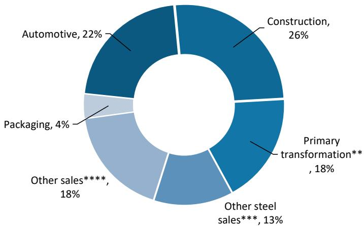

pie

| Category | Percentage (%) |
| :--- | :--- |
| Construction | 26 |
| Primary transformation** | 18 |
| Other steel sales*** | 13 |
| Other sales**** | 18 |
| Packaging | 4 |
| Automotive | 22 |

Source: Company data, MS. \* Distribution represents the Company's sales to external distributors and processing facilities. \*\* Primary Transformation includes steel production, re-rollers and pickling, coaters, pipes and tubes and wire and cable. \*\*\* Other steel sales mainly represents metal processing, machinery, electrical equipment and domestic appliances. \*\*\* Other sales mainly represent slag, waste, sale of energy and transport services.

SSAB Sales by End Market (2025)   
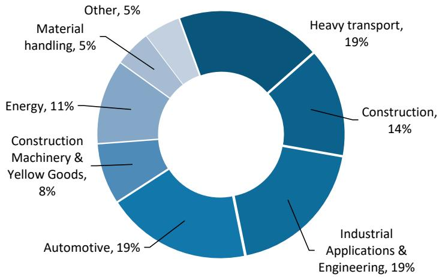

pie

| Category | Percentage (%) |
| :--- | :--- |
| Heavy transport | 19 |
| Construction | 14 |
| Industrial Applications & Engineering | 19 |
| Automotive | 19 |
| Construction Machinery & Yellow Goods | 8 |
| Energy | 11 |
| Material handling | 5 |
| Other | 5 |

Source: Company data, MS

thyssenkrupp Sales by End Market (FY24/2025)   
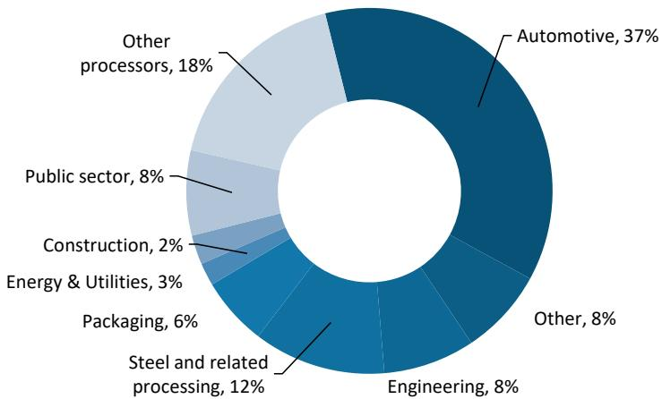

pie

| Category | Percentage (%) |
| :--- | :--- |
| Automotive | 37 |
| Other | 8 |
| Engineering | 8 |
| Steel and related processing | 12 |
| Packaging | 6 |
| Energy & Utilities | 3 |
| Construction | 2 |
| Public sector | 8 |
| Other processors | 18 |

Source: Company data, MS

voestalpine Sales by End Market (FY24/25)   
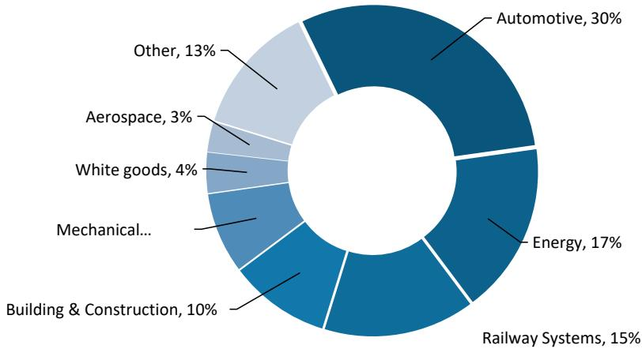

pie

| Category | Percentage (%) |
| :--- | :--- |
| Automotive | 30 |
| Energy | 17 |
| Railway Systems | 15 |
| Building & Construction | 10 |
| Mechanical Engineering | 8 |
| White goods | 4 |
| Aerospace | 3 |
| Other | 13 |

Source: Company data, MS

# End-market exposure: Stainless Steel

Aperam Sales by End Market (2025)   
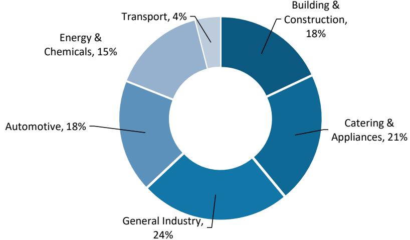

pie

| Category | Percentage (%) |
| :--- | :--- |
| Building & Construction | 18 |
| Catering & Appliances | 21 |
| General Industry | 24 |
| Automotive | 18 |
| Energy & Chemicals | 15 |
| Transport | 4 |

Source: Company data, MS

Outokumpu Sales by End Market (2025)   
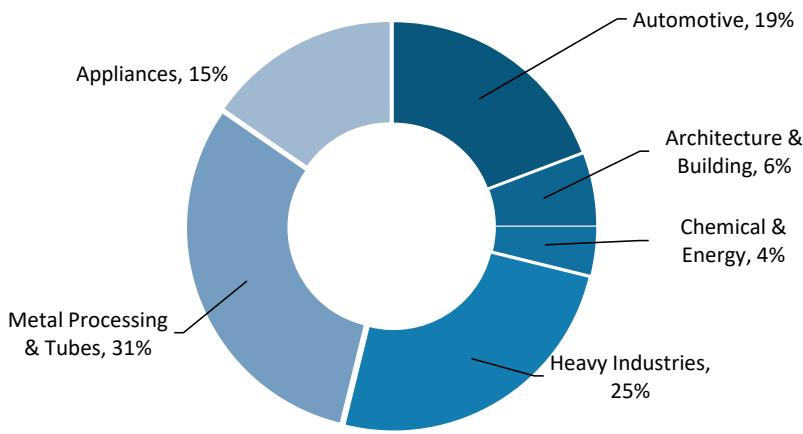

pie

| Category | Percentage (%) |
| :--- | :--- |
| Automotive | 19 |
| Architecture & Building | 6 |
| Chemical & Energy | 4 |
| Heavy Industries | 25 |
| Metal Processing & Tubes | 31 |
| Appliances | 15 |

Source: Company data, MS

Acerinox Stainless Steel Sales by End Market (2022)   
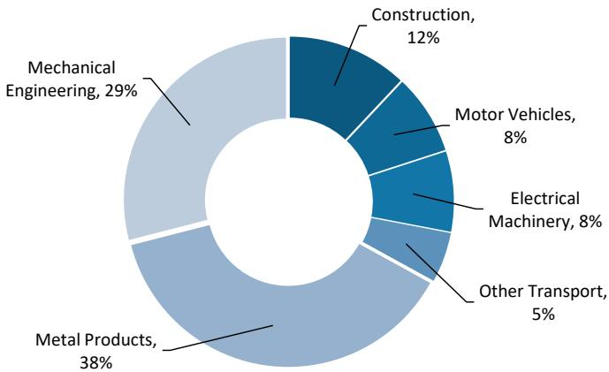

pie

| Category | Percentage (%) |
| :--- | :--- |
| Construction | 12 |
| Motor Vehicles | 8 |
| Electrical Machinery | 8 |
| Other Transport | 5 |
| Metal Products | 38 |
| Mechanical Engineering | 29 |

Source: Company data, MS

# Global Commodities Team

GLOBAL METALS & MINING TEAM 

<table><tr><td colspan="3">Global Metals &amp; Mining – Commodity Strategists</td><td colspan="3">Australia Metals &amp; Mining, Steel (Sydney)</td></tr><tr><td>Amy Gower3, COMMODITIES STRATEGIST</td><td>Amy.Gower1@morganstanley.com</td><td>+44 20 7677 6937</td><td>Rahul Anand6,EQUITY ANALYST</td><td>R.Anand@morganstanley.com</td><td>+61 2 9770 1136</td></tr><tr><td>Ben Kelson3, Research Associate</td><td>Ben.Kelson@morganstanley.com</td><td>+44 20 7677-1392</td><td>Shannon Sinha6,EQUITY ANALYST</td><td>Shannon.Sinha@morganstanley.com</td><td>+61 2 9770 1334</td></tr><tr><td></td><td></td><td></td><td>Michael Stancliff6, RESEARCH ASSOCIATE</td><td>Michael.Stancliff@morganstanley.com</td><td>+61 2 9770 9253</td></tr><tr><td colspan="6">EMEA Metals &amp; Mining, Steel (London)</td></tr><tr><td>Alain Gabriel3,EQUITY ANALYST</td><td>Alain.Gabriel@morganstanley.com</td><td>+44 20 7425 8959</td><td colspan="3">China Metals &amp; Mining, Steel (Hong Kong)</td></tr><tr><td>Ioannis Masvoulas3,EQUITY ANALYST</td><td>Ioannis.Masvoulas@morganstanley.com</td><td>+44 20 7425 0427</td><td>Rachel Zhang5,EQUITY ANALYST</td><td>Rachel.Zhang@rmbmorganstanley.com</td><td>+852 2239 1520</td></tr><tr><td>Adahna Ekoku3,EQUITY ANALYST</td><td>Adahna.Ekoku@morganstanley.com</td><td>+44 20 7677 0065</td><td>Hannah Yang5,EQUITY ANALYST</td><td>Hannah.Yang1@morganstanley.com</td><td>+852 2239 7079</td></tr><tr><td>Ferdinand Huber3, RESEARCH ASSOCIATE</td><td>Ferdinand.Huber@morganstanley.com</td><td>+44 20 7677 2702</td><td>Chris Jiang5,EQUITY ANALYST</td><td>Chris.Jiang@morganstanley.com</td><td>+852 3963 1593</td></tr><tr><td></td><td></td><td></td><td>Cynthia Tang5, RESEARCH ASSOCIATE</td><td>Cynthia.Tang@morganstanley.com</td><td>+852 3963 4360</td></tr><tr><td colspan="6">South Africa Metals &amp; Mining, Steel (Johannesburg)</td></tr><tr><td>Christopher Nicholson10,EQUITY ANALYST</td><td>Christopher.Nicholson@rmbmorganstanley.com</td><td>+27 11 282 1154</td><td colspan="3">Indian Metals &amp; Mining</td></tr><tr><td>Brian Morgan10,EQUITY ANALYST</td><td>Brian.Morgan3@rmbmorganstanley.com</td><td>+27 11 282 8969</td><td>Rahul Gupta 4, EQUITY ANALYST</td><td>Rahul.Gupta1@morganstanley.com</td><td>+91 22 6118 2233</td></tr><tr><td colspan="3">Americas Steel, Metals &amp; Mining, Pulp &amp; Paper (New York/São Paulo/Mexico)</td><td colspan="3">Global Energy</td></tr><tr><td>Carlos de Alba1,EQUITY ANALYST</td><td>Carlos.de.Alba@morganstanley.com</td><td>+1 212 761 4927</td><td>Martijn Rats3,EQUITY ANALYST AND COMMODITIES STRATEGIST</td><td>Martijn.Rats@morganstanley.com</td><td>+44 20 7425 6618</td></tr><tr><td>Eugenia Cavalheiro2,EQUITY ANALYST</td><td>Eugenia.Cavalheiro@morganstanley.com</td><td>+55 11 3048 6602</td><td>Guilherme Levy3,EQUITY ANALYST</td><td>Guilherme.Levy@morganstanley.com</td><td>+44 20 7425 6616</td></tr><tr><td>Justin Ferrer1, RESEARCH ASSOCIATE</td><td>Justin.Ferrer@morganstanley.com</td><td>+1 212 761-5246</td><td>Alice Bergier Winograd3,EQUITY ANALYST</td><td>Alice.Winograd@morganstanley.com</td><td>+44 20 7425-0174</td></tr><tr><td>Henrique Braga2, RESEARCH ASSOCIATE</td><td>Henrique.Braga@morganstanley.com</td><td>+55 11 3048 6198</td><td>Charlotte Firkins3, RESEARCH ASSOCIATE</td><td>Charlotte.Firkins@morganstanley.com</td><td>+44 20 7425 3866</td></tr><tr><td colspan="3">Japan Metals &amp; Mining, Steel (Tokyo)</td><td colspan="3">1 MS &amp; Co. LLC 2 MS C.T.V.M. S.A.+ 3 MS &amp; Co. International plc+</td></tr><tr><td>Yu Shirakawa7,EQUITY ANALYST</td><td>Yu.Shirakawa@morganstanleymufg.com</td><td>+81 3 6836 5432</td><td colspan="3">4 MS India Company Private Limited+ 5 MS Asia Limited + 6 MS Australia Ltd+</td></tr><tr><td>Koji Tamura7,EQUITY ANALYST</td><td>Koji.Tamura@morganstanleymufg.com</td><td>+81 3 6836 8909</td><td colspan="3">7 MS MUFG Securities Co., Ltd+ 9 OOO MS Bank 10 RMB MS (Proprietary) Ltd+</td></tr><tr><td>Markos Hiroto Fujii7, RESEARCH ASSOCIATE</td><td>Hiroto.Fujii@morganstanleymufg.com</td><td>+81 3 6836 5427</td><td colspan="3">11 MS &amp; Co. International plc, Seoul Branch+ 12 PT. MS Asia Indonesia+</td></tr><tr><td></td><td></td><td></td><td colspan="3">13 MS Mexico, Casa de bolsa, S.A. de C.V.+</td></tr><tr><td colspan="6">Asia Oil &amp; Gas &amp; Coal (Hong Kong/Jakarta)</td></tr><tr><td>Andy Meng5,EQUITY ANALYST</td><td>Andy.Meng@morganstanley.com</td><td>+852 2239 7689</td><td rowspan="4" colspan="3">+ Analysts employed by non-U.S. affiliates are not registered with FINRA, may not be associated persons of the member and may not be subject to NASD/NYSE restrictions on communications with a subject company, public appearances and trading securities held by a research analyst account.</td></tr><tr><td>Jack Lu5,EQUITY ANALYST</td><td>Jack.Lu@morganstanley.com</td><td>+852 2848 5044</td></tr><tr><td>Albert Li5,EQUITY ANALYST</td><td>Albert.Li@morganstanley.com</td><td>+852 3963 3610</td></tr><tr><td>Kaylee Xu5, RESEARCH ASSOCIATE</td><td>Kaylee.Xu@morganstanley.com</td><td>+852 2239 1506</td></tr></table>

# Disclosure section

The information and opinions in MS were prepared or are disseminated by MS Europe S.E., regulated by Bundesanstalt fuer Finanzdienstleistungsaufsicht (BaFin) and/or MS & Co. International plc, authorized by the Prudential Regulation Authority and regulated by the Financial Conduct Authority and the Prudential Regulation Authority. MS & Co. International plc disseminates in the UK research that it has prepared, and which has been prepared by any of its affiliates, only to persons who (i) are investment professionals falling within Article 19(5) of the Financial Services and Markets Act 2000 (Financial Promotion) Order 2005 (as amended, the "Order"); (ii) are persons who are high net worth entities falling within Article 49(2)(a) to (d) of the Order; or (iii) are persons to whom an invitation or inducement to engage in investment activity (within the meaning of section 21 of the Financial Services and Markets Act 2000, as amended) may otherwise lawfully be communicated or caused to be communicated. As used in this disclosure section, MS includes RMB MS Proprietary Limited, MS Europe S.E., MS & Co International plc and its affiliates.

For important disclosures, stock price charts and equity rating histories regarding companies that are the subject of this report, please see the MS Disclosure Website at www.morganstanley.com/eqr/disclosures/webapp/generalresearch, or contact your investment representative or MS at 1585 Broadway, (Attention: Research Management), New York, NY, 10036 USA.

For valuation methodology and risks associated with any recommendation, rating or price target referenced in this research report, please contact the Client Support Team as follows: US/Canada +1 800 303-2495; Hong Kong +852 2848-5999; Latin America +1 718 754-5444 (U.S.); London +44 (0)20-7425-8169; Singapore +65 6834-6860; Sydney +61 (0)2-9770-1505; Tokyo +81 (0)3-6836-9000. Alternatively you may contact your investment representative or MS at 1585 Broadway, (Attention: Research Management), New York, NY 10036 USA.

# Analyst Certification

The following analysts hereby certify that their views about the companies and their securities discussed in this report are accurately expressed and that they have not received and will not receive direct or indirect compensation in exchange for expressing specific recommendations or views in this report: Adahna Ekoku; Alain Gabriel, CFA; Ioannis Masvoulas, CFA.

# Global Research Conflict Management Policy

MS has been published in accordance with our conflict management policy, which is available at www.morganstanley.com/institutional/research/conflictpolicies. A Portuguese version of the policy can be found at www.morganstanley.com.br

# Important Regulatory Disclosures on Subject Companies

As of April 30, 2026, MS beneficially owned 1% or more of a class of common equity securities of the following companies covered in MS: ArcelorMittal, ArcelorMittal SA, Salzgitter AG, SSAB AB, thyssenkrupp AG.

In the next 3 months, MS expects to receive or intends to seek compensation for investment banking services from Acerinox SA, ArcelorMittal, ArcelorMittal SA, Outokumpu Oyj, thyssenkrupp AG.

Within the last 12 months, MS has received compensation for products and services other than investment banking services from ArcelorMittal, ArcelorMittal SA, Outokumpu Oyj, thyssenkrupp AG, voestalpine AG.

Within the last 12 months, MS has provided or is providing investment banking services to, or has an investment banking client relationship with, the following company: Acerinox SA, ArcelorMittal, ArcelorMittal SA, Outokumpu Oyj, thyssenkrupp AG.

Within the last 12 months, MS has either provided or is providing non-investment banking, securities-related services to and/or in the past has entered into an agreement to provide services or has a client relationship with the following company: ArcelorMittal, ArcelorMittal SA, Outokumpu Oyj, Salzgitter AG, thyssenkrupp AG, voestalpine AG.

The equity research analysts or strategists principally responsible for the preparation of MS have received compensation based upon various factors, including quality of research, investor client feedback, stock picking, competitive factors, firm revenues and overall investment banking revenues. Equity Research analysts' or strategists' compensation is not linked to investment banking or capital markets transactions performed by MS or the profitability or revenues of particular trading desks.

# Disclosure section

MS and its affiliates do business that relates to companies/instruments covered in MS, including market making, providing liquidity, fund management, commercial banking, extension of credit, investment services and investment banking. MS sells to and buys from customers the securities/instruments of companies covered in MS on a principal basis. MS may have a position in the debt of the Company or instruments discussed in this report. MS trades or may trade as principal in the debt securities (or in related derivatives) that are the subject of the debt research report.

Certain disclosures listed above are also for compliance with applicable regulations in non-US jurisdictions.

# STOCK RATINGS

MS uses a relative rating system using terms such as Overweight, Equal-weight, Not-Rated or Underweight (see definitions below). MS does not assign ratings of Buy, Hold or Sell to the stocks we cover. Overweight, Equal-weight, Not-Rated and Underweight are not the equivalent of buy, hold and sell. Investors should carefully read the definitions of all ratings used in MS. In addition, since MS contains more complete information concerning the analyst's views, investors should carefully read MS, in its entirety, and not infer the contents from the rating alone. In any case, ratings (or research) should not be used or relied upon as investment advice. An investor's decision to buy or sell a stock should depend on individual circumstances (such as the investor's existing holdings) and other considerations.

Global Stock Ratings Distribution

(as of May 31, 2026)

The Stock Ratings described below apply to MS's Fundamental Equity Research and do not apply to Debt Research produced by the Firm.

For disclosure purposes only (in accordance with FINRA requirements), we include the category headings of Buy, Hold, and Sell alongside our ratings of Overweight, Equal-weight, Not-Rated and Underweight. MS does not assign ratings of Buy, Hold or Sell to the stocks we cover. Overweight, Equal-weight, Not-Rated and Underweight are not the equivalent of buy, hold, and sell but represent recommended relative weightings (see definitions below). To satisfy regulatory requirements, we correspond Overweight, our most positive stock rating, with a buy recommendation; we correspond Equal-weight and Not-Rated to hold and Underweight to sell recommendations, respectively.

<table><tr><td></td><td colspan="2">Coverage Universe</td><td colspan="3">Investment Banking Clients (IBC)</td><td colspan="2">Other Material Investment ServicesClients (MISC)</td></tr><tr><td>Stock RatingCategory</td><td>Count</td><td>% of Total</td><td>Count</td><td>% of Total IBC</td><td>% of RatingCategory</td><td>Count</td><td>% of Total OtherMISC</td></tr><tr><td>Overweight/Buy</td><td>1542</td><td>42%</td><td>465</td><td>51%</td><td>30%</td><td>707</td><td>43%</td></tr><tr><td>Equal-weight/Hold</td><td>1571</td><td>43%</td><td>369</td><td>40%</td><td>23%</td><td>723</td><td>44%</td></tr><tr><td>Not-Rated/Hold</td><td>3</td><td>0%</td><td>0</td><td>0%</td><td>0%</td><td>1</td><td>0%</td></tr><tr><td>Underweight/Sell</td><td>551</td><td>15%</td><td>86</td><td>9%</td><td>16%</td><td>201</td><td>12%</td></tr><tr><td>Total</td><td>3,667</td><td></td><td>920</td><td></td><td></td><td>1632</td><td></td></tr></table>

Data include common stock and ADRs currently assigned ratings. Investment Banking Clients are companies from whom MS received investment banking compensation in the last 12 months. Due to rounding off of decimals, the percentages provided in the "% of total" column may not add up to exactly 100 percent.

# Disclosure section

# Analyst Stock Ratings

Overweight (O). The stock's total return is expected to exceed the average total return of the analyst's industry (or industry team's) coverage universe, on a risk-adjusted basis, over the next 12-18 months.

Equal-weight (E). The stock's total return is expected to be in line with the average total return of the analyst's industry (or industry team's) coverage universe, on a risk-adjusted basis, over the next 12-18 months.

Not-Rated (NR). Currently the analyst does not have adequate conviction about the stock's total return relative to the average total return of the analyst's industry (or industry team's) coverage universe, on a risk-adjusted basis, over the next 12-18 months.

Underweight (U). The stock's total return is expected to be below the average total return of the analyst's industry (or industry team's) coverage universe, on a risk-adjusted basis, over the next 12-18 months.

Unless otherwise specified, the time frame for price targets included in MS is 12 to 18 months.

# Analyst Industry Views

Attractive (A): The analyst expects the performance of his or her industry coverage universe over the next 12-18 months to be attractive vs. the relevant broad market benchmark, as indicated below.

In-Line (I): The analyst expects the performance of his or her industry coverage universe over the next 12-18 months to be in line with the relevant broad market benchmark, as indicated below.

Cautious (C): The analyst views the performance of his or her industry coverage universe over the next 12-18 months with caution vs. the relevant broad market benchmark, as indicated below.

Benchmarks for each region are as follows: North America - S&P 500; Latin America - relevant MSCI country index or MSCI Latin America Index; Europe - MSCI Europe; Japan - TOPIX; Asia - relevant MSCI country index or MSCI sub-regional index or MSCI AC Asia Pacific ex Japan Index.

# Important Disclosures for MS Smith Barney LLC Customers

Important disclosures regarding any material conflict of interest that can reasonably be expected to have influenced MS Smith Barney LLC's choice of a third-party research provider or the subject company of a third-party research report, are available on the MS Wealth Management disclosure website at www.morganstanley.com/online/researchdisclosures. For MS specific disclosures, you may refer to https://www.morganstanley.com/eqr/disclosures/webapp/generalresearch.

Each MS report is reviewed and approved on behalf of MS Smith Barney LLC. This review and approval is conducted by the same person who reviews the research report on behalf of MS. This could create a conflict of interest.

# Other Important Disclosures

MS policy is to update research reports as and when the Research Analyst and Research Management deem appropriate, based on developments with the issuer, the sector, or the market that may have a material impact on the research views or opinions stated therein. In addition, certain Research publications are intended to be updated on a regular periodic basis (weekly/monthly/quarterly/annual) and will ordinarily be updated with that frequency, unless the Research Analyst and Research Management determine that a different publication schedule is appropriate based on current conditions.

MS is not acting as a municipal advisor and the opinions or views contained herein are not intended to be, and do not constitute, advice within the meaning of Section 975 of the Dodd-Frank Wall Street Reform and Consumer Protection Act.

# Disclosure section

MS produces an equity research product called a "Tactical Idea." Views contained in a "Tactical Idea" on a particular stock may be contrary to the recommendations or views expressed in research on the same stock. This may be the result of differing time horizons, methodologies, market events, or other factors. For all research available on a particular stock, please contact your sales representative or go to Matrix at http://www.morganstanley.com/matrix.

MS is provided to our clients through our proprietary research portal on Matrix and also distributed electronically by MS to clients. Certain, but not all, MS products are also made available to clients through third-party vendors or redistributed to clients through alternate electronic means as a convenience. For access to all available MS, please contact your sales representative or go to Matrix at http://www.morganstanley.com/matrix.

Any access and/or use of MS is subject to MS's Terms of Use (http://www.morganstanley.com/terms.html). By accessing and/or using MS, you are indicating that you have read and agree to be bound by our Terms of Use (http://www.morganstanley.com/terms.html). In addition you consent to MS processing your personal data and using cookies in accordance with our Privacy Policy and our Global Cookies Policy (http://www.morganstanley.com/privacy\_pledge.html), including for the purposes of setting your preferences and to collect readership data so that we can deliver better and more personalized service and products to you. To find out more information about how MS processes personal data, how we use cookies and how to reject cookies see our Privacy Policy and our Global Cookies Policy

(http://www.morganstanley.com/privacy\_pledge.html). Please use the provided link to review the Terms and Conditions and Most Important Terms and Conditions for MS India Company Private Limited (https://www.morganstanley.com/assets/pdfs/about-us-global-offices/india/Terms\_and\_conditions.pdf) and the following link to review the audit report (https://ny.matrix.ms.com/eqr/research/webapp/researchdocs/MSICPL\_Morgan\_Stanley\_Research\_Audit\_Report.pdf).

If you do not agree to our Terms of Use and/or if you do not wish to provide your consent to MS processing your personal data or using cookies please do not access our research.

MS does not provide individually tailored investment advice. MS has been prepared without regard to the circumstances and objectives of those who receive it. MS recommends that investors independently evaluate particular investments and strategies, and encourages investors to seek the advice of a financial adviser. The appropriateness of an investment or strategy will depend on an investor's circumstances and objectives. The securities, instruments, or strategies discussed in MS may not be suitable for all investors, and certain investors may not be eligible to purchase or participate in some or all of them. MS is not an offer to buy or sell or the solicitation of an offer to buy or sell any security/instrument or to participate in any particular trading strategy. The value of and income from your investments may vary because of changes in interest rates, foreign exchange rates, default rates, prepayment rates, securities/instruments prices, market indexes, operational or financial conditions of companies or other factors. There may be time limitations on the exercise of options or other rights in securities/instruments transactions. Past performance is not necessarily a guide to future performance. Estimates of future performance are based on assumptions that may not be realized. If provided, and unless otherwise stated, the closing price on the cover page is that of the primary exchange for the subject company's securities/instruments.

The fixed income research analysts, strategists or economists principally responsible for the preparation of MS have received compensation based upon various factors, including quality, accuracy and value of research, firm profitability or revenues (which include fixed income trading and capital markets profitability or revenues), client feedback and competitive factors. Fixed Income Research analysts', strategists' or economists' compensation is not linked to investment banking or capital markets transactions performed by MS or the profitability or revenues of particular trading desks.

The "Important Regulatory Disclosures on Subject Companies" section in MS lists all companies mentioned where MS owns 1% or more of a class of common equity securities of the companies. For all other companies mentioned in MS, MS may have an investment of less than 1% in securities/instruments or derivatives of securities/instruments of companies and may trade them in ways different from those discussed in MS. Employees of MS not involved in the preparation of MS may have investments in securities/instruments or derivatives of securities/instruments of companies mentioned and may trade them in ways different from those discussed in MS. Derivatives may be issued by MS or associated persons.

With the exception of information regarding MS, MS is based on public information. MS makes every effort to use reliable, comprehensive information, but we make no representation that it is accurate or complete. We have no obligation to tell you when opinions or information in MS change apart from when we intend to discontinue equity research coverage of a subject company. Facts and views presented in MS have not been reviewed by, and may not reflect information known to, professionals in other MS business areas, including investment banking personnel.

# Disclosure section

MS personnel may participate in company events such as site visits and are generally prohibited from accepting payment by the company of associated expenses unless pre-approved by authorized members of Research management.

MS may make investment decisions that are inconsistent with the recommendations or views in this report.

To our readers based in Taiwan or trading in Taiwan securities/instruments: Information on securities/instruments that trade in Taiwan is distributed by MS Taiwan Limited ("MSTL"). Such information is for your reference only. The reader should independently evaluate the investment risks and is solely responsible for their investment decisions. MS may not be distributed to the public media or quoted or used by the public media without the express written consent of MS. Any non-customer reader within the scope of Article 7-1 of the Taiwan Stock Exchange Recommendation Regulations accessing and/or receiving MS is not permitted to provide MS to any third party (including but not limited to related parties, affiliated companies and any other third parties) or engage in any activities regarding MS which may create or give the appearance of creating a conflict of interest. Information on securities/instruments that do not trade in Taiwan is for informational purposes only and is not to be construed as a recommendation or a solicitation to trade in such securities/instruments. MSTL may not execute transactions for clients in these securities/instruments.

MS is not incorporated under PRC law and the research in relation to this report is conducted outside the PRC. MS does not constitute an offer to sell or the solicitation of an offer to buy any securities in the PRC. PRC investors shall have the relevant qualifications to invest in such securities and shall be responsible for obtaining all relevant approvals, licenses, verifications and/or registrations from the relevant governmental authorities themselves. Neither this report nor any part of it is intended as, or shall constitute, provision of any consultancy or advisory service of securities investment as defined under PRC law. Such information is provided for your reference only.

MS is disseminated in Brazil by MS C.T.V.M. S.A. located at Av. Brigadeiro Faria Lima, 3600, 6th floor, São Paulo - SP, Brazil; and is regulated by the Comissão de Valores Mobiliários; in Mexico by MS México, Casa de Bolsa, S.A. de C.V which is regulated by Comision Nacional Bancaria y de Valores. Paseo de los Tamarindos 90, Torre 1, Col. Bosques de las Lomas Floor 29, 05120 Mexico City; in Japan by MS MUFG Securities Co., Ltd. and, for Commodities related research reports only, MS Capital Group Japan Co., Ltd; in Hong Kong by MS Asia Limited (which accepts responsibility for its contents) and by MS Bank Asia Limited; in Singapore by MS Asia (Singapore) Pte. (Registration number 199206298Z) and/or MS Asia (Singapore) Securities Pte Ltd (Registration number 200008434H), regulated by the Monetary Authority of Singapore (which accepts legal responsibility for its contents and should be contacted with respect to any matters arising from, or in connection with, MS) and by MS Bank Asia Limited, Singapore Branch (Registration number T14FC0118J); in Australia to "wholesale clients" within the meaning of the Australian Corporations Act by MS Australia Limited A.B.N. 67 003 734 576, holder of Australian financial services license No. 233742, which accepts responsibility for its contents; in Australia to "wholesale clients" and "retail clients" within the meaning of the Australian Corporations Act by MS Wealth Management Australia Pty Ltd (A.B.N. 19 009 145 555, holder of Australian financial services license No. 240813, which accepts responsibility for its contents; in Korea by MS & Co International plc, Seoul Branch; in India by MS India Company Private Limited having Corporate Identification No (CIN) U22990MH1998PTC115305, regulated by the Securities and Exchange Board of India ("SEBI") and holder of licenses as a Research Analyst (SEBI Registration No. INH000001105); Stock Broker (SEBI Stock Broker Registration No. INZ000244438), Merchant Banker (SEBI Registration No. INM000011203), and depository participant with National Securities Depository Limited (SEBI Registration No. IN-DP-NSDL-567-2021) having registered office at Altimus, Level 39 & 40, Pandurang Budhkar Marg, Worli, Mumbai 400018, India; Telephone no. +91-22-61181000; Compliance Officer Details: Mr. Tejarshi Hardas, Tel. No.: +91-22-61181000 or Email: tejarshi.hardas@morganstanley.com; Grievance officer details: Mr. Tejarshi Hardas, Tel. No.: +91-22-61181000 or Email: msic-compliance@morganstanley.com. MS India Company Private Limited (MSICPL) may use AI tools in providing research services. All recommendations contained herein are made by the duly qualified research analysts; in Canada by MS Canada Limited; in Germany and the European Economic Area where required by MS Europe S.E., authorised and regulated by Bundesanstalt fuer Finanzdienstleistungsaufsicht (BaFin) under the reference number 149169; in the US by MS & Co. LLC, which accepts responsibility for its contents. MS & Co. International plc, authorized by the Prudential Regulation Authority and regulated by the Financial Conduct Authority and the Prudential Regulation Authority, disseminates in the UK research that it has prepared, and research which has been prepared by any of its affiliates, only to persons who (i) are investment professionals falling within Article 19(5) of the Financial Services and Markets Act 2000 (Financial Promotion) Order 2005 (as amended, the "Order"); (ii) are persons who are high net worth entities falling within Article 49(2)(a) to (d) of the Order; or (iii) are persons to whom an invitation or inducement to engage in investment activity (within the meaning of section 21 of the Financial Services and Markets Act 2000, as amended) may otherwise lawfully be communicated or caused to be communicated. RMB MS Proprietary Limited is a member of the JSE Limited and A2X (Pty) Ltd. RMB MS Proprietary Limited is a joint venture owned equally by MS International Holdings Inc. and RMB Investment Advisory (Proprietary) Limited, which is wholly owned by FirstRand Limited. The information in MS is being disseminated by MS Saudi Arabia, regulated by the Capital Market Authority in the Kingdom of Saudi Arabia, and is directed at Sophisticated investors only.

# Disclosure section

The information in MS is being communicated by MS & Co. International plc (DIFC Branch), regulated by the Dubai Financial Services Authority (the DFSA) or by MS & Co. International plc (ADGM Branch), regulated by the Financial Services Regulatory Authority Abu Dhabi (the FSRA), and is directed at Professional Clients only, as defined by the DFSA or the FSRA, respectively. The financial products or financial services to which this research relates will only be made available to a customer who we are satisfied meets the regulatory criteria of a Professional Client. A distribution of the different MS Research ratings or recommendations, in percentage terms for Investments in each sector covered, is available upon request from your sales representative.

The information in MS is being communicated by MS & Co. International plc (QFC Branch), regulated by the Qatar Financial Centre Regulatory Authority (the QFCRA), and is directed at business customers and market counterparties only and is not intended for Retail Customers as defined by the QFCRA.

As required by the Capital Markets Board of Turkey, investment information, comments and recommendations stated here, are not within the scope of investment advisory activity. Investment advisory service is provided exclusively to persons based on their risk and income preferences by the authorized firms. Comments and recommendations stated here are general in nature. These opinions may not fit to your financial status, risk and return preferences. For this reason, to make an investment decision by relying solely to this information stated here may not bring about outcomes that fit your expectations.

The trademarks and service marks contained in MS are the property of their respective owners. Third-party data providers make no warranties or representations relating to the accuracy, completeness, or timeliness of the data they provide and shall not have liability for any damages relating to such data. The Global Industry Classification Standard (GICS) was developed by and is the exclusive property of MSCI and S&P.

MS, or any portion thereof may not be reprinted, sold or redistributed without the written consent of MS.

Indicators and trackers referenced in MS may not be used as, or treated as, a benchmark under Regulation EU 2016/1011, or any other similar framework.

The issuers and/or fixed income products recommended or discussed in certain fixed income research reports may not be continuously followed. Accordingly, investors should regard those fixed income research reports as providing stand-alone analysis and should not expect continuing analysis or additional reports relating to such issuers and/or individual fixed income products.

MS may hold, from time to time, material financial and commercial interests regarding the company subject to the Research report.

Registration granted by SEBI and certification from the National Institute of Securities Markets (NISM) in no way guarantee performance of the intermediary or provide any assurance of returns to investors. Investment in securities market are subject to market risks. Read all the related documents carefully before investing.

RC\_010626

# The Americas

1585 Broadway

New York, NY 10036-8293

United States

+1 212 761 4000

# Europe

20 Bank Street, Canary Wharf

London E14 4AD

United Kingdom

+44 (0)20 7425 8000

# Japan

1-9-7 Otemachi, Chiyoda-ku

Tokyo 100-8109

Japan

+81 (0) 3 6836 5000

# Asia/Pacific

1 Austin Road West

Kowloon

Hong Kong

+852 2848 5200