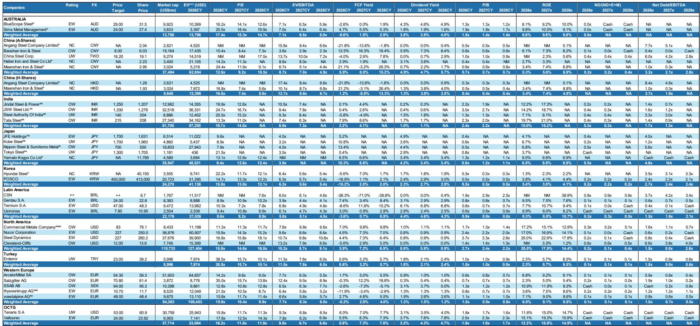
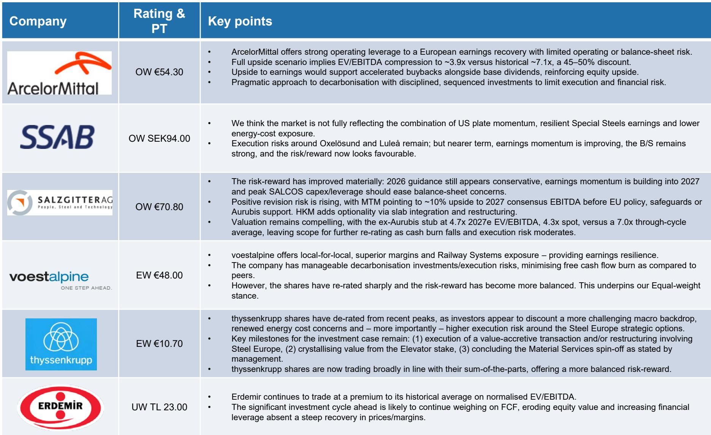
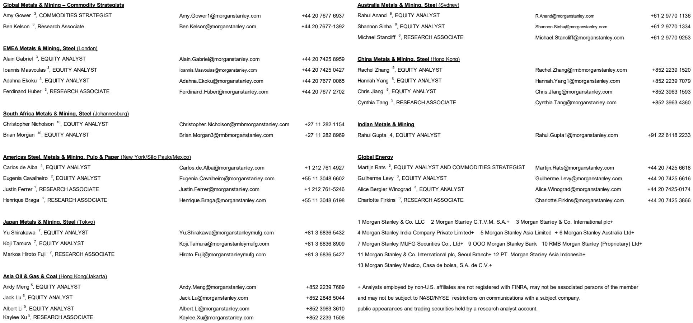

# 欧洲钢铁业正在经历一场被低估的供给侧重定价

欧洲钢铁市场正在发生一个被多数投资者低估的结构性转折。这不是一个周期性的需求回暖故事，而是一套由政策驱动的供给侧框架正在从根本上改写进口平价、利润池分配和资产定价逻辑。

某外资投行最新发布的欧洲钢铁行业研报指出，欧盟新钢贸政策将进口配额较2024年水平削减约47%，超出配额的关税税率提升至50%，并计划从2026年7月起实施。与此同时，碳边境调节机制也将在2026年进入正式执行阶段，对进口钢材的碳合规成本施加更大压力。这些政策叠加在一起，意味着欧洲钢铁利润池正在向本土钢厂迁移，而市场对这一结构性变化的定价远未完成。

报告的核心判断是：欧洲钢铁股的风险回报比已经显著改善，但投资者仍在使用旧框架来评估新格局。以下是我们从这份报告中提炼出的五个关键洞察，以及一个尚未被充分回答的问题。

## 1. 政策组合拳正在重塑进口平价，而非仅仅提高关税

市场通常将欧盟钢贸政策理解为“加关税”，但报告揭示的机制远比关税复杂。进口配额削减47%叠加50%的额外关税，本质上是将进口钢材的成本底线系统性抬高。这意味着欧洲本土钢厂不再需要与全球边际产能竞争定价，而是可以基于新的进口平价来设定售价。

更重要的是，碳边境调节机制的执行进一步挤压了低成本地区对欧洲出口的经济性。碳合规成本正在成为进口钢材的一项固定附加成本，且这一成本会随碳价上升而递增。对于依赖高炉工艺的海外钢厂而言，这一成本结构的变化是永久性的，而非周期性的。

报告明确指出，这些措施共同支持了欧洲本土钢价，并带来了对市场一致预期的盈利上调空间。但这里需要强调的是：市场对“价格支持”的认知仍然停留在短期政策刺激层面，而报告的逻辑指向的是一个更长期的利润池再分配——从海外进口商转向欧洲本土产能。

## 2. 利润池迁移的核心受益者是拥有本地资产和运营灵活性的综合钢厂

政策变化的赢家并非所有欧洲钢厂，而是那些能够在新的定价环境下实现产能利用率和盈利杠杆双提升的企业。报告特别指出，拥有本地资产、装运灵活性和高运营杠杆的综合碳钢企业将是这一轮利润池迁移的最大受益者。

安赛乐米塔尔被列为最受偏好的碳钢标的。报告认为，该公司对欧洲盈利复苏具有强劲的运营杠杆，同时运营和资产负债表风险有限。其上行情景下的企业价值对息税折旧摊销前利润倍数压缩至约3.9倍，而历史周期均值约为7.1倍，这意味着45%-50%的折价。报告还指出，盈利上行将支持公司在基础股息之外加速股票回购，进一步强化股权回报。

瑞典钢铁公司也被列为超配评级。报告认为市场尚未充分反映美国钢板业务动能、特种钢盈利韧性以及能源成本敞口下降这三者的组合效应。尽管奥克瑟勒松德和吕勒奥的产能转型仍存在执行风险，但近期的盈利动能正在改善。

这里的关键判断是：市场对欧洲钢企的估值折价，部分源于对需求端的悲观预期，但报告暗示，如果供给侧政策能够持续支撑价格和利用率，即使需求不出现显著复苏，钢企的盈利中枢也可能上移至高于市场预期的水平。

## 3. 不锈钢板块同样受益于政策红利，但传导机制不同

不锈钢与碳钢面临的政策驱动力并不完全相同，但报告对不锈钢板块同样持建设性展望。欧盟不锈钢价差今年以来已经扩大，主要得益于政策支持、进口显著回落——碳边境调节机制和预期中的保障措施是主要推手。美国不锈钢价差也在需求部分恢复的背景下走阔。

奥珀姆被列为最受偏好的不锈钢标的。报告指出，该公司业务模式多元化，涵盖巴西、回收和增值产品业务，这为其盈利韧性提供了支撑。更重要的是，其欧洲不锈钢业务当前产能利用率仅为65%，这意味着一旦欧洲需求出现任何边际改善，其盈利弹性将相当显著。

阿塞里诺克斯同样被超配。报告认为该公司拥有美国业务和合金业务带来的盈利韧性，通过收购海恩斯合金公司实现了美国扩张和合金业务增长，尽管去杠杆限制了未来两年的股东回报，但估值相对于自身历史水平和合金同行仍然具有吸引力。

这里值得注意的一个微妙判断是：不锈钢的盈利驱动因素中，政策对进口的抑制效果比碳钢更为直接，因为不锈钢的进口来源更为集中，且碳边境调节机制对其成本结构的影响更为明显。但报告也暗示，不锈钢需求端的复苏信号仍不明确，这一点与碳钢类似。

## 4. 估值折价仍在，但盈利上修风险正在积累

报告提供了多个维度的估值信号。欧洲钢铁指数相对于欧洲市场的市净率长期处于折价状态，2024年10月曾跌至0.30倍的极端低位，而目前已回升至约0.58倍。但即使如此，这一水平仍显著低于2010年代中期的0.50-0.80倍区间。

报告还指出，沙士基达的估值仍具吸引力，其扣除奥鲁比斯持股后的核心业务在2027年预期企业价值对息税折旧摊销前利润倍数仅为4.7倍，而周期均值约为7.0倍。报告认为，随着现金消耗下降和执行风险缓和，估值修复空间仍然存在。

对于蒂森克虏伯，报告指出其股价已从近期高点回落，投资者似乎正在折价计入更严峻的宏观环境、能源成本担忧以及钢欧洲业务战略选项的执行风险。但报告也暗示，如果钢欧洲业务能够实现价值增值的交易或重组，电梯业务持股能够兑现价值，以及材料服务业务按计划分拆，那么投资案例仍存在多个关键催化节点。

整体而言，报告传递的信号是：市场对欧洲钢企的盈利预期可能仍然保守，尤其是在2026-2027年政策效果逐步显现之后，盈利上修的概率正在上升，但市场尚未对此充分定价。

## 5. 报告尚未完全回答的关键问题：需求侧能否配合供给侧的重构

报告最值得注意的克制之处在于，它并未对欧洲钢铁需求给出乐观判断。从图表数据来看，德国建筑许可、欧洲建筑业采购经理人指数和建筑业信心指标均处于低位，尚未出现明确的复苏信号。全球钢铁产量增速也在放缓，2020-2025年的复合年增长率仅为1.1%，远低于2000-2010年的5.4%。

这意味着，当前投资逻辑的核心假设是：供给侧政策足以在需求疲软的环境下支撑钢价和钢厂盈利。这一假设并非没有先例，但需要回答一个关键问题：如果欧洲经济进一步放缓，尤其是建筑业和汽车业这两个钢铁消费大户同时承压，政策对进口的抑制能否完全对冲需求下滑的冲击？

报告对此并未给出明确结论，而是将这一问题的答案留给了时间和数据的验证。这也构成了投资者需要持续跟踪的核心变量：一旦需求端出现超预期下行，当前基于供给侧重构的估值逻辑就需要重新校准。

## 6. 投资者需要建立的观察框架：从跟踪钢价转向跟踪政策执行和利润池迁移

基于报告的框架，投资者可能需要调整传统的钢铁行业观察方式。过去，市场关注的焦点是钢价、开工率和需求指标。但在新的政策环境下，以下几个维度可能更为关键：

第一，政策执行节奏。进口配额削减和碳边境调节机制的落地时间表、执行力度以及潜在的行业豁免条款，将直接影响进口平价的实际抬升幅度。2026年7月的政策生效日期是一个关键的催化剂节点。

第二，利润池迁移的速度。报告的核心主张是利润正在从进口商转向本土钢厂，但这一迁移的速度取决于本土产能的利用率提升幅度。如果欧洲钢厂无法在政策窗口期内提高产能利用率，那么利润增量可能被固定成本摊薄而非转化为盈利。

第三，企业层面的资本配置纪律。报告指出，盈利上行将支持股票回购，但不同企业的资本配置策略差异显著。那些能够在盈利复苏期坚持纪律性资本配置的企业，将获得更持续的估值修复。

第四，碳成本曲线的变化。碳边境调节机制不仅影响进口钢，也影响欧洲本土钢厂的竞争力结构。拥有更低碳强度产能的企业，将在碳成本上升的环境中拥有更持久的竞争优势。

这些观察维度共同指向一个结论：欧洲钢铁投资不再是一个简单的周期交易，而是一个需要深入理解政策、成本和竞争格局的结构性主题。

## 未解问题的延续：欢迎继续讨论

上述框架中最不确定的变量，仍然是需求侧能否在2026-2027年出现边际改善。报告提供的数据显示，德国机械订单和建筑许可在2025-2026年出现了一些企稳信号，但这一企稳是否可持续，以及是否足以支撑钢价在当前水平之上进一步走强，仍需更多数据验证。

此外，碳边境调节机制对贸易流的二阶影响尚未完全显现。进口减少是否会导致全球其他市场出现过剩产能的再配置，进而压低非欧洲市场的钢价，这一问题报告没有展开讨论，但对拥有全球业务的企业而言，这可能是不可忽视的风险。

这些未解问题恰恰是深入理解这份报告价值的关键。我们将在知识星球微信群里继续讨论这些议题，包括政策执行路径的情景分析、各企业盈利弹性的量化比较，以及欧洲钢铁股在不同需求假设下的估值区间测算。欢迎有兴趣的读者加入我们的讨论。

Personal reading notes and learning share only. Not investment advice.

