June 1, 2026 03:50 AM GMT

# The Oil Manual

# How Fast Can Middle East Production Return?

We adjust our modelling assumptions for re-opening of the Strait as well as the path of production recovery. Our base case calls for a tight 3Q with further inventory draws ahead. Brent prices may have fallen but we stick to our 2Q/3Q Brent forecasts and raise our 4Q/1Q estimates modestly.

# Key Takeaways

We move our modelling assumption for inflection in Strait of Hormuz oil exports to late July, from end-May before   
In addition, we fine-tune our estimate for production recovery post-Hormuz opening slightly, from 70% recovery over 3 months, to 75% recovery over 4 months   
- Their combined effect is a Brent market that remains broadly as tight in 3Q as it was in 2Q with further inventory draws ahead   
Large US oil exports and low imports into China have shielded the rest of the oil market, but whether this can last throughout 3Q is uncertain   
Inflation-adjusted, Brent has fallen to its 20-year median, pricing in a clean and near-term recovery; from here, however, risks appears skewed to the upside

Exhibit 1: In inflation-adjusted terms, the current Brent price sits precisely at the 50th percentile of the price distribution over the last 20 years - the most-common price despite the most-unusual supply disruption   
Inflation-adjusted Brent oil price   
Expressed by their percentile since 2007   
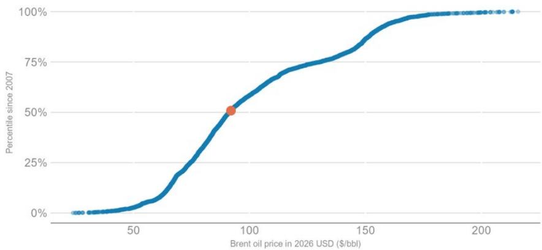

line

| Brent oil price in 2026 USD ($/bbl) | Percentile since 2007 |
| ----------------------------------- | ---------------------- |
| 0                                   | 0%                     |
| 50                                  | ~10%                   |
| 100                                 | 50%                    |
| 150                                 | ~80%                   |
| 200                                 | ~100%                  |
| 250                                 | ~100%                  |

Source: Bloomberg, MS

MS & CO. INTERNATIONAL PLC+

# Martijn Rats, CFA

Equity Analyst and Commodities Strategist

Martijn.Rats@morganstanley.com +44 20 7425-6618

# Charlotte Firkins

Commodities Strategist

Charlotte.Firkins@morganstanley.com +44 20 7425-3866

# Amy Gower (Amy Sergeant), CFA

Commodities Strategist

Amy.Gower1@morganstanley.com +44 20 7677-6937

Exhibit 2: We revise our Brent price forecasts for 4Q and 1Q27 modestly higher   
Dated Brent price forecasts 

<table><tr><td>($/bbl)</td><td>2Q26</td><td>3Q26</td><td>4Q26</td><td>1H27</td><td>2H27</td></tr><tr><td>New</td><td>110.0</td><td>100.0</td><td>95.0</td><td>85.0</td><td>80.0</td></tr><tr><td>Previous</td><td>110.0</td><td>100.0</td><td>90.0</td><td>80.0</td><td>80.0</td></tr><tr><td>Change</td><td>0.0</td><td>0.0</td><td>5.0</td><td>5.0</td><td>0.0</td></tr></table>

Source: MS

# Previous research:

- The Oil Manual: SPR Tracker: How Much Has Been Released? What's Next? (28 May 2026)   
- The Oil Manual: Why is the Price of Oil Not Higher? (11 May 2026)   
- The Oil Manual: US Gasoline: Tight Balance; Fair Value For Now (4 May 2026)   
- The Oil Manual: Schrodinger's Strait (27 Apr 2026)   
- The Oil Manual: Hormuz Closure – Six Weeks In: Where Do We Stand? (13 Apr 2026)   
- The Oil Manual: 'Paper' vs 'Physical' Oil - A Short Primer (7 Apr 2026)   
- The Oil Manual: Strait of Hormuz - Physical Air Pocket Arriving Now (30 Mar 2026)   
- The Oil Manual: Strait of Hormuz: Air Pocket (16 Mar 2026)

MS does and seeks to do business with companies covered in MS. As a result, investors should be aware that the firm may have a conflict of interest that could affect the objectivity of MS. Investors should consider MS as only a single factor in making their investment decision.

# For analyst certification and other important disclosures, refer to the Disclosure Section, located at the end of this report.

+= Analysts employed by non-U.S. affiliates are not registered with FINRA, may not be associated persons of the member and may not be subject to FINRA restrictions on communications with a subject company, public appearances and trading securities held by a research analyst account.

- The Oil Manual: Iran Scenarios - Updated (2 Mar 2026)   
• The Oil Manual: Iran Scenarios (23 Feb 2026)

# How Fast Can Middle East Production Recover?

# The puzzle, again

In recent days, the front-month Brent future has fallen to about \$92 a barrel. The most intriguing feature of that number is how unremarkable it is. Adjust the past twenty years of Brent prices for inflation, and today's level sits exactly at the 50th percentile of the distribution — i.e. today's price is the historic median.

It is neither an exaggeration nor hyperbole that the current supply shock is the largest in history, and yet, it has produced a price that is, statistically, the most ordinary of the last two decades. It is barely above the \~\$80 'mode' of this historical distribution (i.e. the price that, in real terms, has occurred most frequently) toward which we eventually expect prices to converge once the disruption has cleared.

When we last wrote, in Why is the Price of Oil Not Higher? (11 May), we set out why prices had risen far less than the scale of the shock implied: the market entered the conflict with substantial buffers, it has persistently expected an imminent reopening of the Strait, and the US's high exports and China's low imports have shielded the rest of the oil market. Three weeks on, the question has, if anything, sharpened — because the price has not risen. It has fallen, from \~\$104 at the time of our last note to \~\$92 today.

More telling than the level is the shape of the curve, and how much further it has flattened since we published on 11 May. The front-week Brent CFD — the clearest read on prompt physical tightness — has more than halved over those three weeks, from \$5.7/bbl to \$2.6, while the M1–M2 spread has fallen from \$3.8/bbl to under \$1. In other words, since our last note the market has not merely remained sanguine about a resolution — it has grown more so, increasingly pricing a clean and near-term return of supply across the whole curve.

From current levels, we think that is too optimistic. We previously modelled the Strait to re-open from end-May onwards, but move this assumption to late June. On top of that, we allow for another few weeks for mine clearing, confidence building and other issues, putting the moment where exports start to inflect higher only by late July. As a result, the tightness ahead is likely deeper and more drawn-out than we initially expected, and also than the curve implies. On that timeframe, the mechanisms by which the oil market has absorbed the supply shock may become challenged.

On that basis we are holding our forecasts for Dated Brent at \$100 in 3Q but make modest upwards revisions for 4Q (from \$90 to \$95) and 1Q27 (from \$80 to \$85), still expecting convergence to \$80 thereafter. With spot at \$92, an unchanged near-term forecast is itself a constructive call: we cannot forecast the precise date of the Hormuz re-opening either, but from here, risks to oil prices have a positive skew, in our view.

The remainder of this note sets out the case. We explain why we now expect the Strait to reopen later than the market assumes; why the production recovery will be slow and backloaded, and the rationale for our recovery path; the buffers that have absorbed the shock and why they are now fraying.

Exhibit 3: Crude oil production from the Middle East remains under pressure...   
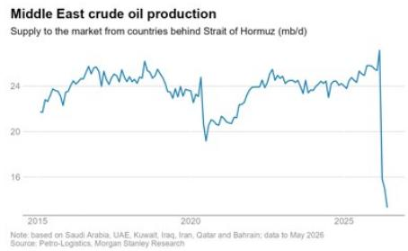

line

| Year | Middle East crude oil production (mb/d) |
| ---- | --------------------------------------- |
| 2015 | 23.0                                    |
| 2020 | 19.0                                    |
| 2025 | 24.0                                    |

Exhibit 4: ....and the same is the case for exports from the region   
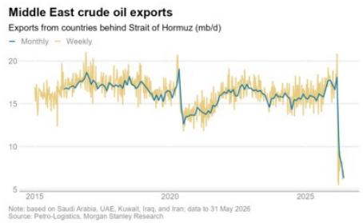

line

| Year | Monthly (mb/d) | Weekly (mb/d) |
|------|----------------|---------------|
| 2015 | ~17            | ~17           |
| 2020 | ~14            | ~18           |
| 2025 | ~17            | ~19           |

Exhibit 5: The number of daily tanker transits via the Strait remains a fractions of its historic level   
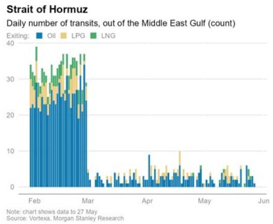

bar_stacked

Strait of Hormuz
| Month | Oil | LPG | LNG |
|---|---|---|---|
| Feb | 22 | 5 | 10 |
| Mar | 24 | 6 | 8 |
| Apr | 9 | 3 | 0 |
| May | 3 | 5 | 0 |
| Jun | 1 | 0 | 0 |

# Delaying our assumption for re-opening of the Strait

In our previous work we assumed the Strait of Hormuz would remain effectively closed through end-May, with flows beginning to recover from around 1 June. We are pushing that assumption back: we now expect exports to begin recovering meaningfully only from the second half of July.

Throughout this conflict the recovery has consistently been "weeks away", but those weeks have — equally consistently — failed to arrive. An early-April ceasefire announcement, the mid-April peace-talk headlines and the 4 May escort proposal each, at the moment of release, made an imminent reopening look plausible; each proved premature.

The last two weeks have shown the same dynamic: on 25 May newswires described a deal to reopen the Strait as "largely negotiated", and Brent fell about 4%; however, within 24 hours US forces had struck Iranian missile sites and Washington and Tehran were reported "still apart"; by 28 May the White House mentioned a "possible" — but unsigned — deal; and by 29 May the agreement was again "elusive". Over the same two weeks front-month Brent traded from \$112 to \$96, back to \$100, and down below \$92.

The delay in our modelling assumption from 'end May' to 'late July' splits in two parts: first, we recognise that at the time of writing there is no agreement or MOU yet between the US and Iran on peace negotiations. How much longer this takes is uncertain but for modelling purposes we assume a few more weeks. Second, we allow another few weeks for mine clearing and commercial confidence amongst ship owners to rebuild. That puts a meaningful pick-up in flows only from the second half of July. However, we would stress that this is the central case of an admittedly wide distribution.

# After an agreement, several bottlenecks and obstacles need to be overcome

Data from Rystad Energy suggests that roughly 11 mb/d of Gulf crude remains offline — close to half the region's pre-conflict output. A crucial point, however, is that nearly all of this is because storage facilities have filled up, not destroyed capacity. The losses are concentrated in Saudi Arabia (\~3.8 mb/d), Iraq (\~2.9) and Kuwait (\~1.9), with the UAE (\~1.2), Iran (\~0.8) and Qatar (\~0.6) making up the rest, according to Rystad. Restarting this production is not necessarily difficult, but it does take time. We highlight the following bottlenecks:

Exhibit 6: In a slow trickly, nearly 30% of the peak crude volume that was on tankers west-of-Hormuz has sailed out by now   
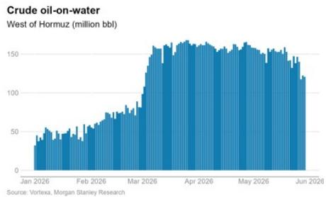

bar

| Month     | West of Hormuz (million bbl) |
| --------- | ---------------------------- |
| Jan 2026  | ~30                          |
| Feb 2026  | ~40                          |
| Mar 2026  | ~80                          |
| Apr 2026  | ~150                         |
| May 2026  | ~140                         |
| Jun 2026  | ~120                         |

Exhibit 7: On our new assumption, the cumulative supply loss vs a flat pre-conflict production would be 2.6 bn bbl in 2026   
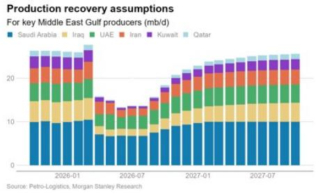

bar_stacked

Production recovery assumptions
| Date | Saudi Arabia (mb/d) | Iraq (mb/d) | UAE (mb/d) | Iran (mb/d) | Kuwait (mb/d) | Qatar (mb/d) |
|---|---|---|---|---|---|---|
| 2026-01 | 10 | 4 | 5 | 3 | 2 | 1 |
| 2026-07 | 7 | 2 | 3 | 1 | 1 | 1 |
| 2027-01 | 9 | 3 | 4 | 2 | 1 | 1 |
| 2027-07 | 10 | 3 | 4 | 2 | 1 | 1 |

1. Security, insurance and mine clearing: The first hurdle to overcome is for shipowners and insurance providers to regain confidence that the Strait is genuinely safe to navigate again. In itself, the announcement of a ceasefire extension is not necessarily sufficient for that. The market needs evidence that attacks, tolling, or interdictions will not resume. As part of this, the area needs to be cleared from sea mines. As long as sea mines are believed to be in place in the traditional shipping lanes, the capacity of the Strait is much reduced, even if it's technically 'open'. The time it takes for the area to be cleared for mines is uncertain but likely in the order of weeks to several months.   
2. Tanker backlog and vessel misallocation: Then, tankers are in the wrong place. Over the last few months, idle ships that couldn't find work in the area, ballasted to the US Gulf, West Africa, Brazil, etc, often creating an oversupply there. On its 1Q26 earnings call, Aramco's CEO called this "the biggest issue", adding that "even in the most optimistic scenario, the energy and commodity supply chains will need several months to return to their pre-conflict traffic, as vessels reroute or avoid being idle". There are a number of 'empties' parked just outside the Gulf, so some initial cargoes could move quickly. However, a full and sustained restoration of tanker flows probably also needs a number of months.   
3. Storage/ullage inside the Gulf: Oilfields cannot restart as long as export storage is full. This is especially important for countries without meaningful export capacity via pipelines, such as Iraq and Kuwait, whose seaborne exports have practically fallen to zero by now. For those, the number of empty tankers transiting into the Gulf is critical to the restart of oil production.   
4. Field restarts: The difficulty of restarting fields depends on the length of the closure. Rystad estimates roughly 10,000 of the \~36,000 wells that were active before the closure across the six Gulf producers are currently offline. The number that struggles to return scales with shut-in duration, they argue: about 2,800 wells face restart constraints after a two-month shut-in, \~4,100 after four months and more than 5,000 after six, according to Rystad. Our own H2-July reopening assumption implies a shut-in of roughly 4½–5 months, which would put the relevant number of wells toward 4,000–5,000 wells.

The issue is that with injection halted, reservoir pressure often bleeds away; wellbores cool, precipitating wax and asphaltenes that plug tubing; corrosion and artificial-lift failures (ESP motors, gas-lift valves) set in after extended idle; and flowlines must be cleaned, integrity-tested and phased back into service.

These effects are largely reversible, but they cost time and money, and recovery is likely to be uneven across fields. Conventional, natural-drive fields restart with little more than wellbore clean-up, but some of the managed-pressure giants that depend on continuous water or gas injection (e.g. Kuwait's Burgan as well as the large offshore fields of Qatar, the UAE and Saudi Arabia) must rebuild pressure support before rates recover; and mature, high-water-cut systems (e.g. Iraq's Rumaila as well as some Iranian fields) are the most intervention-intensive and may be left shut in selectively. On a recent earnings call, Halliburton warned that "the longer things are shut in, the more complex they are to bring back on."

5. Damaged infrastructure: Physical damage to infrastructure is concentrated downstream in refining as well as export/storage terminals, not crude oil production. According to Rystad data, 15 refineries were struck with aggregate capacity of 4.3 mb/d.

Of this total, \~2.5 mb/d is still disrupted. Repairing this likely takes 2–3 quarters, implying full normalisation by 1Q 2027 at the earliest. This is an obstacle to the recovery of refined product exports — still 5 mb/d of the pre-conflict 20 mb/d exports via the Strait of Hormuz — although it should not hold back the crude exports/production recovery.

6. Oilfield service, crews and rigs: Restarting requires people and kit. OFS companies demobilized staff, suspended travel and rerouted logistics during the conflict. Bringing back crews and equipment takes time. Expats have largely withdrawn from Kuwait and Iraq, which lean most heavily on international providers for drilling, completions and artificial lift.

Exhibit 8:   
Indicative timeline for oil-flow recovery after a credible reopening of the Strait of Hormuz   
Phases are sequential but overlap; timing is indicative, measured from a credible reopening (Day 0), and slips if reopening is delayed. 

<table><tr><td>Phase</td><td>Likely timing</td><td>What has to happen</td><td>Main constraint</td></tr><tr><td>0. Political / security trigger</td><td>Day 0 to several days</td><td>Credible ceasefire, no-interference commitment, safe lanes, insurers willing to write war-risk cover</td><td>Credibility, insurance, mine risk</td></tr><tr><td>1. Initial maritime restart</td><td>Days to 2 weeks in best case; longer if convoyed</td><td>Allow already-laden tankers out, start controlled inbound ballast movements</td><td>Mine clearance, convoy limits, shipowner confidence</td></tr><tr><td>2. Shipping stabilization</td><td>~4-8 weeks</td><td>Clear stranded ships, restore normal loading windows, rebalance VLCC/product tanker positions</td><td>Tanker backlog, war-risk premiums, port readiness</td></tr><tr><td>3. Storage / ullage relief</td><td>Weeks 4-9</td><td>Empty onshore tanks and floating storage enough to let fields and refineries raise runs</td><td>Need empty tankers inside Gulf; full tanks constrain upstream</td></tr><tr><td>4. Field restart and production ramp</td><td>Months 2-4 for major recovery; longer for hard fields</td><td>Restart curtailed/shut-in wells, restore injection, workovers, safety checks, re-crew rigs</td><td>Shut-in duration, reservoir complexity, OFS availability</td></tr><tr><td>5. Export-flow normalization</td><td>Q4 2026 to Q1 2027</td><td>Restore grade mix, loading reliability, buyer confidence, destination flows</td><td>Heavy-grade losses, Iraq/Kuwait lag, tanker repositioning</td></tr><tr><td>6. Full market normalization</td><td>Q1/Q2 2027+, with LNG/refining possibly later</td><td>Repair damaged refining/LNG/petrochemical assets; rebuild strategic/commercial inventories</td><td>Infrastructure damage, inventory deficits, altered trade routes</td></tr></table>

Source: MS

# Updated production forecasts shows continued deficit

Given these bottlenecks, we model a two-speed recovery: we estimate that production will rebound quicker in Saudi Arabia and the UAE, but take longer in Iraq, Kuwait and Qatar. The majority of production can come back within several months — we estimate 75% of lost supply to be back within 4 months after flows via the Strait resume. On our estimates, that would be by November. Thereafter, the recovery likely slows, with the remaining 25% taking until well into 2027.

This tightens our near-term balances significantly. Our previous assumption had export flows via the Strait resuming from late May/early June onwards. On that basis, our global liquids balance showed an implied balance of -0.3 mb/d during 3Q 2026. On our new assumptions, we now estimate a deficit of -4.5 mb/d in 3Q.

If correct, this may have important consequences. In a previous Oil Manual, we addressed the question why oil prices are not higher given the supply shock has been so severe. In summary, we highlighted four reasons:

1. The oil market had large buffers at the start of the conflict: The oil market was in surplus, inventories were elevated and oil-on-water was elevated   
2. Re-opening of the Strait has been 'around the corner' at any moment: The front-month Brent future hedges exposure to the price of oil delivered the month-after-next, i.e. oil that is delivered, on average, 8 weeks into the future. At any point in the last three months, it seemed likely that the Strait would be open in 8 weeks.   
3. A very large increase in US net oil exports: Across crude oil and refined products, seaborne net exports from the US have increased from \~5 to \~9 mb/d, significantly helped by a release from strategic reserves.   
4. An unusually large decline in net oil imports into China: Seaborne net oil imports into China have fallen from \~13 mb/d this time last year, to just \~7.5 mb/d over the last 30 days.

Exhibit 9: Net seaborne oil exports from the US are still trending higher...   
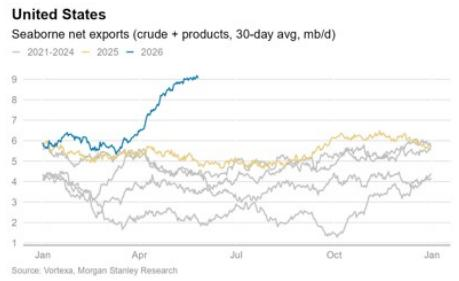

line

| Month | 2021-2024 | 2025 | 2026 |
|-------|-----------|------|------|
| Jan   | ~4.5      | ~5.5 | ~6.0 |
| Apr   | ~3.0      | ~5.0 | ~7.0 |
| Jul   | ~3.5      | ~5.5 | ~8.5 |
| Oct   | ~4.0      | ~6.0 | ~9.0 |
| Jan   | ~4.5      | ~6.0 | ~6.0 |

Exhibit 10: ...whilst net seaborne imports into China are still declining   
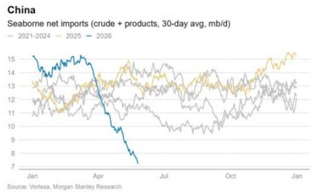

line

| Month | 2021-2024 | 2025 | 2026 |
|-------|-----------|------|------|
| Jan   | ~13.5     | ~13.5 | ~15.0 |
| Apr   | ~12.0     | ~14.0 | ~9.0  |
| Jul   | ~11.5     | ~13.5 | ~7.0  |
| Oct   | ~12.5     | ~14.5 | ~13.0 |
| Jan   | ~13.0     | ~15.0 | ~13.5 |

In the best-case scenario, oil exports via the Strait resume soon, say in the next few weeks, and the production recovery in the region is rapid, quicker than we outlined above. In that case, the call on US exports can disappear and China can revert to its usual level of imports, and the oil market would still gradually loosen. The most-common inflation-adjusted oil price of the last 20 years is \$80/b, which we would see as an anchor in the oil market. In this scenario, Dated Brent could revert back to this price relatively swiftly.

Exhibit 11: On current trends, the global SPR release falls sharply in July   
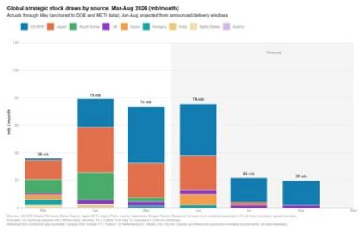

bar_stacked

Global strategic stock draws by source, Mar-Aug 2020 (millionmonth)
| Month | SAIC (mb/month) | Japan (mb/month) | South Korea (mb/month) | Other (mb/month) | India (mb/month) | Brazil (mb/month) | Australia (mb/month) |
|---|---|---|---|---|---|---|---|
| Jan | 38 | 15 | 10 | 5 | 2 | 1 | 0 |
| Feb | 79 | 30 | 15 | 5 | 2 | 1 | 0 |
| Mar | 74 | 25 | 10 | 5 | 2 | 1 | 0 |
| Apr | 74 | 25 | 10 | 5 | 2 | 1 | 0 |
| May | 74 | 25 | 10 | 5 | 2 | 1 | 0 |
| Jun | 22 | 5 | 2 | 1 | 1 | 0 | 0 |
| Jul | 22 | 5 | 1 | 1 | 1 | 0 | 0 |
| Aug | 22 | 5 | 1 | 1 | 1 | 0 | 0 |
Actual through May (anchored to DOE and METI data). Jun-Aug projected from announced delivery windows
Personal
Source: OECD Securities Journal, National Association, USA, USA Latin America, China, China International Bank, China Life Insurance Company, Japan, Japan Insurance Company, India, India & China, Brazil, Mexico, Brazil-China Pakistan, Russia, Russia, Brazil, Brazil-China Pakistan, Brazil-China Bangladesh, Brazil-China Malaysia, Brazil-China Indonesia, Brazil-China Malaysia, Brazil-China Malaysia, Brazil-China Malaysia, Brazil-China Malaysia, Brazil-China Malaysia, Brazil-China Malaysia, Brazil-China Malaysia, Brazil-China Malaysia, Brazil-China Malaysia, Brazil-China Malaysia, Brazil-China Malaysia, Brazil-China Malaysia, Brazil-China Malaysia, Brazil-China Malaysia, Brazil-China Malaysia, Brazil-China Malaysia, Brazil-China Malaysia, Brazil-China Malaysia, Brazil-China Malaysia, Brazil-China Malaysia, Brazil-China Malaysia, Brazil-China Malaysia, Brazil-China Malaysia, Brazil-China Malaysia, Brazil-China Malaysia, Brazil-China Malaysian States, Brazil-China Malaysia States, Brazil-China Malaysia States, Brazil-China Malaysia States, Brazil-China Malaysia States, Brazil-China Malaysia States, Brazil-China Malaysia States, Brazil-China Malaysia States, Brazil-China Malaysia States, Brazil-China Malaysia States, Brazil-China Malaysia States, Brazil-China Malaysia States, Brazil-China Malaysia States, Brazil-China Malaysia States, Brazil-China Malaysia States, Brazil-China Malaysia States, Brazil-China Malaysia States, Brazil-China Malaysia States, Brazil-China Malaysia States, Brazil-China Malaysia States, Brazil-China Malaysia States, Brazil-China Malaysian States, Brazil-China Malaysian States, Brazil-China Malaysian States, Brazil-China Malaysian States, Brazil-China Malaysian States, Brazil-China Malaysian States, Brazil-China Malaysian States, Brazil-China Malaysian States, Brazil-China Malaysian States, Brazil-China Malaysian States, Brazil-China Malaysian States, Brazil-China Malaysian States, Brazil-China Malaysian States, Brazil-China Malaysian States, Brazil-China Malaysian States, Brazil-China Malaysian States, Brazil-China Malaysian States, Brazil-China Malaysian States, Brazil-China Malaysian States, Brazil-China Malaysian States, Brazil-China Malaysia States, Brazil-China Malaysia States, Brazil-China Malaysia States, Brazil-China Malaysia States, Brazil-China Malaysia States, Brazil-China Malaysia States, Brazil-China Malaysia States, Brazil-China Malaysia States, Brazil-China Malaysia States, Brazil-China Malaysia States, Brazil-China Malaysia States, Brazil-China Malaysia States, Brazil-China Malaysia States, Brazil-China Malaysia States, Brazil-China Malaysia States, Brazil-China Malaysia States, Brazil-China Malaysia States, Brazil-China Malaysia States, Brazil-China Malaysia S.A.S., Brazil-China Malaysia S.A.S., Brazil-China Malaysia S.A.S., Brazil-China Malaysia S.A.S., Brazil-China Malaysia S.A.S., Brazil-China Malaysia S.A.S., Brazil-China Malaysia S.A.S., Brazil-China Malaysia S.A.S., Brazil-China Malaysia S.A.S., Brazil-China Malaysia S.A.S., Brazil-China Malaysia S.A.S., Brazil-China Malaysia S.A.S., Brazil-China Malaysia S.A.S., Brazil-China Malaysia S.A.S., Brazil-China Malaysia S.A.S., Brazil-Japan S.A.S., Brazil-Japan Malaysia S.A.S., Brazil-Japan Malaysia S.A.S., Brazil-Japan Malaysia S.A.S., Brazil-Japan Malaysia S.A.S., Brazil-Japan Malaysia S.A.S., Brazil-Japan Malaysia S.A.S., Brazil-Japan Malaysia S.A.S., Brazil-Japan Malaysia S.A.S., Brazil-Japan Malaysia S.A.S., Brazil-Japan Malaysia S.A.S., Brazil-Japan Malaysia S.A.S., Brazil-Japan Malaysia S.A.S., Brazil-Japan Malaysia S.A.S%, Brazil-Japan Malaysia S.A.S%, Brazil-Japan Malaysia S.A.S%, Brazil-Japan Malaysia S.A.S%, Brazil-Japan Malaysia S.A.S%, Brazil-Japan Malaysia S.A.S%, Brazil-Japan Malaysia S.A.S%, Brazil-Japan Malaysia S.A.S%, Brazil-Japan Malaysia S.A.S%, Brazil-Japan Malaysia S.A.S%, Brazil-Japan Malaysia S.A.S%, Brazil-Japan Malaysia S.A.S%, Brazil-Japan Malaysia S.A.S%, Brazil-Japan Malaysian States,S.A.S%,Brazil-Japan Malaysian States,S.A.S%,Brazil-Japan Malaysian States,S.A.S%,Brazil-Japan Malaysian States,S.A.S%,Brazil-Japan Malaysian States,S.A.S%,Brazil-Japan Malaysian States,S.A.S%,Brazil-Japan Malaysian States,S.A.S%,Brazil-Japan Malaysian States,S.A.S%,Brazil-Japan Malaysian States,S.A.S%,Brazil-Japan Malaysian States,S.A.S%,Brazil-Japan Malaysian States,S.A.S%,Brazil-Japan Malaysian States,S.A.S%,Brazil-Indian American Indian Indian Indian Indian Indian Indian Indian Indian Indian Indian Indian Indian Indian Indian Indian Indian Indian Indian Indian Indian Indian Indian Indian Indian Indian Indian Indian Indian Indian Indian Indian Indian Indian Indian Indian Indian Indian Indian Indian Indian Indian Indian Indian Indian Indian Indian Indian Indian Indian Indian Indian Indian Indian Indian Indian Indian Indian Indian Indian Indian Indian Indian Indian Indian Indian Indian Indian Indian Indian Indian Indian Indian Indian Indian Indian Indian Indian Indian Indian Indian Indian Indian Indian Indian Indian Indian Indian Indian Indian Indian Indian Indian Indian Indian Indian Indian Indian Indian Indian Indian Industrial Indian Indian Indian Indian Indian Indian Indian Indian Indian Indian Indian Indian Indian Indian Indian Indian Indian Indian Indian Indian Indian Indian Indian Indian Indian Indian Indian Indian Indian Indian Indian Indian Indian Indian Indian Indian Indian Indian Indian Indian Indian Indian Indian Indian Indian Indian Indian Indian Indian Indian Indian Indian Indian Indian Indian Indian Indian Indian Indian Indian Indian Indian Indian Indian Indian Indian Indian Indian Indian Indian Indian Indian Indian Indian Indian Indian Indian Indian Indian Indian Indian Indian Indian Indian Indian Indian Indian Indian Indian Indian Indian Indian Indian Indian Indian Indian Indian Indian Indian/Indian/Indian/Indian/Indian/Indian/Indian/Indian/Indian/Indian/Indian/Indian/Indian/Indian/Indian/Indian/Indian/Indian/Indian/Indian/Indian/Indian/Indian/Indian/Indian/Indian/Indian/Indian/Indian/Indian/Indian/Indian/Indian/Indian/Indian/Indian/Indian/
Actuals through May (anchored to DOE and METI data). Jun-Aug projected from announced delivery windows
| Month | SAIC (mb/month) | Japan (mb/month) | South Korea (mb/month) | Other (mb/month) | India (mb/month) | India (mb/month) | India (mb/month) |
|---|---|---|---|---|---|---|---|
| Jan | 38 | 15 | 10 | 5 | 2 | 1 | 0 |
| Feb | 79 | 30 | 15 | 5 | 2 | 1 | 0 |
| Mar | 74 | 25 | 10 | 5 | 2 | 10 | 0 |
| Apr | 74 | 25 | 10 | 5 | 2 | 10 | 0 |
| May | 74 | 25 | 10 | 5 | 2 | 10 | 0 |
| Jun | 22 | 5 | 2 | 1 | 1 | 1 | 0 |
| Jul | - | - | - | - | - | - | - |
| Aug | - | - | - | - | - | - | - |
| Sep | - | - | - | - | - | - | - |
| Oct | - | - | - | - | - | - | - |
| Nov | - | - | - | - | - | - | - |
| Dec | - | - | - | - | - | - | - |
| Jan-Oct-End-End-End-End-End-End-End-End-End-End-End-End-End-End-End-End-End-End-End-End-End-End-End-End-End-End-End-End-End-End-End-End-End-End-End-End-End-End-End-End-End-End-End-End-End-End-End-End-End-End-Start-End-End-End-End-End-End-End-End-End-End-End-End-End-End-End-End-End-End-End-End-End-End-End-End-End-End-End-End-End-End-End-End-End-End-End-End-End-End-End-End-End-End-End-End-End-End-End-End-End-Offending Date: March; April; May; June; July; August; September; October; November; December; December; December; December; December; December; December; December; December; December; December; December; December; December; December; December; December; December; December; December; December; December; December; December; December; December; December; December; December; December; December; December; December; December; December; December; December; December; December; December; December; December; December; December; December; December; December; December; December; December; Dec.; December; Dec.; December; Dec.; December; Dec.; December; Dec.; December; Dec.; December; Dec.; December; Dec.; December; Dec.; December; Dec.; December; Dec.; December; Dec.; December; Dec.; December; Dec.; Dec.; Dec.; Dec.; Dec.; Dec.; Dec.; Dec.; Dec.; Dec.; Dec.; Dec.; Dec.; Dec.; Dec.; Dec.; Dec.; Dec.; Dec.; Dec.; Dec.; Dec.; Dec.; Dec.; Dec.; Dec.; Dec.; Dec.; Dec.; Dec.; Dec.; Dec.; Dec.; Dec.; Dec.; Dec.; Dec.; Dec.; Dec.; Dec.; Dec.; Dec.; Dec.; Dec.; Dec.; Dec.; Dec.; Dec.; Dec.; Dec.; Dec./Dec./Dec./Dec./Dec./Dec./Dec./Dec./Dec./Dec./Dec./Dec./Dec./Dec./Dec./Dec./Dec./Dec./Dec./Dec./Dec./Dec./Dec./Dec./Dec./Dec./Dec./Dec./Dec./Dec./Dec./Dec./Dec./Dec./Dec./Dec./Dec./Dec./Dec./Dec./Dec./Dec./Dec./Dec./Dec./Dec./Dec./Dec./Dec./Dec./Dec./Nov.<lcel><lcel><lcel><lcel><lcel><lcel><lcel><lcel><nl>

However, if our base case assumptions play out, the balance in the market looks different:

- First, in our recent note on global SPRs, we highlighted that on current schedules, SPR releases are set to decline from \~2.5 mb/d in April-to-June to just \~0.7 mb/d in July and August. If the Strait is not re-opened by the time of this 'SPR cliff', the market would likely tighten meaningfully.   
- Second, oil inventories in the US have been falling significantly. Both diesel and gasoline inventories are already well below 5-year seasonal lows, and on current trajectory, are likely to test minimum operational requirements later this summer. At some point, US exports of crude and refined product may need to fall to better supply the domestic market. However, that would subsequently tighten oil markets elsewhere. If this point is reached before flows via Hormuz have restarted meaningfully, the Brent market would tighten again as well.

Exhibit 12: US gasoline inventories are unusually low and falling rapidly...   
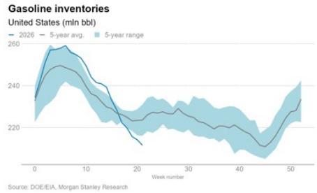

line

| Week number | 2026 | 5-year avg. | 5-year range |
| ----------- | ---- | ----------- | ------------ |
| 0           | 230  | 230         | 230-260      |
| 5           | 260  | 245         | 240-270      |
| 10          | 250  | 235         | 230-260      |
| 15          | 230  | 225         | 220-240      |
| 20          | 210  | 220         | 215-230      |
| 25          | 220  | 225         | 220-240      |
| 30          | 230  | 230         | 225-240      |
| 35          | 240  | 235         | 230-245      |
| 40          | 230  | 230         | 225-240      |
| 45          | 210  | 215         | 210-230      |
| 50          | 240  | 235         | 230-245      |

Exhibit 13: ...and the same is the case for US distillate inventories   
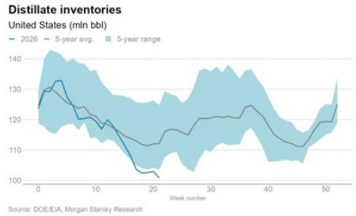

line

| Week number | 2026 | 5-year avg. | 5-year range |
| ----------- | ---- | ----------- | ------------ |
| 0           | 128  | 130         | 135          |
| 5           | 132  | 134         | 138          |
| 10          | 125  | 128         | 132          |
| 15          | 118  | 122         | 128          |
| 20          | 105  | 115         | 120          |
| 25          | 108  | 118         | 125          |
| 30          | 110  | 120         | 130          |
| 35          | 112  | 122         | 132          |
| 40          | 115  | 124         | 135          |
| 45          | 118  | 126         | 138          |
| 50          | 120  | 128         | 140          |
| 55          | 125  | 130         | 145          |

Third, China has locked-in an unusually low amount of crude in recent months. This can be seen in Exhibit 14 which shows cumulative crude oil purchase deals that Chinese companies have closed, plotted by delivery month (outside term agreements, i.e. spot deals only). As shown, deals for delivery in June and July are still unusually low, and even August is off to a slow start. By now, this implies five consecutive months of low imports (i.e. Apr–Aug), and with that, likely sustained inventory draws. However, there is a meaningful probability, in our view, that Chinese crude buyers may return to market for the September-delivery cycle in order to stem inventory declines. Buying for September delivery typically starts in mid/late June. If the Strait opens soon, this can happen without tightening the market. However, if that prospect continues to slip, this too provides an upside risk.

Exhibit 14: Spot crude supply deals into China have been running at unusually low levels for April and May delivery, and are also still very low for Jun-Aug. However, after 5 months, the probability is building that Chinese buyers return to the market for the September-delivery period, for which buying begins in mid-late June.

# China crude deals tracking

Known crude supply agreements, relative to last day of delivery month (mb/d)

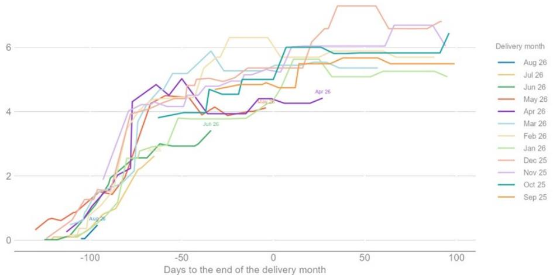

line

| Days to the end of the delivery month | Aug 26 | Jul 26 | Jun 26 | May 26 | Apr 26 | Mar 26 | Feb 26 | Jan 26 | Dec 25 | Nov 25 | Oct 25 | Sep 25 |
| -------------------------------------- | ------ | ------ | ------ | ------ | ------ | ------ | ------ | ------ | ------ | ------ | ------ | ------ |
| -100                                   | 0.0    | 0.0    | 0.0    | 0.0    | 0.0    | 0.0    | 0.0    | 0.0    | 0.0    | 0.0    | 0.0    | 0.0    |
| -50                                    | 4.0    | 4.5    | 3.0    | 4.0    | 4.5    | 5.0    | 4.5    | 4.0    | 4.5    | 4.5    | 4.5    | 4.5    |
| 0                                      | 4.5    | 5.0    | 3.5    | 4.5    | 4.5    | 5.5    | 5.0    | 4.5    | 5.5    | 5.5    | 5.5    | 5.5    |
| 50                                     | 5.0    | 5.5    | 4.0    | 5.0    | 4.5    | 6.0    | 5.5    | 5.0    | 6.0    | 6.0    | 6.0    | 6.0    |
| 100                                    | 5.5    | 6.0    | 4.5    | 5.5    | 4.5    | 6.5    | 6.0    | 5.5    | 6.5    | 6.5    | 6.5    | 6.5    |

Source: Argus, MS

As mentioned at the start of this note, the front-month Brent future has already fallen back to its median inflation-adjusted price of the last 20 years. By now, it appears to price in a rapid-and-smooth reopening of the Strait. That may happen — these events are hard to forecast. However, the operational and logistical bottlenecks still only imply a gradual resumption of production, suggesting the oil market will remain in deficit for several months to come. Over that period, the mechanisms by which the market has absorbed the current shock may not sustain.

After 3Q, we model the market to return to balance in 4Q and still a modest surplus in 2027, albeit with structurally lower inventories. This combination likely prevents a 'blow out' in prices but should nevertheless be sufficient to drive Brent futures higher again from here. With that, we stick to our current Brent forecast for 2Q and 3Q, and add modestly to our 4Q and 1Q27 forecast — see Exhibit 2.

# Supply/demand balance

Exhibit 15:   
Total oil liquids 

<table><tr><td></td><td>2025</td><td>1Q26</td><td>2Q26</td><td>3Q26</td><td>4Q26</td><td>2026</td><td>1Q27</td><td>2Q27</td><td>3Q27</td><td>4Q27</td><td>2027</td><td>&#x27;25-26</td><td>&#x27;26-27</td><td></td></tr><tr><td>Demand</td><td>104.9</td><td>104.6</td><td>101.0</td><td>103.8</td><td>105.5</td><td>103.7</td><td>104.9</td><td>105.3</td><td>106.6</td><td>107.5</td><td>106.1</td><td>-</td><td>1.2</td><td>2.3</td></tr><tr><td>OECD</td><td>45.9</td><td>45.7</td><td>44.7</td><td>45.9</td><td>45.8</td><td>45.5</td><td>45.3</td><td>45.5</td><td>46.2</td><td>46.1</td><td>45.8</td><td>-</td><td>0.3</td><td>0.2</td></tr><tr><td>Non-OECD</td><td>59.0</td><td>59.0</td><td>56.3</td><td>57.9</td><td>59.7</td><td>58.2</td><td>59.6</td><td>59.8</td><td>60.4</td><td>61.3</td><td>60.3</td><td>-</td><td>0.9</td><td>2.1</td></tr><tr><td>Non-OPEC supply</td><td>72.2</td><td>71.7</td><td>72.0</td><td>73.3</td><td>73.6</td><td>72.7</td><td>73.9</td><td>74.2</td><td>74.6</td><td>75.1</td><td>74.5</td><td></td><td>0.5</td><td>1.8</td></tr><tr><td>United States C+C</td><td>13.6</td><td>13.6</td><td>14.0</td><td>13.9</td><td>14.0</td><td>13.9</td><td>14.1</td><td>14.2</td><td>14.1</td><td>14.2</td><td>14.2</td><td></td><td>0.3</td><td>0.3</td></tr><tr><td>FSU C+C</td><td>10.3</td><td>10.0</td><td>10.0</td><td>10.3</td><td>10.3</td><td>10.2</td><td>10.3</td><td>10.2</td><td>10.2</td><td>10.2</td><td>10.2</td><td>-</td><td>0.1</td><td>0.1</td></tr><tr><td>Other</td><td>48.3</td><td>48.1</td><td>48.0</td><td>49.1</td><td>49.3</td><td>48.6</td><td>49.6</td><td>49.8</td><td>50.3</td><td>50.7</td><td>50.1</td><td></td><td>0.3</td><td>1.5</td></tr><tr><td>OPEC NGLs and condensate</td><td>5.5</td><td>5.2</td><td>3.7</td><td>4.7</td><td>5.1</td><td>4.7</td><td>5.2</td><td>5.2</td><td>5.2</td><td>5.2</td><td>5.2</td><td>-</td><td>0.9</td><td>0.5</td></tr><tr><td>Call on OPEC crude</td><td>27.2</td><td>27.7</td><td>25.4</td><td>25.8</td><td>26.8</td><td>26.4</td><td>25.8</td><td>25.9</td><td>26.8</td><td>27.2</td><td>26.4</td><td>-</td><td>0.8</td><td>0.0</td></tr><tr><td>OPEC crude</td><td>29.6</td><td>27.4</td><td>19.6</td><td>21.2</td><td>26.8</td><td>23.7</td><td>28.9</td><td>29.6</td><td>30.1</td><td>30.4</td><td>29.7</td><td>-</td><td>5.9</td><td>6.0</td></tr><tr><td>Implied balance</td><td>2.4</td><td>0.4</td><td>5.8</td><td>4.5</td><td>0.0</td><td>2.7</td><td>3.1</td><td>3.8</td><td>3.2</td><td>3.2</td><td>3.3</td><td>-</td><td>5.1</td><td>6.0</td></tr><tr><td>Misc to bal</td><td>1.2</td><td>0.9</td><td>3.3</td><td>1.8</td><td>0.0</td><td>1.0</td><td>1.3</td><td>1.5</td><td>1.3</td><td>1.3</td><td>1.4</td><td></td><td>2.2</td><td>2.4</td></tr><tr><td>Observed stock change</td><td>1.2</td><td>1.3</td><td>2.4</td><td>2.8</td><td>0.0</td><td>1.6</td><td>1.8</td><td>2.2</td><td>1.9</td><td>1.9</td><td>2.0</td><td>-</td><td>2.8</td><td>3.6</td></tr><tr><td colspan="15">of which:</td></tr><tr><td>SPR (IEA members)</td><td>0.0</td><td>0.1</td><td>2.0</td><td>1.0</td><td>-</td><td>0.8</td><td>0.5</td><td>0.5</td><td>0.5</td><td>0.5</td><td>0.5</td><td>-</td><td>0.8</td><td>1.3</td></tr><tr><td>China</td><td>0.3</td><td>0.6</td><td>0.0</td><td>-</td><td>-</td><td>0.1</td><td>0.3</td><td>0.3</td><td>0.3</td><td>0.3</td><td>0.3</td><td>-</td><td>0.2</td><td>0.2</td></tr><tr><td>Other non-OECD</td><td>0.1</td><td>0.2</td><td>-</td><td>-</td><td>-</td><td>0.1</td><td>0.3</td><td>0.3</td><td>0.3</td><td>0.3</td><td>0.3</td><td>-</td><td>0.1</td><td>0.2</td></tr><tr><td>Commercial OECD</td><td>0.1</td><td>0.1</td><td>0.2</td><td>1.8</td><td>0.0</td><td>0.4</td><td>0.7</td><td>1.1</td><td>0.8</td><td>0.8</td><td>0.9</td><td>-</td><td>0.6</td><td>1.3</td></tr><tr><td>Oil-on-water</td><td>0.6</td><td>1.9</td><td>0.6</td><td>-</td><td>-</td><td>0.6</td><td>-</td><td>-</td><td>-</td><td>-</td><td>-</td><td>-</td><td>1.2</td><td>0.6</td></tr></table>

Crude + condensate only 

<table><tr><td></td><td>2025</td><td>1Q26</td><td>2Q26</td><td>3Q26</td><td>4Q26</td><td>2026</td><td>1Q27</td><td>2Q27</td><td>3Q27</td><td>4Q27</td><td>2027</td><td>&#x27;25-26</td><td>&#x27;26-27</td></tr><tr><td>Runs</td><td>84.2</td><td>83.4</td><td>78.6</td><td>83.3</td><td>84.4</td><td>82.4</td><td>84.8</td><td>84.6</td><td>85.4</td><td>85.2</td><td>85.0</td><td>-</td><td>1.7</td></tr><tr><td>West of Suez</td><td>43.3</td><td>42.8</td><td>42.9</td><td>43.9</td><td>43.1</td><td>43.2</td><td>42.8</td><td>43.0</td><td>43.8</td><td>43.1</td><td>43.2</td><td>-</td><td>0.1</td></tr><tr><td>East of Suez</td><td>40.9</td><td>40.6</td><td>35.7</td><td>39.3</td><td>41.3</td><td>39.2</td><td>42.1</td><td>41.6</td><td>41.7</td><td>42.1</td><td>41.9</td><td>-</td><td>1.6</td></tr><tr><td>Direct use</td><td>0.9</td><td>0.7</td><td>0.9</td><td>0.9</td><td>0.6</td><td>0.8</td><td>0.6</td><td>0.8</td><td>0.9</td><td>0.6</td><td>0.7</td><td>-</td><td>0.1</td></tr><tr><td>Non-OPEC C+C supply</td><td>54.6</td><td>54.5</td><td>54.5</td><td>55.1</td><td>55.6</td><td>54.9</td><td>56.1</td><td>56.0</td><td>56.2</td><td>56.7</td><td>56.2</td><td>-</td><td>0.3</td></tr><tr><td>United States</td><td>13.6</td><td>13.6</td><td>14.0</td><td>13.9</td><td>14.0</td><td>13.9</td><td>14.1</td><td>14.2</td><td>14.1</td><td>14.2</td><td>14.2</td><td>-</td><td>0.3</td></tr><tr><td>Other</td><td>41.1</td><td>40.9</td><td>40.5</td><td>41.2</td><td>41.6</td><td>41.0</td><td>42.0</td><td>41.8</td><td>42.0</td><td>42.5</td><td>42.1</td><td>-</td><td>0.0</td></tr><tr><td>OPEC</td><td>31.6</td><td>29.2</td><td>20.9</td><td>22.8</td><td>28.5</td><td>25.4</td><td>30.6</td><td>31.4</td><td>31.8</td><td>32.1</td><td>31.5</td><td>-</td><td>6.3</td></tr><tr><td>Crude</td><td>29.6</td><td>27.4</td><td>19.6</td><td>21.2</td><td>26.8</td><td>23.7</td><td>28.9</td><td>29.6</td><td>30.1</td><td>30.4</td><td>29.7</td><td>-</td><td>5.9</td></tr><tr><td>Condensate</td><td>2.0</td><td>1.8</td><td>1.3</td><td>1.6</td><td>1.7</td><td>1.6</td><td>1.7</td><td>1.7</td><td>1.7</td><td>1.7</td><td>1.7</td><td>-</td><td>0.4</td></tr><tr><td>Implied stock change</td><td>1.2</td><td>-</td><td>0.5</td><td>-</td><td>6.2</td><td>-</td><td>0.8</td><td>-</td><td>2.9</td><td>1.3</td><td>2.0</td><td>1.6</td><td>3.0</td></tr><tr><td colspan="14">Dated Brent forecasts</td></tr><tr><td>Base</td><td>69.1</td><td>75.7</td><td>110</td><td>100</td><td>95</td><td>95</td><td>85</td><td>80</td><td>80</td><td>80</td><td>81</td><td></td><td></td></tr><tr><td>Bull</td><td>69.1</td><td>75.7</td><td>150</td><td>150</td><td>150</td><td>150</td><td>150</td><td>150</td><td>150</td><td>150</td><td>150</td><td></td><td></td></tr><tr><td>Bear</td><td>69.1</td><td>75.7</td><td>80</td><td>75</td><td>70</td><td>80</td><td>65</td><td>65</td><td>65</td><td>65</td><td>66</td><td></td><td></td></tr><tr><td colspan="14">WTI</td></tr><tr><td>Base</td><td>64.7</td><td>71.4</td><td>102</td><td>94</td><td>90</td><td>90</td><td>80</td><td>75</td><td>75</td><td>75</td><td>76</td><td></td><td></td></tr><tr><td>Bull</td><td>64.7</td><td>71.4</td><td>145</td><td>145</td><td>145</td><td>145</td><td>145</td><td>145</td><td>145</td><td>145</td><td>145</td><td></td><td></td></tr><tr><td>Bear</td><td>64.7</td><td>71.4</td><td>76</td><td>71</td><td>66</td><td>76</td><td>61</td><td>61</td><td>61</td><td>61</td><td>62</td><td></td><td></td></tr></table>

Source: Argus, IEA, EIA/DOE, Vortexa, S&P Global Energy, Petro-Logistics, Rystad Energy, MS

# Key market indicators

# Exhibit 16:

Global oil prices   
Latest value as per 30 May 2026 

<table><tr><td rowspan="2">Instrument</td><td colspan="4">Change</td><td rowspan="2">Last 1m</td><td rowspan="2">1Y low</td><td rowspan="2">1Y range</td><td rowspan="2">1Y high</td><td rowspan="2">Rationale for including</td></tr><tr><td>Latest</td><td>1 wk</td><td>4 wk</td><td>Unit</td></tr><tr><td colspan="10">Global benchmarks</td></tr><tr><td>ICE Brent M1 future (Aug)</td><td>92.0</td><td>-11.5</td><td>-16.2</td><td>$/bbl</td><td></td><td>58.9</td><td></td><td>118.3</td><td>Global crude benchmark; anchor for Atlantic pricing</td></tr><tr><td>NYMEX WTI M1 future (Jul)</td><td>87.4</td><td>-9.2</td><td>-14.5</td><td>$/bbl</td><td></td><td>55.3</td><td></td><td>113.0</td><td>US marginal barrel; key global risk benchmark</td></tr><tr><td>Dubai M+2 swap</td><td>103.7</td><td>-0.3</td><td>-8.5</td><td>$/bbl</td><td></td><td>58.2</td><td></td><td>169.8</td><td>Asia sour benchmark; core signal for Middle East flows</td></tr><tr><td colspan="10">Term structure</td></tr><tr><td>ICE Brent future M1-M2 (Aug/Sep)</td><td>0.93</td><td>-2.4</td><td>-5.3</td><td>$/bbl</td><td></td><td>-0.39</td><td></td><td>14.38</td><td>Prompt tightness/storage signal in Brent complex</td></tr><tr><td>ICE Brent future M2-M3 (Sep/Oct)</td><td>2.0</td><td>-1.6</td><td>-3.0</td><td>$/bbl</td><td></td><td>0.0</td><td></td><td>8.0</td><td>Cleaner structure signal when M1 rolls/noisy</td></tr><tr><td>NYMEX futures M1-M2 (Jul/Aug)</td><td>2.1</td><td>-1.4</td><td>-3.3</td><td>$/bbl</td><td></td><td>0.0</td><td></td><td>13.9</td><td>US prompt balance signal; inventories &amp; pipeline pull</td></tr><tr><td>NYMEX futures M2-M3 (Aug/Sep)</td><td>2.1</td><td>-1.4</td><td>-2.9</td><td>$/bbl</td><td></td><td>0.0</td><td></td><td>8.6</td><td>Back-end prompt signal; reduces expiry distortion</td></tr><tr><td>Dubai swap M1-M2</td><td>3.1</td><td>-0.2</td><td>-2.0</td><td>$/bbl</td><td></td><td>-0.1</td><td></td><td>14.2</td><td>Asia prompt balance; sour crude tightness indicator</td></tr><tr><td>Dubai swap M2-M3</td><td>1.6</td><td>-1.0</td><td>-3.3</td><td>$/bbl</td><td></td><td>-0.1</td><td></td><td>6.1</td><td>Structure beyond front; filters front-month noise</td></tr><tr><td colspan="10">North Sea</td></tr><tr><td>Dated Brent</td><td>93.6</td><td>-13.7</td><td>-24.4</td><td>$/bbl</td><td></td><td>60.2</td><td></td><td>144.4</td><td>Physical spot benchmark; sets Atlantic Basin crude value</td></tr><tr><td>Brent DFL (M1)</td><td>2.3</td><td>-1.4</td><td>-5.3</td><td>$/bbl</td><td></td><td>-0.7</td><td></td><td>13.8</td><td>Bridge between Dated and futures; spot vs paper alignment</td></tr><tr><td>Brent CFD (Week 1)</td><td>2.6</td><td>-2.1</td><td>-11.5</td><td>$/bbl</td><td></td><td>-1.2</td><td></td><td>43.9</td><td>Very prompt NS tightness; near-term cargo availability</td></tr><tr><td>Forties vs Dated Brent strip</td><td>1.8</td><td>-1.1</td><td>-4.8</td><td>$/bbl</td><td></td><td>-1.1</td><td></td><td>21.2</td><td>Marginal sour North Sea grade; barometer for basin length</td></tr><tr><td>Ekofisk vs Dated Brent strip</td><td>3.8</td><td>-0.6</td><td>-2.5</td><td>$/bbl</td><td></td><td>0.6</td><td></td><td>22.6</td><td>Sweet premium proxy; refinery demand for light/sweet yield</td></tr><tr><td>J. Sverdrup vs Dated Brent strip</td><td>2.1</td><td>-0.1</td><td>-0.4</td><td>$/bbl</td><td></td><td>-2.9</td><td></td><td>16.7</td><td>Medium sour NS value; competes with ME grades</td></tr><tr><td colspan="10">United States</td></tr><tr><td>WTI Cushing M1 (cash)</td><td>87.4</td><td>-13.2</td><td>-14.6</td><td>$/bbl</td><td></td><td>55.3</td><td></td><td>113.0</td><td>Physical WTI anchor at Cushing; pipeline hub clearing price</td></tr><tr><td>WTI Midland vs WTI Cushing</td><td>1.0</td><td>1.4</td><td>-2.1</td><td>$/bbl</td><td></td><td>-0.3</td><td></td><td>4.5</td><td>Permian takeaway stress signal; pipes vs production growth</td></tr><tr><td>WTI MEH vs WTI Cushing</td><td>1.1</td><td>1.5</td><td>-3.1</td><td>$/bbl</td><td></td><td>-0.3</td><td></td><td>7.8</td><td>Export outlet premium/discount; USGC pull vs inland</td></tr><tr><td>WCS Hardisty vs WTI Cushing CMA</td><td>-13.1</td><td>0.5</td><td>3.2</td><td>$/bbl</td><td></td><td>-16.9</td><td></td><td>-8.8</td><td>Heavy-light &amp; Canada logistics; refinery margin barometer</td></tr><tr><td>WTI-Brent spread</td><td>-4.7</td><td>2.2</td><td>6.9</td><td>$/bbl</td><td></td><td>-17.0</td><td></td><td>0.5</td><td>Key east-west arb signal; drives US export economics</td></tr><tr><td colspan="10">Middle East</td></tr><tr><td>Brent-Dubai EFS (M1)</td><td>6.8</td><td>-3.9</td><td>-8.3</td><td>$/bbl</td><td></td><td>-0.3</td><td></td><td>18.5</td><td>Atlantic vs Asia arb; key driver of Brent vs Dubai relative value</td></tr><tr><td>Cash Dubai premium</td><td>18.0</td><td>7.8</td><td>10.8</td><td>$/bbl</td><td></td><td>-0.6</td><td></td><td>65.7</td><td>Spot tightness vs swaps; immediate OSP pressure signal</td></tr><tr><td>Oman vs Dubai (M1)</td><td>18.0</td><td>7.8</td><td>10.8</td><td>$/bbl</td><td></td><td>-0.3</td><td></td><td>65.7</td><td>ME benchmark for China; complements Dubai for sour/light</td></tr><tr><td>Murban Quality Premium</td><td>0.00</td><td>0.0</td><td>0.0</td><td>$/bbl</td><td></td><td>-34.54</td><td></td><td>1.11</td><td>Measures Murban&#x27;s quality value vs Dubai benchmark</td></tr><tr><td colspan="10">West Africa</td></tr><tr><td>Kissanje vs Dated Brent strip</td><td>-3.0</td><td>-0.1</td><td>-3.1</td><td>$/bbl</td><td></td><td>-4.9</td><td></td><td>10.1</td><td>China-bound WAF barrel; marginal Atlantic supply signal</td></tr><tr><td>Jubilee vs Dated Brent strip</td><td>-1.5</td><td>0.0</td><td>-2.5</td><td>$/bbl</td><td></td><td>-2.7</td><td></td><td>10.0</td><td>Atlantic sweet clearing level; tracks China/Europe demand</td></tr><tr><td>Hungo vs Dated Brent strip</td><td>-4.6</td><td>-0.1</td><td>-4.4</td><td>$/bbl</td><td></td><td>-6.2</td><td></td><td>11.3</td><td>Medium sweet WAF value; sensitive to China buying swings</td></tr><tr><td>Djeno vs Dated Brent strip</td><td>-6.6</td><td>0.2</td><td>-4.8</td><td>$/bbl</td><td></td><td>-8.2</td><td></td><td>10.6</td><td>Sour WAF grade; key China-bound arb and freight sensitivity</td></tr><tr><td colspan="10">Long-haul arbitrage grades</td></tr><tr><td>WTI FOB USGC vs Dated Brent strip</td><td>-0.77</td><td>2.4</td><td>2.0</td><td>$/bbl</td><td></td><td>-11.03</td><td></td><td>1.99</td><td>US export competitiveness vs Brent; arb opens/closes</td></tr><tr><td>Guyana Liza vs Dated Brent strip</td><td>-1.4</td><td>0.2</td><td>-3.2</td><td>$/bbl</td><td></td><td>-3.9</td><td></td><td>8.3</td><td>Growth light sweet barrel; clears into China/Europe</td></tr><tr><td>Tupi (Brazil) vs Dated Brent strip</td><td>-1.4</td><td>-0.4</td><td>-0.1</td><td>$/bbl</td><td></td><td>-10.6</td><td></td><td>9.4</td><td>Core Brazil export arb; long-haul pull indicator</td></tr><tr><td>CPC Blend vs Dated Brent strip</td><td>-8.7</td><td>-1.0</td><td>-3.8</td><td>$/bbl</td><td></td><td>-10.4</td><td></td><td>0.0</td><td>Black Sea arb barrel; freight/geopolitics sensitive</td></tr><tr><td colspan="10">Freight</td></tr><tr><td>Platts Global VLCC TCE Index</td><td>274.4</td><td>-4.8</td><td>-10.7</td><td>k$/day</td><td></td><td>18.1</td><td></td><td>519.1</td><td>Single global crude freight gauge; ton-mile weighted signal</td></tr><tr><td>Persian Gulf → China (VLCC)</td><td>75.0</td><td>-1.5</td><td>-3.1</td><td>$/mt</td><td></td><td>9.5</td><td></td><td>124.1</td><td>Main ME→Asia flow cost; drives Dubai/Murban economics</td></tr><tr><td>US Gulf Coast → China (VLCC)</td><td>62.0</td><td>-0.7</td><td>4.6</td><td>$/mt</td><td></td><td>21.9</td><td></td><td>108.5</td><td>Key cost for US exports; links WTI FOB to Asia clearing</td></tr><tr><td>West Africa → China (VLCC)</td><td>42.1</td><td>-2.5</td><td>-2.0</td><td>$/mt</td><td></td><td>16.9</td><td></td><td>95.0</td><td>Cost for China-bound Atlantic grades; clears WAF differentials</td></tr><tr><td colspan="10">Refined products</td></tr><tr><td>Asian Naphtha crack vs Dubai</td><td>-11.1</td><td>-3.1</td><td>-18.8</td><td>$/bbl</td><td></td><td>-11.1</td><td></td><td>27.4</td><td>Petchem demand gauge; Asia light-end support signal</td></tr><tr><td>USGC Gasoline crack vs WTI</td><td>31.8</td><td>-3.7</td><td>-7.3</td><td>$/bbl</td><td></td><td>10.8</td><td></td><td>43.1</td><td>Gasoline margin driver; swing refining runs and crude demand</td></tr><tr><td>Spore Jet crack vs Dubai</td><td>37.1</td><td>-7.6</td><td>-26.1</td><td>$/bbl</td><td></td><td>14.0</td><td></td><td>114.2</td><td>Asia travel demand proxy; middle distillate strength signal</td></tr><tr><td>ICE Gasoil crack vs Brent</td><td>44.4</td><td>-5.1</td><td>-10.7</td><td>$/bbl</td><td></td><td>17.2</td><td></td><td>69.4</td><td>Global distillate benchmark margin; key crude demand driver</td></tr><tr><td>Spore 380 CST FO crack vs Dubai</td><td>7.6</td><td>1.8</td><td>8.0</td><td>$/bbl</td><td></td><td>-9.5</td><td></td><td>14.0</td><td>Residual value signal; heavy sour crude support/drag</td></tr></table>

Source: Argus, Bloomberg, Platts, General Index, MS

# Prices

Exhibit 17:   
Global energy prices compared   
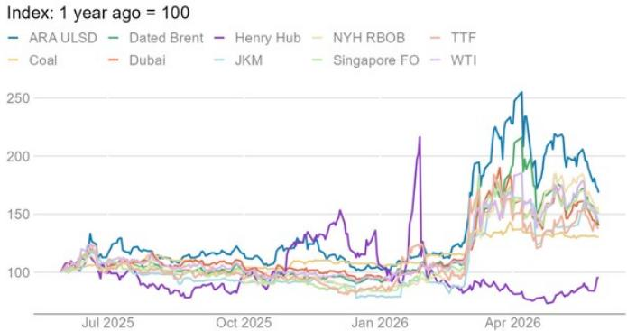

line

| Date       | ARA ULSD | Dated Brent | Henry Hub | NYH RBOB | TTF | Coal | Dubai | JKM | Singapore FO | WTI |
| ---------- | -------- | ----------- | --------- | -------- | --- | ---- | ----- | --- | ------------ | --- |
| Jul 2025   | ~100     | ~100        | ~100      | ~100     | ~100 | ~100 | ~100  | ~100 | ~100         | ~100 |
| Oct 2025   | ~100     | ~100        | ~100      | ~100     | ~100 | ~100 | ~100  | ~100 | ~100         | ~100 |
| Jan 2026   | ~100     | ~100        | ~220      | ~100     | ~100 | ~100 | ~100  | ~100 | ~100         | ~100 |
| Apr 2026   | ~250     | ~250        | ~80       | ~150     | ~150 | ~150 | ~150  | ~150 | ~150         | ~150 |
| End Dec    | ~150     | ~150        | ~90       | ~130     | ~130 | ~130 | ~130  | ~130 | ~130         | ~130 |

Source: Bloomberg, Platts, MS

Exhibit 18:   
Benchmark crude oil prices   
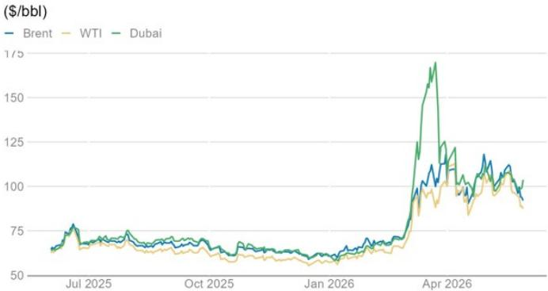

line

| Date     | Brent | WTI  | Dubai |
| -------- | ----- | ---- | ----- |
| Jul 2025 | 75    | 70   | 72    |
| Oct 2025 | 68    | 65   | 67    |
| Jan 2026 | 65    | 60   | 63    |
| Apr 2026 | 110   | 105  | 170   |

Source: Bloomberg, Platts, MS

Exhibit 19:   
Calendar spreads Mo1 vs Mo2   
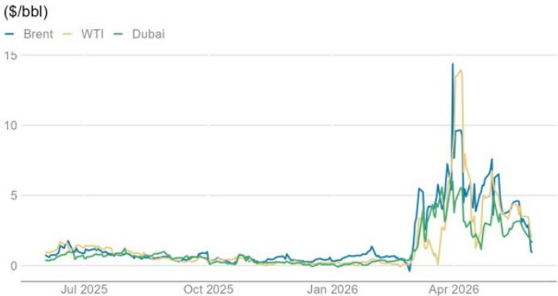

line

| Date     | Brent | WTI  | Dubai |
| -------- | ----- | ---- | ----- |
| Jul 2025 | 1.0   | 1.2  | 0.8   |
| Oct 2025 | 0.5   | 0.6  | 0.4   |
| Jan 2026 | 0.3   | 0.4  | 0.2   |
| Apr 2026 | 14.5  | 13.5 | 13.0  |

Source: Bloomberg, Platts, MS

Exhibit 20:   
Calendar spreads Mo2 vs Mo6   
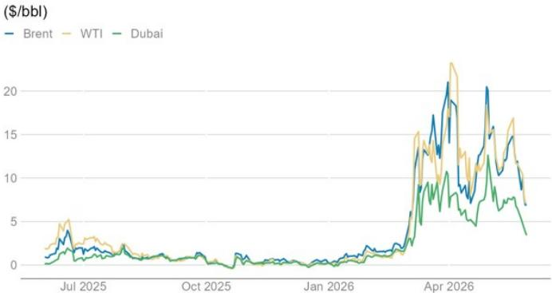

line

| Date     | Brent | WTI  | Dubai |
| -------- | ----- | ---- | ----- |
| Jul 2025 | ~1.5  | ~4.5 | ~1.0  |
| Oct 2025 | ~1.0  | ~1.5 | ~0.5  |
| Jan 2026 | ~1.5  | ~2.0 | ~1.0  |
| Apr 2026 | ~18.0 | ~22.0| ~10.0 |
| Jul 2027 | ~15.0 | ~17.0| ~8.0  |
| Oct 2027 | ~13.0 | ~15.0| ~7.0  |
| Jan 2028 | ~11.0 | ~13.0| ~6.0  |
| Apr 2028 | ~9.0  | ~11.0| ~5.0  |
| Jul 2029 | ~7.0  | ~8.0 | ~4.0  |
| Oct 2029 | ~5.0  | ~6.0 | ~3.0  |
| Jan 2030 | ~3.0  | ~4.0 | ~2.0  |
| Apr 2030 | ~1.0  | ~1.5 | ~1.0  |

Source: Bloomberg, Platts, MS

Exhibit 21:   
WTI/Brent spread   
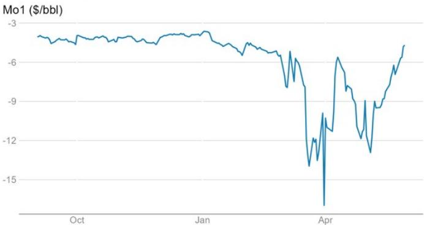

line

| Month | Mo1 ($/bbl) |
|-------|-------------|
| Oct   | -3.0        |
| Jan   | -3.0        |
| Apr   | -15.0       |

Source: Bloomberg, MS

Exhibit 22:   
Brent futures   
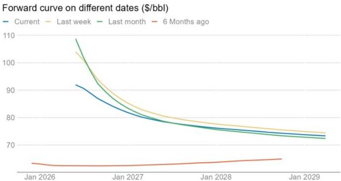

line

| Date     | Current | Last week | Last month | 6 Months ago |
| -------- | ------- | --------- | ---------- | ------------ |
| Jan 2026 | 92      | 105       | 110        | 65           |
| Jan 2027 | 80      | 85        | 88         | 64           |
| Jan 2028 | 75      | 78        | 76         | 65           |
| Jan 2029 | 73      | 75        | 74         | 66           |

Source: Platts, MS

Exhibit 23:   
Brent CFD curve   
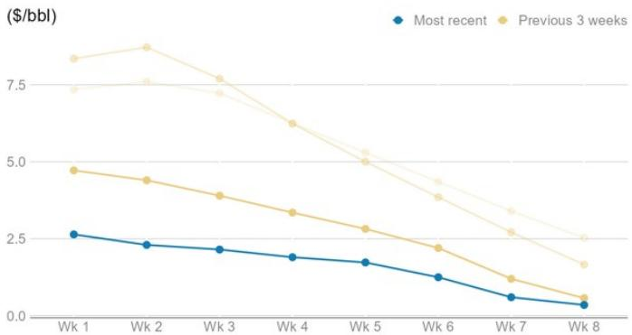

line

| Week | Most recent ($/bbl) | Previous 3 weeks ($/bbl) |
|---|---|---|
| Wk 1 | 2.6 | 7.4 |
| Wk 2 | 2.3 | 7.8 |
| Wk 3 | 2.1 | 7.5 |
| Wk 4 | 1.8 | 6.3 |
| Wk 5 | 1.6 | 5.1 |
| Wk 6 | 1.2 | 4.0 |
| Wk 7 | 0.6 | 2.8 |
| Wk 8 | 0.3 | 1.6 |

Source: S&P Global Platts, MS

Exhibit 24:   
CFD curve structure   
Spread between week 2 and week 6 (\$/bbl)   
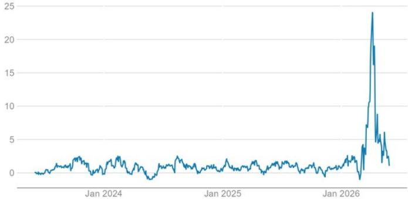

line

| Date       | Value |
| ---------- | ----- |
| Jan 2024   | ~1    |
| Jan 2025   | ~1    |
| Jan 2026   | ~24   |

Source: S&P Global Platts, MS

Exhibit 25:   
Brent DFL curve   
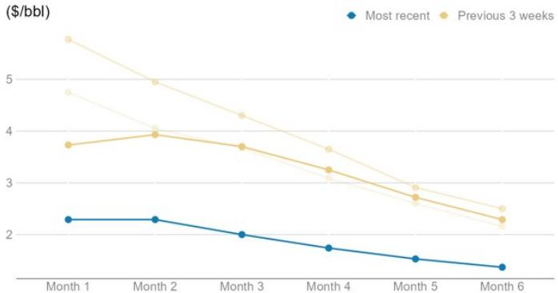

line

| Month | Most recent ($/bbl) | Previous 3 weeks ($/bbl) |
|---|---|---|
| Month 1 | 2.3 | 4.8 |
| Month 2 | 2.3 | 5.0 |
| Month 3 | 2.0 | 4.3 |
| Month 4 | 1.7 | 3.6 |
| Month 5 | 1.5 | 2.9 |
| Month 6 | 1.3 | 2.5 |

Source: S&P Global Platts, MS

Exhibit 26:   
DFL curve structure   
Spread between month 1 and month 6 (\$/bbl)   
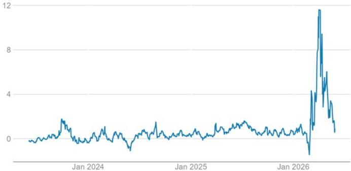

line

| Date       | Value |
| ---------- | ----- |
| Jan 2024   | ~0    |
| Jan 2025   | ~0    |
| Jan 2026   | ~12   |

Source: S&P Global Platts, MS

Exhibit 27:   
Cash Dubai premium   
Platts Cash Dubai vs M2 Dubai swaps spread (\$/bbl)   
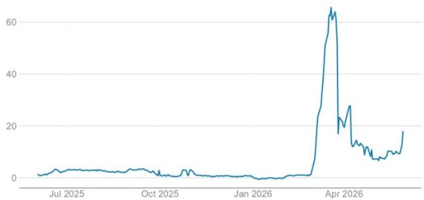

line

| Date       | Value |
| ---------- | ----- |
| Jul 2025   | ~2    |
| Oct 2025   | ~3    |
| Jan 2026   | ~1    |
| Apr 2026   | ~65   |

Source: S&P Global Platts, MS

Exhibit 28:   
Brent/Dubai spread   
(\$/bbl)   
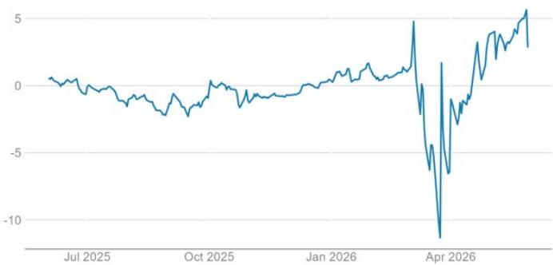

line

| Date     | Value |
| -------- | ----- |
| Jul 2025 | 0.5   |
| Oct 2025 | -1.0  |
| Jan 2026 | 0.8   |
| Apr 2026 | -12.0 |

Source: S&P Global Platts, MS

# Differentials

Exhibit 29:   
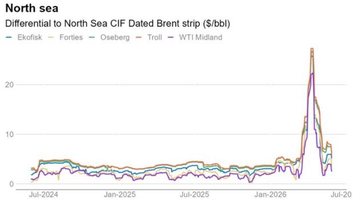

line

| Date     | Ekofisk | Forties | Oseberg | Troll | WTI Midland |
|----------|---------|---------|---------|-------|-------------|
| Jul-20   |         |         |         |       |             |

Source: S&P Global Platts, MS

Exhibit 30:   
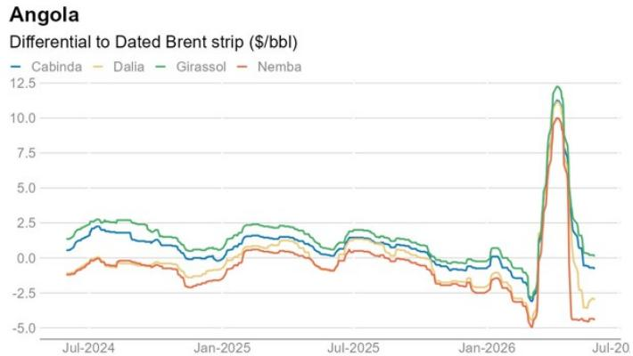

line

| Date     | Cabinda | Dalia | Girassol | Nemba |
|----------|---------|-------|----------|-------|
| Jul-20   | -0.5    | -2.0  | -1.0     | -3.0  |

Source: S&P Global Platts, MS

Exhibit 31:   
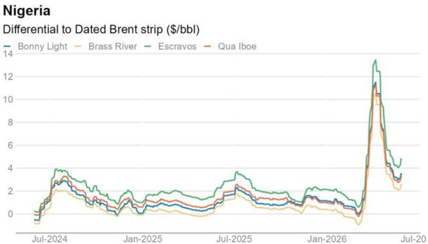

line

| Date     | Bonny Light | Brass River | Escravos | Qua Iboe |
|----------|-------------|-------------|----------|----------|
| Jul-20   | ~3.5        | ~2.5        | ~11.5    | ~10.5    |

Source: S&P Global Platts, MS

Exhibit 32:   
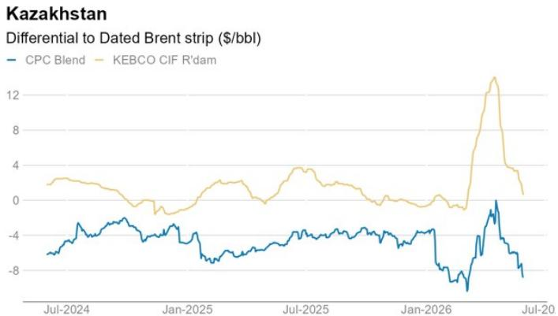

line

| Date     | CPC Blend | KEBCO CIF R'dam |
| -------- | --------- | --------------- |
| Jul-20   | -8.0      | 0.0             |

Source: S&P Global Platts, MS

Exhibit 33:   
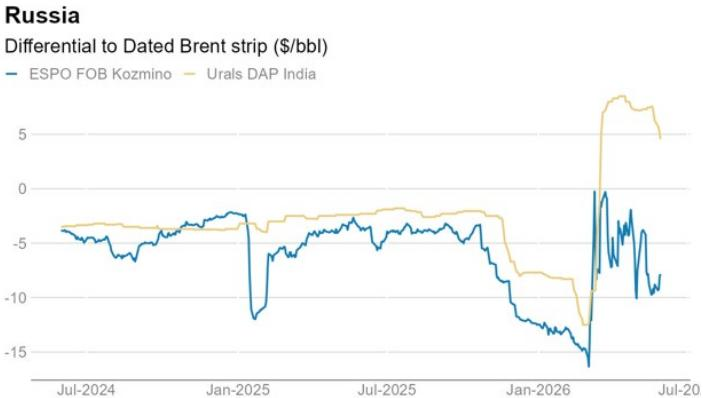

line

| Date     | ESPO FOB Kozmino | Urals DAP India |
| -------- | ---------------- | --------------- |
| Jul-20   | -15              | 5               |

Source: S&P Global Platts, MS

Exhibit 34:   
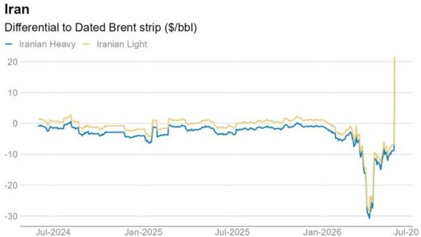

line

| Date     | Iranian Heavy | Iranian Light |
| -------- | ------------- | ------------- |
| Jul-20   | -30           | 20            |

Source: S&P Global Platts, MS

# Crude Quality

Exhibit 35:   
Heavy vs Light   
Premium/(discount) for every 1 degree increase in API Gravity (\$/bbl)   

line

| Year | Value |
|------|-------|
| 2018 | 0.10  |
| 2019 | 0.05  |
| 2020 | -0.30 |
| 2021 | -0.15 |
| 2022 | -0.25 |
| 2023 | -0.10 |
| 2024 | 0.00  |
| 2025 | 0.15  |
| 2026 | 0.35  |

Note: analysis based on weekly regression across 95 seaborne crudes  
Source: Platts, MS

Exhibit 36:   
Sweet vs Sour   
Premium/(discount) for every 1% increase in sulfur content (\$/bbl)   
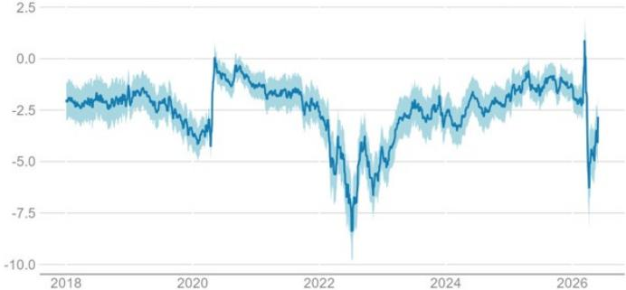

line

| Year | Value |
|------|-------|
| 2018 | -2.5  |
| 2020 | -4.0  |
| 2022 | -9.0  |
| 2024 | -3.0  |
| 2026 | -7.0  |

Note: analysis based on weekly regression across 95 seaborne crudes  
Source: Platts, MS

Exhibit 37:   
East vs West of Suez   
Premium/(discount) for West- over East-of-Suez crudes (\$/bbl)   
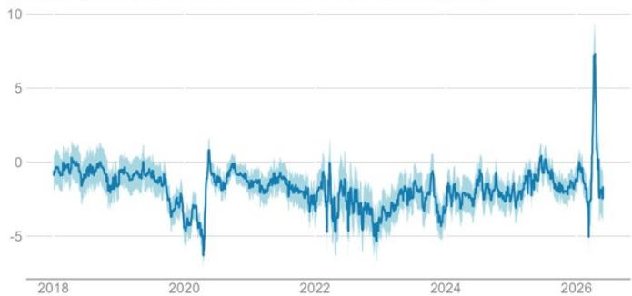

line

| Year | Value |
|------|-------|
| 2018 | ~0    |
| 2019 | ~-1   |
| 2020 | ~-6   |
| 2021 | ~-1   |
| 2022 | ~-3   |
| 2023 | ~-5   |
| 2024 | ~-2   |
| 2025 | ~-1   |
| 2026 | ~7    |

Note: analysis based on weekly regression across 95 seaborne crudes  
Source: Platts, MS

Exhibit 38:   
Russian vs non-Russian origin   
Premium/(discount) for Russian crudes (\$/bbl)   
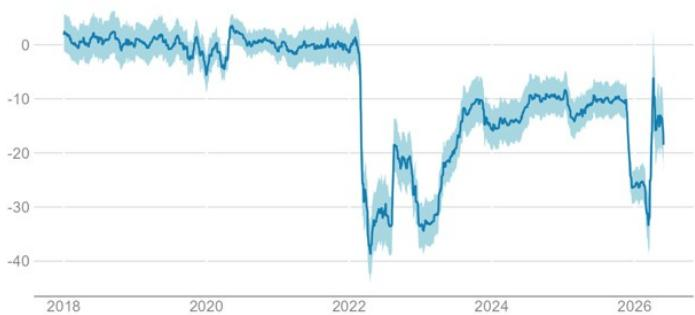

line

| Year | Value |
|------|-------|
| 2018 | ~0    |
| 2020 | ~-5   |
| 2022 | ~-40  |
| 2024 | ~-10  |
| 2026 | ~-30  |

Note: analysis based on weekly regression across 95 seaborne crudes  
Source: Platts, MS

The analyses above are based on a daily regression of the price of 95 seaborne crudes against 1) their API gravity, 2) their sulphur content, 3) a dummy variable indicating whether the crude's origin is East or West of Suez, and 4) another dummy variable indicating whether the grade is from Russian origin or not. The charts above show how the sensitivity of these 95 crude prices to each of these variables has changed over time.

# Refining Margins

Exhibit 39:   
Cracking netback margin - Northwest Europe   
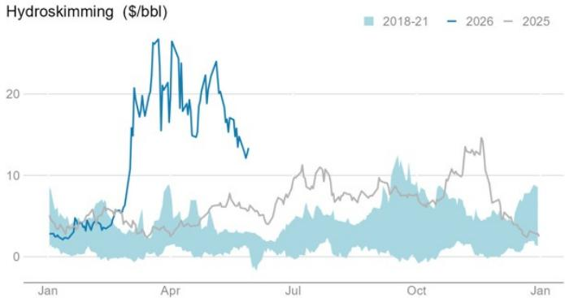

line

| Month | 2018-21 | 2026 | 2025 |
|-------|---------|------|------|
| Jan   | ~3      | ~3   | ~3   |
| Apr   | ~8      | ~25  | ~5   |
| Jul   | ~4      | ~15  | ~10  |
| Oct   | ~7      | ~10  | ~15  |
| Jan   | ~9      | ~5   | ~3   |

Source: S&P Global Platts, MS

Exhibit 40:   
Cracking netback margin - Northwest Europe   
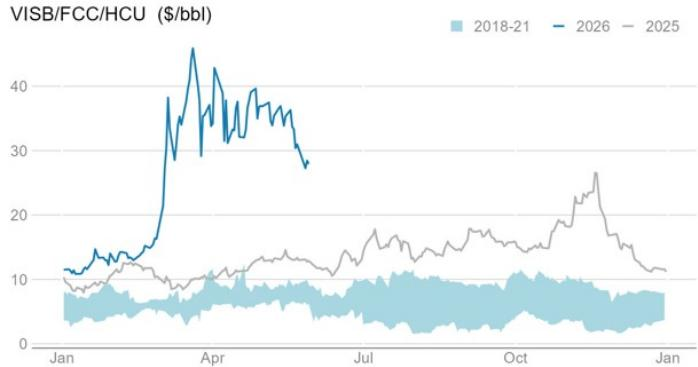

line

| Month | 2018-21 | 2026 | 2025 |
|-------|---------|------|------|
| Jan   | ~7      | ~10  | ~9   |
| Apr   | ~8      | ~45  | ~10  |
| Jul   | ~8      | ~35  | ~15  |
| Oct   | ~8      | ~25  | ~18  |
| Jan   | ~8      | ~10  | ~10  |

Source: S&P Global Platts, MS

Exhibit 41:   
Cracking netback margin - Southeast Asia   
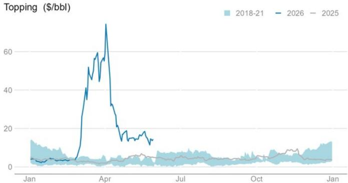

line

| Month | 2018-21 | 2026 | 2025 |
|-------|---------|------|------|
| Jan   | ~10     | ~3   | ~3   |
| Apr   | ~10     | ~70  | ~5   |
| Jul   | ~5      | ~15  | ~5   |
| Oct   | ~5      | ~5   | ~5   |
| Jan   | ~10     | ~5   | ~5   |

Source: S&P Global Platts, MS

Exhibit 42:   
Cracking netback margin - Southeast Asia   
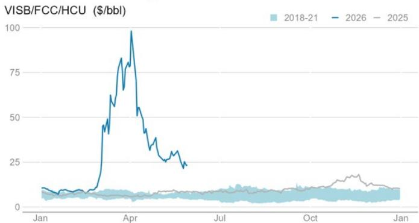

line

| Month | 2018-21 | 2026 | 2025 |
|-------|---------|------|------|
| Jan   | ~5      | ~5   | ~5   |
| Apr   | ~5      | ~100 | ~5   |
| Jul   | ~5      | ~30  | ~5   |
| Oct   | ~5      | ~10  | ~10  |
| Jan   | ~5      | ~5   | ~5   |

Source: S&P Global Platts, MS

Exhibit 43:   
Cracking netback margin - Western Mediterranean   
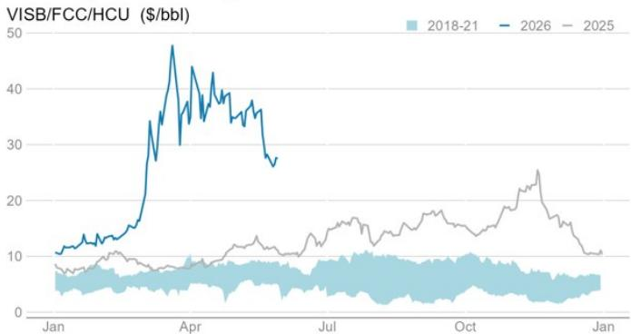

line

| Month | 2018-21 | 2026 | 2025 |
|-------|---------|------|------|
| Jan   | ~7      | ~10  | ~8   |
| Apr   | ~9      | ~48  | ~10  |
| Jul   | ~10     | ~35  | ~15  |
| Oct   | ~10     | ~25  | ~20  |
| Jan   | ~10     | ~10  | ~10  |

Source: S&P Global Platts, MS

Exhibit 44:   
Cracking netback margin - USGC   
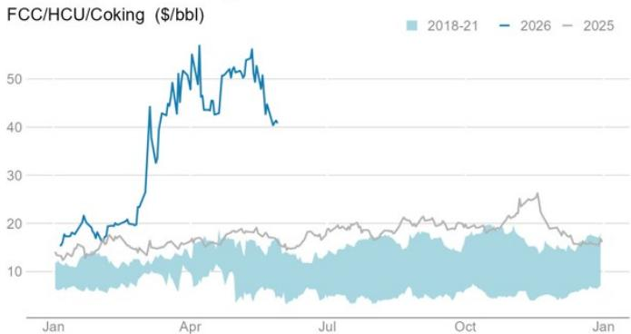

line

| Month | 2018-21 | 2026 | 2025 |
|-------|---------|------|------|
| Jan   | ~10     | ~15  | ~13  |
| Apr   | ~12     | ~55  | ~15  |
| Jul   | ~10     | ~40  | ~18  |
| Oct   | ~12     | ~25  | ~20  |
| Jan   | ~10     | ~15  | ~15  |

Source: S&P Global Platts, MS

# Product Crack Spreads

Exhibit 45:

# Refined product crack spreads

vs Dated Brent; basis: Antwerp-Rotterdam-Amsterdam (\$/bbl)   
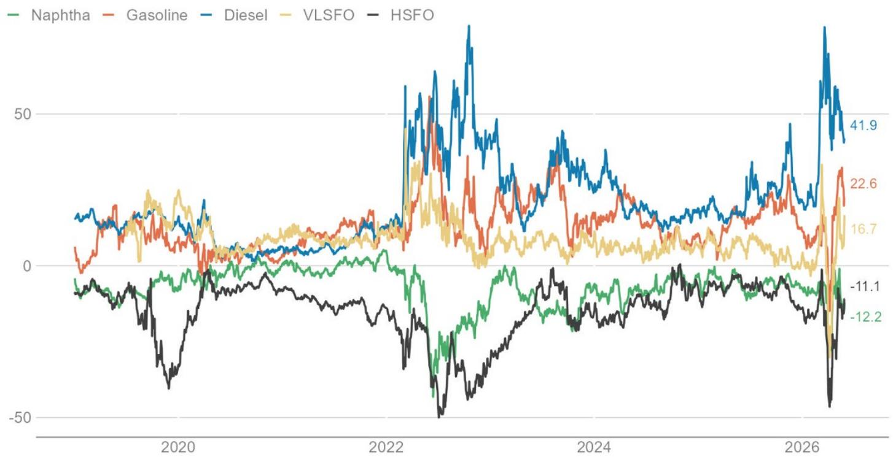

line

| Year | Naphtha | Gasoline | Diesel | VLSFO | HSFO |
|------|---------|----------|--------|-------|------|
| 2026 | -11.1   | 22.6     | 41.9   | 16.7  | -12.2 |

Source: Platts, MS

# Exhibit 46:

Forward refining margins   
Based on typical European configuration (\$/bbl)   
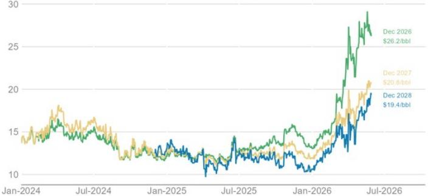

line

| Date     | Value   |
| -------- | ------- |
| Dec 2026 | $26.2/bbl |
| Dec 2027 | $20.8/bbl |
| Dec 2028 | $19.4/bbl |

Note: Analysis assumes yields of 30% gasoline, 60% middle distillate, 5% naphtha and 5% HSFO Source: Bloomberg, MS

# Exhibit 47:

China   
Bohai Bay product crack spreads, excl. tax, \$/bbl)   
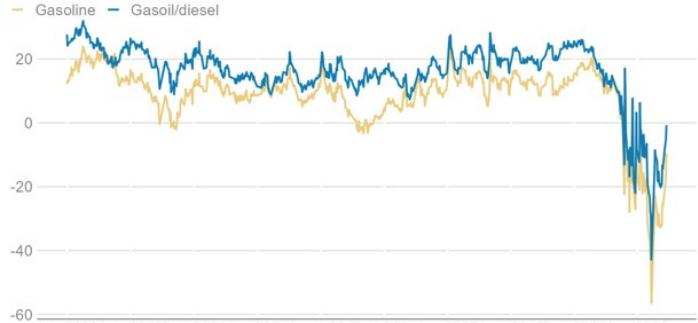

line

| Year | Gasoline | Gasoil/diesel |
|------|----------|---------------|
| 2001 | ~20      | ~25           |
| 2002 | ~15      | ~20           |
| 2003 | ~10      | ~15           |
| 2004 | ~5       | ~10           |
| 2005 | ~0       | ~5            |
| 2006 | ~5       | ~10           |
| 2007 | ~10      | ~15           |
| 2008 | ~15      | ~20           |
| 2009 | ~20      | ~25           |
| 2010 | ~15      | ~20           |
| 2011 | ~10      | ~15           |
| 2012 | ~5       | ~10           |
| 2013 | ~0       | ~5            |
| 2014 | ~5       | ~10           |
| 2015 | ~10      | ~15           |
| 2016 | ~15      | ~20           |
| 2017 | ~20      | ~25           |
| 2018 | ~15      | ~20           |
| 2019 | ~10      | ~15           |
| 2020 | ~5       | ~10           |
| 2021 | ~-10     | ~5            |
| 2022 | ~-30     | ~-40          |
| 2023 | ~-50     | ~-60          |

Apr 2023 Aug 2023 Dec 2023 Apr 2024 Aug 2024 Dec 2024 Apr 2025 Aug 2025 Dec 2025 Apr 2026 Source: Argus, MS

Exhibit 48:   
Naphtha   
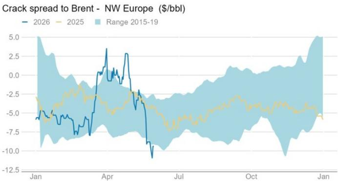

line

| Month | 2026 | 2025 | Range 2015-19 |
|-------|------|------|---------------|
| Jan   | -5.0 | -3.0 | 4.0           |
| Apr   | 3.0  | -2.0 | 0.0           |
| Jul   | -10.0| -7.0 | -8.0          |
| Oct   | 0.0  | -5.0 | 0.0           |
| Jan   | -5.0 | -6.0 | 5.0           |

Source: S&P Global Platts, MS

Exhibit 49:   
Gasoline   
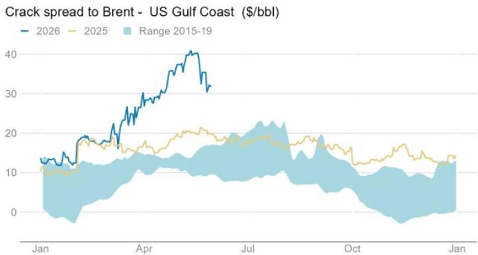

line

| Month | 2026 | 2025 | Range 2015-19 |
|-------|------|------|---------------|
| Jan   | ~13  | ~10  | ~5–15         |
| Apr   | ~30  | ~18  | ~10–25        |
| Jul   | ~40  | ~20  | ~15–25        |
| Oct   | ~15  | ~15  | ~5–15         |
| Jan   | ~13  | ~13  | ~5–15         |

Source: S&P Global Platts, MS

Exhibit 50:   
Jet fuel   
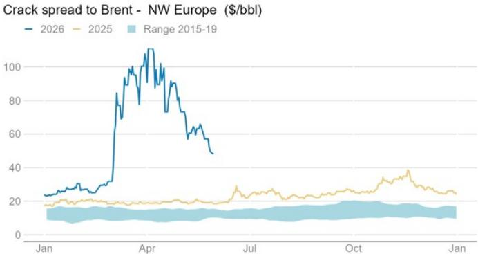

line

| Month | 2026 | 2025 | Range 2015-19 |
|-------|------|------|---------------|
| Jan   | ~25  | ~18  | ~10-15        |
| Apr   | ~110 | ~18  | ~10-15        |
| Jul   | ~60  | ~25  | ~10-15        |
| Oct   | ~40  | ~30  | ~10-15        |
| Jan   | ~30  | ~25  | ~10-15        |

Source: S&P Global Platts, MS

Exhibit 51:   
Gasoil/diesel   
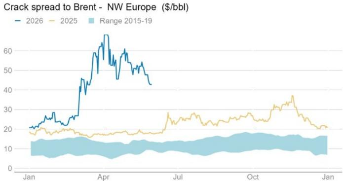

line

| Month | 2026 | 2025 | Range 2015-19 |
|-------|------|------|---------------|
| Jan   | ~20  | ~18  | ~10           |
| Apr   | ~65  | ~18  | ~10           |
| Jul   | ~45  | ~25  | ~10           |
| Oct   | ~35  | ~30  | ~10           |
| Jan   | ~20  | ~20  | ~10           |

Source: S&P Global Platts, MS

Exhibit 52:   
Gasoil/diesel   
Crack spread to Brent - Singapore (\$/bbl)   
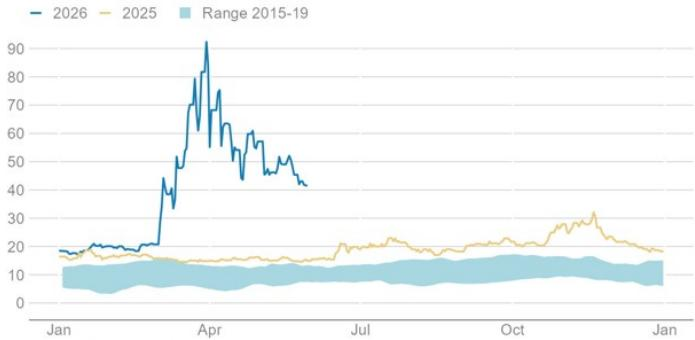

line

| Month | 2026 | 2025 | Range 2015-19 |
|-------|------|------|---------------|
| Jan   | 18   | 15   | 10-15         |
| Apr   | 90   | 14   | 10-15         |
| Jul   | 45   | 20   | 10-15         |
| Oct   | 30   | 25   | 10-15         |
| Jan   | 20   | 20   | 10-15         |

Source: S&P Global Platts, MS

Exhibit 53:   
High-sulphur fuel oil   
Crack spread to Brent - Singapore (\$/bbl)   
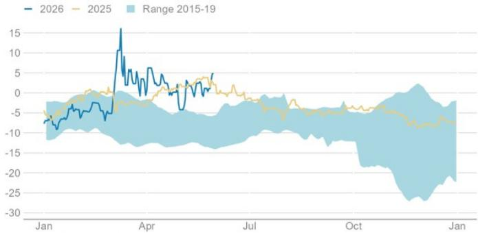

line

| Month | 2026 | 2025 | Range 2015-19 |
|-------|------|------|---------------|
| Jan   | -8   | -4   | -10           |
| Apr   | 15   | 0    | -15           |
| Jul   | 0    | -2   | -10           |
| Oct   | -10  | -4   | -25           |
| Jan   | -10  | -6   | -30           |

Source: S&P Global Platts, MS

# Refinery Outages

# Exhibit 54:

Refinery outages   
(mb/d) 

<table><tr><td rowspan="2">region</td><td colspan="13">Actual</td><td colspan="2">Known outlook</td><td rowspan="2">Jul 2026</td></tr><tr><td>Apr 2025</td><td>May 2025</td><td>Jun 2025</td><td>Jul 2025</td><td>Aug 2025</td><td>Sep 2025</td><td>Oct 2025</td><td>Nov 2025</td><td>Dec 2025</td><td>Jan 2026</td><td>Feb 2026</td><td>Mar 2026</td><td>Apr 2026</td><td>May 2026</td><td>Jun 2026</td></tr><tr><td>Africa</td><td>0.53</td><td>0.57</td><td>0.51</td><td>0.47</td><td>0.44</td><td>0.47</td><td>0.28</td><td>0.26</td><td>0.23</td><td>0.41</td><td>0.54</td><td>0.21</td><td>0.13</td><td>0.06</td><td>0.10</td><td>0.12</td></tr><tr><td>Brazil</td><td>0.05</td><td>0.11</td><td>0.14</td><td>0.16</td><td>0.09</td><td>0.09</td><td>0.12</td><td>0.07</td><td>0.06</td><td>0.05</td><td>0.01</td><td>0.03</td><td>0.01</td><td>0.01</td><td>0.01</td><td>0.02</td></tr><tr><td>China</td><td>1.62</td><td>2.05</td><td>1.45</td><td>1.20</td><td>0.91</td><td>0.86</td><td>0.96</td><td>1.22</td><td>1.19</td><td>1.12</td><td>0.53</td><td>0.55</td><td>0.86</td><td>1.36</td><td>1.38</td><td>1.04</td></tr><tr><td>Europe</td><td>1.26</td><td>1.51</td><td>1.12</td><td>0.38</td><td>0.17</td><td>0.57</td><td>1.03</td><td>1.16</td><td>0.36</td><td>0.29</td><td>0.80</td><td>1.20</td><td>0.69</td><td>0.62</td><td>0.31</td><td>0.10</td></tr><tr><td>India</td><td>0.35</td><td>0.15</td><td>0.20</td><td>0.06</td><td>0.18</td><td>0.15</td><td>0.14</td><td>0.22</td><td>0.26</td><td>0.00</td><td>0.00</td><td>0.11</td><td>0.55</td><td>0.53</td><td>0.50</td><td>0.35</td></tr><tr><td>Japan</td><td>0.26</td><td>0.51</td><td>0.73</td><td>0.52</td><td>0.35</td><td>0.42</td><td>0.46</td><td>0.42</td><td>0.10</td><td>0.13</td><td>0.15</td><td>0.15</td><td>0.33</td><td>0.30</td><td>0.45</td><td>0.47</td></tr><tr><td>Korea</td><td>0.00</td><td>0.11</td><td>0.11</td><td>0.00</td><td>0.00</td><td>0.00</td><td>0.17</td><td>0.17</td><td>0.17</td><td>0.00</td><td>0.24</td><td>0.38</td><td>0.52</td><td>0.36</td><td>0.29</td><td>0.00</td></tr><tr><td>Middle East</td><td>0.26</td><td>0.44</td><td>0.28</td><td>0.00</td><td>0.00</td><td>0.06</td><td>0.68</td><td>1.11</td><td>0.46</td><td>0.30</td><td>0.37</td><td>1.39</td><td>1.67</td><td>1.31</td><td>0.66</td><td>0.02</td></tr><tr><td>Other</td><td>1.61</td><td>2.22</td><td>1.32</td><td>1.18</td><td>1.02</td><td>1.18</td><td>1.36</td><td>0.74</td><td>0.54</td><td>0.76</td><td>1.11</td><td>1.69</td><td>2.43</td><td>2.26</td><td>1.16</td><td>0.66</td></tr><tr><td>Russia</td><td>0.59</td><td>0.60</td><td>0.72</td><td>0.92</td><td>1.48</td><td>2.05</td><td>2.21</td><td>1.98</td><td>1.50</td><td>0.72</td><td>0.78</td><td>0.98</td><td>2.00</td><td>2.26</td><td>0.88</td><td>0.39</td></tr><tr><td>Taiwan</td><td>0.00</td><td>0.00</td><td>0.00</td><td>0.00</td><td>0.00</td><td>0.24</td><td>0.24</td><td>0.24</td><td>0.31</td><td>0.15</td><td>0.00</td><td>0.18</td><td>0.18</td><td>0.00</td><td>0.10</td><td>0.10</td></tr><tr><td>US</td><td>1.67</td><td>0.66</td><td>0.24</td><td>0.23</td><td>0.22</td><td>0.77</td><td>1.41</td><td>0.64</td><td>0.10</td><td>0.76</td><td>1.17</td><td>0.86</td><td>1.03</td><td>0.41</td><td>0.13</td><td>0.13</td></tr><tr><td>World</td><td>8.17</td><td>8.86</td><td>6.78</td><td>5.10</td><td>4.81</td><td>6.69</td><td>8.96</td><td>8.13</td><td>4.83</td><td>4.58</td><td>5.50</td><td>7.62</td><td>10.28</td><td>9.47</td><td>5.60</td><td>3.15</td></tr></table>

Source: IIR, MS

# Exhibit 55:

Refinery outages   
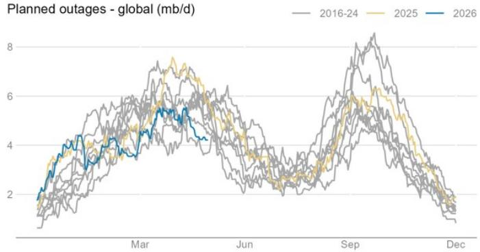

line

| Month | 2016-24 | 2025 | 2026 |
|-------|---------|------|------|
| Mar   | ~3.5    | ~4.0 | ~3.8 |
| Jun   | ~5.0    | ~5.5 | ~4.5 |
| Sep   | ~7.0    | ~6.5 | ~6.0 |
| Dec   | ~1.5    | ~1.8 | ~1.7 |

Source: IIR, MS

# Exhibit 56:

Refinery outages   
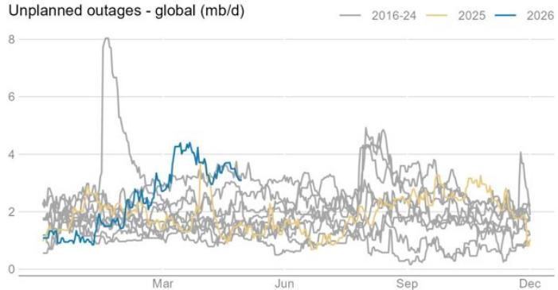

line

| Month | 2016-24 | 2025 | 2026 |
|-------|---------|------|------|
| Jan   | ~1.5    | ~1.5 | ~1.0 |
| Feb   | ~2.0    | ~1.8 | ~1.2 |
| Mar   | ~8.0    | ~2.5 | ~3.0 |
| Apr   | ~3.0    | ~2.0 | ~4.5 |
| May   | ~2.5    | ~1.8 | ~3.5 |
| Jun   | ~2.0    | ~1.5 | ~3.0 |
| Jul   | ~2.5    | ~1.8 | ~3.5 |
| Aug   | ~3.0    | ~2.0 | ~4.0 |
| Sep   | ~4.5    | ~2.5 | ~4.5 |
| Oct   | ~3.0    | ~2.0 | ~3.5 |
| Nov   | ~2.5    | ~1.8 | ~3.0 |
| Dec   | ~4.0    | ~2.0 | ~3.5 |

Source: IIR, MS

# Inventories

Exhibit 57:

Observable crude oil inventories   
(million bbl) 

<table><tr><td rowspan="2" colspan="2"></td><td>Level</td><td colspan="6">Average daily change</td></tr><tr><td>Current</td><td>-4 wks</td><td>-13 wks</td><td>-26 wks</td><td>Apr</td><td>Mar</td><td>Feb</td></tr><tr><td colspan="9">Commercial</td></tr><tr><td></td><td>United States</td><td>440.8</td><td>-0.68</td><td>0.04</td><td>0.08</td><td>-0.08</td><td>0.73</td><td>0.72</td></tr><tr><td></td><td>Japan</td><td>57.7</td><td>0.25</td><td>-0.06</td><td>-0.03</td><td>-0.15</td><td>-0.39</td><td>0.17</td></tr><tr><td></td><td>ARA region</td><td>48.2</td><td>-0.10</td><td>0.07</td><td>-0.03</td><td>-0.19</td><td>0.33</td><td>0.03</td></tr><tr><td></td><td>Other OECD</td><td>540.4</td><td>-0.25</td><td>-0.10</td><td>-0.29</td><td>-0.42</td><td>-0.25</td><td>0.47</td></tr><tr><td></td><td>China</td><td>1,108.7</td><td>-0.93</td><td>0.29</td><td>0.52</td><td>0.58</td><td>1.26</td><td>0.68</td></tr><tr><td></td><td>Other non-OECD</td><td>1,141.3</td><td>0.35</td><td>-0.12</td><td>0.05</td><td>-0.67</td><td>0.32</td><td>-0.08</td></tr><tr><td></td><td>Floating storage</td><td>79.4</td><td>-2.06</td><td>-0.37</td><td>-0.32</td><td>-0.19</td><td>1.24</td><td>-0.55</td></tr><tr><td></td><td>Oil-in-transit</td><td>1,091.7</td><td>0.52</td><td>-0.82</td><td>-0.71</td><td>0.81</td><td>-3.67</td><td>0.42</td></tr><tr><td>Sub-total</td><td>—</td><td>4,508.1</td><td>-2.9</td><td>-1.1</td><td>-0.7</td><td>-0.3</td><td>-0.4</td><td>1.9</td></tr><tr><td colspan="9">SPR</td></tr><tr><td></td><td>United States</td><td>365.1</td><td>-1.17</td><td>-0.55</td><td>-0.25</td><td>-0.57</td><td>-0.01</td><td>0.01</td></tr><tr><td></td><td>Japan</td><td>265.8</td><td>0.15</td><td>0.08</td><td>0.05</td><td>-0.04</td><td>-0.02</td><td>0.00</td></tr><tr><td></td><td>ARA region</td><td>1.0</td><td>0.00</td><td>0.00</td><td>0.00</td><td>0.00</td><td>0.00</td><td>0.00</td></tr><tr><td></td><td>Other OECD</td><td>257.0</td><td>0.00</td><td>0.01</td><td>0.00</td><td>0.00</td><td>0.03</td><td>-0.01</td></tr><tr><td></td><td>China</td><td>191.9</td><td>0.04</td><td>0.04</td><td>0.00</td><td>0.07</td><td>-0.07</td><td>0.02</td></tr><tr><td>Sub-total</td><td>—</td><td>1,080.9</td><td>-1.0</td><td>-0.4</td><td>-0.2</td><td>-0.5</td><td>-0.1</td><td>0.0</td></tr><tr><td>Total</td><td>—</td><td>5,589.0</td><td>-3.9</td><td>-1.5</td><td>-0.9</td><td>-0.8</td><td>-0.5</td><td>1.9</td></tr></table>

Source: IEA, EIA/DOE, PJK, IE, Genscape, PAJ, Platts, Vortexa, MS

# Exhibit 58:

Observable oil products inventories   
(million bbl) 

<table><tr><td rowspan="2" colspan="2"></td><td>Level</td><td colspan="6">Average daily change</td></tr><tr><td>Current</td><td>-4 wks</td><td>-13 wks</td><td>-26 wks</td><td>Apr</td><td>Mar</td><td>Feb</td></tr><tr><td colspan="9">On land</td></tr><tr><td></td><td>Light ends</td><td>426.8</td><td>-0.48</td><td>-0.68</td><td>0.02</td><td>-0.86</td><td>-0.65</td><td>-0.10</td></tr><tr><td></td><td>Middle distillates</td><td>688.4</td><td>-0.14</td><td>-0.29</td><td>-0.09</td><td>-0.54</td><td>-0.25</td><td>-0.35</td></tr><tr><td></td><td>Fuel oil &amp; resid</td><td>122.7</td><td>-0.19</td><td>-0.20</td><td>-0.14</td><td>-0.29</td><td>-0.25</td><td>-0.08</td></tr><tr><td></td><td>Other/not specified</td><td>568.9</td><td>0.37</td><td>0.12</td><td>-0.31</td><td>0.27</td><td>-0.23</td><td>-0.57</td></tr><tr><td>Sub-total</td><td>—</td><td>1,806.83</td><td>-0.44</td><td>-1.05</td><td>-0.52</td><td>-1.42</td><td>-1.38</td><td>-1.10</td></tr><tr><td colspan="9">At sea</td></tr><tr><td></td><td>Light ends</td><td>180.9</td><td>-0.83</td><td>-0.19</td><td>-0.16</td><td>0.32</td><td>-0.53</td><td>0.16</td></tr><tr><td></td><td>Middle distillates</td><td>322.7</td><td>-0.30</td><td>-0.41</td><td>-0.08</td><td>-0.34</td><td>-0.87</td><td>-0.15</td></tr><tr><td></td><td>Fuel oil &amp; resid</td><td>125.2</td><td>-0.11</td><td>-0.16</td><td>-0.06</td><td>0.09</td><td>-0.42</td><td>0.15</td></tr><tr><td></td><td>Other/not specified</td><td>163.1</td><td>0.31</td><td>0.10</td><td>0.05</td><td>0.41</td><td>-0.24</td><td>-0.05</td></tr><tr><td>Sub-total</td><td>—</td><td>791.88</td><td>-0.93</td><td>-0.66</td><td>-0.25</td><td>0.48</td><td>-2.06</td><td>0.11</td></tr><tr><td>Total</td><td>—</td><td>2,598.71</td><td>-1.37</td><td>-1.71</td><td>-0.77</td><td>-0.94</td><td>-3.44</td><td>-0.99</td></tr></table>

Source: IEA, EIA/DOE, PJK, IE, Genscape, PAJ, Platts, Vortexa, MS

# Exhibit 59:

Observable crude oil and oil products inventories   
On land, at sea and in-transit (mln bbl)   
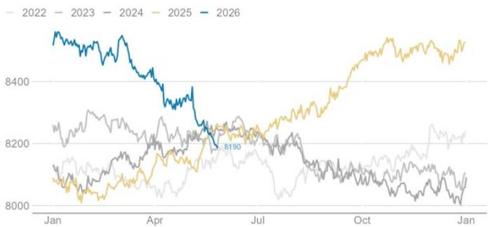

line

| Month | 2022  | 2023  | 2024  | 2025  | 2026  |
|-------|-------|-------|-------|-------|-------|
| Jan   | ~8150 | ~8180 | ~8170 | ~8160 | ~8500 |
| Apr   | ~8180 | ~8200 | ~8190 | ~8170 | ~8350 |
| Jul   | ~8150 | ~8170 | ~8160 | ~8190 | ~8190 |
| Oct   | ~8170 | ~8190 | ~8180 | ~8350 | ~8450 |
| Jan   | ~8160 | ~8180 | ~8170 | ~8450 | ~8450 |

Note: Inventories include SPR   
Source: IEA, EIA/DOE, PJK, IE, Genscape, PAJ, Platts, Vortexa, MS

# Exhibit 60:

Observable crude oil inventories   
On land, at sea and in-transit (mln bbl)   
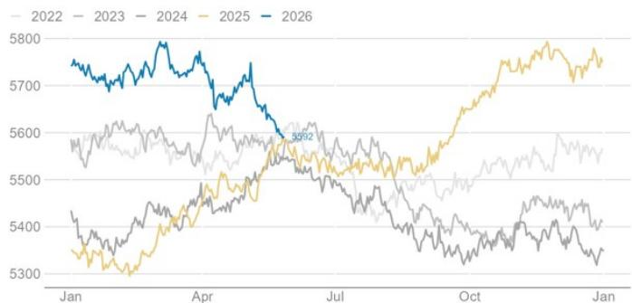

line

| Month | 2022 | 2023 | 2024 | 2025 | 2026 |
|---|---|---|---|---|---|
| Jan | 5580 | 5592 | 5440 | 5350 | 5750 |
| Apr | 5600 | 5610 | 5480 | 5480 | 5780 |
| Jul | 5550 | 5560 | 5490 | 5520 | 5600 |
| Oct | 5520 | 5530 | 5470 | 5650 | 5700 |
| Jan | 5500 | 5510 | 5460 | 5780 | 5760 |

Source: IEA, EIA/DOE, PJK, IE, Genscape, PAJ, Platts, Vortexa, MS

Exhibit 61:   
Observable crude oil and oil products inventories   
In commercial storage only (mln bbl)   
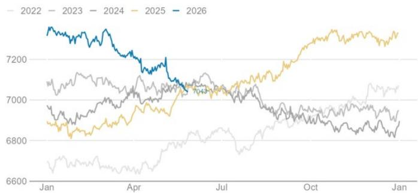

line

| Month | 2022 | 2023 | 2024 | 2025 | 2026 |
|-------|------|------|------|------|------|
| Jan   | ~6700 | ~7100 | ~6900 | ~6850 | ~7300 |
| Apr   | ~6800 | ~7050 | ~7000 | ~6950 | ~7150 |
| Jul   | ~6900 | ~7000 | ~6950 | ~7100 | ~7050 |
| Oct   | ~6850 | ~6950 | ~6900 | ~7300 | ~7150 |
| Jan   | ~6800 | ~6900 | ~6850 | ~7350 | ~7100 |

Note: inventories on land, at sea and in-transit, not including SPR in OECD countries  
Source: IEA, EIA/DOE, PJK, IE, Genscape, PAJ, Platts, Vortexa, MS

Exhibit 62:   
OECD commercial oil inventories   
Total oil, on land only (mln bbl)   
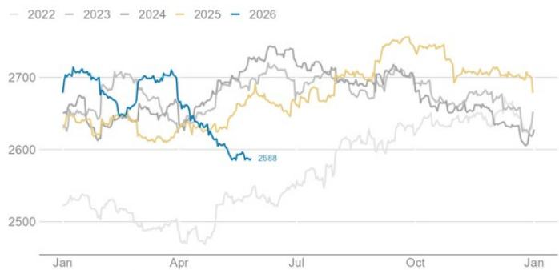

line

| Month | 2022 | 2023 | 2024 | 2025 | 2026 |
|-------|------|------|------|------|------|
| Jan   | 2500 | 2650 | 2650 | 2650 | 2700 |
| Apr   | 2550 | 2650 | 2650 | 2650 | 2650 |
| Jul   | 2600 | 2700 | 2700 | 2700 | 2600 |
| Oct   | 2650 | 2700 | 2700 | 2750 | 2650 |
| Jan   | 2600 | 2650 | 2650 | 2700 | 2600 |

Source: IEA, EIA/DOE, PJK, PAJ, Platts, Vortexa, MS

Exhibit 63:   
Observable refined oil products inventories   
On land, at sea and in-transit (mln bbl)   
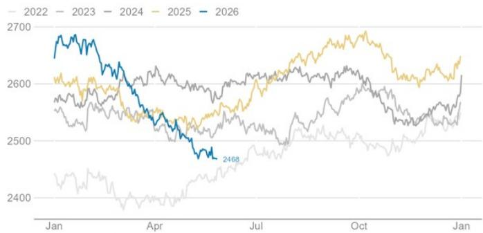

line

| Month | 2022 | 2023 | 2024 | 2025 | 2026 |
|-------|------|------|------|------|------|
| Jan   | ~2450 | ~2550 | ~2580 | ~2600 | ~2700 |
| Apr   | ~2480 | ~2520 | ~2550 | ~2580 | ~2550 |
| Jul   | ~2500 | ~2580 | ~2600 | ~2650 | ~2468 |
| Oct   | ~2550 | ~2600 | ~2650 | ~2700 | ~2550 |
| Jan   | ~2600 | ~2650 | ~2680 | ~2680 | ~2600 |

Source: IEA, EIA/DOE, PJK, IE, PAJ, Platts, MS

Exhibit 64:   
Observable refined oil products inventories, on-land only (mln bbl)   
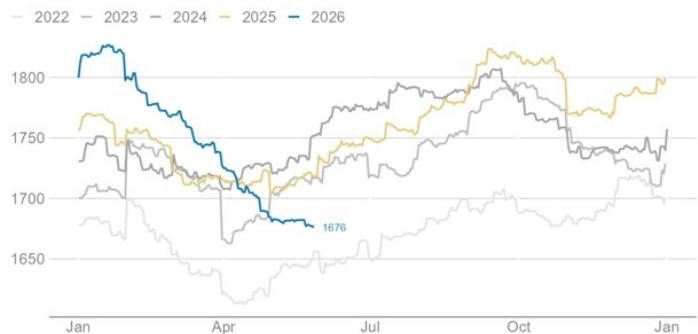

line

| Month | 2022 | 2023 | 2024 | 2025 | 2026 |
|-------|------|------|------|------|------|
| Jan   |      |      |      |      | 1800 |
| Apr   |      |      |      |      | 1700 |
| Jul   |      |      |      |      | 1750 |
| Oct   |      |      |      |      | 1800 |
| Jan   |      |      |      |      | 1750 |

Source: IEA, EIA/DOE, PJK, IE, PAJ, Platts, MS

Exhibit 65:   
Observable crude oil inventories in China   
On land (mln bbl)   
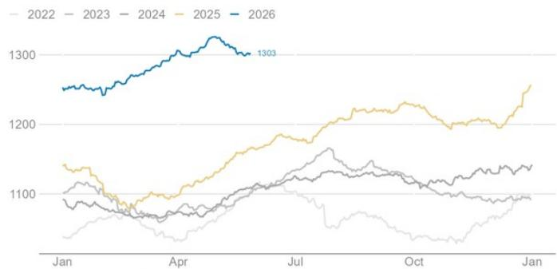

line

| Month | 2022 | 2023 | 2024 | 2025 | 2026 |
|-------|------|------|------|------|------|
| Jan   |      |      |      |      |      |
| Apr   |      |      |      |      |      |
| Jul   |      |      |      |      |      |
| Oct   |      |      |      |      |      |
| Jan   |      |      |      |      |      |

Source: Vortexa, MS

Exhibit 66:   
Observable crude oil inventories outside China   
On land, at sea and in-transit (mln bbl)   
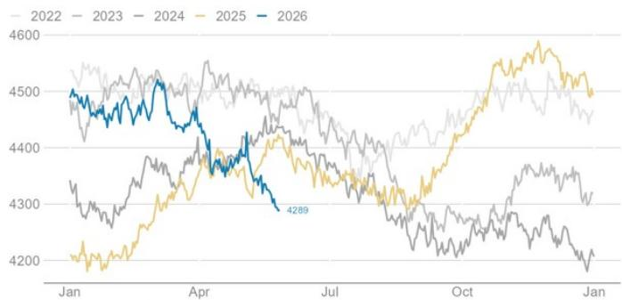

line

| Month | 2022 | 2023 | 2024 | 2025 | 2026 |
|-------|------|------|------|------|------|
| Jan   |      |      |      |      |      |
| Apr   |      |      |      |      |      |
| Jul   |      |      |      |      |      |
| Oct   |      |      |      |      |      |
| Jan   |      |      |      |      |      |

Source: IEA, EIA/DOE, PJK, IE, PAJ, Platts, MS

# Seaborne Exports

Exhibit 67:   
OPEC 9+3   
Seaborne exports of crude oil and oil products (mb/d)   
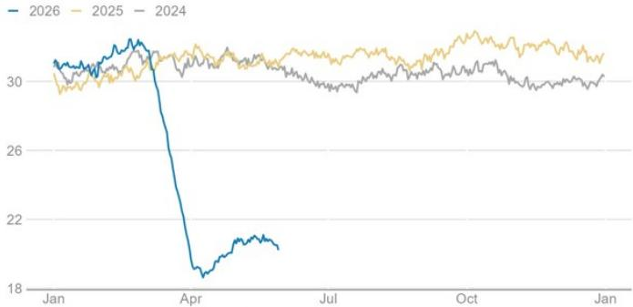

line

| Month | 2026 | 2025 | 2024 |
|-------|------|------|------|
| Jan   | 31   | 30   | 31   |
| Apr   | 18   | 31   | 30   |
| Jul   | 19   | 31   | 30   |
| Oct   | 19   | 31   | 30   |
| Jan   | 19   | 31   | 30   |

Source: Vortexa, MS

Exhibit 68:   
Non-OPEC   
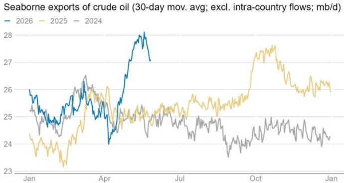

line

| Month | 2026 | 2025 | 2024 |
|-------|------|------|------|
| Jan   | 26.0 | 24.5 | 25.0 |
| Apr   | 24.0 | 25.5 | 26.0 |
| Jul   | 27.5 | 25.5 | 24.5 |
| Oct   | 27.0 | 27.5 | 24.0 |
| Jan   | 26.0 | 26.0 | 24.0 |

Source: Vortexa, MS

Exhibit 69:   
Saudi Arabia   
Seaborne crude oil exports (mb/d)   
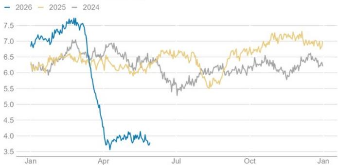

line

| Month | 2026 | 2025 | 2024 |
|-------|------|------|------|
| Jan   | 7.0  | 6.2  | 6.1  |
| Apr   | 3.8  | 6.0  | 6.5  |
| Jul   | 4.0  | 5.8  | 5.5  |
| Oct   | 4.2  | 6.8  | 6.3  |
| Jan   | 4.1  | 6.9  | 6.4  |

Source: Vortexa, MS

Exhibit 70:   
Brazil and Guyana   
Seaborne exports of crude oil (30-day moving avg; mb/d)   
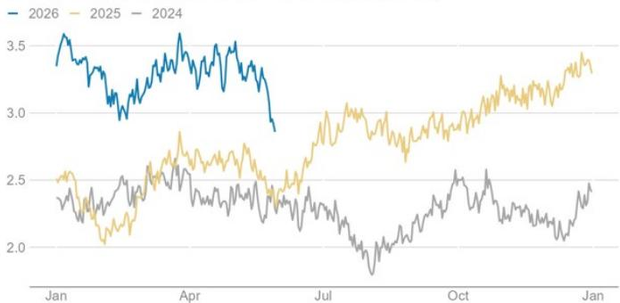

line

| Month | 2026 | 2025 | 2024 |
|-------|------|------|------|
| Jan   | 3.5  | 2.5  | 2.3  |
| Apr   | 3.6  | 2.7  | 2.4  |
| Jul   | 3.0  | 2.9  | 1.8  |
| Oct   | 3.4  | 3.1  | 2.5  |
| Jan   | 3.5  | 3.4  | 2.4  |

Source: Vortexa, MS

Exhibit 71:   
Russia   
Seaborne crude oil exports (mb/d)   
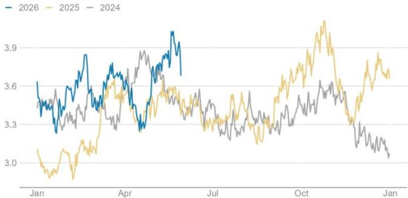

line

| Month | 2026 | 2025 | 2024 |
|-------|------|------|------|
| Jan   | 3.6  | 3.1  | 3.5  |
| Apr   | 3.7  | 3.6  | 3.8  |
| Jul   | 3.5  | 3.4  | 3.5  |
| Oct   | 3.6  | 3.9  | 3.6  |
| Jan   | 3.5  | 3.7  | 3.1  |

Source: Vortexa, MS

Exhibit 72:   
Iran   
Seaborne crude oil exports (mb/d)   
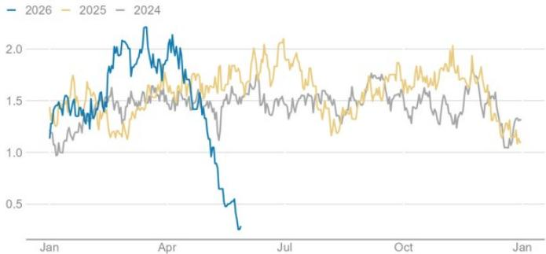

line

| Month | 2026 | 2025 | 2024 |
|-------|------|------|------|
| Jan   | 1.3  | 1.4  | 1.0  |
| Apr   | 2.1  | 1.7  | 1.5  |
| Jul   | 0.3  | 2.0  | 1.5  |
| Oct   | 1.8  | 1.9  | 1.6  |
| Jan   | 1.1  | 1.2  | 1.3  |

Note: chart shows data to 28 May   
Source: Vortexa, MS

# Positioning

Exhibit 73:   
Total oil   
COT report - Managed money and Other reportables (number of contracts)   

area

| Date   | Value |
|--------|-------|
| Jan-16 | ~500  |
| Jan-17 | ~1000 |
| Jan-18 | ~1500 |
| Jan-19 | ~500  |
| Jan-20 | ~1000 |
| Jan-21 | ~500  |
| Jan-22 | ~1000 |
| Jan-23 | ~500  |
| Jan-24 | ~0    |
| Jan-25 | ~500  |
| Jan-26 | ~1000 |

Note: light blue = long positions, yellow = short position, dark blue = net position  
Source: CFTC, MS

Exhibit 75:   
Gasoil and Heating Oil   
COT report - Managed money and Other reportables (number of contracts)   

area

| Date   | Value |
|--------|-------|
| Jan-16 | 0     |
| Jan-17 | 50    |
| Jan-18 | 100   |
| Jan-19 | 50    |
| Jan-20 | -100  |
| Jan-21 | 0     |
| Jan-22 | 50    |
| Jan-23 | -50   |
| Jan-24 | -100  |
| Jan-25 | -200  |
| Jan-26 | -300  |

Note: light blue = long positions, yellow = short position, dark blue = net position  
Source: CFTC, MS

Exhibit 74:   
Brent and WTI   
COT report - Managed money and Other reportables (number of contracts)   

area

| Date   | Value |
|--------|-------|
| Jan-16 | ~500  |
| Jan-17 | ~800  |
| Jan-18 | ~1200 |
| Jan-19 | ~400  |
| Jan-20 | ~900  |
| Jan-21 | ~300  |
| Jan-22 | ~500  |
| Jan-23 | ~300  |
| Jan-24 | ~400  |
| Jan-25 | ~200  |
| Jan-26 | ~600  |

Note: light blue = long positions, yellow = short position, dark blue = net position  
Source: CFTC, MS

Exhibit 76:   
Gasoline - NY Harbour RBOB   
COT report - Managed money and Other reportables (number of contracts)   

area

| Date   | Value |
|--------|-------|
| Jan-16 | 50    |
| Jan-17 | 70    |
| Jan-18 | 90    |
| Jan-19 | 110   |
| Jan-20 | 130   |
| Jan-21 | 100   |
| Jan-22 | 80    |
| Jan-23 | 60    |
| Jan-24 | 40    |
| Jan-25 | 20    |
| Jan-26 | 60    |

Note: light blue = long positions, yellow = short position, dark blue = net position  
Source: CFTC, MS

# Other Selected Charts

Exhibit 77:   
Motor fuel imports   
Top 100 ports (mb/d)   
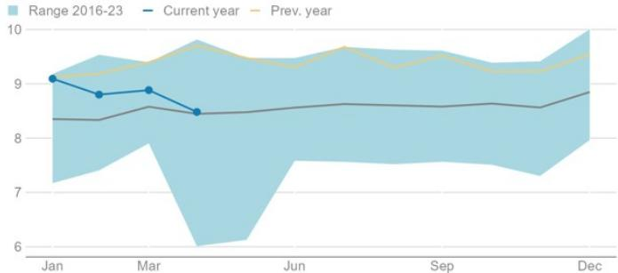

line

| Month | Current year | Prev. year |
|-------|--------------|----------|
| Jan   | 9.0          | 9.0      |
| Mar   | 8.5          | 9.5      |
| Jun   | 8.5          | 9.5      |
| Sep   | 8.5          | 9.5      |
| Dec   | 8.5          | 9.5      |

Note: analysis based on the 100 largest ports where imports are $>90\%$ of total flow, excluding large trading ports like Singapore, Rotterdam, etc  
Source: Vortexa, MS

Exhibit 79:   
Clean products net imports   
Nigeria (30-day moving avg; mb/d)   
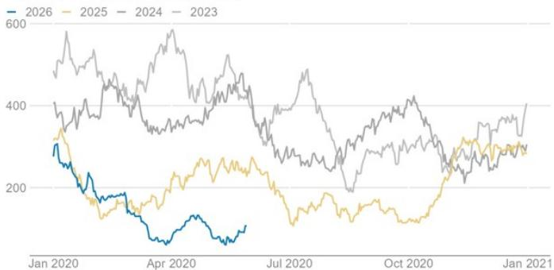

line

| Date     | 2026 | 2025 | 2024 | 2023 |
|----------|------|------|------|------|
| Jan 2020 | 300  | 350  | 400  | 550  |
| Apr 2020 | 150  | 250  | 350  | 450  |
| Jul 2020 | 100  | 200  | 300  | 400  |
| Oct 2020 | 150  | 250  | 350  | 350  |
| Jan 2021 | 300  | 300  | 350  | 400  |

Source: Vortexa, MS

Exhibit 81:   
Global oil & gas capex (by Woodmac)   
(\$bn)   

bar

| Year | Historical | Woodmac forecast |
|---|---|---|
| 2005 | 313 | |
| 2006 | 340 | |
| 2007 | 370 | |
| 2008 | 495 | |
| 2009 | 470 | |
| 2010 | 505 | |
| 2011 | 525 | |
| 2012 | 675 | |
| 2013 | 695 | |
| 2014 | 712 | |
| 2015 | 515 | |
| 2016 | 345 | |
| 2017 | 355 | |
| 2018 | 480 | |
| 2019 | 475 | |
| 2020 | 325 | |
| 2021 | 325 | |
| 2022 | 480 | |
| 2023 | 495 | |
| 2024 | 504 | |
| 2025 | 502 | |
| 2026 | 504 | |
| 2027 | 515 | |
| 2028 | 520 | |

Source: Wood Mackenzie, MS

Exhibit 78:   
Seaborne crude oil arrivals - Europe   
Change vs seasonal average from 2016-23 (mb/d)   
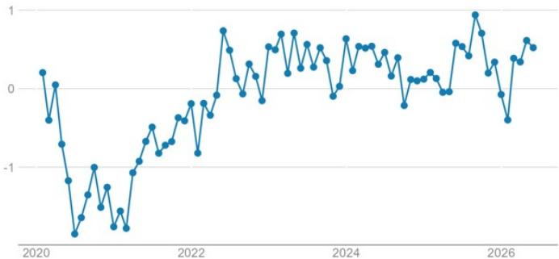

line

| Year | Value |
|------|-------|
| 2020 | 0.3   |
| 2020 | -0.4  |
| 2020 | -0.8  |
| 2020 | -1.3  |
| 2020 | -1.7  |
| 2020 | -1.9  |
| 2020 | -1.5  |
| 2020 | -1.3  |
| 2020 | -1.1  |
| 2021 | -0.8  |
| 2021 | -0.6  |
| 2021 | -0.4  |
| 2021 | -0.3  |
| 2021 | -0.2  |
| 2021 | -0.1  |
| 2021 | 0.0   |
| 2021 | 0.1   |
| 2021 | 0.3   |
| 2021 | 0.5   |
| 2021 | 0.7   |
| 2021 | 0.9   |
| 2021 | 1.1   |
| 2021 | 1.3   |
| 2021 | 1.5   |
| 2021 | 1.7   |
| 2021 | 1.9   |
| 2021 | 2.1   |
| 2021 | 2.3   |
| 2021 | 2.5   |
| 2021 | 2.7   |
| 2021 | 2.9   |
| 2021 | 3.1   |
| 2021 | 3.3   |
| 2021 | 3.5   |
| 2021 | 3.7   |
| 2021 | 3.9   |
| 2021 | 4.1   |
| 2021 | 4.3   |
| 2021 | 4.5   |
| 2021 | 4.7   |
| 2021 | 4.9   |
| 2021 | 5.1   |
| 2021 | 5.3   |
| 2021 | 5.5   |
| 2021 | 5.7   |
| 2021 | 5.9   |
| 2021 | 6.1   |
| 2021 | 6.3   |
| 2021 | 6.5   |
| 2021 | 6.7   |
| 2021 | 6.9   |
| 2021 | 7.1   |
| 2021 | 7.3   |
| 2021 | 7.5   |
| 2021 | 7.7   |
| 2021 | 7.9   |
| 2021 | 8.1   |
| 2021 | 8.3   |
| 2021 | 8.5   |
| 2021 | 8.7   |
| 2021 | 8.9   |
| 2021 | 9.1   |
| 2021 | 9.3   |
| 2021 | 9.5   |
| 2021 | 9.7   |
| 2021 | 9.9   |
| 2021 | 10.1  |
| 2021 | 10.3  |
| 2021 | 10.5  |
| 2021 | 10.7  |
| 2021 | 10.9  |
| 2021 | 11.1  |
| 2021 | 11.3  |
| 2021 | 11.5  |
| 2021 | 11.7  |
| 2021 | 11.9  |
| 2021 | 12.1  |
| 2021 | 12.3  |
| 2021 | 12.5  |
| 2021 | 12.7  |
| 2021 | 12.9  |
| 2021 | 13.1  |
| 2021 | 13.3  |
| 2021 | 13.5  |
| 2021 | 13.7  |
| 2021 | 13.9  |
| 2021 | 14.1  |
| 2021 | 14.3  |
| 2021 | 14.5  |
| 2021 | 14.7  |
| 2021 | 14.9  |
| 2021 | 15.1  |
| 2021 | 15.3  |
| 2021 | 15.5  |
| 2021 | 15.7  |
| 2021 | 15.9  |
| 2021 | 16.1  |
| 2021 | 16.3 nan|
| Note: The actual values may vary due to the random nature of the data generation or sampling process provided in the code.

Note: analysis based on EU + Norway + UK  
Source: Vortexa, MS

Exhibit 80:   
Crude oil imports   
China, split by origin   
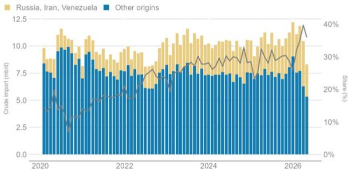

bar_line

| Year | Russia, Iran, Venezuela (mbl/d) | Other origins (mbl/d) | Russia, Iran, Venezuela (%) | Other origins (%) |
|---|---|---|---|---|
| 2020 | 9.5 | 7.8 | 14.0 | 13.0 |
| 2021 | 10.5 | 8.5 | 12.5 | 11.5 |
| 2022 | 9.8 | 7.5 | 15.5 | 14.5 |
| 2023 | 10.8 | 7.2 | 16.5 | 16.0 |
| 2024 | 10.5 | 7.0 | 17.5 | 17.5 |
| 2025 | 10.8 | 7.3 | 18.5 | 18.0 |
| 2026 | 11.5 | 6.8 | 20.5 | 20.0 |
Note: The chart displays a line graph on the right axis showing the crude oil share (%) over time from 2020 to 2026. The data for 'Other origins' is not explicitly labeled in the image but is included in the legend.

Source: Vortexa, MS

Exhibit 82:   
Upstream capital cost   
Index: 1Q 2000 = 100   

line

| Year | Deepwater | Land | Offshore | Overall UCCI |
|------|-----------|------|----------|--------------|
| 2000 | 100       | 100  | 100      | 100          |
| 2005 | 180       | 160  | 200      | 190          |
| 2010 | 230       | 200  | 240      | 230          |
| 2015 | 170       | 160  | 180      | 170          |
| 2020 | 150       | 160  | 170      | 160          |
| 2025 | 200       | 210  | 230      | 220          |

Source: S&P Global, MS

This report references jurisdiction(s) or person(s) which may be the subject of economic sanctions. Readers are solely responsible for ensuring that their investment activities are carried out in compliance with applicable laws.

# Disclosure Section

The information and opinions in MS were prepared or are disseminated by MS & Co. LLC and/or MS C.T.V.M. S.A. and/or MS México, Casa de Bolsa, S.A. de C.V. and/or MS Canada Limited and/or MS & Co. International plc and/or MS Europe S.E. and/or RMB MS Proprietary Limited and/or MS MUFG Securities Co., Ltd. and/or MS Capital Group Japan Co., Ltd. and/or MS Asia Limited and/or MS Asia (Singapore) Pte. (Registration number 199206298Z) and/or MS Asia (Singapore) Securities Pte Ltd (Registration number 200008434H), regulated by the Monetary Authority of Singapore (which accepts legal responsibility for its contents and should be contacted with respect to any matters arising from, or in connection with, MS) and/or MS Taiwan Limited and/or MS & Co International plc, Seoul Branch, and/or MS Australia Limited (A.B.N. 67 003 734 576, holder of Australian financial services license No. 233742, which accepts responsibility for its contents), and/or MS Wealth Management Australia Pty Ltd (A.B.N. 19 009 145 555, holder of Australian financial services license No. 24-0813, which accepts responsibility for its contents), and/or MS India Company Private Limited having Corporate Identification No (CIN) U22990MH1998PTC115305, regulated by the Securities and Exchange Board of India ("SEBI") and holder of licenses as a Research Analyst (SEBI Registration No. INH000001105), Stock Broker (SEBI Stock Broker Registration No. INZ000244438), Merchant Banker (SEBI Registration No. INM000011203), and depository participant with National Securities Depository Limited (SEBI Registration No. IN-DP-NSDL-567-2021) having registered office at Altimus, Level 39 & 40, Pandurang Budhkar Marg, Worli, Mumbai 400018, India; Telephone no. +91-22-61181000; Compliance Officer Details: Mr. Tejarshi Hardas, Tel. No.: +91-22-61181000 or Email: tejarshi.hardas@morganstanley.com; Grievance officer details: Mr. Tejarshi Hardas, Tel. No.: +91-22-61181000 or Email: msic-compliance@morganstanley.com which accepts the responsibility for its contents and should be contacted with respect to any matters arising from, or in connection with, MS, and their affiliates (collectively, "MS"). MS India Company Private Limited (MSICPL) may use AI tools in providing research services. All recommendations contained herein are made by the duly qualified research analysts.

For important disclosures, stock price charts and equity rating histories regarding companies that are the subject of this report, please see the MS Disclosure Website at www.morganstanley.com/eqr/disclosures/webapp/generalresearch, or contact your investment representative or MS at 1585 Broadway, (Attention: Research Management), New York, NY, 10036 USA.

For valuation methodology and risks associated with any recommendation, rating or price target referenced in this research report, please contact the Client Support Team as follows: US/Canada +1 800 303-2495; Hong Kong +852 2848-5999; Latin America +1 718 754-5444 (U.S.); London +44 (0)20-7425-8169; Singapore +65 6834-6860; Sydney +61 (0)2-9770-1505; Tokyo +81 (0)3-6836-9000. Alternatively you may contact your investment representative or MS at 1585 Broadway, (Attention: Research Management), New York, NY 10036 USA.

# Analyst Certification

The following analysts hereby certify that their views about the companies and their securities discussed in this report are accurately expressed and that they have not received and will not receive direct or indirect compensation in exchange for expressing specific recommendations or views in this report: Amy Gower (Amy Sergeant), CFA; Martijn Rats, CFA.

# Global Research Conflict Management Policy

MS has been published in accordance with our conflict management policy, which is available at www.morganstanley.com/institutional/research/conflictpolicies. A Portuguese version of the policy can be found at www.morganstanley.com.br

# Important Regulatory Disclosures on Subject Companies

The equity research analysts or strategists principally responsible for the preparation of MS have received compensation based upon various factors, including quality of research, investor client feedback, stock picking, competitive factors, firm revenues and overall investment banking revenues. Equity Research analysts' or strategists' compensation is not linked to investment banking or capital markets transactions performed by MS or the profitability or revenues of particular trading desks.

MS and its affiliates do business that relates to companies/instruments covered in MS, including market making, providing liquidity, fund management, commercial banking, extension of credit, investment services and investment banking. MS sells to and buys from customers the securities/instruments of companies covered in MS on a principal basis. MS may have a position in the debt of the Company or instruments discussed in this report. MS trades or may trade as principal in the debt securities (or in related derivatives) that are the subject of the debt research report.

Certain disclosures listed above are also for compliance with applicable regulations in non-US jurisdictions.

# STOCK RATINGS

MS uses a relative rating system using terms such as Overweight, Equal-weight, Not-Rated or Underweight (see definitions below). MS does not assign ratings of Buy, Hold or Sell to the stocks we cover. Overweight, Equal-weight, Not-Rated and Underweight are not the equivalent of buy, hold and sell. Investors should carefully read the definitions of all ratings used in MS. In addition, since MS contains more complete information concerning the analyst's views, investors should carefully read MS, in its entirety, and not infer the contents from the rating alone. In any case, ratings (or research) should not be used or relied upon as investment advice. An investor's decision to buy or sell a stock should depend on individual circumstances (such as the investor's existing holdings) and other considerations.

# Global Stock Ratings Distribution

(as of May 31, 2026)

The Stock Ratings described below apply to MS's Fundamental Equity Research and do not apply to Debt Research produced by the Firm.

For disclosure purposes only (in accordance with FINRA requirements), we include the category headings of Buy, Hold, and Sell alongside our ratings of Overweight, Equal-weight, Not-Rated and Underweight. MS does not assign ratings of Buy, Hold or Sell to the stocks we cover. Overweight, Equal-weight, Not-Rated and Underweight are not the equivalent of buy, hold, and sell but represent recommended relative weightings (see definitions below). To satisfy regulatory requirements, we correspond Overweight, our most positive stock rating, with a buy recommendation; we correspond Equal-weight and Not-Rated to hold and Underweight to sell recommendations, respectively.

<table><tr><td></td><td colspan="2">Coverage Universe</td><td colspan="3">Investment Banking Clients (IBC)</td><td colspan="2">Other Material Investment ServicesClients (MISC)</td></tr><tr><td>Stock RatingCategory</td><td>Count</td><td>% of Total</td><td>Count</td><td>% of Total IBC</td><td>% of RatingCategory</td><td>Count</td><td>% of Total OtherMISC</td></tr><tr><td>Overweight/Buy</td><td>1542</td><td>42%</td><td>465</td><td>51%</td><td>30%</td><td>707</td><td>43%</td></tr><tr><td>Equal-weight/Hold</td><td>1571</td><td>43%</td><td>369</td><td>40%</td><td>23%</td><td>723</td><td>44%</td></tr><tr><td>Not-Rated/Hold</td><td>3</td><td>0%</td><td>0</td><td>0%</td><td>0%</td><td>1</td><td>0%</td></tr><tr><td>Underweight/Sell</td><td>551</td><td>15%</td><td>86</td><td>9%</td><td>16%</td><td>201</td><td>12%</td></tr><tr><td>Total</td><td>3,667</td><td></td><td>920</td><td></td><td></td><td>1632</td><td></td></tr></table>

Data include common stock and ADRs currently assigned ratings. Investment Banking Clients are companies from whom MS received investment banking compensation in the last 12 months. Due to rounding off of decimals, the percentages provided in the "% of total" column may not add up to exactly 100 percent.

# Analyst Stock Ratings

Overweight (O or Over) - The stock's total return is expected to exceed the total return of the relevant country MSCI Index or the average total return of the analyst's industry (or industry team's) coverage universe, on a risk-adjusted basis over the next 12-18 months.

Equal-weight (E or Equal) - The stock's total return is expected to be in line with the total return of the relevant country MSCI Index or the average total return of the analyst's industry (or industry team's) coverage universe, on a risk-adjusted basis over the next 12-18 months.

Not-Rated (NR) - Currently the analyst does not have adequate conviction about the stock's total return relative to the relevant country MSCI Index or the average total return of the analyst's industry (or industry team's) coverage universe, on a risk-adjusted basis, over the next 12-18 months.

Underweight (U or Under) - The stock's total return is expected to be below the total return of the relevant country MSCI Index or the average total return of the analyst's industry (or industry team's) coverage universe, on a risk-adjusted basis, over the next 12-18 months.

Unless otherwise specified, the time frame for price targets included in MS is 12 to 18 months.

# Analyst Industry Views

Attractive (A): The analyst expects the performance of his or her industry coverage universe over the next 12-18 months to be attractive vs. the relevant broad market benchmark, as indicated below.

In-Line (I): The analyst expects the performance of his or her industry coverage universe over the next 12-18 months to be in line with the relevant broad market benchmark, as indicated below. Cautious (C): The analyst views the performance of his or her industry coverage universe over the next 12-18 months with caution vs. the relevant broad market benchmark, as indicated below. Benchmarks for each region are as follows: North America - S&P 500; Latin America - relevant MSCI country index or MSCI Latin America Index; Europe - MSCI Europe; Japan - TOPIX; Asia - relevant MSCI country index or MSCI sub-regional index or MSCI AC Asia Pacific ex Japan Index.

# Important Disclosures for MS Smith Barney LLC Customers

Important disclosures regarding any material conflict of interest that can reasonably be expected to have influenced MS Smith Barney LLC's choice of a third-party research provider or the subject company of a third-party research report, are available on the MS Wealth Management disclosure website at www.morganstanley.com/online/researchdisclosures. For MS specific disclosures, you may refer to https://www.morganstanley.com/eqr/disclosures/webapp/generalresearch.

Each MS report is reviewed and approved on behalf of MS Smith Barney LLC. This review and approval is conducted by the same person who reviews the research report on behalf of MS. This could create a conflict of interest.

# Other Important Disclosures

MS policy is to update research reports as and when the Research Analyst and Research Management deem appropriate, based on developments with the issuer, the sector, or the market that may have a material impact on the research views or opinions stated therein. In addition, certain Research publications are intended to be updated on a regular periodic basis (weekly/monthly/quarterly/annual) and will ordinarily be updated with that frequency, unless the Research Analyst and Research Management determine that a different publication schedule is appropriate based on current conditions.

MS is not acting as a municipal advisor and the opinions or views contained herein are not intended to be, and do not constitute, advice within the meaning of Section 975 of the Dodd-Frank Wall Street Reform and Consumer Protection Act.

MS produces an equity research product called a "Tactical Idea." Views contained in a "Tactical Idea" on a particular stock may be contrary to the recommendations or views expressed in research on the same stock. This may be the result of differing time horizons, methodologies, market events, or other factors. For all research available on a particular stock, please contact your sales representative or go to Matrix at http://www.morganstanley.com/matrix.

MS is provided to our clients through our proprietary research portal on Matrix and also distributed electronically by MS to clients. Certain, but not all, MS products are also made available to clients through third-party vendors or redistributed to clients through alternate electronic means as a convenience. For access to all available MS, please contact your sales representative or go to Matrix at http://www.morganstanley.com/matrix.

Any access and/or use of MS is subject to MS's Terms of Use (http://www.morganstanley.com/terms.html). By accessing and/or using MS, you are indicating that you have read and agree to be bound by our Terms of Use (http://www.morganstanley.com/terms.html). In addition you consent to MS processing your personal data and using cookies in accordance with our Privacy Policy and our Global Cookies Policy (http://www.morganstanley.com/privacy\_pledge.html), including for the purposes of setting your preferences and to collect readership data so that we can deliver better and more personalized service and products to you. To find out more information about how MS processes personal data, how we use cookies and how to reject cookies see our Privacy Policy and our Global Cookies Policy (http://www.morganstanley.com/privacy\_pledge.html). Please use the provided link to review the Terms and Conditions and Most Important Terms and Conditions for MS India Company Private Limited (https://www.morganstanley.com/assets/pdfs/about-us-global-offices/india/Terms\_and\_conditions.pdf) and the following link to review the audit report (https://ny.matrix.ms.com/eqr/research/webapp/researchdocs/MSICPL\_Morgan\_Stanley\_Research\_Audit\_Report.pdf).

If you do not agree to our Terms of Use and/or if you do not wish to provide your consent to MS processing your personal data or using cookies please do not access our research.

MS does not provide individually tailored investment advice. MS has been prepared without regard to the circumstances and objectives of those who receive it. MS recommends that investors independently evaluate particular investments and strategies, and encourages investors to seek the advice of a financial adviser. The appropriateness of an investment or strategy will depend on an investor's circumstances and objectives. The securities, instruments, or strategies discussed in MS may not be suitable for all investors, and certain investors may not be eligible to purchase or participate in some or all of them. MS is not an offer to buy or sell or the solicitation of an offer to buy or sell any security/instrument or to participate in any particular trading strategy. The value of and income from your investments may vary because of changes in interest rates, foreign exchange rates, default rates, prepayment rates, securities/instruments prices, market indexes, operational or financial conditions of companies or other factors. There may be time limitations on the exercise of options or other rights in securities/instruments transactions. Past performance is not necessarily a guide to future performance. Estimates of future performance are based on assumptions that may not be realized. If provided, and unless otherwise stated, the closing price on the cover page is that of the primary exchange for the subject company's securities/instruments.

The fixed income research analysts, strategists or economists principally responsible for the preparation of MS have received compensation based upon various factors, including quality, accuracy and value of research, firm profitability or revenues (which include fixed income trading and capital markets profitability or revenues), client feedback and competitive factors. Fixed Income Research analysts', strategists' or economists' compensation is not linked to investment banking or capital markets transactions performed by MS or the profitability or revenues of particular trading desks.

The "Important Regulatory Disclosures on Subject Companies" section in MS lists all companies mentioned where MS owns 1% or more of a class of common equity securities of the companies. For all other companies mentioned in MS, MS may have an investment of less than 1% in securities/instruments or derivatives of securities/instruments of companies and may trade them in ways different from those discussed in MS. Employees of MS not involved in the preparation of MS may have investments in securities/instruments or derivatives of securities/instruments of companies mentioned and may trade them in ways different from those discussed in MS. Derivatives may be issued by MS or associated persons.

With the exception of information regarding MS, MS is based on public information. MS makes every effort to use reliable, comprehensive information, but we make no representation that it is accurate or complete. We have no obligation to tell you when opinions or information in MS change apart from when we intend to discontinue equity research coverage of a subject company. Facts and views presented in MS have not been reviewed by, and may not reflect information known to, professionals in other MS business areas, including investment banking personnel.

MS personnel may participate in company events such as site visits and are generally prohibited from accepting payment by the company of associated expenses unless pre-approved by authorized members of Research management.

MS may make investment decisions that are inconsistent with the recommendations or views in this report.

To our readers based in Taiwan or trading in Taiwan securities/instruments: Information on securities/instruments that trade in Taiwan is distributed by MS Taiwan Limited ("MSTL"). Such information is for your reference only. The reader should independently evaluate the investment risks and is solely responsible for their investment decisions. MS may not be distributed to the public media or quoted or used by the public media without the express written consent of MS. Any non-customer reader within the scope of Article 7-1 of the Taiwan Stock Exchange Recommendation Regulations accessing and/or receiving MS is not permitted to provide MS to any third party (including but not limited to related parties, affiliated companies and any other third parties) or engage in any activities regarding MS which may create or give the appearance of creating a conflict of interest. Information on securities/instruments that do not trade in Taiwan is for informational purposes only and is not to be construed as a recommendation or a solicitation to trade in such securities/instruments. MSTL may not execute transactions for clients in these securities/instruments.

Certain information in MS was sourced by employees of the Shanghai Representative Office of MS Asia Limited for the use of MS Asia Limited. MS is not incorporated under PRC law and the research in relation to this report is conducted outside the PRC. MS does not constitute an offer to sell or the solicitation of an offer to buy any securities in the PRC. PRC investors shall have the relevant qualifications to invest in such securities and shall be responsible for obtaining all relevant approvals, licenses, verifications and/or registrations from the relevant governmental authorities themselves. Neither this report nor any part of it is intended as, or shall constitute, provision of any consultancy or advisory service of securities investment as defined under PRC law. Such information is provided for your reference only.

MS is disseminated in Brazil by MS C.T.V.M. S.A. located at Av. Brigadeiro Faria Lima, 3600, 6th floor, São Paulo - SP, Brazil; and is regulated by the Comissão de Valores Mobiliários; in Mexico by MS México, Casa de Bolsa, S.A. de C.V which is regulated by Comision Nacional Bancaria y de Valores. Paseo de los Tamarindos 90, Torre 1, Col. Bosques de las Lomas Floor 29, 05120 Mexico City; in Japan by MS MUFG Securities Co., Ltd. and, for Commodities related research reports only, MS Capital Group Japan Co., Ltd; in Hong Kong by MS Asia Limited (which accepts responsibility for its contents) and by MS Bank Asia Limited; in Singapore by MS Asia (Singapore) Pte. (Registration number 199206298Z) and/or MS Asia (Singapore) Securities Pte Ltd (Registration number 200008434H), regulated by the Monetary Authority of Singapore (which accepts legal responsibility for its contents and should be contacted with respect to any matters arising from, or in connection with, MS) and by MS Bank Asia Limited, Singapore Branch (Registration number T14FC0118J); in Australia to "wholesale clients" within the meaning of the Australian Corporations Act by MS Australia Limited A.B.N. 67 003 734 576, holder of Australian financial services license No. 233742, which accepts responsibility for its contents; in Australia to "wholesale clients" and "retail clients" within the meaning of the Australian Corporations Act by MS Wealth Management Australia Pty Ltd (A.B.N. 19 009 145 555, holder of Australian financial services license No. 240813, which accepts responsibility for its contents; in Korea by MS & Co International plc, Seoul Branch; in India by MS India Company Private Limited having Corporate Identification No (CIN) U22990MH1998PTC115305, regulated by the Securities and Exchange Board of India ("SEBI") and holder of licenses as a Research Analyst (SEBI Registration No. INH000001105); Stock Broker (SEBI Stock Broker Registration No. INZ000244438), Merchant Banker (SEBI Registration No. INM000011203), and depository participant with National Securities Depository Limited (SEBI Registration No. IN-DP-NSDL-567-2021) having registered office at Altimus, Level 39 & 40, Pandurang Budhkar Marg, Worli, Mumbai 400018, India; Telephone no. +91-22-61181000; Compliance Officer Details: Mr. Tejarshi Hardas, Tel. No.: +91-22-61181000 or Email: tejarshi.hardas@morganstanley.com; Grievance officer details: Mr. Tejarshi Hardas, Tel. No.: +91-22-61181000 or Email: msic-compliance@morganstanley.com. MS India Company Private Limited (MSICPL) may use AI tools in providing research services. All recommendations contained herein are made by the duly qualified research analysts; in Canada by MS Canada Limited; in Germany and the European Economic Area where required by MS Europe S.E., authorised and regulated by Bundesanstalt fuer Finanzdienstleistungsaufsicht (BaFin) under the reference number 149169; in the US by MS & Co. LLC, which accepts responsibility for its contents. MS & Co. International plc, authorized by the Prudential Regulation Authority and regulated by the Financial Conduct Authority and the Prudential Regulation Authority, disseminates in the UK research that it has prepared, and research which has been prepared by any of its affiliates, only to persons who (i) are investment professionals falling within Article 19(5) of the Financial Services and Markets Act 2000 (Financial Promotion) Order 2005 (as amended, the "Order"); (ii) are persons who are high net worth entities falling within Article 49(2)(a) to (d) of the Order; or (iii) are persons to whom an invitation or inducement to engage in investment activity (within the meaning of section 21 of the Financial Services and Markets Act 2000, as amended) may otherwise lawfully be communicated or caused to be communicated. RMB MS Proprietary Limited is a member of the JSE Limited and A2X (Pty) Ltd. RMB MS Proprietary Limited is a joint venture owned equally by MS International Holdings Inc. and RMB Investment Advisory (Proprietary) Limited, which is wholly owned by FirstRand Limited. The information in MS is being disseminated by MS Saudi Arabia, regulated by the Capital

Market Authority in the Kingdom of Saudi Arabia, and is directed at Sophisticated investors only.

The information in MS is being communicated by MS & Co. International plc (DIFC Branch), regulated by the Dubai Financial Services Authority (the DFSA) or by MS & Co. International plc (ADGM Branch), regulated by the Financial Services Regulatory Authority Abu Dhabi (the FSRA), and is directed at Professional Clients only, as defined by the DFSA or the FSRA, respectively. The financial products or financial services to which this research relates will only be made available to a customer who we are satisfied meets the regulatory criteria of a Professional Client. A distribution of the different MS Research ratings or recommendations, in percentage terms for Investments in each sector covered, is available upon request from your sales representative.

The information in MS is being communicated by MS & Co. International plc (QFC Branch), regulated by the Qatar Financial Centre Regulatory Authority (the QFCRA), and is directed at business customers and market counterparties only and is not intended for Retail Customers as defined by the QFCRA.

As required by the Capital Markets Board of Turkey, investment information, comments and recommendations stated here, are not within the scope of investment advisory activity. Investment advisory service is provided exclusively to persons based on their risk and income preferences by the authorized firms. Comments and recommendations stated here are general in nature. These opinions may not fit to your financial status, risk and return preferences. For this reason, to make an investment decision by relying solely to this information stated here may not bring about outcomes that fit your expectations.

The trademarks and service marks contained in MS are the property of their respective owners. Third-party data providers make no warranties or representations relating to the accuracy, completeness, or timeliness of the data they provide and shall not have liability for any damages relating to such data. The Global Industry Classification Standard (GICS) was developed by and is the exclusive property of MSCI and S&P.

MS, or any portion thereof may not be reprinted, sold or redistributed without the written consent of MS.

Indicators and trackers referenced in MS may not be used as, or treated as, a benchmark under Regulation EU 2016/1011, or any other similar framework.

The issuers and/or fixed income products recommended or discussed in certain fixed income research reports may not be continuously followed. Accordingly, investors should regard those fixed income research reports as providing stand-alone analysis and should not expect continuing analysis or additional reports relating to such issuers and/or individual fixed income products. MS may hold, from time to time, material financial and commercial interests regarding the company subject to the Research report.

Registration granted by SEBI and certification from the National Institute of Securities Markets (NISM) in no way guarantee performance of the intermediary or provide any assurance of returns to investors. Investment in securities market are subject to market risks. Read all the related documents carefully before investing.

© 2026 MS