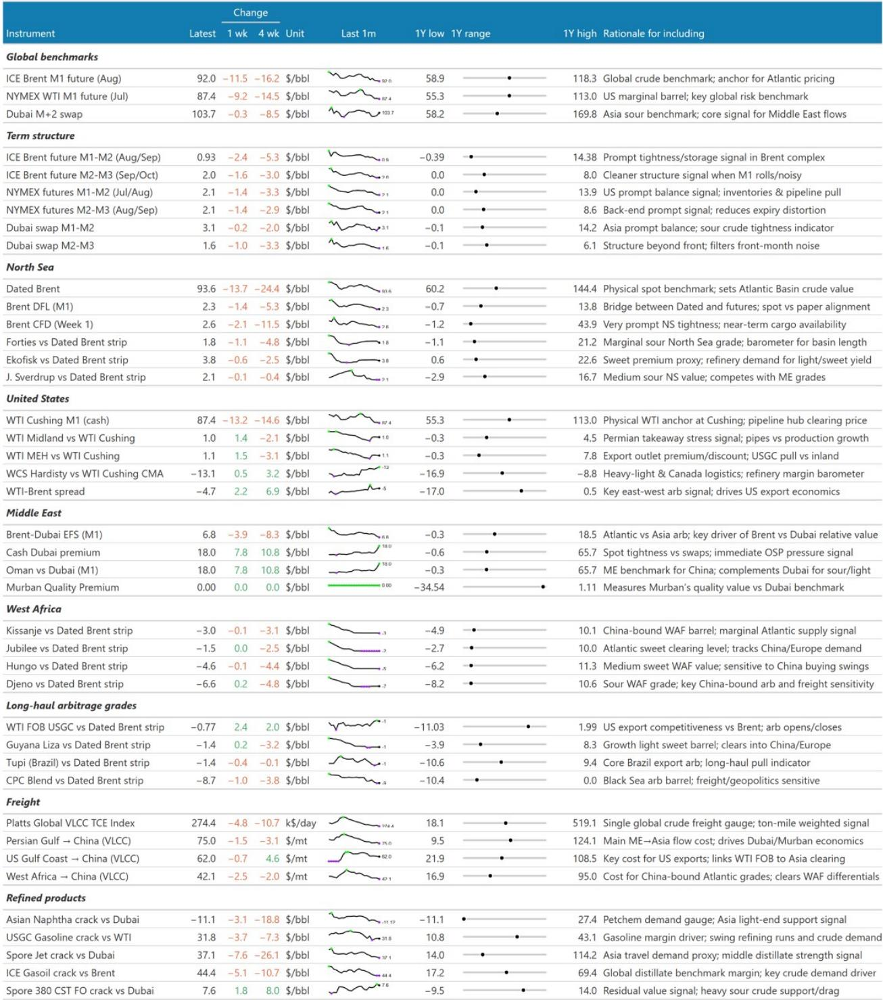
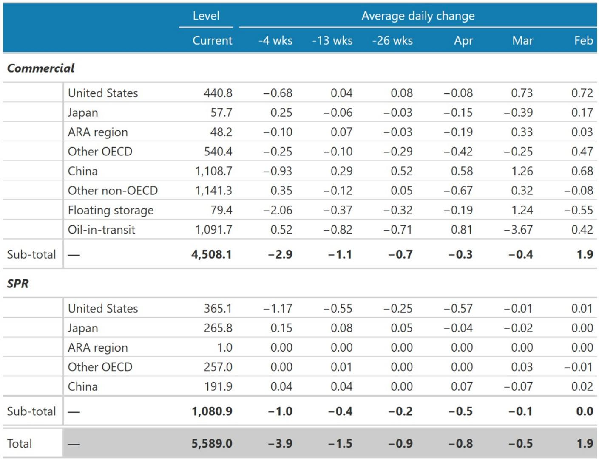
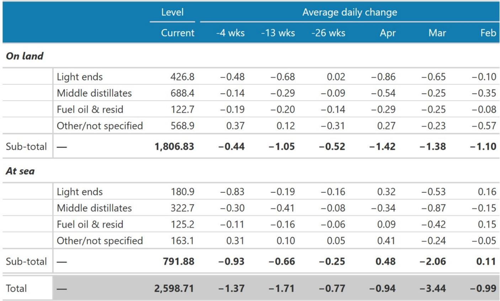

# 市场真正低估的不是需求，而是供给恢复的速度

当前布伦特原油价格约92美元/桶，经通胀调整后恰好处于过去二十年的中位数水平。这个数字本身并不引人注目，真正引人注目的是它所隐含的预期：市场正在对一个“干净且近在咫尺”的供应恢复进行定价。但某外资投行最新发布的研报提出了一个截然不同的判断——供应恢复的速度将远比市场预期的更慢、更曲折，而当前价格已经计入了过于乐观的假设。

这份由该行首席商品策略师领衔的报告，调整了其对霍尔木兹海峡重新开放及后续产量恢复路径的建模假设。核心结论是：即便海峡在7月下旬重新开放，产量恢复到正常水平也需要至少4个月，且恢复过程将呈现明显的“前慢后快”特征。在此基础上，该行维持三季度布伦特100美元/桶的预测，并将四季度预测从90美元上调至95美元，2027年一季度从80美元上调至85美元。

在92美元的现货价格面前，维持近端预测本身就是看多的信号。但这篇报告真正值得关注的地方，不在于价格预测本身，而在于它揭示了一个被市场系统性低估的结构性问题：大规模断供后的供给恢复，其复杂性和时间成本远超大多数投资者的直觉。

## 1. 市场的定价逻辑建立在“快速恢复”这一尚未验证的假设之上

当前油价最令人困惑的特征不是价格水平，而是价格曲线的形态。自5月中旬以来，布伦特近月期货的价差结构已经大幅走平。近月布伦特CFD——最能反映现货市场紧张程度的指标——从5.7美元/桶降至2.6美元/桶，M1-M2价差从3.8美元/桶降至不足1美元。这意味着，市场不仅没有对供应风险进行重新定价，反而在过去三周里变得更加乐观。

这种乐观情绪的逻辑链条是清晰的：市场参与者相信，一旦政治协议达成，供应将迅速恢复。但这份报告指出，这条逻辑链上的每一个环节都存在显著的不确定性。

报告将其对海峡重新开放的建模假设从5月底推迟到7月下旬。这并非简单的日期推迟，而是反映了两个层面的判断：第一，截至报告撰写时，美伊之间尚未达成任何协议或谅解备忘录，谈判可能还需要数周时间；第二，即便政治协议达成，排雷、商业信心重建、保险条款重新协商等操作层面的问题，还需要额外数周时间。

这里的关键洞察是：政治协议与供应恢复之间，存在一个被市场严重低估的“执行鸿沟”。市场将“达成协议”等同于“供应恢复”，但实际的时间线要复杂得多。对于资产定价而言，这意味着当前油价所隐含的“V型恢复”路径，可能面临系统性向上修正的风险。

## 2. 供应恢复面临六重瓶颈，每一重都可能导致延迟

报告详细列举了供应恢复过程中需要克服的六重障碍，这些障碍的叠加效应是理解供给恢复速度的关键。

第一重是安全与保险问题。即便海峡被宣布重新开放，船东和保险公司需要看到切实的证据，证明通行是安全的。排雷本身就需要数周到数月的时间。

第二重是油轮错配。过去数月间，无法进入海峡的油轮已经改道至美国墨西哥湾、西非、巴西等地。沙特阿美CEO在一季度业绩会上将其称为“最大的问题”，并指出即使在最乐观的情景下，供应链也需要数月时间才能恢复正常。虽然海峡外有少量空置油轮可以立即投入使用，但大规模的油轮重新部署需要时间。

第三重是存储空间。油井无法在储油设施已满的情况下恢复生产。这对于伊拉克和科威特等缺乏管道出口能力的国家尤为重要，它们的海运出口实际上已降至零。

第四重是油田重启的技术难度。根据Rystad Energy的数据，海湾六国约有1万口油井处于停产状态。停产时间越长，重启难度越大。报告引用了Rystad的估算：停产两个月后面临重启约束的油井约2800口，四个月后增至4100口，六个月后超过5000口。报告假设7月下旬恢复生产意味着停产约4.5至5个月，对应约4000至5000口油井存在重启困难。

第五重是基础设施损坏。物理损坏主要集中在炼油和出口终端，而非原油生产环节。受损炼油能力约430万桶/日，其中约250万桶/日仍处于停运状态。修复这些设施可能需要2至3个季度。

第六重是油服和人员的重新部署。在冲突期间，油服公司已经撤出了大量人员和设备，特别是在严重依赖国际服务商的科威特和伊拉克。重新调配这些资源需要时间。

这六重障碍的叠加效应意味着，即便海峡在7月下旬重新开放，产量恢复到正常水平也需要4个月，且恢复曲线将呈现“前慢后快”的特征。报告将恢复路径从“3个月恢复70%”调整为“4个月恢复75%”，这个调整本身就反映了对恢复速度的审慎判断。

## 3. 当前的市场缓冲机制正在被侵蚀

市场之所以能够在如此大规模的供应冲击下保持相对稳定，主要得益于三个缓冲机制：美国的高出口、中国的低进口，以及市场对海峡即将重新开放的持续预期。

美国的高出口确实在一定程度上填补了中东供应的缺口。美国原油出口量在冲突期间保持高位，部分抵消了中东出口的下降。中国的低进口则减少了全球市场的需求压力——中国在冲突前就降低了原油采购量，这使得原本可能流向中国的油轮得以转向其他市场。

但问题在于，这三个缓冲机制都有其局限性。美国出口不可能无限增长，中国的进口需求也不会永远低迷，而“预期重新开放”这一缓冲本身就是不稳定的——它建立在尚未被验证的假设之上。

报告特别指出，三季度市场将保持与二季度同样紧张的状态，库存将进一步下降。这意味着，当前的缓冲机制可能难以在整个三季度维持。

## 4. 报告尚未完全回答的关键问题：需求侧的反应

这份报告的分析框架主要集中在供给端，对于需求侧的分析相对有限。这是报告本身明确承认的局限，也是读者需要自行判断的关键变量。

一个尚未被充分回答的问题是：高油价对需求的影响是否被低估？当前92美元/桶的布伦特价格，经通胀调整后处于20年中位数水平，但考虑到全球经济增长的放缓，这个价格水平对需求的实际抑制效应可能被低估。特别是在欧洲和部分新兴市场，能源成本已经对工业生产和消费者支出产生了显著影响。

另一个需要关注的问题是：中国的需求恢复路径。中国在冲突前降低了原油采购量，但未来是否会重新增加采购？如果中国需求恢复，将如何影响全球供需平衡？报告对此着墨不多，但这可能是影响油价走势的关键变量。

此外，报告对于OPEC+可能的反应也未做深入分析。如果油价持续高于100美元/桶，OPEC+是否会调整产量政策？这个问题在当前环境下尤为重要，因为OPEC+的产量决策将直接影响供给恢复的速度和节奏。

## 5. 从这份报告中可以提炼出一个观察框架

对于投资者而言，与其关注具体的价格预测，不如从这份报告中提炼出一个可供持续跟踪的观察框架。这个框架包含三个核心维度。

第一个维度是海峡重新开放的时间点。这不是一个“是或否”的二元问题，而是一个需要持续跟踪的变量。关注点不应仅限于政治谈判的进展，还应包括排雷进度、保险条款变化、油轮重新部署等操作层面的信号。

第二个维度是产量恢复的斜率。报告提出的“4个月恢复75%”是一个基准假设，但实际恢复速度可能快于或慢于这个假设。关键跟踪指标包括：伊拉克和沙特的海运出口数据、油井重启数量、以及油服公司的订单和人员部署情况。

第三个维度是库存变化。报告预计三季度库存将进一步下降，这是判断供需紧张程度的核心指标。如果库存下降速度超出预期，可能意味着供给恢复比预想的更慢，或者需求比预想的更强。

这三个维度构成了一个动态的评估框架。投资者可以根据新的数据和事件，不断修正对供给恢复路径的判断，而不是固守某个静态的价格预测。

---

以上分析仅覆盖了这份报告核心逻辑的一部分。报告还详细讨论了霍尔木兹海峡关闭以来的全球油轮动态、库存变化、以及不同情景下的价格路径。这些内容对于理解当前油市的完整图景至关重要，但受限于篇幅，无法在此一一展开。

欢迎来星球微信群里继续讨论。我们将围绕这份报告的核心假设——特别是供给恢复速度的建模逻辑、以及市场定价中隐含的偏差——进行更深入的拆解和辩论。同时，我们也会持续跟踪海峡局势的最新进展，分享来自不同机构的多维度分析视角。

Personal reading notes and learning share only. Not investment advice.

