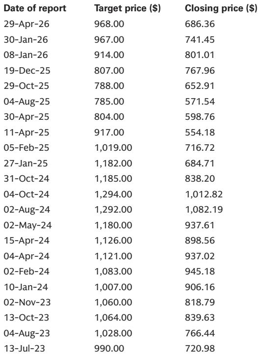
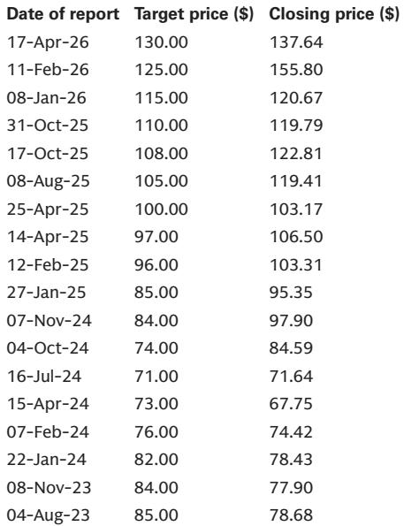
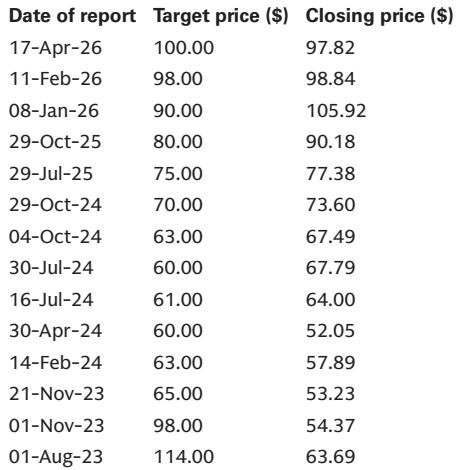

# The ASCO 2026 Data Flow Has Changed the Oncology Investment Thesis: It Is No Longer About Incremental Benefit, But About Which Modalities Will Displace the Standard of Care

The American Society of Clinical Oncology (ASCO) 2026 meeting delivered a set of results that, taken together, signal a structural shift in how first-line oncology treatments will be evaluated. For years, the field has been dominated by incremental improvements—single-digit hazard ratio reductions, modest extensions in progression-free survival, and debates over quality-of-life trade-offs. That narrative is now outdated. The data presented over the weekend contain at least three instances where experimental regimens have either matched or surpassed the current standard of care in head-to-head comparisons, and in one case, achieved a first-in-class statistical victory over a PD-1 plus chemotherapy backbone.

The implications for portfolio construction in biopharma are profound. Investors who continue to treat oncology as a slow-moving, label-expansion-driven sector risk missing a wave of competitive displacement that will reshape market share within specific tumor types. The key question is no longer whether novel mechanisms will work, but which companies have the right combination of efficacy, tolerability, and commercial execution to capture the emerging first-line opportunity.

This article synthesizes the most important data points from the meeting, interprets their strategic meaning, and identifies the unresolved questions that will define the next phase of investment analysis.

## The HARMONi-6 Overall Survival Data Represents a Watershed Moment for PD-1xVEGF Bispecifics in Frontline Squamous NSCLC

The single most consequential data point from the weekend was the overall survival (OS) readout from the Phase 3 HARMONi-6 trial. Ivonescimab, a PD-1xVEGF bispecific antibody, combined with chemotherapy, demonstrated a statistically significant and clinically meaningful OS benefit of 27.9 months versus 23.7 months for Tevimbra plus chemotherapy in frontline squamous non-small cell lung cancer. The hazard ratio of 0.66 corresponds to a 34% reduction in the risk of death, and this benefit was consistent across PD-L1 subgroups, including patients with tumor proportion scores below 1%.

Why this matters is not just the magnitude of the effect, but the comparator. Tevimbra is a PD-1 inhibitor that is functionally similar to Keytruda, the global standard of care. This is the first time any regimen has demonstrated a statistically significant OS benefit over a PD-1 plus chemotherapy backbone in a Phase 3 study in frontline NSCLC. The data exceeded the bar of HR less than 0.72 that had been set by investor conversations and physician expectations.

The strategic implication is clear. If ivonescimab can replicate this benefit in the ongoing global Phase 3 HARMONi-3 study, which pits it directly against Keytruda plus chemotherapy, the competitive landscape for first-line NSCLC will be fundamentally altered. The bispecific approach, by simultaneously blocking PD-1 and VEGF, appears to offer a synergistic advantage that single-agent PD-1 inhibitors cannot match. Investors should watch for the final PFS and interim OS data from HARMONi-3, expected in the second half of this year, as a binary catalyst for the thesis.

## The Colorectal Cancer Data Supports a Broader Platform Thesis, But Raises Questions About Dose Optimization and Regional Variability

Beyond lung cancer, the ivonescimab story extends into colorectal cancer, where interim Phase 2 data were presented. In frontline metastatic colorectal cancer, ivonescimab at 20 mg/kg combined with mFOLFOX6 chemotherapy achieved an objective response rate of 70.8% and a disease control rate of 100% in each treatment arm. The landmark 9-month progression-free survival rate was 76.1% for the higher dose, and median PFS was not reached.

The data are encouraging, particularly when compared to a competing PD-1xVEGF molecule from Pfizer, which showed a confirmed ORR of 57.1% in a similar Phase 2 study. However, several unresolved questions remain. First, the higher dose of 20 mg/kg was associated with a modest increase in toxicity, including VEGF-related adverse events. While physicians are accustomed to managing these events due to the widespread use of bevacizumab, the tolerability profile will need to be confirmed in a larger, randomized setting. Second, the study population was predominantly Asian, with only nine patients from the United States. While the presenting investigator noted consistent responses across regions, the small U.S. sample size limits the generalizability of the data.

The ongoing global Phase 3 HARMONi-GI3 study will be the definitive test. If ivonescimab can demonstrate a statistically significant PFS or OS benefit over bevacizumab plus chemotherapy, it would open a multi-billion dollar opportunity in colorectal cancer, a tumor type where immunotherapy has historically struggled. The dose selection of 20 mg/kg is reasonable given the durability advantage, but the toxicity trade-off will need to be carefully managed in the commercial setting.

## The Desmoid Tumor Data Validates a Best-in-Class Thesis, But the Commercial Path Depends on Physician Adoption and Reimbursement

The full results from the Phase 3 RINGSIDE study of varegacestat in desmoid tumors further solidify its position as a best-in-class gamma-secretase inhibitor. The drug demonstrated a progression-free survival hazard ratio of 0.16, an objective response rate of 56%, and a tumor volume reduction of 83%. All alpha-controlled secondary endpoints, including pain relief metrics, achieved statistical significance.

The comparison with the currently approved drug, Ogsiveo, is instructive. While cross-trial comparisons are inherently limited, the data suggest that varegacestat offers deeper responses, superior tumor volume reduction, and more rapid improvement in pain. Additionally, varegacestat showed a lower rate of ovarian toxicity in premenopausal women, a meaningful differentiator for a patient population that is often younger and concerned about fertility.

However, the commercial path is not without risk. The presenting investigator noted that both drugs are in the same class, and the lack of a head-to-head study leaves room for competitive positioning. The question of optimal treatment duration remains unresolved, as long-term data for Ogsiveo suggest that only a small number of additional responses are observed with continued therapy. If physicians conclude that continuous treatment is not necessary, the total addressable market may be smaller than peak revenue estimates suggest.

The NDA submission for varegacestat is expected in the second quarter, and a European Marketing Authorization Application is planned by year-end 2026. The peak sales estimate of $1.6 billion by 2037 is achievable, but it depends on successful label expansion, physician education, and reimbursement negotiations. Investors should monitor the label language carefully, particularly any restrictions related to prior therapy or mutation status.

## The Gilead Data Confirms TUB-040 as a Leading Emerging Therapy in Ovarian Cancer, But the Competitive Landscape Is Crowded

The updated Phase 1 data for TUB-040, a NaPi2b-targeting exatecan ADC, in platinum-resistant ovarian cancer were broadly in line with the prior ESMO update and continue to support a differentiated profile. The confirmed overall response rate of 61%, median PFS of 11 months, and a disease control rate of 96% significantly outperform the historical standard of care, which typically yields a median PFS of approximately five months.

The safety profile is particularly noteworthy. There were no clinically relevant cases of interstitial lung disease, ocular toxicity, or peripheral neuropathy, which are common off-target toxicities for other ADCs in the topoisomerase inhibitor class. This suggests a wider therapeutic window and the potential for combination therapy.

However, the ovarian cancer treatment landscape is becoming increasingly crowded. Mirvetuximab soravtansine is already approved for FR-alpha-positive patients, and several other ADCs are in late-stage development. TUB-040's advantage lies in its biomarker-unselected approach, as NaPi2b is overexpressed in a broad population of high-grade serous ovarian cancer. But the registrational study, which Gilead has indicated could begin in fiscal year 2027, will need to demonstrate not just efficacy, but a clear differentiation on durability and tolerability relative to emerging competitors.

## The Trodelvy Subgroup Analyses Are Incremental, But They Confirm the Drug's Utility Across Biomarker Subgroups

The updated subgroup analyses from the ASCENT-03 and ASCENT-04 trials for Trodelvy in first-line metastatic triple-negative breast cancer were largely incremental, given that the primary results have already been published in the New England Journal of Medicine and incorporated into NCCN guidelines. However, the data do provide useful granularity. In ASCENT-04, the PFS benefit of Trodelvy plus pembrolizumab was observed across all Trop-2 expression quartiles, though it was stronger in high-expressors, with a median PFS of 16.6 months versus 9.2 months. In ASCENT-03, the benefit of Trodelvy monotherapy was maintained across tBRCA status and HER2-low subgroups.

The strategic implication is that Trodelvy is now firmly established as a standard of care in first-line TNBC for both PD-L1-positive and PD-L1-negative populations. The next question for investors is not whether Trodelvy will maintain its position, but how long it can do so before competing ADCs and combination regimens erode its market share. The NCCN guideline updates are a positive signal, but they do not immunize the drug against future competitive pressure.

## What the Report Does Not Fully Answer Yet: The Unresolved Questions That Will Define the Next Investment Cycle

Despite the wealth of data presented at ASCO 2026, several critical questions remain unanswered. First, the durability of response for ivonescimab in colorectal cancer is based on a Phase 2 study with a median follow-up of less than 10 months. The 9-month PFS rate of 76.1% is impressive, but it is not yet clear whether this benefit will translate into a statistically significant OS advantage in the Phase 3 setting.

Second, the competitive dynamics between varegacestat and Ogsiveo in desmoid tumors are not fully resolved. While the data favor varegacestat on multiple efficacy and safety metrics, the lack of a head-to-head trial means that physician preference, formulary placement, and pricing will play a significant role in determining market share. The optimal treatment duration question also introduces uncertainty into revenue forecasting.

Third, the ovarian cancer ADC space is becoming increasingly competitive, and it is not yet clear which molecule will emerge as the preferred option for biomarker-unselected patients. TUB-040's safety profile is differentiating, but the registrational study has not yet begun, and the competitive landscape may shift before it completes.

Finally, the broader question of whether PD-1xVEGF bispecifics will replace PD-1 inhibitors as the backbone of first-line immunotherapy across multiple tumor types remains open. The HARMONi-6 data in squamous NSCLC are compelling, but the HARMONi-3 data in a broader NSCLC population will be the definitive test. Investors should also watch for data in other tumor types, such as gastric and hepatocellular carcinoma, where the bispecific approach may offer similar advantages.

## A Decision Framework for Investors: How to Evaluate Oncology Data at ASCO and Beyond

Given the complexity and volume of data presented at major oncology meetings, investors need a structured framework for evaluating which data points are truly transformative and which are merely incremental. The following framework is designed to help distinguish between the two.

First, assess the comparator. The most impactful data are those that demonstrate superiority over the current standard of care in a head-to-head, randomized setting. Data that show activity in a single-arm Phase 1 or Phase 2 study are useful for generating hypotheses, but they do not provide the same level of evidence. The HARMONi-6 OS data pass this test; the Trodelvy subgroup analyses do not, because they are confirmatory rather than novel.

Second, evaluate the magnitude of the effect. A hazard ratio of 0.66 in OS is a large effect, particularly in a first-line setting where the standard of care is already effective. A hazard ratio of 0.80 or higher is more likely to be incremental and may not justify a change in clinical practice.

Third, consider the tolerability profile. A drug that is highly effective but poorly tolerated may struggle to gain physician and patient acceptance, particularly in earlier lines of therapy where patients have more treatment options. Varegacestat's lower ovarian toxicity is a meaningful differentiator; TUB-040's lack of ILD and ocular toxicity is another.

Fourth, assess the size of the addressable market. A drug that works in a small, biomarker-defined population may have a high probability of regulatory success but a limited commercial opportunity. A drug that works in a broad, biomarker-unselected population, like ivonescimab in NSCLC, has a much larger revenue potential.

Finally, evaluate the competitive timeline. A drug that is first to market in a new class has a significant advantage, but that advantage can be eroded if a second entrant offers better efficacy, tolerability, or dosing convenience. Investors should map out the competitive landscape and identify which companies have the strongest intellectual property, manufacturing, and commercial capabilities.

## Join the Community to Read the Full Report and Review the Original Charts

The ASCO 2026 data set is rich with investment implications, but the most valuable insights often come from the details that cannot be fully captured in a summary. The original report includes detailed waterfall plots, Kaplan-Meier curves, and subgroup analyses that are essential for a thorough evaluation of each drug's profile. It also contains the analysts' price targets, revenue models, and risk assessments, which are not included in this article.

To access the full report and the original charts, join the community today. The analysis presented here is intended to frame the key strategic questions, but the full report provides the data and context needed to make informed investment decisions.

*This article is for learning and discussion only and does not constitute investment advice.*

Personal reading notes and learning share only. Not investment advice.

