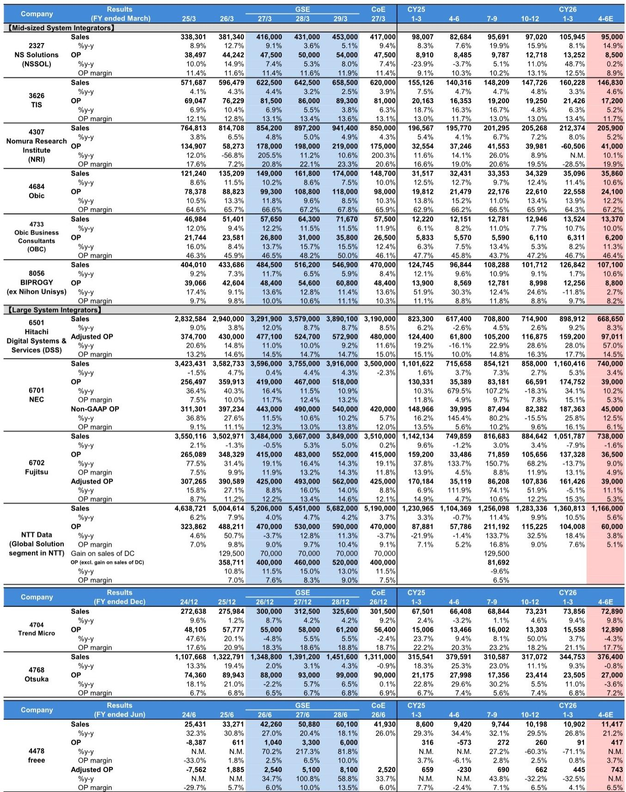
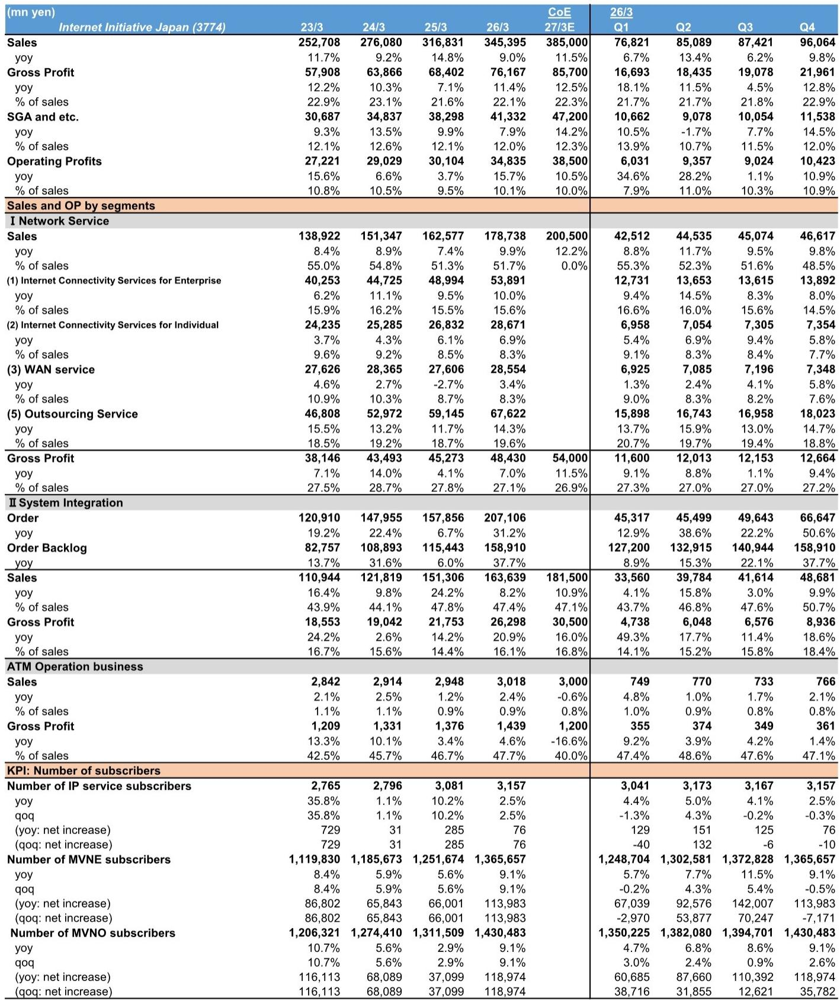
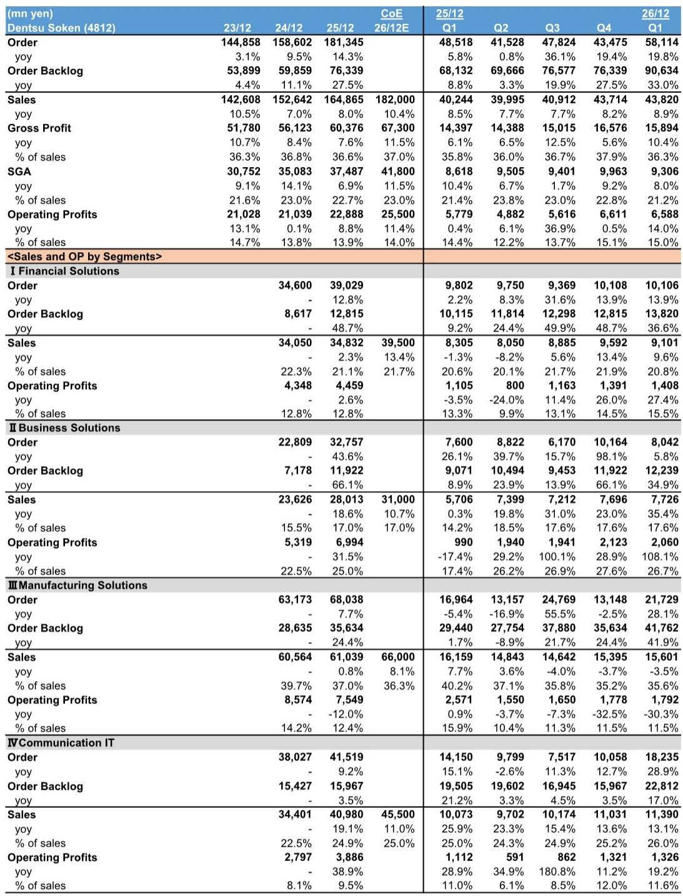

# 日本IT服务业的真正拐点，藏在两家非覆盖公司的财报细节里

当市场还在为宏观利率和地缘政治焦虑时，日本IT服务板块的底层需求正在发生结构性的变化。某外资投行近期发布了一份特殊的研报——它并非针对其覆盖的头部公司，而是通过调研两家未覆盖的中间层系统集成商和网络集成商，得出了一个对全行业都有意义的判断：网络基础设施建设的结构性需求正在成为驱动利润增长的新引擎，而这一趋势被市场系统性低估。

报告调研的两家公司分别是互联网倡议公司（IIJ）和电通综研（Dentsu Soken）。前者在FY3/26业绩未达指引，但FY3/27指引却给出了两位数的利润增长预期；后者在汽车板块承压的背景下，凭借金融和自有软件业务实现了强劲开局。这两家公司的财报细节，揭示了一个正在发生的行业转折点。

## 1. 网络基础设施建设的订单爆发，不是周期性的，而是结构性的

IIJ的系统集成业务在4Q3/26的订单同比增长51%，这是一个值得高度关注的信号。更关键的是，订单积压同比增长37.7%，达到1589.1亿日元。这不是一次性项目带来的脉冲，而是来自政府机构和金融部门的持续需求。

报告明确指出，网络基础设施建设的需求是“结构性”的。这意味着推动力不是某个单一政策或预算周期，而是企业数字化转型和网络安全需求带来的长期资本开支。IIJ管理层预计这一趋势将在FY3/27持续，且由于维护业务的权重增加，毛利率有望改善。

对于投资者而言，这意味着：在IIJ身上验证的需求，很可能会传导至整个IT服务产业链。网络基础设施的订单增长，本质上是对数字基础设施投资的先行指标。当一家中型网络集成商的订单增速达到50%以上时，头部公司的受益程度只会更大。

## 2. 利润率的底部确认，比收入增长更重要

IIJ的FY3/26业绩低于指引，这看起来是一个负面信号。但报告的核心洞察在于：网络服务业务的盈利能力正在触底。FY3/27指引预计营业利润385亿日元，同比增长11%，而这一增长将由网络基础设施业务驱动。

为什么利润率的底部确认如此关键？因为IIJ正在采取两个关键行动：一是对企事业客户实施提价，预计利润影响接近8亿日元；二是控制其他成本。这意味着公司不再单纯依赖规模扩张，而是开始通过定价权来修复利润率。

在MVNO/MVNE业务方面，IIJ目前没有提价计划，而是依靠低价策略获取市场份额。但这里有一个值得关注的张力：当内存价格上涨导致组件采购困难时，公司从1月份开始提前采购。在系统集成业务中，成本转嫁相对容易，但在网络服务业务中，由于合同周期限制，转嫁需要时间。这意味着短期内利润率可能承压，但中期来看，定价能力的提升将逐步显现。

## 3. 金融行业的IT支出正在加速，而汽车板块的疲软是结构性的

电通综研的数据提供了另一个维度。其1Q12/26订单同比增长20%，主要驱动力来自金融板块，尤其是大型银行的系统开发需求。其自有软件产品，如合并会计软件STRAVIS和人力资源管理软件POSITIVE，在商社和电力公司等客户中获得了强劲需求。

与此同时，汽车板块的投资意愿因关税和业绩不佳而缺乏动力。电通综研正在将战略重心从汽车转向半导体。这一转向本身就说明了问题：汽车行业的IT支出疲软并非短期现象，而是受到贸易政策和行业结构性调整的双重影响。

这对整个IT服务行业意味着：依赖汽车客户的系统集成商可能面临持续的压力，而金融和半导体领域的IT支出则显示出更强的韧性。电通综研的订单积压同比增长33%，管理层对达成指引的信心增强，这进一步验证了金融板块需求的可持续性。

## 4. 报告尚未完全回答的关键问题：成本转嫁的时滞与竞争格局的变化

尽管IIJ和电通综研的数据都指向积极方向，但报告中有两个关键问题没有完全展开。

第一个是成本转嫁的时滞问题。IIJ提到内存价格上涨导致组件采购困难，虽然系统集成业务可以相对顺畅地转嫁成本，但网络服务业务由于合同期限问题，转嫁需要时间。这意味着在短期到中期内，网络服务业务的毛利率可能继续承压。如果内存价格持续上涨，这一影响可能比预期更大。

第二个是竞争格局的变化。IIJ的低价策略在MVNO/MVNE市场帮助其获得份额，但这是否可持续？当成本上升时，是否所有参与者都能承受低价竞争？报告没有讨论这一策略可能带来的行业整合或利润率压缩。

对于投资者而言，这两个未解问题意味着：尽管结构性需求强劲，但个股之间的差异可能比行业整体趋势更大。能否有效管理成本、能否在合同谈判中获得定价权，将决定哪些公司能真正受益于这轮需求增长。

## 5. 一个可供读者自行验证的观察框架

基于上述分析，我们可以建立一个简单的观察框架，用于评估日本IT服务板块的投资机会：

第一，关注订单积压的增速而非单季度订单。IIJ的订单积压同比增长37.7%，电通综研为33%，这比单季度订单波动更能反映需求的持续性。

第二，区分结构性需求与周期性需求。网络基础设施、金融系统开发、自有软件产品属于结构性需求，而依赖汽车客户或单一项目的业务则可能面临周期性风险。

第三，追踪成本转嫁能力。在通胀环境下，能够快速将成本上涨转嫁给客户的公司将享有更好的利润率保护。系统集成业务通常比网络服务业务更容易转嫁成本。

第四，关注客户结构的多样性。电通综研从汽车向半导体的战略转移表明，客户集中度高的公司面临更大的下行风险。

**顺着这些未解问题继续深入，你会发现：真正的投资机会不在于判断行业趋势本身，而在于识别哪些公司拥有定价权和客户粘性，能够在结构性需求中扩大份额。欢迎来星球微信群里继续讨论，我们会在那里分享完整的研报解读和原始图表，深入拆解IIJ和电通综研的财务细节，以及这些数据对BIPROGY、NEC、富士通等头部公司的具体含义。**

Personal reading notes and learning share only. Not investment advice.

