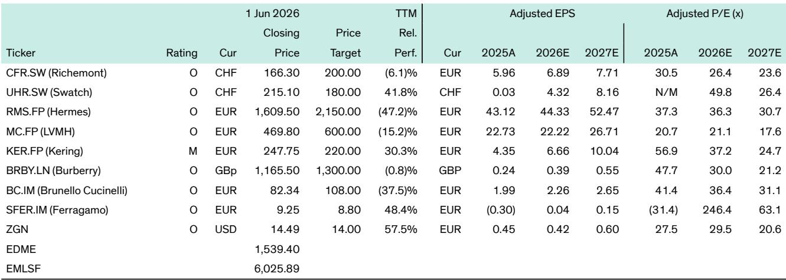
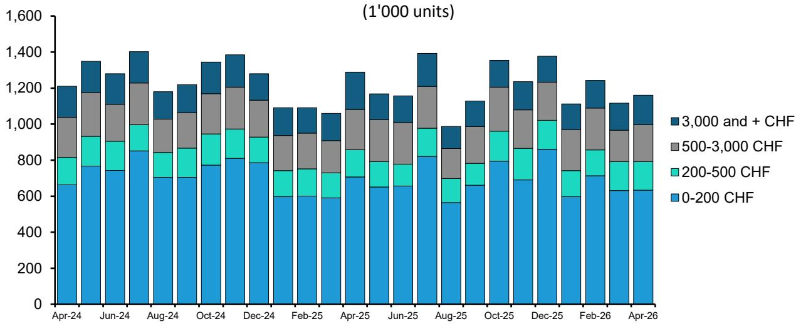
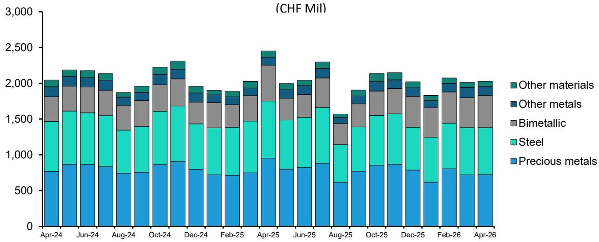

# 瑞士手表出口暴跌16.6%：关税扭曲下的数据噪音，掩盖了真正的复苏信号

4月瑞士手表出口同比下滑16.6%，这个数字足以让任何关注奢侈品行业的投资者心头一紧。但如果你只看这个标题就得出“全球奢侈品需求崩塌”的结论，很可能犯了方向性错误。

这份来自投行研报的核心判断是：当前出口数据的剧烈波动，本质上是关税政策引发的基数效应扭曲，而非终端需求的实质性恶化。真正值得关注的，不是4月单月数据本身，而是隐藏在噪音之下的三个结构性信号——美国市场在剔除关税扰动后的韧性、大中华区企稳的底部形态，以及中东地缘政治风险对奢侈品行业新增长极的威胁。

报告指出，4月出口同比跌幅较3月的-6%（经工作日调整）显著扩大，而2月还是+9.2%的正增长。这种过山车式的波动，恰恰印证了贸易政策对供应链节奏的深度干扰。去年4月，在“解放日”关税生效前，大量手表被提前发往美国，形成了极高的同比基数。今年4月对美出口暴跌56.4%，正是这个基数的消化过程。如果以2024年为基准，美国市场4月仍录得+8.9%的增长，虽然较1季度的+12.1%略有放缓，但远非崩溃。

**市场真正低估的不是需求，而是数据噪音对判断力的系统性扭曲。**

## 1. 关税扰动正在制造一个“虚假的衰退”，但美国消费者已经消化了价格冲击

对美出口的剧烈波动是4月数据的核心变量。去年4月的抢运潮将出口基数推高至异常水平，今年自然面临同比回撤。但报告特别强调了一个关键细节：公司层面的反馈显示，美国消费者已经“在沉默中消化”了关税带来的涨价。

这意味着什么？意味着奢侈品公司担心的需求价格弹性断裂并未发生。高端腕表的核心客群，其消费决策对价格变动的敏感度远低于大众消费品。这一现象与过去几个季度奢侈品公司在美国市场的整体表现一致——美国仍然是全球奢侈品行业最稳定的需求支柱之一。

但这里有一个需要持续追踪的变量：关税扰动带来的基数效应将在7月和8月再次发力。去年的抢运高峰集中在这两个月份，届时同比数据可能再次出现剧烈波动。投资者需要警惕的是，不要被这些“技术性”的暴跌或反弹误导，而应该把目光聚焦在2024年为基数的连续对比上。报告没有完全展开的一个判断是：如果剔除关税噪音，美国市场的真实增速可能在个位数区间温和波动，这已经是一个相当健康的信号。

## 2. 大中华区正在筑底，但“基数红利”会扭曲拐点的判断

中国市场的表现可能是这份报告中最容易被误读的部分。4月对香港出口+13.5%，对中国大陆出口+17.1%，双双录得两位数增长。乍看之下，似乎中国奢侈品消费正在强劲反弹。

但报告明确指出，这同样是基数效应在起作用——去年4月，大量本该发往大中华区的货物被转向美国市场。如果以2024年为基准，4月出口规模仍比2024年同期低约15%，与1季度（以2024年为基准）的走势基本一致。

这意味着什么？大中华区处于“底部震荡”而非“强劲反弹”阶段。15%的缺口说明需求尚未恢复至疫情前水平，但也没有进一步恶化。这种“低位企稳”的状态，对于判断拐点至关重要——它意味着下行风险已经大幅释放，但上行催化剂尚未出现。

报告没有完全展开的一个问题是：中国奢侈品消费的真正复苏，需要依赖什么？是消费者信心的实质性修复，还是出境游的全面恢复，抑或是品牌定价策略的调整？这些变量目前都不明朗。大中华区最乐观的解读是“不再变得更差”，但这距离“重回增长”还有距离。

## 3. 中东正在从增长引擎变成风险敞口，但市场关注度严重不足

这是整份报告中我最想强调的一个结构性变化。中东地区在2025年曾是奢侈品行业罕见的增长亮点，但4月数据显示，对阿联酋出口下降9.5%，对沙特下降17.3%，对卡塔尔下降12.0%，全面下滑。

报告将此归因于“持续的区域内冲突”。但更深层的含义在于：如果地缘政治风险持续发酵，中东可能从奢侈品行业的增量贡献者转变为拖累因素。这个转变的影响被严重低估，原因有二。

第一，中东高净值客群的消费力在过去两年显著提升，已经成为多个奢侈品牌的重要增长极。第二，中东不仅是消费目的地，还是重要的转口贸易枢纽，尤其是迪拜。报告提到法国出口增长46.3%，并明确指出这很可能反映的是“转口至其他目的地”而非法国本土需求。中东地区的动荡可能同时打击直接消费和转口贸易，形成双重冲击。

更值得警惕的是间接影响：区域冲突可能导致油价上涨、通胀压力加大、消费者信心下降，以及旅游出行减少。这些间接效应如果持续发酵，可能抵消中国和美国市场的缓慢改善。报告对此给出的判断是“短期直接后果有限，但如果冲突无法快速解决，间接影响可能威胁复苏的早期迹象”。这是一个需要持续跟踪的风险变量，但目前市场上对它的讨论还远远不够。

## 4. 价格带分化揭示了一个尚未被充分讨论的消费分层现象

从价格带看，200-500瑞士法郎是唯一录得出口额正增长（+7.7%）的区间，而3000瑞士法郎以上的高端区间跌幅最大（-19.0%）。报告将此归因于基数效应，但这里可能隐藏着更深层的消费行为变化。

基数效应只能解释一部分：3000瑞士法郎以上区间去年4月增长19.8%，基数确实最高。但200-500瑞士法郎区间的正增长，是否也反映了消费者在高通胀环境下的“降级消费”趋势？这个区间的产品，在奢侈品行业通常被定义为“入门级”或“轻奢”定位。如果高净值客群开始压缩高端消费，而中产客群仍然愿意为轻奢买单，这将是消费结构发生根本性变化的信号。

报告没有完全展开这个讨论，但它对投资决策有重要含义。如果消费分层的趋势成立，那么产品组合更侧重于高端和超高端定位的品牌（如百达翡丽、爱彼），可能面临比入门级品牌更大的需求压力。反之，产品矩阵覆盖更广、拥有更多入门级产品的集团（如斯沃琪集团），可能在当前环境下更具韧性。这一判断需要更多数据验证，但值得投资者将其纳入观察框架。

## 5. 投资策略的隐含逻辑：防御性配置与“自救故事”的双线布局

报告在投资建议部分给出了一个清晰的框架：在高度不确定性中，采取防御性姿态，核心配置“普通款”（plain vanilla）高质量标的。具体而言，偏好两类公司：一是“估值合理的优质标的”，如历峰集团（Richemont）和布鲁内洛·库奇内利（Brunello Cucinelli）；二是“有明确自我改善轨迹”的公司，如博柏利（Burberry）和菲拉格慕（Ferragamo）的转型故事。

这个框架的底层逻辑是：当前市场的主要矛盾不是行业基本面的好坏，而是确定性溢价。在数据噪音充斥、地缘政治风险未消的背景下，市场愿意为“可预测性”支付更高价格。历峰集团的优势在于珠宝业务的强劲增长势头和行业领导地位，这是当前奢侈品行业中确定性最高的叙事之一。而博柏利的转型已经走过一周年，品牌动能和全价销售率改善，下一个阶段聚焦于店铺生产力提升——这是一个可以追踪、可以验证的路径。

但这里有一个值得深思的问题：报告推荐的标的估值都不便宜。历峰集团2026年预期市盈率26.4倍，布鲁内洛·库奇内利36.4倍，博柏利30倍。这些估值是否已经充分反映了“确定性溢价”？如果市场情绪进一步恶化，这些防御性标的的估值是否还有下行空间？报告没有直接回答这个问题，但它隐含的判断是：在当前环境下，为确定性支付溢价是合理的，因为不确定性的成本更高。

## 6. 报告尚未完全回答的三个关键问题

尽管这份报告提供了扎实的数据分析和清晰的投资框架，但仍有几个关键问题悬而未决。

第一，关税扰动的“噪音期”将持续多久？报告提到7月和8月基数效应将再次发力，但关税政策本身仍在变化。如果贸易摩擦进一步升级，供应链的重新配置可能从“短期扰动”演变为“长期结构性变化”。届时，瑞士手表出口数据可能不再是终端需求的代理变量，而更多反映的是全球供应链的再布局。

第二，中东风险的具体传导路径是什么？报告提到了间接影响，但没有量化。如果区域冲突导致油价持续上涨，高净值人群的财富效应将如何变化？中东消费者是否会减少海外旅行和奢侈品消费？这些问题需要更精细的模型来评估。

第三，大中华区底部企稳的可持续性如何？15%的缺口已经维持了多个季度，这是否意味着中国奢侈品消费已经找到了新的均衡点？还是说，这只是下行过程中的一个暂停？答案可能取决于中国宏观经济的走向和消费者信心的修复速度。

这些未解问题，正是深度阅读完整报告的价值所在。数据只是表象，真正的洞察来自于对数据背后逻辑的追问和对不确定性边界的界定。

---

如果你对这份报告的完整图表、估值模型和公司层面的详细分析感兴趣，欢迎来我们的知识星球微信群继续讨论。我们会在群里分享原始数据表格、价格带和地区的详细拆解，以及我们对上述三个未解问题的推演思路。群里已经有超过500位产业决策者和投资人，一起在数据噪音中寻找真正的信号。

Personal reading notes and learning share only. Not investment advice.

