# US Rates Strategy | North America

# Skew: A Robust Signal in a Changing Market

We show that the skew signal is robust across model parameter choices and has retained predictive power for rate moves over the past 17 years. Since 2019, more frequent shocks have favored faster signals. Predictive power has weakened in front-end rates but strengthened in longer-dated tails.

# Key Takeaways

We extend the skew analysis across market regimes to understand when the signal works, when it fails, and what drives performance.   
■ Results are consistent across model parameter choices, whether duration is expressed through swaps or Treasury futures, and across short-dated expiries.   
The signal retains predictive power back to at least 2009. Since 2019, faster signals have outperformed amid more frequent shocks.   
Predictive power weakened in 2y tails as macro shocks dominated front-end rates, but improved in 30y tails where positioning remains important.   
The signal continues to point to short duration across the curve, with skew richening further despite already elevated starting levels.

Please add me to your distribution list.

MS & CO. LLC

# Shaun Zhou

Strategist

Shaun.Zhou@morganstanley.com +1 212 761-3348

# Matthew Hornbach

Strategist

Matthew.Hornbach@morganstanley.com +1 212 761-1837

# Martin W Tobias, CFA

Strategist

Martin.Tobias@morganstanley.com +1 212 761-6076

# Aryaman Singh

Strategist

Aryaman@morganstanley.com +1 212 761-1993

# Eli P Carter

Strategist

Eli.Carter@morganstanley.com +1 212 761-4703

2026 EXTEL

ALL-AMERICA RESEARCH POLL

May 26 – June, 12 2026

VIEW OUR ANALYSTS >

MS does and seeks to do business with companies covered in MS. As a result, investors should be aware that the firm may have a conflict of interest that could affect the objectivity of MS. Investors should consider MS as only a single factor in making their investment decision.

For analyst certification and other important disclosures, refer to the Disclosure Section, located at the end of this report.

# Interest Rate Derivative Strategy

# United States | Skew: A robust signal in a changing market

MS & CO. LLC

Shaun Zhou +1 212 761-3348

Matthew Hornbach, CMT
Matthew.Hornbach@morganstanley.com +1 212 761-1863

Martin Tobias, CFA, CMT
Martin.Tobias@morganstanley.com +1 212 761-6076

Aryaman Singh
Aryaman@morganstanley.com +1 212 761-1993

Eli Carter
Eli.Carter@morganstanley.com +1 212 761-4703

# Follow-up on the skew signal analysis

# Executive summary

In our previous note, we showed that changes in short-expiry skew contain predictive information about subsequent rate moves. In this follow-up, we test the robustness of that result across different implementation choices, parameter specifications, and market regimes. We find that:

- The signal remains robust. Performance is broadly unchanged when duration exposure is expressed using swaps rather than Treasury futures. Similarly, skew signals derived from 1m, 3m, and 6m expiries produce comparable results, suggesting that the information content is not tied to a specific instrument.   
- The signal also exhibits a meaningful information horizon. Predictive power remains observable for at least several days after a skew move, although its value declines over time. This suggests that changes in skew are incorporated into rates gradually rather than immediately.   
- Extending the sample back to 2009 confirms that the relationship is not unique to the post-COVID period. However, performance has become more sensitive to signal speed since 2019. Across lookback-window and trading delays, faster-moving signals have generally outperformed slower-moving alternatives.   
- Since 2019, signal performance deteriorated most in the 2y sector, where rate moves have increasingly been driven by macro and policy shocks. By contrast, the 30y tail experienced the largest improvement, suggesting that investor positioning remains an important driver of long-end rates.

Overall, the evidence suggests that skew captures a genuine feature of market behavior rather than a sample-specific artifact. We think the key lesson from the post-2019 period is that markets began changing faster.

# Testing signal robustness

The robustness analysis spans a large parameter space. We evaluate four lookback windows, three expiries, and 10 trading delays, resulting in 120 specifications.

The goal of is not to identify the best-performing combination – that would be data mining. Rather, we want to test whether the signal remains effective under reasonable specification changes and use-performance differences to understand when and why the signal works.

# One chart is worth a thousand words

Exhibit 1 summarizes the results using a bubble chart. For each specification, we focus on three aspects of performance: risk-adjusted return (Sharpe ratio on y-axis), downside risk (maximum drawdown on x-axis), and consistency (the percentage of months with positive cumulative returns as bubble size). Opacity represents trading delay. The darkest bubble indicates 1-day trading delay, where the lightest indicates 10-day trading delay (i.e., trade based on signal observed 10 days ago).

This visualization allows us to compare all 120 strategy specifications simultaneously. All else equal, the most attractive configurations are those that combine high Sharpe ratios, limited drawdowns, and strong consistency, appearing as large bubbles in the top-right portion of the chart.

Two conclusions stand out. First, the results are broadly consistent with those obtained using Treasury futures, and performance varies little across 1m, 3m, and 6m expiries. This suggests the signal reflects broad investor positioning rather than the pricing of a specific instrument or point on the skew surface.

Second, the 21-day lookback delivers the most consistent performance. Shorter lookbacks can achieve similar Sharpe ratios but are more sensitive to noise, while the 63-day lookback generally underperforms.

Overall, the signal appears robust to the choice of duration instrument and option expiry. Performance is more sensitive to the speed at which changes in skew are measured, with the 21-day lookback providing a reasonable balance between responsiveness and stability.

Exhibit 1: 10y tail results for all combinations of lookback window, option expiry, and trading delay   
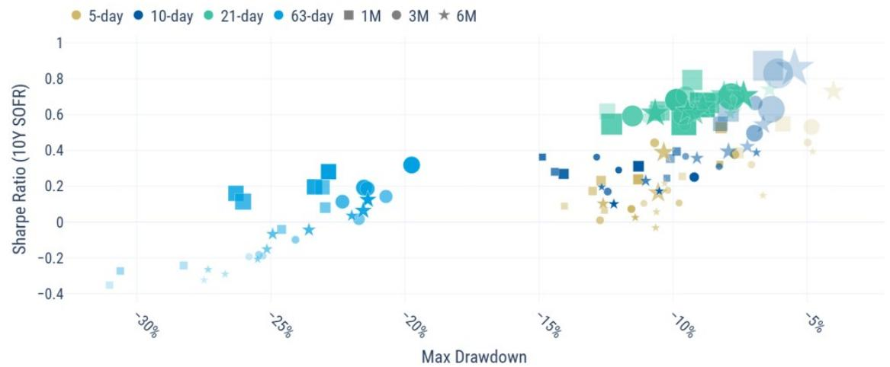  
Source: Bloomberg, S&P, MS

# Compare LIBOR and SOFR era

The LIBOR-SOFR transition provides a convenient division of the sample into two distinct macro environments. The LIBOR era (2009 to mid-2019) was characterized by persistently low rates and subdued volatility, while the SOFR era (mid-2019 to today) encompassed the pandemic shock, inflation surge, subsequent policy tightening cycle, and the current Iran conflict.

The comparison shows that the deterioration of the 63-day lookback is largely a post-2019 phenomenon (Exhibit 2 and Exhibit 3). During the LIBOR era, it performed similarly to shorter lookbacks. During the SOFR era, performance weakened materially while shorter specifications remained more resilient.

Exhibit 2: 10y tail results during 2009 - 2019   
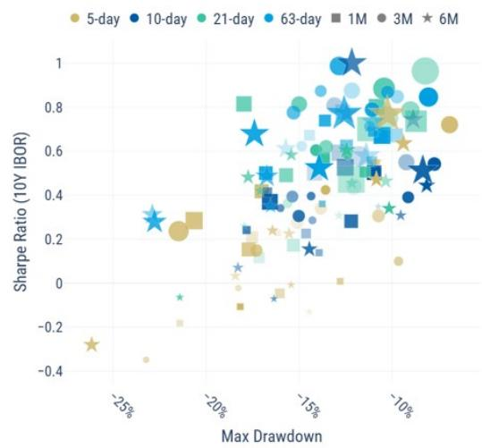  
Source: Bloomberg, S&P, MS

Exhibit 3: 10y tail results from 2019 - today   
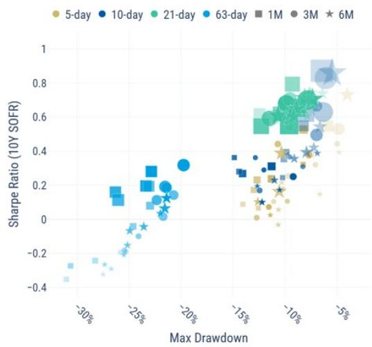

scatter

| Max Drawdown | Sharpe Ratio (10Y SOFR) | Maturity |
| ------------ | ------------------------ | -------- |
| -30%         | -0.4                     | 6M       |
| -25%         | 0.2                      | 1M       |
| -20%         | 0.3                      | 3M       |
| -15%         | 0.4                      | 6M       |
| -10%         | 0.6                      | 1M       |
| -5%          | 0.8                      | 3M       |
| -30%         | -0.2                     | 10-day   |
| -25%         | 0.1                      | 10-day   |
| -20%         | 0.3                      | 10-day   |
| -15%         | 0.5                      | 10-day   |
| -10%         | 0.7                      | 10-day   |
| -5%          | 0.9                      | 10-day   |
| -30%         | -0.3                     | 21-day   |
| -25%         | 0.2                      | 21-day   |
| -20%         | 0.4                      | 21-day   |
| -15%         | 0.6                      | 21-day   |
| -10%         | 0.8                      | 21-day   |
| -5%          | 1.0                      | 21-day   |
| -30%         | -0.4                     | 63-day   |
| -25%         | 0.1                      | 63-day   |
| -20%         | 0.3                      | 63-day   |
| -15%         | 0.5                      | 63-day   |
| -10%         | 0.7                      | 63-day   |
| -5%          | 0.9                      | 63-day   |
| -30%         | -0.3                     | 1M       |
| -25%         | 0.2                      | 1M       |
| -20%         | 0.4                      | 1M       |
| -15%         | 0.6                      | 1M       |
| -10%         | 0.8                      | 1M       |
| -5%          | 1.0                      | 1M       |
| -30%         | -0.2                     | 3M       |
| -25%         | 0.1                      | 3M       |
| -20%         | 0.3                      | 3M       |
| -15%         | 0.5                      | 3M       |
| -10%         | 0.7                      | 3M       |
| -5%          | 0.9                      | 3M       |
| -30%         | -0.1                     | 6M       |
| -25%         | 0.2                      | 6M       |
| -20%         | 0.4                      | 6M       |
| -15%         | 0.6                      | 6M       |
| -10%         | 0.8                      | 6M       |
| -5%          | 1.0                      | 6M       |
| -30%         | 0.3                      | 1M       |
| -25%         | 0.5                      | 1M       |
| -20%         | 0.7                      | 1M       |
| -15%         | 0.9                      | 1M       |
| -10%         | 1.1                      | 1M       |
| -5%          | 1.3                      | 1M       |
| -30%         | 0.4                      | 3M       |
| -25%         | 0.6                      | 3M       |
| -20%         | 0.8                      | 3M       |
| -15%         | 1.0                      | 3M       |
| -10%         | 1.2                      | 3M       |
| -5%          | 1.4                      | 3M       |
| -30%         | 0.5                      | 6M       |
| -25%         | 0.7                      | 6M       |
| -20%         | 0.9                      | 6M       |
| -15%         | 1.1                      | 6M       |
| -10%         | 1.3                      | 6M       |
| -5%          | 1.5                      | 6M       |
| -30%         | 0.6                      | 1M       |
| -25%         | 0.8                      | 1M       |
| -20%         | 1.0                      | 1M       |
| -15%         | 1.2                      | 1M       |
| -10%         | 1.4                      | 1M       |
| -5%          | 1.6                      | 1M       |
| -30%         | 0.7                      | 3M       |
| -25%         | 0.9                      | 3M       |
| -20%         | 1.1                      | 3M       |
| -15%         | 1.3                      | 3M       |
| -10%         | 1.5                      | 3M       |
| -5%          | 1.7                      | 3M       |
| -30%         | 0.8                      | 6M       |
| -25%         | 1.0                      | 6M       |
| -20%         | 1.2                      | 6M       |
| -15%         | 1.4                      | 6M       |
| -10%         | 1.6                      | 6M       |
| -5%          | 1.8                      | 6M       |
| -30%         | 0.9                      | 1M       |
| -25%         | 1.1                      | 1M       |
| -20%         | 1.3                      | 1M       |
| -15%         | 1.5                      | 1M       |
| -10%         | 1.7                      | 1M       |
| -5%          | 1.9                      | 1M       |
| -30%         | 1.0                      | 3M       |
| -25%         | 1.2                      | 3M       |
| -20%         | 1.4                      | 3M       |
| -15%         | 1.6                      | 3M       |
| -10%         | 1.8                      | 3M       |
| -5%          | 2.0                      | 3M       |
| -30%         | 1.2                      | 6M       |
| -25%         | 1.4                      | 6M       |
| -20%         | 1.6                      | 6M       |
| -15%         | 1.8                      | 6M       |
| -10%         | 2.0                      | 6M       |
| -5%          | 2.2                      | 6M       |
| -30%         | 1.4                      | 1M       |
| -25%         | 1.6                      | 1M       |
| -20%         | 1.8                      | 1M       |
| -15%         | 2.0                      | 1M       |
| -10%         | 2.2                      | 1M       |
| -5%          | 2.4                      | 1M       |
| -30%         | 1.6                      | 3M       |
| -25%         | 1.8                      | 3M       |
| -20%         | 2.0                      | 3M       |
| -15%         | 2.2                      | 3M       |
| -10%         | 2.4                      | 3M       |
| -5%          | 2.6                      | 3M       |
| -30%         | 1.8                      | 6M       |
| -25%         | 2.0                      | 6M       |
| -20%         | 2.2                      | 6M       |
| -15%         | 2.4                      | 6M       |
| -10%         | 2.6                      | 6M       |
| -5%          | 2.8                      | 6M       |
| -30%         | 2.0                      | >6M      |
| -25%         | <line>                   | >6M      |
| -20%         | <line>                   | >6M      |
| -15%         | <line>                   | >6M      |
| -10%         | <line>                   | >6M      |
| -5%          | <line>                   | >6M      |
| +5           | <line>                   | >6M      |
The chart displays the Sharpe Ratio for each period (Max Drawdown) on the x-axis and the Sharpe Ratio for each period (Max Drawdown) on the y-axis.

Source: Bloomberg, S&P, MS

# Signal decay

The original note focused on strategies with a one-day trading delay, whereby positions are established on $(t+1)$ and held through $(t+2)$ based on signals observed at $(t)$ .

Here, we extend the framework to consider longer trading delays. Strategies with longer holding periods can be replicated as linear combinations of portfolios formed using different trading delays, enabling us to characterize the evolution of signal alpha over time.

Examining performance across different trading delays provides insight into how quickly the information embedded in skew is incorporated into rates. Exhibit 4 and Exhibit 5 show the historical total return of strategies based on 3m10y skews.

During 2009 - 2019, all trading delays from one to ten days generated positive returns, although performance declined as delays increased. The same pattern persists after 2019. This suggests that the information contained in skew was not immediately reflected in market prices and remained relevant for several days after the signal was observed.

Most strategy specifications experienced a drawdown between July 2021 and July 2023. Short-delay strategies eventually recovered from the drawdown, while longer-delay strategies did not.

Exhibit 4: Historical return over the LIBOR era   
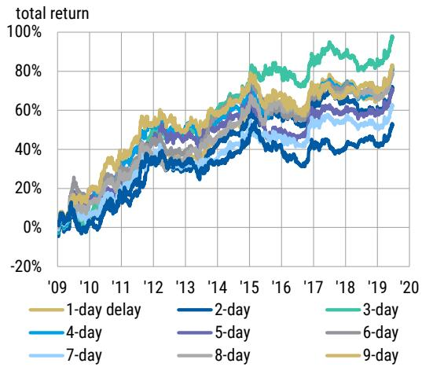

line

| Year | 1-day delay | 2-day | 3-day | 4-day | 5-day | 6-day | 7-day | 8-day | 9-day |
|------|-------------|-------|-------|-------|-------|-------|-------|-------|-------|
| '09  | ~0%         | ~0%   | ~0%   | ~0%   | ~0%   | ~0%   | ~0%   | ~0%   | ~0%   |
| '10  | ~10%        | ~5%   | ~10%  | ~5%   | ~5%   | ~5%   | ~5%   | ~5%   | ~5%   |
| '11  | ~20%        | ~10%  | ~20%  | ~10%  | ~10%  | ~10%  | ~10%  | ~10%  | ~10%  |
| '12  | ~30%        | ~15%  | ~30%  | ~15%  | ~15%  | ~15%  | ~15%  | ~15%  | ~15%  |
| '13  | ~40%        | ~20%  | ~40%  | ~20%  | ~20%  | ~20%  | ~20%  | ~20%  | ~20%  |
| '14  | ~50%        | ~25%  | ~50%  | ~25%  | ~25%  | ~25%  | ~25%  | ~25%  | ~25%  |
| '15  | ~60%        | ~30%  | ~60%  | ~30%  | ~30%  | ~30%  | ~30%  | ~30%  | ~30%  |
| '16  | ~70%        | ~35%  | ~70%  | ~35%  | ~35%  | ~35%  | ~35%  | ~35%  | ~35%  |
| '17  | ~75%        | ~40%  | ~75%  | ~40%  | ~40%  | ~40%  | ~40%  | ~40%  | ~40%  |
| '18  | ~80%        | ~45%  | ~80%  | ~45%  | ~45%  | ~45%  | ~45%  | ~45%  | ~45%  |
| '19  | ~85%        | ~50%  | ~85%  | ~50%  | ~50%  | ~50%  | ~50%  | ~50%  | ~50%  |
| '20  | ~90%        | ~55%  | ~90%  | ~55%  | ~55%  | ~55%  | ~55%  | ~55%  | ~55%  |

Source: Bloomberg, S&P, MS

Exhibit 5: Historical return over the SOFR era   
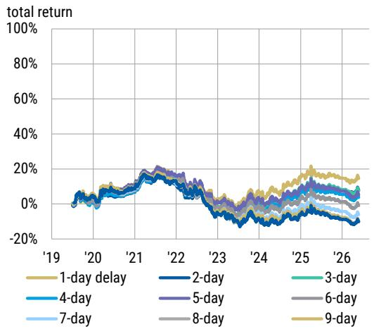

line

| Year | 1-day delay | 2-day | 3-day | 4-day | 5-day | 6-day | 7-day | 8-day | 9-day |
|------|-------------|-------|-------|-------|-------|-------|-------|-------|-------|
| '19  | ~0%         | ~0%   | ~0%   | ~0%   | ~0%   | ~0%   | ~0%   | ~0%   | ~0%   |
| '20  | ~5%         | ~5%   | ~5%   | ~5%   | ~5%   | ~5%   | ~5%   | ~5%   | ~5%   |
| '21  | ~10%        | ~10%  | ~10%  | ~10%  | ~10%  | ~10%  | ~10%  | ~10%  | ~10%  |
| '22  | ~15%        | ~15%  | ~15%  | ~15%  | ~15%  | ~15%  | ~15%  | ~15%  | ~15%  |
| '23  | ~5%         | ~5%   | ~5%   | ~5%   | ~5%   | ~5%   | ~5%   | ~5%   | ~5%   |
| '24  | ~10%        | ~10%  | ~10%  | ~10%  | ~10%  | ~10%  | ~10%  | ~10%  | ~10%  |
| '25  | ~20%        | ~20%  | ~20%  | ~20%  | ~20%  | ~20%  | ~20%  | ~20%  | ~20%  |
| '26  | ~15%        | ~15%  | ~15%  | ~15%  | ~15%  | ~15%  | ~15%  | ~15%  | ~15%  |

Source: Bloomberg, S&P, MS

# A closer look at 2021 to 2023

The period from 2021 to 2023 represents the most significant underperformance episode for the skew signal and provides useful insight into its limitations.

The first challenge was that skew repriced early in the selloff. As investors adjusted to higher inflation, payer skew richened sharply and reached historically elevated levels by early 2021. Rates then sold off by another 300bp over the next two years, but skew did not continue to richen at the same pace because much of the bearish outlook had already been priced in. As a result, the signal could no longer benefit from the broader directional move in rates and instead relied on correctly identifying shorter-term fluctuations. This made performance more sensitive to the choice of lookback window.

A second challenge was the high level of implied volatility. By 2022, both implied volatility and payer skew were already elevated. This left little room for further skew richening, even as rates continued to sell off. Once 3m10y implied volatility rose above roughly 100bp/year, skew became less responsive to additional moves in rates.

Taken together, these observations suggest that the signal was most effective during the initial repricing phase. Once skew and implied volatility reached elevated levels, further rate sell-offs generated little additional skew richening, reducing the signal's predictive power.

Exhibit 6: 3m10y skew and 10y rates   
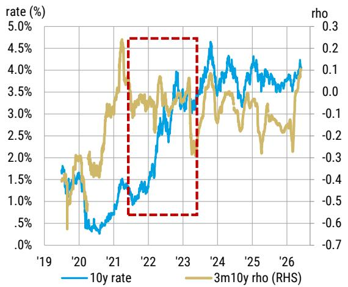

line

| Year | 10y rate (%) | 3m10y rho (RHS) |
|------|--------------|-----------------|
| '19  | ~1.8%        | ~-0.7           |
| '20  | ~1.5%        | ~-0.4           |
| '21  | ~0.5%        | ~0.3            |
| '22  | ~1.5%        | ~-0.6           |
| '23  | ~3.5%        | ~-0.3           |
| '24  | ~4.5%        | ~0.1            |
| '25  | ~4.0%        | ~-0.2           |
| '26  | ~4.5%        | ~-0.3           |

Source: Bloomberg. MS

Exhibit 7: 3m10y skew and 3m10y implied vol   
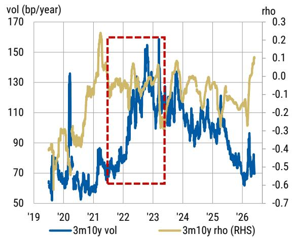

line

| Year | 3m10y vol (bp/year) | 3m10y rho (RHS) |
|------|---------------------|-----------------|
| '19  | ~50                 | ~0.0            |
| '20  | ~70                 | ~0.1            |
| '21  | ~80                 | ~0.2            |
| '22  | ~100                | ~0.1            |
| '23  | ~150                | ~0.0            |
| '24  | ~130                | ~-0.1           |
| '25  | ~110                | ~-0.2           |
| '26  | ~70                 | ~-0.3           |

Source: Bloomberg. MS

# Extending the analysis to all parts of the curve

The performance deterioration since 2019 has been most pronounced in the 2y tail, while the 30y tail is the only part of the curve that saw an improvement. One interpretation is that front-end rates have become increasingly driven by macro and policy shocks, reducing the impact of positioning signals. Long-end rates, by contrast, appear to remain more influenced by investor flows, allowing skew to retain (or even improve) its predictive power.

The 63-day lookback underperformed across nearly all tails, while 21-day lookback delivered more consistent results.

Together, these findings suggest that the post-2019 environment has increased the value of speed. Signals that adapt quickly to changes in positioning continue to perform well, while those relying on older information have become less effective.

Exhibit 8: 2y tail results during 2009 - 2019   
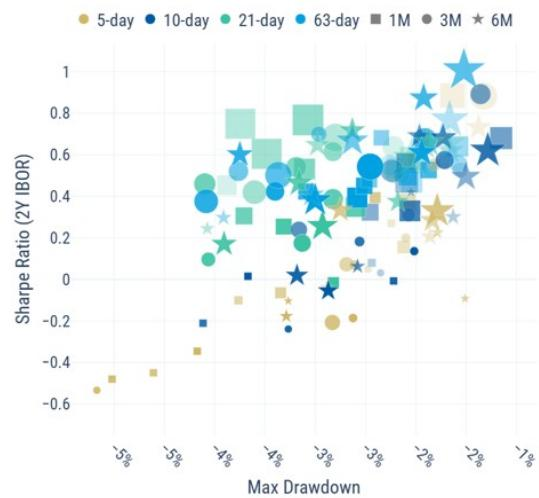

scatter

| Max Drawdown | Sharpe Ratio (2Y IBOR) | Duration |
| ------------ | ---------------------- | -------- |
| -5%          | -0.6                   | 5-day    |
| -5%          | -0.4                   | 5-day    |
| -5%          | -0.2                   | 5-day    |
| -5%          | 0.0                    | 5-day    |
| -5%          | 0.2                    | 5-day    |
| -5%          | 0.4                    | 5-day    |
| -5%          | 0.6                    | 5-day    |
| -5%          | 0.8                    | 5-day    |
| -5%          | 1.0                    | 5-day    |
| -4%          | -0.4                   | 10-day   |
| -4%          | -0.2                   | 10-day   |
| -4%          | 0.0                    | 10-day   |
| -4%          | 0.2                    | 10-day   |
| -4%          | 0.4                    | 10-day   |
| -4%          | 0.6                    | 10-day   |
| -4%          | 0.8                    | 10-day   |
| -4%          | 1.0                    | 10-day   |
| -3%          | -0.2                   | 21-day   |
| -3%          | -0.1                   | 21-day   |
| -3%          | 0.1                    | 21-day   |
| -3%          | 0.3                    | 21-day   |
| -3%          | 0.5                    | 21-day   |
| -3%          | 0.7                    | 21-day   |
| -3%          | 0.9                    | 21-day   |
| -3%          | 1.1                    | 21-day   |
| -2%          | -0.1                   | 63-day   |
| -2%          | 0.1                    | 63-day   |
| -2%          | 0.3                    | 63-day   |
| -2%          | 0.5                    | 63-day   |
| -2%          | 0.7                    | 63-day   |
| -2%          | 0.9                    | 63-day   |
| -2%          | 1.1                    | 63-day   |
| -1%          | -0.1                   | 1M       |
| -1%          | 0.1                    | 1M       |
| -1%          | 0.3                    | 1M       |
| -1%          | 0.5                    | 1M       |
| -1%          | 0.7                    | 1M       |
| -1%          | 0.9                    | 1M       |
| -1%          | 1.1                    | 1M       |
| -1%          | 1.3                    | 1M       |
| -1%          | 1.5                    | 1M       |
| -1%          | 1.7                    | 1M       |
| -1%          | 1.9                    | 1M       |
| -1%          | 2.1                    | 3M       |
| -1%          | 2.3                    | 3M       |
| -1%          | 2.5                    | 3M       |
| -1%          | 2.7                    | 3M       |
| -1%          | 2.9                    | 3M       |
| -1%          | 3.1                    | 3M       |
| -1%          | 3.3                    | 3M       |
| -1%          | 3.5                    | 3M       |
| -1%          | 3.7                    | 6M       |
| -1%          | 3.9                    | 6M       |
| -1%          | 4.1                    | 6M       |
| -1%          | 4.3                    | 6M       |
| -1%          | 4.5                    | 6M       |
| -1%          | 4.7                    | 6M       |
| -1%          | 4.9                    | 6M       |
| -1%          | 5.1                    | 6M       |
| -1%          | 5.3                    | 6M       |
| -1%          | 5.5                    | 6M       |
| -1%          | 5.7                    | 6M       |
| -1%          | 5.9                    | 6M       |
| -1%          | 6.1                    | 6M       |
| -1%          | 6.3                    | 6M       |
| -1%          | 6.5                    | 6M       |
| -1%          | 6.7                    | 6M       |
| -1%          | 6.9                    | 6M       |
| -1%          | 7.1                    | 6M       |
| -1%          | 7.3                    | 6M       |
| -1%          | 7.5                    | 6M       |
| -1%          | 7.7                    | 6M       |
| -1%          | 7.9                    | 6M       |
| -1%          | 8.1                    | 6M       |
| -1%          | 8.3                    | 6M       |
| -1%          | 8.5                    | 6M       |
| -1%          | 8.7                    | 6M       |
| -1%          | 8.9                    | 6M       |
| -1%          | 9.1                    | 6M       |
| -1%          | 9.3                    | 6M       |
| -1%          | 9.5                    | 6M       |
| -1%          | 9.7                    | 6M       |
| -1%          | 9.9                    | 6M       |
| -2%          | -0.2                   | Other     |
| -2%          | -0.4                   | Other     |
| -2%          | -0.2                   | Other     |
| -2%          | +0.2                   | Other     |
| -2%          | +0.4                   | Other     |
| -2%          | +0.6                   | Other     |
| -2%          | +0.8                   | Other     |
| -2%          | +1.0                   | Other     |
| -2%          | +1.2                   | Other     |
| -2%          | +1.4                   | Other     |
| -2%          | +1.6                   | Other     |
| -2%          | +1.8                   | Other     |
| -2%          | +2.0                   | Other     |
| -2%          | +2.2                   | Other     |
| -2%          | +2.4                   | Other     |
| -2%          | +2.6                   | Other     |
| -2%          | +2.8                   | Other     |
| -2%          | +3.0                   | Other     |
| -2%          | +3.2                   | Other     |
| -2%          | +3.4                   | Other     |
| -2%          | +3.6                   | Other     |
| -2%          | +3.8                   | Other     |
| -2%          | +4.0                   | Other     |
| -2%          | +4.2                   | Other     |
| -2%          | +4.4                   | Other     |
| -2%          | +4.6                   | Other     |
| -2%          | +4.8                   | Other     |
| -2%          | +5.0                   | Other     |
| -2%          | +5.2                   | Other     |
| -2%          | +5.4                   | Other     |
| -2%          | +5.6                   | Other     |
| -2%          | +5.8                   | Other     |
| -2%          | +6.0                   | Other     |
| -2%          | +6.2                   | Other     |
| -2%          | +6.4                   | Other     |
| -2%          | +6.6                   | Other     |
| -2%          | +6.8                   | Other     |
| -2%          | +7.0                   | Other     |
| -2%          | +7.2                   | Other     |
| -2%          | +7.4                   | Other     |
| -2%          | +7.6                   | Other     |
| -2%          | +7.8                   | Other     |
| -2%          | +8.0                   | Other     |
| -2%          | +8.2                   | Other     |
| -2%          | +8.4                   | Other     |
| -2%          | +8.6                   | Other     |
| -2%          | +8.8                   | Other     |
| -2%          | +9.0                   | Other     |
| -2%          | +9.2                   | Other     |
| -2%          | +9.4                   | Other     |
| -2%          | +9.6                   | Other     |
| -2%          | +9.8                   | Other     |
| -2%          | +10.0                  | Other     |
| -2%          | +10.2                  | Other     |
| -2%          | +10.4                  | Other     |
| -2%          | +10.6                  | Other     |
| -2%          | +10.8                  | Other     |
| -2%          | +11.0                  | Other     |
| -2%          | +11.2                  | Other     |
| -2%          | +11.4                  | Other     |
| -2%          | +11.6                  | Other     |
| -2%          | +11.8                  | Other     |
| -2%          | +12.0                  | Other     |
| -2%          | +12.2                  | Other     |
| -2%          | +12.4                  | Other     |
| -2%          | +12.6                  | Other     |
| -2%          | +12.8                  | Other     |
| -2%          | +13.0                  | Other     |
| -2%          | +13.2                  | Other     |
| -2%          | +13.4                  | Other     |
| -2%          | +13.6                  | Other     |
| -2%          | +13.8                  | Other     |
| -2%          | +14.0                  | Other     |
| -2%          | +14.2                  | Other     |
| -2%          | +14.4                  | Other     |
| -2%          | +14.6                  | Other     |
| -2%          | +14.8                  | Other     |
| -2%          | +15.0                  | Other     |
| -2%          | +15.2                  | Other     |
| -2%          | +15.4                  | Other     |
| -2%          | +15.6                  | Other     |
| -2%          | +15.8                  | Other     |
| -2%          | +16.0                  | Other     |
| -2%          | +16.2                  | Other     |
| -2%          | +16.4                  | Other     |
| -2%          | +16.6                  | Other     |
| -2%          | +16.8                  | Other     |
| -2%          | +17.0                  | Other     |
| -2%          | +17.2                  | Other     |
| -2%          | +17.4                  | Other     |
| -2%          | +17.6                  | Other     |
| -2%          | +17.8                  | Other     |
| -2%          | +18.0                  | Other     |
| -2%          | +18.2                  | Other     |
| -2%          | +18.4                  | Other     |
| -2%          | +18.6                  | Other     |
| -2%          | +18.8                  | Other     |
| -2%          | +19.0                  | Other     |
| -2%          | +19.2                  | Other     |
| -2%          | +19.4                  | Other     |
| -2%          | +19.6                  | Other     |
| -2%          | +19.8                  | Other     |
| -2%          | +20.0                  | Other     |
| ... (Total)            )      / Difference (Sharpe Ratio) for each duration: The Sharpe Ratio for each duration is calculated based on the number of years (Max Drawdown). The Sharpe Ratio for each duration is calculated based on the number of years (Min Drawdown). The Sharpe Ratio for each duration is calculated based on the number of years (Max Drawdown). The Sharpe Ratio for each duration is calculated based on the number of years (Min Drawdown). The Sharpe Ratio for each duration is calculated based on the number of years (Max Drawdown). The Sharpe Ratio for each duration is calculated based on the number of years (Min Drawdown). The Sharpe Ratio for each duration is calculated based on the number of years (Max Drawdown) and the Sharpe Ratio for each duration is calculated based on the number of years (Min Drawdown). The Sharpe Ratio for each duration is calculated based on the number of years (Max Drawdown) and the Sharpe Ratio for each duration is calculated based on the number of years (Min Drawdown). The Sharpe Ratio for each duration is calculated based on the number of years (Max Drawdown) and the Sharpe Ratio for each duration is calculated based on the number of years (Min Drawup) and the Sharpe Ratio for each duration is calculated based on the number of years (Max Drawup). The Sharpe Ratio for each duration is calculated based on the number of years (Min Drawup) and the Sharpe Ratio for each duration is calculated based on the number of years (Max Drawup). The Sharpe Ratio for each duration is calculated based on the number of years (Min Drawup) and the Sharpe Ratio for each duration is calculated based on the number of years (Max Drawup). The Sharpe Ratio for each duration is calculated based on the number of years (Min DrawUp) and the Sharpe Ratio for each duration is calculated based on the number of years (MaxDrawUp). The Sharpe Ratio for each duration is calculated based on the number of years (MinDrawUp) and the Sharpe Ratio for each duration is calculated based on the number of years (MaxDrawUp). The Sharpe Ratio for each duration is calculated based on the number of years (MinDrawUp) and the Sharpe Ratio for each duration is calculated based on the number of years (MaxDrawUp). The Sharpe Ratio for each duration is calculated based on the number of years (MinDrawUp) and the Sharpe Ratio for each duration is calculated based on the number ofyears (MaxDrawUp) and the Sharpe Ratio for each duration is calculated based on the number of years (MinDrawUp). The Sharpe Ratio for each duration is calculated based on the number of years (MaxDrawUp) and the Sharpe Ratio for each duration is calculated based on the number of years (MinDrawUp). The Sharpe Ratio for each duration is calculated based on the number of years (MaxDrawUp) and the Sharpe Ratio for each duration is calculated based on the number of years (MinDrawUp). The Sharpe Ratio for each duration is calculated based on the number of years (MaxDrawUp) and the Sharpe Ratio for each duration is calculated based onthe number of years (MinDrawUp) and the Sharpe Ratio for each duration is calculated based on the number of years (MaxDrawUp). The Sharpe Ratio for each duration is calculated based on the number of years (MinDrawUp) and the Sharpe Ratio for each duration is calculated based on the number of years (MaxDrawUp). The Sharpe Ratio for each duration is calculated based on the number of years (MinDrawUp) and the Sharpe Ratio for each duration iscalculated as a cumulative sum of all bars in parentheses, but this represents a cumulative sum of all bars; all bars represent a cumulative sum of all bars; all bars represent a cumulative sum of all bars; all bars represent a cumulative sum of all bars; all bars represent a cumulative sum of all bars; all bars represent a cumulative sum of all bars; all bars represent a cumulative sum of all bars; all bars represent a cumulative sum of all bars; all bars represent a cumulative sum of all bars; all bars represent a cumulative sum of all bars; all bars represent a cumulative sum of all bars; all bars are calculated as a cumulative sum of all bars; all bars are calculated as a cumulative sum of all bars; all bars are calculated as a cumulative sum of all bars; all bars are calculated as a cumulative sum of all bars; all bars are calculated as a cumulative sum of all bars; all bars are calculated as a cumulative sum of all bars; all bars are calculated as a cumulative sum of all bars; all bars are calculated as a cumulative sum of all bars; all bars are calculated as a cumulative sum at all values; all bars are calculated as a cumulative sum at all values; all bars are calculated as a cumulative sum at all values; all bars are calculated as a cumulative sum at all values; all bars are calculated as a cumulative sum at all values; all bars are calculated as a cumulative sum at all values; all bars are calculated as a cumulative sum at all values; all bars are calculated as a cumulative sum at all values; all bars are calculated as a cumulative sum at all values; all bars include 'Other' category; all bars include 'Other' category with different numbers of shares or brackets; no bar exceeds one or more than one share or bracket; one bar includes 'Other' category with different numbers of shares or brackets; no bar exceeds one or more than one share or bracket; one bar includes 'Other' category with different numbers of shares or brackets; no bar exceeds one or more than one share or bracket; one bar includes 'Other' category with different numbers of shares or brackets; no bar exceeds one or more than one share or bracket; one bar includes 'Other' category with different numbers of shares or brackets; no bar exceeds one or more, except one bar has an unlabelled value that can be used in the chart.

Source: Bloomberg. S&P. MS.

Exhibit 9: 2y tail results from 2019 - today   
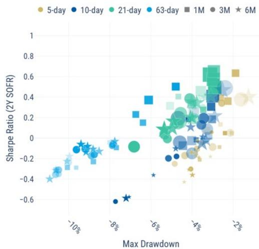

scatter

| Max Drawdown | Sharpe Ratio (2Y SOFR) | Duration |
| ------------ | ---------------------- | -------- |
| -10%         | -0.4                   | 6M       |
| -8%          | -0.6                   | 10-day   |
| -6%          | -0.2                   | 21-day   |
| -4%          | 0.4                    | 5-day    |
| -2%          | 0.6                    | 1M       |
| -4%          | 0.7                    | 3M       |
| -6%          | 0.5                    | 6M       |
| -8%          | -0.1                   | 63-day   |
| -10%         | -0.3                   | 10-day   |
| -10%         | -0.5                   | 5-day    |
| -8%          | -0.7                   | 21-day   |
| -6%          | -0.3                   | 1M       |
| -4%          | 0.3                    | 3M       |
| -2%          | 0.5                    | 6M       |

Source: Bloomberg. S&P. MS.

Exhibit 10: 5y tail results during 2009 - 2019   
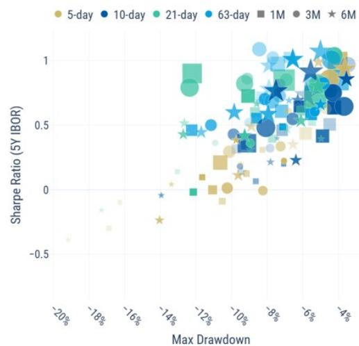  
Source: Bloomberg. S&P. MS

Exhibit 11: 5y tail results from 2019 - today   
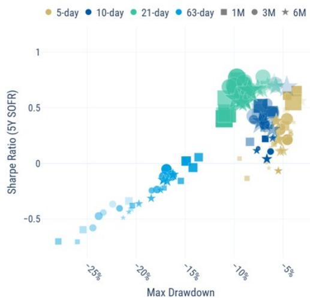

scatter

| Max Drawdown | Sharpe Ratio (5Y SOFR) | Maturity |
| ------------ | ---------------------- | -------- |
| -25%         | -0.7                   | 5-day    |
| -20%         | -0.4                   | 10-day   |
| -15%         | 0.0                    | 21-day   |
| -10%         | 0.5                    | 63-day   |
| -5%          | 0.8                    | 1M       |
| -10%         | 0.3                    | 3M       |
| -5%          | 0.6                    | 6M       |

Source: Bloomberg. S&P. MS

Exhibit 12: 30y tail results during 2009 - 2019   
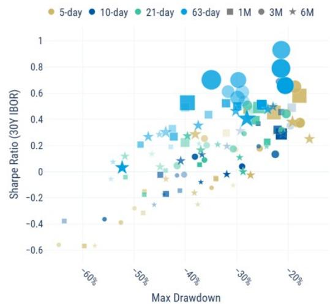

bubble

| Max Drawdown | Sharpe Ratio (30Y IBOR) | Timeframe |
| ------------ | ------------------------ | --------- |
| -60%         | -0.6                     | 5-day     |
| -50%         | -0.4                     | 10-day    |
| -40%         | 0.0                      | 21-day    |
| -30%         | 0.4                      | 63-day    |
| -20%         | 0.8                      | 1M        |
| -20%         | 0.6                      | 3M        |
| -20%         | 0.4                      | 6M        |

Source: Bloomberg. S&P. MS

Exhibit 13: 30y tail results from 2019 - today   
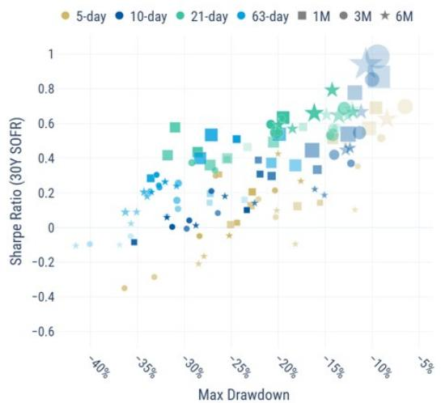

scatter

| Max Drawdown | Sharpe Ratio (30Y SOFR) | Maturity |
| ------------ | ------------------------ | -------- |
| -40%         | -0.2                     | 5-day    |
| -35%         | 0.1                      | 10-day   |
| -30%         | 0.3                      | 21-day   |
| -25%         | 0.4                      | 63-day   |
| -20%         | 0.5                      | 1M       |
| -15%         | 0.6                      | 3M       |
| -10%         | 0.7                      | 6M       |
| -5%          | 0.8                      | 5-day    |

Source: Bloomberg. S&P. MS

# Conclusion

The skew signal remains robust across a wide range of model parameter choices, suggesting it captures a genuine feature of market behavior rather than a sample-specific artifact.

Since 2019, markets have experienced more frequent shocks and regime shifts. As a result, signals with 63-day lookback have underperformed. The signal has also become less relevant at the front end, where macro shocks increasingly dominate rate moves, while retaining predictive power in longer-dated tails.

The 21-day change in 3m skew remains a reasonable baseline, but the appropriate implementation should depend on market regime rather than historical optimization.

# Skew Signal Monitor

Skew signals continue to indicate near 100% short duration exposure across the curve. Despite the recent retracement in rates, payer skew remains well supported.

Exhibit 14: Exposure across the curve based on skew signal   
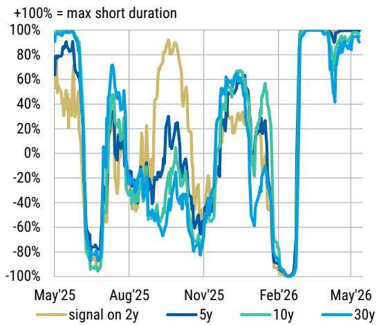

line

| Month   | signal on 2y | 5y    | 10y   | 30y   |
|---------|--------------|-------|-------|-------|
| May'25  | ~80%         | ~90%  | ~95%  | ~100% |
| Aug'25  | ~-40%        | ~-20% | ~-30% | ~-80% |
| Nov'25  | ~-20%        | ~-10% | ~-20% | ~-60% |
| Feb'26  | ~-80%        | ~-60% | ~-40% | ~-100%|
| May'26  | ~90%         | ~95%  | ~90%  | ~95%  |

Source: Bloomberg, MS

Exhibit 15: Total return of strategies based on skew signal over the past year   
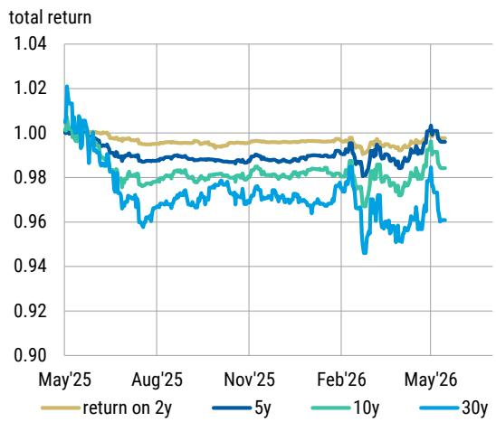

line

| Month   | return on 2y | 5y    | 10y   | 30y   |
|---------|--------------|-------|-------|-------|
| May'25  | 1.00         | 1.00  | 1.00  | 1.02  |
| Aug'25  | 0.99         | 0.98  | 0.97  | 0.96  |
| Nov'25  | 0.99         | 0.98  | 0.98  | 0.97  |
| Feb'26  | 0.99         | 0.98  | 0.98  | 0.95  |
| May'26  | 1.00         | 1.00  | 0.99  | 0.96  |

Source: Bloomberg, MS

# SDR Monitor

While dealers' peak net gamma position has stabilized near \$0.7mm in recent sessions, their gamma exposure at current spot levels has turned net short. Spot gamma exposure is now at its lowest level of the past year. In the long end, this pattern suggests customers have been net buyers of short-dated ATM options while continuing to sell lower-strike receivers. Together, these flows have left dealers increasingly short gamma around prevailing market levels.

Exhibit 16: Dealers' gamma exposure profile   
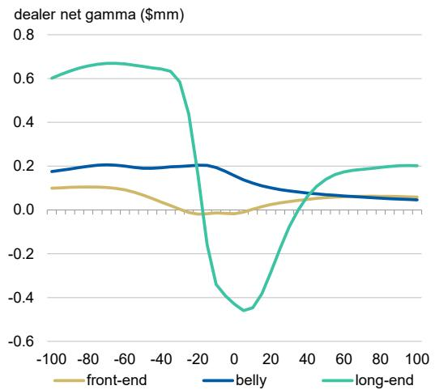

line

| x    | front-end | belly | long-end |
| ---- | --------- | ----- | -------- |
| -100 | 0.1       | 0.18  | 0.6      |
| -80  | 0.1       | 0.2   | 0.65     |
| -60  | 0.1       | 0.2   | 0.65     |
| -40  | 0.05      | 0.2   | 0.6      |
| -20  | -0.05     | 0.2   | -0.3     |
| 0    | -0.05     | 0.15  | -0.45    |
| 20   | 0.0       | 0.1   | -0.2     |
| 40   | 0.05      | 0.05  | 0.1      |
| 60   | 0.1       | 0.05  | 0.15     |
| 80   | 0.1       | 0.05  | 0.2      |
| 100  | 0.1       | 0.05  | 0.2      |

Source: DTCC, MS

Exhibit 17: Historical peak gamma exposure   
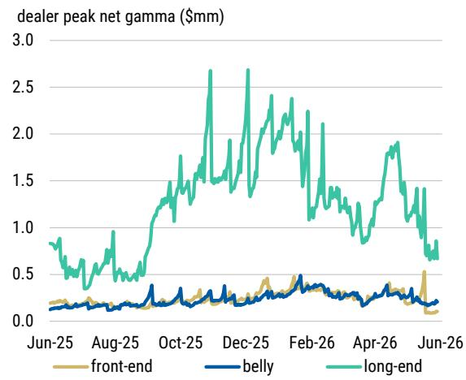

line

| Date    | front-end | belly | long-end |
|---------|-----------|-------|----------|
| Jun-25  | 0.1       | 0.1   | 0.8      |
| Aug-25  | 0.1       | 0.1   | 0.9      |
| Oct-25  | 0.1       | 0.1   | 1.7      |
| Dec-25  | 0.1       | 0.1   | 2.7      |
| Feb-26  | 0.1       | 0.1   | 2.3      |
| Apr-26  | 0.1       | 0.1   | 1.9      |
| Jun-26  | 0.1       | 0.1   | 0.7      |

Source: DTCC, MS

# Callable Issuance Monitor

Issuance in May was modestly higher than in April but remained below the elevated levels seen in 1Q. June is typically a seasonally slow month for callable issuance. If realized, lower issuance could provide support to the intermediate sector of the volatility surface.

Exhibit 18: Notional of callable bond issuance   
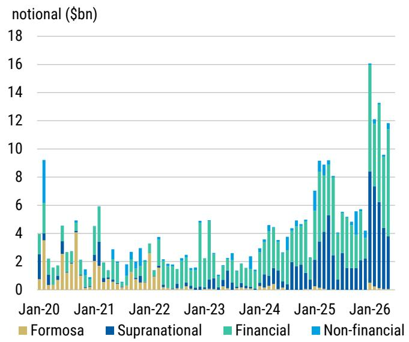

bar

| Date   | Formosa | Supranational | Financial | Non-financial |
|--------|---------|---------------|-----------|---------------|
| Jan-20 | 3.5     | 1.5           | 4.0       | 9.0           |
| Jan-21 | 4.0     | 2.0           | 5.5       | 1.0           |
| Jan-22 | 1.5     | 1.0           | 3.0       | 2.5           |
| Jan-23 | 1.0     | 0.5           | 4.5       | 1.5           |
| Jan-24 | 0.5     | 1.0           | 4.0       | 2.0           |
| Jan-25 | 1.0     | 3.0           | 8.0       | 7.0           |
| Jan-26 | 0.5     | 8.0           | 16.0      | 12.0          |

Source: Bloomberg, MS

Exhibit 19: Vega supply from callable issuance   
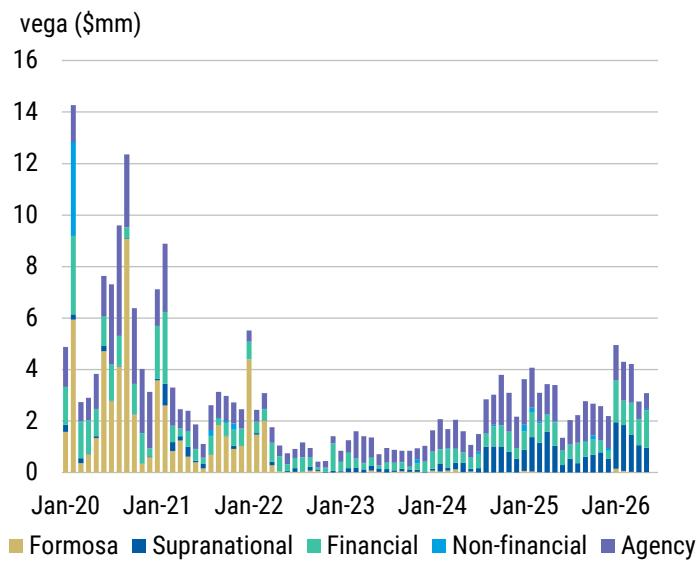

bar_stacked

| Date | Formosa ($mm) | Supranational ($mm) | Financial ($mm) | Non-financial ($mm) | Agency ($mm) |
|---|---|---|---|---|---|
| Jan-20 | 1.5 | 0.5 | 3.0 | 14.0 | 5.0 |
| Jan-21 | 4.0 | 0.5 | 1.0 | 9.5 | 7.0 |
| Jan-22 | 1.0 | 0.5 | 0.5 | 2.5 | 3.0 |
| Jan-23 | 0.5 | 0.5 | 0.5 | 1.0 | 1.0 |
| Jan-24 | 0.5 | 0.5 | 0.5 | 1.0 | 1.5 |
| Jan-25 | 0.5 | 0.5 | 0.5 | 1.0 | 3.0 |
| Jan-26 | 0.5 | 0.5 | 1.0 | 1.0 | 4.5 |

Source: Bloomberg, MS

• Trade idea: Maintain long 2y10y straddle vs. short 6m10y straddle   
• Trade idea: Maintain long 1y1y F/F+25/F+50 payer ladder

# Valuation Methodology and Risks

Below you will find a list of our current trade ideas, entry levels, entry dates, rationales, and risks.

Interest Rate Derivatives 

<table><tr><td>TRADE</td><td>ENTRY LEVEL</td><td>ENTRY DATE</td><td>RATIONALE</td><td>RISKS</td></tr><tr><td>Buy 2y10y straddle vs. sell 6m10y straddle</td><td>350c</td><td>4/30/2026</td><td>2y10y expected to be supported by structural flow from mortgage hedgers, while 6m10y offers attractive rolldown as realized remain muted.</td><td>The risk is if vol surface flattens materially or if rates move materially away from current level.</td></tr><tr><td>Buy 1y1y F/F+25/F+50 payer ladder</td><td>0c</td><td>3/10/2026</td><td>Recent selloff in rates and pick-up in vol created an attractive window for 1y1y payer ladders. Breakeven level sits at levels that imply Fed hike over the next 2 years.</td><td>The risk is if energy-driven inflation becomes sustainable and forces the Fed to hike rates as a response.</td></tr></table>

Global Macro Strategy Team 

<table><tr><td>MS &amp; CO. LLC</td><td>Matthew Hornbach, CMTMatthew.Hornbach@morganstanley.com</td><td>Global Head of Macro Strategy</td><td>+1 212 761-1837</td></tr><tr><td></td><td>Martin Tobias, CFA, CMT</td><td>US Rates Strategist</td><td>+1 212 761-6076</td></tr><tr><td></td><td>Shaun Zhou</td><td>US Rates Strategist</td><td>+1 212 761-3348</td></tr><tr><td></td><td>Aryaman Singh</td><td>US Rates Strategist</td><td>+1 212 761-1993</td></tr><tr><td></td><td>Eli Carter</td><td>US Rates Strategist</td><td>+1 212 761-4703</td></tr><tr><td>MS &amp; CO. LLC</td><td>Andrew Watrous</td><td>G10 FX Strategist</td><td>+1 212 761-5287</td></tr><tr><td></td><td>Molly Nickolin</td><td>G10 FX Strategist</td><td>+1 212 761-3592</td></tr><tr><td></td><td>Simon WaeverSimon.Waever@morganstanley.com</td><td>Head of EM Sovereign Credit and Latin America Fixed Income Strategy</td><td>+1 212 296-8101</td></tr><tr><td></td><td>Ioana Zamfir</td><td>Head of Latin America Macro Strategy</td><td>+1 212 761-4012</td></tr><tr><td></td><td>Emma Cerda</td><td>Latin America Sovereign Credit</td><td>+1 212 761-2344</td></tr><tr><td></td><td>Sofia Palacios</td><td>Latin America Macro Strategist</td><td>+1 212 761-0428</td></tr><tr><td>MS &amp; CO.INTERNATIONAL PLC</td><td>James K. LordJames.Lord@morganstanley.com</td><td>Global Head of FXEM Strategy</td><td>+44 20 7677-3254</td></tr><tr><td></td><td>Gianluca SalfordLuca.Salford@morganstanley.com</td><td>Head of European Rates Strategy</td><td>+44 20 7677-1337</td></tr><tr><td></td><td>Maria Chiara Russo</td><td>Euro Area Rates Strategist</td><td>+44 20 7425-3499</td></tr><tr><td></td><td>Fabio Bassanin, CFA</td><td>UK Rates Strategist</td><td>+44 20 7425-1869</td></tr><tr><td></td><td>David S. Adams, CFADavid.S.Adams@morganstanley.com</td><td>Head of G10 FX Strategy</td><td>+44 20 7425-3518</td></tr><tr><td></td><td>Neville Mandimika</td><td>CEEMEA Sovereign Credit Strategist</td><td>+44 20 7425-2509</td></tr><tr><td></td><td>Arnav Gupta</td><td>CEEMEA Rates Strategist</td><td>+44 20 7677-0382</td></tr><tr><td>MS ASIALIMITED+</td><td>Gek Teng Khoo</td><td>AXJ Macro Strategist</td><td>+852 3963-0303</td></tr><tr><td>MS INDIACOMPANY PRIVATE LIMITED</td><td>Nimish Prabhune</td><td>AXJ Macro Strategist</td><td>+91 22 6996-1862</td></tr><tr><td>MS MUFGSECURITIES CO., LTD.</td><td>Koichi SugisakiKoichi.Sugisaki@morganstanleymufg.com</td><td>Head of Japan Macro Strategy</td><td>+81 3 6836-8428</td></tr><tr><td></td><td>Hiromu Uezato</td><td>Japan Macro Strategist</td><td>+81 3 6836-8431</td></tr></table>

# Disclosure Section

The information and opinions in MS were prepared by MS & Co. LLC, and/or MS C.T.V.M. S.A., and/or MS Mexico, Casa de Bolsa, S.A. de C.V., and/or MS Canada Limited. As used in this disclosure section, "MS" includes MS & Co. LLC, MS C.T.V.M. S.A., MS Mexico, Casa de Bolsa, S.A. de C.V., MS Canada Limited and their affiliates as necessary.

For important disclosures, stock price charts and equity rating histories regarding companies that are the subject of this report, please see the MS Disclosure Website at www.morganstanley.com/eqr/disclosures/webapp/generalresearch, or contact your investment representative or MS at 1585 Broadway, (Attention: Research Management), New York, NY, 10036 USA.

For valuation methodology and risks associated with any recommendation, rating or price target referenced in this research report, please contact the Client Support Team as follows: US/Canada +1 800 303-2495; Hong Kong +852 2848-5999; Latin America +1 718 754-5444 (U.S.); London +44 (0)20-7425-8169; Singapore +65 6834-6860; Sydney +61 (0)2-9770-1505; Tokyo +81 (0)3-6836-9000. Alternatively you may contact your investment representative or MS at 1585 Broadway, (Attention: Research Management), New York, NY 10036 USA.

# Analyst Certification

The following analysts hereby certify that their views about the companies and their securities discussed in this report are accurately expressed and that they have not received and will not receive direct or indirect compensation in exchange for expressing specific recommendations or views in this report: Eli P Carter; Matthew Hornbach; Aryaman Singh; Martin W Tobias, CFA; Shaun Zhou.

# Global Research Conflict Management Policy

MS has been published in accordance with our conflict management policy, which is available at www.morganstanley.com/institutional/research/conflictpolicies. A Portuguese version of the policy can be found at www.morganstanley.com.br

# Important Regulatory Disclosures on Subject Companies

In the next 3 months, MS expects to receive or intends to seek compensation for investment banking services from United States of America.

Within the last 12 months, MS has provided or is providing investment banking services to, or has an investment banking client relationship with, the following company: United States of America.

The equity research analysts or strategists principally responsible for the preparation of MS have received compensation based upon various factors, including quality of research, investor client feedback, stock picking, competitive factors, firm revenues and overall investment banking revenues. Equity Research analysts' or strategists' compensation is not linked to investment banking or capital markets transactions performed by MS or the profitability or revenues of particular trading desks.

MS and its affiliates do business that relates to companies/instruments covered in MS, including market making, providing liquidity, fund management, commercial banking, extension of credit, investment services and investment banking. MS sells to and buys from customers the securities/instruments of companies covered in MS on a principal basis. MS may have a position in the debt of the Company or instruments discussed in this report. MS trades or may trade as principal in the debt securities (or in related derivatives) that are the subject of the debt research report.

Certain disclosures listed above are also for compliance with applicable regulations in non-US jurisdictions.

# STOCK RATINGS

MS uses a relative rating system using terms such as Overweight, Equal-weight, Not-Rated or Underweight (see definitions below). MS does not assign ratings of Buy, Hold or Sell to the stocks we cover. Overweight, Equal-weight, Not-Rated and Underweight are not the equivalent of buy, hold and sell. Investors should carefully read the definitions of all ratings used in MS. In addition, since MS contains more complete information concerning the analyst's views, investors should carefully read MS, in its entirety, and not infer the contents from the rating alone. In any case, ratings (or research) should not be used or relied upon as investment advice. An investor's decision to buy or sell a stock should depend on individual circumstances (such as the investor's existing holdings) and other considerations.

# Global Stock Ratings Distribution

(as of May 31, 2026)

The Stock Ratings described below apply to MS's Fundamental Equity Research and do not apply to Debt Research produced by the Firm.

For disclosure purposes only (in accordance with FINRA requirements), we include the category headings of Buy, Hold, and Sell alongside our ratings of Overweight, Equal-weight, Not-Rated and Underweight. MS does not assign ratings of Buy, Hold or Sell to the stocks we cover. Overweight, Equal-weight, Not-Rated and Underweight are not the equivalent of buy, hold, and sell but represent recommended relative weightings (see definitions below). To satisfy regulatory requirements, we correspond Overweight, our most positive stock rating, with a buy recommendation; we correspond Equal-weight and Not-Rated to hold and Underweight to sell recommendations, respectively.

<table><tr><td></td><td colspan="2">Coverage Universe</td><td colspan="3">Investment Banking Clients (IBC)</td><td colspan="2">Other Material Investment ServicesClients (MISC)</td></tr><tr><td>Stock RatingCategory</td><td>Count</td><td>% of Total</td><td>Count</td><td>% of Total IBC</td><td>% of RatingCategory</td><td>Count</td><td>% of Total OtherMISC</td></tr><tr><td>Overweight/Buy</td><td>1542</td><td>42%</td><td>465</td><td>51%</td><td>30%</td><td>707</td><td>43%</td></tr><tr><td>Equal-weight/Hold</td><td>1571</td><td>43%</td><td>369</td><td>40%</td><td>23%</td><td>723</td><td>44%</td></tr><tr><td>Not-Rated/Hold</td><td>3</td><td>0%</td><td>0</td><td>0%</td><td>0%</td><td>1</td><td>0%</td></tr><tr><td>Underweight/Sell</td><td>551</td><td>15%</td><td>86</td><td>9%</td><td>16%</td><td>201</td><td>12%</td></tr><tr><td>Total</td><td>3,667</td><td></td><td>920</td><td></td><td></td><td>1632</td><td></td></tr></table>

Data include common stock and ADRs currently assigned ratings. Investment Banking Clients are companies from whom MS received investment banking compensation in the last 12 months. Due to rounding off of decimals, the percentages provided in the "% of total" column may not add up to exactly 100 percent.

# Analyst Stock Ratings

Overweight (O). The stock's total return is expected to exceed the average total return of the analyst's industry (or industry team's) coverage universe, on a risk-adjusted basis, over the next 12-18 months.

Equal-weight (E). The stock's total return is expected to be in line with the average total return of the analyst's industry (or industry team's) coverage universe, on a risk-adjusted basis, over the next 12-18 months.

Not-Rated (NR). Currently the analyst does not have adequate conviction about the stock's total return relative to the average total return of the analyst's industry (or industry team's) coverage universe, on a risk-adjusted basis, over the next 12-18 months.

Underweight (U). The stock's total return is expected to be below the average total return of the analyst's industry (or industry team's) coverage universe, on a risk-adjusted basis, over the next 12-18 months.

Unless otherwise specified, the time frame for price targets included in MS is 12 to 18 months.

# Analyst Industry Views

Attractive (A): The analyst expects the performance of his or her industry coverage universe over the next 12-18 months to be attractive vs. the relevant broad market benchmark, as indicated below.

In-Line (I): The analyst expects the performance of his or her industry coverage universe over the next 12-18 months to be in line with the relevant broad market benchmark, as indicated below.

Cautious (C): The analyst views the performance of his or her industry coverage universe over the next 12-18 months with caution vs. the relevant broad market benchmark, as indicated below.

Benchmarks for each region are as follows: North America - S&P 500; Latin America - relevant MSCI country index or MSCI Latin America Index; Europe - MSCI Europe; Japan - TOPIX; Asia - relevant MSCI country index or MSCI sub-regional index or MSCI AC Asia Pacific ex Japan Index.

# Important Disclosures for MS Smith Barney LLC Customers

Important disclosures regarding any material conflict of interest that can reasonably be expected to have influenced MS Smith Barney LLC's choice of a third-party research provider or the subject company of a third-party research report, are available on the MS Wealth Management disclosure website at www.morganstanley.com/online/researchdisclosures. For MS specific disclosures, you may refer to https://www.morganstanley.com/eqr/disclosures/webapp/generalresearch.

Each MS report is reviewed and approved on behalf of MS Smith Barney LLC. This review and approval is conducted by the same person who reviews the research report on behalf of MS. This could create a conflict of interest.

# Other Important Disclosures

MS policy is to update research reports as and when the Research Analyst and Research Management deem appropriate, based on developments with the issuer, the sector, or the market that may have a material impact on the research views or opinions stated therein. In addition, certain Research publications are intended to be updated on a regular periodic basis (weekly/monthly/quarterly/annual) and will ordinarily be updated with that frequency, unless the Research Analyst and Research Management determine that a different publication schedule is appropriate based on current conditions.

MS is not acting as a municipal advisor and the opinions or views contained herein are not intended to be, and do not constitute, advice within the meaning of Section 975 of the Dodd-Frank Wall Street Reform and Consumer Protection Act.

MS produces an equity research product called a "Tactical Idea." Views contained in a "Tactical Idea" on a particular stock may be contrary to the recommendations or views expressed in research on the same stock. This may be the result of differing time horizons, methodologies, market events, or other factors. For all research available on a particular stock, please contact your sales representative or go to Matrix at http://www.morganstanley.com/matrix.

MS is provided to our clients through our proprietary research portal on Matrix and also distributed electronically by MS to clients. Certain, but not all, MS products are also made available to clients through third-party vendors or redistributed to clients through alternate electronic means as a convenience. For access to all available MS, please contact your sales representative or go to Matrix at http://www.morganstanley.com/matrix.

Any access and/or use of MS is subject to MS's Terms of Use (http://www.morganstanley.com/terms.html). By accessing and/or using MS, you are indicating that you have read and agree to be bound by our Terms of Use (http://www.morganstanley.com/terms.html). In addition you consent to MS processing your personal data and using cookies in accordance with our Privacy Policy and our Global Cookies Policy (http://www.morganstanley.com/privacy\_pledge.html), including for the purposes of setting your preferences and to collect readership data so that we can deliver better and more personalized service and products to you. To find out more information about how MS processes personal data, how we use cookies and how to reject cookies see our Privacy Policy and our Global Cookies Policy (http://www.morganstanley.com/privacy\_pledge.html). Please use the provided link to review the Terms and Conditions and Most Important Terms and Conditions for MS India Company Private Limited (https://www.morganstanley.com/assets/pdfs/about-us-global-offices/india/Terms\_and\_conditions.pdf) and the following link to review the audit report (https://ny.matrix.ms.com/eqr/research/webapp/researchdocs/MSICPL\_Morgan\_Stanley\_Research\_Audit\_Report.pdf).

If you do not agree to our Terms of Use and/or if you do not wish to provide your consent to MS processing your personal data or using cookies please do not access our research. MS does not provide individually tailored investment advice. MS has been prepared without regard to the circumstances and objectives of those who receive it. MS recommends that investors independently evaluate particular investments and strategies, and encourages investors to seek the advice of a financial adviser. The appropriateness of an investment or strategy will depend on an investor's circumstances and objectives. The securities, instruments, or strategies discussed in MS may not be suitable for all investors, and certain investors may not be eligible to purchase or participate in some or all of them. MS is not an offer to buy or sell or the solicitation of an offer to buy or sell any security/instrument or to participate in any particular trading strategy. The value of and income from your investments may vary because of changes in interest rates, foreign exchange rates, default rates, prepayment rates, securities/instruments prices, market indexes, operational or financial conditions of companies or other factors. There may be time limitations on the exercise of options or other rights in securities/instruments transactions. Past performance is not necessarily a guide to future performance. Estimates of future performance are based on assumptions that may not be realized. If provided, and unless otherwise stated, the closing price on the cover page is that of the primary exchange for the subject company's securities/instruments.

The fixed income research analysts, strategists or economists principally responsible for the preparation of MS have received compensation based upon various factors, including quality, accuracy and value of research, firm profitability or revenues (which include fixed income trading and capital markets profitability or revenues), client feedback and competitive factors. Fixed Income Research analysts', strategists' or economists' compensation is not linked to investment banking or capital markets transactions performed by MS or the profitability or revenues of particular trading desks.

The "Important Regulatory Disclosures on Subject Companies" section in MS lists all companies mentioned where MS owns 1% or more of a class of common equity securities of the companies. For all other companies mentioned in MS, MS may have an investment of less than 1% in securities/instruments or derivatives of securities/instruments of companies and may trade them in ways different from those discussed in MS. Employees of MS not involved in the preparation of MS may have investments in securities/instruments or derivatives of securities/instruments of companies mentioned and may trade them in ways different from those discussed in MS. Derivatives may be issued by MS or associated persons.

With the exception of information regarding MS, MS is based on public information. MS makes every effort to use reliable, comprehensive information, but we make no representation that it is accurate or complete. We have no obligation to tell you when opinions or information in MS change apart from when we intend to discontinue equity research coverage of a subject company. Facts and views presented in MS have not been reviewed by, and may not reflect information known to, professionals in other MS business areas, including investment banking personnel.

MS personnel may participate in company events such as site visits and are generally prohibited from accepting payment by the company of associated expenses unless pre-approved by authorized members of Research management.

MS may make investment decisions that are inconsistent with the recommendations or views in this report.

To our readers based in Taiwan or trading in Taiwan securities/instruments: Information on securities/instruments that trade in Taiwan is distributed by MS Taiwan Limited ("MSTL"). Such information is for your reference only. The reader should independently evaluate the investment risks and is solely responsible for their investment decisions. MS may not be distributed to the public media or quoted or used by the public media without the express written consent of MS. Any non-customer reader within the scope of Article 7-1 of the Taiwan Stock Exchange Recommendation Regulations accessing and/or receiving MS is not permitted to provide MS to any third party (including but not limited to related parties, affiliated companies and any other third parties) or engage in any activities regarding MS which may create or give the appearance of creating a conflict of interest. Information on securities/instruments that do not trade in Taiwan is for informational purposes only and is not to be construed as a recommendation or a solicitation to trade in such securities/instruments. MSTL may not execute transactions for clients in these securities/instruments.

MS is not incorporated under PRC law and the research in relation to this report is conducted outside the PRC. MS does not constitute an offer to sell or the solicitation of an offer to buy any securities in the PRC. PRC investors shall have the relevant qualifications to invest in such securities and shall be responsible for obtaining all relevant approvals, licenses, verifications and/or registrations from the relevant governmental authorities themselves. Neither this report nor any part of it is intended as, or shall constitute, provision of any consultancy or advisory service of securities investment as defined under PRC law. Such information is provided for your reference only.

MS is disseminated in Brazil by MS C.T.V.M. S.A. located at Av. Brigadeiro Faria Lima, 3600, 6th floor, São Paulo - SP, Brazil; and is regulated by the Comissão de Valores Mobiliários; in Mexico by MS México, Casa de Bolsa, S.A. de C.V which is regulated by Comision Nacional Bancaria y de Valores. Paseo de los Tamarindos 90, Torre 1, Col. Bosques de las Lomas Floor 29, 05120 Mexico City; in Japan by MS MUFG Securities Co., Ltd. and, for Commodities related research reports only, MS Capital Group Japan Co., Ltd; in Hong Kong by MS Asia Limited (which accepts responsibility for its contents) and by MS Bank Asia Limited; in Singapore by MS Asia (Singapore) Pte. (Registration number 199206298Z) and/or MS Asia (Singapore) Securities Pte Ltd (Registration number 200008434H), regulated by the Monetary Authority of Singapore (which accepts legal responsibility for its contents and should be contacted with respect to any matters arising from, or in connection with, MS) and by MS Bank Asia Limited, Singapore Branch (Registration number T14FC0118); in Australia to "wholesale clients" within the meaning of the Australian Corporations Act by MS Australia Limited A.B.N. 67 003 734 576, holder of Australian financial services license No. 233742, which accepts responsibility for its contents; in Australia to "wholesale clients" and "retail clients" within the meaning of the Australian Corporations Act by MS Wealth Management Australia Pty Ltd (A.B.N. 19 009 145 555, holder of Australian financial services license No. 240813, which accepts responsibility for its contents; in Korea by MS & Co International plc, Seoul Branch; in India by MS India Company Private Limited having Corporate Identification No (CIN) U22990MH1998PTC115305, regulated by the Securities and Exchange Board of India ("SEBI") and holder of licenses as a Research Analyst (SEBI Registration No. INH000001105); Stock Broker (SEBI Stock Broker Registration No. INZ000244438), Merchant Banker (SEBI Registration No. INM000011203), and depository participant with National Securities Depository Limited (SEBI Registration No. IN-DP-NSDL-567-2021) having registered office at Altimus, Level 39 & 40, Pandurang Budhkar Marg, Worli, Mumbai 400018, India; Telephone no. +91-22-61181000; Compliance Officer Details: Mr. Tejarshi Hardas, Tel. No.: +91-22-61181000 or Email: tejarshi.hardas@morganstanley.com; Grievance officer details: Mr. Tejarshi Hardas, Tel. No.: +91-22-61181000 or Email: msic-compliance@morganstanley.com. MS India Company Private Limited (MSICPL) may use AI tools in providing research services. All recommendations contained herein are made by the duly qualified research analysts; in Canada by MS Canada Limited; in Germany and the European Economic Area where required by MS Europe S.E., authorised and regulated by Bundesanstalt fuer Finanzdienstleistungsaufsicht (BaFin) under the reference number 149169; in the US by MS & Co. LLC, which accepts responsibility for its contents. MS & Co. International plc, authorized by the Prudential Regulation Authority and regulated by the Financial Conduct Authority and the Prudential Regulation Authority, disseminates in the UK research that it has prepared, and research which has been prepared by any of its affiliates, only to persons who (i) are investment professionals falling within Article 19(5) of the Financial Services and Markets Act 2000 (Financial Promotion) Order 2005 (as amended, the "Order"); (ii) are persons who are high net worth entities falling within Article 49(2)(a) to (d) of the Order; or (iii) are persons to whom an invitation or inducement to engage in investment activity (within the meaning of section 21 of the Financial Services and Markets Act 2000, as amended) may otherwise lawfully be communicated or caused to be communicated. RMB MS Proprietary Limited is a member of the JSE Limited and A2X (Pty) Ltd. RMB MS Proprietary Limited is a joint venture owned equally by MS International Holdings Inc. and RMB Investment Advisory (Proprietary) Limited, which is wholly owned by FirstRand Limited. The information in MS is being disseminated by MS Saudi Arabia, regulated by the Capital Market Authority in the Kingdom of Saudi Arabia, and is directed at Sophisticated investors only.

The information in MS is being communicated by MS & Co. International plc (DIFC Branch), regulated by the Dubai Financial Services Authority (the DFSA) or by MS & Co. International plc (ADGM Branch), regulated by the Financial Services Regulatory Authority Abu Dhabi (the FSRA), and is directed at Professional Clients only, as defined by the DFSA or the FSRA, respectively. The financial products or financial services to which this research relates will only be made available to a customer who we are satisfied meets the regulatory criteria of a Professional Client. A distribution of the different MS Research ratings or recommendations, in percentage terms for Investments in each sector covered, is available upon request from your sales representative.

The information in MS is being communicated by MS & Co. International plc (QFC Branch), regulated by the Qatar Financial Centre Regulatory Authority (the QFCRA), and is directed at business customers and market counterparties only and is not intended for Retail Customers as defined by the QFCRA.

As required by the Capital Markets Board of Turkey, investment information, comments and recommendations stated here, are not within the scope of investment advisory activity. Investment advisory service is provided exclusively to persons based on their risk and income preferences by the authorized firms. Comments and recommendations stated here are general in nature. These opinions may not fit to your financial status, risk and return preferences. For this reason, to make an investment decision by relying solely to this information stated here may not bring about outcomes that fit your expectations.

The trademarks and service marks contained in MS are the property of their respective owners. Third-party data providers make no warranties or representations relating to the accuracy, completeness, or timeliness of the data they provide and shall not have liability for any damages relating to such data. The Global Industry Classification Standard (GICS) was developed by and is the exclusive property of MSCI and S&P.

MS, or any portion thereof may not be reprinted, sold or redistributed without the written consent of MS.

Indicators and trackers referenced in MS may not be used as, or treated as, a benchmark under Regulation EU 2016/1011, or any other similar framework.

The issuers and/or fixed income products recommended or discussed in certain fixed income research reports may not be continuously followed. Accordingly, investors should regard those fixed income research reports as providing stand-alone analysis and should not expect continuing analysis or additional reports relating to such issuers and/or individual fixed income products. MS may hold, from time to time, material financial and commercial interests regarding the company subject to the Research report.

Registration granted by SEBI and certification from the National Institute of Securities Markets (NISM) in no way guarantee performance of the intermediary or provide any assurance of returns to investors. Investment in securities market are subject to market risks. Read all the related documents carefully before investing.

The following authors are Fixed Income Research Analysts/Strategists and are not opining on or expressing recommendations on equity securities: Aryaman Singh; Shaun Zhou; Eli P Carter; Matthew Hornbach; Martin W Tobias, CFA.

© 2026 MS