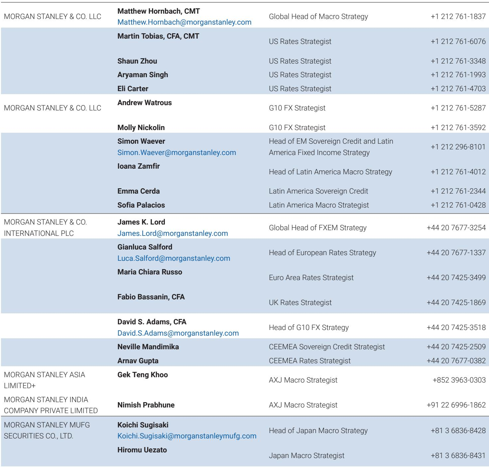
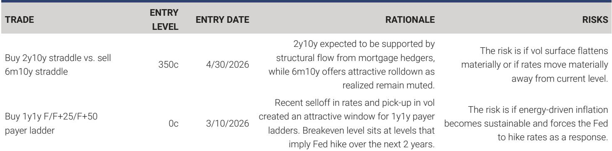

# 市场低估的不是波动，而是期权偏斜信号在利率市场中的结构性价值

利率市场参与者正在面对一个令人困惑的局面：通胀叙事尚未终结，地缘冲突此起彼伏，政策路径的可见度极低。在这样的环境中，大多数投资者本能地转向了更短的久期、更频繁的调仓、更依赖宏观叙事来形成判断。但一份来自某外资投行利率策略团队的研报提出了一个值得深思的相反观点——真正被市场低估的，不是对波动率本身的定价，而是期权偏斜（skew）作为一种独立信号，在利率方向性交易中的结构性预测能力。

这份报告的核心判断是：短期期权偏斜的变化，在长达17年的历史回测中，始终包含关于未来利率走势的预测信息，且这一关系在2019年之后不仅没有消失，反而在长端利率上变得更强。这不是一个样本内的偶然发现，而是一个经过120种参数组合压力测试后仍然成立的规律。

为什么这一点对当前市场尤其重要？因为当宏观冲击成为常态，传统的久期管理框架容易陷入“追着新闻跑”的被动状态。而偏斜信号提供了一种不同的视角——它不依赖对通胀或就业数据的预测，而是捕捉市场参与者通过期权市场表达出来的、对尾部风险的真实定价变化。这种变化往往领先于现货市场的方向性调整。

报告通过三个层次来验证这一主张：信号在不同参数设定下的稳健性、在不同市场阶段的表现分化、以及信号衰减的速度。以下是我们从中提炼出的关键洞察。

## 1. 偏斜信号的预测能力并非数据挖掘的产物，而是市场行为的真实映射

任何量化策略最容易被质疑的问题就是“过拟合”。报告对此做了非常扎实的处理：它没有去寻找一个最优参数组合，而是系统地测试了4种回溯窗口、3种期权期限、10种交易延迟，共计120种规格。结果发现，无论使用互换还是国债期货来表达久期暴露，无论选择1个月、3个月还是6个月的期权期限，偏斜信号的表现都高度一致。

这意味着什么？意味着偏斜所捕捉的，不是某个特定工具或期限上的定价异常，而是更底层的市场结构信息——投资者在期权市场上集中表达的尾部风险对冲需求。当这种需求发生系统性变化时，它往往预示着利率方向的转变。

从实践角度看，这一发现的意义在于：投资者不需要依赖复杂的参数优化或高频交易架构来利用这一信号。一个基于21天回溯窗口的简单策略，在2009年至今的样本期内，已经能够提供稳健的风险调整后回报。

## 2. 2019年之后，信号速度的重要性大幅上升，长端利率的偏斜信号反而更强

报告将样本划分为LIBOR时代（2009-2019年中）和SOFR时代（2019年中至今），这一划分本身就揭示了市场结构性变化。在LIBOR时代，低利率、低波动的环境使得63天回溯窗口的表现与其他更短窗口相当。但在SOFR时代，63天窗口的表现显著恶化，而21天和更短窗口的策略保持了韧性。

这背后的逻辑是直观的：当市场冲击变得更加频繁和剧烈，过时的信号会迅速失去价值。2019年之后的利率市场，经历了疫情、通胀飙升、激进加息、地缘冲突等多重冲击，市场节奏明显加快。在这样的环境下，“快速反应”比“精确确认”更重要。

但报告最反直觉的发现在于期限结构的分化：2年期利率的偏斜信号预测能力在2019年后有所下降，而30年期利率的偏斜信号预测能力反而显著提升。报告给出的解释是，前端利率越来越多地被宏观和政策冲击主导，这类冲击往往在期权市场定价之前就已经通过现货市场反映出来。而长端利率仍然受到投资者持仓结构的显著影响，偏斜信号在这里捕捉到了更纯粹的“持仓拥挤度”信息。

这对当前市场的含义是：如果投资者试图利用偏斜信号来管理利率风险，长端可能比短端提供更好的信噪比。

## 3. 偏斜信号的信息不会立刻被市场吸收，这为战术性交易提供了窗口

报告的一个重要技术贡献是，它系统分析了信号衰减的速度。通过比较1天到10天不同交易延迟下的策略表现，报告发现：即使在延迟10天后建立仓位，策略在LIBOR时代仍然产生了正回报。在SOFR时代，虽然延迟策略的整体回报下降，但1天延迟策略仍然表现良好。

这表明偏斜所包含的信息不是被市场“瞬间套利”掉的。相反，这些信息以渐进的方式被计入利率价格中，持续数天。这一特征使得偏斜信号不仅仅适用于高频交易者，也为中低频的战术性久期管理提供了可行的输入。

但这里需要指出报告尚未完全回答的一个关键问题：2021年至2023年的回撤期间，偏斜信号为何失效？报告提到，偏斜在2021年早期就重新定价了，但利率的后续走势与偏斜信号的方向出现了背离。这一时期的失败案例表明，偏斜信号并非在所有市场状态下都有效。当宏观冲击的规模和速度超过持仓调整所能反映的范畴时，偏斜信号可能暂时失灵。理解这一局限，恰恰是有效使用该信号的前提。

## 4. 报告尚未完全回答的关键问题：偏斜信号的失效边界在哪里？

报告已经做了非常详尽的稳健性检验，但它坦诚地指出了2021-2023年的回撤期，并承认这是信号最显著的失败案例。这个案例的价值在于，它揭示了偏斜信号的一个根本局限：当市场定价的驱动力从“投资者持仓调整”切换为“宏观预期跳跃”时，偏斜信号会暂时失去方向性。

从投资者的角度看，这意味着偏斜信号更适合作为“持仓拥挤度的温度计”，而不是“宏观方向的预言家”。当市场处于宏观冲击主导的阶段，偏斜信号可能提供误导性信息。而当市场进入“消化冲击、重新定价”的阶段，偏斜信号的价值会重新显现。

报告没有明确给出判断当前处于哪种状态的方法论，但这恰恰是最值得进一步探讨的问题。是否可以通过偏斜信号本身的形态（比如偏斜变化的速度、幅度、与其他市场的交叉验证）来区分这两种状态？这些是报告留下但未完全展开的伏笔。

## 5. 对投资者的观察框架：如何将偏斜信号纳入久期管理决策

基于报告的发现，我们建议读者建立一个三层过滤框架来使用偏斜信号：

第一层，确认信号环境。观察偏斜变化的速度。如果偏斜在短时间内出现大幅变动（超过历史均值一个标准差以上），这可能意味着市场正在经历一次集中的持仓调整，信号的可信度较高。如果偏斜变动缓慢且幅度有限，信号可能被噪音淹没。

第二层，交叉验证信号方向。偏斜信号指向的方向，是否与其他市场信号（如期货持仓数据、回购利率、一级交易商调查）一致？一致性越高，信号的可靠性越强。

第三层，关注长端信号。报告已经证明，30年期利率的偏斜信号在2019年之后表现优于2年期。如果投资者只能在两个期限中选择一个，长端偏斜信号可能提供更好的风险调整后回报。

报告当前最新的信号指向什么？它指出，尽管偏斜已经处于非常高的水平，但仍在进一步上升，这意味着信号持续指向做空久期。这是一个值得认真对待的信号，但正如报告所强调的，任何单一信号都不应成为决策的唯一依据。

---

以上是我们基于这份研报提炼出的核心洞察。但坦率地说，报告中有几个问题我们仍然没有完全想清楚：2021-2023年的回撤期间，偏斜信号与利率走势之间的背离，是否可以通过更细粒度的信号分解来避免？偏斜信号在非美元利率市场上的表现如何？这些问题在完整报告中有所涉及，但限于篇幅，本文未能一一展开。

如果你对这些问题感兴趣，欢迎来我们的知识星球和微信群里继续讨论。我们会在社群中分享这份报告的完整解读，包括所有120种参数组合下的详细表现数据，以及我们自己对当前偏斜信号状态的独立判断。

Personal reading notes and learning share only. Not investment advice.

