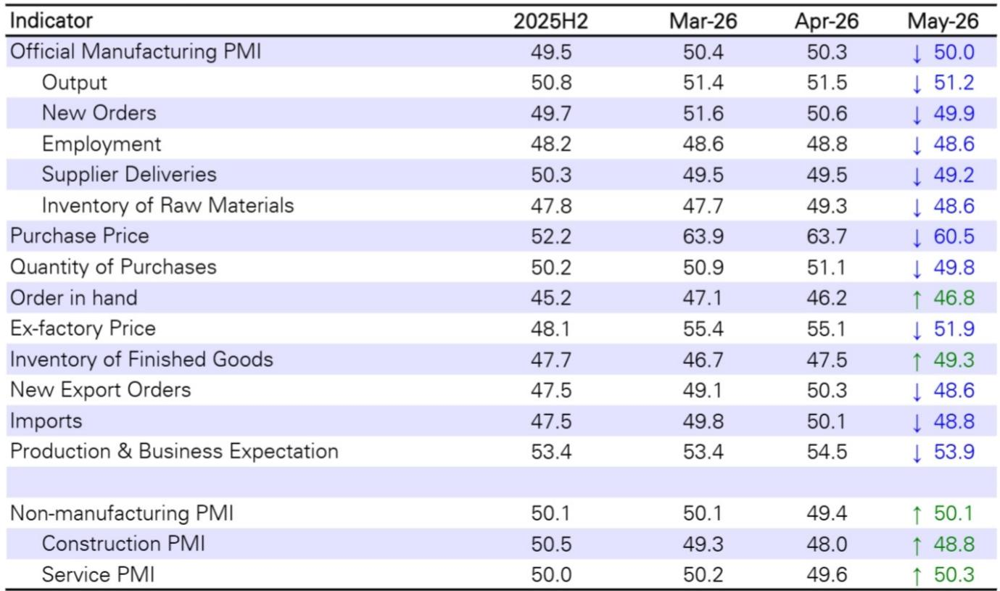
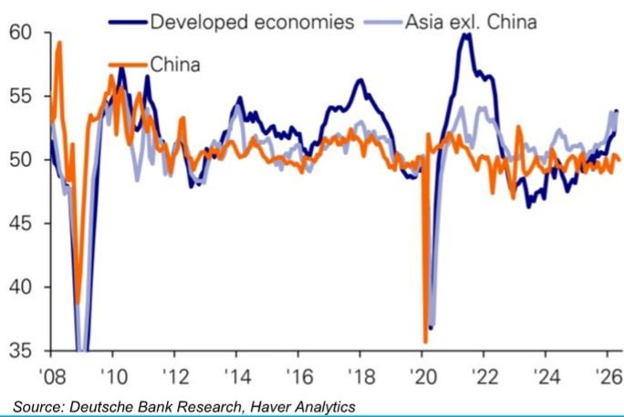

# 五月PMI回落至荣枯线，市场真正担心的不是增长放缓，而是价格传导断裂

五月的中国制造业PMI数据，以精确的50.0画下一条分界线。这不仅仅是从扩张到收缩的临界点，更是一个信号：过去几个月由上游价格上涨驱动的经济叙事，正在遭遇下游需求的真实检验。

某外资投行最新发布的研报指出，五月官方制造业PMI较四月回落0.3个百分点，恰好落在荣枯线上。表面上看，这似乎只是经济复苏节奏的暂时放缓。但拆解分项数据后，一个更值得警觉的图景浮现出来：价格上涨的压力开始从上游传导至中游，但下游需求的承接能力正在减弱。这不是简单的供需错配，而是一轮潜在的价格-需求负反馈循环正在酝酿。

对于关注中国资产定价的投资者而言，五月PMI数据最核心的信息不是增长动能衰减，而是价格传导机制出现裂痕。这个判断，将直接影响我们对下半年政策节奏、行业利润分配以及资产配置逻辑的重新评估。

## 1. 生产与订单的缺口在扩大，这才是真正的需求信号

五月PMI最值得关注的变化，不是总量数字回落至50，而是生产指数与新订单指数之间的裂口在扩大。

生产指数录得51.2，虽然较四月回落0.3个百分点，但依然稳稳站在扩张区间。这意味着制造业企业仍在积极组织生产，供给端没有出现明显的主动收缩。然而，新订单指数从四月的50.6大幅下滑至49.9，五个月来首次跌破荣枯线。更令人警惕的是新出口订单指数，单月骤降1.7个百分点至48.6。

这两个数字放在一起，揭示了一个关键事实：生产跑在了需求前面，而且差距正在拉大。企业仍在按过去的订单节奏安排生产，但新订单的流入速度已经放缓。这种“生产惯性”与“需求冷却”之间的时间差，正是库存被动累积的典型前兆。

对于投资者而言，这个信号的含义是明确的。过去几个季度，市场对中国制造业的乐观情绪很大程度上建立在生产端持续扩张的基础上。但如果生产与订单的缺口持续扩大，那么下一阶段的焦点将从“产能利用率”转向“库存去化压力”。那些库存周期处于高位、且产品价格弹性较低的行业，可能率先面临盈利下修的风险。

## 2. 剪刀差未收窄，中游制造正在被动承担成本压力

研报中一个被重点讨论的指标是“输入价格-产出价格”的剪刀差。五月的输入价格指数录得60.5，产出价格指数录得51.9，两者之间的差距依然维持在8.6个百分点的较高水平。

这已经是两者连续第五个月同时处于扩张区间，但最关键的是，这个剪刀差并没有收窄。通常而言，当上游成本压力开始缓解时，输入价格会率先回落，产出价格则因滞后效应而维持相对高位，剪刀差自然收窄。然而，五月的数据显示，输入价格从四月的63.7回落至60.5，产出价格也从55.1回落至51.9，两者同步下行，但差距基本维持不变。

这意味着什么？企业不仅无法将上游涨价的压力完全传导出去，甚至在下游需求走弱的背景下，产出价格的下行速度比输入价格更快。中游制造企业正在被动承担成本压力，利润空间被双向挤压。

这种局面下，两个推演值得关注。其一，如果油价和其他工业品价格继续高位运行，而下游需求无法有效恢复，那么中游制造业的毛利率将在三季度面临系统性压力。其二，企业可能会在采购端做出更激进的调整——减少原材料采购、压缩库存、甚至主动减产。五月采购量指数从51.1降至49.8，已经暗示了这一趋势的开始。

## 3. 库存信号亮起黄灯：原材料去库、产成品累库的组合值得警惕

研报中一个容易被忽视但极具信号意义的组合是“原材料库存下降”与“产成品库存上升”的背离。

五月原材料库存指数从49.3降至48.6，而产成品库存指数从47.5跳升至49.3，单月上升1.8个百分点。这个组合是典型的“价格冲击下的企业防御行为”：面对居高不下的投入成本，企业减少上游采购以控制现金流；同时，下游销售放缓导致产成品被动积压。

需要强调的是，产成品库存指数目前仍在50以下，尚未进入绝对的累库区间。但方向比绝对水平更重要。过去一年，中国制造业一直处于相对健康的低库存状态，这也是支撑经济韧性的重要因素之一。如果产成品库存指数在未来两个月突破50并持续上行，那么去库存周期将正式开启，届时对工业生产和企业盈利的拖累将更加显著。

对于资产定价而言，库存周期的切换往往领先于盈利周期。如果原材料价格持续高位而需求端无法有效承接，那么企业从“主动补库”转向“被动累库”再到“主动去库”的路径可能加速。当前市场对周期股的定价是否充分反映了这一风险，值得重新审视。

## 4. 服务业与建筑业的分化仍在加深，经济结构转型的代价正在显现

五月PMI中为数不多的亮点是服务业PMI回升0.7个百分点至50.1，重返扩张区间。信息技术、金融服务、交通运输等细分领域均维持在55以上的高景气水平。这在一定程度上对冲了制造业的疲软。

然而，建筑业PMI虽然从四月的48.0回升至48.8，但依然连续第三个月处于收缩区间。建筑业是固定资产投资的前瞻指标，其持续低迷意味着此前市场预期的基建投资加速尚未落地。研报中提及的高频数据显示，截至五月，政府债券累计发行量仍比去年同期少5000亿元人民币。尽管五月发行节奏有所加快，但总量缺口依然存在。

服务业与建筑业的这种分化，本质上是经济结构转型的代价。服务业的高景气反映了消费升级和数字经济的韧性，但建筑业持续低迷则表明传统的投资驱动模式正在失效。对于投资者而言，这意味着两个判断需要调整：第一，不要对基建投资拉动经济有过高期待，财政发力的节奏和力度可能低于预期；第二，消费和服务业的结构性机会值得给予更高权重，但需要关注居民收入预期改善的可持续性。

## 5. 报告尚未完全回答的关键问题：价格冲击的持续性有多强？

尽管这份研报对五月的PMI数据做了非常清晰的三层拆解，但一个核心问题尚未得到充分回答：本轮价格上涨的驱动力——尤其是原油和工业金属价格的上涨——是暂时的供给冲击，还是具有持续性的结构性变化？

研报提到了钢铁价格自四月下旬开始反弹，锌等有色金属价格也在上行，并指出“油价上涨的影响正在向更广泛的行业扩散”。但报告并没有对油价走势本身做出判断。如果原油价格因地缘政治因素持续高位运行，那么输入价格的回落可能比预期更慢，中游企业的利润率压力将持续更长时间。

另一个未解的问题是：如果价格传导断裂导致需求进一步走弱，政策层面会如何应对？五月的PMI数据已经显示出经济内生动能的边际减弱，但政府债券发行节奏尚未显著加速。货币政策方面，当前的实际利率水平是否足以支撑经济？这些问题的答案，可能需要等待后续的高频数据和政策信号来验证。

## 6. 一份值得重新审视的观察框架

基于五月PMI数据的解读，我们可以提炼出一个更简洁的观察框架，用于跟踪未来几个月的经济走势和资产定价逻辑。

第一，关注“生产-订单缺口”是否持续扩大。如果新订单指数连续两个月低于生产指数，那么库存被动累积的风险将显著上升，周期股和工业品的配置逻辑需要重新评估。

第二，关注“输入-产出价格剪刀差”是否开始收窄。剪刀差收窄有两种可能路径：要么输入价格回落（对中游利好），要么产出价格回升（意味着需求改善）。两者指向不同的投资方向。

第三，关注政府债券发行的实际落地进度。五月的数据显示，财政发力节奏仍然偏慢。如果六月、七月的发行量不能明显提速，那么市场对基建投资的预期可能需要进一步下修。

第四，关注服务业景气度的持续性。五月服务业PMI虽然回升，但幅度有限。如果服务业无法持续扩张，那么经济可能面临制造业和建筑业同时疲软的局面，届时政策托底的压力将显著加大。

五月PMI数据传达的信息并不悲观，但足够警示。它提醒我们，在价格冲击与需求韧性之间的博弈中，市场的定价逻辑正在发生微妙的转变。那些能够将成本压力有效传导至下游、同时具备库存管理能力的行业和企业，将在这一轮调整中展现出更强的抗风险能力。

---

以上是对某外资投行五月PMI研报核心逻辑的梳理与延伸。报告中还包含了更多关于跨经济体PMI对比、高频价格数据走势以及政府债券发行节奏的详细图表和分析，这些内容无法在一篇文章中完整呈现。如果你对具体的行业影响、库存周期推演或者政策应对路径有进一步兴趣，欢迎来我们的星球微信群里继续讨论。在那里，我们可以围绕这份报告的完整图表和原始数据，展开更具操作性的推演。

Personal reading notes and learning share only. Not investment advice.

