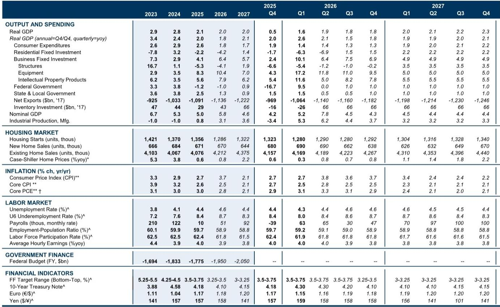
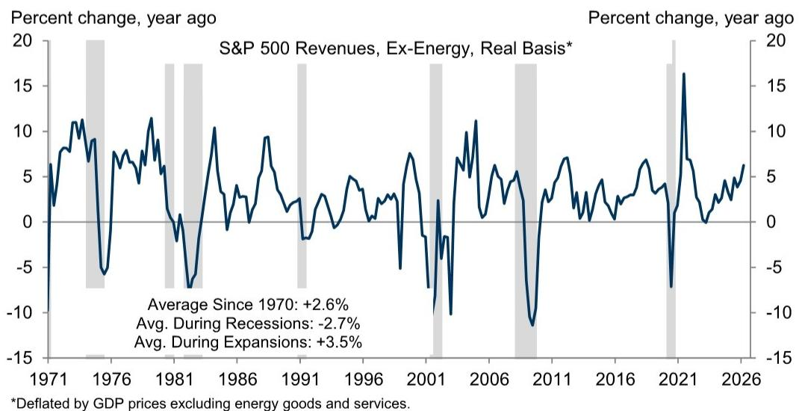
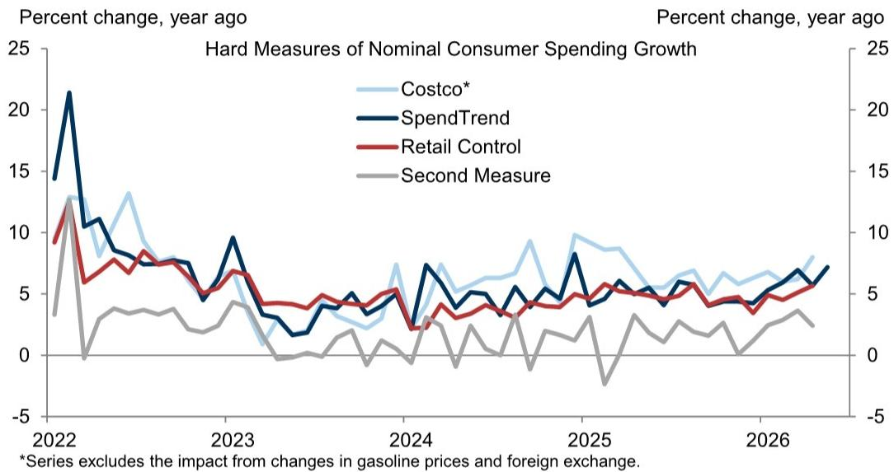

# 市场真正低估的不是需求，而是供给侧的再定价

这份某外资投行最新发布的Q1财报季分析报告，表面上看是在回答“企业盈利还能撑多久”，但细读下来，它真正揭示的是一组被市场定价忽略的结构性矛盾：消费者现金流的底层逻辑正在被改写，而AI投资的规模已经大到足以独立影响宏观经济账户中的资本形成。这两个方向的力量并不对冲，但它们对资产定价的含义截然不同。

报告覆盖了几乎所有标普500成分股，数据截止日接近完整。其核心判断可以浓缩为一句话：当前的经济韧性建立在两个脆弱支点之上——低储蓄率支撑的消费和超大规模企业主导的AI资本开支。前者面临油价、财政退坡和收入增速下滑的三重挤压，后者则几乎没有受到地缘风险的干扰，反而在加速。

这不是一份“乐观”或“悲观”的报告，而是一份关于“分化正在加剧”的报告。对于产业决策者和资产配置者而言，真正需要理解的问题不是经济会不会衰退，而是哪些部门正在被重新定价，以及这种重新定价的逻辑是否已经被市场消化。

## 1. 消费的韧性来自结构性透支，而非基本面改善

财报数据显示，Q1消费者相关企业的营收增长依然强劲：标普500可选消费板块中位数公司营收同比增长9%，必需消费板块也达到5%。从官方统计和替代数据来看，名义消费支出增速在过去几个月保持稳定。

但这份报告真正有价值的洞察不在于这些表面数字，而在于它对消费现金流的底层拆解。报告明确指出，当前的消费韧性建立在一个不可持续的基础之上：个人储蓄率处于低位，实际可支配收入在4月个人收入报告中同比下降了1.1%。这意味着消费者正在动用储蓄来维持支出节奏，而不是因为收入增长在加速。

报告预测2026年下半年的实际消费支出增速仅为1.3%，显著低于市场一致预期。这个数字的背后是三个结构性因素的叠加：高油价对实际购买力的侵蚀、强劲退税效应的消退、以及通胀粘性对名义收入的持续消耗。值得注意的是，报告专门分析了不同收入阶层的分化——低收入群体的消费增速在过去一年已经从领先3.1个百分点收窄至1.1个百分点，而高油价对底层收入群体的冲击将更为显著。

这里有一个尚未被市场充分定价的含义：如果消费增速真的降至1.3%，那么当前市场对消费类资产的盈利预期可能仍然偏高。尤其是那些依赖低收入客群的零售企业，其营收和利润的韧性可能比市场想象的要脆弱。

## 2. 油价冲击的真正传导路径不在通胀，而在企业利润率

报告构建了一个独特的公司价格公告追踪器，用来捕捉企业层面的价格传导行为。这个指标在Q1升至2023年以来的最高水平，但仍远低于2022年的峰值。企业最频繁提及的价格上涨因素包括油价、航运成本、树脂基材料和计算机内存。

但真正值得关注的是报告揭示的一个传导机制：分析师对Q2利润率预期的下修幅度，与各行业价格公告追踪器的上升幅度高度相关。换句话说，那些面临最大输入成本压力的行业，其利润率指引的下调幅度也最大。这不是巧合，而是一个清晰的定价权信号——企业无法将全部成本上涨转嫁给消费者。

从行业分布来看，能源、必需消费、工业和非必需消费板块的价格公告追踪器上升最为明显，而这些板块的利润率预期也相应被下修。这意味着，即使整体通胀读数可能因为油价上涨而暂时走高，但企业层面的利润压力实际上在上升。

对于投资者而言，这个传导链条的含义是：油价上涨对资产价格的影响可能不是通过利率预期路径（即通胀走高导致加息预期升温），而是通过企业盈利路径。如果利润率持续承压，即使名义营收增长保持韧性，每股盈利的增长空间也将被压缩。市场目前是否充分定价了这一利润率风险，是一个需要持续跟踪的问题。

## 3. AI资本开支的规模已经超出“主题投资”的范畴，开始重塑宏观账户

报告在AI相关分析中给出了一个令人瞩目的数字：分析师对2026年超大规模企业资本开支的预期，自财报季开始以来被上调了12%，达到超过7500亿美元，相当于较2025年增长83%。这个数字已经远远超出了“科技主题”的范畴，开始对宏观经济账户中的企业固定投资产生实质性影响。

报告估算，今年实际企业固定投资将增长近8%，其中AI相关支出贡献了约3个百分点，去年财政刺激中的税收优惠贡献了另外3个百分点。这意味着，如果不考虑AI和财政因素，企业固定投资增速可能仅为2%左右。

这里有一个值得深思的结构性问题：AI资本开支的集中度极高，主要由少数几家超大规模企业驱动。这种集中度意味着，如果这些企业的资本开支计划出现任何调整，其对宏观投资的冲击将是非线性的。报告没有直接讨论这个风险，但它隐含在数据之中——当83%的增速预期建立在少数几家公司的决策之上时，集中度本身就是一种脆弱性。

另一个尚未被充分讨论的问题是：AI资本开支的生产率回报何时能够体现。报告提到，目前关于AI对劳动力市场的影响仍然有限，只有极少数管理层在讨论裁员或招聘冻结时提及AI。但报告也指出，在科技公司和初创企业这个狭窄领域，将裁员与AI关联的频率在当月急剧上升，尤其是涉及运营、数据标注、软件开发和客户支持等岗位。然而，同一批公司在计算机硬件、系统工程和研究等岗位的招聘需求却在增加。

这意味着，AI对就业的影响不是简单的“替代”或“创造”，而是“再分配”。这种再分配对劳动力市场的结构性含义——包括技能溢价的变化、区域就业格局的重塑、以及工资通胀的部门分化——可能需要几个季度才能体现在宏观数据中。报告提出了这个问题，但没有给出完整的答案，这正是需要持续跟踪的关键变量。

## 4. 报告尚未完全回答的关键问题：利润率拐点何时到来

整份报告最引人深思的部分，是它揭示了一个尚未被回答的问题：当消费增速放缓、输入成本上升、AI资本开支仍在加速这三个趋势同时发生时，企业利润率究竟会走向何方？

从历史经验来看，消费放缓通常意味着企业定价权减弱，而成本上升意味着利润率承压。但AI资本开支的加速又意味着，那些能够将AI转化为生产率提升的企业，可能获得成本结构的改善。这两个方向的力量在不同行业、不同企业之间的分布极不均匀。

报告提供的分析框架是：关注那些价格公告追踪器上升但利润率预期下修的行业，它们可能是利润率最先承压的领域。但报告没有回答的是，这个传导链条需要多长时间才能从企业层面的利润率数据传导到整体市场的盈利预期调整。如果市场对盈利预期的调整滞后于利润率实际变化，那么当前估值水平中隐含的盈利假设可能过于乐观。

另一个未解的问题是：AI资本开支的回报周期。如果超大规模企业的资本开支在2026年达到83%的增长，那么这些投资何时能够转化为收入增长或成本节约？如果回报周期长于市场预期，那么这些企业的自由现金流和股东回报能力将面临压力。报告提供了资本开支数据，但没有给出回报周期的估算框架，这可能是完整报告中的核心内容。

## 5. 观察框架：三个需要持续跟踪的信号

基于这份报告的分析逻辑，产业决策者和资产配置者可以建立三个观察框架，用以判断上述结构性矛盾如何演变。

第一个信号是低收入群体的消费数据。报告已经指出，低收入群体的消费增速正在放缓，且高油价的冲击具有不对称性。后续需要跟踪的是，这种放缓是否会从可选消费蔓延到必需消费，以及消费信贷的违约率是否会开始上升。如果低收入群体的消费数据出现加速恶化，那么整体消费增速的下行风险可能比报告预测的1.3%更加严峻。

第二个信号是企业利润率指引的修正方向。报告显示，Q2的利润率预期已经被下修，但下修的幅度是否足够，取决于输入成本的后续走势和企业的定价能力。需要特别关注的是那些同时面临成本上升和需求放缓的行业——如果这些行业的利润率指引在Q3再次被下修，那么盈利预期的调整可能才刚刚开始。

第三个信号是AI资本开支的边际变化。报告的数据截至Q1财报季，当时超大规模企业的资本开支计划仍在加速。但后续需要关注的是，如果宏观环境发生变化，这些企业是否会调整其资本开支节奏。任何关于资本开支放缓的信号，都将对科技硬件、半导体和相关基础设施板块产生显著影响。

这三个信号不是独立的，它们之间存在相互强化或对冲的关系。例如，如果消费放缓导致宏观不确定性上升，超大规模企业可能会推迟部分资本开支，从而减轻对AI相关板块的负面影响。但如果消费放缓的同时AI资本开支仍在加速，那么市场可能会更早地开始定价“增长质量”的问题。

这份报告的价值不在于给出一个确定的判断，而在于提供了一个分析框架，让读者能够识别哪些变量真正重要，以及它们之间的因果关系。对于希望深入理解这些结构性变化的读者，完整报告中包含了更多关于消费分化的细节数据、利润率传导的行业交叉分析、以及AI资本开支的回报周期估算。欢迎来星球微信群继续讨论这些未完的问题，一起追踪上述三个信号的实际演变。

Personal reading notes and learning share only. Not investment advice.

