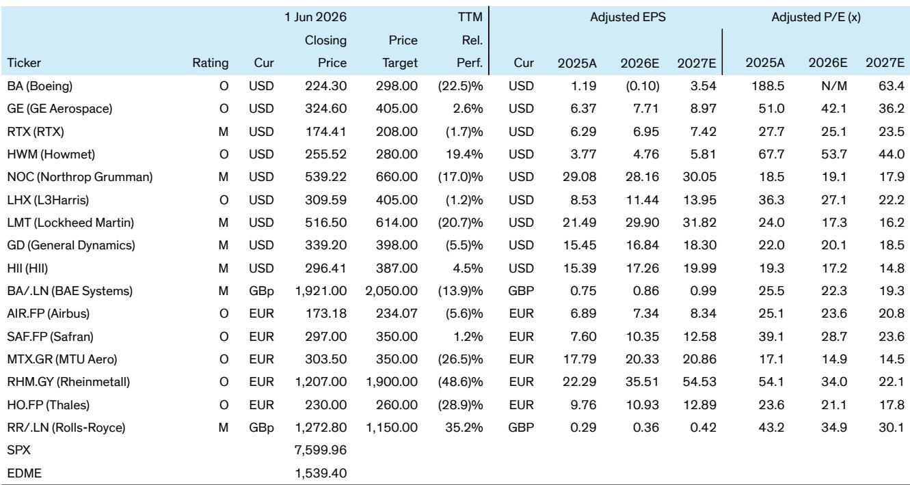
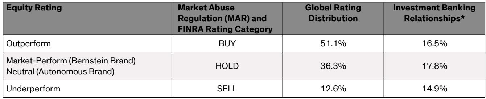

# 航空航天与防务：市场真正低估的不是需求，而是供给端的结构性重塑

过去一周，某外资投行在纽约举办的战略决策会议上，与十二家航空航天与防务公司的CEO进行了密集交流。参会者覆盖了从波音、GE Aerospace到Anduril、L3Harris等商业航空与防务领域的核心玩家。会后发布的一份研报，表面上是对CEO观点的汇总，但深挖下去，它揭示了一个远比短期订单波动更重要的结构性判断：行业正在经历的不是一次周期性的需求起伏，而是供给端——从供应链结构、生产模式到竞争格局——的深层重构。市场当前的定价，可能更多反映了对需求端的担忧或乐观，却尚未充分消化供给端正在发生的、不可逆的变化。

这份报告的价值，不在于告诉读者“航空需求依然强劲”或“防务预算存在不确定性”这类已知信息。它的真正洞察在于，通过十二位CEO的口径，勾勒出了供给端几个同步发生、相互强化的趋势：商业航空领域，售后市场与OE生产同时高负荷运转，正在考验供应链的极限；防务领域，导弹需求的爆发式增长催生了全新的生产框架和合同模式；而Anduril等新进入者的崛起，则从根本上挑战了传统防务承包商的成本结构与交付速度。这些趋势叠加在一起，意味着行业龙头公司的竞争优势、盈利能力和估值逻辑都在被重新定义。

以下是我们从这份报告中提炼出的五个核心洞察。它们不是对报告内容的复述，而是试图回答一个更根本的问题：这些CEO的集体声音，究竟在告诉我们哪些市场尚未完全定价的变化？

## 1. 商业航空的真正压力点不在需求端，而在OE与售后市场同时高负荷运转下的供应链极限

报告中最容易被忽略的一个信息是，所有商业航空公司的CEO都表示，尽管燃油价格高企对航空公司盈利构成压力，但他们尚未看到任何需求疲软的迹象。售后市场的订单簿已经覆盖了未来12到18个月的产能，新机型的覆盖周期甚至更长。这听起来像是一个典型的“需求强劲”故事。但真正的故事并不在这里。

真正的压力点在于，OE（原厂设备）生产正在加速——波音确认737月产47架的里程碑已经通过FAA审核，并计划在夏季全面达成，随后向52架、57架甚至63架迈进——而售后市场的需求并未因OE增产而减弱。这两个市场同时高负荷运转，意味着供应链必须同时满足两套互不兼容的节奏：OE要求准时、大批量、标准化的交付，而售后市场则要求灵活、小批量、高时效的备件供应。报告明确指出，这种叠加正在给供应链带来“压力”。但更准确的表述是，它正在暴露供应链的瓶颈。

以发动机为例。供应商正在消化库存，使交付与生产速率更加对齐，但报告也承认，某些部件的库存消化仍需时日。这意味着，在供应链的某些节点，产能的物理瓶颈尚未解除。对于投资者而言，关键问题不是“需求会不会下降”，而是“在需求不下降的前提下，供应链能否支撑当前的增速”。如果答案是否定的，那么接下来的故事就不是需求端的放缓，而是供给端的瓶颈导致交付延迟、成本上升，进而压缩利润率。报告没有给出这个判断，但所有信号都指向这个方向。

## 2. 导弹需求的“3倍到4倍”增长框架，正在重塑防务供应链的价值分配

防务领域最引人注目的信号来自导弹和导弹防御。报告提到，Lockheed Martin和RTX都描述了“非常强劲”的需求前景，并建立了新的生产增长框架，计划在未来五到七年内将当前产量提升3倍到4倍。更关键的是，这些合同预计将包含“增长保障条款”——如果需求未能如期兑现，政府将对公司进行补偿。这意味着，对于参与这些框架的公司而言，增长的下行风险被显著对冲了。

但这一趋势的更深层含义在于，它正在重塑防务供应链的价值分配。报告特别提到，对于Howmet和ATI这样的材料供应商而言，导弹市场正在成为一个新的增长领域，而此前导弹并不是它们的重要市场。这听起来像是一个简单的“新增业务”故事，但它的结构含义是：随着导弹生产从“精品化、小批量”转向“工业化、大批量”，供应链的利润池正在从集成商向关键材料和子系统的供应商转移。那些能够提供固体火箭发动机、微电子制导组件、结构件的公司，将获得比以往更大的议价权。

报告没有完全展开的一个问题是，这种增长框架是否可持续。3倍到4倍的产量提升，意味着对供应链的产能投资要求极高。如果需求在五年后未能持续，那些为扩产投入的资本可能会成为沉没成本。但保障条款的存在，恰恰说明政府和产业界都意识到了这种风险，并试图通过合同设计来分担。这本身就是一个重要的信号：导弹生产正在从“采购”模式转向“产业政策”模式。

## 3. 新进入者的成功不是偶然，而是对传统防务成本结构的系统性颠覆

Anduril的CEO Brian Schimpf在会议上的发言，可能是整份报告中最具颠覆性的内容。Anduril目前约有1万名员工，年收入在2025年超过20亿美元，预计2026年翻倍，五年内可能达到300亿到400亿美元。这样的增长速度在传统防务领域几乎是不可想象的。

但真正值得关注的不是增长数字本身，而是Anduril实现这种增长的逻辑。Schimpf明确指出，Anduril的优势在于它没有继承传统防务承包商“追求极致性能、忽视可制造性和可扩展性”的历史包袱。它通过内部整合关键组件——包括固体火箭发动机、作动器、航电和制导系统——来降低对低层级供应商的依赖。当大部分价值由集成商攫取时，低层级供应商往往缺乏投资动力，而Anduril的垂直整合模式恰好解决了这个问题。

更关键的是，Anduril正在推动一种全新的收入模式：从“卖产品”转向“卖服务”。它在美国海军陆战队的反无人机项目中，采用了“按性能付费”的合同结构，系统可用性和效能直接与收入和利润挂钩。如果系统失效，公司面临财务惩罚；如果系统可靠并持续改进，利润则会改善。这种模式在软件定义的世界中尤其重要，因为软件需要持续更新，而传统的“交付即结束”的合同结构无法激励这种持续投入。

报告没有说透的一个问题是，Anduril的“服务化”模式能否被传统防务承包商复制。传统承包商的利润结构中，维护和保障（sustainment）往往是最稳定、最丰厚的部分。如果Anduril的模式被大规模采用，传统承包商的利润池将面临结构性侵蚀。这不是一个“新玩家抢市场份额”的故事，而是一个“整个行业的盈利模式被重新定义”的故事。

## 4. 2027年防务预算的不确定性，掩盖了一个更重要的结构性趋势：预算结构正在发生变化

所有防务公司的CEO都对2027年的预算表示乐观，尽管没有人假设特朗普政府提出的1.5万亿美元预算目标能够完全通过国会。但报告也揭示了一个容易被忽略的细节：这些公司强调，它们的项目主要依赖拨款（appropriations），而非和解程序（reconciliation）。这意味着，即使整体预算谈判陷入僵局，核心防务项目的资金仍然有较高的确定性。

但真正重要的不是预算的总量，而是预算的结构。报告指出，导弹和导弹防御是“最热门的领域”，空间被普遍视为高增长领域，舰船建造的吞吐量正在改善。这些领域的共同特征是，它们都对应着战争形态的变化——从反恐战争转向大国竞争，从有人平台转向无人系统，从传统弹药转向精确制导和高超音速武器。这意味着，即使总预算增速放缓，资金也会从传统领域（如有人战机、传统舰船）向新兴领域（如导弹、空间、无人系统）转移。

对于投资者而言，这意味着不能简单用“防务预算增长”或“防务预算下降”来判断整个板块。更有效的框架是：哪些公司的收入结构更偏向导弹、空间和无人系统？哪些公司仍然高度依赖传统平台？报告没有给出具体的公司对比，但CEO们的集体声音已经清晰地指向了前者。

## 5. 报告尚未完全回答的关键问题：新进入者的“规模困境”与“整合结局”

报告的最后一个值得深思的洞察来自Anduril CEO自己对行业格局的判断。他直言不讳地指出，“许多新进入者在五到十年内将不复存在”。原因是，许多新进入者起步时是单一产品或单一品类的公司，而在防务领域，这种模式极难规模化，因为单一品类的市场天花板很低。Anduril之所以能够持续增长，是因为它拥有25条业务线，每年总有部分业务增长强劲，部分业务表现平平。

这个判断引出了一个报告没有完全展开的问题：防务科技领域的“新进入者浪潮”最终会如何收场？一种可能是，少数像Anduril这样拥有多业务线和平台化能力的公司会成长为新的“大型承包商”，而多数小公司会被传统承包商收购。报告提到，几家大型承包商已经通过风险投资基金与新进入者合作，这实际上是在为未来的整合铺路。

对于投资者而言，这意味着不能简单地把“防务科技”视为一个统一的投资主题。真正有价值的是那些能够建立平台化能力、多业务线协同、并且能够从“卖产品”转向“卖服务”的公司。而那些依赖单一产品、缺乏供应链控制力的小型公司，即使技术领先，也可能在规模化过程中被淘汰或低价收购。

---

这份报告的价值，不在于它提供了多少新的数据点，而在于它通过十二位CEO的集体视角，拼凑出了行业供给端正在发生的结构性变化。商业航空的供应链瓶颈、导弹生产的工业化转型、新进入者对传统成本结构的颠覆、防务预算的结构性再分配——这些趋势各自独立，却又相互强化。它们共同指向一个判断：行业的竞争规则正在被重写。

但报告也留下了若干未解的问题。导弹增长框架的保障条款究竟如何执行？Anduril的服务化模式能否在更大范围内复制？传统承包商能否在保持利润率的同时，适应新的成本结构？这些问题，报告给出了线索，但没有给出答案。而这恰恰是继续深入阅读完整报告、与同行交流讨论的价值所在。

欢迎来星球微信群里继续讨论。我们会在群内分享完整报告的原始图表、估值表格，以及我们对上述未解问题的进一步推演。如果你也在关注航空航天与防务板块的结构性变化，这里应该能给你一些新的视角。

Personal reading notes and learning share only. Not investment advice.

