# Commodity Market Positioning & Flows

Weaker energy prices meet gold-led net outflows

- The estimated value of open interest across tracked commodity markets decreased by 4% WoW (\$69 billion) to \$1.82 trillion as of May 29 (Table 2, Figure 2). The decline was primarily driven by lower energy prices (ex. US natural gas) and \$22 billion of outflows from gold markets across all trader types. Higher energy prices are now finding their way into the headline inflation forecasts by our economists, however global (ex. China) core inflation is still expected to remain “sticky” at around 3%. This potentially increases pressure on the Fed to tighten, but expectations for a mix of easing and stability elsewhere have shifted to a projection for a broad but shallow global tightening cycle over the coming year (Global Data Watch: Tenor madness, Kasman et al, 29 May 2026).   
- The estimated value of net investor positioning aggregated across global commodity futures markets decreased by 8% WoW (\$20 billion WoW) to \$223 billion as of the latest data available (Table 1, Figure 3, Figure 4). The decline was largely driven by the energy and agri markets. Net length in energy markets declined by \$9 billion WoW, primarily driven by the decline across crude oil, where net length decreased from \$61 billion to \$51 billion over the week, followed by a \$1.4 billion net shortening in TTF natural gas. Net length in agri markets declined by \$6.5 billion WoW, driven by a decline across corn, soybean and livestock markets. Net length in precious metals decreased by \$3.5 billion WoW, led by gold (-\$2.7 billion WoW), while net length in base metals decreased by \$1.5 billion WoW, driven by copper and aluminum. JPM QDS's latest projections, as of June 1, indicate that positioning across commodity markets is expected to decline by a further \$2.6 billion, largely driven by energy markets.   
- The estimated value of open interest in energy markets decreased by 6% WoW (\$56 billion WoW) to \$816 billion (29 May, Figure 6). This was driven by a decline in prices across the crude oil and petroleum products markets over the week (Brent down 11% WoW, WTI down 10%, ICE Gasoil down 11%), in addition to net contract-based outflows of \$14 billion, primarily from the crude oil markets. We estimate a 9% decline in China's oil demand, with limited decline in underlying economic activity—with a portion of the loss in gasoline, diesel, and fuel oil demand likely to persist, as jet fuel and naphta will largely recover. The estimated value of open interest in natural gas markets decreased by 3% over the week to \$175 billion (29 May, Figure 13). This was driven by a decline in prices across European and Asian benchmarks and net contract-based outflows of \$3 billion, partially offset by an increase in the US natural gas prices over the week. We estimate that the global LNG market has absorbed about 60% of the Hormuz-driven supply shock through increased output from new projects in North America and Africa, keeping spot prices relatively stable. However, with market flexibility now fading and European storage levels well below average, we expect prices to rise into peak injection season to accelerate gas-to-coal switching in Europe and soften Asian spot LNG demand, ultimately supporting Europe's storage trajectory.   
- The estimated value of open interest in precious metals markets declined by 8%

# Global Commodities Research

# Otar Dgebuadze, CFA

(44-20) 3493-8246

otar.dgebuadze@JPM.com

JPM Securities plc

# Natasha Kaneva

(1-212) 834-3175

natasha.kaneva@JPM.com

JPM Chase Bank NA

# Gregory C. Shearer

(44-20) 7134-8161

gregory.c.shearer@JPM.com

JPM Securities plc

# Tracey Allen

(44-20) 7134-6732

tracey.l.allen@JPM.com

JPM Securities plc

# Ali A. Ibrahim

(44-20) 3493-6438

ali.ibrahim@JPM.com

JPM Securities plc

# Aradhaya Makkar

aradhaya.makkar@jpmchase.com

JPM India Private Limited

# Ananyashree Gupta

(91-22) 6157 3627

ananyashree.gupta@jpmchase.com

JPM India Private Limited

WoW (\$22 billion) to \$264 billion, falling for the third straight week (29 May, Figure 8). Across all trader types, the sector saw strong net contract-based outflows totalling \$22 billion WoW, primarily from gold (\$22 billion WoW). Meanwhile, net Managed Money positioning in COMEX Gold futures increased by 3.9k contracts to a total of 97.4k contracts net long. Global gold ETF holdings now sit at 4,131 tonnes (+3% YTD), despite another wave of selling in April and May.

- The estimated value of open interest in base metals markets increased by 1% WoW (\$1.8 billion) to \$239 billion (29 May, Figure 9). The sector saw net contract-based inflows across all trader types, as the outflows from aluminium (-\$0.9 billion WoW) and zinc (-\$0.3 billion) markets have been more than offset by inflows in copper (+\$2.3 billion WoW). Supply disappointments and disruptions have swelled once again in 2026, supporting a higher-for-longer zinc price environment despite still-lifeless demand. LME zinc prices are expected to remain in a higher for longer range of \$3,400–\$3,500/mt on average over the balance of 2026 to incentivize Chinese exports, though risks are skewed towards a quicker cooling over 2H26 as Chinese exports could overshoot while inflationary pressures risk curbing demand more sharply than our forecast.   
- The estimated value of open interest across environmental markets increased by 7% WoW (\$5 billion) to \$76 billion WoW (29 May, Figure 7). This was driven by a 5% increase in the EUA prices, further supported by net contract-based inflows of \$1 billion, primarily into the EUA market. Investment Funds increased their net long position across EUAs as of 22 May to 38,981 lots, up by 422 lots WoW.   
- The estimated value of open interest in agricultural markets remained largely stable over the week at \$393 billion (29 May, Figure 10, Figure 14), as net contract-based inflows of \$4 billion, primarily into the soybean markets, were broadly offset by a decline in prices across corn, wheat, sugar and cotton markets.   
- Price momentum largely decreased across most of the complex over the week (29 May, Figure 17, Figure 18). The short-term price momentum trading signals on Gasoil, TTF, Soybeans and Sugar switched negative to a ‘sell’ signal during the week.

See Agricultural Commodities CFTC COT Report for relevant supplemental data across agricultural markets.

Table 1: Net investor positioning across tracked commodity markets   
USD million 

<table><tr><td rowspan="2"></td><td rowspan="2"># of markets / Last reported date</td><td rowspan="2">Last reported value</td><td rowspan="2">Latest projection 01-Jun-26</td><td rowspan="2">Projection vs last reported</td><td colspan="4">Change in Positioning (reported)</td></tr><tr><td>1 Week</td><td>1 Month</td><td>3 Months</td><td>2026 YTD</td></tr><tr><td>Total Commodities</td><td>33</td><td>222,598</td><td>220,047</td><td>-2,551</td><td>-20,240</td><td>-11,476</td><td>39,593</td><td>29,109</td></tr><tr><td>Energy</td><td>8</td><td>43,207</td><td>40,831</td><td>-2,376</td><td>-9,039</td><td>-9,364</td><td>32,168</td><td>44,495</td></tr><tr><td>Crude Oil</td><td>3</td><td>51,192</td><td>49,725</td><td>-1,467</td><td>-10,206</td><td>-13,350</td><td>28,869</td><td>37,311</td></tr><tr><td>ICE Brent</td><td>26-May-26</td><td>21,843</td><td>20,886</td><td>-958</td><td>-8,223</td><td>-10,867</td><td>26,568</td><td>26,917</td></tr><tr><td>NYMEX WTI</td><td>26-May-26</td><td>15,116</td><td>14,607</td><td>-509</td><td>-3,483</td><td>-4,062</td><td>2,281</td><td>11,320</td></tr><tr><td>ICE Dubai</td><td>26-May-26</td><td>14,233</td><td>na</td><td>na</td><td>1,499</td><td>1,579</td><td>20</td><td>-926</td></tr><tr><td>Petroleum Products</td><td>3</td><td>-17,990</td><td>-18,417</td><td>-427</td><td>2,489</td><td>3,630</td><td>-8,389</td><td>-12,143</td></tr><tr><td>NYMEX Gasoline</td><td>26-May-26</td><td>7,389</td><td>7,223</td><td>-165</td><td>-517</td><td>-1,017</td><td>-2,088</td><td>2,037</td></tr><tr><td>ICE Gasoil</td><td>26-May-26</td><td>-25,785</td><td>na</td><td>na</td><td>3,586</td><td>4,853</td><td>-4,345</td><td>-12,970</td></tr><tr><td>NYMEX Heat Oil</td><td>26-May-26</td><td>407</td><td>145</td><td>-262</td><td>-580</td><td>-205</td><td>-1,956</td><td>-1,210</td></tr><tr><td>Natural Gas</td><td>2</td><td>10,005</td><td>9,523</td><td>-482</td><td>-1,321</td><td>356</td><td>11,689</td><td>19,327</td></tr><tr><td>NYMEX Natgas</td><td>26-May-26</td><td>-5,880</td><td>-6,362</td><td>-482</td><td>105</td><td>-1,625</td><td>424</td><td>359</td></tr><tr><td>TTF Natgas</td><td>22-May-26</td><td>15,885</td><td>na</td><td>na</td><td>-1,426</td><td>1,981</td><td>11,265</td><td>18,968</td></tr><tr><td>Environmental</td><td>2</td><td>5,256</td><td>5,256</td><td>0</td><td>286</td><td>405</td><td>-1,406</td><td>-8,691</td></tr><tr><td>EUA</td><td>22-May-26</td><td>3,650</td><td>na</td><td>na</td><td>107</td><td>161</td><td>-1,763</td><td>-8,613</td></tr><tr><td>UKA</td><td>22-May-26</td><td>1,605</td><td>na</td><td>na</td><td>179</td><td>244</td><td>357</td><td>-79</td></tr><tr><td>Metals</td><td>10</td><td>132,934</td><td>133,805</td><td>871</td><td>-5,008</td><td>3,433</td><td>-4,815</td><td>-33,898</td></tr><tr><td>Precious</td><td>4</td><td>79,253</td><td>79,280</td><td>27</td><td>-3,482</td><td>-4,445</td><td>-13,938</td><td>-37,399</td></tr><tr><td>CMX Gold</td><td>26-May-26</td><td>69,452</td><td>69,848</td><td>396</td><td>-2,651</td><td>-3,815</td><td>-12,601</td><td>-33,379</td></tr><tr><td>CMX Silver</td><td>26-May-26</td><td>8,479</td><td>8,165</td><td>-314</td><td>-752</td><td>-366</td><td>-1,198</td><td>-3,399</td></tr><tr><td>NYMX Platinum</td><td>26-May-26</td><td>1,723</td><td>1,672</td><td>-51</td><td>-18</td><td>-78</td><td>288</td><td>-319</td></tr><tr><td>NYMX Palladium</td><td>26-May-26</td><td>-401</td><td>-405</td><td>-4</td><td>-61</td><td>-186</td><td>-427</td><td>-301</td></tr><tr><td>Base</td><td>6</td><td>53,681</td><td>54,525</td><td>844</td><td>-1,526</td><td>7,878</td><td>9,123</td><td>3,500</td></tr><tr><td>CMX Copper</td><td>26-May-26</td><td>11,615</td><td>12,459</td><td>844</td><td>-81</td><td>2,254</td><td>3,290</td><td>2,844</td></tr><tr><td>LME Copper</td><td>29-May-26</td><td>14,270</td><td>na</td><td>na</td><td>-955</td><td>2,024</td><td>2,621</td><td>-8,084</td></tr><tr><td>LME Aluminum</td><td>29-May-26</td><td>19,587</td><td>na</td><td>na</td><td>-770</td><td>2,104</td><td>943</td><td>5,495</td></tr><tr><td>LME Zinc</td><td>29-May-26</td><td>4,143</td><td>na</td><td>na</td><td>43</td><td>977</td><td>804</td><td>1,478</td></tr><tr><td>LME Nickel</td><td>29-May-26</td><td>4,188</td><td>na</td><td>na</td><td>-33</td><td>-437</td><td>568</td><td>1,290</td></tr><tr><td>LME Lead</td><td>29-May-26</td><td>-123</td><td>na</td><td>na</td><td>269</td><td>957</td><td>897</td><td>477</td></tr><tr><td>Agriculture</td><td>13</td><td>41,201</td><td>40,155</td><td>-1,045</td><td>-6,480</td><td>-5,950</td><td>13,645</td><td>27,203</td></tr><tr><td>Grains</td><td>6</td><td>30,083</td><td>30,013</td><td>-70</td><td>-3,926</td><td>-2,022</td><td>11,003</td><td>26,189</td></tr><tr><td>CBT Corn</td><td>26-May-26</td><td>6,908</td><td>6,013</td><td>-895</td><td>-1,601</td><td>-1,018</td><td>4,953</td><td>5,720</td></tr><tr><td>CBT Wheat</td><td>26-May-26</td><td>-301</td><td>-498</td><td>-198</td><td>-309</td><td>-329</td><td>444</td><td>1,538</td></tr><tr><td>KBT Wheat</td><td>26-May-26</td><td>-59</td><td>-265</td><td>-206</td><td>-249</td><td>-499</td><td>-110</td><td>-11</td></tr><tr><td>CBT Soy beans</td><td>26-May-26</td><td>12,137</td><td>12,205</td><td>68</td><td>-698</td><td>763</td><td>-686</td><td>5,675</td></tr><tr><td>CBT Soy Meal</td><td>26-May-26</td><td>5,080</td><td>5,026</td><td>-54</td><td>-228</td><td>309</td><td>2,821</td><td>5,151</td></tr><tr><td>CBT Soy Oil</td><td>26-May-26</td><td>6,316</td><td>7,533</td><td>1,216</td><td>-840</td><td>-1,248</td><td>3,582</td><td>8,116</td></tr><tr><td>Softs</td><td>4</td><td>3,125</td><td>2,350</td><td>-775</td><td>-367</td><td>176</td><td>7,179</td><td>2,995</td></tr><tr><td>ICE Cotton</td><td>26-May-26</td><td>3,392</td><td>3,259</td><td>-133</td><td>-415</td><td>262</td><td>4,263</td><td>4,401</td></tr><tr><td>ICE Sugar</td><td>26-May-26</td><td>-1,299</td><td>-1,539</td><td>-240</td><td>28</td><td>976</td><td>2,524</td><td>1,024</td></tr><tr><td>ICE Coffee</td><td>26-May-26</td><td>1,709</td><td>1,393</td><td>-316</td><td>92</td><td>-1,167</td><td>547</td><td>-1,560</td></tr><tr><td>ICE Cocoa</td><td>26-May-26</td><td>-677</td><td>-763</td><td>-86</td><td>-72</td><td>104</td><td>-156</td><td>-871</td></tr><tr><td>Livestock</td><td>3</td><td>7,993</td><td>7,792</td><td>-201</td><td>-2,187</td><td>-4,103</td><td>-4,536</td><td>-1,981</td></tr><tr><td>CME Live Cattle</td><td>26-May-26</td><td>8,622</td><td>8,587</td><td>-35</td><td>-632</td><td>-1,519</td><td>395</td><td>1,290</td></tr><tr><td>CME Lean Hogs</td><td>26-May-26</td><td>-908</td><td>-983</td><td>-76</td><td>-626</td><td>-1,517</td><td>-3,779</td><td>-2,340</td></tr><tr><td>CME Feeder Cattle</td><td>26-May-26</td><td>279</td><td>188</td><td>-91</td><td>-929</td><td>-1,067</td><td>-1,152</td><td>-930</td></tr></table>

<table><tr><td>Total Regions</td><td>33</td><td>222,598</td><td>220,047</td><td>-2,551</td><td>-20,240</td><td>-11,476</td><td>39,593</td><td>29,109</td></tr><tr><td>US</td><td>22</td><td>149,101</td><td>147,508</td><td>-1,593</td><td>-14,518</td><td>-15,051</td><td>1,657</td><td>5,155</td></tr><tr><td>UK</td><td>9</td><td>53,961</td><td>53,004</td><td>-958</td><td>-4,404</td><td>1,432</td><td>28,433</td><td>13,599</td></tr><tr><td>EU</td><td>2</td><td>19,536</td><td>19,536</td><td>0</td><td>-1,319</td><td>2,142</td><td>9,502</td><td>10,355</td></tr></table>

Where projections are not available, latest reported values are used for totals   
Projections by JPM QDS Research; US exchanges data is an aggregate of Managed Money and Other Reportables, European exchanges data is an aggregate of Investment Funds and Other Financial Firms.   
Source: Exchange data, Bloomberg Finance L.P., JPM QDS and Commodities Research

Table 2: The estimated value of commodity market open interest across major global exchanges reached \$1.82 trillion in the week ending 29 May USD million 

<table><tr><td rowspan="2">Sector</td><td>Number of futures markets</td><td>Total estimated Open Interest</td><td colspan="4">Change in Open Interest</td><td colspan="4">Cumulative flows</td><td colspan="5">Tracked Open Interest by location of exchange (% of global total)</td></tr><tr><td>Count</td><td>29-May-26</td><td>1 Week</td><td>1 Month</td><td>3 Months</td><td>2026 YTD</td><td>1 Week</td><td>1 Month</td><td>3 Months</td><td>2026 YTD</td><td>US</td><td>UK</td><td>EU</td><td>China</td><td>RoW</td></tr><tr><td>Total commodities</td><td>91</td><td>1,822,559</td><td>-69,238</td><td>-40,537</td><td>-94,468</td><td>116,348</td><td>-34,239</td><td>-607</td><td>-135,940</td><td>-212,061</td><td>45%</td><td>32%</td><td>9%</td><td>12%</td><td>1%</td></tr><tr><td>Energy</td><td>18</td><td>816,478</td><td>-55,631</td><td>-55,444</td><td>-51,880</td><td>155,842</td><td>-16,773</td><td>-9,291</td><td>-93,871</td><td>-113,275</td><td>35%</td><td>51%</td><td>9%</td><td>1%</td><td>0%</td></tr><tr><td>Crude Oil</td><td>7</td><td>491,350</td><td>-36,356</td><td>-37,871</td><td>-17,969</td><td>112,725</td><td>-10,613</td><td>-7,784</td><td>-54,709</td><td>-53,601</td><td>32%</td><td>66%</td><td>0%</td><td>1%</td><td>1%</td></tr><tr><td>Petroleum Products</td><td>7</td><td>149,921</td><td>-13,927</td><td>-19,070</td><td>-17,738</td><td>23,887</td><td>-3,058</td><td>-5,124</td><td>-33,313</td><td>-47,799</td><td>47%</td><td>52%</td><td>0%</td><td>1%</td><td>0%</td></tr><tr><td>Natural Gas</td><td>4</td><td>175,208</td><td>-5,348</td><td>1,497</td><td>-16,173</td><td>19,229</td><td>-3,102</td><td>3,618</td><td>-5,848</td><td>-11,874</td><td>34%</td><td>9%</td><td>41%</td><td>0%</td><td>0%</td></tr><tr><td>Environmental</td><td>3</td><td>75,672</td><td>5,030</td><td>9,307</td><td>11,686</td><td>4,046</td><td>1,049</td><td>3,146</td><td>1,416</td><td>11,193</td><td>0%</td><td>0%</td><td>100%</td><td>0%</td><td>0%</td></tr><tr><td>EU Allowances</td><td>2</td><td>70,957</td><td>4,621</td><td>8,373</td><td>10,287</td><td>3,970</td><td>1,067</td><td>2,879</td><td>1,483</td><td>10,305</td><td>0%</td><td>0%</td><td>100%</td><td>0%</td><td>0%</td></tr><tr><td>UK ETS</td><td>1</td><td>4,715</td><td>408</td><td>934</td><td>1,399</td><td>77</td><td>-17</td><td>267</td><td>-67</td><td>888</td><td>0%</td><td>0%</td><td>100%</td><td>0%</td><td>0%</td></tr><tr><td>Metals</td><td>34</td><td>537,350</td><td>-20,402</td><td>-4,132</td><td>-77,538</td><td>-119,460</td><td>-22,446</td><td>-10,538</td><td>-54,199</td><td>-164,884</td><td>44%</td><td>27%</td><td>0%</td><td>28%</td><td>2%</td></tr><tr><td>Precious</td><td>15</td><td>264,249</td><td>-21,709</td><td>-21,538</td><td>-82,642</td><td>-122,941</td><td>-22,135</td><td>-17,240</td><td>-42,556</td><td>-133,883</td><td>74%</td><td>0%</td><td>0%</td><td>24%</td><td>3%</td></tr><tr><td>Base</td><td>13</td><td>239,215</td><td>1,760</td><td>16,164</td><td>2,073</td><td>-1,385</td><td>743</td><td>6,086</td><td>-12,030</td><td>-31,725</td><td>17%</td><td>59%</td><td>0%</td><td>24%</td><td>0%</td></tr><tr><td>Bulk</td><td>6</td><td>33,886</td><td>-452</td><td>1,242</td><td>3,031</td><td>4,867</td><td>-1,054</td><td>616</td><td>387</td><td>724</td><td>0%</td><td>10%</td><td>0%</td><td>90%</td><td>0%</td></tr><tr><td>Agriculture</td><td>36</td><td>393,058</td><td>1,766</td><td>9,732</td><td>23,263</td><td>75,919</td><td>3,931</td><td>16,075</td><td>10,715</td><td>54,905</td><td>77%</td><td>4%</td><td>3%</td><td>16%</td><td>0%</td></tr><tr><td>Grains &amp; Oilseeds</td><td>17</td><td>240,365</td><td>2,594</td><td>15,220</td><td>22,078</td><td>66,710</td><td>3,987</td><td>16,282</td><td>13,106</td><td>39,355</td><td>78%</td><td>0%</td><td>2%</td><td>19%</td><td>0%</td></tr><tr><td>Softs</td><td>15</td><td>96,966</td><td>601</td><td>-253</td><td>6,500</td><td>6,102</td><td>1,071</td><td>1,966</td><td>1,640</td><td>12,578</td><td>60%</td><td>16%</td><td>6%</td><td>18%</td><td>0%</td></tr><tr><td>Livestock</td><td>4</td><td>55,727</td><td>-1,429</td><td>-5,235</td><td>-5,315</td><td>3,107</td><td>-1,127</td><td>-2,173</td><td>-4,031</td><td>2,972</td><td>98%</td><td>0%</td><td>0%</td><td>0%</td><td>2%</td></tr><tr><td colspan="16"></td></tr><tr><td>Total Regions</td><td>91</td><td>1,822,559</td><td>-69,238</td><td>-40,537</td><td>-94,468</td><td>116,348</td><td>-34,239</td><td>-607</td><td>-135,940</td><td>-212,061</td><td></td><td></td><td></td><td></td><td></td></tr><tr><td>US</td><td>32</td><td>821,604</td><td>-23,665</td><td>-18,244</td><td>-59,791</td><td>20,993</td><td>-14,425</td><td>1,916</td><td>-58,091</td><td>-79,368</td><td></td><td></td><td></td><td></td><td></td></tr><tr><td>UK</td><td>20</td><td>612,117</td><td>-40,509</td><td>-36,112</td><td>-27,106</td><td>86,934</td><td>-15,584</td><td>-12,067</td><td>-66,615</td><td>-93,652</td><td></td><td></td><td></td><td></td><td></td></tr><tr><td>EU</td><td>6</td><td>153,335</td><td>-1,113</td><td>7,892</td><td>-1,003</td><td>8,834</td><td>-577</td><td>4,713</td><td>-5,486</td><td>-11,451</td><td></td><td></td><td></td><td></td><td></td></tr><tr><td>China</td><td>18</td><td>222,714</td><td>-4,424</td><td>3,021</td><td>-5,042</td><td>2,225</td><td>-4,301</td><td>1,659</td><td>-5,633</td><td>-24,106</td><td></td><td></td><td></td><td></td><td></td></tr><tr><td>RoW</td><td>15</td><td>12,788</td><td>474</td><td>2,906</td><td>-1,526</td><td>-2,637</td><td>649</td><td>3,172</td><td>-114</td><td>-3,483</td><td></td><td></td><td></td><td></td><td></td></tr></table>

Open interest is calculated as the number of outstanding contracts (OI) multiplied by contract size and latest price. Weekly flow is calculated as the weekly change in outstanding contracts (OI) multiplied by contract size and previous week's price.   
Source: Exchange data, Bloomberg Finance L.P., JPM Commodities Research

Figure 1: Global commodity markets saw net outflows largely driven by precious metals and energy markets   
USD billion, cumulative flows across tracked commodity markets   
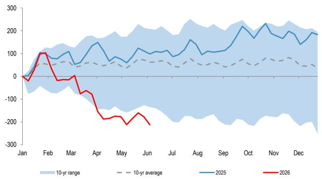

line

| Month | 10-yr range | 10-yr average | 2025 | 2026 |
|-------|-------------|---------------|------|------|
| Jan   | ~0          | ~0            | ~0   | ~0   |
| Feb   | ~50         | ~50           | ~100 | ~100 |
| Mar   | ~75         | ~75           | ~100 | ~0   |
| Apr   | ~100        | ~100          | ~150 | ~-100|
| May   | ~125        | ~125          | ~75  | ~-200|
| Jun   | ~150        | ~150          | ~100 | ~-250|
| Jul   | ~175        | ~175          | ~125 | ~-250|
| Aug   | ~200        | ~200          | ~150 | ~-250|
| Sep   | ~225        | ~225          | ~175 | ~-250|
| Oct   | ~250        | ~250          | ~200 | ~-250|
| Nov   | ~275        | ~275          | ~175 | ~-250|
| Dec   | ~300        | ~300          | ~175 | ~-250|

Source: Exchange data, Bloomberg Finance L.P., JPM Commodities Research

Figure 2: The estimated value of global commodity market open interest decreased by 4% WoW   
USD billion, estimated open interest across tracked commodity markets   
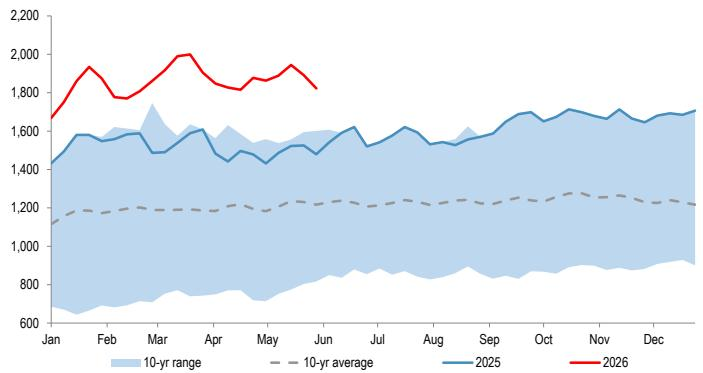

line

| Month | 10-yr range | 10-yr average | 2025 | 2026 |
|-------|-------------|---------------|------|------|
| Jan   | ~650        | ~1150         | ~1450 | ~1700 |
| Feb   | ~700        | ~1150         | ~1550 | ~1950 |
| Mar   | ~750        | ~1150         | ~1600 | ~2000 |
| Apr   | ~750        | ~1150         | ~1650 | ~1850 |
| May   | ~750        | ~1150         | ~1500 | ~1850 |
| Jun   | ~800        | ~1150         | ~1600 | ~1950 |
| Jul   | ~850        | ~1150         | ~1650 | ~1850 |
| Aug   | ~850        | ~1150         | ~1600 | ~1850 |
| Sep   | ~850        | ~1150         | ~1650 | ~1850 |
| Oct   | ~850        | ~1150         | ~1700 | ~1850 |
| Nov   | ~850        | ~1150         | ~1750 | ~1850 |
| Dec   | ~850        | ~1150         | ~1750 | ~1850 |

Source: Exchange data, Bloomberg Finance L.P., JPM Commodities Research

Figure 3: Net length across commodity markets decreased by \$20 billion, largely driven by crude oil and agri market   
real USD million, Net investor positioning aggregated across tracked commodity markets   
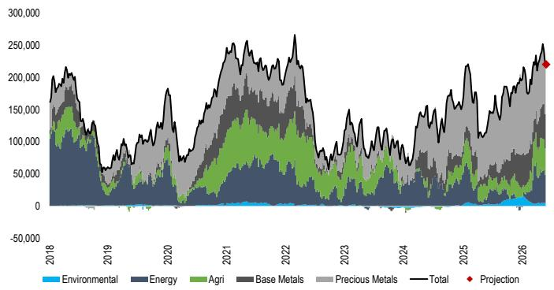

bar_stacked

| Year | Environmental | Energy | Agri | Base Metals | Precious Metals | Total | Projection |
|------|---------------|--------|------|-------------|-----------------|-------|----------|
| 2018 | 0             | 100000 | 50000 | 50000       | 50000           | 150000 | 0        |
| 2019 | 0             | 50000  | 25000 | 25000       | 25000           | 100000 | 0        |
| 2020 | 0             | 25000  | 12500 | 12500       | 12500           | 75000  | 0        |
| 2021 | 0             | 12500  | 6250  | 6250        | 6250            | 157500 | 0        |
| 2022 | 0             | 6250   | 3125  | 3125        | 3125            | 143750 | 0        |
| 2023 | 0             | 3125   | 1562.5| 1562.5      | 1562.5          | 118875 | 0        |
| 2024 | 0             | 1562.5 | 781.25| 781.25      | 781.25          | 94437.5| 0        |
| 2025 | 0             | 781.25 | 390.67| 390.67      | 390.67          | 77718.75| 0        |
| 2026 | 0             | 390.67 | 195.37| 195.37      | 195.37          | 68894.37| 231.25   |

Projections by JPM QDS Research; US exchanges data is an aggregate of Managed Money and Other Reportables, European exchanges data is an aggregate of Investment Funds and Other Financial Firms.

All data as of May 26, 2026, except LME data as of May 29, 2026, and TTF/EUA/UKE date as of May 22, 2026.

Source: Exchange data, Bloomberg Finance L.P., JPM QDS and Commodities Research

Figure 5: The CTA net long positioning in COMEX Gold stabilised over the week   
USD/oz (average weekly gold price); bubble size represents magnitude of weekly increase (green) or decrease (red) in CTA F&O net length   
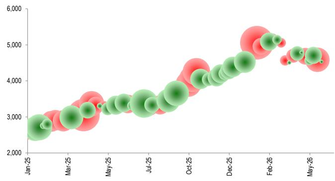

bubble

| Month   | Value |
|---------|-------|
| Jan-25  | 2800  |
| Feb-25  | 3000  |
| Mar-25  | 3100  |
| Apr-25  | 3200  |
| May-25  | 3300  |
| Jun-25  | 3400  |
| Jul-25  | 3500  |
| Aug-25  | 3600  |
| Sep-25  | 3700  |
| Oct-25  | 3800  |
| Nov-25  | 3900  |
| Dec-25  | 4000  |
| Jan-26  | 4100  |
| Feb-26  | 4200  |
| Mar-26  | 4300  |
| Apr-26  | 4400  |
| May-26  | 4500  |

As of May 26, 2026.   
Source: Exchange data, Bloomberg Finance L.P., JPM Commodities Research

Figure 4: Latest projections indicate decreasing positioning in energy and agri markets   
0-10 standardized scale: 0 = lowest since 2018, 10 = highest since 2018 positioning data in real USD terms   
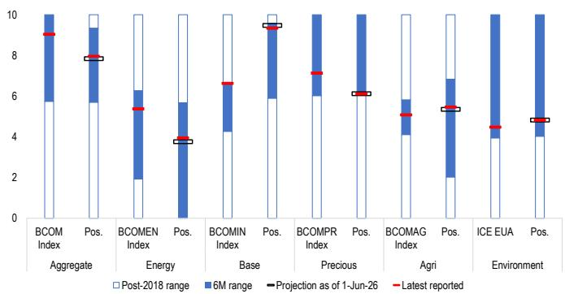

bar_stacked

| Category | Index | Post-2018 range | 6M range | Projection as of 1-Jun-26 | Latest reported |
| :--- | :--- | :--- | :--- | :--- | :--- |
| Aggregate | BCOM Index | 5.7 | 4.9 | 0.0 | 9.1 |
| Aggregate | Pos. Index | 5.7 | 4.9 | 0.0 | 8.0 |
| Energy Base | BCOMEN Index | 1.8 | 5.3 | 0.0 | 5.4 |
| Energy Base | Pos. Index | 5.7 | 4.9 | 0.0 | 3.8 |
| Precious | BCOMPR Index | 6.0 | 4.3 | 0.0 | 7.1 |
| Precious | Pos. Index | 6.0 | 4.3 | 0.0 | 6.1 |
| Agri Environment | BCOMAG Index | 4.1 | 3.3 | 0.0 | 5.1 |
| Agri Environment | Pos. Index | 2.0 | 5.9 | 0.0 | 5.4 |
| Environment | ICE EUA | 3.9 | 7.9 | 0.0 | 4.5 |
| Environment | Pos. Index | 4.0 | 7.9 | 0.0 | 4.8 |

Projections by JPM QDS Research; US exchanges data is an aggregate of Managed Money and Other Reportables, European exchanges data is an aggregate of Investment Funds and Other Financial Firms.

All data as of May 26, 2026, except LME data as of May 29, 2026, and TTF/EUA/UKE date as of May 22, 2026.

Source: Exchange data, Bloomberg Finance L.P., JPM QDS and Commodities Research

Figure 6: The estimated value of open interest across energy markets decreased by 6% WoW   
USD billion, estimated open interest across tracked energy markets   
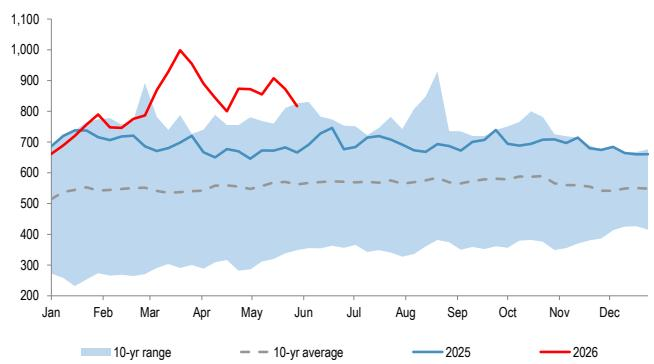

line

| Month | 10-yr range | 10-yr average | 2025 | 2026 |
|-------|-------------|---------------|------|------|
| Jan   | ~250        | ~550          | ~700 | ~650 |
| Feb   | ~280        | ~540          | ~720 | ~780 |
| Mar   | ~850        | ~530          | ~700 | ~950 |
| Apr   | ~750        | ~540          | ~680 | ~1,050 |
| May   | ~780        | ~550          | ~670 | ~850 |
| Jun   | ~800        | ~560          | ~720 | ~880 |
| Jul   | ~750        | ~550          | ~700 | ~750 |
| Aug   | ~850        | ~560          | ~720 | ~780 |
| Sep   | ~950        | ~570          | ~730 | ~750 |
| Oct   | ~800        | ~560          | ~720 | ~730 |
| Nov   | ~780        | ~550          | ~710 | ~720 |
| Dec   | ~750        | ~540          | ~700 | ~710 |

Source: Exchange data, Bloomberg Finance L.P., JPM Commodities Research

Figure 7: The estimated value of open interest across environmental markets increased by 7% WoW   
USD billion, estimated open interest across tracked environmental markets   
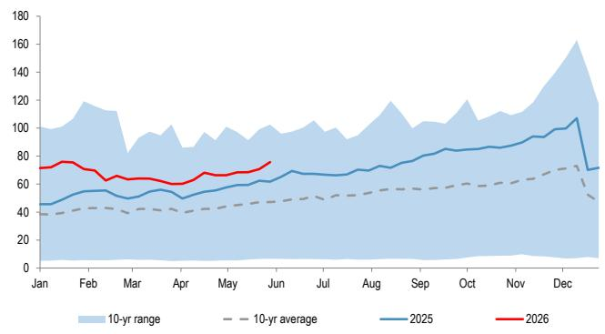

line

| Month | 10-yr range | 10-yr average | 2025 | 2026 |
|-------|-------------|---------------|------|------|
| Jan   | ~100        | ~40           | ~45  | ~70  |
| Feb   | ~120        | ~45           | ~55  | ~75  |
| Mar   | ~90         | ~40           | ~55  | ~65  |
| Apr   | ~100        | ~45           | ~50  | ~65  |
| May   | ~100        | ~50           | ~55  | ~70  |
| Jun   | ~100        | ~55           | ~65  | ~75  |
| Jul   | ~100        | ~55           | ~65  | ~75  |
| Aug   | ~110        | ~55           | ~70  | ~75  |
| Sep   | ~110        | ~55           | ~75  | ~75  |
| Oct   | ~120        | ~55           | ~80  | ~75  |
| Nov   | ~110        | ~60           | ~85  | ~75  |
| Dec   | ~160        | ~70           | ~105 | ~75  |

Source: Exchange data, Bloomberg Finance L.P., JPM Commodities Research

Figure 9: The estimated value of open interest across base metals markets increased by 1% WoW   
USD billion, estimated open interest across tracked base metals markets   
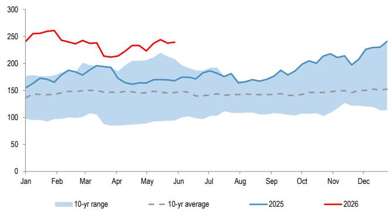

line

| Month | 10-yr range | 10-yr average | 2025 | 2026 |
|-------|-------------|---------------|------|------|
| Jan   | ~100        | ~140          | ~160 | ~250 |
| Feb   | ~100        | ~140          | ~170 | ~260 |
| Mar   | ~100        | ~140          | ~180 | ~240 |
| Apr   | ~90         | ~140          | ~170 | ~210 |
| May   | ~100        | ~140          | ~165 | ~230 |
| Jun   | ~100        | ~140          | ~170 | ~240 |
| Jul   | ~100        | ~140          | ~180 | ~235 |
| Aug   | ~100        | ~140          | ~175 | ~235 |
| Sep   | ~100        | ~140          | ~185 | ~235 |
| Oct   | ~100        | ~140          | ~200 | ~235 |
| Nov   | ~100        | ~140          | ~215 | ~235 |
| Dec   | ~100        | ~140          | ~245 | ~235 |

Source: Exchange data, Bloomberg Finance L.P., JPM Commodities Research

Figure 11: The estimated value of open interest in crude oil decreased by 7% WoW, remaining near multi-year highs   
USD billion, estimated open interest across tracked crude oil markets   
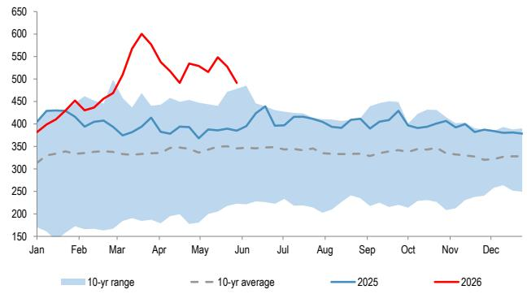

line

| Month | 10-yr range | 10-yr average | 2025 | 2026 |
|-------|-------------|---------------|------|------|
| Jan   | ~380        | ~330          | ~420 | ~380 |
| Feb   | ~400        | ~330          | ~410 | ~450 |
| Mar   | ~450        | ~330          | ~400 | ~550 |
| Apr   | ~480        | ~330          | ~410 | ~600 |
| May   | ~470        | ~330          | ~390 | ~520 |
| Jun   | ~480        | ~330          | ~420 | ~550 |
| Jul   | ~470        | ~330          | ~410 | ~520 |
| Aug   | ~460        | ~330          | ~400 | ~510 |
| Sep   | ~470        | ~330          | ~410 | ~520 |
| Oct   | ~460        | ~330          | ~420 | ~510 |
| Nov   | ~450        | ~330          | ~410 | ~500 |
| Dec   | ~440        | ~330          | ~400 | ~490 |

Source: Exchange data, Bloomberg Finance L.P., JPM Commodities Research

Figure 8: The estimated value of open interest across precious metals decreased by 8% WoW   
USD billion, estimated open interest across tracked precious metals markets   
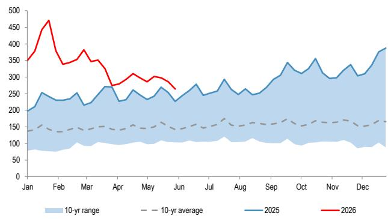

line

| Month | 2026 | 2025 | 10-yr average | 10-yr range |
|-------|------|------|---------------|-------------|
| Jan   | 350  | 200  | 140           | 80–100      |
| Feb   | 470  | 240  | 145           | 85–110      |
| Mar   | 380  | 230  | 145           | 90–110      |
| Apr   | 280  | 260  | 145           | 95–110      |
| May   | 300  | 250  | 145           | 95–110      |
| Jun   | 270  | 240  | 145           | 95–110      |
| Jul   | -    | 270  | 145           | 95–110      |
| Aug   | -    | 260  | 145           | 95–110      |
| Sep   | -    | 280  | 145           | 95–110      |
| Oct   | -    | 340  | 145           | 95–110      |
| Nov   | -    | 300  | 145           | 95–110      |
| Dec   | -    | 380  | 145           | 95–110      |

Source: Exchange data, Bloomberg Finance L.P., JPM Commodities Research

Figure 10: The estimated value of open interest in agri markets stabilised over the week   
USD billion, estimated open interest across tracked agricultural markets   
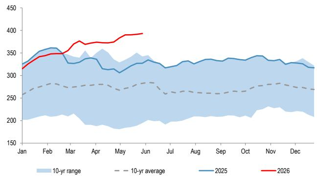

line

| Month | 10-yr range | 10-yr average | 2025 | 2026 |
|-------|-------------|---------------|------|------|
| Jan   | ~320        | ~260          | ~320 | ~310 |
| Feb   | ~340        | ~270          | ~350 | ~340 |
| Mar   | ~350        | ~275          | ~360 | ~350 |
| Apr   | ~360        | ~270          | ~340 | ~370 |
| May   | ~370        | ~265          | ~320 | ~380 |
| Jun   | ~380        | ~270          | ~330 | ~390 |
| Jul   | ~370        | ~260          | ~320 | -    |
| Aug   | ~360        | ~265          | ~330 | -    |
| Sep   | ~350        | ~270          | ~340 | -    |
| Oct   | ~340        | ~275          | ~350 | -    |
| Nov   | ~330        | ~280          | ~340 | -    |
| Dec   | ~320        | ~275          | ~330 | -    |

Source: Exchange data, Bloomberg Finance L.P., JPM Commodities Research

Figure 12: Petroleum products estimated open interest value decreased by 8% WoW   
USD billion, estimated open interest across tracked petroleum products markets   
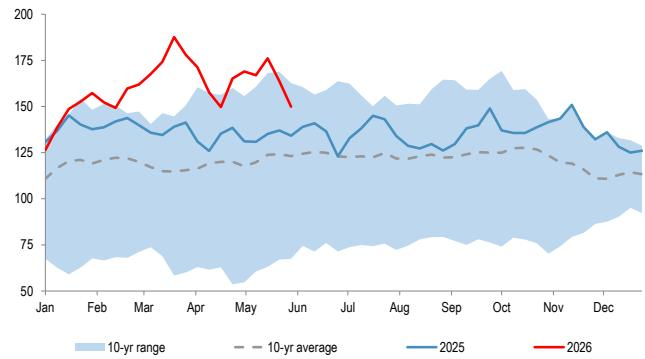

line

| Month | 10-yr range | 10-yr average | 2025 | 2026 |
|-------|-------------|---------------|------|------|
| Jan   | ~60         | ~115          | ~140 | ~130 |
| Feb   | ~70         | ~120          | ~145 | ~155 |
| Mar   | ~65         | ~125          | ~140 | ~165 |
| Apr   | ~60         | ~120          | ~135 | ~185 |
| May   | ~55         | ~125          | ~130 | ~170 |
| Jun   | ~70         | ~125          | ~135 | ~150 |
| Jul   | ~75         | ~125          | ~140 | ~160 |
| Aug   | ~80         | ~125          | ~135 | ~155 |
| Sep   | ~85         | ~125          | ~130 | ~160 |
| Oct   | ~90         | ~125          | ~145 | ~165 |
| Nov   | ~85         | ~125          | ~140 | ~150 |
| Dec   | ~90         | ~120          | ~135 | ~130 |

Source: Exchange data, Bloomberg Finance L.P., JPM Commodities Research

Figure 13: The estimated value of open interest in natural gas markets decreased by 3% WoW   
USD billion, estimated open interest across tracked natural gas metals markets   
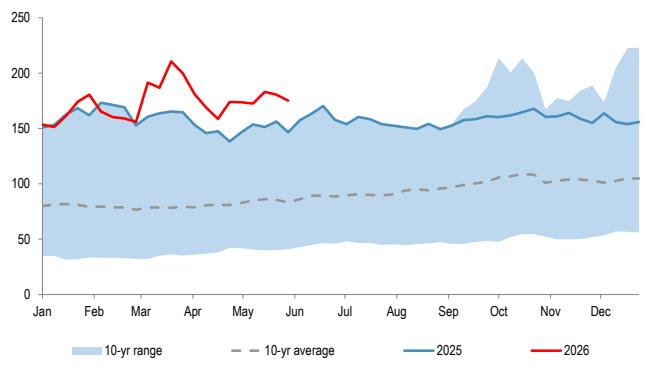

line

| Month | 10-yr range | 10-yr average | 2025 | 2026 |
|-------|-------------|---------------|------|------|
| Jan   | ~30         | ~80           | ~150 | ~150 |
| Feb   | ~35         | ~80           | ~170 | ~180 |
| Mar   | ~40         | ~80           | ~160 | ~190 |
| Apr   | ~45         | ~80           | ~165 | ~210 |
| May   | ~50         | ~85           | ~155 | ~170 |
| Jun   | ~55         | ~90           | ~160 | ~180 |
| Jul   | ~60         | ~95           | ~165 | ~175 |
| Aug   | ~65         | ~100          | ~160 | ~170 |
| Sep   | ~70         | ~105          | ~155 | ~165 |
| Oct   | ~75         | ~110          | ~160 | ~170 |
| Nov   | ~80         | ~115          | ~165 | ~175 |
| Dec   | ~85         | ~120          | ~160 | ~170 |

10 year range and average exclude 2022   
Source: Exchange data, Bloomberg Finance L.P., JPM Commodities Research

Figure 15: The estimated value of open interest in soft markets increased by 1% WoW   
USD billion, estimated open interest across tracked softs agricultural markets   
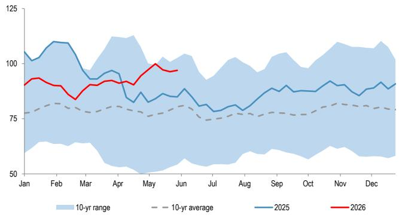

line

| Month | 10-yr range | 10-yr average | 2025 | 2026 |
|-------|-------------|---------------|------|------|
| Jan   | ~60         | ~75           | ~105 | ~90  |
| Feb   | ~65         | ~78           | ~110 | ~92  |
| Mar   | ~55         | ~76           | ~95  | ~85  |
| Apr   | ~50         | ~78           | ~98  | ~90  |
| May   | ~45         | ~75           | ~85  | ~98  |
| Jun   | ~50         | ~78           | ~88  | ~95  |
| Jul   | ~55         | ~76           | ~80  | —    |
| Aug   | ~60         | ~78           | ~85  | —    |
| Sep   | ~65         | ~76           | ~90  | —    |
| Oct   | ~60         | ~78           | ~88  | —    |
| Nov   | ~65         | ~80           | ~92  | —    |
| Dec   | ~60         | ~78           | ~90  | —    |

Source: Exchange data, Bloomberg Finance L.P., JPM Commodities Research

Figure 14: The estimated value of open interest in grains & oilseeds markets increased by 1% WoW   
USD billion, estimated open interest across tracked grains and oilseeds markets   
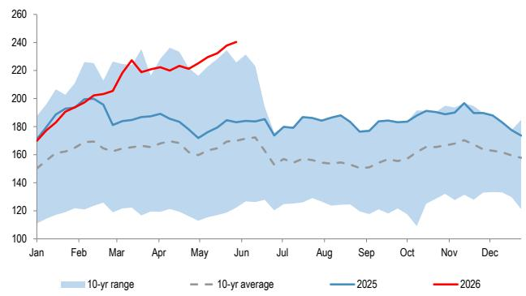

line

| Month | 10-yr range | 10-yr average | 2025 | 2026 |
|-------|-------------|---------------|------|------|
| Jan   | ~170        | ~150          | ~170 | ~170 |
| Feb   | ~190        | ~160          | ~190 | ~200 |
| Mar   | ~210        | ~165          | ~185 | ~230 |
| Apr   | ~230        | ~170          | ~190 | ~220 |
| May   | ~220        | ~165          | ~185 | ~230 |
| Jun   | ~240        | ~175          | ~185 | ~240 |
| Jul   | ~180        | ~155          | ~180 | ~180 |
| Aug   | ~185        | ~155          | ~185 | ~185 |
| Sep   | ~185        | ~155          | ~185 | ~185 |
| Oct   | ~185        | ~160          | ~190 | ~190 |
| Nov   | ~190        | ~165          | ~195 | ~195 |
| Dec   | ~185        | ~160          | ~185 | ~185 |

Source: Exchange data, Bloomberg Finance L.P., JPM Commodities Research

Figure 16: The estimated open interest value across livestock markets decreased by 2% WoW   
USD billion, estimated open interest across tracked livestock markets   
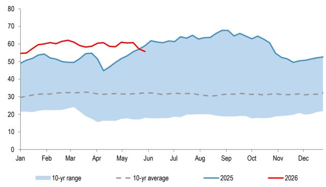

line

| Month | 10-yr range | 10-yr average | 2025 | 2026 |
|-------|-------------|---------------|------|------|
| Jan   | ~50         | ~30           | ~50  | ~55  |
| Feb   | ~55         | ~30           | ~55  | ~60  |
| Mar   | ~55         | ~30           | ~55  | ~60  |
| Apr   | ~45         | ~30           | ~50  | ~60  |
| May   | ~50         | ~30           | ~55  | ~60  |
| Jun   | ~60         | ~30           | ~60  | ~55  |
| Jul   | ~60         | ~30           | ~65  | ~60  |
| Aug   | ~60         | ~30           | ~65  | ~60  |
| Sep   | ~70         | ~30           | ~70  | ~65  |
| Oct   | ~65         | ~30           | ~65  | ~65  |
| Nov   | ~55         | ~30           | ~60  | ~60  |
| Dec   | ~50         | ~30           | ~55  | ~55  |

Source: Exchange data, Bloomberg Finance L.P., JPM Commodities Research

# Price momentum and trading signals

Figure 17: Price momentum (z-scores) and trading signals across major commodities
\*see methodology in Figure 18   
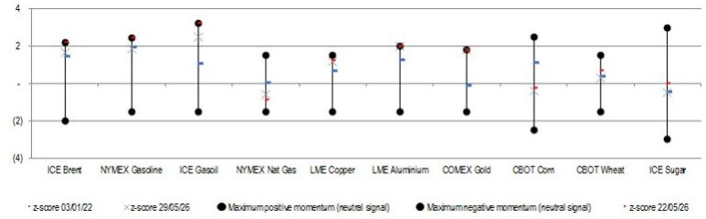

scatter

| Category | Maximum positive momentum (neutral signal) | Maximum negative momentum (neutral signal) |
|---|---|---|
| ICE Brent | 2.0 | -2.0 |
| NYMEX Gasoline | 2.3 | -2.1 |
| ICE Gasoil | 3.0 | -2.1 |
| NYMEX Nat Gas | 1.6 | -1.7 |
| LME Copper | 1.6 | -2.1 |
| LME Aluminium | 2.0 | -2.1 |
| COMEX Gold | 1.9 | -2.1 |
| CBOT Corn | 2.3 | -2.5 |
| CBOT Wheat | 1.6 | -2.1 |
| ICE Sugar | 3.0 | -3.5 |

Source: Bloomberg Finance L.P., JPM Commodities Research, as of May 29, 2026

When the z-score (indicator of momentum) reaches 0, known as the switch point, it often triggers a change in signal from buy-to-sell, or sell-to-buy received by stochastic price/trend following trading models. This can drive heightened price volatility in the underlying commodity price when there is a large presence of CTA/trend-following trading models. When momentum reaches extreme levels, either maximum positive or maximum negative, a neutral signal is often sent, to stop or slow buying or selling. This often drives profit taking or an exit of positions.

Framework developed by JPM Global Markets Strategy (Flows & Liquidity, Panigirtzoglou, Inkinen et al, 27 May 2026)

# Figure 18: Price momentum across commodity markets and trading signals

Optimal lookback period of each momentum strategy combined with a mean reversion indicator that turns signal neutral when momentum z-score exceeds the extreme momentum threshold, and a filter that turns neutral when the z-score is low (below 0.05 and above -0.05) to avoid excessive trading. Lookbacks, current signals and z-scores are shown for shorter-term and longer-term momentum separately, along with performance of a combined signal. Annualized return, volatility and information ratio of the signal; current signal; and z-score of the current return over the relevant lookback period; data from 1999 onward.

<table><tr><td>Market</td><td>Lookback duration</td><td>Lookback sessions</td><td>z-score 29/05/26</td><td>Extreme threshold</td><td>Current signal</td><td>z-score 22/05/26</td><td>Sessions since last signal switch</td><td>Information ratio</td><td>% change of return index from its MA</td></tr><tr><td rowspan="2">ICE Brent</td><td>Long</td><td>504</td><td>1.65</td><td rowspan="2">+/-2</td><td>1</td><td>2.18</td><td>3</td><td>0.52</td><td>48.4%</td></tr><tr><td>Short</td><td>84</td><td>0.52</td><td>1</td><td>1.62</td><td>7</td><td>0.44</td><td>6.3%</td></tr><tr><td rowspan="2">NYMEX WTI</td><td>Long</td><td>462</td><td>1.62</td><td rowspan="2">+/-2</td><td>1</td><td>2.19</td><td>2</td><td>0.48</td><td>47%</td></tr><tr><td>Short</td><td>21</td><td>-1.49</td><td>-1</td><td>-0.09</td><td>6</td><td>0.48</td><td>-9.2%</td></tr><tr><td rowspan="2">NYMEX Gasoline</td><td>Long</td><td>483</td><td>1.84</td><td rowspan="2">+/-1.5</td><td>0</td><td>2.45</td><td>56</td><td>0.21</td><td>49.7%</td></tr><tr><td>Short</td><td>105</td><td>1.17</td><td>1</td><td>2.27</td><td>2</td><td>0.21</td><td>16.3%</td></tr><tr><td rowspan="2">ICE Gasoil</td><td>Long</td><td>378</td><td>2.48</td><td rowspan="2">+/-1.5</td><td>0</td><td>3.22</td><td>63</td><td>0.56</td><td>72%</td></tr><tr><td>Short</td><td>63</td><td>-0.37</td><td>-1</td><td>0.92</td><td>1</td><td>0.56</td><td>-4.1%</td></tr><tr><td rowspan="2">NYMEX Nat Gas</td><td>Long</td><td>315</td><td>-0.57</td><td rowspan="2">+/-1.5</td><td>-1</td><td>-0.87</td><td>84</td><td>0.57</td><td>-15.1%</td></tr><tr><td>Short</td><td>105</td><td>-0.06</td><td>-1</td><td>-0.58</td><td>55</td><td>0.57</td><td>-1.0%</td></tr><tr><td rowspan="2">TTF Nat gas</td><td>Long</td><td>294</td><td>0.67</td><td rowspan="2">+/-1.5</td><td>1</td><td>0.86</td><td>49</td><td>1.38</td><td>31.8%</td></tr><tr><td>Short</td><td>21</td><td>-0.30</td><td>-1</td><td>0.43</td><td>2</td><td>1.38</td><td>-2.9%</td></tr><tr><td rowspan="2">ICE EUA</td><td>Long</td><td>483</td><td>0.17</td><td rowspan="2">+/-1.5</td><td>1</td><td>0.05</td><td>5</td><td>0.42</td><td>6.9%</td></tr><tr><td>Short</td><td>42</td><td>0.78</td><td>1</td><td>0.38</td><td>36</td><td>0.42</td><td>7.5%</td></tr><tr><td rowspan="2">COMEX Gold</td><td>Long</td><td>483</td><td>1.81</td><td rowspan="2">+/-1.5</td><td>0</td><td>1.78</td><td>324</td><td>0.43</td><td>24%</td></tr><tr><td>Short</td><td>21</td><td>-0.28</td><td>-1</td><td>-0.85</td><td>11</td><td>0.43</td><td>-0.8%</td></tr><tr><td rowspan="2">COMEX Silver</td><td>Long</td><td>462</td><td>2.15</td><td rowspan="2">+/-1.5</td><td>0</td><td>2.24</td><td>176</td><td>0.32</td><td>53.4%</td></tr><tr><td>Short</td><td>10</td><td>-0.13</td><td>-1</td><td>-1.48</td><td>6</td><td>0.32</td><td>-0.5%</td></tr><tr><td rowspan="2">NYMEX Palladium</td><td>Long</td><td>273</td><td>-0.29</td><td rowspan="2">+/-1.5</td><td>-1</td><td>-0.28</td><td>9</td><td>0.83</td><td>-6%</td></tr><tr><td>Short</td><td>42</td><td>-1.15</td><td>-1</td><td>-1.20</td><td>11</td><td>0.83</td><td>-8.8%</td></tr><tr><td rowspan="2">NYMEX Platinum</td><td>Long</td><td>273</td><td>0.60</td><td rowspan="2">+/-1.5</td><td>1</td><td>0.70</td><td>11</td><td>0.53</td><td>9.2%</td></tr><tr><td>Short</td><td>105</td><td>-1.05</td><td>-1</td><td>-1.06</td><td>11</td><td>0.53</td><td>-10.1%</td></tr><tr><td rowspan="2">LME Copper</td><td>Long</td><td>399</td><td>1.16</td><td rowspan="2">+/-1.5</td><td>1</td><td>1.20</td><td>82</td><td>0.52</td><td>26%</td></tr><tr><td>Short</td><td>147</td><td>0.62</td><td>1</td><td>0.70</td><td>82</td><td>0.52</td><td>8.1%</td></tr><tr><td rowspan="2">LME Aluminium</td><td>Long</td><td>357</td><td>2.00</td><td rowspan="2">+/-1.5</td><td>0</td><td>1.99</td><td>44</td><td>0.36</td><td>30.0%</td></tr><tr><td>Short</td><td>105</td><td>1.35</td><td>1</td><td>1.41</td><td>10</td><td>0.36</td><td>10.9%</td></tr><tr><td rowspan="2">LME Lead</td><td>Long</td><td>357</td><td>-0.14</td><td rowspan="2">+/-1.5</td><td>-1</td><td>-0.15</td><td>95</td><td>0.35</td><td>-3%</td></tr><tr><td>Short</td><td>126</td><td>0.07</td><td>1</td><td>0.06</td><td>1</td><td>0.35</td><td>0.8%</td></tr><tr><td rowspan="2">LME Nickel</td><td>Long</td><td>336</td><td>0.54</td><td rowspan="2">+/-1.5</td><td>1</td><td>0.52</td><td>108</td><td>0.58</td><td>14.5%</td></tr><tr><td>Short</td><td>42</td><td>0.30</td><td>1</td><td>0.34</td><td>34</td><td>0.58</td><td>2.6%</td></tr><tr><td rowspan="2">LME Zinc</td><td>Long</td><td>399</td><td>0.76</td><td rowspan="2">+/-1.5</td><td>1</td><td>0.79</td><td>159</td><td>0.50</td><td>18%</td></tr><tr><td>Short</td><td>126</td><td>0.59</td><td>1</td><td>0.66</td><td>44</td><td>0.50</td><td>6.9%</td></tr><tr><td rowspan="2">CBOT Corn</td><td>Long</td><td>399</td><td>-0.40</td><td rowspan="2">+/-2.5</td><td>-1</td><td>-0.23</td><td>18</td><td>0.40</td><td>-7.8%</td></tr><tr><td>Short</td><td>63</td><td>-0.53</td><td>-1</td><td>-0.09</td><td>6</td><td>0.31</td><td>-4.3%</td></tr><tr><td rowspan="2">CBOT Wheat</td><td>Long</td><td>294</td><td>0.30</td><td rowspan="2">+/-1.5</td><td>1</td><td>0.68</td><td>34</td><td>0.15</td><td>4.8%</td></tr><tr><td>Short</td><td>168</td><td>0.48</td><td>1</td><td>1.02</td><td>11</td><td>0.16</td><td>5.9%</td></tr><tr><td rowspan="2">Kansas Wheat</td><td>Long</td><td>483</td><td>0.15</td><td rowspan="2">+/-3</td><td>1</td><td>0.38</td><td>31</td><td>0.25</td><td>3.2%</td></tr><tr><td>Short</td><td>147</td><td>0.68</td><td>1</td><td>1.18</td><td>77</td><td>0.38</td><td>8.3%</td></tr><tr><td rowspan="2">CBOT Soybeans</td><td>Long</td><td>231</td><td>0.37</td><td rowspan="2">+/-2.5</td><td>1</td><td>0.45</td><td>82</td><td>0.35</td><td>5%</td></tr><tr><td>Short</td><td>42</td><td>-0.08</td><td>-1</td><td>0.08</td><td>0</td><td>0.30</td><td>-0.4%</td></tr><tr><td rowspan="2">ICE Cotton</td><td>Long</td><td>483</td><td>0.03</td><td rowspan="2">+/-1.5</td><td>0</td><td>0.09</td><td>0</td><td>0.15</td><td>0.7%</td></tr><tr><td>Short</td><td>168</td><td>0.51</td><td>1</td><td>0.65</td><td>11</td><td>0.16</td><td>7.0%</td></tr><tr><td rowspan="2">ICE Sugar</td><td>Long</td><td>252</td><td>-0.47</td><td rowspan="2">+/-3</td><td>-1</td><td>-0.25</td><td>11</td><td>0.40</td><td>-8.3%</td></tr><tr><td>Short</td><td>63</td><td>-0.48</td><td>-1</td><td>0.01</td><td>3</td><td>0.47</td><td>-4.3%</td></tr><tr><td rowspan="2">ICE Coffee</td><td>Long</td><td>273</td><td>-0.84</td><td rowspan="2">+/-1.5</td><td>-1</td><td>-0.75</td><td>85</td><td>0.16</td><td>-15.8%</td></tr><tr><td>Short</td><td>63</td><td>-0.86</td><td>-1</td><td>-0.60</td><td>17</td><td>0.42</td><td>-7.3%</td></tr><tr><td>ICE NY Cocos*</td><td>n/a</td><td>10</td><td>-0.08</td><td>+/-3</td><td>-1</td><td>-2.08</td><td>0</td><td>0.15</td><td>-0.3%</td></tr></table>

Source: Bloomberg Finance L.P., JPM Commodities Research, as of May 29, 2026.

# Energy markets

Table 3: Estimated open interest and flows   
USD million 

<table><tr><td rowspan="2">Sector</td><td>Number of futures markets</td><td>Total estimated Open Interest</td><td colspan="4">Change in Open Interest</td><td colspan="4">Cumulative flows</td></tr><tr><td>Count</td><td>29-May-26</td><td>1 Week</td><td>1 Month</td><td>3 Months</td><td>2026 YTD</td><td>1 Week</td><td>1 Month</td><td>3 Months</td><td>2026 YTD</td></tr><tr><td>Energy</td><td>18</td><td>816,478</td><td>-55,631</td><td>-55,444</td><td>-51,880</td><td>155,842</td><td>-16,773</td><td>-9,291</td><td>-93,871</td><td>-113,275</td></tr><tr><td>Crude Oil</td><td>7</td><td>491,350</td><td>-36,356</td><td>-37,871</td><td>-17,969</td><td>112,725</td><td>-10,613</td><td>-7,784</td><td>-54,709</td><td>-53,601</td></tr><tr><td>WTI Crude Oil</td><td>2</td><td>220,531</td><td>-8,474</td><td>-15,224</td><td>-1,710</td><td>70,616</td><td>1,553</td><td>-2,757</td><td>-16,516</td><td>3,172</td></tr><tr><td>NYM WTI Crude Oil</td><td>1</td><td>156,773</td><td>-4,876</td><td>-8,548</td><td>-1,105</td><td>50,843</td><td>2,297</td><td>450</td><td>-11,821</td><td>2,171</td></tr><tr><td>ICE WTI Crude Oil</td><td>1</td><td>63,758</td><td>-3,598</td><td>-6,676</td><td>-604</td><td>19,773</td><td>-744</td><td>-3,207</td><td>-4,695</td><td>1,000</td></tr><tr><td>ICE Brent Crude Oil</td><td>1</td><td>229,583</td><td>-28,574</td><td>-27,728</td><td>-11,394</td><td>38,220</td><td>-15,415</td><td>-13,151</td><td>-30,677</td><td>-42,433</td></tr><tr><td>Other</td><td>4</td><td>41,235</td><td>692</td><td>5,081</td><td>-4,865</td><td>3,890</td><td>3,249</td><td>8,124</td><td>-7,516</td><td>-14,340</td></tr><tr><td>DME Oman Crude Oil</td><td>1</td><td>2,094</td><td>348</td><td>1,992</td><td>1,385</td><td>1,040</td><td>443</td><td>2,101</td><td>1,762</td><td>1,023</td></tr><tr><td>ICE Dubai Crude Oil</td><td>1</td><td>31,319</td><td>555</td><td>4,420</td><td>-4,277</td><td>547</td><td>2,275</td><td>6,260</td><td>-7,051</td><td>-14,406</td></tr><tr><td>TCM Crude Oil (Tokyo)</td><td>1</td><td>456</td><td>-83</td><td>-116</td><td>-149</td><td>-51</td><td>-53</td><td>-71</td><td>-254</td><td>-261</td></tr><tr><td>INE Crude Oil (Shanghai)</td><td>1</td><td>7,367</td><td>-129</td><td>-1,216</td><td>-1,824</td><td>2,354</td><td>583</td><td>-166</td><td>-1,974</td><td>-696</td></tr><tr><td>Petroleum Products</td><td>7</td><td>149,921</td><td>-13,927</td><td>-19,070</td><td>-17,738</td><td>23,887</td><td>-3,058</td><td>-5,124</td><td>-33,313</td><td>-47,799</td></tr><tr><td>Distillates</td><td>3</td><td>112,462</td><td>-9,944</td><td>-13,587</td><td>-10,283</td><td>19,896</td><td>-2,044</td><td>-2,750</td><td>-19,803</td><td>-31,195</td></tr><tr><td>NYM ULSD</td><td>1</td><td>34,100</td><td>-3,368</td><td>-1,746</td><td>-3,524</td><td>3,645</td><td>-1,535</td><td>-382</td><td>-8,233</td><td>-13,853</td></tr><tr><td>ICE Heating Oil</td><td>1</td><td>3,496</td><td>-630</td><td>-1,024</td><td>-1,606</td><td>131</td><td>-329</td><td>-767</td><td>-2,249</td><td>-2,366</td></tr><tr><td>ICE Gas Oil</td><td>1</td><td>74,866</td><td>-5,946</td><td>-10,817</td><td>-5,153</td><td>16,120</td><td>-181</td><td>-1,601</td><td>-9,321</td><td>-14,977</td></tr><tr><td>NYM Gasoline (RBOB)</td><td>1</td><td>35,347</td><td>-3,783</td><td>-5,157</td><td>-6,013</td><td>3,687</td><td>-958</td><td>-2,140</td><td>-11,555</td><td>-15,197</td></tr><tr><td>Fuel Oil</td><td>3</td><td>2,113</td><td>-199</td><td>-326</td><td>-1,442</td><td>305</td><td>-55</td><td>-234</td><td>-1,955</td><td>-1,408</td></tr><tr><td>SFE Fuel Oil</td><td>1</td><td>1,659</td><td>-289</td><td>-394</td><td>-1,653</td><td>-76</td><td>-164</td><td>-314</td><td>-2,177</td><td>-1,707</td></tr><tr><td>NYM Fuel Oil (Rotterdam)</td><td>1</td><td>84</td><td>-3</td><td>-36</td><td>17</td><td>76</td><td>-</td><td>-35</td><td>15</td><td>46</td></tr><tr><td>NYM Fuel Oil (Singapore)</td><td>1</td><td>369</td><td>93</td><td>103</td><td>194</td><td>304</td><td>109</td><td>116</td><td>207</td><td>253</td></tr><tr><td>Natural Gas</td><td>4</td><td>175,208</td><td>-5,348</td><td>1,497</td><td>-16,173</td><td>19,229</td><td>-3,102</td><td>3,618</td><td>-5,848</td><td>-11,874</td></tr><tr><td>NYM Natural Gas</td><td>1</td><td>58,739</td><td>4,373</td><td>3,768</td><td>-783</td><td>1,959</td><td>639</td><td>2,004</td><td>2,146</td><td>11,597</td></tr><tr><td>ICE TTF Natural Gas</td><td>1</td><td>71,216</td><td>-5,717</td><td>-798</td><td>-11,746</td><td>4,271</td><td>-1,773</td><td>1,693</td><td>-6,776</td><td>-20,943</td></tr><tr><td>ICE UK Natural Gas</td><td>1</td><td>15,290</td><td>-3,263</td><td>-1,151</td><td>-2,174</td><td>1,688</td><td>-2,394</td><td>-783</td><td>-921</td><td>-4,331</td></tr><tr><td>ICE JKM LNG</td><td>1</td><td>29,963</td><td>-741</td><td>-323</td><td>-1,470</td><td>11,311</td><td>427</td><td>704</td><td>-298</td><td>1,802</td></tr><tr><td colspan="11"></td></tr><tr><td>Total Regions</td><td>18</td><td>816,478</td><td>-55,631</td><td>-55,444</td><td>-51,880</td><td>155,842</td><td>-16,773</td><td>-9,291</td><td>-93,871</td><td>-113,275</td></tr><tr><td>US</td><td>7</td><td>360,277</td><td>-13,510</td><td>-22,432</td><td>-16,368</td><td>76,634</td><td>371</td><td>-1,589</td><td>-38,562</td><td>-29,958</td></tr><tr><td>UK</td><td>6</td><td>373,409</td><td>-36,252</td><td>-32,481</td><td>-21,525</td><td>71,670</td><td>-16,180</td><td>-10,944</td><td>-45,889</td><td>-60,733</td></tr><tr><td>EU</td><td>1</td><td>71,216</td><td>-5,717</td><td>-798</td><td>-11,746</td><td>4,271</td><td>-1,773</td><td>1,693</td><td>-6,776</td><td>-20,943</td></tr><tr><td>China</td><td>2</td><td>9,026</td><td>-417</td><td>-1,609</td><td>-3,477</td><td>2,278</td><td>419</td><td>-480</td><td>-4,151</td><td>-2,403</td></tr><tr><td>RoW</td><td>2</td><td>2,550</td><td>266</td><td>1,876</td><td>1,235</td><td>989</td><td>390</td><td>2,029</td><td>1,508</td><td>762</td></tr></table>

Source: Exchange data, Bloomberg Finance L.P., JPM Commodities Research

Figure 19: Energy sectoral standardised level chart   
0-10 standardized scale: 0 = lowest since 2018, 10 = highest since 2018 positioning data in real USD terms   
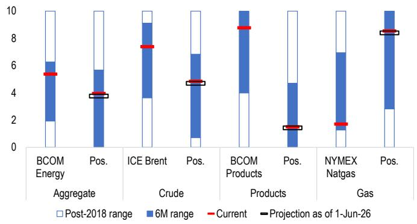

bar_stacked

| Category | Company | Post-2018 range | 6M range | Current | Projection as of 1-Jun-26 |
| :--- | :--- | :--- | :--- | :--- | :--- |
| Aggregate | BCOM Energy | 5.0 | 4.0 | 5.0 | 3.0 |
| Aggregate | Pos. | 5.0 | 4.0 | 5.0 | 3.0 |
| Crude | ICE Brent | 3.0 | 4.0 | 7.0 | 4.0 |
| Crude | Pos. | 1.0 | 4.0 | 7.0 | 4.0 |
| Products | BCOM Products | 4.0 | 5.0 | 9.0 | 1.0 |
| Products | Pos. | 1.0 | 4.0 | 1.0 | 1.0 |
| Gas | NYMEX Natgas | 3.0 | 5.0 | 1.0 | 1.0 |
| Gas | Pos. | 2.0 | 6.0 | 9.0 | 1.0 |

Projections by JPM QDS Research; US exchanges data is an aggregate of Managed Money and Other Reportables, European exchanges data is an aggregate of Investment Funds and Other Financial Firms.

All data as of May 26, 2026, except TTF as of May 22, 2026.

Source: Exchange data, Bloomberg Finance L.P., JPM QDS and Commodities Research

Figure 21: NYMEX WTI Crude Oil position and price   
LHS: n of contracts; RHS: \$/bbl  
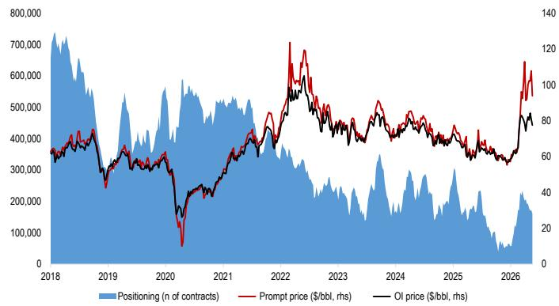

line

| Year | Positioning (n of contracts) | Prompt price ($/bbl, rhs) | Oil price ($/bbl, rhs) |
|------|------------------------------|---------------------------|------------------------|
| 2018 | ~750,000                     | ~400,000                  | ~350,000               |
| 2019 | ~500,000                     | ~350,000                  | ~300,000               |
| 2020 | ~100,000                     | ~100,000                  | ~150,000               |
| 2021 | ~450,000                     | ~450,000                  | ~400,000               |
| 2022 | ~550,000                     | ~750,000                  | ~650,000               |
| 2023 | ~350,000                     | ~550,000                  | ~550,000               |
| 2024 | ~350,000                     | ~550,000                  | ~550,000               |
| 2025 | ~250,000                     | ~450,000                  | ~450,000               |
| 2026 | ~250,000                     | ~650,000                  | ~75,000                |

Source: Exchange data, Bloomberg Finance L.P., JPM QDS Commodities Research

Figure 23: ICE Dubai Crude Oil position and price   
LHS: n of contracts; RHS: \$/bbl  
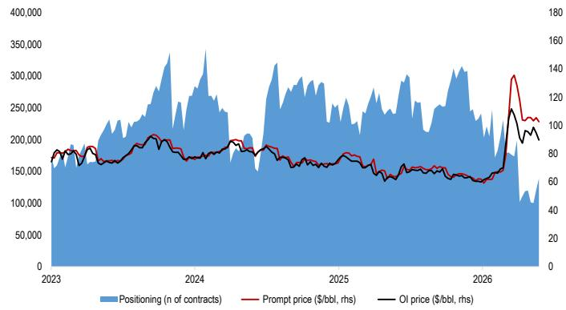

line

| Year | Positioning (n of contracts) | Prompt price ($/bbl, rhs) | Oil price ($/bbl, rhs) |
|------|------------------------------|---------------------------|------------------------|
| 2023 | ~180,000                     | ~170,000                  | ~160,000               |
| 2024 | ~350,000                     | ~200,000                  | ~190,000               |
| 2025 | ~280,000                     | ~180,000                  | ~170,000               |
| 2026 | ~300,000                     | ~140,000                  | ~120,000               |

Source: Exchange data, Bloomberg Finance L.P., JPM Commodities Research

Figure 20: Energy underlying commodities standardised level chart   
0-10 standardized scale: 0 = lowest since 2018, 10 = highest since 2018 positioning data in real USD terms   
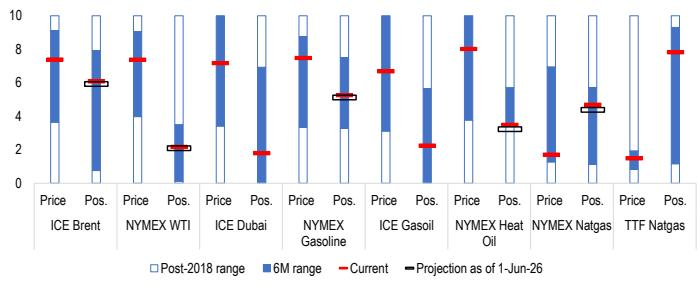

bar

| Category         | Price | Pos. |
| ---------------- | ----- | ---- |
| ICE Brent        | 9     | 1    |
| NYMEX WTI        | 9     | 1    |
| ICE Dubai        | 9     | 1    |
| NYMEX Gasoline   | 9     | 1    |
| ICE Gasoil       | 9     | 1    |
| NYMEX Heat Oil   | 9     | 1    |
| NYMEX Natgas     | 9     | 1    |
| TTF Natgas       | 9     | 1    |

Projections by JPM QDS Research; US exchanges data is an aggregate of Managed Money and Other Reportables, European exchanges data is an aggregate of Investment Funds and Other Financial Firms.

All data as of May 26, 2026, except TTF as of May 22, 2026.

Source: Exchange data, Bloomberg Finance L.P., JPM QDS and Commodities Research

Figure 22: ICE Brent Crude Oil position and price   
LHS: n of contracts; RHS: \$/bbl  
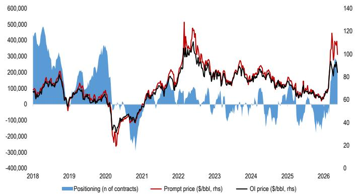

line

| Year | Positioning (n of contracts) | Prompt price ($/bbl, rhs) | Oil price ($/bbl, rhs) |
|------|------------------------------|---------------------------|------------------------|
| 2018 | ~450,000                     | ~100,000                  | ~80,000                |
| 2019 | ~300,000                     | ~150,000                  | ~120,000               |
| 2020 | ~350,000                     | ~-250,000                 | ~-30,000               |
| 2021 | ~-150,000                    | ~-100,000                 | ~-120,000              |
| 2022 | ~150,000                     | ~500,000                  | ~350,000               |
| 2023 | ~100,000                     | ~250,000                  | ~200,000               |
| 2024 | ~150,000                     | ~250,000                  | ~250,000               |
| 2025 | ~150,000                     | ~150,000                  | ~150,000               |
| 2026 | ~450,000                     | ~125,000                  | ~115,000               |

Source: Exchange data, Bloomberg Finance L.P., JPM Commodities Research

Figure 24: ICE TTF Natural Gas position and price   
LHS: TWh; RHS: EUR/MWh  
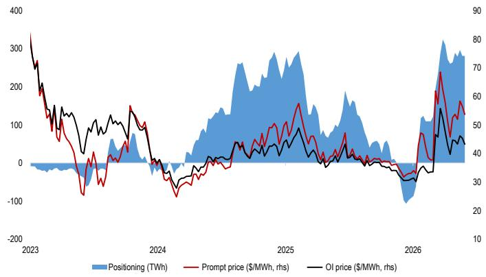

line

| Year | Positioning (TWh) | Prompt price ($/MWh, rhs) | OI price ($/MWh, rhs) |
|------|-------------------|----------------------------|------------------------|
| 2023 | ~350              | ~350                       | ~350                   |
| 2024 | ~10               | ~10                        | ~10                    |
| 2025 | ~300              | ~300                       | ~300                   |
| 2026 | ~-100             | ~-100                      | ~-100                  |

Source: Exchange data, Bloomberg Finance L.P., JPM Commodities Research

Figure 25: Weekly change in total OI due to price/flows   
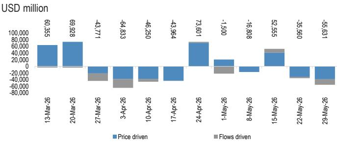

bar

| Period       | Price driven | Flows driven |
| ------------ | ------------ | ------------ |
| 92-ay-1Z     | 60,355       | -            |
| 92-ay-0Z     | 69,928       | -            |
| 92-ay-LZ     | -43,771      | -            |
| 92-ay-C      | -64,833      | -            |
| 92-ay-O1     | -46,250      | -            |
| 92-ay-L1     | -43,964      | -            |
| 92-ay-P2     | 73,601       | -            |
| 92-ay-I      | -1,500       | -            |
| 92-ay-M      | -16,808      | -            |
| 92-ay-Y1     | 52,555       | -            |
| 92-ay-Z      | -35,560      | -            |
| 92-ay-Q      | -55,631      | -            |

Source: Exchange data, Bloomberg Finance L.P., JPM Commodities Research

Figure 27: Weekly change in total OI from changes in contracts (flows)   
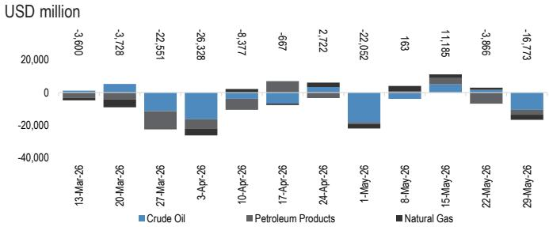

bar_stacked

| Date | Crude Oil (USD million) | Petroleum Products (USD million) | Natural Gas (USD million) |
| :--- | :--- | :--- | :--- |
| 13-Mar-26 | -3,600 | | |
| 20-Mar-26 | -3,728 | | |
| 27-Mar-26 | -22,551 | | |
| 3-Apr-26 | -26,328 | | |
| 10-Apr-26 | -8,377 | | |
| 17-Apr-26 | -697 | | |
| 24-Apr-26 | 2,722 | | |
| 1-May-26 | -22,052 | | |
| 8-May-26 | 163 | | |
| 15-May-26 | 11,185 | | |
| 22-May-26 | -3,866 | | |
| 29-May-26 | -16,773 | | |

Source: Exchange data, Bloomberg Finance L.P., JPM Commodities Research

Figure 26: Weekly change in total OI from changes in prices   
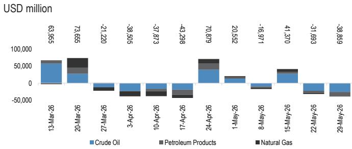

bar_stacked

| Date | Crude Oil (USD million) | Petroleum Products (USD million) | Natural Gas (USD million) |
| :--- | :--- | :--- | :--- |
| 13-Mar-26 | 63,955 | -1,000 | -1,000 |
| 20-Mar-26 | 73,655 | -1,000 | -1,000 |
| 27-Mar-26 | -21,220 | -1,000 | -1,000 |
| 3-Apr-26 | -38,505 | -1,000 | -1,000 |
| 10-Apr-26 | -37,873 | -1,000 | -1,000 |
| 17-Apr-26 | -43,298 | -1,000 | -1,000 |
| 24-Apr-26 | 70,879 | -1,000 | -1,000 |
| 1-May-26 | 20,552 | -1,000 | -1,000 |
| 8-May-26 | -16,971 | -1,000 | -1,000 |
| 15-May-26 | 41,370 | -1,000 | -1,000 |
| 22-May-26 | -31,693 | -1,000 | -1,000 |
| 29-May-26 | -38,859 | -1,000 | -1,000 |

Source: Exchange data, Bloomberg Finance L.P., JPM Commodities Research

# Environmental markets

Table 4: Estimated open interest and flows   
USD million 

<table><tr><td rowspan="2">Sector</td><td>Number of futures markets</td><td>Total estimated Open Interest</td><td colspan="4">Change in Open Interest</td><td colspan="4">Cumulative flows</td></tr><tr><td>Count</td><td>29-May-26</td><td>1 Week</td><td>1 Month</td><td>3 Months</td><td>2026 YTD</td><td>1 Week</td><td>1 Month</td><td>3 Months</td><td>2026 YTD</td></tr><tr><td>Environmental Markets</td><td>3</td><td>75,672</td><td>5,030</td><td>9,307</td><td>11,686</td><td>4,046</td><td>1,049</td><td>3,146</td><td>1,416</td><td>11,193</td></tr><tr><td>EU Allowances</td><td>2</td><td>70,957</td><td>4,621</td><td>8,373</td><td>10,287</td><td>3,970</td><td>1,067</td><td>2,879</td><td>1,483</td><td>10,305</td></tr><tr><td>ICE EUA</td><td>1</td><td>51,619</td><td>3,522</td><td>6,152</td><td>3,134</td><td>-6,731</td><td>936</td><td>2,187</td><td>-3,225</td><td>-317</td></tr><tr><td>EEX EUA</td><td>1</td><td>19,338</td><td>1,099</td><td>2,222</td><td>7,153</td><td>10,701</td><td>130</td><td>692</td><td>4,708</td><td>10,621</td></tr><tr><td>UK ETS</td><td>1</td><td>4,715</td><td>408</td><td>934</td><td>1,399</td><td>77</td><td>-17</td><td>267</td><td>-67</td><td>888</td></tr><tr><td colspan="11"></td></tr><tr><td>Total Regions</td><td>3</td><td>75,672</td><td>5,030</td><td>9,307</td><td>11,686</td><td>4,046</td><td>1,049</td><td>3,146</td><td>1,416</td><td>11,193</td></tr><tr><td>US</td><td>0</td><td>-</td><td>-</td><td>-</td><td>-</td><td>-</td><td>-</td><td>-</td><td>-</td><td>-</td></tr><tr><td>UK</td><td>1</td><td>4,715</td><td>408</td><td>934</td><td>1,399</td><td>77</td><td>-17</td><td>267</td><td>-67</td><td>888</td></tr><tr><td>EU</td><td>2</td><td>70,957</td><td>4,621</td><td>8,373</td><td>10,287</td><td>3,970</td><td>1,067</td><td>2,879</td><td>1,483</td><td>10,305</td></tr><tr><td>China</td><td>0</td><td>-</td><td>-</td><td>-</td><td>-</td><td>-</td><td>-</td><td>-</td><td>-</td><td>-</td></tr><tr><td>RoW</td><td>0</td><td>-</td><td>-</td><td>-</td><td>-</td><td>-</td><td>-</td><td>-</td><td>-</td><td>-</td></tr></table>

Source: Exchange data, Bloomberg Finance L.P., JPM Commodities Research

Figure 28: Environmental markets standardised level chart   
0-10 standardized scale: 0 = lowest since 2018, 10 = highest since 2018 positioning data in real USD terms   
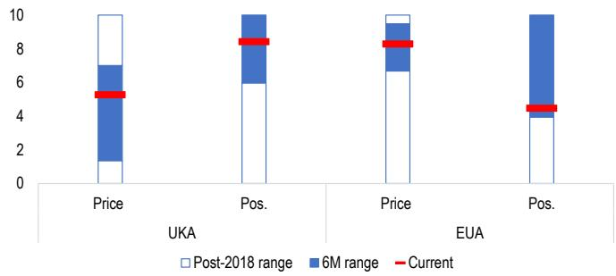

bar_stacked

| Region | Category | Post-2018 range | 6M range | Current |
| :--- | :--- | :--- | :--- | :--- |
| UKA | Price | 1.5 | 4.5 | 5.0 |
| UKA | Pos. | 6.0 | 3.0 | 8.0 |
| EUA | Price | 6.5 | 2.5 | 8.0 |
| EUA | Pos. | 4.0 | 1.0 | 4.5 |

Projections by JPM QDS Research; US exchanges data is an aggregate of Managed Money and Other Reportables, European exchanges data is an aggregate of Investment Funds and Other Financial Firms.

All data as of May 22, 2026.

Source: Exchange data, Bloomberg Finance L.P., JPM QDS and Commodities Research

Figure 30: Weekly change in total OI due to price/flows   
USD million   
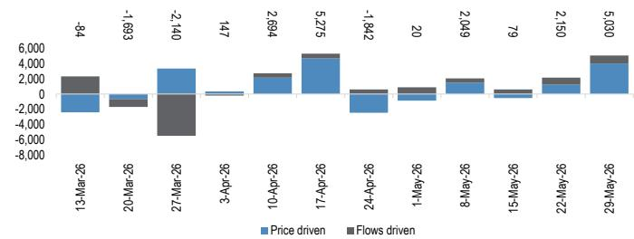

bar

| Date       | Price driven | Flows driven |
| ---------- | ------------ | ------------ |
| 13-Mar-26  | -84          |              |
| 20-Mar-26  | -1,693       |              |
| 27-Mar-26  | -2,140       |              |
| 3-Apr-26   | 147          |              |
| 10-Apr-26  | 2,694        |              |
| 17-Apr-26  | 5,275        |              |
| 24-Apr-26  | -1,842       |              |
| 1-May-26   | 20           |              |
| 8-May-26   | 2,049        |              |
| 1-May-27   | 79           |              |
| 22-May-27  | 2,150        |              |
| 29-May-27  | 5,030        |              |

Source: Exchange data, Bloomberg Finance L.P., JPM Commodities Research

Figure 29: ICE EUA position and price   
LHS: n of contracts; RHS: \$/MT  
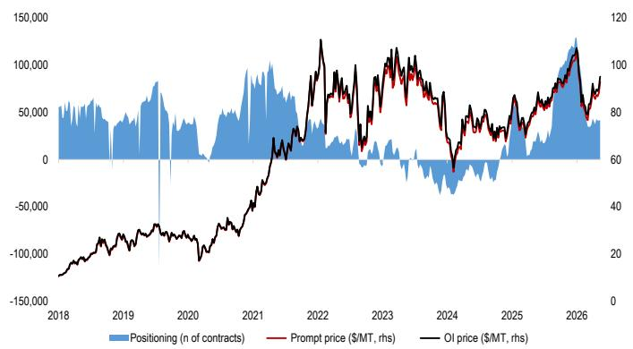

line

| Year | Positioning (n of contracts) | Prompt price ($/MT, rhs) | OI price ($/MT, rhs) |
|------|------------------------------|--------------------------|----------------------|
| 2018 | ~50,000                      | ~50,000                  | ~-150,000            |
| 2019 | ~70,000                      | ~70,000                  | ~-100,000            |
| 2020 | ~30,000                      | ~30,000                  | ~-100,000            |
| 2021 | ~100,000                     | ~100,000                 | ~-50,000             |
| 2022 | ~120,000                     | ~120,000                 | ~150,000             |
| 2023 | ~80,000                      | ~80,000                  | ~100,000             |
| 2024 | ~-50,000                     | ~-50,000                 | ~-50,000             |
| 2025 | ~60,000                      | ~60,000                  | ~75,000              |
| 2026 | ~120,000                     | ~120,000                 | ~115,000             |

Source: Exchange data, Bloomberg Finance L.P., JPM Commodities Research

Figure 31: Weekly change in total OI from changes in prices   
USD million   
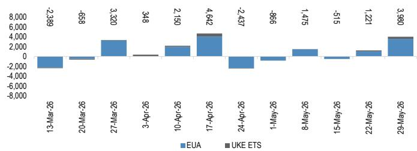

bar

| Date       | EUA    | UKE ETS |
| ---------- | ------ | ------- |
| 13-Mar-26  | -2,399 |         |
| 20-Mar-26  |        | -659    |
| 27-Mar-26  | 3,320  |         |
| 3-Apr-26   |        | -348    |
| 10-Apr-26  | 2,150  |         |
| 17-Apr-26  | 4,642  |         |
| 24-Apr-26  | -2,437 |         |
| 1-May-26   |        | -866    |
| 8-May-26   | 1,475  |         |
| 15-May-26  |        | -515    |
| 22-May-26  |        | 1,221   |
| 29-May-26  | 3,980  |         |

Source: Exchange data, Bloomberg Finance L.P., JPM Commodities Research

Figure 32: Weekly change in total OI from changes in contracts (flows)   
USD million   
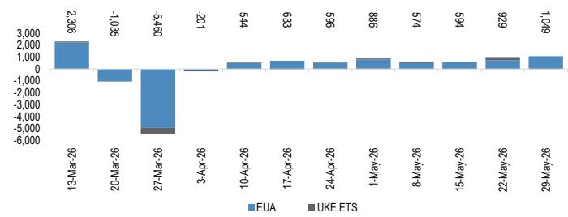

bar

| Date       | EUA   | UKE ETS |
| ---------- | ----- | ------- |
| 13-Mar-26  | 2,396 |         |
| 20-Mar-26  | -1,035|         |
| 27-Mar-26  | -5,460|         |
| 3-Apr-26   | -201  |         |
| 10-Apr-26  | 544   |         |
| 17-Apr-26  | 633   |         |
| 24-Apr-26  | 596   |         |
| 1-May-26   | 886   |         |
| 8-May-26   | 574   |         |
| 15-May-26  | 594   |         |
| 22-May-27  | 929   |         |
| 28-May-27  | 1,049 |         |

Source: Exchange data, Bloomberg Finance L.P., JPM Commodities Research

# Metals markets

Table 5: Estimated open interest and flows   
USD million 

<table><tr><td rowspan="2">Sector</td><td>Number of futures markets</td><td>Total estimated Open Interest</td><td colspan="4">Change in Open Interest</td><td colspan="4">Cumulative flows</td></tr><tr><td>Count</td><td>29-May-26</td><td>1 Week</td><td>1 Month</td><td>3 Months</td><td>2026 YTD</td><td>1 Week</td><td>1 Month</td><td>3 Months</td><td>2026 YTD</td></tr><tr><td>Metals</td><td>34</td><td>537,350</td><td>-20,402</td><td>-4,132</td><td>-77,538</td><td>-119,460</td><td>-22,446</td><td>-10,538</td><td>-54,199</td><td>-164,884</td></tr><tr><td>Precious</td><td>15</td><td>264,249</td><td>-21,709</td><td>-21,538</td><td>-82,642</td><td>-122,941</td><td>-22,135</td><td>-17,240</td><td>-42,556</td><td>-133,883</td></tr><tr><td>Gold</td><td>8</td><td>197,925</td><td>-20,877</td><td>-23,491</td><td>-67,543</td><td>-83,059</td><td>-21,621</td><td>-19,036</td><td>-35,374</td><td>-91,393</td></tr><tr><td>COMEX Gold</td><td>1</td><td>148,539</td><td>-17,037</td><td>-22,351</td><td>-60,932</td><td>-73,426</td><td>-18,215</td><td>-18,896</td><td>-35,810</td><td>-79,261</td></tr><tr><td>OSE Gold</td><td>1</td><td>5,806</td><td>55</td><td>-30</td><td>-2,894</td><td>-3,481</td><td>71</td><td>94</td><td>-1,946</td><td>-4,015</td></tr><tr><td>RTS Gold</td><td>1</td><td>-</td><td>-</td><td>-</td><td>-</td><td>-</td><td>-</td><td>-</td><td>-</td><td>-</td></tr><tr><td>OSE Mini Gold</td><td>1</td><td>185</td><td>3</td><td>5</td><td>-31</td><td>-3</td><td>4</td><td>8</td><td>-2</td><td>-8</td></tr><tr><td>TFEX Gold</td><td>1</td><td>100</td><td>3</td><td>9</td><td>-62</td><td>-52</td><td>3</td><td>12</td><td>-43</td><td>-55</td></tr><tr><td>SHF Gold</td><td>1</td><td>43,101</td><td>-3,898</td><td>-1,111</td><td>-3,637</td><td>-6,150</td><td>-3,481</td><td>-237</td><td>2,386</td><td>-8,099</td></tr><tr><td>TurkDEX Gold</td><td>1</td><td>178</td><td>-3</td><td>-12</td><td>13</td><td>65</td><td>-2</td><td>-15</td><td>40</td><td>58</td></tr><tr><td>MCX Gold</td><td>1</td><td>16</td><td>-0</td><td>-1</td><td>-1</td><td>-11</td><td>-0</td><td>-1</td><td>1</td><td>-12</td></tr><tr><td>Silver</td><td>3</td><td>57,604</td><td>-572</td><td>2,275</td><td>-13,228</td><td>-32,166</td><td>-293</td><td>1,519</td><td>-6,587</td><td>-37,827</td></tr><tr><td>COMEX Silver</td><td>1</td><td>37,557</td><td>141</td><td>748</td><td>-9,701</td><td>-20,809</td><td>99</td><td>860</td><td>-5,532</td><td>-21,996</td></tr><tr><td>SHFE Silver</td><td>1</td><td>19,107</td><td>-779</td><td>1,175</td><td>-3,848</td><td>-10,967</td><td>-468</td><td>354</td><td>-1,455</td><td>-15,311</td></tr><tr><td>MCX Silver</td><td>1</td><td>940</td><td>66</td><td>352</td><td>321</td><td>-390</td><td>75</td><td>305</td><td>400</td><td>-520</td></tr><tr><td>Platinum</td><td>2</td><td>6,475</td><td>-117</td><td>-142</td><td>-1,538</td><td>-5,485</td><td>-76</td><td>134</td><td>-751</td><td>-3,505</td></tr><tr><td>NYMEX Platinum</td><td>1</td><td>5,966</td><td>-100</td><td>-141</td><td>-1,406</td><td>-5,141</td><td>-71</td><td>119</td><td>-691</td><td>-3,231</td></tr><tr><td>OSE Platinum</td><td>1</td><td>508</td><td>-17</td><td>-1</td><td>-132</td><td>-344</td><td>-5</td><td>15</td><td>-60</td><td>-274</td></tr><tr><td>Palladium</td><td>2</td><td>2,246</td><td>-143</td><td>-180</td><td>-332</td><td>-2,231</td><td>-144</td><td>142</td><td>155</td><td>-1,158</td></tr><tr><td>NYMEX Palladium</td><td>1</td><td>2,246</td><td>-143</td><td>-180</td><td>-332</td><td>-2,231</td><td>-144</td><td>142</td><td>155</td><td>-1,158</td></tr><tr><td>OSE Palladium</td><td>1</td><td>-</td><td>-</td><td>-</td><td>-</td><td>-</td><td>-</td><td>-</td><td>-</td><td>-</td></tr><tr><td>Base</td><td>13</td><td>239,215</td><td>1,760</td><td>16,164</td><td>2,073</td><td>-1,385</td><td>743</td><td>6,086</td><td>-12,030</td><td>-31,725</td></tr><tr><td>Aluminium</td><td>3</td><td>56,461</td><td>-624</td><td>2,208</td><td>2,615</td><td>8,108</td><td>-886</td><td>398</td><td>527</td><td>-741</td></tr><tr><td>LME Aluminum</td><td>1</td><td>43,877</td><td>-270</td><td>1,583</td><td>2,326</td><td>6,466</td><td>-556</td><td>-146</td><td>459</td><td>-772</td></tr><tr><td>COMEX Aluminum</td><td>1</td><td>235</td><td>14</td><td>19</td><td>10</td><td>58</td><td>14</td><td>10</td><td>0</td><td>25</td></tr><tr><td>SHF Aluminum</td><td>1</td><td>12,349</td><td>-368</td><td>606</td><td>280</td><td>1,584</td><td>-345</td><td>534</td><td>68</td><td>6</td></tr><tr><td>Copper</td><td>4</td><td>136,584</td><td>2,867</td><td>14,711</td><td>710</td><td>-12,303</td><td>2,313</td><td>7,580</td><td>-8,087</td><td>-27,335</td></tr><tr><td>LME Copper</td><td>1</td><td>55,199</td><td>1,394</td><td>3,908</td><td>-5,173</td><td>-10,675</td><td>1,548</td><td>1,368</td><td>-8,147</td><td>-17,767</td></tr><tr><td>COMEX Copper</td><td>1</td><td>40,438</td><td>1,308</td><td>8,304</td><td>8,105</td><td>3,980</td><td>921</td><td>5,646</td><td>4,407</td><td>302</td></tr><tr><td>SHF Copper</td><td>1</td><td>40,188</td><td>149</td><td>1,740</td><td>-2,176</td><td>-5,705</td><td>-173</td><td>-190</td><td>-4,337</td><td>-10,111</td></tr><tr><td>MCX Copper</td><td>1</td><td>758</td><td>16</td><td>758</td><td>-46</td><td>97</td><td>18</td><td>755</td><td>-9</td><td>240</td></tr><tr><td>Lead</td><td>2</td><td>6,412</td><td>-291</td><td>-605</td><td>-498</td><td>-560</td><td>-284</td><td>-785</td><td>-680</td><td>-593</td></tr><tr><td>LME Lead</td><td>1</td><td>5,079</td><td>-315</td><td>-711</td><td>-454</td><td>-753</td><td>-316</td><td>-891</td><td>-640</td><td>-814</td></tr><tr><td>SHF Lead</td><td>1</td><td>1,334</td><td>24</td><td>106</td><td>-44</td><td>193</td><td>32</td><td>106</td><td>-40</td><td>222</td></tr><tr><td>Zinc</td><td>2</td><td>16,991</td><td>-271</td><td>781</td><td>1,142</td><td>1,314</td><td>-278</td><td>-196</td><td>62</td><td>-918</td></tr><tr><td>LME Zinc</td><td>1</td><td>13,151</td><td>-427</td><td>50</td><td>638</td><td>786</td><td>-400</td><td>-720</td><td>-308</td><td>-1,005</td></tr><tr><td>SHF Zinc</td><td>1</td><td>3,841</td><td>156</td><td>731</td><td>504</td><td>528</td><td>122</td><td>524</td><td>371</td><td>87</td></tr><tr><td>LME Nickel</td><td>1</td><td>19,939</td><td>20</td><td>-957</td><td>-1,920</td><td>1,758</td><td>-120</td><td>-599</td><td>-3,597</td><td>-1,826</td></tr><tr><td>LME Tin</td><td>1</td><td>2,828</td><td>59</td><td>26</td><td>24</td><td>298</td><td>-2</td><td>-312</td><td>-255</td><td>-312</td></tr><tr><td>Industrial</td><td>6</td><td>33,886</td><td>-452</td><td>1,242</td><td>3,031</td><td>4,867</td><td>-1,054</td><td>616</td><td>387</td><td>724</td></tr><tr><td>Coal</td><td>3</td><td>11,384</td><td>365</td><td>1,937</td><td>1,641</td><td>2,657</td><td>-331</td><td>1,249</td><td>-48</td><td>-571</td></tr><tr><td>ICE Richards Bay Coal</td><td>1</td><td>388</td><td>-0</td><td>123</td><td>167</td><td>292</td><td>4</td><td>106</td><td>150</td><td>236</td></tr><tr><td>ICE Rotterdam Coal</td><td>1</td><td>2,999</td><td>-1</td><td>545</td><td>175</td><td>402</td><td>-1</td><td>391</td><td>265</td><td>-243</td></tr><tr><td>DCE Coal</td><td>1</td><td>7,997</td><td>367</td><td>1,270</td><td>1,299</td><td>1,963</td><td>-334</td><td>753</td><td>-463</td><td>-564</td></tr><tr><td>Iron Ore</td><td>2</td><td>11,605</td><td>-70</td><td>46</td><td>1,832</td><td>1,168</td><td>25</td><td>150</td><td>1,384</td><td>863</td></tr><tr><td>DCE Iron Ore</td><td>1</td><td>11,605</td><td>-70</td><td>46</td><td>1,832</td><td>1,168</td><td>25</td><td>150</td><td>1,384</td><td>863</td></tr><tr><td>COMEX Iron Ore</td><td>1</td><td>-</td><td>-</td><td>-</td><td>-</td><td>-</td><td>-</td><td>-</td><td>-</td><td>-</td></tr><tr><td>SHFE Steel</td><td>1</td><td>10,898</td><td>-747</td><td>-741</td><td>-441</td><td>1,043</td><td>-748</td><td>-783</td><td>-949</td><td>432</td></tr><tr><td colspan="11"></td></tr><tr><td>Total Regions</td><td>34</td><td>537,350</td><td>-20,402</td><td>-4,132</td><td>-77,538</td><td>-119,460</td><td>-22,446</td><td>-10,538</td><td>-54,199</td><td>-164,884</td></tr><tr><td>US</td><td>7</td><td>234,981</td><td>-15,817</td><td>-13,600</td><td>-64,256</td><td>-97,569</td><td>-17,396</td><td>-12,118</td><td>-37,472</td><td>-105,319</td></tr><tr><td>UK</td><td>8</td><td>143,459</td><td>459</td><td>4,565</td><td>-4,218</td><td>-1,427</td><td>157</td><td>-802</td><td>-12,073</td><td>-22,504</td></tr><tr><td>EU</td><td>0</td><td>-</td><td>-</td><td>-</td><td>-</td><td>-</td><td>-</td><td>-</td><td>-</td><td>-</td></tr><tr><td>China</td><td>9</td><td>150,419</td><td>-5,167</td><td>3,823</td><td>-6,232</td><td>-16,343</td><td>-5,369</td><td>1,210</td><td>-3,036</td><td>-32,475</td></tr><tr><td>RoW</td><td>10</td><td>8,491</td><td>123</td><td>1,080</td><td>-2,831</td><td>-4,120</td><td>163</td><td>1,173</td><td>-1,618</td><td>-4,586</td></tr></table>

Source: Exchange data, Bloomberg Finance L.P., JPM Commodities Research

Figure 33: Metals sectoral standardised level chart   
0-10 standardized scale: 0 = lowest since 2018, 10 = highest since 2018 positioning data in real USD terms   
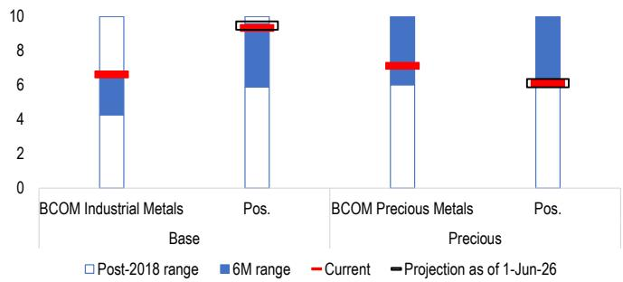

bar_stacked

| Category | Sub-category | Projection as of 1-Jun-26 | Current | 6M range | Post-2018 range |
| :--- | :--- | :--- | :--- | :--- | :--- |
| Base | BCOM Industrial Metals | 9.5 | 6.7 | 3.4 | 10.0 |
| Base | Pos. | 9.5 | 9.3 | 4.3 | 5.8 |
| Precious | BCOM Precious Metals | 9.5 | 7.1 | 10.0 | 5.8 |
| Precious | Pos. | 9.5 | 6.1 | 10.0 | 5.8 |

Projections by JPM QDS Research: US exchanges data is an aggregate of Managed Money and Other Reportables, European exchanges data is an aggregate of Investment Funds and Other Financial Firms.

All data as of May 26, 2026, except LME data as of May 29, 2026.

Source: Exchange data, Bloomberg Finance L.P., JPM QDS and Commodities Research

Figure 35: Precious Metals standardised level chart   
0-10 standardized scale: 0 = lowest since 2018, 10 = highest since 2018 positioning data in real USD terms   
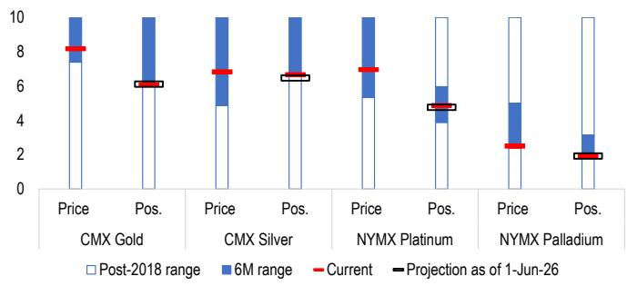

bar

| Asset Class       | Category | Value |
| ----------------- | -------- | ----- |
| CMX Gold          | Price    | 7.5   |
| CMX Gold          | Pos.     | 10.0  |
| CMX Silver        | Price    | 4.5   |
| CMX Silver        | Pos.     | 10.0  |
| NYMX Platinum     | Price    | 5.0   |
| NYMX Platinum     | Pos.     | 10.0  |
| NYMX Palladium   | Price    | 10.0  |
| NYMX Palladium   | Pos.     | 3.0   |

Projections by JPM QDS Research: US exchanges data is an aggregate of Managed Money and Other Reportables, European exchanges data is an aggregate of Investment Funds and Other Financial Firms.

All data as of May 26, 2026.

Source: Exchange data, Bloomberg Finance L.P., JPM Commodities Research

Figure 37: COMEX Copper position and price   
LHS: n of contracts; RHS: \$/lb  
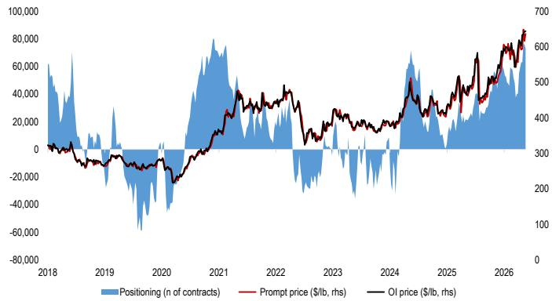

line

| Year | Positioning (n of contracts) | Prompt price ($/lb, rhs) | Oil price ($/lb, rhs) |
|------|------------------------------|--------------------------|----------------------|
| 2018 | ~60,000                      | ~300                     | ~300                 |
| 2019 | ~-20,000                     | ~-100                    | ~-100                |
| 2020 | ~-60,000                     | ~-50                     | ~-50                 |
| 2021 | ~80,000                      | ~400                     | ~400                 |
| 2022 | ~40,000                      | ~500                     | ~500                 |
| 2023 | ~-20,000                     | ~300                     | ~300                 |
| 2024 | ~60,000                      | ~500                     | ~500                 |
| 2025 | ~40,000                      | ~450                     | ~450                 |
| 2026 | ~80,000                      | ~650                     | ~650                 |

Source: Exchange data, Bloomberg Finance L.P., JPM Commodities Research

Figure 34: Base Metals standardised level chart   
0-10 standardized scale: 0 = lowest since 2018, 10 = highest since 2018 positioning data in real USD terms   
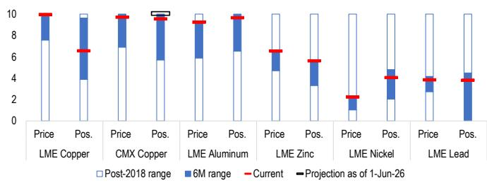

bar_stacked

| Category | Price | Pos. |
| :--- | :--- | :--- |
| LME Copper | 7.5 | 3.0 |
| CMX Copper | 6.8 | 4.0 |
| LME Aluminum | 5.8 | 4.0 |
| LME Zinc | 4.5 | 3.0 |
| LME Nickel | 1.5 | 2.0 |
| LME Lead | 9.5 | 4.0 |
Projection as of 1-Jun-26

Projections by JPM QDS Research; US exchanges data is an aggregate of Managed Money and Other Reportables, European exchanges data is an aggregate of Investment Funds and Other Financial Firms.

All data as of May 26, 2026, except LME data as of May 29, 2026.

Source: Exchange data, Bloomberg Finance L.P., JPM QDS and Commodities Research

Figure 36: COMEX Gold position and price   
LHS: n of contracts; RHS: \$/t oz  
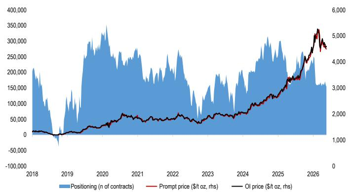

line

| Year | Positioning (n of contracts) | Prompt price ($/t oz, rhs) | Ol price ($/t oz, rhs) |
|------|------------------------------|-----------------------------|--------------------------|
| 2018 | ~200,000                     | ~1,000                      | ~1,000                   |
| 2019 | ~-50,000                     | ~5,000                      | ~5,000                   |
| 2020 | ~350,000                     | ~1,500                      | ~1,500                   |
| 2021 | ~250,000                     | ~2,000                      | ~2,000                   |
| 2022 | ~250,000                     | ~2,500                      | ~2,500                   |
| 2023 | ~150,000                     | ~3,000                      | ~3,000                   |
| 2024 | ~250,000                     | ~3,500                      | ~3,500                   |
| 2025 | ~350,000                     | ~4,500                      | ~4,500                   |
| 2026 | ~450,000                     | ~5,500                      | ~5,500                   |

Source: Exchange data, Bloomberg Finance L.P., JPM Commodities Research

Figure 38: LME Copper position and price   
LHS: n of contracts; RHS: \$/MT  
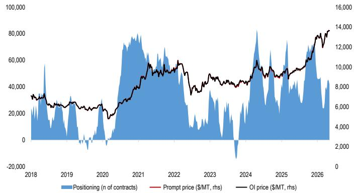

bar_line

| Year | Positioning (n of contracts) | Prompt price ($/MT, rhs) | Oil price ($/MT, rhs) |
|------|------------------------------|--------------------------|----------------------|
| 2018 | ~30,000                      | ~35,000                  | ~35,000              |
| 2019 | ~25,000                      | ~30,000                  | ~30,000              |
| 2020 | ~15,000                      | ~25,000                  | ~25,000              |
| 2021 | ~70,000                      | ~50,000                  | ~50,000              |
| 2022 | ~60,000                      | ~60,000                  | ~60,000              |
| 2023 | ~40,000                      | ~45,000                  | ~45,000              |
| 2024 | ~-15,000                     | ~55,000                  | ~55,000              |
| 2025 | ~75,000                      | ~65,000                  | ~65,000              |
| 2026 | ~45,000                      | ~85,000                  | ~85,000              |

Source: Exchange data, Bloomberg Finance L.P., JPM Commodities Research

Figure 39: Weekly change in total OI due to price/flows   
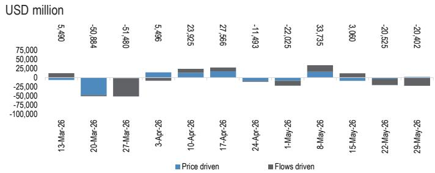

bar

| Date       | Price driven | Flows driven |
| ---------- | ------------ | ------------ |
| Mar-26     | -5,490       | 5,490        |
| 92-Sep-02  | -50,884      | -50,884      |
| 92-Sep-12  | -51,480      | -51,480      |
| 92-Oct-26  | 5,496        | 5,496        |
| 92-Oct-01  | 23,925       | 23,925       |
| 92-Oct-17  | 27,566       | 27,566       |
| 92-Oct-23  | -11,493      | -11,493      |
| 92-Nov-06  | -22,025      | -22,025      |
| 92-Nov-18  | 33,735       | 33,735       |
| 92-Nov-21  | 3,060        | 3,060        |
| 92-Nov-22  | -20,525      | -20,525      |
| 92-Nov-27  | -20,402      | -20,402      |

Source: Exchange data, Bloomberg Finance L.P., JPM Commodities Research

Figure 41: Weekly change in total OI from changes in contracts (flows)   
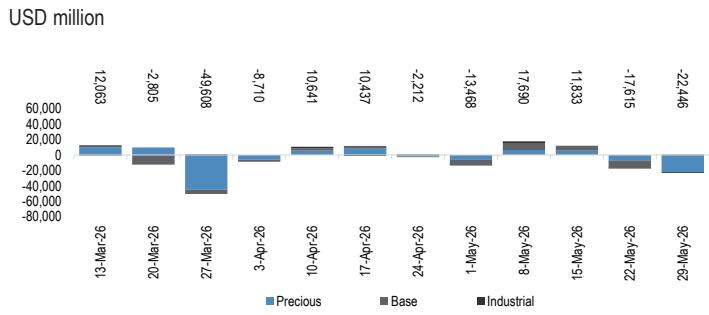

bar_stacked

USD million
| Date | Precious (USD million) | Base (USD million) | Industrial (USD million) |
| :--- | :--- | :--- | :--- |
| 13-Mar-26 | 12,963 | | |
| 20-Mar-26 | -2,805 | | |
| 27-Mar-26 | -49,608 | | |
| 3-Apr-26 | -8,710 | | |
| 10-Apr-26 | 10,641 | | |
| 17-Apr-26 | 10,437 | | |
| 24-Apr-26 | -2,212 | | |
| 1-May-26 | -13,488 | | |
| 8-May-26 | 17,990 | | |
| 15-May-26 | 11,833 | | |
| 22-May-26 | -17,615 | | |
| 29-May-26 | -22,446 | | |

Source: Exchange data, Bloomberg Finance L.P., JPM Commodities Research

Figure 43: Weekly change in total OI from changes in contracts (flows)-precious metals   
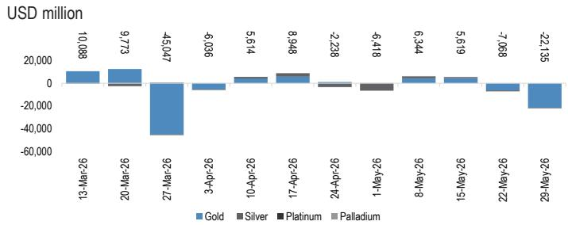

bar

| Date       | Gold    | Silver  | Platinum | Palladium |
| ---------- | ------- | ------- | -------- | --------- |
| 13-Mar-26  | 10,088  |         |          |           |
| 20-Mar-26  | 9,773   |         |          |           |
| 9-Sep-27   | -45,047 |         |          |           |
| 9-Oct-27   | -6,036  |         |          |           |
| 10-Apr-26  | 5,614   |         |          |           |
| 11-Apr-26  | 8,948   |         |          |           |
| 24-Apr-26  | -2,238  |         |          |           |
| 1-May-26   | -6,418  |         |          |           |
| 8-May-26   | 6,344   |         |          |           |
| 9-May-26   | 5,619   |         |          |           |
| 15-May-27  | -7,068  |         |          |           |
| 22-May-27  |         |         |          |           |
| 29-May-27  | -22,135 |         |          |           |

Source: Exchange data, Bloomberg Finance L.P., JPM Commodities Research

Figure 40: Weekly change in total OI from changes in prices   
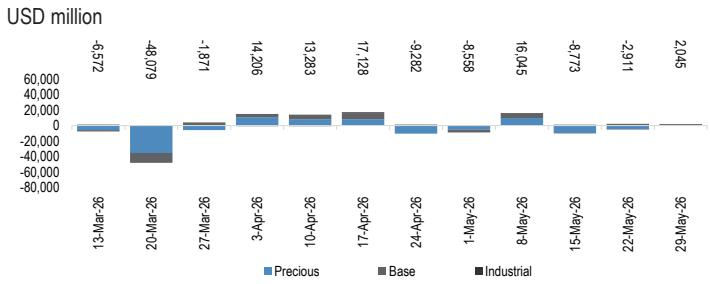

bar

| Date       | Precious | Base   | Industrial |
| ---------- | -------- | ------ | ---------- |
| 13-Mar-26  | -6.572   | -      | -          |
| 20-Mar-26  | -48.079  | -      | -          |
| 17-Mar-26  | -1.871   | -      | -          |
| 3-Apr-26   | 14.206   | -      | -          |
| 10-Apr-26  | 13.333   | -      | -          |
| 17-Apr-26  | 17.128   | -      | -          |
| 24-Apr-26  | -9.282   | -      | -          |
| 1-May-26   | -8.59    | -      | -          |
| 8-May-26   | 16.045   | -      | -          |
| 15-May-26  | -8.773   | -      | -          |
| 22-May-26  | -2.911   | -      | -          |
| 29-May-26  | 2.045    | -      | -          |

Source: Exchange data, Bloomberg Finance L.P., JPM Commodities Research

Figure 42: Weekly change in total OI from changes in contracts (flows)-industrial and bulk metals   
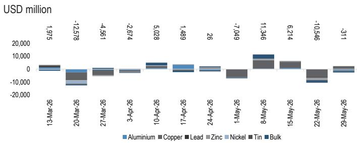

bar

| Month     | Aluminum | Copper | Lead  | Zinc  | Nickel | Tin   | Bulk  |
|-----------|----------|--------|-------|-------|--------|-------|-------|
| 92-Jan-11 | 1,975    |        |       |       |        |       |       |
| 92-Jan-22 |          |        | -12,578 |       |        |       |       |
| 27-Jan-12 |          |        |       |       |        | -4,561 |       |
| 92-Jul-6  |          |        |       |       |        | -2,674 |       |
| 92-Jul-11 |          |        |       |       |        | 5,028 |       |
| 92-Jul-17 |          |        |       |       |        | 1,489 |       |
| 92-Jul-23 |          |        |       |       |        | 26    |       |
| 92-Sep-1  |          |        |       |       |        | -7,049 |       |
| 92-Sep-8  |          |        |       |       |        | 11,346 |       |
| 92-Sep-15 |          |        |       |       |        | 6,214  |       |
| 92-Sep-22 |          |        |       |       |        | -10,546|       |
| 92-Sep-29 |          |        |       |       |        | -311   |       |

Source: Exchange data, Bloomberg Finance L.P., JPM Commodities Research

# Agricultural markets

Table 6: Estimated open interest and flows   
USD million 

<table><tr><td rowspan="2">Sector</td><td>Number of futures markets</td><td>Total estimated Open Interest</td><td colspan="4">Change in Open Interest</td><td colspan="4">Cumulative flows</td></tr><tr><td>Count</td><td>29-May-26</td><td>1 Week</td><td>1 Month</td><td>3 Months</td><td>2026 YTD</td><td>1 Week</td><td>1 Month</td><td>3 Months</td><td>2026 YTD</td></tr><tr><td>Agriculture</td><td>36</td><td>393,058</td><td>1,766</td><td>9,732</td><td>23,263</td><td>75,919</td><td>3,931</td><td>16,075</td><td>10,715</td><td>54,905</td></tr><tr><td>Grains &amp; Oilseeds</td><td>17</td><td>240,365</td><td>2,594</td><td>15,220</td><td>22,078</td><td>66,710</td><td>3,987</td><td>16,282</td><td>13,106</td><td>39,355</td></tr><tr><td>Corn</td><td>4</td><td>51,005</td><td>-1,202</td><td>-2,591</td><td>3,082</td><td>9,583</td><td>71</td><td>-921</td><td>2,455</td><td>7,839</td></tr><tr><td>CBOT Corn</td><td>1</td><td>43,121</td><td>-1,548</td><td>-2,470</td><td>3,173</td><td>8,318</td><td>-287</td><td>-1,067</td><td>2,493</td><td>7,107</td></tr><tr><td>DCE Corn</td><td>1</td><td>7,495</td><td>352</td><td>-63</td><td>-34</td><td>1,432</td><td>366</td><td>196</td><td>47</td><td>933</td></tr><tr><td>Euronext Maize</td><td>1</td><td>388</td><td>-7</td><td>-57</td><td>-58</td><td>-167</td><td>-9</td><td>-51</td><td>-85</td><td>-201</td></tr><tr><td>OSE Corn</td><td>1</td><td>-</td><td>-</td><td>-</td><td>-0</td><td>-0</td><td>-</td><td>-</td><td>-0</td><td>-0</td></tr><tr><td>Wheat</td><td>7</td><td>34,717</td><td>-1,459</td><td>1,600</td><td>2,083</td><td>4,801</td><td>168</td><td>2,438</td><td>1,142</td><td>7</td></tr><tr><td>CBOT Wheat</td><td>1</td><td>15,166</td><td>-712</td><td>1,346</td><td>363</td><td>2,564</td><td>150</td><td>1,690</td><td>379</td><td>510</td></tr><tr><td>KCBT Wheat</td><td>1</td><td>10,467</td><td>-478</td><td>402</td><td>1,185</td><td>2,414</td><td>23</td><td>976</td><td>744</td><td>795</td></tr><tr><td>MAIX Wheat</td><td>1</td><td>3,079</td><td>-93</td><td>70</td><td>819</td><td>1,043</td><td>12</td><td>176</td><td>686</td><td>724</td></tr><tr><td>Euronext Milling Wheat</td><td>1</td><td>5,427</td><td>-187</td><td>-202</td><td>-136</td><td>-1,018</td><td>-25</td><td>-386</td><td>-496</td><td>-1,789</td></tr><tr><td>Euronext Feed Wheat</td><td>1</td><td>212</td><td>-1</td><td>7</td><td>-43</td><td>-58</td><td>0</td><td>8</td><td>-67</td><td>-91</td></tr><tr><td>ZCE Wheat</td><td>1</td><td>-</td><td>-</td><td>-</td><td>-</td><td>-</td><td>-</td><td>-</td><td>-</td><td>-</td></tr><tr><td>SAFEX Wheat</td><td>1</td><td>365</td><td>11</td><td>-23</td><td>-106</td><td>-143</td><td>8</td><td>-25</td><td>-103</td><td>-143</td></tr><tr><td>Soybeans</td><td>2</td><td>66,986</td><td>1,561</td><td>8,062</td><td>3,555</td><td>21,795</td><td>1,620</td><td>7,907</td><td>2,461</td><td>14,782</td></tr><tr><td>CBOT Soybean</td><td>1</td><td>62,816</td><td>1,168</td><td>7,299</td><td>2,304</td><td>19,186</td><td>1,270</td><td>7,072</td><td>1,478</td><td>12,823</td></tr><tr><td>DCE Soybean</td><td>1</td><td>4,171</td><td>393</td><td>763</td><td>1,251</td><td>2,609</td><td>349</td><td>835</td><td>983</td><td>1,960</td></tr><tr><td>Soybean Meal</td><td>2</td><td>41,243</td><td>1,396</td><td>4,973</td><td>7,638</td><td>11,690</td><td>1,392</td><td>4,393</td><td>6,273</td><td>10,280</td></tr><tr><td>CBOT Soy Meal</td><td>1</td><td>21,198</td><td>797</td><td>2,980</td><td>4,553</td><td>5,718</td><td>925</td><td>2,485</td><td>3,917</td><td>4,717</td></tr><tr><td>DCE Soy Meal</td><td>1</td><td>20,045</td><td>599</td><td>1,993</td><td>3,084</td><td>5,971</td><td>467</td><td>1,909</td><td>2,356</td><td>5,563</td></tr><tr><td>Soybean Oil</td><td>2</td><td>46,414</td><td>2,299</td><td>3,175</td><td>5,721</td><td>18,841</td><td>736</td><td>2,464</td><td>774</td><td>6,446</td></tr><tr><td>CBOT Soy Oil</td><td>1</td><td>32,580</td><td>1,768</td><td>1,901</td><td>4,582</td><td>13,164</td><td>311</td><td>1,238</td><td>504</td><td>2,424</td></tr><tr><td>DCE Soy Oil</td><td>1</td><td>13,835</td><td>531</td><td>1,275</td><td>1,138</td><td>5,676</td><td>425</td><td>1,226</td><td>270</td><td>4,022</td></tr><tr><td>Softs</td><td>15</td><td>96,966</td><td>601</td><td>-253</td><td>6,500</td><td>6,102</td><td>1,071</td><td>1,966</td><td>1,640</td><td>12,578</td></tr><tr><td>Cotton</td><td>2</td><td>23,900</td><td>-376</td><td>-4,326</td><td>237</td><td>1,679</td><td>-523</td><td>-3,469</td><td>-3,013</td><td>-2,118</td></tr><tr><td>NYBOT Cotton</td><td>1</td><td>13,281</td><td>462</td><td>-544</td><td>2,536</td><td>3,445</td><td>485</td><td>270</td><td>349</td><td>1,542</td></tr><tr><td>ZCE Cotton</td><td>1</td><td>10,619</td><td>-838</td><td>-3,782</td><td>-2,298</td><td>-1,766</td><td>-1,009</td><td>-3,739</td><td>-3,363</td><td>-3,661</td></tr><tr><td>Coffee</td><td>2</td><td>22,319</td><td>-36</td><td>1,346</td><td>897</td><td>-727</td><td>523</td><td>3,401</td><td>3,854</td><td>5,183</td></tr><tr><td>NYBOT Coffee</td><td>1</td><td>19,000</td><td>-127</td><td>848</td><td>774</td><td>-1,389</td><td>326</td><td>2,859</td><td>3,320</td><td>3,986</td></tr><tr><td>ICE Coffee</td><td>1</td><td>3,319</td><td>91</td><td>498</td><td>122</td><td>662</td><td>197</td><td>541</td><td>534</td><td>1,198</td></tr><tr><td>Cocoa</td><td>2</td><td>17,216</td><td>1,076</td><td>1,772</td><td>4,286</td><td>752</td><td>454</td><td>192</td><td>854</td><td>5,910</td></tr><tr><td>NYBOT Cocoa</td><td>1</td><td>8,203</td><td>420</td><td>844</td><td>1,880</td><td>780</td><td>136</td><td>56</td><td>329</td><td>3,251</td></tr><tr><td>ICE Cocoa</td><td>1</td><td>9,013</td><td>656</td><td>929</td><td>2,405</td><td>-27</td><td>317</td><td>136</td><td>525</td><td>2,659</td></tr><tr><td>Sugar</td><td>4</td><td>26,467</td><td>-261</td><td>153</td><td>263</td><td>2,605</td><td>402</td><td>1,020</td><td>-590</td><td>2,516</td></tr><tr><td>NYBOT Sugar</td><td>1</td><td>16,009</td><td>-477</td><td>-769</td><td>-1,230</td><td>265</td><td>210</td><td>145</td><td>-1,637</td><td>615</td></tr><tr><td>ICE Sugar</td><td>1</td><td>3,123</td><td>75</td><td>253</td><td>-94</td><td>-83</td><td>123</td><td>328</td><td>-257</td><td>-93</td></tr><tr><td>ZCE Sugar</td><td>1</td><td>7,106</td><td>124</td><td>622</td><td>1,524</td><td>2,367</td><td>50</td><td>501</td><td>1,260</td><td>1,953</td></tr><tr><td>NYB Sugar</td><td>1</td><td>230</td><td>17</td><td>48</td><td>63</td><td>56</td><td>19</td><td>47</td><td>44</td><td>41</td></tr><tr><td>Other softs</td><td>5</td><td>7,063</td><td>198</td><td>802</td><td>818</td><td>1,791</td><td>215</td><td>822</td><td>535</td><td>1,087</td></tr><tr><td>CBOT Rice</td><td>1</td><td>347</td><td>-2</td><td>53</td><td>75</td><td>80</td><td>8</td><td>6</td><td>28</td><td>6</td></tr><tr><td>NYBOT Orange Juice</td><td>1</td><td>193</td><td>-18</td><td>-24</td><td>-22</td><td>-90</td><td>-4</td><td>1</td><td>-10</td><td>-50</td></tr><tr><td>CBOT Oats</td><td>1</td><td>91</td><td>7</td><td>29</td><td>31</td><td>25</td><td>8</td><td>25</td><td>24</td><td>13</td></tr><tr><td>CME Milk</td><td>1</td><td>1,085</td><td>34</td><td>168</td><td>85</td><td>-1</td><td>39</td><td>212</td><td>105</td><td>-59</td></tr><tr><td>Euronext Rapeseed</td><td>1</td><td>5,346</td><td>177</td><td>576</td><td>650</td><td>1,778</td><td>164</td><td>578</td><td>388</td><td>1,177</td></tr><tr><td>Livestock</td><td>4</td><td>55,727</td><td>-1,429</td><td>-5,235</td><td>-5,315</td><td>3,107</td><td>-1,127</td><td>-2,173</td><td>-4,031</td><td>2,972</td></tr><tr><td>CME Live Cattle</td><td>1</td><td>32,580</td><td>-991</td><td>-2,721</td><td>1,129</td><td>2,901</td><td>-917</td><td>-1,350</td><td>419</td><td>2,274</td></tr><tr><td>BMF Cattle</td><td>1</td><td>1,383</td><td>74</td><td>-26</td><td>176</td><td>638</td><td>88</td><td>-5</td><td>100</td><td>484</td></tr><tr><td>CME Feeder Cattle</td><td>1</td><td>10,034</td><td>-95</td><td>-2,203</td><td>-3,100</td><td>-1,568</td><td>-52</td><td>-1,308</td><td>-2,875</td><td>-1,674</td></tr><tr><td>CME Lean Hogs</td><td>1</td><td>11,730</td><td>-416</td><td>-285</td><td>-3,520</td><td>1,137</td><td>-246</td><td>490</td><td>-1,675</td><td>1,888</td></tr><tr><td colspan="11"></td></tr><tr><td>Total Regions</td><td>36</td><td>393,058</td><td>1,766</td><td>9,732</td><td>23,263</td><td>75,919</td><td>3,931</td><td>16,075</td><td>10,715</td><td>54,905</td></tr><tr><td>US</td><td>19</td><td>301,212</td><td>-284</td><td>6,971</td><td>15,680</td><td>58,049</td><td>2,419</td><td>14,022</td><td>8,622</td><td>40,933</td></tr><tr><td>UK</td><td>4</td><td>15,667</td><td>821</td><td>1,686</td><td>2,391</td><td>493</td><td>636</td><td>1,014</td><td>736</td><td>3,673</td></tr><tr><td>EU</td><td>3</td><td>11,162</td><td>-17</td><td>317</td><td>456</td><td>593</td><td>130</td><td>141</td><td>-193</td><td>-813</td></tr><tr><td>China</td><td>7</td><td>63,269</td><td>1,161</td><td>807</td><td>4,666</td><td>16,290</td><td>649</td><td>928</td><td>1,554</td><td>10,771</td></tr><tr><td>RoW</td><td>3</td><td>1,748</td><td>85</td><td>-49</td><td>69</td><td>495</td><td>96</td><td>-30</td><td>-4</td><td>342</td></tr></table>

Source: Exchange data, Bloomberg Finance L.P., JPM Commodities Research

Figure 44: Agriculture commodities sectoral standardised level chart   
0-10 standardized scale: 0 = lowest since 2018, 10 = highest since 2018 positioning data in real USD terms   
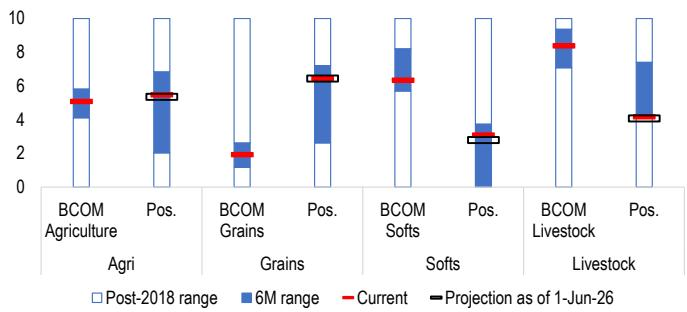

bar

| Category       | Sub-category         | Current | Projection as of 1-Jun-26 |
| -------------- | ------------------- | ------- | ------------------------- |
| Agri           | BCOM Agriculture    | 5.0     | 5.0                       |
| Agri           | Pos.                | 5.0     | 5.0                       |
| Grains         | BCOM Grains         | 2.0     | 2.0                       |
| Grains         | Pos.                | 7.0     | 7.0                       |
| Softs          | BCOM Softs          | 6.0     | 6.0                       |
| Softs          | Pos.                | 3.0     | 3.0                       |
| Livestock      | BCOM Livestock      | 8.0     | 8.0                       |
| Livestock      | Pos.                | 4.0     | 4.0                       |

Projections by JPM QDS Research: US exchanges data is an aggregate of Managed Money and Other Reportables, European exchanges data is an aggregate of Investment Funds and Other Financial Firms.

All data as of May 26, 2026.

Source: Exchange data, Bloomberg Finance L.P., JPM QDS and Commodities Research

Figure 46: Softs standardised level chart   
0-10 standardized scale: 0 = lowest since 2018, 10 = highest since 2018 positioning data in real USD terms   
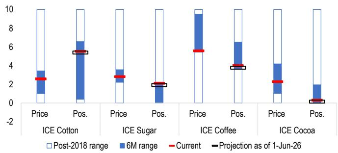

bar

| Category     | Price | Pos. |
| ------------ | ----- | ---- |
| ICE Cotton   | 10    | 10   |
| ICE Sugar    | 10    | 10   |
| ICE Coffee   | 10    | 10   |
| ICE Cocoa    | 10    | 10   |

Projections by JPM QDS Research; US exchanges data is an aggregate of Managed Money and Other Reportables, European exchanges data is an aggregate of Investment Funds and Other Financial Firms.

All data as of May 26, 2026.

Source: Exchange data, Bloomberg Finance L.P., JPM QDS and Commodities Research

Figure 48: Weekly change in total OI due to price/flows   
USD million   
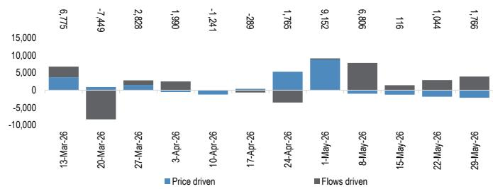

bar

| Date       | Price driven | Flows driven |
| ---------- | ------------ | ------------ |
| 13-Mar-26  | 6,775        |              |
| 20-Apr-27  | -7,449       |              |
| 9-Jun-28   | 2,828        |              |
| 17-Apr-29  | 1,990        |              |
| 24-Apr-30  | -1,241       |              |
| 17-Apr-31  | -289         |              |
| 9-Jun-32   | 1,765        |              |
| 1-May-33   | 9,152        |              |
| 22-May-34  | 6,806        |              |
| 29-May-35  | 1,16         |              |
| 30-May-36  | 1,044        |              |
| 31-May-37  | 1,766        |              |

Source: Exchange data, Bloomberg Finance L.P., JPM Commodities Research

Figure 45: Grains & oilseeds standardised level chart   
0-10 standardized scale: 0 = lowest since 2018, 10 = highest since 2018 positioning data in real USD terms   
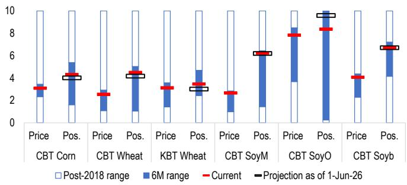

bar

| Category       | Price | Pos. |
| -------------- | ----- | ---- |
| CBT Corn       | 10    | 10   |
| CBT Wheat      | 10    | 10   |
| KBT Wheat      | 10    | 10   |
| CBT SoyM       | 10    | 10   |
| CBT SoyO       | 10    | 10   |
| CBT Soyb       | 10    | 10   |

Projections by JPM QDS Research; US exchanges data is an aggregate of Managed Money and Other Reportables, European exchanges data is an aggregate of Investment Funds and Other Financial Firms.

All data as of May 26, 2026.

Source: Exchange data, Bloomberg Finance L.P., JPM QDS and Commodities Research

Figure 47: Livestock standardised level chart   
0-10 standardized scale: 0 = lowest since 2018, 10 = highest since 2018 positioning data in real USD terms   
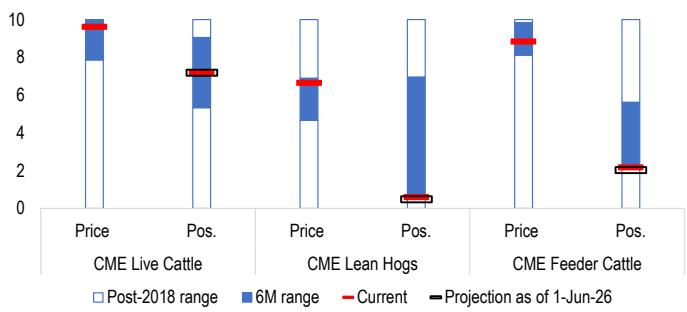

bar_stacked

| Category | Position | Post-2018 range | 6M range | Current | Projection as of 1-Jun-26 |
| :--- | :--- | :--- | :--- | :--- | :--- |
| CME Live Cattle | Price | 7.5 | 3.0 | 1.0 | 0.0 |
| CME Live Cattle | Pos. | 5.0 | 4.0 | 1.0 | 0.0 |
| CME Lean Hogs | Price | 4.5 | 3.5 | 1.0 | 0.0 |
| CME Lean Hogs | Pos. | 3.0 | 7.0 | 0.5 | 0.0 |
| CME Feeder Cattle | Price | 8.0 | 1.0 | 1.0 | 0.0 |
| CME Feeder Cattle | Pos. | 9.5 | 5.5 | 1.0 | 2.0 |

Projections by JPM QDS Research; US exchanges data is an aggregate of Managed Money and Other Reportables, European exchanges data is an aggregate of Investment Funds and Other Financial Firms.

All data as of May 26, 2026.

Source: Exchange data, Bloomberg Finance L.P., JPM QDS and Commodities Research

Figure 49: Weekly change in total OI from changes in prices   
USD million   
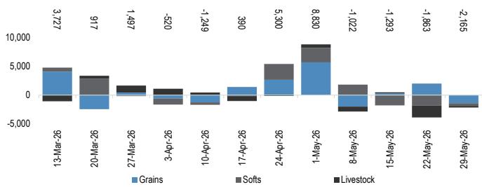

bar_stacked

| Date | Grains | Softs | Livestock |
|---|---|---|---|
| Mar-Mar-26 | 3,727 | | |
| Apr-Mar-26 | 917 | | |
| May-Apr-26 | 1,497 | | |
| Jun-Apr-26 | -520 | | |
| Jul-Apr-26 | -1,249 | | |
| Aug-Apr-26 | 390 | | |
| Sep-Apr-26 | 5,300 | | |
| Oct-Apr-26 | 8,830 | | |
| Nov-Apr-26 | -1,022 | | |
| Dec-Apr-26 | -1,293 | | |
| Jan-May-26 | -1,863 | | |
| Feb-May-26 | -2,165 | | |

Source: Exchange data, Bloomberg Finance L.P., JPM Commodities Research

Figure 50: Weekly change in total OI from changes in contracts (flows) USD million   
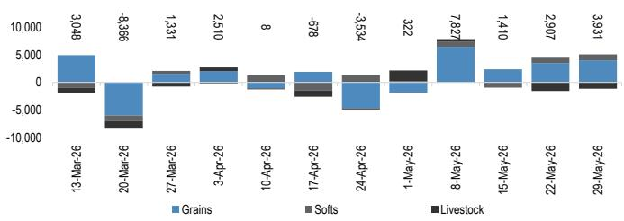

bar_stacked

| Date | Grains (b'b) | Softs (b'b) | Livestock (b'b) |
| :--- | :--- | :--- | :--- |
| 13-Mar-26 | 3,048 | -150 | -100 |
| 20-Mar-26 | -8,366 | -250 | -700 |
| 27-Mar-26 | 1,331 | -100 | -100 |
| 3-Apr-26 | 2,510 | -50 | -50 |
| 10-Apr-26 | 8 | -100 | -50 |
| 17-Apr-26 | -578 | -150 | -250 |
| 24-Apr-26 | -3,534 | -100 | -400 |
| 1-May-26 | 322 | -50 | -100 |
| 8-May-26 | 7,829 | 500 | 100 |
| 15-May-26 | 1,410 | -50 | -50 |
| 22-May-26 | 2,907 | -50 | -100 |
| 29-May-26 | 3,931 | -50 | -100 |

Source: Exchange data, Bloomberg Finance L.P., JPM Commodities Research

Figure 51: Weekly change in total OI from changes in contracts (flows) - grains and oilseeds   
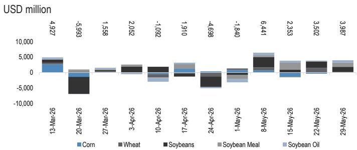

bar_stacked

| Date | Corn (USD million) | Wheat (USD million) | Soybeans (USD million) | Soybean Meal (USD million) | Soybean Oil (USD million) |
|---|---|---|---|---|---|
| 13-May-26 | 4,927 | | | | |
| 20-May-26 | -5,993 | | | | |
| 9-Jun-26 | 1,598 | | | | |
| 17-Jul-26 | 2,052 | | | | |
| 24-Aug-26 | -1,092 | | | | |
| 10-Sep-26 | 1,910 | | | | |
| 17-Oct-26 | -4,698 | | | | |
| 24-Nov-26 | -1,840 | | | | |
| 1-May-27 | 6,441 | | | | |
| 8-Jun-27 | 2,353 | | | | |
| 15-Jul-27 | 3,502 | | | | |
| 22-Aug-27 | 3,987 | | | | |
The chart displays a stacked bar chart with each category representing the total value for that date. The values are in USD million. The data is already in English. The chart type is a single series.

Source: Exchange data, Bloomberg Finance L.P., JPM Commodities Research

Figure 52: Weekly change in total OI from changes in contracts (flows)-softs and livestock   
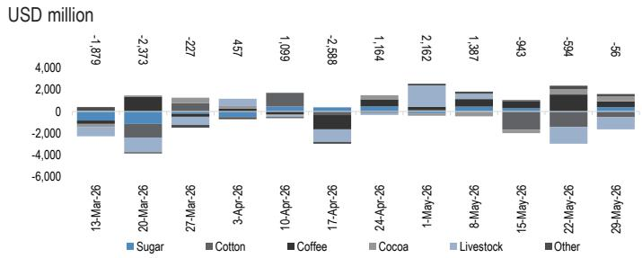

bar_stacked

| Date | Sugar (USD million) | Cotton (USD million) | Coffee (USD million) | Cocoa (USD million) | Livestock (USD million) | Other (USD million) |
|---|---|---|---|---|---|---|
| 13-Mar-26 | -1879 | | | | | |
| 20-Mar-26 | -2,373 | | | | | |
| 27-Mar-26 | | | | | | |
| 3-Apr-26 | | | | | | |
| 10-Apr-26 | | | | | | |
| 17-Apr-26 | | | | | | |
| 24-Apr-26 | | | | | | |
| 1-May-26 | | | | | | |
| 8-May-26 | | | | | | |
| 15-May-26 | | | | | | |
| 22-May-26 | | | | | | |
| 29-May-26 | | | | | | |
| 1-Mar-27 | | | | | | |
| 2-Jun-27 | | | | | | |
| 8-Jun-27 | | | | | | |
| 15-Jun-27 | -963 | | | | | |
| 22-Jun-27 | -564 | | | | | |
| 29-Jun-27 | -56 | | | | | |
The chart displays a series of values for each commodity category across multiple dates. The values are labeled on the bars. The data is extracted from the provided image.

Source: Exchange data, Bloomberg Finance L.P., JPM Commodities Research

# Appendix - Summary of CFTC disaggregated data by commodity and group

# ICE Brent crude oil

Contracts (futures and options) 

<table><tr><td rowspan="2" colspan="2"></td><td colspan="3">PMPU</td><td colspan="3">Swap Dealers</td><td colspan="3">Managed Money</td><td colspan="3">Other Reportables</td><td colspan="3">Non-Reportables</td></tr><tr><td>25-May-26</td><td>18-May-26</td><td>Wkly Chg</td><td>25-May-26</td><td>18-May-26</td><td>Wkly Chg</td><td>25-May-26</td><td>18-May-26</td><td>Wkly Chg</td><td>25-May-26</td><td>18-May-26</td><td>Wkly Chg</td><td>25-May-26</td><td>18-May-26</td><td>Wkly Chg</td></tr><tr><td rowspan="5">ICE</td><td>BRENT CRUDE OIL</td><td></td><td></td><td></td><td></td><td></td><td></td><td></td><td></td><td></td><td></td><td></td><td></td><td></td><td></td><td></td></tr><tr><td>Long</td><td>1,018,974</td><td>970,482</td><td>48,492</td><td>396,723</td><td>404,051</td><td>-7,328</td><td>435,594</td><td>432,754</td><td>2,840</td><td>277,250</td><td>278,846</td><td>-1,596</td><td>89,237</td><td>84,318</td><td>4,919</td></tr><tr><td>Short</td><td>1,657,129</td><td>1,616,620</td><td>40,509</td><td>104,420</td><td>110,893</td><td>-6,473</td><td>100,306</td><td>86,949</td><td>13,357</td><td>300,839</td><td>303,443</td><td>-2,604</td><td>55,084</td><td>52,546</td><td>2,538</td></tr><tr><td>Net Position</td><td>-638,155</td><td>-646,138</td><td>7,983</td><td>292,303</td><td>293,158</td><td>-855</td><td>335,288</td><td>345,805</td><td>-10,517</td><td>-23,589</td><td>-24,597</td><td>1,008</td><td>34,153</td><td>31,772</td><td>2,381</td></tr><tr><td>Spreading</td><td></td><td></td><td></td><td>493,449</td><td>461,274</td><td>32,175</td><td>452,412</td><td>435,471</td><td>16,941</td><td>849,732</td><td>850,471</td><td>-739</td><td></td><td></td><td></td></tr></table>

Source: CFTC, JPM Commodities Research. Note: contracts are shown as reported by the CFTC—each reported spreading contract actually represents two positions (a long and a short), an important fact for accurately calculating actual open interest.

Figure 53: Weekly change in open interest by trading group   
US\$ million (futures and options)   
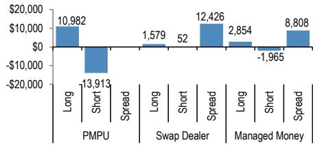

bar

| Category | Long ($) | Short ($) | Spread ($) |
| :--- | :--- | :--- | :--- |
| PMPU | 10,982 | -13,913 | |
| Swap Dealer | 1,579 | 52 | 12,426 |
| Managed Money | 2,854 | -1,965 | 8,808 |

Source: CFTC, ICE, JPM Commodities Research

Figure 55: Weekly change in OI from changes in contracts & price   
US\$ million (futures and options)   
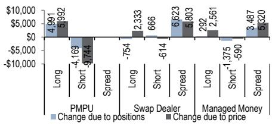

bar

| Category       | Long   | Short  | Spread |
| -------------- | ------ | ------ | ------ |
| PMPU           | 4,991  | -4,169 | -3,748 |
| Swap Dealer    | 5,992  | 666    | -614   |
| Managed Money  | 2,561  | 2,333  | 6,623  |
| PMPU           | -      | -      | -      |
| Swap Dealer    | 5,803  | -      | -      |
| Managed Money  | -      | -      | -      |
| PMPU           | -      | -      | -      |
| Swap Dealer    | -      | -      | -      |
| Managed Money  | -      | -      | -      |
| PMPU           | -      | -      | -      |
| Swap Dealer    | -      | -      | -      |
| Managed Money  | -      | -      | -      |
| PMPU           | -      | -      | -      |
| Swap Dealer    | -      | -      | -      |
| Managed Money  | -1,375 | -590   | 3,487  |
| Managed Money  | -      | -      | 5,320  |

Source: CFTC, ICE, JPM Commodities Research

Figure 57: Seasonal Managed Money net length   
Lots (1,000)   
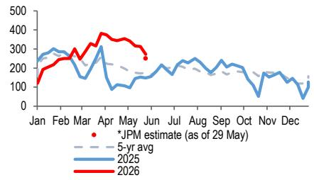

line

| Month | *JPM estimate (as of 29 May) | 5-yr avg | 2025 | 2026 |
|-------|-----------------------------|----------|------|------|
| Jan   | ~150                        | ~250     | ~280 | ~180 |
| Feb   | ~200                        | ~270     | ~300 | ~220 |
| Mar   | ~250                        | ~280     | ~320 | ~250 |
| Apr   | ~300                        | ~300     | ~350 | ~380 |
| May   | ~280                        | ~250     | ~280 | ~350 |
| Jun   | ~250                        | ~220     | ~250 | ~300 |
| Jul   | ~220                        | ~200     | ~220 | ~280 |
| Aug   | ~200                        | ~180     | ~200 | ~250 |
| Sep   | ~180                        | ~160     | ~180 | ~220 |
| Oct   | ~160                        | ~140     | ~160 | ~200 |
| Nov   | ~140                        | ~120     | ~140 | ~180 |
| Dec   | ~120                        | ~100     | ~120 | ~160 |

Source: CFTC, ICE, JPM Commodities Research, \*Forecasts supplied by JPM GQDS Research, see methodology here

Figure 54: Gross PMPU position and price   
LHS: lots (1,000), RHS: USD/bbl   
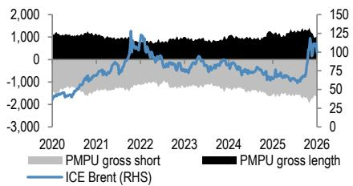

line

| Year | PMPU gross short | PMPU gross length | ICE Brent (RHS) |
|------|------------------|-------------------|-----------------|
| 2020 | -2,000           | 1,000             | -               |
| 2021 | -1,000           | 1,000             | -               |
| 2022 | -500             | 1,500             | 150             |
| 2023 | -1,000           | 1,000             | -               |
| 2024 | -500             | 1,000             | -               |
| 2025 | -1,000           | 1,000             | -               |
| 2026 | -2,000           | 1,500             | 150             |

Source: CFTC, ICE, JPM Commodities Research

Figure 56: Open interest share by trader type   
%   
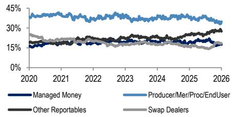

line

| Year | Managed Money | Producer/Mer/Proc/EndUser | Other Reportables | Swap Dealers |
|------|---------------|--------------------------|-------------------|--------------|
| 2020 | ~15%          | ~40%                     | ~15%              | ~25%         |
| 2021 | ~15%          | ~40%                     | ~15%              | ~25%         |
| 2022 | ~15%          | ~40%                     | ~15%              | ~25%         |
| 2023 | ~15%          | ~40%                     | ~15%              | ~25%         |
| 2024 | ~15%          | ~40%                     | ~15%              | ~25%         |
| 2025 | ~15%          | ~40%                     | ~15%              | ~25%         |
| 2026 | ~15%          | ~35%                     | ~30%              | ~20%         |

Source: CFTC, ICE, JPM Commodities Research

Figure 58: Price momentum   
LHS: Z-score, RHS: USD/bbl   
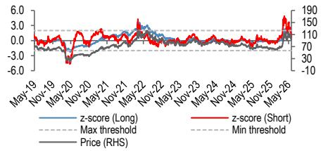

line

| Date    | z-score (Long) | z-score (Short) | Price (RHS) |
|---------|----------------|-----------------|-------------|
| May-19  | ~0.0           | ~0.0            | ~0.0        |
| Nov-19  | ~0.0           | ~0.0            | ~0.0        |
| May-20  | ~-3.0          | ~-3.0           | ~-3.0       |
| Nov-20  | ~0.0           | ~0.0            | ~0.0        |
| May-21  | ~0.0           | ~0.0            | ~0.0        |
| Nov-21  | ~0.0           | ~0.0            | ~0.0        |
| May-22  | ~3.0           | ~3.0            | ~3.0        |
| Nov-22  | ~3.0           | ~3.0            | ~3.0        |
| May-23  | ~3.0           | ~3.0            | ~3.0        |
| Nov-23  | ~3.0           | ~3.0            | ~3.0        |
| May-24  | ~3.0           | ~3.0            | ~3.0        |
| Nov-24  | ~3.0           | ~3.0            | ~3.0        |
| May-25  | ~3.0           | ~3.0            | ~3.0        |
| Nov-25  | ~3.0           | ~3.0            | ~3.0        |
| May-26  | ~190           | ~190            | ~190        |

Source: ICE, Bloomberg Finance L.P., JPM Commodities Research

# NYM WTI crude oil

Contracts (futures and options) 

<table><tr><td rowspan="2" colspan="2"></td><td colspan="3">PMPU</td><td colspan="3">Swap Dealers</td><td colspan="3">Managed Money</td><td colspan="3">Other Reportables</td><td colspan="3">Non-Reportables</td></tr><tr><td>25-May-26</td><td>18-May-26</td><td>Wkly Chg</td><td>25-May-26</td><td>18-May-26</td><td>Wkly Chg</td><td>25-May-26</td><td>18-May-26</td><td>Wkly Chg</td><td>25-May-26</td><td>18-May-26</td><td>Wkly Chg</td><td>25-May-26</td><td>18-May-26</td><td>Wkly Chg</td></tr><tr><td>NYM</td><td>WTI CRUDE OIL</td><td></td><td></td><td></td><td></td><td></td><td></td><td></td><td></td><td></td><td></td><td></td><td></td><td></td><td></td><td></td></tr><tr><td></td><td>Long</td><td>768,194</td><td>818,972</td><td>-50,778</td><td>81,087</td><td>87,597</td><td>-6,510</td><td>216,414</td><td>214,128</td><td>2,286</td><td>175,550</td><td>193,696</td><td>-18,146</td><td>95,362</td><td>100,293</td><td>-4,931</td></tr><tr><td></td><td>Short</td><td>381,746</td><td>449,114</td><td>-67,368</td><td>753,833</td><td>750,947</td><td>2,886</td><td>77,640</td><td>84,545</td><td>-6,905</td><td>60,800</td><td>61,628</td><td>-828</td><td>62,589</td><td>68,451</td><td>-5,862</td></tr><tr><td></td><td>Net Position</td><td>386,448</td><td>369,858</td><td>16,590</td><td>-672,746</td><td>-663,350</td><td>-9,396</td><td>138,774</td><td>129,583</td><td>9,191</td><td>114,750</td><td>132,068</td><td>-17,318</td><td>32,773</td><td>31,842</td><td>931</td></tr><tr><td></td><td>Spreading</td><td></td><td></td><td></td><td>266,138</td><td>318,589</td><td>-52,451</td><td>440,617</td><td>488,808</td><td>-48,191</td><td>735,167</td><td>810,406</td><td>-75,239</td><td></td><td></td><td></td></tr></table>

Source: CFTC, JPM Commodities Research. Note: contracts are shown as reported by the CFTC—each reported spreading contract actually represents two positions (a long and a short), an important fact for accurately calculating actual open interest.

Figure 59: Weekly change in open interest by trading group   
US\$ million (futures and options)   
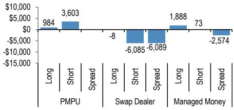

bar

| Category | Long ($) | Short ($) | Spread ($) |
| :--- | :--- | :--- | :--- |
| PMPU | 984 | 3,603 | |
| Swap Dealer | -8 | -6,085 | -6,089 |
| Managed Money | 1,888 | 73 | -2,574 |

Source: CFTC, NYMEX, JPM Commodities Research

Figure 61: Weekly change in OI from changes in contracts & price   
US\$ million (futures and options)   
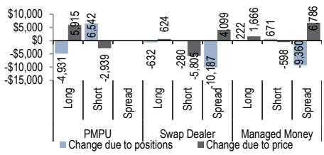  
Source: CFTC, NYMEX, JPM Commodities Research

Figure 63: Seasonal Managed Money net length   
Lots (1,000)   
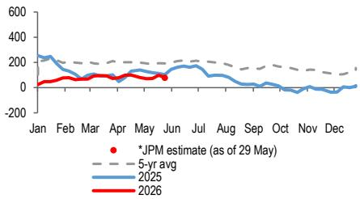

line

| Month | *JPM estimate (as of 29 May) | 5-yr avg | 2025 | 2026 |
|-------|-----------------------------|----------|------|------|
| Jan   | ~100                        | ~200     | ~250 | ~50  |
| Feb   | ~100                        | ~180     | ~200 | ~70  |
| Mar   | ~100                        | ~160     | ~150 | ~80  |
| Apr   | ~100                        | ~140     | ~100 | ~90  |
| May   | ~100                        | ~120     | ~80  | ~100 |
| Jun   | ~100                        | ~100     | ~150 | ~80  |
| Jul   | ~100                        | ~80      | ~120 | ~60  |
| Aug   | ~100                        | ~60      | ~80  | ~40  |
| Sep   | ~100                        | ~40      | ~60  | ~30  |
| Oct   | ~100                        | ~20      | ~40  | ~20  |
| Nov   | ~100                        | ~10      | ~20  | ~10  |
| Dec   | ~100                        | ~5       | ~10  | ~5   |

Source: CFTC, NYMEX, JPM Commodities Research, \*Forecasts supplied by JPM GQDS Research, see methodology here

Figure 60: Gross PMPU position and price   
LHS: lots (1,000), RHS: USD/bbl   
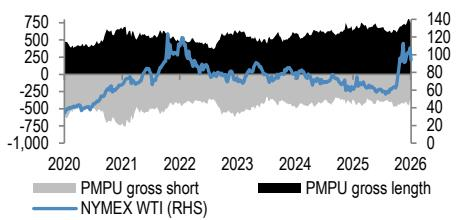

line

| Year | PMPU gross short | PMPU gross length | NYMEX WTI (RHS) |
|------|------------------|-------------------|-----------------|
| 2020 | -500             | 500               | -750            |
| 2021 | -250             | 750               | -500            |
| 2022 | 0                | 100               | 0               |
| 2023 | 250              | 125               | 250             |
| 2024 | 500              | 150               | 500             |
| 2025 | 750              | 175               | 750             |
| 2026 | 1000             | 200               | 1000            |

Source: CFTC, NYMEX, JPM Commodities Research

Figure 62: Open interest share by trader type   
%   
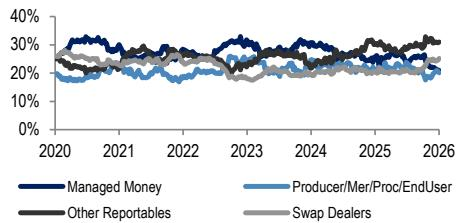

line

| Year | Managed Money | Producer/Mer/Proc/EndUser | Other Reportables | Swap Dealers |
|------|---------------|--------------------------|-------------------|--------------|
| 2020 | ~30%          | ~20%                     | ~25%              | ~25%         |
| 2021 | ~30%          | ~20%                     | ~25%              | ~25%         |
| 2022 | ~30%          | ~20%                     | ~25%              | ~25%         |
| 2023 | ~30%          | ~20%                     | ~25%              | ~25%         |
| 2024 | ~30%          | ~20%                     | ~25%              | ~25%         |
| 2025 | ~30%          | ~20%                     | ~25%              | ~25%         |
| 2026 | ~30%          | ~20%                     | ~25%              | ~25%         |

Source: CFTC, NYMEX, JPM Commodities Research

Figure 64: Price momentum   
LHS: Z-score, RHS: USD/bbl   
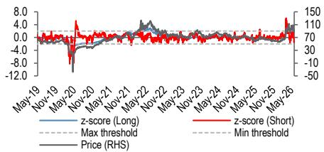

line

| Date    | z-score (Long) | z-score (Short) | Max threshold | Min threshold | Price (RHS) |
|---------|----------------|-----------------|---------------|---------------|-------------|
| May-19  | ~0.0           | ~0.0            | ~0.0          | ~0.0          | ~0.0        |
| Nov-19  | ~0.0           | ~0.0            | ~0.0          | ~0.0          | ~0.0        |
| May-20  | ~-4.0          | ~-8.0           | ~-4.0         | ~-8.0         | ~-8.0       |
| Nov-20  | ~0.0           | ~0.0            | ~0.0          | ~0.0          | ~0.0        |
| May-21  | ~0.0           | ~0.0            | ~0.0          | ~0.0          | ~0.0        |
| Nov-21  | ~0.0           | ~0.0            | ~0.0          | ~0.0          | ~0.0        |
| May-22  | ~0.0           | ~0.0            | ~0.0          | ~0.0          | ~0.0        |
| Nov-22  | ~0.0           | ~0.0            | ~0.0          | ~0.0          | ~0.0        |
| May-23  | ~0.0           | ~0.0            | ~0.0          | ~0.0          | ~0.0        |
| Nov-23  | ~0.0           | ~0.0            | ~0.0          | ~0.0          | ~0.0        |
| May-24  | ~0.0           | ~0.0            | ~0.0          | ~0.0          | ~0.0        |
| Nov-24  | ~0.0           | ~0.0            | ~0.0          | ~0.0          | ~0.0        |
| May-25  | ~0.0           | ~0.0            | ~0.0          | ~0.0          | ~0.0        |
| Nov-25  | ~0.0           | ~0.0            | ~0.0          | ~0.0          | ~0.0        |
| May-26  | ~115           | ~115            | ~115          | ~115          | ~115        |

Source: NYMEX, Bloomberg Finance L.P., JPM Commodities Research

# NYM RBOB Gasoline

Contracts (futures and options) 

<table><tr><td rowspan="2" colspan="2"></td><td colspan="3">PMPU</td><td colspan="3">Swap Dealers</td><td colspan="3">Managed Money</td><td colspan="3">Other Reportables</td><td colspan="3">Non-Reportables</td></tr><tr><td>25-May-26</td><td>18-May-26</td><td>Wkly Chg</td><td>25-May-26</td><td>18-May-26</td><td>Wkly Chg</td><td>25-May-26</td><td>18-May-26</td><td>Wkly Chg</td><td>25-May-26</td><td>18-May-26</td><td>Wkly Chg</td><td>25-May-26</td><td>18-May-26</td><td>Wkly Chg</td></tr><tr><td>NYM</td><td>RBOB GASOLINE</td><td></td><td></td><td></td><td></td><td></td><td></td><td></td><td></td><td></td><td></td><td></td><td></td><td></td><td></td><td></td></tr><tr><td></td><td>Long</td><td>102,910</td><td>111,320</td><td>-8,410</td><td>38,381</td><td>37,856</td><td>525</td><td>68,870</td><td>68,977</td><td>-107</td><td>11,833</td><td>11,842</td><td>-9</td><td>27,399</td><td>28,128</td><td>-729</td></tr><tr><td></td><td>Short</td><td>181,837</td><td>191,151</td><td>-9,314</td><td>24,421</td><td>29,032</td><td>-4,611</td><td>6,241</td><td>5,234</td><td>1,007</td><td>22,913</td><td>20,556</td><td>2,357</td><td>13,982</td><td>12,150</td><td>1,832</td></tr><tr><td></td><td>Net Position</td><td>-78,927</td><td>-79,831</td><td>904</td><td>13,960</td><td>8,824</td><td>5,136</td><td>62,629</td><td>63,743</td><td>-1,114</td><td>-11,080</td><td>-8,714</td><td>-2,366</td><td>13,417</td><td>15,978</td><td>-2,561</td></tr><tr><td></td><td>Spreading</td><td></td><td></td><td></td><td>10,513</td><td>10,996</td><td>-483</td><td>28,917</td><td>28,592</td><td>325</td><td>33,593</td><td>32,371</td><td>1,222</td><td></td><td></td><td></td></tr></table>

Source: CFTC, JPM Commodities Research. Note: contracts are shown as reported by the CFTC—each reported spreading contract actually represents two positions (a long and a short), an important fact for accurately calculating actual open interest.

Figure 65: Weekly change in open interest by trading group   
US\$ million (futures and options)   
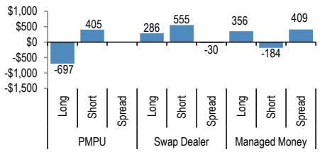

bar

| Category | Long | Short | Spread |
| :--- | :--- | :--- | :--- |
| PMPU | -697 | 405 | |
| Swap Dealer | 286 | 555 | -30 |
| Managed Money | 356 | -184 | 409 |

Source: CFTC, NYMEX, JPM Commodities Research

Figure 67: Weekly change in OI from changes in contracts & price   
US\$ million (futures and options)   
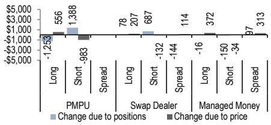

bar

| Category       | Change due to positions | Change due to price |
| -------------- | ------------------------ | --------------------- |
| PMPU           | -1,253                   | 556                   |
| Swap Dealer    | -983                     | 1,388                 |
| Managed Money  | -132                     | 78                    |
|                  | -144                     | 207                   |
|                  | -16                      | 687                   |
|                  | -150                     | 372                   |
|                  | -34                      | 97                    |
|                  | 313                      | 313                   |

Source: CFTC, NYMEX, JPM Commodities Research

Figure 69: Seasonal Managed Money net length   
Lots (1,000)   
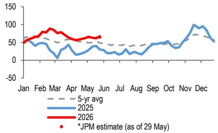

line

| Month | 2025 | 2026 | JPM estimate (as of 29 May) |
|-------|------|------|-----------------------------|
| Jan   | ~50  | ~70  | ~50                         |
| Feb   | ~40  | ~80  | ~60                         |
| Mar   | ~30  | ~90  | ~70                         |
| Apr   | ~40  | ~70  | ~60                         |
| May   | ~50  | ~60  | ~50                         |
| Jun   | ~40  | ~70  | ~60                         |
| Jul   | ~30  | ~60  | ~50                         |
| Aug   | ~40  | ~70  | ~60                         |
| Sep   | ~50  | ~80  | ~70                         |
| Oct   | ~60  | ~90  | ~80                         |
| Nov   | ~70  | ~100 | ~90                         |
| Dec   | ~60  | ~80  | ~70                         |

Source: CFTC, NYMEX, JPM Commodities Research, \*Forecasts supplied by JPM GQDS Research, see methodology here

Figure 66: Gross PMPU position and price   
LHS: lots (1,000), RHS: USc/gal  
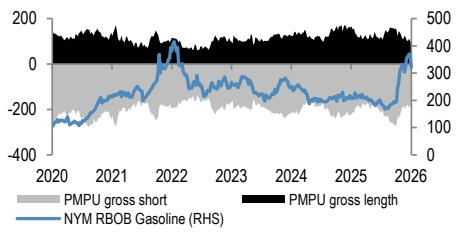

line

| Year | PMPU gross short | PMPU gross length | NYM RBOB Gasoline (RHS) |
|------|------------------|-------------------|--------------------------|
| 2020 | -300             | 100               | -200                     |
| 2021 | -100             | 50                | -100                     |
| 2022 | 0                | 0                 | 0                        |
| 2023 | -50              | 50                | -50                      |
| 2024 | -100             | 100               | -100                     |
| 2025 | -150             | 150               | -150                     |
| 2026 | -200             | 200               | -200                     |

Source: CFTC, NYMEX, JPM Commodities Research

Figure 68: Open interest share by trader type   
%   
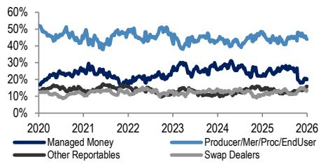

line

| Year | Managed Money | Producer/Mer/Proc/EndUser | Other Reportables | Swap Dealers |
|------|---------------|--------------------------|-------------------|--------------|
| 2020 | ~20%          | ~50%                     | ~10%              | ~10%         |
| 2021 | ~25%          | ~45%                     | ~10%              | ~10%         |
| 2022 | ~20%          | ~45%                     | ~10%              | ~10%         |
| 2023 | ~25%          | ~45%                     | ~10%              | ~10%         |
| 2024 | ~25%          | ~45%                     | ~10%              | ~10%         |
| 2025 | ~20%          | ~45%                     | ~10%              | ~10%         |
| 2026 | ~15%          | ~45%                     | ~10%              | ~10%         |

Source: CFTC, NYMEX, JPM Commodities Research

Figure 70: Price momentum   
LHS: Z-score, RHS: USc/gal  
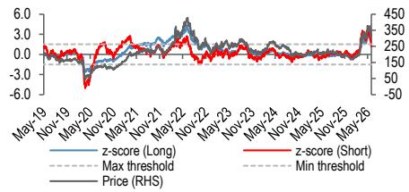

line

| Date    | z-score (Long) | z-score (Short) | Price (RHS) |
|---------|----------------|-----------------|-------------|
| May-19  | 0.0            | 0.0             | 0.0         |
| Nov-19  | 0.0            | 0.0             | 0.0         |
| May-20  | -3.0           | -3.0            | -3.0        |
| Nov-20  | 0.0            | 0.0             | 0.0         |
| May-21  | 0.0            | 0.0             | 0.0         |
| Nov-21  | 0.0            | 0.0             | 0.0         |
| May-22  | 3.0            | 3.0             | 3.0         |
| Nov-22  | 0.0            | 0.0             | 0.0         |
| May-23  | 0.0            | 0.0             | 0.0         |
| Nov-23  | 0.0            | 0.0             | 0.0         |
| May-24  | 0.0            | 0.0             | 0.0         |
| Nov-24  | 0.0            | 0.0             | 0.0         |
| May-25  | 0.0            | 0.0             | 0.0         |
| Nov-25  | 0.0            | 0.0             | 0.0         |
| May-26  | 3.5            | 3.5             | 3.5         |

Source: NYMEX, Bloomberg Finance L.P., JPM Commodities Research

# ICE Gasoil

Contracts (futures and options) 

<table><tr><td rowspan="2" colspan="2"></td><td colspan="3">PMPU</td><td colspan="3">Swap Dealers</td><td colspan="3">Managed Money</td><td colspan="3">Other Reportables</td><td colspan="3">Non-Reportables</td></tr><tr><td>25-May-26</td><td>18-May-26</td><td>Wkly Chg</td><td>25-May-26</td><td>18-May-26</td><td>Wkly Chg</td><td>25-May-26</td><td>18-May-26</td><td>Wkly Chg</td><td>25-May-26</td><td>18-May-26</td><td>Wkly Chg</td><td>25-May-26</td><td>18-May-26</td><td>Wkly Chg</td></tr><tr><td>ICE</td><td>GAS OIL</td><td></td><td></td><td></td><td></td><td></td><td></td><td></td><td></td><td></td><td></td><td></td><td></td><td></td><td></td><td></td></tr><tr><td></td><td>Long</td><td>227,550</td><td>224,665</td><td>2,885</td><td>268,653</td><td>268,407</td><td>246</td><td>95,439</td><td>95,195</td><td>244</td><td>29,996</td><td>34,636</td><td>-4,640</td><td>56,804</td><td>53,397</td><td>3,407</td></tr><tr><td></td><td>Short</td><td>258,192</td><td>251,839</td><td>6,353</td><td>16,205</td><td>14,386</td><td>1,819</td><td>36,785</td><td>35,399</td><td>1,386</td><td>334,540</td><td>342,806</td><td>-8,266</td><td>32,720</td><td>31,870</td><td>850</td></tr><tr><td></td><td>Net Position</td><td>-30,642</td><td>-27,174</td><td>-3,468</td><td>252,448</td><td>254,021</td><td>-1,573</td><td>58,654</td><td>59,796</td><td>-1,142</td><td>-304,544</td><td>-308,170</td><td>3,626</td><td>24,084</td><td>21,527</td><td>2,557</td></tr><tr><td></td><td>Spreading</td><td></td><td></td><td></td><td>91,608</td><td>92,275</td><td>-667</td><td>61,329</td><td>60,505</td><td>824</td><td>134,172</td><td>129,771</td><td>4,401</td><td></td><td></td><td></td></tr></table>

Source: CFTC, JPM Commodities Research. Note: contracts are shown as reported by the CFTC—each reported spreading contract actually represents two positions (a long and a short), an important fact for accurately calculating actual open interest.

Figure 71: Weekly change in open interest by trading group   
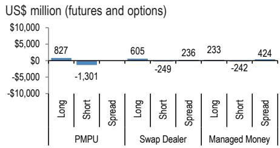

bar

| Category | Long ($) | Short ($) | Spread ($) |
| :--- | :--- | :--- | :--- |
| PMPU | 827 | -1,301 | |
| Swap Dealer | 605 | -249 | 236 |
| Managed Money | 233 | -242 | 424 |

Source: CFTC, ICE, JPM Commodities Research

Figure 73: Weekly change in OI from changes in contracts & price   
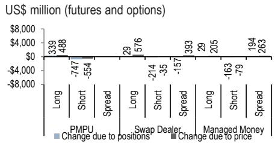

bar

| Category | Long | Short | Spread |
| -------- | ---- | ----- | ------ |
| PMPU Change due to positions | 339 | -747 | -554 |
| PMPU Change due to price | 488 | 29 | 576 |
| Swap Dealer | 29 | -214 | -35 |
| Managed Money | 393 | 29 | 205 |
| Swap Dealer | -163 | -79 | 194 |
| Managed Money | 263 | 194 | 263 |

Source: CFTC, ICE, JPM Commodities Research

Figure 75: Seasonal Managed Money net length   
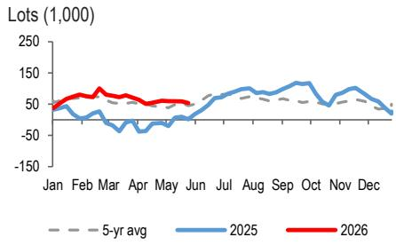

line

| Month | 2025  | 2026  | 5-yr avg |
|-------|-------|-------|----------|
| Jan   | ~40   | ~50   | ~40      |
| Feb   | ~30   | ~60   | ~40      |
| Mar   | ~20   | ~70   | ~40      |
| Apr   | ~10   | ~60   | ~40      |
| May   | ~0    | ~50   | ~40      |
| Jun   | ~-10  | ~40   | ~40      |
| Jul   | ~-20  | ~50   | ~40      |
| Aug   | ~-10  | ~60   | ~40      |
| Sep   | ~-5   | ~70   | ~40      |
| Oct   | ~-10  | ~60   | ~40      |
| Nov   | ~-20  | ~50   | ~40      |
| Dec   | ~-30  | ~40   | ~40      |

Source: CFTC, ICE, JPM Commodities Research

Figure 72: Gross PMPU position and price   
LHS: lots (1,000), RHS: USD/T   
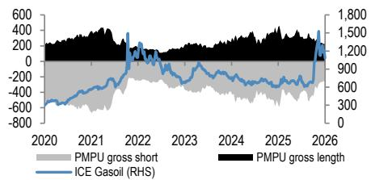

line

| Year | PMPU gross short | PMPU gross length | ICE Gasoil (RHS) |
|------|------------------|-------------------|------------------|
| 2020 | -500             | 300               | -600             |
| 2021 | -400             | 400               | -400             |
| 2022 | -300             | 500               | -200             |
| 2023 | -200             | 400               | -100             |
| 2024 | -100             | 500               | 0                |
| 2025 | 0                | 600               | 100              |
| 2026 | 100              | 700               | 200              |

Source: CFTC, ICE, JPM Commodities Research

Figure 74: Open interest share by trader type   
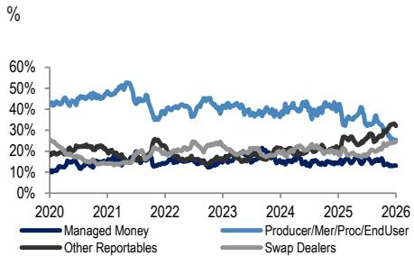

line

| Year | Managed Money | Producer/Mer/Proc/EndUser | Other Reportables | Swap Dealers |
|------|---------------|--------------------------|-------------------|--------------|
| 2020 | ~10%          | ~45%                     | ~20%              | ~25%         |
| 2021 | ~12%          | ~50%                     | ~18%              | ~22%         |
| 2022 | ~15%          | ~40%                     | ~25%              | ~20%         |
| 2023 | ~14%          | ~45%                     | ~22%              | ~25%         |
| 2024 | ~13%          | ~40%                     | ~20%              | ~22%         |
| 2025 | ~12%          | ~35%                     | ~25%              | ~20%         |
| 2026 | ~10%          | ~30%                     | ~30%              | ~25%         |

Source: CFTC, ICE, JPM Commodities Research

Figure 76: Price momentum   
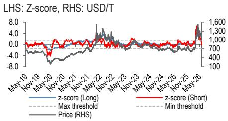

line

| Date    | z-score (Long) | z-score (Short) | Price (RHS) |
|---------|----------------|-----------------|-------------|
| May-19  | ~0.0           | ~0.0            | ~-4.0       |
| Nov-19  | ~0.0           | ~0.0            | ~-4.0       |
| May-20  | ~0.0           | ~0.0            | ~-4.0       |
| Nov-20  | ~0.0           | ~0.0            | ~-4.0       |
| May-21  | ~0.0           | ~0.0            | ~-4.0       |
| Nov-21  | ~0.0           | ~0.0            | ~-4.0       |
| May-22  | ~0.0           | ~0.0            | ~-4.0       |
| Nov-22  | ~0.0           | ~0.0            | ~-4.0       |
| May-23  | ~0.0           | ~0.0            | ~-4.0       |
| Nov-23  | ~0.0           | ~0.0            | ~-4.0       |
| May-24  | ~0.0           | ~0.0            | ~-4.0       |
| Nov-24  | ~0.0           | ~0.0            | ~-4.0       |
| May-25  | ~0.0           | ~0.0            | ~-4.0       |
| Nov-25  | ~0.0           | ~0.0            | ~-4.0       |
| May-26  | ~1,600         | ~1,300          | ~700        |

Source: ICE, Bloomberg Finance L.P., JPM Commodities Research

# NYM Natural Gas

Contracts (futures and options) 

<table><tr><td rowspan="2" colspan="2"></td><td colspan="3">PMPU</td><td colspan="3">Swap Dealers</td><td colspan="3">Managed Money</td><td colspan="3">Other Reportables</td><td colspan="3">Non-Reportables</td></tr><tr><td>25-May-26</td><td>18-May-26</td><td>Wkly Chg</td><td>25-May-26</td><td>18-May-26</td><td>Wkly Chg</td><td>25-May-26</td><td>18-May-26</td><td>Wkly Chg</td><td>25-May-26</td><td>18-May-26</td><td>Wkly Chg</td><td>25-May-26</td><td>18-May-26</td><td>Wkly Chg</td></tr><tr><td colspan="17">NYM NATURAL GAS</td></tr><tr><td></td><td>Long</td><td>238,436</td><td>250,227</td><td>-11,791</td><td>219,715</td><td>215,269</td><td>4,446</td><td>189,091</td><td>182,108</td><td>6,983</td><td>42,751</td><td>59,668</td><td>-16,917</td><td>61,063</td><td>58,208</td><td>2,855</td></tr><tr><td></td><td>Short</td><td>258,740</td><td>276,527</td><td>-17,787</td><td>27,518</td><td>29,578</td><td>-2,060</td><td>285,380</td><td>301,978</td><td>-16,598</td><td>137,070</td><td>117,068</td><td>20,002</td><td>42,348</td><td>40,330</td><td>2,018</td></tr><tr><td></td><td>Net Position</td><td>-20,304</td><td>-26,300</td><td>5,996</td><td>192,197</td><td>185,691</td><td>6,506</td><td>-96,289</td><td>-119,870</td><td>23,581</td><td>-94,319</td><td>-57,400</td><td>-36,919</td><td>18,715</td><td>17,878</td><td>837</td></tr><tr><td></td><td>Spreading</td><td></td><td></td><td></td><td>121,933</td><td>125,853</td><td>-3,920</td><td>537,968</td><td>555,020</td><td>-17,052</td><td>203,165</td><td>194,750</td><td>8,415</td><td></td><td></td><td></td></tr></table>

Source: CFTC, JPM Commodities Research. Note: contracts are shown as reported by the CFTC—each reported spreading contract actually represents two positions (a long and a short), an important fact for accurately calculating actual open interest.

Figure 77: Weekly change in open interest by trading group   
US\$ million (futures and options)   
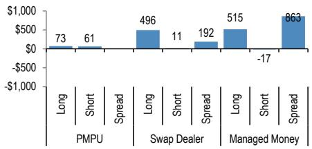

bar

| Category | Long ($) | Short ($) | Spread ($) |
| :--- | :--- | :--- | :--- |
| PMPU | 73 | 61 | |
| Swap Dealer | 496 | 11 | 192 |
| Managed Money | 515 | -17 | 863 |

Source: CFTC, NYMEX, JPM Commodities Research

Figure 79: Weekly change in OI from changes in contracts & price   
US\$ million (futures and options)   
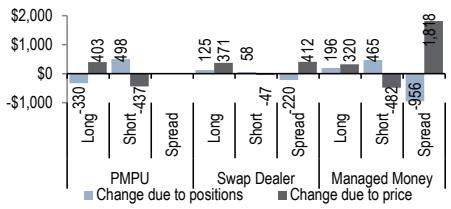

bar

| Category       | Change due to positions | Change due to price |
| -------------- | ------------------------ | --------------------- |
| PMPU           | -330                     | 403                   |
| Swap Dealer    | -47                      | 58                    |
| Managed Money  | -48.2                    | 465                   |
| PMPU Spread   | -956                     | 181                   |

Source: CFTC, NYMEX, JPM Commodities Research

Figure 81: Seasonal Managed Money net length   
Lots (1,000)   
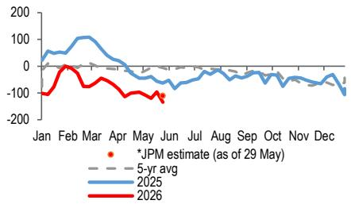

line

| Month | 2025 | 2026 |
|-------|------|------|
| Jan   | ~0   | ~-100 |
| Feb   | ~100 | ~-50  |
| Mar   | ~100 | ~-50  |
| Apr   | ~50  | ~-100 |
| May   | ~0   | ~-150 |
| Jun   | ~-50 | ~-150 |
| Jul   | ~-50 | ~-150 |
| Aug   | ~-50 | ~-150 |
| Sep   | ~-50 | ~-150 |
| Oct   | ~-50 | ~-150 |
| Nov   | ~-50 | ~-150 |
| Dec   | ~-100| ~-150 |

Source: CFTC, NYMEX, JPM Commodities Research, \*Forecasts supplied by JPM GQDS Research, see methodology here

Figure 78: Gross PMPU position and price   
LHS: lots (1,000), RHS: USD/mmbtu   
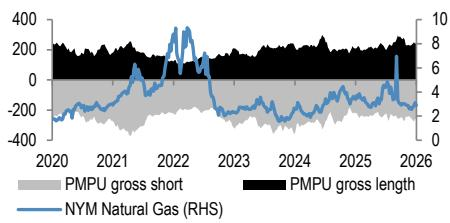

line

| Year | PMPU gross short | PMPU gross length | NYM Natural Gas (RHS) |
|------|------------------|-------------------|------------------------|
| 2020 | -300             | 8                 | -20                    |
| 2021 | -250             | 7                 | -15                    |
| 2022 | -200             | 6                 | -10                    |
| 2023 | -150             | 5                 | -5                     |
| 2024 | -100             | 4                 | 0                      |
| 2025 | -50              | 3                 | 5                      |
| 2026 | 0                | 2                 | 10                     |

Source: CFTC, NYMEX, JPM Commodities Research

Figure 80: Open interest share by trader type   
%   
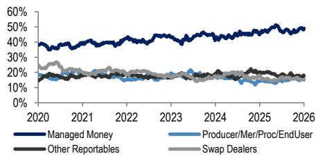

line

| Year | Managed Money | Producer/Mer/Proc/EndUser | Other Reportables | Swap Dealers |
|------|---------------|---------------------------|-------------------|--------------|
| 2020 | 35%           | 15%                       | 15%               | 20%          |
| 2021 | 40%           | 15%                       | 15%               | 20%          |
| 2022 | 45%           | 15%                       | 15%               | 20%          |
| 2023 | 48%           | 15%                       | 15%               | 20%          |
| 2024 | 50%           | 15%                       | 15%               | 20%          |
| 2025 | 52%           | 15%                       | 15%               | 20%          |
| 2026 | 55%           | 15%                       | 15%               | 20%          |

Source: CFTC, NYMEX, JPM Commodities Research

Figure 82: Price momentum   
LHS: Z-score, RHS: USD/mmbtu   
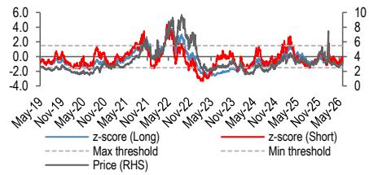

line

| Date    | Price (RHS) | z-score (Long) | z-score (Short) |
|---------|-------------|----------------|-----------------|
| May-19  | -4.0        | -2.0           | -2.0            |
| Nov-19  | -3.0        | -1.5           | -1.5            |
| May-20  | -2.0        | -1.0           | -1.0            |
| Nov-20  | -1.0        | 0.5            | 0.5             |
| May-21  | 0.5         | 1.5            | 1.5             |
| Nov-21  | 2.0         | 3.0            | 3.0             |
| May-22  | 4.0         | 4.5            | 4.5             |
| Nov-22  | 6.0         | 5.0            | 5.0             |
| May-23  | 4.0         | 3.5            | 3.5             |
| Nov-23  | 2.0         | 2.5            | 2.5             |
| May-24  | 1.0         | 1.5            | 1.5             |
| Nov-24  | 0.5         | 0.5            | 0.5             |
| May-25  | -1.0        | -1.5           | -1.5            |
| Nov-25  | -2.0        | -2.5           | -2.5            |
| May-26  | -3.0        | -3.5           | -3.5            |

Source: NYMEX, Bloomberg Finance L.P., JPM Commodities Research

# ICE Endex TTF Natgas

Contracts in MWh (futures and options) 

<table><tr><td rowspan="2"></td><td colspan="3">Commercial Undertakings</td><td colspan="3">Investment funds</td><td colspan="3">Investment/Credit firms</td><td colspan="3">Other financial institutes</td><td colspan="3">Directive Compliance Obligations</td></tr><tr><td>22-May-26</td><td>15-May-26</td><td>Wkly Chg</td><td>22-May-26</td><td>15-May-26</td><td>Wkly Chg</td><td>22-May-26</td><td>15-May-26</td><td>Wkly Chg</td><td>22-May-26</td><td>15-May-26</td><td>Wkly Chg</td><td>22-May-26</td><td>15-May-26</td><td>Wkly Chg</td></tr><tr><td colspan="16">ICE Endex TTF Natgas</td></tr><tr><td>Long</td><td>1,231,355,985</td><td>1,193,854,795</td><td>37,501,190</td><td>415,014,045</td><td>427,597,832</td><td>-12,583,787</td><td>102,901,364</td><td>98,975,628</td><td>3,925,736</td><td>875,996</td><td>868,481</td><td>7,515</td><td>0</td><td>0</td><td>0</td></tr><tr><td>Short</td><td>1,162,613,372</td><td>1,146,132,205</td><td>16,481,167</td><td>134,859,355</td><td>131,738,957</td><td>3,120,398</td><td>453,099,507</td><td>444,675,757</td><td>8,423,750</td><td>3,720</td><td>14,880</td><td>-11,160</td><td>0</td><td>0</td><td>0</td></tr><tr><td>Net Position</td><td>68,742,614</td><td>47,722,591</td><td>21,020,023</td><td>280,154,689</td><td>295,858,875</td><td>-15,704,185</td><td>-350,198,143</td><td>-345,700,129</td><td>-4,498,014</td><td>872,276</td><td>853,601</td><td>18,675</td><td>0</td><td>0</td><td>0</td></tr></table>

Source: CFTC, JPM Commodities Research. Note: contracts are shown as reported by the CFTC—each reported spreading contract actually represents two positions (a long and a short), an important fact for accurately calculating actual open interest.

Figure 83: Weekly change in open interest by trading group   
US\$ billion (futures and options, contracts in MWh)   
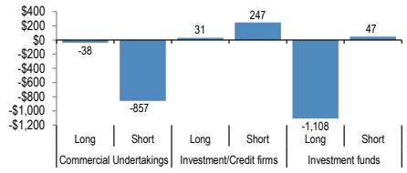

bar

| Category | Value |
|---|---|
| Long | -38 |
| Short | -857 |
| Long | 31 |
| Short | 247 |
| Long | -1,108 |
| Short | 47 |
Commercial Undertakings; Investment/Credit firms

Source: CFTC, ICE, JPM Commodities Research

Figure 85: Weekly change in OI from changes in contracts & price   
US\$ billion (futures and options, contracts in MWh)   
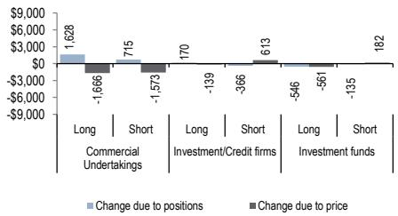

bar

| Category | Change due to positions ($) | Change due to price ($) |
| :--- | :--- | :--- |
| Long | 1,628 | -1,666 |
| Short | 715 | -1,573 |
| Commercial Undertakings | | |
| Long | -139 | -366 |
| Short | -546 | -561 |
| Investment/Credit firms | | |
| Long | 182 | |
| Short | | |
| Investment funds | | |

Source: CFTC, ICE, JPM Commodities Research

Figure 87: Seasonal Investment funds net length MWh (million)   
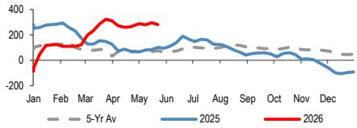

line

| Month | 5-Yr Av | 2025 | 2026 |
|-------|---------|------|------|
| Jan   | ~100    | ~250 | ~-100 |
| Feb   | ~100    | ~280 | ~100 |
| Mar   | ~100    | ~250 | ~150 |
| Apr   | ~100    | ~100 | ~300 |
| May   | ~100    | ~150 | ~250 |
| Jun   | ~100    | ~180 | ~280 |
| Jul   | ~100    | ~150 | ~250 |
| Aug   | ~100    | ~120 | ~250 |
| Sep   | ~100    | ~100 | ~250 |
| Oct   | ~100    | ~80  | ~250 |
| Nov   | ~100    | ~60  | ~250 |
| Dec   | ~100    | ~40  | ~250 |

Source: CFTC, ICE, JPM Commodities Research

Figure 84: Gross commercial position and price   
LHS: MWh (million), RHS: EUR/MWh   
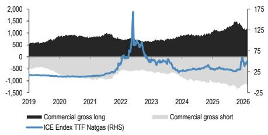

line

| Year | Commercial gross long | Commercial gross short | ICE Endex TTF Natgas (RHS) |
|------|------------------------|-------------------------|------------------------------|
| 2019 | ~500                   | ~-500                   | ~-1,000                      |
| 2020 | ~500                   | ~-500                   | ~-1,000                      |
| 2021 | ~500                   | ~-500                   | ~-1,000                      |
| 2022 | ~500                   | ~-500                   | ~-1,000                      |
| 2023 | ~1,500                 | ~-500                   | ~-500                        |
| 2024 | ~1,500                 | ~-500                   | ~-500                        |
| 2025 | ~1,500                 | ~-500                   | ~-500                        |
| 2026 | ~1,500                 | ~-500                   | ~-500                        |

Source: CFTC, ICE, JPM Commodities Research

Figure 86: Open interest share by trader type   
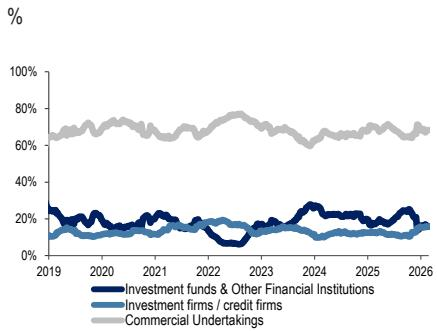

line

| Year | Investment funds & Other Financial Institutions | Investment firms / credit firms | Commercial Undertakings |
|------|--------------------------------------------------|----------------------------------|--------------------------|
| 2019 | ~25%                                             | ~15%                             | ~70%                     |
| 2020 | ~20%                                             | ~15%                             | ~75%                     |
| 2021 | ~20%                                             | ~15%                             | ~75%                     |
| 2022 | ~15%                                             | ~15%                             | ~75%                     |
| 2023 | ~15%                                             | ~15%                             | ~75%                     |
| 2024 | ~30%                                             | ~15%                             | ~70%                     |
| 2025 | ~25%                                             | ~15%                             | ~70%                     |
| 2026 | ~20%                                             | ~15%                             | ~70%                     |

Source: CFTC, ICE, JPM Commodities Research

Figure 88: Price momentum   
LHS: Z-score, RHS: EUR/Mwh   
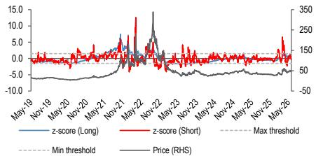

line

| Date    | z-score (Long) | z-score (Short) | Price (RHS) |
|---------|----------------|-----------------|-------------|
| May '19 | -0.5           | -0.5            | -10.0       |
| Nov '19 | 0.0            | 0.0             | -5.0        |
| May '20 | 0.5            | 0.5             | -2.5        |
| Nov '20 | 1.0            | 1.0             | -1.0        |
| May '21 | 1.5            | 1.5             | 0.5         |
| Nov '21 | 2.0            | 2.0             | 2.0         |
| May '22 | 2.5            | 2.5             | 4.0         |
| Nov '22 | 3.0            | 3.0             | 6.0         |
| May '23 | 2.5            | 2.5             | 4.5         |
| Nov '23 | 2.0            | 2.0             | 3.5         |
| May '24 | 1.5            | 1.5             | 3.0         |
| Nov '24 | 1.0            | 1.0             | 2.5         |
| May '25 | 0.5            | 0.5             | 2.0         |
| Nov '25 | 0.0            | 0.0             | 1.5         |
| May '26 | -0.5           | -0.5            | 1.0         |

Source: ICE, Bloomberg Finance L.P., JPM Commodities Research

# ICE EUA

Contracts (futures and options) 

<table><tr><td rowspan="2"></td><td colspan="3">Commercial Undertakings</td><td colspan="3">Investment funds</td><td colspan="3">Investment/Credit firms</td><td colspan="3">Other financial institutes</td><td colspan="3">Directive Compliance Obligations</td></tr><tr><td>22-May-26</td><td>15-May-26</td><td>Wkly Chg</td><td>22-May-26</td><td>15-May-26</td><td>Wkly Chg</td><td>22-May-26</td><td>15-May-26</td><td>Wkly Chg</td><td>22-May-26</td><td>15-May-26</td><td>Wkly Chg</td><td>22-May-26</td><td>15-May-26</td><td>Wkly Chg</td></tr><tr><td colspan="16">ICE EUA</td></tr><tr><td>Long</td><td>281,651</td><td>278,226</td><td>3,425</td><td>62,170</td><td>61,390</td><td>780</td><td>198,488</td><td>203,901</td><td>-5,413</td><td>2,848</td><td>2,758</td><td>90</td><td>64,780</td><td>64,154</td><td>627</td></tr><tr><td>Short</td><td>74,467</td><td>78,569</td><td>-4,103</td><td>23,082</td><td>22,724</td><td>358</td><td>495,757</td><td>492,157</td><td>3,600</td><td>514</td><td>576</td><td>-62</td><td>16,126</td><td>16,377</td><td>-251</td></tr><tr><td>Net Position</td><td>207,184</td><td>199,656</td><td>7,528</td><td>39,088</td><td>38,666</td><td>422</td><td>-297,269</td><td>-288,256</td><td>-9,013</td><td>2,334</td><td>2,182</td><td>152</td><td>48,654</td><td>47,777</td><td>877</td></tr></table>

Source: CFTC, JPM Commodities Research. Note: contracts are shown as reported by the CFTC—each reported spreading contract actually represents two positions (a long and a short), an important fact for accurately calculating actual open interest.

Figure 89: Weekly change in open interest by trading group   
US\$ million (futures and options)   
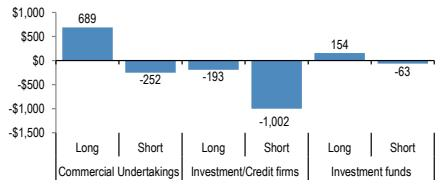

bar

| Category | Value |
|---|---|
| Long Commercial Undertakings | 689 |
| Short Commercial Undertakings | -252 |
| Long Investment/Credit firms | -193 |
| Short Investment/Credit firms | -1,002 |
| Long Investment funds | 154 |
| Short Investment funds | -63 |

Source: CFTC, ICE, JPM Commodities Research

Figure 91: Weekly change in OI from changes in contracts & price   
US\$ million (futures and options)   
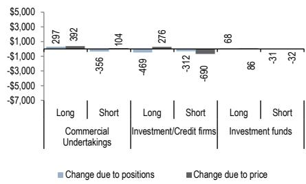

bar

| Category | Long | Short |
| -------- | ---- | ----- |
| Commercial Undertakings | 297 | -356 |
| Investment/Credit firms | -469 | -312 |
| Long | 276 | -690 |
| Investment funds | 68 | -31 |
| Short | 86 | -32 |

Source: CFTC, ICE, JPM Commodities Research

Figure 93: Seasonal Investment funds net length   
Lots (1,000)   
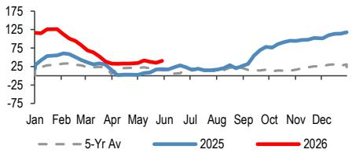

line

| Month | 2025  | 2026  | 5-Yr Av |
|-------|-------|-------|---------|
| Jan   | 25    | 125   | 25      |
| Feb   | 30    | 120   | 25      |
| Mar   | 25    | 110   | 25      |
| Apr   | 20    | 100   | 25      |
| May   | 25    | 90    | 25      |
| Jun   | 20    | 80    | 25      |
| Jul   | 25    | 70    | 25      |
| Aug   | 30    | 60    | 25      |
| Sep   | 40    | 50    | 25      |
| Oct   | 60    | 40    | 25      |
| Nov   | 70    | 30    | 25      |
| Dec   | 80    | 20    | 25      |

Source: CFTC, ICE, JPM Commodities Research

Figure 90: Gross commercial position and price   
LHS: lots (1,000), RHS: EUR/MtCO2e   
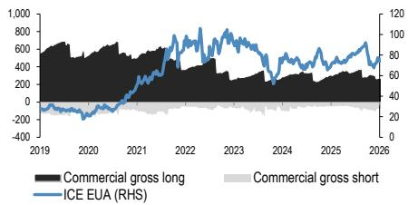

line

| Year | Commercial gross long | Commercial gross short | ICE EUA (RHS) |
|------|------------------------|-------------------------|---------------|
| 2019 | ~600                   | ~-100                   | ~-100         |
| 2020 | ~700                   | ~-50                    | ~-50          |
| 2021 | ~800                   | ~-100                   | ~-100         |
| 2022 | ~900                   | ~-50                    | ~-50          |
| 2023 | ~800                   | ~-100                   | ~-100         |
| 2024 | ~700                   | ~-50                    | ~-50          |
| 2025 | ~600                   | ~-100                   | ~-100         |
| 2026 | ~500                   | ~-150                   | ~-150         |

Source: CFTC, ICE, JPM Commodities Research

Figure 92: Open interest share by trader type   
%   
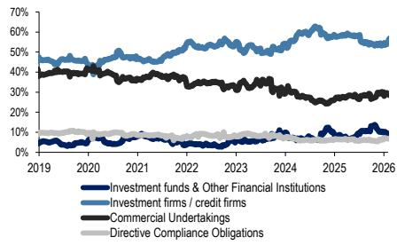

line

| Year | Investment funds & Other Financial Institutions | Investment firms / credit firms | Commercial Undertakings | Directive Compliance Obligations |
|------|--------------------------------------------------|----------------------------------|--------------------------|----------------------------------|
| 2019 | ~5%                                              | ~45%                             | ~40%                     | ~10%                             |
| 2020 | ~5%                                              | ~50%                             | ~40%                     | ~10%                             |
| 2021 | ~5%                                              | ~55%                             | ~35%                     | ~10%                             |
| 2022 | ~5%                                              | ~60%                             | ~35%                     | ~10%                             |
| 2023 | ~5%                                              | ~60%                             | ~35%                     | ~10%                             |
| 2024 | ~5%                                              | ~60%                             | ~30%                     | ~10%                             |
| 2025 | ~10%                                             | ~60%                             | ~30%                     | ~10%                             |
| 2026 | ~15%                                             | ~55%                             | ~30%                     | ~10%                             |

Source: CFTC, ICE, JPM Commodities Research

Figure 94: Price momentum   
LHS: Z-score, RHS: EUR/MtCO2e.   
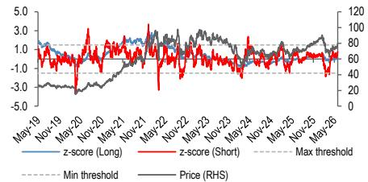

line

| Date    | z-score (Long) | z-score (Short) | Price (RHS) |
|---------|----------------|-----------------|-------------|
| May'19  | 2.0            | 1.0             | 40          |
| Nov'19  | 1.5            | 0.5             | 30          |
| May'20  | 1.0            | -0.5            | 20          |
| Nov'20  | 0.5            | -1.0            | 10          |
| May'21  | 0.0            | -0.5            | 5           |
| Nov'21  | -0.5           | -1.0            | 0           |
| May'22  | -1.0           | -1.5            | -5          |
| Nov'22  | -0.5           | -1.0            | -10         |
| May'23  | 0.0            | -0.5            | -15         |
| Nov'23  | 0.5            | 0.0             | -20         |
| May'24  | 1.0            | 0.5             | -25         |
| Nov'24  | 1.5            | 1.0             | -30         |
| May'25  | 2.0            | 1.5             | -35         |
| Nov'25  | 1.5            | 1.0             | -30         |
| May'26  | 1.0            | 0.5             | -25         |

Source: ICE, Bloomberg Finance L.P., JPM Commodities Research

# CMX Gold

Contracts (futures and options) 

<table><tr><td rowspan="2" colspan="2"></td><td colspan="3">PMPU</td><td colspan="3">Swap Dealers</td><td colspan="3">Managed Money</td><td colspan="3">Other Reportables</td><td colspan="3">Non-Reportables</td></tr><tr><td>25-May-26</td><td>18-May-26</td><td>Wkly Chg</td><td>25-May-26</td><td>18-May-26</td><td>Wkly Chg</td><td>25-May-26</td><td>18-May-26</td><td>Wkly Chg</td><td>25-May-26</td><td>18-May-26</td><td>Wkly Chg</td><td>25-May-26</td><td>18-May-26</td><td>Wkly Chg</td></tr><tr><td>CMX</td><td>GOLD</td><td></td><td></td><td></td><td></td><td></td><td></td><td></td><td></td><td></td><td></td><td></td><td></td><td></td><td></td><td></td></tr><tr><td></td><td>Long</td><td>20,605</td><td>17,711</td><td>2,894</td><td>30,528</td><td>26,951</td><td>3,577</td><td>124,058</td><td>129,070</td><td>-5,012</td><td>74,299</td><td>83,197</td><td>-8,898</td><td>52,996</td><td>56,019</td><td>-3,023</td></tr><tr><td></td><td>Short</td><td>40,621</td><td>41,434</td><td>-813</td><td>192,418</td><td>208,803</td><td>-16,385</td><td>29,670</td><td>28,443</td><td>1,227</td><td>20,028</td><td>18,650</td><td>1,378</td><td>19,750</td><td>15,618</td><td>4,132</td></tr><tr><td></td><td>Net Position</td><td>-20,016</td><td>-23,723</td><td>3,707</td><td>-161,890</td><td>-181,852</td><td>19,962</td><td>94,388</td><td>100,627</td><td>-6,239</td><td>54,271</td><td>64,547</td><td>-10,276</td><td>33,246</td><td>40,401</td><td>-7,155</td></tr><tr><td></td><td>Spreading</td><td></td><td></td><td></td><td>70,319</td><td>61,913</td><td>8,406</td><td>53,021</td><td>51,258</td><td>1,763</td><td>117,589</td><td>118,947</td><td>-1,358</td><td></td><td></td><td></td></tr></table>

Source: CFTC, JPM Commodities Research. Note: contracts are shown as reported by the CFTC—each reported spreading contract actually represents two positions (a long and a short), an important fact for accurately calculating actual open interest.

Figure 95: Weekly change in open interest by trading group   
US\$ million (futures and options)   
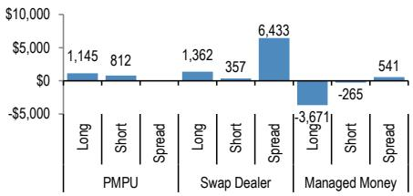

bar

| Category | Long ($) | Short ($) | Spread ($) |
| :--- | :--- | :--- | :--- |
| PMPU | 1,145 | 812 | |
| Swap Dealer | 1,362 | 357 | 6,433 |
| Managed Money | -3,671 | -265 | 541 |

Source: CFTC, CMX, JPM Commodities Research

Figure 97: Weekly change in OI from changes in contracts & price   
US\$ million (futures and options)   
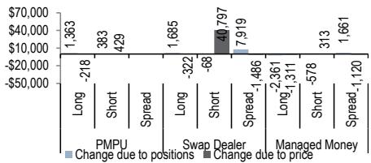

bar

| Category       | Value   |
| -------------- | ------- |
| Long           | 1,363   |
| Short          | 383     |
| Spread         | 429     |
| Long           | 1,685   |
| Short          | -322    |
| Spread         | -68     |
| Long           | 40,797  |
| Short          | 7,919   |
| Spread         | -1,486  |
| Long           | -2,361  |
| Short          | -311    |
| Long           | -578    |
| Short          | 313     |
| Spread         | 1,661   |

Source: CFTC, CMX, JPM Commodities Research

Figure 99: Seasonal Managed Money net length   
Lots (1,000)   
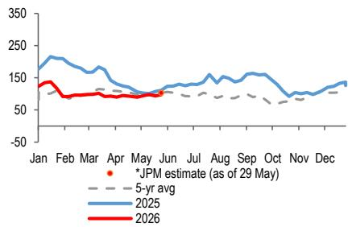

line

| Month | 2025 | 2026 |
|-------|------|------|
| Jan   | 180  | 140  |
| Feb   | 200  | 120  |
| Mar   | 170  | 110  |
| Apr   | 160  | 100  |
| May   | 140  | 90   |
| Jun   | 130  | 80   |
| Jul   | 140  | 70   |
| Aug   | 150  | 60   |
| Sep   | 160  | 50   |
| Oct   | 140  | 40   |
| Nov   | 120  | 30   |
| Dec   | 130  | 20   |

Source: CFTC, CMX, JPM Commodities Research, \*Forecasts supplied by JPM GQDS Research, see methodology here

Figure 96: Gross PMPU position and price   
LHS: lots (1,000), RHS: USD/t oz.   
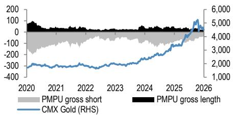

line

| Year | PMPU gross short | PMPU gross length | CMX Gold (RHS) |
|------|------------------|-------------------|----------------|
| 2020 | -100             | 100               | -300           |
| 2021 | -50              | 50                | -250           |
| 2022 | -25              | 25                | -200           |
| 2023 | -10              | 10                | -150           |
| 2024 | 0                | 5                 | -100           |
| 2025 | 10               | 10                | -50            |
| 2026 | 15               | 15                | 500            |

Source: CFTC, CMX, JPM Commodities Research

Figure 98: Open interest share by trader type   
%   
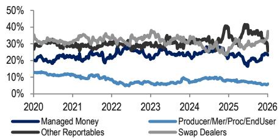

line

| Year | Managed Money | Producer/Mer/Proc/EndUser | Other Reportables | Swap Dealers |
|------|---------------|--------------------------|-------------------|--------------|
| 2020 | ~20%          | ~10%                     | ~30%              | ~30%         |
| 2021 | ~25%          | ~8%                      | ~35%              | ~35%         |
| 2022 | ~22%          | ~7%                      | ~38%              | ~38%         |
| 2023 | ~24%          | ~6%                      | ~36%              | ~36%         |
| 2024 | ~26%          | ~7%                      | ~34%              | ~34%         |
| 2025 | ~28%          | ~8%                      | ~40%              | ~38%         |
| 2026 | ~25%          | ~5%                      | ~35%              | ~35%         |

Source: CFTC, CMX, JPM Commodities Research

Figure 100: Price momentum   
LHS: Z-score, RHS: USD/t oz.   
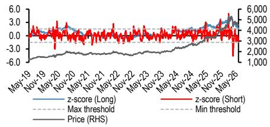

line

| Date    | Price (RHS) | z-score (Long) | z-score (Short) |
|---------|-------------|----------------|-----------------|
| May-19  | -6.0        | 0.0            | 0.0             |
| Nov-19  | -5.5        | 0.5            | 0.5             |
| May-20  | -5.0        | 1.0            | 1.0             |
| Nov-20  | -4.5        | 1.5            | 1.5             |
| May-21  | -4.0        | 2.0            | 2.0             |
| Nov-21  | -3.5        | 2.5            | 2.5             |
| May-22  | -3.0        | 3.0            | 3.0             |
| Nov-22  | -2.5        | 3.5            | 3.5             |
| May-23  | -2.0        | 4.0            | 4.0             |
| Nov-23  | -1.5        | 4.5            | 4.5             |
| May-24  | -1.0        | 5.0            | 5.0             |
| Nov-24  | -0.5        | 5.5            | 5.5             |
| May-25  | 0.0         | 6.0            | 6.0             |
| Nov-25  | 0.5         | 5.5            | 5.5             |
| May-26  | 1.0         | 5.0            | 5.0             |

Source: CMX, Bloomberg Finance L.P., JPM Commodities Research

# CMX Silver

Contracts (futures and options) 

<table><tr><td rowspan="2" colspan="2"></td><td colspan="3">PMPU</td><td colspan="3">Swap Dealers</td><td colspan="3">Managed Money</td><td colspan="3">Other Reportables</td><td colspan="3">Non-Reportables</td></tr><tr><td>25-May-26</td><td>18-May-26</td><td>Wkly Chg</td><td>25-May-26</td><td>18-May-26</td><td>Wkly Chg</td><td>25-May-26</td><td>18-May-26</td><td>Wkly Chg</td><td>25-May-26</td><td>18-May-26</td><td>Wkly Chg</td><td>25-May-26</td><td>18-May-26</td><td>Wkly Chg</td></tr><tr><td>CMX</td><td>SILVER</td><td></td><td></td><td></td><td></td><td></td><td></td><td></td><td></td><td></td><td></td><td></td><td></td><td></td><td></td><td></td></tr><tr><td></td><td>Long</td><td>3,515</td><td>3,342</td><td>173</td><td>18,853</td><td>20,006</td><td>-1,153</td><td>18,536</td><td>22,218</td><td>-3,682</td><td>15,995</td><td>14,897</td><td>1,098</td><td>28,765</td><td>30,849</td><td>-2,084</td></tr><tr><td></td><td>Short</td><td>22,520</td><td>22,808</td><td>-288</td><td>42,651</td><td>45,387</td><td>-2,736</td><td>6,775</td><td>6,023</td><td>752</td><td>3,014</td><td>3,721</td><td>-707</td><td>10,704</td><td>13,372</td><td>-2,668</td></tr><tr><td></td><td>Net Position</td><td>-19,005</td><td>-19,466</td><td>461</td><td>-23,798</td><td>-25,381</td><td>1,583</td><td>11,761</td><td>16,195</td><td>-4,434</td><td>12,981</td><td>11,176</td><td>1,805</td><td>18,061</td><td>17,477</td><td>584</td></tr><tr><td></td><td>Spreading</td><td></td><td></td><td></td><td>10,445</td><td>9,912</td><td>533</td><td>10,652</td><td>11,238</td><td>-586</td><td>19,404</td><td>20,185</td><td>-781</td><td></td><td></td><td></td></tr></table>

Source: CFTC, JPM Commodities Research. Note: contracts are shown as reported by the CFTC—each reported spreading contract actually represents two positions (a long and a short), an important fact for accurately calculating actual open interest.

Figure 101: Weekly change in open interest by trading group   
US\$ million (futures and options)   
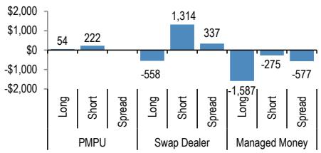

bar

| Category | Long ($) | Short ($) | Spread ($) |
| :--- | :--- | :--- | :--- |
| PMPU | 54 | 222 | |
| Swap Dealer | -558 | 1,314 | 337 |
| Managed Money | -1,587 | -275 | -577 |

Source: CFTC, CMX, JPM Commodities Research

Figure 103: Weekly change in OI from changes in contracts & price   
US\$ million (futures and options)   
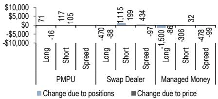

bar

| Category       | Long  | Short | Spread |
| -------------- | ----- | ----- | ------ |
| PMPU           | 71    | 117   | 105    |
| Swap Dealer    | -470  | -88   | 1,115  |
| Managed Money  | -97   | -86   | 32     |

Source: CFTC, CMX, JPM Commodities Research

Figure 105: Seasonal Managed Money net length   
Lots (1,000)   
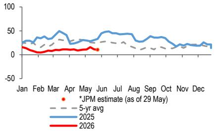

line

| Month | 2025 | 5-yr avg | 2026 |
|-------|------|----------|------|
| Jan   | ~30  | ~20      | ~10  |
| Feb   | ~40  | ~25      | ~5   |
| Mar   | ~50  | ~30      | ~5   |
| Apr   | ~40  | ~35      | ~5   |
| May   | ~30  | ~40      | ~5   |
| Jun   | ~40  | ~35      | ~5   |
| Jul   | ~50  | ~30      | ~5   |
| Aug   | ~40  | ~35      | ~5   |
| Sep   | ~30  | ~40      | ~5   |
| Oct   | ~20  | ~45      | ~5   |
| Nov   | ~10  | ~50      | ~5   |
| Dec   | ~5   | ~55      | ~5   |

Source: CFTC, CMX, JPM Commodities Research, \*Forecasts supplied by JPM GQDS Research, see methodology here

Figure 102: Gross PMPU position and price   
%   
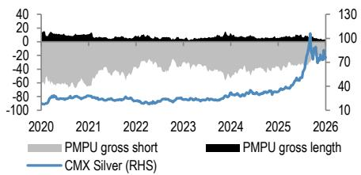

line

| Year | PMPU gross short | PMPU gross length | CMX Silver (RHS) |
|------|------------------|-------------------|------------------|
| 2020 | -40              | 10                | -80              |
| 2021 | -30              | 10                | -75              |
| 2022 | -20              | 10                | -70              |
| 2023 | -10              | 10                | -65              |
| 2024 | 0                | 10                | -60              |
| 2025 | 10               | 10                | -55              |
| 2026 | 0                | 10                | -50              |

Source: CFTC, CMX, JPM Commodities Research

Figure 104: Open interest share by trader type   
%   
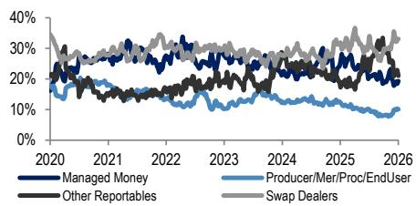

line

| Year | Managed Money | Producer/Mer/Proc/EndUser | Other Reportables | Swap Dealers |
|------|---------------|--------------------------|-------------------|--------------|
| 2020 | ~25%          | ~15%                     | ~20%              | ~35%         |
| 2021 | ~28%          | ~12%                     | ~18%              | ~32%         |
| 2022 | ~30%          | ~10%                     | ~15%              | ~30%         |
| 2023 | ~27%          | ~8%                      | ~12%              | ~33%         |
| 2024 | ~25%          | ~7%                      | ~10%              | ~35%         |
| 2025 | ~23%          | ~6%                      | ~8%               | ~34%         |
| 2026 | ~20%          | ~5%                      | ~7%               | ~35%         |

Source: CFTC, CMX, JPM Commodities Research

Figure 106: Price momentum   
LHS: Z-score, RHS: USD/t oz.   
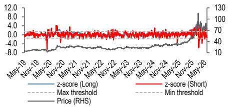

line

| Date    | z-score (Long) | z-score (Short) | Max threshold | Min threshold | Price (RHS) |
|---------|----------------|-----------------|---------------|---------------|-------------|
| May-19  | ~0.0           | ~0.0            | ~0.0          | ~0.0          | ~-8.0       |
| Nov-19  | ~0.0           | ~0.0            | ~0.0          | ~0.0          | ~-8.0       |
| May-20  | ~0.0           | ~0.0            | ~0.0          | ~0.0          | ~-8.0       |
| Nov-20  | ~0.0           | ~0.0            | ~0.0          | ~0.0          | ~-8.0       |
| May-21  | ~0.0           | ~0.0            | ~0.0          | ~0.0          | ~-8.0       |
| Nov-21  | ~0.0           | ~0.0            | ~0.0          | ~0.0          | ~-8.0       |
| May-22  | ~0.0           | ~0.0            | ~0.0          | ~0.0          | ~-8.0       |
| Nov-22  | ~0.0           | ~0.0            | ~0.0          | ~0.0          | ~-8.0       |
| May-23  | ~0.0           | ~0.0            | ~0.0          | ~0.0          | ~-8.0       |
| Nov-23  | ~0.0           | ~0.0            | ~0.0          | ~0.0          | ~-8.0       |
| May-24  | ~0.0           | ~0.0            | ~0.0          | ~0.0          | ~-8.0       |
| Nov-24  | ~0.0           | ~0.0            | ~0.0          | ~0.0          | ~-8.0       |
| May-25  | ~0.0           | ~0.0            | ~0.0          | ~0.0          | ~-8.0       |
| Nov-25  | ~0.0           | ~0.0            | ~0.0          | ~0.0          | ~-8.0       |
| May-26  | ~130           | ~130            | ~130          | ~130          | ~130        |

Source: CMX, Bloomberg Finance L.P., JPM Commodities Research

# CMX Copper

Contracts (futures and options) 

<table><tr><td rowspan="2" colspan="2"></td><td colspan="3">PMPU</td><td colspan="3">Swap Dealers</td><td colspan="3">Managed Money</td><td colspan="3">Other Reportables</td><td colspan="3">Non-Reportables</td></tr><tr><td>25-May-26</td><td>18-May-26</td><td>Wkly Chg</td><td>25-May-26</td><td>18-May-26</td><td>Wkly Chg</td><td>25-May-26</td><td>18-May-26</td><td>Wkly Chg</td><td>25-May-26</td><td>18-May-26</td><td>Wkly Chg</td><td>25-May-26</td><td>18-May-26</td><td>Wkly Chg</td></tr><tr><td>CMX</td><td>COPPER</td><td></td><td></td><td></td><td></td><td></td><td></td><td></td><td></td><td></td><td></td><td></td><td></td><td></td><td></td><td></td></tr><tr><td></td><td>Long</td><td>23,686</td><td>26,215</td><td>-2,529</td><td>51,864</td><td>53,102</td><td>-1,238</td><td>88,284</td><td>87,641</td><td>643</td><td>17,510</td><td>19,038</td><td>-1,528</td><td>19,717</td><td>22,091</td><td>-2,374</td></tr><tr><td></td><td>Short</td><td>135,241</td><td>140,613</td><td>-5,372</td><td>26,205</td><td>24,283</td><td>1,922</td><td>13,285</td><td>14,118</td><td>-833</td><td>16,669</td><td>18,018</td><td>-1,349</td><td>9,661</td><td>11,055</td><td>-1,394</td></tr><tr><td></td><td>Net Position</td><td>-111,555</td><td>-114,398</td><td>2,843</td><td>25,659</td><td>28,819</td><td>-3,160</td><td>74,999</td><td>73,523</td><td>1,476</td><td>841</td><td>1,020</td><td>-179</td><td>10,056</td><td>11,036</td><td>-980</td></tr><tr><td></td><td>Spreading</td><td></td><td></td><td></td><td>13,810</td><td>11,896</td><td>1,914</td><td>28,347</td><td>27,033</td><td>1,314</td><td>43,043</td><td>44,141</td><td>-1,098</td><td></td><td></td><td></td></tr></table>

Source: CFTC, JPM Commodities Research. Note: contracts are shown as reported by the CFTC—each reported spreading contract actually represents two positions (a long and a short), an important fact for accurately calculating actual open interest.

Figure 107: Weekly change in open interest by trading group   
US\$ million (futures and options)   
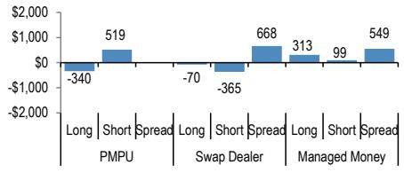

bar

| Category | Value ($) |
|---|---|
| Long | -340 |
| Short | 519 |
| Spread | -70 |
| Long | -365 |
| Short | 668 |
| Spread | 313 |
| Long | 99 |
| Short | 549 |
| Spread | |
PMPU
Swap Dealer
Managed Money

Source: CFTC, CMX, JPM Commodities Research

Figure 109: Weekly change in OI from changes in contracts & price   
US\$ million (futures and options)   
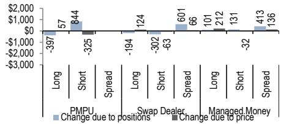

bar

| Category | PMPU Change due to positions | Swap Dealer Change due to positions | Managed Money Change due to positions | PMPU Change due to price | Swap Dealer Change due to price | Managed Money Change due to price |
| -------- | ---------------------------- | ----------------------------------- | ------------------------------------- | ------------------------ | ------------------------------ | ---------------------------------- |
| Long     | -397                         | 57                                  | -325                                  | $0                       | -100                           | -100                               |
| Short    | 844                          | -124                                | -302                                  | $0                       | -100                           | -100                               |
| Spread   | -194                         | 601                                 | -63                                   | $0                       | -100                           | -100                               |
| Long     | 66                           | 101                                 | -32                                   | $0                       | -100                           | -100                               |
| Short    | 212                          | 131                                 | -32                                   | $0                       | -100                           | -100                               |
| Spread   | 413                          | 136                                 | -32                                   | $0                       | -100                           | -100                               |

Source: CFTC, CMX, JPM Commodities Research

Figure 111: Seasonal Managed Money net length   
Lots (1,000)   
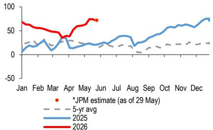

line

| Month | 2025 | 2026 | 5-yr avg |
|-------|------|------|----------|
| Jan   | ~10  | ~70  | ~20      |
| Feb   | ~15  | ~60  | ~25      |
| Mar   | ~20  | ~50  | ~30      |
| Apr   | ~25  | ~40  | ~35      |
| May   | ~30  | ~80  | ~40      |
| Jun   | ~35  | ~70  | ~45      |
| Jul   | ~40  | ~60  | ~50      |
| Aug   | ~30  | ~50  | ~45      |
| Sep   | ~40  | ~60  | ~50      |
| Oct   | ~50  | ~70  | ~55      |
| Nov   | ~60  | ~75  | ~60      |
| Dec   | ~70  | ~80  | ~65      |

Source: CFTC, CMX, JPM Commodities Research, \*Forecasts supplied by JPM GQDS Research, see methodology here

Figure 108: Gross PMPU position and price   
LHS: lots (1,000), RHS: USc/lb  
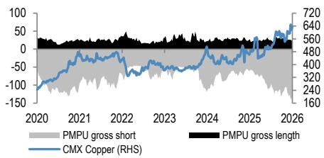

line

| Year | PMPU gross short | PMPU gross length | CMX Copper (RHS) |
|------|------------------|-------------------|------------------|
| 2020 | -100             | 0                 | -100             |
| 2021 | -50              | 0                 | -50              |
| 2022 | 0                | 0                 | 0                |
| 2023 | 50               | 0                 | 50               |
| 2024 | 0                | 0                 | 0                |
| 2025 | -50              | 0                 | -50              |
| 2026 | -100             | 0                 | -100             |

Source: CFTC, CMX, JPM Commodities Research

Figure 110: Open interest share by trader type   
%   
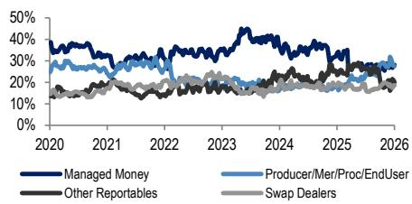

line

| Year | Managed Money | Producer/Mer/Proc/EndUser | Other Reportables | Swap Dealers |
|------|---------------|--------------------------|-------------------|--------------|
| 2020 | ~40%          | ~30%                     | ~15%              | ~15%         |
| 2021 | ~35%          | ~25%                     | ~15%              | ~15%         |
| 2022 | ~30%          | ~20%                     | ~15%              | ~15%         |
| 2023 | ~45%          | ~25%                     | ~15%              | ~15%         |
| 2024 | ~40%          | ~25%                     | ~15%              | ~15%         |
| 2025 | ~30%          | ~25%                     | ~15%              | ~15%         |
| 2026 | ~30%          | ~30%                     | ~15%              | ~15%         |

Source: CFTC, CMX, JPM Commodities Research

Figure 112: Price momentum   
LHS: Z-score, RHS: USc/lb  
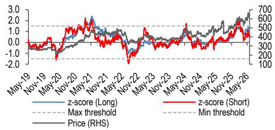

line

| Date    | z-score (Long) | z-score (Short) | Price (RHS) |
|---------|----------------|-----------------|-------------|
| May-19  | 0.0            | 0.0             | 0.0         |
| Nov-19  | 0.0            | 0.0             | 0.0         |
| May-20  | 0.0            | 0.0             | 0.0         |
| Nov-20  | 0.0            | 0.0             | 0.0         |
| May-21  | 1.5            | 1.5             | 1.5         |
| Nov-21  | 1.5            | 1.5             | 1.5         |
| May-22  | -1.5           | -1.5            | -1.5        |
| Nov-22  | 0.0            | 0.0             | 0.0         |
| May-23  | 0.0            | 0.0             | 0.0         |
| Nov-23  | 0.0            | 0.0             | 0.0         |
| May-24  | 1.5            | 1.5             | 1.5         |
| Nov-24  | 1.5            | 1.5             | 1.5         |
| May-25  | 1.5            | 1.5             | 1.5         |
| Nov-25  | 1.5            | 1.5             | 1.5         |
| May-26  | 3.0            | 3.0             | 3.0         |

Source: CMX, Bloomberg Finance L.P., JPM Commodities Research

# NYM Platinum

Contracts (futures and options) 

<table><tr><td rowspan="2" colspan="2"></td><td colspan="3">PMPU</td><td colspan="3">Swap Dealers</td><td colspan="3">Managed Money</td><td colspan="3">Other Reportables</td><td colspan="3">Non-Reportables</td></tr><tr><td>25-May-26</td><td>18-May-26</td><td>Wkly Chg</td><td>25-May-26</td><td>18-May-26</td><td>Wkly Chg</td><td>25-May-26</td><td>18-May-26</td><td>Wkly Chg</td><td>25-May-26</td><td>18-May-26</td><td>Wkly Chg</td><td>25-May-26</td><td>18-May-26</td><td>Wkly Chg</td></tr><tr><td>NYM</td><td>PLATINUM</td><td></td><td></td><td></td><td></td><td></td><td></td><td></td><td></td><td></td><td></td><td></td><td></td><td></td><td></td><td></td></tr><tr><td></td><td>Long</td><td>2,670</td><td>3,109</td><td>-439</td><td>15,768</td><td>14,730</td><td>1,038</td><td>19,021</td><td>20,007</td><td>-986</td><td>6,494</td><td>7,844</td><td>-1,350</td><td>8,641</td><td>8,437</td><td>204</td></tr><tr><td></td><td>Short</td><td>16,855</td><td>17,870</td><td>-1,015</td><td>23,948</td><td>24,874</td><td>-926</td><td>5,403</td><td>3,875</td><td>1,528</td><td>3,014</td><td>3,956</td><td>-942</td><td>3,374</td><td>3,552</td><td>-178</td></tr><tr><td></td><td>Net Position</td><td>-14,185</td><td>-14,761</td><td>576</td><td>-8,180</td><td>-10,144</td><td>1,964</td><td>13,618</td><td>16,132</td><td>-2,514</td><td>3,480</td><td>3,888</td><td>-408</td><td>5,267</td><td>4,885</td><td>382</td></tr><tr><td></td><td>Spreading</td><td></td><td></td><td></td><td>1,613</td><td>1,510</td><td>103</td><td>6,761</td><td>6,802</td><td>-41</td><td>5,290</td><td>4,931</td><td>359</td><td></td><td></td><td></td></tr></table>

Source: CFTC, JPM Commodities Research. Note: contracts are shown as reported by the CFTC—each reported spreading contract actually represents two positions (a long and a short), an important fact for accurately calculating actual open interest.

Figure 113: Weekly change in open interest by trading group   
US\$ million (futures and options)   
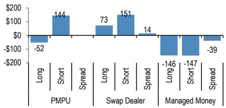

bar

| Category | Long | Short | Spread |
| :--- | :--- | :--- | :--- |
| PMPU | -52 | 144 | |
| Swap Dealer | 73 | 151 | 14 |
| Managed Money | -146 | -147 | -39 |

Source: CFTC, NYMEX, JPM Commodities Research

Figure 115: Weekly change in OI from changes in contracts & price   
US\$ million (futures and options)   
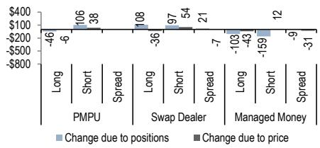

bar

| Category       | Change due to positions | Change due to price |
| -------------- | ------------------------ | -------------------- |
| PMPU           | -46                      | 106                  |
| Swap Dealer    | -36                      | 97                   |
| Managed Money  | -103                     | -43                  |
|            | -159                     | 12                   |

Source: CFTC, NYMEX, JPM Commodities Research

Figure 117: Seasonal Managed Money net length   
Lots (1,000)   
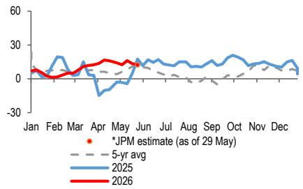

line

| Month | *JPM estimate (as of 29 May) | 5-yr avg | 2025 | 2026 |
|-------|-----------------------------|----------|------|------|
| Jan   | ~10                         | ~0       | ~0   | ~0   |
| Feb   | ~15                         | ~5       | ~10  | ~5   |
| Mar   | ~10                         | ~0       | ~20  | ~10  |
| Apr   | ~5                          | ~-10     | ~-20 | ~15  |
| May   | ~10                         | ~0       | ~10  | ~20  |
| Jun   | ~15                         | ~5       | ~15  | ~25  |
| Jul   | ~10                         | ~0       | ~10  | ~20  |
| Aug   | ~5                          | ~-5      | ~5   | ~15  |
| Sep   | ~10                         | ~0       | ~10  | ~20  |
| Oct   | ~15                         | ~5       | ~15  | ~25  |
| Nov   | ~10                         | ~0       | ~10  | ~20  |
| Dec   | ~5                          | ~-5      | ~5   | ~15  |

Source: CFTC, NYMEX, JPM Commodities Research, \*Forecasts supplied by JPM GQDS Research, see methodology here

Figure 114: Gross PMPU position and price   
LHS: lots (1,000), RHS: USD/t oz.   
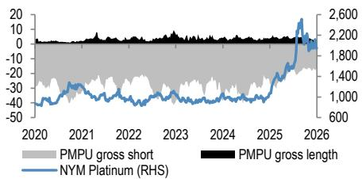

line

| Year | PMPU gross short | PMPU gross length | NYM Platinum (RHS) |
|------|------------------|-------------------|--------------------|
| 2020 | ~-30             | ~1,800            | ~-40               |
| 2021 | ~-30             | ~1,800            | ~-40               |
| 2022 | ~-30             | ~1,800            | ~-40               |
| 2023 | ~-30             | ~1,800            | ~-40               |
| 2024 | ~-30             | ~1,800            | ~-40               |
| 2025 | ~-30             | ~1,800            | ~-40               |
| 2026 | ~-30             | ~1,800            | ~-40               |

Source: CFTC, NYMEX, JPM Commodities Research

Figure 116: Open interest share by trader type   
%   
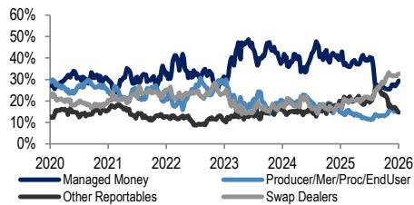

line

| Year | Managed Money | Producer/Mer/Proc/EndUser | Other Reportables | Swap Dealers |
|------|---------------|---------------------------|-------------------|--------------|
| 2020 | ~30%          | ~25%                      | ~15%              | ~20%         |
| 2021 | ~35%          | ~28%                      | ~18%              | ~22%         |
| 2022 | ~40%          | ~30%                      | ~17%              | ~25%         |
| 2023 | ~45%          | ~32%                      | ~16%              | ~28%         |
| 2024 | ~50%          | ~35%                      | ~15%              | ~30%         |
| 2025 | ~45%          | ~30%                      | ~14%              | ~32%         |
| 2026 | ~30%          | ~25%                      | ~10%              | ~35%         |

Source: CFTC, NYMEX, JPM Commodities Research

Figure 118: Price momentum   
LHS: Z-score, RHS: USD/t oz.   
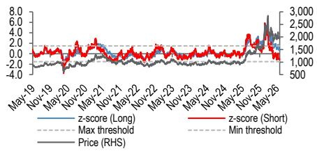

line

| Date    | z-score (Long) | Price (RHS) | Max Threshold | Min Threshold |
|---------|----------------|-------------|---------------|---------------|
| May-19  |                |             |               |               |
| Nov-19  |                |             |               |               |
| May-20  |                |             |               |               |
| Nov-20  |                |             |               |               |
| May-21  |                |             |               |               |
| Nov-21  |                |             |               |               |
| May-22  |                |             |               |               |
| Nov-22  |                |             |               |               |
| May-23  |                |             |               |               |
| Nov-23  |                |             |               |               |
| May-24  |                |             |               |               |
| Nov-24  |                |             |               |               |
| May-25  |                |             |               |               |
| Nov-25  |                |             |               |               |
| May-26  |                |             |               |               |

Source: NYMEX, Bloomberg Finance L.P., JPM Commodities Research

# CBOT Corn

Contracts (futures and options) 

<table><tr><td rowspan="2" colspan="2"></td><td colspan="3">PMPU</td><td colspan="3">Swap Dealers</td><td colspan="3">Managed Money</td><td colspan="3">Other Reportables</td><td colspan="3">Non-Reportables</td></tr><tr><td>25-May-26</td><td>18-May-26</td><td>Wkly Chg</td><td>25-May-26</td><td>18-May-26</td><td>Wkly Chg</td><td>25-May-26</td><td>18-May-26</td><td>Wkly Chg</td><td>25-May-26</td><td>18-May-26</td><td>Wkly Chg</td><td>25-May-26</td><td>18-May-26</td><td>Wkly Chg</td></tr><tr><td>CBT</td><td>CORN</td><td></td><td></td><td></td><td></td><td></td><td></td><td></td><td></td><td></td><td></td><td></td><td></td><td></td><td></td><td></td></tr><tr><td></td><td>Long</td><td>482,501</td><td>459,651</td><td>22,850</td><td>401,919</td><td>390,676</td><td>11,243</td><td>426,628</td><td>420,654</td><td>5,974</td><td>110,776</td><td>118,836</td><td>-8,060</td><td>184,021</td><td>206,034</td><td>-22,013</td></tr><tr><td></td><td>Short</td><td>1,087,058</td><td>1,016,594</td><td>70,464</td><td>48,028</td><td>50,547</td><td>-2,519</td><td>133,274</td><td>121,171</td><td>12,103</td><td>79,802</td><td>72,480</td><td>7,322</td><td>257,683</td><td>335,061</td><td>-77,378</td></tr><tr><td></td><td>Net Position</td><td>-604,557</td><td>-556,943</td><td>-47,614</td><td>353,891</td><td>340,129</td><td>13,762</td><td>293,354</td><td>299,483</td><td>-6,129</td><td>30,974</td><td>46,356</td><td>-15,382</td><td>-73,662</td><td>-129,027</td><td>55,365</td></tr><tr><td></td><td>Spreading</td><td></td><td></td><td></td><td>69,386</td><td>72,922</td><td>-3,536</td><td>391,921</td><td>370,649</td><td>21,272</td><td>495,118</td><td>493,692</td><td>1,426</td><td></td><td></td><td></td></tr></table>

Source: CFTC, JPM Commodities Research. Note: contracts are shown as reported by the CFTC—each reported spreading contract actually represents two positions (a long and a short), an important fact for accurately calculating actual open interest.

Figure 119: Weekly change in open interest by trading group   
US\$ million (futures and options)   
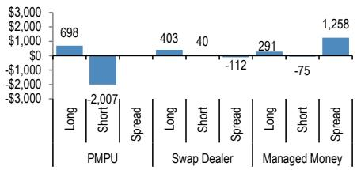

bar

| Category | Value |
|---|---|
| PMPU - Long | 698 |
| PMPU - Short | -2,007 |
| PMPU - Spread | |
| Swap Dealer - Long | 403 |
| Swap Dealer - Short | 40 |
| Swap Dealer - Spread | -112 |
| Managed Money - Long | 291 |
| Managed Money - Short | -75 |
| Managed Money - Spread | 1,258 |

Source: CFTC, CBOT, JPM Commodities Research

Figure 121: Weekly change in OI from changes in contracts & price   
US\$ million (futures and options)   
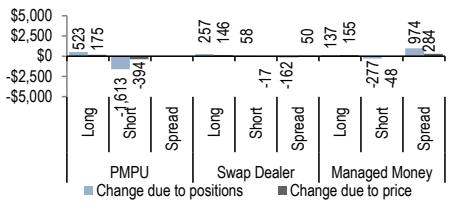

bar

| Category       | Change due to positions | Change due to price |
| -------------- | ------------------------ | --------------------- |
| PMPU           | 523                      | 175                   |
| Swap Dealer    | -1,613                   | -394                  |
| Managed Money  | 257                      | 146                   |
| PMPU           | -17                      | 58                    |
| Swap Dealer    | -162                     | 50                    |
| Managed Money  | -277                     | -48                   |
| PMPU           | 974                      | 284                   |

Source: CFTC, CBOT, JPM Commodities Research

Figure 123: Seasonal Managed Money net length   
Lots (1,000)   
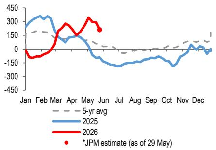

line

| Month | 2025  | 2026  | 5-yr avg | *JPM estimate (as of 29 May) |
|-------|-------|-------|----------|-----------------------------|
| Jan   | ~300  | ~-100 | ~150     | -                           |
| Feb   | ~350  | ~-150 | ~175     | -                           |
| Mar   | ~300  | ~-100 | ~150     | -                           |
| Apr   | ~150  | ~100  | ~100     | -                           |
| May   | ~0    | ~300  | ~50      | -                           |
| Jun   | ~-150 | ~150  | ~0       | ~150                        |
| Jul   | ~-200 | -     | ~-50     | -                           |
| Aug   | ~-250 | -     | ~-100    | -                           |
| Sep   | ~-200 | -     | ~-150    | -                           |
| Oct   | ~-150 | -     | ~-200    | -                           |
| Nov   | ~-100 | -     | ~-150    | -                           |
| Dec   | ~-50  | -     | ~-100    | -                           |

Source: CFTC, CBOT, JPM Commodities Research, \*Forecasts supplied by JPM GQDS Research, see methodology here

Figure 120: Gross PMPU position and price   
LHS: lots (1,000), RHS: USc/bu  
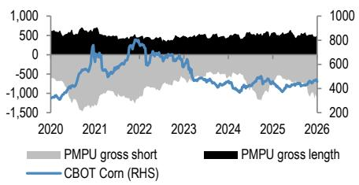

line

| Year | PMPU gross short | PMPU gross length | CBOT Corn (RHS) |
|------|------------------|-------------------|-----------------|
| 2020 | -1,500           | 0                 | -1,500          |
| 2021 | -500             | 500               | -500            |
| 2022 | 0                | 750               | 0               |
| 2023 | -500             | 750               | -500            |
| 2024 | -750             | 750               | -750            |
| 2025 | -750             | 750               | -750            |
| 2026 | -750             | 750               | -750            |

Source: CFTC, CBOT, JPM Commodities Research

Figure 122: Open interest share by trader type   
%   
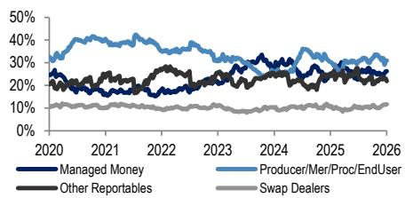

line

| Year | Managed Money | Producer/Mer/Proc/EndUser | Other Reportables | Swap Dealers |
|------|---------------|--------------------------|-------------------|--------------|
| 2020 | ~25%          | ~35%                     | ~20%              | ~10%         |
| 2021 | ~20%          | ~40%                     | ~25%              | ~10%         |
| 2022 | ~25%          | ~35%                     | ~20%              | ~10%         |
| 2023 | ~20%          | ~30%                     | ~25%              | ~10%         |
| 2024 | ~25%          | ~35%                     | ~20%              | ~10%         |
| 2025 | ~20%          | ~30%                     | ~25%              | ~10%         |
| 2026 | ~25%          | ~35%                     | ~20%              | ~10%         |

Source: CFTC, CBOT, JPM Commodities Research

Figure 124: Price momentum   
LHS: Z-score, RHS: USc/bu  
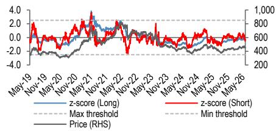

line

| Date    | z-score (Long) | z-score (Short) | Max threshold | Min threshold | Price (RHS) |
|---------|----------------|-----------------|---------------|---------------|-------------|
| May-19  |                |                 |               |               |             |
| Nov-19  |                |                 |               |               |             |
| May-20  |                |                 |               |               |             |
| Nov-20  |                |                 |               |               |             |
| May-21  |                |                 |               |               |             |
| Nov-21  |                |                 |               |               |             |
| May-22  |                |                 |               |               |             |
| Nov-22  |                |                 |               |               |             |
| May-23  |                |                 |               |               |             |
| Nov-23  |                |                 |               |               |             |
| May-24  |                |                 |               |               |             |
| Nov-24  |                |                 |               |               |             |
| May-25  |                |                 |               |               |             |
| Nov-25  |                |                 |               |               |             |
| May-26  |                |                 |               |               |             |

Source: CBOT, Bloomberg Finance L.P., JPM Commodities Research

# CBOT Soybeans

Contracts (futures and options) 

<table><tr><td rowspan="2" colspan="2"></td><td colspan="3">PMPU</td><td colspan="3">Swap Dealers</td><td colspan="3">Managed Money</td><td colspan="3">Other Reportables</td><td colspan="3">Non-Reportables</td></tr><tr><td>25-May-26</td><td>18-May-26</td><td>Wkly Chg</td><td>25-May-26</td><td>18-May-26</td><td>Wkly Chg</td><td>25-May-26</td><td>18-May-26</td><td>Wkly Chg</td><td>25-May-26</td><td>18-May-26</td><td>Wkly Chg</td><td>25-May-26</td><td>18-May-26</td><td>Wkly Chg</td></tr><tr><td>CBT</td><td>SOYBEANS</td><td></td><td></td><td></td><td></td><td></td><td></td><td></td><td></td><td></td><td></td><td></td><td></td><td></td><td></td><td></td></tr><tr><td></td><td>Long</td><td>343,894</td><td>298,535</td><td>45,359</td><td>187,357</td><td>175,983</td><td>11,374</td><td>238,953</td><td>241,860</td><td>-2,907</td><td>48,399</td><td>49,261</td><td>-862</td><td>59,165</td><td>70,456</td><td>-11,291</td></tr><tr><td></td><td>Short</td><td>635,274</td><td>590,602</td><td>44,672</td><td>76,051</td><td>75,354</td><td>697</td><td>31,149</td><td>27,045</td><td>4,104</td><td>42,447</td><td>31,440</td><td>11,007</td><td>92,847</td><td>111,654</td><td>-18,807</td></tr><tr><td></td><td>Net Position</td><td>-291,380</td><td>-292,067</td><td>687</td><td>111,306</td><td>100,629</td><td>10,677</td><td>207,804</td><td>214,815</td><td>-7,011</td><td>5,952</td><td>17,821</td><td>-11,869</td><td>-33,682</td><td>-41,198</td><td>7,516</td></tr><tr><td></td><td>Spreading</td><td></td><td></td><td></td><td>33,764</td><td>32,230</td><td>1,534</td><td>164,600</td><td>165,614</td><td>-1,014</td><td>211,984</td><td>202,842</td><td>9,142</td><td></td><td></td><td></td></tr></table>

Source: CFTC, JPM Commodities Research. Note: contracts are shown as reported by the CFTC—each reported spreading contract actually represents two positions (a long and a short), an important fact for accurately calculating actual open interest.

Figure 125: Weekly change in open interest by trading group   
US\$ million (futures and options)   
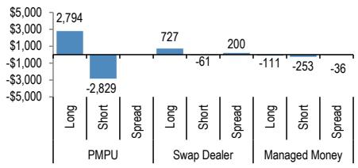

bar

| Category | Value ($) |
|---|---|
| PMPU - Long | 2,794 |
| PMPU - Short | -2,829 |
| Swap Dealer - Long | 727 |
| Swap Dealer - Short | -61 |
| Swap Dealer - Spread | 200 |
| Managed Money - Long | -111 |
| Managed Money - Short | -253 |
| Managed Money - Spread | -36 |

Source: CFTC, CBOT, JPM Commodities Research

Figure 127: Weekly change in OI from changes in contracts & price   
US\$ million (futures and options)   
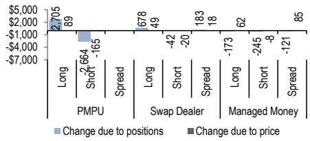

bar

| Category       | Long  | Short | Spread |
| -------------- | ----- | ----- | ------ |
| PMPU           | 2,705 | -2,664| -165   |
| Swap Dealer    | 678   | -42   | -20    |
| Managed Money  | 62    | -245  | -173   |
|            | 85    | -121  |        |

Source: CFTC, CBOT, JPM Commodities Research

Figure 129: Seasonal Managed Money net length   
Lots (1,000)   
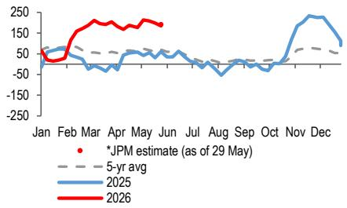

line

| Month | *JPM estimate (as of 29 May) | 5-yr avg | 2025 | 2026 |
|-------|-----------------------------|----------|------|------|
| Jan   | ~50                         | ~50      | ~50  | ~50  |
| Feb   | ~100                        | ~50      | ~50  | ~100 |
| Mar   | ~150                        | ~50      | ~50  | ~150 |
| Apr   | ~150                        | ~50      | ~50  | ~150 |
| May   | ~150                        | ~50      | ~50  | ~150 |
| Jun   | ~150                        | ~50      | ~50  | ~150 |
| Jul   | ~150                        | ~50      | ~50  | ~150 |
| Aug   | ~150                        | ~50      | ~50  | ~150 |
| Sep   | ~150                        | ~50      | ~50  | ~150 |
| Oct   | ~150                        | ~50      | ~50  | ~150 |
| Nov   | ~150                        | ~50      | ~150 | ~150 |
| Dec   | ~150                        | ~50      | ~150 | ~150 |

Source: CFTC, CBOT, JPM Commodities Research, \*Forecasts supplied by JPM GQDS Research, see methodology here

Figure 126: Gross PMPU position and price   
LHS: lots (1,000), RHS: USc/bu  
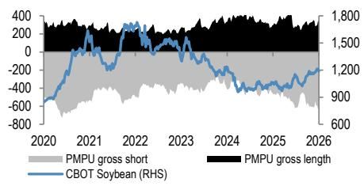

line

| Year | PMPU gross short | PMPU gross length | CBOT Soybean (RHS) |
|------|------------------|-------------------|--------------------|
| 2020 | -600             | 1,500             | -600               |
| 2021 | -400             | 1,500             | -400               |
| 2022 | -200             | 1,500             | -200               |
| 2023 | 0                | 1,500             | 0                  |
| 2024 | 200              | 1,500             | 200                |
| 2025 | 400              | 1,500             | 400                |
| 2026 | 600              | 1,500             | 600                |

Source: CFTC, CBOT, JPM Commodities Research

Figure 128: Open interest share by trader type   
%   
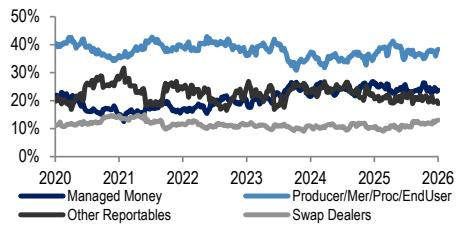

line

| Year | Managed Money | Producer/Mer/Proc/EndUser | Other Reportables | Swap Dealers |
|------|---------------|--------------------------|-------------------|--------------|
| 2020 | ~20%          | ~40%                     | ~20%              | ~10%         |
| 2021 | ~25%          | ~35%                     | ~25%              | ~10%         |
| 2022 | ~20%          | ~40%                     | ~20%              | ~10%         |
| 2023 | ~25%          | ~35%                     | ~25%              | ~10%         |
| 2024 | ~20%          | ~30%                     | ~20%              | ~10%         |
| 2025 | ~25%          | ~35%                     | ~25%              | ~10%         |
| 2026 | ~20%          | ~35%                     | ~20%              | ~10%         |

Source: CFTC, CBOT, JPM Commodities Research

Figure 130: Price momentum   
LHS: Z-score, RHS: USc/bu  
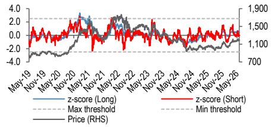

line

| Date    | z-score (Long) | z-score (Short) | Price (RHS) |
|---------|----------------|-----------------|-------------|
| May-19  |                |                 |             |
| Nov-19  |                |                 |             |
| May-20  |                |                 |             |
| Nov-20  |                |                 |             |
| May-21  |                |                 |             |
| Nov-21  |                |                 |             |
| May-22  |                |                 |             |
| Nov-22  |                |                 |             |
| May-23  |                |                 |             |
| Nov-23  |                |                 |             |
| May-24  |                |                 |             |
| Nov-24  |                |                 |             |
| May-25  |                |                 |             |
| Nov-25  |                |                 |             |
| May-26  |                |                 |             |

Source: CBOT, Bloomberg Finance L.P., JPM Commodities Research

# CBOT Wheat

Contracts (futures and options) 

<table><tr><td rowspan="2" colspan="2"></td><td colspan="3">PMPU</td><td colspan="3">Swap Dealers</td><td colspan="3">Managed Money</td><td colspan="3">Other Reportables</td><td colspan="3">Non-Reportables</td></tr><tr><td>25-May-26</td><td>18-May-26</td><td>Wkly Chg</td><td>25-May-26</td><td>18-May-26</td><td>Wkly Chg</td><td>25-May-26</td><td>18-May-26</td><td>Wkly Chg</td><td>25-May-26</td><td>18-May-26</td><td>Wkly Chg</td><td>25-May-26</td><td>18-May-26</td><td>Wkly Chg</td></tr><tr><td>CBT</td><td>WHEAT</td><td></td><td></td><td></td><td></td><td></td><td></td><td></td><td></td><td></td><td></td><td></td><td></td><td></td><td></td><td></td></tr><tr><td></td><td>Long</td><td>59,141</td><td>54,356</td><td>4,785</td><td>101,633</td><td>99,868</td><td>1,765</td><td>110,688</td><td>100,809</td><td>9,879</td><td>29,880</td><td>30,807</td><td>-927</td><td>40,008</td><td>43,146</td><td>-3,138</td></tr><tr><td></td><td>Short</td><td>140,452</td><td>118,898</td><td>21,554</td><td>16,556</td><td>16,976</td><td>-420</td><td>115,487</td><td>119,832</td><td>-4,345</td><td>30,241</td><td>31,748</td><td>-1,507</td><td>38,614</td><td>41,532</td><td>-2,918</td></tr><tr><td></td><td>Net Position</td><td>-81,311</td><td>-64,542</td><td>-16,769</td><td>85,077</td><td>82,892</td><td>2,185</td><td>-4,799</td><td>-19,023</td><td>14,224</td><td>-361</td><td>-941</td><td>580</td><td>1,394</td><td>1,614</td><td>-220</td></tr><tr><td></td><td>Spreading</td><td></td><td></td><td></td><td>30,876</td><td>29,735</td><td>1,141</td><td>126,134</td><td>124,367</td><td>1,767</td><td>110,499</td><td>103,609</td><td>6,890</td><td></td><td></td><td></td></tr></table>

Source: CFTC, JPM Commodities Research. Note: contracts are shown as reported by the CFTC—each reported spreading contract actually represents two positions (a long and a short), an important fact for accurately calculating actual open interest.

Figure 131: Weekly change in open interest by trading group   
US\$ million (futures and options)   
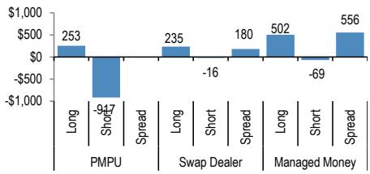

bar

| Category | Long ($) | Short ($) | Spread ($) |
| :--- | :--- | :--- | :--- |
| PMPU | 253 | -947 | |
| Swap Dealer | 235 | -16 | 180 |
| Managed Money | 502 | -69 | 556 |

Source: CFTC, CBOT, JPM Commodities Research

Figure 133: Weekly change in OI from changes in contracts & price   
US\$ million (futures and options)   
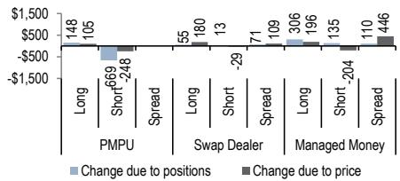

bar

| Category       | Long  | Short | Spread |
| -------------- | ----- | ----- | ------ |
| PMPU           | 148   | 105   | -      |
| Swap Dealer    | 55    | 180   | -29    |
| Managed Money  | 109   | 306   | 196    |
|            |       | -204  | 135    |
|            |       |       | 110    |
|            |       |       | 446    |

Source: CFTC, CBOT, JPM Commodities Research

Figure 135: Seasonal Managed Money net length   
Lots (1,000)   
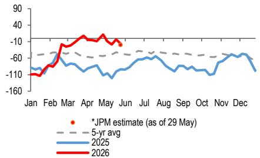

line

| Month | *JPM estimate (as of 29 May) | 5-yr avg | 2025 | 2026 |
|-------|-----------------------------|----------|------|------|
| Jan   | -110                        | -60      | -110 | -110 |
| Feb   | -105                        | -60      | -105 | -105 |
| Mar   | -10                         | -60      | -10  | -10  |
| Apr   | -10                         | -60      | -10  | -10  |
| May   | -10                         | -60      | -10  | -10  |
| Jun   | -10                         | -60      | -10  | -10  |
| Jul   | -10                         | -60      | -10  | -10  |
| Aug   | -10                         | -60      | -10  | -10  |
| Sep   | -10                         | -60      | -10  | -10  |
| Oct   | -10                         | -60      | -10  | -10  |
| Nov   | -10                         | -60      | -10  | -10  |
| Dec   | -10                         | -60      | -10  | -10  |

Source: CFTC, CBOT, JPM Commodities Research, \*Forecasts supplied by JPM GQDS Research, see methodology here

Figure 132: Gross PMPU position and price   
LHS: lots (1,000), RHS: USc/bu  
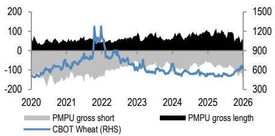

line

| Year | PMPU gross short | PMPU gross length | CBOT Wheat (RHS) |
|------|------------------|-------------------|------------------|
| 2020 | -100             | 900               | -100             |
| 2021 | -50              | 950               | -50              |
| 2022 | 0                | 1200              | 150              |
| 2023 | -50              | 950               | -50              |
| 2024 | -100             | 900               | -100             |
| 2025 | -50              | 950               | -50              |
| 2026 | -100             | 900               | -100             |

Source: CFTC, CBOT, JPM Commodities Research

Figure 134: Open interest share by trader type   
%   
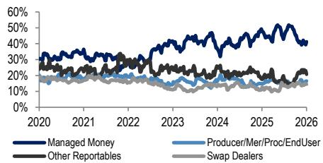

line

| Year | Managed Money | Producer/Mer/Proc/EndUser | Other Reportables | Swap Dealers |
|------|---------------|--------------------------|-------------------|--------------|
| 2020 | ~30%          | ~15%                     | ~25%              | ~15%         |
| 2021 | ~35%          | ~18%                     | ~28%              | ~16%         |
| 2022 | ~40%          | ~20%                     | ~30%              | ~17%         |
| 2023 | ~45%          | ~22%                     | ~32%              | ~18%         |
| 2024 | ~50%          | ~25%                     | ~35%              | ~19%         |
| 2025 | ~55%          | ~28%                     | ~38%              | ~20%         |
| 2026 | ~45%          | ~25%                     | ~35%              | ~18%         |

Source: CFTC, CBOT, JPM Commodities Research

Figure 136: Price momentum   
LHS: Z-score, RHS: USc/bu  
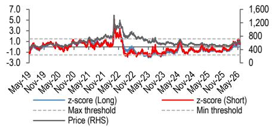

line

| Date    | Price (RHS) | z-score (Long) | z-score (Short) |
|---------|-------------|----------------|-----------------|
| May-19  | ~0          | ~0             | ~0              |
| Nov-19  | ~0          | ~0             | ~0              |
| May-20  | ~0          | ~0             | ~0              |
| Nov-20  | ~0          | ~0             | ~0              |
| May-21  | ~0          | ~0             | ~0              |
| Nov-21  | ~0          | ~0             | ~0              |
| May-22  | ~5.0        | ~5.0           | ~5.0            |
| Nov-22  | ~1.0        | ~1.0           | ~1.0            |
| May-23  | ~0          | ~0             | ~0              |
| Nov-23  | ~0          | ~0             | ~0              |
| May-24  | ~0          | ~0             | ~0              |
| Nov-24  | ~0          | ~0             | ~0              |
| May-25  | ~0          | ~0             | ~0              |
| Nov-25  | ~0          | ~0             | ~0              |
| May-26  | ~0          | ~0             | ~0              |

Source: CBOT, Bloomberg Finance L.P., JPM Commodities Research

# ICE Sugar No. 11

Contracts (futures and options) 

<table><tr><td rowspan="2" colspan="2"></td><td colspan="3">PMPU</td><td colspan="3">Swap Dealers</td><td colspan="3">Managed Money</td><td colspan="3">Other Reportables</td><td colspan="3">Non-Reportables</td></tr><tr><td>25-May-26</td><td>18-May-26</td><td>Wkly Chg</td><td>25-May-26</td><td>18-May-26</td><td>Wkly Chg</td><td>25-May-26</td><td>18-May-26</td><td>Wkly Chg</td><td>25-May-26</td><td>18-May-26</td><td>Wkly Chg</td><td>25-May-26</td><td>18-May-26</td><td>Wkly Chg</td></tr><tr><td>ICE</td><td>SUGAR NO. 11</td><td></td><td></td><td></td><td></td><td></td><td></td><td></td><td></td><td></td><td></td><td></td><td></td><td></td><td></td><td></td></tr><tr><td></td><td>Long</td><td>228,820</td><td>227,417</td><td>1,403</td><td>251,754</td><td>253,804</td><td>-2,050</td><td>173,711</td><td>164,138</td><td>9,573</td><td>83,194</td><td>78,625</td><td>4,569</td><td>94,166</td><td>99,856</td><td>-5,690</td></tr><tr><td></td><td>Short</td><td>382,525</td><td>371,526</td><td>10,999</td><td>59,102</td><td>56,705</td><td>2,397</td><td>257,748</td><td>264,594</td><td>-6,846</td><td>50,448</td><td>47,255</td><td>3,193</td><td>81,823</td><td>83,761</td><td>-1,938</td></tr><tr><td></td><td>Net Position</td><td>-153,705</td><td>-144,109</td><td>-9,596</td><td>192,652</td><td>197,099</td><td>-4,447</td><td>-84,037</td><td>-100,456</td><td>16,419</td><td>32,746</td><td>31,370</td><td>1,376</td><td>12,343</td><td>16,095</td><td>-3,752</td></tr><tr><td></td><td>Spreading</td><td></td><td></td><td></td><td>69,495</td><td>68,262</td><td>1,233</td><td>132,903</td><td>129,280</td><td>3,623</td><td>153,757</td><td>162,598</td><td>-8,841</td><td></td><td></td><td></td></tr></table>

Source: CFTC, JPM Commodities Research. Note: contracts are shown as reported by the CFTC—each reported spreading contract actually represents two positions (a long and a short), an important fact for accurately calculating actual open interest.

Figure 137: Weekly change in open interest by trading group   
US\$ million (futures and options)   
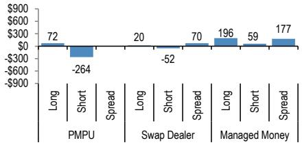

bar

| Category | Long | Short | Spread |
| :--- | :--- | :--- | :--- |
| PMPU | 72 | -264 | |
| Swap Dealer | 20 | -52 | 70 |
| Managed Money | 196 | 59 | 177 |

Source: CFTC, ICE, JPM Commodities Research

Figure 139: Weekly change in OI from changes in contracts & price   
US\$ million (futures and options)   
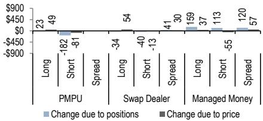

bar

| Category       | Long | Short | Spread |
| -------------- | ---- | ----- | ------ |
| PMPU           | 23   | -182  | -81    |
| Swap Dealer    | 54   | -40   | -13    |
| Managed Money  | 159  | 37    | -55    |

Source: CFTC, ICE, JPM Commodities Research

Figure 141: Seasonal Managed Money net length   
Lots (1,000)   
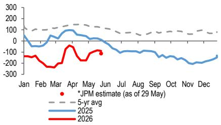

line

| Month | *JPM estimate (as of 29 May) | 5-yr avg | 2025 | 2026 |
|-------|------------------------------|----------|------|------|
| Jan   | ~100                         | ~100     | ~100 | ~-100 |
| Feb   | ~100                         | ~100     | ~-50 | ~-150 |
| Mar   | ~100                         | ~100     | ~-100 | ~-200 |
| Apr   | ~100                         | ~100     | ~-50 | ~-100 |
| May   | ~100                         | ~100     | ~-100 | ~-150 |
| Jun   | ~100                         | ~100     | ~-150 | ~-100 |
| Jul   | ~100                         | ~100     | ~-200 | ~-150 |
| Aug   | ~100                         | ~100     | ~-250 | ~-200 |
| Sep   | ~100                         | ~100     | ~-300 | ~-250 |
| Oct   | ~100                         | ~100     | ~-350 | ~-300 |
| Nov   | ~100                         | ~100     | ~-400 | ~-350 |
| Dec   | ~100                         | ~100     | ~-450 | ~-400 |

Source: CFTC, ICE, JPM Commodities Research, \*Forecasts supplied by JPM GQDS Research, see methodology here

Figure 138: Gross PMPU position and price   
LHS: lots (1,000), RHS: USc/lb  
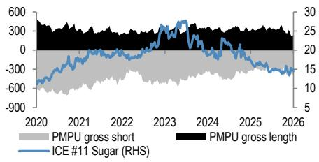

line

| Year | PMPU gross short | PMPU gross length | ICE #11 Sugar (RHS) |
|------|------------------|-------------------|---------------------|
| 2020 | -600             | 30                | -                   |
| 2021 | -500             | 25                | -                   |
| 2022 | -400             | 20                | -                   |
| 2023 | -300             | 15                | -                   |
| 2024 | -200             | 10                | -                   |
| 2025 | -100             | 5                 | -                   |
| 2026 | -50              | 0                 | -                   |

Source: CFTC, ICE, JPM Commodities Research

Figure 140: Open interest share by trader type   
%   
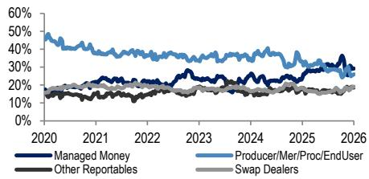

line

| Year | Managed Money | Producer/Mer/Proc/EndUser | Other Reportables | Swap Dealers |
|------|---------------|--------------------------|-------------------|--------------|
| 2020 | ~20%          | ~45%                     | ~15%              | ~15%         |
| 2021 | ~25%          | ~40%                     | ~15%              | ~15%         |
| 2022 | ~25%          | ~35%                     | ~15%              | ~15%         |
| 2023 | ~25%          | ~35%                     | ~15%              | ~15%         |
| 2024 | ~25%          | ~35%                     | ~15%              | ~15%         |
| 2025 | ~30%          | ~30%                     | ~15%              | ~15%         |
| 2026 | ~30%          | ~25%                     | ~15%              | ~15%         |

Source: CFTC, ICE, JPM Commodities Research

Figure 142: Price momentum   
LHS: Z-score, RHS: USc/lb  
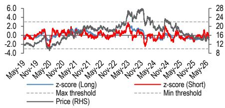

line

| Date    | Price (RHS) | z-score (Long) | z-score (Short) |
|---------|-------------|----------------|-----------------|
| May-19  | -2.0        | 0.0            | 0.0             |
| Nov-19  | -1.5        | 0.5            | 0.5             |
| May-20  | -1.0        | 1.0            | 1.0             |
| Nov-20  | -0.5        | 1.5            | 1.5             |
| May-21  | 0.0         | 2.0            | 2.0             |
| Nov-21  | 0.5         | 2.5            | 2.5             |
| May-22  | 1.0         | 3.0            | 3.0             |
| Nov-22  | 1.5         | 3.5            | 3.5             |
| May-23  | 2.0         | 4.0            | 4.0             |
| Nov-23  | 2.5         | 4.5            | 4.5             |
| May-24  | 3.0         | 5.0            | 5.0             |
| Nov-24  | 3.5         | 5.5            | 5.5             |
| May-25  | 4.0         | 6.0            | 6.0             |
| Nov-25  | 4.5         | 6.5            | 6.5             |
| May-26  | 5.0         | 7.0            | 7.0             |

Source: ICE, Bloomberg Finance L.P., JPM Commodities Research

# ICE Cotton No. 2

Contracts (futures and options) 

<table><tr><td rowspan="2" colspan="2"></td><td colspan="3">PMPU</td><td colspan="3">Swap Dealers</td><td colspan="3">Managed Money</td><td colspan="3">Other Reportables</td><td colspan="3">Non-Reportables</td></tr><tr><td>25-May-26</td><td>18-May-26</td><td>Wkly Chg</td><td>25-May-26</td><td>18-May-26</td><td>Wkly Chg</td><td>25-May-26</td><td>18-May-26</td><td>Wkly Chg</td><td>25-May-26</td><td>18-May-26</td><td>Wkly Chg</td><td>25-May-26</td><td>18-May-26</td><td>Wkly Chg</td></tr><tr><td>ICE</td><td>COTTON NO. 2</td><td></td><td></td><td></td><td></td><td></td><td></td><td></td><td></td><td></td><td></td><td></td><td></td><td></td><td></td><td></td></tr><tr><td></td><td>Long</td><td>80,570</td><td>82,163</td><td>-1,593</td><td>56,980</td><td>54,014</td><td>2,966</td><td>82,849</td><td>83,901</td><td>-1,052</td><td>53,164</td><td>62,724</td><td>-9,560</td><td>21,512</td><td>26,584</td><td>-5,072</td></tr><tr><td></td><td>Short</td><td>213,877</td><td>220,638</td><td>-6,761</td><td>34,315</td><td>37,689</td><td>-3,374</td><td>20,804</td><td>24,331</td><td>-3,527</td><td>16,096</td><td>15,685</td><td>411</td><td>9,983</td><td>11,042</td><td>-1,059</td></tr><tr><td></td><td>Net Position</td><td>-133,307</td><td>-138,475</td><td>5,168</td><td>22,665</td><td>16,325</td><td>6,340</td><td>62,045</td><td>59,570</td><td>2,475</td><td>37,068</td><td>47,039</td><td>-9,971</td><td>11,529</td><td>15,542</td><td>-4,013</td></tr><tr><td></td><td>Spreading</td><td></td><td></td><td></td><td>31,987</td><td>28,421</td><td>3,566</td><td>56,614</td><td>56,545</td><td>69</td><td>119,481</td><td>120,688</td><td>-1,207</td><td></td><td></td><td></td></tr></table>

Source: CFTC, JPM Commodities Research. Note: contracts are shown as reported by the CFTC—each reported spreading contract actually represents two positions (a long and a short), an important fact for accurately calculating actual open interest.

Figure 143: Weekly change in open interest by trading group   
US\$ million (futures and options)   
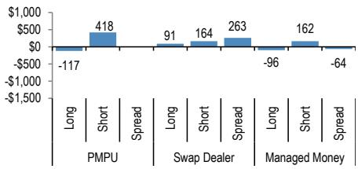

bar

| Category | Long | Short | Spread |
| :--- | :--- | :--- | :--- |
| PMPU | -117 | 418 | |
| Swap Dealer | 91 | 164 | 263 |
| Managed Money | -96 | 162 | -64 |

Source: CFTC, ICE, JPM Commodities Research

Figure 145: Weekly change in OI from changes in contracts & price   
US\$ million (futures and options)   
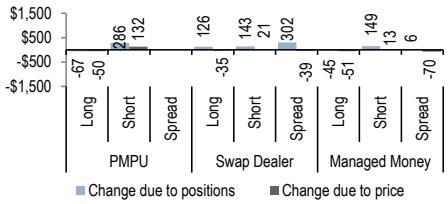

bar

| Category       | Long  | Short | Spread |
| -------------- | ----- | ----- | ------ |
| PMPU           | -67   | -50   | 286    |
| Swap Dealer    | 132   | 126   | 143    |
| Managed Money  | -39   | -51   | 149    |
| PMPU           | -70   | 6     | 13     |

Source: CFTC, ICE, JPM Commodities Research

Figure 147: Seasonal Managed Money net length   
Lots (1,000)   
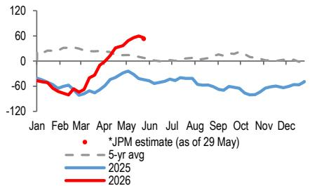

line

| Month | *JPM estimate (as of 29 May) | 5-yr avg | 2025 | 2026 |
|-------|-----------------------------|----------|------|------|
| Jan   | -60                         | 0        | -60  | -60  |
| Feb   | -70                         | 0        | -70  | -70  |
| Mar   | -80                         | 0        | -80  | -80  |
| Apr   | -60                         | 0        | -60  | -60  |
| May   | 0                           | 0        | -40  | 0    |
| Jun   | 40                          | 0        | -20  | 40   |
| Jul   | 60                          | 0        | -10  | 60   |
| Aug   | 40                          | 0        | -15  | 40   |
| Sep   | 20                          | 0        | -20  | 20   |
| Oct   | 0                           | 0        | -30  | 0    |
| Nov   | -20                         | 0        | -40  | -20  |
| Dec   | -40                         | 0        | -50  | -40  |

Source: CFTC, ICE, JPM Commodities Research, \*Forecasts supplied by JPM GQDS Research, see methodology here

Figure 144: Gross PMPU position and price   
LHS: lots (1,000), RHS: USc/lb  
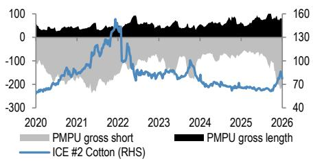

line

| Year | PMPU gross short | PMPU gross length | ICE #2 Cotton (RHS) |
|------|------------------|-------------------|--------------------|
| 2020 | -100             | 0                 | -200               |
| 2021 | -50              | 50                | -100               |
| 2022 | 0                | 100               | -50                |
| 2023 | -50              | 50                | -100               |
| 2024 | -100             | 100               | -50                |
| 2025 | -150             | 150               | -100               |
| 2026 | -200             | 200               | -150               |

Source: CFTC, ICE, JPM Commodities Research

Figure 146: Open interest share by trader type   
%   
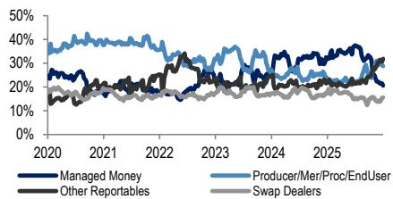

line

| Year | Managed Money | Producer/Mer/Proc/EndUser | Other Reportables | Swap Dealers |
|------|---------------|--------------------------|-------------------|--------------|
| 2020 | ~30%          | ~40%                     | ~15%              | ~15%         |
| 2021 | ~25%          | ~35%                     | ~18%              | ~18%         |
| 2022 | ~20%          | ~30%                     | ~20%              | ~20%         |
| 2023 | ~25%          | ~35%                     | ~25%              | ~25%         |
| 2024 | ~30%          | ~30%                     | ~25%              | ~25%         |
| 2025 | ~35%          | ~35%                     | ~30%              | ~30%         |

Source: CFTC, ICE, JPM Commodities Research

Figure 148: Price momentum   
LHS: Z-score, RHS: USc/lb  
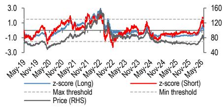

line

| Date    | z-score (Long) | z-score (Short) | Price (RHS) |
|---------|----------------|-----------------|-------------|
| May-19  | -1.0           | -1.0            | -3.0        |
| Nov-19  | -0.5           | -0.5            | -2.5        |
| May-20  | 0.0            | 0.0             | -2.0        |
| Nov-20  | 0.5            | 0.5             | -1.5        |
| May-21  | 1.0            | 1.0             | -1.0        |
| Nov-21  | 1.5            | 1.5             | -0.5        |
| May-22  | 2.0            | 2.0             | 0.0         |
| Nov-22  | 1.0            | 1.0             | 0.5         |
| May-23  | 0.5            | 0.5             | 1.0         |
| Nov-23  | 0.0            | 0.0             | 1.5         |
| May-24  | -0.5           | -0.5            | 2.0         |
| Nov-24  | -1.0           | -1.0            | 2.5         |
| May-25  | -1.5           | -1.5            | 3.0         |
| Nov-25  | -2.0           | -2.0            | 3.5         |
| May-26  | -1.0           | -1.0            | 4.0         |

Source: ICE, Bloomberg Finance L.P., JPM Commodities Research

# ICE Coffee

Contracts (futures and options) 

<table><tr><td rowspan="2" colspan="2"></td><td colspan="3">PMPU</td><td colspan="3">Swap Dealers</td><td colspan="3">Managed Money</td><td colspan="3">Other Reportables</td><td colspan="3">Non-Reportables</td></tr><tr><td>25-May-26</td><td>18-May-26</td><td>Wkly Chg</td><td>25-May-26</td><td>18-May-26</td><td>Wkly Chg</td><td>25-May-26</td><td>18-May-26</td><td>Wkly Chg</td><td>25-May-26</td><td>18-May-26</td><td>Wkly Chg</td><td>25-May-26</td><td>18-May-26</td><td>Wkly Chg</td></tr><tr><td>ICE</td><td>COFFEE &#x27;C&#x27;</td><td></td><td></td><td></td><td></td><td></td><td></td><td></td><td></td><td></td><td></td><td></td><td></td><td></td><td></td><td></td></tr><tr><td></td><td>Long</td><td>53,490</td><td>47,372</td><td>6,118</td><td>26,480</td><td>26,531</td><td>-51</td><td>42,522</td><td>44,974</td><td>-2,452</td><td>8,475</td><td>7,712</td><td>763</td><td>8,485</td><td>8,635</td><td>-150</td></tr><tr><td></td><td>Short</td><td>73,352</td><td>71,717</td><td>1,635</td><td>20,514</td><td>21,870</td><td>-1,356</td><td>24,614</td><td>19,946</td><td>4,668</td><td>11,764</td><td>12,459</td><td>-695</td><td>9,208</td><td>9,232</td><td>-24</td></tr><tr><td></td><td>Net Position</td><td>-19,862</td><td>-24,345</td><td>4,483</td><td>5,966</td><td>4,661</td><td>1,305</td><td>17,908</td><td>25,028</td><td>-7,120</td><td>-3,289</td><td>-4,747</td><td>1,458</td><td>-723</td><td>-597</td><td>-126</td></tr><tr><td></td><td>Spreading</td><td></td><td></td><td></td><td>5,974</td><td>5,181</td><td>793</td><td>43,431</td><td>38,505</td><td>4,926</td><td>45,977</td><td>41,104</td><td>4,873</td><td></td><td></td><td></td></tr></table>

Source: CFTC, JPM Commodities Research. Note: contracts are shown as reported by the CFTC—each reported spreading contract actually represents two positions (a long and a short), an important fact for accurately calculating actual open interest.

Figure 149: Weekly change in open interest by trading group   
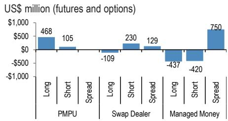

bar

| Category | Segment | Value (US$ million) |
| :--- | :--- | :--- |
| PMPU | Long | 468 |
| PMPU | Short | 105 |
| PMPU | Spread | |
| Swap Dealer | Long | -109 |
| Swap Dealer | Short | 230 |
| Swap Dealer | Spread | 129 |
| Managed Money | Long | -437 |
| Managed Money | Short | -420 |
| Managed Money | Spread | 750 |

Source: CFTC, ICE, JPM Commodities Research

Figure 151: Weekly change in OI from changes in contracts & price   
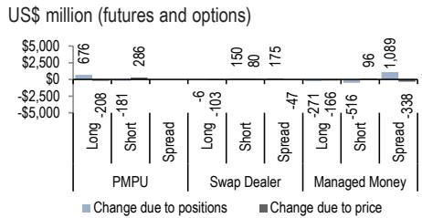

bar

| Category       | Long   | Short  | Spread |
| -------------- | ------ | ------ | ------ |
| PMPU           | -208   | -181   |        |
| Swap Dealer    | -103   |        | -6     |
| Managed Money  | -166   | -516   | -47    |
|            | 1,089  |        |        |

Source: CFTC, ICE, JPM Commodities Research

Figure 153: Seasonal Managed Money net   
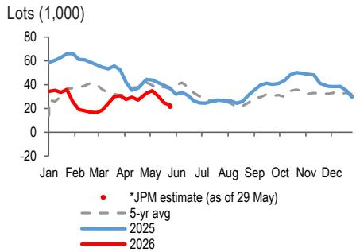

line

| Month | 2025 | 2026 | JPM estimate (as of 29 May) |
|-------|------|------|-----------------------------|
| Jan   | 60   | 30   | 30                          |
| Feb   | 65   | 25   | 30                          |
| Mar   | 60   | 20   | 30                          |
| Apr   | 55   | 30   | 30                          |
| May   | 45   | 35   | 30                          |
| Jun   | 40   | 25   | 30                          |
| Jul   | 35   | 30   | 30                          |
| Aug   | 30   | 35   | 30                          |
| Sep   | 40   | 40   | 30                          |
| Oct   | 45   | 45   | 30                          |
| Nov   | 50   | 50   | 30                          |
| Dec   | 45   | 45   | 30                          |

Source: CFTC, ICE, JPM Commodities Research, \*Forecasts supplied by JPM GQDS Research, see methodology here

Figure 150: Gross PMPU position and price   
LHS: lots (1,000), RHS: USc/lb  
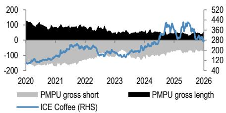

line

| Year | PMPU gross short | PMPU gross length | ICE Coffee (RHS) |
|------|------------------|-------------------|------------------|
| 2020 | -100             | 100               | -100             |
| 2021 | -50              | 150               | -50              |
| 2022 | 0                | 200               | 0                |
| 2023 | 50               | 250               | 50               |
| 2024 | 100              | 300               | 100              |
| 2025 | 150              | 350               | 150              |
| 2026 | 200              | 400               | 200              |

Source: CFTC, ICE, JPM Commodities Research

Figure 152: Open interest share by trader type   
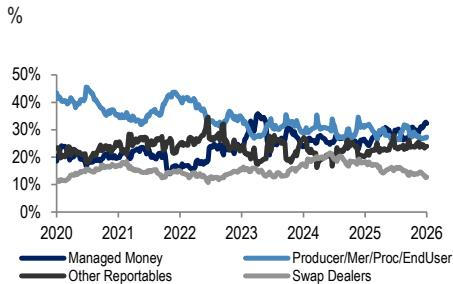

line

| Year | Managed Money | Producer/Mer/Proc/EndUser | Other Reportables | Swap Dealers |
|------|---------------|--------------------------|-------------------|--------------|
| 2020 | ~20%          | ~45%                     | ~20%              | ~10%         |
| 2021 | ~25%          | ~35%                     | ~25%              | ~15%         |
| 2022 | ~30%          | ~40%                     | ~30%              | ~15%         |
| 2023 | ~35%          | ~35%                     | ~35%              | ~15%         |
| 2024 | ~30%          | ~30%                     | ~30%              | ~15%         |
| 2025 | ~30%          | ~30%                     | ~30%              | ~15%         |
| 2026 | ~30%          | ~30%                     | ~30%              | ~15%         |

Source: CFTC, ICE, JPM Commodities Research

Figure 154: Price momentum   
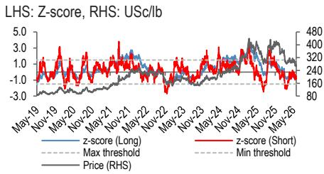

line

| Date    | z-score (Long) | z-score (Short) | Price (RHS) |
|---------|----------------|-----------------|-------------|
| May-19  | ~1.0           | ~1.0            | ~80         |
| Nov-19  | ~1.5           | ~1.5            | ~160        |
| May-20  | ~2.0           | ~2.0            | ~240        |
| Nov-20  | ~1.0           | ~1.0            | ~160        |
| May-21  | ~1.5           | ~1.5            | ~240        |
| Nov-21  | ~2.0           | ~2.0            | ~320        |
| May-22  | ~1.0           | ~1.0            | ~160        |
| Nov-22  | ~1.5           | ~1.5            | ~240        |
| May-23  | ~2.0           | ~2.0            | ~320        |
| Nov-23  | ~1.0           | ~1.0            | ~160        |
| May-24  | ~1.5           | ~1.5            | ~240        |
| Nov-24  | ~2.0           | ~2.0            | ~320        |
| May-25  | ~1.0           | ~1.0            | ~160        |
| Nov-25  | ~1.5           | ~1.5            | ~240        |
| May-26  | ~2.0           | ~2.0            | ~320        |

Source: ICE, Bloomberg Finance L.P., JPM Commodities Research

# ICE Cocoa

Contracts (futures and options) 

<table><tr><td rowspan="2" colspan="2"></td><td colspan="3">PMPU</td><td colspan="3">Swap Dealers</td><td colspan="3">Managed Money</td><td colspan="3">Other Reportables</td><td colspan="3">Non-Reportables</td></tr><tr><td>25-May-26</td><td>18-May-26</td><td>Wkly Chg</td><td>25-May-26</td><td>18-May-26</td><td>Wkly Chg</td><td>25-May-26</td><td>18-May-26</td><td>Wkly Chg</td><td>25-May-26</td><td>18-May-26</td><td>Wkly Chg</td><td>25-May-26</td><td>18-May-26</td><td>Wkly Chg</td></tr><tr><td>ICE</td><td>COCOA</td><td></td><td></td><td></td><td></td><td></td><td></td><td></td><td></td><td></td><td></td><td></td><td></td><td></td><td></td><td></td></tr><tr><td></td><td>Long</td><td>51,269</td><td>54,794</td><td>-3,525</td><td>50,938</td><td>47,055</td><td>3,883</td><td>18,877</td><td>21,950</td><td>-3,073</td><td>15,166</td><td>16,064</td><td>-898</td><td>11,156</td><td>11,372</td><td>-216</td></tr><tr><td></td><td>Short</td><td>77,805</td><td>80,570</td><td>-2,765</td><td>4,448</td><td>4,204</td><td>244</td><td>35,043</td><td>35,919</td><td>-876</td><td>19,878</td><td>20,437</td><td>-559</td><td>10,232</td><td>10,105</td><td>127</td></tr><tr><td></td><td>Net Position</td><td>-26,536</td><td>-25,776</td><td>-760</td><td>46,490</td><td>42,851</td><td>3,639</td><td>-16,166</td><td>-13,969</td><td>-2,197</td><td>-4,712</td><td>-4,373</td><td>-339</td><td>924</td><td>1,267</td><td>-343</td></tr><tr><td></td><td>Spreading</td><td></td><td></td><td></td><td>15,604</td><td>15,377</td><td>227</td><td>38,356</td><td>38,473</td><td>-117</td><td>45,446</td><td>46,337</td><td>-891</td><td></td><td></td><td></td></tr></table>

Source: CFTC, JPM Commodities Research. Note: contracts are shown as reported by the CFTC—each reported spreading contract actually represents two positions (a long and a short), an important fact for accurately calculating actual open interest.

Figure 155: Weekly change in open interest by trading group   
US\$ million (futures and options)   
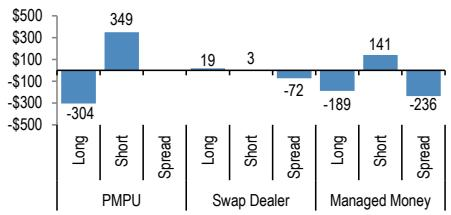

bar

| Category | Long | Short | Spread |
| :--- | :--- | :--- | :--- |
| PMPU | -304 | 349 | |
| Swap Dealer | 19 | 3 | |
| Managed Money | -72 | -189 | 141 |
| | | | -236 |

Source: CFTC, ICE, JPM Commodities Research

Figure 157: Weekly change in OI from changes in contracts & price   
US\$ million (futures and options)   
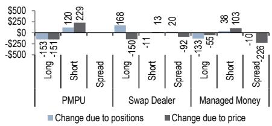

bar

| Category       | Change due to positions | Change due to price |
| -------------- | ------------------------ | --------------------- |
| PMPU           | -153                     | -151                  |
| Swap Dealer    | -120                     | -229                  |
| Managed Money  | -168                     | -150                  |
|            | -11                      | 13                    |
|            | -92                      | 20                    |
|            | -133                     | -55                   |
|            | -58                      | 38                    |
|            | -10                      | 103                   |
|            | -226                     | -226                  |

Source: CFTC, ICE, JPM Commodities Research

Figure 159: Seasonal Managed Money net length   
Lots (1,000)   
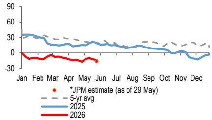

line

| Month | *JPM estimate (as of 29 May) | 5-yr avg | 2025 | 2026 |
|-------|-----------------------------|----------|------|------|
| Jan   | ~30                         | ~30      | ~30  | ~0   |
| Feb   | ~25                         | ~25      | ~25  | ~-5  |
| Mar   | ~20                         | ~20      | ~20  | ~-10 |
| Apr   | ~15                         | ~15      | ~15  | ~-15 |
| May   | ~10                         | ~10      | ~10  | ~-20 |
| Jun   | ~5                          | ~5       | ~5   | ~-25 |
| Jul   | ~0                          | ~0       | ~0   | ~-30 |
| Aug   | ~-5                         | ~-5      | ~-5  | ~-30 |
| Sep   | ~-10                        | ~-10     | ~-10 | ~-30 |
| Oct   | ~-15                        | ~-15     | ~-15 | ~-30 |
| Nov   | ~-20                        | ~-20     | ~-20 | ~-30 |
| Dec   | ~-25                        | ~-25     | ~-25 | ~-30 |

Source: CFTC, ICE, JPM Commodities Research, \*Forecasts supplied by JPM GQDS Research, see methodology here

Figure 156: Gross PMPU position and price   
LHS: lots (1,000), RHS: USd/MT   
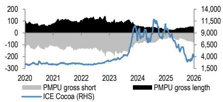

line

| Year | PMPU gross short | PMPU gross length | ICE Cocoa (RHS) |
|------|------------------|-------------------|-----------------|
| 2020 | ~0               | ~11,500           | ~-300           |
| 2021 | ~0               | ~11,500           | ~-250           |
| 2022 | ~0               | ~11,500           | ~-200           |
| 2023 | ~0               | ~11,500           | ~-150           |
| 2024 | ~0               | ~11,500           | ~-100           |
| 2025 | ~0               | ~11,500           | ~-50            |
| 2026 | ~0               | ~11,500           | ~-1,500         |

Source: CFTC, ICE, JPM Commodities Research

Figure 158: Open interest share by trader type   
%   
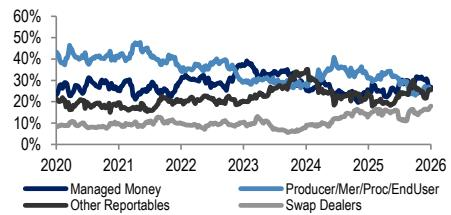

line

| Year | Managed Money | Producer/Mer/Proc/EndUser | Other Reportables | Swap Dealers |
|------|---------------|--------------------------|-------------------|--------------|
| 2020 | ~30%          | ~45%                     | ~25%              | ~10%         |
| 2021 | ~35%          | ~48%                     | ~28%              | ~12%         |
| 2022 | ~32%          | ~42%                     | ~26%              | ~11%         |
| 2023 | ~34%          | ~38%                     | ~27%              | ~13%         |
| 2024 | ~30%          | ~35%                     | ~25%              | ~15%         |
| 2025 | ~28%          | ~32%                     | ~23%              | ~17%         |
| 2026 | ~25%          | ~30%                     | ~20%              | ~18%         |

Source: CFTC, ICE, JPM Commodities Research

Figure 160: Price momentum   
LHS: Z-score, RHS: USd/MT   
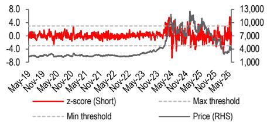

line

| Date     | z-score (Short) | Max threshold | Min threshold | Price (RHS) |
|----------|-----------------|---------------|---------------|-------------|
| May-19   | ~0.0            | ~0.0          | ~0.0          | ~0.0        |
| Nov-19   | ~0.0            | ~0.0          | ~0.0          | ~0.0        |
| May-20   | ~0.0            | ~0.0          | ~0.0          | ~0.0        |
| Nov-20   | ~0.0            | ~0.0          | ~0.0          | ~0.0        |
| May-21   | ~0.0            | ~0.0          | ~0.0          | ~0.0        |
| Nov-21   | ~0.0            | ~0.0          | ~0.0          | ~0.0        |
| May-22   | ~0.0            | ~0.0          | ~0.0          | ~0.0        |
| Nov-22   | ~0.0            | ~0.0          | ~0.0          | ~0.0        |
| May-23   | ~0.0            | ~0.0          | ~0.0          | ~0.0        |
| Nov-23   | ~0.0            | ~0.0          | ~0.0          | ~0.0        |
| May-24   | ~4.0            | ~4.0          | ~4.0          | ~4.0        |
| Nov-24   | ~6.0            | ~6.0          | ~6.0          | ~6.0        |
| May-25   | ~8.0            | ~8.0          | ~8.0          | ~8.0        |
| Nov-25   | ~6.0            | ~6.0          | ~6.0          | ~6.0        |
| May-26   | ~4.0            | ~4.0          | ~4.0          | ~4.0        |
| May-27   | ~2.0            | ~2.0          | ~2.0          | ~2.0        |
| May-28   | ~1.0            | ~1.0          | ~1.0          | ~1.0        |

Source: ICE, Bloomberg Finance L.P., JPM Commodities Research

# CME Live Cattle

Contracts (futures and options) 

<table><tr><td rowspan="2" colspan="2"></td><td colspan="3">PMPU</td><td colspan="3">Swap Dealers</td><td colspan="3">Managed Money</td><td colspan="3">Other Reportables</td><td colspan="3">Non-Reportables</td></tr><tr><td>25-May-26</td><td>18-May-26</td><td>Wkly Chg</td><td>25-May-26</td><td>18-May-26</td><td>Wkly Chg</td><td>25-May-26</td><td>18-May-26</td><td>Wkly Chg</td><td>25-May-26</td><td>18-May-26</td><td>Wkly Chg</td><td>25-May-26</td><td>18-May-26</td><td>Wkly Chg</td></tr><tr><td>CME</td><td>LIVE CATTLE</td><td></td><td></td><td></td><td></td><td></td><td></td><td></td><td></td><td></td><td></td><td></td><td></td><td></td><td></td><td></td></tr><tr><td></td><td>Long</td><td>47,252</td><td>40,360</td><td>6,892</td><td>68,041</td><td>67,188</td><td>853</td><td>142,147</td><td>143,316</td><td>-1,169</td><td>17,600</td><td>17,786</td><td>-186</td><td>33,250</td><td>39,189</td><td>-5,939</td></tr><tr><td></td><td>Short</td><td>222,234</td><td>211,230</td><td>11,004</td><td>10,771</td><td>10,007</td><td>764</td><td>12,034</td><td>12,430</td><td>-396</td><td>8,212</td><td>8,046</td><td>166</td><td>55,038</td><td>66,125</td><td>-11,087</td></tr><tr><td></td><td>Net Position</td><td>-174,982</td><td>-170,870</td><td>-4,112</td><td>57,270</td><td>57,181</td><td>89</td><td>130,113</td><td>130,886</td><td>-773</td><td>9,388</td><td>9,740</td><td>-352</td><td>-21,788</td><td>-26,936</td><td>5,148</td></tr><tr><td></td><td>Spreading</td><td></td><td></td><td></td><td>7,148</td><td>6,864</td><td>284</td><td>67,002</td><td>58,228</td><td>8,774</td><td>109,121</td><td>107,125</td><td>1,996</td><td></td><td></td><td></td></tr></table>

Source: CFTC, JPM Commodities Research. Note: contracts are shown as reported by the CFTC—each reported spreading contract actually represents two positions (a long and a short), an important fact for accurately calculating actual open interest.

Figure 161: Weekly change in open interest by trading group   
US\$ million (futures and options)   
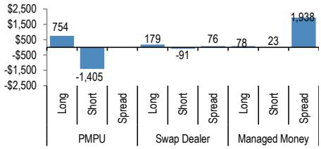

bar

| Category | Long | Short | Spread |
| :--- | :--- | :--- | :--- |
| PMPU | 754 | -1,405 | |
| Swap Dealer | 179 | -91 | 76 |
| Managed Money | 78 | 23 | 1,938 |

Source: CFTC, CME, JPM Commodities Research

Figure 163: Weekly change in OI from changes in contracts & price   
US\$ million (futures and options)   
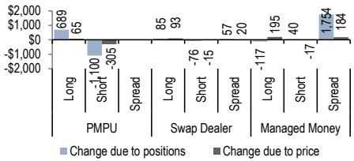

bar

| Category       | Change due to positions | Change due to price |
| -------------- | ------------------------ | --------------------- |
| PMPU           | 689                      | 65                    |
| Swap Dealer    | -100                     | -305                  |
| Managed Money  | -117                     | -17                   |
| PMPU - Swap Dealer | -76                   | -15                   |
| PMPU - Managed Money | -195                  | 40                    |
| PMPU - Swap Dealer - Managed Money | 1,754                | 184                   |

Source: CFTC, CME, JPM Commodities Research

Figure 165: Seasonal Managed Money net length   
Lots (1,000)   
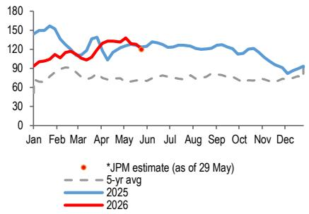

line

| Month | 2025 | 2026 | 5-yr avg |
|-------|------|------|----------|
| Jan   | 150  | 90   | 70       |
| Feb   | 140  | 100  | 75       |
| Mar   | 130  | 110  | 80       |
| Apr   | 120  | 120  | 85       |
| May   | 110  | 130  | 90       |
| Jun   | 120  | 120  | 85       |
| Jul   | 125  | -    | 85       |
| Aug   | 120  | -    | 85       |
| Sep   | 125  | -    | 85       |
| Oct   | 120  | -    | 85       |
| Nov   | 110  | -    | 85       |
| Dec   | 90   | -    | 85       |

Source: CFTC, CME, JPM Commodities Research, \*Forecasts supplied by JPM GQDS Research, see methodology here

Figure 162: Gross PMPU position and price   
LHS: lots (1,000), RHS: USc/lb  
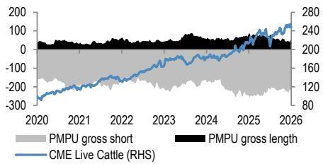

line

| Year | PMPU gross short | PMPU gross length | CME Live Cattle (RHS) |
|------|------------------|-------------------|------------------------|
| 2020 | -150             | 0                 | -300                   |
| 2021 | -100             | 0                 | -200                   |
| 2022 | -50              | 0                 | -100                   |
| 2023 | 0                | 0                 | 0                      |
| 2024 | 50               | 0                 | 100                    |
| 2025 | 100              | 0                 | 150                    |
| 2026 | 150              | 0                 | 200                    |

Source: CFTC, CME, JPM Commodities Research

Figure 164: Open interest share by trader type   
%   
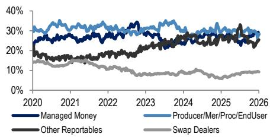

line

| Year | Managed Money | Producer/Mer/Proc/EndUser | Other Reportables | Swap Dealers |
|------|---------------|--------------------------|-------------------|--------------|
| 2020 | ~25%          | ~30%                     | ~15%              | ~10%         |
| 2021 | ~28%          | ~32%                     | ~16%              | ~9%          |
| 2022 | ~27%          | ~31%                     | ~17%              | ~8%          |
| 2023 | ~26%          | ~30%                     | ~18%              | ~7%          |
| 2024 | ~25%          | ~29%                     | ~19%              | ~6%          |
| 2025 | ~24%          | ~28%                     | ~20%              | ~7%          |
| 2026 | ~23%          | ~27%                     | ~21%              | ~8%          |

Source: CFTC, CME, JPM Commodities Research

# CME Lean Hogs

Contracts (futures and options) 

<table><tr><td rowspan="2" colspan="2"></td><td colspan="3">PMPU</td><td colspan="3">Swap Dealers</td><td colspan="3">Managed Money</td><td colspan="3">Other Reportables</td><td colspan="3">Non-Reportables</td></tr><tr><td>26-May-26</td><td>19-May-26</td><td>Wkly Chg</td><td>26-May-26</td><td>19-May-26</td><td>Wkly Chg</td><td>26-May-26</td><td>19-May-26</td><td>Wkly Chg</td><td>26-May-26</td><td>19-May-26</td><td>Wkly Chg</td><td>26-May-26</td><td>19-May-26</td><td>Wkly Chg</td></tr><tr><td>CME</td><td>LEAN HOGS</td><td></td><td></td><td></td><td></td><td></td><td></td><td></td><td></td><td></td><td></td><td></td><td></td><td></td><td></td><td></td></tr><tr><td></td><td>Long</td><td>73,417</td><td>65,171</td><td>8,246</td><td>81,749</td><td>81,334</td><td>415</td><td>70,339</td><td>80,557</td><td>-10,218</td><td>16,309</td><td>14,764</td><td>1,545</td><td>29,198</td><td>27,494</td><td>1,704</td></tr><tr><td></td><td>Short</td><td>155,894</td><td>162,906</td><td>-7,012</td><td>6,235</td><td>9,131</td><td>-2,896</td><td>57,354</td><td>46,844</td><td>10,510</td><td>18,419</td><td>16,222</td><td>2,197</td><td>33,110</td><td>34,217</td><td>-1,107</td></tr><tr><td></td><td>Net Position</td><td>-82,477</td><td>-97,735</td><td>15,258</td><td>75,514</td><td>72,203</td><td>3,311</td><td>12,985</td><td>33,713</td><td>-20,728</td><td>-2,110</td><td>-1,458</td><td>-652</td><td>-3,912</td><td>-6,723</td><td>2,811</td></tr><tr><td></td><td>Spreading</td><td></td><td></td><td></td><td>8,906</td><td>7,408</td><td>1,498</td><td>73,161</td><td>69,194</td><td>3,967</td><td>103,501</td><td>96,287</td><td>7,214</td><td></td><td></td><td></td></tr></table>

Source: CFTC, JPM Commodities Research. Note: contracts are shown as reported by the CFTC—each reported spreading contract actually represents two positions (a long and a short), an important fact for accurately calculating actual open interest.

Figure 166: Weekly change in open interest by trading group   
US\$ million (futures and options)   
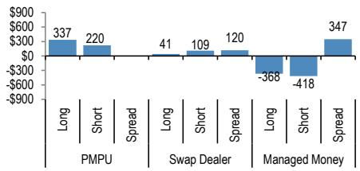

bar

| Category | Value |
|---|---|
| PMPU - Long | 337 |
| PMPU - Short | 220 |
| PMPU - Spread | |
| Swap Dealer - Long | 41 |
| Swap Dealer - Short | 109 |
| Swap Dealer - Spread | 120 |
| Managed Money - Long | -368 |
| Managed Money - Short | -418 |
| Managed Money - Spread | 347 |

Source: CFTC, CME, JPM Commodities Research

Figure 168: Weekly change in OI from changes in contracts & price   
US\$ million (futures and options)   
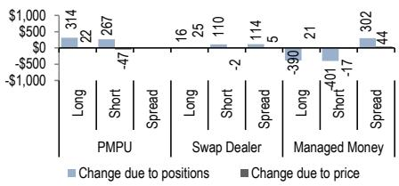

bar

| Category       | Long  | Short | Spread |
| -------------- | ----- | ----- | ------ |
| PMPU           | 314   | 22    | -47    |
| Swap Dealer    | 16    | 25    | -2     |
| Managed Money  | 114   | 5     | -390   |
|            | 21    | -401  | -17    |
|            | 302   | 44    |        |

Source: CFTC, CME, JPM Commodities Research

Figure 170: Seasonal Managed Money net length   
Lots (1,000)   
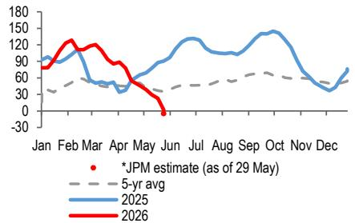

line

| Month | *JPM estimate (as of 29 May) | 5-yr avg | 2025 | 2026 |
|-------|-----------------------------|----------|------|------|
| Jan   | ~90                         | ~30      | ~90  | ~90  |
| Feb   | ~120                        | ~40      | ~100 | ~120 |
| Mar   | ~110                        | ~50      | ~90  | ~110 |
| Apr   | ~80                         | ~40      | ~70  | ~80  |
| May   | ~60                         | ~30      | ~60  | ~60  |
| Jun   | ~30                         | ~30      | ~70  | ~30  |
| Jul   | ~60                         | ~40      | ~100 | ~60  |
| Aug   | ~70                         | ~50      | ~110 | ~70  |
| Sep   | ~80                         | ~60      | ~120 | ~80  |
| Oct   | ~90                         | ~70      | ~130 | ~90  |
| Nov   | ~70                         | ~60      | ~110 | ~70  |
| Dec   | ~60                         | ~50      | ~80  | ~60  |

Source: CFTC, CME, JPM Commodities Research, \*Forecasts supplied by JPM GQDS Research, see methodology here

Figure 167: Gross PMPU position and price   
LHS: lots (1,000), RHS: USc/lb  
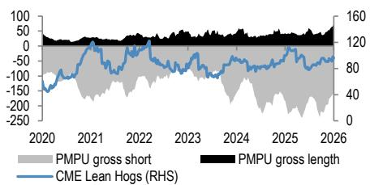

line

| Year | PMPU gross short | PMPU gross length | CME Lean Hogs (RHS) |
|------|------------------|-------------------|---------------------|
| 2020 | -100             | 0                 | -100                |
| 2021 | -50              | 50                | -50                 |
| 2022 | -100             | 100               | -100                |
| 2023 | -50              | 50                | -50                 |
| 2024 | -100             | 100               | -100                |
| 2025 | -50              | 50                | -50                 |
| 2026 | -100             | 100               | -100                |

Source: CFTC, CME, JPM Commodities Research

Figure 169: Open interest share by trader type   
%   
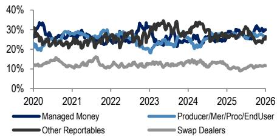

line

| Year | Managed Money | Producer/Mer/Proc/EndUser | Other Reportables | Swap Dealers |
|------|---------------|--------------------------|-------------------|--------------|
| 2020 | ~30%          | ~25%                     | ~25%              | ~10%         |
| 2021 | ~25%          | ~20%                     | ~20%              | ~10%         |
| 2022 | ~25%          | ~20%                     | ~20%              | ~10%         |
| 2023 | ~30%          | ~25%                     | ~25%              | ~10%         |
| 2024 | ~30%          | ~25%                     | ~30%              | ~10%         |
| 2025 | ~30%          | ~25%                     | ~30%              | ~10%         |
| 2026 | ~30%          | ~25%                     | ~30%              | ~10%         |

Source: CFTC, CME, JPM Commodities Research

# Disclosures

# History of Investment Recommendations:

A history of JPM investment recommendations disseminated during the preceding 12 months can be accessed on the Research & Commentary page of http://www.JPMmarkets.com where you can also search by analyst name, sector or financial instrument.

Analysts' Compensation: The research analysts responsible for the preparation of this report receive compensation based upon various factors, including the quality and accuracy of research, client feedback, competitive factors, and overall firm revenues.

Company-Specific Disclosures: Important disclosures, including price charts and credit opinion history tables (if applicable), are available for compendium reports and all JPM-covered companies, and certain non-covered companies, by visiting https://www.jpmm.com/research/disclosures, calling 1-800-477-0406, or e-mailing research.disclosure.inquiries@JPM.com with your request.

# Other Disclosures

JPM is a marketing name for investment banking businesses of JPM Chase & Co. and its subsidiaries and affiliates worldwide.

UK MIFID FICC research unbundling exemption: UK clients should refer to UK MIFID Research Unbundling exemption for details of JPM's implementation of the FICC research exemption and guidance on relevant FICC research categorisation.

JPM may, from time to time, write on issuers or securities targeted by economic or financial sanctions imposed or administered by the governmental authorities of the U.S., EU, UK or other relevant jurisdictions (Sanctioned Securities). Nothing in this report is intended to be read or construed as encouraging, facilitating, promoting or otherwise approving investment or dealing in such Sanctioned Securities. Clients should be aware of their own legal and compliance obligations when making investment decisions.

Any digital or crypto assets discussed in this research report are subject to a rapidly changing regulatory landscape. For relevant regulatory advisories on crypto assets, including bitcoin and ether, please see https://www.JPM.com/disclosures/cryptoasset-disclosure.

The author(s) of this research report may not be licensed to carry on regulated activities in your jurisdiction and, if not licensed, do not hold themselves out as being able to do so.

Exchange-Traded Funds (ETFs): JPM Securities LLC (“JPMS”) acts as authorized participant for substantially all U.S.-listed ETFs. To the extent that any ETFs are mentioned in this report, JPMS may earn commissions and transaction-based compensation in connection with the distribution of those ETF shares and may earn fees for performing other trade-related services, such as securities lending to short sellers of the ETF shares. JPMS may also perform services for the ETFs themselves, including acting as a broker or dealer to the ETFs. In addition, affiliates of JPMS may perform services for the ETFs, including trust, custodial, administration, lending, index calculation and/or maintenance and other services.

Options and Futures related research: If the information contained herein regards options- or futures-related research, such information is available only to persons who have received the proper options or futures risk disclosure documents. Please contact your JPM Representative or visit https://www.theocc.com/components/docs/riskstoc.pdf for a copy of the Option Clearing Corporation's Characteristics and Risks of Standardized Options or https://www.finra.org/sites/default/files/2020-08/Security\_Futures\_Risk\_Disclosure\_Statement\_2020.pdf for a copy of the Security Futures Risk Disclosure Statement.

Changes to Interbank Offered Rates (IBORs) and other benchmark rates: Certain interest rate benchmarks are, or may in the future become, subject to ongoing international, national and other regulatory guidance, reform and proposals for reform. For more information, please consult: https://www.JPM.com/global/disclosures/interbank\_offered\_rates

Private Bank Clients: Where you are receiving research as a client of the private banking businesses offered by JPM Chase & Co. and its subsidiaries (“JPM Private Bank”), research is provided to you by JPM Private Bank and not by any other division of JPM, including, but not limited to, the JPM Corporate and Investment Bank and its Global Research division.

Legal entity responsible for the production and distribution of research: The legal entity identified below the name of the Reg AC Research Analyst who authored this material is the legal entity responsible for the production of this research. Where multiple Reg AC Research Analysts authored this material with different legal entities identified below their names, these legal entities are jointly responsible for the production of this research. Where more than one legal entity is listed under an analyst's name, the first legal entity is responsible for the production unless stated otherwise. Research Analysts from various JPM affiliates may have contributed to the production of this material but may not be licensed to carry out regulated activities in your jurisdiction (and do not hold themselves out as being able to do so). Unless otherwise stated below in the legal entity disclosures, this material has been distributed by the legal entity responsible for production, or where more than one legal entity is listed under the analyst's name, the first legal entity will be responsible for distribution. If you have any queries, please contact the relevant Research Analyst in your jurisdiction or the entity in your jurisdiction that has distributed this research material.

Legal Entities Disclosures and Country-/Region-Specific Disclosures:

Argentina: JPM Chase Bank N.A Sucursal Buenos Aires is regulated by Banco Central de la República Argentina (“BCRA”- Central Bank of Argentina) and Comisión Nacional de Valores (“CNV”- Argentinian Securities Commission - ALYC y AN Integral N°51).

Australia: JPM Securities Australia Limited (“JPMSAL”) (ABN 61 003 245 234/AFS Licence No: 238066) is regulated by the Australian Securities and Investments Commission and is a Market Participant of ASX Limited, a Clearing and Settlement Participant of ASX Clear Pty Limited and a Clearing Participant of ASX Clear (Futures) Pty Limited. This material is issued and distributed in Australia by or on behalf of JPMSAL only to "wholesale clients" (as defined in section 761G of the Corporations Act 2001). A list of all financial products covered can be found by visiting https://www.jpmm.com/research/disclosures. JPM seeks to cover companies of relevance to the domestic and international investor base across all Global Industry Classification Standard (GICS) sectors, as well as across a range of market capitalisation sizes. If applicable, in the course of conducting public side due diligence on the subject company(ies), the Research Analyst team may at times perform such diligence through corporate engagements such as site visits, discussions with company representatives, management presentations, etc. Research issued by JPMSAL has been prepared in accordance with JPM Australia’s Research Independence Policy which can be found at the following link: JPM Australia - Research Independence Policy.

Brazil: Banco JPM S.A. is regulated by the Comissao de Valores Mobiliarios (CVM) and by the Central Bank of Brazil. Ombudsman JPM: 0800-7700847 / 0800-7700810 (For Hearing Impaired) / ouvidoria.jp.morgan@jpmchase.com.

Canada: JPM Securities Canada Inc. is a registered investment dealer, regulated by the Canadian Investment Regulatory Organization and the Ontario Securities Commission and is the participating member on Canadian exchanges. This material is distributed in Canada by or on behalf of JPM Securities Canada Inc.

Chile: Inversiones JPM Limitada is an unregulated entity incorporated in Chile.

China: JPM Securities (China) Company Limited has been approved by CSRC to conduct the securities investment consultancy business.

Colombia: Banco JPM Colombia S.A. is supervised by the Superintendencia Financiera de Colombia (SFC). Any reference in this material to products or services offered abroad by entities other than the Bank in Colombia is included exclusively for descriptive purposes. Such references do not constitute, and should not be construed as, promotional activity or the provision of financial products or services within Colombian territory, as defined under applicable Colombian regulation.

Dubai International Financial Centre (DIFC): JPM Chase Bank, N.A., Dubai Branch is regulated by the Dubai Financial Services Authority (DFSA) and its registered address is Dubai International Financial Centre - The Gate, West Wing, Level 3 and 9 PO Box 506551, Dubai, UAE. This material has been distributed by JPM Chase Bank, N.A., Dubai Branch to persons regarded as professional clients or market counterparties as defined under the DFSA rules.

European Economic Area (EEA): Unless specified to the contrary, research is distributed in the EEA by JPM SE (“JPM SE”), which is authorised as a credit institution by the Federal Financial Supervisory Authority (Bundesanstalt für Finanzdienstleistungsaufsicht, BaFin) and jointly supervised by the BaFin, the German Central Bank (Deutsche Bundesbank) and the European Central Bank (ECB). JPM SE is a company headquartered in Frankfurt with registered address at TaunusTurm, Taunustor 1, Frankfurt am Main, 60310, Germany. The material has been distributed in the EEA to persons regarded as professional investors (or equivalent) pursuant to Art. 4 para. 1 no. 10 and Annex II of MiFID II and its respective implementation in their home jurisdictions (“EEA professional investors”). This material must not be acted on or relied on by persons who are not EEA professional investors. Any investment or investment activity to which this material relates is only available to EEA relevant persons and will be engaged in only with EEA relevant persons.

Hong Kong: JPM Securities (Asia Pacific) Limited (CE number AAJ321) is regulated by the Hong Kong Monetary Authority and the Securities and Futures Commission in Hong Kong, and JPM Broking (Hong Kong) Limited (CE number AAB027) is regulated by the Securities and Futures Commission in Hong Kong. JPM Chase Bank, N.A., Hong Kong Branch (CE Number AAL996) is regulated by the Hong Kong Monetary Authority and the Securities and Futures Commission, is organized under the laws of the United States with limited liability. Where the distribution of this material is a regulated activity in Hong Kong, the material is distributed in Hong Kong by or through JPM Securities (Asia Pacific) Limited and/or JPM Broking (Hong Kong) Limited.

India: JPM India Private Limited (Corporate Identity Number - U67120MH1992FTC068724), having its registered office at JPM Tower, Off. C.S.T. Road, Kalina, Santacruz - East, Mumbai – 400098, is registered with the Securities and Exchange Board of India (SEBI) as a 'Research Analyst' having registration number INH000001873. JPM India Private Limited is also registered with SEBI as a member of the National Stock Exchange of India Limited and the Bombay Stock Exchange Limited (SEBI Registration Number – INZ000239730) and as a Merchant Banker (SEBI Registration Number - MB/INM000002970). Telephone: 91-22-6157 3000, Facsimile: 91-22-6157 3990 and Website: http://www.jpmipl.com. JPM Chase Bank, N.A. - Mumbai Branch is licensed by the Reserve Bank of India (RBI) (Licence No. 53/Licence No. BY.4/94; SEBI - IN/CUS/014/ CDSL : IN-DP-CDSL-444-2008/ IN-DP-NSDL-285-2008/ INBI00000984/ INE231311239) as a Scheduled Commercial Bank in India, which is its primary license allowing it to carry on Banking business in India and other activities, which a Bank branch in India are permitted to undertake. For non-local research material, this material is not distributed in India by JPM India Private Limited. Compliance Officer: Ashutosh Sharma; ashutosh.j.sharma@jpmchase.com; +912261575002. Grievance Officer: Ramprasadh K, jpmipl.research.feedback@JPM.com; +912261573000. Registration granted by SEBI and certification from NISM in no way guarantee performance of the intermediary or provide any assurance of returns to investors. Please visit Terms and Conditions and Most Important Terms and Conditions (MITC). The annual Compliance audit report is available at http://www.jpmipl.com/#research.

Indonesia: PT JPM Sekuritas Indonesia is a member of the Indonesia Stock Exchange and is registered and supervised by the Otoritas Jasa Keuangan (OJK).

Korea: JPM Securities (Far East) Limited, Seoul Branch, is a member of the Korea Exchange (KRX). JPM Chase Bank, N.A., Seoul Branch, is licensed as a branch office of foreign bank (JPM Chase Bank, N.A.) in Korea. Both entities are regulated by the Financial Services Commission (FSC) and the Financial Supervisory Service (FSS). For non-macro research material, the material is distributed in Korea by or through JPM Securities (Far East) Limited, Seoul Branch.

Japan: JPM Securities Japan Co., Ltd. and JPM Chase Bank, N.A., Tokyo Branch are regulated by the Financial Services Agency in Japan.

Malaysia: This material is issued and distributed in Malaysia by JPM Securities (Malaysia) Sdn Bhd (18146-X), which is a Participating Organization of Bursa Malaysia Berhad and holds a Capital Markets Services License issued by the Securities Commission in Malaysia.

Mexico: JPM Casa de Bolsa, S.A. de C.V., JPM Grupo Financiero is member of the Mexican Stock Exchange (“Bolsa Mexicana de Valores”) and the Institutional Stock Exchange (“Bolsa Institucional de Valores”), and it is authorized to act as a broker dealer by the National Banking and Securities Exchange Commission (“Comisión Nacional Bancaria y de Valores”).

New Zealand: This material is issued and distributed by JPMSAL in New Zealand only to "wholesale clients" (as defined in the Financial Markets Conduct Act 2013). JPMSAL is registered as a Financial Service Provider under the Financial Service providers (Registration and Dispute Resolution) Act of 2008.

Philippines: JPM Securities Philippines Inc. is a Trading Participant of the Philippine Stock Exchange and a member of the Securities Clearing Corporation of the Philippines and the Securities Investor Protection Fund. It is regulated by the Securities and Exchange Commission.

Singapore: This material is issued and distributed in Singapore by or through JPM Securities Singapore Private Limited (JPMSS) [MDDI (P) 057/08/2025 and Co. Reg. No.: 199405335R], which is a member of the Singapore Exchange Securities Trading Limited, and/or JPM Chase Bank, N.A., Singapore branch (JPMCB Singapore), both of which are regulated by the Monetary Authority of Singapore. This material is issued and distributed in Singapore only to accredited investors, expert investors and institutional investors, as defined in Section 4A of the Securities and Futures Act, Cap. 289 (SFA). This material is not intended to be issued or distributed to any retail investors or any other investors that do not fall into the classes of “accredited investors,” “expert investors” or “institutional investors,” as defined under Section 4A of the SFA. Recipients of this material in Singapore are to contact JPMSS or JPMCB Singapore in respect of any matters arising from, or in connection with, the material.

South Africa: JPM Equities South Africa Proprietary Limited and JPM Chase Bank, N.A., Johannesburg Branch are members of the Johannesburg Securities Exchange and are regulated by the Financial Services Conduct Authority (FSCA).

Taiwan: JPM Securities (Taiwan) Limited is a participant of the Taiwan Stock Exchange (company-type) and regulated by the Taiwan Securities and Futures Bureau. Material relating to equity securities is issued and distributed in Taiwan by JPM Securities (Taiwan) Limited, subject to the license scope and the applicable laws and the regulations in Taiwan. To the extent that JPM Securities (Taiwan) Limited produces research materials on securities not listed on the Taiwan Stock Exchange or Taipei Exchange (“Non-Taiwan Listed Securities”), these materials shall not constitute securities recommendations for the purpose of applicable Taiwan regulations, and, for the avoidance of doubt, JPM Securities (Taiwan) Limited does not act as broker for Non-Taiwan Listed Securities. According to Paragraph 2, Article 7-1 of Operational Regulations Governing Securities Firms Recommending Trades in Securities to Customers (as amended or supplemented) and/or other applicable laws or regulations, please note that the recipient of this material is not permitted to engage in any activities in connection with the material that may give rise to conflicts of interests, unless otherwise disclosed in the “Important Disclosures” in this material.

Thailand: This material is issued and distributed in Thailand by JPM Securities (Thailand) Ltd., which is a member of the Stock Exchange of Thailand and is regulated by the Ministry of Finance and the Securities and Exchange Commission. The registered address is 548 One City Center Building, 50th Floor, Ploenchit Road, Lymphini, Pathum Wan, Bangkok 10330.

UK: Research is produced in the UK by JPM Securities plc (“JPMS plc”) which is a member of the London Stock Exchange and is authorised by the Prudential Regulation Authority and regulated by the Financial Conduct Authority and the Prudential Regulation Authority or JPM Markets Limited (“JPMML Ltd”) which is authorised and regulated by the Financial Conduct Authority. Unless specified to the contrary, this material is distributed in the UK by JPMS plc and is directed in the UK only to: (a) persons having professional experience in matters relating to investments falling within article 19(5) of the Financial Services and Markets Act 2000 (Financial Promotion) (Order) 2005 (“the FPO”); (b) persons outlined in article 49 of the FPO (high net worth companies, unincorporated associations or partnerships, the trustees of high value trusts, etc.); or (c) any persons to whom this communication may otherwise lawfully be made; all such persons being referred to as "UK relevant persons". This material must not be acted on or relied on by persons who are not UK relevant persons. Any investment or investment activity to which this material relates is only available to UK relevant persons and will be engaged in only with UK relevant persons. A description of JPM EMEA’s policy for prevention and avoidance of conflicts of interest related to the production of Research can be found at the following link: JPM EMEA - Research Independence Policy.

U.S.: JPM Securities LLC (“JPMS”) is a member of the NYSE, FINRA, SIPC, and the NFA. JPM Chase Bank, N.A. is a member of the FDIC. Material published by non-U.S. affiliates is distributed in the U.S. by JPMS who accepts responsibility for its content.

General: Additional information is available upon request. The information in this material has been obtained from sources believed to be reliable. While all reasonable care has been taken to ensure that the facts stated in this material are accurate and that the forecasts, opinions and expectations contained herein are fair and reasonable, JPM Chase & Co. or its affiliates and/or subsidiaries (collectively JPM) make no representations or warranties whatsoever to the completeness or accuracy of the material provided, except with respect to any disclosures relative to JPM and the Research Analyst's involvement with the issuer that is the subject of the material. Accordingly, no reliance should be placed on the accuracy, fairness or completeness of the information contained in this material. There may be certain discrepancies with data and/or limited content in this material as a result of calculations, adjustments, translations to different languages, and/or local regulatory restrictions, as applicable. These discrepancies should not impact the overall investment analysis, views and/or recommendations of the subject company(ies) that may be discussed in the material. Artificial intelligence tools may have been used in the preparation of this material, including assisting in data analysis, pattern recognition, and content drafting for research material. JPM accepts no liability whatsoever for any loss arising from any use of this material or its contents, and neither JPM nor any of its respective directors, officers or employees, shall be in any way responsible for the contents hereof, apart from the liabilities and responsibilities that may be imposed on them by the relevant regulatory authority in the jurisdiction in question, or the regulatory regime thereunder. Opinions, forecasts or projections contained in this material represent JPM's current opinions or judgment as of the date of the material only and are therefore subject to change without notice. Periodic updates may be provided on companies/industries based on company-specific developments or announcements, market conditions or any other publicly available information. There can be no assurance that future results or events will be consistent with any such opinions, forecasts or projections, which represent only one possible outcome. Furthermore, such opinions, forecasts or projections are subject to certain risks, uncertainties and assumptions that have not been verified, and future actual results or events could differ materially. The value of, or income from, any investments referred to in this material may fluctuate and/or be affected by changes in exchange rates. All pricing is indicative as of the close of market for the securities discussed, unless otherwise stated. Past performance is not indicative of future results. Accordingly, investors may receive back less than originally invested. This material is not intended as an offer or solicitation for the purchase or sale of any financial instrument. The opinions and recommendations herein do not take into account individual client circumstances, objectives, or needs and are not intended as recommendations of particular securities, financial instruments or strategies to particular clients. This material may include views on structured securities, options, futures and other derivatives. These are complex instruments, may involve a high degree of risk and may be appropriate investments only for sophisticated investors who are capable of understanding and assuming the risks involved. The recipients of this material must make their own independent decisions regarding any securities or financial instruments mentioned herein and should seek advice from such independent financial, legal, tax or other adviser as they deem necessary. JPM may trade as a principal on the basis of the Research Analysts' views and research, and it may also engage in transactions for its own account or for its clients' accounts in a manner inconsistent with the views taken in this material, and JPM is under no obligation to ensure that such other communication is brought to the attention of any recipient of this material. Others within JPM, including Strategists, Sales staff and other Research Analysts, may take views that are inconsistent with those taken in this material. Employees of JPM not involved in the preparation of this material may have investments in the securities (or derivatives of such securities) mentioned in this material and may trade them in ways different from those discussed in this material. This material is not an advertisement for or marketing of any issuer, its products or services, or its securities in any jurisdiction.

Confidentiality and Security Notice: This transmission may contain information that is privileged, confidential, legally privileged, and/or exempt from disclosure under applicable law. If you are not the intended recipient, you are hereby notified that any disclosure, copying, distribution, or use of the information contained herein (including any reliance thereon) is STRICTLY PROHIBITED. Although this transmission and any attachments are believed to be free of any virus or other defect that might affect any computer system into which it is received and opened, it is the responsibility of the recipient to ensure that it is virus free and no responsibility is accepted by JPM Chase & Co., its subsidiaries and affiliates, as applicable, for any loss or damage arising in any way from its use. If you received this transmission in error, please immediately contact the sender and destroy the material in its entirety, whether in electronic or hard copy format. This message is subject to electronic monitoring: https://www.JPM.com/disclosures/email

MSCI: Certain information herein (“Information”) is reproduced by permission of MSCI Inc., its affiliates and information providers (“MSCI”) ©2026. No reproduction or dissemination of the Information is permitted without an appropriate license. MSCI MAKES NO EXPRESS OR IMPLIED WARRANTIES (INCLUDING MERCHANTABILITY OR FITNESS) AS TO THE INFORMATION AND DISCLAIMS ALL LIABILITY TO THE EXTENT PERMITTED BY LAW. No Information constitutes investment advice, except for any applicable Information from MSCI ESG Research. Subject also to msci.com/disclaimer

Sustainalytics: Certain information, data, analyses and opinions contained herein are reproduced by permission of Sustainalytics and: (1) includes the proprietary information of Sustainalytics; (2) may not be copied or redistributed except as specifically authorized; (3) do not constitute investment advice nor an endorsement of any product or project; (4) are provided solely for informational purposes; and (5) are not warranted to be complete, accurate or timely. Sustainalytics is not responsible for any trading decisions, damages or other losses related to it or its use. The use of the data is subject to conditions available at https://www.sustainalytics.com/legal-disclaimers. ©2026 Sustainalytics. All Rights Reserved.

"Other Disclosures" last revised May 16, 2026.

Copyright 2026 JPM Chase & Co. All rights reserved. This material or any portion hereof may not be reprinted, sold or redistributed without the written consent of JPM. It is strictly prohibited to use or share without prior written consent from JPM any research material received from JPM or an authorized third-party (“JPM Data”) in any third-party artificial intelligence (“AI”) systems or models when such JPM Data is accessible by a third-party.

Completed 02 Jun 2026 07:12 PM BST

Disseminated 02 Jun 2026 07:12 PM BST