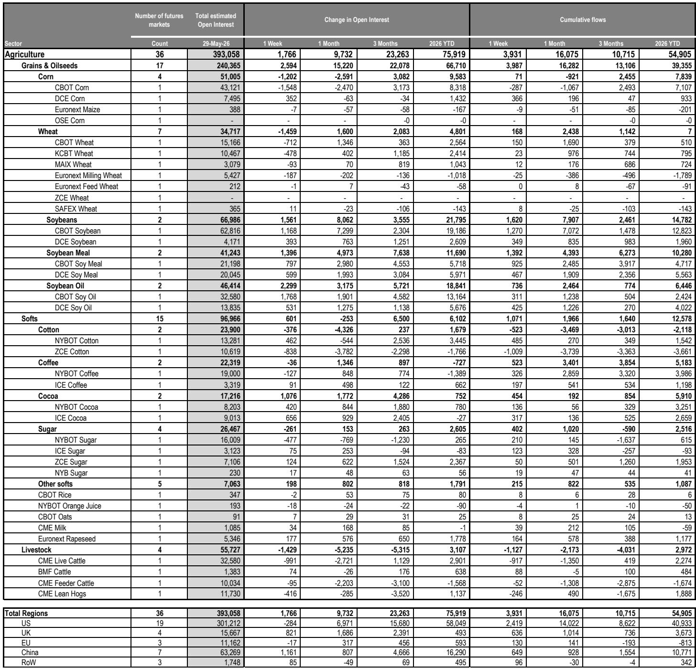
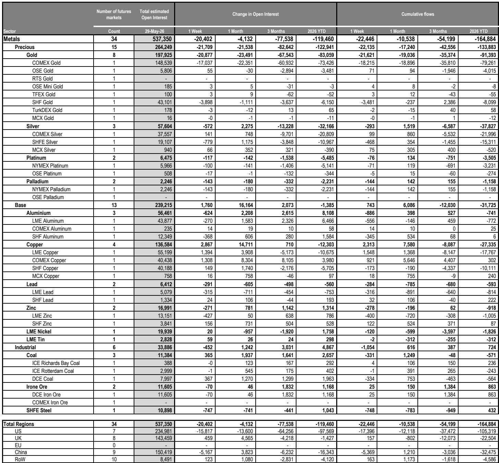
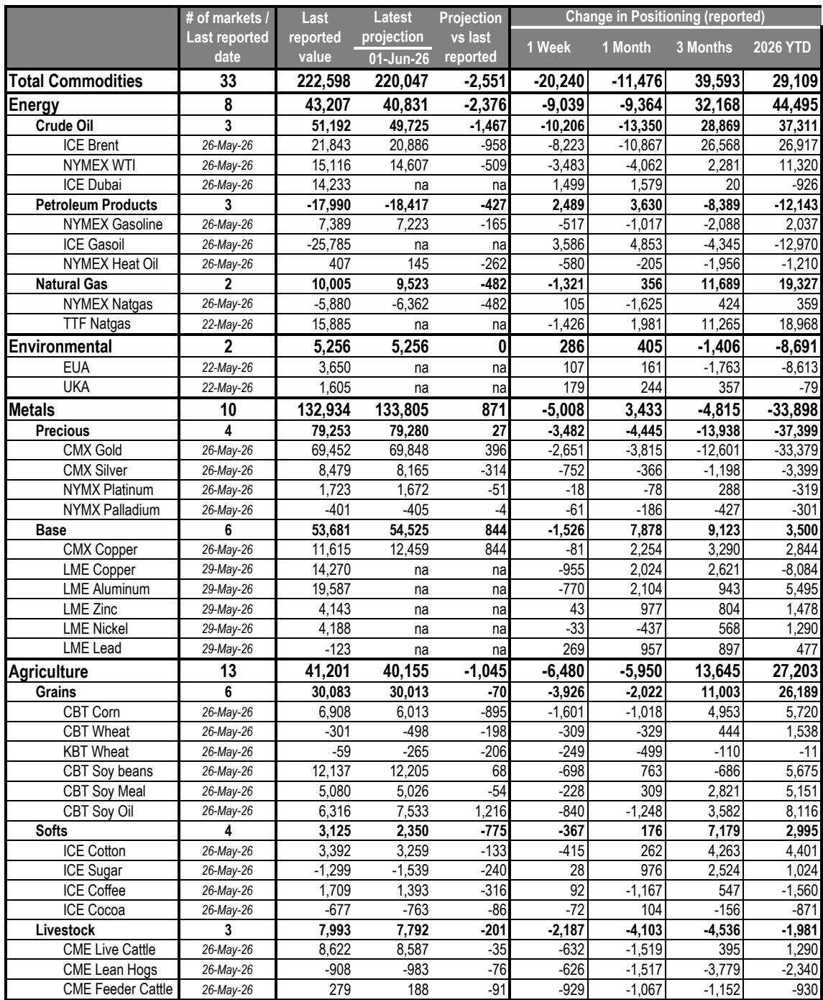

# Commodity Markets Are Signaling a Regime Shift, Not a Cyclical Pause

The commodity complex is not simply experiencing a routine weekly drawdown. The data from late May 2026 reveals a more consequential pattern: a synchronized de-leveraging across energy and precious metals, coupled with a selective rotation into base metals and environmental credits, that points to a fundamental repricing of risk premia. The estimated value of open interest across tracked commodity markets fell by $69 billion to $1.82 trillion, while net investor positioning dropped by $20 billion to $223 billion. These are not noise-level moves. They reflect a market that is recalibrating its assumptions about inflation, monetary policy, and supply-side resilience. For institutional investors, the critical question is not whether this is a buying opportunity, but whether the structural drivers that supported commodity markets through 2024 and early 2025 are now dissolving.

The week's data is dominated by two seemingly contradictory forces. On one side, energy markets are bleeding—Brent crude fell 11% week-on-week, and net length in crude oil alone shrank by $10 billion. On the other side, gold, the traditional safe haven, saw $22 billion in outflows across all trader types. A traditional narrative would struggle to reconcile these moves. But the pattern becomes coherent when viewed through the lens of a market that is pricing in a global tightening cycle, not a recession. The expectation of higher-for-longer rates is compressing the term premium on commodities that are sensitive to financing costs and storage, while simultaneously creating selective opportunities in metals where supply constraints are binding. This is not a market that has lost conviction. It is a market that has changed its thesis.

The report from which this analysis is drawn provides granular data on positioning, flows, and price momentum across 91 futures markets. But the value of the data lies not in the weekly snapshots, but in the strategic signals they encode. The following sections unpack what the aggregate numbers mean for portfolio construction, where the hidden risks are accumulating, and which questions the report itself leaves unanswered.

## The Energy Selloff Reflects a Demand-Side Reassessment That Goes Beyond China

The collapse in crude oil positioning is the most visible feature of this week's data, but its causes are more structural than the headline numbers suggest. Open interest in energy markets fell by $56 billion to $816 billion, with Brent, WTI, and ICE Gasoil all declining by 10% or more. Net length in crude oil dropped from $61 billion to $51 billion. The immediate trigger is a 9% decline in China's oil demand, but the report itself notes that the loss in gasoline, diesel, and fuel oil demand is likely to persist, even as jet fuel and naphtha recover. This is not a temporary lockdown-driven dip. It reflects a structural shift in China's economic composition—a move away from heavy industrial activity and toward services and electrification that is reducing oil intensity at the margin.

But the more important story is what this demand weakness reveals about global monetary transmission. The report indicates that global core inflation outside China is expected to remain "sticky" at around 3%, and that the consensus has shifted from a mix of easing and stability to a projection for a broad but shallow global tightening cycle. This is the key insight for commodity investors. When the Federal Reserve and other central banks are tightening into a demand slowdown, the price of holding commodity futures—via the cost of carry and the opportunity cost of margin—rises. The energy selloff is not just about China. It is about the realization that the liquidity environment that supported commodity speculation in 2024 is reversing.

The natural gas story adds another layer. While US natural gas prices actually rose during the week, European and Asian benchmarks fell. The report notes that the global LNG market has absorbed about 60% of the Hormuz-driven supply shock through new projects in North America and Africa. But it also warns that market flexibility is fading and European storage levels are well below average. This creates a tension that will resolve only in the second half of the year. If Europe enters peak injection season with low storage and limited flexibility, prices will need to rise to trigger gas-to-coal switching and soften Asian demand. The current positioning data does not yet reflect this risk, which means the energy complex may be underpricing a tail risk in natural gas even as it correctly discounts crude oil.

## Gold Outflows Are Not a Rejection of Safe Havens but a Repricing of Real Yields

The most surprising data point in the report is the $22 billion in gold outflows across all trader types, which drove a $22 billion decline in precious metals open interest. This is the third consecutive weekly decline. At first glance, this seems anomalous. Gold is supposed to benefit from geopolitical uncertainty and a weakening economic outlook. Yet here it is, bleeding alongside risk assets.

The resolution lies in the real yield dynamic. The report's macro framework projects a global tightening cycle, which implies that real interest rates—nominal rates minus expected inflation—are likely to rise or remain elevated. Gold has no yield. Its opportunity cost rises when real yields increase. The outflows are therefore consistent with a market that is pricing in tighter monetary conditions, not one that is fleeing to safety. The fact that net Managed Money positioning in COMEX gold futures actually increased by 3.9k contracts to 97.4k contracts net long suggests that the outflows are coming from other trader categories—likely commercial hedgers and ETF investors. Global gold ETF holdings sit at 4,131 tonnes, up 3% year-to-date, despite selling in April and May. This is a market that is bifurcated: speculative futures traders remain bullish, but the larger, more patient capital in ETFs is rotating out.

The strategic implication is that gold's traditional role as a portfolio hedge may be weakening in this cycle. If the dominant macro regime is one of tight monetary policy and sticky core inflation, gold's historical correlation with inflation may be offset by its negative correlation with real yields. Investors who hold gold as a tail-risk hedge should consider whether the current macro environment actually increases the probability of the tail events they are hedging against. The report's data suggests that the market is already voting with its feet.

## Base Metals Are the Exception That Proves the Rule: Supply Constraints Trump Demand Uncertainty

While energy and precious metals saw broad-based outflows, base metals open interest actually increased by $1.8 billion to $239 billion. This was driven by $2.3 billion in inflows into copper, which more than offset outflows from aluminum and zinc. The divergence is striking and instructive. It tells us that the commodity selloff is not a uniform rejection of the asset class. It is a rotation out of macro-sensitive, financialized commodities and into those where physical supply constraints are binding.

Copper's inflows are supported by a structural narrative that is independent of the business cycle. The energy transition, electrification, and data center buildout are creating a demand base that is relatively inelastic to short-term interest rate changes. At the same time, copper supply has been persistently disappointing. The report does not provide copper-specific supply data, but the pattern of inflows into a rising price environment suggests that the market is pricing in a structural deficit.

Zinc tells a different but equally instructive story. The report notes that supply disappointments and disruptions have swelled once again in 2026, supporting a higher-for-longer zinc price environment despite "still-lifeless demand." LME zinc prices are expected to remain in a $3,400-$3,500 per ton range on average through 2026 to incentivize Chinese exports. But the report also flags a risk: Chinese exports could overshoot, and inflationary pressures could curb demand more sharply than forecast. Zinc is therefore a microcosm of the broader commodity market tension. Supply constraints provide a floor, but demand weakness and policy uncertainty cap the upside. The question for investors is whether the floor or the ceiling is more likely to break.

## The Report's Blind Spot: It Does Not Fully Address the Liquidity Regime Shift

For all its granularity, the report leaves a critical question unanswered. It documents the decline in open interest and positioning, and it links this to the macro outlook for tightening. But it does not fully explore whether the decline in open interest is itself a cause of future price volatility, not just a reflection of current sentiment.

The total estimated value of open interest across tracked commodity markets has fallen by $94 billion over three months and by $135 billion in cumulative flows over the same period. When open interest declines, market depth shrinks. This means that any given order flow has a larger impact on price. The risk is not that prices will continue to fall in a straight line, but that they will become more prone to sharp reversals. A market with thin positioning and declining open interest is vulnerable to short squeezes and liquidity crises. The report's focus on net positioning and price momentum is valuable, but it does not model the probability of a liquidity event in any given commodity.

This is a meaningful gap for portfolio construction. If the commodity complex is entering a period of lower open interest and higher price volatility, then traditional risk management models that assume normal distribution of returns will understate tail risk. Investors who rely on commodity futures for portfolio diversification should stress-test their positions for scenarios where a 10% intra-week move becomes common, not exceptional. The report provides the raw material for this analysis but does not perform it.

## A Decision Framework for Commodity Allocation in a Tightening Cycle

The data in this report can be synthesized into a three-dimensional decision framework for institutional investors. The first dimension is the macro regime. The report's projection of a broad but shallow global tightening cycle means that the cost of carry for commodity futures will remain elevated. This argues against holding broad, passive commodity exposure. The second dimension is the supply-demand balance at the individual commodity level. Copper and zinc have supply constraints that provide a floor. Crude oil and natural gas have demand uncertainty that caps the upside. The third dimension is positioning and liquidity. Markets with declining open interest and concentrated net length are at risk of violent reversals.

The framework leads to a clear strategic conclusion. Investors should overweight commodities where supply constraints are structural and demand is inelastic to interest rates—copper is the clearest example. They should underweight or hedge commodities where demand is sensitive to the business cycle and positioning is crowded—crude oil fits this description. And they should avoid commodities where open interest is declining rapidly and the macro outlook is ambiguous—gold, in its current configuration, falls into this camp.

The environmental markets deserve a separate note. Open interest in this sector increased by 7% week-on-week to $76 billion, driven by a 5% rise in EUA prices and net contract-based inflows. Investment funds increased their net long position in EUAs. This is consistent with a market that expects tighter emissions policy in Europe, even as the broader commodity complex weakens. Environmental credits are becoming a distinct asset class with its own drivers, and the report's data supports the case for a dedicated allocation.

## The Open Questions That Make the Full Report Essential

The data presented here raises as many questions as it answers. Why are gold ETF investors selling while futures speculators are buying? Which trader categories are driving the outflows in crude oil, and are they likely to reverse? How much of the decline in China's oil demand is structural versus cyclical? What is the probability that European natural gas prices spike during injection season, and how would that affect the broader energy complex? The report from which this analysis is drawn contains the original charts and tables that allow investors to explore these questions in depth. The weekly snapshots are useful, but the real value lies in the trends they reveal over months and quarters.

Join the community to read the full report and review the original charts.

*This article is for learning and discussion only and does not constitute investment advice.*

Personal reading notes and learning share only. Not investment advice.

