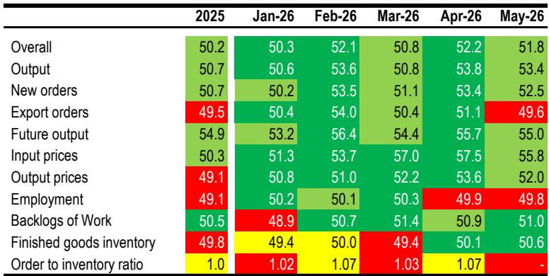
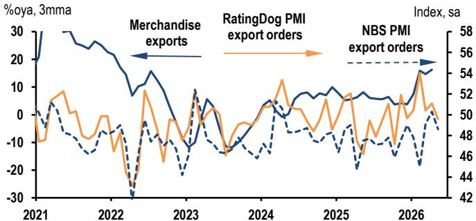
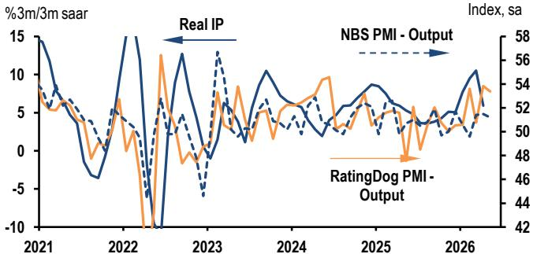

# China’s Manufacturing Expansion Is Slowing, But the Real Story Is the Asymmetry Between Production and Demand

The May purchasing managers' index data from both the official National Bureau of Statistics and the private RatingDog survey tell a consistent story: China's manufacturing sector is still expanding, but the pace has moderated from the robust first quarter. The headline numbers are reassuring—the RatingDog manufacturing PMI came in at 51.8, above both consensus expectations of 51.3 and the 50.0 expansion threshold. Yet beneath this surface-level comfort lies a more complex and strategically important pattern. The expansion is increasingly lopsided: production remains healthy, but demand—especially external demand—is showing clear signs of strain. The output PMI edged down only modestly to 53.4, still a solid reading that supports the view of continued production growth. But new export orders fell 1.5 points to 49.6, slipping into contractionary territory for the first time since January. This divergence matters because it signals that manufacturers are producing into a demand environment that is softening, particularly from abroad. The question for investors and corporate strategists is not whether China's manufacturing sector is slowing—it is—but whether the current configuration is sustainable, and what it implies for margins, inventory cycles, and the broader growth trajectory in the second half of the year.

The timing of this moderation is critical. It follows a first quarter in which China's GDP surprised to the upside, driven by a strong export performance and a rebound in industrial activity. The May PMI data suggest that momentum is fading, and the source of the fade is external. The geopolitical landscape has shifted: Operation Epic Fury in Iran was declared over on May 5, but the aftershocks continue to ripple through energy markets and supply chains. Negotiations for a peace deal remain on track, but a final agreement has not been reached, leaving energy prices elevated and input costs high. Meanwhile, the Trump-Xi summit in the same period may have injected a sense of stability into bilateral trade relations, but it has not yet translated into a measurable improvement in export orders. The data is telling us that the external headwinds are real and immediate, not just a theoretical risk. For anyone with exposure to Chinese manufacturing, either as an investor, a supplier, or a competitor, the May PMI readings are a flashing yellow light: the easy gains from the first-quarter rebound are behind us, and the second half of the year will require a more careful navigation of demand risks and cost pressures.

## The Divergence Between Output and Orders Is the Most Important Signal in the May Data

The most striking feature of the May PMI release is the growing gap between production indicators and demand indicators. The output PMI, at 53.4, remains comfortably in expansion territory and is only 0.4 points below April's reading. This is consistent with the narrative of a manufacturing sector that is still running at a healthy clip, supported by backlogs of work, new product launches, and technological upgrades cited by survey respondents. However, the new orders PMI fell to 52.5, a decline of 0.9 points, and the export orders sub-index dropped even more sharply, crossing below the 50 threshold to 49.6. This is not a trivial move. Export orders had been in expansion since February, and the reversal into contraction suggests that the external demand environment has deteriorated meaningfully in a single month.

This divergence matters for several reasons. First, it implies that the current production expansion is partly being sustained by inventory dynamics rather than end-demand. If output continues to grow while new orders slow, finished goods inventories will inevitably rise. The May data already shows a modest uptick in the finished goods inventory sub-index to 50.6 from 50.1 in April, consistent with this interpretation. Second, the divergence raises questions about pricing power. If producers are running at high utilization rates while demand softens, they will eventually need to offer discounts to clear inventory, compressing margins. The output price PMI fell to 52.0 from 53.6 in April, and while this is still above 50, the direction of travel is concerning. Third, the divergence has implications for employment. The employment sub-index remained in contraction at 49.8, barely changed from 49.9 in April. If output growth continues to decouple from demand growth, the labor market consequences could become more pronounced in the coming months.

## Input Cost Pressures Are Easing But Remain Structurally Elevated, Creating a Squeeze for Producers

The inflation story in the May PMI data is one of moderation, but not normalization. Input prices fell to 55.8 from 57.5 in April, and output prices fell to 52.0 from 53.6. On the surface, this looks like a welcome easing of cost pressures. But the level of input prices remains high by historical standards, and the asymmetry between input and output price indices is persistent and significant. Producers are absorbing a larger share of upstream cost increases than they were able to pass through to customers. This asymmetry has been a consistent feature of the PMI data since the Middle East conflict escalated earlier this year, and it is not resolving quickly.

The implications for corporate profitability are straightforward: margins are being compressed. The input price index at 55.8 means that a majority of manufacturers are still reporting higher input costs, driven by raw materials and energy. The output price index at 52.0 means that only a slim majority are able to raise their own prices. The gap of 3.8 points is substantial and has persisted for several months. For investors, this suggests that the earnings recovery in the manufacturing sector may be more fragile than the top-line growth numbers imply. Companies with pricing power—typically those with differentiated products, strong brands, or dominant market positions—will fare better. Commodity-sensitive and low-margin producers will feel the squeeze most acutely. The data also suggests that the People's Bank of China has limited room to ease monetary policy aggressively, because while the overall inflation rate may be low, producer price pressures are still elevated in certain segments of the economy.

## The External Demand Slowdown Is Not a Cyclical Blip; It Reflects Structural Shifts in Global Trade

The decline in export orders to 49.6 is the most concerning single data point in the May release. It is consistent with the NBS PMI export orders reading of 48.6, also in contraction. This is not an isolated data glitch. It aligns with shipping data and anecdotal reports from export-oriented industries. The question is whether this is a temporary soft patch or the beginning of a more sustained downturn.

There are reasons to believe it may be the latter. The global economic environment is becoming more fragmented. Trade tensions between the United States and China have been managed through summits and temporary truces, but the underlying structural issues remain unresolved. The reshoring and friend-shoring trends that accelerated during the pandemic are continuing, and China's share of global manufacturing exports is under pressure from multiple directions: Southeast Asia, India, and Mexico are all gaining ground. Meanwhile, the end of Operation Epic Fury in Iran has not led to a rapid normalization of energy markets or supply chains, and the uncertainty around the final peace deal continues to weigh on business confidence globally. For Chinese exporters, the combination of weaker global demand, higher input costs, and ongoing geopolitical uncertainty is a formidable headwind. The May PMI data suggests that this headwind is now materializing in the hard data, not just in sentiment surveys.

## The Report Leaves Unanswered Questions About the Sustainability of the Production Expansion

For all the detail in the May PMI release, there are several critical questions that the data cannot answer. The most important is whether the current production expansion is sustainable if external demand continues to weaken. The future output PMI, which measures manufacturers' expectations for production in the coming year, moderated to 55.0 from 55.7 in April. It is still in solid expansion territory, but the trend is downward, and the gap between future output expectations and current new orders is widening. This suggests that manufacturers are increasingly optimistic about their own production capabilities but less confident about the demand environment. That is a recipe for inventory accumulation and eventual production cuts.

Another unanswered question is the role of policy support. The Chinese government has announced a range of measures to stimulate domestic demand, including infrastructure spending, consumer subsidies, and support for the property sector. But the PMI data does not tell us how effective these measures have been in offsetting the external drag. The new orders PMI, while declining, remains above 50, suggesting that domestic demand is still expanding. But the pace of expansion is slowing, and it is unclear whether policy stimulus can accelerate it sufficiently to compensate for the export weakness. A third open question is the trajectory of input costs. If the Middle East peace deal is finalized and energy prices decline, the cost pressure on manufacturers could ease significantly. But if negotiations stall or the situation deteriorates, input costs could rise again. The PMI data captures the current state, not the future path, and the range of possible outcomes is wide.

## A Decision Framework for Investors and Corporate Strategists in the Current Environment

Given the signals from the May PMI data, decision-makers need a framework to assess their exposure and adjust their strategies. The framework should focus on three dimensions: demand exposure, cost exposure, and inventory positioning.

On demand exposure, the key distinction is between companies that sell primarily to the domestic Chinese market and those that rely on exports. Domestic-oriented manufacturers may benefit from continued policy support and relatively resilient consumer demand. Export-oriented manufacturers face a more challenging environment, and the May data suggests that the risk is tilted to the downside. Companies in the latter category should be stress-testing their revenue forecasts for a scenario in which export orders remain in contraction for several months. They should also be evaluating their geographic diversification: are they overly dependent on any single export market, and do they have alternatives?

On cost exposure, the key variable is the pass-through capacity of the company. Manufacturers with strong pricing power—due to brand, technology, or market structure—can protect their margins even if input costs remain elevated. Companies in commoditized, price-sensitive segments will see their margins compressed. The appropriate response for the latter group is to focus on cost efficiency, supply chain optimization, and hedging of input costs where possible.

On inventory positioning, the data suggests that finished goods inventories are starting to rise. Companies that have been building inventory in anticipation of strong demand may need to reconsider their plans. The risk is that they end up with excess inventory that must be sold at a discount, further compressing margins. The prudent approach in the current environment is to keep inventory lean and to align production more closely with actual orders rather than optimistic forecasts.

## The Full Report Contains the Original Charts and Granular Data That Support This Analysis

The May PMI data tells a nuanced story: expansion is continuing, but the composition of that expansion is shifting in ways that create risks for certain segments of the market. The divergence between output and demand, the persistence of input cost pressures, and the deterioration in export orders are all signals that warrant close attention. The full report, which includes the original charts and detailed breakdowns by sub-index and by sector, provides the granular data that investors and strategists need to make informed decisions. The charts on the relationship between PMI output and industrial production, between export orders and merchandise exports, and between input prices and the PPI are particularly valuable for understanding the historical context and the current inflection point. Join the community to read the full report and review the original charts.

*This article is for learning and discussion only and does not constitute investment advice.*

Personal reading notes and learning share only. Not investment advice.

