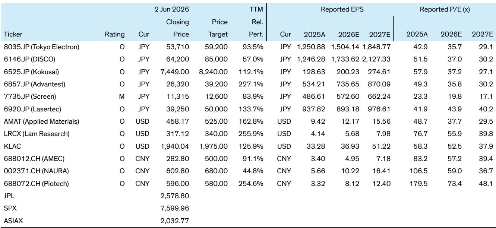

# The April SEAJ Data Reveals a Crucial Divergence: Memory-Led Capex Is Reshaping the Japanese Semiconductor Equipment Cycle

The semiconductor capital equipment cycle has entered a phase where aggregate growth numbers obscure a more important structural shift. April billings from Japanese wafer fab equipment (WFE) suppliers rose 25% year-over-year in yen terms, a headline figure that on its own suggests a healthy, broad-based recovery. Yet beneath this surface, the data tells a more nuanced story: the cycle is no longer being driven by a single, monolithic wave of spending. It is being carved by distinct, product-specific forces that reward some equipment segments far more than others.

This is not a cyclical upturn in the traditional sense. The current expansion is being powered by memory, specifically DRAM and NAND, and by the escalating testing intensity required for advanced AI chips. The data from the Semiconductor Equipment Association of Japan (SEAJ), which covers roughly 25% of the global WFE market, provides the most timely read on this divergence. The implications for portfolio strategy are clear: investors can no longer treat Japanese semiconductor equipment as a uniform exposure. The winners will be those companies whose product portfolios align with the memory-led and test-intensive nature of this cycle, while those tied to more commoditized segments face an increasingly challenging environment.

The timing of this insight is critical. The market is currently pricing equipment companies based on a broad recovery narrative. The SEAJ data, however, suggests that this consensus view is already outdated. By examining the specific billings for front-end, assembly, and testing equipment, and by using this data to forecast the near-term revenues of key players like Tokyo Electron (TEL) and Advantest, we can see a clear divergence emerging. This is not a moment for passive allocation; it is a moment for active, thesis-driven positioning.

## The SEAJ Data Signals a Memory-Led Capex Cycle That Is Already Outpacing Logic Spending

The most important observation from the April data is the composition of growth. Japanese front-end equipment billings, which are closely correlated with Tokyo Electron, rose 12% year-over-year. This is solid, but it is not exceptional. In contrast, assembly equipment billings, tied to DISCO, surged 73% year-over-year, albeit from an easy comparison base. More tellingly, testing equipment billings, relevant to Advantest, grew 26% year-over-year.

This pattern is not random. The strong growth in assembly and testing equipment reflects the specific demands of the memory cycle. Advanced memory production, particularly for High Bandwidth Memory (HBM) and 3D NAND, requires significantly more die preparation, packaging, and testing than traditional logic chips. The 73% jump in assembly equipment is a direct result of the increasing complexity of packaging for HBM stacks and the ramp-up of CoWoS capacity. The 26% growth in testing equipment underscores the rising "testing intensity" per chip, a trend driven by the need to qualify high-value AI accelerators and memory stacks.

The 3-month moving average, which smooths out monthly volatility, confirms this trend. It shows assembly equipment billings growing at a robust pace and testing equipment billings maintaining a healthy trajectory. This is the fingerprint of a cycle where memory, not leading-edge logic, is the primary engine. The implication is that equipment suppliers with concentrated exposure to memory and advanced packaging have a stronger and more durable growth runway than those whose fortunes are tied to the more cyclical and currently slower-moving logic segment.

## Tokyo Electron Faces a Near-Term Consensus Miss, but the Memory Thesis Remains Intact for the Full Year

The SEAJ data allows for a granular, data-driven forecast of specific company revenues. Our regression analysis, which uses the first month of SEAJ billings to predict quarterly revenues, reveals a significant near-term disconnect for Tokyo Electron. The model suggests TEL's fiscal first-quarter (June quarter) semiconductor equipment revenue could decline 18% quarter-over-quarter. This stands in stark contrast to the consensus expectation of a 6% sequential increase.

This is a critical divergence. The market is expecting TEL to continue its upward trajectory, but the SEAJ data points to a softer start to the fiscal year. The April single-month data was down 38% month-over-month, which, while partly seasonal, is a sharper drop than typical. It is important to note that the first month of each quarter is often slower, and the next two months should improve. However, the magnitude of the April decline, combined with the high statistical correlation between SEAJ data and TEL revenue (an R-squared of 0.83), suggests that a consensus miss is a real risk.

Does this invalidate the long-term thesis for TEL? No. The company remains a key beneficiary of the DRAM and advanced logic capex cycle. The full-year outlook for WFE spending remains strong, with forecasts of over 20% growth in calendar 2026. The near-term softness is likely a timing issue, a result of lumpy shipments and project phasing. The strategic question for investors is whether they can look through this temporary weakness. The SEAJ data does not answer this definitively. It raises the question of whether the consensus is too optimistic on the near-term trajectory or whether the long-term fundamentals are strong enough to absorb a shortfall. This is the kind of analytical tension that separates a tactical trade from a strategic investment.

## Advantest's Testing Revenue Is Poised to Defy the Slower First Quarter, Reinforcing Its AI-Driven Growth Premium

While TEL faces a potential consensus miss, the SEAJ data paints a dramatically different picture for Advantest. Our regression model, which has an even higher correlation (R-squared of 0.95) with Advantest's tester revenue, suggests the company could see a 13% sequential increase in its June quarter revenue. This is well above the consensus estimate of 3% growth.

This forecast is not contradicted by the April single-month data, which showed a 14% month-over-month decline. That decline came after an exceptionally strong March, and April still represented the second-highest single-month billing level on record. The underlying trend is one of sustained strength, not weakness. The testing equipment segment is benefiting from a powerful confluence of factors: the ramp of HBM4, which requires more complex and expensive testers; the increasing volume of AI GPU shipments, where Advantest holds a dominant share; and the general rise in chip complexity that demands more thorough testing.

This divergence between TEL and Advantest is the central strategic insight of this report. It demonstrates that within the same supply chain, different equipment segments are operating on different cycles. The testing segment is in a secular growth phase driven by AI, while the front-end equipment segment, while still cyclical, is facing a more nuanced near-term outlook. For investors, this means that a one-size-fits-all approach to Japanese semiconductor equipment is no longer sufficient. The risk is not in the overall market; it is in the specific product exposure.

## The Report's Analytical Framework Leaves a Critical Question Unanswered: How Sustainable Is the Chinese Domestic Substitution Tailwind?

The report provides a clear and compelling framework for identifying winners in the Japanese and U.S. equipment space. It also highlights a significant opportunity in Chinese domestic equipment suppliers (NAURA, AMEC, Piotech), all rated Outperform. The thesis is that these companies are benefiting from a rapid acceleration in domestic substitution, a trend driven by geopolitical restrictions and a national push for self-sufficiency.

This is a powerful narrative, and the data on Chinese WFE spending supports it. However, the report does not fully address the sustainability of this tailwind. The current wave of Chinese equipment orders is partly driven by a "pull-forward" effect, as Chinese foundries and memory makers rush to secure capacity before potential future restrictions. Once this pre-buying phase concludes, the growth rate for Chinese equipment suppliers could decelerate sharply.

Furthermore, the competitive dynamics within China are changing. As more domestic players enter the market, pricing pressure is likely to increase, potentially compressing margins. The report acknowledges that Screen, a Japanese cleaning equipment supplier, faces margin risk from declining China revenue and competition from Chinese rivals. This same dynamic could eventually impact the Chinese champions themselves. The unanswered question is whether the domestic substitution story is a multi-year structural trend or a multi-quarter cyclical spike. Investors in Chinese semicap names must grapple with this uncertainty, as the current valuations already price in a significant amount of future growth.

## A Decision Framework for Navigating the Diverging Equipment Cycle

For investors seeking to act on this analysis, the following framework is designed to translate the report's insights into actionable decisions.

**Step 1: Determine your exposure to the memory and testing cycle.** The first question is not "Is the WFE market growing?" but "Which part of the WFE market is driving my portfolio?" If your holdings are concentrated in companies with high exposure to memory (DRAM, NAND) and advanced testing (ATE, memory testers), the cycle is your friend. If your holdings are tilted toward leading-edge logic equipment, the cycle is more uncertain.

**Step 2: Assess the near-term versus the long-term.** The SEAJ data suggests a near-term divergence. For a tactical investor, this is a signal to potentially reduce exposure to names like TEL ahead of a potential consensus miss and to increase exposure to names like Advantest ahead of a potential beat. For a strategic investor, the question is different: does the near-term softness in TEL change the multi-year thesis? The answer, based on the full-year WFE forecast, is likely no. The framework forces you to choose your time horizon.

**Step 3: Evaluate the quality of the growth driver.** Not all growth is created equal. The testing intensity trend for AI chips is a secular, technology-driven tailwind. The domestic substitution trend in China is a policy-driven tailwind. The memory capex cycle is a cyclical upturn. Each has a different risk profile and duration. A robust portfolio should have exposure to all three, but the weight should be calibrated based on the investor's conviction in the sustainability of each driver.

**Step 4: Monitor the data, not the narrative.** The SEAJ data is released monthly and provides a high-frequency check on the underlying trends. The report's regression models offer a powerful tool for predicting company-level revenues. The key is to compare the data to consensus expectations, not to the prevailing narrative. If the data consistently deviates from consensus, it is a leading indicator that a re-rating is coming.

The report provides the analytical tools to execute this framework. The challenge for the reader is to apply it with discipline. The most common mistake in this market is to treat all equipment companies as a single, homogeneous group. The SEAJ data conclusively proves that this is no longer the case.

Join the community to read the full report and review the original charts. The detailed regression models, the full ticker table with price targets, and the historical exhibits provide the granularity needed to make informed decisions. The analytical questions raised here -- the sustainability of the Chinese substitution trend, the duration of the memory cycle, and the timing of the TEL recovery -- are precisely the kind of debates that drive alpha in a complex market. The full report provides the data to engage in those debates with confidence.

*This article is for learning and discussion only and does not constitute investment advice.*

Personal reading notes and learning share only. Not investment advice.

