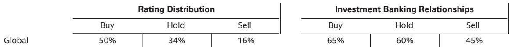

# 肺癌治疗格局的真正变量，不在PD-1，而在ADC与双抗的交叉点

2026年ASCO之后，市场对肺癌领域最值得关注的判断不是某款药物数据“好”或“坏”，而是一个结构性信号：**ADC与PD-1/L1xVEGF双抗正在从替代选项变为潜在的基石疗法，但全球数据验证才是真正分水岭**。

某外资投行在ASCO结束后迅速组织了两位肺癌领域KOL的深度讨论。这两位KOL分别来自约翰霍普金斯大学和斯坦福大学，覆盖了从临床实践到早期试验设计的完整视角。他们的判断并非简单的“看好”或“看空”，而是给出了一个更有层次的分析框架：哪些信号已经足够清晰，哪些仍需等待全球数据，以及哪些未解问题将决定未来三到五年的竞争格局。

这份讨论的核心价值不在于复述数据，而在于揭示了市场目前定价最不充分的两个维度——**毒性管理能力对市场份额的直接影响**，以及**中国数据向全球人群的转化风险**。以下是我们从KOL讨论中提炼的五个关键洞察。

## 1. sac-TMT的PFS数据已足够改写一线标准，但OS才是真正的定价锚

KOL对科伦博泰与默沙东合作的sac-TMT（TROP2 ADC）在OptiTROP-Lung05研究中的表现给出了高度评价。一位KOL用了一个生动的比喻：PFS的HR数据在他看过的药物中属于“少数几个真正显著的”，如果用棒球术语来量化，0.5以下的HR就是“全垒打”。而sac-TMT在PD-L1高表达人群中的表现，已经接近这个区间。

但KOL的谨慎同样值得关注。他们明确指出，Keytruda单药作为对照臂在全球范围内并非标准治疗（美国更倾向Keytruda联合化疗），因此中国数据的对照组表现可能被低估。这意味着sac-TMT的PFS优势在全球试验中可能会被压缩。

更关键的是OS。一位KOL给出了明确的临床决策门槛：对于sac-TMT下一阶段的数据，他需要看到HR在0.7到0.8之间、响应率在65%到70%之间，才能考虑替换标准治疗。而另一位KOL更严格，认为临床有意义的HR门槛是0.75。**这些数字不是学术讨论，而是未来商业化的定价锚**——如果全球OS数据达不到这个区间，即便PFS再漂亮，医生也不会轻易改变处方习惯。

## 2. 双抗的OS优势真实但存在年龄盲区，全球验证是唯一出路

Summit Therapeutics与康方生物合作的PD-1xVEGF双抗ivonescimab在HARMONi-6研究中展现了令人印象深刻的OS获益（HR=0.66），且PFS到OS的衰减很小。KOL认为这“意味着ivonescimab是一种有效的疗法”，并指出其在出血风险患者中的安全性优于传统VEGF抑制剂贝伐珠单抗。

但KOL同时点出了一个关键争议：**65岁以上患者亚组的获益似乎不明显**。这个细节在ASCO的全体讨论环节已被提出，而KOL的解读更为直接——中国人群的吸烟率、病理生理特征与全球人群存在差异，而全球试验（HARMONi-3）通常包含更多老年患者。如果这个亚组差异在全球数据中重现，将直接影响ivonescimab在真实世界中的使用范围。

KOL对HARMONi-3的鳞状细胞癌队列持乐观态度，认为基于ivonescimab在多个适应症中的一致性阳性数据，该队列的PFS最终分析（2026年下半年）大概率成功。但他们对非鳞状细胞癌的跨组织学解读持保守态度，认为鳞状细胞癌更均质、吸烟者比例更高，因此获益预期更强，非鳞状细胞癌的转化需要更谨慎。

**这里的核心含义是：市场可能低估了双抗在鳞状细胞癌中的竞争优势，但高估了其在非鳞状细胞癌中的可替代性。**

## 3. 中国数据的“可翻译性”是最大的隐性风险，也是最大的超额收益来源

两位KOL在讨论中反复提及一个主题：中国数据能否在全球人群中复现。这不仅是监管问题，更是临床实践的根本差异。

对于sac-TMT，KOL认为其安全性特征与第一三共/阿斯利康的Datroway相似，但基于中国数据看，疗效和安全性都有潜在优势，前提是全球试验能验证。对于ivonescimab，KOL指出中国研究纳入了传统上不适合VEGF治疗的高出血风险患者，而全球试验的患者筛选标准可能不同，这会影响安全性数据的可比性。

**报告没有完全展开的一个问题是：中国患者与全球患者在药物代谢、肿瘤生物学、合并用药等方面的差异，是否会导致疗效的“衰减系数”不同？** 这个问题目前没有数据支撑，但KOL的谨慎态度暗示，市场可能低估了这种衰减的风险。

反过来看，如果全球数据能够复现中国结果，那么当前对这些资产的估值就存在显著的上行空间。这本质上是一个“可翻译性溢价”的期权。

## 4. 毒性管理正在成为ADC竞争的新护城河，但个体差异仍是黑箱

KOL对sac-TMT的毒性管理给予了积极评价，特别是其约5%的治疗中断率被描述为“惊人”。但他们的讨论揭示了一个更深层的问题：**ADC的毒性并非均质化风险**。

一位KOL指出，患者对ADC的个体反应差异很大，同样的药物在不同患者身上可能表现出完全不同的耐受性。这意味着，即使临床试验中展现了良好的平均安全性，在真实世界中，医生仍需面对大量“黑箱”决策——谁能耐受、谁不能耐受，目前没有可靠的预测生物标志物。

这一点对商业化的含义是：**ADC的竞争不仅看疗效数据，更看医生对毒性管理的“教学曲线”**。KOL提到，当与患者讨论ADC时，他会预期化疗样副作用，并认为这些是可控的。但关键在于，如果某款ADC出现了独特的副作用（如间质性肺炎、眼部毒性），医生的使用意愿会大幅下降。sac-TMT目前没有发现这些“独特副作用”，这是其优势，但全球试验中是否会出现，仍是未知数。

## 5. 三特异性抗体和RAS抑制剂正在成为下一波浪潮，但临床路径尚未清晰

KOL在讨论中特别提到了两个他们正在关注的创新方向：PD-1xCTLA-4xVEGF三特异性抗体（如基石药业的CS2009）和RAS抑制剂。

三特异性抗体的逻辑在于，通过同时靶向PD-1、CTLA-4和VEGF三条通路，理论上可以实现更全面的免疫激活和抗血管生成效应。但KOL的讨论停留在了“值得关注”层面，没有给出具体的临床预期。报告也指出，这些分子的临床数据尚处于早期阶段，**无法判断其是否优于现有的双抗+ADC组合方案**。

RAS抑制剂的切入点则更为明确——KOL认为其可以与免疫检查点抑制剂或ADC形成“新型+新型”组合。但这里的关键问题是：RAS抑制剂与免疫疗法的协同机制尚未在临床中得到验证，且RAS突变在肺癌中的分布与PD-L1表达水平的关系复杂，这增加了临床试验设计的难度。

**报告尚未完全回答的一个关键问题是：在ADC和双抗已经确立一线地位的背景下，三特异性抗体和RAS抑制剂的切入点是“替代”还是“补充”？如果是补充，它们在治疗序列中的位置在哪里？** 这些问题需要更多临床数据才能回答。

---

## 从KOL讨论中提炼的观察框架

对于关注肺癌治疗领域的决策者，我们建议从以下四个维度重新审视当前的投资逻辑：

第一，**区分“PFS驱动”和“OS驱动”的资产**。PFS数据可以推动早期采用，但OS才是长期定价的锚点。目前市场对sac-TMT的定价更多基于PFS，而OS的不确定性尚未被充分折价。

第二，**关注“可翻译性”而非“数据绝对值”**。中国数据的绝对值再漂亮，也必须在全球人群中验证。当前市场对中国Biotech的估值中，隐含的“翻译成功率”假设可能过高。一个更保守的假设是：全球数据比中国数据衰减10%-20%。

第三，**毒性管理是差异化竞争的关键**。在疗效趋同的背景下，医生会优先选择毒性更可控、管理更熟悉的药物。这意味着，先发优势（如Datroway已获FDA批准）在安全性数据没有显著劣势的情况下，会持续存在。

第四，**警惕“亚组效应”对市场预期的放大**。ivonescimab在65岁以上患者中的争议，本质上是一个“市场预期脆弱性”的案例。任何关键亚组的数据瑕疵，都可能在商业化初期被放大，导致处方速度和医保覆盖的延迟。

---

## 这些问题，完整报告中有更深入的拆解

KOL讨论中留下的未解问题——全球试验的可翻译性、毒性管理的个体差异、三特异性抗体的临床路径——每一个都足以改变当前的投资假设。而这些问题的答案，恰恰隐藏在报告的原始数据、图表和KOL的完整问答中。

例如，KOL对sac-TMT与Datroway的详细对比、对HARMONi-3试验设计的具体评价、以及对RAS抑制剂与ADC组合的潜在毒性叠加的担忧，都超出了本文能够完整呈现的范围。

欢迎来星球微信群里继续讨论，我们会在群内分享这份报告的原始图表、KOL问答全文，以及我们对关键假设的定量推演。这些内容将帮助你更准确地判断：哪些资产被高估，哪些被低估，以及下一个数据读出节点可能带来的催化剂。

Personal reading notes and learning share only. Not investment advice.

