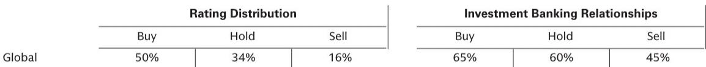

# 关税下调的真正价值不在当期利润，而在日本工程机械的竞争格局重塑

2026年6月2日，白宫一则关于修改钢铁和铝产品232条款关税的总统公告，在东京早盘交易时段引发日本机械板块的异动。表面看，这只是一次针对特定工业品类的税率调整——联合收割机、推土机、叉车等设备的对美出口关税从25%降至15%。但仔细拆解这份公告的生效时间、适用品类范围以及日落条款，会发现一个更值得关注的信号：美国正在有选择地降低某些工业品的进口壁垒，而其真实意图并非简单的贸易缓和，而是为重建本国工业基础争取时间。

投行研报对此事件做了量化分析，估算出对主要日本厂商当期利润的影响——小松约100亿日元增量，久保田和竹内制作所影响有限。但如果我们只停留在利润测算层面，就错过了这份报告真正有价值的部分：关税下调的结构性含义，以及它对日本工程机械行业竞争格局的长期影响。

以下是我们从这份研报中提炼出的五个核心洞察。

## 1. 关税下调的窗口期设计，暴露了美国工业政策的真实节奏

研报明确指出，新关税税率适用于6月8日及之后抵达的货物，这意味着实际体现在终端销售价格上要等到11月至12月以后。更关键的是，这项政策的日落日期是2027年12月31日。

这不是一个永久性的税率调整，而是一个为期约18个月的窗口期。美国选择在这个时间点降低工程机械的进口关税，同时维持对钢铁和铝的基础税率不变，反映出一种精细化的政策逻辑：美国需要日本的高端工程机械来支撑其国内基建和制造业投资，但又不希望长期依赖进口。这18个月，恰好是美国本土产能爬坡的时间窗口。

对于日本制造商而言，这个窗口期意味着两件事。第一，短期利润增厚是确定的，但幅度有限——研报测算的100亿日元增量对于小松这样的体量而言，约占其年营业利润的2%-3%，算不上质变。第二，真正重要的是，这18个月将测试日本企业能否利用关税优势扩大市场份额、深化客户关系，从而在2027年之后即便关税恢复，也能维持更强的议价权。

## 2. 品类范围的扩大，揭示了一个正在被重新定义的“工业机械”边界

研报特别提到，此次公告扩大了适用15%税率的工业机械品类范围，将推土机、叉车等移动工业设备纳入其中。这比单纯降低几个百分点的税率更有意义。

传统上，工程机械的关税分类往往按“农业机械”“建筑机械”“工业车辆”等传统标签划分。但此次调整显示出美国正在用一种更功能性、更产业化的视角来定义“工业机械”——凡是直接服务于工业基础重建的设备，都被纳入优惠范畴。这意味着，那些能够提供“设备+服务+数字化解决方案”的日本企业，将比单纯卖硬件的企业获得更大的政策红利。

对于投资者而言，需要关注的不是某一家公司有多少产品品类被纳入，而是这些品类的边界扩展是否意味着美国市场对日本工程机械的“必需品”属性在上升。如果答案是肯定的，那么即便2027年关税恢复，需求的刚性也会对冲掉大部分成本冲击。

## 3. 利润贡献的时滞，恰恰是检验企业定价能力的关键窗口

研报估算，由于货物运输和销售周期，关税下调对当期利润的贡献要等到11月至12月才能体现。这看似是一个技术性的时间错配，但背后隐藏着一个更重要的分析维度：企业能否在这段时滞期内，将关税下降的红利转化为定价策略的优化。

理想情况下，日本企业应该维持原价销售，直接享受利润率提升。但在竞争激烈的北美市场，经销商和终端客户很可能会要求价格让利。因此，最终能有多少利润增量真正落到日本制造商的报表上，取决于三个因素：经销商库存水平、竞争对手的定价反应、以及终端需求的弹性。

研报没有给出明确的结论，但提供了一条分析线索：小松的利润增量估算为100亿日元，而久保田和竹内制作所影响有限。这暗示了不同企业在产品组合、经销商关系和市场地位上的差异。小松在北美市场更深的布局和更强的品牌溢价，可能是它能够更大程度保留关税红利的原因。这一点值得进一步验证。

## 4. 研报没有完全回答的关键问题：关税下调是否会触发北美市场的价格战

这是整份研报最令人意犹未尽的地方。研报详细测算了利润影响，但没有深入讨论竞争动态。如果日本企业利用关税下调降价抢份额，那么卡特彼勒等美国本土制造商是否会跟进？如果美国制造商也降价，那么关税下调的利润红利就会被竞争完全侵蚀。

这个问题的答案取决于两个假设：第一，美国本土制造商的产能利用率是否已经饱和，以至于他们无法通过降价来捍卫市场份额；第二，日本企业是否愿意牺牲短期利润率来换取长期份额。目前没有公开数据可以验证这两个假设，但我们可以从行业结构做一些推断。

北美工程机械市场是一个寡头格局，卡特彼勒和日本厂商之间的竞争长期保持一种微妙的平衡。关税下调可能打破这种平衡，但幅度有限。更可能的情景是，日本企业不会全面降价，而是选择在特定细分市场（如大型推土机、液压挖掘机）进行针对性促销，同时利用关税红利加大对经销商网络的投入。这样既不会引发全面价格战，又能巩固竞争地位。

## 5. 对投资者的观察框架：从“关税受益”转向“关税转化能力”

基于以上分析，我们认为投资者应该建立一个新的评估框架，而不是简单地给所有日本工程机械股贴上“关税受益”的标签。

这个框架的核心是“关税转化能力”——企业将关税下调转化为可持续竞争优势的能力。具体可以从三个维度衡量：

第一，北美市场收入占比和产品组合的差异化程度。占比越高、产品越差异化，企业对关税红利的掌控力越强。

第二，经销商网络的深度和忠诚度。关税下调带来的利润空间，可以用来改善经销商返点、延长保修期或提供融资支持，这些都会增强渠道粘性。

第三，研发和服务的本地化程度。如果企业在美国有生产基地或研发中心，那么关税下调的窗口期可以用来加速本地化布局，从而在2027年之后即便关税恢复，也能通过本地化生产规避部分影响。

小松在这三个维度上似乎都领先于同行，但久保田和竹内制作所也在各自细分领域有独特优势。投资者需要逐一验证这些假设。

---

以上分析基于投行研报的公开信息，但很多关键判断——如竞争动态、定价策略、关税转化能力——是报告没有完全展开的。这些恰恰是决定投资回报的核心变量。

如果你想深入讨论这些未解问题，欢迎来我们的星球微信群里继续交流。我们会定期组织对这类结构性变化的深度拆解，帮助你建立更系统的产业分析框架。

Personal reading notes and learning share only. Not investment advice.

