# Global Technology

# Chipflation – Navigating A Memory Crisis

Surging memory prices and supply scarcity are becoming a cross-sector risk as AI reprices a critical input across the digital economy. What began as an AI infrastructure bottleneck is now spreading into hardware margins, device affordability, cloud costs, inflation and policy.

AI is turning memory into a structural bottleneck. AI demand is rising across HBM, DRAM and enterprise SSDs, pushing memory prices up six-fold in the past year. New supply takes years to build, qualify and ramp. That makes this cycle look less like a normal semiconductor upturn and more like a durable supply-demand reset.

Allocation is replacing commodity-market pricing. Hyperscalers and AI buyers are increasingly using long-term agreements (LTAs), prepayments and strategic commitments to secure capacity. That leaves a smaller, tighter and more volatile supply pool for traditional buyers.

HBM is crowding out conventional memory. HBM is essential for AI accelerators but consumes disproportionate advanced DRAM capacity. As suppliers prioritize HBM, server DRAM and enterprise SSDs, less supply remains for smartphones, PCs, autos, networking & industrial markets. Even as total DRAM wafer capacity expands \~30% by 2027, we see memory supply for smartphones/PCs falling 12-15% short.

Chipflation is spreading beyond Big Tech ... Large cloud buyers can secure supply and capitalize higher costs, while non-AI buyers face higher COGS and weaker allocation, price increases, spec cuts and delayed launches.

... and creates a clear divide between suppliers and OEMs. Memory producers benefit from stronger pricing, margins and visibility. Downstream hardware companies must absorb costs, pass them through, redesign products or risk demand destruction, especially in price-sensitive consumer markets.

The macro impact is bigger than CPI alone. Headline CPI effects may be modest given small basket weights, but pressure is visible in PPI, corporate margins, cloud bills, capex budgets and delayed technology deployment.

Policy could ease pressure, but would take years. Even if the US and China deploy tools such as subsidies, tax credits or permitting reform, supply responses will take years and near-term China capacity growth is insufficient. We assume US policy stays restrictive and is unlikely to ease pressures in the near or long term.

Stock implications. Pricing power sits with DRAM suppliers (Samsung, SK hynix, Micron), NAND (SanDisk, KIOXIA), HDD (Seagate, Western Digital) infrastructure (ASML, AMAT, KLA). OEMs over-indexed to the consumer, with less pricing power and elevated memory cost exposure face the sharpest margin headwinds.

MS & CO. INTERNATIONAL PLC+

# Shawn Kim

Equity Analyst

Shawn.Kim@morganstanley.com +44 20 7677-1018

MS & CO. LLC

# Joseph Moore

Equity Analyst

Joseph.Moore@morganstanley.com +1 212 761-7516

# Erik W Woodring

Equity Analyst

Erik.Woodring@morganstanley.com +1 212 296-8083

# Diego Anzoategui

Economist

Diego.Anzoategui@morganstanley.com +1 212 761-8573

MS & CO. INTERNATIONAL PLC (DIFC BRANCH)+

# Rajeev Sibal

Senior Global Economist

Rajeev.Sibal@morganstanley.com +971 4 709-7201

MS & CO. LLC

# Ariana Salvatore

Equity Strategist

Ariana.Salvatore@morganstanley.com

MS & CO. INTERNATIONAL PLC+

# Lee Simpson

Equity Analyst

Lee.Simpson@morganstanley.com +44 20 7425-3378

# Cindy Huang

Equity Analyst

Cindy.Huang@morganstanley.com +44 20 7425-2915

MS ASIA LIMITED+

# Duan Liu

Equity Analyst

Duan.Liu@morganstanley.com +852 2239-7357

MS & CO. LLC

# Mason Wayne

Research Associate

Mason.Wayne@morganstanley.com +1 212 761-6012

# Shane Brett

Equity Analyst

Shane.Brett@morganstanley.com +1 212 761-1022

# Maya C Neuman

Research Associate

Maya.Neuman@morganstanley.com +1 212 761-1946

# Dylan Liu

Research Associate

Dylan.Liu@morganstanley.com +1 212 761-4519

MS does and seeks to do business with companies covered in MS. As a result, investors should be aware that the firm may have a conflict of interest that could affect the objectivity of MS. Investors should consider MS as only a single factor in making their investment decision.

# For analyst certification and other important disclosures, refer to the Disclosure Section, located at the end of this report.

+= Analysts employed by non-U.S. affiliates are not registered with FINRA, may not be associated persons of the member and may not be subject to FINRA restrictions on communications with a subject company, public appearances and trading securities held by a research analyst account.

# Chipflation – The Story in Numbers

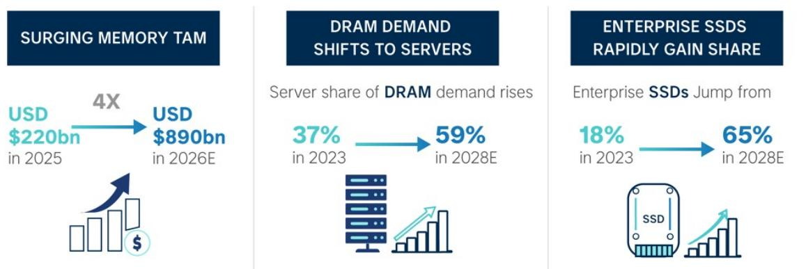

Server share of DRAM demand rises

Enterprise SSDs Jump from

SUPPLY IS CONCENTRATED AND SHIFTING

3 firms control \~90% of DRAM output worldwide

SAMSUNG

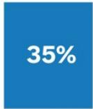

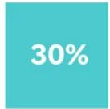

micron

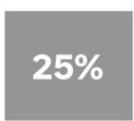

China's share of industry capacity rises from 18% to >23% by 2028E, representing \~30% of net wafer additions – second only to South Korea

  
HBM USAGE SURGES ACROSS HIERARCHY LEVELS

AI Chip

7x Surge in HBM usage

AI System

65x Surge in HBM usage

AI Cluster

1800x Surge in HBM usage

HBM & AI CROWD OUT CONVENTIONAL MEMORY   

HBM SHARE OF LEADING-EDGE WAFERS

HBM rises from \~6% of leading-edge memory wafers in 2023 to \~34% by 2028E

INCREASING AI PRIORITIZATION

leads to \~15% PC DRAM shortfall and \~12% smartphone DRAM shortfall in 2027, equivalent to \~58mn PCs and \~134mn smartphones

  
PRICING IMPACT

Electronics component

PPI +30% y/y

Direct US CPI

exposure $< 1\%$

Incremental global memory market equivalent to \~45%

of traditional hardware revenue

# What is "Chipflation"?

The shift from historical, deflationary pricing for commoditized microelectronics toward sustained, structural price increases poses a continuous upside risk to overall consumer goods pricing. For memory, inflation is no longer just a component-price issue.

AI infrastructure is absorbing a growing share of memory (DRAM, HBM and enterprise SSD) supply, while suppliers prioritize higher-margin AI/server products over mainstream consumer and industrial demand. The potential impacts of higher memory prices include:

- constrained supply and increases in consumer hardware prices   
- a squeeze in corporate profit margins   
- a division in the hardware industry between the 'have' and 'have not'   
• persistent upside risks to core inflation

Chipflation is demand-driven by the rapid rollout of AI infrastructure and datacenters, where tighter memory availability is feeding into higher device ASPs, higher cloud and enterprise IT costs, lower product specifications, delayed refresh cycles and margin pressure.

Memory shortages have become a macroeconomic concern. The direct CPI impact may be limited, but the effects are increasingly showing up in corporate COGS, cloud bills, capex budgets and delayed technology deployment – making this cycle broader than a traditional semiconductor upcycle. Insufficient chip supply can delay data center projects, slow cloud development and increase costs for businesses, ultimately affecting productivity growth.

# Differentiated datasets

This report updates a range of proprietary MS models and introduces several new datasets.

- Two-tier DRAM supply waterfall (Exhibit 7). Our framework decomposes total DRAM supply down to the residual pool available to non-Al buyers. We estimate PCs could face a 15% memory shortfall (\~58mn units) and smartphones a 12% gap (\~134mn units) as AI crowds out non-server allocation.   
- Demand elasticity by hardware product (Exhibit 8). We rank which end markets are most exposed to demand destruction from higher memory prices, from traditional servers (least elastic) to low-end PCs (most elastic).   
- CPI impact of higher memory costs (Exhibit 11). Higher memory costs carry a measurable CPI pass-through: PCs and smartphones add 0.08pp to headline CPI, with total consumer electronics impact reaching 0.10pp.

# Table of Contents

<table><tr><td>Section</td><td>Page Number</td></tr><tr><td>Executive Summary</td><td>5</td></tr><tr><td>Memory – A Multi-Year Bottleneck</td><td>14</td></tr><tr><td>HBM Cannibalization and the Two-Tier Market</td><td>20</td></tr><tr><td>Chipflation Passthrough and Sector Impact</td><td>26</td></tr><tr><td>Chips, Growth and Inflation – A Macro Perspective</td><td>37</td></tr><tr><td>US/China Policy Options Don’t Offer Near-term Relief</td><td>40</td></tr><tr><td>Primer: Memory 101 – Types, Market Structure and the Cycle</td><td>47</td></tr><tr><td>Appendix: Memory Demand per Gigawatt of AI Data Center Deployment</td><td>53</td></tr></table>

# Executive Summary

# Tech Diffusion

# A MS Key Theme of 2026

# A multi-year memory bottleneck

Memory chips are emerging as a critical input in the global AI ecosystem, underpinning the expansion of today's agentic AI architectures (Technology: Rise of the AI Agent – Global Implications, 19 Apr 2026). We believe that rising memory prices are rationally anticipating an AI-led price-inelastic leap in memory demand. This pricing strength is less a function of conventional supply discipline by producers, and more a reflection of the exponential growth in end-demand – evidenced in the annual capital expenditure commitments from hyperscalers eager not to be left behind in the race for superintelligence.

Rising memory prices create an increasingly challenging cost-push dynamic, where server build costs rise, cloud capex increases and hardware prices inflate. For non-hyperscaler corporates, this inflationary pressure could require choices on whether to pass on price increases, reduce device specifications, or accept reduced profits.

# Structural bottleneck

Prices for memory have risen more than 6-fold over the last year (Exhibit 1) – a sharp discontinuity from the multi-decade price declines. The price of a gigabyte of DRAM fell by around a factor of ten every 5 years from 1957 to 2020. Since 2010, the price has fallen more slowly as Moore's Law drove sustained price declines. However, this trend no longer applies in the AI economy, which has driven DRAM ASPs sharply higher (Exhibit 2). Building memory fabrication (fabs) plants takes years, so there is no quick response to address demand. This means sustained upside risks to consumer goods prices in the coming years.

Exhibit 1: DRAM prices YoY   
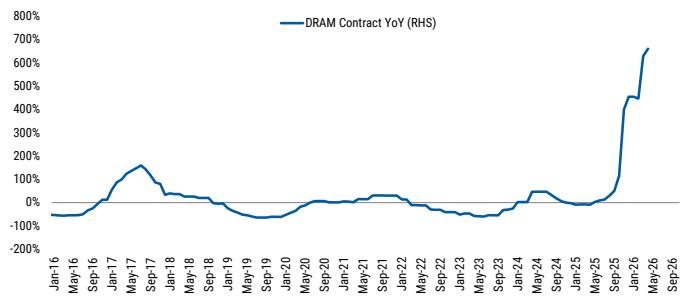

line

| Date    | DRAM Contract YoY (RHS) |
|---------|--------------------------|
| Jan-16  | -100%                    |
| May-16  | -50%                     |
| Sep-16  | 0%                       |
| Jan-17  | 100%                     |
| May-17  | 150%                     |
| Sep-17  | 100%                     |
| Jan-18  | 50%                      |
| May-18  | 0%                       |
| Sep-18  | -50%                     |
| Jan-19  | -100%                    |
| May-19  | -150%                    |
| Sep-19  | -100%                    |
| Jan-20  | -50%                     |
| May-20  | 0%                       |
| Sep-20  | 50%                      |
| Jan-21  | 0%                       |
| May-21  | 50%                      |
| Sep-21  | 0%                       |
| Jan-22  | -50%                     |
| May-22  | -100%                    |
| Sep-22  | -50%                     |
| Jan-23  | -100%                    |
| May-23  | -50%                     |
| Sep-23  | -100%                    |
| Jan-24  | 0%                       |
| May-24  | 50%                      |
| Sep-24  | 0%                       |
| Jan-25  | -50%                     |
| May-25  | -100%                    |
| Sep-25  | -50%                     |
| Jan-26  | 400%                     |
| May-26  | 650%                     |
| Sep-26  | 700%                     |

Source: TrendForce, MS

Exhibit 2: Long-term DRAM price/Gb   
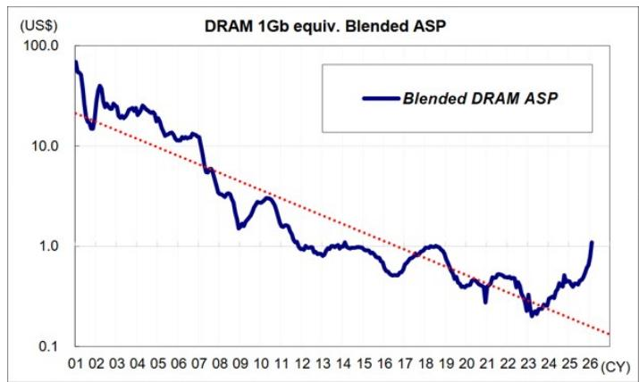

line

| Year | Blended DRAM ASP |
|------|-------------------|
| 01   | ~100.0            |
| 02   | ~50.0             |
| 03   | ~30.0             |
| 04   | ~25.0             |
| 05   | ~20.0             |
| 06   | ~15.0             |
| 07   | ~10.0             |
| 08   | ~5.0              |
| 09   | ~3.0              |
| 10   | ~2.5              |
| 11   | ~2.0              |
| 12   | ~1.5              |
| 13   | ~1.2              |
| 14   | ~1.0              |
| 15   | ~0.8              |
| 16   | ~0.7              |
| 17   | ~0.6              |
| 18   | ~0.5              |
| 19   | ~0.4              |
| 20   | ~0.3              |
| 21   | ~0.2              |
| 22   | ~0.15             |
| 23   | ~0.1              |
| 24   | ~0.15             |
| 25   | ~0.2              |
| 26   | ~0.3              |

Source: WSTS

Exhibit 3: Memory supply relief depends on install, qualification, yield ramp and product allocation – a \~2 year process   
From Tool Capacity to Qualified Memory Output   
ASML capacity is expanding; memory relief depends on install, qualification, yield ramp and product allocation   
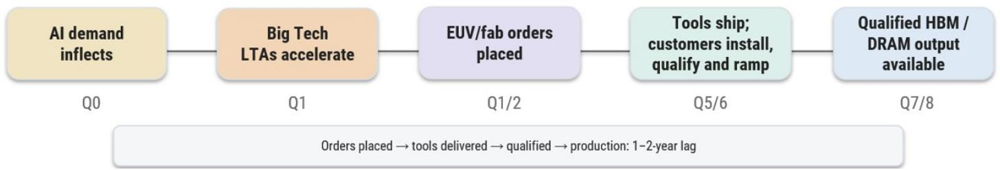

flowchart

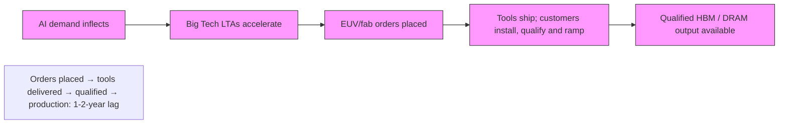
```mermaid
graph LR
    A["AI demand inflects"] --> B["Big Tech LTAs accelerate"]
    B --> C["EUV/fab orders placed"]
    C --> D["Tools ship; customers install, qualify and ramp"]
    D --> E["Qualified HBM / DRAM output available"]
    
    style A fill:#f9f,stroke:#333
    style B fill:#f9f,stroke:#333
    style C fill:#f9f,stroke:#333
    style D fill:#f9f,stroke:#333
    style E fill:#f9f,stroke:#333
    
    note1["Orders placed → tools delivered → qualified → production: 1-2-year lag"]
```

Source: MS

What's different this time? Previous chip shortages during COVID demonstrated how even minor supply disruptions can halt entire industries. However, this memory chip shortage looks more structural, and AI-related demand could amplify such effects on a much larger scale.

- Mobile AI agents and physical AI agents – another very large additional surge in demand for memory chips is likely as these are rolled out. As AI increasingly moves beyond data centers into edge devices and the physical world, the computational requirement for AI is set to grow exponentially. These components would no longer be seen as commodity memory chips but as critical pillars of the global digital infrastructure.   
- Long-Term Agreements (LTAs) are now absolute necessities to secure capacity given long lead times and the persistence of the supply-demand mismatch. Memory producers are establishing strategic supply chain partnerships with all hyperscale customers via LTAs, through which memory producers are able to lock in long-term orders and prices, establish a stable high-margin model, and mitigate the industry's cyclical volatility.

Exhibit 4: We expect hyperscaler capex to surpass US\$1tr in 2027 and an aggregate \~US\$2tr invested since 2024   
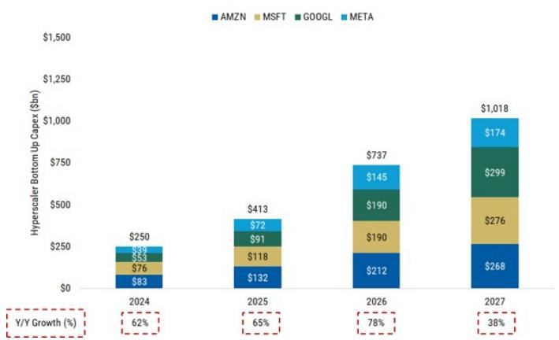

bar_stacked

| Year | AMZN ($bn) | MSFT ($bn) | GOOGL ($bn) | META ($bn) | Total ($bn) | Y/Y Growth (%) |
| :--- | :--- | :--- | :--- | :--- | :--- | :--- |
| 2024 | 83 | 76 | 53 | 39 | 250 | 62 |
| 2025 | 132 | 118 | 91 | 72 | 413 | 65 |
| 2026 | 212 | 190 | 190 | 145 | 737 | 78 |
| 2027 | 268 | 276 | 299 | 174 | 1,018 | 38 |

Source: Company data, MS estimates

Exhibit 5: The 2026 consensus cloud capex forecast increased to +75% Y/Y post results from 64% previously   
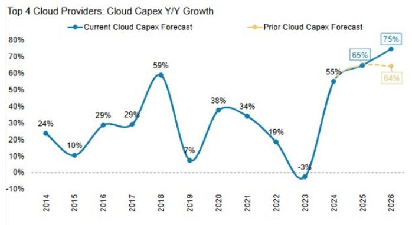

line

Top 4 Cloud Providers: Cloud Capex Y/Y Growth
| Year | Current Cloud Capex Forecast (%) | Prior Cloud Capex Forecast (%) |
|---|---|---|
| 2014 | 24 | |
| 2015 | 10 | |
| 2016 | 29 | |
| 2017 | 29 | |
| 2018 | 59 | |
| 2019 | 7 | |
| 2020 | 38 | |
| 2021 | 34 | |
| 2022 | 19 | |
| 2023 | -3 | |
| 2024 | 55 | |
| 2025 | 65 | 64 |
| 2026 | 75 | (not labeled) |

Source: Company data, Factset consensus estimates, MS estimates

# Exhibit 6:

Buyer Hierarchy: Who gets memory supply first?

# Allocation stack

Tier 1 | Hyperscalers / AI accelerator ecosystem | HBM, server DRAM, eSSD | LTAs / prepay

Tier 2 | Server OEMs / cloud infrastructure | server DRAM, eSSD | strategic contracts

Tier 3 | Premium PC / smartphone OEMs | DDR, LPDDR, NAND | annual contracts

Tier 4 | Autos / networking / industrial / medical | DDR, NAND, specialty | qualified supply

Tier 5 | Small OEMs / startups / low-end devices | commodity DRAM/NAND | spot/distribution

Higher allocation priority ↑ | Higher spot-price exposure ↓

Source: MS

# Margin risk for the broader hardware sector

Memory inflation is turning into a broad hardware-sector margin risk, extending beyond PCs and smartphones into gaming consoles, servers, cloud, networking, autos, medical devices, broadband equipment, industrial systems and low-cost education/embedded devices. The impact is not only higher DRAM/NAND pricing, but also allocation priority:

- Suppliers are prioritizing HBM, server DRAM and enterprise SSD demand tied to AI infrastructure, while traditional consumer and industrial memory users are increasingly coping with significantly higher prices, longer lead times and weaker bargaining power.   
- The more impacted group are companies that are not directly monetizing AI but still have to pay AI-driven memory prices. There is accounting asymmetry, where hyperscalers can capitalize memory-heavy AI servers and depreciate them over time, while consumer hardware and industrial OEMs see memory inflation flow more directly through inventory and COGS. This will require choices on whether to pass on price increases to consumers, reduce device specifications, or accept reduced profits.   
- Memory inflation is not just a financial transfer from non-Al sectors to memory producers. It is increasingly a constraint on what gets built and when for many non-tech industries.

Applying our memory sufficiency framework separately to PC and smartphones, we find both segments face supply shortfalls in 2027. On our assumptions (PCs absorbing 17% of non-server DRAM and smartphones 58%) total addressable memory falls \~15% and -12% short of demand, respectively. This implies unit downside of -58mn PCs (-15% vs MS shipment forecast) and \~134mn smartphones (-12% vs MS forecast). These numbers are sensitive to assumptions on memory content per device, but our analysis indicates demand rationing risk if the supply build does not accelerate.

Exhibit 7: AI prioritization turns 2027 supply growth into a consumer memory shortfall   
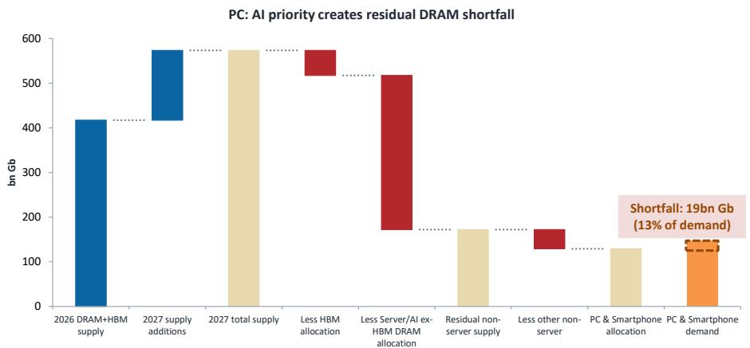

bar

PC: AI priority creates residual DRAM shortfall
| Category | Value (bn Gb) |
|---|---|
| 2026 DRAM+HBM supply | 420 |
| 2027 supply additions | 570 |
| 2027 total supply | 575 |
| Less HBM allocation | 560 |
| Less Server/AI ex-HBM DRAM allocation | 520 |
| Residual non-server supply | 175 |
| Less other non-server | 160 |
| PC & Smartphone allocation | 130 |
| PC & Smartphone demand | 145 |
Shortfall: 19bn Gb (13% of demand)

Source: MS estimates

Exhibit 8: Our quant analysis implies low-end smartphones and PCs are the most demand elastic, while servers, storage and high-end smartphones are least at risk of demand destruction from higher prices   
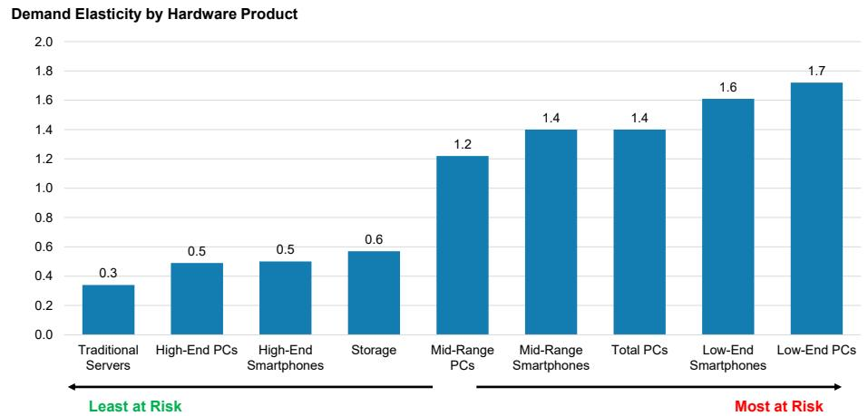

bar

| Hardware Product         | Demand Elasticity |
| ------------------------ | ----------------- |
| Traditional Servers      | 0.3               |
| High-End PCs            | 0.5               |
| High-End Smartphones    | 0.5               |
| Storage                  | 0.6               |
| Mid-Range PCs           | 1.2               |
| Mid-Range Smartphones   | 1.4               |
| Total PCs                | 1.4               |
| Low-End Smartphones      | 1.6               |
| Low-End PCs              | 1.7               |

Source: IDC, Company data, AlphaWise, MS. Demand elasticity takes the absolute value. PC data goes back to 1995, for storage it starts in 2008, servers in 2003 and smartphones in 2007.

Exhibit 9: The Chipflation impact by industry (illustrative)   
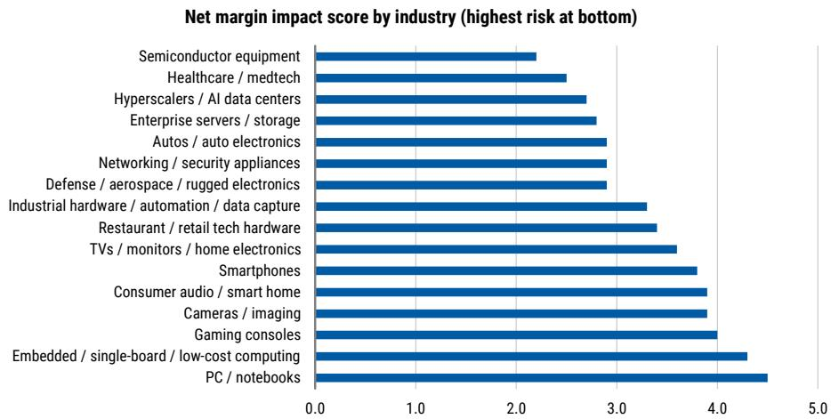

bar

Net margin impact score by industry (highest risk at bottom)
| Industry | Net Margin Impact Score |
| :--- | :--- |
| Semiconductor equipment | 2.2 |
| Healthcare / medtech | 2.5 |
| Hyperscalers / AI data centers | 2.7 |
| Enterprise servers / storage | 2.8 |
| Autos / auto electronics | 2.9 |
| Networking / security appliances | 2.9 |
| Defense / aerospace / rugged electronics | 2.9 |
| Industrial hardware / automation / data capture | 3.3 |
| Restaurant / retail tech hardware | 3.4 |
| TVs / monitors / home electronics | 3.6 |
| Smartphones | 3.8 |
| Consumer audio / smart home | 3.9 |
| Cameras / imaging | 3.9 |
| Gaming consoles | 4.0 |
| Embedded / single-board / low-cost computing | 4.2 |
| PC / notebooks | 4.5 |

Note: Ranking reflects net margin pressure after passthrough, assuming: 45% gross cost impact + 25% demand/volume risk + 20% allocation risk + 10% passthrough burden. Score scale: 1 = low risk, 5 = highest risk. Source: MS estimates

# Macro implications

Chipflation is translating into higher producer price inflation, notably in measures of computer and electronics linked equipment. How this translates into consumer inflation in these segments will define margin pressures – for now the effect is strong in US PPI and softer in CPI. The effect on headline CPI inflation is likely less because of the small weight of memory-sensitive goods in the basket, but the longer chip prices stay elevated, the more macro consequences we can expect.

Exhibit 10: The effect of rising costs is visible in exposed PPI, with some sub-components rising to all time highs   
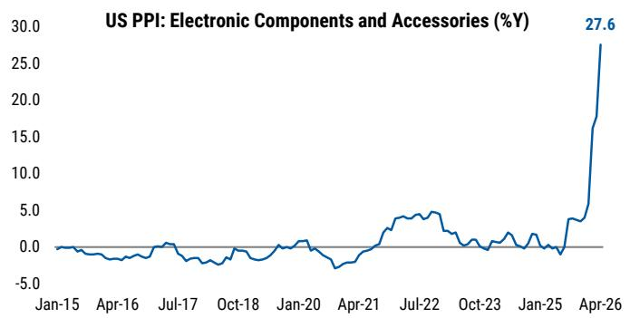

line

| Date    | Value |
|---------|-------|
| Apr-26  | 27.6  |

Source: BLS, MS

Exhibit 11: Higher memory costs could drive 15pp CPI for PCs and smartphones in the US this year – even if the headline CPI effect is more muted because of basket weights 

<table><tr><td>CPI component</td><td>Memory costs effect on CPI in 2026 (pp)</td><td>CPI weight</td></tr><tr><td>PCs</td><td>15</td><td>0.30%</td></tr><tr><td>Smartphones</td><td>15</td><td>0.20%</td></tr><tr><td>TVs</td><td>10</td><td>0.10%</td></tr><tr><td>Cars</td><td>0</td><td>3.80%</td></tr><tr><td>Major household appliances</td><td>5</td><td>0.06%</td></tr><tr><td>Game consoles</td><td>125</td><td>0.01%</td></tr><tr><td>Impact on headline CPI: PCs and smartphones only</td><td>0.08</td><td></td></tr><tr><td>Total impact on headline CPI</td><td>0.10</td><td></td></tr></table>

Note: Smartphones and game consoles weights are estimates. Source: BLS, MS forecasts

Concentration strengthens the position of memory producers and boosts regional markets. For export-oriented economies dominated by semiconductor chip manufacturing (especially South Korea and Taiwan for logic chips), the surge in memory revenues and market demand has substantially bolstered national GDP and local stock indices. Samsung, SK hynix and Micron Technology together control roughly 90% of the global DRAM market and 100% of the HBM market, giving them significant pricing power. South Korea alone produces nearly 75% of the global DRAM chips.

# Policy options

Memory chips are increasingly being viewed as a strategic resource, in particular where HBM and advanced DRAM directly enable AI end uses (and consequently, US policy options to support this end are likely to persist following the midterm elections). We therefore expect policy efforts in this area to focus less on near-term cost relief and more on protecting AI-strategic memory through supply-chain resilience, trusted capacity, and geopolitical de-risking. For less sophisticated (non-frontier) memory end uses (automotive, consumer, etc.) policymakers may seek to distinguish commodity or legacy memory from AI-strategic memory through differentiated licensing and targeted supply-side support for trusted capacity in the former category. Importantly, political obstacles, timing lags, and associated supply chain constraints still likely dilute these efforts' effectiveness. Forced allocation would likely be a last resort, in our view. It might protect favored sectors in the short term, but would risk turning memory into a rationed geopolitical commodity.

# Across the board, the policy options may mitigate, but ultimately not solve, the problem.

- Direct subsidies can support new fabs, packaging and test capacity, but may not lower prices quickly.   
- Tax credits can encourage investment but are less targeted. Procurement guarantees can de-risk capacity additions, but may distort allocation.   
- Expedited permitting can improve time-to-capacity, but execution is difficult.   
- Equipment-access coordination can support allied capacity expansion, but must be balanced against export-control objectives.   
- Strategic stockpiles may help critical sectors, but are hard to manage in fast-moving technology markets.

# China fabs are the largest swing factor for global memory supply, but the upside is policy-gated

Mainland China accounts for \~30% of net wafer additions over 2023-28E, second only to South Korea (Exhibit 12). However, not all capacity is equally advanced, accessible, or trusted. On NAND, the potential uplift is considerable: combining YMTC capacity and yield expansion with node migration at Samsung's Xi'an and Solidigm's Dalian facilities, China-based incremental output could reach 17-33% of 2028E global NAND supply (Exhibit 13). This acceleration scenario assumes a meaningful relaxation of US export controls and is not our base case, as we do not assume the EUV ban on exports to China is lifted. The key gating factor is not Chinese ambition or investment appetite, but access to leading-edge equipment.

Exhibit 12: Mainland China accounts for 30% share of 2023–28E net DRAM wafer additions, behind South Korea   

bar

| Country | Value |
| :--- | :--- |
| Korea | 710 |
| China | 405 |
| U.S. | 120 |
| Taiwan | 75 |
| Japan | 10 |

Source: TrendForce estimates, MS

Exhibit 13: China NAND acceleration scenario – YMTC and Koran suppliers' China fabs could add up to 17%-33% of 2028 global NAND supply   
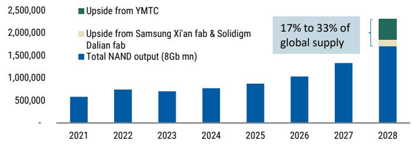

bar_stacked

| Year | Total NAND output (8Gb mn) | Upside from YMTC (%) | Upside from Samsung Xi'an fab & Solidigm Dalian fab (%) |
|---|---|---|---|
| 2021 | 550,000 | - | - |
| 2022 | 750,000 | - | - |
| 2023 | 700,000 | - | - |
| 2024 | 800,000 | - | - |
| 2025 | 900,000 | - | - |
| 2026 | 1,050,000 | - | - |
| 2027 | 1,350,000 | - | - |
| 2028 | 1,750,000 | 550,000 | 33% to 37% of global supply

Source: MS estimates

# Stock exposure

Companies selling into AI enjoy pricing power, while the buyers face margin pressure. In an agentic AI world, demand and pricing power gravitates towards memory and CPU plus the associated supply chains. This is evident in year-to-date stock performance: global consumer electronics stocks have fallen 1% on average, while a memory makers have risen by almost 300%, alongside unprecedented EPS revisions of 333% YTD. We continue to like DRAM suppliers (Samsung, SK hynix, Micron), NAND (SanDisk, KIOXIA), and HDD (Seagate, Western Digital).

The opportunity extends beyond individual memory chips to the full AI system. The beneficiaries of this shift are global and full-stack. The surge in memory is mainly driven by the recent agentic AI shift broadening well beyond headline AI chips – we lay out in Exhibit 14 which stocks offer exposure. Beneficiaries include CPU vendors, memory suppliers, storage companies, and advanced packaging and substrate providers, alongside foundries, equipment makers and server manufacturers. In short, agentic AI widens the AI investment landscape, shifting focus from owning the best accelerator to enabling the full system that makes intelligent agents work.

Exhibit 14: How to play the theme? 

<table><tr><td colspan="6">Global Exposure Across the Stack ? Names by exposure</td></tr><tr><td>CPU• NVDA • Intel• AMD • Arm</td><td>DRAM• Samsung• Hynix• Micron</td><td>NAND• Kioxia• SanDisk</td><td>HDD• Seagate• WDC• TDK</td><td>FOUNDRY• TSMC</td><td>IC-design• GUC• Egis</td></tr><tr><td colspan="3">PCB/Substrate/CCL &amp; Materials• SEMCO • Unimicron • NYPCB• Ibiden • Nittobo • MEC</td><td colspan="3">BMC, CPU &amp; Memory interface• Aspeed • Renesas • Montage• WPG • AP Memory</td></tr><tr><td colspan="2">MLCC &amp; CPU socket• Murata • TDK • Yageo• FIT Hon Teng • Lotes</td><td>ODM• Wiwynn• Hon Hai</td><td colspan="3">SPE• ASML • ASMi • AMAT • Besi • KLAC• Tokyo Electron • Ulvac • Wonik</td></tr></table>

Source: MS

Exhibit 15: Risk/return positioning for key memory and SPE stocks   
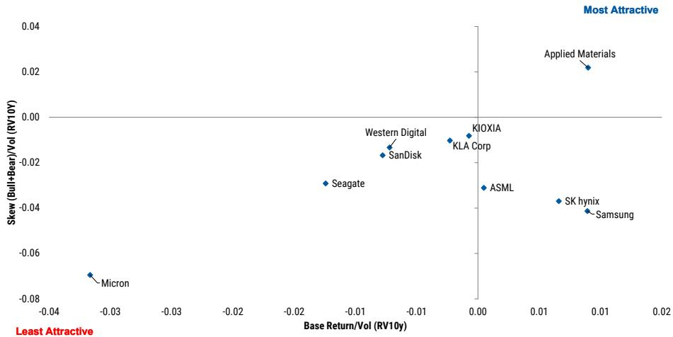

scatter

| Company         | Base Return/Vol (RV10y) | Skew (Bull+Bear)/Vol (RV10Y) |
| --------------- | ------------------------ | ----------------------------- |
| Micron          | -0.035                   | -0.075                        |
| Seagate         | -0.012                   | -0.03                         |
| Western Digital| -0.008                   | -0.015                        |
| SanDisk         | -0.006                   | -0.018                        |
| KLA Corp        | -0.004                   | -0.01                         |
| KIOXIA          | 0.00                     | -0.005                        |
| ASML            | 0.002                    | -0.03                         |
| SK hynix        | 0.008                    | -0.04                         |
| Samsung         | 0.01                     | -0.04                         |
| Applied Materials| 0.01                     | 0.02                          |

Source: Factset (historical share price data), MS estimates. Note: Methodology: X-axis (Base Return/Vol) represents our base case price target return divided by 10-year realized volatility (RV10y). Y-axis (Skew) represents the sum of our bull and bear case returns divided by RV10y, capturing payoff asymmetry.

- US Semiconductors: Agentic AI-driven CPU demand structurally favors AMD in cloud share gains, but we prefer exposure via AI enablers in NVIDIA and Micron where token growth and capex translate more directly into earnings upside.   
- US Semiconductor Equipment: Rising compute and CPU TAM drive incremental WFE demand, with DRAM and leading-edge logic (<5nm/2nm) capacity expansion supporting upside for equipment names such as AMAT and KLA.   
- US Hardware: AI agent proliferation is a structural tailwind for HDD demand, as persistent storage is required to capture growing volumes of context, history, and system-level data, with \~80% of cloud data still residing on disks. We expect HDD demand to remain strong (Demand growing at 50% EB vs. 30%+ supply CAGR), with supply tightness supporting a “stronger for longer” pricing backdrop, benefiting Seagate and Western Digital. On the flip side, we see US Hardware OEMs and hyperscalers as most exposed to memory inflation/shortages. Among the US Hardware OEMs, vendors with (1) more consumer exposure, (2) smaller scale/TAMs, and (3) less pricing power/differentiation face the most significant

margin risk. While Server and Storage OEMs have greater exposure to memory inflation than this cohort, structural demand for AI supports greater pricing power/ability to pass through costs to the end customer (DELL, HPE). This puts small cap consumer electronics and PC vendors most at risk of seeing margin pressure. AAPL is our only Overweight-rated OEM in US Technology Hardware.

- European Semiconductors: ASML's EUV tools are a critical enabler of future DRAM supply expansion, and the company benefits from rising compute intensity and design complexity.   
- Korea Technology: We continue to see Samsung Electronics and SK hynix as key beneficiaries of memory content growth from AI CPU penetration.   
- Greater China Semiconductors: Montage is leveraged to the structural increase in memory content per server, with higher CPU and DRAM intensity driving demand for memory interconnect solutions.   
- Japan Semiconductors: Increasing CPU complexity and memory scaling drive demand for advanced semi-cap (Tokyo Electron, Ulvac) and memory interface solutions, positioning Renesas as a beneficiary of higher DRAM bandwidth/capacity requirements. Agentic AI also supports NAND demand (KIOXIA) and broader data center exposure across Japan semi names.

# What could challenge the chipflation theme

AI spend slows down. Reduced competition among frontier LLMs could result in lower AI capex spend and a shift back to ample memory supply. Alternatively, dramatic improvements in AI model architectures and KV cache/tokenization could shrink the amount of memory needed by data centers per token generation. The high costs of funding AI infrastructure could also lead major cloud service providers to scale back buildouts.

Electricity and power supply. The availability of reliable, large-scale electricity could be an obstacle, as scaling advanced AI models and running agentic ecosystems requires unprecedented electrical loads. A new phase of agentic systems designed to reason, plan and operate over extended periods with continuous, high-intensity computing is pushing data centers into sustained peak power usage, far beyond the short bursts typical of earlier chatbot-style AI. This poses a significant challenge to global grid infrastructures.

Demand destruction. Memory demand destruction is already here for traditional technology products and could take the form of a hardware margin squeeze, higher retail prices, and a structural market shift where smaller vendors and mid-tier OEMs are disproportionately affected. A material slowdown in demand would ease supply tightness and hence reduce prices.

Geopolitics and trade policy. Memory and advanced packaging sit in a global supply chain. Any new restriction or disruption could alter patterns of supply and demand.

# Memory – A Multi-Year Bottleneck

Shawn Kim, Joseph Moore

The explosive demand for AI infrastructure has caused supply constraints in all types of memory (DRAM, HBM, NAND, HDD). As AI increasingly moves beyond data centers into edge devices and the physical world, it could trigger a further surge in demand for memory chips. In that scenario, these components would no longer be seen as commodity chips but as critical pillars of the global digital infrastructure.

AI and data centers are becoming the dominant buyers of memory – we expect the server share of DRAM demand to rise from 37% in 2023 to 59% in 2028e, while enterprise SSDs jump from 18% to 65% of NAND demand. The result is a structurally tighter market where non-AI buyers may face weaker access to supply for an extended period.

# A quick primer – what is memory?

Memory is the working space a computer uses to hold data it is actively processing – the digital equivalent of the desk you are working on right now, as opposed to the filing cabinet behind you. Three types of memory matter for the AI economy:

- DRAM (Dynamic Random Access Memory) is the fast but expensive working memory used by every server, PC and smartphone. It is what the CPU uses to hold and fetch the data it is computing.   
- HBM (High Bandwidth Memory) is a premium type of DRAM focused on providing maximum data bandwidth. HBM is DRAM stacked vertically and bolted directly onto AI chips – it is the memory layer that makes large AI models possible, feeding data fast enough to limit an AI accelerator downtime. Think of DRAM as a single lane road and HBM as a 12-lane highway for data transmission.   
- NAND is the storage memory used in solid-state drives (SSDs), which sit between working memory and slower HDD disk storage. NAND holds the trained model weights, the training datasets, and the cached results that AI systems retrieve from. It is also used for picture, video and data storage.

All three types of memory matter as AI workloads use all three at once and in massive quantities. Next-generation rack-scale AI systems such as NVIDIA's Vera Rubin NVL72 contain 20.7TB of HBM attached to GPUs and 54TB of LPDDR5X serving the CPUs, before considering local or external SSD storage.

AI demand is scaling across three layers at once — more memory per chip, more chips per system, and more systems per cluster. Agentic AI adds another layer of pressure through longer context windows, larger conversation memory and repeated inference across multiple agents. The result is a structural increase in memory intensity across all aspects of the AI stack

Exhibit 16: AI servers are becoming memory systems   
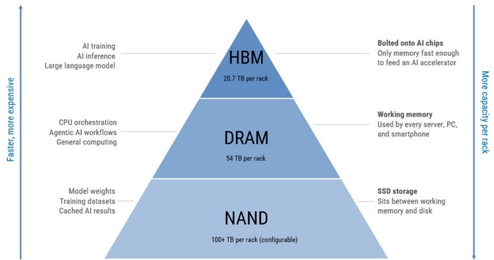

other

| Component | Capacity (TB per rack) |
| --------- | ---------------------- |
| HBM | 20.7 |
| DRAM | 54 |
| NAND | 100+ |

Source: NVIDIA, MS. Note: Rubin NVL72 memory capacity based on platform disclosures. NAND/eSSD capacity varies by OEM and storage architecture.

For readers less familiar with the memory market structure, a full primer is included in Primer: Memory 101 – Types, Market Structure and the Cycle

# The AI Memory Wall

The bottleneck in AI is increasingly memory, not just compute. As inference shifts from single-turn chat to agentic workflows, memory intensity rises sharply: large models need weights resident in memory, while longer context windows and KV caches increase memory usage per user, per session and per agent. Agent swarms multiply this effect because many agents maintain or reload context simultaneously, turning inference into a much larger memory-capacity and memory-bandwidth problem. Hyperscalers therefore need more HBM, server DRAM and enterprise SSD capacity to meet this surge in memory use now, not when new fabs ramp in a few years' time.

That urgency is pushing Big Tech toward multi-year LTAs, to secure future capacity via prepayments. The challenge for producers is that supply is unable to respond immediately: EUV tool availability, fab construction, process qualification, HBM stacking, packaging, testing and yield ramp are multi-year, multi-billion-dollar projects. This is why visible demand today can still translate into shortages through 2027 and beyond.

Exhibit 17: From tool capacity to qualified memory output – lead times are multiple quarters

From Tool Capacity to Qualified Memory Output

ASML capacity is expanding; memory relief depends on install, qualification, yield ramp and product allocation

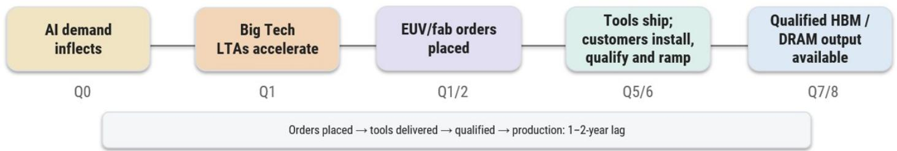

flowchart

```mermaid
graph LR
    A["AI demand inflects"] --> B["Big Tech LTAs accelerate"]
    B --> C["EUV/fab orders placed"]
    C --> D["Tools ship; customers install, qualify and ramp"]
    D --> E["Qualified HBM / DRAM output available"]
    
    style A fill:#f9f,stroke:#333
    style B fill:#f9f,stroke:#333
    style C fill:#f9f,stroke:#333
    style D fill:#f9f,stroke:#333
    style E fill:#f9f,stroke:#333
    
    note1["Orders placed → tools delivered → qualified → production: 1-2-year lag"]
```

Source: MS

Supply response requires demand visibility. The supply response is coming, but it requires demand visibility and commercial commitment. Our Europe semis team expects ASML to expand capacity in line with sustained EUV demand, with shipments guided from 44 systems last year to 60+ systems this year and potential capacity moving higher as demand visibility improves. The issue is therefore not simply ASML lead time. The constraint is the full conversion chain: memory customers need to commit, tools need to ship, fabs need to be ready, processes need to qualify, yields need to ramp, and HBM packaging/test capacity needs to scale.

The post-Covid cycle was a lesson here. Intel and Samsung both deferred EUV orders after demand weakened and execution challenges delayed ramps, creating order volatility for the equipment supply chain. This cycle, memory makers and hyperscalers may need to provide firmer LTAs, prepayments and allocation commitments before capacity is built. That supports our view that supply relief is real, but phased – and that memory tightness could persist into 2027 even as EUV capacity expands.

Exhibit 18: ASML EUV shipments FY25-FY27e   
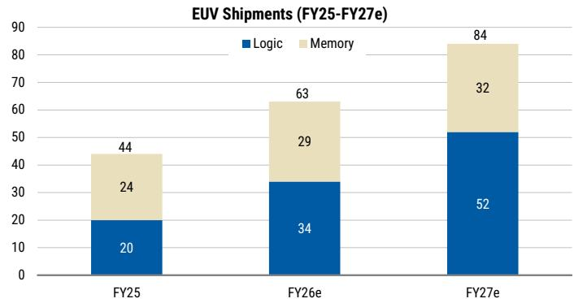

bar_stacked

EUV Shipments (FY25-FY27e)
| Year | Logic | Memory |
| :--- | :--- | :--- |
| FY25 | 20 | 24 |
| FY26e | 34 | 29 |
| FY27e | 52 | 32 |
| Total | 44 | 63 |
| Total (FY25-FY27e) | 84 | 32 |

Source: Company data, MS estimates

Exhibit 19: ASML order book and backlog   
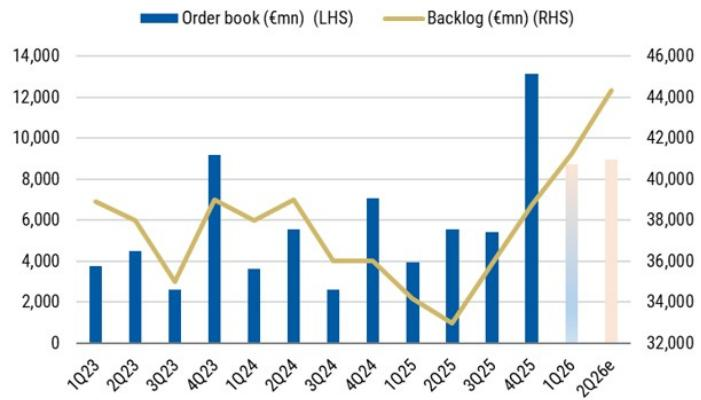

bar_line

| Quarter | Order book (€mn) (LHS) | Backlog (€mn) (RHS) |
|---|---|---|
| 1Q23 | 3800 | 39000 |
| 2Q23 | 4500 | 37000 |
| 3Q23 | 2600 | 33000 |
| 4Q23 | 9200 | 39000 |
| 1Q24 | 3600 | 36000 |
| 2Q24 | 5500 | 37000 |
| 3Q24 | 2600 | 34000 |
| 4Q24 | 7100 | 34000 |
| 1Q25 | 4000 | 32000 |
| 2Q25 | 5500 | 33000 |
| 3Q25 | 5400 | 35000 |
| 4Q25 | 13100 | 39000 |
| 1Q26 | 8700 | 41000 |
| 2Q26e | 8900 | 44000 |

Source: Company data, MS estimates

# Demand is shifting from consumer electronics to AI/server infrastructure

DRAM server share of bit demand rises from 37% in 2023 to 59% in 2028e, while the share of shipments for PCs and smartphones declines sharply. This matters because the dominant buyer increasingly has stronger purchasing power, longer-duration demand visibility and greater willingness to sign LTAs or prepay for supply. As a result, pricing and shipment allocation continue to gravitate toward AI/server infrastructure requirements at the expense of traditional consumer end markets.

NAND is undergoing a rapid mix shift in enterprise SSDs. Enterprise SSD share of NAND bit demand rises from 18% in 2023 to 65% in 2028e, making AI/server storage the key swing factor for NAND. This reflects the storage intensity of AI workloads, including training data, model checkpoints, retrieval-augmented generation, inference infrastructure and enterprise data lakes.

Exhibit 20: DRAM – AI server demand becomes dominant ...   
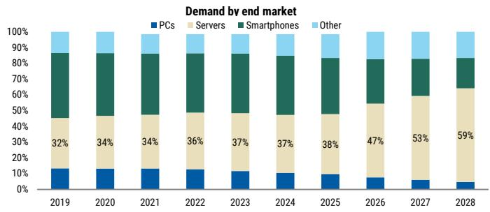

bar_stacked

| Year | PCs  | Servers | Smartphones | Other |
|------|------|---------|-------------|-------|
| 2019 | 12%  | 32%     | 67%         | 13%   |
| 2020 | 12%  | 34%     | 65%         | 13%   |
| 2021 | 12%  | 34%     | 65%         | 13%   |
| 2022 | 12%  | 36%     | 63%         | 13%   |
| 2023 | 11%  | 37%     | 63%         | 13%   |
| 2024 | 10%  | 37%     | 63%         | 13%   |
| 2025 | 9%   | 38%     | 61%         | 14%   |
| 2026 | 8%   | 47%     | 47%         | 16%   |
| 2027 | 6%   | 53%     | 37%         | 18%   |
| 2028 | 4%   | 59%     | 31%         | 19%   |

Source: TrendForce estimates, MS

Exhibit 21: ... as well as NAND enterprise SSDs as key growth drivers   
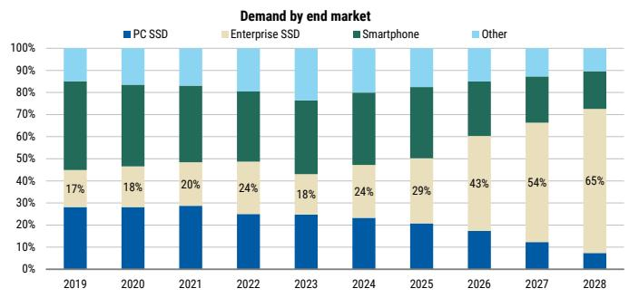

bar_stacked

| Year | PC SSD | Enterprise SSD | Smartphone | Other |
|------|--------|----------------|----------|-------|
| 2019 | 28%    | 17%            | 34%      | 13%   |
| 2020 | 28%    | 18%            | 33%      | 14%   |
| 2021 | 28%    | 20%            | 31%      | 15%   |
| 2022 | 25%    | 24%            | 30%      | 17%   |
| 2023 | 24%    | 18%            | 30%      | 23%   |
| 2024 | 23%    | 24%            | 30%      | 21%   |
| 2025 | 21%    | 29%            | 29%      | 18%   |
| 2026 | 17%    | 43%            | 25%      | 13%   |
| 2027 | 11%    | 54%            | 21%      | 13%   |
| 2028 | 7%     | 65%            | 17%      | 11%   |

Source: TrendForce estimates, MS

# Supply slow to respond

New memory capacity will come online from late 2027 but is still unable to meet demand for all markets. Strategically, most of the valuable capacity is likely to be dedicated to where pricing, margins and customer commitments are strongest – namely to HBM customers, server DRAM and enterprise SSDs. While AI semiconductors are forecast to grow at a \~50% CAGR by 2030 (as per TSMC forecasts at its annual technology symposium on May 14, 2026), we expect DRAM production to grow at a pace that will meet only about 60% of demand, given annual bit shipments are unlikely to rise much above the 30% level due to EUV constraints.

We model DRAM supply remaining tight even as capacity additions accelerate. DRAM undersupply widens from \~4–5% in 2023–24 to \~17% in 2025–26, before easing but still remaining tight at \~15% in 2027e. The key issue is timing.

- Annual DRAM wafer capacity additions rise from \~105kwpm in 2025e to \~390kwpm in 2027e and \~460kwpm in 2028e, led by Samsung, SK hynix, Micron and CXMT. This represents meaningful supply growth by historical standards, but arrives after the period of maximum tightness.   
- NAND remains under-supplied through 2028e, with the sufficiency ratio deteriorating to roughly \~14% undersupply in 2028e. Capacity additions recover only after net cuts in 2024–25, rising to roughly \~170kwpm in 2028e, led by Samsung, KIOXIA/SanDisk, SK hynix/Solidigm, Micron and YMTC.   
- Of these, CXMT and YMTC are Chinese memory producers whose recent acceleration represents a meaningful shift in the supply-side landscape. From 2023 to 2028e, we expect Mainland China to account for \~31% of net global DRAM capacity additions, behind South Korea but ahead of the US, Taiwan and Japan. We discuss China's role in the global memory landscape and the geopolitical questions it raises here.

The timing issue in bringing on new capacity is compounded by execution risk. New memory capacity requires fab construction, tool delivery, process qualification, customer validation and yield ramp. Even when capacity is announced, usable output can lag by several quarters or years.

Exhibit 22: DRAM supply sufficiency ratio   
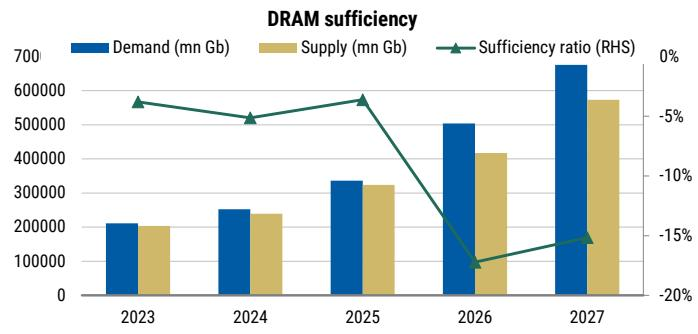

bar_line

DRAM sufficiency
| Year | Demand (mn Gb) | Supply (mn Gb) | Sufficiency ratio (RHS) (%) |
| :--- | :--- | :--- | :--- |
| 2023 | 210000 | 200000 | -4 |
| 2024 | 250000 | 235000 | -6 |
| 2025 | 335000 | 325000 | -8 |
| 2026 | 505000 | 415000 | -18 |
| 2027 | 675000 | 575000 | -15 |

Source: TrendForce estimates, MS

Exhibit 23: NAND supply sufficiency ratio   
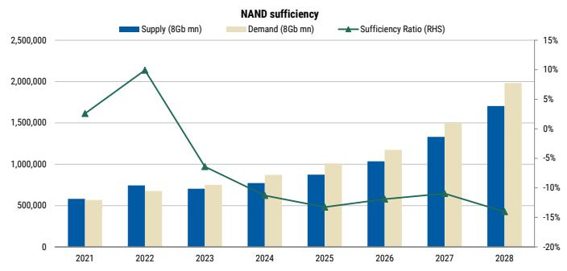

bar_line

NAND sufficiency
| Year | Supply (8Gb mn) | Demand (8Gb mn) | Sufficiency Ratio (RHS) (%) |
| :--- | :--- | :--- | :--- |
| 2021 | 575,000 | 560,000 | 1.3 |
| 2022 | 740,000 | 670,000 | 11.5 |
| 2023 | 700,000 | 740,000 | -7.5 |
| 2024 | 770,000 | 860,000 | -9.5 |
| 2025 | 870,000 | 1010,000 | -11.5 |
| 2026 | 1030,000 | 1170,000 | -11.5 |
| 2027 | 1330,000 | 1490,000 | -11.5 |
| 2028 | 1710,000 | 1980,000 | -14.5 |

Source: TrendForce estimates, MS

Exhibit 24: DRAM annual wafer capacity additions are moving to all-time high   
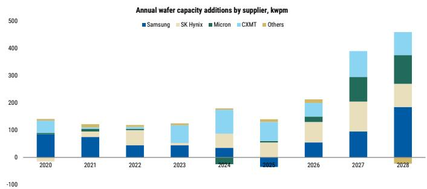

bar_stacked

Annual wafer capacity additions by supplier, kwpm
| Year | Samsung (kWpm) | SK Hynix (kWpm) | Micron (kWpm) | CXMT (kWpm) | Others (kWpm) |
|---|---|---|---|---|---|
| 2020 | 85 | 10 | 0 | 45 | 0 |
| 2021 | 75 | 15 | 0 | 15 | 0 |
| 2022 | 45 | 45 | 0 | 15 | 0 |
| 2023 | 45 | 0 | 0 | 65 | 0 |
| 2024 | 35 | 75 | -25 | 95 | 0 |
| 2025 | -25 | 55 | 0 | 85 | 0 |
| 2026 | 55 | 75 | 25 | 60 | 10 |
| 2027 | 95 | 115 | 115 | 105 | 0 |
| 2028 | 185 | 85 | 115 | 85 | 0 |

Source: TrendForce estimates, MS

Exhibit 25: NAND annual wafer capacity additions are held back by DRAM producers   
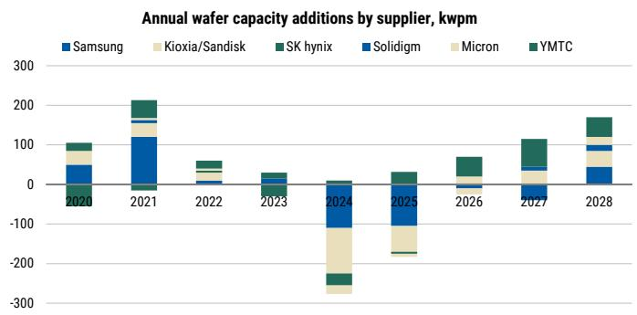

bar_stacked

Annual wafer capacity additions by supplier, kwpm
| Year | Samsung (kwpm) | Kioxia/Sandisk (kwpm) | SK hynix (kwpm) | Solidigm (kwpm) | Micron (kwpm) | YMTC (kwpm) |
|---|---|---|---|---|---|---|
| 2020 | -50 | 10 | 30 | 40 | -10 | -10 |
| 2021 | 120 | 10 | 30 | 60 | -10 | -10 |
| 2022 | 10 | 10 | 30 | 30 | -10 | -10 |
| 2023 | 20 | -10 | -10 | 10 | -10 | -10 |
| 2024 | -250 | -250 | -30 | -250 | -250 | -250 |
| 2025 | -150 | -150 | -150 | -150 | -150 | -150 |
| 2026 | -10 | -10 | -10 | -10 | -10 | -10 |
| 2027 | -25 | -25 | -25 | -25 | -25 | -25 |
| 2028 | 40 | 40 | 40 | 40 | 40 | 40 |

Source: TrendForce estimates, MS

# LTAs: strategies to guarantee supply allocation and priority

Shifting from price-driven cycles to supply-security focused LTAs. The memory industry is undergoing a structural transformation in how supply is contracted. Historically, memory customers often procured opportunistically, with pricing largely linked to short-term supply-demand conditions. During upcycles, customers sometimes signed LTAs to secure allocation, but these agreements often had limited enforceability and could be renegotiated when the market softened.

This cycle looks different as memory availability is now tied directly to AI deployment roadmaps. Leading Cloud Service Providers (CSPs) are no longer managing just price risk; they are managing supply risk as well. As a result, multi-year agreements, production capacity guarantees and prepayments are becoming more important.

- Samsung has discussed moving quarterly and annual contracts into 3-5 year agreements.   
- SK hynix has highlighted increasing customer requests for medium- to long-term supply commitments.   
- Micron has announced a 5-year Strategic Customer Agreement.   
- SanDisk has described multi-year partnerships backed by firm financial guarantees.   
- KIOXIA has indicated that long-term supply agreements with hyperscale customers are extending into FY28-29.

This is where we see a two-tier market starting to emerge. AI/cloud buyers lock in supply first, while non-LTA buyers compete for a smaller and more volatile residual pool.

# HBM Cannibalization and the Two-Tier Market

Shawn Kim, Joseph Moore

HBM is increasingly becoming the mechanism through which AI demand crowds out conventional memory supply, by consuming advanced DRAM wafer capacity and locking in future supply through LTAs. This is sharply reducing available DRAM supply – our analysis implies a \~15% PC DRAM shortfall and \~12% smartphone DRAM shortfall, equivalent to \~58mn PCs and \~134mn smartphones. This could drive a two-tier market, where large AI buyers secure supply first, while non-AI buyers face higher prices, weaker allocation and higher volatility.

# HBM demand is scaling non-linearly

The HBM demand curve is compounding at every layer of the AI stack. With growing complexity in AI models and larger systems architectures, memory requires higher capacity, lower latency, higher bandwidth, and improved energy efficiency. All leading AI chips deployed for AI training and inference use HBM to scale memory capacity and bandwidth per chip by adding more stacks, higher layer counts, with faster generations of HBM. HBM's critical role in AI chip architecture is scaling across three layers at once:

- HBM content rises 7.2x at the chip level, from 40GB per A100 GPU to 288GB per Rubin GPU.   
- At the system level, memory content rises even faster: an 8-GPU A100 server had roughly 320GB of HBM, while a Rubin NVL72 rack-scale system carries 20.7TB, or around 65x more.   
- At cluster scale, the memory consumption becomes exponential. A 2020 training cluster with \~256 A100 GPUs contained roughly \~10TB of HBM. A 2026 frontier cluster with \~200,000+ GPUs could contain roughly \~18PB of HBM, or around \~1,800x more.

Exhibit 26: AI memory intensity compounds across chip, server, rack and cluster   
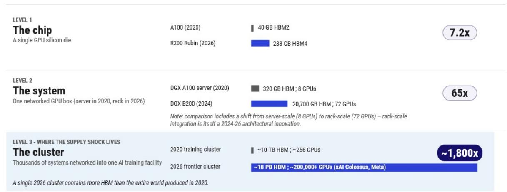

bar

| Level | System | Memory Type | Hardware (GB) | Capacity (x) |
| :--- | :--- | :--- | :--- | :--- |
| 1 | The chip | A single GPU silicon die | 40 GB HBM2 | 7.2x |
| 1 | The chip | R200 Rubin (2026) | 288 GB HBM4 | |
| 2 | The system | DGX A100 server (2020) | 320 GB HBM; 8 GPUs | 65x |
| 2 | The system | DGX B200 (2024) | 20,700 GB HBM; 72 GPUs | |
Note: comparison includes a shift from server-scale (8 GPUs) to rack-scale (72 GPUs) – rack-scale integration is itself a 2024-26 architectural innovation.
LEVEL 3 - WHERE THE SUPPLY SHOCK LIVES
The cluster
Thousands of systems networked into one AI training facility
2020 training cluster
~10 TB HBM; ~256 GPUs
~1,800x
2026 frontier cluster
~18 PB HBM; ~200,000+ GPUs (xAI Colossus, Meta)
A single 2026 cluster contains more HBM than the entire world produced in 2020.

Source: NVIDIA disclosures, MS estimates. Note: HBM capacities are illustrative platform-level comparisons; cluster estimate assumes frontier-scale training clusters.

# HBM consumes disproportionate DRAM capacity

HBM is not just incremental DRAM demand. It causes a meaningful throughput penalty due to significantly larger die sizes and yield challenges from 3D stacking, TSVs, advanced packaging, intensive testing and customer qualification. These steps significantly reduce effective bit output versus conventional DRAM and increase the burden on wafer, packaging and test capacity.

Our model shows the HBM bit-output penalty rising from roughly 3.0x conventional DRAM wafers in 2021–24 to \~4.3x by 2028e. In other words, each unit of HBM output consumes materially more wafer capacity than conventional DRAM output.

At the same time, HBM is absorbing a growing share of the most constrained wafer pool. HBM rises from \~6% of leading-edge memory wafers in 2023 to \~34% by 2028e. AI customers are not only adding new demand; they are taking a larger share of leading-edge capacity that might otherwise support DDR, LPDDR and conventional server DRAM.

Exhibit 27: HBM die penalty – bit-output is reduced due to much larger DRAM dies   
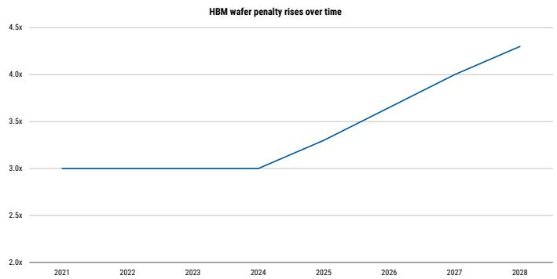

line

| Year | HBM wafer penalty |
| ---- | ----------------- |
| 2021 | 3.0x              |
| 2024 | 3.0x              |
| 2025 | 3.3x              |
| 2026 | 3.7x              |
| 2027 | 4.0x              |
| 2028 | 4.3x              |

Source: MS estimates

Exhibit 28: HBM cannibalization: share of advanced DRAM wafer is rising sharply   
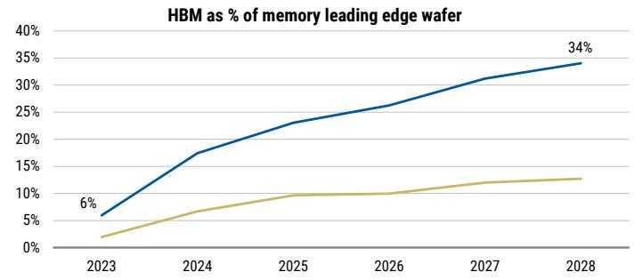

line

| Year | HBM as % of memory leading edge wafer |
| ---- | -------------------------------------- |
| 2023 | 6%                                     |
| 2028 | 34%                                    |

Source: MS estimates

# HBM supply is ramping, but remains concentrated

Significant growth in HBM bit demand is driven by AI chip demand. HBM capacity is ramping quickly, but the market remains concentrated across Samsung, SK hynix and Micron. We forecast year-end HBM capacity to rise from \~480kwpm in 2026e to \~610kwpm in 2027e.

Even with this ramp, supply remains constrained because HBM capacity is not just a wafer-start question. It also depends on yield, utilization, TSV capability, advanced packaging, test capacity and customer qualification. Qualification is especially important: not all HBM capacity is immediately usable by all accelerator customers.

What about China HBM? Current export restrictions ban all raw HBM stacks into China; however, chips with HBM can still be shipped as long as they do not exceed the FLOPS regulations. CXMT is rapidly expanding HBM capacity, targeting HBM3 this year and HBM3e in 2027 to support domestic AI chips. Other new entrants, such as XMC (Wuhan Xinxin) are producing the HBM wafers with new DRAM dies set for production by YMTC later this year. Current capacity is at R&D scale but is planned to ramp in coming years.

Exhibit 29: HBM wafer capacity is still highly concentrated in the Big 3 DRAM companies   
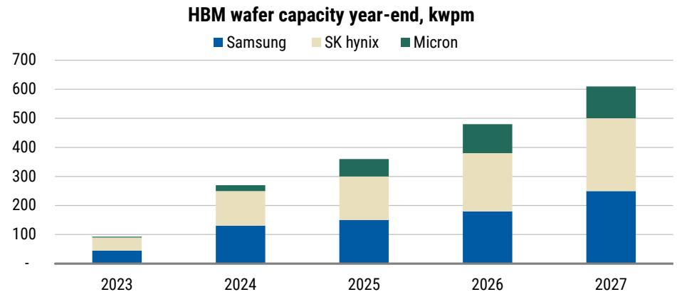

bar_stacked

HBM wafer capacity year-end, kwpm
| Year | Samsung (kWpm) | SK hynix (kWpm) | Micron (kWpm) |
| :--- | :--- | :--- | :--- |
| 2023 | 45 | 40 | 10 |
| 2024 | 125 | 110 | 20 |
| 2025 | 145 | 160 | 60 |
| 2026 | 175 | 210 | 80 |
| 2027 | 245 | 290 | 90 |

Source: Company data, MS

# HBM Model Update

We update our HBM model with the following key changes:

- Capacity: We expect all three players to continue their aggressive back-end capacity expansion. We expect total capacity to reach 610k/wpm by the end of 2027e with the potential upside if pricing negotiation goes smoothly.   
- Yield and UTR: We increase the UTR and yield assumptions for Samsung Electronics, as the current qualification progress for HBM4 at key customers has been going well and company management has been confident on the market share gain moving into 2H26.   
- Sufficiency: On the HBM side, we believe the supply and demand balance will be tight this year, but with Rubin Ultra ramping up in late 2027 and under current capacity expansion plans, HBM might be in shortage moving into 2027. On the overall sufficiency of the DRAM industry, we model a -7-14% decline in smartphone, PC and consumer DRAM demand in 2026 but nearly 100% growth in server DRAM demand, based on our channel checks. As a result, our 2026 forecast commodity DRAM growth increases to 48% versus supply growth at 29%, and our total DRAM & HBM sufficiency ratio decreases to -17% from -4% in 2025e. Our 2027e forecasts for YoY growth in commodity DRAM supply (37%) and demand (32%) are based on our US Semiconductor team's WFE model forecast, together with our HBM forecast. For 2027e, we model sufficiency slightly improving to -15%

Exhibit 30: HBM supply and demand model 

<table><tr><td>Sufficiency estimates</td><td>2023</td><td>2024</td><td>2025</td><td>2026e</td><td>2027e</td></tr><tr><td colspan="6">HBM TSV Capacity (K wpm)</td></tr><tr><td>Samsung</td><td>45</td><td>130</td><td>150</td><td>180</td><td>250</td></tr><tr><td>SK Hynix</td><td>45</td><td>120</td><td>150</td><td>200</td><td>250</td></tr><tr><td>Micron</td><td>3</td><td>20</td><td>60</td><td>100</td><td>110</td></tr><tr><td>Total</td><td>93</td><td>270</td><td>360</td><td>480</td><td>610</td></tr><tr><td colspan="6">Yield rate assumptions</td></tr><tr><td>Samsung</td><td></td><td>50%</td><td>60%</td><td>55%</td><td>70%</td></tr><tr><td>SK Hynix</td><td></td><td>60%</td><td>75%</td><td>65%</td><td>70%</td></tr><tr><td>Micron</td><td></td><td>50%</td><td>70%</td><td>65%</td><td>70%</td></tr><tr><td colspan="6">UTR assumptions</td></tr><tr><td>Samsung</td><td></td><td>80%</td><td>60%</td><td>70%</td><td>100%</td></tr><tr><td>SK Hynix</td><td></td><td>100%</td><td>100%</td><td>100%</td><td>100%</td></tr><tr><td>Micron</td><td></td><td>100%</td><td>100%</td><td>100%</td><td>100%</td></tr><tr><td colspan="6">Implied HBM production (mn Gb)</td></tr><tr><td>Samsung</td><td>1,500</td><td>4,435</td><td>6,387</td><td>9,696</td><td>21,239</td></tr><tr><td>SK Hynix</td><td>1,500</td><td>6,273</td><td>12,830</td><td>17,363</td><td>22,226</td></tr><tr><td>Micron</td><td>150</td><td>729</td><td>3,548</td><td>7,937</td><td>10,372</td></tr><tr><td>Total</td><td>3,150</td><td>11,436</td><td>22,765</td><td>34,997</td><td>53,837</td></tr><tr><td colspan="6">Sufficiency Ratio</td></tr><tr><td>HBM Demand (mn Gb)</td><td>1,866</td><td>9,059</td><td>19,516</td><td>34,205</td><td>56,085</td></tr><tr><td>Commodity DRAM market demand (mn Gb)</td><td>209,527</td><td>243,423</td><td>316,640</td><td>469,675</td><td>619,970</td></tr><tr><td>Total HBM+DRAM demand (mn Gb)</td><td>211,393</td><td>252,481</td><td>336,156</td><td>503,879</td><td>676,055</td></tr><tr><td>Commodity DRAM market supply (mn Gb)</td><td>200,214</td><td>228,086</td><td>301,257</td><td>382,107</td><td>519,666</td></tr><tr><td>Total HBM+DRAM supply (mn Gb)</td><td>203,364</td><td>239,523</td><td>324,022</td><td>417,104</td><td>573,503</td></tr><tr><td>Total DRAM sufficiency</td><td>-4%</td><td>-5%</td><td>-4%</td><td>-17%</td><td>-15%</td></tr></table>

Source: Company data, MS estimates

NVIDIA accounts for the largest share of HBM demand, and we expect this to continue in 2027 driven by its Rubin Ultra roadmap, which increases per GPU capacity to 1TB. Broadcom follows as TPU and MTIA volumes surge, while other incremental projects add smaller increases. Amazon also emerges as one of the top HBM customers, with an aggressive Trainium AI chip roadmap.

Exhibit 31: HBM – AI chip consumption in 2026 

<table><tr><td>AI chip vendor</td><td>Product name</td><td>CoWoS capacity allocation (k wafers)</td><td>Chips per CoWoS wafer</td><td>Implied shipments (k)</td><td>HBM chip density (GB)</td><td>HBM chip units</td><td>Total HBM size (GB)</td><td>HBM generation</td><td>HBM vendor</td><td>Total HBM demand (k GB)</td></tr><tr><td colspan="11">AI GPU (2026e)</td></tr><tr><td rowspan="5">NVIDIA</td><td>B300</td><td>390</td><td>14</td><td>5,460</td><td>36</td><td>8</td><td>288</td><td>HBM3e 12hi</td><td>Hynix/Micron/Samsung</td><td>1,572,480</td></tr><tr><td>Vera CPU</td><td>90</td><td>23</td><td>2,070</td><td></td><td></td><td></td><td></td><td></td><td></td></tr><tr><td>Spectrum/CPX</td><td>60</td><td></td><td>-</td><td></td><td></td><td></td><td></td><td></td><td></td></tr><tr><td>Rubin R200</td><td>260</td><td>8</td><td>2,080</td><td>36</td><td>8</td><td>288</td><td>HBM4</td><td>Hynix/Micron/Samsung?</td><td>599,040</td></tr><tr><td>H200</td><td>75</td><td>27</td><td>2,025</td><td>24</td><td>6</td><td>141</td><td>HBM3e 8hi</td><td>Hynix</td><td>285,525</td></tr><tr><td rowspan="3">AMD</td><td>MI300</td><td>3</td><td>12</td><td>36</td><td>24</td><td>8</td><td>192</td><td>HBM3</td><td>Samsung</td><td>6,912</td></tr><tr><td>MI350/375</td><td>7</td><td>12</td><td>84</td><td>36</td><td>8</td><td>288</td><td>HBM3e 12hi</td><td>Samsung/Micron</td><td>24,192</td></tr><tr><td>MI400</td><td>65</td><td>10</td><td>650</td><td>36</td><td>12</td><td>432</td><td>HBM4</td><td>Samsung/Micron</td><td>280,800</td></tr><tr><td colspan="11">AI ASIC (2026e)</td></tr><tr><td rowspan="3">Google</td><td>TPU v7p (Ironwood; AVGO)</td><td>145</td><td>16</td><td>2,320</td><td>24</td><td>8</td><td>192</td><td>HBM3e 8hi</td><td>Hynix/Samsung</td><td>445,440</td></tr><tr><td>TPU v8i (Sunfish; AVGO)</td><td>80</td><td>12</td><td>960</td><td>36</td><td>8</td><td>288</td><td>HBM3e 12hi</td><td>Hynix/Samsung/Micron</td><td>276,480</td></tr><tr><td>TPU v8t (Zebrafish; MediaTek)</td><td>40</td><td>20</td><td>800</td><td>36</td><td>6</td><td>216</td><td>HBM3e 12hi</td><td>Hynix/Micron</td><td>172,800</td></tr><tr><td>AWS</td><td>Trainium 3</td><td>100</td><td>17</td><td>1,700</td><td>36</td><td>4</td><td>144</td><td>HBM3e 12hi</td><td>Hynix/Samsung/Micron</td><td>244,800</td></tr><tr><td rowspan="2">Microsoft</td><td>Maia 200</td><td>4</td><td>29</td><td>116</td><td>16</td><td>4</td><td>64</td><td>HBM3</td><td>Samsung</td><td>7,424</td></tr><tr><td>Maia 300</td><td>5</td><td>11</td><td>55</td><td>36</td><td>8</td><td>288</td><td>HBM4</td><td>Samsung</td><td>15,840</td></tr><tr><td>Total</td><td></td><td>1,479</td><td></td><td></td><td></td><td></td><td></td><td></td><td></td><td>4,034,885</td></tr><tr><td></td><td></td><td></td><td></td><td></td><td></td><td></td><td></td><td colspan="2">Total HBM demand (mn Gb)</td><td>32,279</td></tr></table>

Source: Company data, MS estimates. Note: Estimates are compiled using our Asian supply chain checks.

# LTAs could create a two-tier memory market

As top-tier CSPs secure multi-year supply through LTAs, the residual memory market could become structurally tighter. Customers without LTAs may need to procure from a smaller pool of uncommitted supply, potentially at higher and more volatile prices. We view this as a potential structural cost borne by every buyer who is not at the front of the LTA queue.

Historically, weak PC or smartphone demand would help loosen DRAM markets and lower prices for everyone. In this cycle, AI demand keeps allocation tight even if consumer electronics demand softens, because HBM and server applications now set the priority order, and supplier incentives reinforce the allocation. After the last memory downcycle, suppliers have limited incentive to flood the market with commodity supply when AI customers offer stronger pricing, better margins and more durable contracts.

# We run DRAM sufficiency analysis on the two largest non-server end markets: PCs and smartphones

Starting from total 2027 DRAM + HBM supply of 573,503mn Gb, we allocate 70% to servers and 30% to non-server applications. Within non-server, we assign 17% to PCs and 58% to smartphones, consistent with historical patterns. On the PC side, bottom-up demand of 34,386mn Gb implies a shortfall of 5,138mn Gb (-15%). The picture is comparably challenging for smartphones: total smartphone DRAM demand of 113,125mn Gb against an addressable supply of 99,790mn Gb produces a 13,335mn Gb gap (-12%).

The shortfall proves highly sensitive to content assumptions. On the PC side, our base case of 89Gb per device implies a -15% shortfall; holding content flat year-on-year at 83Gb narrows this to -9%, and de-speccing to 77Gb reduces it to just -2%. Smartphones follow the same pattern: against a 99Gb base case (-12%), flat content at 95Gb narrows the gap to -7%, and de-speccing to 90Gb brings it to -2%.

The read-through is twofold. First, the unit-volume risk is a function of memory content assumptions, not an absolute supply wall — OEMs have a clear lever to protect shipment volumes. Second, that lever is not free: every gigabyte of de-specicing that protects unit volumes is a gigabyte of forgone content growth, so the adjustment ultimately resolves the unit shortfall by suppressing memory bit demand. The market clears either through fewer devices or lower memory intensity per device — and the more likely outcome is a blend of the two.

This reinforces supplier pricing power and changes the cycle. The more supply is committed to strategic AI customers, the less flexible supply remains for opportunistic or non-LTA buyers. This could support ASP resilience even if parts of consumer demand weaken.

Exhibit 32: Our memory sufficiency framework suggests PC and smartphone could see 12-15% memory shortfall 

<table><tr><td colspan="2">PC memory sufficiency in 2027</td></tr><tr><td>Total DRAM + HBM supply (mn Gb)</td><td>573,503</td></tr><tr><td>Server gets 70% of allocation</td><td>401,452</td></tr><tr><td>Non-Server gets 30% of allocation</td><td>172,051</td></tr><tr><td>PC gets 17% of non-server allocation</td><td>29,249</td></tr><tr><td>Total PC memory demand (mn Gb)</td><td>34,386</td></tr><tr><td>Shortfall (mn Gb)</td><td>(5,138)</td></tr><tr><td></td><td>-15%</td></tr><tr><td>Memory content per device (Gb)</td><td>89</td></tr><tr><td>Shortfall (mn units)</td><td>(58)</td></tr><tr><td>vs. MS PC shipment forecast</td><td>388</td></tr><tr><td>Downside vs. MSe</td><td>-15%</td></tr></table>

Sensitivity analysis 

<table><tr><td></td><td>Memory content per device (Gb)</td><td colspan="2">Shortfall</td></tr><tr><td>Current assumption</td><td>89</td><td>-15%</td><td>Current assumption</td></tr><tr><td>Flat content YoY</td><td>83</td><td>-9%</td><td>Flat content YoY</td></tr><tr><td>De-specing</td><td>77</td><td>-2%</td><td>De-specing</td></tr></table>

<table><tr><td colspan="2">Smartphone memory sufficiency in 2027</td></tr><tr><td>Total DRAM + HBM supply (2027)</td><td>573,503</td></tr><tr><td>Server gets 70% of allocation</td><td>401,452</td></tr><tr><td>Non-Server gets 30% of allocation</td><td>172,051</td></tr><tr><td>Smartphone gets 58% of non-server allocation</td><td>99,790</td></tr><tr><td>Total smartphone demand (2027)</td><td>113,125</td></tr><tr><td>Shortfall (mn Gb)</td><td>(13,335)</td></tr><tr><td></td><td>-12%</td></tr><tr><td>Memory content per device (Gb)</td><td>99</td></tr><tr><td>Shortfall (mn units)</td><td>(134)</td></tr><tr><td>vs. MS smartphone forecast</td><td>1,137</td></tr><tr><td>Downside vs. Mse</td><td>-12%</td></tr></table>

Sensitivity analysis 

<table><tr><td>Memory content per device (Gb)</td><td colspan="2">Shortfall</td></tr><tr><td></td><td>99</td><td>-12%</td></tr><tr><td></td><td>95</td><td>-7%</td></tr><tr><td></td><td>90</td><td>-2%</td></tr></table>

Source: MS estimates. Note: PC includes Laptops, desktops and tablets

Exhibit 33: AI prioritization turns 2027 supply growth into a consumer memory shortfall   

bar

| Category | Shortfall (bn Gb) |
| -------- | ----------------- |
| 2026 DRAM+HBM supply | 420 |
| 2027 supply additions | 570 |
| 2027 total supply | 580 |
| Less HBM allocation | 560 |
| Less Server/AI ex-HBM DRAM allocation | 520 |
| Residual non-server supply | 170 |
| Less other non-server | 160 |
| PC & Smartphone allocation | 130 |
| PC & Smartphone demand | 140 |
Shortfall: 19bn Gb (13% of demand)

Source: MS estimates

# Chipflation Passthrough and Sector Impact

Erik Woodring, Shawn Kim

The current memory cycle is being driven by a structural reallocation of wafer capacity and supplier attention toward AI-related demand. This memory shortage is reshaping PC and smartphone markets as suppliers prioritize higher-value AI/server demand over lower-margin consumer applications. This is already translating into end-demand risk.

We now expect surging memory costs to lower 2026 PC shipments by 10%+ and smartphone shipments by 13% versus 2025, with memory and SSD price inflation driving higher device prices and demand increasingly skewing toward premium devices.

There are long-term ramifications too – device redesigns, a structural shift in unit economics, industry consolidation, and a re-evaluation of the workload mix on-prem versus in the cloud.

# Buyer-seller matrix: who gets priority?

The buyer-seller map is shifting from a commodity market to an allocation market. On the supply side, Samsung, SK hynix and Micron dominate advanced DRAM and HBM, with CXMT increasingly relevant in DRAM capacity additions. In NAND and enterprise SSDs, the key suppliers include Samsung, KIOXIA/SanDisk, SK hynix/Solidigm, Micron and YMTC.

On the buyer side, hyperscalers, AI infrastructure providers and GPU/accelerator ecosystems are the most strategic customers for HBM, high-density server DRAM and enterprise SSDs. These buyers are more likely to receive priority allocation because they offer scale, roadmap visibility and willingness to commit through LTAs – and as a result, they sit at the front of the allocation queue. Traditional consumer and industrial buyers are more exposed: PC OEMs, smartphone OEMs, gaming console makers, networking companies, automakers, industrial firms, medical device makers and smaller hardware companies all rely on DRAM, LPDDR and NAND, but have weaker bargaining power than AI/cloud customers.

The strategic tension is that upstream supply is concentrated while downstream demand is broad. When AI customers move to the front of the allocation queue, the remaining markets face tighter access and higher price volatility.

Exhibit 34: Buyer Hierarchy: Who gets memory supply first?   
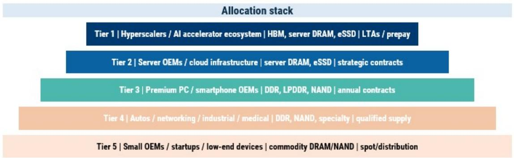

flowchart

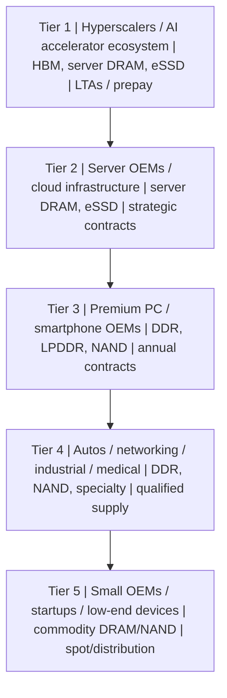
```mermaid
graph TD
    A["Tier 1 | Hyperscalers / AI accelerator ecosystem | HBM, server DRAM, eSSD | LTAs / prepay"] --> B["Tier 2 | Server OEMs / cloud infrastructure | server DRAM, eSSD | strategic contracts"]
    B --> C["Tier 3 | Premium PC / smartphone OEMs | DDR, LPDDR, NAND | annual contracts"]
    C --> D["Tier 4 | Autos / networking / industrial / medical | DDR, NAND, specialty | qualified supply"]
    D --> E["Tier 5 | Small OEMs / startups / low-end devices | commodity DRAM/NAND | spot/distribution"]
```

Higher allocation priority ↑ | Higher spot-price exposure ↓   
Source: MS

Exhibit 35: Memory demand is overwhelmingly shifting towards data center technologies and away from more consumer-facing Smartphone and PC markets   
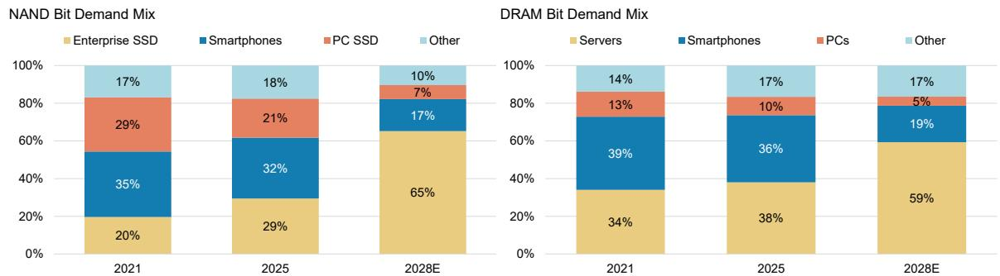

bar_stacked

NAND Bit Demand Mix
| Year | Enterprise SSD (%) | Smartphones (%) | PC SSD (%) | Other (%) |
| :--- | :--- | :--- | :--- | :--- |
| 2021 | 20 | 35 | 29 | 17 |
| 2025 | 29 | 32 | 21 | 18 |
| 2028E | 65 | 17 | 7 | 10 |
DRAM Bit Demand Mix
| Year | Servers (%) | Smartphones (%) | PCs (%) | Other (%) |
| 2021 | 34 | 39 | 13 | 14 |
| 2025 | 38 | 36 | 10 | 17 |
| 2028E | 59 | 19 | 5 | 17 |

Source: TrendForce estimates, MS

# Sector impact and passthrough – where the pain lands

Memory inflation is becoming a broad hardware-sector margin risk, extending beyond PCs and smartphones into gaming consoles, servers, cloud, networking, autos, medical devices, broadband equipment, industrial systems and low-cost education/embedded devices. The issue is not only higher DRAM/NAND pricing, but also allocation priority: suppliers are prioritizing HBM, server DRAM and enterprise SSD demand tied to AI infrastructure, while conventional consumer and industrial memory users are increasingly exposed to higher prices, longer lead times and weaker bargaining power.

On a gross cost basis, servers and cloud and PCs are among the most exposed. But on net margin impact after passthrough, the most impacted sectors are different: midrange and low-end PCs, low-end smartphones, consumer electronics, gaming consoles, embedded and education devices, and smaller industrial OEMs (Exhibit 36). While it is difficult to predict whether historical demand elasticity will repeat this cycle given such significant price hikes, our quant analysis would paint a similar picture: low/mid-range PCs and smartphones face relatively elastic demand responses and thus face more significant net margin risk than enterprise infrastructure, where demand is much more inelastic with relatively more margin protection (Exhibit 38). These more consumer-led end markets combine higher memory BOM exposure with weaker pricing power and higher demand elasticity.

Exhibit 36: Consumer electronics companies continue to call out margin pressures relating to memory cost inflation 

<table><tr><td colspan="3">Consumer Electronics Commentary on Memory Cost Inflation Pressures</td></tr><tr><td>Source</td><td>Commentary</td><td>Date</td></tr><tr><td>HP Inc</td><td>&quot;Looking ahead, we expect the memory and storage environment to remain constrained. In addition, we also anticipate broader inflationary pressures beyond memory and storage.&quot;</td><td>27-May-26</td></tr><tr><td>Xiaomi</td><td>&quot;I think given the cost increase, pressure will continue. That is an objective fact. So we need to solve this problem. We need to balance scale, profit and also gross margin... We cannot simply pass the cost increase to consumers. Given the new cost structure, we need to make sure that users are happy with the value for money.&quot;</td><td>26-May-26</td></tr><tr><td>ASUSTeK Computer</td><td>&quot;Due to the AI server boom, supply for both memory and CPUs have become very tight. And furthermore, we&#x27;re seeing that memory shortages, in particular, and those price hikes have been extreme for the past few quarters ... So I think that it&#x27;s important to note that both memory and CPU are undergoing both supply shortages and price hikes.&quot;</td><td>12-May-26</td></tr><tr><td>GoPro</td><td>&quot;Macro challenges in the consumer electronics sector, including rising memory costs, supply chain constraints and fluctuating tariffs prompted us to take some discrete actions in the quarter that impacted gross margins and earnings per share for the period.&quot;</td><td>11-May-26</td></tr><tr><td>Sony</td><td>&quot;Of course, the memory prices going up would increase the cost of the BOM. So the cost of manufacturing will go up. And if that leads to passing on cost to prices, there would be a big impact on the gaming console prices.&quot;</td><td>8-May-26</td></tr><tr><td>Fractal Gaming Group</td><td>&quot;We are seeing a significant market decline across regions ... driven by a global imbalance in the memory market, where increased investments in AI and data centers have redirected capacity from the end consumer market and thereby driven up prices for DRAM and NAND memory. This has significantly increased the cost of building a PC with memory now accounting for a much larger share of the total system cost, at times even exceeding the CPU. As a result, we are seeing more cautious consumer behavior with many customers delaying or scaling back upgrades, which is directly impacting demand across the do-it-yourself and broader consumer electronics market.&quot;</td><td>7-May-26</td></tr><tr><td>Logitech</td><td>&quot;We are working to make sure that we get as much memory as possible to protect our video conference portfolio. So whatever we can get, we get it, and that may impact the inventory turns. So don&#x27;t expect — don&#x27;t model greater than 100% [cash conversion] every quarter in fiscal year &#x27;27.&quot;</td><td>5-May-26</td></tr><tr><td>Sonos</td><td>&quot;Looking to the second half and beyond, we&#x27;re managing the headwind of higher memory costs, which are putting downward pressure on our gross margin. As you know, the semiconductor industry is in the middle of a transition from DDR4 to DDR5 and high-bandwidth memory, driven by AI and data center demand. That is tightening the supply for the DDR4 chips we use and increasing costs across consumer electronics.&quot;</td><td>4-May-26</td></tr><tr><td>Apple</td><td>&quot;We said it would be a bit more in the March quarter, and we did see higher memory costs in the March quarter, and they were partially offset by benefits from carry-in inventory that we had. For the June quarter and what&#x27;s embedded in the guidance that Kevan went through earlier, we expect significantly higher memory costs. They are also partly offset by the benefit of carry-in inventory. And then where we don&#x27;t give color beyond June, I can tell you that beyond the June quarter, we believe memory costs will drive an increasing impact on our business.&quot;</td><td>30-Apr-26</td></tr><tr><td>Samsung Electronics</td><td>&quot;With the growing demand for AI server memory, memory supply shortages for mobile and upward trend in prices have persisted. In 1Q 2026, memory prices surged, weakening profitability year-on-year. Also in 2Q, prices are expected to rise further, adding to cost pressures. We will leverage our stable supply to expand sales of S26 and new A-Series. At the same time, across development, procurement and sales, we will enhance cost efficiency to mitigate the impact of rising memory prices on profitability.&quot;</td><td>30-Apr-26</td></tr><tr><td>LG Electronics</td><td>&quot;For monitors, apart from certain smart monitor models, the impact from memory-driven price increases is minimal. For PCs, which have relatively high memory content, the industry is facing significant cost pressure. As a result, price increases of approximately 15% to 20% have already been implemented. Should the sharp rise in memory prices persist, additional price adjustments may become unavoidable.&quot;</td><td>29-Apr-26</td></tr><tr><td>Best Buy</td><td>&quot;For next year, our guide for gross profit is about 30 basis points increase year-over-year... there could be some categories, some pressure on margins because of memory costs ... there could be unique areas within computing that might have some impact.&quot;</td><td>3-Mar-26</td></tr></table>

Source: Company Data, MS (emphasis added)

Exhibit 37: We estimate that memory accounts for 5-70% of tech hardware products, with servers and PCs more exposed to DRAM while storage is over-indexed to NAND   
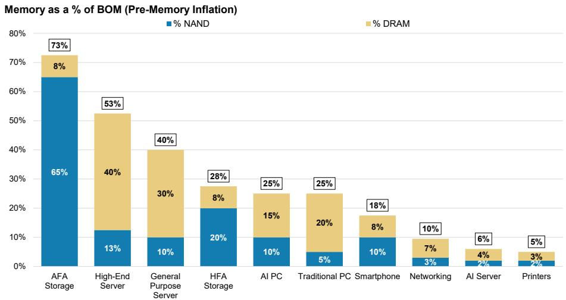

bar_stacked

Memory as a % of BOM (Pre-Memory Inflation)
| Category | % NAND (%) | % DRAM (%) |
| :--- | :--- | :--- |
| AFA Storage | 65 | 8 |
| High-End Server | 13 | 40 |
| General Purpose Server | 10 | 30 |
| HFA Storage | 20 | 8 |
| AI PC | 10 | 15 |
| Traditional PC | 5 | 20 |
| Smartphone | 10 | 8 |
| Networking | 3 | 7 |
| AI Server | 2 | 4 |
| Printers | 2 | 3 |
The chart displays the percentage composition of memory used in pre-memory inflation for each category. The legend distinguishes between NAND and DRAM segments.

Source: Company Data, MS estimates

Exhibit 38: Our quant analysis implies low-end smartphones and PCs are the most demand elastic, while servers, storage and high-end smartphones are least at risk of demand destruction from higher prices   
Demand Elasticity by Hardware Product   
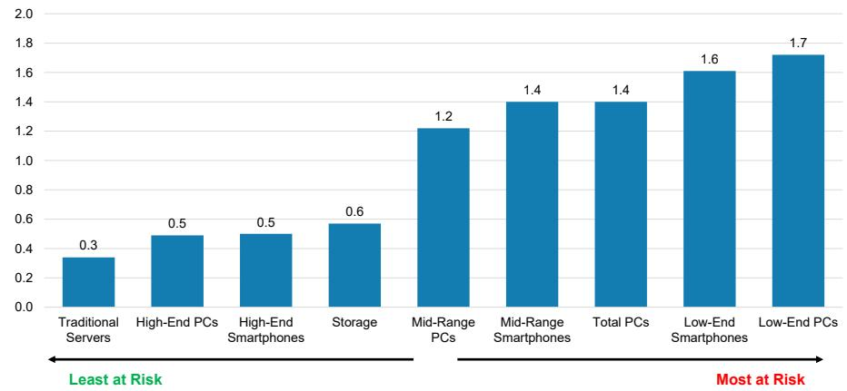

bar

| Category | Value |
|---|---|
| Traditional Servers | 0.3 |
| High-End PCs | 0.5 |
| High-End Smartphones | 0.5 |
| Storage | 0.6 |
| Mid-Range PCs | 1.2 |
| Mid-Range Smartphones | 1.4 |
| Total PCs | 1.4 |
| Low-End Smartphones | 1.6 |
| Low-End PCs | 1.7 |
Least at Risk; Most at Risk

Source: IDC, Company data, AlphaWise, MS. Demand elasticity takes the absolute value. PC data goes back to 1995, for storage it starts in 2008, servers in 2003 and smartphones in 2007.

# Accounting asymmetry matters

A less obvious transmission mechanism for chipflation is accounting treatment, disproportionately impacting companies that are not directly monetizing AI but still have to pay AI-driven memory prices. This creates an accounting asymmetry:

hyperscalers can capitalize memory-heavy AI servers and depreciate them over time, while consumer hardware and industrial OEMs see memory inflation flow more directly through inventory and COGS.

The same memory price shock can therefore look like strategic capex for one buyer and immediate gross-margin pressure for another. This is one of the most under-discussed transmission mechanisms of chipflation in the current cycle.

# The capability cost: what doesn't get built

Memory inflation is not just a financial transfer from non-Al sectors to memory producers. It is increasingly a constraint on what gets built and when.

For automakers, memory costs are pushing back ADAS rollouts and compressing EV program economics. GM has raised its 2026 commodity and logistics inflation guide by \$1bn-2bn, citing higher DRAM costs among the drivers.

- Magna expects more pricing tension at the vehicle level if DRAM costs remain elevated.   
- Visteon's memory supply is constrained through 2027, and the company is qualifying emerging suppliers for 2026+ demand.

For healthcare and medical devices, the impact is more diffused but the challenge is real.

- GE HealthCare flagged \~\$100m of a \$250m inflation headwind tied to chip and cost actions.   
- Siemens Healthineers said the EPS impact could reach €0.05 due to supply-chain

inflation including memory chips.

\- Intuitive Surgical noted gross-margin pressure including roughly 100bps of impact from tariffs, freight, and semiconductor memory costs.

For the indirect channel – the largest and least visible – every enterprise running workloads on AWS, Azure or GCP is exposed to chipflation through its cloud bill. A bank running fraud detection, a logistics firm running route optimization, a retailer running inventory analytics: all are paying memory inflation indirectly without recognizing it as a memory cost. This is the channel with the broadest economic footprint, and the channel that is hardest to see in any individual company's filings.

Exhibit 39: Memory impact heat-map by end market 

<table><tr><td>End market</td><td>Memory availability / allocation priority</td><td>Cost impact</td><td>Pass-through ability</td><td>Demand destruction / pull-forward risk</td><td>Major company commentary / impact one-liners</td></tr><tr><td>Hyperscalers / AI data centers</td><td>Highest priority — suppliers are optimizing for AI/HBM, server DRAM, enterprise SSDs</td><td>Very high, but strategic</td><td>High</td><td>Low</td><td>Meta: raised 2026 capex to $125-145bn, partly due to higher component costs, especially memory.Amazon: said memory/storage component costs have &quot;skyrocketed,&quot; but large cloud buyers are better positioned to secure supply.</td></tr><tr><td>Enterprise servers / storage</td><td>High priority — large server OEMs get allocation, but at sharply higher prices</td><td>Very high</td><td>High</td><td>Low-medium</td><td>HPE: DRAM/NAND are now over half of traditional server BOM, with elevated pricing expected into 2027; using shorter quote cycles, repricing rights, LTAs and alternative configs.Dell: using shorter quote validity and dynamic pricing; flagged some pull-forward risk.</td></tr><tr><td>Semiconductor equipment</td><td>Medium — supply likely manageable, but not immune to electronics BOM inflation</td><td>Medium</td><td>Medium-high</td><td>Low</td><td>KLA: expects elevated memory pricing through at least calendar 2026 and about 100 bps negative gross-margin impact over the next several quarters.</td></tr><tr><td>Networking / security appliances</td><td>Medium-high for large vendors; weaker for smaller appliance makers</td><td>Medium-high</td><td>Medium-high</td><td>Low-medium</td><td>Cisco: immediate price increases across memory-heavy compute/networking products.Check Point: enough inventory for H1 but H2 margin headwind.Radware: 5-8% list-price increases on memory-intensive hardware; no buying-behavior change seen yet.</td></tr><tr><td>PCs / notebooks</td><td>Medium — tier-1 OEMs have some allocation, but PC DRAM is not top priority versus AI/server</td><td>High</td><td>Medium-high</td><td>High in entry/mainstream PCs</td><td>HP: memory/storage moved to ~35% of PC BOM from 15-18%, with LTAs, supplier diversification and price increases.Lenovo: said DRAM rose 40-50% in one quarter and almost doubled again, calling the imbalance structural.Acer/ASUS: passing higher memory costs into PC pricing; potential spec cuts such as 16GB to 8GB if pressure persists.LG PC: already seeing 15-20% price increases.</td></tr><tr><td>Smartphones</td><td>Medium — Apple/Samsung can secure supply, but low-end Android is lower priority</td><td>Medium-high</td><td>Medium at premium; low at low end</td><td>High at low end; lower at premium end</td><td>Apple: memory becomes a more visible gross-margin headwind from the June quarter and increases beyond that.Xiaomi: secured 2026 memory supply but warned shortages could push smartphone prices higher.Samsung: memory division benefits from higher ASPs, while handset-side memory cost pressure is less separately quantified in official commentary.</td></tr><tr><td>Gaming consoles</td><td>Medium — large platform owners can secure supply, but consoles compete with higher-margin AI/server demand</td><td>High</td><td>Medium</td><td>Medium-high</td><td>Nintendo: built around ¥100bn of FY27 COGS impact from rising component prices, especially memory, plus tariffs; also raised Switch 2 prices in Japan, the U.S. and Europe.Sony: secured minimum memory supply for the next holiday season, but did not fully quantify the cost impact.</td></tr><tr><td>TVs / monitors / home electronics</td><td>Medium-low — lower memory content, less priority than servers/PCs/phones</td><td>Low-medium</td><td>Medium</td><td>Low-medium</td><td>LG Electronics: TV memory content is relatively low, monitor impact is limited except smart monitors, but PCs are meaningfully exposed; mitigation includes supply MOUs, multi-sourcing, spec optimization and premium mix.</td></tr><tr><td>Cameras / imaging</td><td>Medium-low — discretionary hardware, less supplier priority than AI/server/PC/phone</td><td>Medium-high</td><td>Low-medium</td><td>Medium-high</td><td>Canon: mostly secured memory supply but faced an estimated ~¥50bn negative memory-cost impact and guidance pressure.Nikon: secured volumes, but DRAM costs rose severalfold and could create a high-single-digit-billion-yen operating-profit hit.Fujifilm: flagged semiconductor memory and silver as cost pressures, with pricing and offsets planned.</td></tr><tr><td>Autos / auto electronics</td><td>Medium — automotive volumes are smaller, specs are specialized, and 2027 supply security is a focus</td><td>Medium</td><td>Medium, but lagged</td><td>Low near term; medium if prolonged</td><td>GM: raised commodity/logistics inflation guide, including higher DRAM costs, to $1.5-2.0bn.Ford: expects sufficient DRAM supply but sees pricing pressure that may affect vehicle pricing.Magna: more a price issue than availability issue; annual DRAM buy under $100m.Visteon: memory remains constrained through 2027; qualifying emerging suppliers for ~10% of 2026 demand and negotiating customer recoveries.Renesas: automotive DRAM volumes not large, but DDR4/DDR5 compatibility matters.</td></tr><tr><td>Healthcare / medtech</td><td>Medium — mission-critical products and larger OEM scale help, but memory is still a cost shock</td><td>Medium</td><td>Medium-high, but lagged</td><td>Low</td><td>GE HealthCare: memory chips were about $100m of a $250m inflation headwind, partly offset by price and cost actions.Siemens Healthineers: cut EPS midpoint by around €0.05 due to supply-chain inflation including memory chips.Intuitive Surgical: gross-margin guide includes about 100 bps of impact from tariffs, freight and semiconductor memory costs.</td></tr><tr><td>Defense / aerospace</td><td>Low-medium — lower-volume, long-life, rugged/legacy memory can be vulnerable</td><td>Medium-high where DDR4/legacy-heavy</td><td>Medium-high structurally, but lagged</td><td>Low</td><td>AeroVironment: disclosed lead-time and price uncertainty for memory-related microprocessors.JLT Mobile: DDR4 prices up more than 10x and lead times longer; secured 2026 supply through early purchases.Nexteq / Ependion: DDR4/memory availability is a key 2026 risk, mitigated by LTAs and price increases.</td></tr></table>

Source: Company data, MS

# The chipflation impact in dollars

Memory cost inflation has become large enough to matter at the industry level. While it varies greatly by product, nearly every hardware product – a PC, server, storage array, smartphone, etc. – has some combination of NAND and DRAM content, which we estimate makes up anywhere between 5% of a device bill of materials (printers) to 70% (high-end servers). Simplistically, higher-end, more performance-based products such as All-Flash storage arrays, high-end & traditional servers, higher-end PCs, and AI servers all have 25-70%+ NAND/DRAM mix within their product bill of materials. Conversely, products such as printers or networking hardware are generally lighter on memory content. Nevertheless, this means that most hardware OEMs and ODMs are over-exposed to memory markets, especially those with high-end device exposure (Exhibit 37).

The memory market is expected to add more Y/Y revenue in 2026 (\~\$600B) than the entire standalone smartphone, PC, or server TAMs. To put the overall impact of memory inflation into perspective, in just the last 3 months, expectations for aggregate memory market revenue in 2026 have increased by 71%, from \$520B to \$890B, relative to a \$220B market in 2025. Not only are memory buyers facing an incremental \$300B of standalone memory costs this year – equivalent to the annual GDP of Finland or New Zealand – but the memory market is expected to add more Y/Y revenue in 2026 (\~\$600B) than the entire standalone smartphone, PC, or server TAMs (Exhibit 40). This will show up in 2026 as COGS or Capex for memory buyers. In aggregate, the global hardware industry must now contend with incremental memory costs that equate to over half of the \$1.3T aggregate hardware TAM, with our estimation at the industry level suggesting the highest dollar burden is on Servers at \$246B, followed by Smartphones at \$175B, PCs at \$132B, and External Storage at \$13B.

Exhibit 40: Based on latest industry estimates, memory revenue will increase by \$600B in 2026 ...

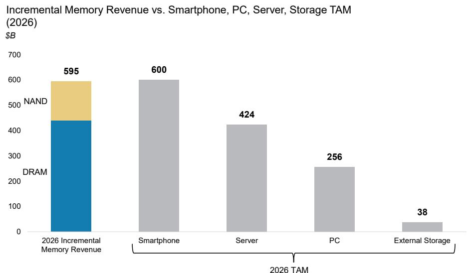

bar

Incremental Memory Revenue vs. Smartphone, PC, Server, Storage TAM (2026)
| Category | Incremental Memory Revenue ($B) | DRAM ($B) |
| :--- | :--- | :--- |
| 2026 Incremental Memory Revenue | 595 | NAND |
| Smartphone | 600 | 0 |
| Server | 424 | 0 |
| PC | 256 | 0 |
| External Storage | 38 | 0 |
2026 TAM

Source: TrendForce estimates, IDC data, MS

Exhibit 41: ... which we estimate translates into \~\$600B of incremental memory cost across Smartphone, Server, PC, and External Storage markets   
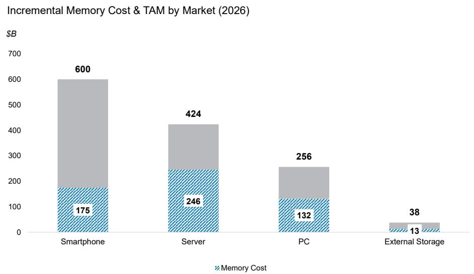

bar_stacked

Incremental Memory Cost & TAM by Market (2026)
| Market | Memory Cost ($B) | Total ($B) |
| :--- | :--- | :--- |
| Smartphone | 175 | 600 |
| Server | 246 | 424 |
| PC | 132 | 256 |
| External Storage | 13 | 38 |

Source: TrendForce, IDC, MS estimates

This does not mean that every hardware company faces a direct margin hit of the same magnitude. The chipflation burden will be distributed across hyperscalers, OEMs, component suppliers, distributors, enterprises and end-customers. But the order of magnitude matters: the memory supercycle is large enough to force some combination of price increases, margin pressure, specification cuts, product delays, budget reallocation and demand destruction. For hyperscalers, higher memory costs is being absorbed as strategic AI capex. For many non-AI hardware buyers, it is showing up as higher prices, COGS pressure, lower product specs, and/or delayed product launches/refresh cycles.

And in non-AI hardware markets scale matters. A vendor's ability to aggregate demand across multiple products (i.e. PC, server, storage) or come to market with exceptionally strong buying power (Apple, Samsung) makes a meaningful difference in getting memory allocations.

But even sufficient memory allocations come with a significant cost – higher prices across the hardware ecosystem. Using the latest TrendForce memory price forecasts, and making the assumption that hardware vendors will prioritize maintaining margin rates, we estimate like-for-like unit price hikes would have to be \~35% for Smartphones, \~70%+ for PCs, 80%+ for Servers and 110%+ for Storage arrays. This is the average though. Anecdotally, we are already hearing instances of significant price hikes – 100%+ in some cases in high-end Storage/Server markets, due to memory plus other semiconductor inflation (CPU, PCB, MLCC, etc.).

For context, these required pricing increases sit significantly above historical ASP behavior across virtually every major hardware category. PCs are the clearest example: over the past \~30 years, annual PC ASP growth has typically fluctuated within a +/-10% band, with even the strongest inflationary periods – including COVID-era supply constraints – driving aggregate pricing increases in the high-single digits Y/Y. In fact, if PC prices increase 67% Y/Y this year, it would represent the strongest Y/Y ASP growth in PC market history by a magnitude of 8-9x (Exhibit 43).

Exhibit 42: We estimate that in order to protect gross margins, hardware vendors would need to raise prices by 35-115% Y/Y in CY26   
Y/Y ASP Growth Needed to Hold Gross Margins Steady   
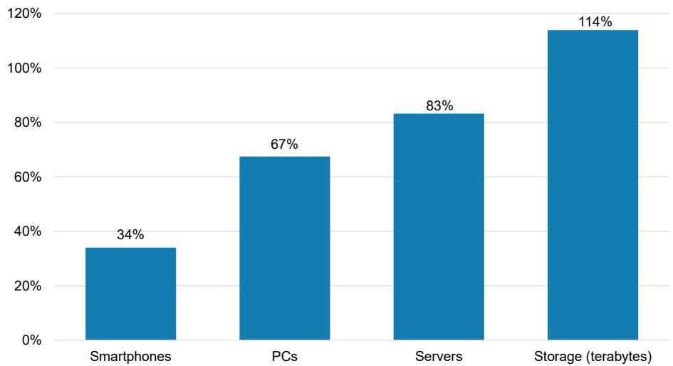

bar

| Category | Value (%) |
|---|---|
| Smartphones | 34 |
| PCs | 67 |
| Servers | 83 |
| Storage (terabytes) | 114 |

Source: TrendForce, IDC, Company Data, MS estimates

Exhibit 43: For context, if PC ASPs were to rise 67% Y/Y, it would mark the strongest Y/Y ASP growth in PC market history, far surpassing COVID-era inflation   
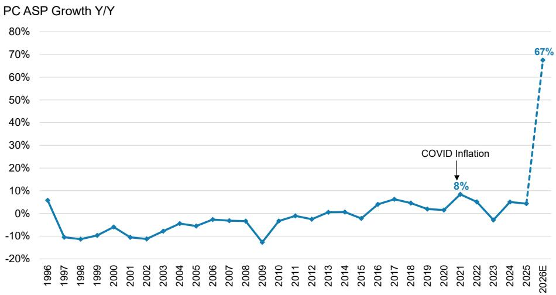

line

| Year | PC ASP Growth Y/Y |
|------|-------------------|
| 1996 | 6%                |
| 1997 | -10%              |
| 1998 | -10%              |
| 1999 | -8%               |
| 2000 | -5%               |
| 2001 | -10%              |
| 2002 | -10%              |
| 2003 | -8%               |
| 2004 | -5%               |
| 2005 | -3%               |
| 2006 | -2%               |
| 2007 | -2%               |
| 2008 | -3%               |
| 2009 | -15%              |
| 2010 | -2%               |
| 2011 | 0%                |
| 2012 | -2%               |
| 2013 | 1%                |
| 2014 | 1%                |
| 2015 | -2%               |
| 2016 | 5%                |
| 2017 | 7%                |
| 2018 | 5%                |
| 2019 | 3%                |
| 2020 | 2%                |
| 2021 | 8%                |
| 2022 | 5%                |
| 2023 | -3%               |
| 2024 | 5%                |
| 2025 | 5%                |
| 2026E| 67%               |

Source: IDC, MS

The timing of the impact is likely lagged. Many hardware companies are still working through lower-cost inventory, which can mask the near-term earnings impact. This explains why some memory-exposed companies can still beat current-quarter expectations while investors look ahead to margin risk in calendar 2H26 and beyond. However, memory inventory has depleted quickly across channels. As higher-priced memory flows through inventory and COGS, companies will need to choose whether to raise prices, cut specifications, delay launches or absorb margin pressure.

Exhibit 44: DRAM inventory   
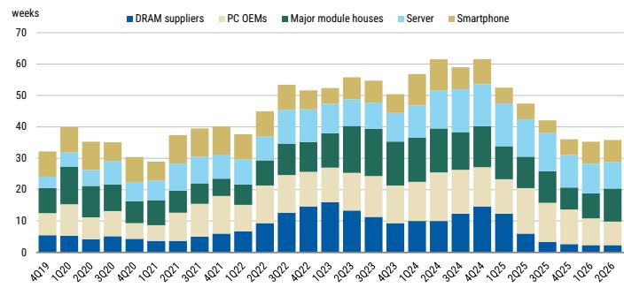

bar_stacked

| Quarter | DRAM suppliers | PC OEMs | Major module houses | Server | Smartphone |
|---------|----------------|---------|---------------------|--------|------------|
| 4Q19    | 5              | 8       | 10                  | 3      | 7          |
| 1Q20    | 5              | 8       | 12                  | 3      | 7          |
| 2Q20    | 5              | 8       | 10                  | 3      | 7          |
| 3Q20    | 5              | 8       | 10                  | 3      | 7          |
| 4Q20    | 5              | 8       | 10                  | 3      | 7          |
| 1Q21    | 5              | 8       | 10                  | 3      | 7          |
| 2Q21    | 5              | 8       | 10                  | 3      | 7          |
| 3Q21    | 5              | 8       | 10                  | 3      | 7          |
| 4Q21    | 5              | 8       | 10                  | 3      | 7          |
| 1Q22    | 5              | 8       | 10                  | 3      | 7          |
| 2Q22    | 5              | 8       | 10                  | 3      | 7          |
| 3Q22    | 5              | 8       | 10                  | 3      | 7          |
| 4Q22    | 5              | 8       | 10                  | 3      | 7          |
| 1Q23    | 5              | 8       | 10                  | 3      | 7          |
| 2Q23    | 5              | 8       | 10                  | 3      | 7          |
| 3Q23    | 5              | 8       | 10                  | 3      | 7          |
| 4Q23    | 5              | 8       | 10                  | 3      | 7          |
| 1Q24    | 5              | 8       | 10                  | 3      | 7          |
| 2Q24    | 5              | 8       | 10                  | 3      | 7          |
| 3Q24    | 5              | 8       | 10                  | 3      | 7          |
| 4Q24    | 5              | 8       | 10                  | 3      | 7          |
| 1Q25    | 5              | 8       | 10                  | 3      | 7          |
| 2Q25    | 5              | 8       | 10                  | 3      | 7          |
| 3Q25    | 5              | 8       | 10                  | 3      | 7          |
| 4Q25    | 5              | 8       | 10                  | 3      | 7          |
| 1Q26    | 5              | 8       | 10                  | 3      | 7          |
| 2Q26    | 5              | 8       | 10                  | 3      | 7          |
| ...     | ...            | ...     | ...                 | ...    | ...        |
| Q1'26   | ...            | ...     | ...                 | ...    | ...        |
| Q4'26   | ...            | ...     | ...                 | ...    | ...        |
| ...     | ...            | ...     | ...                 | ...    | ...        |
| Q1'29   | ...            | ...     | ...                 | ...    | ...        |
| Q4'29   | ...            | ...     | ...                 | ...    | ...        |
| ...     | ...            | ...     | ...                 | ...    | ...        |
| Q4'30   | ...            | ...     | ...                 | ...    | ...        |
| ...     | ...            | ...     | ...                 | ...    | ...        |
| Q1'31   | ...            | ...     | ...                 | ...    | ...        |
| Q4'31   | ...            | ...     | ...                 | ...    | ...        |
| ...     | ...            | ...     | ...                 | ...    | ...        |
| Q4'32   | ...            | ...     | ...                 | ...    | ...        |
| ...     | ...            | ...     | ...                 | ...    | ...        |
| Q1'33   | ...            | ...     | ...                 | ...    | ...        |
| Q4'33   | ...            | ...     | ...                 | ...    | ...        |
| ...     | ...            | ...     | ...                 | ...    | ...        |
| Q4'34   | ...            | ...     | ...                 | ...    | ...        |
| ...     | ...            | ...     | ...                 | ...    | ...        |
| Q1'35   | ...            | ...     | ...                 | ...    | ...        |
| Q4'35   | ...            | ...     | ...                 | ...    | ...        |
| ...     | ...            | ...     | ...                 | ...    | ...        |
| Q4'36   | ...            | ...     | ...                 | ...    | ...        |
| ...     | ...            | ...     | ...                 | ...    | ...        |
| Q1'37   | ...            | ...     | ...                 | ...    | ...        |
| Q4'37   | ...            | ...     | ...                 | ...    | ...        |
| ...     | ...            | ...     | ...                 | ...    | ...        |
| Q4'38   | ...            | ...     | ...                 | ...    | ...        |
|...     | ...            | ...     | ...                 | ...    | ...        |
| Q1'39   | ...            | ...     | ...                 | ...    | ...        |
| Q4'39   | ...            | ...     | ...                 | ...    | ...        |
| ..      (continued) for years from '4Q' to '4Q' to '4Q' are not explicitly labeled; the remaining years from '4Q' to '4Q' are estimated based on the data provided in the code.

Source: TrendForce estimates, MS

Exhibit 45: NAND inventory   
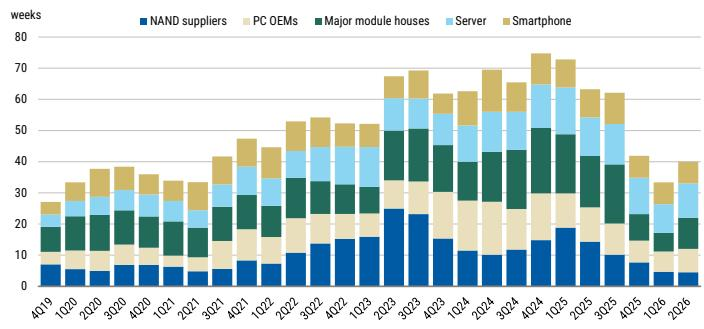

bar_stacked

| Quarter | NAND suppliers | PC OEMs | Major module houses | Server | Smartphone |
|---------|-----------------|---------|---------------------|--------|------------|
| 4Q19    | 8               | 3       | 7                   | 5      | 2          |
| 1Q20    | 7               | 4       | 8                   | 6      | 3          |
| 2Q20    | 8               | 5       | 9                   | 7      | 4          |
| 3Q20    | 7               | 6       | 10                  | 8      | 5          |
| 4Q20    | 8               | 7       | 11                  | 9      | 6          |
| 1Q21    | 7               | 8       | 12                  | 10     | 7          |
| 2Q21    | 6               | 9       | 13                  | 11     | 8          |
| 3Q21    | 7               | 10      | 14                  | 12     | 9          |
| 4Q21    | 8               | 11      | 15                  | 13     | 10         |
| 1Q22    | 9               | 12      | 16                  | 14     | 11         |
| 2Q22    | 10              | 13      | 17                  | 15     | 12         |
| 3Q22    | 11              | 14      | 18                  | 16     | 13         |
| 4Q22    | 12              | 15      | 19                  | 17     | 14         |
| 1Q23    | 13              | 16      | 20                  | 18     | 15         |
| 2Q23    | 14              | 17      | 21                  | 19     | 16         |
| 3Q23    | 15              | 18      | 22                  | 20     | 17         |
| 4Q23    | 16              | 19      | 23                  | 21     | 18         |
| 1Q24    | 17              | 20      | 24                  | 22     | 19         |
| 2Q24    | 18              | 21      | 25                  | 23     | 20         |
| 3Q24    | 19              | 22      | 26                  | 24     | 21         |
| 4Q24    | 20              | 23      | 27                  | 25     | 22         |
| 1Q25    | 21              | 24      | 28                  | 26     | 23         |
| 2Q25    | 22              | 25      | 29                  | 27     | 24         |
| 3Q25    | 23              | 26      | 30                  | 28     | 25         |
| 4Q25    | 24              | 27      | 31                  | 29     | 26         |
| 1Q26    | 25              | 28      | 32                  | 30     | 27         |
| 2Q26    | 26              | 29      | 33                  | 31     | 28         |

Source: TrendForce estimates, MS

# Memory vs GPU cost convergence

Memory is now 25%+ of a Rubin rack BOM. Our bottom-up Rubin rack BOM analysis shows how large the memory cost has become inside AI infrastructure. Memory was only 5-10% of the GB200 NVL72 rack BOM, but with higher memory content and materially higher pricing, memory rises to roughly 25-30% of the VR200 / Rubin rack BOM. In the detailed BOM comparison, memory increases from \$374k per GB300 rack to \$2.0mn per VR200 rack, or +435%, making it the largest source of non-GPU cost inflation.

This is the clearest dollar-based evidence of chipflation. For hyperscalers, memory inflation becomes part of strategic AI capex and can be capitalized over time. For non-AI buyers, the same supply shock shows up more directly through COGS, gross margins, product pricing and availability. The issue is therefore not only that memory prices are rising, but that AI infrastructure is absorbing a much larger share of total component spend and supplier allocation.

Exhibit 46: Owing to recent increases in memory prices, memory will become 25%+ of the rack BOM for Rubin   
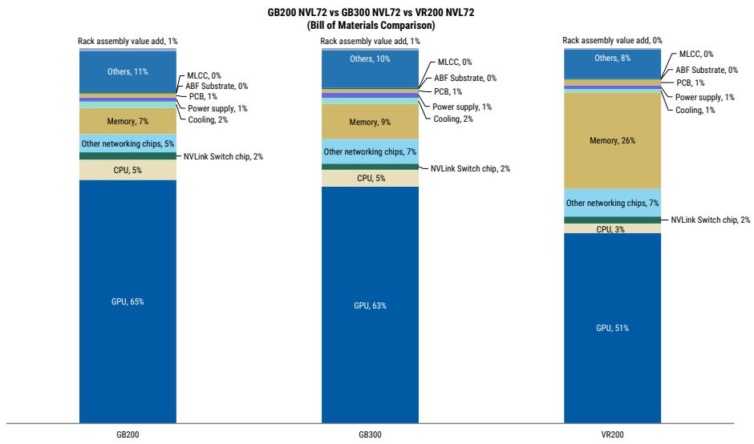  
Source: MS estimates

# Identifying the cyclical and secular risks of chipflation

The cyclical risks. Prices across nearly every hardware end-market will move higher throughout 2026, and devices are already being de-spec'ed. Despite these efforts, hardware margins are likely to face pressure in 2H26 and beyond, with the impact likely greatest in the markets where demand is most elastic: PCs, smartphones, and lower-end consumer electronics. The biggest cyclical variable remains the demand elasticity response, especially once accelerated purchasing (i.e. pull-forward) ceases. In PCs, this already appears to be happening, with our expectations for double-digit Y/Y unit declines in 2H26. For Servers and Storage, demand is more resilient due to workload growth and growing AI use cases, with industry analysts still expecting unit growth throughout 2026 and into 2027, despite record price hikes.

The bigger question in hardware markets remains: what is the secular risk of memory inflation? In consumer markets, we could see a forced re-design of products, the elimination of lower-end products, and industry consolidation as Tier 2 and 3 vendors struggle to survive a prolonged memory supercycle. In enterprise markets, we are seeing early evidence that chipflation could accelerate workload shift to the cloud, which is a product of accounting asymmetry – hardware prices are rising more rapidly than cloud CPU instance prices. It is too early to assess all the possible impacts, but it is increasingly clear to us that there will be long-term ramifications of chipflation across hardware markets.

Exhibit 47: 9% of CIOs say they are revisiting their on-prem hardware strategy and considering a more permanent shift of workloads to the cloud given the risk of significant price increases caused by memory price inflation.   
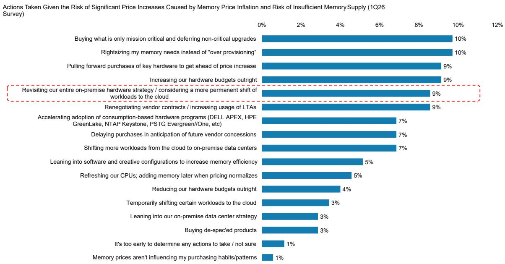

bar

Actions Taken Given the Risk of Significant Price Increases Caused by Memory Price Inflation and Risk of Insufficient Memory Supply (1Q26 Survey)
| Action | Percentage (%) |
| :--- | :--- |
| Buying what is only mission critical and deferring non-critical upgrades | 10 |
| Rightsizing my memory needs instead of "over provisioning" | 10 |
| Pulling forward purchases of key hardware to get ahead of price increase | 9 |
| Increasing our hardware budgets outright | 9 |
| Revisiting our entire on-premise hardware strategy / considering a more permanent shift of workloads to the cloud | 9 |
| Renegotiating vendor contracts / increasing usage of LTAs | 9 |
| Accelerating adoption of consumption-based hardware programs (DELL APEX, HPE GreenLake, NTAP Keystone, PSTG Evergreen//One, etc) | 7 |
| Delaying purchases in anticipation of future vendor concessions | 7 |
| Shifting more workloads from the cloud to on-premise data centers | 7 |
| Leaning into software and creative configurations to increase memory efficiency | 5 |
| Refreshing our CPUs; adding memory later when pricing normalizes | 5 |
| Reducing our hardware budgets outright | 4 |
| Temporarily shifting certain workloads to the cloud | 3 |
| Leaning into our on-premise data center strategy | 3 |
| Buying de-spec'ed products | 3 |
| It's too early to determine any actions to take / not sure | 1 |
| Memory prices aren't influencing my purchasing habits/patterns | 1 |

Source: AlphaWise n=61 (US and EU data), MS

Exhibit 48: A combination of our own checks and public commentary from management teams suggests some organizations are migrating to the cloud due to increasing memory costs 

<table><tr><td colspan="3">Commentary on Potential Migration to Cloud Due to Memory Cost Inflation</td></tr><tr><td>Source</td><td>Commentary</td><td>Date</td></tr><tr><td>Radware</td><td>&quot;There is a question that we don&#x27;t know the answer yet. Will it push customers to shift from on-prem to cloud?&quot;</td><td>14-May-26</td></tr><tr><td>VAR Checks</td><td>&quot;The part that&#x27;s different is that companies that have traditionally said no to cloud are maybe more interested in taking a look and understanding the price delta.&quot;</td><td>11-May-26</td></tr><tr><td>Cloudflare</td><td>&quot;I think that as you see that there are vulnerabilities in hardware... as you see, again, supply chain shortages, especially around memory right now, I do think all of those things are pushing more and more people to evaluate that they need at least some part of the cloud as part of their infrastructure.&quot;</td><td>7-May-26</td></tr><tr><td>Ingram Micro</td><td>&quot;We&#x27;ve been through shortages. We&#x27;ve been through macroeconomic headwinds. A couple of thoughts here ... We are starting to see some movement to from on-prem solutions to actually cloud. And we&#x27;re starting to see that, and we expect that to happen going into Q2 too.&quot;</td><td>30-Apr-26</td></tr><tr><td>Amazon</td><td>&quot;One of the interesting things that we see right now with the change in price and in supply on things like memory is that it is a further impetus pushing companies who have on-premises infrastructure into the cloud.&quot;</td><td>29-Apr-26</td></tr><tr><td>MS Procurement</td><td>&quot;In terms of how we&#x27;re reacting ... Next I would say is the consideration of offloading things to cloud.&quot;</td><td>10-Apr-26</td></tr></table>

Source: Company data, MS

# Chips, Growth and Inflation – A Macro Perspective

Diego Anzotegui, Rajeev Sibal

Chip Inflation is already visible in producer price inflation (PPI) segments tied to computing and electronics. The effect on CPI is not as strong, perhaps suggesting difficult margin decisions being made by consumer-facing producers. We expect that pressure to continue to be visible in the data as the upswing in electronics components inflation has yet to abate. The translation of the inflationary forces to headline macro data, however, will be more muted because chips account for less than 1% of both PPI and CPI indices. Goods are less than one-third of CPI indices and goods inflation is currently heavily distorted by the fading effects of tariffs (see discussion here).

# Memory Costs in Producer Price Inflation (PPI)

The effects of memory costs on inflation are most visible in PPI subcomponents linked to electronics and related equipment. Across the various categories with memory cost risks, the most notable is the electronic components and accessories sub-category moving near \~30% y/y without a clear top as of yet (Exhibit 49). The rise in electronics PPI is also spreading across the supply chain, specifically in Stage 2 and Stage 3 intermediate goods where the headline indices are affected (Exhibit 50). Stages 2 and 3 of the PPI measures are arguably best placed to capture the rise because of the effect in the supply chain as it moves to the consumer. The contribution of electronics and components is less than \~1% of these measures, but we can see the effect. The inflationary push reduces at the headline PPI level, however, because the goods contribution within PPI is far smaller than that of services.

Exhibit 49: Sharp rise in PPI electronics ...   

line

| Date    | Value |
|---------|-------|
| Apr-26  | 27.6  |

Source: BLS, MS

Exhibit 50: ... boosting upstream input costs   
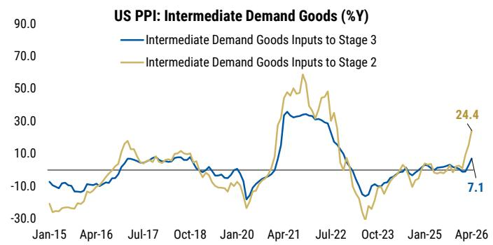

line

| Date   | Intermediate Demand Goods Inputs to Stage 3 | Intermediate Demand Goods Inputs to Stage 2 |
|--------|---------------------------------------------|---------------------------------------------|
| Apr-26 | 7.1                                         | 24.4                                        |

Source: BLS, MS

The translation from PPI to CPI is important because it gives an indication of the extent of margin pressure for producers. The equivalent products in CPI are not showing as strong signs of inflation, with materially lower inflation readings ( $\sim5\%$ y/y in CPI measures of computers relative to the $\sim30\%$ in components). The implication of course is that margin pressures will force difficult decisions in the supply chain. While we expect further pressure in consumer indices, the level seems to be structurally lower than what we are seeing in PPI because of a relatively low chips share in the overall cost structure and given how much consumers can absorb.

We do, however, expect the rise in PPI to have material downstream effects in US supply chains, which could have a read-across to growth. Given the importance of AI capex to US growth (see discussion here), it is important to monitor the continued translation from PPI to CPI and to investment sentiment. One of the key drivers of the bull case for investment in the US is continued AI capital expenditure. So far AI capex has been orthogonal to macroeconomic conditions, but if it slows because chip costs become too high, it has the double impact of potentially slowing investment as well as delaying the translation to AI productivity in the US. The contours of how the costs are absorbed will have important ramifications for the bullish narrative in US investment.

# Memory costs in Consumer Price Inflation (CPI)

We think that the impact on CPI will be more micro than macro – visible in individual categories, but with a modest effect on the overall index, in the order of \~10bps to headline inflation in 2026. This is because memory-sensitive goods carry a relatively small weight in the CPI basket (see Exhibit 51).

Exhibit 51: CPI impact of higher memory costs 

<table><tr><td>CPI component</td><td>Memory costs effect on CPI in 2026 (pp)</td><td>CPI weight</td></tr><tr><td>PCs</td><td>15</td><td>0.30%</td></tr><tr><td>Smartphones</td><td>15</td><td>0.20%</td></tr><tr><td>TVs</td><td>10</td><td>0.10%</td></tr><tr><td>Cars</td><td>0</td><td>3.80%</td></tr><tr><td>Major household appliances</td><td>5</td><td>0.06%</td></tr><tr><td>Game consoles</td><td>125</td><td>0.01%</td></tr><tr><td>Impact on headline CPI: PCs and smartphones only</td><td>0.08</td><td></td></tr><tr><td>Total impact on headline CPI</td><td>0.10</td><td></td></tr></table>

Source: BLS, MS forecasts. Note: Smartphone and game console weights are estimates.

That said, the transmission is likely to be uneven across categories. PCs and smartphones are the most important components to monitor, given their relatively high memory intensity in the bill of materials and their comparatively larger weights within memory-sensitive core goods CPI. Industry analysts suggest that average selling prices (ASPs) for PCs could rise by 20% this year, with smartphone prices increasing by around 15% (see here). However, the sharp rise in memory costs in recent months might imply upside risks to those estimates.

The relationship between ASPs and CPI is not one-to-one. CPI measures for these goods are quality-adjusted, whereas ASP series are not. And this adjustment seems to make CPI series smoother compared to ASPs. Historical experience illustrates this point. For computers, a 30% y/y increase in ASPs is broadly consistent with roughly a 10% y/y increase in CPI prices (see Exhibit 52), implying a significantly lower magnitude to measured inflation. The relationship is even weaker for smartphones (see Exhibit 53), suggesting downside risk to CPI inflation relative to ASP-based estimates.

Taking into account the link between ASP and CPI measures and possible upside risks to current analyst estimates, we forecast CPI computers at 10% y/y in 2026 (consistent with 30% y/y ASP) – implying an acceleration of 15pp vs 2025. The outlook for CPI smartphones is less certain, but conservatively we assume an acceleration similar to PCs for this category.

Exhibit 52: The link between ASP and CPI computers is not 1-to-1 ...   
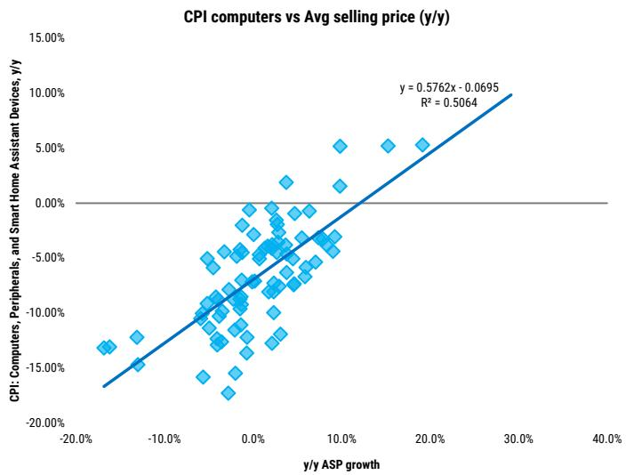

scatter

| y/y ASP growth | CPI: Computers, Peripherals, and Smart Home Assistant Devices, y/y |
| -------------- | --------------------------------------------------------------- |
| -20.0%         | -15.00%                                                         |
| -10.0%         | -10.00%                                                         |
| 0.0%           | -5.00%                                                          |
| 10.0%          | 0.00%                                                           |
| 20.0%          | 5.00%                                                           |
| 30.0%          | 10.00%                                                          |

Source: BLS, MS

Exhibit 53: ... and the relationship for smartphones is even weaker   
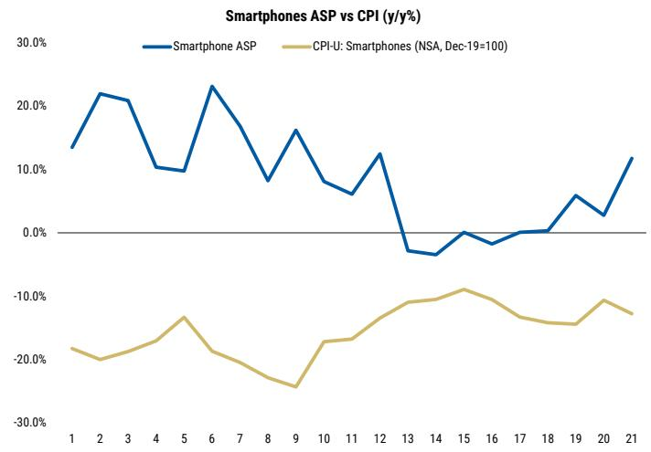

line

| Year | Smartphone ASP | CPI-U: Smartphones (NSA, Dec-19=100) |
|------|----------------|------------------------------------|
| 1    | 13.0%          | -18.0%                             |
| 2    | 22.0%          | -19.0%                             |
| 3    | 21.0%          | -17.0%                             |
| 4    | 10.0%          | -15.0%                             |
| 5    | 10.0%          | -12.0%                             |
| 6    | 23.0%          | -18.0%                             |
| 7    | 18.0%          | -20.0%                             |
| 8    | 8.0%           | -22.0%                             |
| 9    | 16.0%          | -24.0%                             |
| 10   | 8.0%           | -18.0%                             |
| 11   | 6.0%           | -17.0%                             |
| 12   | 12.0%          | -15.0%                             |
| 13   | -3.0%          | -12.0%                             |
| 14   | -4.0%          | -10.0%                             |
| 15   | 0.0%           | -8.0%                              |
| 16   | -2.0%          | -10.0%                             |
| 17   | 0.0%           | -12.0%                             |
| 18   | 0.0%           | -14.0%                             |
| 19   | 6.0%           | -15.0%                             |
| 20   | 3.0%           | -12.0%                             |
| 21   | 12.0%          | -14.0%                             |

Source: BLS, MS

For other goods categories, the impact is more limited. TVs and household appliances have lower memory content in their cost structure, implying more muted price pressure. By contrast, game consoles are highly exposed, with memory accounting for roughly 30% of the bill of materials. In a full passthrough scenario, price increases could be substantial – potentially exceeding 100%. However, the very small weight of game consoles in the CPI basket means that their contribution to aggregate inflation remains negligible.

For autos, the impact is smaller still. Our analysts estimate that higher memory costs are raising production costs by roughly 1–3% this year. However, OEM pricing guidance has remained broadly unchanged, suggesting that these costs are being absorbed in margins rather than passed through to consumers.

# US/China Policy Options Don't Offer Near-term Relief

Ariana Salvatore, Shawn Kim

# Key Takeaways

- Even if the US and China make policy choices aimed at alleviating price pressure, actually doing so will take years, for three key reasons:   
• US policy efforts (tax credits, subsidies, expedited permitting) come with constraints and lags   
- China's currently available incremental supply won't close the gap with demand   
China's policy incentives to boost supply would take a couple years to show results

\- Moreover, our expectation is that US policy choices are actually skewed toward a more, not less, restrictive direction: we expect little in terms of export control removal or loosening of the current regime.

# US Could Loosen Demand Restrictions, But Supply Wouldn't Be Enough to Alleviate Strain

Given the focus on memory as a strategic resource, we expect policy discussions in particular on HBM and advanced DRAM to focus on global supply chain vulnerabilities as well as supplementing domestic availability. To that end, we expect these discussions to persist regardless of the outcome of the 2026 midterm elections and the configuration of power in Washington.

The key policy distinction is between AI-strategic memory – primarily HBM and advanced DRAM that directly enable frontier AI systems – and commodity or legacy memory used in automotive, industrial, consumer and other non-frontier applications. The starting point is concentration: advanced DRAM and HBM are dominated by Samsung, SK hynix and Micron, while NAND supply is broader but still concentrated. China is becoming more relevant through CXMT in DRAM and YMTC in NAND, adding a new policy dimension to an already concentrated market.

To that end, policy efforts likely distinguish between HBM and legacy (non-frontier) memory, but even the latter would be limited in scope and effectiveness. We expect policy efforts in HBM and advanced DRAM to prioritize protecting AI-strategic memory through supply-chain resilience, trusted capacity, and geopolitical de-risking over nearer-term cost pressures (i.e. not alleviating existing export controls). For less sophisticated (non-frontier) memory end uses (automotive, consumer, etc.) policymakers may seek to distinguish commodity or legacy memory from AI-strategic memory through differentiated licensing and targeted supply-side support for trusted capacity in the former category

(more options detailed below). Importantly, political obstacles, timing lags, and associated supply chain constraints still likely dilute these efforts' effectiveness. Forced allocation would likely be a last resort, in our view. It might protect favored sectors in the short term, but would risk turning memory into a rationed geopolitical commodity. Across the board, the policy options may mitigate, but ultimately not solve, the problem.

Specifically, loosening demand restrictions could allow more Chinese supply into the US market, but we don't think the supply would be enough to alleviate near-term price pressures (as we detail below).

# Policy Options: federal support is possible ...

We often frame policy options in the context of supply chain resiliency as either 'defensive' or 'offensive' tactics. 'Defensive' refers to the more traditional trade restrictions (i.e. tariffs, non-tariff barriers, licensing requirements, export controls, etc.) while 'offensive' refers to domestic investment initiatives (direct federal spending, loans, grants, tax incentives, etc.) to on-shore supply chains. In the memory context, we view the most likely options as supply-side measures aimed at expanding trusted HBM, advanced DRAM, packaging and test capacity.

In that context, we see the below policy options as the ones most likely to be discussed to mitigate (although ultimately not solve) the problem:

- Direct subsidies can support new fabs, packaging and test capacity, but may not lower prices quickly.   
• Tax credits can encourage investment but are less targeted.   
- Procurement guarantees can de-risk capacity additions, but may distort allocation.   
- Expedited permitting can improve time-to-capacity, but execution is difficult.   
- Equipment-access coordination can support allied capacity expansion, but must be balanced against export-control objectives.   
- Strategic stockpiles may help critical sectors, but are hard to manage in fast-moving technology markets.

Subsidy accountability will become more important. If memory producers receive public support while enjoying high pricing and strong margins, policymakers may ask whether subsidies are translating into actual capacity expansion, broader access, domestic resilience or lower downstream costs. Forced allocation would likely be a last resort. It might protect favored sectors in the short term, but would risk turning memory into a rationed geopolitical commodity.

More export controls on top of the existing regime look less likely than supply-side initiatives in the near term. Aside from the geopolitical risks associated with a loosening export control regime, this type of policy cannot relieve the bottleneck or facilitate additional supply if not paired with domestic supply-side initiatives. To put a finer point on it, four reasons underpin our view: 1) the existing regime already places HBM as an explicit advanced-computing control item under the EAR, albeit with structural gaps; 2) allied coordination is likely difficult to implement and enforce; 3) directionally, the environment appears to be moving away from broader-diffusion style controls and more toward targeted controls, in particular for more advanced tech; and 4) the likely implication of further controls is more stockpiling and limited global availability, which could drive up costs versus alleviating the bottleneck.

The existing export controls already placed HBM into the advanced-computing regime, but with certain nuances, as mentioned above: the administration maintains HBM inside the AI export control umbrella, but gaps exist given the geographical dispersion of other nodes of the supply chain (packaging, in particular). Hence, a more comprehensive export control regime would require coordination with allies – the bipartisan MATCH Act has been the subject of many questions from investors on this topic, but the road to passage is challenging, and we view it more as a control alignment tool than a means to expand capacity. Aside from the procedural constraints (i.e. needing a legislative vehicle), coordination with allies may be difficult to implement and enforce (in particular because the relevant chokepoints are spread across a variety of geographies, not just one country). Further, as we note above, denying or delaying access to HBM beyond the existing controls does not seem imminent given the administration's recent actions to facilitate more cross-border selling and the bilateral statements following the US-China summit meeting two weeks ago (see here). Restrictions of this type could also risk escalating tensions outside of the boundaries of 'tactical escalation' between the two countries (which is likely not in either sides' interest following last year's détente, as we note here), and could increase scarcity or accelerate stockpiling, in particular if not paired with parallel supply-side investment.

For HBM and advanced DRAM, policy is likely to combine de-risking through existing export controls and allied alignment with supply-side efforts to expand trusted capacity.

For commodity or legacy memory, we think policy is less likely to rely on restrictive controls and more likely to focus on differentiated licensing and targeted supply-side support, though timing lags, permitting, workforce constraints, tool availability, and qualification cycles will limit near-term impact.

<table><tr><td>Memory Category</td><td>Policy Objective</td><td>Policy Tools</td></tr><tr><td>HBM/Advanced DRAM</td><td>Protect strategic AI inputs &amp; frontier capabilities; delay adversary access</td><td>Maintain de-risking (export controls) strategy; expand supply-side efforts to expand trusted capacity</td></tr><tr><td>Commodity/legacy memory</td><td>Avoid overly restrictive policy; facilitate trusted supply &amp; alleviate cost pressures</td><td>Differentiated licensing regimes; targeted domestic/allied capacity support vis-à-vis supply-side initiatives; procurement for critical sectors</td></tr></table>

Source: MS

# ... but key constraints exist: procedure, timing & public perception

As a result, we view the most feasible near-term response as increasing HBM and packaging supply in the US and allied countries. The options listed above are all a means toward that end, but each comes with its own constraints. The principal constraint is time: building domestic memory capacity comes with long physical lead times (likely years). Aside from the bottlenecks such as permitting, site selection, etc., the HBM-related constraints also expand to other nodes of the supply chain. Advanced packaging needs mean that government incentives cannot focus on HBM capacity alone. Workforce is also a constraint: a skilled labor force is a key bottleneck as the US has less experience relative to other countries in building & maintaining leading-edge memory and packaging facilities at the scale needed. Hence, policy efforts here are more likely to be aimed at building more resilient supply chains from a geopolitical perspective for HBM and advanced DRAM (which takes time and is likely more expensive) versus solving a nearer-term availability or pricing issue.

Against a backdrop of the public increasingly skeptical of AI (see here), we also take into consideration the public perception angle and its associated political hurdles. While we ultimately think that the bipartisan consensus in DC is toward accelerating the US position vis-à-vis China and therefore the policy options supportive of that ambition, there is still public skepticism toward AI and industrial subsidies more broadly that may make meaningful or deficit-additive policies challenging in the near term.

# China Could Boost Supply, But That Could Take Years

Could China be the swing factor? In the consumer segment, integrating Chinese consumer-grade memory into PCs and smartphones could be a solution. We note recent reports that major PC manufacturers have contacted CXMT about potential DRAM collaboration, and this shift is already seen in retail where US modules brands, such as Corsair Vengeance DDR5, are using CXMT DRAM chips. US technology companies can use Chinese memory capabilities but have been increasingly reluctant to do so, in light of geopolitical tensions and national security concerns. While the US government restricts the sale of advanced chip tech to China, importing standard Chinese memory chips for consumer electronics remains largely permissible. One of the factors preventing companies such as CXMT from supplying DRAM chips to mainstream manufacturers is the possibility of changes to US legislation. For example, a new proposed rule issued by the Federal Acquisition Regulatory Council (FAR) is intended to restrict the use of chips from CXMT, YMTC, and SMIC in commercial products.

China is emerging as a conventional-memory swing factor, but not a near-term HBM solution. China-located DRAM capacity rises from \~18% of industry capacity in 2023 to \~23% in 2028, on TrendForce estimates, while domestic Chinese suppliers rise from \~7% to \~17%. CXMT is the key driver, adding 388kwpm and accounting for roughly 30% of global net DRAM additions between 2023 and 2028. This could make China an important relief valve for commodity DRAM, especially for non-Al buyers facing tighter allocation from the Big 3.

However, the effective output of Chinese producers is significantly discounted by yield and technology gaps. On NAND, YMTC has crossed the 128-layer threshold and is broadly competitive on headline technology metrics, but manufacturability and enterprise-grade yield remain the key differentiators, with bits/wafer running approximately 20% below western peers. On DRAM, CXMT is currently on 1znm (\~16nm), roughly three generations behind the state of the art, having transitioned from 17-19nm through 2025. While 30% of production is now on DDR5, clock speeds remain insufficient for mainstream PC, server, smartphone or AI workloads. The roadmap targets HBM3e in 2027 using 1anm DRAM – achievable without EUV access per the Micron precedent – but bits/wafer runs at approximately one-third of western levels, with the node disadvantage accounting for only around one-third of that gap. The remainder reflects structural manufacturing inefficiency, suggesting the HBM supply contribution from China should be modelled conservatively, if at all.

The regulatory backdrop reinforces these constraints. Both CXMT and YMTC remain on the Pentagon's Section 1260H "Chinese Military Companies" list as of today – CXMT was added in January 2025, YMTC in 2024. The list carries no statutory trade ban, but the FY2024 NDAA bars the DoD from contracting with listed entities directly from June 30, 2026. Press reports indicate that a February 13, 2026 update briefly showed both memory makers removed (while adding Alibaba, Baidu and BYD), but the Defense Department withdrew the document from the Federal Register within hours without explanation, leaving the January 2025 list operative. The episode suggests there could be internal debate over relief, though delivered none in practice. More bindingly, YMTC remains on the US Commerce Department's Entity List, where it has sat since late 2022, restricting US technology exports to the company. CXMT is not on the Entity List but operates under heightened scrutiny. Critically, neither designation prevents Chinese firms from selling memory into Western markets – the barriers to adoption are reputational and compliance-driven rather than a statutory import ban.

On the supply side, lithography access remains the hard ceiling. EUV tools have been off-limits to China since 2023 (ASML has never shipped an EUV system there), which is the primary reason CXMT's advanced-DRAM capacity appears to have plateaued. The proposed MATCH Act would tighten this further, naming CXMT, YMTC, SMIC, Hua Hong and Huawei as "covered facilities" and prohibiting not only DUV immersion tool sales but also the servicing of already-installed equipment – DUV fleets require regular maintenance to sustain yield. The bill remains in the legislative pipeline rather than enacted, but it underscores that the trajectory of policy is toward, not away from, constraining Chinese memory scaling.

China does not solve the strategic Al-memory (HBM) bottleneck. Our HBM model remains concentrated entirely in Samsung, SK hynix and Micron, with no modelled Chinese HBM contribution. That distinction matters for policy: Chinese DRAM/NAND capacity may help relieve commodity tightness, but it does not address the frontier HBM constraint tied to Al accelerators.

The key resilience question is not total global capacity, but trusted and accessible capacity. In our DRAM model, South Korea is the largest capacity pool and Mainland China is the second largest, followed by Taiwan, Japan and the US. South Korea plus Mainland China account for roughly 77% of 2028e DRAM wafer capacity. However, not all capacity is equally advanced, qualified or accessible under different geopolitical scenarios. Policymakers need to know where capacity sits, who controls it, what type of memory it can produce, and whether buyers can access it during a supply shock.

Exhibit 54: Capacity located in Mainland China rises from \~18% of industry capacity in 2023 to \~23% in 2028E   
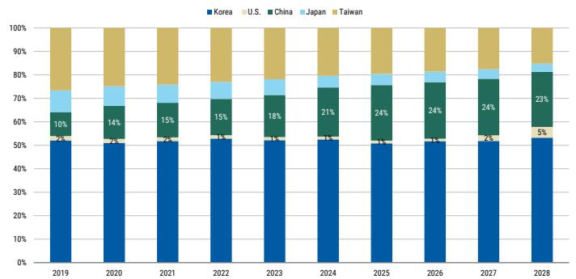

bar_stacked

| Year | Korea (%) | U.S. (%) | China (%) | Japan (%) | Taiwan (%) |
|---|---|---|---|---|---|
| 2019 | 50 | 2 | 10 | 10 | 30 |
| 2020 | 50 | 2 | 14 | 10 | 27 |
| 2021 | 52 | 2 | 15 | 8 | 26 |
| 2022 | 53 | 1 | 15 | 7 | 24 |
| 2023 | 53 | 1 | 18 | 8 | 23 |
| 2024 | 53 | 1 | 21 | 7 | 19 |
| 2025 | 51 | 1 | 24 | 6 | 21 |
| 2026 | 52 | 1 | 24 | 6 | 20 |
| 2027 | 52 | 2 | 24 | 6 | 19 |
| 2028 | 53 | 5 | 23 | 5 | 19 |

Source: TrendForce estimates, MS

Exhibit 55: Mainland China accounts for 30% share of 2023–28E net DRAM wafer additions, behind South Korea   
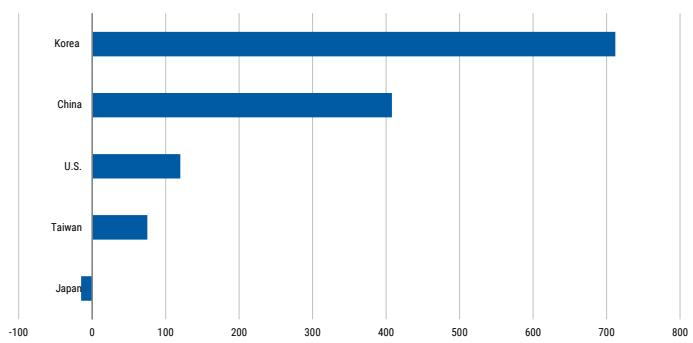

bar

| Country | Value |
| :--- | :--- |
| Korea | 710 |
| China | 405 |
| U.S. | 120 |
| Taiwan | 70 |
| Japan | -10 |

Source: TrendForce estimates, MS

# The potential for higher capacity in China

The equipment-access constraint now extends to the Big 3's own China fabs – making their upgrade path a key swing variable. Samsung and SK hynix previously operated their Chinese plants (Samsung's Xi'an NAND fab, SK hynix's Wuxi DRAM and Dalian NAND facilities) under Validated End User status, which allowed US-controlled tools without per-shipment licensing. That status expired on 31 December 2025 and has been replaced by an annual licensing regime requiring yearly US approval of equipment plans. The 2026 licenses are understood to cover maintenance and continued operation rather than capacity-expanding upgrades, effectively freezing this capacity at current nodes. Since these fabs supply a meaningful share of global mature-node DRAM and NAND, the question of whether upgrade licenses are eventually granted becomes a direct swing factor for global supply. Below, we size that potential upside on a fab-by-fab basis.

# SK hynix Wuxi DRAM – migration scenario analysis

SK hynix has a DRAM fab in China (Wuxi C2) with 200K/wpm running mostly on 1a nm node. Against the backdrop of geopolitical tensions and the US semi equipment export restrictions, SK hynix has stopped the node migration process in its Wuxi fab, opting to let it run on current products until these become legacy products.

In a scenario in which management decides to migrate the Wuxi fabs to the advanced node, we would expect 1.5-3.4% incremental global DRAM supply from the Wuxi fab alone from purely brown-field node migration.

Exhibit 56: SK hynix Wuxi Fab node migration scenario – potential impact 

<table><tr><td>Moving from 1a to...</td><td>Incremental bit addition per wafer (2Gb mn)</td><td>Annual bit output addition (2Gb mn)</td><td>As % of 2028 Global Supply</td></tr><tr><td>1beta nm</td><td>2.4</td><td>5,873</td><td>1.5%</td></tr><tr><td>1gamma/C</td><td>5.0</td><td>11,959</td><td>3.0%</td></tr><tr><td>1D nm</td><td>5.7</td><td>13,747</td><td>3.4%</td></tr></table>

Note: Underlying node migration and yield assumptions are from US WFE model. Source: Company data, MS estimates

# Samsung Xi'an NAND – migration scenario analysis

Samsung has a Xi'an fab with 160k/wpm running mainly on 192L products. Solidigm (SK hynix's NAND subsidiary) runs 95-120k/wpm total eSSD capacity in Dalian, China producing 144L-192L products. Although the company's decision to slow down the NAND node migration might reflect a number of factors (it is not migrating much capacity in the Korea fabs for NAND, owing to supply discipline), a more stable policy environment could to some extent incentivize the companies to migrate more aggressively in China amid current shortages.

Applying the same exercise, we estimate that migrating these China-based NAND fabs to more advanced layer counts could add between 3.0% and 8.9% to 2028 global supply, depending on the migration target – ranging from \~51,301mn (8Gb) of incremental annual bit output at 232-layer to \~150,863mn at 412-layer.

Exhibit 57: Korean suppliers' China fabs – node migration scenario 

<table><tr><td>Moving from 1YY L to...</td><td>Incremental bit addition per wafer (8Gb mn)</td><td>Annual bit output addition (8Gb mn)</td><td>As % of 2028 Global Supply</td></tr><tr><td>2XX L (232-layer)</td><td>15.3</td><td>51,301</td><td>3.0%</td></tr><tr><td>2YY L (286-layer)</td><td>34.7</td><td>116,662</td><td>6.8%</td></tr><tr><td>3XX L (328-layer)</td><td>43.8</td><td>147,063</td><td>8.6%</td></tr><tr><td>4XX L (412-layer)</td><td>44.9</td><td>150,863</td><td>8.9%</td></tr></table>

Note: Underlying node migration and yield assumptions are from US WFE model. Source: Company data, MS estimates

# China acceleration scenario

On the supply side, both CXMT and YMTC are expanding aggressively and collaborate closely with local WFE vendors.

On the DRAM side, EUV is still the bottleneck and we do not assume the EUV ban on exports to China is lifted in our base case scenario. We assume CXMT will continue to run on 1 alpha node with bit supply as a percentage of global DRAM supply increasing from 14% in 2026 to 16% in 2028 on greenfield capacity expansion.

On the NAND side, YMTC is currently on track to ramp up the yield on local equipment vendors. Our industry checks suggests that a lifting of the equipment ban from US vendors could help improve the yield by around 10%. Direct orders from US customers could also provide an incentive for Chinese players. Currently, YMTC remains on the US Commerce Department's Entity List, where it has sat since late 2022, restricting US technology exports to the company.

In a scenario in which YMTC accelerates the construction of Fab 4 & 5 and dedicates all the capacity to NAND at 3XXL mainstream products, together with yield improvement from US equipment, it would will increase the output by 2-10% from our current base case scenario.

Exhibit 58: YMTC – Potential supply acceleration analysis 

<table><tr><td></td><td>Base case bit supply(310k/wpm, 65% yield at 3XXL in 2028)</td><td>Uplift from yield improvement (65% to 75%)</td><td>Uplift from capacity expansion acceleration(310k to 500k)</td></tr><tr><td>Bit Supply (8Gb mn)</td><td>246,122</td><td>283,987</td><td>458,044</td></tr><tr><td>As % of Global Supply</td><td>14%</td><td>16%</td><td>24%</td></tr></table>

Note: Underlying node migration and yield assumptions are from US WFE model. Source: Company data, MS estimates

# Primer: Memory 101 – Types, Market Structure and the Cycle

# What is memory?

Memory is not a single commodity but a family of distinct products – each serving different applications, made by different suppliers, bought by different customers, and subject to its own supply and demand dynamics. Understanding these differences is essential to understanding who stands to benefit from the current market dynamics and who is disadvantaged.

The 6 main types of memory:

- HBM (High Bandwidth Memory) sits directly on the Al accelerator package, stacked in layers connected through microscopic vertical pillars called through-silicon vias. It delivers extraordinary data throughput – far beyond conventional DRAM – and is the reason a single Nvidia H100 can process vast amounts of data per second. Because it is physically integrated into the chip package, HBM is not interchangeable with any other memory type; it must be designed in at the silicon level. It is also the most technically complex and expensive memory in the world to make.   
- Server DRAM is the working memory of data centers – the DDR modules that sit in the server motherboard and hold active data for CPU and GPU processing. Every AI training server requires large quantities, and agentic AI workloads – where many simultaneous reasoning chains run in parallel – are driving server DRAM content per box to levels that were unimaginable two years ago.   
- PC and mobile DRAM is the same fundamental technology as server DRAM but in lower-power form factors — the LPDDR chips inside laptops, tablets, and smartphones. It is a far more price-sensitive, consumer-facing market, and the one most exposed to demand destruction when prices rise.   
- Enterprise NAND is flash storage used in data center SSDs and storage arrays. It holds data that does not need to be accessed in real time, but which must persist. NAND is structurally different from DRAM — it retains data without power — and is manufactured in a completely separate fab process.   
- Consumer NAND covers the flash storage inside smartphones, PCs, gaming devices, and USB drives. It is high volume, low margin, and the first to suffer when budgets tighten.   
- HDD (Hard Disk Drives) are used to store digital content and data on computers or other electronic devices. These non-volatile storage devices employ magnetic disks to write and read data from the disk. SSDs are generally faster and more reliable than HDDs, but they are also far more expensive.

# Supplier map: strategic memory remains Big 3-led; China scales in commodity pools

The supplier landscape is highly segmented by product. HBM and advanced/server DRAM remain concentrated among Samsung, SK hynix and Micron, with SK hynix leading HBM today, Samsung positioned as the broadest DRAM/NAND supplier and potential HBM recovery candidate, and Micron emerging as the key US-headquartered strategic supplier. NAND supply is broader, with Samsung, Kioxia/SanDisk, SK hynix/Solidigm, Micron and YMTC all relevant. China is becoming more important through CXMT in commodity DRAM/LPDDR and YMTC in NAND, but neither is a near-term global HBM relief valve. The key implication is that supply relief is uneven: China can help in selected commodity memory markets, while frontier AI memory remains concentrated in the Big 3.

Exhibit 59: Supplier position by memory type   
Supplier position by memory type 

<table><tr><td></td><td>HBMAI accelerator</td><td>Server DRAMDDR5</td><td>PC &amp; mobileLPDDR</td><td>EnterpriseNAND | SSD</td><td>ConsumerNAND</td></tr><tr><td>SK hynixSouth Korea</td><td>LeaderStrong Nvidia exposure.</td><td>StrongDDR5 ahead of peers. Wafer shift to HBM tightens conventional supply.</td><td>StrongLPDDR5X for premium smartphones. Losing low-end to CXMT.</td><td>PresentEnterprise SSD via Solidigm.</td><td>PresentLower priority - HBM and server absorb most capacity.</td></tr><tr><td>SamsungSouth Korea</td><td>Recovery candidateHBM3E yield issues cost share. HBM4 is a critical recovery moment.</td><td>LeaderLargest conventional DRAM capacity. Broadest customer base.</td><td>LeaderLargest LPDDR supplier. Inside most premium Android phones.</td><td>LeaderLargest NAND capacity globally. V-NAND technology advantage.</td><td>LeadereMMC, UFS, client SSDs across all tiers. Dominant share.</td></tr><tr><td>MicronUSA</td><td>Growing fastHBM3E qualified for NVIDIA H200; only US-headquartered HBM supplier.</td><td>StrongDDR5 competitive. US manufacture differentiates for government buyers.</td><td>StrongLPDDR5X competitive. Apple historically significant customer.</td><td>StrongQLC NAND competitive for hyperscale SSDs. US manufacture a differentiator.</td><td>PresentConsumer flash. Lower priority versus HBM/server mix shift.</td></tr><tr><td>Kioxia / SanDiskJapan / USA</td><td>NAND only - no DRAM</td><td>--</td><td>--</td><td>Strong2nd-largest NAND capacity globally. BICS technology.</td><td>StrongUSB, client SSDs, mobile UFS. Financially more fragile in downturns.</td></tr><tr><td>CXMTChina, state-backed</td><td>AttemptingHBM3 development / sampling, but not a near-term global HBM relief valve.</td><td>LimitedEmerging in DDR4/DDR5; not yet qualified at scale for mainstream global hyperscale server DRAM</td><td>GrowingMid/low LPDDR5 for Chinese Android market. Supporting Huawei.</td><td>DRAM only - no NAND</td><td>--</td></tr><tr><td>YMTCChina, state-backed</td><td>NAND only - no DRAM</td><td>--</td><td>--</td><td>EmergingGrowing in Chinese market. Export restrictions limit global access.</td><td>Growing fastDomestic NAND ramp; China self-sufficiency ambition; export restrictions limit global access</td></tr></table>

Source: MS estimates, company commentary. Note: Market positions are illustrative and intended to frame supplier participation by memory type.

# Memory cycle monitor

The memory cycle is no longer uniform. AI-facing products are structurally tight, while consumer-facing products are tight mainly because they are being crowded out. HBM is the most constrained pool; server DRAM is being pulled by AI/cloud demand; and enterprise NAND is tightening as AI storage demand grows. By contrast, PC/mobile DRAM and consumer NAND are not tight because end demand is booming; they are exposed because suppliers are prioritizing higher-value HBM, server DRAM and enterprise SSDs. This divergence means that AI buyers get priority allocation, while consumer and industrial buyers face higher prices, lower specs, delayed refresh cycles and margin pressure.

Exhibit 60: Memory cycle conditions by type   
Memory cycle conditions by type   
Supply/demand balance from oversupply to critically tight   
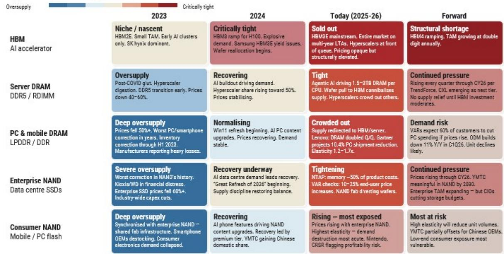

other

| Category | 2023 | 2024 | Today (2025-26) | Forward |
|---|---|---|---|---|
| HBM AI accelerator | Niche / nascentHBM2E. Small TAM. Early AI clusters only. SK hynix dominant. | Critically tightHBM3 ramp for H100. Explosive demand. Samsung HBM3E yield issues. Wafer reallocation begins. | Sold outHBM3E mainstream. Entire market on multi-year LTAs. Hyperscalers at front of queue. Pricing opaque but structurally elevated. | Structural shortageHBM4 ramping. TAM growing at double digit annually. |
| Server DRAM DDR5 / RDIMM | OversupplyPost-00VID glut. Hyperscaler digestion. DDR5 transition early. Prices down 40–60%. | RecoveringAI bulldout driving demand.Hyperscaler share rising toward 50%.Prices stabilising. | TightAgentic AI driving 1.5–2TB DRAM per CPU. Wafer pull to HBM cannibalises supply. Hyperscalers crowd out others. | Continued pressureRising every quarter through CY26 per TrendForce. CXL emerging as next tier.No supply relief until HBM investment moderates. |
| PC & mobile DRAM LPDDR / DDR | Deep oversupplyPrices fell 50%+. Worst PC/smartphone correction in years. Inventory correction through H1 2023.Manufacturers reporting heavy losses. | NormalisingWin11 refresh beginning. AI PC content upgrades. Prices recovering. Demand stable. | Crowded outSupply redirected to HBM/server.Lenovo: DRAM doubled Q/Q. Gartner projects 10.4% PC shipment reduction.Elasticity 1.2–1.7x. | Demand riskVARs expect 60% of customers to cut PC spending if prices rise. ODM builds down 11% Y/Y in C1Q26. Unit declines likely. |
| Enterprise NAND Data centre SSDs | Severe oversupplyWorst correction in NAND's history.Kioxia/WD in financial distress.Enterprise SSD prices fell 60%+.Industry-wide capex cuts. | Recovery underwayAI data centre demand leads recovery."Great Refresh of 2026" beginning.Supply discipline restoring balance.<fcel>TighteningNTAP: memory –50% of product costs.VAR checks: 10–25% end-user price increases. NAND fab diverting wafers. | Rising – most exposedPrices rising with enterprise NAND.Highest elasticity – demand destruction most acute. Nintendo,CRSR flagging profitability risk. | Continued pressurePrices rising through CY26. YMTC meaningful in NAND by 2030.Enterprise TAM expanding – but CIOs cutting storage budgets. |
| Consumer NAND Mobile / PC flash | Deep oversupplySynchronised with enterprise NAND – shared fab infrastructure. Smartphone OEMs destocking. Consumer electronics demand collapsed. | RecoveringAI phone features driving NAND content upgrades. Recovery led by premium tier. YMTC gaining Chinese domestic share. | Rising – most exposedPrices rising with enterprise NAND.Highest elasticity – demand destruction most acute. Nintendo,CRSR flagging profitability risk. | Most at riskHigh elasticity will reduce unit volumes.YMTC partially offsets for Chinese OEMs.Low-end consumer exposure most vulnerable. |

Source: MS estimates; company commentary; TrendForce; Gartner; VAR checks. Note: qualitative supply/demand conditions shown by product type; price increases refer to cited market checks where available.

The rate of change in DRAM contract prices has been a consistent indicator of inflections in the memory cycle and stock prices: Investors have not been rewarded in past cycles for buying stocks that are cheap on peak earnings once meaningful second-derivative weakness has begun. Second derivative weakness at cycle peaks is such a consistent leading indicator because there are positive feedback loops with customer inventory behavior that are far more durable than week-to-week demand variances. When expectations build for future quarterly prices to plateau or fall, customer focus turns to reducing inventory to minimize the negative impact of depreciating inventory.

# Share prices normally lead DRAM and are concurrent with the NAND cycle at trough:

In most cases the trough in stock prices was concurrent with (or lagging by a month) the inflection point (second derivative), measured by the rate of revenue growth for DRAM. In the 2021-23 cycle, DRAM YoY contract pricing peaked in December 2021 and had troughed by June 2023, but stock prices bottomed two quarters ahead of this in December 2022.

Exhibit 61: DRAM Contract price YoY vs. NTM P/B   
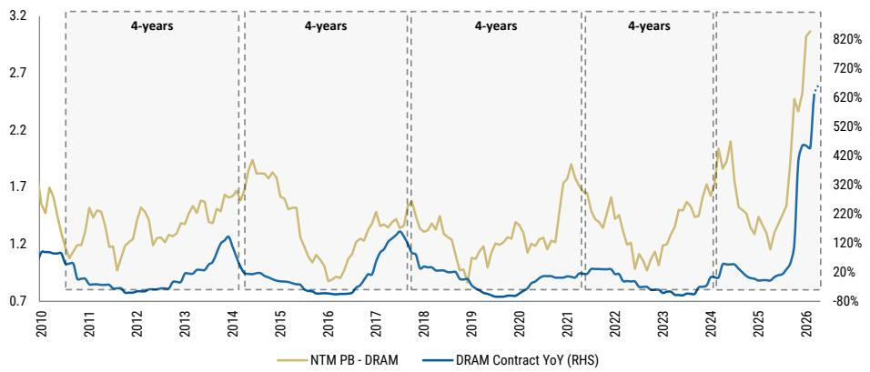

line

| Year | NTM PB - DRAM | DRAM Contract YoY (RHS) |
|------|----------------|--------------------------|
| 2010 | ~1.7           | ~1.2                     |
| 2011 | ~1.3           | ~0.9                     |
| 2012 | ~1.4           | ~0.8                     |
| 2013 | ~1.5           | ~0.9                     |
| 2014 | ~1.7           | ~1.2                     |
| 2015 | ~1.6           | ~0.8                     |
| 2016 | ~1.3           | ~0.7                     |
| 2017 | ~1.4           | ~1.1                     |
| 2018 | ~1.7           | ~1.3                     |
| 2019 | ~1.3           | ~0.8                     |
| 2020 | ~1.4           | ~0.7                     |
| 2021 | ~1.7           | ~0.9                     |
| 2022 | ~1.5           | ~0.8                     |
| 2023 | ~1.4           | ~0.7                     |
| 2024 | ~1.8           | ~0.9                     |
| 2025 | ~1.3           | ~0.8                     |
| 2026 | ~3.2           | ~6.5                     |

Source: Factset, TrendForce, MS

Duration is getting shorter now. Historically, the memory segment tended to be 4-8 quarters in a downturn and 4-9 quarters in an upturn. The slowdown tends to be shorter than the upturn in the memory cycle because it is easy to cancel orders and rationalize inventory but harder to bring back capacity. The 2018 share-price correction lasted only four quarters, from 1Q18 to 1Q19. The most recent downcycle in 2024 lasted for only 8 months before stocks found a bottom, and with tariffs and AI demand supporting an increase in pricing again, share prices also rebounded sharply. We are now 13 months into this upcycle, which began in April 2025.

Exhibit 62: DRAM cycles in perspective over the last 30 years   
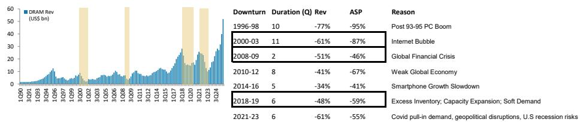

bar

| Period       | Value |
| ------------ | ----- |
| 1996-98      | 10    |
| 2000-03      | 11    |
| 2008-09      | 2     |
| 2010-12      | 8     |
| 2014-16      | 5     |
| 2018-19      | 6     |
| 2021-23      | 6     |

Source: Factset, MS

# DRAM share price performance is driven by valuation in the early stages of a

downcycle: In the 2021 cycle, EPS estimate revisions lagged the peak in share prices by three months, while de-rating drove the initial downward leg of share price performance, anticipating the inflection of the DRAM cycle. Multiples tend to bottom around the inflection in the second derivative (either pricing or monthly revenues), which is often the catalyst for share prices to reverse performance. In terms of EPS estimate revisions breadth, peak to trough magnitude is almost 2x (+102% to -88%) on average, and the duration of EPS estimate revisions averages 12 months but only lasted 2 quarters in the last downcycle.

Exhibit 63: DRAM demand grows every year in terms of bit shipments (1mn Gb eq)   
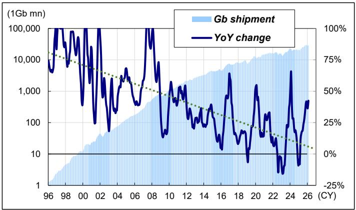

line

| Year | Gb shipment (1Gb mn) | YoY change (%) |
|------|------------------------|----------------|
| 96   | ~1                     | ~100%          |
| 98   | ~10                    | ~75%           |
| 00   | ~100                   | ~50%           |
| 02   | ~1000                  | ~25%           |
| 04   | ~1000                  | ~25%           |
| 06   | ~1000                  | ~25%           |
| 08   | ~1000                  | ~25%           |
| 10   | ~100                   | ~25%           |
| 12   | ~100                   | ~25%           |
| 14   | ~100                   | ~25%           |
| 16   | ~100                   | ~25%           |
| 18   | ~100                   | ~25%           |
| 20   | ~100                   | ~25%           |
| 22   | ~100                   | ~25%           |
| 24   | ~100                   | ~25%           |
| 26   | ~100                   | ~25%           |

Source: WSTS

Exhibit 64: DRAM ASP has rebounded quickly since 2024   
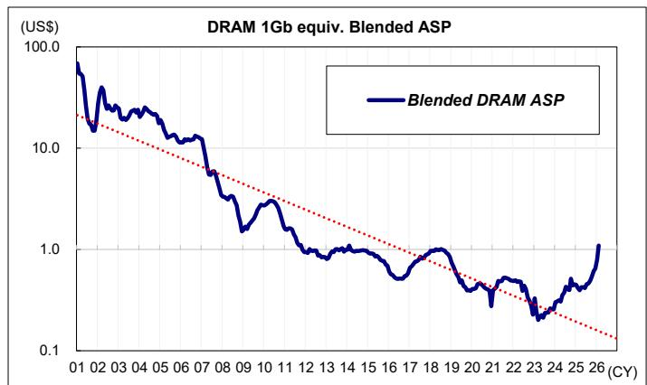

line

| Year | Blended DRAM ASP |
|------|-------------------|
| 01   | ~100.0            |
| 02   | ~50.0             |
| 03   | ~30.0             |
| 04   | ~25.0             |
| 05   | ~20.0             |
| 06   | ~15.0             |
| 07   | ~10.0             |
| 08   | ~5.0              |
| 09   | ~2.0              |
| 10   | ~3.0              |
| 11   | ~2.5              |
| 12   | ~2.0              |
| 13   | ~1.5              |
| 14   | ~1.2              |
| 15   | ~1.0              |
| 16   | ~0.8              |
| 17   | ~0.7              |
| 18   | ~0.6              |
| 19   | ~0.5              |
| 20   | ~0.4              |
| 21   | ~0.3              |
| 22   | ~0.2              |
| 23   | ~0.15             |
| 24   | ~0.2              |
| 25   | ~0.3              |
| 26   | ~0.5              |

Source: WSTS

# Memory inflections

# We monitor four signposts as early inflection signals during a cycle:

1. DRAM prices extending strength. We expect LTAs to change the high volatility nature of memory pricing for the next 2-3 years. After significant hikes from 4Q25-2Q26, we expect pricing increases on a QoQ basis to narrow to around 8-13% QoQ for both DRAM and NAND. Instead of viewing this as a sign of inflection, we believe LTAs can instill stability, improve earnings predictability, and reduce the risk of overbuilding capacity with better supply management for memory companies by locking in pricing at an elevated level with prepayments. (LTAs – How They Are Affecting Memory)   
2. Inventory adjustment cycle. Supplier inventory remains at historical lows of only 2-3 weeks for DRAM and 4-5 weeks for NAND at the beginning of 2Q26. Server customers, despite aggressive orders, continue to work down their inventory, with remaining end customers retaining healthy inventory levels. During an upturn, lead times for the delivery of chips to manufacturers of PCs, servers and smartphones tend to grow longer. This prompts those customers to order more than they need and hoard that inventory in case longer lead times grow into a real shortage. We see this as an ongoing issue for consumer customers, who face a trade-off between soaring prices and limited supply allocation.   
3. Capex budgets pared down while capital intensity moves higher. There is typically either too much or too little supply in memory. The industry is competitive but also rational, and should therefore be responsive to periods of price disequilibrium. In response to the increase in inventories and the prospect of lower profitability, chip manufacturers reduce their capacity growth to manufacture chips to meet that demand. Capital expenditure for DRAM was cut by 23% in 2019 and stayed flat in 2020, while the 2015 downturn saw only 9% cuts. However, AI demand is likely to keep absolute capex levels elevated in upcoming downturns and also prompt companies to require higher returns to justify those investments.   
4. Continued upward earnings revisions and valuation expansion. The market often runs ahead of the actual revisions in earnings, and we would look for further

earnings upside through HBM pricing negotiations. Our sensitivity analysis (here) suggests that the market is not yet assigning any meaningful P/E premium to memory suppliers' LTA-backed earnings and FCF. For illustration, if we were to apply a 10x P/E multiple to LTA-backed earnings and assume 70% commodity LTA coverage, the 2027 P/E for Samsung/hynix could expand to \~8.5x, all else equal (from 5x currently).

Exhibit 65: DRAM inventory   
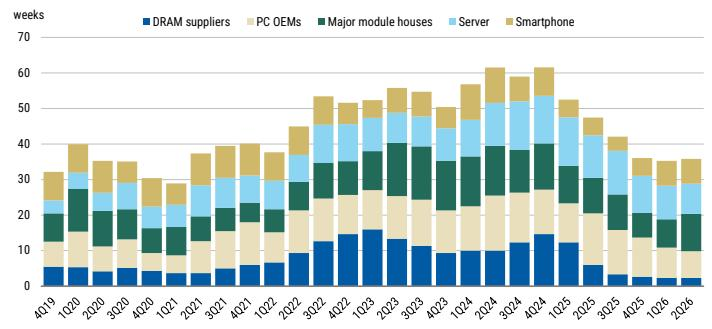

bar_stacked

| Quarter | DRAM suppliers | PC OEMs | Major module houses | Server | Smartphone |
|---------|-----------------|---------|---------------------|--------|----------|
| 4Q19    | 5               | 8       | 10                  | 5      | 7        |
| 1Q20    | 5               | 8       | 12                  | 5      | 7        |
| 2Q20    | 5               | 8       | 10                  | 5      | 7        |
| 3Q20    | 5               | 8       | 10                  | 5      | 7        |
| 4Q20    | 5               | 8       | 10                  | 5      | 7        |
| 1Q21    | 5               | 8       | 10                  | 5      | 7        |
| 2Q21    | 5               | 8       | 10                  | 5      | 7        |
| 3Q21    | 5               | 8       | 10                  | 5      | 7        |
| 4Q21    | 5               | 8       | 10                  | 5      | 7        |
| 1Q22    | 5               | 8       | 10                  | 5      | 7        |
| 2Q22    | 5               | 8       | 10                  | 5      | 7        |
| 3Q22    | 5               | 8       | 10                  | 5      | 7        |
| 4Q22    | 5               | 8       | 10                  | 5      | 7        |
| 1Q23    | 5               | 8       | 10                  | 5      | 7        |
| 2Q23    | 5               | 8       | 10                  | 5      | 7        |
| 3Q23    | 5               | 8       | 10                  | 5      | 7        |
| 4Q23    | 5               | 8       | 10                  | 5      | 7        |
| 1Q24    | 5               | 8       | 10                  | 5      | 7        |
| 2Q24    | 5               | 8       | 10                  | 5      | 7        |
| 3Q24    | 5               | 8       | 10                  | 5      | 7        |
| 4Q24    | 5               | 8       | 10                  | 5      | 7        |
| 1Q25    | 5               | 8       | 10                  | 5      | 7        |
| 2Q25    | 5               | 8       | 10                  | 5      | 7        |
| 3Q25    | 5               | 8       | 10                  | 5      | 7        |
| 4Q25    | 5               | 8       | 10                  | 5      | 7        |
| 1Q26    | 5               | 8       | 10                  | 5      | 7        |
| 2Q26    | 5               | 8       | 10                  | 5      | 7        |

Source: TrendForce estimates, MS

Exhibit 66: NAND inventory   
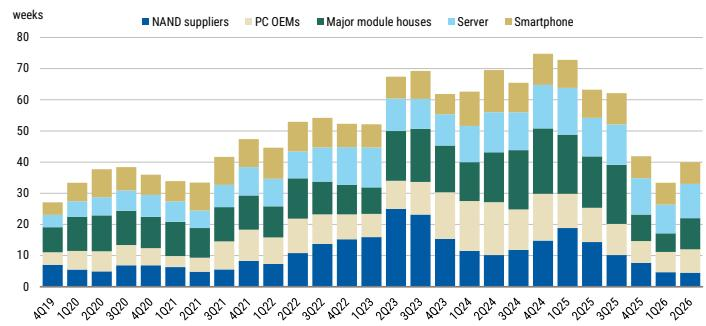

bar_stacked

| Quarter | NAND suppliers | PC OEMs | Major module houses | Server | Smartphone |
|---------|-----------------|---------|---------------------|--------|------------|
| 4Q19    | 8               | 5       | 7                   | 3      | 2          |
| 1Q20    | 7               | 5       | 8                   | 3      | 2          |
| 2Q20    | 7               | 5       | 8                   | 3      | 2          |
| 3Q20    | 7               | 5       | 8                   | 3      | 2          |
| 4Q20    | 7               | 5       | 8                   | 3      | 2          |
| 1Q21    | 7               | 5       | 8                   | 3      | 2          |
| 2Q21    | 7               | 5       | 8                   | 3      | 2          |
| 3Q21    | 7               | 5       | 8                   | 3      | 2          |
| 4Q21    | 7               | 5       | 8                   | 3      | 2          |
| 1Q22    | 7               | 5       | 8                   | 3      | 2          |
| 2Q22    | 7               | 5       | 8                   | 3      | 2          |
| 3Q22    | 7               | 5       | 8                   | 3      | 2          |
| 4Q22    | 7               | 5       | 8                   | 3      | 2          |
| 1Q23    | 7               | 5       | 8                   | 3      | 2          |
| 2Q23    | 7               | 5       | 8                   | 3      | 2          |
| 3Q23    | 7               | 5       | 8                   | 3      | 2          |
| 4Q23    | 7               | 5       | 8                   | 3      | 2          |
| 1Q24    | 7               | 5       | 8                   | 3      | 2          |
| 2Q24    | 7               | 5       | 8                   | 3      | 2          |
| 3Q24    | 7               | 5       | 8                   | 3      | 2          |
| 4Q24    | 7               | 5       | 8                   | 3      | 2          |
| 1Q25    | 7               | 5       | 8                   | 3      | 2          |
| 2Q25    | 7               | 5       | 8                   | 3      | 2          |
| 3Q25    | 7               | 5       | 8                   | 3      | 2          |
| 4Q25    | 7               | 5       | 8                   | 3      | 2          |
| 1Q26    | 7               | 5       | 8                   | 3      | 2          |
| 2Q26    | 7               | 5       | 8                   | 3      | 2          |

Source: TrendForce estimates, MS

Exhibit 67: DRAM Capex (US\$ mn)   
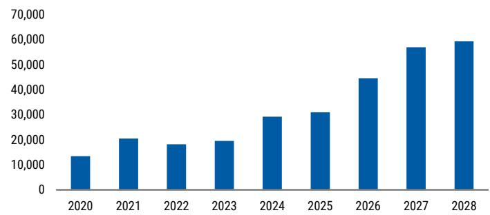

bar

| Year | Value |
|---|---|
| 2020 | 13500 |
| 2021 | 20500 |
| 2022 | 18000 |
| 2023 | 19500 |
| 2024 | 29000 |
| 2025 | 31000 |
| 2026 | 44500 |
| 2027 | 57000 |
| 2028 | 59500 |

Source: TrendForce estimates, MS

Exhibit 68: NAND Capex (US\$ mn)   
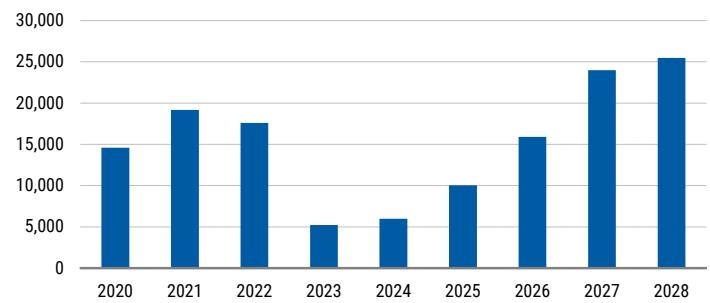

bar

| Year | Value |
|---|---|
| 2020 | 14500 |
| 2021 | 19200 |
| 2022 | 17600 |
| 2023 | 5100 |
| 2024 | 5900 |
| 2025 | 9900 |
| 2026 | 15800 |
| 2027 | 24100 |
| 2028 | 25300 |

Source: TrendForce estimates, MS

# Exhibit 69:

DRAM in the context of the semiconductor cycle – revenue YoY is highly correlated for memory with DRAM at a more advanced stage relative to NAND

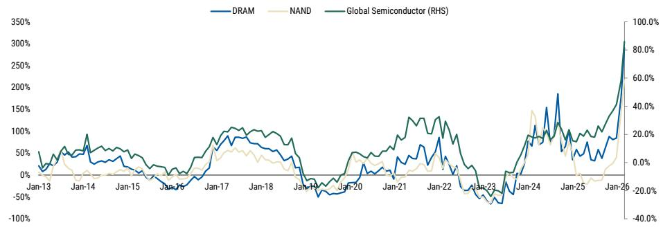

line

| Date   | DRAM  | NAND  | Global Semiconductor (RHS) |
|--------|-------|-------|---------------------------|
| Jan-13 | ~0%   | ~0%   | ~0%                       |
| Jan-14 | ~50%  | ~0%   | ~50%                      |
| Jan-15 | ~0%   | ~0%   | ~0%                       |
| Jan-16 | ~-50% | ~-50% | ~-50%                     |
| Jan-17 | ~100% | ~50%  | ~100%                     |
| Jan-18 | ~50%  | ~50%  | ~50%                      |
| Jan-19 | ~-50% | ~-50% | ~-50%                     |
| Jan-20 | ~0%   | ~0%   | ~0%                       |
| Jan-21 | ~50%  | ~50%  | ~50%                      |
| Jan-22 | ~100% | ~100% | ~100%                     |
| Jan-23 | ~-50% | ~-50% | ~-50%                     |
| Jan-24 | ~150% | ~150% | ~150%                     |
| Jan-25 | ~100% | ~100% | ~100%                     |
| Jan-26 | ~300% | ~300% | ~300%                     |

Source: SIA

# Appendix: Memory Demand per Gigawatt of AI Data Center Deployment

# Framework overview

Quantifying memory demand per GW of AI compute requires disaggregating by hardware platform, as configurations differ materially between GPU-based and ASIC-based deployments. For GPU platforms (NVIDIA), our analysis anchors on the GB200 NVL72 and Vera Rubin NVL72 systems. ASIC configurations are non-standard and harder to model – LPDDR is not yet widely adopted for server main memory in ASIC deployments, making direct comparison unreliable – though HBM intensity should be broadly similar across platforms.

# DRAM wafer intensity per 1GW of compute

Based on our SPE team's bottom-up analysis of wafer requirements to produce 1GW of compute annually, DRAM is by far the most wafer-intensive component of the supply chain.

For the GB200 NVL72, total DRAM wafer demand runs at approximately 153kwpm per 1GW, comprising roughly 110kwpm for HBM and 43kwpm for LPDDR. For the Vera Rubin NVL72, aggregate DRAM intensity is broadly similar at approximately 144kwpm, with HBM at \~89kwpm and LPDDR rising to -55kwpm – reflecting the higher LPDDR content of the Vera Rubin architecture. In WFE dollar terms, Logic WFE remains the single largest component at the GB200 platform level (\~\$14.2bn vs -\$13.8bn for DRAM), though the split is platform-dependent – Vera Rubin's higher LPDDR content shifts the balance modestly toward DRAM (\~\$14.4bn VS \~\$11.6bn). The two components are broadly comparable in aggregate WFE intensity.

# End-market fungibility and allocation dynamics

An important nuance for modelling consumer hardware exposure is that DRAM bits are highly fungible across end markets: PC and server DRAM are essentially the same product, and LPDDR now sees substantial use in GPU servers. As a result, the Big 3 suppliers do not formally ring-fence capacity by end market – all three intend to continue serving non-data-center customers, but incremental capacity will flow toward whichever end market is growing fastest. In practice, this means consumer and PC allocations face a structurally tightening ceiling as AI server demand crowds out non-server bits, even without any formal reallocation decision by suppliers.

# Agentic Al: a new incremental demand vector

Beyond traditional GPU server deployments, the shift from inference to agentic AI introduces a structurally new demand category for CPU-attached DRAM. Unlike GPU training or batch inference, agentic workloads run continuous, multi-step reasoning chains that require large, persistent memory states at the orchestration layer. Our framework for sizing this opportunity is:

Agentic AI DRAM demand = (Incremental orchestration CPU shipments) × (average DRAM per CPU)

We have previously identified standalone agentic orchestration servers as a new hardware category, with DRAM content per box potentially reaching 1.5-3TB – levels that were unimaginable for a CPU-class server two years ago. KV cache offload dynamics compound this further: whereas prior GenAl models offloaded KV cache to NAND on a session basis. Agentic workloads require weeks-to-months of persistent state, materially increasing both DRAM and NAND content per server. This equation is still evolving and is not yet captured in consensus DRAM TAM models, representing a source of upside to our already constructive demand outlook.

# Illustrative WFE scale: TeraFab as a stress test

To illustrate the scale of memory wafer demand that large-scale AI compute build-outs imply, our SPE team's TeraFab analysis is instructive. A facility ramping to 12GW of annual compute output would require approximately \$33bn of WFE in year one – of which DRAM alone accounts for roughly \$14bn. Even at a more conservative 3GW ramp cadence, annual DRAM WFE demand would reach approximately \$3.5bn from a single facility. This underscores that AI DC deployment is not merely a chip demand story but a full-stack memory capacity story, with HBM remaining the most constrained and strategically differentiated product in the stack.

Exhibit 70: SPE to GW 

<table><tr><td>Monthly Build12</td><td>HBM3eGB200 NVL72Blackwell</td><td>HBM4Vera Rubin NVL72Vera Rubin</td></tr><tr><td>kW per Rack</td><td>120</td><td>200</td></tr><tr><td>Racks per 1GW</td><td>8,333</td><td>4,167</td></tr><tr><td># of GPUs</td><td>600,000</td><td>300,000</td></tr></table>

HBM (DRAM) 

<table><tr><td>HBM</td><td>3e</td><td>4</td></tr><tr><td>GB per GPU</td><td>192</td><td>288</td></tr><tr><td>HBM Module GB</td><td>24</td><td>36</td></tr><tr><td>Node</td><td>1Beta</td><td>1Beta/1C</td></tr><tr><td>HBM per Rack</td><td></td><td></td></tr><tr><td>Packages per GPU</td><td>8</td><td>8</td></tr><tr><td>DRAM dies per stack</td><td>8</td><td>12</td></tr><tr><td>DRAM dies per GPU</td><td>64</td><td>96</td></tr><tr><td>DRAM dies per Rack</td><td>4,608</td><td>6,912</td></tr><tr><td>Die per 1GW</td><td>38,400,000</td><td>28,802,304</td></tr><tr><td>Bits per 1GW (2Gb mn)</td><td>461</td><td>346</td></tr></table>

<table><tr><td>Monthly Build12</td><td>HBM3eGB200 NVL72Blackwell</td><td>HBM4Vera Rubin NVL72Vera Rubin</td></tr><tr><td>kW per Rack</td><td>120</td><td>200</td></tr><tr><td>Racks per 1GW</td><td>8,333</td><td>4,167</td></tr><tr><td># of GPUs</td><td>600,000</td><td>300,000</td></tr></table>

LPDDR 

<table><tr><td>Node</td><td>1Beta</td><td>1Gamma</td></tr><tr><td>LPDDR per Rack (TB)</td><td>17</td><td>54</td></tr><tr><td>LPDDR per GW (TB)</td><td>141,667</td><td>225,018</td></tr><tr><td>LPDDR per die (Gb)</td><td>16</td><td>32</td></tr><tr><td>LPDDR die per 1GW</td><td>70,833,333</td><td>56,254,500</td></tr><tr><td>DRAM Wafer</td><td></td><td></td></tr><tr><td>Consumption</td><td></td><td></td></tr><tr><td>Die Size (mm2)</td><td>38</td><td>58</td></tr><tr><td>Gross Die per Wafer</td><td>1,752</td><td>1,131</td></tr><tr><td>Yield</td><td>95%</td><td>90%</td></tr><tr><td>Good Die per Wafer</td><td>1,664</td><td>1,018</td></tr><tr><td>Wafers per 1GW</td><td>42,557</td><td>55,255</td></tr><tr><td>LPDDR WFE ($mn)</td><td>319</td><td>460</td></tr></table>

Source: MS

Share prices for stocks referenced: Advanced Micro Devices 510.13; AP Memory Technology Corp 1,075.00; Apple, Inc.306.31; Applied Materials Inc.458.17; Arm Holdings plc 408.85; ASM International NV 867.40; ASML Holding NV1,394.00; Aspeed Technology 18,095.00; BE Semiconductor Industries NV 278.20; Egis Technology Inc 122.50; Everpure, Inc. 84.45; FIT Hon Teng Ltd 9.05; Global Unichip Corp 4,535.00; Hon Hai Precision 301.50; Ibiden 21,135.00; Intel Corporation 109.33; KIOXIA Holdings 77,540.00; KLA Corp 1,940.04; Lotes Co. Ltd. 2,615.00; MEC 10,930.00; Micron Technology Inc. 1,035.50; Montage Technology Co Ltd 372.40; Murata Manufacturing 10,230.00; Nan Ya PCB 862.00; Nitto Boseki 21,900.00; NVIDIA Corp. 224.36; Renesas Electronics 4,455.00; Samsung Electro-Mechanics 1,813,000.00; Samsung Electronics 360,500.00; SanDisk Corporation. 1,761.43; Seagate Technology 921.26; SK Hynix 2,360,000.00; TDK 3,849.00; Tokyo Electron 53,710.00; TSMC 2,380.00; Ulvac 8,913.00; Unimicron 975.00; Western Digital 546.20; Wiwynn Corp 5,475.00; Wonik IPS Co Ltd 97,900.00; WPG Holdings 119.00; Yageo Corp. 846.00

This report references U.S. Executive Order 14032 and/or entities or securities that are designated thereunder. U.S. persons may be prohibited from buying certain securities of entities named in this report. Readers are solely responsible for ensuring that their investment activities are carried out in compliance with applicable laws.

This report references export controls and/or entities that may be subject to export control restrictions. Readers are solely responsible for ensuring that their investment or trade activities are carried out in compliance with applicable laws.

This report references U.S. Executive Order 14105 and/or entities that may be in scope of such order. U.S. persons may be prohibited from engaging in certain transactions or otherwise require certain other transactions be notified to the U.S. Department of Treasury. Readers are solely responsible for ensuring that their investment or trade activities are carried out in compliance with applicable laws.

# Disclosure Section

The information and opinions in MS were prepared or are disseminated by MS & Co. LLC and/or MS C.T.V.M. S.A. and/or MS México, Casa de Bolsa, S.A. de C.V. and/or MS Canada Limited and/or MS & Co. International plc and/or MS Europe S.E. and/or RMB MS Proprietary Limited and/or MS MUFG Securities Co., Ltd. and/or MS Capital Group Japan Co., Ltd. and/or MS Asia Limited and/or MS Asia (Singapore) Pte. (Registration number 199206298Z) and/or MS Asia (Singapore) Securities Pte Ltd (Registration number 200008434H), regulated by the Monetary Authority of Singapore (which accepts legal responsibility for its contents and should be contacted with respect to any matters arising from, or in connection with, MS) and/or MS Taiwan Limited and/or MS & Co International plc, Seoul Branch, and/or MS Australia Limited (A.B.N. 67 003 734 576, holder of Australian financial services license No. 233742, which accepts responsibility for its contents), and/or MS Wealth Management Australia Pty Ltd (A.B.N. 19 009 145 555, holder of Australian financial services license No. 240813, which accepts responsibility for its contents), and/or MS India Company Private Limited having Corporate Identification No (CIN) U22990MH1998PTC115305, regulated by the Securities and Exchange Board of India ("SEBI") and holder of licenses as a Research Analyst (SEBI Registration No. INH000001105), Stock Broker (SEBI Stock Broker Registration No. INZ000244438), Merchant Banker (SEBI Registration No. INM000011203), and depository participant with National Securities Depository Limited (SEBI Registration No. IN-DP-NSDL-567-2021) having registered office at Altimus, Level 39 & 40, Pandurang Budhkar Marg, Worli, Mumbai 400018, India; Telephone no. +91-22-61181000; Compliance Officer Details: Mr. Tejarshi Hardas, Tel. No.: +91-22-61181000 or Email: tejarshi.hardas@morganstanley.com; Grievance officer details: Mr. Tejarshi Hardas, Tel. No.: +91-22-61181000 or Email: msic-compliance@morganstanley.com which accepts the responsibility for its contents and should be contacted with respect to any matters arising from, or in connection with, MS, and their affiliates (collectively, "MS"). MS India Company Private Limited (MSICPL) may use AI tools in providing research services. All recommendations contained herein are made by the duly qualified research analysts.

For important disclosures, stock price charts and equity rating histories regarding companies that are the subject of this report, please see the MS Disclosure Website at www.morganstanley.com/eqr/disclosures/webapp/generalresearch, or contact your investment representative or MS at 1585 Broadway, (Attention: Research Management), New York, NY, 10036 USA.

For valuation methodology and risks associated with any recommendation, rating or price target referenced in this research report, please contact the Client Support Team as follows: US/Canada +1 800 303-2495; Hong Kong +852 2848-5999; Latin America +1 718 754-5444 (U.S.); London +44 (0)20-7425-8169; Singapore +65 6834-6860; Sydney +61 (0)2-9770-1505; Tokyo +81 (0)3-6836-9000. Alternatively you may contact your investment representative or MS at 1585 Broadway, (Attention: Research Management), New York, NY 10036 USA.

# Analyst Certification

The following analysts hereby certify that their views about the companies and their securities discussed in this report are accurately expressed and that they have not received and will not receive direct or indirect compensation in exchange for expressing specific recommendations or views in this report: Shane Brett; Cindy Huang; Shawn Kim; Duan Liu; Joseph Moore; Ariana Salvatore; Lee Simpson; Erik W Woodring.

# Global Research Conflict Management Policy

MS has been published in accordance with our conflict management policy, which is available at www.morganstanley.com/institutional/research/conflictpolicies. A Portuguese version of the policy can be found at www.morganstanley.com.br

# Important Regulatory Disclosures on Subject Companies

The analyst or strategist (or a household member) identified below owns the following securities (or related derivatives): Cindy Huang - ASML Holding NV(common or preferred stock); Maya C Neuman - Apple, Inc.(common or preferred stock); Erik W Woodring - NVIDIA Corp.(common or preferred stock).

As of April 30, 2026, MS beneficially owned 1% or more of a class of common equity securities of the following companies covered in MS: Advanced Micro Devices, AP Memory Technology Corp, Apple, Inc., Applied Materials Inc., Arm Holdings plc, ASML Holding NV, Aspeed Technology, Everpure, Inc., Global Unichip Corp, Ibiden, Intel Corporation, KIOXIA Holdings, KLA Corp, MEC, Micron Technology Inc., Montage Technology Co Ltd, Nan Ya PCB, Nitto Boseki, NVIDIA Corp., Samsung Electro-Mechanics, SanDisk Corporation., Seagate Technology, SK hynix, TDK, Tokyo Electron, TSMC, Ulvac, Unimicron, Western Digital, Wiwynn Corp, WPG Holdings, Yageo Corp..

Within the last 12 months, MS managed or co-managed a public offering (or 144A offering) of securities of Intel Corporation, KIOXIA Holdings, Montage Technology Co Ltd, Samsung Electronics, SK hynix, Wiwynn Corp.

Within the last 12 months, MS has received compensation for investment banking services from Advanced Micro Devices, Applied Materials Inc., ASM International NV, BE Semiconductor Industries NV, Intel Corporation, KIOXIA Holdings, Micron Technology Inc., Montage Technology Co Ltd, Seagate Technology, SK hynix, Tokyo Electron, Wiwynn Corp, Yageo Corp..

In the next 3 months, MS expects to receive or intends to seek compensation for investment banking services from Advanced Micro Devices, AP Memory Technology Corp, Apple, Inc., Applied Materials Inc., Arm Holdings plc, ASM International NV, ASML Holding NV, Aspeed Technology, BE Semiconductor Industries NV, Everpure, Inc., FIT Hon Teng Ltd, Hon Hai Precision, Ibiden, Intel Corporation, KIOXIA Holdings, KLA Corp, MEC, Micron Technology Inc., Montage Technology Co Ltd, Murata Manufacturing, Nitto Boseki, NVIDIA Corp., Renesas Electronics, Samsung Electronics, SanDisk Corporation., Seagate Technology, SK hynix, TDK, Tokyo Electron, TSMC, Ulvac, Unimicron, Western Digital, Wiwynn Corp, WPG Holdings, Yageo Corp..

Within the last 12 months, MS has received compensation for products and services other than investment banking services from Advanced Micro Devices, Apple, Inc., Applied Materials Inc., ASM International NV, BE Semiconductor Industries NV, Hon Hai Precision, Intel Corporation, Micron Technology Inc., NVIDIA Corp., Seagate Technology, Tokyo Electron, TSMC, Yageo Corp..

Within the last 12 months, MS has provided or is providing investment banking services to, or has an investment banking client relationship with, the following company: Advanced Micro Devices, AP Memory Technology Corp, Apple, Inc., Applied Materials Inc., Arm Holdings plc, ASM International NV, ASML Holding NV, Aspeed Technology, BE Semiconductor Industries NV, Everpure, Inc., FIT Hon Teng Ltd, Hon Hai Precision, Ibiden, Intel Corporation, KIOXIA Holdings, KLA Corp, Micron Technology Inc., Montage Technology Co Ltd, Murata Manufacturing, NVIDIA Corp., Renesas Electronics, Samsung Electronics, SanDisk Corporation., Seagate Technology, SK hynix, TDK, Tokyo Electron, TSMC, Ulvac, Unimicron, Western Digital, Wiwynn Corp, WPG Holdings, Yageo Corp..

Within the last 12 months, MS has either provided or is providing non-investment banking, securities-related services to and/or in the past has entered into an agreement to provide services or has a client relationship with the following company: Advanced Micro Devices, Apple, Inc., Applied Materials Inc., ASM International NV, BE Semiconductor Industries NV, Everpure, Inc., Hon Hai Precision, Intel Corporation, Micron Technology Inc., Montage Technology Co Ltd, NVIDIA Corp., Renesas Electronics, Seagate Technology, Tokyo Electron, TSMC, Yageo Corp.. The equity research analysts or strategists principally responsible for the preparation of MS have received compensation based upon various factors, including quality of research, investor client feedback, stock picking, competitive factors, firm revenues and overall investment banking revenues. Equity Research analysts' or strategists' compensation is not linked to investment banking or capital markets transactions performed by MS or the profitability or revenues of particular trading desks.

MS and its affiliates do business that relates to companies/instruments covered in MS, including market making, providing liquidity, fund management, commercial banking, extension of credit, investment services and investment banking. MS sells to and buys from customers the securities/instruments of companies covered in MS on a principal basis. MS may have a position in the debt of the Company or instruments discussed in this report. MS trades or may trade as principal in the debt securities (or in related derivatives) that are the subject of the debt research report.

Certain disclosures listed above are also for compliance with applicable regulations in non-US jurisdictions.

# STOCK RATINGS

MS uses a relative rating system using terms such as Overweight, Equal-weight, Not-Rated or Underweight (see definitions below). MS does not assign ratings of Buy, Hold or Sell to the stocks we cover. Overweight, Equal-weight, Not-Rated and Underweight are not the equivalent of buy, hold and sell. Investors should carefully read the definitions of all ratings used in MS. In addition, since MS contains more complete information concerning the analyst's views, investors should carefully read MS, in its entirety, and not infer the contents from the rating alone. In any case, ratings (or research) should not be used or relied upon as investment advice. An investor's decision to buy or sell a stock should depend on individual circumstances (such as the investor's existing holdings) and other considerations.

# Global Stock Ratings Distribution

(as of May 31, 2026)

The Stock Ratings described below apply to MS's Fundamental Equity Research and do not apply to Debt Research produced by the Firm.

For disclosure purposes only (in accordance with FINRA requirements), we include the category headings of Buy, Hold, and Sell alongside our ratings of Overweight, Equal-weight, Not-Rated and Underweight. MS does not assign ratings of Buy, Hold or Sell to the stocks we cover. Overweight, Equal-weight, Not-Rated and Underweight are not the equivalent of buy, hold, and sell but represent recommended relative weightings (see definitions below). To satisfy regulatory requirements, we correspond Overweight, our most positive stock rating, with a buy recommendation; we correspond Equal-weight and Not-Rated to hold and Underweight to sell recommendations, respectively.

<table><tr><td></td><td colspan="2">Coverage Universe</td><td colspan="3">Investment Banking Clients (IBC)</td><td colspan="2">Other Material Investment ServicesClients (MISC)</td></tr><tr><td>Stock RatingCategory</td><td>Count</td><td>% of Total</td><td>Count</td><td>% of Total IBC</td><td>% of RatingCategory</td><td>Count</td><td>% of Total OtherMISC</td></tr><tr><td>Overweight/Buy</td><td>1542</td><td>42%</td><td>465</td><td>51%</td><td>30%</td><td>707</td><td>43%</td></tr><tr><td>Equal-weight/Hold</td><td>1571</td><td>43%</td><td>369</td><td>40%</td><td>23%</td><td>723</td><td>44%</td></tr><tr><td>Not-Rated/Hold</td><td>3</td><td>0%</td><td>0</td><td>0%</td><td>0%</td><td>1</td><td>0%</td></tr><tr><td>Underweight/Sell</td><td>551</td><td>15%</td><td>86</td><td>9%</td><td>16%</td><td>201</td><td>12%</td></tr><tr><td>Total</td><td>3,667</td><td></td><td>920</td><td></td><td></td><td>1632</td><td></td></tr></table>

Data include common stock and ADRs currently assigned ratings. Investment Banking Clients are companies from whom MS received investment banking compensation in the last 12 months. Due to rounding off of decimals, the percentages provided in the "% of total" column may not add up to exactly 100 percent.

# Analyst Stock Ratings

Overweight (O or Over) - The stock's total return is expected to exceed the total return of the relevant country MSCI Index or the average total return of the analyst's industry (or industry team's) coverage universe, on a risk-adjusted basis over the next 12-18 months.

Equal-weight (E or Equal) - The stock's total return is expected to be in line with the total return of the relevant country MSCI Index or the average total return of the analyst's industry (or industry team's) coverage universe, on a risk-adjusted basis over the next 12-18 months.

Not-Rated (NR) - Currently the analyst does not have adequate conviction about the stock's total return relative to the relevant country MSCI Index or the average total return of the analyst's industry (or industry team's) coverage universe, on a risk-adjusted basis, over the next 12-18 months.

Underweight (U or Under) - The stock's total return is expected to be below the total return of the relevant country MSCI Index or the average total return of the analyst's industry (or industry team's) coverage universe, on a risk-adjusted basis, over the next 12-18 months.

Unless otherwise specified, the time frame for price targets included in MS is 12 to 18 months.

# Analyst Industry Views

Attractive (A): The analyst expects the performance of his or her industry coverage universe over the next 12-18 months to be attractive vs. the relevant broad market benchmark, as indicated below.

In-Line (I): The analyst expects the performance of his or her industry coverage universe over the next 12-18 months to be in line with the relevant broad market benchmark, as indicated below. Cautious (C): The analyst views the performance of his or her industry coverage universe over the next 12-18 months with caution vs. the relevant broad market benchmark, as indicated below. Benchmarks for each region are as follows: North America - S&P 500; Latin America - relevant MSCI country index or MSCI Latin America Index; Europe - MSCI Europe; Japan - TOPIX; Asia - relevant MSCI country index or MSCI sub-regional index or MSCI AC Asia Pacific ex Japan Index.

# Stock Price, Price Target and Rating History (See Rating Definitions)

Samsung Electro-Mechanics (009150.KS) - As of 06/02/26 GMT in KRW Industry : S. Korea Technology   
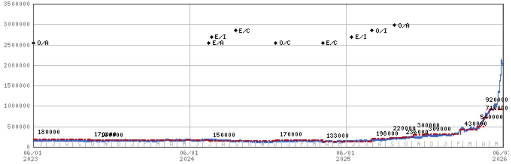

line

| Date       | Value   |
| ---------- | ------- |
| 06/01 2023 | 180000  |
| 06/01 2024 | 171000  |
| 06/01 2025 | 150000  |
| 06/01 2026 | 133000  |
| 06/01 2027 | 198000  |
| 06/01 2028 | 220000  |
| 06/01 2029 | 236000  |
| 06/01 2030 | 309000  |
| 06/01 2031 | 430000  |
| 06/01 2032 | 540000  |
| 06/01 2033 | 717000  |
| 06/01 2034 | 920000  |

Stock Rating History: 6/1/21 : E/A; 7/19/21 : E/I; 8/12/21 : E/C; 6/1/22 : U/C; 10/4/22 : U/A; 11/9/22 : O/A; 7/15/24 : E/A;   
7/21/24 : E/I; 9/15/24 : E/C; 12/18/24 : 0/C; 4/7/25 : E/C; 6/13/25 : E/I; 7/31/25 : 0/I; 9/21/25 : 0/A   
Price Target History: 5/12/21 : 180000; 10/19/21 : 170000; 10/27/21 : 160000; 1/24/22 : 180000; 3/18/22 : 170000; 6/1/22 : 140000;   
11/9/22 : 180000; 10/11/23 : 170000; 10/27/23 : 160000; 7/15/24 : 150000; 12/18/24 : 170000; 4/7/25 : 133000; 7/31/25 : 198000;   
9/10/25 : 220000; 10/10/25 : 236000; 11/5/25 : 300000; 12/1/25 : 309000; 2/23/26 : 430000; 4/2/26 : 500000; 4/19/26 : 710000;   
5/1/26 : 920000   
Source: MS Date Format : MM/DD/YY Price Target No Price Target Assigned (NA)   
Stock Price (Not Covered by Current Analyst) — Stock Price (Covered by Current Analyst)   
Stock and Industry Ratings (abbreviations below) appear as ♦ Stock Rating/Industry View   
Stock Ratings: Overweight (O) Equal-weight (E) Underweight (U) Not-Rated (NR) No Rating Available (NA)   
Industry View: Attractive (A) In-line (I) Cautious (C) No Rating (NR)   
Effective January 13, 2014, the stocks covered by MS Asia Pacific will be rated relative to the analyst's industry (or industry team's) coverage.   
Effective January 13, 2014, the industry view benchmarks for MS Asia Pacific are as follows: relevant MSCI country index or MSCI sub-regional index or MSCI AC Asia Pacific ex Japan Index.

Samsung Electronics (005930.KS) - As of 06/02/26 GMT in KRW Industry : S. Korea Technology   
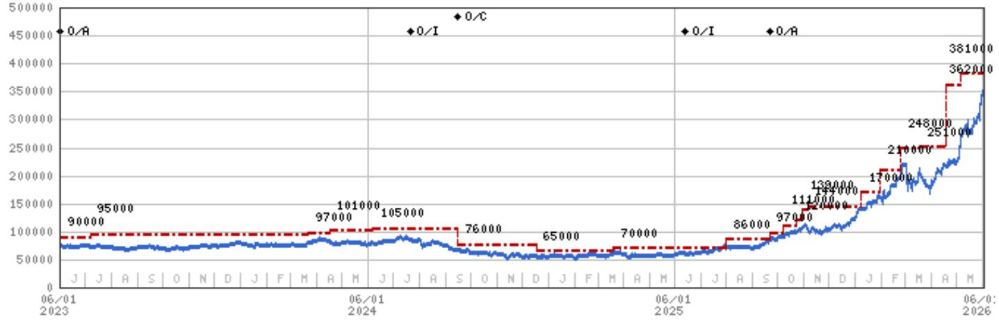

line

| Date       | Value   |
| ---------- | ------- |
| 06/01 2023 | 90000   |
| 06/01 2024 | 95000   |
| 06/01 2024 | 97000   |
| 06/01 2024 | 101000  |
| 06/01 2024 | 105000  |
| 06/01 2024 | 76000   |
| 06/01 2024 | 65000   |
| 06/01 2024 | 70000   |
| 06/01 2025 | 86000   |
| 06/01 2025 | 97000   |
| 06/01 2025 | 111000  |
| 06/01 2025 | 133000  |
| 06/01 2025 | 149000  |
| 06/01 2025 | 170000  |
| 06/01 2025 | 210000  |
| 06/01 2025 | 248000  |
| 06/01 2025 | 251000  |
| 06/01 2025 | 381000  |
| 06/01 2026 | 362000  |

Stock Rating History: 6/1/21 : 0/A; 7/19/21 : 0/I; 8/12/21 : 0/C; 10/4/22 : 0/A; 7/21/24 : 0/I; 9/15/24 : 0/C; 6/13/25 : 0/I; 9/21/25 : 0/A   
Price Target History: 5/18/21 : 93000; 6/8/21 : 98000; 8/12/21 : 89000; 9/15/21 : 95000; 12/3/21 : 97000; 3/18/22 : 95000;   
4/28/22 : 85000; 6/10/22 : 80000; 7/5/22 : 75000; 7/22/22 : 70000; 9/17/22 : 68000; 3/21/23 : 70000; 5/30/23 : 90000; 7/7/23 : 95000;   
3/22/24 : 97000; 4/16/24 : 101000; 6/6/24 : 105000; 9/15/24 : 76000; 12/18/24 : 65000; 3/19/25 : 70000; 8/1/25 : 86000;   
9/21/25 : 97000; 10/8/25 : 111000; 10/23/25 : 120000; 10/30/25 : 139000; 11/5/25 : 144000; 1/8/26 : 170000; 1/30/26 : 210000;   
2/24/26 : 248000; 3/18/26 : 251000; 4/19/26 : 362000; 5/6/26 : 381000   
Source: MS Date Format : MM/DD/YY Price Target = No Price Target Assigned (NA)   
Stock Price (Not Covered by Current Analyst) — Stock Price (Covered by Current Analyst)   
Stock and Industry Ratings (abbreviations below) appear as ♦ Stock Rating/Industry View   
Stock Ratings: Overweight (O) Equal-weight (E) Underweight (U) Not-Rated (NR) No Rating Available (NA)   
Industry View: Attractive (A) In-line (I) Cautious (C) No Rating (NR)   
Effective January 13, 2014, the stocks covered by MS Asia Pacific will be rated relative to the analyst's industry (or industry team's) coverage.   
Effective January 13, 2014, the industry view benchmarks for MS Asia Pacific are as follows: relevant MSCI country index or MSCI sub-regional index or MSCI AC Asia Pacific ex Japan Index.

Samsung Electronics (005935.KS) - As of 06/02/26 GMT in KRW Industry : S. Korea Technology   
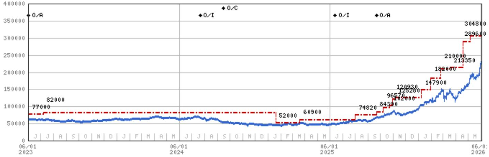

line

| Date       | Value   |
| ---------- | ------- |
| 06/01 2023 | 77000   |
| 06/01 2024 | 82000   |
| 06/01 2025 | 52000   |
| 06/01 2026 | 304810  |

Stock Rating History: 6/1/21 : 0/A; 7/19/21 : 0/I; 8/12/21 : 0/C; 10/4/22 : 0/A; 7/21/24 : 0/I; 9/15/24 : 0/C; 6/13/25 : 0/I; 9/21/25 : 0/A   
Price Target History: 5/18/21 : 80000; 6/8/21 : 84000; 8/12/21 : 77000; 9/15/21 : 82000; 12/3/21 : 83000; 3/18/22 : 82000;   
4/28/22 : 73000; 6/10/22 : 69000; 7/5/22 : 65000; 7/22/22 : 60000; 9/17/22 : 58000; 3/21/23 : 60000; 5/30/23 : 77000; 7/7/23 : 82000;   
1/20/25 : 52000; 3/19/25 : 60900; 8/1/25 : 74820; 9/21/25 : 84390; 10/8/25 : 96570; 10/23/25 : 102000; 10/30/25 : 120930;   
11/5/25 : 125280; 1/8/26 : 147900; 1/30/26 : 182000; 2/24/26 : 210000; 3/18/26 : 213350; 4/19/26 : 289600; 5/6/26 : 304800   
Source: MS Date Format : MM/DD/YY Price Target = No Price Target Assigned (NA)   
Stock Price (Not Covered by Current Analyst) — Stock Price (Covered by Current Analyst)   
Stock and Industry Ratings (abbreviations below) appear as ♦ Stock Rating/Industry View   
Stock Ratings: Overweight (O) Equal-weight (E) Underweight (U) Not-Rated (NR) No Rating Available (NA)   
Industry View: Attractive (A) In-line (I) Cautious (C) No Rating (NR)   
Effective January 13, 2014, the stocks covered by MS Asia Pacific will be rated relative to the analyst's industry (or industry team's) coverage.   
Effective January 13, 2014, the industry view benchmarks for MS Asia Pacific are as follows: relevant MSCI country index or MSCI sub-regional index or MSCI AC Asia Pacific ex Japan Index.

SK hynix (000660.KS) - As of 06/02/26 GMT in KRW Industry : S. Korea Technology   
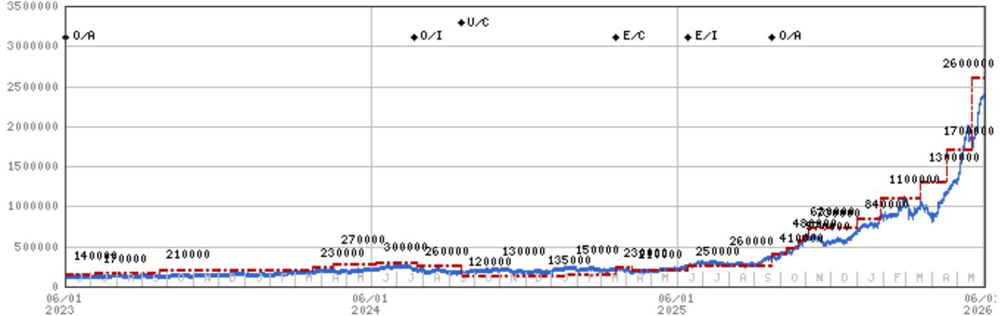

line

| Date       | Value     |
| ---------- | --------- |
| 06/01 2023 | 140000    |
| 06/01 2023 | 170000    |
| 06/01 2023 | 210000    |
| 06/01 2023 | 230000    |
| 06/01 2023 | 270000    |
| 06/01 2023 | 300000    |
| 06/01 2023 | 335000    |
| 06/01 2023 | 120000    |
| 06/01 2023 | 135000    |
| 06/01 2023 | 150000    |
| 06/01 2023 | 135000    |
| 06/01 2023 | 155000    |
| 06/01 2023 | 235000    |
| 06/01 2023 | 255000    |
| 06/01 2023 | 260000    |
| 06/01 2023 | 415555    |
| 06/01 2023 | 485555    |
| 06/01 2023 | 679555    |
| 06/01 2023 | 845555    |
| 06/01 2023 | 845555    |
| 06/01 2023 | 1155555   |
| 06/01 2023 | 1355555   |
| 06/01 2023 | 1755555   |
| 06/01 2023 | 2655555   |
| 06/01 2023 | 2655555   |
| 06/01 2023 | 1775555   |
| 06/01 2023 | 2675555   |
| 06/01 2023 | 2675555   |
| 06/01 2023 | 1775555   |
| 06/01 2023 | 1775555   |
| 06/01 2023 | 1775555   |
| 06/01 2023 | 1775555   |
| 06/01 2023 | 1775555   |
|
| 06/01 2023 | 1775555   |
| 06/01 2023 | 1775555   |
| 06/01 2023 | 1775555   |
| 06/01 2023 | 1775555   |
| 06/01*      | (no label)|
| Jun        | (no label)|
| Jul        | (no label)|
| Aug        | (no label)|
| Sep        | (no label)|
| Oct        | (no label)|
| Nov        | (no label)|
| Dec        | (no label)|
| Jan        | (no label)|
| Feb        | (no label)|
| Mar        | (no label)|
| Apr        | (no label)|
| May        | (no label)|
| Jun        | (no label)|
| Jul        | (no label)|
| Aug        | (no label)|
| Sep        | (no label)|
| Oct        | (no label)|
| Nov        | (no label)|
| Dec        | (no label)|
| Jan        | (no label)|
| Feb        | (no label)|
| Mar        | (no label)|
| Apr        *U/C   | U/C       |
| E/C        | E/C       |
| E/I        | E/I       |
| O/A        | O/A       |

Stock Rating History: 6/1/21 : 0/A; 7/19/21 : 0/I; 8/12/21 : U/C; 12/3/21 : E/C; 2/11/22 : 0/C; 7/22/22 : E/C; 10/4/22 : 0/A; 7/21/24 : 0/I; 9/15/24 : U/C; 3/19/25 : E/C; 6/13/25 : E/I; 9/21/25 : 0/A   
Price Target History: 5/18/21 : 146000; 6/8/21 : 156000; 8/12/21 : 80000; 9/15/21 : 88000; 12/3/21 : 110000; 12/23/21 : 125000;   
1/24/22 : 130000; 1/28/22 : 136000; 2/11/22 : 155000; 3/18/22 : 150000; 4/27/22 : 130000; 6/10/22 : 120000; 7/5/22 : 110000;   
7/22/22 : 105000; 10/4/22 : 130000; 12/7/22 : 120000; 3/21/23 : 110000; 5/30/23 : 140000; 7/7/23 : 170000; 9/21/23 : 210000;   
3/22/24 : 230000; 4/16/24 : 270000; 6/6/24 : 300000; 7/25/24 : 260000; 9/15/24 : 120000; 10/24/24 : 130000; 12/18/24 : 135000;   
1/20/25 : 150000; 3/19/25 : 230000; 4/7/25 : 210000; 6/13/25 : 250000; 7/24/25 : 260000; 9/21/25 : 410000; 10/8/25 : 480000;   
10/23/25 : 570000; 10/29/25 : 630000; 11/5/25 : 730000; 1/2/26 : 840000; 1/30/26 : 1100000; 3/18/26 : 1300000; 4/19/26 : 1700000;   
5/18/26 : 2600000   
Source: MS Date Format : MM/DD/YY Price Target No Price Target Assigned (NA)   
Stock Price (Not Covered by Current Analyst) — Stock Price (Covered by Current Analyst)   
Stock and Industry Ratings (abbreviations below) appear as ♦ Stock Rating/Industry View   
Stock Ratings: Overweight (O) Equal-weight (E) Underweight (U) Not-Rated (NR) No Rating Available (NA)   
Industry View: Attractive (A) In-line (I) Cautious (C) No Rating (NR)   
Effective January 13, 2014, the stocks covered by MS Asia Pacific will be rated relative to the analyst's industry (or industry team's) coverage.   
Effective January 13, 2014, the industry view benchmarks for MS Asia Pacific are as follows: relevant MSCI country index or MSCI sub-regional index or MSCI AC Asia Pacific ex Japan Index.

Wonik IPS Co Ltd (240810.KQ) - As of 06/02/26 GMT in KRW Industry : S. Korea Technology   
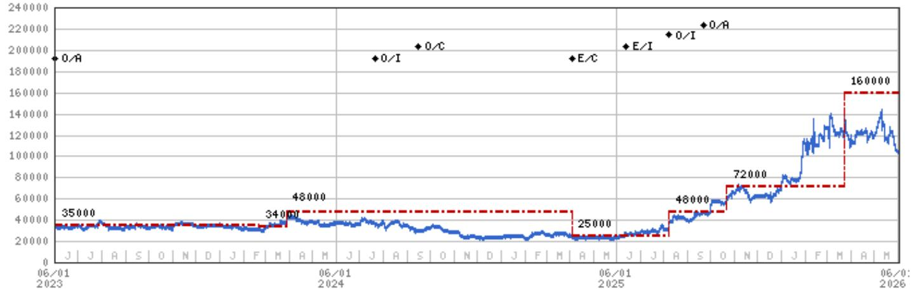

line

| Date       | Value   |
| ---------- | ------- |
| 06/01 2023 | 35000   |
| 06/01 2024 | 34000   |
| 06/01 2025 | 25000   |
| 06/01 2026 | 160000  |

Stock Rating History: 6/1/21 : 0/A; 7/19/21 : 0/I; 8/12/21 : 0/C; 10/4/22 : 0/A; 7/21/24 : 0/I; 9/15/24 : 0/C; 4/3/25 : E/C; 6/13/25 : E/I; 8/8/25 : 0/I; 9/21/25 : 0/A   
Price Target History: 1/27/21 : 65000; 10/26/21 : 55000; 3/18/22 : 50000; 8/9/22 : 43000; 1/12/23 : 35000; 2/21/24 : 34000; 3/28/24 : 48000; 4/3/25 : 25000; 8/8/25 : 48000; 10/21/25 : 72000; 3/23/26 : 160000   
Source: MS Date Format : MM/DD/YY Price Target = No Price Target Assigned (NA)   
Stock Price (Not Covered by Current Analyst) — Stock Price (Covered by Current Analyst)   
Stock and Industry Ratings (abbreviations below) appear as ♦ Stock Rating/Industry View   
Stock Ratings: Overweight (O) Equal-weight (E) Underweight (U) Not-Rated (NR) No Rating Available (NA)   
Industry View: Attractive (A) In-line (I) Cautious (C) No Rating (NR)   
Effective January 13, 2014, the stocks covered by MS Asia Pacific will be rated relative to the analyst's industry (or industry team's) coverage.   
Effective January 13, 2014, the industry view benchmarks for MS Asia Pacific are as follows: relevant MSCI country index or MSCI sub-regional index or MSCI AC Asia Pacific ex Japan Index.

# Important Disclosures for MS Smith Barney LLC Customers

Important disclosures regarding any material conflict of interest that can reasonably be expected to have influenced MS Smith Barney LLC's choice of a third-party research provider or the subject company of a third-party research report, are available on the MS Wealth Management disclosure website at www.morganstanley.com/online/researchdisclosures. For MS specific disclosures, you may refer to https://www.morganstanley.com/eqr/disclosures/webapp/generalresearch.

Each MS report is reviewed and approved on behalf of MS Smith Barney LLC. This review and approval is conducted by the same person who reviews the research report on behalf of MS. This could create a conflict of interest.

# Other Important Disclosures

A member of Research who had or could have had access to the research prior to completion owns securities (or related derivatives) in the Apple, Inc., Micron Technology Inc., NVIDIA Corp., Western Digital. This person is not a research analyst or a member of research analyst's household.

MS policy is to update research reports as and when the Research Analyst and Research Management deem appropriate, based on developments with the issuer, the sector, or the market that may have a material impact on the research views or opinions stated therein. In addition, certain Research publications are intended to be updated on a regular periodic basis (weekly/monthly/quarterly/annual) and will ordinarily be updated with that frequency, unless the Research Analyst and Research Management determine that a different publication schedule is appropriate based on current conditions.

MS is not acting as a municipal advisor and the opinions or views contained herein are not intended to be, and do not constitute, advice within the meaning of Section 975 of the Dodd-Frank Wall Street Reform and Consumer Protection Act.

MS produces an equity research product called a "Tactical Idea." Views contained in a "Tactical Idea" on a particular stock may be contrary to the recommendations or views expressed in research on the same stock. This may be the result of differing time horizons, methodologies, market events, or other factors. For all research available on a particular stock, please contact your sales representative or go to Matrix at http://www.morganstanley.com/matrix.

MS is provided to our clients through our proprietary research portal on Matrix and also distributed electronically by MS to clients. Certain, but not all, MS products are also made available to clients through third-party vendors or redistributed to clients through alternate electronic means as a convenience. For access to all available MS, please contact your sales representative or go to Matrix at http://www.morganstanley.com/matrix.

Any access and/or use of MS is subject to MS's Terms of Use (http://www.morganstanley.com/terms.html). By accessing and/or using MS, you are indicating that you have read and agree to be bound by our Terms of Use (http://www.morganstanley.com/terms.html). In addition you consent to MS processing your personal data and using cookies in accordance with our Privacy Policy and our Global Cookies Policy (http://www.morganstanley.com/privacy\_pledge.html), including for the purposes of setting your preferences and to collect readership data so that we can deliver better and more personalized service and products to you. To find out more information about how MS processes personal data, how we use cookies and how to reject cookies see our Privacy Policy and our Global Cookies Policy (http://www.morganstanley.com/privacy\_pledge.html). Please use the provided link to review the Terms and Conditions and Most Important Terms and Conditions for MS India Company Private Limited (https://www.morganstanley.com/assets/pdfs/about-us-global-offices/india/Terms\_and\_conditions.pdf) and the following link to review the audit report (https://ny.matrix.ms.com/eqr/research/webapp/researchdocs/MSICPL\_Morgan\_Stanley\_Research\_Audit\_Report.pdf).

If you do not agree to our Terms of Use and/or if you do not wish to provide your consent to MS processing your personal data or using cookies please do not access our research. MS does not provide individually tailored investment advice. MS has been prepared without regard to the circumstances and objectives of those who receive it. MS recommends that investors independently evaluate particular investments and strategies, and encourages investors to seek the advice of a financial adviser. The appropriateness of an investment or strategy will depend on an investor's circumstances and objectives. The securities, instruments, or strategies discussed in MS may not be suitable for all investors, and certain investors may not be eligible to purchase or participate in some or all of them. MS is not an offer to buy or sell or the solicitation of an offer to buy or sell any security/instrument or to participate in any particular trading strategy. The value of and income from your investments may vary because of changes in interest rates, foreign exchange rates, default rates, prepayment rates, securities/instruments prices, market indexes, operational or financial conditions of companies or other factors. There may be time limitations on the exercise of options or other rights in securities/instruments transactions. Past performance is not necessarily a guide to future performance. Estimates of future performance are based on assumptions that may not be realized. If provided, and unless otherwise stated, the closing price on the cover page is that of the primary exchange for the subject company's securities/instruments.

The fixed income research analysts, strategists or economists principally responsible for the preparation of MS have received compensation based upon various factors, including quality, accuracy and value of research, firm profitability or revenues (which include fixed income trading and capital markets profitability or revenues), client feedback and competitive factors. Fixed Income Research analysts', strategists' or economists' compensation is not linked to investment banking or capital markets transactions performed by MS or the profitability or revenues of particular trading desks.

The "Important Regulatory Disclosures on Subject Companies" section in MS lists all companies mentioned where MS owns 1% or more of a class of common equity securities of the companies. For all other companies mentioned in MS, MS may have an investment of less than 1% in securities/instruments or derivatives of securities/instruments of companies and may trade them in ways different from those discussed in MS. Employees of MS not involved in the preparation of MS may have investments in securities/instruments or derivatives of securities/instruments of companies mentioned and may trade them in ways different from those discussed in MS. Derivatives may be issued by MS or associated persons.

With the exception of information regarding MS, MS is based on public information. MS makes every effort to use reliable, comprehensive information, but we make no representation that it is accurate or complete. We have no obligation to tell you when opinions or information in MS change apart from when we intend to discontinue equity research coverage of a subject company. Facts and views presented in MS have not been reviewed by, and may not reflect information known to, professionals in other MS business areas, including investment banking personnel.

MS personnel may participate in company events such as site visits and are generally prohibited from accepting payment by the company of associated expenses unless pre-approved by authorized members of Research management.

MS may make investment decisions that are inconsistent with the recommendations or views in this report.

To our readers based in Taiwan or trading in Taiwan securities/instruments: Information on securities/instruments that trade in Taiwan is distributed by MS Taiwan Limited ("MSTL"). Such information is for your reference only. The reader should independently evaluate the investment risks and is solely responsible for their investment decisions. MS may not be distributed to the public media or quoted or used by the public media without the express written consent of MS. Any non-customer reader within the scope of Article 7-1 of the Taiwan Stock Exchange Recommendation Regulations accessing and/or receiving MS is not permitted to provide MS to any third party (including but not limited to related parties, affiliated companies and any other third parties) or engage in any activities regarding MS which may create or give the appearance of creating a conflict of interest. Information on securities/instruments that do not trade in Taiwan is for informational purposes only and is not to be construed as a recommendation or a solicitation to trade in such securities/instruments. MSTL may not execute transactions for clients in these securities/instruments.

Certain information in MS was sourced by employees of the Shanghai Representative Office of MS Asia Limited for the use of MS Asia Limited. MS is not incorporated under PRC law and the research in relation to this report is conducted outside the PRC. MS does not constitute an offer to sell or the solicitation of an offer to buy any securities in the PRC. PRC investors shall have the relevant qualifications to invest in such securities and shall be responsible for obtaining all relevant approvals, licenses, verifications and/or registrations from the relevant governmental authorities themselves. Neither this report nor any part of it is intended as, or shall constitute, provision of any consultancy or advisory service of securities investment as defined under PRC law. Such information is provided for your reference only.

MS is disseminated in Brazil by MS C.T.V.M. S.A. located at Av. Brigadeiro Faria Lima, 3600, 6th floor, São Paulo - SP, Brazil; and is regulated by the Comissão de Valores Mobiliários; in Mexico by MS México, Casa de Bolsa, S.A. de C.V which is regulated by Comision Nacional Bancaria y de Valores. Paseo de los Tamarindos 90, Torre 1, Col. Bosques de las Lomas Floor 29, 05120 Mexico City; in Japan by MS MUFG Securities Co., Ltd. and, for Commodities related research reports only, MS Capital Group Japan Co., Ltd; in Hong Kong by MS Asia Limited (which accepts responsibility for its contents) and by MS Bank Asia Limited; in Singapore by MS Asia (Singapore) Pte. (Registration number 199206298Z) and/or MS Asia (Singapore) Securities Pte Ltd (Registration number 200008434H), regulated by the Monetary Authority of Singapore (which accepts legal responsibility for its contents and should be contacted with respect to any matters arising from, or in connection with, MS) and by MS Bank Asia Limited, Singapore Branch (Registration number T14FC0118J); in Australia to "wholesale clients" within the meaning of the Australian Corporations Act by MS Australia Limited A.B.N. 67 003 734 576, holder of Australian financial services license No. 233742, which accepts responsibility for its contents; in Australia to "wholesale clients" and "retail clients" within the meaning of the Australian Corporations Act by MS Wealth Management Australia Pty Ltd (A.B.N. 19 009 145 555, holder of Australian financial services license No. 240813, which accepts responsibility for its contents; in Korea by MS & Co International plc, Seoul Branch; in India by MS India Company Private Limited having Corporate Identification No (CIN) U22990MH1998PTC115305, regulated by the Securities and Exchange Board of India ("SEBI") and holder of licenses as a Research Analyst (SEBI Registration No. INH000001105); Stock Broker (SEBI Stock Broker Registration No. INZ000244438), Merchant Banker (SEBI Registration No. INM000011203), and depository participant with National Securities Depository Limited (SEBI Registration No. IN-DP-NSDL-567-2021) having registered office at Altimus, Level 39 & 40, Pandurang Budhkar Marg, Worli, Mumbai 400018, India; Telephone no. +91-22-61181000; Compliance Officer Details: Mr. Tejarshi Hardas, Tel. No.: +91-22-61181000 or Email: tejarshi.hardas@morganstanley.com; Grievance officer details: Mr. Tejarshi Hardas, Tel. No.: +91-22-61181000 or Email: msic-compliance@morganstanley.com. MS India Company Private Limited (MSICPL) may use AI tools in providing research services. All recommendations contained herein are made by the duly qualified research analysts; in Canada by MS Canada Limited; in Germany and the European Economic Area where required by MS Europe S.E., authorised and regulated by Bundesanstalt fuer Finanzdienstleistungsaufsicht (BaFin) under the reference number 149169; in the US by MS & Co. LLC, which accepts responsibility for its contents. MS & Co. International plc, authorized by the Prudential Regulation Authority and regulated by the Financial Conduct Authority and the Prudential Regulation Authority, disseminates in the UK research that it has prepared, and research which has been prepared by any of its affiliates, only to persons who (i) are investment professionals falling within Article 19(5) of the Financial Services and Markets Act 2000 (Financial Promotion) Order 2005 (as amended, the "Order"); (ii) are persons who are high net worth entities falling within Article 49(2)(a) to (d) of the Order; or (iii) are persons to whom an invitation or inducement to engage in investment activity (within the meaning of section 21 of the Financial Services and Markets Act 2000, as amended) may otherwise lawfully be communicated or caused to be communicated. RMB MS Proprietary Limited is a member of the JSE Limited and A2X (Pty) Ltd. RMB MS Proprietary Limited is a joint venture owned equally by MS International Holdings Inc. and RMB Investment Advisory (Proprietary) Limited, which is wholly owned by FirstRand Limited. The information in MS is being disseminated by MS Saudi Arabia, regulated by the Capital Market Authority in the Kingdom of Saudi Arabia, and is directed at Sophisticated investors only.

MS Hong Kong Securities Limited is the liquidity provider/market maker for securities of ASM International NV, FIT Hon Teng Ltd, Hon Hai Precision listed on the Stock Exchange of Hong Kong Limited. An updated list can be found on HKEx website: http://www.hkex.com.hk.

The information in MS is being communicated by MS & Co. International plc (DIFC Branch), regulated by the Dubai Financial Services Authority (the DFSA) or by MS & Co. International plc (ADGM Branch), regulated by the Financial Services Regulatory Authority Abu Dhabi (the FSRA), and is directed at Professional Clients only, as defined by the DFSA or the FSRA, respectively. The financial products or financial services to which this research relates will only be made available to a customer who we are satisfied meets the regulatory criteria of a Professional Client. A distribution of the different MS Research ratings or recommendations, in percentage terms for Investments in each sector covered, is available upon request from your sales representative.

The information in MS is being communicated by MS & Co. International plc (QFC Branch), regulated by the Qatar Financial Centre Regulatory Authority (the QFCRA), and is directed at business customers and market counterparties only and is not intended for Retail Customers as defined by the QFCRA.

As required by the Capital Markets Board of Turkey, investment information, comments and recommendations stated here, are not within the scope of investment advisory activity. Investment advisory service is provided exclusively to persons based on their risk and income preferences by the authorized firms. Comments and recommendations stated here are general in nature. These opinions may not fit to your financial status, risk and return preferences. For this reason, to make an investment decision by relying solely to this information stated here may not bring about outcomes that fit your expectations.

The following companies do business in countries which are generally subject to comprehensive sanctions programs administered or enforced by the U.S. Department of the Treasury's Office of Foreign Assets Control ("OFAC") and by other countries and multi-national bodies: Samsung Electronics.

The trademarks and service marks contained in MS are the property of their respective owners. Third-party data providers make no warranties or representations relating to the accuracy, completeness, or timeliness of the data they provide and shall not have liability for any damages relating to such data. The Global Industry Classification Standard (GICS) was developed by and is the exclusive property of MSCI and S&P.

MS, or any portion thereof may not be reprinted, sold or redistributed without the written consent of MS.

Indicators and trackers referenced in MS may not be used as, or treated as, a benchmark under Regulation EU 2016/1011, or any other similar framework.

The issuers and/or fixed income products recommended or discussed in certain fixed income research reports may not be continuously followed. Accordingly, investors should regard those fixed income research reports as providing stand-alone analysis and should not expect continuing analysis or additional reports relating to such issuers and/or individual fixed income products.

MS may hold, from time to time, material financial and commercial interests regarding the company subject to the Research report.

Registration granted by SEBI and certification from the National Institute of Securities Markets (NISM) in no way guarantee performance of the intermediary or provide any assurance of returns to investors. Investment in securities market are subject to market risks. Read all the related documents carefully before investing.

The following authors are neither Equity Research Analysts/Strategists nor Fixed Income Research Analysts/Strategists and are not opining on or expressing recommendations on equity or fixed income securities: Rajeev Sibal; Diego Anzoategui.

The following authors are Fixed Income Research Analysts/Strategists and are not opining on or expressing recommendations on equity securities: Ariana Salvatore.

© 2026 MS