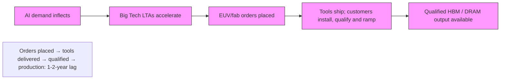

你是资深小红书内容策划 + 投研翻译官，擅长把英文/中文研报改写成高互动、可收藏、可转发的中文小红书笔记。

【目标】
- 把下面的研报解析内容，改写成一篇中文小红书笔记。
- 风格：投研博主风：信息密度高，但像给朋友讲逻辑
- 长度：不超过 1000 字，信息密度高但不要写长文。
- emoji 密度：中

【必须输出的结构】
1. 第一行：标题，20 字以内，不要像论文标题，也不要用夸张极限词。
2. 第二行：封面短标题，10 字以内，适合放在图中间。
3. 第三行：封面副标题，10-18 字，短句。
4. 正文分段清晰，每段不超过 3 行，可以用编号、小标题或加粗。
5. 正文要自然呈现观点，但不要暴露写作框架或思考过程。
6. 末尾可以保留 2-4 个相关标签，只允许从这些标签里选择：`#学习笔记`、`#研究笔记`、`#学习研究`、`#研报解读`。

【严禁输出】
- 不要出现这些栏目名或类似栏目名：`一句话结论`、`我最想提醒的一点`、`配图建议`、`免责声明`、`非投资建议`、`仅做学习交流`、`仅作学习交流`。
- 不要在正文最后追加配图建议，不要告诉我第 2/3/4 张图怎么配文。
- 不要输出任何包含“投资”的免责声明，也不要输出“非投资建议”这种表述。
- 不要输出财经敏感标签：`#投资学习`、`#财经`、`#金融`、`#股票`、`#基金`、`#理财`。
- 不要输出无关标签：`#小红书笔记`、`#笔记分享`、`#干货分享`。
- 不要写“关注”“点赞”“求关注”“评论区见”“评论区留言”等直接互动诱导；可以写“欢迎一起讨论”“可以继续交流”。

【平台发布合规要求】
- 不要写“爆款”“震惊”“必看”“必读”“最强”“最全”“唯一”“全网首发”等极限词或夸张词。
- 不要写“投资建议”“买入”“卖出”“强烈推荐”“稳赚”“保本”“必涨”“抄底”“上车”“内幕”“翻倍”等金融操作或收益承诺表达。
- “投资”相关词尽量改成“投研”“研究”“观察”“学习参考”；如果必须保留，也要放在中性语境里。
- 不要承诺收益，不要引导交易，不要暗示确定性结果。

【内容要求】
- 只能基于研报原文和解析结果推导，不要编造数据、公司动作、引用。
- 可以把专业表达翻成人话，但不能扭曲意思。
- 遇到不确定或缺失信息：用“研报未给出”或“这里是推测”明确标注。
- 默认避免出现具体投行品牌名，比如“GS”“GS”，统一写作“投行研报”。
- 不要解释你的思考过程，不要输出多余说明。

【推荐写法】
- 开头直接给一个自然判断，不要加“结论：”标签。
- 中间用 1/2/3 拆逻辑，但小标题要像正常内容标题，不要像写作模板。
- 结尾可以留下一个自然讨论问题，但不要引导关注、点赞或评论。
- 最后一行输出 2-4 个标签，优先：`#学习笔记 #研究笔记 #学习研究 #研报解读`。

【研报解析内容】
"""
# Global Technology

# Chipflation – Navigating A Memory Crisis

Surging memory prices and supply scarcity are becoming a cross-sector risk as AI reprices a critical input across the digital economy. What began as an AI infrastructure bottleneck is now spreading into hardware margins, device affordability, cloud costs, inflation and policy.

AI is turning memory into a structural bottleneck. AI demand is rising across HBM, DRAM and enterprise SSDs, pushing memory prices up six-fold in the past year. New supply takes years to build, qualify and ramp. That makes this cycle look less like a normal semiconductor upturn and more like a durable supply-demand reset.

Allocation is replacing commodity-market pricing. Hyperscalers and AI buyers are increasingly using long-term agreements (LTAs), prepayments and strategic commitments to secure capacity. That leaves a smaller, tighter and more volatile supply pool for traditional buyers.

HBM is crowding out conventional memory. HBM is essential for AI accelerators but consumes disproportionate advanced DRAM capacity. As suppliers prioritize HBM, server DRAM and enterprise SSDs, less supply remains for smartphones, PCs, autos, networking & industrial markets. Even as total DRAM wafer capacity expands \~30% by 2027, we see memory supply for smartphones/PCs falling 12-15% short.

Chipflation is spreading beyond Big Tech ... Large cloud buyers can secure supply and capitalize higher costs, while non-AI buyers face higher COGS and weaker allocation, price increases, spec cuts and delayed launches.

... and creates a clear divide between suppliers and OEMs. Memory producers benefit from stronger pricing, margins and visibility. Downstream hardware companies must absorb costs, pass them through, redesign products or risk demand destruction, especially in price-sensitive consumer markets.

The macro impact is bigger than CPI alone. Headline CPI effects may be modest given small basket weights, but pressure is visible in PPI, corporate margins, cloud bills, capex budgets and delayed technology deployment.

Policy could ease pressure, but would take years. Even if the US and China deploy tools such as subsidies, tax credits or permitting reform, supply responses will take years and near-term China capacity growth is insufficient. We assume US policy stays restrictive and is unlikely to ease pressures in the near or long term.

Stock implications. Pricing power sits with DRAM suppliers (Samsung, SK hynix, Micron), NAND (SanDisk, KIOXIA), HDD (Seagate, Western Digital) infrastructure (ASML, AMAT, KLA). OEMs over-indexed to the consumer, with less pricing power and elevated memory cost exposure face the sharpest margin headwinds.

MS & CO. INTERNATIONAL PLC+

# Shawn Kim

Equity Analyst

Shawn.Kim@morganstanley.com +44 20 7677-1018

MS & CO. LLC

# Joseph Moore

Equity Analyst

Joseph.Moore@morganstanley.com +1 212 761-7516

# Erik W Woodring

Equity Analyst

Erik.Woodring@morganstanley.com +1 212 296-8083

# Diego Anzoategui

Economist

Diego.Anzoategui@morganstanley.com +1 212 761-8573

MS & CO. INTERNATIONAL PLC (DIFC BRANCH)+

# Rajeev Sibal

Senior Global Economist

Rajeev.Sibal@morganstanley.com +971 4 709-7201

MS & CO. LLC

# Ariana Salvatore

Equity Strategist

Ariana.Salvatore@morganstanley.com

MS & CO. INTERNATIONAL PLC+

# Lee Simpson

Equity Analyst

Lee.Simpson@morganstanley.com +44 20 7425-3378

# Cindy Huang

Equity Analyst

Cindy.Huang@morganstanley.com +44 20 7425-2915

MS ASIA LIMITED+

# Duan Liu

Equity Analyst

Duan.Liu@morganstanley.com +852 2239-7357

MS & CO. LLC

# Mason Wayne

Research Associate

Mason.Wayne@morganstanley.com +1 212 761-6012

# Shane Brett

Equity Analyst

Shane.Brett@morganstanley.com +1 212 761-1022

# Maya C Neuman

Research Associate

Maya.Neuman@morganstanley.com +1 212 761-1946

# Dylan Liu

Research Associate

Dylan.Liu@morganstanley.com +1 212 761-4519

MS does and seeks to do business with companies covered in MS. As a result, investors should be aware that the firm may have a conflict of interest that could affect the objectivity of MS. Investors should consider MS as only a single factor in making their investment decision.

# For analyst certification and other important disclosures, refer to the Disclosure Section, located at the end of this report.

+= Analysts employed by non-U.S. affiliates are not registered with FINRA, may not be associated persons of the member and may not be subject to FINRA restrictions on communications with a subject company, public appearances and trading securities held by a research analyst account.

# Chipflation – The Story in Numbers

Server share of DRAM demand rises

Enterprise SSDs Jump from

SUPPLY IS CONCENTRATED AND SHIFTING

3 firms control \~90% of DRAM output worldwide

SAMSUNG

micron

China's share of industry capacity rises from 18% to >23% by 2028E, representing \~30% of net wafer additions – second only to South Korea

  
HBM USAGE SURGES ACROSS HIERARCHY LEVELS

AI Chip

7x Surge in HBM usage

AI System

65x Surge in HBM usage

AI Cluster

1800x Surge in HBM usage

HBM & AI CROWD OUT CONVENTIONAL MEMORY   

HBM SHARE OF LEADING-EDGE WAFERS

HBM rises from \~6% of leading-edge memory wafers in 2023 to \~34% by 2028E

INCREASING AI PRIORITIZATION

leads to \~15% PC DRAM shortfall and \~12% smartphone DRAM shortfall in 2027, equivalent to \~58mn PCs and \~134mn smartphones

  
PRICING IMPACT

Electronics component

PPI +30% y/y

Direct US CPI

exposure $< 1\%$

Incremental global memory market equivalent to \~45%

of traditional hardware revenue

# What is "Chipflation"?

The shift from historical, deflationary pricing for commoditized microelectronics toward sustained, structural price increases poses a continuous upside risk to overall consumer goods pricing. For memory, inflation is no longer just a component-price issue.

AI infrastructure is absorbing a growing share of memory (DRAM, HBM and enterprise SSD) supply, while suppliers prioritize higher-margin AI/server products over mainstream consumer and industrial demand. The potential impacts of higher memory prices include:

- constrained supply and increases in consumer hardware prices   
- a squeeze in corporate profit margins   
- a division in the hardware industry between the 'have' and 'have not'   
• persistent upside risks to core inflation

Chipflation is demand-driven by the rapid rollout of AI infrastructure and datacenters, where tighter memory availability is feeding into higher device ASPs, higher cloud and enterprise IT costs, lower product specifications, delayed refresh cycles and margin pressure.

Memory shortages have become a macroeconomic concern. The direct CPI impact may be limited, but the effects are increasingly showing up in corporate COGS, cloud bills, capex budgets and delayed technology deployment – making this cycle broader than a traditional semiconductor upcycle. Insufficient chip supply can delay data center projects, slow cloud development and increase costs for businesses, ultimately affecting productivity growth.

# Differentiated datasets

This report updates a range of proprietary MS models and introduces several new datasets.

- Two-tier DRAM supply waterfall (Exhibit 7). Our framework decomposes total DRAM supply down to the residual pool available to non-Al buyers. We estimate PCs could face a 15% memory shortfall (\~58mn units) and smartphones a 12% gap (\~134mn units) as AI crowds out non-server allocation.   
- Demand elasticity by hardware product (Exhibit 8). We rank which end markets are most exposed to demand destruction from higher memory prices, from traditional servers (least elastic) to low-end PCs (most elastic).   
- CPI impact of higher memory costs (Exhibit 11). Higher memory costs carry a measurable CPI pass-through: PCs and smartphones add 0.08pp to headline CPI, with total consumer electronics impact reaching 0.10pp.

# Table of Contents

<table><tr><td>Section</td><td>Page Number</td></tr><tr><td>Executive Summary</td><td>5</td></tr><tr><td>Memory – A Multi-Year Bottleneck</td><td>14</td></tr><tr><td>HBM Cannibalization and the Two-Tier Market</td><td>20</td></tr><tr><td>Chipflation Passthrough and Sector Impact</td><td>26</td></tr><tr><td>Chips, Growth and Inflation – A Macro Perspective</td><td>37</td></tr><tr><td>US/China Policy Options Don’t Offer Near-term Relief</td><td>40</td></tr><tr><td>Primer: Memory 101 – Types, Market Structure and the Cycle</td><td>47</td></tr><tr><td>Appendix: Memory Demand per Gigawatt of AI Data Center Deployment</td><td>53</td></tr></table>

# Executive Summary

# Tech Diffusion

# A MS Key Theme of 2026

# A multi-year memory bottleneck

Memory chips are emerging as a critical input in the global AI ecosystem, underpinning the expansion of today's agentic AI architectures (Technology: Rise of the AI Agent – Global Implications, 19 Apr 2026). We believe that rising memory prices are rationally anticipating an AI-led price-inelastic leap in memory demand. This pricing strength is less a function of conventional supply discipline by producers, and more a reflection of the exponential growth in end-demand – evidenced in the annual capital expenditure commitments from hyperscalers eager not to be left behind in the race for superintelligence.

Rising memory prices create an increasingly challenging cost-push dynamic, where server build costs rise, cloud capex increases and hardware prices inflate. For non-hyperscaler corporates, this inflationary pressure could require choices on whether to pass on price increases, reduce device specifications, or accept reduced profits.

# Structural bottleneck

Prices for memory have risen more than 6-fold over the last year (Exhibit 1) – a sharp discontinuity from the multi-decade price declines. The price of a gigabyte of DRAM fell by around a factor of ten every 5 years from 1957 to 2020. Since 2010, the price has fallen more slowly as Moore's Law drove sustained price declines. However, this trend no longer applies in the AI economy, which has driven DRAM ASPs sharply higher (Exhibit 2). Building memory fabrication (fabs) plants takes years, so there is no quick response to address demand. This means sustained upside risks to consumer goods prices in the coming years.

Exhibit 1: DRAM prices YoY   

line

| Date    | DRAM Contract YoY (RHS) |
|---------|--------------------------|
| Jan-16  | -100%                    |
| May-16  | -50%                     |
| Sep-16  | 0%                       |
| Jan-17  | 100%                     |
| May-17  | 150%                     |
| Sep-17  | 100%                     |
| Jan-18  | 50%                      |
| May-18  | 0%                       |
| Sep-18  | -50%                     |
| Jan-19  | -100%                    |
| May-19  | -150%                    |
| Sep-19  | -100%                    |
| Jan-20  | -50%                     |
| May-20  | 0%                       |
| Sep-20  | 50%                      |
| Jan-21  | 0%                       |
| May-21  | 50%                      |
| Sep-21  | 0%                       |
| Jan-22  | -50%                     |
| May-22  | -100%                    |
| Sep-22  | -50%                     |
| Jan-23  | -100%                    |
| May-23  | -50%                     |
| Sep-23  | -100%                    |
| Jan-24  | 0%                       |
| May-24  | 50%                      |
| Sep-24  | 0%                       |
| Jan-25  | -50%                     |
| May-25  | -100%                    |
| Sep-25  | -50%                     |
| Jan-26  | 400%                     |
| May-26  | 650%                     |
| Sep-26  | 700%                     |

Source: TrendForce, MS

Exhibit 2: Long-term DRAM price/Gb   

line

| Year | Blended DRAM ASP |
|------|-------------------|
| 01   | ~100.0            |
| 02   | ~50.0             |
| 03   | ~30.0             |
| 04   | ~25.0             |
| 05   | ~20.0             |
| 06   | ~15.0             |
| 07   | ~10.0             |
| 08   | ~5.0              |
| 09   | ~3.0              |
| 10   | ~2.5              |
| 11   | ~2.0              |
| 12   | ~1.5              |
| 13   | ~1.2              |
| 14   | ~1.0              |
| 15   | ~0.8              |
| 16   | ~0.7              |
| 17   | ~0.6              |
| 18   | ~0.5              |
| 19   | ~0.4              |
| 20   | ~0.3              |
| 21   | ~0.2              |
| 22   | ~0.15             |
| 23   | ~0.1              |
| 24   | ~0.15             |
| 25   | ~0.2              |
| 26   | ~0.3              |

Source: WSTS

Exhibit 3: Memory supply relief depends on install, qualification, yield ramp and product allocation – a \~2 year process   
From Tool Capacity to Qualified Memory Output   
ASML capacity is expanding; memory relief depends on install, qualification, yield ramp and product allocation   

flowchart

Source: MS

What's different this time? Previous chip shortages during COVID demonstrated how even minor supply disruptions can halt entire industries. However, this memory chip shortage looks more structural, and AI-related demand could amplify such effects on a much larger scale.

- Mobile AI agents and physical AI agents – another very large additional surge in demand for memory chips is likely as these are rolled out. As AI increasingly moves beyond data centers into edge devices and the physical world, the computational requirement for AI is set to grow exponentially. These components would no longer be seen as commodity memory chips but as critical pillars of the global digital infrastructure.   
- Long-Term Agreements (LTAs) are now absolute necessities to secure capacity given long lead times and the persistence of the supply-demand mismatch. Memory producers are establishing strategic supply chain partnerships with all hyperscale customers via LTAs, through which memory producers are able to lock in long-term orders and prices, establish a stable high-margin model, and mitigate the industry's cyclical volatility.

Exhibit 4: We expect hyperscaler capex to surpass US\$1tr in 2027 and an aggregate \~US\$2tr invested since 2024   

bar_stacked

| Year | AMZN ($bn) | MSFT ($bn) | GOOGL ($bn) | META ($bn) | Total ($bn) | Y/Y Growth (%) |
| :--- | :--- | :--- | :--- | :--- | :--- | :--- |
| 2024 | 83 | 76 | 53 | 39 | 250 | 62 |
| 2025 | 132 | 118 | 91 | 72 | 413 | 65 |
| 2026 | 212 | 190 | 190 | 145 | 737 | 78 |
| 2027 | 268 | 276 | 299 | 174 | 1,018 | 38 |

Source: Company data, MS estimates

Exhibit 5: The 2026 consensus cloud capex forecast increased to +75% Y/Y post results from 64% previously   
 Order 2005 (as amended, the "Order"); (ii) are persons who are high net worth entities falling within Article 49(2)(a) to (d) of the Order; or (iii) are persons to whom an invitation or inducement to engage in investment activity (within the meaning of section 21 of the Financial Services and Markets Act 2000, as amended) may otherwise lawfully be communicated or caused to be communicated. RMB MS Proprietary Limited is a member of the JSE Limited and A2X (Pty) Ltd. RMB MS Proprietary Limited is a joint venture owned equally by MS International Holdings Inc. and RMB Investment Advisory (Proprietary) Limited, which is wholly owned by FirstRand Limited. The information in MS is being disseminated by MS Saudi Arabia, regulated by the Capital Market Authority in the Kingdom of Saudi Arabia, and is directed at Sophisticated investors only.

MS Hong Kong Securities Limited is the liquidity provider/market maker for securities of ASM International NV, FIT Hon Teng Ltd, Hon Hai Precision listed on the Stock Exchange of Hong Kong Limited. An updated list can be found on HKEx website: http://www.hkex.com.hk.

The information in MS is being communicated by MS & Co. International plc (DIFC Branch), regulated by the Dubai Financial Services Authority (the DFSA) or by MS & Co. International plc (ADGM Branch), regulated by the Financial Services Regulatory Authority Abu Dhabi (the FSRA), and is directed at Professional Clients only, as defined by the DFSA or the FSRA, respectively. The financial products or financial services to which this research relates will only be made available to a customer who we are satisfied meets the regulatory criteria of a Professional Client. A distribution of the different MS Research ratings or recommendations, in percentage terms for Investments in each sector covered, is available upon request from your sales representative.

The information in MS is being communicated by MS & Co. International plc (QFC Branch), regulated by the Qatar Financial Centre Regulatory Authority (the QFCRA), and is directed at business customers and market counterparties only and is not intended for Retail Customers as defined by the QFCRA.

As required by the Capital Markets Board of Turkey, investment information, comments and recommendations stated here, are not within the scope of investment advisory activity. Investment advisory service is provided exclusively to persons based on their risk and income preferences by the authorized firms. Comments and recommendations stated here are general in nature. These opinions may not fit to your financial status, risk and return preferences. For this reason, to make an investment decision by relying solely to this information stated here may not bring about outcomes that fit your expectations.

The following companies do business in countries which are generally subject to comprehensive sanctions programs administered or enforced by the U.S. Department of the Treasury's Office of Foreign Assets Control ("OFAC") and by other countries and multi-national bodies: Samsung Electronics.

The trademarks and service marks contained in MS are the property of their respective owners. Third-party data providers make no warranties or representations relating to the accuracy, completeness, or timeliness of the data they provide and shall not have liability for any damages relating to such data. The Global Industry Classification Standard (GICS) was developed by and is the exclusive property of MSCI and S&P.

MS, or any portion thereof may not be reprinted, sold or redistributed without the written consent of MS.

Indicators and trackers referenced in MS may not be used as, or treated as, a benchmark under Regulation EU 2016/1011, or any other similar framework.

The issuers and/or fixed income products recommended or discussed in certain fixed income research reports may not be continuously followed. Accordingly, investors should regard those fixed income research reports as providing stand-alone analysis and should not expect continuing analysis or additional reports relating to such issuers and/or individual fixed income products.

MS may hold, from time to time, material financial and commercial interests regarding the company subject to the Research report.

Registration granted by SEBI and certification from the National Institute of Securities Markets (NISM) in no way guarantee performance of the intermediary or provide any assurance of returns to investors. Investment in securities market are subject to market risks. Read all the related documents carefully before investing.

The following authors are neither Equity Research Analysts/Strategists nor Fixed Income Research Analysts/Strategists and are not opining on or expressing recommendations on equity or fixed income securities: Rajeev Sibal; Diego Anzoategui.

The following authors are Fixed Income Research Analysts/Strategists and are not opining on or expressing recommendations on equity securities: Ariana Salvatore.

© 2026 MS
"""
