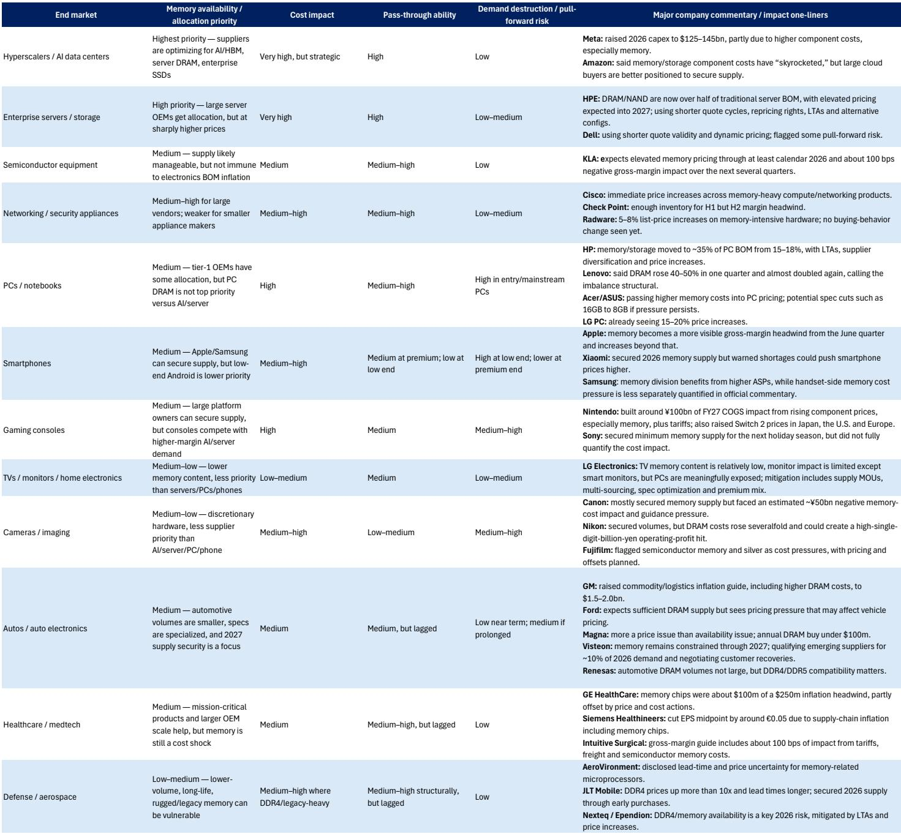
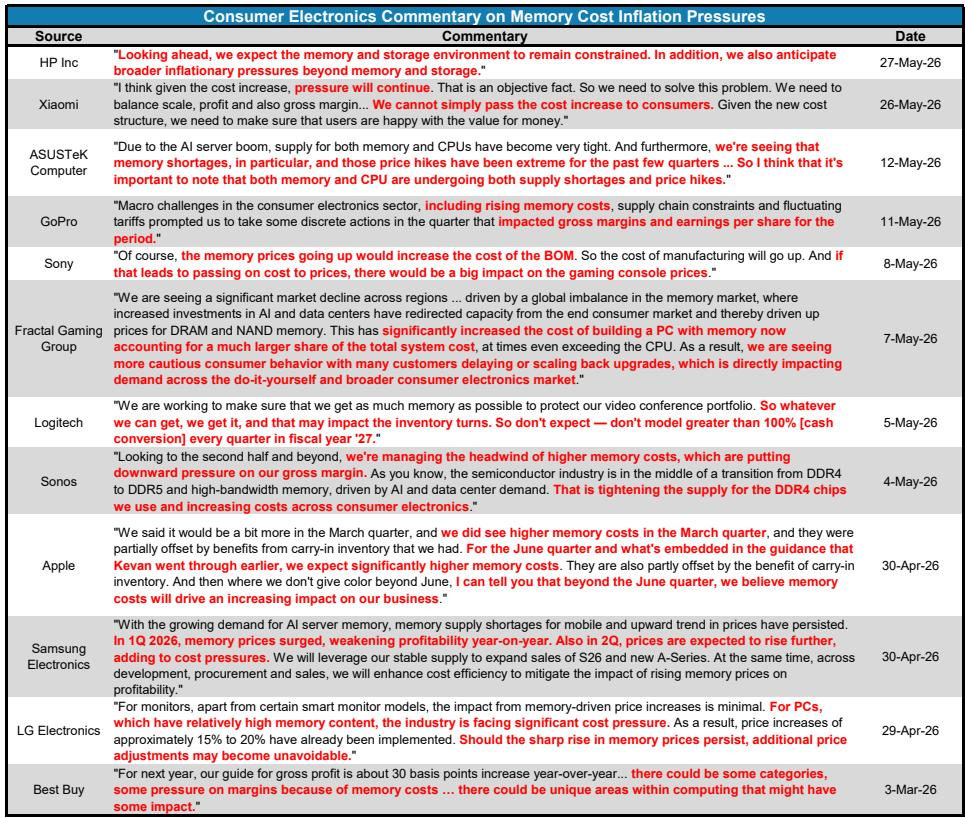
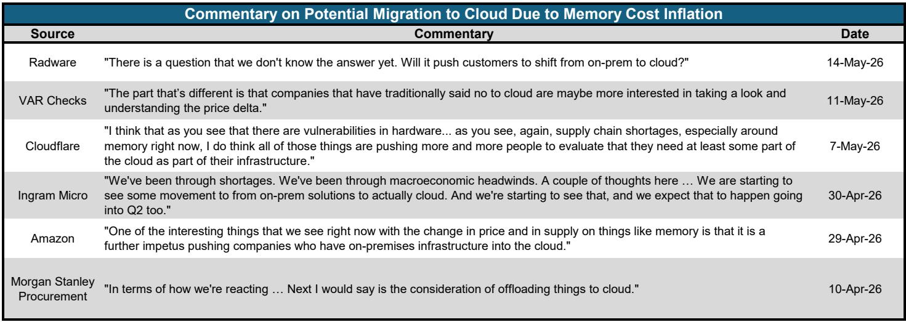

# 市场正在低估“芯片通胀”的扩散半径：从AI算力成本到全球消费品定价

过去十二个月，DRAM价格累计上涨超过六倍。如果只看这个数字，很容易将其归入“半导体周期正常波动”的叙事框架。但一份来自某外资投行研究团队的最新报告提出了一个更具结构性的判断：我们正在经历的，不是一次普通的存储器上行周期，而是一场由AI需求驱动的、跨行业、跨地域的“芯片通胀”开端。

这份报告的标题直指核心——Chipflation。它试图回答一个正在从产业界蔓延到宏观政策圈的问题：当存储器从“大宗商品”变成“战略资产”，其价格重估的冲击波，究竟会传导多远？

我们仔细研读了这份长达数十页的报告，以下是我们提炼出的核心洞察与尚未被市场充分定价的关键变量。

## 1. 存储器不再是周期品，而是AI时代的“新石油”

报告最核心的论点在于，本轮存储器价格上涨的驱动力，与传统半导体周期有本质区别。过去的涨价往往源于供给端的短期收缩或下游的补库存行为，价格会在需求正常化后迅速回落。但这一次，需求端的结构性变化是主导因素。

AI基础设施的建设，正在以前所未有的速度吞噬存储器产能。以HBM（高带宽存储器）为例，它是AI加速器的核心组件，但其制造过程极度消耗先进DRAM晶圆产能。报告提供的数据显示，到2028年，HBM将占据领先级存储器晶圆产能的约34%，而2023年这一比例仅为6%。这不仅是量的增长，更是质的挤出——当供应商优先将产能分配给利润更高、需求更确定的AI产品时，留给智能手机、PC、汽车、工业等传统市场的存储器供给，将出现系统性缺口。

报告通过一个“两级DRAM供给瀑布模型”量化了这一缺口：到2027年，PC市场将面临约15%的存储器短缺，智能手机市场短缺约12%，分别对应约5800万台PC和1.34亿部智能手机的潜在需求无法被满足。这不是一个预测性的警告，而是一个基于当前产能分配逻辑和建设周期的推演结果。

这意味着什么？存储器已经从一个“可替代的零部件”，变成了AI时代的“新石油”——它的价格、可获得性和分配优先级，将直接决定从云端算力到终端设备的成本结构。

## 2. “分配”取代“定价”，市场规则正在被重写

报告揭示了一个正在发生的、但市场可能尚未充分定价的变化：存储器市场的交易机制，正在从“公开市场定价”转向“战略分配”。

报告提出的“买方层级”框架清晰地展示了这一权力格局的转移。位于顶层的超大规模云厂商和AI加速器生态，通过长期协议（LTA）、预付款和战略承诺，锁定了最优先的供给。它们可以确保HBM、服务器DRAM和企业级SSD的供应。第二梯队是服务器OEM和云基础设施公司，它们依赖战略合同获得相对稳定的供给。而第三、第四、第五梯队——从高端PC和手机厂商，到汽车、工业、医疗，再到中小OEM和初创公司——则面临越来越不确定的供给和更高的价格波动。

这种“分配经济”的出现，意味着传统的“供需决定价格”模型正在失效。对于非AI领域的买家，他们面对的不是一个可以随时按需采购的市场，而是一个需要排队、竞价、甚至接受降级规格的“配给制”环境。报告指出，这种变化使得剩余供给池变得更小、更紧张、波动性更大。

这对于下游硬件厂商而言，是一个根本性的成本函数变化。它们不再能简单地通过“涨价”来转嫁成本，因为价格的弹性在消费者端是有限的。更可能的后果是：产品规格下降、升级周期延长、或者利润率被大幅压缩。

## 3. 芯片通胀正在从“Big Tech”向“Everywhere”蔓延

报告最引人深思的部分，是对“芯片通胀”传导路径的分析。它指出，这种价格上涨的影响，远不止于CPI中的电子元器件分项。

在直接层面，存储器涨价已经反映在电子元器件PPI上，同比上涨约30%。对于大型云厂商，它们可以通过长期协议锁定成本，并将增加的成本通过云服务价格转嫁给企业客户。但对于非AI领域的买家——比如一家需要采购服务器来运行ERP系统的中型企业，或者一家依赖存储器来制造工业机器人的公司——它们面临的是更高的成本、更差的供给保障，以及可能被迫推迟的技术部署。

报告的宏观分析部分指出，虽然存储器在CPI篮子中的权重很小，直接拉动作用有限，但其间接影响不容忽视。它体现在企业利润表的COGS项中，体现在云计算账单的上涨中，体现在企业资本支出预算的重新分配中，最终可能体现在延迟的技术部署和更慢的生产率增长上。这不是一个“通胀是否会发生”的问题，而是一个“通胀将以何种形式被吸收”的问题——是消费者买单、企业消化，还是通过产品降级和需求破坏来出清。

## 4. 供给侧的回应需要时间，政策工具“远水难解近渴”

市场或许会期待供给端的快速扩张来平抑价格。但报告清晰地展示了从“下单”到“产出”的时间线：从AI需求爆发、到签订长期协议、到订购EUV光刻机、到设备交付安装、到客户认证、到良率爬坡、再到合格产品产出——整个过程需要1到2年甚至更长的时间。

更关键的是，即使产能最终落地，其分配方向也大概率会优先满足AI需求。报告提到，即使到2027年全球DRAM晶圆总产能扩张约30%，智能手机和PC的存储器供给仍将出现短缺。这意味着，非AI领域的“芯片通胀”，可能是一个持续数年的结构性现象。

政策层面，无论是美国的补贴和税收优惠，还是中国的产能扩张，都无法在短期内改变这一格局。报告假设美国政策保持限制性，而中国产能的增长虽然显著（到2028年占全球净新增晶圆产能约30%），但短期内不足以缓解全球性的供需错配。政策工具更像是“慢变量”，无法对冲“快变量”驱动的价格冲击。

## 5. 一个尚未被充分回答的关键问题：需求破坏的阈值在哪里？

报告在分析各终端市场的需求弹性时，提供了一个非常有价值的框架。它按“需求弹性”对硬件产品进行了排序：传统服务器需求弹性最低（因为企业必须部署），而低端PC需求弹性最高（消费者可以推迟购买或选择不买）。

但报告没有完全回答的一个关键问题是：当存储器价格持续上涨到何种程度时，会触发大规模的需求破坏？或者说，非AI领域的买家愿意为“获得存储器”支付多高的溢价？这个“阈值”的确定，将直接影响存储器价格的顶部在哪里，以及下游产业利润压缩的深度。

另一个未解的问题是：AI领域的需求是否也存在弹性？如果超大规模云厂商的资本支出增速放缓，或者AI应用的经济回报不如预期，那么当前的“分配优先权”是否会发生逆转？报告对此没有给出明确的假设，这可能是读者在阅读完整报告时需要重点关注的逻辑推演部分。

## 6. 投资者的观察框架：谁是“赢家”，谁是“输家”

基于上述分析，报告的股票含义相对清晰：定价权集中在存储器供应商手中。DRAM领域的三星、SK海力士、美光，NAND领域的西部数据/闪迪、铠侠，以及上游设备供应商如ASML、应用材料、科磊，都是本轮“芯片通胀”的直接受益者。它们拥有更强的定价能力、更高的利润率和更好的业绩可见性。

而下游的硬件公司，尤其是那些高度依赖消费市场、定价权较弱、存储器成本占比较高的OEM，将面临最直接的利润率压力。报告特别指出，在价格敏感型消费市场，企业可能面临“涨价则丢失份额，不涨价则吞噬利润”的两难困境。

对于投资者而言，关键问题不再是“存储器价格是否还会涨”，而是“这种价格重估的持续性和扩散效应，是否已经被当前股价充分反映”。我们认为，市场可能低估了“芯片通胀”从AI领域向更广泛经济领域传导的幅度和速度。

---

这份报告还包含了许多我们未能在此展开的精彩细节，例如对“移动AI代理”和“物理AI代理”可能带来的额外存储器需求冲击的推演，以及对中国产能扩张对美国政策影响的深度情景分析。这些内容对于理解“芯片通胀”的完整图景至关重要。

如果你对以下问题感兴趣，欢迎来我们的星球和微信群里继续讨论：

- “两级供给模型”的完整构建逻辑和敏感性分析
- 各终端市场需求弹性的详细量化排名
- 存储器价格在不同宏观情景下的路径推演
- 哪些下游硬件公司可能面临“估值+盈利”的双杀
- 政策干预的几种可能路径及其对产业格局的影响

这些内容，我们将在社群中结合完整报告的原始图表和数据，做进一步的深度解读。

Personal reading notes and learning share only. Not investment advice.

