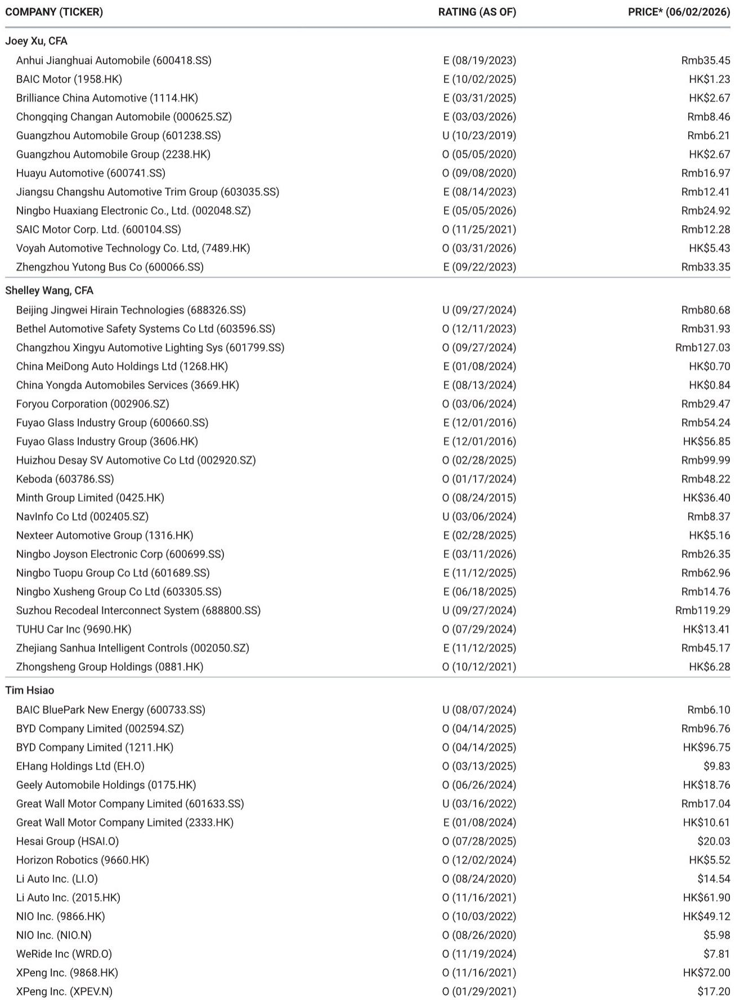
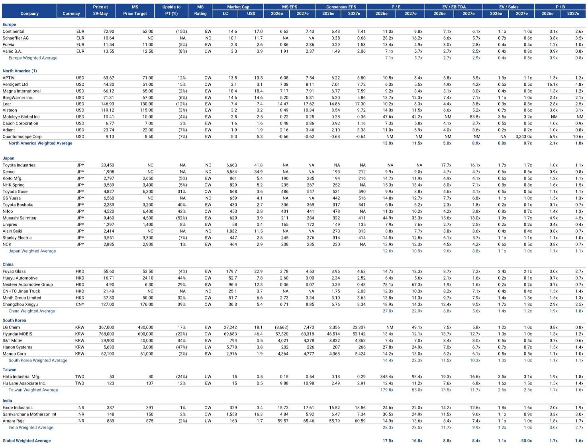
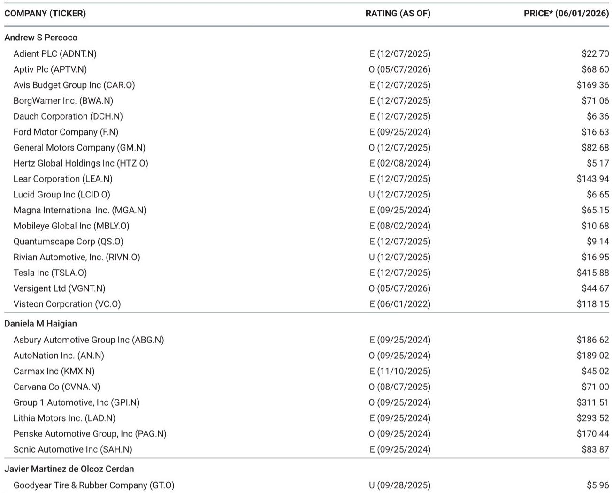

# Execution, Not Demand, Will Separate Winners from Losers in the Current Auto Cycle

The global auto industry is entering a phase where the macroeconomic tailwind has faded, and the difference between outperformance and underperformance will come down to operational discipline, not market growth. April 2026 global sales data tells a clear story: total tracked volumes rose just 1.4% year-over-year, with the United States declining 5.5% and China falling 4.3%. This is not a demand-driven cycle. It is an execution-driven cycle. The companies that will generate excess returns over the next twelve months are those that can control costs, manage inventory, and execute product launches in an environment where the macro environment offers no assistance. The report from a global investment bank's auto research team makes this tension explicit: the market is mixed, the premium segment is losing share to mass market, and the key catalysts are company-specific—Tesla's autonomy progress, CarMax's strategic pivot, Stellantis' turnaround, and Ferrari's first electric vehicle.

The strategic question for investors is not whether global auto demand will recover. It is whether individual companies have the operational capacity to outperform despite a flat-to-declining top line. This article will argue that the current environment favors three types of auto companies: those with a clear technology differentiation that can drive pricing power, those with cost structures flexible enough to absorb input inflation, and those with management teams that have demonstrated the ability to execute on stated targets. The report's data supports this framework, but it also leaves critical questions unanswered—particularly around the durability of the premium segment decline and the true scalability of autonomous vehicle operations.

## The Global Demand Picture is Stagnant, But the Composition Shift is More Important Than the Aggregate

The headline numbers from April 2026 global auto sales are not alarming, but they are revealing. Global main markets sold 5.9 million vehicles, up just 0.7% year-over-year. The United States SAAR dropped to 16.1 million, down 6.9% from the prior year. China's SAAR fell 2.6% to 33.1 million. Europe, buoyed by a strong UK performance up 24%, grew 7% overall, but the seasonally adjusted annualized rate declined 8.1%, suggesting the monthly strength may be transitory. The only bright spots are emerging markets: Brazil grew 20.5%, India 24.6%, and Indonesia an extraordinary 55%. These numbers confirm that the global auto cycle is bifurcated. Developed markets are saturated or declining, while developing markets are still in a structural growth phase.

The more consequential pattern, however, is the composition shift within the developed markets. Premium vehicle sales fell 2.3% year-over-year in April, while mass market sales rose 1.3%. This is the second consecutive month where premium underperformed mass market, and it represents a reversal of the trend that dominated the post-pandemic period. During the supply-constrained years of 2021 through 2023, premium automakers benefited from affluent consumers willing to pay above MSRP for scarce inventory. That dynamic is now unwinding. Mass market brands are recovering production volumes, inventory is normalizing, and consumers are trading down. The implication is stark: companies like BMW, Mercedes-Benz, and Porsche, which saw their market share and margins expand during the shortage, are now facing a structural headwind. BMW sales fell 5.1% in April, Mercedes dropped 4.2%, and Porsche declined 16.8%. The premium share of total main market sales has contracted 40 basis points year-over-year.

This shift matters because it changes the earnings calculus for the entire industry. Premium automakers generate disproportionate profits per vehicle. When their volume declines, the impact on operating income is magnified. Conversely, mass market players like Suzuki, which grew 21.5% in April, and Kia, which grew 3.6%, are gaining share and volume in a flat market. The strategic takeaway is that the industry's profit pool is redistributing away from luxury and toward volume players that can execute on cost and scale. Investors who continue to price premium automakers at historical multiples are assuming a demand recovery that the data does not yet support.

## Tesla's Autonomy Progress is a Rate-of-Change Story That Demands a New Evaluation Framework

The most structurally significant development in the report is not about sales volumes at all. It is about the progress of Tesla's autonomous driving program. The report references a dedicated tracker that normalizes NHTSA safety data from the Austin robotaxi fleet, and it describes the trajectory as one where safety is showing signs of improvement, FSD usage is scaling, and the robotaxi fleet is ramping. This is a rate-of-change story, not a level story. The absolute number of robotaxi miles or FSD subscribers today is less important than the direction and velocity of improvement.

For investors, this requires a fundamental shift in how they evaluate Tesla. The traditional auto valuation framework—based on vehicle volume, average selling price, and operating margin—is increasingly inadequate. Tesla's equity value is now partially a reflection of its autonomous technology option. If the safety data continues to improve and regulatory approval expands, the addressable market for Tesla shifts from the global auto market to the global mobility market, which is an order of magnitude larger. The report's framing of autonomy as a "rate-of-change story" is the correct analytical lens. The question is not whether Tesla's robotaxi service is profitable today. It is whether the rate of improvement in safety metrics and operational scale is sufficient to justify the embedded optionality in the stock price.

The report does not answer this question definitively, and it leaves several critical unknowns. First, what is the accident rate per million miles for the Austin fleet relative to human drivers? Second, what is the cost per mile of operating the robotaxi fleet, and how quickly is that cost declining? Third, what is the timeline for expanding beyond Austin to other cities? These are the variables that will determine whether the autonomy thesis is real or overhyped. The report provides a tracker and a framework, but the data is still early. For serious investors, the appropriate response is to monitor the rate-of-change metrics closely and to build scenario models that account for different autonomy adoption curves.

## The Winner's Circle Will Be Defined by Execution, With CarMax and Stellantis as Key Case Studies

The report highlights two companies that perfectly illustrate the execution-dependent nature of the current cycle: CarMax and Stellantis. Both face significant operational challenges, but the nature of those challenges is different, and the market's reaction will depend entirely on whether management can deliver on its stated plans.

CarMax is in a "holding pattern," according to the report, as it works to return to unit growth by lowering GPU and managing opex while investing in digital experience and brand awareness. The report maintains an Equal-weight rating with a $35 price target and notes a negative risk-reward skew. This is a company that is caught between two forces: the need to invest in digital capabilities to compete with Carvana and other online players, and the need to protect margins in a used car market where inventory costs are unpredictable. The strategic question is whether CarMax can execute a dual transformation—cutting costs to fund digital investment—without destroying its core competitive advantage in physical retail. The report is cautious, and rightly so. The used car market is structurally changing, and CarMax's traditional model of large physical lots and no-haggle pricing is being challenged by more agile online competitors. The company's "early summer" strategic update will be a critical catalyst.

Stellantis presents a different execution challenge. The report describes the company's recent Capital Markets Day as delivering "clear turnaround messages" addressing product, brands, cost, capacity utilization, investments, and margin. The targets are ambitious, and the report explicitly states that "the market is not going to help." Stellantis is attempting to restructure its European operations, rationalize its brand portfolio, and invest in electrification, all while facing flat-to-declining demand in its core markets. The risk is that the turnaround plan is too ambitious for the current macro environment. If Stellantis misses its margin targets by even a few hundred basis points, the market reaction could be severe. The report's focus on execution is the correct lens. Stellantis has a credible plan on paper. The question is whether management has the operational discipline to deliver it.

These two case studies reinforce the central thesis of the report: in a stagnant demand environment, execution is the only variable that matters. Companies that can control costs, manage inventory, and hit their guidance will be rewarded. Companies that miss, even by small amounts, will be punished disproportionately.

## What the Report Does Not Fully Answer: The Durability of the Premium Decline and the Scalability of Autonomy

For all its analytical depth, the report leaves two critical questions unresolved. First, is the decline in premium auto sales a cyclical shift or a structural one? The data shows that premium share is contracting, but the reasons are unclear. It could be that affluent consumers are deferring purchases due to macroeconomic uncertainty, in which case demand would recover when confidence returns. Alternatively, it could be that the premium segment is facing a structural headwind from the proliferation of high-quality mass market vehicles, particularly from Chinese OEMs like BYD and Geely. If the latter is true, then premium automakers will need to fundamentally rethink their pricing and product strategies. The report does not take a definitive stance, and investors should be cautious about assuming a cyclical recovery.

Second, the report does not provide a clear framework for valuing Tesla's autonomy optionality. The safety data tracker is useful, but it does not translate into a discounted cash flow model or a probability-weighted valuation. How many robotaxi miles are priced into Tesla's current stock price? What accident rate would cause the thesis to break? These are the questions that serious investors need to answer for themselves, and the report provides the raw data but not the analytical conclusion.

## A Decision Framework for Investors Navigating the Execution-Driven Cycle

Given the analysis above, investors should adopt a three-factor framework for evaluating auto companies over the next twelve months. First, assess technology differentiation. Companies with proprietary technology that drives pricing power or cost advantage—such as Tesla's autonomy stack or BYD's vertical integration—have a structural edge that protects margins even in a flat demand environment. Second, evaluate cost flexibility. Companies with high fixed costs and limited ability to adjust production quickly, such as traditional OEMs with large unionized workforces, are at greater risk in a downturn. Companies with variable cost structures and flexible supply chains, like many of the suppliers highlighted in the report, are better positioned. Third, verify management credibility. The report's focus on execution is not generic advice; it is a specific call to examine whether management teams have a track record of delivering on stated targets. Stellantis and CarMax are test cases. If they execute, the market will reward them. If they miss, the downside could be significant.

The report's global picks—General Motors, Carvana, Mercedes-Benz Group, Daimler Truck Holding, and Suzuki Motor—are consistent with this framework. GM and Carvana represent technology and business model differentiation. Mercedes-Benz and Daimler Truck offer premium and commercial vehicle exposure with restructuring optionality. Suzuki benefits from strong emerging market demand and a low-cost manufacturing base. The common thread is that each of these companies has a clear operational thesis that is within management's control, rather than dependent on a macro recovery.

## Join the Community to Read the Full Report and Review the Original Charts

The analysis above is based on the data and insights from a comprehensive global auto monitor published by a leading investment bank's research team. The full report includes detailed sales tables by country and OEM, individual company analyses, and proprietary trackers for Tesla autonomy and supplier performance. To access the complete dataset and the original charts that support this strategic framework, join the community. The unanswered questions around premium segment durability and autonomy scalability are explored in greater depth in the full report, along with specific price targets and risk assessments for each covered company.

*This article is for learning and discussion only and does not constitute investment advice.*

Personal reading notes and learning share only. Not investment advice.

