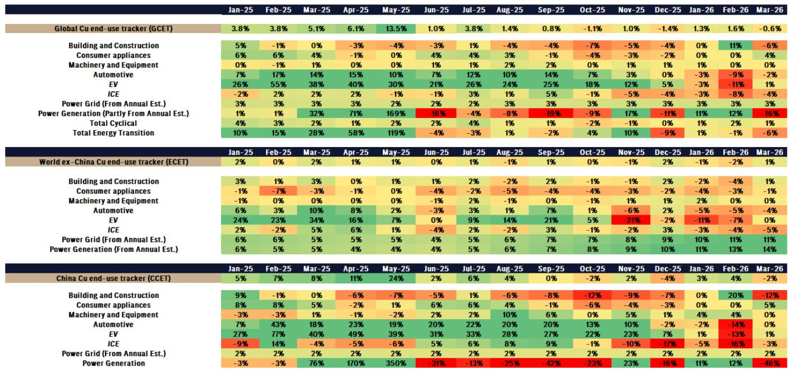
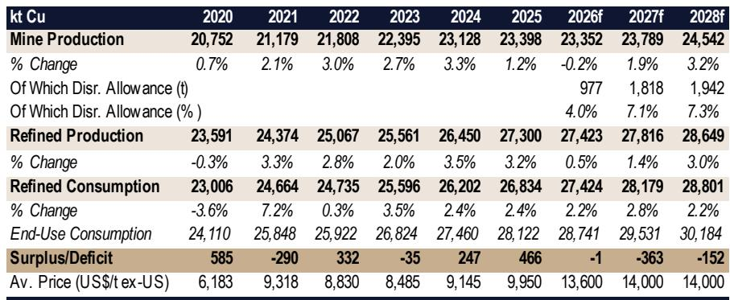
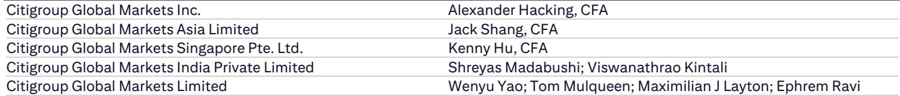

# 铜价突破的关键不在于需求爆发，而在于供给侧的三个结构性断裂

过去六个月，铜价在每吨12,000至13,000美元之间反复拉锯。市场上最主流的两派叙事——一派押注AI与能源转型拉动结构性需求，另一派担忧全球增长放缓与地缘风险——已经在这个区间内完成了充分的定价博弈。但某外资投行最新发布的研报提出了一个更值得关注的判断：铜价将在一个月内触及每吨14,500美元，并在一年内站上15,000美元。

这个判断之所以值得认真对待，不是因为该行上调了需求预测，而是因为它系统性地重估了供给侧的三个关键变量。这三个变量过去被市场视为“已知的已知”，但该报告用最新数据表明，它们正在从“已知”滑向“严重低估”。

更重要的是，这份报告揭示了一个反直觉的定价逻辑：铜价接下来的上行动力，将主要来自“供给跟不上需求”这一事实的重新定价，而非需求本身的加速。对于产业决策者和资产配置者而言，这意味着当前的交易区间可能正在成为过去式。

以下是我们从这份报告中提炼出的五个核心洞察。

## 1. 2026年矿山产量零增长，这比表面数字更糟糕

报告最硬核的修正出现在矿山供给端。该行将2026年全球铜矿产量增速从正增长下调至-0.2%——换句话说，产量几乎没有增长。这个数字本身已经低于市场共识，但真正重要的不是这个数字，而是它背后的结构性原因。

报告明确指出，其上调了2027年和2028年的全球矿山中断率假设至7%。这意味着更多矿山的投产和爬坡将出现延误、减产或非计划停产。报告特别点名了几个关键矿区——Grasberg、El Teniente、Kamoa、Cobre Panama——这些全球级矿山在2026-2027年的实际产出都存在显著的执行风险。

更深层的问题是刚果（金）的供给风险。该地区近年已成为全球铜矿增量供给的核心来源，但报告警告，当前的硫磺市场约束以及更广泛的地缘政治不稳定，正在使这一地区的持续高产路径变得不确定。对于一个全球市场越来越依赖少数高风险司法管辖区的行业来说，这绝不是一个边际问题。

所以呢？矿山供给零增长意味着，2026年全球铜市场将完全依赖废铜回收和库存释放来满足任何新增需求。而报告的下一个判断恰恰指出，废铜供给同样不可靠。

## 2. 废铜供给弹性被高估，高铜价并未带来相应增量

传统铜市场分析中有一个默认假设：当铜价上涨时，废铜回收量会随之增加，从而部分对冲供给缺口。这个假设正在被现实数据挑战。

报告引用了中国2026年1-4月的废铜进口数据：尽管同期铜价同比上涨超过30%，废铜进口量仅录得温和的同比增长。这意味着废铜的供给弹性远低于历史水平。报告给出了三个解释：能源和燃料成本上升推高了废铜的回收和运输成本；中国的“以旧换新”政策支持力度较去年有所减弱；全球废铜供应链本身已经处于相对枯竭状态——过去几年冶炼厂对原材料的需求持续超过废铜供给能力。

这个判断的产业含义非常直接：如果废铜不能像过去那样在高价环境下快速补充市场，那么任何需求的边际增长都将直接反映在精铜库存的去化和价格的上涨上。报告预计，2026年废铜和矿山供给的合计增量将无法覆盖AI和能源转型带来的需求增长，更不用说任何可能的周期性需求复苏。

所以呢？铜市场的供给安全边际正在从“有弹性”滑向“刚性”。这是一个需要被重新定价的基本面变化。

## 3. 美国关税博弈的真正影响不在关税本身，而在战略模糊

这是报告中最具洞察力的部分之一。市场普遍关注美国是否会对精炼铜加征关税，以及关税税率是多少。但报告认为，更重要的变量是美国政策制定者的行为模式。

该行的核心判断是：美国政府最终不会对精炼铜加征关税，但在2026年6月底的审查截止日期之前，也不会明确排除这一可能性。这种“战略模糊”的目的非常明确——通过悬而未决的关税威胁，激励市场参与者持续在美国境内囤积超额铜库存。只要关税风险没有被消除，套利交易就会推动铜流入美国，支撑COMEX溢价和全球铜价。

从数据上看，这一策略已经奏效。报告显示，美国精炼铜进口量在2026年初显著高于正常消费需求水平，COMEX-LME价差在审查截止日期前重新走阔。基金在COMEX上的空头持仓持续低迷，反映出市场对关税风险的定价尚未消退。

但这里有一个关键的时间节点：6月之后。如果关税威胁未能兑现，市场可能会开始消化“关税风险溢价”，这可能成为铜价的一个短期逆风。然而，报告同时指出，霍尔木兹海峡的重新开放预期可能足以抵消这一逆风。

所以呢？关税博弈的真正影响不是关税本身，而是它创造的库存囤积效应。这个效应将在6月后逐步消退，但消退的速度和幅度取决于供给端其他变量的变化。

## 4. 霍尔木兹海峡关闭：一个被低估的风险与机遇

报告将霍尔木兹海峡的持续关闭纳入其情景分析，并给出了一个明确的判断：即使海峡关闭持续到7月，全球增长和风险情绪在短期内仍可能保持韧性。但如果海峡关闭演变为持续且不稳定的中东局势，铜价以及更广泛的风险资产将面临显著的尾部风险。

这个判断的微妙之处在于：报告既不认为海峡关闭会立即引发系统性风险，也不认为其影响可以忽视。它更像是一个“已知的未知”——市场已经定价了部分风险，但尚未充分定价“重新开放”这一上行情景。

报告的基本假设是海峡将在2026年第三季度重新开放。如果这一假设兑现，铜价将获得一个额外的上行催化。而如果海峡关闭持续超预期，报告在熊市情景中已经为铜价预留了每吨11,000美元的下行空间。

所以呢？霍尔木兹海峡是铜价短期走势中最大的不确定性来源。它既可能成为推动铜价突破15,000美元的催化剂，也可能成为拖累铜价跌回12,000美元的拖累。这个二元性意味着，任何押注铜价方向的投资者都需要对这一变量保持高度敏感。

## 5. 2027年将出现36万吨缺口，但库存结构使这一数字比看起来更严重

报告预测2027年全球精炼铜市场将出现约36万吨的供需缺口。从绝对规模看，这个数字大约相当于全球年消费量的1.3%，似乎并不惊人。但报告指出，这一缺口的定价含义可能比数字本身更严重。

原因在于：美国境内囤积的过量库存可能吸收部分或全部缺口。如果这部分库存被释放，实际反映在价格上的缺口可能更小。但报告同时也警告，任何库存释放都将是渐进的，而非突发的。这意味着市场可能会在较长时间内处于“紧平衡”状态，价格将维持在足以驱动额外废铜回收和需求替代的水平。

报告估算，要清除这个缺口，铜价需要比当前水平高出约每吨1,500美元。这个数字恰好落在该行新的12个月目标价区间内。

所以呢？2027年的缺口不是一个大数字，但它出现在一个供给弹性极低、库存分布不均的市场环境中。这意味着价格发现机制将更依赖边际定价，而非总量平衡。

---

这份报告的完整版还包含了该行对全球铜终端消费追踪器的详细数据、分情景的价格路径模拟，以及对中国能源转型需求放缓的深度解读。报告指出，中国3月份的可再生能源装机量同比下降，部分原因是2025年的政策前移效应，但出口增长正在弥补国内需求的疲软。这些细节对于理解全球铜需求的真实韧性至关重要。

报告没有完全回答的一个关键问题是：如果美国关税威胁在6月后消退，而霍尔木兹海峡的重新开放又推高了风险资产，铜价的上行空间是否会超过该行目前设定的15,000美元目标？该行的牛市情景（概率20%）已经将2027年价格设定在每吨17,000美元，但这一情景的实现条件——周期性增长超预期、利率预期重新定价、供给进一步低于预期——在当前宏观环境下是否足够可靠？这可能需要更细致的行业数据和更深入的地缘政治分析才能判断。

这些未解问题，正是我们希望在后续讨论中与读者共同探讨的方向。如果你对这份报告的完整数据、情景分析框架或具体的行业跟踪指标感兴趣，欢迎来我们的星球微信群里继续讨论。在那里，我们会分享原始报告的关键图表、我们的二次分析笔记，以及来自产业一线的观察。

Personal reading notes and learning share only. Not investment advice.

