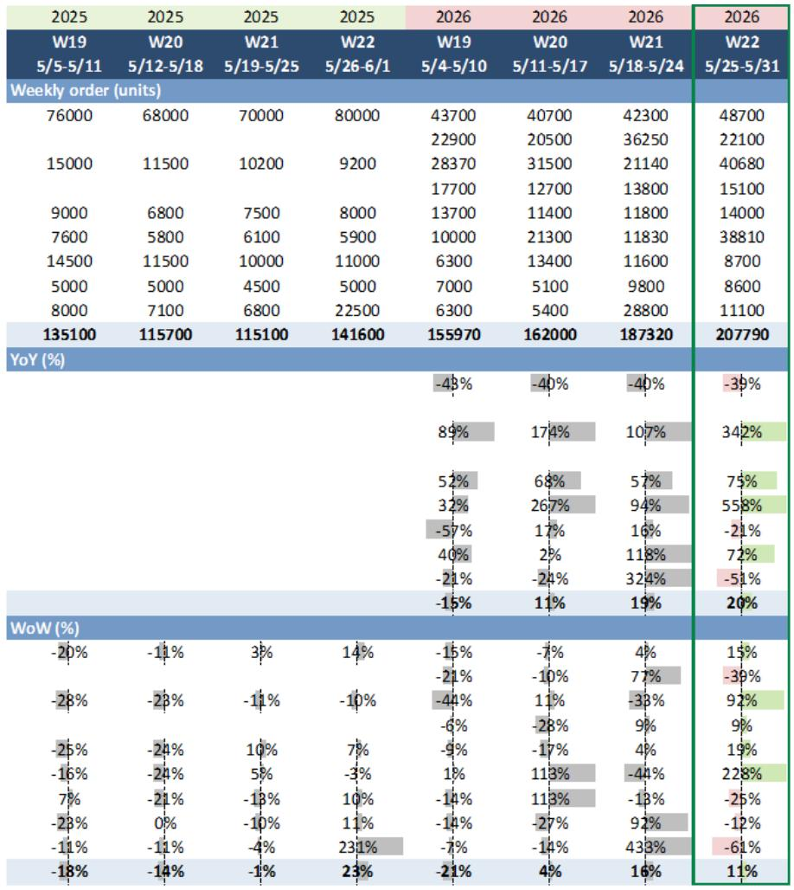
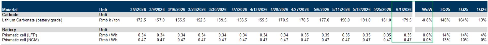

# New Model Launches Are Reshaping China's NEV Competitive Landscape Faster Than Price Cuts Ever Could

China's new energy vehicle market has entered a new phase of competition. During the 22nd week of 2026, combined weekly orders for major NEV brands rose 11% week-over-week and 20% year-over-year, pushing NEV penetration to 63.6% in late May. This is not merely a cyclical uptick. The data reveals a structural shift: the primary driver of demand growth has moved from price reductions to product innovation. Nio's orders surged 228% week-over-week. HIMA rose 92%. BYD added 15%. Each of these spikes correlates directly with new model launches, not with discount widening. For investors and strategists tracking China's auto sector, the implication is clear. The winners in the next 18 months will be determined by product cadence and technology differentiation, not by who can cut prices the deepest.

The weekly chartbook from a global investment bank provides the raw data. But the strategic story lies beneath the percentages. The NEV market is no longer a single growth story. It is fracturing into distinct competitive tiers, each governed by different rules. Understanding which companies can sustain order momentum beyond a launch quarter, and which are merely enjoying a temporary halo, is the central analytical challenge.

## New Model Launches Create Order Spikes, But Only Some Brands Convert These Into Sustained Momentum

The week 22 data is dominated by launch-driven surges. Nio's 228% week-over-week jump is the most dramatic, tied to the ES9 launch. HIMA's 92% gain reflects the AITO M9 facelift. BYD's 15% increase, while smaller in percentage terms, comes from a much larger base and is supported by multiple refreshed models including the Yuan Plus and Song Ultra DM-i.

The critical question is what happens in weeks 23 through 26. A launch spike that fades within two weeks is a marketing event, not a strategic inflection point. A spike that sustains into the following month signals genuine demand pull. The historical pattern from this report's data shows that some brands have demonstrated an ability to hold elevated order levels after launches, while others see rapid mean reversion. The difference often lies in whether the new model addresses an underserved segment, offers genuinely differentiated technology, or is simply a cosmetic refresh in a crowded price band.

For Nio, the ES9 launch represents a critical test. The company's YTD order growth of 69% is the strongest among tracked brands, but this has been achieved with significant volatility. Investors should watch whether the ES9 can stabilize Nio's weekly orders above 20,000 units, or whether the spike is a one-time event followed by a return to prior run rates.

## Dealer Discount Compression Signals That Pricing Power Is Shifting Toward NEV Manufacturers

One of the most strategically significant data points in the report is the narrowing of dealer discounts. As of May 30, the average NEV dealer discount stood at 7.75% of MSRP, down from 9.09% a year earlier. ICE dealer discounts, by contrast, remained elevated at 19.47%. BYD's average discount was just 5.14%, essentially unchanged from the prior week and significantly tighter than the 7.72% level of May 2025.

This compression matters for two reasons. First, it indicates that NEV manufacturers are under less pressure to subsidize demand through dealer margins. The combination of strong order flow and tightening discounts suggests that demand is genuine rather than subsidy-driven. Second, it widens the profitability gap between NEV and ICE manufacturers. ICE dealers are discounting nearly 20% to move inventory, which compresses margins for manufacturers and dealers alike. NEV players, particularly those with strong product cycles, are preserving pricing integrity.

The BYD data is especially instructive. Despite being the volume leader, BYD has maintained the tightest discount structure among mainstream NEV brands. This suggests that its cost leadership and brand scale are translating into pricing power, not just unit share. For competitive analysis, this is a meaningful data point. It implies that BYD's strategy is not simply to buy share through aggressive pricing, but to use its scale advantage to maintain margins while competitors compress their own.

## The Battery Cost Tailwind Is Real, But Its Competitive Impact Is Unevenly Distributed

The report notes that battery-grade lithium carbonate prices declined to RMB 179,500 per ton, down 0.8% week-over-week, while prismatic LFP and NCM cell prices remained stable. This divergence is analytically significant. Falling raw material costs are not yet flowing through to lower cell prices, which means that manufacturers with integrated battery supply chains are capturing the margin benefit internally, while those dependent on third-party cells are not.

For a company like BYD, which has deep integration into battery production through its FinDreams subsidiary, every decline in lithium carbonate prices represents a direct margin improvement opportunity. For brands that purchase cells from suppliers, the benefit is delayed or absorbed by the supplier. This creates a structural cost advantage that compounds over time. The report's upstream pricing data, when read in conjunction with the dealer discount data, suggests that the margin gap between integrated and non-integrated NEV manufacturers is widening, not narrowing.

The strategic implication is that the next phase of competition will not be about who can offer the lowest sticker price. It will be about who can maintain pricing power while absorbing cost volatility. Integrated manufacturers have a structural advantage in this environment.

## What the Report Does Not Fully Answer: The Sustainability of Demand in the Mass Market Segment

The weekly chartbook provides excellent granularity on order trends for premium and mid-range brands, but it leaves an important analytical gap. The data is heavily weighted toward brands that are visible in weekly tracking: Nio, HIMA, BYD, Tesla, Li Auto, XPeng, Xiaomi, Leapmotor, and Geely. What is less visible is the demand trajectory in the mass-market segment below RMB 150,000, where price sensitivity is highest and brand loyalty is lowest.

BYD dominates this segment, but the report's data shows that its year-over-year order growth has been negative for most of 2026, with May orders down 41% year-over-year. The week 22 spike of 15% week-over-week is encouraging, but the YTD trend raises questions about whether BYD's volume leadership is being challenged by new entrants in the lower price bands. The report does not provide sufficient data on brands like Wuling, Chery, or Changan's NEV models to assess whether the mass market is expanding or merely reshuffling.

For investors, this is the most important unanswered question. The premium segment, where Nio and HIMA compete, is growing rapidly but from a smaller base. The mass market, where BYD holds dominant share, represents the bulk of industry volume. If demand in that segment is stagnating, the overall NEV penetration rate may face a ceiling in the near term, regardless of premium segment exuberance.

## A Decision Framework for Evaluating NEV Brand Positioning Based on Order Quality and Pricing Discipline

The data in this report supports a three-dimensional framework for evaluating NEV brands, moving beyond simple volume comparisons.

First, assess order quality by examining the ratio of launch-driven spikes to baseline demand. A brand that generates 80% of its weekly orders from new model launches is fragile. A brand that maintains 70% of its peak order volume in non-launch weeks has genuine demand. The report's weekly data allows for this calculation, and the differences between brands are revealing.

Second, evaluate pricing discipline by comparing dealer discount trends against order growth. The ideal combination is rising orders with stable or narrowing discounts. This combination signals that demand is pulling product through the channel, rather than being pushed by dealer incentives. BYD and Nio both exhibit this pattern in the current data. Brands that show rising discounts alongside flat orders are in a structurally weaker position.

Third, assess cost resilience by tracking the relationship between upstream battery prices and downstream pricing. Brands that can maintain margins during raw material declines, while competitors cannot, have a durable competitive advantage. This is where integration matters most.

Applying this framework to the current data suggests that the market is rewarding product innovation and cost integration, not pricing aggression. The brands that are winning on these dimensions are likely to sustain their momentum through the second half of 2026.

## The Full Report Contains Charts That Reveal Which Brands Are Building Real Momentum and Which Are Just Enjoying a Launch Quarter Halo

The weekly chartbook from which this analysis is drawn contains exhibits that cannot be fully reproduced in text format. The dealer discount trend lines, the brand-level weekly order trajectories, and the upstream battery pricing dynamics each tell a story that is best understood visually. The NEV discount chart shows a clear downward trend from early 2026, but the rate of compression varies significantly by brand. The ICE discount chart tells a different story entirely, one of persistent margin pressure that shows no sign of easing.

For readers who want to see the actual data plots, compare the trajectories across brands, and draw their own conclusions about which companies are building sustainable competitive positions, the full report is essential. The charts provide the visual evidence behind the strategic argument presented here.

Join the community to read the full report and review the original charts.

*This article is for learning and discussion only and does not constitute investment advice.*

Personal reading notes and learning share only. Not investment advice.

