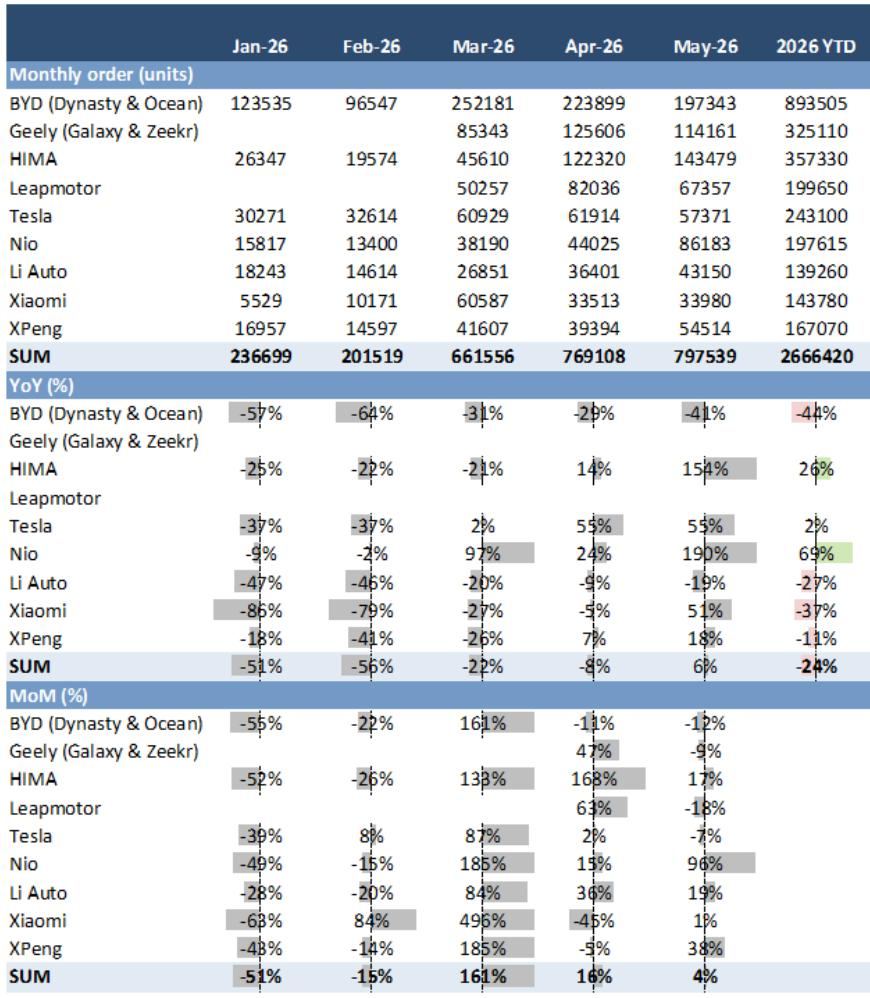

# 新能源渗透率突破63%后，市场真正低估的是新车型的订单转化效率

2026年5月最后一周，中国新能源乘用车市场交出了一份看似平淡、实则暗藏分化的成绩单。某外资投行最新发布的周度研报显示，当周主要新能源品牌合计订单环比增长11%，同比增长20%，新能源渗透率在5月1-24日期间达到62.5%-63.6%。渗透率数字本身并不令人意外——市场早已接受50%以上的新常态。但真正值得关注的是订单增长的结构：它不是普惠式的行业回暖，而是由特定品牌的新车型集中投放所驱动。蔚来周订单环比暴增228%，鸿蒙智行增长92%，比亚迪增长15%。这三家合计贡献了当周绝大部分增量。

这意味着什么？当行业渗透率进入60%以上的高位区间，增长的动力已经从“电动化替代”切换为“产品周期竞争”。每一款新车型的订单转化效率，正在成为决定品牌季度排名的关键变量。市场对此的定价可能仍然不足。

以下，我们从订单结构、折扣信号、定价权分化三个层次，逐一拆解这份研报的核心洞察。

## 1. 新车型集中投放正在制造“订单断层”，而非整体复苏

5月最后一周的订单数据，表面上是整体向好，但细看品牌间的差距，几乎是断层式的。蔚来周订单从1.18万辆跃升至3.88万辆，环比增长228%；鸿蒙智行从2.11万辆增至4.07万辆，环比增长92%。而同期，理想汽车订单环比下降25%，小鹏下降61%，吉利银河与极氪合计下降39%。

这种分化并非偶然。研报明确指出，增长主要由新车型驱动：蔚来ES9、问界M9改款、比亚迪元Plus改款和宋Ultra DM-i。换句话说，当周订单增量几乎全部来自“新车效应”，而非存量需求的自然回暖。

对于产业决策者而言，这一信号的含义是明确的：在渗透率高位，任何品牌的订单增长都越来越依赖产品更新节奏。没有新车型投放的品牌，即使整体市场渗透率在提升，其订单也可能停滞甚至下滑。这意味着行业竞争已经从“谁更早电动化”演变为“谁的产品迭代更快、更准”。小鹏和理想的订单下滑，恰恰反映了其当前产品线在市场上缺乏新鲜感——尽管两者在技术和品牌层面各有积累。

从投资视角看，市场对新能源车企的估值，可能需要从“总量增长故事”转向“产品周期估值”。一个品牌未来6个月的订单可见度，很大程度上取决于其下一款新车的发布时间和市场预期，而非行业渗透率的线性外推。

## 2. 经销商折扣同步收窄，但NEV与ICE的定价能力差距在扩大

研报中另一个容易被忽视的细节是终端折扣的变化。截至5月30日，新能源车经销商平均折扣为MSRP的7.75%，较前一周的7.79%略有收窄；而燃油车经销商平均折扣为19.47%，同样较前一周的19.67%收窄。乍看之下，两者都在改善，但折扣率的绝对值差距——近12个百分点——才是关键。

燃油车经销商以接近20%的折扣率卖车，意味着其定价权已基本丧失。即使折扣收窄，19.47%的水平仍然表明燃油车终端价格处于“清仓模式”。相比之下，新能源车7.75%的折扣虽然也不低，但至少还在产品生命周期内的正常促销区间。

更值得关注的是比亚迪的表现。其平均折扣仅为5.14%，远低于行业平均，且连续两周持平。这表明比亚迪在拥有规模优势的同时，仍然维持了相对较强的定价能力。对于一家月订单接近20万辆的品牌而言，5%左右的折扣率是健康的。这反过来也说明，比亚迪的利润压力可能小于市场普遍担忧的程度。

这里有一个尚未被充分讨论的推论：如果新能源车折扣继续收窄，而燃油车折扣维持高位，那么燃油车经销商的现金流压力将进一步加大。这可能导致更多燃油车经销商退出或转投新能源品牌，从而加速渠道端的结构性洗牌。研报没有展开讨论这一二阶影响，但它对传统车企的渠道价值评估可能构成重大变量。

## 3. 上游碳酸锂价格持续走低，但电池成本红利并未均匀传递

研报中提及，电池级碳酸锂价格已降至每吨17.95万元，环比下跌0.8%，而磷酸铁锂和三元方形电芯价格环比持平。这一组合值得拆解。

碳酸锂价格持续走低，理论上应该降低电池成本，进而为整车厂提供更大的定价空间或利润弹性。但电芯价格并未同步下降，说明电池环节的利润分配正在发生变化。要么是电池厂商在主动压缩自身利润以维持电芯价格稳定，要么是碳酸锂价格下跌的影响被其他成本上升所抵消。

对于整车厂而言，这意味着上游成本红利并非自动传导至终端。能够通过规模采购或自研电池来锁定更低电芯成本的品牌，将在定价上获得不对称优势。比亚迪的折扣率之所以能保持在5%左右，与其垂直整合的电池供应链不无关系。而依赖外采电池的品牌，则可能面临成本改善滞后于竞争对手的局面。

研报没有给出电芯价格的具体谈判机制，但这一环节的透明度较低，恰恰是投资者需要持续跟踪的关键。如果碳酸锂价格进一步下跌至15万元以下，而电芯价格仍然坚挺，那么电池环节的议价权问题就需要重新评估。

## 4. 报告尚未完全回答的关键问题：订单转化率能否持续？

这份周度研报提供了丰富的高频数据，但有一个核心问题它没有直接回答：新车型带来的订单增长，有多少能转化为实际交付？蔚来ES9的周订单暴增228%，但这款车的产能爬坡速度如何？交付周期是否会影响订单的留存率？鸿蒙智行M9改款的订单中有多少是存量换购，多少是新增用户？

这些问题之所以关键，是因为在新能源渗透率超过60%的市场中，订单的“质量”比“数量”更重要。如果新车订单主要来自品牌内部老用户的换购，那么它对市场份额的净增量贡献有限。如果订单大量来自价格敏感型用户，那么一旦产能不足导致交付延迟，退单率可能上升。

研报中提到的“YTD订单增速”可以提供一些线索：蔚来YTD订单同比增长69%，鸿蒙智行增长26%，特斯拉增长2%。蔚来的高增速部分受益于去年基数较低，但69%的增长仍然超出了单纯换购所能解释的范围。然而，要确认这一趋势是否可持续，还需要观察未来4-6周的新增订单走势，以及6月11日乐道L60改款发布后的市场反应。

## 5. 一个值得关注的观察框架：产品周期密度与订单弹性

基于以上分析，我们可以提炼出一个简化的观察框架，供产业决策者和投资者参考。

首先，关注每个品牌未来12周内的新车型发布密度。研报列出的未来事件清单显示，6月将有乐道L60改款、比亚迪大唐上市、零跑D99上市，7月有小鹏MONA L03上市。这些车型的订单表现，将直接决定对应品牌三季度的市场份额。

其次，追踪新车发布后第2-4周的订单走势。第一周的订单往往包含大量“尝鲜型”用户和媒体效应，第二周之后的订单持续性才是真实需求的反映。如果某品牌在新车发布后第三周订单仍能保持环比正增长，则说明产品力得到了市场验证。

第三，将折扣率变化与订单数据交叉验证。如果折扣率上升的同时订单增长，说明增长是靠价格换来的，利润质量较低。如果折扣率稳定甚至下降而订单增长，则是定价权增强的信号。比亚迪目前符合后者，而其他品牌需要逐一检验。

最后，关注电池级碳酸锂价格与电芯价格的背离程度。如果两者差距持续扩大，意味着电池环节的利润池正在重新分配，整车厂需要重新评估自身的电池采购策略和垂直整合进度。

---

这些未解问题，正是完整研报中更深入讨论的部分。某外资投行的这份周度图表报告，虽然只有几十页，但包含了按品牌、按周度、按月度拆分的订单明细、经销商折扣的历史走势、以及上游电池定价的连续追踪。这些数据对于判断行业拐点和品牌竞争格局的边际变化，具有不可替代的价值。

如果你对上述任何一个维度的完整数据或二阶分析感兴趣，欢迎来星球微信群里继续讨论。我们会在社群里分享完整研报的解读笔记和原始图表，并定期组织对关键问题的深度探讨。

Personal reading notes and learning share only. Not investment advice.

