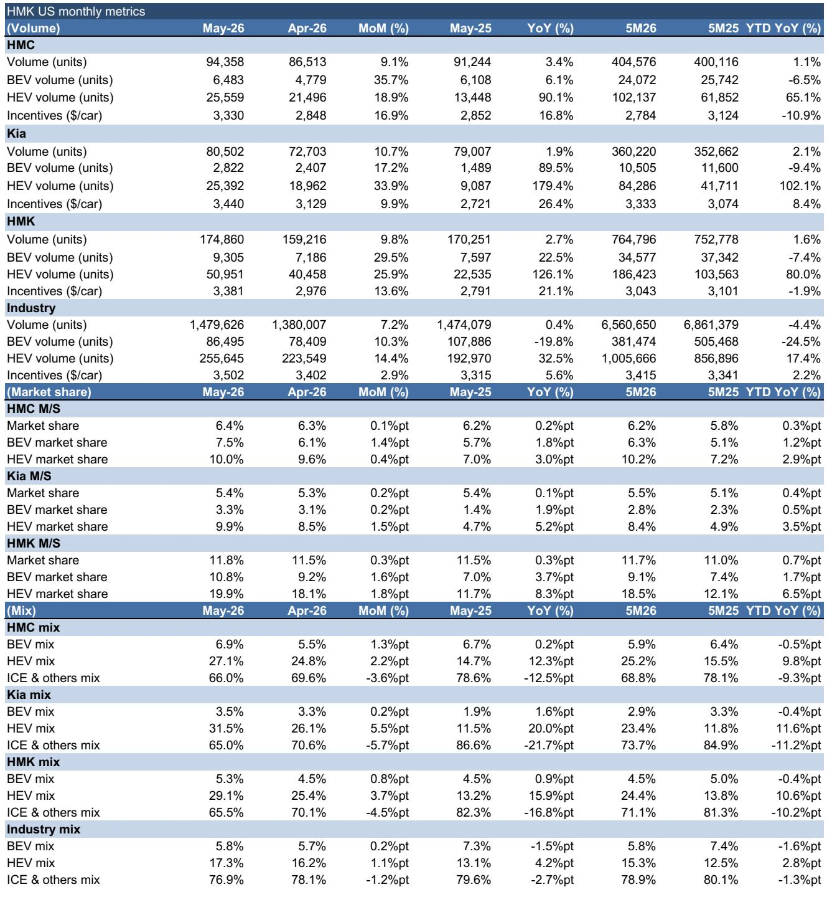
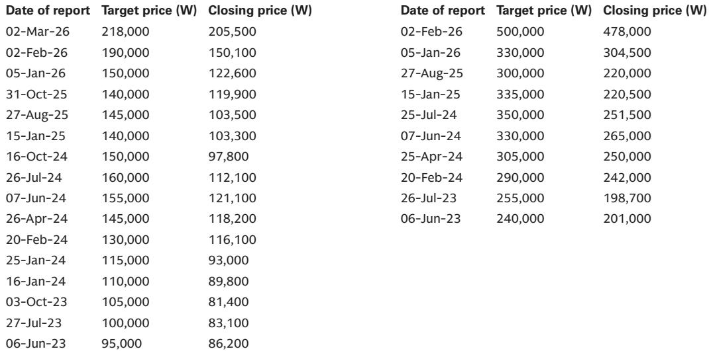
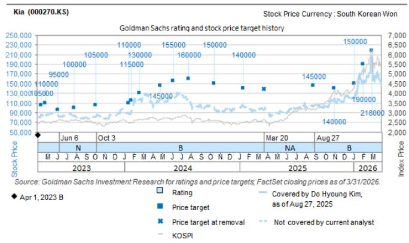

# Hyundai and Kia Are Winning the US Market by Dominating the Hybrid Transition, Not the Electric One

The conventional narrative holds that the future of the automotive industry belongs to the battery electric vehicle (BEV). Yet the most significant strategic development in the US market this year is not a BEV breakthrough—it is the explosive growth of hybrid electric vehicles (HEVs). In May 2026, Hyundai Motor Company (HMC) and Kia together captured 19.9% of the US HEV market, up from 11.7% a year earlier. This is not a marginal gain. It is a structural shift in how these two Korean automakers are building competitive advantage.

The data from May 2026 reveal a clear strategic picture. Combined US market share for HMC and Kia reached 11.8%, a 30-basis-point increase year-over-year. HEVs now account for 29.1% of their total US sales volume, more than double the 13.2% recorded in May 2025. For Kia alone, the HEV mix surged to 31.5%. Meanwhile, the overall US BEV market continues to contract, declining 19.8% year-over-year in May. The Korean pair is not merely riding a trend; they are defining it.

This matters now because the competitive window for establishing HEV dominance is closing. As legacy automakers and Chinese entrants accelerate their own hybrid and plug-in hybrid programs, the ability to lock in supply chains, brand perception, and dealer networks around HEVs will determine who wins the next phase of the transition. HMC and Kia are not waiting for the BEV future to arrive. They are building a highly profitable bridge to it, and the May data show they are executing with precision.

The strategic implication is clear: investors and industry observers should stop treating HEVs as a transitional technology and start viewing them as the core profit engine for the next five years. The BEV narrative is important for the long term, but the HEV story is generating real volume, real market share, and real pricing power right now.

## HEV Market Share Gains of Over 8 Percentage Points in One Year Signal a Structural Inflection, Not a Cyclical Blip

The headline number is striking: the combined HEV market share for HMC and Kia rose from 11.7% in May 2025 to 19.9% in May 2026. That is an 8.2-percentage-point gain in twelve months. To put this in perspective, the total US auto market grew just 0.4% year-over-year in May. This is not a rising tide lifting all boats. It is a specific strategic bet paying off at scale.

Breaking down the numbers reveals the depth of the shift. HMC's HEV volume grew 90.1% year-over-year, while Kia's grew an extraordinary 179.4%. Industry-wide HEV demand rose 32.5% in the same period. The Korean pair is growing at three to five times the market rate. Their combined HEV volume of 50,951 units in May represents 29.1% of their total sales mix, compared to 13.2% a year ago. This is not incremental change. It is a reallocation of production capacity and consumer preference at an industrial scale.

The implication for investors is that HMC and Kia have effectively created a new competitive moat. HEVs require complex powertrain integration, battery management systems, and supply chain coordination that many competitors have not yet mastered. The Korean automakers have been investing in this capability for years, and the May data suggest they are now harvesting the returns. Any competitor that wants to match this HEV share will need to invest heavily in engineering and production capacity, and that investment will take years to yield results.

## Incentive Discipline Combined with Premium HEV Mix Creates a Pricing Power Advantage That Rivals Cannot Easily Replicate

One of the most underappreciated aspects of the May data is the incentive picture. Industry average incentives stood at $3,502 per vehicle in May 2026, up 5.6% year-over-year. HMC spent $3,330 per vehicle, and Kia spent $3,440. Both are below the industry average. This is remarkable given that both automakers are simultaneously growing market share and shifting their mix toward HEVs.

The logic is straightforward. HEVs command higher transaction prices than equivalent internal combustion engine (ICE) vehicles, and consumer willingness to pay a premium for fuel efficiency and lower emissions remains strong. By selling more HEVs, HMC and Kia are effectively pulling their average transaction prices upward without needing to increase incentives. In fact, the data show that HMC's incentives are actually down 10.9% year-to-date compared to the same period in 2025, even as HEV volume has surged.

This creates a virtuous cycle. Higher HEV mix improves revenue per vehicle. Lower incentives protect margins. Stronger margins fund further investment in HEV technology and production capacity. Competitors that are forced to offer higher incentives to move BEVs or aging ICE models are caught in the opposite dynamic. They are spending more to sell less desirable products, which constrains their ability to invest in the hybrid transition.

The strategic takeaway is that HMC and Kia are not just winning on volume. They are winning on profit quality. The May data suggest that their US operations are generating superior unit economics compared to many competitors, and this advantage is likely to persist as long as they maintain their HEV lead.

## The BEV Market Contraction Masks a Strategic Opportunity That HMC and Kia Are Exploiting Selectively

The US BEV market declined 19.8% year-over-year in May 2026, with industry BEV mix falling to 5.8% from 7.3% a year earlier. This is a significant deceleration that has led many analysts to question the pace of electrification. However, a closer look at the data reveals that HMC and Kia are using this environment to their advantage.

Combined BEV market share for the pair rose to 10.8% in May, up from 7.0% a year ago. HMC's BEV market share reached 7.5%, and Kia's reached 3.3%. While BEV volumes remain small relative to HEVs—just 9,305 units combined in May—the share gains are meaningful. In a contracting market, gaining share is a signal of product strength and brand preference.

The strategic logic here is important. HMC and Kia are not trying to force BEV adoption prematurely. They are positioning their BEV offerings as premium complements to their HEV lineup, not as replacements. This allows them to maintain pricing discipline in the BEV segment while the broader market struggles with oversupply and price cuts. The Ioniq 5 and EV6 models are well-reviewed and have strong brand recognition, but the companies are not chasing volume at any cost.

The implication for the long term is that when the BEV market does recover—driven by charging infrastructure buildout, battery cost declines, or policy support—HMC and Kia will have established brand credibility and supply chain relationships that latecomers will find difficult to match. They are playing the long game in BEVs while winning the short-to-medium-term battle in HEVs.

## What the Report Does Not Yet Answer: The Sustainability of HEV Margins and the Risk of Cannibalization

The May data paint a compelling picture, but they also raise important questions that the report does not fully address. The most critical of these is margin sustainability. HEVs are more complex and costly to manufacture than ICE vehicles. They require batteries, electric motors, power electronics, and sophisticated control software. As HEV mix rises, the cost structure of HMC and Kia's US operations changes. Are the higher transaction prices of HEVs sufficient to offset the higher manufacturing costs? The incentive data suggest yes, but we do not have direct visibility into component costs, warranty expenses, or R&D amortization.

A second unresolved question is cannibalization. As HEV mix approaches 30% of total sales, it is reasonable to ask whether these sales are coming entirely from ICE vehicle replacements or whether they are pulling demand away from the companies' own BEV offerings. If HEVs are simply a more profitable alternative to BEVs for the same customer segment, then the current strategy is optimal. But if HEVs are delaying BEV adoption within the Hyundai-Kia customer base, the long-term competitive position could be weaker than it appears.

A third question concerns the competitive response. Toyota has long been the global leader in hybrid technology, and it is now investing heavily in next-generation hybrid systems. Chinese automakers like BYD are entering the US market with plug-in hybrids that offer longer electric-only range. How will HMC and Kia defend their HEV market share as competition intensifies? The May data show they have a lead, but leads in the auto industry can erode quickly if product cycles are not managed carefully.

These are not criticisms of the report. They are the natural next questions that any serious investor should ask. The data provide a strong signal, but the full picture requires deeper analysis of costs, competitive dynamics, and long-term technology roadmaps.

## A Decision Framework for Investors: How to Evaluate the Hyundai-Kia US Strategy Going Forward

For investors trying to make sense of the May data and its implications, a structured decision framework is more useful than a list of numbers. The following framework can help assess whether the current trajectory is sustainable or whether it represents a peak that will be difficult to defend.

First, track the HEV-to-BEV mix ratio on a quarterly basis. If HEV share continues to grow while BEV share remains flat or declines, that is a sign that the strategy is working as intended. If BEV share begins to grow at the expense of HEV share, it may indicate that the hybrid bridge is working and that customers are gradually moving toward full electrification. Either outcome is positive, but they imply different long-term profit profiles.

Second, monitor incentive trends relative to the industry average. If HMC and Kia can maintain incentives below the industry average while growing HEV mix, that is a powerful signal of pricing power. If incentives begin to converge with or exceed the industry average, it would suggest that competition is eroding their advantage and that margins are under pressure.

Third, watch for new product launches in the HEV segment. The report notes that new model refreshes toward the second half of 2026 should help push combined market share toward 12.0%. The pace and reception of these launches will be a critical test. If new HEV models sell quickly with minimal incentives, the strategy is on track. If they require aggressive discounting, the competitive landscape may be shifting.

Fourth, assess the supply chain for HEV-specific components. Batteries, power electronics, and electric motors are the core of the HEV advantage. Any disruption to these supply chains—whether from geopolitical tensions, raw material price spikes, or production bottlenecks—would directly impact volume and margins.

Finally, compare the Korean automakers' HEV strategy to their BEV investment plans. If they are investing proportionally in both, the strategy is balanced. If HEV investment is crowding out BEV development, the long-term risk increases. The May data suggest a balanced approach, but this needs to be confirmed through capital expenditure disclosures and product roadmap announcements.

## Join the Community to Read the Full Report and Review the Original Charts

The May 2026 data provide a clear signal that Hyundai and Kia are executing a differentiated and highly effective strategy in the US market. But the most valuable insights come from examining the trends over time, comparing the data across segments, and understanding the second-order implications for the broader automotive industry. The original report from a global investment bank contains detailed charts that show the evolution of market share, volume trends, and mix dynamics over the past several years. These visualizations reveal patterns that are not immediately apparent from the monthly numbers alone. To access the full report with all exhibits and the complete analytical framework, join the community. The charts are essential for any investor or strategist who wants to make informed decisions about the Korean automakers and the US auto market more broadly.

*This article is for learning and discussion only and does not constitute investment advice.*

Personal reading notes and learning share only. Not investment advice.

