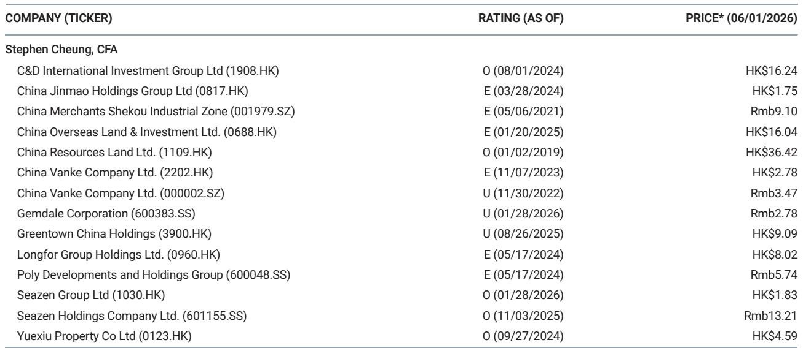
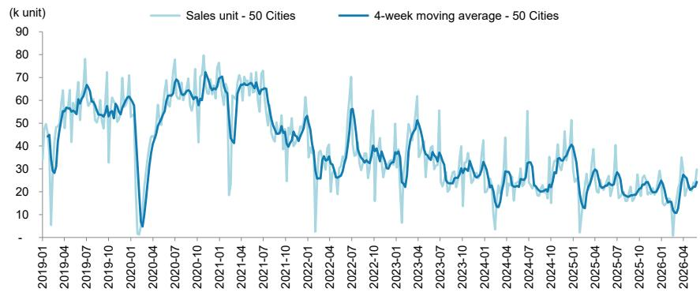
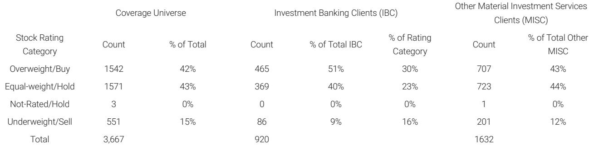

# China’s Property Market Is Not Recovering; It Is Recalibrating at a Lower Baseline

For the week ended May 31, primary registered unit sales across 50 Chinese cities rose 10% year-on-year, while secondary sales in 10 cities increased 9% year-on-year. On the surface, these figures suggest stabilization, even a nascent recovery, in China’s beleaguered property sector. Yet a closer reading of the data reveals a more complex and strategically important reality. The headline improvements mask a structural shift in market composition, pricing power, and transaction velocity that demands a fundamentally different investment framework than the one used during the past two decades of expansion.

The most striking insight from the latest weekly data is not the aggregate sales increase, but the internal divergence: Tier 3 cities posted a 34% year-on-year surge in primary sales, while Tier 2 cities managed only 6% growth and Tier 1 cities a modest 4%. This is not a uniform recovery. It is a recalibration driven by lower-tier cities, where prices have fallen further and policy stimulus has been most aggressive. Meanwhile, the sell-through rate—the proportion of launched units sold within a week—dropped sharply to 53% from 66% the prior week. This decline in transaction efficiency, particularly pronounced in Tier 2 cities where the rate fell to 42%, suggests that the sales volume increase is being achieved through deeper discounts and broader marketing efforts, not through genuine demand recovery.

The implication for investors is clear: the market is not healing; it is settling at a new, lower equilibrium. The narrative of a V-shaped recovery, which many hoped for after the policy pivot in late 2024, is not supported by the data. Instead, what we are witnessing is a bottoming process characterized by price discovery, inventory digestion, and a fundamental re-rating of risk and return expectations across the sector.

## The Tier 3 Sales Surge Is a Policy-Driven Distortion, Not a Demand Signal

The 34% year-on-year increase in primary sales for Tier 3 cities demands careful unpacking. On a week-over-week basis, this represents a dramatic swing from a 12% decline in the prior week. Such volatility is not characteristic of organic demand recovery. It reflects the concentrated impact of local government policies, including purchase restriction relaxations, subsidy programs for homebuyers, and state-owned enterprise purchases of unsold inventory. These measures are designed to clear inventory and stabilize prices, but they create a statistical distortion that can mislead investors who focus solely on top-line sales growth.

Consider the context. Tier 3 cities have experienced the most severe price corrections over the past three years, with asking prices in some markets falling by 20% to 30% from peak levels. The Centraline six-city secondary asking price tracking index, which stood at 17.5% below its peak last week, underscores the breadth of this decline. In this environment, a 34% sales increase is as much a function of price elasticity as it is of policy intervention. Buyers are entering the market not because they are confident about future appreciation, but because prices have fallen to levels where the rent-to-price ratio becomes attractive relative to other asset classes. This is a yield-driven purchase decision, not a speculative one.

The sustainability of this trend is questionable. Once the policy-driven inventory clearance runs its course, and the most price-sensitive buyers are absorbed, demand will likely fade unless employment and income growth provide a genuine catalyst. The data from the prior week, when Tier 3 sales declined 12% year-on-year, serves as a reminder of how quickly momentum can reverse. Investors should treat the Tier 3 surge as a tactical signal for inventory management, not a strategic signal for sector re-rating.

## Secondary Market Activity Reveals a Structural Shift in Liquidity and Price Discovery

Secondary registered unit sales rose 9% year-on-year across 10 cities, but this headline figure masks a significant deceleration from the prior week's 45% growth. The sequential slowdown—from 45% to 9%—is the most important data point in this category. It suggests that the secondary market, which had been the primary source of liquidity for homeowners seeking to exit positions, is now facing its own demand constraints.

Tier 1 secondary sales grew 12% year-on-year, down from 63% the previous week. Tier 2 secondary sales rose 6%, down from 36%. This pattern is consistent with a market where the initial wave of pent-up supply—homes listed by distressed sellers and investors seeking to deleverage—has been partially absorbed, but the next wave of buyers is not materializing at the same pace. The property agent index in Tier 1 cities, which fell to 53.8 from 55.5, confirms this softening in brokerage activity and transaction velocity.

The strategic implication is that price discovery in the secondary market remains incomplete. The 17.5% discount in the Centraline index suggests that sellers are still adjusting expectations downward, but the pace of adjustment may need to accelerate to clear the growing inventory of listings. For investors, this means that the floor for property valuations has not yet been established. Any investment thesis that relies on a near-term recovery in asset prices is premature. The secondary market is telling us that the equilibrium price is lower than current levels, and the adjustment process is ongoing.

## The Collapse in Sell-Through Rates Signals a Crisis of Developer Pricing Power

Perhaps the most concerning data point in this week's tracker is the total sell-through rate of 53%, down from 66% the prior week. This is not a minor fluctuation; it is a 13-percentage-point decline in the efficiency with which developers convert launched inventory into sales. In Tier 2 cities, the rate fell to 42%, meaning that for every 100 units launched, only 42 were sold within a week. This is a level typically associated with a buyer's market where pricing power has shifted decisively away from developers.

The sell-through rate is a leading indicator of developer financial health. When rates are high, developers can maintain pricing discipline, reduce marketing spend, and generate cash flow quickly. When rates collapse, as they have this week, developers are forced to offer discounts, rebates, and other incentives to move inventory. This compresses margins, strains working capital, and increases the risk of covenant breaches on development loans.

The divergence between Tier 1 and Tier 2 cities is instructive. Tier 1 recorded a 63% sell-through rate, down modestly from 66%. This suggests that demand in top-tier cities remains relatively resilient, supported by population inflows, employment concentration, and limited new supply. Tier 2 cities, however, are in a different category entirely. The 42% rate indicates that even in relatively prosperous regional centers, buyer appetite is insufficient to absorb new supply at current pricing. This is a red flag for developers with concentrated exposure to Tier 2 markets, and it suggests that further price adjustments are necessary to clear inventory.

## What the Data Does Not Tell Us: The Missing Variables in the Recovery Equation

This week's tracker provides a detailed snapshot of transaction volumes and sell-through rates, but it leaves several critical questions unanswered. First, what is the composition of buyers? Are these purchases by end-users, investors, or state-owned enterprises acting as market stabilizers? The data does not distinguish between genuine household demand and policy-driven absorption. Without this breakdown, it is impossible to assess the durability of the sales recovery.

Second, what is the trajectory of developer cash flows and debt service capacity? The sell-through rate decline suggests pressure on working capital, but the report does not provide data on developer cash collection rates, pre-sale deposit releases, or maturity profiles of upcoming debt obligations. These factors are essential for assessing credit risk in the sector.

Third, how are land sales responding to the apparent stabilization in residential transactions? Land auction data would provide a forward-looking indicator of developer confidence and local government fiscal health. If developers are not buying land despite improving residential sales, it would suggest that the recovery is viewed as temporary and that the long-term outlook for the sector remains negative.

Finally, what is the role of shadow inventory—units that have been completed but not yet launched for sale, or units held by distressed investors awaiting a price recovery? The reported sell-through rate applies only to units that are actively marketed. The total overhang of unsold inventory, including shadow supply, could be significantly larger than the data suggests. Until this hidden supply is quantified, any assessment of market balance is incomplete.

## A Decision Framework for Navigating the Recalibration Phase

For investors seeking to position in Chinese property, the current environment demands a framework that prioritizes cash flow certainty over asset appreciation potential. The traditional model of investing in developers with the best land banks and strongest brand equity is no longer sufficient. The following decision framework, derived from the patterns in this week's data, offers a more appropriate lens.

First, assess exposure by city tier. The divergence between Tier 1, Tier 2, and Tier 3 markets means that aggregate statistics are misleading. Investors should favor developers with concentrated exposure to Tier 1 cities, where sell-through rates remain above 60% and pricing power is relatively intact. Avoid developers with heavy Tier 2 exposure until the sell-through rate stabilizes above 50% for multiple consecutive weeks.

Second, monitor the velocity of secondary market transactions as a proxy for liquidity conditions. The sharp deceleration from 45% to 9% growth in secondary sales suggests that the market is not providing an easy exit for sellers. Developers who rely on homeowners selling their existing properties to fund new purchases will face headwinds until secondary market velocity recovers.

Third, use the sell-through rate as a real-time indicator of developer financial health. A rate below 50% in Tier 2 cities is a warning signal for margin compression and working capital strain. Investors should require developers to disclose weekly sell-through data as part of their investor communications and should adjust valuation models to reflect the cost of inventory carrying and discounting.

Fourth, treat policy-driven sales surges with skepticism. The 34% Tier 3 spike is a tactical event, not a strategic turning point. Investors should wait for three to four consecutive weeks of stable or improving sell-through rates before concluding that demand is genuinely recovering in any market segment.

Finally, focus on the price index, not just the volume index. The 17.5% decline in the Centraline secondary asking price index is a reminder that asset values are still falling. Any investment thesis that assumes price stability or recovery must be validated by a sustained flattening of this index over a period of at least three months.

## Join the Community to Read the Full Report and Review the Original Charts

The weekly database tracker offers a granular, high-frequency view of a market in transition. But the true value lies not in the individual data points, but in the patterns they reveal over time. The divergence between Tier 1 and Tier 3 sales, the collapse in sell-through rates, and the deceleration in secondary market activity all point to a market that is not recovering in the traditional sense. It is recalibrating—finding a new baseline for prices, volumes, and developer profitability. For investors who understand this distinction, the current environment offers opportunities to reposition portfolios ahead of the next cycle. For those who mistake a temporary policy-driven surge for a genuine recovery, the risks are significant.

Join the community to read the full report and review the original charts. The complete analysis includes historical comparisons, developer-level breakdowns, and a proprietary framework for assessing which companies are best positioned to weather the recalibration phase. The data is available. The interpretation requires context. We provide both.

*This article is for learning and discussion only and does not constitute investment advice.*

Personal reading notes and learning share only. Not investment advice.

