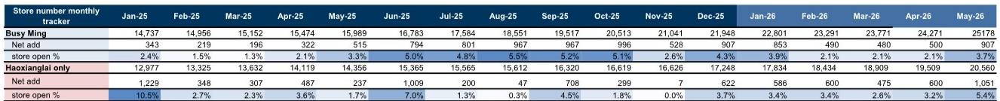
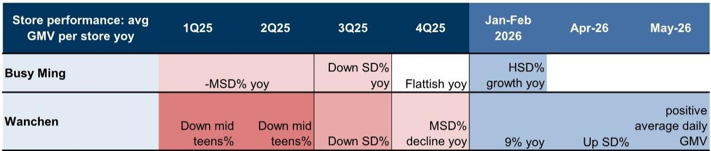
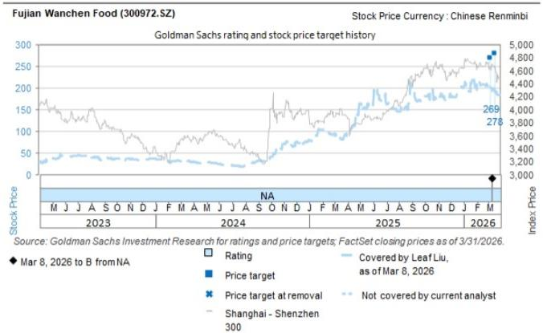

# 市场真正低估的不是需求，而是供给侧的再定价

最近一周，投行研报覆盖的两家中国价值零售龙头——鸣鸣集团和万辰食品，股价分别反弹9%和6%，部分收复了此前两周15%和10%的跌幅。表面看，这是市场对“补贴战扩大”担忧的短期缓解。但这份研报传递的核心信号远比“情绪修复”更值得深究：**中国平价零售赛道正在经历一次供给侧的主动再定价，而市场对这一变化的系统性含义仍然定价不足。**

5月27日至29日的抛售，导火索是市场担心两家公司加大了对加盟商的补贴力度，尤其是针对新店开业。补贴扩大通常被视为行业竞争加剧、单位经济模型恶化的信号。但6月2日收盘后，鸣鸣和万辰几乎同时通过官方渠道发布声明，正式重申对“健康发展”和“理性竞争”的承诺。两家公司明确反对非理性竞争，同时表达了对餐饮价值零售商在零食品类和饮料市场长期增长空间的信心，并强调有序、健康的竞争环境——这与全国性的“反内卷”政策方向高度一致。

这份研报的价值不在于复述这些公开声明，而在于它提供了三个层次的穿透性分析：第一，补贴扩大的真实边界在哪里；第二，门店扩张速度与单店GMV趋势之间的动态平衡；第三，这些变化如何重塑两家公司的估值逻辑。

以下是我们从这份研报中提炼的四个核心洞察，以及一个尚未被完全回答的关键问题。

## 1. 补贴扩大的本质不是价格战，而是对加盟商进行“供给侧筛选”

市场对补贴的第一反应往往是“利润受损”。但这份研报通过渠道调研指出，本轮补贴扩大的核心目的并非抢占市场份额，而是**加速优质加盟商的招募与筛选**。报告明确写道：“渠道调研显示，本轮补贴增加仍然是有纪律的。”这意味着补贴不是无差别的“烧钱”，而是有针对性的激励。

关键区别在于：无差别补贴会导致存量加盟商补贴依赖、新店质量参差不齐；而有纪律的补贴则是在用短期财务成本换取长期网络质量。鸣鸣和万辰的声明中反复强调“理性竞争”和“健康竞争环境”，这在政策层面呼应了反内卷方向，在商业层面则意味着两家公司正在主动定义“什么样的竞争是可接受的”。

对于产业决策者而言，这意味着：**平价零售赛道的竞争正在从“谁跑得快”转向“谁选得准”。** 补贴不再是规模竞赛的工具，而是筛选机制——那些能够通过补贴吸引到高质量加盟商的企业，将在下一阶段获得更强的网络效应和品牌壁垒。而市场目前对“补贴”一词的负面定价，可能忽视了这一结构性变化。

## 2. 5月开店加速不是偶然，而是2Q25系统性的供给扩张信号

研报中的月度门店追踪数据揭示了比市场预期更强劲的扩张节奏。鸣鸣集团在2026年5月净增门店907家，环比4月的500家增长81%；万辰食品（好想来品牌）更是在5月净增1,051家，环比4月的600家增长75%。将时间拉长看，两家公司在2026年前五个月累计新开门店均超过3,000家。

这不是孤立的月度波动。从数据趋势看，鸣鸣在2025年下半年至2026年初的月均净增门店维持在500-900家区间，而进入2026年4月后明显提速。万辰的扩张节奏更具爆发力：2026年5月净增1,051家，是2025年12月以来单月最高，且远超2025年下半年月均600-700家的水平。

这些数字背后是两层含义。第一层，供给侧的加速扩张说明两家公司对市场容量的判断仍然乐观。报告提到“市场仍然足够大，领先企业在良性竞争背景下可以继续扩张”。第二层，也是更重要的：**门店扩张的加速正在改变整个赛道的规模经济曲线。** 当门店密度达到一定阈值，供应链效率、物流成本分摊、品牌认知度都会出现非线性提升。这意味着，当前的开店提速可能正在为未来的单位经济改善埋下伏笔。

对于投资者而言，需要关注的不是开店速度本身，而是**开店速度与单店GMV之间的交叉验证**。如果开店加速伴随着单店GMV企稳或改善，那么规模效应正在兑现；反之，则可能是供给过剩的信号。而这份研报恰好提供了这一交叉验证的关键数据。

## 3. 单店GMV的拐点信号：万辰5月转正，鸣鸣1-2月已现高单位数增长

单店GMV是价值零售赛道最核心的健康指标。研报数据显示：万辰在2025年经历了单店GMV同比中双位数下降，但进入2026年后，1-2月同比转正至增长9%，4月进一步改善至同比中双位数增长，5月更是实现了包含新店在内的日均GMV转正。

鸣鸣的数据同样令人关注。其单店GMV在1Q25同比下降中单位数，2Q25下降幅度收窄至高单位数，3Q25同比下降中单位数，但到4Q25已基本持平。进入2026年，1-2月同比实现高单位数增长，4月延续这一趋势。

这些数据的合成意义是什么？**单店GMV的改善不是偶发现象，而是产品组合扩张和运营效率提升的系统性结果。** 报告特别提到“品类扩张”是单店GMV改善的支撑因素之一。对于价值零售商而言，品类扩张意味着客单价提升、复购率增加和门店坪效改善——这些都是单位经济模型的长期驱动因素。

但这里存在一个微妙但关键的问题：单店GMV的改善是否可持续？尤其是当新店加速扩张时，新店通常在开业初期会有较低的GMV贡献，这会拉低整体同店数据。万辰5月“包含新店在内的日均GMV转正”是一个积极信号，说明新店的质量正在提升。但这一趋势能否在更大样本下持续，仍需后续数据验证。

## 4. 估值折价正在收窄，但风险溢价尚未完全消化规模效应的二阶影响

当前鸣鸣和万辰分别交易在2026年预期市盈率的17倍和14倍。这一估值水平相对于全球价值零售同行（如美国的Dollar General、Dollar Tree，日本的良品计画、Pan Pacific International Holdings）仍有一定折价。报告给出的目标价暗示鸣鸣有约52%的上行空间（基于23倍2027年预期市盈率），万辰有约67%的上行空间（基于21.5倍2027年预期市盈率）。

估值折价的核心原因在于市场对“网络密度和同店侵蚀”以及“加盟模式风险”的担忧。但这份研报的洞察在于：**规模效应本身正在改变风险定价的基准。** 当门店数量突破2万家（鸣鸣）和2万家（万辰）时，供应链议价能力、品牌认知度、加盟商管理能力都会产生质变。这些变化不是线性外推能捕捉的。

报告没有完全展开的一个关键点是：规模效应对利润率的提升路径是什么？从数据看，两家公司的门店扩张速度在2026年明显加快，但利润率改善的幅度和节奏仍然取决于三个变量：补贴的持续性和结构、新店成熟周期、以及品类扩张对毛利率的贡献。这些都是报告提出但尚未完全量化的二阶影响。

## 报告尚未完全回答的关键问题：补贴退坡的时间表和条件是什么？

尽管报告强调“本轮补贴增加仍然是有纪律的”，但市场最关心的问题其实是：**补贴什么时候开始退坡？退坡的条件是什么？** 这直接决定了当前估值折价的合理性。

从逻辑上推断，补贴退坡可能取决于三个条件：第一，优质加盟商储备是否达到阈值；第二，单店GMV是否稳定在正增长区间；第三，行业竞争格局是否从“抢位”转向“占位”。报告提供了前两个条件的部分数据，但第三个条件——行业竞争格局的演化路径——尚未被充分讨论。

另一个未被完全解答的问题是：当两家公司同时加速扩张时，网络重叠和同店侵蚀的风险如何量化？报告提到了“网络密度和同店侵蚀”是鸣鸣的关键风险之一，但并未给出具体的量化情景分析。对于产业决策者而言，理解两家公司在不同城市的门店密度分布、以及各自的核心优势区域，是判断竞争格局演变的关键。

这些未解问题不是报告的缺陷，而是其价值所在。它们指向了下一步需要追踪的关键变量——补贴退坡节奏、同店GMV的持续性、以及区域竞争格局的变化。这些变量将决定价值零售赛道的下一个拐点何时到来。

---

欢迎来星球微信群里继续讨论。我们会持续追踪鸣鸣和万辰的月度门店数据、补贴政策变化以及单店GMV趋势，并在群内分享更详细的区域竞争格局分析和估值情景推演。如果你对“补贴退坡条件”或“网络重叠量化”有自己判断，也欢迎来群里碰撞。

Personal reading notes and learning share only. Not investment advice.

