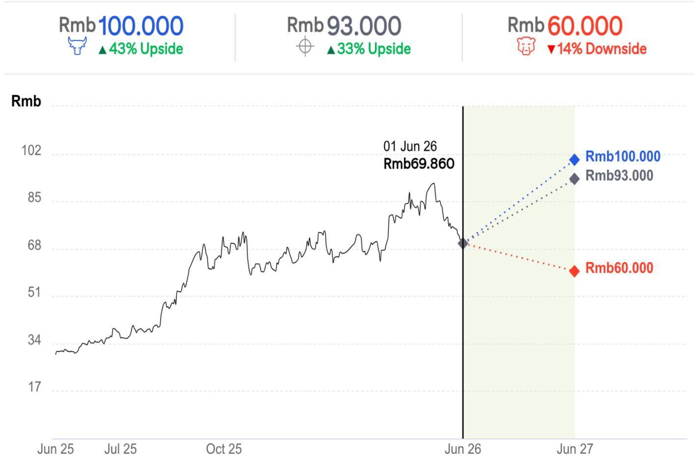
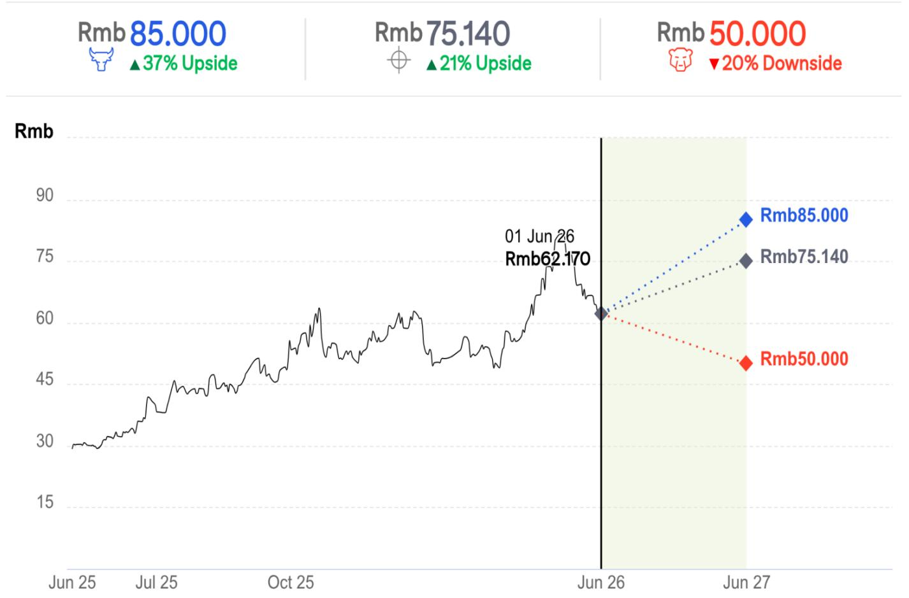
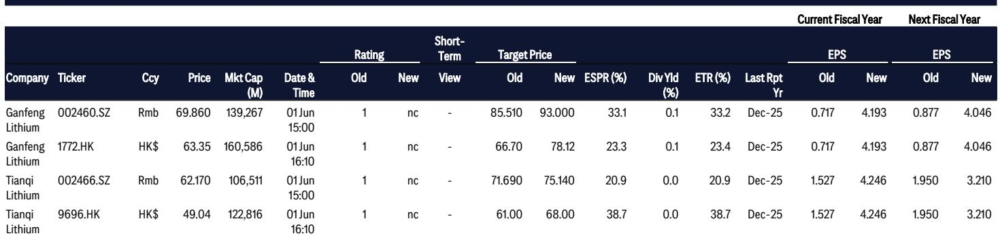

# 市场真正低估的不是需求，而是供给侧的再定价能力

锂价在突破20万元/吨后短暂回落，市场随即出现分歧。一部分投资者担忧高价抑制终端需求，另一部分则怀疑涨势能否持续。但某外资投行在6月初发布的这份研报给出了一个更值得关注的判断：锂价年内有望测试25万元/吨，而权益市场尚未充分定价这一情景。

这不是一个简单的看多观点。它的底层逻辑不同于2021-2022年那轮由补贴和囤货驱动的暴涨。报告的核心主张是：当前锂价上行的驱动力，已经从“故事驱动”切换为“基本面驱动”，而基本面中最被低估的不是需求增速本身，而是供给侧的间歇性断裂与再定价能力。

这份报告基于对电池生产管道、库存动态和供给中断事件的月度追踪，给出了一个可以持续验证的框架。对于任何关注新能源产业链的决策者来说，理解这个框架，比猜测下一个月的锂价数字更有价值。

## 1. 电池生产管道显示，需求侧的高频信号比市场预期的更强劲

市场对2026年新能源车和储能需求的担忧，主要集中在两个点上：一是新能源车销量可能不及预期，二是原材料成本上涨可能侵蚀储能的内部收益率，从而抑制装机。但报告引用的第三方咨询数据显示，这些担忧尚未在实物层面兑现。

2026年前四个月，中国电池产量同比增长41%至874 GWh。其中，动力电池产量增长22%，储能电池产量增长99%。更关键的是，这一增长趋势并非脉冲式。从月度数据看，3月和4月的产量分别达到225 GWh和247 GWh，环比持续加速。这意味着，下游电池厂并没有因为锂价上涨而放缓生产节奏。

为什么需求如此坚韧？报告给出了两个容易被忽略的结构性原因。第一，新能源车出口超预期，拉动了国内电池出货。第二，商用车电动化加速，而商用车的单车电池装机量远高于乘用车。2026年一季度，商用车电池装机量同比增长109%至39 GWh，占全部电池装机的比例从2024年的9%跃升至22%。这个占比的提升，意味着每卖出一辆电动商用车，对锂的消耗量是乘用车的数倍。

对投资者而言，这意味着：即使乘用车增速放缓，商用车和储能这两个结构性增量，已经足以支撑锂需求维持较高增速。市场对“需求见顶”的叙事，可能需要重新校准。

## 2. 库存已降至三年低点，但市场低估了“低库存+高需求”组合的定价含义

报告跟踪的锂碳酸盐库存数据，揭示了一个比需求更紧迫的信号。截至2026年4月，中国锂碳酸盐总库存已从2025年中的约14.5万吨降至约11.5万吨。更关键的是库存结构的变化：冶炼厂库存从6.5万吨骤降至2.5万吨，而下游库存维持在4.5万吨左右。

这意味着什么？冶炼厂库存的快速消耗，表明上游供给正在被下游需求持续消化。而下游库存并未显著累积，说明电池厂并没有在囤货，而是在按需采购。这种“低库存+高需求”的组合，历史上往往预示着价格弹性会超预期——任何供给冲击都会被放大。

报告特别指出，锂价在突破20万元/吨后出现回调，但这更像是技术性修正而非趋势反转。从库存动态看，基本面并未恶化。相反，随着8-9月传统旺季的到来，电池厂为完成年度产量目标，将迎来一轮集中的原料采购需求。届时，如果冶炼厂库存仍处于低位，锂价的第二波上涨可能会比第一波更猛烈。

这个判断的关键假设是：供给端不会在旺季前出现大规模复产。而现实恰恰是，供给端的不确定性正在增加。

## 3. 供给侧的“间歇性断裂”正在重塑定价权，但市场仍未充分消化

如果说需求是锂价上涨的燃料，那么供给中断就是点燃燃料的火花。报告列举了多个供给侧的扰动因素，其中三个值得重点关注。

第一个是JXW矿山的停产。这座矿山自2025年8月起因采矿许可证到期和环保问题停产。虽然宁德时代在2026年初获得了新的采矿权，但环保许可证仍在审批中。报告指出，复产时间表取决于政府流程而非企业意愿，因此市场难以形成一致预期。这意味着，JXW的停产将作为一个持续的供给减量，对锂价形成支撑，直到复产被明确批准。

第二个是江西锂云母矿的潜在风险。报告提到，除了JXW，还有四座锂云母矿可能在年内面临同样的许可证更新问题。虽然企业正在加速生产以提前囤积库存，但如果这些矿山真的需要停产，月度供给减量可能达到8000吨碳酸锂当量，约占中国锂供给的7-8%。这个数字在当前库存水平下不可忽视。

第三个是澳大利亚矿山复产。高锂价正在激励澳洲高成本锂辉石矿重启和扩产。报告列出了Ngungaju、Bald Hill、Mt Marion和Finniss四个项目的复产计划，但它们的增量主要集中在2027年，2026年的实际贡献有限。

把这些碎片拼在一起，可以得出一个清晰的判断：2026年的锂供给是“净减量”的。中国国内的高成本矿山在减产，海外矿山的复产需要时间，而需求仍在增长。这种供需错配的持续时间，取决于政府审批速度和海外项目进展，这两者都存在很大的不确定性。

报告没有完全展开的一个问题是：如果锂价涨到25万元/吨，澳洲矿山是否会加速复产，从而提前结束这个上涨周期？这个问题的答案，将决定这轮锂价上涨是“脉冲式”还是“可持续的”。

## 4. 锂价上涨对产业链利润分配的影响，可能与传统认知相反

市场普遍认为，锂价上涨会挤压中游材料厂商和电池厂的利润。但报告提出了一个反直觉的观点：更强的锂价反映了更强的需求，而这将正面提振整个电池链的股票情绪。

这个逻辑链条是：锂价上涨不是由供给收缩单独驱动的，而是由需求拉动和供给收缩共同作用的结果。如果需求足够强劲，电池厂可以将成本转嫁给下游车企和储能终端。事实上，报告引用的电池产量数据已经表明，电池厂并没有因为锂价上涨而减产，说明它们对成本转嫁有信心。

报告对产业链的偏好排序是：锂 > 正极 > 电池 > 电解液 > 隔膜 > 电池零部件 > 负极。这个排序的核心逻辑是，在上行周期中，上游资源端的利润弹性最大，而下游环节的利润弹性被成本转嫁能力所制约。

但这里有一个报告没有完全展开的观察点：锂价上涨的节奏和幅度，对不同环节的利润影响差异很大。如果锂价温和上涨，电池厂可以通过长协和库存管理平滑成本；如果锂价快速突破25万元/吨，电池厂的转嫁能力可能会受到考验。这个临界点在哪里，报告没有给出明确的答案，但值得持续跟踪。

## 5. 股票层面，市场可能低估了“量价齐升”对龙头公司的价值重估

报告在个股层面给出了两个明确的判断。对于赣锋锂业，报告认为它正经历“量价齐升”的双重顺风：一方面，其在Goulamina、Cauchari、PPG和Mt Marion等项目的权益产量正在增加；另一方面，锂价上行直接提升了盈利弹性。对于天齐锂业，报告认为其估值更具吸引力，短期交易机会仍在，但未来2-3年缺乏产量增量。

这个对比背后，是一个更重要的投资框架：在上行周期中，市场往往会线性外推价格弹性，而低估产量增长带来的价值重估。赣锋锂业正在从“纯资源股”向“资源+成长股”切换，如果这个逻辑成立，它的估值中枢可能系统性上移。

但报告没有充分探讨的一个风险是：如果锂价快速涨至25万元/吨以上，是否会引发政策干预或下游抵制？2022年锂价突破50万元/吨后，监管层曾多次发声并组织座谈会。虽然当前供需格局与彼时不同，但政策风险始终是悬在锂价上方的“达摩克利斯之剑”。

---

这份报告的价值，不在于它给出了一个25万元/吨的目标价，而在于它提供了一个可以持续验证的框架：需求看电池产量和库存，供给看矿山复产和许可证进展，利润分配看成本转嫁能力。沿着这个框架，每个月的电池产量数据、每周的库存变化、每一条矿山复产新闻，都可以被转化为可操作的判断。

但报告也留下了一些未解的问题，比如：如果锂价涨到25万元/吨，澳洲矿山的复产节奏是否会超预期？电池厂的成本转嫁能力在什么价格水平下会达到极限？政策风险的触发条件是什么？这些问题的答案，可能需要更精细的数据和更深入的产业链调研才能找到。

如果你对这些未解问题感兴趣，或者想看到报告中对产业链各环节盈利弹性的详细测算，欢迎来星球微信群里继续讨论。我们会定期分享对锂价、库存和供给事件的跟踪更新，并在关键节点给出判断。

Personal reading notes and learning share only. Not investment advice.

