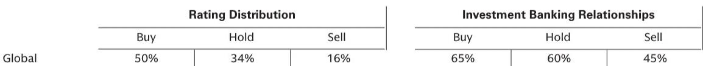

# The AI Infrastructure Race Is No Longer About Raw Compute—It Is About Who Controls the Orchestration Layer

The market for AI infrastructure has passed a critical inflection point. For the past two years, the dominant narrative centered on a single question: who can build the most GPU capacity fastest. That era is ending. In May 2026, a pattern of strategic moves by neocloud providers, hyperscaler partnerships, and enterprise buyers reveals a more complex reality. The winners in the next phase of AI infrastructure will not be those who own the most chips. They will be those who control the software and orchestration layers that make those chips usable at scale for production workloads.

The evidence is accumulating rapidly. IREN's acquisition of Mirantis, Nebius's purchase of Eigen AI, and the Blackstone-Google TPU joint venture all point in one direction: the value chain is vertically integrating around managed services, not just capacity. Meanwhile, Dell's customer announcements at its annual conference show that enterprises are not waiting for a single cloud solution. They are deploying AI across on-premise, hybrid, and edge environments, each requiring a different infrastructure architecture. The market is fragmenting even as it consolidates.

This article interprets the strategic logic behind these developments and provides a framework for decision-makers who must navigate the shifting landscape. The argument is straightforward: the AI infrastructure market is transitioning from a capacity-constrained phase to a capability-constrained phase. The bottlenecks are no longer just chips and power. They are now orchestration, inference optimization, security, and the ability to run agentic workloads reliably across distributed environments.

## The Neocloud Pivot from Commodity Compute to Differentiated Services Marks a Structural Shift in Value Creation

The most telling signal in the May 2026 data is not the size of the contracts or the number of GPUs deployed. It is the acquisition strategy of leading neocloud providers. IREN's purchase of Mirantis for approximately $625 million and Nebius's acquisition of Eigen AI for roughly $643 million are not capacity plays. They are capability plays.

IREN gains Mirantis's Kubernetes-based orchestration and cloud infrastructure management capabilities. This is not a trivial addition. It transforms IREN from a provider of GPU compute capacity—essentially a landlord for AI workloads—into a provider of managed AI cloud services. The acquisition improves IREN's ability to deploy workloads faster, monitor performance, and support enterprise customers who lack the in-house expertise to manage complex GPU clusters. The strategic logic is clear: enterprises do not want to rent GPUs; they want to buy outcomes. They want inference endpoints that work, autoscaling that functions, and security that is built in, not bolted on.

Nebius's acquisition of Eigen AI takes this logic one step further. Eigen AI specializes in inference optimization and model compression techniques such as Sparse Attention and Activation-aware Weight Quantization. These are not academic curiosities. They are the technical keys to making large language models economically viable at scale. Inference costs remain a major barrier to enterprise adoption. By integrating Eigen's optimization stack into its Token Factory platform, Nebius is betting that the unit economics of inference will become a competitive differentiator. The company that can deliver the lowest cost per token with acceptable latency will win the enterprise market.

The so what here is fundamental. The neocloud providers are recognizing that the commodity phase of AI infrastructure—where differentiation was based on access to NVIDIA GPUs and speed of deployment—is ending. As more capacity comes online, margins on raw compute will compress. The value will migrate to the software layers that reduce friction for enterprise customers. Mirantis and Eigen AI are not random acquisitions; they are strategic bets on where the puck is going.

## The Blackstone-Google TPU Joint Venture Signals That Hyperscaler-Infrastructure Partnerships Are Becoming a New Asset Class

The joint venture between Blackstone and Google to create a U.S.-based company offering compute-as-a-service powered by Google's TPUs is a landmark development for several reasons. First, it represents a $5 billion equity commitment from Blackstone, with an initial 500 megawatts of capacity expected online in 2027. This is not a pilot program. It is a major infrastructure bet structured as a separate corporate entity.

Second, the choice of TPUs over NVIDIA GPUs is strategically significant. Google's TPUs are purpose-built for its own AI workloads and have historically been less accessible to external customers. By creating a joint venture that offers TPU-based compute-as-a-service, Google is effectively opening a new front in the cloud AI war. It is competing not just with AWS and Microsoft Azure, but also with the neocloud providers who have built their businesses on NVIDIA hardware. The message is clear: if you want to run Google-optimized AI workloads, you do not need to go to Google Cloud. You can go to a dedicated company that offers TPU capacity with Google's software stack.

For Blackstone, the rationale is equally compelling. Infrastructure assets with long-term contracted cash flows are increasingly attractive to institutional investors. The AI infrastructure buildout requires trillions of dollars in capital over the next decade. Traditional data center REITs and power providers cannot meet this demand alone. The Blackstone-Google model—a dedicated company with a hyperscaler as a technology partner and a financial sponsor providing equity—could become a template for future projects. It bridges the gap between the capital intensity of AI infrastructure and the risk appetite of institutional investors.

The implication for market participants is clear. The days when AI infrastructure was solely the domain of cloud hyperscalers and GPU-as-a-service startups are over. A new asset class is emerging, one that combines long-duration capital, hyperscaler technology, and dedicated corporate structures. This will change the competitive dynamics for neoclouds, data center operators, and enterprise buyers alike.

## Enterprise AI Deployment Is Fragmenting Across On-Premise, Hybrid, and Edge—Creating New Requirements for Infrastructure Providers

The announcements at Dell Technologies World in May 2026 provide a counterpoint to the neocloud and hyperscaler narratives. While much of the industry attention focuses on large-scale cloud deployments, enterprises are simultaneously building AI infrastructure in their own data centers, at the edge, and in hybrid configurations.

Consider the customer examples Dell highlighted. Eli Lilly's LillyPod supercomputer, with 1,016 Blackwell Ultra GPUs, is an on-premise deployment for drug discovery and manufacturing simulation. Hudson River Trading is using Dell's AI factory for a purpose-built research data center in Norway. Mazda is standardizing on Dell's AI Data Platform to unify model-based development and CAD storage, with plans to evolve into a data lake for generative AI workloads. Samsung is using Dell solutions for semiconductor design and manufacturing automation.

These are not edge cases. They represent a structural trend. Enterprises in regulated industries, those with large existing IT investments, and those with latency-sensitive or data-intensive workloads are choosing on-premise and hybrid deployments for reasons that go beyond cost. Control over data, security, and the ability to customize infrastructure for specific workloads are driving these decisions.

The so what for infrastructure providers is that the one-size-fits-all cloud model is insufficient. Enterprises need validated reference architectures, integrated rack-scale solutions, and professional services that span the full stack from hardware to orchestration. Dell's launch of PowerRack—pre-built, validated rack-scale solutions with integrated power and cooling—directly addresses this need. So does its support for NVIDIA's OpenShell runtime platform for agentic AI workloads.

The fragmentation of enterprise AI deployment creates both opportunity and complexity. For neoclouds and hyperscalers, it means that winning the enterprise market requires more than just competitive pricing for GPU capacity. It requires the ability to integrate with on-premise environments, support hybrid architectures, and provide the software and services that make AI workloads production-ready.

## What the Report Does Not Fully Answer: The Sustainability of Neocloud Business Models and the True Cost of Inference at Scale

For all the detail in the May 2026 project pulse, several critical questions remain unanswered. The first concerns the sustainability of neocloud business models. IREN's $1.6 billion purchase agreement with Dell for Blackwell-based systems is financed through a five-year AI cloud contract with NVIDIA. But the economics of these contracts are opaque. How much of the revenue is locked in? What happens if demand for training capacity softens as enterprises shift more spending to inference? The neoclouds are making large capital commitments based on assumptions about future demand that have not been stress-tested.

The second unresolved question is the true cost of inference at scale. The Nebius-Eigen AI acquisition highlights the importance of inference optimization, but the market lacks standardized benchmarks for inference cost per token across different hardware configurations and optimization techniques. Enterprises making build-versus-buy decisions for AI infrastructure need transparent data on total cost of ownership. Currently, that data is largely proprietary and fragmented.

The third open question is the role of sovereign AI infrastructure. The report notes the Spectra supercomputer at Sandia National Laboratories and the Sharon AI cloud deal in Australia, but these are isolated examples. The broader question of how governments will invest in domestic AI infrastructure—and whether that investment will compete with or complement commercial capacity—remains unanswered. The report provides data points but not a framework for analyzing the sovereign AI opportunity.

These gaps are not criticisms of the report. They are inherent limitations of a monthly project pulse that tracks announcements rather than outcomes. The full report likely contains deeper analysis of these questions. For serious investors and strategists, the open questions are where the most value lies.

## A Decision Framework for Navigating the AI Infrastructure Landscape

Based on the patterns in the May 2026 data, decision-makers should evaluate AI infrastructure opportunities and risks through three lenses: orchestration maturity, inference economics, and deployment flexibility.

Orchestration maturity refers to the software and services layer that sits above the hardware. Providers that have invested in Kubernetes-based orchestration, monitoring, and management tools—like IREN through Mirantis—are better positioned to serve enterprise customers than those offering bare-metal GPU access. When evaluating a neocloud or data center operator, ask: can they manage the full lifecycle of an AI workload, or are they just providing the compute?

Inference economics is the second lens. The Nebius-Eigen AI acquisition and the Akamai-Anthropic contract both point to inference as the next battleground. The provider that can deliver the lowest cost per token with acceptable latency and reliability will capture disproportionate value. But inference economics depend not just on hardware but on optimization software, model architecture, and workload characteristics. When comparing providers, look for evidence of proprietary optimization techniques and benchmarks that go beyond raw GPU counts.

Deployment flexibility is the third lens. The enterprise examples from Dell Technologies World show that AI infrastructure is not a one-size-fits-all market. Providers that can support on-premise, hybrid, and edge deployments—and integrate with existing enterprise IT environments—will have a structural advantage. The rise of agentic AI workloads, which require low-latency inference and secure sandboxed environments, will further increase the importance of deployment flexibility.

These three lenses—orchestration, inference, and flexibility—provide a framework for evaluating both investment opportunities and vendor selection. The market is moving fast, and the winners will be those who can execute across all three dimensions.

## The Full Picture Requires Deeper Analysis of the Original Charts and Data

The May 2026 project pulse provides a valuable snapshot of a rapidly evolving market. But a monthly summary of announcements, no matter how well-curated, cannot capture the full strategic picture. The original report contains detailed charts on capacity deployment timelines, pricing trends, and competitive positioning that are essential for making informed decisions.

For investors and strategists who want to understand where the AI infrastructure market is heading, the headlines are only the beginning. The real insights lie in the data behind the announcements: the capacity projections, the pricing models, and the competitive dynamics that the charts reveal.

Join the community to read the full report and review the original charts.

*This article is for learning and discussion only and does not constitute investment advice.*

Personal reading notes and learning share only. Not investment advice.

