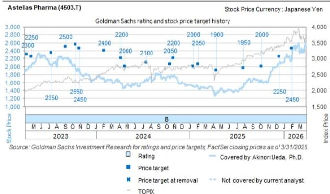

# The Next Wave of Japanese Oncology: Why Differentiation, Not Just Data, Will Decide the Winners

The 2026 American Society of Clinical Oncology meeting has delivered a clear signal for investors tracking Japan's pharmaceutical sector: the era of broad pipeline optimism is giving way to a more demanding phase of precision-based differentiation. For the four major Japanese oncology players—Ono Pharmaceutical, Takeda, Daiichi Sankyo, and Astellas—the data released at ASCO 2026 does not rewrite the fundamental thesis for any single stock, but it sharpens the strategic questions that will determine which companies emerge as long-term leaders. The key insight is this: clinical efficacy is no longer sufficient to guarantee commercial success. The market is now demanding evidence of patient selection precision, safety advantages, and competitive moats that extend beyond mechanism of action.

The ASCO 2026 abstracts reveal a pattern that investors must internalize. Promising data from Ono's ONO-4578 in gastric cancer comes with a critical caveat: the benefit appears concentrated in PD-L1 positive patients, while a worsening trend was observed in PD-L1 negative subgroups. This is not a failure, but it is a constraint that fundamentally alters the commercial addressable market. Similarly, the favorable data for daraxonrasib, a competitor to Astellas' setidegrasib in pancreatic cancer, does not invalidate Astellas' approach, but it raises the stakes for demonstrating meaningful differentiation in the first-line setting. And in the TROP2-directed ADC space, where Daiichi Sankyo's Datroway faces a new competitor in sac-TMT, the battle lines are being drawn not just around efficacy, but around safety and convenience.

This is not a moment for binary judgments. The data from ASCO 2026 does not support sweeping upgrades or downgrades across the Japanese pharma coverage. Instead, it demands a more nuanced framework: one that evaluates pipeline assets not on isolated statistical significance, but on their ability to carve out defensible positions in increasingly crowded therapeutic landscapes. The following analysis unpacks the strategic implications of the key data points and provides a decision framework for investors navigating this inflection point.

## The ONO-4578 Data Reveals a Precision Medicine Trap That Could Limit Commercial Upside

Ono Pharmaceutical's Phase 2 results for ONO-4578 in first-line gastric cancer represent a textbook example of why "generally positive" is not the same as "commercially compelling." The headline numbers are encouraging: a statistically significant improvement in progression-free survival when added to nivolumab and chemotherapy, with a hazard ratio of 0.67. Median PFS extended from 6.9 months to 9.0 months, and overall survival showed a hazard ratio of 0.60. These are not trivial signals.

But the subgroup analysis tells a more complex story. The benefit was pronounced in PD-L1 positive patients, where the PFS hazard ratio dropped to 0.52 and the OS hazard ratio to 0.44. In PD-L1 negative or indeterminate patients, however, no clear benefit was observed, and there was even a suggestion of a worsening trend across PFS, OS, and overall response rate. Furthermore, the improvement was smaller in Claudin 18.2-positive patients. These findings are exploratory and based on small numbers, but they cannot be dismissed.

The strategic implication is straightforward: if ONO-4578 ultimately requires PD-L1 positive status for efficacy, its addressable patient population shrinks significantly. In first-line gastric cancer, roughly 40-60% of patients are PD-L1 positive depending on the cutoff used. This does not make ONO-4578 a failure, but it transforms the commercial calculus. Ono plans to initiate a global Phase 3 trial this year, and investors should watch carefully whether the enrollment criteria reflect the subgroup signals from Phase 2. If the Phase 3 trial narrows its focus to PD-L1 positive patients, the probability of success increases, but the peak sales potential decreases. If it maintains broad enrollment, the risk of a negative or equivocal result rises.

The deeper question is whether ONO-4578 can differentiate itself in the PD-L1 positive subgroup against existing and emerging therapies. The current standard of care already includes nivolumab plus chemotherapy in PD-L1 positive patients. Adding ONO-4578 improved efficacy, but the incremental benefit must be weighed against the added toxicity and cost. This is not a clear win until Phase 3 data confirms the magnitude and durability of the benefit in a larger, more rigorously defined population.

## Takeda's IBI363 Partnership Shows Promise but the Real Test Lies in US Phase 2 Data

The IBI363 (TAK-928) data from Innovent Biologics in first-line non-small cell lung cancer is notable for what it confirms rather than what it reveals. The Phase 1 dose optimization trial showed an overall response rate of 81.8% in the recommended 3-1.5 mg/kg regimen, with efficacy observed across histological subtypes and PD-L1 expression levels. The response rate in PD-L1 negative patients was 76.9%, which is unusually high for this difficult-to-treat population.

However, the safety profile warrants attention. Grade 3 or higher adverse event rates ranged from 43.5% to 69.0% across dosing arms. While manageable in a Phase 1 setting, such toxicity rates will face scrutiny in later-stage trials, particularly as combination regimens are tested against established standards of care.

The critical inflection point for Takeda is not the ASCO data itself, but the upcoming Phase 2 trial in the United States. This trial will test IBI363 in a Western patient population with different genetic backgrounds, treatment histories, and tolerability profiles compared to the Chinese cohort in the Phase 1 data. The US trial results will determine whether IBI363 can replicate its efficacy in a more diverse population and whether the safety profile is acceptable for broader clinical use.

For Takeda, IBI363 represents a bet on a novel mechanism that could complement its existing oncology pipeline. But the partnership structure with Innovent means Takeda's financial exposure is limited, and the strategic value depends on whether IBI363 can achieve differentiation in the increasingly competitive NSCLC landscape. The ASCO data keeps the hypothesis alive, but it does not yet prove the thesis.

## Daiichi Sankyo's Datroway Faces a Credible Competitor, but Differentiation on Safety and Convenience May Preserve Its Position

The emergence of sac-TMT as a potential competitor to Datroway in first-line NSCLC is the most consequential competitive development from ASCO 2026 for Daiichi Sankyo. The OptiTROP-Lung05 trial showed a PFS hazard ratio of 0.35 for sac-TMT plus pembrolizumab versus pembrolizumab alone, with a median PFS not reached versus 5.7 months. These are striking numbers.

Yet the competitive picture is more nuanced than a simple comparison of hazard ratios. Datroway has several structural advantages that sac-TMT will need to overcome. First, the safety profile matters enormously in first-line treatment, where patients are generally healthier and more sensitive to toxicity. The sac-TMT trial showed notable rates of neutropenia (17.3%), anemia (9.1%), and stomatitis (5.3%). Datroway's safety data from the TROPION-Lung trials has been manageable, and the drug's differentiated design may confer tolerability advantages.

Second, convenience matters. Datroway is administered on a standard dosing schedule that fits easily into clinical workflows. Sac-TMT's dosing and administration profile will need to be competitive on this dimension as well.

Third, and most importantly, the biomarker strategy will be decisive. Daiichi Sankyo is pursuing a targeted approach with the AVANZAR trial in TROP2 biomarker-positive patients, with data expected in the second half of 2026. If Datroway can demonstrate superior efficacy in a well-defined biomarker-selected population, it can carve out a defensible niche even if sac-TMT shows broad activity.

The TROPION-Lung07 and TROPION-Lung08 trials will further clarify Datroway's positioning across PD-L1 expression levels. The corresponding TroFuse trials for sac-TMT have not yet disclosed their designs for these specific patient segments, creating an information asymmetry that Daiichi Sankyo can exploit.

For investors, the key monitoring point is not whether sac-TMT is a real competitor—it clearly is—but whether Datroway can maintain differentiation on safety, convenience, and biomarker selection. The next 12-18 months of clinical data will determine whether Daiichi Sankyo's ADC franchise faces a genuine threat or a manageable competitive challenge.

## The Darwinian Dynamics of KRAS Targeting Will Determine Astellas' Setidegrasib Opportunity

The daraxonrasib data from Revolution Medicines represents the most significant competitive development for Astellas' setidegrasib program. The RASolute 302 trial in second-line pancreatic cancer showed a median overall survival of 13.2 months versus 6.7 months for chemotherapy, with a hazard ratio of 0.40. The benefit was consistent across KRAS G12D and G12V mutations, with a hazard ratio of 0.38 in that subgroup.

This is a high bar for setidegrasib to match. Setidegrasib is a protein degrader targeting KRAS G12D specifically, while daraxonrasib is a multiselective inhibitor covering multiple RAS mutations. The broader activity of daraxonrasib could give it a larger addressable patient population, but the specific targeting of setidegrasib may offer advantages in potency or tolerability for G12D patients.

The decisive battleground will be first-line pancreatic cancer, where both drugs are pursuing clinical trials. Astellas is conducting a global Phase 3 trial in metastatic PDAC first-line with KRAS G12D mutation. Revolution Medicines is running the RASolute303 trial for daraxonrasib and the RASolute305 and RASolute309 trials for its G12D-targeting agent zoldonrasib. The first-line setting is where the commercial opportunity is largest, and where the differentiation between these approaches will become clearest.

For Astellas, the immediate implication is that setidegrasib must demonstrate best-in-class efficacy and safety in the G12D population to justify its narrower targeting. If daraxonrasib shows comparable or superior results in G12D patients while also covering other mutations, the competitive pressure on setidegrasib will intensify. Conversely, if setidegrasib can show meaningfully better tolerability or deeper responses in G12D patients, it can establish a defensible position.

The ASCO 2026 data does not change the fundamental thesis for Astellas, but it raises the urgency of executing the first-line trials efficiently and generating compelling comparative data. Investors should monitor the enrollment rates, interim analyses, and any biomarker data that emerges from these trials over the next 12-24 months.

## A Decision Framework for Navigating the Post-ASCO Landscape

The ASCO 2026 data does not support a uniform view across Japanese pharma stocks. Instead, it requires a framework that evaluates each company on four dimensions: evidence quality, competitive positioning, commercial addressability, and execution risk.

For Ono Pharmaceutical, the key question is whether the Phase 3 trial design for ONO-4578 will reflect the subgroup signals from Phase 2. If the trial narrows to PD-L1 positive patients, the risk-reward improves for the drug's approval probability but reduces peak sales potential. Investors should assign a probability to each scenario and adjust valuation accordingly.

For Takeda, the focus should be on the US Phase 2 data for IBI363. The ASCO data is supportive but not determinative. The stock's risk-reward depends on whether the US trial replicates the efficacy and improves the safety profile seen in the Chinese cohort.

For Daiichi Sankyo, the competitive threat from sac-TMT is real but manageable if Datroway can demonstrate differentiation on safety, convenience, or biomarker selection. The AVANZAR trial data in the second half of 2026 is the critical catalyst. Investors should overweight the importance of safety comparisons and underweight isolated efficacy comparisons across different trial populations.

For Astellas, the daraxonrasib data raises the bar for setidegrasib but does not invalidate the thesis. The first-line pancreatic cancer trials will be the ultimate determinant. Investors should focus on the relative efficacy and safety profiles in the G12D population specifically, rather than broad comparisons across mutation types.

The common thread across all four stories is that precision medicine is becoming a competitive necessity, not just a scientific aspiration. Drugs that require broad patient populations to achieve commercial viability face increasing risk as competitors carve out niche positions with better data in selected subgroups. The winners will be those that can identify their optimal patient population early and design trials that demonstrate clear, differentiated benefit in that group.

## Join the Community to Read the Full Report and Review the Original Charts

The ASCO 2026 data provides a rich dataset for investors, but the full strategic picture requires deeper analysis of trial designs, competitive landscapes, and financial implications. The original report includes detailed charts on trial outcomes, subgroup analyses, and competitive comparisons that are essential for building conviction on any of these names. It also contains the analysts' price targets, ratings, and risk assessments for each covered company.

Join the community to access the complete research, including the original data tables and analyst commentary that informed this analysis. The full report provides the granular detail necessary to make informed investment decisions in this rapidly evolving sector.

*This article is for learning and discussion only and does not constitute investment advice.*

Personal reading notes and learning share only. Not investment advice.

