# EM USD 10s30s Spread Curve Report

Muted Flattening Leaves EM Spread Curve Shape Intact

- After a broad EM steepening move last month, curves have flattened slightly. The EM aggregate 10s30s curve bull flattened by 1bp to 68bp over the past month, driven by EM IG flattening by 1bp m/m to 61bp. The EMBIG curve followed the overall muted bull flattening move, tightening by 1bp to 71bp, with EMBIG Asia driving the move by flattening 7bp m/m to 37bp. Over the past month, the UST 10s30s curve bear flattened by 6bp to 54bp, while the US HG 10s30s curve also flattened by 2bp to 16bp.   
- CEMBI also flattened marginally by -1bp m/m to 56bp, led by Latin America (-1bp m/m to 52bp). The magnitude of the bull flattening was more more substantial in the individual pairs within the region, but the average move was mitigated by the exit of the flattest issuer. CEMBI CEEMEA (-2bp m/m to 60bp) flattened as well, whereas CEMBI Asia (+3bp m/m to 61bp) steepened. Overall, the curves have been relatively stable on average despite the meaningful swings in UST yields.   
- TThe largest steepening over the month was led by DOMREP (11bp), CDEL (9bp), BABA (7bp), KSA (7bp), and PARGUY (7bp). Meanwhile, the largest flattening over the month was led by INDON (-26bp), GRUMAB (-13bp), EGYPT (-12bp), SQM (-12bp), and AITOCU (-11bp).   
- Steepest curves are led by EGYPT (141bp), PEMEX (121bp), ELSALV (116bp), SOAF (104bp), and KSA (90bp). Meanwhile, the flattest curves are led by INDON (9bp), SQM (22bp), GRUMAB (39bp), EXIMBK (39bp) and ECOPET (41bp).   
- Composition changes: At the May month-end rebalance, EGYPT and INDON now reference a new 10-year or 30-year pair in the EMBI 10s30s index. In the CEMBI 10s30s index, BIMBOA exits.

See here for rules and methodology and here for the archive of previous reports

Figure 1: Steepest and flattest 10s30s curves   
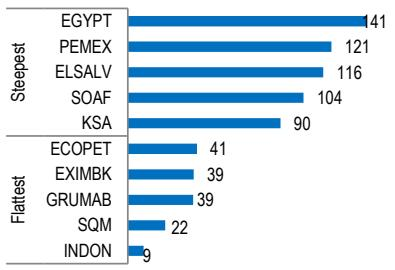

bar

| Category | Value |
|---|---|
| EGYPT | 141 |
| PEMEX | 121 |
| ELSALV | 116 |
| SOAF | 104 |
| KSA | 90 |
| ECOPET | 41 |
| EXIMBK | 39 |
| GRUMAB | 39 |
| SQM | 22 |
| INDON | 9 |

Source: All charts and data in this report: JPM. Levels as of 29th May 2026, COB.

Figure 2: Largest 1m changes in 10s30s   
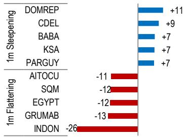

bar

| Category | Value |
|---|---|
| DOMREP | +11 |
| CDEL | +9 |
| BABA | +7 |
| KSA | +7 |
| PARGUY | +7 |
| AITOCU | -11 |
| SQM | -12 |
| EGYPT | -12 |
| GRUMAB | -13 |
| INDON | -26 |

# Emerging Markets Strategy

# Ankit Chawla AC

(91-22) 6157-3281

ankit.chawla@jpmchase.com

JPM India Private Limited

# Nishant M Poojary, CFA

(44 20) 3493-3859

nishant.m.poojary@JPM.com

JPM Securities plc

# Emerging Markets Corporate Strategy

# Yang-Myung Hong

(1-212) 834-4274

ym.hong@JPM.com

JPM Securities LLC

# Global Index Research

# Pallav Poddar

(44 20) 3493-5201

pallav.poddar@JPM.com

JPM Securities plc

# 10s30s Spread Curve Overview

Figure 3: Summary of 10s30s curves across EM sovereigns, EM corporates, US HG and US Treasuries 

<table><tr><td>Aggregate</td><td>Current</td><td>1m</td><td>1y</td><td>10y Spd</td><td>30y Spd</td><td>1y Avg</td><td>1y Low</td><td>1y Low○ 1m ago</td><td>1y High● Current</td><td>1y High</td><td>Index</td><td>Region</td><td>Count</td></tr><tr><td>EM Aggregate</td><td>68</td><td>-1</td><td>-10</td><td>177</td><td>245</td><td>67</td><td>58</td><td>●</td><td>◆</td><td>●</td><td>79</td><td>Agg</td><td>Global</td></tr><tr><td>EM IG</td><td>61</td><td>-1</td><td>-14</td><td>132</td><td>193</td><td>62</td><td>52</td><td>●</td><td>◆</td><td>○</td><td>76</td><td>Agg</td><td>Global</td></tr><tr><td>EM HY</td><td>82</td><td>+0</td><td>-2</td><td>275</td><td>357</td><td>80</td><td>70</td><td>●</td><td></td><td>◆</td><td>86</td><td>Agg</td><td>Global</td></tr><tr><td>EMBIG</td><td>71</td><td>-1</td><td>-8</td><td>178</td><td>249</td><td>71</td><td>61</td><td>●</td><td></td><td>◆</td><td>79</td><td>EMBIG</td><td>Global</td></tr><tr><td>EMBIG Sov</td><td>70</td><td>-1</td><td>-7</td><td>190</td><td>260</td><td>71</td><td>61</td><td>●</td><td></td><td>◆</td><td>79</td><td>EMBIG</td><td>Global</td></tr><tr><td>EMBIG Quasi</td><td>63</td><td>-2</td><td>-8</td><td>138</td><td>201</td><td>61</td><td>53</td><td>●</td><td></td><td>◆</td><td>71</td><td>EMBIG</td><td>Global</td></tr><tr><td>EMBIG Asia</td><td>37</td><td>-7</td><td>-23</td><td>99</td><td>136</td><td>41</td><td>30</td><td>●</td><td>◆</td><td>○</td><td>61</td><td>EMBIG</td><td>Asia</td></tr><tr><td>EMBIG CEEMEA</td><td>77</td><td>-1</td><td>+4</td><td>186</td><td>263</td><td>72</td><td>57</td><td>●</td><td></td><td></td><td>84</td><td>EMBIG</td><td>CEEMEA</td></tr><tr><td>EMBIG LatAm</td><td>67</td><td>+1</td><td>-15</td><td>189</td><td>257</td><td>70</td><td>61</td><td>●</td><td>◆</td><td>○</td><td>82</td><td>EMBIG</td><td>Latin America</td></tr><tr><td>EMBIG IG</td><td>62</td><td>-2</td><td>-12</td><td>133</td><td>196</td><td>64</td><td>52</td><td>●</td><td></td><td>◆</td><td>75</td><td>EMBIG</td><td>Global</td></tr><tr><td>EMBIG HY</td><td>88</td><td>+1</td><td>-0</td><td>264</td><td>352</td><td>86</td><td>76</td><td>●</td><td></td><td></td><td>94</td><td>EMBIG</td><td>Global</td></tr><tr><td>CEMBI</td><td>56</td><td>-1</td><td>-18</td><td>176</td><td>232</td><td>55</td><td>39</td><td>●</td><td></td><td>◆</td><td>76</td><td>CEMBI</td><td>Global</td></tr><tr><td>CEMBI Asia</td><td>61</td><td>+3</td><td>+13</td><td>57</td><td>118</td><td>53</td><td>40</td><td>●</td><td></td><td></td><td>65</td><td>CEMBI</td><td>Asia</td></tr><tr><td>CEMBI CEEMEA</td><td>60</td><td>-2</td><td>-32</td><td>152</td><td>212</td><td>67</td><td>55</td><td>●</td><td>◆</td><td>○</td><td>95</td><td>CEMBI</td><td>CEEMEA</td></tr><tr><td>CEMBI LatAm</td><td>52</td><td>-1</td><td>-14</td><td>227</td><td>279</td><td>50</td><td>24</td><td>●</td><td></td><td></td><td>68</td><td>CEMBI</td><td>Latin America</td></tr><tr><td>CEMBI IG</td><td>58</td><td>-0</td><td>-19</td><td>127</td><td>185</td><td>57</td><td>38</td><td>●</td><td></td><td>◆</td><td>79</td><td>CEMBI</td><td>Global</td></tr><tr><td>CEMBI HY</td><td>48</td><td>-0</td><td>-14</td><td>334</td><td>382</td><td>47</td><td>20</td><td>●</td><td></td><td></td><td>68</td><td>CEMBI</td><td>Global</td></tr><tr><td>US High Grade</td><td>16</td><td>-2</td><td>-1</td><td>83</td><td>93</td><td>16</td><td>10</td><td>●</td><td></td><td>◆</td><td>22</td><td>JULI</td><td>US</td></tr><tr><td>US Treasuries</td><td>54</td><td>-6</td><td>+4</td><td>445</td><td>499</td><td>60</td><td>45</td><td>●</td><td></td><td>◆</td><td>70</td><td>GBI-US</td><td>US</td></tr></table>

Figure 4: 10s30s curves versus the 10y level relationship   
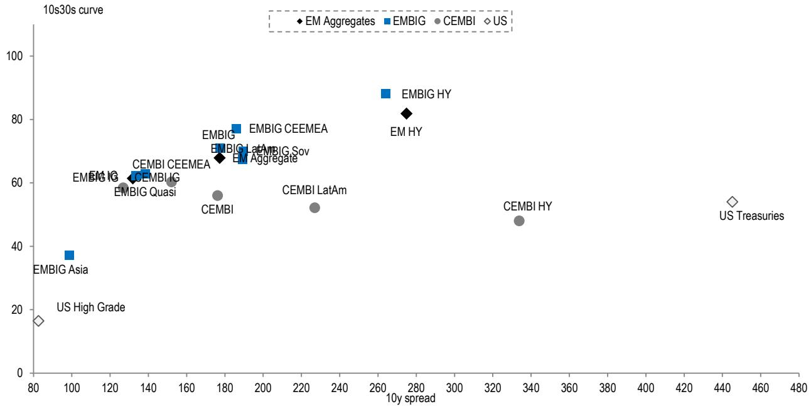

scatter

| Category         | 10y spread | 10s30s curve |
| ---------------- | ---------- | ------------ |
| EM AGgregates    | 270        | 82           |
| EMBIG HY         | 265        | 88           |
| CEMBI HY         | 335        | 48           |
| US Treasuries     | 445        | 55           |
| CEMBI LatAm      | 225        | 52           |
| CEMBI          | 175        | 56           |
| CEMBI Quasi      | 125        | 58           |
| EMBIG Asia       | 100        | 37           |
| EM Big            | 130        | 62           |
| EMBIG AGG         | 180        | 68           |
| EMBIG CEEMEA     | 185        | 77           |
| EMBIG LatAm      | 190        | 67           |
| EMBIG Avg         | 195        | 69           |
| EMBIG CyEMEA     | 185        | 76           |
| EMBIG IG          | 130        | 61           |
| US High Grade    | 85         | 17           |

Figure 5: 1m change in aggregate 10s30s versus 1m change in aggregate 10y spreads   
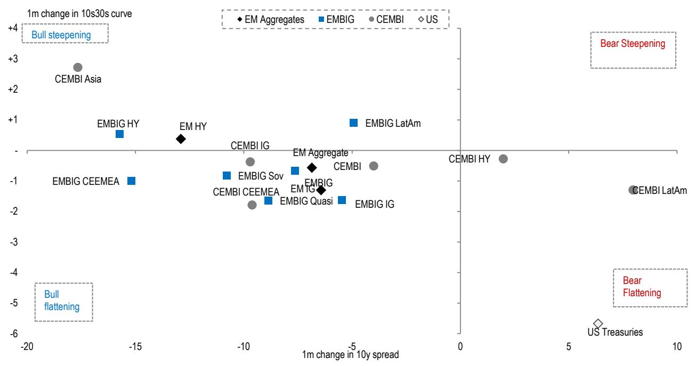

scatter

| Entity           | 1m change in 10y spread | 1m change in 10s30s curve |
| ---------------- | ------------------------ | -------------------------- |
| CEMBI Asia       | -18                      | +2                         |
| EM HY            | -14                      | -0.5                       |
| EMBIG HY         | -16                      | -0.8                       |
| EM Big Avgregates| -7                       | -0.8                       |
| CEMBI IG         | -9                       | -0.5                       |
| EMBIG Latvia      | -5                       | 0.5                        |
| CEMBI CyEMEA     | -15                      | -1                         |
| EMBIG Sov        | -11                      | -0.8                       |
| CEMBI CEEMEA     | -9                       | -1.5                       |
| EMBIG Quasi      | -7                       | -1.8                       |
| EM AGgregate     | -6                       | -0.5                       |
| CEMBI            | -4                       | -0.5                       |
| EMBIG IG         | -6                       | -1.5                       |
| CEMBI Hy         | 2                        | -0.5                       |
| CEMBI LatAm      | 8                        | -1                         |
| US Treasuries    | 7                        | -6                         |
| Bear Steepening   | 2                        | 3                          |
| Bear Flattening   | 8                        | -1                         |

Figure 6: 1m change in aggregate 10s30s versus 1m change in 10y spreads by issuer

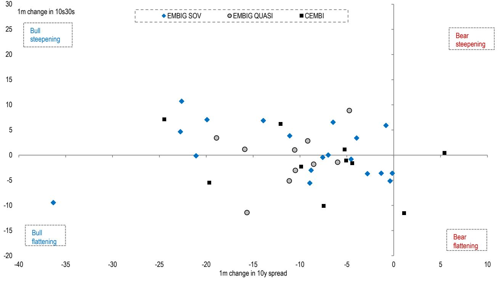

scatter

| Index       | 1m change in 10y spread | 1m change in 10s30s |
|-------------|--------------------------|----------------------|
| EMBIG SOV   | -35                      | -10                  |
| EMBIG SOV   | -25                      | 10                   |
| EMBIG SOV   | -20                      | 7                    |
| EMBIG SOV   | -15                      | 7                    |
| EMBIG SOV   | -10                      | 4                    |
| EMBIG SOV   | -8                       | 0                    |
| EMBIG SOV   | -6                       | -2                   |
| EMBIG SOV   | -4                       | -1                   |
| EMBIG SOV   | -2                       | -4                   |
| EMBIG SOV   | 0                        | -5                   |
| EMBIG SOV   | 2                        | -6                   |
| EMBIG SOV   | 4                        | -7                   |
| EMBIG SOV   | 6                        | -8                   |
| EMBIG QUASI  | -25                      | 7                    |
| EMBIG QUASI  | -20                      | 3                    |
| EMBIG QUASI  | -15                      | 1                    |
| EMBIG QUASI  | -10                      | 1                    |
| EMBIG QUASI  | -8                       | -3                   |
| EMBIG QUASI  | -6                       | -2                   |
| EMBIG QUASI  | -4                       | -1                   |
| EMBIG QUASI  | -2                       | -1                   |
| EMBIG QUASI  | 0                        | -1                   |
| EMBIG QUASI  | 2                        | -1                   |
| CEMBI       | -25                      | 7                    |
| CEMBI       | -20                      | -6                   |
| CEMBI       | -15                      | 6                    |
| CEMBI       | -10                      | -3                   |
| CEMBI       | -8                       | -2                   |
| CEMBI       | -6                       | -1                   |
| CEMBI       | -4                       | 1                    |
| CEMBI       | -2                       | -2                   |
| CEMBI       | 0                        | -2                   |
| CEMBI       | 2                        | -2                   |
| CEMBI       | 4                        | -2                   |
| CEMBI       | 6                        | -2                   |
| CEMBI       | 8                        | -2                   |
| CEMBI       | 10                       | -2                   |
| CEMBI       | 12                       | -2                   |
| CEMBI       | 14                       | -2                   |
| CEMBI       | 16                       | -2                   |
| CEMBI       | 18                       | -2                   |
| CEMBI       | 20                       | -2                   |
| CEMBI       | 22                       | -2                   |
| CEMBI       | 24                       | -2                   |
| CEMBI       | 26                       | -2                   |
| CEMBI       | 28                       | -2                   |
| CEMBI       | 30                       | -2                   |
| CEMBI       | 32                       | -2                   |
| CEMBI       | 34                       | -2                   |
| CEMBI       | 36                       | -2                   |
| CEMBI       | 38                       | -2                   |
| CEMBI       | 40                       | -2                   |
| CEMBI       | 42                       | -2                   |
| CEMBI       | 44                       | -2                   |
| CEMBI       | 46                       | -2                   |
| CEMBI       | 48                       | -2                   |
| CEMBI       | 50                       | -2                   |
| CEMBI       | 52                       | -2                   |
| CEMBI       | 54                       | -2                   |
| CEMBI       | 56                       | -2                   |
| CEMBI       | 58                       | -2                   |
| CEMBI       | 60                       | -2                   |
| CEMBI       | 62                       | -2                   |
| CEMBI       | 64                       | -2                   |
| CEMBI       | 66                       | -2                   |
| CEMBI       | 68                       | -2                   |
| CEMBI       | 70                       | -2                   |
| CEMBI       | 72                       | -2                   |
| CEMBI       | 74                       | -2                   |
| CEMBI       | 76                       | -2                   |
| CEMBI       | 78                       | -2                   |
| CEMBI       | 80                       | -2                   |
| CEMBI       | 82                       | -2                   |
| CEMBI       | 84                       | -2                   |
| CEMBI       | 86                       | -2                   |
| CEMBI       | 88                       | -2                   |
| CEMBI       | 90                       | -2                   |
| CEMBI       | 92                       | -2                   |
| CEMBI       | 94                       | -2                   |
| CEMBI       | 96                       | -2                   |
| CEMBI       | 98                       | -2                   |
| CEMBI       | 100                      | -2                   |
| BULL flattening     | -35                     | -15                  |
| BULL flattening     | -30                     | -15                  |
| BULL flattening     | -25                     | -15                  |
| BULL flattening     | -20                     | -15                  |
| BULL flattening     | -15                     | -15                  |
| BULL flattening     | -10                     | -15                  |
| BULL flattening     | -8                      | -15                  |
| BULL flattening     | -6                      | -15                  |
| BULL flattening     | -4                      | -15                  |
| BULL flattening     | -2                      | -15                  |
| BULL flattening     | 0                        | -15                  |
| BULL flattening     | 2                        | -15                  |
| BULL flattening     | 4                        | -15                  |
| BULL flattening     | 6                        | -15                  |
| BULL flattening     | 8                        | -15                  |
| BULL flattening     | 10                       | -15                  |
| BULL flattening     | 12                       | -15                  |
| BULL flattening     | 14                       | -15                  |
| BULL flattening     | 16                       | -15                  |
| BULL flattening     | 18                       | -15                  |
| BULL flattening     | 20                       | -15                  |
| BULL flattening     | 22                       | -15                  |
| BULL flattening     | 24                       | -15                  |
| BULL flattening     | 26                       | -15                  |
| BULL flattening     | 28                       | -15                  |
| BULL flattening     | 30                       | -15                  |
| BULL flattening     | 32                       | -15                  |
| BULL flattening     | 34                       | -15                  |
| BULL flattening     | 36                       | -15                  |
| BULL flattening     | 38                       | -15                  |
| BULL flattening     | 40                       | -15                  |
| BULL flattening     | 42                       | -15                  |
| BULL flattening     | 44                       | -15                  |
| BULL flattening     | 46                       | -15                  |
| BULL flattening     | 48                       | -15                  |
| BULL flattening     | 50                       | -15                  |
| BULL flattening     | 52                       | -15                  |
| BULL flattening     | 54                       | -15                  |
| BULL flattening     | 56                       | -15                  |
| BULL flattening     | 58                       | -15                  |
| BULL flattening     | 60                       | -15                  |
| BULL flattening     | 62                       | -15                  |
| BULL flattening     | 64                       | -15                  |
| BULL flattening     | 66                       | -15                  |
| BULL flattening     | 68                       | -15                  |
| BULL flattening     | 70                       | -15                  |
| BULL flattening     | 72                       | -15                  |
| BULL flattening     | 74                       | -15                  |
| BULL flattening     | 76                       | -15                  |
| BULL flattening     | 78                       | -15                  |
| BULL flattening     | 80                       | -15                  |
| BULL flattening     | 82                       | -15                  |
| BULL flattening     | 84                       | -15                  |
| BULL flattening     | 86                       | -15                  |
| BULL flattening     | 88                       | -15                  |
| BULL flattening     | 90                       | -15                  |
| BULL flattening     | 92                       | -15                  |
| BULL flattening     | 94                       | -15                  |
| BULL flattening     | 96                       | -15                  |
| BULL flattening     | 98                       | -15                  |
| BULL flattening     | 100                      | -15                  |
BULL flattening    A
BULL flattening    A
BULL flattening    A
BULL flattening    A
BULL flattening    A
BULL flatening    A
BULL flatening    A
BULL flatening    A
BULL flatening    A
BULL flatening    A
BULL flatening    A
BULL flatening    A
BULL flatening    A
BULL flatening    A
BULL flatening    A
BULL flatening    A
BULL flatening    A
BULL flatening    A
BULL flatening    A
BULL flatening   A
BULL flatening   A
BULL flatening   A
BULL flatening   A
BULL flatening   A
BULL flatening   A
BULL flatening   A
BULL flatening   A
BULL flatening   A
BULL flatening   A
BULL flatening   A
BULL flatening   A
BULL flatening   A
BULL flatening   A
BULL flatening   A

Figure 7: Historical EM aggregate 10s30s spread curve slope   
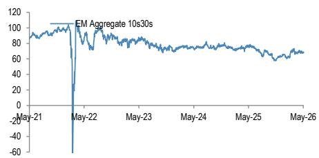

line

| Date   | EM Aggregate 10s30s |
|--------|---------------------|
| May-21 | 90                  |
| May-22 | -60                 |
| May-23 | 80                  |
| May-24 | 75                  |
| May-25 | 70                  |
| May-26 | 65                  |

Figure 8: Historical US treasury 10s30s yield curve slope   
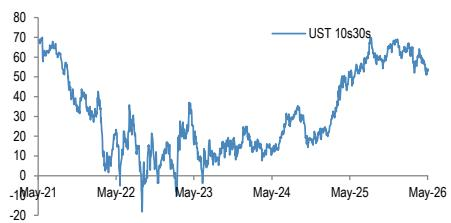

line

| Date   | UST 10s30s |
|--------|------------|
| May-21 | 70         |
| May-22 | 0          |
| May-23 | 30         |
| May-24 | 10         |
| May-25 | 50         |
| May-26 | 60         |

Figure 9: Historical EMBIG vs. CEMBI spread curve slope   
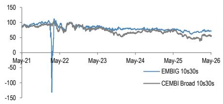

line

| Date   | EMBIG 10s30s | CEMBI Broad 10s30s |
|--------|--------------|--------------------|
| May-21 | ~90          | ~90                |
| May-22 | ~110         | ~80                |
| May-23 | ~70          | ~60                |
| May-24 | ~75          | ~65                |
| May-25 | ~70          | ~60                |
| May-26 | ~65          | ~55                |

Figure 10: Historical EM IG vs. HY spread curve slope   
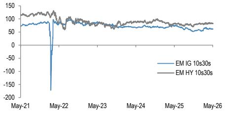

line

| Date   | EM IG 10s30s | EM HY 10s30s |
|--------|--------------|--------------|
| May-21 | ~70          | ~100         |
| May-22 | ~-200        | ~90          |
| May-23 | ~60          | ~80          |
| May-24 | ~60          | ~80          |
| May-25 | ~60          | ~80          |
| May-26 | ~60          | ~80          |

Figure 11: Historical sovereign vs. quasi-sovereign curve slope   
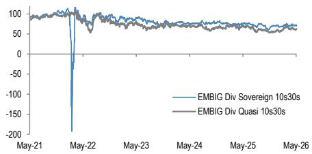

line

| Date   | EMBIG Div Sovereign 10s30s | EMBIG Div Quasi 10s30s |
|--------|----------------------------|------------------------|
| May-21 | ~90                        | ~90                    |
| May-22 | ~-200                      | ~80                    |
| May-23 | ~70                        | ~60                    |
| May-24 | ~60                        | ~50                    |
| May-25 | ~50                        | ~40                    |
| May-26 | ~40                        | ~30                    |

Figure 12: EM corporate vs. US HG corporate spread curve slope   
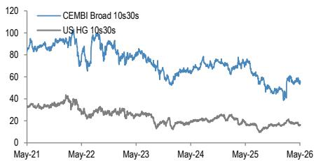

line

| Date   | CEMBI Broad 10s30s | US HG 10s30s |
|--------|--------------------|--------------|
| May-21 | ~95                | ~35          |
| May-22 | ~100               | ~30          |
| May-23 | ~85                | ~25          |
| May-24 | ~70                | ~20          |
| May-25 | ~60                | ~15          |
| May-26 | ~50                | ~15          |

Figure 13: Historical EMBIGD curve slope by region   
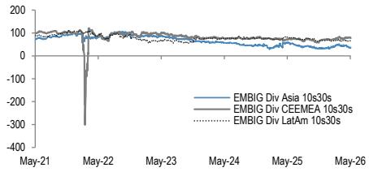

line

| Date   | EMBIG Div Asia 10s30s | EMBIG Div CEEMEA 10s30s | EMBIG Div LatAm 10s30s |
|--------|----------------------|------------------------|-----------------------|
| May-21 | ~100                 | ~100                   | ~100                  |
| May-22 | ~-350                | ~-350                  | ~-350                 |
| May-23 | ~50                  | ~50                    | ~50                   |
| May-24 | ~75                  | ~75                    | ~75                   |
| May-25 | ~50                  | ~50                    | ~50                   |
| May-26 | ~75                  | ~75                    | ~75                   |

Figure 14: Historical CEMBI curve slope by region   
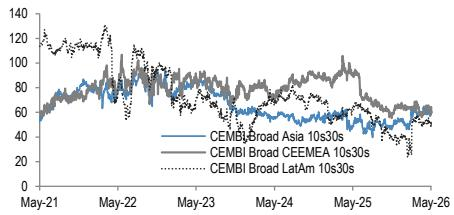

line

| Date   | CEMBI Broad Asia 10s30s | CEMBI Broad CEEMEA 10s30s | CEMBI Broad LatAm 10s30s |
|--------|--------------------------|----------------------------|---------------------------|
| May-21 | ~60                      | ~80                        | ~120                      |
| May-22 | ~70                      | ~90                        | ~130                      |
| May-23 | ~65                      | ~85                        | ~110                      |
| May-24 | ~60                      | ~80                        | ~90                       |
| May-25 | ~55                      | ~75                        | ~70                       |
| May-26 | ~50                      | ~70                        | ~60                       |

# Slope versus Spread Level Relationship by Region

Figure 15: 10s30s spread curve slopes versus 10y spread   
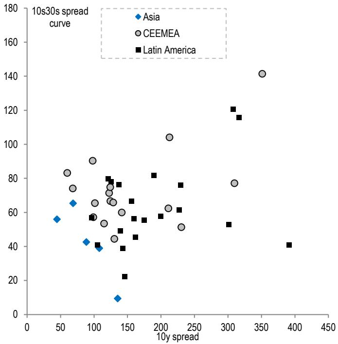

scatter

| Region       | 10y spread | 10s30s spread curve |
| ------------ | ---------- | ------------------- |
| Asia         | 50         | 55                  |
| Asia         | 70         | 65                  |
| Asia         | 90         | 40                  |
| Asia         | 100        | 45                  |
| Asia         | 110        | 40                  |
| Asia         | 120        | 35                  |
| Asia         | 130        | 30                  |
| Asia         | 140        | 25                  |
| Asia         | 150        | 20                  |
| Asia         | 160        | 15                  |
| Asia         | 170        | 10                  |
| Asia         | 180        | 5                   |
| Asia         | 190        | 0                   |
| Asia         | 200        | -5                  |
| Asia         | 210        | -10                 |
| Asia         | 220        | -15                 |
| Asia         | 230        | -20                 |
| Asia         | 240        | -25                 |
| Asia         | 250        | -30                 |
| Asia         | 260        | -35                 |
| Asia         | 270        | -40                 |
| Asia         | 280        | -45                 |
| Asia         | 290        | -50                 |
| Asia         | 300        | -55                 |
| Asia         | 310        | -60                 |
| Asia         | 320        | -65                 |
| Asia         | 330        | -70                 |
| Asia         | 340        | -75                 |
| Asia         | 350        | -80                 |
| Asia         | 360        | -85                 |
| Asia         | 370        | -90                 |
| Asia         | 380        | -95                 |
| Asia         | 390        | -100                |
| Asia         | 400        | -105                |
| CEEMEA       | 60         | 85                  |
| CEEMEA       | 70         | 75                  |
| CEEMEA       | 80         | 70                  |
| CEEMEA       | 90         | 65                  |
| CEEMEA       | 100        | 60                  |
| CEEMEA       | 110        | 55                  |
| CEEMEA       | 120        | 50                  |
| CEEMEA       | 130        | 45                  |
| CEEMEA       | 140        | 40                  |
| CEEMEA       | 150        | 35                  |
| CEEMEA       | 160        | 30                  |
| CEEMEA       | 170        | 25                  |
| CEEMEA       | 180        | 20                  |
| CEEMEA       | 190        | 15                  |
| CEEMEA       | 200        | 10                  |
| CEEMEA       | 210        | -5                  |
| CEEMEA       | 220        | -10                 |
| CEEMEA       | 230        | -15                 |
| CEEMEA       | 240        | -20                 |
| CEEMEA       | 250        | -25                 |
| CEEMEA       | 260        | -30                 |
| CEEMEA       | 270        | -35                 |
| CEEMEA       | 280        | -40                 |
| CEEMEA       | 290        | -45                 |
| CEEMEA       | 300        | -50                 |
| CEEMEA       | 310        | -55                 |
| CEEMEA       | 320        | -60                 |
| CEEMEA       | 330        | -65                 |
| CEEMEA       | 340        | -70                 |
| CEEMEA       | 350        | -75                 |
| CEEMEA       | 360        | -80                 |
| CEEMEA       | 370        | -85                 |
| CEEMEA       | 380        | -90                 |
| CEEMEA       | 390        | -95                 |
| CEEMEA       | 400        | -100                |
| Latin America| 120        | 75                  |
| Latin America| 130        | 70                  |
| Latin America| 140        | 65                  |
| Latin America| 150        | 60                  |
| Latin America| 160        | 55                  |
| Latin America| 170        | 50                  |
| Latin America| 180        | 45                  |
| Latin America| 190        | 40                  |
| Latin America| 200        | 35                  |
| Latin America| 210        | 30                  |
| Latin America| 220        | 25                  |
| Latin America| 230        | 20                  |
| Latin America| 240        | 15                  |
| Latin America| 250        | 10                  |
| Latin America| 260        | -5                  |
| Latin America| 270        | -10                 |
| Latin America| 280        | -15                 |
| Latin America| 290        | -20                 |
| Latin America| 300        | -25                 |
| Latin America| 310        | -30                 |
| Latin America| 320        | -35                 |
| Latin America| 330        | -40                 |
| Latin America| 340        | -45                 |
| Latin America| 350        | -50                 |
| Latin America| 360        | -55                 |
| Latin America| 370        | -60                 |
| Latin America| 380        | -65                 |
| Latin America| 390        | -70                 |
| Latin America| 400        | -75                 |
| Latin America| 410        | -80                 |
| Latin America| 420        | -85                 |
| Latin America| 430        | -90                 |
| Latin America| 440        | -95                 |
| Latin America| 450        | -100                |

Figure 16: Asia issuers   
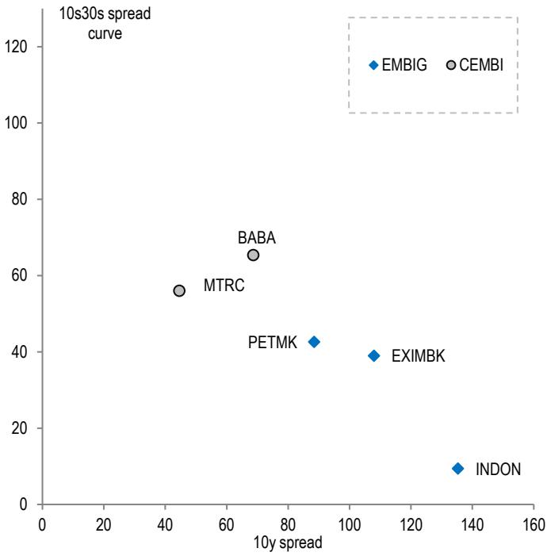

scatter

10s30s spread curve
| Company | 10y spread | 10s30s spread |
| :--- | :--- | :--- |
| EMBIG | 108 | 40 |
| CEMBI | 68 | 65 |
| MTRC | 45 | 56 |
| PETMK | 89 | 42 |
| INDON | 137 | 10 |

Figure 17: CEEMEA issuers   
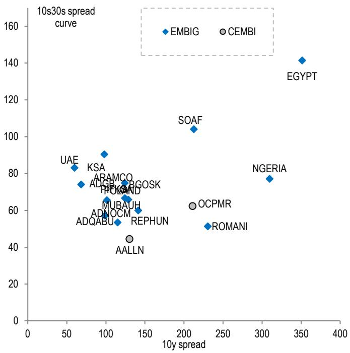

Figure 18: Latin American issuers   
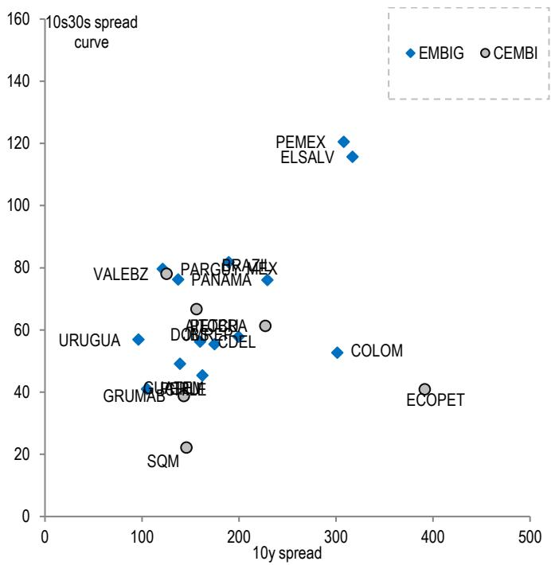

scatter

| Ticker | 10y spread | 10s30s spread curve |
|--------|----------|---------------------|
| PEMEX  | ~320     | ~120                |
| ELSALV | ~320     | ~115                |
| PARG   | ~180     | ~80                 |
| BRAZIL | ~180     | ~80                 |
| VALEBZ | ~120     | ~75                 |
| PANAMA | ~160     | ~75                 |
| DEOBRA | ~140     | ~65                 |
| DOGEC  | ~160     | ~60                 |
| CDEL   | ~160     | ~55                 |
| URUGUA | ~90      | ~55                 |
| GRUMAB | ~120     | ~40                 |
| GLDR   | ~140     | ~40                 |
| SQM    | ~140     | ~20                 |
| COLOM  | ~300     | ~50                 |
| ECOPET | ~390     | ~40                 |

# Slope versus Spread Level Relationship by Index

Figure 19: 10s30s spread curve slopes versus 10y spread   
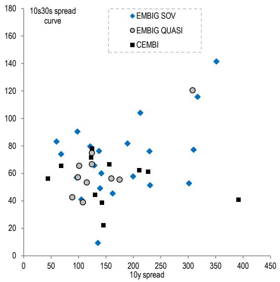

scatter

| 10y spread | 10s30s spread curve | Category     |
| ---------- | ------------------- | ------------ |
| 50         | 60                  | CEMBI        |
| 75         | 70                  | EMBIG SOV    |
| 100        | 80                  | EMBIG QUASI  |
| 125        | 90                  | EMBIG SOV    |
| 150        | 100                 | CEMBI        |
| 175        | 110                 | EMBIG SOV    |
| 200        | 120                 | EMBIG QUASI  |
| 225        | 130                 | EMBIG SOV    |
| 250        | 140                 | EMBIG QUASI  |
| 275        | 150                 | EMBIG SOV    |
| 300        | 160                 | EMBIG QUASI  |
| 325        | 170                 | EMBIG SOV    |
| 350        | 180                 | EMBIG QUASI  |
| 375        | 190                 | EMBIG SOV    |
| 400        | 200                 | CEMBI        |
| 425        | 210                 | EMBIG QUASI  |
| 450        | 220                 | EMBIG SOV    |

Figure 20: EMBIG sovereign issuers   
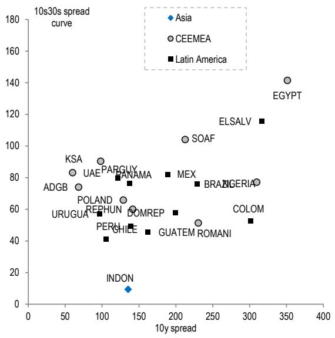

Figure 21: EMBIG quasi-sovereign issuers   
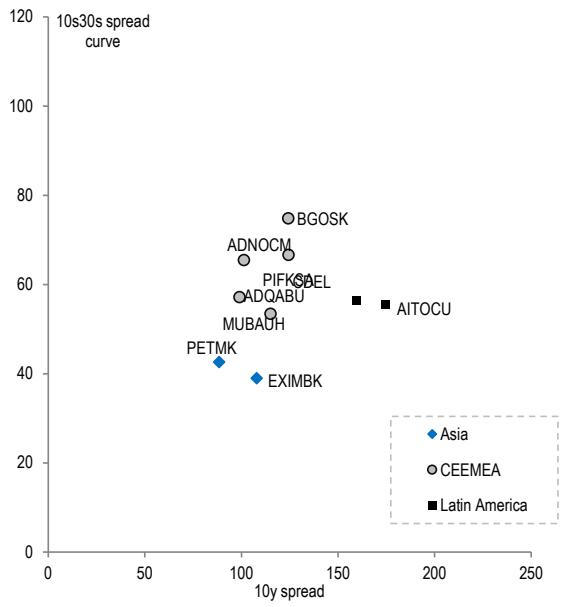

scatter

| Entity | 10y spread | 10s30s spread curve |
| :--- | :--- | :--- |
| PETMK | 85 | 42 |
| ADNOCM | 100 | 65 |
| PIFK | 120 | 62 |
| ADQABU | 100 | 57 |
| MUBAUH | 115 | 53 |
| BGOSK | 125 | 75 |
| BEL | 130 | 66 |
| AITOCU | 160 | 56 |
| EXIMBK | 105 | 39 |
| Asia | 90 | - |
| CEEMEA | 100 | - |
| Latin America | 130 | - |

Figure 22: CEMBI issuers   
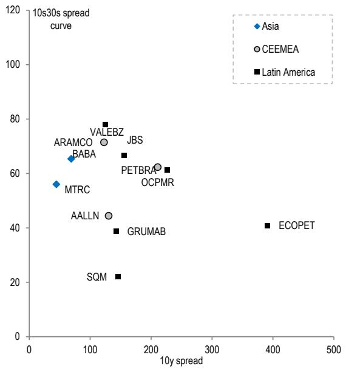

scatter

| Ticker | 10y spread | 10s30s spread curve |
| :--- | :--- | :--- |
| ARAMCO | 75 | 68 |
| BABA | 65 | 65 |
| MTRC | 45 | 55 |
| VALEBZ | 120 | 78 |
| JBS | 150 | 65 |
| PETBRA | 210 | 62 |
| OCPMR | 220 | 58 |
| AALLN | 120 | 44 |
| GRUMAB | 130 | 38 |
| SQM | 140 | 22 |
| ECOPET | 390 | 40 |

# Slope versus Credit Rating Relationship

Figure 23: 10s30s spread curve slopes versus average credit rating   
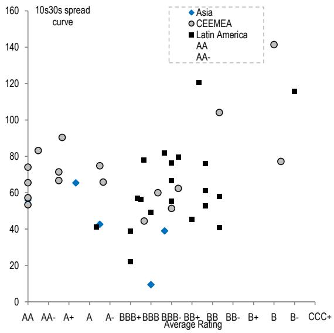

Figure 24: Asia issuers   
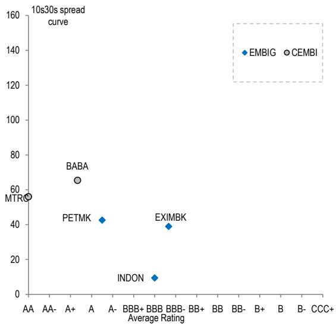

scatter

10s30s spread curve
| Rating | Label | Average Rating |
| :--- | :--- | :--- |
| AA | MTR | AA |
| A+ | BABA | A+ |
| A- | PETMK | A- |
| BBB+ | EXIMBK | BBB- |
| BBB- | INDON | BBB |
| B+ | EMBIG | BB- |
| B | CEMBI | B |
| B- | CCC+ | CCC+ |
| MTR | MTR | AA |

Figure 25: CEEMEA issuers   
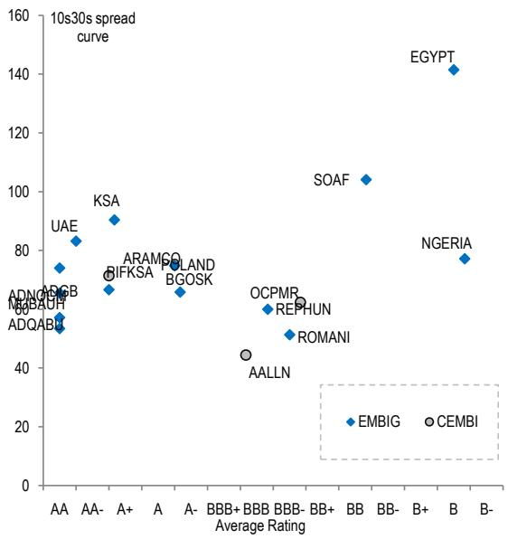

scatter

| Entity | Rating | 10s30s spread curve |
| :--- | :--- | :--- |
| EMBIG | BB- | 20 |
| CEMBI | BB- | 45 |
| SOAF | BB- | 105 |
| NGERIA | BB- | 78 |
| EGYPT | B | 142 |
| KSA | AA- | 90 |
| ARAMSOL | A+ | 88 |
| BIFKSA | AA- | 85 |
| Poland | A | 85 |
| BGOSK | A- | 85 |
| OCPMR | BBB+ | 60 |
| REPHUN | BB- | 60 |
| ROMANI | BBB- | 55 |
| AALLN | BBB+ | 45 |
| ADQABU | AA- | 50 |
| ADNQGB | AA | 75 |
| NDBAUF | AA- | 60 |
| ADQABU | AA- | 55 |

Figure 26: Latin American issuers   
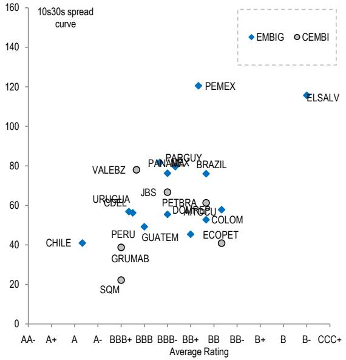

scatter

10s30s spread curve
| Ticker | Rating | Average Rating | Label |
| :--- | :--- | :--- | :--- |
| EMBIG | B- | 145 | EMBIG |
| CEMBI | B- | 115 | CEMBI |
| PEMEX | BB+ | 120 | PEMEX |
| PARGUY | BB+ | 85 | PARGUY |
| BRAZIL | BB+ | 75 | BRAZIL |
| BURGUY | BB+ | 80 | BURGUY |
| PANABEX | BB- | 75 | PANABEX |
| VALEBZ | BB+ | 75 | VALEBZ |
| URUGUA | BBB+ | 55 | URUGUA |
| CDEL | BB+ | 55 | CDEL |
| JBS | BB- | 65 | JBS |
| PETBRA | BB- | 60 | PETBRA |
| DOMINGU | BB+ | 55 | DOMINGU |
| CHILE | AA- | 40 | CHILE |
| PERU | BBB+ | 40 | PERU |
| GRUMAB | BBB+ | 35 | GRUMAB |
| GUATEM | BBB+ | 45 | GUATEM |
| COLOM | BB+ | 55 | COLOM |
| ECOPET | BB- | 40 | ECOPET |
| SQM | BBB+ | 20 | SQM |
The chart displays a scatter plot with two data series: one for EMBIG (diamond markers) and one for CEMBI (circle markers). The x-axis represents 'Average Rating' and the y-axis represents '10s30s spread curve'. The legend is implied by the label above the plot.

Figure 27: Steepest 10s30s spread curves across EM sovereign and corporate credit 

<table><tr><td>Issuer</td><td>Current</td><td>1m</td><td>1y</td><td>10y Spd</td><td>30y Spd</td><td>1y Avg</td><td>1y Low</td><td>1y Low</td><td>1y High</td><td>1y High</td><td>Index</td><td>Region</td></tr><tr><td>EGYPT</td><td>141</td><td>-12</td><td>+17</td><td>351</td><td>493</td><td>154</td><td>61</td><td></td><td></td><td>224</td><td>EMBIG SOV</td><td>CEEMEA</td></tr><tr><td>PEMEX</td><td>121</td><td>+3</td><td>+30</td><td>308</td><td>428</td><td>81</td><td>-103</td><td></td><td></td><td>169</td><td>EMBIG QUASI</td><td>Latin America</td></tr><tr><td>ELSALV</td><td>116</td><td>+4</td><td>-11</td><td>317</td><td>433</td><td>102</td><td>11</td><td></td><td></td><td>141</td><td>EMBIG SOV</td><td>Latin America</td></tr><tr><td>SOAF</td><td>104</td><td>-9</td><td></td><td>213</td><td>317</td><td>125</td><td>32</td><td></td><td></td><td>193</td><td>EMBIG SOV</td><td>CEEMEA</td></tr><tr><td>KSA</td><td>90</td><td>+7</td><td>-6</td><td>98</td><td>188</td><td>89</td><td>50</td><td></td><td></td><td>138</td><td>EMBIG SOV</td><td>CEEMEA</td></tr><tr><td>UAE</td><td>83</td><td>-3</td><td>-21</td><td>60</td><td>143</td><td>90</td><td>59</td><td></td><td></td><td>121</td><td>EMBIG SOV</td><td>CEEMEA</td></tr><tr><td>MEX</td><td>82</td><td>-4</td><td>-17</td><td>189</td><td>271</td><td>84</td><td>31</td><td></td><td></td><td>142</td><td>EMBIG SOV</td><td>Latin America</td></tr><tr><td>PARGUY</td><td>80</td><td>+7</td><td>+4</td><td>121</td><td>201</td><td>100</td><td>-181</td><td></td><td></td><td>155</td><td>EMBIG SOV</td><td>Latin America</td></tr><tr><td>VALEBZ</td><td>78</td><td>+6</td><td>-21</td><td>125</td><td>203</td><td>82</td><td>59</td><td></td><td></td><td>109</td><td>CEMBI</td><td>Latin America</td></tr><tr><td>NGERIA</td><td>77</td><td>-0</td><td>+44</td><td>310</td><td>387</td><td>58</td><td>-58</td><td></td><td></td><td>127</td><td>EMBIG SOV</td><td>CEEMEA</td></tr></table>

Figure 28: Steepest 10s30s curves versus the 10y spread   
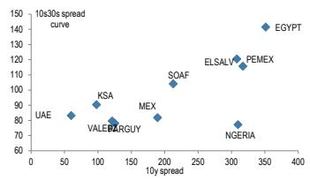

scatter

| Country | 10y spread | 10x30s spread curve |
| :--- | :--- | :--- |
| UAE | 65 | 85 |
| KSA | 105 | 92 |
| VALENTARGUY | 115 | 78 |
| MEX | 195 | 82 |
| SOAF | 210 | 102 |
| ELSALV | 315 | 118 |
| PEMEX | 320 | 115 |
| NGERIA | 310 | 78 |
| EGYPT | 350 | 145 |

Figure 29: Steepest 10s30s curves and 1m change   
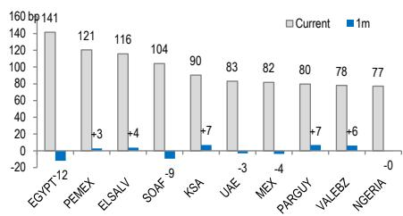

bar

| Country   | Current | 1m  |
| --------- | ------- | --- |
| EGYPT '12 | 141     | -12 |
| PEMEX     | 121     | +3  |
| ELSALV    | 116     | +4  |
| SOAF '9   | 104     | -15 |
| KSA       | 90      | +7  |
| UAE '-3   | 83      | -3  |
| MEX '-4   | 82      | -4  |
| PARGUY    | 80      | +7  |
| VALEBZ    | 78      | +6  |
| NIGERIA   | 77      | -0  |

Figure 30: Flattest 10s30s spread curves across EM sovereign and corporate credit 

<table><tr><td>Issuer</td><td>Current</td><td>1m</td><td>1y</td><td>10y Spd</td><td>30y Spd</td><td>1y Avg</td><td>1y Low</td><td>1y Low</td><td>1y Ago</td><td>1y High</td><td>1y High</td><td>Index</td><td>Region</td></tr><tr><td>INDON</td><td>9</td><td>-26</td><td>-36</td><td>135</td><td>145</td><td>60</td><td>-7</td><td></td><td></td><td></td><td>111</td><td>EMBIG SOV</td><td>Asia</td></tr><tr><td>SQM</td><td>22</td><td>-12</td><td>+6</td><td>146</td><td>168</td><td>28</td><td>-19</td><td></td><td></td><td></td><td>98</td><td>CEMBI</td><td>Latin America</td></tr><tr><td>GRUMAB</td><td>39</td><td>-13</td><td>-26</td><td>143</td><td>182</td><td>52</td><td>29</td><td></td><td></td><td></td><td>71</td><td>CEMBI</td><td>Latin America</td></tr><tr><td>EXIMBK</td><td>39</td><td>+1</td><td></td><td>108</td><td>147</td><td>38</td><td>30</td><td></td><td></td><td></td><td>46</td><td>EMBIG QUASI</td><td>Asia</td></tr><tr><td>ECOPET</td><td>41</td><td>+0</td><td>-1</td><td>391</td><td>432</td><td>73</td><td>20</td><td></td><td></td><td></td><td>148</td><td>CEMBI</td><td>Latin America</td></tr><tr><td>CHILE</td><td>41</td><td>-4</td><td>-7</td><td>105</td><td>146</td><td>61</td><td>-16</td><td></td><td></td><td></td><td>107</td><td>EMBIG SOV</td><td>Latin America</td></tr><tr><td>PETMK</td><td>43</td><td>-5</td><td>-21</td><td>88</td><td>131</td><td>57</td><td>16</td><td></td><td></td><td></td><td>104</td><td>EMBIG QUASI</td><td>Asia</td></tr><tr><td>AALLN</td><td>44</td><td>-6</td><td>-16</td><td>130</td><td>175</td><td>54</td><td>34</td><td></td><td></td><td></td><td>85</td><td>CEMBI</td><td>CEEMEA</td></tr><tr><td>GUATEM</td><td>45</td><td>-1</td><td></td><td>162</td><td>208</td><td>90</td><td>35</td><td></td><td></td><td></td><td>142</td><td>EMBIG SOV</td><td>Latin America</td></tr><tr><td>PERU</td><td>49</td><td>-5</td><td>-11</td><td>139</td><td>188</td><td>56</td><td>21</td><td></td><td></td><td></td><td>95</td><td>EMBIG SOV</td><td>Latin America</td></tr></table>

Figure 31: Flattest 10s30s curves versus the 10y spread   
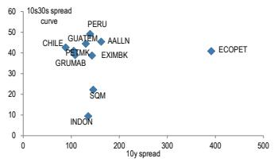

scatter

| Country   | 10x spread | 10x30s spread |
| --------- | ---------- | ------------- |
| CHILE     | 80         | 40            |
| GUATELM   | 150        | 50            |
| AALLN     | 200        | 45            |
| GRUMAB    | 100        | 40            |
| EMXIMB    | 150        | 40            |
| SQM       | 150        | 20            |
| INDON     | 150        | 10            |
| ECOPET    | 400        | 40            |

Figure 32: Flattest 10s30s curves and 1m change   
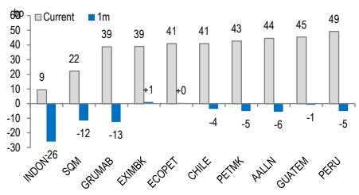

bar

| Entity | Current (bp) | 1m |
| :--- | :--- | :--- |
| INDON-26 | 9 | -30 |
| SOM | 22 | -12 |
| GRUMAB | 39 | -13 |
| EXMBK | 39 | +1 |
| ECOPET | 41 | +0 |
| CHILE | 41 | -4 |
| PETMK | 43 | -5 |
| ALLIN | 44 | -6 |
| GUATEM | 45 | -1 |
| PERU | 49 | -5 |

# Largest 1-Month Steepening and Flattening

Figure 33: Largest 1m steepening across 10s30s spread curves 

<table><tr><td>Issuer</td><td>Current</td><td>1m</td><td>1y</td><td>10y Spd</td><td>30y Spd</td><td>1y Avg</td><td>1y Low</td></tr><tr><td>DOMREP</td><td>58</td><td>+11</td><td>-19</td><td>199</td><td>257</td><td>92</td><td>28</td></tr><tr><td>CDEL</td><td>56</td><td>+9</td><td>-13</td><td>160</td><td>216</td><td>53</td><td>1</td></tr><tr><td>BABA</td><td>65</td><td>+7</td><td>+20</td><td>69</td><td>134</td><td>65</td><td>2</td></tr><tr><td>KSA</td><td>90</td><td>+7</td><td>-6</td><td>98</td><td>188</td><td>89</td><td>50</td></tr><tr><td>PARGUY</td><td>80</td><td>+7</td><td>+4</td><td>121</td><td>201</td><td>100</td><td>-181</td></tr><tr><td>POLAND</td><td>66</td><td>+7</td><td>+1</td><td>129</td><td>195</td><td>65</td><td>51</td></tr><tr><td>VALEBZ</td><td>78</td><td>+6</td><td>-21</td><td>125</td><td>203</td><td>82</td><td>59</td></tr><tr><td>COLOM</td><td>53</td><td>+6</td><td>-40</td><td>301</td><td>354</td><td>60</td><td>-49</td></tr><tr><td>ROMANI</td><td>51</td><td>+5</td><td>-12</td><td>230</td><td>282</td><td>70</td><td>-1</td></tr><tr><td>ELSALV</td><td>116</td><td>+4</td><td>-11</td><td>317</td><td>433</td><td>102</td><td>11</td></tr></table>

Figure 34: 1m change in 10s30s curves versus the current 10s30s   
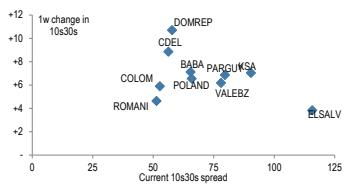

scatter

| Country   | Current 10s30s spread | 1w change in 10s30s |
| --------- | --------------------- | --------------------- |
| DOMREP    | ~75                   | ~+10                  |
| CDEL      | ~60                   | ~+8                   |
| BABA      | ~70                   | ~+6                   |
| PARGUNSA  | ~90                   | ~+7                   |
| POLAND    | ~65                   | ~+6                   |
| ROLOM     | ~55                   | ~+5                   |
| ROMANI    | ~50                   | ~+4                   |
| VALEBZ    | ~85                   | ~+7                   |
| ELSALV    | ~120                  | ~-4                   |

Figure 35: Largest 1m steepening and current 10s30s slope   
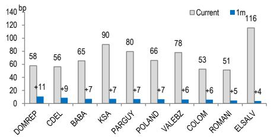

bar

|        | Current | 1m  |
| ------ | ------- | --- |
| DOMREP | 58      | 11  |
| CDEL   | 56      | 9   |
| BABA   | 65      | 7   |
| KSA    | 90      | 7   |
| PARGUY | 80      | 7   |
| POLAND | 66      | 7   |
| VALEBZ | 78      | 6   |
| COLOM  | 53      | 6   |
| ROMANI | 51      | 5   |
| ELSALV | 116     | 4   |

Figure 36: Largest 1m flattening across 10s30s spread curves 

<table><tr><td>Issuer</td><td>Current</td><td>1m</td><td>1y</td><td>10y Spd</td><td>30y Spd</td><td>1y Avg</td><td>1y Low</td><td>1y Low○ 1m Ago</td><td>1y High○ Current</td><td>1y High</td><td>Index</td><td>Region</td></tr><tr><td>INDON</td><td>9</td><td>-26</td><td>-36</td><td>135</td><td>145</td><td>60</td><td>-7</td><td>●</td><td>●</td><td>111</td><td>EMBIG SOV</td><td>Asia</td></tr><tr><td>GRUMAB</td><td>39</td><td>-13</td><td>-26</td><td>143</td><td>182</td><td>52</td><td>29</td><td>●</td><td>●</td><td>71</td><td>CEMBI</td><td>Latin America</td></tr><tr><td>EGYPT</td><td>141</td><td>-12</td><td>+17</td><td>351</td><td>493</td><td>154</td><td>61</td><td>●</td><td>●</td><td>224</td><td>EMBIG SOV</td><td>CEEMEA</td></tr><tr><td>SQM</td><td>22</td><td>-12</td><td>+6</td><td>146</td><td>168</td><td>28</td><td>-19</td><td>●</td><td>●</td><td>98</td><td>CEMBI</td><td>Latin America</td></tr><tr><td>AITOCU</td><td>55</td><td>-11</td><td></td><td>175</td><td>230</td><td>52</td><td>37</td><td>●</td><td>●</td><td>71</td><td>EMBIG QUASI</td><td>Latin America</td></tr><tr><td>JBS</td><td>67</td><td>-10</td><td></td><td>156</td><td>223</td><td>67</td><td>54</td><td>●</td><td>●</td><td>77</td><td>CEMBI</td><td>Latin America</td></tr><tr><td>SOAF</td><td>104</td><td>-9</td><td></td><td>213</td><td>317</td><td>125</td><td>32</td><td>●</td><td>●</td><td>193</td><td>EMBIG SOV</td><td>CEEMEA</td></tr><tr><td>ADGB</td><td>74</td><td>-6</td><td>-22</td><td>68</td><td>142</td><td>80</td><td>48</td><td>●</td><td>●</td><td>109</td><td>EMBIG SOV</td><td>CEEMEA</td></tr><tr><td>AALLN</td><td>44</td><td>-6</td><td>-16</td><td>130</td><td>175</td><td>54</td><td>34</td><td>●</td><td>●</td><td>85</td><td>CEMBI</td><td>CEEMEA</td></tr><tr><td>PERU</td><td>49</td><td>-5</td><td>-11</td><td>139</td><td>188</td><td>56</td><td>21</td><td>●</td><td>●</td><td>95</td><td>EMBIG SOV</td><td>Latin America</td></tr></table>

Figure 37: Largest 1m flattening across 10s30s spread curves   
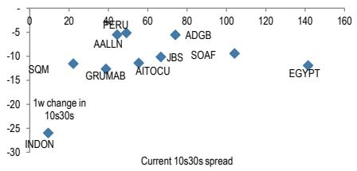

scatter

| Entity | Current 10s30s spread | 1w change in 10s30s |
| :--- | :--- | :--- |
| SQM | 25 | -14 |
| GRUMAB | 30 | -14 |
| AALLN | 40 | -6 |
| PERU | 40 | -5 |
| AITOCU | 50 | -12 |
| ADGB | 75 | -6 |
| JBS | 70 | -9 |
| SOAF | 105 | -9 |
| EGYPT | 140 | -14 |
| INDON | 10 | -26 |
| Current 10s30s spread | 160 | -26 |

Figure 38: Largest 1m flattening and current 10s30s slope   
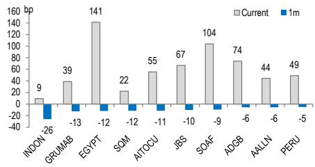

bar

| Country   | Current | 1m  |
| --------- | ------- | --- |
| INDON     | 9       | -26 |
| GRUMAB    | 39      | -13 |
| EGYPT     | 141     | -12 |
| SQM       | 22      | -12 |
| AITOUCU   | 55      | -11 |
| JBS       | 67      | -10 |
| SOAF      | 104     | -9  |
| ADGB      | 74      | -6  |
| AALLN     | 44      | -6  |
| PERU      | 49      | -5  |

# Asia 10s30s Spread Curves

Figure 39: Asia EMBIG issuers 

<table><tr><td>Issuer</td><td>Current</td><td>1m</td><td>1y</td><td>10y Spd</td><td>30y Spd</td><td>1y Avg</td><td>1y Low</td><td>1y Low</td><td>1y High</td><td>1y High</td><td>10y Bond</td><td>30y Bond</td></tr><tr><td>EXIMBK</td><td>39</td><td>+1</td><td></td><td>108</td><td>147</td><td>38</td><td>30</td><td>●</td><td>○◆</td><td>46</td><td>EXIMBK 5 01/12/36</td><td>EXIMBK 5 3/4 01/12/56</td></tr><tr><td>INDON</td><td>9</td><td>-26</td><td>-36</td><td>135</td><td>145</td><td>60</td><td>-7</td><td>●</td><td>○</td><td>111</td><td>INDON 5.69 05/29/36</td><td>INDON 5.475 02/21/56</td></tr><tr><td>PETMK</td><td>43</td><td>-5</td><td>-21</td><td>88</td><td>131</td><td>57</td><td>16</td><td>●</td><td>○</td><td>104</td><td>PETMK 5.34 04/03/35</td><td>PETMK 5.848 04/03/55</td></tr></table>

Figure 40: Asia CEMBI issuers 

<table><tr><td>Issuer</td><td>Current</td><td>1m</td><td>1y</td><td>10y Spd</td><td>30y Spd</td><td>1y Avg</td><td>1y Low</td><td>1y Low○ 1m ago</td><td>1y High◆ Current</td><td>1y High</td><td>10y Bond</td><td>30y Bond</td></tr><tr><td>BABA</td><td>65</td><td>+7</td><td>+20</td><td>69</td><td>134</td><td>65</td><td>2</td><td>●</td><td>●</td><td>147</td><td>BABA 5 1/4 05/26/35</td><td>BABA 5 5/8 11/26/54</td></tr><tr><td>MTRC</td><td>56</td><td>-2</td><td></td><td>45</td><td>101</td><td>58</td><td>40</td><td>●</td><td>●</td><td>77</td><td>MTRC 4 7/8 04/01/35</td><td>MTRC 5 1/4 04/01/55</td></tr></table>

Figure 41: 1y history of Asia 10s30s spread curves by issuer (current slope versus 1y min/max range) 

<table><tr><td>Issuer</td><td>BABA (65 vs. 2/147 range)</td><td>EXIMBK (39 vs. 30/46 range)</td><td>INDON (9 vs. -7/111 range)</td><td>MTRC (56 vs. 40/77 range)</td><td>PETMK (43 vs. 16/104 range)</td></tr><tr><td>1y History</td><td></td><td></td><td></td><td></td><td></td></tr></table>

# CEEMEA 10s30s Spread Curves

Figure 42: CEEMEA EMBIG issuers 

<table><tr><td>Issuer</td><td>Current</td><td>1m</td><td>1y</td><td>10y Spd</td><td>30y Spd</td><td>1y Avg</td><td>1y Low</td><td></td><td>1y High</td><td>10y Bond</td><td>30y Bond</td></tr><tr><td>ADGB</td><td>74</td><td>-6</td><td>-22</td><td>68</td><td>142</td><td>80</td><td>48</td><td>●</td><td>◆○</td><td>109</td><td>ADGB 4 1/4 10/02/35</td></tr><tr><td>ADNOCM</td><td>65</td><td>-3</td><td>-8</td><td>101</td><td>167</td><td>63</td><td>44</td><td>●</td><td>◆○</td><td>87</td><td>ADNOCM 4 1/2 09/11/34</td></tr><tr><td>ADQABU</td><td>53</td><td>+1</td><td>-16</td><td>115</td><td>168</td><td>54</td><td>28</td><td>●</td><td>◆</td><td>83</td><td>ADQABU 5 05/06/35</td></tr><tr><td>BGOSK</td><td>75</td><td>-1</td><td>+4</td><td>124</td><td>199</td><td>68</td><td>49</td><td>●</td><td>◆○</td><td>90</td><td>BGOSK 5 3/4 07/09/34</td></tr><tr><td>EGYPT</td><td>141</td><td>-12</td><td>+17</td><td>351</td><td>493</td><td>154</td><td>61</td><td>●</td><td>◆○</td><td>224</td><td>EGYPT 7 5/8 05/20/34</td></tr><tr><td>KSA</td><td>90</td><td>+7</td><td>-6</td><td>98</td><td>188</td><td>89</td><td>50</td><td>●</td><td>◆○</td><td>138</td><td>KSA 4 7/8 01/12/36</td></tr><tr><td>MUBAUH</td><td>57</td><td>+3</td><td>+12</td><td>99</td><td>156</td><td>56</td><td>10</td><td>●</td><td>◆</td><td>186</td><td>MUBAUH 4 5/8 10/16/35</td></tr><tr><td>NGERIA</td><td>77</td><td>-0</td><td>+44</td><td>310</td><td>387</td><td>58</td><td>-58</td><td>●</td><td>◆</td><td>127</td><td>NGERIA 8.6308 01/13/36</td></tr><tr><td>PIFKSA</td><td>67</td><td>-2</td><td>-27</td><td>124</td><td>191</td><td>95</td><td>49</td><td>●</td><td>◆</td><td>138</td><td>PIFKSA 5 09/15/35</td></tr><tr><td>POLAND</td><td>66</td><td>+7</td><td>+1</td><td>129</td><td>195</td><td>65</td><td>51</td><td>●</td><td>◆</td><td>91</td><td>POLAND 5 3/8 04/14/36</td></tr><tr><td>REPHUN</td><td>60</td><td>+0</td><td>+3</td><td>141</td><td>201</td><td>70</td><td>7</td><td>●</td><td>◆</td><td>102</td><td>REPHUN 6 09/26/35</td></tr><tr><td>ROMANI</td><td>51</td><td>+5</td><td>-12</td><td>230</td><td>282</td><td>70</td><td>-1</td><td>●</td><td>◆</td><td>112</td><td>ROMANI 5 3/4 07/04/36</td></tr><tr><td>SOAF</td><td>104</td><td>-9</td><td></td><td>213</td><td>317</td><td>125</td><td>32</td><td>●</td><td>◆○</td><td>193</td><td>SOAF 7.1 11/19/36</td></tr><tr><td>UAE</td><td>83</td><td>-3</td><td>-21</td><td>60</td><td>143</td><td>90</td><td>59</td><td>●</td><td>◆○</td><td>121</td><td>UAE 4.857 07/02/34</td></tr></table>

Figure 43: CEEMEA CEMBI issuers 

<table><tr><td>Issuer</td><td>Current</td><td>1m</td><td>1y</td><td>10y Spd</td><td>30y Spd</td><td>1y Avg</td><td>1y Low</td><td>1y Low</td><td>1y High</td><td>1y High</td><td>10y Bond</td><td>30y Bond</td></tr><tr><td>AALLN</td><td>44</td><td>-6</td><td>-16</td><td>130</td><td>175</td><td>55</td><td>40</td><td>● ◆ ○</td><td>● 76</td><td>● 123</td><td>AALLN 5 1/4 03/19/36</td><td>AALLN 6 04/05/54</td></tr><tr><td>ARAMCO</td><td>71</td><td>-1</td><td>-46</td><td>123</td><td>194</td><td>80</td><td>63</td><td>● ◆</td><td>● 123</td><td>● 123</td><td>ARAMCO 5 02/02/36</td><td>ARAMCO 6 02/02/56</td></tr><tr><td>OCPMR</td><td>62</td><td>+1</td><td>-10</td><td>211</td><td>273</td><td>70</td><td>59</td><td>● ◆</td><td>● 83</td><td>● 83</td><td>OCPMR 6.7 03/01/36</td><td>OCPMR 7 1/2 05/02/54</td></tr></table>

Figure 44: 1y history of CEEMEA 10s30s spread curves by issuer (current slope versus 1y min/max range) 

<table><tr><td>Issuer</td><td>AALLN (44 vs. 34/85 range)</td><td>ADGB (74 vs. 48/109 range)</td><td>ADNOCM (65 vs. 44/87 range)</td><td>ADQABU (53 vs. 28/83 range)</td><td>ARAMCO (71 vs. 51/136 range)</td></tr><tr><td>1y History</td><td></td><td></td><td></td><td></td><td></td></tr><tr><td>Issuer</td><td>BGOSK (75 vs. 49/90 range)</td><td>EGYPT (141 vs. 61/224 range)</td><td>KSA (90 vs. 50/138 range)</td><td>MUBAUH (57 vs. 10/186 range)</td><td>NGERIA (77 vs. -58/127 range)</td></tr><tr><td>1y History</td><td></td><td></td><td></td><td></td><td></td></tr><tr><td>Issuer</td><td>OCPMR (62 vs. 59/171 range)</td><td>PIFKSA (67 vs. 49/138 range)</td><td>POLAND (66 vs. 51/91 range)</td><td>REPHUN (60 vs. 7/102 range)</td><td>ROMANI (51 vs. -1/112 range)</td></tr><tr><td>1y History</td><td></td><td></td><td></td><td></td><td></td></tr><tr><td>Issuer</td><td>SOAF (104 vs. 32/193 range)</td><td>UAE (83 vs. 59/121 range)</td><td></td><td></td><td></td></tr><tr><td>1y History</td><td></td><td></td><td></td><td></td><td></td></tr></table>

# Latin America 10s30s Spread Curves

Figure 45: Latin EMBIG issuers 

<table><tr><td>Issuer</td><td>Current</td><td>1m</td><td>1y</td><td>10y Spd</td><td>30y Spd</td><td>1y Avg</td><td>1y Low</td><td>1y Low</td><td>1y High</td><td>1y High</td><td>10y Bond</td><td>30y Bond</td></tr><tr><td>AITOCU</td><td>55</td><td>-11</td><td></td><td>175</td><td>230</td><td>52</td><td>37</td><td>●</td><td>◆</td><td>○</td><td>71</td><td>AITOCU 4 08/11/41 AITOCU 5 1/8 08/11/61</td></tr><tr><td>BRAZIL</td><td>76</td><td>+3</td><td>-22</td><td>229</td><td>305</td><td>97</td><td>58</td><td>●</td><td>◇</td><td>●</td><td>169</td><td>BRAZIL 6 1/4 05/22/36 BRAZIL 7 1/4 01/12/56</td></tr><tr><td>CDEL</td><td>56</td><td>+9</td><td>-13</td><td>160</td><td>216</td><td>53</td><td>1</td><td>●</td><td>○</td><td>◆</td><td>106</td><td>CDEL 5.529 01/30/37 CDEL 6.78 01/13/55</td></tr><tr><td>CHILE</td><td>41</td><td>-4</td><td>-7</td><td>105</td><td>146</td><td>61</td><td>-16</td><td>●</td><td>◇</td><td>●</td><td>107</td><td>CHILE 5.65 01/13/37 CHILE 5.33 01/05/54</td></tr><tr><td>COLOM</td><td>53</td><td>+6</td><td>-40</td><td>301</td><td>354</td><td>60</td><td>-49</td><td>●</td><td>◆</td><td>●</td><td>114</td><td>COLOM 7 3/4 11/07/36 COLOM 8 3/8 11/07/54</td></tr><tr><td>DOMREP</td><td>58</td><td>+11</td><td>-19</td><td>199</td><td>257</td><td>92</td><td>28</td><td>●</td><td>○</td><td>◆</td><td>164</td><td>DOMREP 5 3/4 03/17/34 DOMREP 7.15 02/24/55</td></tr><tr><td>ELSALV</td><td>116</td><td>+4</td><td>-11</td><td>317</td><td>433</td><td>102</td><td>11</td><td>●</td><td>●</td><td>◆</td><td>141</td><td>ELSALV 7.65 06/15/35 ELSALV 9.65 11/21/54</td></tr><tr><td>GUATEM</td><td>45</td><td>-1</td><td></td><td>162</td><td>208</td><td>90</td><td>35</td><td>●</td><td>◆</td><td>●</td><td>142</td><td>GUATEM 6 1/4 08/15/36 GUATEM 6 7/8 08/15/55</td></tr><tr><td>MEX</td><td>82</td><td>-4</td><td>-17</td><td>189</td><td>271</td><td>84</td><td>31</td><td>●</td><td>◇</td><td>●</td><td>142</td><td>MEX 5 5/8 02/09/34 MEX 6 3/4 02/09/56</td></tr><tr><td>PANAMA</td><td>76</td><td>-4</td><td>-1</td><td>137</td><td>214</td><td>85</td><td>-13</td><td>●</td><td>◆</td><td>●</td><td>143</td><td>PANAMA 5.227 02/23/34 PANAMA 7 7/8 03/01/57</td></tr><tr><td>PARGUY</td><td>80</td><td>+7</td><td>+4</td><td>121</td><td>201</td><td>100</td><td>-181</td><td>●</td><td>●</td><td>◆</td><td>155</td><td>PARGUY 6 02/09/36 PARGUY 6.65 03/04/55</td></tr><tr><td>PEMEX</td><td>121</td><td>+3</td><td>+30</td><td>308</td><td>428</td><td>81</td><td>-103</td><td>●</td><td>●</td><td>◆</td><td>169</td><td>PEMEX 6 5/8 06/15/35 PEMEX 6.95 01/28/60</td></tr><tr><td>PERU</td><td>49</td><td>-5</td><td>-11</td><td>139</td><td>188</td><td>56</td><td>21</td><td>●</td><td>○</td><td>●</td><td>95</td><td>PERU 5 1/2 03/30/36 PERU 6.2 06/30/55</td></tr><tr><td>URUGUA</td><td>57</td><td>-0</td><td>-9</td><td>96</td><td>153</td><td>81</td><td>41</td><td>●</td><td>◆</td><td>●</td><td>132</td><td>JRUGUA 5.442 02/14/37 URUGUA 5 1/4 09/10/60</td></tr></table>

Figure 46: Latin America CEMBI issuers 

<table><tr><td>Issuer</td><td>Current</td><td>1m</td><td>1y</td><td>10y Spd</td><td>30y Spd</td><td>1y Avg</td><td>1y Low</td><td></td><td>1y High</td><td>1y Bond</td><td>30y Bond</td></tr><tr><td>ECOPET</td><td>41</td><td>+0</td><td>-1</td><td>391</td><td>432</td><td>39</td><td>20</td><td>●</td><td>◆</td><td>55</td><td>ECOPET 8 3/8 01/19/36 ECOPET 5 7/8 11/02/51</td></tr><tr><td>GRUMAB</td><td>39</td><td>-13</td><td>-26</td><td>143</td><td>182</td><td>48</td><td>29</td><td>●</td><td>◇</td><td>71</td><td>GRUMAB 5.39 12/09/34 GRUMAB 5.761 12/09/54</td></tr><tr><td>JBS</td><td>67</td><td>-10</td><td></td><td>156</td><td>223</td><td>67</td><td>54</td><td>●</td><td></td><td>77</td><td>JBS 5 5/8 03/10/37 JBS 6.4 05/10/57</td></tr><tr><td>PETBRA</td><td>61</td><td>-2</td><td>-30</td><td>227</td><td>288</td><td>55</td><td>10</td><td>●</td><td></td><td>98</td><td>PETBRA 6 1/4 01/10/36 PETBRA 5 1/2 06/10/51</td></tr><tr><td>SQM</td><td>22</td><td>-12</td><td>+6</td><td>146</td><td>168</td><td>18</td><td>-14</td><td>●</td><td>◇</td><td>56</td><td>SQM 5 1/2 09/10/34 SQM 3 1/2 09/10/51</td></tr><tr><td>VALEBZ</td><td>78</td><td>+6</td><td>-21</td><td>125</td><td>203</td><td>85</td><td>64</td><td>●</td><td>◇</td><td>105</td><td>VALEBZ 6 7/8 11/21/36 VALEBZ 6.4 06/28/54</td></tr></table>

Figure 47: 1y history of Latin America 10s30s spread curves by issuer (current slope versus 1y min/max range) 

<table><tr><td>Issuer</td><td>AITOCU (55 vs. 37/71 range)</td><td>BRAZIL (76 vs. 58/169 range)</td><td>CDEL (56 vs. 1/106 range)</td><td>CHILE (41 vs. -16/107 range)</td><td>COLOM (53 vs. -49/114 range)</td></tr><tr><td>1y History</td><td></td><td></td><td></td><td></td><td></td></tr><tr><td>Issuer</td><td>DOMREP (58 vs. 28/164 range)</td><td>ECOPET (41 vs. 20/148 range)</td><td>ELSALV (116 vs. 11/141 range)</td><td>GRUMAB (39 vs. 29/71 range)</td><td>GUATEM (45 vs. 35/142 range)</td></tr><tr><td>1y History</td><td></td><td></td><td></td><td></td><td></td></tr><tr><td>Issuer</td><td>JBS (67 vs. 54/77 range)</td><td>MEX (82 vs. 31/142 range)</td><td>PANAMA (76 vs. -13/143 range)</td><td>PARGUY (80 vs. -181/155 range)</td><td>PEMEX (121 vs. -103/169 range)</td></tr><tr><td>1y History</td><td></td><td></td><td></td><td></td><td></td></tr><tr><td>Issuer</td><td>PERU (49 vs. 21/95 range)</td><td>PETBRA (61 vs. 10/190 range)</td><td>SQM (22 vs. -19/98 range)</td><td>URUGUA (57 vs. 41/132 range)</td><td>VALEBZ (78 vs. 59/109 range)</td></tr><tr><td>1y History</td><td></td><td></td><td></td><td></td><td></td></tr><tr><td>Issuer</td><td></td><td></td><td></td><td></td><td></td></tr></table>

# APPENDIX: Guide to EM USD 10s30s Spread Curve Report

# Pair Selection

As eligible bonds are limited to those included in our flagship EM indices, it ensures the selected pairs are replicable and tradable. The index rules are also designed in such a way that bonds with similar structures are selected to facilitate apples-to-apples comparisons. To complement rule-based selection, we also review the list of eligible bond pairs on a monthly basis to ensure that the most liquid, on-the-run bonds are selected to maintain features that are intuitive, liquid, and replicable. The calculation methodology includes two steps: Pair Selection and Index Aggregation. The table below includes a summary of the rules used to select eligible bonds.

Figure 48: Pair Selection Methodology 

<table><tr><td colspan="2">Pair Selection</td></tr><tr><td>Issuer</td><td>Issuers within the EMBI Global and CEMBI Broad universe</td></tr><tr><td>Maturity Requirement*</td><td>7-11 years for 10-year bond and 25-40 years for 30-year bond</td></tr><tr><td>Liquidity</td><td>Most recently issued bonds will be selected; if two bonds have the same issue date, the one with larger face amount will be chosen</td></tr><tr><td>Instrument Type</td><td>Excludes perpetual bonds</td></tr><tr><td>Seniority</td><td>Excludes subordinated instruments</td></tr><tr><td>Spread</td><td>One-month moving average spread below 1,000bps</td></tr><tr><td colspan="2">Index Aggregation</td></tr><tr><td></td><td>Index weighted by 10-year bond face amount, rebalanced on monthly basis</td></tr></table>

Source: JPM

# Disclosures

Analyst Certification: The Research Analyst(s) denoted by an “AC” on the cover of this report certifies (or, where multiple Research Analysts are primarily responsible for this report, the Research Analyst denoted by an “AC” on the cover or within the document individually certifies, with respect to each security or issuer that the Research Analyst covers in this research) that: (1) all of the views expressed in this report accurately reflect the Research Analyst’s personal views about any and all of the subject securities or issuers; and (2) no part of any of the Research Analyst's compensation was, is, or will be directly or indirectly related to the specific recommendations or views expressed by the Research Analyst(s) in this report. For all Korea-based Research Analysts listed on the front cover, if applicable, they also certify, as per KOFIA requirements, that the Research Analyst’s analysis was made in good faith and that the views reflect the Research Analyst’s own opinion, without undue influence or intervention.

All authors named within this report are Research Analysts who produce independent research unless otherwise specified. In Europe, Sector Specialists (Sales and Trading) may be shown on this report as contacts but are not authors of the report or part of the Research Department.

# Important Disclosures

Company-Specific Disclosures: Important disclosures, including price charts and credit opinion history tables (if applicable), are available for compendium reports and all JPM-covered companies, and certain non-covered companies, by visiting

https://www.jpmm.com/research/disclosures, calling 1-800-477-0406, or e-mailing research.disclosure.inquiries@JPM.com with your request.

Company-Specific Disclosures: JPM does and seeks to do business with companies covered in its research reports. As a result, investors should be aware that the firm may have a conflict of interest that could affect the objectivity of this report. Investors should consider this report as only a single factor in making their investment decision. Important disclosures, including price charts and credit opinion history tables (if applicable), are available for compendium reports and all JPM-covered companies, and certain non-covered companies, by visiting https://www.jpmm.com/research/disclosures, calling 1-800-477-0406, or e-mailing research.disclosure.inquiries@JPM.com with your request.

# History of Investment Recommendations:

A history of JPM investment recommendations disseminated during the preceding 12 months can be accessed on the Research & Commentary page of http://www.JPMmarkets.com where you can also search by analyst name, sector or financial instrument.

# Explanation of Emerging Markets Sovereign Research Ratings System and Valuation & Methodology:

Ratings System: JPM uses the following issuer portfolio weightings for Emerging Markets Sovereign Research: Overweight (over the next three months, the recommended risk position is expected to outperform the relevant index, sector, or benchmark credit returns); Marketweight (over the next three months, the recommended risk position is expected to perform in line with the relevant index, sector, or benchmark credit returns); and Underweight (over the next three months, the recommended risk position is expected to underperform the relevant index, sector, or benchmark credit returns). NR is Not Rated. In this case, JPM has removed the rating for this security because of either legal, regulatory or policy reasons or because of lack of a sufficient fundamental basis. The previous rating no longer should be relied upon. An NR designation is not a recommendation or a rating. NC is Not Covered. An NC designation is not a rating or a recommendation. Recommendations will be at the issuer level, and an issuer recommendation applies to all of the index-eligible bonds at the same level for the issuer. When we change the issuer-level rating, we are changing the rating for all of the issues covered, unless otherwise specified. Ratings for quasi-sovereign issuers in the EMBIG may differ from the ratings provided in EM corporate coverage.

Valuation & Methodology: For JPM's Emerging Markets Sovereign Research, we assign a rating to each sovereign issuer (Overweight, Marketweight or Underweight) based on our view of whether the combination of the issuer's fundamentals, market technicals, and the relative value of its securities will cause it to outperform, perform in line with, or underperform the credit returns of the EMBIGD index over the next three months. Our view of an issuer's fundamentals includes our opinion of whether the issuer is becoming more or less able to service its debt obligations when they become due and payable, as well as whether its willingness to service debt obligations is increasing or decreasing.

JPM Emerging Markets Sovereign Research Ratings Distribution, as of April 4, 2026 

<table><tr><td></td><td>Overweight (buy)</td><td>Marketweight (hold)</td><td>Underweight (sell)</td></tr><tr><td>Emerging Markets Sovereign Research Universe*</td><td>6%</td><td>84%</td><td>10%</td></tr><tr><td>IB clients**</td><td>100%</td><td>86%</td><td>100%</td></tr></table>

\*Please note that the percentages may not add to 100% because of rounding.

\*\*Percentage of subject issuers within each of the "Overweight, "Marketweight" and "Underweight" categories for which JPM has provided investment banking services within the previous 12 months.

For purposes of FINRA ratings distribution rules only, our Overweight rating falls into a buy rating category; our Marketweight rating falls into a hold rating category; and our Underweight rating falls into a sell rating category. The Emerging Markets Sovereign Research Rating Distribution is at the issuer level. Issuers with an NR or an NC designation are not included in the table above. This information is current as of the end of the most recent calendar quarter.

# Explanation of Credit Research Valuation Methodology, Ratings and Risk to Ratings:

JPM uses a bond-level rating system that incorporates valuations (relative value) and our fundamental view on the security. Our fundamental credit view of an issuer is based on the company's underlying credit trends, overall creditworthiness and our opinion on whether the issuer will be able to service its debt obligations when they become due and payable. We analyze, among other things, the company's cash flow capacity and trends and standard credit ratios, such as gross and net leverage, interest coverage and liquidity ratios. We also analyze profitability, capitalization and asset quality, among other variables, when assessing financials. Analysts also rate the issuer, based on the rating of the benchmark or representative security. Unless we specify a different recommendation for the company's individual securities, an issuer recommendation applies to all of the bonds at the same level of the issuer's capital structure. We may also rate certain loans and preferred securities, as applicable. This report also sets out within it the material underlying assumptions used. We use the following ratings for bonds (issues), issuers, loans, and preferred securities: Overweight (over the next three months, the recommended risk position is expected to outperform the relevant index, sector, or benchmark); Neutral (over the next three months, the recommended risk position is expected to perform in line with the relevant index, sector, or benchmark); and Underweight (over the next three months, the recommended risk position is expected to underperform the relevant index, sector, or benchmark). For CDS, we use the following rating system: Long Risk (over the next three months, the credit return on the recommended position is expected to exceed the relevant index, sector or benchmark); Neutral (over the next three months, the credit return on the recommended position is expected to match the relevant index, sector or benchmark); and Short Risk (over the next three months, the credit return on the recommended position is expected to underperform the relevant index, sector or benchmark).

# General

This material has been prepared by personnel in JPM's Global Index Research Group and is provided for informational purposes only. For further information regarding the Global Index Research Group products (“Indices”), please refer to: https://www.JPM.com/insights/research/index-research. This material is for distribution to institutional and professional clients only and is not intended for retail customer use. It is provided on a confidential basis and may not be reproduced, redistributed or disseminated, in whole or in part, without the prior written consent of JPM. Any unauthorized use is strictly prohibited.

Unless otherwise specifically stated, any views or opinions expressed herein are solely those of the individual author from which it originates and may differ from the views or opinions expressed by other areas of JPM.

JPM is a marketing name for the investment banking and markets businesses of JPM Chase & Co. and its subsidiaries worldwide. Securities, markets and research activities are conducted through a combination of JPM Securities LLC, JPM Securities plc and the appropriately licensed subsidiaries of JPM Chase & Co. in EMEA and Asia-Pacific. JPM Global Index Research Group personnel may be employees of any of the foregoing entities.

The Indices are the exclusive property of JPM Securities LLC as administrator of the Indices (the “Index Administrator”), and the Index Administrator retains all property rights therein. In such capacity, the Index Administrator does not sponsor, endorse or otherwise promote any security or financial product or transaction referencing any Indices.

The products and services referenced herein may not be suitable for all clients and are subject to change at any time without notice. This material is not intended as an offer or solicitation for the purchase or sale of any financial instrument. The information in this material has been obtained from sources believed to be reliable, but JPM does not warrant its completeness or accuracy. Any modelling scenario analysis or other forward-looking information herein is intended to illustrate hypothetical results based on certain assumptions, information and/or financial data (not all of which will be specified herein). JPM does not guarantee expressly or impliedly the accuracy or completeness of any information and/or financial data used. Further, the information and/or financial data used by JPM may not be representative of all information and/or financial data available to JPM. The information and/or financial data available herein may change at any time without notice to you. Actual events or conditions may differ materially from those assumed; therefore, actual results are not guaranteed. All market prices, data and other information (including that which may be derived from third party sources believed to be reliable) are not warranted as to completeness or accuracy and are subject to change without notice. JPM disclaims any responsibility or liability to the fullest extent permitted by applicable law, whether in contract, tort (including, without limitation, negligence), equity or otherwise, for any loss or damage arising from any reliance on or the use of this material in any way. The information contained herein is as of the date and time referenced only, and JPM does not undertake any obligation to update such information. Past performance (including backtesting) is not indicative of future returns, which will vary. JPM and/or its affiliates and employees may hold positions (long or short), effect transactions or act as market maker in the financial instruments of any issuer data contained herein or act as underwriter, placement agent, advisor, or lender to such issuer.

Nothing in this material should be construed as investment, tax, legal, accounting, regulatory or other advice or as creating a fiduciary relationship. If you deem it necessary, you must seek independent professional advice to ascertain the investment, legal, tax, accounting, regulatory or other consequences before investing or transacting.

To the extent this material includes any data on issuers or securities targeted by economic or financial sanctions imposed or administered by the governmental authorities of the U.S., EU, UK or other relevant jurisdictions (Sanctioned Securities), nothing herein is intended to be read or construed as encouraging, facilitating, promoting or otherwise approving investment or dealing in such Sanctioned Securities. Clients should be aware of their own legal and compliance obligations when making investment decisions.

The author(s) of this material may not be licensed to carry on regulated activities in your jurisdiction and, if not licensed, do not hold themselves out as being able to do so. This material is not an advertisement for or marketing of any issuer, its products or services, or its securities in any jurisdiction.

Product names, company names and logos mentioned herein are trademarks or registered trademarks of their respective owners.

Any long form nomenclature for references to China; Hong Kong; Taiwan; and Macau within this material are Mainland China; Hong Kong SAR (China); Taiwan (China); and Macau SAR (China).

ESG Data Integrity: Where an index administered by the Index Administrator pursues environmental, social or governance (ESG) objectives, the Index Administrator is, wholly or in part, reliant on public sources of information and other third party sources. Further, the ability of the Index Administrator to verify such objectives may be limited by the integrity, quality, and detail of the data available in respect of the underlying constituents at the relevant point in time and the status and evolution of global laws, guidelines, regulations, and market practice in relation to the preparation, tracking and provision of such data. Therefore, such disclosures are made on a commercially reasonable efforts basis and are subject to change. In particular, new laws, guidelines or regulations may be introduced in relation to the methodology used to provide corporate ESG ratings which could impact the Index Administrator's ESG index score and the relevant screenings and exclusions and cause them to change. ESG data may be inconsistent across providers. The Index Administrator's ESG index score, relevant screenings and exclusions and related disclosures are also subject to change as a result of periodic reviews conducted by the Index Administrator in relation to the sources of ESG data. In calculating the index in line with the methodology articulated herein, the Index Administrator relies on the data provided by the ESG data providers. The Index Administrator does not independently source its own ESG data or exercise any discretion with respect to the substitution of third party ESG data. The integrity of the ESG data sourced from third parties is limited by the ability of those providers to source accurate data on the ESG performance of certain corporate structures, such as parent versus subsidiary, including SPVs, holding company versus operating company and the activities of any affiliated entities and derived structures. Further, ESG data pertaining to sovereign issuers is limited to the sourcing of ESG performance data at the level of the relevant country. The current data integrity landscape means it is not possible to screen all issuers for exclusion (e.g. issuers other than corporate and quasi-sovereign issuers). Issuers in respect of whom ESG data is limited may still be included in the index.

Legal entity responsible for the production and distribution of this material: The legal entity identified below the name of the author is the legal entity responsible for the production of this material. Where there are multiple authors with different legal entities identified below their names, these legal entities are jointly responsible for the production of this material. Authors from various JPM affiliates may have contributed to the production of this material but may not be licensed to carry out regulated activities in your jurisdiction (and do not hold themselves out as being able to do so). Unless otherwise stated below, this material has been distributed by the legal entity responsible for production. If you have any queries, please contact the relevant Global Index Research Group personnel in your jurisdiction or the entity in your jurisdiction that has distributed this material.

Confidentiality and Security Notice: This transmission may contain information that is privileged, confidential, legally privileged, and/or exempt from disclosure under applicable law. If you are not the intended recipient, you are hereby notified that any disclosure, copying, distribution, or use of the information contained herein (including any reliance thereon) is STRICTLY PROHIBITED. Although this transmission and any attachments are believed to be free of any virus or other defect that might affect any computer system into which it is received and opened, it is the responsibility of the recipient to ensure that it is virus free and no responsibility is accepted by JPM Chase & Co., its subsidiaries and affiliates, as applicable, for any loss or damage arising in any way from its use. If you received this transmission in error, please immediately contact the sender and destroy the material in its entirety, whether in electronic or hard copy format. This message is subject to electronic monitoring: https://www.JPM.com/disclosures/email

Sustainalytics: Certain information, data, analyses and opinions contained herein are reproduced by permission of Sustainalytics and: (1) includes the proprietary information of Sustainalytics; (2) may not be copied or redistributed except as specifically authorized; (3) do not constitute investment advice nor an endorsement of any product or project; (4) are provided solely for informational purposes; and (5) are not warranted to be complete, accurate or timely. Sustainalytics is not responsible for any trading decisions, damages or other losses related to it or its use. The use of the data is subject to conditions available at https://www.sustainalytics.com/legal-disclaimers. ©2025 Sustainalytics. All Rights Reserved.

For full Global Index Research Group disclosures, please refer to: https://www.JPM.com/disclosures/girg.

<table><tr><td></td><td>Overweight (buy)</td><td>Neutral (hold)</td><td>Underweight (sell)</td></tr><tr><td>Global Credit Research Universe*</td><td>27%</td><td>57%</td><td>16%</td></tr><tr><td>IB clients**</td><td>84%</td><td>84%</td><td>89%</td></tr></table>

\*Please note that the percentages may not add to 100% because of rounding.

\*\*Percentage of subject companies within each of the "Overweight," "Neutral" and "Underweight" categories for which JPM has provided investment banking services within the previous 12 months.

For purposes of FINRA ratings distribution rules only, our Overweight rating falls into a buy rating category; our Neutral rating falls into a hold rating category; and our Underweight rating falls into a sell rating category. The Credit Research Rating Distribution is at the issuer level. Issuers with an NR or an NC designation are not included in the table above. This information is current as of the end of the most recent calendar quarter.

Analysts' Compensation: The research analysts responsible for the preparation of this report receive compensation based upon various factors, including the quality and accuracy of research, client feedback, competitive factors, and overall firm revenues.

Registration of non-US Analysts: Unless otherwise noted, the non-US analysts listed on the front of this report are employees of non-US affiliates of JPM Securities LLC, may not be registered as research analysts under FINRA rules, may not be associated persons of JPM Securities LLC, and may not be subject to FINRA Rule 2241 or 2242 restrictions on communications with covered companies, public appearances, and trading securities held by a research analyst account.

# Other Disclosures

JPM is a marketing name for investment banking businesses of JPM Chase & Co. and its subsidiaries and affiliates worldwide.

UK MIFID FICC research unbundling exemption: UK clients should refer to UK MIFID Research Unbundling exemption for details of JPM's implementation of the FICC research exemption and guidance on relevant FICC research categorisation.

Any long form nomenclature for references to China; Hong Kong; Taiwan; and Macau within this research material are Mainland China; Hong Kong SAR (China); Taiwan (China); and Macau SAR (China).

JPM may, from time to time, write on issuers or securities targeted by economic or financial sanctions imposed or administered by the governmental authorities of the U.S., EU, UK or other relevant jurisdictions (Sanctioned Securities). Nothing in this report is intended to be read or construed as encouraging, facilitating, promoting or otherwise approving investment or dealing in such Sanctioned Securities. Clients should be aware of their own legal and compliance obligations when making investment decisions.

Any digital or crypto assets discussed in this research report are subject to a rapidly changing regulatory landscape. For relevant regulatory advisories on crypto assets, including bitcoin and ether, please see https://www.JPM.com/disclosures/cryptoasset-disclosure.

The author(s) of this research report may not be licensed to carry on regulated activities in your jurisdiction and, if not licensed, do not hold themselves out as being able to do so.

Exchange-Traded Funds (ETFs): JPM Securities LLC (“JPMS”) acts as authorized participant for substantially all U.S.-listed ETFs. To the extent that any ETFs are mentioned in this report, JPMS may earn commissions and transaction-based compensation in connection with the distribution of those ETF shares and may earn fees for performing other trade-related services, such as securities lending to short sellers of the ETF shares. JPMS may also perform services for the ETFs themselves, including acting as a broker or dealer to the ETFs. In addition, affiliates of JPMS may perform services for the ETFs, including trust, custodial, administration, lending, index calculation and/or maintenance and other services.

Options and Futures related research: If the information contained herein regards options- or futures-related research, such information is available only to persons who have received the proper options or futures risk disclosure documents. Please contact your JPM Representative or visit https://www.theocc.com/components/docs/riskstoc.pdf for a copy of the Option Clearing Corporation's Characteristics and Risks of Standardized Options or

https://www.finra.org/sites/default/files/2020-08/Security\_Futures\_Risk\_Disclosure\_Statement\_2020.pdf for a copy of the Security Futures Risk Disclosure Statement.

Changes to Interbank Offered Rates (IBORs) and other benchmark rates: Certain interest rate benchmarks are, or may in the future become, subject to ongoing international, national and other regulatory guidance, reform and proposals for reform. For more information, please consult: https://www.JPM.com/global/disclosures/interbank\_offered\_rates

Private Bank Clients: Where you are receiving research as a client of the private banking businesses offered by JPM Chase & Co. and its subsidiaries (“JPM Private Bank”), research is provided to you by JPM Private Bank and not by any other division of JPM, including, but not limited to, the JPM Corporate and Investment Bank and its Global Research division.

Legal entity responsible for the production and distribution of research: The legal entity identified below the name of the Reg AC Research

Analyst who authored this material is the legal entity responsible for the production of this research. Where multiple Reg AC Research Analysts authored this material with different legal entities identified below their names, these legal entities are jointly responsible for the production of this research. Where more than one legal entity is listed under an analyst's name, the first legal entity is responsible for the production unless stated otherwise. Research Analysts from various JPM affiliates may have contributed to the production of this material but may not be licensed to carry out regulated activities in your jurisdiction (and do not hold themselves out as being able to do so). Unless otherwise stated below in the legal entity disclosures, this material has been distributed by the legal entity responsible for production, or where more than one legal entity is listed under the analyst's name, the first legal entity will be responsible for distribution. If you have any queries, please contact the relevant Research Analyst in your jurisdiction or the entity in your jurisdiction that has distributed this research material.

# Legal Entities Disclosures and Country-/Region-Specific Disclosures:

Argentina: JPM Chase Bank N.A Sucursal Buenos Aires is regulated by Banco Central de la República Argentina (“BCRA”- Central Bank of Argentina) and Comisión Nacional de Valores (“CNV”- Argentinian Securities Commission - ALYC y AN Integral N°51).

Australia: JPM Securities Australia Limited (“JPMSAL”) (ABN 61 003 245 234/AFS Licence No: 238066) is regulated by the Australian Securities and Investments Commission and is a Market Participant of ASX Limited, a Clearing and Settlement Participant of ASX Clear Pty Limited and a Clearing Participant of ASX Clear (Futures) Pty Limited. This material is issued and distributed in Australia by or on behalf of JPMSAL only to "wholesale clients" (as defined in section 761G of the Corporations Act 2001). A list of all financial products covered can be found by visiting https://www.jpmm.com/research/disclosures. JPM seeks to cover companies of relevance to the domestic and international investor base across all Global Industry Classification Standard (GICS) sectors, as well as across a range of market capitalisation sizes. If applicable, in the course of conducting public side due diligence on the subject company(ies), the Research Analyst team may at times perform such diligence through corporate engagements such as site visits, discussions with company representatives, management presentations, etc. Research issued by JPMSAL has been prepared in accordance with JPM Australia’s Research Independence Policy which can be found at the following link: JPM Australia - Research Independence Policy.

Brazil: Banco JPM S.A. is regulated by the Comissao de Valores Mobiliarios (CVM) and by the Central Bank of Brazil. Ombudsman JPM: 0800-7700847 / 0800-7700810 (For Hearing Impaired) / ouvidoria.jp.morgan@jpmchase.com.

Canada: JPM Securities Canada Inc. is a registered investment dealer, regulated by the Canadian Investment Regulatory Organization and the Ontario Securities Commission and is the participating member on Canadian exchanges. This material is distributed in Canada by or on behalf of JPM Securities Canada Inc.

Chile: Inversiones JPM Limitada is an unregulated entity incorporated in Chile.

China: JPM Securities (China) Company Limited has been approved by CSRC to conduct the securities investment consultancy business.

Colombia: Banco JPM Colombia S.A. is supervised by the Superintendencia Financiera de Colombia (SFC). Any reference in this material to products or services offered abroad by entities other than the Bank in Colombia is included exclusively for descriptive purposes. Such references do not constitute, and should not be construed as, promotional activity or the provision of financial products or services within Colombian territory, as defined under applicable Colombian regulation.

Dubai International Financial Centre (DIFC): JPM Chase Bank, N.A., Dubai Branch is regulated by the Dubai Financial Services Authority (DFSA) and its registered address is Dubai International Financial Centre - The Gate, West Wing, Level 3 and 9 PO Box 506551, Dubai, UAE. This material has been distributed by JPM Chase Bank, N.A., Dubai Branch to persons regarded as professional clients or market counterparties as defined under the DFSA rules.

European Economic Area (EEA): Unless specified to the contrary, research is distributed in the EEA by JPM SE (“JPM SE”), which is authorised as a credit institution by the Federal Financial Supervisory Authority (Bundesanstalt für Finanzdienstleistungsaufsicht, BaFin) and jointly supervised by the BaFin, the German Central Bank (Deutsche Bundesbank) and the European Central Bank (ECB). JPM SE is a company headquartered in Frankfurt with registered address at TaunusTurm, Taunustor 1, Frankfurt am Main, 60310, Germany. The material has been distributed in the EEA to persons regarded as professional investors (or equivalent) pursuant to Art. 4 para. 1 no. 10 and Annex II of MiFID II and its respective implementation in their home jurisdictions (“EEA professional investors”). This material must not be acted on or relied on by persons who are not EEA professional investors. Any investment or investment activity to which this material relates is only available to EEA relevant persons and will be engaged in only with EEA relevant persons.

Hong Kong: JPM Securities (Asia Pacific) Limited (CE number AAJ321) is regulated by the Hong Kong Monetary Authority and the Securities and Futures Commission in Hong Kong, and JPM Broking (Hong Kong) Limited (CE number AAB027) is regulated by the Securities and Futures Commission in Hong Kong. JPM Chase Bank, N.A., Hong Kong Branch (CE Number AAL996) is regulated by the Hong Kong Monetary Authority and the Securities and Futures Commission, is organized under the laws of the United States with limited liability. Where the distribution of this material is a regulated activity in Hong Kong, the material is distributed in Hong Kong by or through JPM Securities (Asia Pacific) Limited and/or JPM Broking (Hong Kong) Limited.

India: JPM India Private Limited (Corporate Identity Number - U67120MH1992FTC068724), having its registered office at JPM Tower, Off. C.S.T. Road, Kalina, Santacruz - East, Mumbai – 400098, is registered with the Securities and Exchange Board of India (SEBI) as a ‘Research Analyst’ having registration number INH000001873. JPM India Private Limited is also registered with SEBI as a member of the National Stock Exchange of India Limited and the Bombay Stock Exchange Limited (SEBI Registration Number – INZ000239730) and as a

Merchant Banker (SEBI Registration Number - MB/INM000002970). Telephone: 91-22-6157 3000, Facsimile: 91-22-6157 3990 and Website: http://www.jpmipl.com. JPM Chase Bank, N.A. - Mumbai Branch is licensed by the Reserve Bank of India (RBI) (Licence No. 53/Licence No. BY.4/94; SEBI - IN/CUS/014/ CDSL : IN-DP-CDSL-444-2008/ IN-DP-NSDL-285-2008/ INBI00000984/ INE231311239) as a Scheduled Commercial Bank in India, which is its primary license allowing it to carry on Banking business in India and other activities, which a Bank branch in India are permitted to undertake. For non-local research material, this material is not distributed in India by JPM India Private Limited. Compliance Officer: Ashutosh Sharma; ashutosh.j.sharma@jpmchase.com; +912261575002. Grievance Officer: Ramprasadh K, jpmipl.research.feedback@JPM.com; +912261573000. Registration granted by SEBI and certification from NISM in no way guarantee performance of the intermediary or provide any assurance of returns to investors. Please visit Terms and Conditions and Most Important Terms and Conditions (MITC). The annual Compliance audit report is available at http://www.jpmipl.com/#research.

Indonesia: PT JPM Sekuritas Indonesia is a member of the Indonesia Stock Exchange and is registered and supervised by the Otoritas Jasa Keuangan (OJK).

Korea: JPM Securities (Far East) Limited, Seoul Branch, is a member of the Korea Exchange (KRX). JPM Chase Bank, N.A., Seoul Branch, is licensed as a branch office of foreign bank (JPM Chase Bank, N.A.) in Korea. Both entities are regulated by the Financial Services Commission (FSC) and the Financial Supervisory Service (FSS). For non-macro research material, the material is distributed in Korea by or through JPM Securities (Far East) Limited, Seoul Branch.

Japan: JPM Securities Japan Co., Ltd. and JPM Chase Bank, N.A., Tokyo Branch are regulated by the Financial Services Agency in Japan.

Malaysia: This material is issued and distributed in Malaysia by JPM Securities (Malaysia) Sdn Bhd (18146-X), which is a Participating Organization of Bursa Malaysia Berhad and holds a Capital Markets Services License issued by the Securities Commission in Malaysia.

Mexico: JPM Casa de Bolsa, S.A. de C.V., JPM Grupo Financiero is member of the Mexican Stock Exchange (“Bolsa Mexicana de Valores”) and the Institutional Stock Exchange (“Bolsa Institucional de Valores”), and it is authorized to act as a broker dealer by the National Banking and Securities Exchange Commission (“Comisión Nacional Bancaria y de Valores”).

New Zealand: This material is issued and distributed by JPMSAL in New Zealand only to "wholesale clients" (as defined in the Financial Markets Conduct Act 2013). JPMSAL is registered as a Financial Service Provider under the Financial Service providers (Registration and Dispute Resolution) Act of 2008.

Philippines: JPM Securities Philippines Inc. is a Trading Participant of the Philippine Stock Exchange and a member of the Securities Clearing Corporation of the Philippines and the Securities Investor Protection Fund. It is regulated by the Securities and Exchange Commission.

Singapore: This material is issued and distributed in Singapore by or through JPM Securities Singapore Private Limited (JPMSS) [MDDI (P) 057/08/2025 and Co. Reg. No.: 199405335R], which is a member of the Singapore Exchange Securities Trading Limited, and/or JPM Chase Bank, N.A., Singapore branch (JPMCB Singapore), both of which are regulated by the Monetary Authority of Singapore. This material is issued and distributed in Singapore only to accredited investors, expert investors and institutional investors, as defined in Section 4A of the Securities and Futures Act, Cap. 289 (SFA). This material is not intended to be issued or distributed to any retail investors or any other investors that do not fall into the classes of “accredited investors,” “expert investors” or “institutional investors,” as defined under Section 4A of the SFA. Recipients of this material in Singapore are to contact JPMSS or JPMCB Singapore in respect of any matters arising from, or in connection with, the material.

South Africa: JPM Equities South Africa Proprietary Limited and JPM Chase Bank, N.A., Johannesburg Branch are members of the Johannesburg Securities Exchange and are regulated by the Financial Services Conduct Authority (FSCA).

Taiwan: JPM Securities (Taiwan) Limited is a participant of the Taiwan Stock Exchange (company-type) and regulated by the Taiwan Securities and Futures Bureau. Material relating to equity securities is issued and distributed in Taiwan by JPM Securities (Taiwan) Limited, subject to the license scope and the applicable laws and the regulations in Taiwan. To the extent that JPM Securities (Taiwan) Limited produces research materials on securities not listed on the Taiwan Stock Exchange or Taipei Exchange (“Non-Taiwan Listed Securities”), these materials shall not constitute securities recommendations for the purpose of applicable Taiwan regulations, and, for the avoidance of doubt, JPM Securities (Taiwan) Limited does not act as broker for Non-Taiwan Listed Securities. According to Paragraph 2, Article 7-1 of Operational Regulations Governing Securities Firms Recommending Trades in Securities to Customers (as amended or supplemented) and/or other applicable laws or regulations, please note that the recipient of this material is not permitted to engage in any activities in connection with the material that may give rise to conflicts of interests, unless otherwise disclosed in the “Important Disclosures” in this material.

Thailand: This material is issued and distributed in Thailand by JPM Securities (Thailand) Ltd., which is a member of the Stock Exchange of Thailand and is regulated by the Ministry of Finance and the Securities and Exchange Commission. The registered address is 548 One City Center Building, 50th Floor, Ploenchit Road, Lymphini, Pathum Wan, Bangkok 10330.

UK: Research is produced in the UK by JPM Securities plc (“JPMS plc”) which is a member of the London Stock Exchange and is authorised by the Prudential Regulation Authority and regulated by the Financial Conduct Authority and the Prudential Regulation Authority or JPM Markets Limited (“JPMML Ltd”) which is authorised and regulated by the Financial Conduct Authority. Unless specified to the contrary, this material is distributed in the UK by JPMS plc and is directed in the UK only to: (a) persons having professional experience in matters relating to investments falling within article 19(5) of the Financial Services and Markets Act 2000 (Financial Promotion) (Order) 2005 ("the FPO"); (b) persons outlined in article 49 of the FPO (high net worth companies, unincorporated associations or partnerships, the trustees of high value trusts, etc.); or (c) any persons to whom this communication may otherwise lawfully be made; all such persons being referred to as "UK relevant persons". This material must not be acted on or relied on by persons who are not UK relevant persons. Any investment or investment activity to which this material relates is only available to UK relevant persons and will be engaged in only with UK relevant persons. A description of JPM EMEA's policy for prevention and avoidance of conflicts of interest related to the production of Research can be found at the following link: JPM EMEA - Research Independence Policy.

U.S.: JPM Securities LLC (“JPMS”) is a member of the NYSE, FINRA, SIPC, and the NFA. JPM Chase Bank, N.A. is a member of the FDIC. Material published by non-U.S. affiliates is distributed in the U.S. by JPMS who accepts responsibility for its content.

General: Additional information is available upon request. The information in this material has been obtained from sources believed to be reliable. While all reasonable care has been taken to ensure that the facts stated in this material are accurate and that the forecasts, opinions and expectations contained herein are fair and reasonable, JPM Chase & Co. or its affiliates and/or subsidiaries (collectively JPM) make no representations or warranties whatsoever to the completeness or accuracy of the material provided, except with respect to any disclosures relative to JPM and the Research Analyst's involvement with the issuer that is the subject of the material. Accordingly, no reliance should be placed on the accuracy, fairness or completeness of the information contained in this material. There may be certain discrepancies with data and/or limited content in this material as a result of calculations, adjustments, translations to different languages, and/or local regulatory restrictions, as applicable. These discrepancies should not impact the overall investment analysis, views and/or recommendations of the subject company(ies) that may be discussed in the material. Artificial intelligence tools may have been used in the preparation of this material, including assisting in data analysis, pattern recognition, and content drafting for research material. JPM accepts no liability whatsoever for any loss arising from any use of this material or its contents, and neither JPM nor any of its respective directors, officers or employees, shall be in any way responsible for the contents hereof, apart from the liabilities and responsibilities that may be imposed on them by the relevant regulatory authority in the jurisdiction in question, or the regulatory regime thereunder. Opinions, forecasts or projections contained in this material represent JPM's current opinions or judgment as of the date of the material only and are therefore subject to change without notice. Periodic updates may be provided on companies/industries based on company-specific developments or announcements, market conditions or any other publicly available information. There can be no assurance that future results or events will be consistent with any such opinions, forecasts or projections, which represent only one possible outcome. Furthermore, such opinions, forecasts or projections are subject to certain risks, uncertainties and assumptions that have not been verified, and future actual results or events could differ materially. The value of, or income from, any investments referred to in this material may fluctuate and/or be affected by changes in exchange rates. All pricing is indicative as of the close of market for the securities discussed, unless otherwise stated. Past performance is not indicative of future results. Accordingly, investors may receive back less than originally invested. This material is not intended as an offer or solicitation for the purchase or sale of any financial instrument. The opinions and recommendations herein do not take into account individual client circumstances, objectives, or needs and are not intended as recommendations of particular securities, financial instruments or strategies to particular clients. This material may include views on structured securities, options, futures and other derivatives. These are complex instruments, may involve a high degree of risk and may be appropriate investments only for sophisticated investors who are capable of understanding and assuming the risks involved. The recipients of this material must make their own independent decisions regarding any securities or financial instruments mentioned herein and should seek advice from such independent financial, legal, tax or other adviser as they deem necessary. JPM may trade as a principal on the basis of the Research Analysts' views and research, and it may also engage in transactions for its own account or for its clients' accounts in a manner inconsistent with the views taken in this material, and JPM is under no obligation to ensure that such other communication is brought to the attention of any recipient of this material. Others within JPM, including Strategists, Sales staff and other Research Analysts, may take views that are inconsistent with those taken in this material. Employees of JPM not involved in the preparation of this material may have investments in the securities (or derivatives of such securities) mentioned in this material and may trade them in ways different from those discussed in this material. This material is not an advertisement for or marketing of any issuer, its products or services, or its securities in any jurisdiction.

Confidentiality and Security Notice: This transmission may contain information that is privileged, confidential, legally privileged, and/or exempt from disclosure under applicable law. If you are not the intended recipient, you are hereby notified that any disclosure, copying, distribution, or use of the information contained herein (including any reliance thereon) is STRICTLY PROHIBITED. Although this transmission and any attachments are believed to be free of any virus or other defect that might affect any computer system into which it is received and opened, it is the responsibility of the recipient to ensure that it is virus free and no responsibility is accepted by JPM Chase & Co., its subsidiaries and affiliates, as applicable, for any loss or damage arising in any way from its use. If you received this transmission in error, please immediately contact the sender and destroy the material in its entirety, whether in electronic or hard copy format. This message is subject to electronic monitoring: https://www.JPM.com/disclosures/email

MSCI: Certain information herein (“Information”) is reproduced by permission of MSCI Inc., its affiliates and information providers (“MSCI”) ©2026. No reproduction or dissemination of the Information is permitted without an appropriate license. MSCI MAKES NO EXPRESS OR IMPLIED WARRANTIES (INCLUDING MERCHANTABILITY OR FITNESS) AS TO THE INFORMATION AND DISCLAIMS ALL LIABILITY TO THE EXTENT PERMITTED BY LAW. No Information constitutes investment advice, except for any applicable Information from MSCI ESG Research. Subject also to msci.com/disclaimer

Sustainalytics: Certain information, data, analyses and opinions contained herein are reproduced by permission of Sustainalytics and: (1) includes the proprietary information of Sustainalytics; (2) may not be copied or redistributed except as specifically authorized; (3) do not constitute investment advice nor an endorsement of any product or project; (4) are provided solely for informational purposes; and (5) are not warranted to be complete, accurate or timely. Sustainalytics is not responsible for any trading decisions, damages or other losses related to it or its use. The use of the data is subject to conditions available at https://www.sustainalytics.com/legal-disclaimers. ©2026 Sustainalytics. All Rights Reserved.

"Other Disclosures" last revised May 16, 2026.

Copyright 2026 JPM Chase & Co. All rights reserved. This material or any portion hereof may not be reprinted, sold or redistributed without the written consent of JPM. It is strictly prohibited to use or share without prior written consent from JPM any research material received from JPM or an authorized third-party (“JPM Data”) in any third-party artificial intelligence (“AI”) systems or models when such JPM Data is accessible by a third-party.

Completed 02 Jun 2026 02:49 PM HKT

Disseminated 02 Jun 2026 02:49 PM HKT