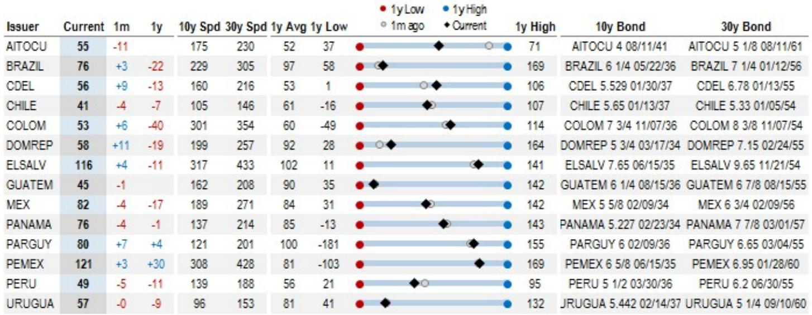
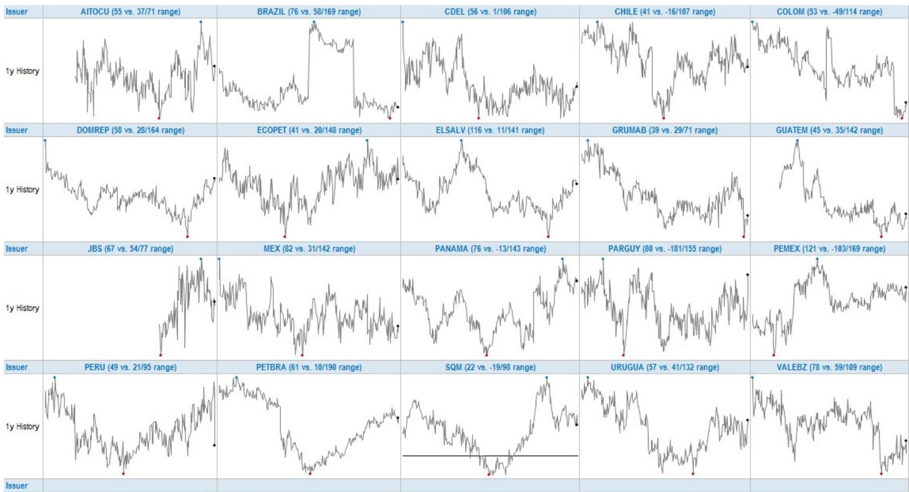
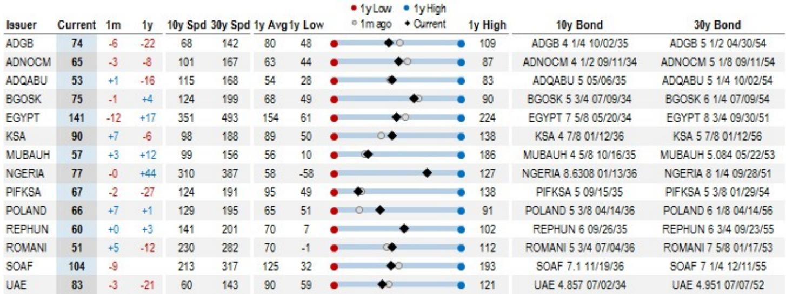

# The Real Signal in EM Curve Stability: Why Muted Flattening Masks a Critical Regime Shift

The most dangerous assumption in emerging market fixed income right now is that stability equals safety. Over the past month, the EM aggregate 10s30s spread curve has moved by only one basis point. The EMBIG curve tightened by a single basis point to 71 basis points. The CEMBI barely budged. Any reader scanning these aggregates would conclude that the EM curve environment is benign, that the UST selloff has been absorbed without disruption, and that the carry trade remains intact. That conclusion would be a strategic error.

The truth hidden beneath the aggregate calm is that the EM curve market has entered a regime of extreme dispersion, where the average masks a violent redistribution of risk across sovereigns, corporates, and regions. A global investment bank report covering the May month-end rebalance shows that the largest single-issuer steepening reached 11 basis points, while the largest flattening reached negative 26 basis points. That is not a stable market. That is a market where the index-level numbers have become strategically useless for anyone managing a real book.

The question that matters now is not whether EM curves are flattening or steepening on average. The question is whether your portfolio is positioned for the specific curve dynamics that are driving the next phase of spread compression or decompression. The report offers a rare window into this question, but only for those willing to look past the headline.

## The Aggregate Mask Hides a Three-Speed Curve Market That Demands Regional Decomposition

The EM aggregate 10s30s curve bull flattened by 1 basis point to 68 basis points. The EM IG sub-index flattened by 1 basis point to 61 basis points. The EMBIG Asia sub-index flattened by 7 basis points to 37 basis points. These numbers, taken together, suggest a market that is grinding tighter, albeit slowly. But the regional breakdown tells a fundamentally different story.

CEMBI Asia actually steepened by 3 basis points to 61 basis points, even as EMBIG Asia flattened sharply. This divergence is not noise. It signals that sovereign and corporate curve dynamics are decoupling within the same region. When sovereign curves flatten on strong local demand or improving fiscal narratives, but corporate curves steepen on supply or credit differentiation, the investor who treats Asia as a single beta trade is taking uncompensated cross-asset risk.

Meanwhile, CEMBI Latin America flattened by 1 basis point, but the report notes that the magnitude of bull flattening was more substantial in individual pairs within the region. The average move was mitigated by the exit of the flattest issuer from the index. This is a critical methodological insight: index rebalancing can distort the very signal that investors rely on for positioning. If a flattest issuer exits the index, the regional average appears less flat than the underlying market reality. The investor who does not adjust for composition effects is making decisions on distorted data.

The practical implication is straightforward. No single EM curve trade works across regions. The strategic portfolio must be decomposed into at least three distinct curve regimes: the Asia sovereign flattening trade, the Asia corporate steepening trade, and the Latin America idiosyncratic flattening trade, where composition effects are largest.

## The Largest Movers Reveal That Curve Dynamics Are Increasingly Driven by Idiosyncratic Risk Rather Than Common Factors

The report lists the largest steepeners and flatteners over the month. On the steepening side, the Dominican Republic added 11 basis points, CDEL added 9, and BABA, KSA, and PARGUY each added 7. On the flattening side, INDON collapsed by 26 basis points, GRUMAB by 13, and EGYPT, SQM, and AITOCU each by 11 to 12 basis points.

The range here is 37 basis points between the steepest and flattest mover. That is an enormous dispersion for a single month in what is ostensibly a single asset class. The critical insight is not that these moves occurred, but that they occurred without a corresponding shift in the UST curve or in aggregate EM spreads. The UST 10s30s curve bear flattened by 6 basis points. The EM aggregate 10-year spread tightened by 6 basis points. Neither of these common factors explains why INDON flattened by 26 basis points while DOMREP steepened by 11.

This means the explanatory power of global rates and aggregate credit spreads for EM curve positioning is declining. The investor who continues to treat EM curve trades as a function of UST curve positioning is missing the dominant driver: issuer-specific supply dynamics, index rebalancing, and local investor base shifts. The report confirms that EGYPT and INDON now reference a new 10-year or 30-year pair in the EMBI index. That is not a market view. That is a mechanical change that can dominate fundamental valuation for months.

## The Steepest and Flattest Curves Define the Opportunity Set for Relative Value Trades

The steepest curves in the EM universe are EGYPT at 141 basis points, PEMEX at 121, ELSALV at 116, SOAF at 104, and KSA at 90. The flattest curves are INDON at 9 basis points, SQM at 22, GRUMAB at 39, EXIMBK at 39, and ECOPET at 41.

A 132-basis-point range between the steepest and flattest curve is not typical. It defines a clear relative value opportunity set for the sophisticated investor. The question is whether steepness is a signal of compensation for risk or a signal of structural imbalance. EGYPT at 141 basis points is steep because the market discounts significant uncertainty in the long end. But INDON at 9 basis points is flat not because Indonesia is risk-free, but because the index rebalance has created a technical scarcity of the new 30-year benchmark.

The strategic implication is that curve steepness in EM is not a single-risk premium. It is a composite of credit risk, liquidity risk, index mechanics, and local demand. The investor who buys the steepest curve expecting mean reversion is buying a bundle of risks that may not converge. The investor who sells the flattest curve expecting normalization is fighting against index-driven demand that may persist for months.

The report provides the data to decompose these curves, but it does not provide a framework for deciding which steepness is cheap and which is a value trap. That decision requires a separate analysis of each issuer's funding plan, index weight trajectory, and local investor base depth.

## What the Report Does Not Fully Answer: The Interaction Between Index Rebalancing and Curve Dynamics

The report acknowledges that composition changes occurred at the May month-end rebalance. EGYPT and INDON now reference new 10-year or 30-year pairs in the EMBI index. BIMBOA exits the CEMBI index. These changes are noted, but the report does not quantify the impact of these changes on the observed curve moves.

This is a significant analytical gap. If INDON flattened by 26 basis points primarily because the index rebalance introduced a new 30-year bond with a lower spread, then the flattening is not a signal of improving credit quality. It is a mechanical artifact. The investor who extrapolates the flattening into a long INDON curve position is making a bet on index mechanics, not on fundamentals.

The same logic applies to EGYPT. The steepest curve in the EM universe just got a new reference pair. Does the new 30-year bond have a higher spread than the old one? If so, the steepness is real. If the new bond has a lower spread, the steepness may narrow mechanically as the index adjusts.

The report does not answer these questions. It provides the raw data and the observation that composition changes occurred. The implication is clear: the full report likely contains the detailed bond-level data needed to decompose these moves. The summary alone is insufficient for a strategic decision.

## A Decision Framework for Positioning in the Current EM Curve Regime

For the investor who wants to act on this data, a three-step decision framework emerges from the report's structure.

First, decompose the aggregate curve into its sovereign and corporate components by region. Do not use the EM aggregate as a proxy. The EMBIG Asia and CEMBI Asia curves moved in opposite directions. A single position in Asian credit curve exposure is not a hedge; it is a bet on which index dominates your portfolio.

Second, identify which curve moves are driven by index mechanics and which are driven by credit fundamentals. The report provides the list of steepest and flattest curves. Cross-reference that list with the list of issuers that had composition changes at the rebalance. If an issuer appears on both lists, the curve move is at least partially mechanical. Do not trade that move as a pure credit view.

Third, size positions based on the range of dispersion, not the level of the aggregate. The 37-basis-point range between the largest steepener and flattener is the relevant volatility metric for a relative value book. The 1-basis-point move in the aggregate is irrelevant. If your risk limits are calibrated to aggregate volatility, you are systematically under-allocating to the trades that offer the highest information ratio.

The report's scatter plots showing the relationship between 1-month changes in 10-year spreads and 1-month changes in 10s30s curves confirm that the correlation is weak at the issuer level. The investor who relies on a single-factor model to manage curve risk is missing the dominant source of alpha in this market.

## The Full Report Contains the Granular Data That Makes This Framework Actionable

The summary data in this report is valuable, but it is not sufficient for implementation. The bond-level data, the exact reference pair changes, and the historical decomposition of index composition effects are all contained in the full report. The charts that accompany this analysis show the precise scatter relationships between spread changes and curve changes for every issuer in the index. Without that data, the decision framework above remains theoretical.

The community that has access to the full report can run the decomposition themselves. They can identify which curve moves are real and which are mechanical. They can size positions based on the true dispersion of the market, not the misleading stability of the aggregate. They can ask the questions that the summary leaves open: Is INDON's 9-basis-point curve a structural floor or a temporary artifact? Is EGYPT's 141-basis-point curve a compensation for risk or a signal that the long end is mispriced?

These are not academic questions. They are the difference between a portfolio that captures the dispersion and a portfolio that is captured by it.

Join the community to read the full report and review the original charts.

*This article is for learning and discussion only and does not constitute investment advice.*

Personal reading notes and learning share only. Not investment advice.

